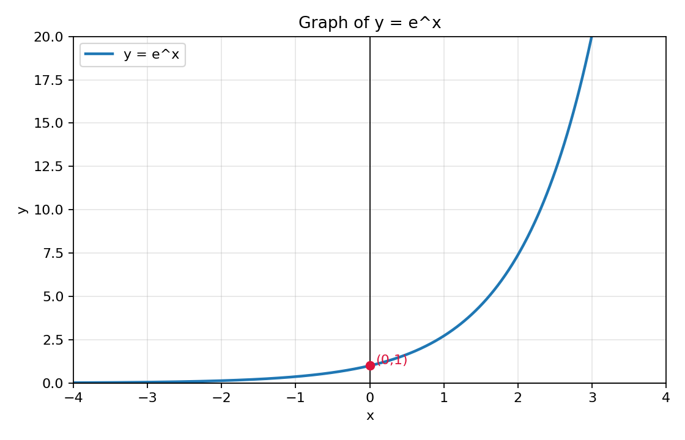
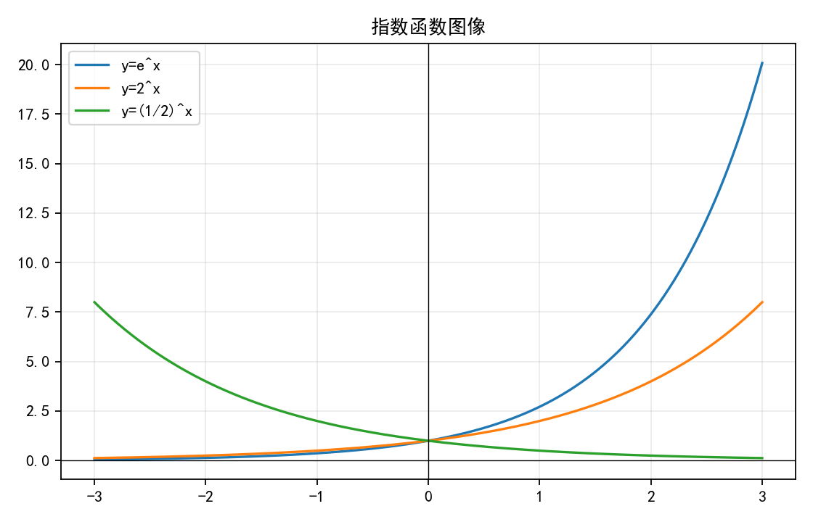
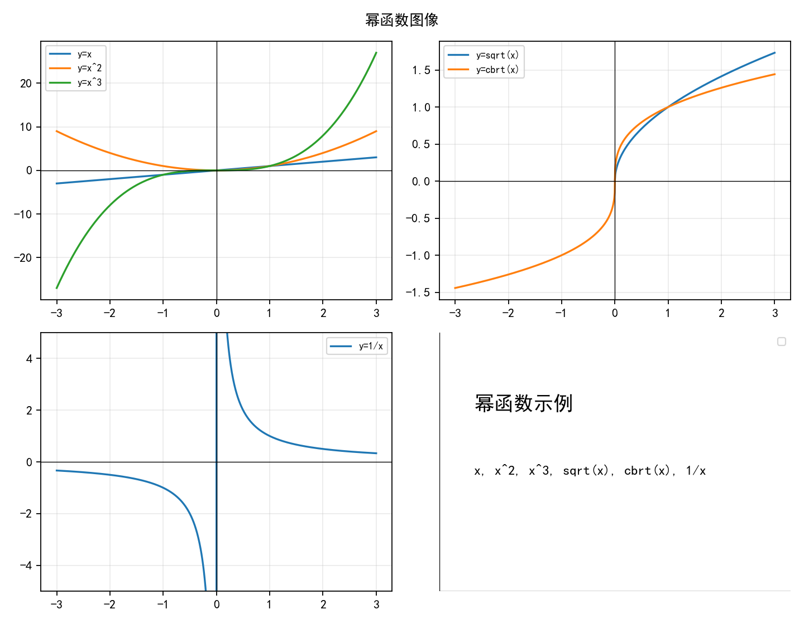
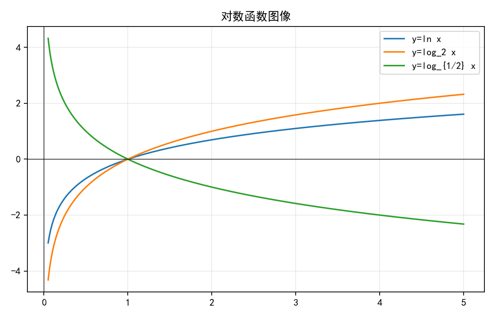
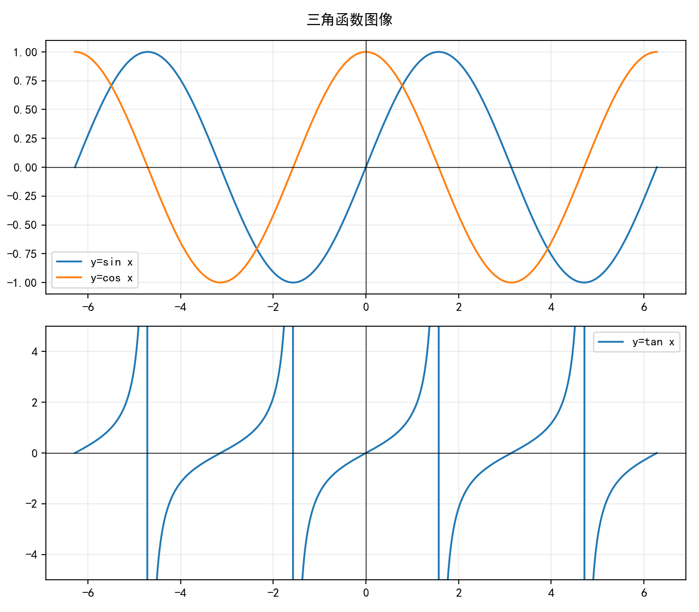
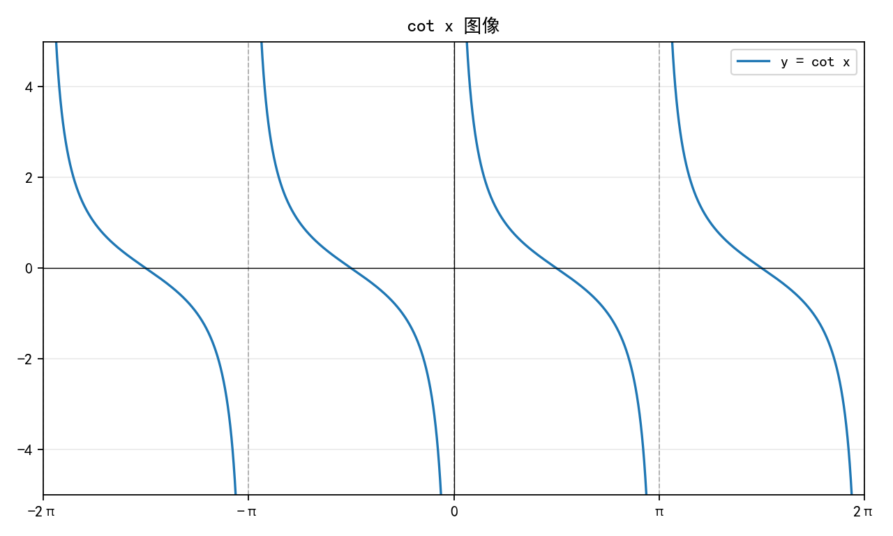
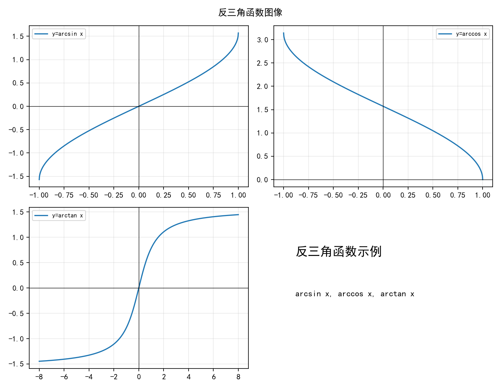

# 高数基础篇 第一章 第1节 函数笔记

## 符号函数

符号函数记作 `sgn x`，定义为：

```text
          -1, x < 0
sgn x =    0, x = 0
           1, x > 0
```

## 取整函数

设 `x` 为任意实数，不超过 `x` 的最大整数称为 `x` 的整数部分，记作 `[x]`。

函数 `y = [x]` 称为取整函数。

## 取整函数的基本不等式

`x - 1 < [x] ≤ x < [x] + 1`

## 复合函数定义域的标准套路

1. 先看外层函数限制
2. 再让内层表达式满足这个限制
3. 最后解不等式

## 复合函数的提醒

不是任何两个函数都可以复合。

## 求根公式

对于一元二次方程

```math
ax^2+bx+c=0 \quad (a\ne 0)
```

求根公式为

```math
x=\frac{-b\pm\sqrt{b^2-4ac}}{2a}
```

## 图像

### 指数函数图像





### 幂函数图像



### 对数函数图像



### 三角函数图像





### 反三角函数图像



## 奇偶性中的注解一

- 奇函数：\(\sin x\)、\(\tan x\)、\(\arcsin x\)、\(\arctan x\)、\(\ln \frac{1-x}{1+x}\)、\(\ln(x+\sqrt{1+x^2})\)、\(\frac{e^x-1}{e^x+1}\)、\(f(x)-f(-x)\)
- 偶函数：\(x^2\)、\(|x|\)、\(\cos x\)、\(f(x)+f(-x)\)

## 例题五

（1997，数二）设

```math
g(x)=
\begin{cases}
2-x, & x\le 0,\\
x+2, & x>0
\end{cases}
```

，

```math
f(x)=
\begin{cases}
x^2, & x<0,\\
-x, & x\ge 0
\end{cases}
```

，求

```math
g[f(x)]
```

当 \(x<0\) 时，

```math
f(x)=x^2>0
```

因此取 \(g\) 的第二段，

```math
g[f(x)]=x^2+2
```

当 \(x\ge 0\) 时，

```math
f(x)=-x\le 0
```

因此取 \(g\) 的第一段，

```math
g[f(x)]=2-(-x)=x+2
```

所以

```math
g[f(x)]=
\begin{cases}
x^2+2, & x<0,\\
x+2, & x\ge 0
\end{cases}
```
