{0}------------------------------------------------

# 第10章 专家系统

自 1968 年研制成功第一个专家系统 DENDRAL 以来,专家系统 (expert system)技术发展 非常迅速,已经应用到数学、物理、化学、医学、地质、气象、农业、法律、教育、交通运输、机械、艺 术以及计算机科学本身,甚至渗透到政治、经济、军事等重大决策部门,产生了巨大的社会效益 和经济效益,成为人工智能的重要分支。

下面首先介绍专家系统的产生与发展过程、基本概念,然后着重介绍专家系统的工作原 理和建立专家系统的方法。最后介绍几个著名的专家系统实例。这几个专家系统已经成为 当前开发专家系统的骨架系统,具有很广泛的应用。

#### 专家系统的产生和发展 10.1

专家系统的第一个里程碑是斯坦福大学费根鲍姆等人和化学家勤德贝格 合作,于1968年研制成功的分析化合物分子结构的专家系统——DENDRAL系 统。此后,相继建立了各种不同功能、不同类型的专家系统。MYCSYMA 系统 是由麻省理工学院(MIT)于1971年开发成功并投入应用的专家系统,用LISP 语言实现对特定领域的数学问题进行有效的处理,包括微积分运算、微分方程 求解等。DENDRAL 和 MYCSYMA 系统是专家系统发展的第一阶段。这个时

专家系统的产生和 发展讲课视频▲

期专家系统的特点是高度的专业化,专门问题求解能力强,但结构、功能不完整,移植性差,缺乏 解释功能。

20世纪70年代中期,专家系统进入了第二阶段——技术成熟期,出现了一批成功的专家系 统。具有代表性的专家系统是 MYCIN、PROSPECTOR、AM、CASNET 等系统。 MYCIN 系统是美 国斯坦福大学费根鲍姆等人研制的用于细菌感染性疾病的诊断和治疗的专家系统,能成功地对 细菌性疾病作出专家水平的诊断和治疗。它是第一个结构较完整、功能较全面的专家系统。它 第一次使用了知识库的概念,引入了可信度的方法进行不精确推理,能够给出推理过程的解释, 用英语与用户进行交互。MYCIN 系统对形成专家系统的基本概念、基本结构起了重要的作用。 PROSPECTOR 系统是由美国斯坦福研究所开发的一个探矿专家系统。由于它首次实地分析华 盛顿某山区一带的地质资料,发现了一个钼矿,成为第一个取得显著经济效益的专家系统。 CASNET 是一个与 MYCIN 几乎同时开发的专家系统,由拉特格尔(Rutger)大学开发,用于青光 眼诊断与治疗。AM 系统是由斯坦福大学于 1981 年研制成功的专家系统。它能模拟人类进行 概括、抽象和归纳推理,发现某些数论的概念和定理。

第二阶段的专家系统的特点是:

{1}------------------------------------------------

- ① 单学科专业型专家系统。
- ② 系统结构完整,功能较全面,移植性好。
- ③ 具有推理解释功能,透明性好。
- ④ 采用启发式推理、不精确推理。
- ⑤ 用产生式规则、框架、语义网络表达知识。
- ⑥ 用限定性英语进行人-机交互。

20世纪80年代以来,专家系统的研制和开发明显地趋向于商业化,直接服务于生产企业,产生了明显的经济效益。例如1980年DEC公司与卡内基-梅隆大学合作开发了专家系统XCON,用于为VAX计算机系统制订硬件配置方案,节约资金近1亿美元。另一个重要发展是出现专家系统开发工具,从而简化了专家系统的构造。如骨架系统EMYCIN、KAS、EXPERT,通用知识工程语言OPS5、RLL,模块式专家系统工具AGE等。

苹果公司开发的语音识别接口专家系统 Siri(speech interpretation & recognition interface),目前广泛应用于 iPhone iPad 及 iMac 等苹果系列产品中。

但一些复杂的专家系统开发仍然存在许多问题,例如:2013年,IBM与世界顶级肿瘤治疗与研究机构——MD安德森癌症中心合作开发的癌症诊断与治疗的专家系统Watson,用于辅助医生开展抗癌药物的临床测试。在IBM和MD安德森癌症中心这两大机构合作之初,福布斯杂志发表了题为《在MD安德森癌症中心,IBMWatson解决了临床测试难题》的社论,对Watson寄予厚望。在当时看来,一扇新的大门正被人类打开,而支撑这一切的,正是AI与现代医疗技术的无缝结合。然而,4年之后的2017年7月,福布斯杂志同样发表了一篇关于Watson的文章,但标题则是《Watson是不是一个笑话?》,这表明Watson近几年进展缓慢、难以大用。Watson系统面临的窘境,其实也是整个专家系统现状的缩影。造成专家系统发展乏力的因素有很多,主要原因在于,专家数据匮乏而昂贵,也就是知识获取成了问题。

目前,专家系统研制的目的不是研制 AI 专家代替人类专家,而是研制人类专家的 AI 助手。

# 10.2 专家系统的概念

## 10.2.1 专家系统的定义

专家系统是基于知识的系统,用于在某种特定的领域中运用领域专家多年积累的经验和专业知识,求解需要专家才能解决的困难问题。专家系统作为一种计算机系统,继承了计算机快速、准确的特点,在某些方面比人类专家更可靠、更灵活,可以

不受时间、地域及人为因素的影响。

专家系統的概念 讲课视频▲

专家系统的奠基人斯坦福大学的费根鲍姆(E.A.Feigenbaum)教授,把专家系统定义为:"专家系统是一种智能的计算机程序,它运用知识和推理来解决只有专家才能解决的复杂问题。"也就是说,专家系统是一种模拟专家决策

{2}------------------------------------------------

能力的计算机系统。

# 10.2.2 专家系统的特点

专家系统具有如下特点。

#### 1. 具有专家水平的专业知识

具有专家专业水平是专家系统的最大特点。专家系统具有的知识越丰富,质量越高,解决问题的能力就越强。

专家系统中的知识按其在问题求解中的作用可分为三个层次,即数据级、知识库级和控制级。数据级知识是指具体问题所提供的初始事实及在问题求解过程中所产生的中间结论、最终结论。数据级知识通常存放于数据库中。知识库知识是指专家的知识。这一类知识是构成专家系统的基础。控制级知识也称为元知识,是关于如何运用前两种知识的知识,如在问题求解中的搜索策略、推理方法等。

#### 2. 能进行有效的推理

专家系统的核心是知识库和推理机。专家系统要利用专家知识来求解领域内的具体问题,必须有一个推理机构,能根据用户提供的已知事实,通过运用知识库中的知识,进行有效的推理,以实现问题的求解。专家系统不仅能根据确定性知识进行推理,而且能根据不确定的知识进行推理。领域专家解决问题的方法大多是经验性的,表示出来往往是不精确的,仅以一定的可能性存在。此外,要解决的问题本身所提供的信息往往是不确定的。专家系统的特点之一就是能综合利用这些不确定的信息和知识进行推理,得出结论。

#### 3. 具有启发性

专家系统除能利用大量专业知识以外,还必须利用经验的判断知识来对求解的问题作出多个假设。依据某些条件选定一个假设,使推理继续进行。

### 4. 具有灵活性

专家系统的知识库与推理机既相互联系,又相互独立。相互联系保证了推理机利用知识库中的知识进行推理以实现对问题的求解;相互独立保证了当知识库作适当修改和更新时,只要推理方式没变,推理机部分可以不变,使系统易于扩充,具有较大的灵活性。

## 5. 具有透明性

在使用专家系统求解问题时,不仅希望得到正确的答案,而且还希望知道得到该答案的依据。专家系统一般都有解释机构(explanation facility),具有较好的透明性。解释机构可以向用户解释推理过程,回答用户"为什么(Why)""结论是如何得出的(How)"等问题。

### 6. 具有交互性

专家系统一般都是交互式系统,具有较好的人机界面。一方面它需要与领域专家和知识工程师进行对话以获取知识,另一方面它也需要不断地从用户那里获得所需的已知事实并回答用户的询问。

专家系统本身是一个程序,但它与传统程序又不同,主要体现在以下几个方面:

{3}------------------------------------------------

① 从编程思想来看,传统程序是依据某个确定的算法和数据结构来求解某个确定的问题, 而专家系统求解的许多问题没有可用的数学方法,而是依据知识和推理来求解,即

# 传统程序=数据结构+算法 专家系统=知识+推理

这是专家系统与传统程序的最大区别。

- ② 传统程序把关于问题求解的知识隐含于程序中,而专家系统则将知识与运用知识的过程即推理机分离。这种分离使专家系统具有更大的灵活性,便于修改。
- ③ 从处理对象来看,传统程序主要是面向数值计算和数据处理,而专家系统面向符号处理。传统程序处理的数据是精确的,对程序的检索是基于模式的布尔匹配,而专家系统处理的数据和知识大多是不精确的、模糊的,知识的模式匹配也多是不精确的。
- ④ 传统程序一般不具有解释功能,而专家系统一般具有解释机构,解释自己的行为。因为 专家系统依赖于推理,它必须能够解释这个过程。解释器是专家系统特有的模块,也是与一般的 计算机软件系统的区别之一。
- ⑤ 传统程序根据算法求解问题,每次都能产生正确的答案,而专家系统则像人类专家那样工作,一般能产生正确的答案,但有时也会产生错误的答案,这也是专家系统存在的问题之一。但专家系统有能力从错误中吸取教训,改进对某一问题的求解能力。

2016年3月在韩国举行的谷歌 AlphaGo 对决世界围棋冠军李世石的比赛中, AlphaGo 连赢 3局。在13日的第4局比赛的78手之前,全世界的人都认为 AlphaGo 必赢。但此后 AlphaG 犯了一个连小学生都不应该犯的错误,导致了第4局比赛的失败。其实,这正是专家系统有时会产生错误答案的特点。

⑥ 从系统的体系结构来看,传统程序与专家系统具有不同的结构。关于专家系统的结构在 后面将作专门的介绍。

## 10.2.3 专家系统的类型

若按专家系统的特性及功能分类,专家系统可分为10类,如表10.1所示。

| 专家系统类型 | 解决的问题           |
|--------|-----------------|
| 解释     | 根据感知数据推理情况描述    |
| 诊 断    | 根据观察结果推理系统是否有保障 |
| 预 测    | 指导给定情况可能产生的后果   |
| 设计     | 根据给定的要求进行相应的设计  |
| 规 划    | 设计动作            |
| 控制     | 控制整个系统的行为       |

表 10.1 专家系统类型

{4}------------------------------------------------

续表

| 专家系统类型 | 解决的问题          |
|--------|----------------|
| 监督     | 比较观察结果和期望结果    |
| 修理     | 执行计划来实现规定的补救措施 |
| 教 学    | 诊断、调整、修改学生行为   |
| 调 试    | 建议故障的补救措施      |

#### 1. 解释型专家系统

解释型专家系统能根据感知数据,经过分析、推理,从而给出相应解释。如化学结构说明、图像分析、语言理解、信号解释、地质解释、医疗解释等专家系统。代表性的解释型专家系统有 DENDRAL, PROSPECTOR等。

#### 2. 诊断型专家系统

诊断型专家系统能根据取得的现象、数据或事实推断出系统是否有故障,并能找出产生故障的原因,给出排除故障的方案。这是目前开发、应用得最多的一类专家系统。如医疗诊断、机械故障诊断、计算机故障诊断等专家系统。代表性的诊断专家系统有 MYCIN, CASNET, PUFF(肺功能诊断系统), PIP(肾脏病诊断系统), DART(计算机硬件故障诊断系统)等。

#### 3. 预测型专家系统

预测型专家系统能根据过去和现在的信息(数据和经验)推断可能发生和出现的情况。例如用于天气预报、地震预报、市场预测、人口预测、灾难预测等领域的专家系统。

#### 4. 设计型专家系统

设计型专家系统能根据给定要求进行相应的设计。例如用于工程设计、电路设计、建筑及装修设计、服装设计、机械设计及图案设计的专家系统。对这类系统一般要求在给定的限制条件下能给出最佳的或较佳的设计方案。代表性的设计型专家系统有 XCON(计算机系统配置系统)、KBVLSI(VLSI 电路设计专家系统)等。

#### 5. 规划型专家系统

规划型专家系统能按给定目标拟定总体规划、行动计划、运筹优化等,适用于机器人动作控制、工程规划、军事规划、城市规划、生产规划等。这类系统一般要求在一定的约束条件下能以较小的代价达到给定的目标。代表性的规划型专家系统有NOAH(机器人规划系统)、SECS(制定有机合成规划的专家系统)、TATR(帮助空军制定攻击敌方机场计划的专家系统)等。

### 6. 控制型专家系统

控制型专家系统能根据具体情况,控制整个系统的行为,适用于对各种大型设备及系统进行控制。为了实现对控制对象的实时控制,控制型专家系统必须具有能直接接收来自控制对象的信息,并能迅速地进行处理,及时地作出判断和采取相应行动的能力。所以控制型专家系统实际上是专家系统技术与实时控制技术相结合的产物。代表性的控制型专家系统是 YES/MVS(帮助监控

{5}------------------------------------------------

和控制 MVS 操作系统的专家系统)。

#### 7. 监督型专家系统

监督型专家系统能完成实时的监控任务,并根据监测到的现象做出相应的分析和处理。这类系统必须能随时收集任何有意义的信息,并能快速地对得到的信号进行鉴别、分析和处理。一旦发现异常,能尽快地做出反应,如发出报警信号等。代表性的监督型专家系统是 REACTOR (帮助操作人员检测和处理核反应堆事故的专家系统)。

#### 8. 修理型专家系统

修理型专家系统是用于制订排除某类故障的规划并实施排除的一类专家系统,要求能根据 故障的特点制订纠错方案,并能实施该方案排除故障;当制订的方案失效或部分失效时,能及时 采取相应的补救措施。

#### 9. 教学型专家系统

教学型专家系统主要适用于辅助教学,并能根据学生在学习过程中所产生的问题进行分析、评价、找出错误原因,有针对性地确定教学内容或采取其他有效的教学手段。代表性的教学型专家系统有 GUIDON(讲授有关细菌传染性疾病方面的医学知识的计算机辅助教学系统)。

#### 10. 调试型专家系统

调试型专家系统用于对系统进行调试,能根据相应的标准检测被检测对象存在的错误,并能 从多种纠错方案中选出适用于当前情况的最佳方案,排除错误。

表 10.1 是根据专家系统的特性及功能对专家系统进行分类的。这种分类往往不是很确切,因为许多专家系统不止一种功能。还可以从另外的角度对专家系统进行分类。例如,可以根据专家系统的应用领域进行分类。

# 10.2.4 专家系统的应用

当前专家系统主要的应用领域有:医学、计算机系统、电子学、工程、地质学、军事科学、过程 控制等。表 10.2 按应用领域列出了专家系统的典型应用。

| 领域 | 系统        | 功能           |
|----|-----------|--------------|
|    | MYCIN     | 细菌感染性疾病诊断和治疗 |
|    | CASNET    | 青光眼的诊断和治疗    |
|    | PIP       | 肾脏病诊断        |
| 医学 | INTERNIST | 内科病诊断        |
|    | PUFF      | 肺功能试验结果解释    |
|    | ONCOCIN   | 癌症化学治疗咨询     |
|    | VM        | 人工肺心机监控      |

表 10.2 典型领域的专家系统

{6}------------------------------------------------

续表

| 领域        | 系统               | 功能                                    |
|-----------|------------------|---------------------------------------|
| 地质学       | PROSPECTOR       | 帮助地质学家评估某一地区的矿物储量                     |
|           | DIPMETER ADVISOR | 油井记录分析                                |
|           | DRILLING ADVISOR | 诊断和处理石油钻井设备的"钻头粘着"问题                  |
|           | MUD              | 诊断和处理同钻探泥浆有关的问题                       |
|           | HYDRO            | 水源总量咨询                                |
|           | ELAS             | 油井记录解释                                |
|           | DART             | 计算机硬件系统故障诊断                           |
| F V 99-5  | RI/XCON          | 配置 VAX 计算机                            |
| 计算机       | YES/MVS          | 监控和控制 MVS 操作系统                        |
| 系统        | PTRANS           | 管理 DEC 计算机系统的建造和配置                    |
| п         | IDT              | 定位 PDP 计算机中有缺陷的单元                     |
|           | DENDRAL          | 担促氏液粉提束状体化入物的八子社构                     |
|           | MOLGEN           | 根据质谱数据来推断化合物的分子结构                     |
| 化学        | CRYSALIS         | DNA 分子结构分析和合成 通过电子云密度图推断一个蛋白质的三维结构 |
| 化子        |                  | 帮助化学家制订有机合成规划                         |
|           | SECS             | 帮助科学家设计复杂的分子生物学的实验                    |
|           | SPEX             | 市场有于永庆年夏东南方工业于山大强                     |
| 数学        | MACSYMA          | 数学问题求解                                |
|           | AM               | 从基本的数学和集合论中发现概念                       |
| 工程        | SACON            | 帮助工程师发现结构分析问题的分析策略                    |
|           | DELTA            | 帮助识别和排除机车故障                           |
|           | REACTOR          | 帮助操作人员检测和处理核反应堆事故                     |
|           |                  |                                       |
|           | AIRPLAN          | 用于航空母舰周围的空中交通运输计划的安排                  |
| tion CITY |                  | 海洋声呐信号识别和舰艇跟踪                         |
| 军事        | HASP             | 帮助空军制订攻击敌方机场的计划                       |
|           | TATR             | 通过解释雷达图像进行舰船分类                        |
|           | RTC              |                                       |
|           |                  |                                       |

{7}------------------------------------------------

# 10.3 专家系统的工作原理

### 10.3.1 专家系统的一般结构

由专家系统的定义可知,专家系统的主要组成部分是知识库和推理机。实际专家系统的功能和结构可能彼此有些差异,但完整的专家系统一般应包括人机接口、推理机、知识库、动态数据库、知识获取机构和解释机构六部分。各部分的关系如图 10.1 所示。

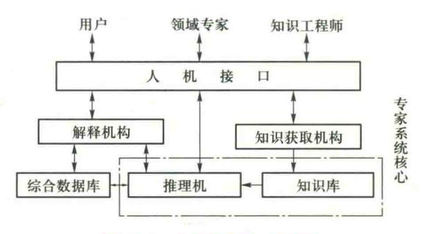

图 10.1 专家系统的一般结构

专家系统的核心是知识库和推理机,其工作过程是根据知识库中的知识和用户提供的事实进行推理,不断地由已知的事实推出未知的结论即中间结果,并将中间结果放到数据库中,作为已知的新事实进行推理,从而把求解的问题由未知状态转换为已知状态。在专家系统的运行过程中,会不断地通过人机接口与用户进行交互,向用户提问,并向用户作出解释。

下面分别对专家系统的各个部分进行简单介绍。

# 10.3.2 知识库

知识库(knowledge base)主要用来存放领域专家提供的专门知识。知识库中的知识来源于知识获取机构,同时它又为推理机提供求解问题所需的知识。

### 1. 知识表达方法的选择

要建立知识库,首先要选择合适的知识表达方法。对同一知识,一般都可以用多种方法进行表示,但其效果却不同。应根据 2.1.4 节介绍的原则选择知识表达方法,即从能充分表示领域知识、能充分有效地进行推理、便于对知识的组织维护和管理、便于理解与实现等四个方面进行考虑。本书介绍了一阶谓词逻辑、产生式、框架、语义网络、状态空间、模糊逻辑、神经网络、遗传编码等知识表示方法。

### 2. 知识库的管理

知识库管理系统负责对知识库中的知识进行组织、检索、维护等。专家系统中任何其他部分要与知识库发生联系,都必须通过该管理系统来完成。这样可实现对知识库的统一管理和使用。

{8}------------------------------------------------

在进行知识库维护时,还要保证知识库的安全性。必须建立严格的安全保护措施,以防止由于操作失误等主观原因使知识库遭到破坏,造成严重的后果。一般知识库的安全保护也可以像数据库系统那样,通过设置口令验证操作者的身份,对不同操作者设置不同的操作权限等技术来实现。

### 10.3.3 推理机

推理机(reasoning machine)的功能是模拟领域专家的思维过程,控制并执行对问题的求解。它能根据当前已知的事实,利用知识库中的知识,按一定的推理方法和控制策略进行推理,直到得出相应的结论为止。

推理机包括推理方法和控制策略两部分。推理方法有确定性推理和不确定性推理。控制策略主要指推理方法的控制及推理规则的选择策略。推理包括正向推理、反向推理和正反向混合推理。推理策略一般还与搜索策略有关。本书第3章和第4章分别介绍了基本的确定性推理方法和不确定性推理方法。

推理机的性能与构造一般与知识的表示方法有关,但与知识的内容无关,这有利于保证推理 机与知识库的独立性,提高专家系统的灵活性。

### 10.3.4 综合数据库

综合数据库(global database)或动态数据库,又称为黑板,主要用于存放初始事实、问题描述及系统运行过程中得到的中间结果、最终结果等信息。

在开始求解问题时,综合数据库中存放的是用户提供的初始事实。综合数据库的内容随着推理的进行而变化,推理机根据综合数据库的内容从知识库中选择合适的知识进行推理并将得到的中间结果存放于综合数据库中。综合数据库中记录了推理过程中的各种有关信息,又为解释机构提供了回答用户咨询的依据。

综合数据库中还必须具有相应的数据库管理系统,负责对数据库中的知识进行检索、维护等。

从计算机技术角度,知识库和综合数据库都是数据库。它们所不同的是:知识库的内容在专家系统运行过程中是不改变的,只有知识工程师通过人机接口进行管理。而综合数据库在专家系统运行过程中是动态变化的,不仅可以由用户输入数据,而且推理的中间结果也会改变其内容。

# 10.3.5 知识获取机构

知识获取(knowledge acquisition)是建造和设计专家系统的关键,也是目前建造专家系统的"瓶颈"。知识获取的基本任务是为专家系统获取知识,建立起健全、完善、有效的知识库,以满足求解领域问题的需要。

知识获取通常是由知识工程师与专家系统中的知识获取机构共同完成的。知识工程师负责从领域专家那里抽取知识,并用适用的方法把知识表达出来,而知识获取机构把知识转换为计算机可

{9}------------------------------------------------

存储的内部形式,然后把它们存入知识库。在存储过程中,要对知识进行一致性、完整性的检测。

不同专家系统的知识获取的功能与实现方法差别较大,有的系统则采用自动获取知识的方法,而有的系统则采用非自动或半自动的知识获取方法。

### 10.3.6 人机接口

人机接口(interface)是专家系统与领域专家、知识工程师、一般用户之间进行交互的界面,由一组程序及相应的硬件组成,用于完成输入输出工作。知识获取机构通过人机接口与领域专家及知识工程师进行交互,更新、完善、扩充知识库;推理机通过人机接口与用户交互,在推理过程中,专家系统根据需要不断向用户提问,以得到相应的事实数据,在推理结束时会通过人机接口向用户显示结果;解释机构通过人机接口与用户交互,向用户解释推理过程,回答用户问题。

在输入或输出过程中,人机接口需要内部表示形式与外部表示形式的转换。在输入时,它将把领域专家、知识工程师或一般用户输入的信息转换成系统的内部表示形式,然后分别交给相应的机构去处理;输出时,它将把系统要输出的信息由内部形式转化为人们易于理解的外部形式显示给用户。

在不同的专家系统中,由于硬件、软件环境不同,接口的形式与功能有较大的差别。随着计算机硬件和自然语言理解技术的发展,有的专家系统已经可以用简单的自然语言与用户交互,但有的系统只能通过菜单方式、命令方式或简单的问答方式与用户交互。

### 10.3.7 解释机构

解释机构(explanator)回答用户提出的问题,解释系统的推理过程。解释机构由一组程序组成。它跟踪并记录推理过程,当用户提出的询问需要给出解释时,它将根据问题的要求分别作相应的处理,最后把解答用约定的形式通过人机接口输出给用户。

上面讨论的专家系统的一般结构只是专家系统的基本形式。实际上,在具体建造一个专家系统时,随着系统要求的不同,可以在此基础上做适当修改。

# 10.4 知识获取的主要过程与模式

## 10.4.1 知识获取的过程

知识获取主要是把用于问题求解的专门知识从某些知识源中提炼出来,并转化为计算机内表示形式存入知识库。知识源包括专家、书本、相关数据库、实例研究和个人经验等。目前专家系统的知识源主要是领域专家,所以知识获取过程需要知识工程师与领域专家反复交流、共同合作完成,如图 10.2 所示。

知识获取的基本任务是为专家系统获取知识,建立起健全、完善、有效的知识库,以满足求解领域问题的需要。因此,它需要做以下几项工作。

{10}------------------------------------------------

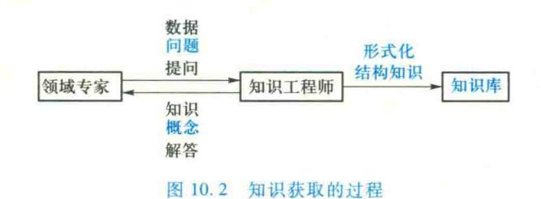

### 1. 抽取知识

所谓抽取知识是把蕴含于知识源中的知识经识别、理解、筛选、归纳等抽取出来,以便用于建立知识库。

知识主要来源是领域专家及相关的专业技术文献,但知识并不都是以某种现成的形式存在于这些知识源中供选择的。领域专家虽然可以处理领域内的各种困难问题,但往往缺少总结,不一定能有条理地说出处理问题的道理和原则;领域专家可以列举大量处理过的实例,但不一定能建立起相互之间的联系,有时甚至是靠直觉或灵感解决问题。而且,领域专家一般都不熟悉专家系统的有关技术。这些都为知识的获取带来了困难。为了从领域专家处得到有用的知识,需要反复多次地与专家交谈,并有目的地引导交谈的内容,然后通过分析、综合、去粗取精,归纳出可供建立知识库的知识。

知识的另一来源是专家系统自身的运行实践。这就需要从实践中学习,总结出新的知识。一般来说,一个专家系统初步建立后,通过运行会发现知识不够健全,需要补充新的知识。此时除了请领域专家提供进一步的知识外,还可由专家系统根据运行经验从已有的知识或实例中演绎、归纳出新的知识,补充到知识库中去。这时专家系统就具有自我学习的能力。

#### 2. 知识的转换

所谓知识的转换是指把知识由一种形式变换为另一种表示形式。

人类专家或科技文献中的知识通常是用自然语言、图形、表格等形式表示的,而知识库中的知识是用计算机能够识别、运用的形式表示的。两者有较大的差距,所以必须将专家抽取的知识转换成适合知识库存放的知识。知识转换一般分为两步进行:第一步是把从专家及文献资料处抽取的知识转换为某种知识表示模式,如产生式规则、框架等;第二步是把该模式表示的知识转换为系统可直接利用的内部形式。前一步通常由知识工程师完成,后一步一般通过输入及编译实现。

### 3. 知识的输入

把某模式表示的知识经编辑、编译送人知识库的过程称为知识的输入。

目前,知识的输入一般是通过两种途径实现的:一种是利用计算机系统提供的编译软件;另一种是用专门编制的知识编辑系统,称为知识编辑器。

#### 4. 知识的检测

知识库的建立是通过知识抽取、转换、输入等环节实现的。这一过程中的任何环节上的失误都会造成知识的错误,直接影响到专家系统的性能。知识的检测是发现并纠正知识库中

{11}------------------------------------------------

的知识可能存在的不一致、不完整的问题,并采取相应的修正措施。

### 10.4.2 知识获取的模式

按知识获取的自动化程度划分,知识获取主要有非自动、自动和半自动三种获取模式。

### 1. 非自动知识获取(人工移植)

非自动知识获取也称为人工移植。在这种方式中,知识获取分两步进行,首先由知识工程师从领域专家或有关的技术文献那里获取知识,然后再由知识工程师用某种知识编辑软件输入到知识库中。其工作方式如图 10.3 所示。

图 10.3 非自动化知识获取

非自动方式是专家系统建造中用得较为普遍的一种知识获取模式。在非自动获取模式中, 知识工程师起着关键的作用。其主要任务是:

- ① 与领域专家进行交谈,阅读有关的文献,获取专家系统所需要的原始知识。
- ②对已获得的原始知识进行分析、归纳、整理,形成用自然语言描述的知识条款,然后返回给领域专家检查。
  - ③ 把确定的知识条款用知识表示方法表示出来,用知识编辑器进行编辑输入。

知识编辑器是一种用于知识输入的软件,通常是在建造专家系统时根据实际需要编制的。 一般来说,知识编辑器应具有如下主要功能:

- ① 把用某种模式或语言表示的知识转换成计算机可表示的内部形式并输入到知识库中。
- ② 检测输入知识库中的知识的语法错误。
- ③ 检测知识的一致性,报告产生错误的原因,以便进行改正。

### 2. 自动知识获取

所谓自动知识获取是指系统具有获取知识的能力。它不仅可以直接与领域专家对话,从专家提供的原始信息中学习到专家系统所需的知识,而且还能从系统自身的运行实践中总结、规划出新的知识,发现知识中可能存在的错误,不断自我完善,建立起性能优良、知识完善的知识库。为达到这一目的,它至少应具备以下能力:

(1) 具有识别语言、文字、图像的能力

专家系统中知识主要来源于领域专家以及有关的科技文献资料、图像等。为了实现知识的自动获取,就必须使系统能与领域专家直接对话,能阅读有关的科技资料。这就要求系统应具有识别语言、文字和图像的能力。

(2) 具有理解、分析、归纳的能力

领域专家提供的知识通常是处理具体问题的实例,不能直接用于知识库。为了将它变为

{12}------------------------------------------------

知识库中的知识,必须在理解的基础上进行分析、归纳、提炼、综合,从中抽取出专家系统的所需的知识并放入知识库中。在非自动知识获取中,这一工作是由知识工程师完成的,而在自动知识获取中,是由系统取代知识工程师完成的。

### (3) 具有从运行实践中学习的能力

在知识库初步建成投入使用后,随着应用向纵深发展,知识库的不完善性就会逐渐暴露出来。此时知识的自动获取系统应不断地总结经验教训,从运行实践中学习,产生新的知识,纠正可能存在的错误,不断进行知识库的自我完善。

总之,在自动知识获取系统中,原来需要知识工程师做的都由系统取代了,并且还要做更好的工作。自动获取知识的过程如图 10.4 所示。

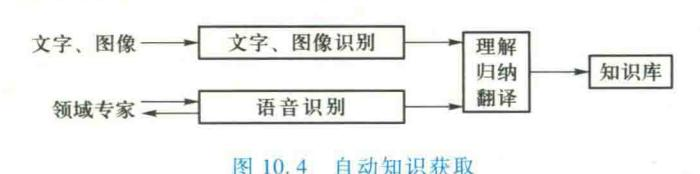

## 3. 半自动知识的获取

自动知识获取是一种理想的知识获取方式,涉及人工智能的多个领域,尚处在研究阶段,例如模式识别、自然语言理解、机器学习等,对硬件亦有较高的要求。这几年在自然语言理解、机器学习方面的研究已取得了较大的进展,在人工神经网络的研究中已提出了多种学习算法。这些都为知识的获取提供了有利条件。因此,在建造知识获取系统时,应充分利用这些成果,逐渐向知识的自动获取过渡,提高其智能程度。事实上,在近些年建造的专家系统中,不同程度地做了这方面的尝试与探讨。在非自动知识获取的基础上增加了部分学习功能,使系统能从大量事例中归纳出某些知识。由于这样的系统不同于纯粹的非自动知识获取,但又没有达到完全自动知识获取的程度,因而称之为半自动知识获取。

# 10.5 专家系统的建立

专家系统是人工智能中一个正在发展着的研究领域,虽然目前已建立了许多专家系统,但是尚未形成建立专家系统的一般方法。下面简单介绍专家系统的一般建立过程。

# 10.5.1 适合于专家系统求解的问题

专家系统的建立

不是所有问题都是可以用专家系统求解的。在建立专家系统之前,必须进 讲课视频▲ 行可行性分析,以确定某问题是否适合用专家系统求解,而不是用传统的程序求解。威特曼 (Waterman)曾从三个方面研究了如何选择适合专家系统开发的问题,即什么情况下开发专家系统是可能的? 什么情况下开发专家系统是合理的? 什么情况下开发专家系统是合适的? 只有在 

{13}------------------------------------------------

专家系统开发是可能的、合理的并且合适的时候,才考虑开发求解这个问题的专家系统。

#### 1. 什么情况下开发专家系统是可能的?

只有当满足以下基本条件时,开发专家系统才是可能的。

- ① 问题的求解主要依靠经验性知识,而不需要运用大量常识性知识。
- ② 存在真正的领域专家。这也是开发专家系统最重要的条件之一。如果没有丰富的知识源提供强大的知识,是不能开发真正实用的专家系统的。
  - ③ 任务不太难,有明确的开发目标,且任务能被很好地理解。

#### 2. 什么情况下开发专家系统是合理的?

对于一个具体问题,如果具备了开发专家系统的基本条件,是否采用专家系统技术来开发,还要探讨开发专家系统的合理性。一般来说,当满足以下条件时,就认为开发专家系统是合理的。

- ① 问题的求解能带来较高的经济效益,而且问题适宜用专家系统来求解,则开发专家系统十分必要。
- ② 人类专家奇缺,但在许多地方又十分需要。如果用专家系统求解,就可以解决这个矛盾。这类专家系统是一种便宜、有效的处理问题的工具。
- ③ 人类专家经验不断丢失。当由于某种原因如专家人事变动、退休或出国时,会导致某些有价值的专业知识不断流失,专家系统可以将这一问题的严重性减到最小限度。
- ④ 危险场合需要专业知识。在某些不友好或危险的环境中需要专家时,如果人类专家 不能亲临现场做出决策,或者太危险,用专家系统就可以解决这个问题。

## 3. 什么情况下开发专家系统是合适的?

确定开发专家系统是否合适,主要看问题的本质、问题的复杂性以及问题的范围。当某问题 具有如下特征时,适宜用专家系统求解。

- ① 本质。问题本质上必须能很自然地通过符号操作和符号结构进行求解,且问题求解时需要使用启发式知识、经验规则才能得到答案,而不是简单地通过算法就能求解问题。
- ② 复杂性。问题具有一定的复杂性,而且很重要。新手在该领域中需要花费几年时间进行学习和实践才能达到专家水平。
- ③ 范围。选择专家系统求解问题的适当范围是建立专家系统的关键。一般有两个原则:一 是所选任务的大小可驾驭;二是任务有实用价值。

# 10.5.2 专家系统的设计原则与开发步骤

### 1. 专家系统的设计原则

考虑到专家系统的特点,在专家系统设计中应注意以下的原则。

## (1) 专门的任务

专家系统适用于专家知识和经验行之有效的场合,所以,在设计专家系统时,应恰当地划定 求解问题的领域。一般问题领域不能太窄,否则系统求解问题的能力较弱;但也不能太宽,否则 

{14}------------------------------------------------

涉及的知识太多。知识库过于庞大不仅不能保证知识的质量,而且由于知识库太大将会影响系统的运行效率,并且难以维护和管理。

#### (2) 专家合作

领域专家与知识工程师合作是知识获取成功的关键,也是专家系统开发成功的关键。因为知识是专家系统的基础,建立高效、实用的专家系统,就必须使它具有完备的知识。这需要专家和知识工程师的反复磋商和团结协作。

#### (3) 原型设计

采用"最小系统"的观点进行系统原型设计,然后逐步修改、扩充和完善,即采用所谓的"扩充式"开发策略。专家系统是一个比较复杂的程序系统,希望一下子就开发得很完善是不现实的。因为系统本身比较复杂,需要设计并建立知识库、综合数据库,编写知识获取、推理机、解释等模块的程序,工作量较大。所以一旦知识工程师获得足够的知识去建立一个非常简单的系统时,就可以首先建立一个所谓的"最小系统",然后从运行该模型中得到反馈来指导修改、扩充和完善系统。

### (4) 用户参与

专家系统建成后是给用户使用的,在设计和建立专家系统时,要让用户尽可能地参与。要充分了解未来用户的实际情况和知识水平,建立起适于用户操作的友好的人机界面。

### (5) 辅助工具

在适当的条件下,可考虑采用专家系统开发工具进行辅助设计,借鉴已有系统的经验,提高设计效率。

### (6) 知识库与推理机分离

知识库与推理机分离是专家系统区别于传统程序的重要的特征,这不仅便于对知识库进行维护、管理,而且可把推理机设计得更灵活。

## 2. 专家系统的开发步骤

专家系统是一个计算机软件系统,但与传统程序又有区别,因为知识工程与软件工程在许多方面有较大的差别,所以专家系统的开发过程在某些方面与软件工程类似,但某些方面又有区别。例如,软件工程的设计目标是建立一个用于事物处理的信息处理系统,处理的对象是数据,主要功能是查询、统计、排序等,其运行机制是确定的;而知识工程的设计目标是建立一个辅助人类专家的知识处理系统,处理的对象是知识和数据,主要的功能是推理、评估、规划、解释、决策等,其运行机制难以确定。另外从系统的实现过程来看,知识工程比软件工程更强调渐进性、扩充性。因此,在设计专家系统时软件工程的设计思想及过程虽可以借鉴,但不能完全照搬。

专家系统的开发步骤一般分为问题识别、概念化、形式化、实现和测试等阶段,如图 10.5 所示。

### (1) 问题识别阶段

在问题识别阶段,知识工程师和专家将确定问题的主要特点。

① 确定人员和任务,选定包括领域专家和知识工程师在内的参加人员,并明确各自的任务。

{15}------------------------------------------------

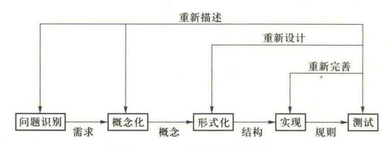

图 10.5 专家系统开发步骤

- ② 问题识别,描述问题的特征及相应的知识结构,明确问题的类型和范围。
- ③ 确定资源,确定知识源、时间、计算设备以及经费等资源。
- ④ 确定目标,确定问题求解的目标。
- (2) 概念化阶段

概念化阶段的主要任务是揭示描述问题所需要的关键概念、关系和控制机制,子任务、策略和有关问题求解的约束。这个阶段需要考虑的问题有:

- ① 什么类型的数据有用,数据之间的关系如何?
- ② 问题求解时包括哪些过程,这些过程有哪些约束?
- ③ 如何将问题划分为子问题?
- ④ 信息流是什么? 哪些信息是由用户提供的,哪些信息是需要导出的?
- ⑤ 问题求解的策略是什么?
- (3) 形式化阶段

形式化阶段是把概念化阶段概括出来的关键概念、子问题和信息流特征形式化地表示出来。 究竟采用什么形式,要根据问题的性质选择适当的专家系统构造工具或适当的系统框架。在这个阶段,知识工程师起着更积极的作用。

在形式化过程中,三个主要的因素是:假设空间、基本的过程模型和数据的特征。为了理解假设空间的结构,必须对概念形式化并确定它们之间的关系,还要确定概念的基元和结构。为此需要考虑以下问题:

- ① 把概念描述成结构化的对象,还是处理成基本的实体?
- ② 概念之间的因果关系或时空关系是否重要,是否应当显式地表示出来?
- ③ 假设空间是否有限?
- ④ 假设空间是由预先确定的类型组成的,还是由某种过程生成的?
- ⑤ 是否应考虑假设的层次性?
- ⑥ 是否有与最终假设相关的不确定性或其他的判定性因素?
- ⑦ 是否考虑不同的抽象级别?

找到可以用于产生解答的基本过程模型是形式化知识的重要一步。过程模型包括行为的和

{16}------------------------------------------------

数学的模型。如果专家使用一个简单的行为模型,对它进行分析就能产生很多重要的概念和关系。数学模型可以提供附加的问题求解信息,或用于检查知识库中因果关系的一致性。

在形式化知识中,了解问题领域中数据的性质也是很重要的。为此应当考虑下述问题:

- ① 数据是不足的、充足的还是冗余的?
- ② 数据是否有不确定性?
- ③ 对数据的解释是否依赖于出现的次序?
- ④ 获取数据的代价是多少?
- ⑤ 数据是如何得到的?
- ⑥ 数据的可靠性和精确性如何?
- ⑦ 数据是一致的和完整的吗?
- (4) 实现阶段

在形式化阶段,已经确定了知识表示形式和问题的求解策略,也选定了构造工具或系统框架。在实现阶段,要把前一阶段的形式化知识变成计算机软件,即要实现知识库、推理机、人机接口和解释系统。

在建立专家系统的过程中,原型系统的开发是极其重要的步骤之一。对于选定的表达方式,任何有用的知识工程辅助手段(如编辑、智能编辑或获取程序)都可以用来完成原型系统知识库。另外推理机应能模拟领域专家求解问题的思维过程和控制策略。

#### (5) 测试阶段

这一阶段的主要任务是通过运行实例评价原型系统以及用于实现它的表达形式,从 而发现知识库和推理机的缺陷。通常导致性能不佳的因素有如下三种:

- ① 输入输出特性,即数据获取与结论表示方法存在缺陷。例如,提问难于理解、含义模糊,使得存在错误或不充分的数据进入系统;结论过多或者太少,没有适当地组织和排序。
  - ② 推理规则有错误、不一致或不完备。
  - ③ 控制策略有问题,不是按专家采用的"自然顺序"解决问题。

专家系统必须先在实验室环境下进行精化和测试,然后才能够进行实地领域测试。在测试过程中,实例的选择应照顾到各个方面,要有较宽的覆盖面,既要涉及典型的情况,也要涉及边缘的情况。测试的主要内容有:

- ① 可靠性。通过实例的求解,检查系统得到的结论是否与已知结论一致。
- ②知识的一致性。当向知识库输入一些不一致、冗余等有缺陷的知识时,检查它是否可把它们检测出来;当要求系统求解一个不应当给出答案的问题时,检查它是否会给出答案等;如果系统具有某些自动获取知识的功能,则检测获取知识的正确性。
- ③ 运行效率。检测系统在知识查询及推理方面的运行效率,找出薄弱环节及求解方法与策略方面的问题。
- ④ 解释能力。对解释能力的检测主要从两个方面进行,一是检测它能回答哪些问题,是否达到了要求;二是检测回答问题的质量,即是否有说服力。

{17}------------------------------------------------

⑤ 人机交互的便利性。为了设计出友好的人机接口,在系统设计之前和设计过程中也要让 用户参与。这样才能准确地表达用户的需求。

对人机接口的测试主要由最终用户来进行。根据测试的结果,应对原型系统进行修改。测试和修改过程应反复进行,直到系统达到满意的性能为止。

### 10.5.3 专家系统的评价

对专家系统的评价实际上是贯穿于建立专家系统整个过程的一项重要工作。在专家系统设计和开发过程中,特别是在阶段任务或全部任务基本完成时,需要对专家系统进行评价(测试、验证和鉴定)。

评价的目的在于检查以下两个方面。

#### 1. 正确性

专家系统的正确性主要由知识工程师和领域专家进行评价,包括评价专家系统的设计、测试和运行结果的正确性。

(1) 系统设计的正确性

系统设计的正确性包括以下三个方面:

- ① 系统设计思想的正确性,如目标、原则等的正确性。
- ② 系统设计方法的正确性,如知识表达方法、推理方法、控制策略、解释方法的正确性。
- ③ 设计开发工具的正确性,如正确使用和正确维护。
- (2) 系统测试的正确性

系统测试的正确性包括以下两个方面:

- ①测试目的、方法、条件的正确性。
- ②测试结果、数据、记录的正确性。
- (3) 系统运行的正确性

系统运行的正确性包括以下三个方面:

- ①推理结论、求解结果、咨询建议的正确性。
- ②推理解释及可信度估算的正确性。
- ③ 知识库知识的正确性,即语法、语义和语用及领域专业知识内容的正确性。

## 2. 有用性

专家系统的有用性主要由用户进行评价,包括一般用户和专业用户,重点是评价专家系统的运行性能。主要从以下几个方面进行评价:

- ①推理结论、求解结果、咨询建议的有用性。
- ②系统的知识水平、可用范围、易扩展性、易更新性等。
- ③ 问题的求解能力(解题速度、推理效率),可能场合和环境。
- ④ 人机交互的友好性。
- ⑤ 运行可靠性、易维护性、可移植性。

{18}------------------------------------------------

⑥ 系统的经济性,包括软硬件投资、运行维护费用、设计开发费用和系统运行直接或间接的经济效益等。

# 10.6 专家系统实例

目前专家系统的研究几乎已经遍及人类生活的各个方面。为了使读者对专家系统有更加具体的认识,下面介绍几个著名的实例。

### 10.6.1 医学专家系统——MYCIN

MYCIN 系统是由斯坦福大学 1972 年开始研制的用于对细菌感染性疾病进行诊断和治疗的专家系统。MYCIN 的功能是帮助内科医生诊断细菌感染疾病,并给出建议性的诊断结果和处方。MYCIN 系统是将产生式规则从通用问题求解的研究转移到解决专门问题的一个成功的典范,在专家系统的发展中占有重要的地位,许

### 1. MYCIN 系统总体结构

多专家系统就是在它的基础上建立起来的。

MYCIN 系统是用 INTER LISP 语言编写的,知识库中大约有两百条关于细菌血症的规则,可以识别约50种细菌。整个系统占245 KB,其中 INTER LISP 系统占160 KB,编译后的 MYCIN 系统占50 KB,知识库占8 KB,其余27 KB 存放临床参数和作为工作空间,有咨询解释功能。

MYCIN 系统处理一个患者的咨询过程如图 10.6 所示。这个过程中的每一步都包含着规则的调用,人机对话,从询问中取得疾病状态、化验参数等直接观察的数据。

图 10.6 MYCIN 系统的咨询过程

MYCIN 系统的结构如图 10.7 所示。从图中可以看出, MYCIN 系统主要由咨询、解释和知识获取三个模块以及知识库、动态数据库组成。

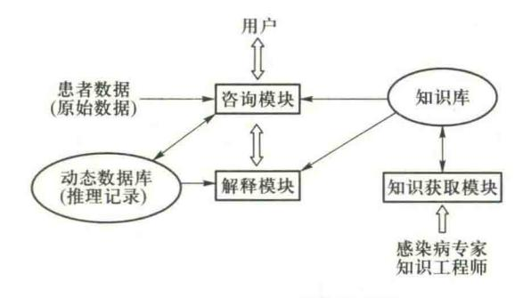

图 10.7 MYCIN 系统结构图

{19}------------------------------------------------

#### (1) 咨询模块

它相当于推理机和用户接口。当医生使用 MYCIN 系统时,首先启动这一子系统。此时 MYCIN 系统将给出提示,要求医生输入有关的信息,如病人的姓名、年龄、症状等,然后利用知识库中的知识进行推理,得出患者所患的疾病及治疗方案。MYCIN 系统采用反向推理的控制策略,推理过程将形成由若干条规则链构造成的与/或树。MYCIN 系统采用深度优先法进行搜索。在 MYCIN 系统中,还使用了基于可信度的不精确推理。

#### (2) 解释模块

它用于回答用户(医生)的询问。在咨询子系统的运行过程中,可以随时启动解释子系统,要求系统回答"为什么要求输入这一参数""结论是怎样得出的"等问题,MYCIN 系统通过记录系统所形成的与/或树来实现解释功能。

#### 2. MYCIN 动态数据库中的数据表示

动态数据库用于存放与患者有关的数据、化验结果以及系统推出的结论等动态变化的信息。动态数据库中的数据按照它们之间的关系组成一棵上下文树(context tree)。上下文树是在咨询过程中形成的。树中的结点称为上下文,每个结点对应一个具体的对象,描述该对象的所有数据都存储在该结点上。每一个结点旁注明结点名,括弧中为该结点的上下文类型。上下文的类型能够指示出哪些规则可能被调用。因此,一个上下文树就构成了对病人的完整描述。

图 10.8 所示为上下文树的一个实例,表示从病人 PATIENT-1 身上当前提取了两种培养物 CULTURE-1 和 CULTURE-2,先前曾提取过一种培养物 CULTURE-3,从这些培养物中分别分离 出相应的有机体。从 ORGANISM-1 至 ORGANISM-4,每种有机体有相应的药物进行治疗。对病人进行手术时使用过药物 DRUG-4。通过该上下文树表示病人的有关培养物及其使用药物的情况,并且指出了哪种有机体来自哪一种培养物,对哪种有机体使用了哪种药物。

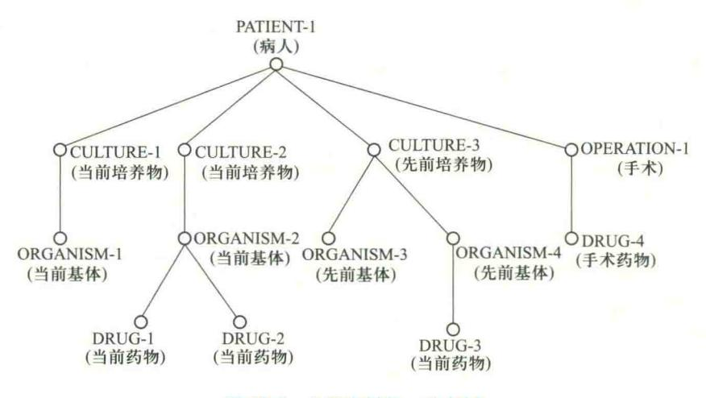

图 10.8 上下文树的一个实例

{20}------------------------------------------------

#### 3. MYCIN 知识库中的知识表示

MYCIN 的知识库主要存放用于诊断和治疗感染性疾病的专家知识,同时还存放了一些进行推理所需要的静态知识,如临床参数的特征表、字典等。该系统用产生式规则表示这些知识。

#### (1) 领域知识的表示

领域知识用产生式规则表示。例如:

RULE 064 如果:有机体的染色体是革兰氏阳性

目:有机形态是球状的

目:有机体的生长结构呈链状

则:存在证据表明该有机体为链球菌类,可信度为0.7

规则的每个条件是一个 LISP 函数,它们的返回值为 T,NIL 或-1 到+1 之间的某个数值。规则的行为部分用专门表示动作的行为函数表示。MYCIN 系统中有 3 个专门用于表示动作的行为函数:CONCLUDE,CONCLIST 和 TRANLIST。其中CONCLUDE 用得最多,其形式为

(CONCLUDE C P V TALLY CF)

其中,C,P,V分别表示上下文树、临床参数和值;TALLY是一个变量,用于存放规则前提部分的信任程度;CF是规则强度,由领域专家提供。

#### (2) 临床参数的表示

每个上下文树与一组临床数据相联系。这些数据完全地描述相应的上下文树。每个临床参数表示上下文树的一个特征,如病人的姓名、培养物的地点、机体的形状、药物的剂量等。

临床参数可用三元组(上下文树、属性、值)表示。例如,三元组(机体-1,形态,杆状)表示机体-1的形态为杆状;三元组(机体-1,染色体,革兰氏阴性)表示机体-1的染色体为革兰氏阴性。

临床数据按其取值方式可分为单值、是非值和多值三种。有的参数如病人的姓名、细菌类别等,可以有许多可能的取值,但各个值互不相容,所以只能取其中一个值。因此属于单值。是非值是单值的一种特殊情形,这时参数限于取"是"或"非"中的一种,例如,药物的剂量是否够,细菌是否重要等。多值参数是那些同时可取一个以上值的参数,例如病人的药物过敏、传染的途径等参数。

MYCIN 系统中有 65 个临床参数,为搜索方便,参数按照其相对应的上下文分类。

为了避免在推理时过多地询问用户,同时也为了优化存储,MYCIN 系统还把有关的数据列成清单存在知识库中,当推理启用相应的规则时,就直接从清单中找到相应的数据。另外,MYCIN 系统还有一个包含 1 400 个单词的词典,主要用于理解用户输入的自然语言。

#### 4. MYCIN 的推理策略

当 MYCIN 系统被启动后,系统首先在数据库中建立一棵上下文树的根结点,并为该结点指定一个名字 PATIENT-1(病人-1),其类型为 PERSON。PERSON的属性有 NAME, AGE, SEX, REGIMEN,其中 NAME、AGE、SEX 是 LABDATA 参数,即可通过用户询问得到。系统向用户提出询问,要求用户输入病人的姓名、年龄和性别,并以三元组形式存入数据库中。REGIMEN表示对病人

{21}------------------------------------------------

建议的处方。它不是 LABDATA 参数,必须由系统推出。事实上它正是系统进行推理的最终目标。

为了得到 REGIMEN,在推理开始时,首先调用目标规则 092 进行反向推理。规则 092 是系统中唯一在其操作部分涉及 REGIMEN 参数的规则。这个目标规则体现了在 MYCIN 系统中感染性疾病诊断和处方时决策的四个步骤。具体规则如下:

#### 规则 092

- IF ① 存在一种病菌需要处理
  - ② 某些病菌虽然没有出现在目前的培养物中,但已经注意到它们需要处理
- THEN ① 根据病菌对药物的过敏情况,编制一个可能抑制该病菌的处方表
  - ② 从处方表中选择最佳的处方

ELSE 病人不必治疗

规则 092 的前提中涉及两个临床参数 TREATFOR 和 COVERFOR。

TREATFOR 表示需要处理的病菌。它不是 LABDATA 参数,所以系统调用 TREATFOR 的 UPDATED-BY 特征所指出的第一条规则 090,检查它的前提是否为真。为此,如果该前提所涉及的值是可向用户询问的,就直接询问用户,否则再找出可推出该值的规则,判断其前提是否为真。如此反复进行,直到最后推出 PATIENT-1 的主要临床参数 REGIMEN 为止。在此过程中动态生成的关于病人的上下文树如图 10.9 所示。

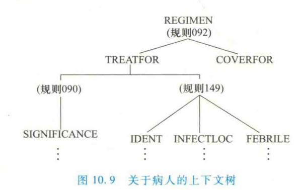

MYCIN 系统通过两个互相作用的子程序 MONITOR 和 FINDOUT 完成整个咨询和推理过程。 MONITOR 的功能是分析规则的前提条件是否满足,以决定拒绝该规则还是采用该规则,并 将每次鉴定一个前提后的结果记录在动态数据库中。如果一个条件中所涉及的临床参数是未知 的,则调用 FINDOUT 机制去得到这个消息。

FINDOUT 的功能是检查 MONITOR 所需要的参数,它可能已在动态数据库中,也可以通过用户提问获取。

FINDOUT 根据所需信息种类的不同采取不同的策略。对于化验数据,FINDOUT 首先向用户询问,如果用户不知道,再运用知识库进行推导,即检索知识库中可用推导该参数的规则,并调用 MONITOR 作用于这些规则;对于非化验数据,FINDOUT 首先运用知识库进行推导,如果规则

{22}------------------------------------------------

推理不足以得出结论,再向用户询问。

#### 5. 治疗方案选择

当目标规则的前提条件被确认,即诊断"病人患有细菌感染"后,MYCIN 系统开始处理目标规则的结论部分,即选择治疗方案。选择最佳治疗方案分以下两步,首先生成可能的"治疗方案表",然后从表中选取对该病人的最佳用药配方。

(1) 生成可能的"治疗方案表"

MYCIN 系统根据诊断出的细菌特征,选择用药方案。在知识库中存有相应的规则,指示对各种细菌的用药方案。例如有:

IF 细菌的特征是 Pseudomonas

THEN 建议在下列药物中选择治疗:

colistin (0.98)

polynyxin(0.96)

gentamicin (0.96)

carbenicillin (0, 96)

sulfisoxazole (0.96)

规则中每个药物后的数值表示该药物对细菌的有效性。

MYCIN 系统应用这些药物选择规则,就能生成针对各种病菌的治疗方案表。这些方案可按其可信度的值进行排序。

(2) 选择用药配方

MYCIN 系统根据下列原则从治疗方案中选择相应的用药配方:

该药物对细菌治疗的有效性。

该药物是否已用过。

该药物的副作用。

#### 6. 知识获取

知识库中每条规则是医生的一条独立的经验,知识获取模块用于知识工程师增加和修改规则库中的规则。当输入新规则到规则库时,必须对原有规则进行检查、修改,并修改参数性质表和结点性质表。下面是系统获取一条规则的过程:

- ① 告诉专家新建立的规则的名字(实质上是规则序号)。
- ② 逐条获取前提,把前提从英文翻译成相应的 LISP 表达。
- ③ 逐条获取结论规则,把每一条从英文翻译为 LISP 表达。当有必要时应要求得到的相应的规则可信度 CF。
  - ④ 用 LISP-english 子程序将规则再翻译成英语,并显示给专家。
  - ⑤ 提问专家是否同意这条翻译的规则;如果规则不正确,专家进行修改并回到步骤④。
- ⑥ 检查新规则与其他已在规则库中的旧规则之间是否矛盾。如果有必要,可以与专家交互来澄清指出的问题。

{23}------------------------------------------------

- ⑦ 如果有必要,可调用辅助分类规则对新规则分类。
- ⑧ 把规则加入新规则前提中的临床参数性质的 LOOKHEAD 表中。
- ⑨ 把规则加入新规则结论中的所有参数 CONTAIED-IN 表和 UPDATED-BY 表中。
- ⑩ 告诉专家系统新规则已是 MYCIN 系统的规则库中的一部分了。

上述步骤⑨确保 FINDOUT 在新的推导过程中搜索参数的 UPDATED-BY 表时能自动调用新规则。

MYCIN 系统的学习功能是有限的,例如新规则输入时涉及的参数和结点类型要求不超越系统已有的种类。另外,对新旧规则之间的矛盾、不一致等处理也是不全面的。

为了防止不熟练的用户随意输入知识而引起知识的混乱,系统采用二级存储方法。只有新的知识经试运行后证明其可靠,才能并入规则库中。

MYCIN 专家系统之所以重要有几个原因。首先,它证明了人工智能可以应用到实际的现实世界问题;其次 MYCIN 是新概念的试验,例如解释机、知识的自动获取和今天可在许多专家系统中找到的智能指导;第三,它证实了专家系统外壳(SHELL)的可行性。

以前的专家系统如 DENDRAL,是一个把知识库中知识与推理机通过软件集成起来的单一系统。MYCIN 明确地把知识库与推理机分开。这对于专家系统技术的发展是极其重要的,因为这意味着专家系统的基本核心可以重用,也就是说,通过清空旧知识装入新领域的知识,新的专家系统可以比 DENDRAL 类型的系统创建快得多。处理推理和解释的 MYCIN 外壳部分,可以用新系统的知识重装。去掉医学知识的 MYCIN 外壳被称为 EMYCIN(基本的或空的 MYCIN)。

专家系统 MYCIN 能识别 51 种病菌,正确地处理 23 种抗生素,可协助医生诊断、治疗细菌感染性血液病,为患者提供最佳处方。它成功地处理了数百病例,还通过了如下测试:用 MYCIN 与斯坦福大学医学院九名感染病医生分别对十例感染源不清楚的患者进行诊断并给出处方,由八位专家对他们的诊断进行了评判,而且被测对象(即 MYCIN 及九位医生)互相隔离,评判专家亦不知道哪一份答卷是谁做的。评判内容包括两个方面,一是所开出的处方是否对症有效;另一是所开出的处方是否对其他可能的病原体也有效且用药又不过量。评判结果是:对第一个评判内容,MYCIN 与另外三名医生处方一致且有效;对第二个评判内容,MYCIN 的得分超过九名医生,显示出了较高的医疗水平。

## 10.6.2 地质勘探专家系统——PROSPECTOR

著名的地质勘探专家系统 PROSPECTOR 是美国斯坦福人工智能研究中心(SRI)于 1976 年 开始研制的,该系统采用 LISP 语言编写。到 1980 年为止,PROSPECTOR 探测到价值 1 亿美元的矿物淀积层,带来了巨大的经济效益,目前它已成为世界上公认的著名专家系统之一。

#### 1. PROSPECTOR 系统概述

#### (1) PROSPECTOR 系统的结构

PROSPECTOR 系统的结构由推理网络、匹配器、传送器、问答系统、英语分析器、解释系统、网络编译程序和知识获取系统组成,如图 10.10 所示。

{24}------------------------------------------------

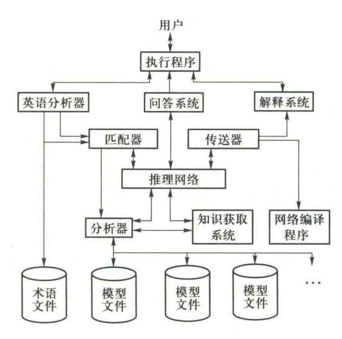

图 10.10 PROSPECTOR 系统的总体结构

PROSPECTOR 系统用语义网络表达知识。知识库由模型文件库和术语文件库组成,推理机具有层次结构,采用"从顶至底"的目标驱动推理控制策略,采用似然推理、逻辑推理、上下文推理相结合的推理方法。

PROSPECTOR 系统的各个组成部分的工作原理如下:

- ① 模型文件(模型知识库)。PROSPECTOR 系统有 12 个由模型文件组成的模型知识库。在系统内表达成推理规则网络,共有 1100 多条规则。规则的前提是地质勘探数据,结论是地质假设如矿床分类、含量、分布等。每个矿床模型以文件形式存放在磁盘上,可以由分析器调用。
- ② 术语文件(术语知识库)。有 400 种岩石、地质名字、地质年代和在语义网络中用的其他术语,也以文件形式存储,作为术语知识库供系统调用。
  - ③分析器。用于将矿床模型知识库中的模型文件转换成系统内部的推理网络。
- ④ 推理网络。PROSPECTOR 系统的推理网络是具有层次结构的与/或树,它将勘探数据和有关地质假设联系起来,进行从顶到底的逐级推理,上一级的结论作为下一级的证据,直到结论是可由勘探数据直接证实的端结点为止。
- ⑤ 匹配器。用于进行语义网络匹配。把一个模型和另一个模型连接在一起,同时也把用户输入的信息和一些模型连接起来。
  - ⑥ 传送器。用于修正推理网络中模型空间状态变化的概率值。
  - ⑦ 英语分析器。对用户以简单的英语陈述句输入的信息进行分析,并变换到语义网络上。
- ⑧ 问答系统。检查推理网络的推理过程及模型的运行情况,用户可以随时对系统进行查询,系统也可以对用户提出问题,要求提供勘探证据。
  - ⑨ 网络编译程序。通过钻井定位模型,根据推理结果,编制钻井井位选择方案,输出图像

{25}------------------------------------------------

信息。

- ⑩ 解释系统。对用户解释有关结论和断言的推理过程、步骤和依据。
- ⑩ 知识获取系统。获取专家知识,增删、修改推理网络。
- (2) PROSPECTOR 系统的功能

PROSPECTOR 系统具有下列功能:

- ① 勘探结果评价。根据岩石标本及地质勘探数据,对矿区勘探结果进行综合评价。
- ② 矿区勘探评测。根据矿区勘探结果的综合评价,对矿藏资源进行估计和预测;对矿床分布、藏量、品位、开采价值等作出合理的地质假设(推理)和估算。
- ③ 编制井位计划。根据矿藏资源预测和估计及矿藏的分布、藏量、地质特性等,编制合理的 开发计划和钻井井位布局方案。

应用 PROSPECTOR 系统,对美国华盛顿州的钼矿进行勘测,其结果完全为实际钻探所证实。 PROSPECTOR 系统的成功应用,对专家系统进入商业市场,起到了重大的推动作用。

#### 2. 推理网络

推理网络实际上是一个矿床模型经编码而成的网络,把探区证据和一些重要地质假设连接成一个有向图。在网络中,证据和假设是相对的,一个假设对于进一步推理来说又是证据,而一个证据对于下一级的推理来说又是假设。

PROSPECTOR 系统提供三种推理方法:

- ① 似然推理。根据 Bayes 原理的概率关系进行推理,用"似然率"表示规则的强度,描述不同的勘探证据对同一地质假设有不同的支持程度,说明某种结论的概率变化对其他结论的影响。规则强度由专家在矿床模型设计时提供,用语言表达,如完全肯定、有点可能等,然后转换成相应的概率值。在推理过程中采用 Bayes 公式进行概率计算。
- ② 逻辑推理,基于布尔逻辑关系的推理。在推理网络中,某些规则的证据(前提)和假设之间,具有布尔量的逻辑与、或、非关系,可用布尔代数进行推理。当证据与假设之间具有不确定的关系时,可采用模糊逻辑方法,合取(AND)中取组合中的最小值,析取(OR)则取最大值。
- ③上、下文推理,基于上、下文语义关系的推理。系统在推理过程中,有时需要考虑上、下文先后次序的语义关系。

# 10.7 专家系统的开发工具

专家系统的开发 工具讲课视频▲

专家系统的研制和开发是一件复杂、困难、费时的工作。为了提高专家系统设计和开发的效率,缩短研制周期,就需要使用专家系统开发工具,以便于提供系统设计和开发的计算机辅助手段和环境。

专家系统的一个特点是知识库与系统其他部分的分离,知识库是与求解的问题领域密切相关的,而推理机等则与具体领域独立,具有通用性。为此,人们就开发了一些专家系统工具,用于快速建造专家系统。

{26}------------------------------------------------

借助之前开发好的专家系统,将描述领域知识的规则等从原系统中"挖掉",只保留其知识表示方法和与领域无关的推理机等部分,就得到了一个专家系统工具,这样的工具称为骨架型的工具,因为它保留了原有系统的主要框架。最早的专家系统工具 EMYCIN(Empty MYCIN)就是一个典型的骨架型专家系统工具,从名称就可以看出,它是来自著名的专家系统 MYCIN。

### 10.7.1 骨架系统

骨架系统是由已有的成功的专家系统演化而来的。它抽出了原系统中具体的领域知识,而保留了原系统的体系结构和功能,再把领域专用的界面改为通用界面。

在骨架系统中,知识表示模式、推理机制都是确定的。利用骨架系统作为开发工具,只要将新的领域知识用骨架系统规定的模式表示出来并装入到知识库中就可以了。

在专家系统的建造中发挥了重要作用的骨架系统主要有 EMYCIN, KAS 和 EXPERT 等。

#### 1. EMYCIN 系统

EMYCIN 系统是由 EMYCIN 系统抽去原有的医学领域知识,保留骨架而形成的系统。它采用产生式规则表达知识、目标驱动的反向推理控制策略,特别适合开发领域咨询、诊断型专家系统。

EMYCIN 系统具有 EMYCIN 系统的全部功能,如

- ① 解释程序。系统可以向用户解释推理过程。
- ②知识编辑程序及类英语的简化会话语言。EMYCIN系统提供了一个开发知识库的环境,使得开发者可以使用比LISP更接近自然语言的规则语言来表示知识。
- ③ 知识库管理和维护手段。EMYCIN 系统提供的开发知识库的环境,还可以在进行知识编辑及输入时进行语法、一致性、是否矛盾和包含等检查。
- ④ 跟踪和调试功能。EMYCIN 系统还提供了有价值的跟踪和调试功能,试验过程中的状况都被记录并保留下来。

EMYCIN 系统的工作过程分两步。第一步为专家系统建立过程。在该过程中,首先知识工程师输入专家知识,知识获取和知识库构造模块把知识形式化,并对知识进行语法和语义检查,建立知识库。然后知识工程师调试并修改知识库。知识库调试正确后,一个用 EMYCIN 系统构造的专家系统即可交付使用。第二步为咨询过程。在该过程中,咨询用户提出目标假设,推理机制根据知识库中的知识进行推理,最后提出建议,作出决策,并通过解释模块向用户解释推理过程。

EMYCIN 系统已用于建造医学、地质、工程、农业和其他领域的诊断型专家系统。图 10.11 列出了借助于 EMYCIN 系统开发的一些专家系统。

#### 2. KAS 系统

KAS 系统是由 PROSPECTOR 系统抽去原有的地质勘探知识而形成的。当把某个领域知识用 KAS 所要求的形式表示出来并输入到知识库中后,它就成为一个可用 PROSPECTOR 的推理机构来求解问题的专家系统。

{27}------------------------------------------------

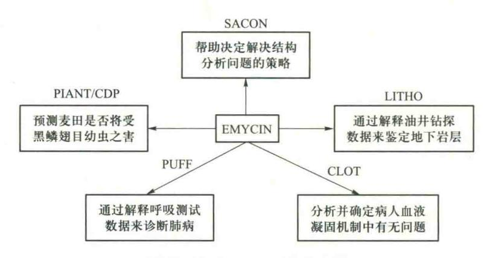

图 10.11 EMYCIN 系统的应用

KAS 系统采用产生式规则和语义网络相结合的知识表达方法及启发式正反向混合推理控制策略。KAS 系统在推理过程中的推理方向是不断改变的,其推理过程大致为:在 KAS 系统提示下,用户以类似自然语言的形式输入信息,KAS 系统对其进行语法检查并将正确的信息转换为语义网络,然后与表示成语义网络形式的规则的前提条件相匹配,从而形成一组候选目标,并根据用户输入的信息使各候选目标得到不同的评分。接着 KAS 系统从这些候选的目标中选出一个评分最高的候选目标进行反向推理,只要一条规则的前提条件不能被直接证实或被否定,则反向推理就一直进行下去。当有证据表明某个规则的前提条件不可能有超过一定阈值的评分时,就放弃沿这条路线进行的推理,而选择其他的路线。

KAS 系统提供了一些辅助工具如知识编辑系统、推理解释系统、用户回答系统、英语分析器等,用来开发和测试规则和语义网络。

KAS 系统具有一个功能很强的网络编辑程序和网络匹配程序。网络编辑程序可以用来把用户输入的信息转化为相应的语义网络,并可用来检测语法错误和一致性等。网络匹配程序用于分析任意两个语义网络之间的关系,看其是否具有等价、包含、相交等关系,从而决定这两个语义网络是否匹配,同时它还可以用来检测知识库中的知识是否存在矛盾、冗余等。

KAS 系统适用于开发解释型专家系统,其典型应用如图 10.12 所示。

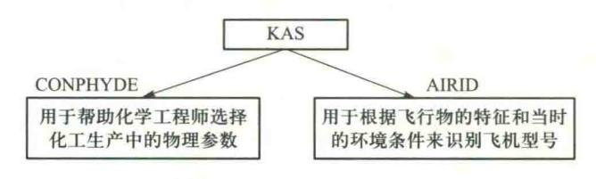

图 10.12 KAS 系统的应用

### 3. EXPERT 系统

EXPERT 系统是由美国 Rutgers 大学的威斯(Weiss)和库里科斯基(Kulikowski)等人在已成

{28}------------------------------------------------

功开发的专家系统及工具如 CASNET 系统(青光眼诊断系统)等的基础上于 1981 年设计完成的一个骨架系统,适用开发诊断和分类型专家系统。

EXPERT 系统的知识由假设、事实和决策规则三部分组成。与 EMYCIN 系统和 PROSPECTOR 系统不一样,在 EXPERT 系统中事实与假设是严格区分的。事实是有待观察、测量和确定的证据,如人的身高、血压等。事实是以真、假、数值或不知道的形式来回答系统提出的问题的。假设可以是由系统推出来的结论,例如,一个诊断就是一个假设。通常每个假设都有一个不确定性的度量值。规则用来描述事实和假设之间的逻辑关系,在 EXPERT 系统中具有三种形式的规则: FF 规则、FH 规则、HH 规则。

所谓 FF 规则,就是从事实到事实的规则,即从已知的事实推出另一些事实,从而可省去一些不必要的提问。被 FF 规则推出来的事实只能取真、假或不知道。例如

$$F(M,T) \rightarrow F(PREGP,F)$$
;如果  $M$  为真,则  $PREGP$  为假

表示如果病人为男性,就不必做妊娠检查。

所谓 FH 规则,就是从事实到假设的规则,用来由事实的逻辑组合推出假设并确立其可信度。例如

$$F(A,T) \& F(B,F) \& [1:F(C,T),F(D,F)] \rightarrow H(E,0.5)$$

以上规则表示如果第一个事实(A ) 成立、第二个事实(B ) 从设立、第三个事实(C ) 为真(D ) 和第四个事实(D ) 为假(D ) 中有一个成立,则假设(D ) 展立的可能性为(D ) 0.5。

可信度的取值范围为-1到1。1表示绝对肯定,-1表示绝对否定。在推理中可能有几条规则推出同一假设,这时可信度的绝对值最大的规则生效。

所谓 HH 规则,就是从假设到假设的规则,用来从已知的假设推出其他假设。在 EXPERT 系统中的 HH 规则中,出现在规则左部的假设的确定性程度需要一个数值区间表示。例如

$$H(A,0.2:1) \& H(B,0.1:1) \rightarrow H(C,1)$$

它表示如果对假设 A 有 0. 2 到 1 的把握,并且对假设 B 有 0. 1 到 1 的把握,则得出结论 C,其把握程 度为 100%。另外,在 EXPERT 系统中为提高推理效率,还把若干条 HH 规则组成一个模块。在模块前另加条件,称为该规则的上下文。只有上下文为真时,该规则组内的规则才被启用。

EXPERT 系统推理的主要目的是达到正确的结论或提出合理的问题。其推理过程大致描述如下:

- ① 由事实对所有的 FF 规则进行推理,以取得尽可能多的事实。
- ② 从已有的事实出发,检查所有的 FH 规则,如果其左部为真,就将其右部的假设存入集合 PH 中。
  - ③ 置集合 DH 为空。
- ④ 从已有事实出发,检查所有的 HH 规则的上下文,且对上下文条件成立的规则做如下处理:若规则的左部假设出现在 DH 或 PH 中,则令 H 的当前可信度为 PH 和 DH 中同一 H 的各可信度绝对值最大者,按 H 的这个可信度对此规则进行推理,并把结论存入 DH 中。若 DH 中已有这个假设 H,则仅保留其可信度绝对值最大的那一个。

{29}------------------------------------------------

- ⑤ 按假设所形成的推理网络进行推理,以最终得到假设的可信度值。
- ⑥ 对假设的选择除可按上述方法选择可信度最大的外,EXPERT 还设置了评分函数。

EXPERT 已被用于建造医疗、地质和其他一些领域的诊断专家系统。典型的应用如图 10.13 所示。

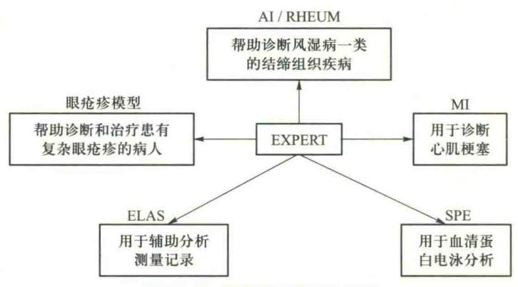

图 10.13 EXPERT 系统的应用

以上讨论了三种骨架系统。用骨架系统开发领域专家可以大大减少开发的工作量。但也存在一定的问题,主要问题是骨架系统只适用于建造与之类似的专家系统,因其推理机制和控制策略是固定的,所以局限性较大,灵活性差。

## 10.7.2 通用型知识表达语言

通用型知识表达语言并不严格地倾向特定的领域和范例系统,所以能够处理许多不同领域和类型的问题。目前这类通用语言已有很多,如 OPS5,ROSIE,HEARSAYⅢ,RLL,ART 等。这里只简单地介绍 OPS5。

OPS5 是美国卡内基-梅隆大学开发的一种通用知识表达语言,其特点是将通用的表达和控制结合起来。它提供了专家系统所需的基本机制,并不偏向于某些特定的问题求解策略和知识表达结构。OPS5 允许程序设计者使用符号表示并表达符号之间的关系,但并不事先定义符号和关系的含义。这些含义完全由程序设计者所写的产生式规则确定。

OPS5 由产生式规则库、推理机及数据库三部分组成。规则的一般形式为 P〈规则号〉〈前提〉→〈结论〉

其中前提是条件元的序列,而结论部分是基本动作构成的集合。OPS5 中定义了 12 个基本动作如 MAKE,MODIFY,REMOVE,WRITE 等。数据库用于存储当前求解问题的已知事实及中间结果等。数据库包含了一个不变的符号集合。符号结构有两种类型:符号向量、与属性-值元组相联系的对象。

推理机用规则库中的规则及数据库中的事实进行推理,具体步骤如下:

① 确定哪些规则的前提已满足(匹配)。

{30}------------------------------------------------

- ② 选择一个前提得到满足的规则。如果得不到满足的规则,则中止运行(解除冲突)。
- ③ 执行所选择规则的动作(动作)。
- ④ 转向①。

上述动作是行为序列的大框架;用户可以根据其意愿方式加入控制结构,即产生式系统本身确定使用什么样的控制及求解策略。

OPS5 已被用来开发许多专家系统。典型应用如图 10.14 所示。

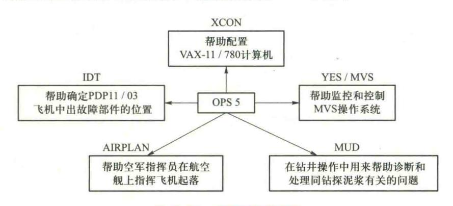

图 10.14 OPS5 系统的应用

### 10.7.3 专家系统开发环境

专家系统开发环境又称为专家系统开发工具包,它可为专家系统的开发提供多种方便的构件,例如知识获取的辅助工具、适用各种不同知识结构的知识表示模式、各种不同的不确定推理机制、知识库管理系统以及各种不同的辅助工具、调试工具等。目前,国内外已有的专家系统开发环境有 AGE、KEE 等。这里只简单地介绍 AGE。

AGE 是斯坦福大学研制的一个专家系统开发环境。它是一种典型的模块组合式开发工具。 AGE 为用户提供了一个通用的专家系统结构框架,并将该框架分解为许多在功能和结构上较为 独立的组件部件。这些组件已预先编制成标准模块存在系统中。用户可以通过以下两条途径构 造自己的专家系统:

- ① 用户使用 AGE 现有的各种组件作为构造材料,很方便地来组合设计自己所需的系统。
- ② 用户通过 AGE 的工具界面,定义和设计各种所需的组成部件,以构成自己的专家系统。

AGE 采用了黑板模型来构造专家系统结构框架。应用 AGE 已经开发了一些专家系统,主要用于医疗诊断、密码翻译、军事科学方面。

# 10.7.4 专家系统程序设计语言

PROLOG 和 LISP 是两种最主要的人工智能程序设计语言。

PROLOG 语言是一种以逻辑推理为基础的程序设计语言。无论是它描述求解问题的方式,

{31}------------------------------------------------

还是其语言本身都与一般的程序设计语言有很大的差别。它最早在 20 世纪 70 年代初由英国爱丁堡大学的 Kowalski R.首先提出,1986 年美国推出了 TURBOPROLOG 软件,能够适应个人计算机。现在,PROLOG 语言已经广泛应用于许多人工智能领域,包括定理证明、专家系统、自然语言理解等。

自从 LISP 创立以来, LISP 在美国一直居于人工智能语言的主导地位。由于它易于表达,许多早期专家系统外壳是用 LISP 建立的。但是,传统的计算机不能高效地执行 LISP,对用 LISP 编写的外壳,情况更糟。为了解决这个问题,几个公司开始提供专门设计的机器来执行 LISP 代码。这些 LISP 机完全使用 LISP,甚至把它作为汇编语言。但 LISP 机比传统的机器费用高,且是单用户的。用 LISP 编写的专家系统一般难以嵌入用其他语言编写的程序。

为了克服 LISP、PROLOG 运行速度慢、可移植性差、解决复杂问题能力差等问题,1984 年美国航空航天局约翰逊空间中心推出 CLIPS(C Language Intergrated Production System),它是一个基于 Rate 算法的前向推理语言,用标准 C 语言编写,具有较高移植性、扩展性、知识表达能力和成本低等特点。

选择人工智能语言的一个重要原因是它提供了一些工具。由于可移植性、效率和速度等原因,许多专家系统工具,现在都用 Pathon、C/C++、Java 等语言编写。由于面向对象程序设计语言以其类、对象、继承等机制,与人工智能的知识表示、知识库等产生了自然的联系。因而,现在面向对象语言也成为一种人工智能程序设计语言。面向对象的程序设计也被广泛地用于人工智能程序设计,特别是专家系统程序设计。

## 10.8 小结

专家系统是基于知识的系统,用于在某种特定的领域中运用领域专家多年积累的经验和专业知识,求解需要专家才能解决的困难问题。

专家系统具有专家水平的专业知识、能进行有效的推理、具有启发性、灵活性、透明性、交互性等特点。

专家系统本身是一个程序,但它与传统程序不同。

专家系统一般包括人机接口、推理机、知识库、动态数据库、知识获取机构和解释机构六部分。各部分的关系如图 10.1 所示。

只有在专家系统开发是可能的、合理的并且合适的时候,才应该开发求解这个问题的专家 系统。

骨架系统抽出了已成功应用的专家系统中具体的领域知识,而保留了原系统的体系结构和功能,再把领域专用的界面改为通用界面。在骨架系统中,知识表示模式、推理机制都是确定的。利用骨架系统作为开发工具,只要将新的领域知识用骨架系统规定的模式表示出来并装入到知识库中就可以了。

{32}------------------------------------------------

# 思考题

- 10.1 什么是专家系统,它有哪些基本特征?
- 10.2 专家系统由哪几部分组成,各部分的功能和结构如何?
- 10.3 专家系统与传统程序有何不同和相似之处?
- 10.4 专家系统设计中要注意哪些问题?
- 10.5 简述专家系统的开发过程。
- 10.6 专家系统的主要类型和主要的应用领域有哪些?
- 10.7 描述专家系统中常用的正向推理和反向推理的算法流程。