{0}------------------------------------------------

# 第11章 自然语言理解及其应用

如果计算机能够理解、处理自然语言,这将是计算机技术的一项重大突破。自然语言理解 (natural language understanding)的研究在应用和理论两个方面都具有重大的意义。

本章首先从自然语言的词法、句法、语义分析的角度介绍自然语言理解所涉及的主要方面,然后介绍基于语料库的大规模真实文本处理方法,最后从应用角度介绍机器翻译和语音识别技术。

## 11.1 自然语言理解的概念与发展历史

由于自然语言的多义性、上下文相关性、模糊性、非系统性、环境相关性等,关于自然语言理解至今尚无一致的定义。

从微观角度,自然语言理解是指从自然语言到机器内部的一个映射。

从宏观角度,自然语言理解是指机器能够执行人类所期望的某种语言功能。这些功能主要包括如下几方面:

- ① 回答问题:计算机能正确地回答用自然语言输入的有关问题。
- ② 文摘生成:机器能产生输入文本的摘要。
- ③ 释义:机器能用不同的词语和句型来复述输入的自然语言信息。
- ④ 翻译: 机器能把一种语言翻译成另外一种语言。

比尔·盖茨曾说过:"语言理解是人工智能皇冠上的明珠。"

自然语言理解的研究历程,可以分为下列几个时期。

## 1. 萌芽时期

自然语言理解的研究可以追溯到 20 世纪 40 年代末和 50 年代初期。随着第一台计算机问世,英国的 A.Donald Booth 和美国的 W.Weaver 就开始了机器翻译方面的研究。美国、苏联等国展开的俄英互译研究工作开启了自然语言理解研究的早期阶段。1954 年 1 月,美国乔治敦大学(Georgetown University)在 IBM 公司协同下,用 IBM-701 计算机首次完成了英俄机器翻译试验,拉开了机器翻译研究的序幕。

在这一时期, M. Chomsky 提出了形式语言和形式文法的概念, 把自然语言和程序设计语言置于相同的层面, 用统一的数学方法来解释和定义。 M. Chomsky 建立的转换生成文法 TG 在语言学界引起了很大的轰动, 使得语言学的研究进入了定量研究的阶段。 Chomsky 所建立的文法体系, 仍然是目前自然语言理解中文法分析所必须依赖的文法体系。但是, Chomsky 的理论还不能处理极其复杂的自然语言问题。

{1}------------------------------------------------

由于 20 世纪 50 年代单纯地使用规范的文法规则,再加上当时计算机处理能力的低下,使得机器翻译工作没有取得实质性进展。

#### 2. 以关键词匹配技术为主的时期

从 20 世纪 60 年代开始,已经产生一些自然语言理解系统,用来处理受限的自然语言子集。这些人机对话系统可以作为专家系统、办公自动化及信息检索等系统的自然语言人机接口,具有很大的实用价值。但这些系统大都没有真正意义上的文法分析,而主要依靠关键词匹配技术来识别输入句子的意思。1968 年,B.Raphael 在美国 MIT 完成的语义信息检索系统 SIR,能记住用户通过英语告诉它的事实,然后对这些事实进行演绎,回答用户提出的问题。J.Weizenbaum 在美国 MIT 设计的 ELIZA 系统,能模拟一位心理医生(机器)同一位患者(用户)的谈话。在这些系统中,事先存放了大量包含某些关键词的模式,每个模式都与一个或多个解释(又称响应式)相对应。系统将当前输入的句子同这些模式逐个匹配,一旦匹配成功便立即得到了这个句子的解释,而不再考虑句子中那些非关键词成分对句子意思的影响。匹配成功与否只取决于语句模式中包含的关键词及其排列次序,非关键词不能影响系统的理解。所以,基于关键词匹配的理解系统并非真正的自然语言理解系统,它既不懂文法,又不懂语义,只是一种近似匹配技术。这种方法的最大优点是允许输入的句子不一定要遵循规范的文法,甚至可以是文理不通的。这种方法的主要缺点是技术的不精确性,往往会导致错误的分析。

#### 3. 以句法-语义分析技术为主的时期

20世纪70年代后,自然语言理解的研究在句法-语义分析技术方面取得了重要进展,出现了若干有影响的自然语言理解系统。例如,1972年美国BBN公司W.Woods负责设计的LUNAR,是第一个允许用户用普通英语同计算机对话的人机接口系统,用于协助地质学家查找、比较和评价阿波罗11飞船带回来的月球标本的化学分析数据;同年,T. Winograd 设计的 SHEDLU 系统,是一个在"积木世界"中进行英语对话的自然语言理解系统,把句法、推理、上下文和背景知识灵活地结合于一体,模拟一个能够操纵桌子上一些积木玩具的机器人手臂,用户通过人-机对话方式命令机器人放置那些积木块,系统通过屏幕给出回答并显示现场的相应情景。

#### 4. 基于知识的自然语言理解发展时期

20世纪80年代后,自然语言理解研究借鉴了许多人工智能和专家系统中的思想,引入了知识的表示和推理机制,使自然语言处理系统不再局限于单纯的语言句法和词法的研究,提高了系统处理的正确性,从而出现了一批商品化的自然语言人机接口和机器翻译系统。例如美国人工智能公司(AIC)生产的英语人-机接口 Intellect,美国弗雷公司生产的人-机接口 Themis。在自然语言理解研究的基础上,机器翻译走出了低谷,出现了一些具有较高水平的机器翻译系统。例如,美国的META系统;美国乔治伦敦大学的机译系统 SYSTRAN,欧共体在其基础上实现了英、法、德、西、意及葡等多语对译。

### 5. 基于大规模语料库的自然语言理解发展时期

由于自然语言理解中知识的数量巨大,特别是由于它们高度的不确定性和模糊性,要想把处理自然语言所需的知识都用现有的知识表示方法明确表达出来是不可能的。为了处理大规模的真实

{2}------------------------------------------------

文本,研究人员提出了语料库语言学(corpus linguistics)。语料库语言学认为语言学知识的真正源泉是来自于生活中大规模的资料,我们的任务是使计算机能够自动或半自动地从大规模语料库中获取处理自然语言所需的各种知识。

20世纪80年代,英国 Leicester 大学 Leech 领导的 UCREL 研究小组,利用已带有词类标记的语料库,经过统计分析得出了一个反映任意两个相邻标记出现频率的"概率转移矩阵"。他们设计的 CLAWS 系统依据这种统计信息(而不是系统内存储的知识),对 LOB 语料库的一百万词的语料进行词类的自动标注,准确率达 96%。

#### 6. 基于深度学习的自然语言理解发展时期

2013 年来,基于深度人工神经网络的机器翻译(deep neural network machine translation)飞速发展。拥有海量结点的深度神经网络能够自动地从语料库中学习翻译知识。一种语言的句子被向量化之后,在网络中层层传递,转化为计算机可以"理解"的表示形式,再经过多层复杂的传导运算,生成另一种语言的译文。

目前,长短时记忆(long short-term memory,LSTM)、循环神经网络(recurrent neural network, RNN)在机器翻译中广泛应用。该模型比较适合对自然语言建模,把任意长度的句子转化为特定维度的浮点数向量,同时"记住"句子中比较重要的单词,较好地解决了自然语言句子向量化的难题,使得计算机对语言的处理不再是简单的字面匹配,而是深入到语义理解的层面。相比之前的翻译技术,这种翻译方法的译文更流畅,更加符合语法规范。

加拿大蒙特利尔大学机器学习实验室发布了开源的基于神经网络的机器翻译系统 Ground-Hog。2015年,百度发布了融合统计和深度学习方法的在线翻译系统。

目前市场上已经出现了一些可以进行一定自然语言处理的商品软件,但要让机器能像人类那样自如地运用自然语言,仍是一项长远而艰巨的任务。

## 11.2 语言处理过程的层次

语言虽然表示成一连串文字符号或一串声音流,但其内部是一个层次化的结构,从语言的构成中就可以清楚地看出这种层次性。文字表达的句子的层次是"词素→词或词形→词组或句子",而声音表达的句子的层次是"音素→音节→音词→音句",其中每个层次都受到文法规则的制约。因此,语言的处理过程也应当是一个层次化的过程。

许多现代语言学家把语言处理过程分为三个层次:词法分析、句法分析、语义分析。虽然这样划分的层次之间并非是完全隔离的,但这种层次化的划分更好地体现了语言本身的构成,并在一定程度上使得自然语言处理系统的模块化成为可能。

对于更高层次的语言处理,在进行语义分析后,还应当进行语用分析。语用分析就是研究语言所存在的外界环境对语言使用所产生的影响。本章不介绍语用分析这些自然语言理解中更高层次的内容。

如果接收到的是语音流,那么在上述三个层次之前还应当加入一个语音分析层。构成单词

{3}------------------------------------------------

发音的最小独立单元是音素。对于一种语言,例如英语,必须将声音的不同单元识别出来并分组。在分组时,应该确保语言中的所有单词都能被区分,两个不同的单词最好由不同的音素组成。

音素可能由于上下文不同而发音不同。例如:单词 three 中音素 th 的发音不同于 then 中 th 的发音。相同音素的这些不同变异称为音素变体。有时,抽取读音的差别将其归入音位的通用分组中是很方便的。音位写在斜线中间,例如:/th/是一个音位,依据上下文的不同而有不同读音。单词可以在音位层表示,若需要更多信息,可在音素变体层表示。

语音分析就是根据音位规则,从语音流中区分出一个个独立的音素,再根据音位形态规则找出一个个音节及其对应的词素或词。

词语以声波传送。语音分析系统传送声波这种模拟信号,并从中抽取诸如能量、频率等特征。然后,将这些特征映射为称为音素的单个语音单元。最后将音素序列转换成单词序列。

语音的产生是将单词映射为音素序列,然后传送给语音合成器,单词的声音通过说话者从语音合成器发出。

## 11.3 词法分析

词法分析是从句子中切分出单词,找出词汇的各个词素,从中获得单词的语言学信息并确定单词的词义。

不同的语言对词法分析有不同的要求,例如,英语和汉语就有较大的差距。在英语等语言中,因为单词之间是以空格自然分开的,切分一个单词很容易,所以找出句子的各个词汇就很方便。但是,由于英语单词有词性、数、时态、派生及变形等变化,要找出各个词素就复杂得多,需要对词尾或词头进行分析。如 importable,可以是im-port-able 或 import-able,这是因为 im, port, able 这三个都是词素。

通常,词法分析可以从词素中获得许多有用的语言学信息,这些信息对于句法分析是非常有用的。如英语中构成词尾的词素 s 通常表示名词复数或动词第三人称单数,ly 通常是副词的后缀,而 ed 通常是动词的过去分词等。另一方面,一个词可以有许多的派生、变形,如 work,可变化出 works,worked,working,worker,workable等。如果将这些派生的、变形的词全放入词典,将会产生非常庞大的数据量。实际上它们的词根只有一个。自然语言理解系统中的电子词典一般只放词根,并支持词素分析,这样可以大大压缩电子词典的规模。

下面是一个英语词法分析的算法,可以对那些按英语文法规则变化的英语单词进行分析: repeat

look for word in dictionary if not found then modify the word

Until word is found or no further modification possible

{4}------------------------------------------------

其中, word 是一个变量, 初始值就是当前的单词。

例如,对于单词 catches、ladies 可以进行如下的分析:

catches ladies 词典中查不到
catche ladie 修改 1:去掉 s
catch ladi 修改 2:去掉 e
lady 修改 3:把 i 变成 y

这样,在修改2的时候,就可以找到catch,在修改3的时候就可以找到lady。

英语词法分析的难度在于词义判断,因为单词往往有多种解释,仅仅依靠查词典常常无法判断。例如,对于单词 diamand 有三种解释:菱形,边长均相等的四边形;棒球场;钻石。要判定单词的词义只能依靠句子中其他相关单词和词组的分析。例如下面的句子:

John saw Susan's diamond shining from across the room.

该句中的 diamond 的词义必定是钻石,因为只有钻石才能发光,而菱形和棒球场是不发光的。

在汉语中,每个字就是一个词素,所以要找出各个词素是相当容易的,但要切分出各个词就非常困难,不仅需要构词的知识,还需要解决可能遇到的切分歧义。如"优秀人才学人才学",可以是"优秀人才一学人才学",也可以是"优秀人一才学人才学"。

## 11.4 句法分析

句法分析是对句子或短语结构进行分析,以确定构成句子的各个词、短语之间的关系以及各 自在句子中的作用等,将这些关系用层次结构加以表达,并对句法结构进行规范化。

分析自然语言的方法主要分为两类:基于规则的方法和基于统计的方法。本节首先介绍乔姆斯基形式文法,后面再介绍基于统计的方法在大规模真实文本处理中的应用。

## 11.4.1 乔姆斯基的形式文法

在计算机科学中,形式语言是某个字母表上一些有限字串的集合,而形式文法是描述这个集合的一种方法。形式文法与自然语言中的文法相似。最常见的文法分类是乔姆斯基(N. Chomsky)在1950年根据形式文法中所使用的规则集提出的。他定义了下列四种形式的文法:短语结构文法,又称0型文法;上下文有关文法,又称1型文法;上下文无关文法,又称2型文法;正则文法,又称3型文法。型号愈高所受约束愈多,能表达的语言集就越小,也就是说型号越高描述能力就越弱。但由于上下文无关文法和正则文法能够高效率地实现,成为四类文法中最重要的两种文法类型。

下面简要讨论这几类文法。

### 1. 短语结构文法

短语结构文法,又称0型文法。因为短语结构文法对产生式规则的两边不作任何限制,所以

{5}------------------------------------------------

是一种非受限文法,是乔姆斯基体系中生成能力最强的一种形式文法,能够描述任何语言。短语结构文法是描述自然语言和程序设计语言强有力的形式化工具,可用于在计算机上对被分析句子的形式化进行描述和分析。

短语结构文法的形式化定义如下:

$$G = (T, N, S, P)$$

其中,T 是终结符的集合,终结符是指被定义的那个语言的词(或符号);N 是非终结符号的集合,这些符号是专门用来描述文法的,不能出现在最终生成的句子中。显然,T 和 N 不相交,T  $\cap$  N =  $\emptyset$ ,T 和 N 共同组成了符号集 V = T  $\cup$  N; S  $\in$  N 是起始符;P 是产生式规则集,P 中的每条产生式规则表示为: $a \rightarrow b$ 。其中, $a \in V$  , $b \in V$  , $a \neq b$ ,V 表示由 V 中的符号所构成的全部符号串(包括空符号串 $\emptyset$ )的集合,V 表示 V 中除空符号串 $\emptyset$ 之外的一切符号串的集合。

在短语结构文法中,基本运算是把一个符号串重写为另一个符号串。如果  $a \rightarrow b$  是一条产生式规则,那么就可以通过用 b 来置换 a,重写任何一个包含子串 a 的符号串,这个过程记为⇒。所以,如果  $u,v \in V^*$ ,有  $uav \Rightarrow ubv$ ,就说 uav 直接产生 ubv 或者说 ubv 由 uav 直接推导得出。

短语结构文法 G 生成的语言记为 L(G)。以不同的顺序使用产生式规则,可以从同一符号产生许多不同的串。一个符号串要属于 L(G) 必须满足以下两个条件:① 该符号串只包含终结符;② 该符号串能根据短语结构文法 G 从起始符 S 推导出来。

短语结构文法的标准型为  $A \to \varepsilon$ ,  $A \to BC$ ,  $A \to \emptyset$ ,  $AB \to CD$ , 其中,  $\varepsilon \in (T \cup N)$ ,  $A, B, C, D \in N$ ,  $\emptyset$  是空字。

由上面的定义可以看出,采用短语结构文法所定义的某种语言是由一系列产生式组成的。下面给出一个简单的短语结构文法。

例 11.1 G = (T, N, S, P)

 $T = \{ the, man, killed, a, deer, likes \}$ 

 $N = \{S, NP, VP, N, ART, V, Prep, PP\}$ 

S = S

P:

- (1)  $S \rightarrow NP + VP$
- (2)  $NP \rightarrow N$
- (3)  $NP \rightarrow ART + N$
- $(4) VP \rightarrow V$
- (5)  $VP \rightarrow V + NP$
- (6)  $ART \rightarrow the \mid a$
- (7)  $N \rightarrow man \mid deer$
- (8) V→killed | likes

对短语结构文法中的产生式作某些限制,就得到上下文有关文法、上下文无关文法和正则文法。

{6}------------------------------------------------

#### 2. 上下文有关文法

自然语言一般是一种与上下文有关的语言,需要用上下文有关文法描述。上下文有关文法 又称 1 型文法,是一种满足以下约束的短语结构文法:对于每一条形式为  $x \to y$  的产生式,y 的长度(即符号串 y 中的符号个数)总是大于或等于 x 的长度,而且  $x,y \in V^*$ 。例如: $AB \to CDE$  是上下文有关文法中一条合法的产生式,但  $ABC \to DE$  不是合法的产生式。这一约束可以保证上下文有关文法是递归的。这样,如果编写一个程序,在读入一个字符串后能最终判断出这个字符串是否为由这种文法所定义的语言中的一个句子。

上下文有关指的是对非终结符进行替换时需要考虑该符号所处的上下文环境,但要求规则的右部符号的个数不少于左部,以确保语言的递归性。例如,对于产生式  $aAb \rightarrow ayb$  ( $A \in N, y \neq \emptyset$ ,  $a \rightarrow b$  不能同时为 $\emptyset$ ),当用 y 替换 A 时,只能在上下文为  $a \rightarrow b$  时才可进行。

#### 3. 上下文无关文法

上下文无关文法又称 2 型文法。在上下文无关文法中,每条产生式规则的左侧必须是一个单独的非终结符。每一条规则都采用  $A \rightarrow x$  的形式,其中, $A \in N$ , $x \in V^*$ 。在这种体系中,规则被应用时不依赖于符号 A 所处的上下文,因此称为上下文无关文法。

由于上下文无关语言的句法分析远比上下文相关语言的文法分析简单、有效,因此,人们希望在增强上下文无关语言的句法分析的基础上,实现自然语言的自动理解。后面将要介绍的扩充转移网络(ATN)就是基于这种思想的一种自然语言句法分析技术。

上下文无关文法的生成能力略强于下面介绍的正则文法。

### 4. 正则文法

正则文法又称有限状态文法和3型文法,只能生成非常简单的句子。

正则文法有两种形式:左线性文法和右线性文法。

在一部左线性文法中,所有规则必须采用  $A \rightarrow Bt$  或  $A \rightarrow t$  的形式。在一部右线性文法中,所有规则必须写成  $A \rightarrow tB$  或  $A \rightarrow t$  的形式。其中,A, $B \in N$ , $t \in T$ ,即  $A \setminus B$  都是单独的非终结符,t 是单独的终结符。

## 11.4.2 句法分析树

在对一个句子分析的过程中,常用树形图来表示分析句子各成分间关系的过程,这种树形图称为句法分析树。句法分析过程就是构造句法树的过程,即将每个输入的合法语句转换为一棵句法分析树。例如,利用上下文无关文法分析下面的句子:

The man killed a deer.

由重写规则得

 $S \rightarrow NP + VP$ 

 $\rightarrow ART+N+VP$ 

 $\rightarrow$ The man+VP

 $\rightarrow$  The man+V+NP

{7}------------------------------------------------

- $\rightarrow$ The man killed+NP
- $\rightarrow$ The man killed+ART+N
- → The man killed a deer

对应的句法分析树如图 11.1 所示。

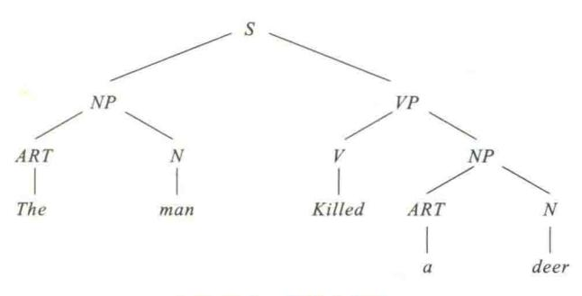

图 11.1 句法分析树

上述例子描述了一个自上向下的推导过程:从初始符号 S 开始,然后不断地选择合适的重写规则,用该规则的右部代替左部,最后得到完整的句子。

另一种形式的推导称为自下向上的过程,该过程从所要分析的句子开始,然后用重写规则的 左部代替右部,直到初始符号 S。

## 11.4.3 转移网络

转移网络(transition network,TN)是计算机自动分析语法的一种实现形式,用于计算机内语言的自动生成。句法分析中的转移网络由结点和带有标记的弧组成。结点表示状态,其中一个状态为起始状态,另一个或多个为结束状态。弧对应于符号。该符号表示可以实现从一个给定的状态转移到另一个状态的条件和转移方向。

例如,重写规则的转移网络如图 11.2 所示。

用转移网络分析一个句子,首先从句子 S 开始启动。如果句子的表示形式和转移网络的部分结构(NP)匹配,那么控制会转移到和 NP 相关的网络部分。这样,转移网络进入中间状态,然后检查 VP 短语。在 VP 的转移网络中,假设整个 VP 匹配成功,则控制会转移到终止状态,并结束。

例如,句子 The man laughed.的状态转移网络如图 11.3 所示。

图 11.3 所示的转移网络含有 10 个虚线段,表示了网络中状态的控制流。首先,当控制在句子的  $S_0$  发现 NP 时,会通过虚线 1 移动到 NP 转移网络。如果在 NP 转移网络的  $S_0$  又发现了 ART,那么通过虚线 2 进入 ART 网络,从 ART 网络选择 the,然后通过虚线 3 返回 NP 转移网络的  $S_1$ 。现在,在 NP 转移网络的  $S_1$  找到 N,通过弧 4 转移到转移网络 N 的初始结点  $S_0$ 。该过程一直这样进行下去,直到通过弧 10 抵达句子的转移网络的  $S_2$ 。

{8}------------------------------------------------

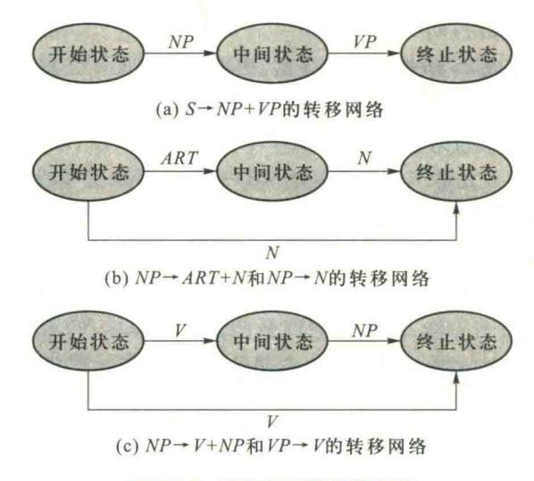

图 11.2 重写规则的转移网络

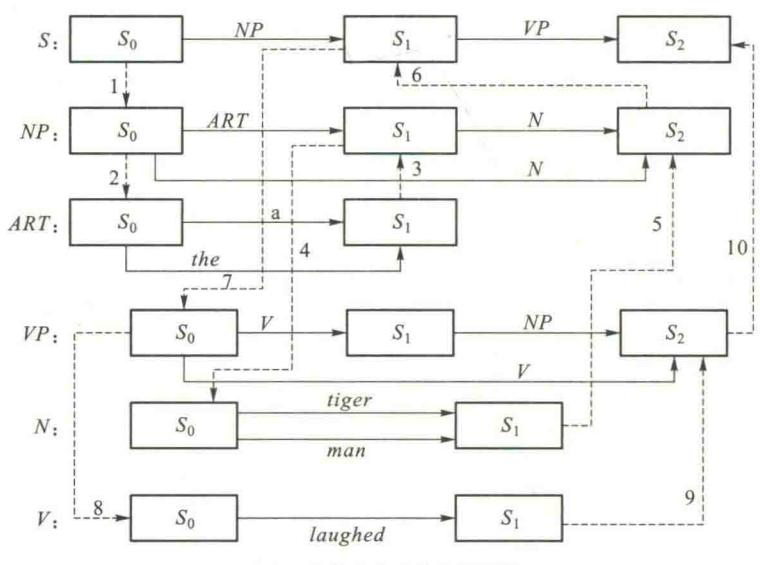

虚线上的数字表示转移的顺序

图 11.3 The man laughed.的转移网络

## 11.4.4 扩充转移网络

1970年,美国人工智能专家伍兹(Woods W.)提出扩充转移网络(augmented transition network, ATN),并应用于著名的 LUNAR 系统中。

ATN 是由一组网络构成,每个网络都有一个网络名,每条弧上的条件扩展为条件加上操作。这种条件和操作采用寄存器的方法来实现,在分析树的各个成分结构上都放上寄存器,

{9}------------------------------------------------

用来存放句法功能和句法特征,条件和操作将对它们不断地进行访问和设置。ATN 弧上的标记也可以是其他网络的标记名,因此,ATN 是一种递归网络。

ATN 的每个结点都有一个寄存器。每个寄存器由两部分构成:上半部分是句法特征寄存器,下半部分是句法功能寄存器。在句法特征寄存器中,每一维特征都由一个特征名和一组特征值以及一个缺省值来表示。如"数"的特征维可有两个特征值"单数"和"复数",缺省值可以是空值。英语中动词的形式可以用一维特征来表示:Form:present, past, present-participle, past-participle.Default:present。句法功能寄存器则反映了句法成分之间的关系和功能。

图 11.4 是一个简单的名词短语的扩充转移网络。

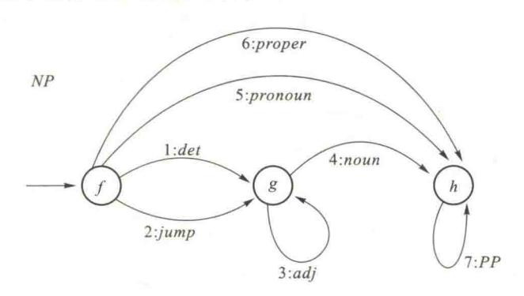

图 11.4 名词短语的扩充转移网络

网络中弧上的条件 C 和操作 A 如下所示:

$$NP-1:f \xrightarrow{det.} g$$
 //当前词为限定词,网络状态由  $f$  转移至  $g$  //使  $NP$  的特征"数"的特征值等于当前 //输入限定词的特征"数"的特征值  $NP-2:f \xrightarrow{jump} g$  //网络状态直接由  $f$  转移至  $g$  ,不对应句法 //成分和输入词汇  $NP-3:g \xrightarrow{adj} g$  //当前词为形容词,进入子网络 //本层网络状态不变  $NP-4:g \xrightarrow{noun} h$  //当前词为名词,网络状态由  $g$  转移至  $h$  //当前词为名词,网络状态由  $g$  转移至  $h$  //如果当前名词数与  $h$  P 的数相同或 //者  $h$  P 的数为空  $h$  //如果当前名词的特征"数"的特征值等于 //当前输入名词的特征"数"的特征值  $h$   $h$  //当前词为代词,网络状态由  $h$   $h$  //当前词为代词,网络状态由  $h$   $h$  //当前词为代词,网络状态由  $h$   $h$  //当前词为代词,网络状态由  $h$   $h$   $h$  //当前词为代词,网络状态由  $h$   $h$  //如果当前名词数与  $h$  P 的数相同或者

{10}------------------------------------------------

//NP 的数为空 //NP 的为空 //NP 的特征"数"的特征值等于当 // 前输入代词的特征"数"的特征值等于当 // 前输入代词的特征"数"的特征值  $NP-6:f \xrightarrow{proper} h$  // 当前词为专用词,网络状态由 f 转移 // 至 h  $A:Number \leftarrow *.Number$  // 使 NP 的特征"数"的特征值等于当 // 前输入专用词的特征"数"的特征值  $NP-7:h \xrightarrow{pp} h$  // 进入子网络,介词短语网络,本层网络 // 状态不变,使网络具有递归性

该扩充转移网络的网络名为 NP,用来检查其中的数的一致问题。其中用到的特征是 Number(数),它有两个值 singular(单数)和 plural(复数),缺省值是 $\emptyset$ (空)。C 是弧上的条件,A 是弧上的操作,\* 是系统当前正在处理的词,proper 是专有名词,det 是限定词,PP 是介词短语,\* . Number 是当前词的"数"。

网络 NP 可以是其他网络的一个子网络,也可以包含其他网络,如其中的 PP 就是一个子网络,这就是网络的递归性。弧 NP-1 将当前词的 Number 放入当前 NP 的 Number 中,而弧 NP-4 则要求当前 noun 与 NP 的 Number 相同时,或者 NP 的 Number 为空时,将 noun 作为 NP 的 Number,这就要求 det 的数和 noun 的数是一致的。因此,this book, the book, the books, these books 都可顺利通过这一网络,但是 this books 或 these book 就无法通过。

如果当前 NP 是一个代词(pronoun)或者专用名词(proper),那么网络就从 NP-5 或 NP-6 通过,这时 NP 的数就是代词或专用名词的数。PP 是一个修饰前面名词的介词短语,一旦到达 PP 弧就马上转入子网络 PP。

## 11.5 语义分析

句法分析后还不能理解所分析的句子,至少还需要进行语义分析。语义分析是把分析得到的句法成分与应用领域中的目标表示相关联。简单的做法就是依次使用独立的句法分析程序和语义解释程序。但这样做使得句法分析和语义分析相分离,在很多情况下无法决定句子的结构。扩充转移网络 ATN 允许把语义信息加进句法分析,并充分支持语义解释。为有效地实现语义分析,并能与句法分析紧密结合,已经提出了多种语义分析方法,下面介绍语义文法和格文法。

## 11.5.1 语义文法

语义文法是将文法知识和语义知识组合起来,以统一的方式定义为文法规则集。语义文法是上下文无关的,形态上与面向自然语言的常见文法相同,只是不采用 NP、VP 及 PP 等表示句法成分的非终止符,而是使用能表示语义类型的符号,从而可以定义包含语义信息的文法规则。

{11}------------------------------------------------

下面给出一个关于舰船信息的例子,可以看出语义文法在语义分析中的作用。

S → PRESENT the ATTRIBUTE of SHIP

PRESENT → What is | can you tell me

ATTRIBUTE → length | class

SHIP → the SHIPNAME | CLASSNAME class ship

SHIPNAME → Huanghe | Changjiang

CLASSNAME → carrier | submarine

上述重写规则从形式上看和上下文无关文法是一样的。其中,用全是大写英文字母表示的单词代表非终止符,用全是小写英文字母表示的单词代表终止符。这里可以看出,PRESENT 在构成句子的时候,后面必须紧跟着单词 the,这种单词之间的约束关系显然表示语义信息。用语义文法分析句子的方法与普通的句法分析文法类似,特别是同样可以用扩充转移网络 ATN 对句子做语义文法分析。

语义文法不仅可以排除无意义的句子,而且具有较高的效率,对语义没有影响的句法问题可以忽略。但是实际应用该文法时需要很多的文法规则,因此一般适用于严格受到限制的领域。

## 11.5.2 格文法

格文法是由 Filimore 提出的,主要是为了找出动词和跟动词处在结构关系中的名词的语义 关系,同时也涉及动词或动词短语与其他的各种名词短语之间的关系。也就是说,格文法的特点 是允许以动词为中心构造分析结果,尽管文法规则只描述句法,但分析结果产生的结构却对应于 语义关系,而非严格的句法关系。例如,对于英语句子

Mary hit Bill.

的格文法分析结果可以表示为

(hit(Agent Mary)
(Dative Bill))

在格表示中,一个语句包含的名词词组和介词词组均以它们与句子中动词的关系来表示,称为格。上面的例子中 Agent 和 Dative 都是格,而像"(Agent Mary)"这样的基本表示称为格结构。

在传统文法中,格仅表示一个词或短语在句子中的功能,如主格、宾格等,反映的也只是词尾的变化规则,故称为表层格。如果格表示语义方面的关系,反映句子中包含的思想、观念等,则称为深层格。和短语结构文法相比,格文法更好地描述句子的深层语义。

无论句子的表层形式如何变化,如主动语态变为被动语态、陈述句变为疑问句、肯定句变为否定句等,其底层的语义关系、各名词成分所代表的格关系都不会发生相应的变化。例如:被动句 Bill was hit by Mary.与上述主动句具有不同的句法分析树,如图 11.5 所示。两者格表示完全相同,这说明这两个句子的语义相同,并实现多对一的源-目的映射。

{12}------------------------------------------------

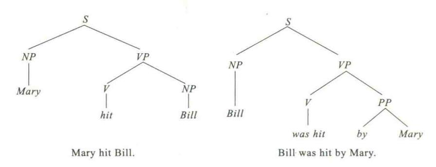

图 11.5 主动句和被动句的句法分析树

格文法和类型层次相结合,可以从语义上对 ATN 进行解释。类型层次描述了层次中父子之间的子集关系。根据层次中事件或项的特化(specialized)/泛化(generalized)关系,类型层次在构造有关动词及其宾语的知识,或者确定一个名词或动词的意义时非常有用。

在类型层次中,为了解释 ATN 的意义,动词具有关键的作用。因此可以使用格文法,通过动作实施的工具或手段来描述动作主体(agent)的动作。例如:动词 laugh 可以是通过动作主体的嘴唇来描述的一个动作,可以带给自己或他人乐趣。因此,laugh 可以表示为如图 11.6 所示的格框架。

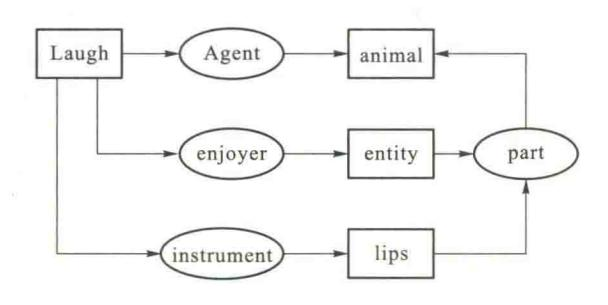

图 11.6 动词 laugh 的格框架

在图 11.6 中,矩形表示世界的描述,两个矩形之间的关系用椭圆表示。为了对 ATN 进行语义解释,需要指出下面问题:

- ① 当从 ATN 中的句子 S 开始分析时,需要确定名词短语和动词短语以得到名词和动词的格框架表示。将名词和对应格框架中的主语(动作主体)关联在一起。
- ② 当处理名词短语时,需要确定名词,确定冠词的数特征(单数还是复数),并将动作的制造者和名词相关联。
- ③ 当处理动词短语时,需要确定动词。如果动词是及物的,则找到其对应的名词短语,并说明它为动词的施加对象。
  - ④ 当处理动词时,检索它的格框架。

{13}------------------------------------------------

⑤ 当处理名词时,检索它的格框架。

格文法是一种有效的语义分析方法,有助于删除句法分析的歧义性,并且易于使用。格表示易于用语义网络表示法描述,从而多个句子的格表示相互关联形成大的语义网络,以便开发句子间的关系,理解多句构成的上下文,并用于回答问题。

## 11.6 基于语料库的大规模文本处理

### 11.6.1 语料库及其特征

传统的句法-语义分析主要是基于规则的方法。由于自然语言理解的复杂性,各种知识的数量巨大,而且具有高度的不确定性,利用规则不可能完全准确地表达理解自然语言所需的各种知识。单纯依靠规则方法曾经使机器翻译一度陷入低谷。因此,1990年8月在赫尔辛基召开的第13届国际计算机语言学大会上,提出了处理大规模真实文本是自然语言理解的主要目标。

20世纪90年代,自然语言理解的研究在基于规则的技术中引入语料库的方法,其中包括统计方法、基于实例的方法和通过语料加工手段使语料库转化为语言知识库的方法等。使用统计的方法,使机器翻译的正确率达到60%,汉语切分的正确率达到70%,汉语语音输入的正确率达到80%。许多研究人员相信,基于语料库的统计模型(如n-gram 模型、Markov 模型、向量空间模型)不仅能胜任词类的自动标注任务,而且也能够应用到句法和语义等更高层次的分析上,从而有希望解决大规模真实文本处理这一非常困难的课题,对基于规则的自然语言处理系统提供了一种很有效的补充机制。

下面以 WordNet 为例来说明语料库中包括什么样的语义信息。WordNet 是 1990 年由 Princeton 大学的 Miller 等人设计和构造的。一部 WordNet 词典包含将近 95 600 个词形(51 500 单词和 44 100 搭配词)和 70 100 个词义,分为名词、动词、形容词、副词和虚词 5 类。在 WordNet 词典中,按语义而不是按词性来组织词汇信息,名词有57 000 个,含有 48 800 个同义词集,分成 25 类文件,平均深度 12 层。最高层为根概念,不含有固有名词。

传统的词典通常是把各类不同的信息放入一个词汇单元中加以解释,包括拼音、读音、词形变化及派生词、词根、短语、时态变换的定义及说明、同义词、反义词、特殊用法注释,偶尔还有图示或插图,包含着相当可观的信息存储。但是,传统词典不太适合自然语言理解的需求。例如,对于名词"树",传统的词典一般解释为:一种大型的、木制的、多年生长的、具有明显树干的植物。基本上是上位词加上辨别特征,但还缺少许多信息。例如:

- ① 没有谈到树有根,有植物纤维壁组成的细胞,甚至也没有提及它们是生命的组织形式。但是在 WordNet 中,只要查一下它的上位词"植物",就可以找到这些信息。
  - ② 树的定义没有包括对等词的信息,不能推测其他种类的植物存在的可能性。
  - ③ 对于各种树都感兴趣的读者,除了查遍词典,没有别的办法。
  - ④ 每个人对树都有自己的认识,而词典的编撰者又没有将其写在树的定义中。如树包括树

{14}------------------------------------------------

皮、树枝;树由种子生长而成等。

可以看出,普通词典中遗漏的大部分是构造性信息而不是事实性的信息。

WordNet 是按一定结构组织起来的语义类词典,主要特征如下:

- ① 整个名词组成一个继承关系。WordNet 有着严格的层次关系,一个单词可以把它所有前辈的一般性的上位词的信息都继承下来,可以提供全局性的语义关系,具有 IS-A 关系。
- ② 动词是一个语义网。表达动词的意义对任何词汇语言学来说都是困难的。WordNet 不进行成分分析,而是进行关系分析,讨论动词间的纵向关系,即词汇蕴含关系。

为了研究自然语言理解,首先需要研究大规模真实语料库的建立和大规模、信息丰富的机读词典的编制方法。规模为几万、十几万甚至几十万的词,含有丰富的信息(如包含词的搭配信息、文法信息等)的计算机可用词典,是自然语言处理系统的基础。需要深入研究采用什么样的词典结构、包含词的哪些信息、如何对词进行选择、如何以大规模语料为资料建立词典,即如何从大规模语料中获取词等。

书面汉语不同于英语、法语、德语等印欧语言,词与词之间没有空格。在汉语自然语言处理中,凡是涉及句法、语义的研究,都要以词为基本单位来进行。词是汉语文法和语义研究的中心问题,也是汉语自然语言处理的关键问题。目前,对大规模汉语语料库的加工主要包括自动分词和标注,标注又包括词性标注和词义标注。下面简单介绍汉语文本自动分词及标注的方法。

## 11.6.2 汉语自动分词方法

汉语自动分词方法主要以基于词典的机械匹配分词方法为主。近年来,也有人提出无词典分词方法、基于专家系统和人工神经网络的分词方法。这里主要介绍常用的三种基于词典的机械匹配分词法。

### 1. 最大匹配法

最大匹配法(maximum matching method, MM 法)也称为正向最大匹配法,其基本思想是:在计算机中存放一个分词用词典,从待切分的文本中按自左到右的顺序截取一个定长的汉字串,通常为6至8个汉字(或长度为词典中的最大词长),这个字符串的长度称为最大词长。将这个具有最大词长的字符串与词典中的词进行匹配,若匹配成功,则可确定这个字符串为词,计算机程序的指针向后移动与给定最大词长相应个数的汉字,继续进行匹配,否则,把该字符串从右边逐次减去一个汉字,再与词典中的词进行匹配,直到成功为止。

## 2. 逆向最大匹配法

逆向最大匹配法(reverse maximum macthing method, RMM 法)的基本原理与 MM 法相同,所不同的是分词时对待切分文本的扫描方向。RMM 法从待切分文本中截取字符串的方向是从右到左。在与词典匹配不成功时,将所截取的汉字串从左至右逐次减去一个汉字,再与词典中的词进行匹配,直到匹配成功为止。实验表明,RMM 法的切词正确率要比MM 法高。

{15}------------------------------------------------

#### 3. 逐词遍历匹配法

逐词遍历匹配法(word-for-word ergodic matching method)中存放的词按由长到短的顺序,逐个与待切分的语料文本进行匹配,直到把文本中的所有词都切分出来为止。由于这种方法要把词典中的每一个词都匹配一遍,因此需要花费很多时间,算法的时间复杂度相应增加,切词速度较慢,切词的效率不高。

以上三种方法是最基本的机械性切词方法。还有一些方法都是在这三种方法基础上的改进,这些方法包括双向扫描法、设立切分标志法及最佳匹配法等。

汉语分词是汉语自然语言理解的关键。目前汉语分词技术距实际应用的要求还有很大距离。主要原因是在分词时,语言学家靠的是"语感",没有什么形式的定义。分词过程中经常出现歧义。特别是对于中外人名、中外地名、机构组织名、事件名、缩略语、派生词、各种专业术语以及在不断发展和约定俗成的一些新词语计算机更难切分。

### 11.6.3 汉语词性的标注方法

词性标注就是在给定句子中判定每个词的文法范畴,确定其词性并加以标注的过程。设定词汇的词性是构造语段的基础,但是词性兼类是英汉机器翻译中典型的歧义现象,如果语料的词性能自动标注,那么歧义问题就好解决了。在自然语言处理中,研究词性自动标注的目的主要是:第一,为了对文本进行文法分析或句法分析等更高层次的文本加工提供基础,以便在文摘、自动校对、OCR识别后处理等应用系统开发中提高准确率;第二,通过对标注过的语料进行统计分析等处理,可以抽取蕴含在文本中的语言知识,为语言学的研究提供可靠的数据,同时,又可以进一步运用这些知识,改进词性标注系统,提高词性标注系统的准确率。

词性标注的难点主要是兼类词的自动词类歧义排除。所谓兼类词是指那些具有两个或两个以上词性的词。由于汉语是一种没有词的形态的变化语言,词的类别不能像印欧语一样直接由词的形态来判断,再加上常用词的兼类现象严重等因素,因此,要确定一个词在文本中的词性有时是很困难的。

词性标注方法主要是兼类词的歧义排除方法。目前的方法主要有两大类:

### (1) 基于概率统计模型词性标注方法

代表性系统是 CLAWS 系统,它用统计模型来消除兼类词歧义,使自动标注的准确率达到 96%。1988年,S.J.DeRose 对 CLAWS 系统做了一些改进,利用线性规划方法降低系统的复杂性,提出了 VOLSUNGA 算法,大大提高了处理效率,使自动词性标注的正确率达到了实用水平。

### (2) 基于规则的词性标注方法

代表性系统是 TAGGIT,它是 Greene 和 Robin 出于语言学的目的,于 1977 年设计的词性标注系统。该系统采用基于上下文框架规则的方法,使用了具有 86 个标记的标记集和用于排除兼类词歧义的 3 300 条上下文框架规则,对美国的 BROWN 语料库进行标记,准确率为 77%。1992 年美国宾州大学 Brill 提出了一种基于转换的错误驱动学习机制,从带标语料库中自动获取转换

{16}------------------------------------------------

规则以用于词性的自动标注,所建立的基于规则的词性标注系统的标注准确率大大提高,获得了与基于统计模型同样高的准确率。

### 11.6.4 汉语词义的标注方法

词义标注就是对文本中的每个词根据其所属上下文给出它的语义编码,这个编码可以是词 典释义文本中的某个义项号,也可以是义类词典中相应的义类编码。

自动词义标注就是利用计算机通过逻辑推理机制,利用文本的上下文环境,对词的词义进行自动判断,选择词的某一正确义项并加以标注的过程。

研究词义自动标注除了对语言学研究有重要意义外,在自然语言处理的很多领域都有非常重要的作用,如语音合成、情报检索、机器翻译、自动校对及 OCR 识别后处理等。所以,词义标注是当前自然语言信息处理的一个热门课题。

词义标注的难点是对多义词的歧义排除。在各种语言中,一词多义的现象普遍存在,要确定一个词的词义一定要依据上下文环境,如果没有上下文环境,即使是人,也很难确定一个词的词义,更何况由计算机来标注。

目前,多义词的歧义排除方法的研究尚处于初级阶段。近几年来,由于统计概率模型在词性标注方面的成功以及计算机网络技术的发展,越来越多的研究转向了基于语料库的概率统计方法。

## 11.7 机器翻译

## 11.7.1 机器翻译方法概述

人类对机器翻译(machine translation, MT)系统的研究开发已经持续了50多年。起初,机器翻译系统主要是基于双语字典进行直接翻译,几乎没有句法结构分析。直到20世纪80年代,一些机器翻译系统采用了间接方法。在这些方法中,源语言文本被分析转换成抽象表达形式,随后利用一些程序,通过识别词结构(词法分析)和句子结构(句法分析)解决歧义问题。其中有一种方法将抽象表达设计为一种与具体语种无关的"中间语言",可以作为许多自然语言的中介。这样,翻译就分成两个阶段:从源语言到中间语言,从中间语言到目标语言。另一种更常用的间接方法是将源语言表达转化成为目标语言的等价表达形式。这样,翻译便分成三个阶段:分析输入文本并将它表达为抽象的源语言;将源语言转换成抽象的目标语言;最后生成目标语言。

机器翻译系统可以分成下列几种类型。

### 1. 直译式机器翻译系统

直译式机器翻译系统(direct translation MT systems)通过快速的分析和双语词典,将原文译出,并且重新排列译文的词汇,以符合译文的句法。直译式翻译系统如图 11.7 所示。

{17}------------------------------------------------

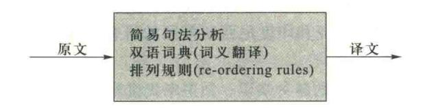

图 11.7 直译式翻译

大多数著名的大型机器翻译系统本质上都是直译式系统,如 Systran、Logos 和 Fujitsu Atlas;其次是改进的直译式系统,这些系统与其父辈不同,是高度模块化的系统,很容易被修改和扩展。例如著名的 Systran 系统在开始设计时只能完成从俄文到英文的翻译,但现在已经可以完成很多语种之间的互译。Logos 开始只针对德语到英语的翻译,而现在可以将英语翻译成法语、德语、意大利语,以及将德语翻译成法语和意大利语。只有 Fujitsu Atlas 系统至今仍把自己局限于英日、日英的翻译。

#### 2. 规则式机器翻译系统

规则式机器翻译系统(rule-based MT systems)是先分析原文内容,产生原文的句法结构,再转换成译文的句法结构,最后再生成译文。规则式机器翻译系统通过识别、标注兼类多义词的词类,对多义词意义进行排歧;对某些同类词性的多义词再按其词法规则不同消除歧义,规则式翻译系统如图 11.8 所示。

当前主流的机器翻译还都是规则式机器翻译系统。

### 3. 中介语式机器翻译系统

中介语式机器翻译系统(inter-lingual MT systems)类似转换式系统,但会先生成一种中介的 表达方式,而非特定语言的结构;再由中介的表达式,转换成译文。程序语言的编译常采取此策 略。中介语式机器翻译系统如图 11.9 所示。

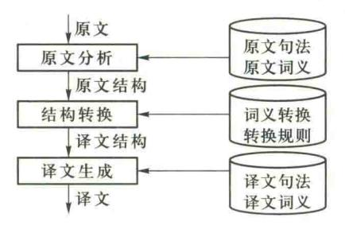

图 11.8 规则式翻译

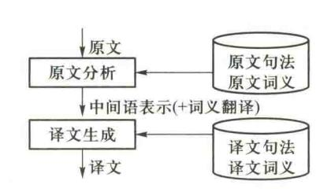

图 11.9 中介语式翻译

最重要的大型机"转换型"机器翻译系统是 METAL。20 世纪 80 年代初期,德国西门子公司提供了大部分资金支持开发 METAL,直到 80 年代末才面市。目前最有名的两个"转换型"系统是 Grenoble 的 Ariane 和欧共体资助的 Eurotra。Ariane 有望成为法国国家机器翻译系统;而 Eurotra 无疑是最复杂的机器翻译系统之一,经过西欧许多国家数百名研究人员近 10 年的努力,目前

{18}------------------------------------------------

仍未能开发出实用系统。20世纪80年代末,日本政府出资支持开发用于亚洲语言之间互译的中间语言系统,中国、泰国、马来西亚和印度尼西亚等国的研究人员均参加了这一研究。

#### 4. 知识库式机器翻译系统

翻译经常是需要除了词汇之外的各种知识。知识库式机器翻译系统(knowledge-based MT systems)是建立一个翻译需要的知识库,构成翻译专家系统。但由于知识库的建立十分困难,因此目前此类研究多半有限定范围,并且使用知识获取工具(knowledge acquisition),自动或半自动地大量收集相关知识,以充实知识库的内容。

#### 5. 统计式机器翻译系统

1994年,IBM 公司的 A.Berger, P.Brown 等发表了著名的论文《The Candide System of Machine Translation》。他们用统计方法和各种不同的对齐技术,给出了统计式机器翻译系统(statistics-based MT systems) Candide。

源语言中任何一个句子都可能与目标语言中某些句子相似,这些句子的相似程度可能都不相同,统计式机器翻译系统能找到最相似的句子。

#### 6. 范例式机器翻译系统

范例式机器翻译系统(example-based MT systems)是将过去的翻译结果当成范例,产生一个范例库。在翻译一段文字时,参考范例库中近似的例子,并处理差异处。

实际的机器翻译系统往往是混合式机器翻译系统(hybrid MT systems),即同时采用多种翻译策略,以达到正确翻译的目标。

范例式机器翻译就是对被翻译的源语句通过翻译实例数据库检索出要翻译的目标语句。范例式机器翻译系统主要包括两部分工作:一是建立翻译实例数据库,二是翻译的操作检索算法。

#### 7. 翻译记忆

由于目前还没有一种机器翻译产品的效果能让人满意,对于专业翻译来说,目前广泛采用翻译记忆(translation memory,TM)技术。与期望完全替代人工翻译的机器翻译技术不同,翻译记忆实际只是起辅助翻译的作用,也就是计算机辅助翻译(computer aided translation,CAT)。

翻译记忆是一种通过计算机软件来实现的专业翻译解决方案,与机器翻译有着本质的区别。以欧盟为例,每天都有大量的文件需要翻译成各成员国的文字,翻译工作量极大,自1997年采用德国塔多思(TRADOS)公司的翻译记忆软件以来,欧盟的翻译工作效率大大提高。如今,欧盟、国际货币基金组织等国际组织,微软、SAP、Oracle 和德国大众等跨国企业以及许多世界级翻译公司和本地化公司都以翻译记忆软件作为信息处理的基本工具。

翻译记忆的基本原理是:用户利用已有的原文和译文,建立起一个或多个翻译记忆库,在翻译过程中,系统将自动搜索翻译记忆库中相同或相似的翻译资源(如句子、段落等),给出参考译文,使用户避免无谓的重复劳动,只需专注于新内容的翻译。翻译记忆库同时在后台不断学习和自动储存新的译文,变得越来越"聪明"。

由于翻译记忆实现的是原文和译文的比较和匹配,因此能够支持多语种之间的双向互译。 以德国塔多思公司为例,该公司的产品基于 UNICODE(统一字符编码),支持 55 种语言。

{19}------------------------------------------------

### 11.7.2 循环神经网络

#### 1. 循环神经网络的概念

BP 神经网络和卷积神经网络等前馈神经网络都是从输入层到隐藏层再到输出层,对于很多问题却无法处理。例如,要预测句子的下一个单词是什么,一般需要用到前面的单词,因为一个句子中前后单词并不是独立的。例如, $x_{t-1}$ , $x_{t}$ , $x_{t+1}$ 是输入, $y_{t-1}$ , $y_{t}$ , $y_{t+1}$ 是输出,如果输入"我是中国",即  $x_{t-1}$  =我, $x_{t}$  =是, $x_{t+1}$  =中国,那么  $y_{t-1}$  =是, $y_{t}$  =中国这两个词,需要预测下一个词最有可能是什么?我们可以想到  $y_{t+1}$ 应该是"人"的概率比较大。

循环神经网络(recurrent neural network, RNN)是一种对序列数据建模的神经网络,即一个序列当前的输出与前面的输出也有关,会对前面的信息进行记忆并应用于当前输出的计算中。因此,RNN适合处理和预测序列数据。

RNN 的结构如图 11.10 所示。

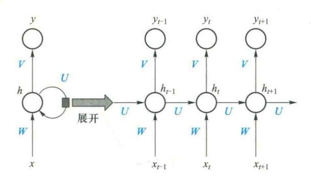

图 11.10 RNN 的结构图

在图 11.10 中,每个圆圈可以看作是一个单元,而且每个单元做的事情也是一样的,因此可以折叠成左半图的形式。

RNN 整体结构就是其中一个单元网络结构重复使用的结果,所以称为循环神经网络。相比普通的神经网络,循环神经网络的不同之处在于:RNN的隐藏层之间的节点是有连接的,并且隐藏层的输入不仅包括输入层的输出还包括上一时刻隐藏层的输出。这使得 RNN 可以通过循环反馈连接保留前面所有时刻的信息,这赋予了 RNN 的记忆功能。这些特点使得 RNN 非常适合用于对时序信号的建模。

#### 2. 循环神经网络的训练

循环神经网络的训练是一种基于时间的反向传播算法(back propagation through time, BPTT)。

BPTT 算法是针对循环层设计的训练算法,它的基本原理和 BP 算法是一样的,也包含同样的三个步骤:

## (1) 前向计算每个神经元的输出值;

{20}------------------------------------------------

- (2) 反向计算每个神经元的误差项值,它是误差函数 E 对神经元 i 的加权输入的偏导数;
- (3) 计算每个权值的梯度。用随机梯度下降算法更新权值。

假设时刻为t时,输入为 $x_i$ ,隐层状态为 $h_i$ 。 $h_i$  不仅和当前时刻的输入 $x_i$  有关,也和上一个时刻的隐层状态 $h_{i-1}$ 有关。

$$z_i = Uh_{i-1} + Wx_i + b \tag{11.1}$$

$$\boldsymbol{h}_{t} = f(\boldsymbol{z}_{t}) \tag{11.2}$$

或者

$$h_{i} = f(Uh_{i-1} + Wx_{i} + b)$$
 (11.3)

其中, $z_t$  为隐层的输入;f(g) 是非线性激励函数;U 为状态-状态权重矩阵;W 为状态-输入权重矩阵;b 为偏置。

在一般神经网络中,每一个网络层的参数不是共享的。而在 RNN 中,所有层均共享同样的 参数 W、U、b,只是输入不同,因此大大地减少了网络中需要学习的参数。

#### 3. 循环神经网络的递归过程

从循环神经网络的结构特征可以看出,它适合解决与时间序列相关的问题。可以将一个序列上不同时刻的数据依次传入循环神经网络的输入层,而输出可以是对序列中下一个时刻的预测,也可以是对当前时刻信息的处理结果。循环神经网络要求每一个时刻都有一个输入,但是不一定每一个时刻都需要有输出。

循环神经网络可以往前看获得任意多个输入值,其递归推导方法如式(11.4)所示,即 RNN的输出层 y 和隐藏层 h 的计算方法:

$$\mathbf{y}_{t} = g(\mathbf{V}\mathbf{h}_{t}) \tag{11.4}$$

如果反复把式(11.3)带入到式(11.4),得

$$y_{t} = g(Vh_{t})$$

$$= g(Vf(Wx_{t}+Uh_{t-1}+b_{t}))$$

$$= g(Vf(Wx_{t}+Uf(Wx_{t-1}+Uh_{t-2}+b_{t-1})+b_{t}))$$

$$= g(Vf(Wx_{t}+Uf(Wx_{t-1}+Uf(Wx_{t-2}+Uh_{t-3}+b_{t-2})+b_{t-1})+b_{t}))$$

$$= g(Vf(Wx_{t}+Uf(Wx_{t-1}+Uf(Wx_{t-2}+Uf(Wx_{t-3}+L)+b_{t-2})+b_{t-1})+b_{t}))$$

$$= g(Vf(Wx_{t}+Uf(Wx_{t-1}+Uf(Wx_{t-2}+Uf(Wx_{t-3}+L)+b_{t-2})+b_{t-1})+b_{t}))$$

从上述递归推导可以看出,RNN的输出层y和输入系列x,的前t个时刻都有关。

## 11.7.3 长短期记忆神经网络

循环神经网络的主要缺点是长期依赖问题。最有效的解决方法是进行选择性遗忘,同时也进行有选择的更新。1997年,Hochreiter & Schmidhuber 提出的长短期记忆神经网络(long short-term memory neural network,LSTM),是一种 RNN 特殊的类型,使用"累加"的形式计算状态,这种累加形式导致导数也是累加形式,因此避免了梯度消失,得到了广泛应用。

#### LSTM 的结构

所有循环神经网络都有一个重复结构的模型形式。在标准的 RNN 中,重复的结构是一个简

{21}------------------------------------------------

单的循环体,如图 11.11 所示。然而 LSTM 的循环体是一个拥有四个相互关联的全连接前馈神经网络的复制结构,如图 11.12 所示。

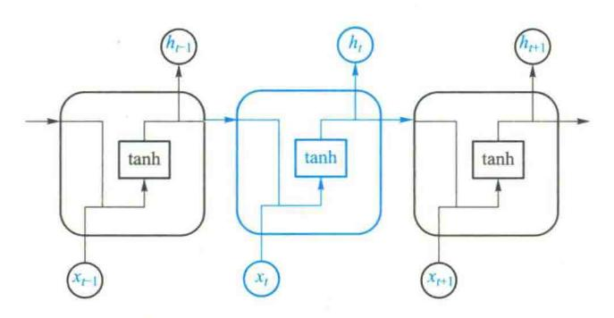

图 11.11 循环神经网络重复结构图

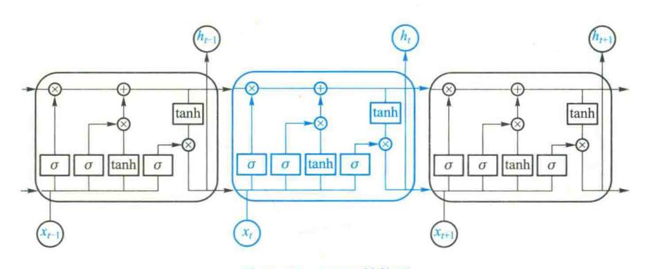

图 11.12 LSTM 结构图

LSTM 利用三个门(gate)操作来管理和控制神经元的状态信息。

#### (1) 遗忘门

## LSTM 的第一步是用遗忘门(forget gate layer)确定从上一个时刻的状态中丢弃什么信息。

遗忘门是一个具有 Sigmoid 全连接的前馈神经网络,如图 11.13 所示。遗忘门的输入是  $h_{\iota-1}$  和  $x_{\iota}$  组成的向量,输出是向量  $f_{\iota}$  。向量  $f_{\iota}$  是由 1 和 0 组成,1 表示能够通过,0 表示不能通过。其函数式为

$$f_t = \sigma(W_f[h_{t-1}, x_t] + b_f)$$
 (11.6)

#### (2) 输入门

### LSTM 的第二步用输入门(input gate layer)确定哪些输入信息要保存到神经元的状态中。

输入门是由两个前馈神经网络组成,如图 11. 14 所示。第一个有 Sigmoid 层的全连接前馈神经网络,决定哪些值将被更新;第二个有 tanh 层的全连接前馈神经网络,其输出是一个向量  $C_\iota$ , 向量可以被添加到当前时刻的神经元状态中;最后根据两个神经网络的结果创建一个新的神经元状态。其函数关系为

{22}------------------------------------------------

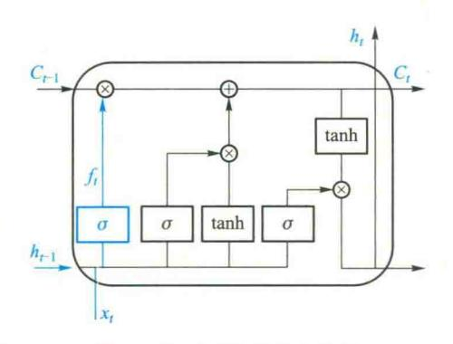

图 11.13 LSTM 的遗忘门图

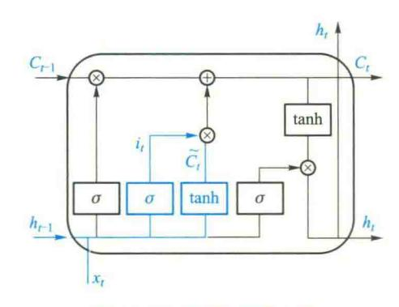

图 11.14 LSTM 的输入门

$$i_i = \sigma(w_i [h_{i-1}, x_i] + b_i)$$
 (11.7)

$$\tilde{C}_{t} = \tanh(W_{C}[h_{t-1}, x_{t}] + b_{c})$$
 (11.8)

#### (3) 状态控制

第三步就可以更新上一时刻的状态  $C_{i-1}$ 为当前时刻的状态  $C_{i}$  了。

通过第一步的遗忘门得到的控制向量,过滤掉一部分  $C_{\iota-1}$ 信息,如图 11.15 所示的乘法操作;通过第二步的输入门根据输入向量计算新状态,通过这个新状态和  $C_{\iota-1}$ 状态构建一个新的状态  $C_{\iota}$ ,如图 11.15 所示的加法操作。其函数关系为

$$C_t = f_t * C_{t-1} + i_t * \widetilde{C}_t \tag{11.9}$$

#### (4) 输出门

最后一步就是用输出门(output gate layer)确定神经元的输出向量  $h_i$ 。LSTM 的输出门如图 11. 16 所示。

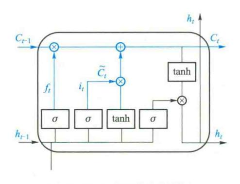

图 11.15 LSTM 状态控制图

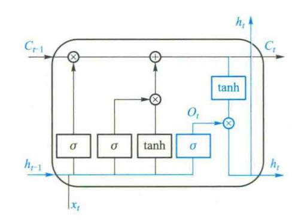

图 11.16 LSTM 的输出门

首先通过 Sigmoid 层生成一个过滤向量;然后通过一个 tanh 函数计算当前时刻的  $C_t$  状态向量,即将向量每个值的范围变换到[-1,1]之间。其函数关系为

{23}------------------------------------------------

$$o_{t} = \sigma(W_{0}[h_{t-1}, x_{t}] + b_{0})$$
(11.10)

$$h_{i} = o_{i} \tanh(C_{i}) \tag{11.11}$$

### 11.7.4 基于循环神经网络的机器翻译

循环神经网络是一种对序列数据建模的神经网络,成为常用的对句子进行编码的神经网络。例如,给定源语言句子"Economic growth has slowed down in recent years."。如图 11. 17 所示,循环神经网络在每个时刻,根据上一个时刻的隐含层  $h_{t-1}$ 、当前的输入  $x_t$ ,生成当前时刻的隐含状态  $h_t$ ,并基于当前的隐含状态预测当前时刻的输出。

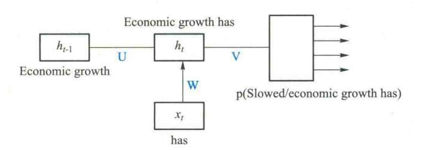

图 11.17 循环神经网络示例

首先将句子里的第一个词"Economic"输入循环神经网络,产生第一个隐含状态  $h_1$ ,此时隐含状态  $h_1$  便包含了第一个词"Economic"的信息。下一步输入第二个词"growth",循环神经网络将第二个词的信息同第一个隐含状态  $h_1$  进行融合,产生第二个隐含状态  $h_2$ ,如此则第二个隐含状态  $h_2$  便包含了前两个词"Economic growth"的信息。用同样的方法依次将源语言句子里所有的词输入神经网络,每输入一个词都会同前一时刻的隐含状态进行融合,产生一个包含当前词信息和前边所有词信息的新的隐含状态。

当把整个句子所有的词输入进去之后,最后的隐含状态理论上包含了所有词的信息,便可以 作为整个句子的语义向量表示,该语义向量称为源语言句子的上下文向量。

图 11.18 是基于源语言句子编码表示的循环神经网络翻译模型示例。

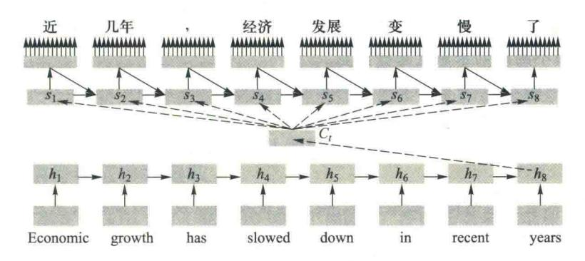

图 11.18 循环神经网络翻译模型示例

{24}------------------------------------------------

编码器将源语言句子编码为一个源语言句子的上下文向量,解码器的任务是根据编码器生成的该上下文向量,生成目标语言句子的符号化表示。

给定源语言的上下文向量,解码器循环神经网络首先产生第一个隐含状态  $s_1$ ,并基于该隐含状态预测第一个目标语言词"近",然后第一个目标语言词"近"会被作为下一个时刻的输入,连同第一个隐含状态  $s_1$  以及上下文向量  $C_i$ ,来产生第二个隐含状态  $s_2$ ,该隐含状态  $s_2$  包含了目标语言句子第一个词"近"的信息和源语言句子的信息,并用来预测目标语言句子第二个词"几年"。第二个目标语言词"几年"会被再次作为输入来产生第三个隐含状态,如此循环下去,直到预测到一个句子的结束符为止。

神经机器翻译是模拟人脑的翻译过程,近年来发展非常迅速,目前已经远远超过统计机器翻译,成为机器翻译的主流技术。目前,神经机器翻译领域主要研究如何提升训练效率、编解码能力以及双语对照的大规模数据集。

目前,网络上涌现了很多神经机器翻译的开源实现,例如 GroundHog。

## 11.8 语音识别

### 11.8.1 语音识别的概念

用语音实现人与计算机之间的交互,主要包括语音识别(speech recognition)、自然语言理解和语音合成(speech synthesis)。语音识别是完成语音到文字的转换。自然语言理解是完成文字到语义的转换。语音合成是用语音方式输出用户想要的信息。

现在已经有许多场合允许使用者用语音对计算机发命令,但是,目前还仅仅是使用有限词汇的简单句子,计算机还无法接受复杂句子的语音命令,实现这一目标还需要研究基于自然语言理解的语音识别技术。

相对于机器翻译,语音识别是更加困难的问题。机器翻译系统的输入通常是印刷文本,计算机能清楚地区分单词和单词串,而语音识别系统的输入是语音,其复杂度要大得多。口语有很多的不确定性。人与人交流时,往往是根据上下文提供的信息猜测对方所说的是哪一个单词,还可以根据对方使用的音调、面部表情和手势等来得到很多信息。特别是说话者会经常更正所说过的话,而且会使用不同的词来重复某些信息。

按照服务对象划分,语音识别系统可以是只针对某个用户的,称为特定人工作方式。如果系统是针对任何人的,则称为非特定人工作方式。

通俗地说,特定人的语音识别是要识别说话人是谁,而非特定人语音识别是要识别说的什么话。

语音识别技术主要包括特征提取技术、模式匹配准则以及模型训练技术三个方面。本节将 简单介绍语音识别的基本内容,包括语音信号的采集与预处理、特征参数的提取与识别等。

{25}------------------------------------------------

### 11.8.2 语音信号采集与预处理

语音识别过程包括从一段连续声波中采样,将每个采样值量化,得到声波的压缩数字化表示。采样值位于重叠的帧中,对于每一帧,抽取出一个描述频谱内容的特征向量。然后,根据语音信号的特征识别语音所代表的单词。

#### 1. 语音信号采集

语音信号采集是语音信号处理的前提。语音通常通过话筒输入计算机。话筒将声波转换为电压信号,然后通过 A/D 转换装置(如声卡)进行采样,从而将连续的电压信号转换为计算机能够处理的数字信号。

目前多媒体计算机已经非常普及,声卡、音箱、话筒等已是个人计算机的必备之物。其中声卡是计算机对语音信号进行加工的重要部件,它具有对信号滤波、放大、A/D 转换和 D/A 转换等功能。而且,现在操作系统都附带录音软件,通过它可以驱动声卡采集语音信号并保存为语音文件。

对于现场环境不好,或者空间受到限制,特别是对于许多专用设备,目前广泛采用基于单片机、DSP 芯片的语音信号采集与处理系统。

#### 2. 语音信号预处理

语音信号在采集后首先要进行滤波、A/D转换,预加重(preemphasis)和端点检测等预处理,然后才能进入识别、合成、增强等实际应用。

滤波的目的有两个:—是抑制输入信号各频域分量中频率超出 fs/2 的所有分量(fs为采样频率),以防止混叠干扰。二是抑制 50 Hz 的电源工频干扰。因此,滤波器应该是一个带通滤波器。

A/D 转换是将语音模拟信号转换为数字信号。A/D 转换中要对信号进行量化,量化后的信号值与原信号值之间的差值为量化误差,又称为量化噪声。

预加重处理的目的是提升高频部分,使信号的频谱变得平坦,保持在低频到高频的整个频带中,能用同样的信噪比求频谱,以便于频谱分析。

端点检测是从包含语音的一段信号中确定出语音的起点和终点。有效的端点检测不仅能使 处理时间减到最小,而且能排除无声段的噪声干扰。目前主要有两类方法:利用语音信号的时域 特征方法是利用音量和过零率进行端点检测,计算量小,但对气音造成误判。不同的音量计算也 会造成检测结果不同。利用语音信号的频域特征方法是用声音的频谱的变异数和熵检测,计算量较大。

## 11.8.3 语音信号特征参数提取

人说话的频率在 10 kHz 以下(每秒 10 000 个周期)。根据香农采样定理,为了使采样数据包含所需单词的信息,计算机每秒得到的样本数量应是需要记录的最高语音频率的两倍以上。一般将信号分割成若干块,信号的每个块称为帧,为了保证可能落在帧边缘的重要信息不会丢

{26}------------------------------------------------

失,应该使帧有重叠。例如,当使用 20 kHz 的采样频率时,标准的一帧为 10 ms,包含 200 个采样值。

话筒等语言输入设备可以采集到声波形状,如图 11.10 所示。虽然这些声音的波形包含了所需单词的信息,但用肉眼观察声波的波形得不到多少信息。所以,需要从采样数据中抽取那些能够帮助辨别单词的特征信息。在语音识别中,常用线性预测编码(linear prediction coding, LPC)技术抽取语音特征。线性预测分析的基本思想是:语音信号采样点之间存在相关性,可用过去的若干采样点线性组合预测现在和将来的采样点值。线性预测系数可以通过使预测信号和实际信号之间的均方误差最小来唯一确定。

语音线性预测系数作为语音信号的一种特征参数,已广泛应用于语音处理各个领域。

声波有两个主要特征:振幅和频率。声波的采样数据可以绘制成一个 x-y 平面图,x 轴表示时间,y 轴表示振幅,如图 11. 19 所示。在图 11. 19 中,声波波形由 3 个正弦波组成,但用肉眼很难分辨。为了能够看清楚声波中包含的主要频率波形,通常将采样信号经过傅里叶变换得到相应的频谱,再从频谱中看出波形中不同音素相匹配的主控频率组成成分。它们的振幅和频率都显示于图 11. 20 所示的频谱中,这段频谱是由数字化采样信号经过傅里叶变换得到的。频谱中有 3 个峰值,每个峰值都在正弦波的频率中心。

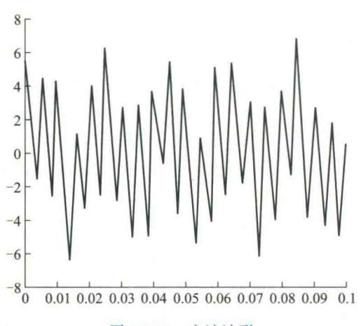

图 11.19 声波波形

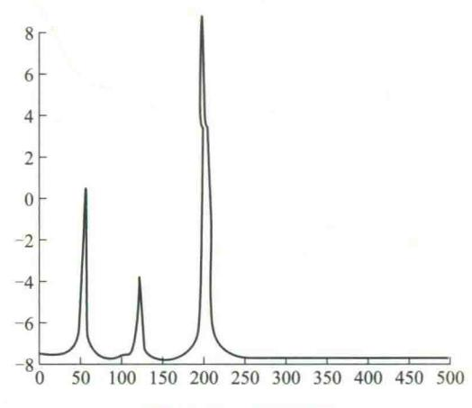

图 11.20 声波频谱

语音处理包括从一段连续声波中采样,将每个采样值量化,产生一个波的压缩数字化表示。 采样值位于重叠的帧中,对于每一帧,抽取出一个描述频谱内容的特征向量。然后,音素的可能 性可通过每帧的向量来计算。

## 11.8.4 向量量化

向量量化(vector quantization, VQ)技术是 20 世纪 70 年代后期发展起来的一种数据压缩和编码技术。经过向量量化的特征向量也可以作为后面隐马尔可夫模型中的输入观察

{27}------------------------------------------------

符号。

在标量量化中整个动态范围被分成若干个小区间,每个小区间有一个代表值,对于一个输入 的标量信号,量化时落入小区间的值就用这个代表值代替。因为这时的信号量是一维的标量,所 以称为标量量化。而向量量化的概念是用线性空间的观点,把标量改为一维的向量,对向量进行 量化,和标量量化一样把向量空间分成若干个小区域,每个小区域寻找一个代表向量,量化时落 入小区域的向量就用这个代表向量代替。

向量量化的基本原理是:将若干个标量数据组成一个向量(或者是从一帧语音数据中 提取的特征向量)在多维空间给予整体量化,从而可以在信息量损失较小的情况下压缩数 据量。

### 11.8.5 识别

当提取声音特征集合以后,就可以识别这些特征所代表的单词。本节重点关注单个单词的 识别。识别系统的输入是从语音信号中提出的特征参数,如 LPC 预测编码参数,当然,单词对应 于字母序列。语音识别所采用的统计方法一般有模板匹配法、随机模型法和概率语法分析法三 种。这三种方法都是建立在最大似然决策贝叶斯(Bayes)判决的基础上的。

#### (1) 模板(Template)匹配法

在训练阶段,用户将词汇表中的每一个词依次说一遍,并且将其特征向量作为模板存入模板 库。在识别阶段,将输入语音的特征向量序列依次与模板库中的每个模板进行相似度比较,将相 似度最高者作为识别结果输出。

#### (2) 随机模型法

随机模型法是目前语音识别研究的主流。其突出的代表是隐马尔可夫模型(hidden markov model, HMM)。语音信号可以看成是一种信号过程,它在足够短的时间段上的信号特征近似于 稳定,而总的过程可看成是依次相对稳定的某一特性过渡到另一特性。HMM 则用概率统计的方 法来描述这样一种时变的过程。

### (3) 概率语法分析法

这种方法是用于大长度范围的连续语音识别。语音学家通过研究不同的语音语谱图及其变 化发现,虽然不同的人说同一些语音时,相应的语谱及其变化有种种差异,但是总有一些共同的 特点足以使他们区别于其他语音,也即语音学家提出的"区别性特征"。另一方面,人类的语言 要受词法、语法、语义等约束,人在识别语音的过程中充分应用了这些约束以及对话环境的有关 信息。于是,将语音识别专家提出的"区别性特征"与来自构词、句法、语义等语用约束相互结 合,就可以构成一个"由底向上"或"自顶向下"的交互作用的知识系统,不同层次的知识可以用 若干规则来描述。

除了上面的三种语音识别方法外,还有许多其他的识别方法,例如基于人工神经网络的 语音识别方法,是目前语音识别的主流技术和研究热点。特别是深度学习方法近年来在智能 语音领域得到了广泛应用,取得了突出效果。基于深度学习的语音识别方法是通过深度神经 

{28}------------------------------------------------

网络模型的非线性建模能力,建立源说话人和目标说话人之间的映射关系,实现说话人个性信息的转换。由于深度神经网络具有较强的处理高维数据的能力,所以可以直接使用原始高维的谱包络特征训练模型,能够提高转换语音的话音质量。目前用于语音识别研究的比较典型的深度神经网络包括:受限玻尔兹曼机、深度置信神经网络、长短时记忆递归神经网络、深度卷积神经网络等。

## 11.9 基于隐马尔可夫模型的语音识别方法

20 世纪 80 年代至今美国在语音识别方面进行的一些重大研究项目,都采取以 HMM 为基本框架的统计途径,其中包括 AT&T 公司、Bell 实验室 L.R.Rabiner 等在连连语音识别和语音应答 (voice response)等方面的工作、IBM 公司 F.Jelinek 等在语音打字机方面所做的工作。HMM 成为目前语音识别主流的研究方法。

### 11.9.1 隐马尔可夫模型

马尔可夫模型是俄国数学家 Markov 在 1907 年研究俄国文学家普希金作品《奥涅金》中不同音的出现规律时所提出的一个数学模型。它是研究概率随时间传递的一种方法。

如果一个过程的"将来"仅仅依赖"现在",而不依赖"过去",则此过程称为马尔可夫过程。 时间和状态都是离散的马尔可夫过程称为马尔可夫链。

隐马尔可夫模型(hidden Markov model, HMM)是马尔可夫模型的一个拓展形式,是表示序列可能出现的一种方法。所谓的"隐"是指马尔可夫模型的状态集合观测不到。

隐马尔可夫模型数学描述:设 $X_n$ 是状态集合, $X_n$ 中的元素可组成马尔可夫模型,并设初始状态为 $\mu_0$ ,其中转移概率为 $a_{ji}=P(X_n=i|X_{n-1}=j)$ 。每个不可观测的状态 $X_n$ 都有生成字符与可观察的序列 $Y_n$ 中的字符相联系,生成概率记为 $b_{ij}=P(Y_n=j|X_n=i)$ 。由不可观测的状态 $X_n$ 、初始状态 $\mu_0$ 、可观测模型 $Y_n$ —起构成了隐马尔可夫模型。

在 HMM 中,圆圈表示状态,边表示状态之间的合法转换。每条边上有一个权值,表示从一个状态转移到另一个状态的概率。对于任何状态,只能顺着箭头的方向进行状态转移,而从一个状态发出的所有箭头上的概率之和为 1。如果状态不会再转向其他状态,被认为是终止状态。状态可以代表组成单词的字母,但这里只讨论通常的状态。

图 11.21 给出了一个具体的隐马尔可夫模型。模型中有 4 个状态,分别标记为1~4。图 11.21 中下面部分的值是观察权值,每个状态可以发出它下面列出的符号之一,权值是概率,显示发出每个符号的相对频率。注意:一个符号可以被多个状态发出。

图 11.21 中的模型可以看做一个序列生成器。例如,从状态 1 开始,在状态 4 结束,下面是可能生成的一些序列:1 2 3 4;1 2 2 3 3 3 4;1 2 2 2 2 3 4。

生成某个序列的概率就是生成该序列路径上的所有概率之积。例如,对于序列12334,路径是下列边的集合 $\{1-2,2-3,3-3,3-4\}$ ,概率为0.9\*0.5\*0.4\*0.6=0.108。

{29}------------------------------------------------

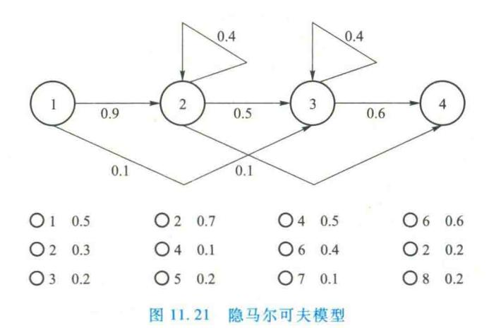

## 11.9.2 隐马尔可夫模型语音识别方法

语音信号在足够短的时间段上的特征近似于稳定,而总的过程可看成是依次相对稳定的某一特性过渡到另一特性。而这个相对稳定的过程,就是语音内容的一个音素单位。在分析一个大的单词库时,要计算这种特性与特性之间过渡的概率。例如,字母 y 跟在 ph 后面出现的概率要大于跟在 t 后面出现的概率。

在语音识别中,输入数据是从声波中抽取出的特征。马尔可夫模型中的状态相当于声音的单元(如音素)。使用者不知道输入的特征相当于什么状态。即使特征并不准确地对应隐马尔可夫模型中的状态,使用者也可以对可能的状态做出较好的猜测。尽管音素有一些共同的声音特征,但是不同的音素发音不同,音素间的差异可以使人们猜出某个音素到底是什么。于是,给定一个特征,可以知道哪些状态更有可能与此特征相对应。尽管不能确定到底是哪一个状态,但从隐马尔可夫模型的输出概率的大小可以猜出哪个状态的可能性更大。假设有一个特征序列,识别器获取第一个特征,识别器并不清楚这个特征相当于哪一个状态,但可以通过猜测来减少可能状态的数目(去掉那些输出特征相应观察符号的概率很小的状态)。然后,识别器获取第二个特征,继续减少可能的状态数。在获取第三个特征后仍然以这种方式继续。当识别器获取更多的特征时,将能进一步减少可能出现的状态数量。隐马尔可夫模型建立了单词特征及一个特征出现在另一个特征之后的概率模型。

图 11. 21 显示了每个状态的观察符号列表。现将模型看作一个生成器,模型发出的是一个观察符号序列,而不是状态序列。如果识别器运行 100 次,从状态 1 开始,使用者期望大约 50% 的序列以符号〇1 开始,30%的序列以符号〇2 开始,20%的序列以符号〇3 开始。这些百分比就是这些符号从状态 1 产生的概率。从状态 1 出发,最可能转向的状态是 2,但有 10% 的可能会转向状态 3。因此,〇2,〇4,〇5,〇6,〇7 可能跟在〇1 之后。符号〇2 最有可能出现在序列中的下一个位置,因为状态 2 跟在状态 1 后出现的可能性较大,并且在状态 2 产生的符号中〇2 的概

{30}------------------------------------------------

率远远大于其他几个符号。注意,同一个观察符号值可以被不止一个状态产生。例如,○2可以由状态1.2.4产生。

给定一个观察序列,通常对两类计算感兴趣。第一,找出马尔可夫模型中最可能的路径。最可能的路径可以确定哪个状态序列连同状态激活的次序最有可能产生观察序列。第二,计算模型生成这个观察序列的概率。

第一类计算解释:在模型中,可能会有几条路径都能产生输入的观察序列,序列的可能性应为这几条路径上出现的概率之和。考虑下面的序列:

每个符号对应于一个不同的时间步骤。在时间 1 接收 〇1,在时间 2 接收 〇2,在时间 3 和时间 4 接收 〇4,在时间 5 和时间 6 接收 〇6。在这里,不关心时间间隔的大小。第 1 个观察符号是 〇1, 〇1 只能由状态 1 生成。因此,在该例中,识别器从状态 1 开始。状态 1 只能转向状态 2 或状态 3。下一个观察符号是 〇2,不能由状态 3 生成,所以,序列中的下一个状态应是状态 2。而从状态 2 可以转向状态 3、状态 4 或维持状态 2 不变。因为状态 4 不能生成 〇4,因此,必须转向状态 3 或保持状态 2 不变。现在,实际的状态是隐藏的,识别器并不知道 〇4 的第一次出现是在状态 2 还是在状态 3。但是,识别器可以确定产生 〇4 的最可能状态。由此,可以计算出模型输出相应的观察符号最有可能的状态转移路径。

第二类计算解释:在识别问题中,假设当前已经有训练成功的几个隐马尔可夫模型代表几个

不同的语言单词。输入的是观察序列,而观察序列是由信号处理抽取得到的特征。不同的单词有不同的转移状态和概率,识别器的任务是对于当前的观察符号序列,确定哪一个单词模型是最可能的。也就是计算每个模型输出相应观察序列的概率,并把概率最大的那个模型作为识别结果。

基于 HMM 的语音识别过程如图 11.22 所示。首先是采集语音信号,进行解噪、分帧等预处理,然后是语音分析和特征提取,得到一组随机特征向量,再通过量化技术,将特征向量转化为一组观察序列,最后计算这组符号序列在每个HMM上的输出概率,其中输出概率最大的 HMM对应的孤立字(词),就是识别结果。

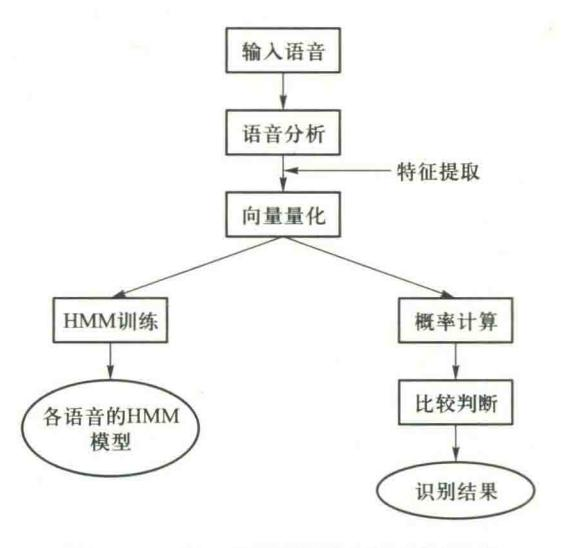

图 11.22 基于 HMM 的孤立字(词)识别

{31}------------------------------------------------

## 11.10 小结

#### 1. 自然语言理解的概念

自然语言理解是指机器能够执行人类所期望的某种语言功能,包括回答问题、文摘生成、释义、翻译。

#### 2. 自然语言理解的五个层次

语言处理过程分为五个层次:语音分析、词法分析、句法分析、语义分析和语用分析。词法分析是从句子中切分出单词,找出词汇的各个词素,从中获得单词的语言学信息并确定单词的词义。

语音分析就是根据音位规则,从语言流中区分出一个个独立的音素,再根据音位形态规则找出一个个音节及其对应的词素或词。

乔姆斯基定义的四种形式文法:短语结构文法,又称 0 型文法;上下文有关文法,又称 1 型文法;上下文无关文法,又称 2 型文法;正则文法,又称 3 型文法。

在对一个句子分析的过程中,常用树形图来表示分析句子各成分间关系的过程,这种树形图 称为句法分析树。

扩充转移网络(ATN)是由一组网络构成,每个网络都有一个网络名,每条弧上的条件扩展为条件加上操作,采用寄存器的方法实现,在分析树的各个成分结构上都放上寄存器,用来存放句法功能和句法特征,条件和操作将对它们不断地进行访问和设置。

语义分析是把分析得到的句法成分与应用领域中的目标表示相关联。语义文法将文法知识和语义知识组合起来,以统一的方式定义为文法规则集。格文法是为了找出动词和跟动词处在结构关系中的名词的语义关系、动词或动词短语与其他的各种名词短语之间的关系。

### 3. 基于语料库的大规模真实文本的处理

基于语料库的统计模型不仅能胜任词类的自动标注任务,而且也能够应用到句法和语义等更高层次的分析上,从而有希望解决大规模真实文本处理这一非常困难的课题,对基于规则的自然语言处理系统提供了一种很有效的补充机制。

对大规模汉语语料库的加工主要包括自动分词和标注,包括词性标注和词义标注。

汉语自动分词方法主要以基于词典的机械匹配分词方法为主,主要有最大匹配法、逆向最大匹配法、逐词遍历匹配法。

词性标注就是在给定句子中判定每个词的文法范畴,确定其词性并加以标注的过程。目前的方法主要有两大类:基于概率统计模型的词性标注方法、基于规则的词性标注方法。

自动词义标注就是利用计算机通过逻辑推理机制,利用文本的上下文环境,对词的词义进行自动判断,选择词的某一正确义项并加以标注的过程。

#### 4. 机器翻译

机器翻译系统可以分成下列几种类型:直译式、规则式、中介语式、知识库式、统计式、范例式。

{32}------------------------------------------------

翻译记忆是用户利用已有的原文和译文,建立起一个或多个翻译记忆库,在翻译过程中,系统将自动搜索翻译记忆库中相同或相似的翻译资源(如句子、段落等),给出参考译文,使用户避免无谓的重复劳动,只需专注于新内容的翻译。翻译记忆库同时在后台不断学习和自动储存新的译文,变得越来越"聪明"。

循环神经网络(RNN)是一种对序列数据建模的神经网络,非常适合于对自然语言等时序信号的建模。

长短期记忆神经网络(LSTM)是 RNN 的一种特殊类型,使用"累加"的形式计算状态,避免了梯度消失问题。LSTM 主要利用遗忘门、输入门、输出门操作来控制、管理神经元的状态信息。循环神经网络是常用的对句子进行编码的神经网络。

#### 5. 语音识别

语音识别包括语音信号的采集与处理、特征参数的提取与识别等。语音识别所采用的方法一般有模板匹配法、随机模型法和概率语法分析法三种。

基于深度学习的语言识别是目前语言识别的主流技术和研究热点。

## 思考题

- 11.1 什么是自然语言理解?
- 11.2 自然语言理解过程有哪些层次? 各层次的功能如何?
- 11.3 简述短语语法结构和乔姆斯基的形式文法,说明各种语言对文法规则表示形式的限制。
- 11.4 转移网络和 ATN 的工作原理是什么?
- 11.5 什么是语义文法? 什么是格文法? 各有什么特点?
- 11.6 语料库的功能是什么? 主要有哪些中文语料库?
- 11.7 简述循环神经网络的工作过程。
- 11.8 循环神经网络与卷积神经网络有什么区别?

## 习题

- 11.1 给出下列句子的句法分析树:
  - (1) The boy smoked a cigarette.
  - (2) The cat ran after a rat.
  - (3) She used a fountain pen to write her biography.
- 11.2 用转移网络分析: The man reacted sharply.
- 11.3 用格结构表示下面的句子:
  - (1) The plane flew above the clouds.
  - (2) John flew to New York.