{0}------------------------------------------------

# 第2章 知识表示与知识图谱

人类的智能活动主要是获得并运用知识。知识是智能的基础。为了使计算机具有智 能,使它能模拟人类的智能行为,就必须使它具有知识。但知识需要用适当的模式表示出来 才能存储到计算机中去并能被运用,因此,知识的表示成为人工智能中一个十分重要的研究 课题。

本章首先介绍知识与知识表示的概念,然后介绍一阶谓词逻辑、产生式、框架、语义网络等 当前人工智能中应用比较广泛的知识表示方法,并简要介绍知识图谱的定义、架构与构建、知 识抽取,为后面介绍推理方法、专家系统等奠定基础。

#### 知识与知识表示的概念 2.1

# 2.1.1 知识的概念

人们最早使用的知识定义是柏拉图在《泰阿泰德篇》中给出的定义:被证 实的,真的和被相信的陈述,简称知识的 JTB 条件。可是非常不幸的是,这个延 续了两千多年的定义在 1963 年被哲学家盖梯尔否定了。盖梯尔提出了一个著 名的悖论(简称盖梯尔悖论)。该悖论说明柏拉图给出的知识定义存在严重缺 知识表示讲课视 陷。知识的柏拉图定义被否定之后,后来人们给出了很多知识的替代定义,到 现在没有统一的定论。

通俗地说,知识是人们在长期的生活及社会实践中、在科学研究及实验中积累起来的对客观 世界的认识与经验。人们把实践中获得的信息关联在一起,就形成了知识。信息之间有多种关 联形式,其中用得最多的一种是用"如果……,则……"表示的关联形式。在人工智能中,这种知 识称为"规则",它反映了信息间的某种因果关系。例如,我国北方的人们经过多年的观察发现, 每当冬天要来临的时候,就会看到有一批批的大雁向南方飞去,于是把"大雁向南飞"与"冬天就 要来临了"这两个信息关联在一起,就得到了如下一条知识:如果大雁向南飞,则冬天就要来 临了。

知识反映了客观世界中事物之间的关系,不同事物或者相同事物间的不同关系形成了不同 的知识。例如,"雪是白色的"是一条知识,它反映了"雪"与"白色"之间的一种关系。又如"如 果头痛且流涕,则有可能患了感冒"是一条知识,它反映了"头痛且流涕"与"可能患了感冒"之间 的一种因果关系。在人工智能中,把前一种知识称为"事实",而把后一种知识,即用"如果……, 则……"关联起来所形成的知识称为"规则"。在下面将对它们做进一步讨论。

{1}------------------------------------------------

# 2.1.2 知识的特性

知识主要具有如下一些特性。

## 1. 相对正确性

知识是人类对客观世界认识的结晶,并且受到长期实践的检验。因此,在一定的条件及环境下,知识一般是正确的。这里,"一定的条件及环境"是必不可少的,它是知识正确性的前提。因为任何知识都是在一定的条件及环境下产生的,因而也就只有在这种条件及环境下才是正确的。例如,牛顿力学在一定的条件下才是正确的。再如,1+1=2,这是一条妇幼皆知的正确知识,但它也只是在十进制的前提下才是正确的,如果是二进制,它就不正确了。

在人工智能中,知识的相对正确性更加突出。除了人类知识本身的相对正确性外,在建造专家系统时,为了减少知识库的规模,通常将知识限制在所求解问题的范围内,也就是说,只要这些知识对所求解的问题是正确的就行。例如,在动物识别系统中,如果仅仅识别虎、金钱豹、斑马、长颈鹿、企鹅、鸵鸟、信天翁七种动物,那么,知识"IF 该动物是鸟 AND 善飞,则该动物是信天翁"就是正确的。

#### 2. 不确定性

由于现实世界的复杂性,信息可能是精确的,也可能是不精确的、模糊的;关联可能是确定的,也可能是不确定的。这就使得知识并不总是只有"真"与"假"这两种状态,而是在"真"与"假"之间还存在许多中间状态,即存在为"真"的程度问题。知识的这一特性称为不确定性。

造成知识具有不确定性的原因是多方面的,主要有以下几种情况:

- ① 由随机性引起的不确定性。由随机事件所形成的知识不能简单地用"真"或"假"来刻画,它是不确定的。就以前面所说的"如果头痛且流涕,则有可能患了感冒"这一条知识来说,其中的"有可能"实际上就是反映了"头痛且流涕"与"患了感冒"之间的一种不确定的因果关系,因为具有"头痛且流涕"的人不一定都是"患了感冒",因此它是一条具有不确定性的知识。
- ② 由模糊性引起的不确定性。由于某些事物客观上存在的模糊性,使得人们无法把两个类似的事物严格地区分开来,不能明确地判定一个对象是否符合一个模糊概念;又由于某些事物之间存在着模糊关系,使人们不能准确地判定它们之间的关系究竟是"真"还是"假"。像这样由模糊概念、模糊关系所形成的知识显然是不确定的。
- ③ 由经验性引起的不确定性。知识一般是由领域专家提供的,这种知识大都是领域专家在长期的实践及研究中积累起来的经验性知识。尽管领域专家能够得心应手地运用这些知识,正确地解决领域内的有关问题,但若让他们精确地表述出来却是相当困难的。这是引起知识不确定性的一个原因。另外,由于经验性自身就蕴含着不精确性及模糊性,这就形成了知识不确定性。因此,在专家系统中大部分知识都具有不确定性这一特性。
- ④ 由不完全性引起的不确定性。人们对客观世界的认识是逐步提高的,只有在积累了大量的感性认识后才能升华到理性认识的高度,形成某种知识。因此,知识有一个逐步完善的过程。 在此过程中,或者由于客观事物表露得不够充分,致使人们对它的认识不够全面,或者对充分表

{2}------------------------------------------------

露的事物一时抓不住本质,使人们对它的认识不够准确。这种认识上的不完全、不准确必然导致相应的知识是不精确、不确定的。因而不完全性是使知识具有不确定性的一个重要原因。

## 3. 可表示性与可利用性

知识的可表示性是指知识可以用适当形式表示出来,如用语言、文字、图形、神经网络等,这样才能被存储、传播。知识的可利用性是指知识可以被利用,这是不言而喻的,我们每个人天天都在利用自己掌握的知识解决所面临的各种问题。

# 2.1.3 知识的分类

## 1. 按知识的作用范围划分为常识性知识和领域性知识

常识性知识是通用性知识,是人们普遍知道的知识,适用于所有领域。

领域性知识是面向某个具体领域的知识,是专业性的知识,只有相应专业的人员才能掌握并用来求解领域内的有关问题。例如,"1个字节由8个位构成","1个扇区有512个字节的数据"等都是计算机领域的知识。

## 2. 按知识的作用及表示划分为事实性知识、过程性知识和控制性知识

事实性知识用于描述领域内的有关概念、事实、事物的属性及状态等。例如:

糖是甜的。

西安是一个古老的城市。

一年有春、夏、秋、冬四个季节。

这些都是事实性知识。事实性知识一般采用直接表达的形式,如用谓词公式表示等。

过程性知识主要是指有关系统状态变化、问题求解过程的操作、演算和行动的知识。过程性知识一般是通过对领域内的各种问题的比较与分析得出的规律性的知识,由领域内的规则、定律、定理及经验构成。

控制性知识又称为深层知识或者元知识,它是关于如何运用已有的知识进行问题求解的知识,因此又称为"关于知识的知识"。例如问题求解中的推理策略(如正向推理及逆向推理)、信息传播策略(如不确定性的传递算法)、搜索策略(如广度优先、深度优先、启发式搜索等)、求解策略(求第一个解、全部解、严格解、最优解等)及限制策略(规定推理的限度)等。

例如,从北京到上海是乘飞机还是坐火车的问题可以表示如下:

事实性知识:北京、上海、飞机、火车、时间、费用。

过程性知识:乘飞机、坐火车。

控制性知识:乘飞机较快、较贵。坐火车较慢、较便宜。

# 3. 按知识的结构及表现形式划分为逻辑性知识和形象性知识

逻辑性知识是反映人类逻辑思维过程的知识,例如人类的经验性知识等。这种知识一般都具有因果关系及难以精确描述的特点,它们通常是基于专家的经验,以及对一些事物的直观感觉。在下面将要讨论的知识表示方法中,一阶谓词逻辑表示法、产生式表示法等都是用来表示这种知识的。

{3}------------------------------------------------

人类的思维过程除了逻辑思维外,还有一种称为"形象思维"的思维方式。例如,若问"什么是树?",如果用文字来回答这个问题,那将是十分困难的,但若指着一棵树说"这就是树",就容易在人们的头脑中建立起"树"的概念。像这样通过事物的形象建立起来的知识称为形象性知识。目前人们正在研究用神经网络来表示这种知识。

## 4. 按知识的确定性划分为确定性知识和不确定性知识

确定性知识是指可指出其真值为"真"或"假"的知识,它是精确性的知识。

不确定性知识是指具有不精确、不完全及模糊性等特性的知识。

# 2.1.4 知识的表示

尽管近些年人工智能得到了长足的发展,在某些任务上取得超越人类的成绩,但离一台机器 拥有一个两三岁小孩的智力这样一个目标还有一段距离。这距离的背后很大一部分原因是机器 缺少知识。

知识表示(knowledge representation)就是将人类知识形式化或者模型化。实际上就是对知识的一种描述,或者说是一组约定,一种计算机可以接受的用于描述知识的数据结构。

已有知识表示方法大都是在进行某项具体研究时提出来的,有一定的针对性和局限性,应用时需根据实际情况做适当的改变,有时还需要把几种表示模式结合起来。在建立一个具体的智能系统时,究竟采用哪种表示模式,目前还没有统一的标准,也不存在一个万能的知识表示模式。但一般来说,在选择知识表示方法时,应从以下几个方面进行考虑。

# 1. 充分表示领域知识

知识表示模式的选择和确定往往要受到领域知识自然结构的制约,要视具体情况而定。确定一个知识表示模式时,首先应该考虑的是它能否充分地表示领域知识。为此,需要深入了解领域知识的特点以及每一种表示模式的特征,以便做到"对症下药"。例如,在医疗诊断领域中,其知识一般具有经验性、因果性的特点,适合于用产生式表示法来表示;而在设计类(如机械产品设计)领域中,由于一个部件一般由多个子部件组成,部件与子部件既有相同的属性又有不同的属性,即它们既有共性又有特性,因而在进行知识表示时,应该把这个特点反映出来,此时单用产生式模式来表示就不能反映出知识间的这种结构关系,这就需要把框架表示法与产生式表示法结合起来。

# 2. 有利于对知识的利用

知识的表示与利用是密切相关的两个方面。"表示"的作用是把领域内的相关知识形式化并用适当的内部形式存储到计算机中去,而"利用"是使用这些知识进行推理,求解现实问题。显然,"表示"的目的是为了"利用",而"利用"的基础是"表示"。为了使一个智能系统能有效地求解领域内的各种问题,除了必须具备足够的知识外,还必须使其表示形式便于对知识的利用。合适的表示方法应该便于对知识的利用,能方便、充分、有效地组织推理,确保推理的正确性,提高推理的效率。如果一种表示模式过于复杂或者难于理解,使推理不便于进行匹配、冲突消解及不确定性的计算等处理,那就势必影响到推理效率,从而降低系统求解问题的能力。

{4}------------------------------------------------

# 3. 便于对知识的组织、维护与管理

对知识的组织与表示方法是密切相关的,不同的表示方法对应于不同的组织方式,这就要求在设计或选择知识表示方法时,应充分考虑将要对知识进行的组织方式。另外,在一个智能系统初步建成后,经过对一定数量实例的运行,可能会发现其知识在质量、数量或性能方面存在某些问题,此时或者需要增补一些新知识,或者需要修改甚至删除某些已有的知识。在进行这些工作时,又需要进行多方面的检测,以保证知识的一致性、完整性等,这称为对知识的维护与管理。在确定知识的表示模式时,应充分考虑维护与管理的方便性。

## 4. 便于理解与实现

一种知识表示模式应是人们容易理解的,这就要求它符合人们的思维习惯。至于实现上的方便性,更是显然的。如果一种表示模式不便于在计算机上实现,那它就没有任何实用价值。

# 2.2 一阶谓词逻辑表示法

命题与谓词概念 讲课视频▲

人工智能中用到的逻辑可划分为两大类。一类是经典命题逻辑和一阶谓词逻辑,其特点是任何一个命题的真值或者为"真",或者为"假",二者必居其一。因为它只有两个真值,因此又称为二值逻辑。另一类是泛指经典逻辑外的那些逻辑,主要包括三值逻辑、多值逻辑、模糊逻辑等,统称为非经典逻辑。

命题逻辑与谓词逻辑是最先应用于人工智能的两种逻辑,对于知识的形式 化表示,特别是定理的自动证明发挥了重要作用,在人工智能的发展史中占有 重要地位。

# 2.2.1 命题

谓词逻辑是在命题逻辑基础上发展起来的,命题逻辑可看作是谓词逻辑的一种特殊形式。下面首先讨论命题的概念。

定义 2.1 命题(proposition)是一个非真即假的陈述句。

判断一个句子是否为命题,首先应该判断它是否为陈述句,再判断它是否有唯一的真值。没有真假意义的语句(如感叹句、疑问句等)不是命题。

若命题的意义为真,称它的真值为真,记作 T(True);若命题的意义为假,称它的真值为假,记作 F(False)。例如,"北京是中华人民共和国的首都","3<5"都是真值为 T 的命题;"太阳从西边升起","煤球是白色的"都是真值为 F 的命题。

一个命题不能同时既为真又为假,但可以在一种条件下为真,在另一种条件下为假。例如,"1+1=10"在二进制情况下是真值为 T 的命题,但在十进制情况下是真值为 F 的命题。同样,对于命题"今天是晴天",也要看当天的实际情况才能决定其真值。

在命题逻辑中,命题通常用大写的英文字母表示,例如,可用英文字母P表示"西安是个古老的城市"这个命题。

{5}------------------------------------------------

英文字母表示的命题既可以是一个特定的命题,称为命题常量,也可以是一个抽象的命题, 称为命题变元。对于命题变元而言,只有把确定的命题代入后,它才可能有明确的真值。

简单陈述句表达的命题称为简单命题或原子命题。引入否定、合取、析取、条件、双条件等连接词,可以将原子命题构成复合命题。可以定义命题的推理规则和蕴含式,从而进行简单的逻辑证明。这些内容和谓词逻辑类似,可以参看有关书籍。

命题逻辑表示法有较大的局限性,它无法把它所描述的事物的结构及逻辑特征反映出来,也不能把不同事物间的共同特征表述出来。例如,对于"老李是小李的父亲"这一命题,若用英文字母 P 表示,则无论如何也看不出老李与小李的父子关系。又如对于"李白是诗人"、"杜甫也是诗人"这两个命题,用命题逻辑表示时,也无法把两者的共同特征(都是诗人)形式地表示出来。由于这些原因,在命题逻辑的基础上发展起来了谓词逻辑。

# 2.2.2 谓词

谓词(predicate)逻辑是基于命题中谓词分析的一种逻辑。一个谓词可分为谓词名与个体两个部分。个体表示某个独立存在的事物或者某个抽象的概念;谓词名用于刻画个体的性质、状态或个体间的关系。

谓词的一般形式是

$$P(x_1, x_2, \cdots, x_n)$$

其中,P是谓词名, $x_1,x_2,\dots,x_n$ 是个体。

谓词中包含的个体数目称为谓词的元数。P(x)是一元谓词,P(x,y)是二元谓词, $P(x_1,x_2,\cdots,x_n)$ 是n元谓词。

谓词名是由使用者根据需要人为定义的,一般用具有相应意义的英文单词表示,或者用大写的英文字母表示,也可以用其他符号,甚至中文表示。个体通常用小写的英文字母表示。例如对于谓词 S(x),既可以定义它表示"x 是一个学生",也可以定义它表示"x 是一只船"。

在谓词中,个体可以是常量,也可以是变元,还可以是一个函数。个体常量、个体变元、函数统称为"项"。

个体是常量,表示一个或者一组指定的个体。例如,"老张是一个教师"这个命题,可表示为一元谓词 Teacher(Zhang)。其中,Teacher 是谓词名,Zhang 是个体,Teacher 刻画了 Zhang 的职业是教师这一特征。又如,"5>3"这个不等式命题,可表示为二元谓词 Greater(5,3)。其中,Greater是谓词名,5和3是个体,Greater刻画了5与3之间的"大于"关系。"Smith 作为一个工程师为IBM工作"这个命题,可表示为三元谓词 Works(Smith,IBM,Engineer)。

一个命题的谓词表示也不是唯一的。例如,"老张是一个教师"这个命题,也可表示为二元谓词 Is-a(Zhang, Teacher)。

个体是变元,表示没有指定的一个或者一组个体。例如,"x<5"这个命题,可表示为 Less(x,5)。其中,x 是变元。

当变量用一个具体的个体的名字代替时,则变量被常量化。当谓词中的变元都用特定的个

{6}------------------------------------------------

体取代时,谓词就具有一个确定的真值:T或F。

个体变元的取值范围称为个体域。个体域可以是有限的,也可以是无限的。例如,若用 I(x)表示"x 是整数",则个体域是所有整数,它是无限的。

个体是函数,表示一个个体到另一个个体的映射。例如,"小李的父亲是教师",可表示为一元谓词 Teacher(father(Li));"小李的妹妹与小张的哥哥结婚",可表示为二元谓词 Married(sister (Li),brother(Zhang))。其中,sister(Li),brother(Zhang)是函数。

函数可以递归调用。例如,"小李的祖父"可以表示为 father(father(Li))。

函数与谓词表面上很相似,容易混淆,其实这是两个完全不同的概念。谓词的真值是"真"或"假",而函数的值是个体域中的某个个体,函数无真值可言,它只是在个体域中从一个个体到另一个个体的映射。

在谓词  $P(x_1,x_2,\cdots,x_n)$  中,若  $x_i(i=1,\cdots,n)$  都是个体常量、变元或函数,称它为一阶谓词。如果某个  $x_i$  本身又是一个一阶谓词,则称它为二阶谓词,余者类推。例如,"Smith 作为一个工程师为 IBM 工作"这个命题,可表示为二阶谓词 Works(Engineer(Smith),IBM),因为其中个体 Engineer(Smith) 也是一个一阶谓词。本书讨论的都是一阶谓词。

# 2.2.3 谓词公式

## 1. 连接词(连词)

无论是命题逻辑还是谓词逻辑,均可用下列连接词把一些简单命题连接起来构成一个复合命题,以表示一个比较复杂的含义。

(1)¬称为"否定"(negation)或者非。它表示否定位于它后面的命题。

谓词公式讲课 当命题 P 为真时, ¬ P 为假; 当 P 为假时, ¬ P 为真。

视频▲

例如,"机器人不在2号房间内",可表示为

 $\neg INROOM(Robot, R2)$ 

(2) V称为"析取"(disjunction)。它表示被它连接的两个命题具有或关系。

例如,"李明打篮球或踢足球",可表示为

Plays (LiMing, Basketball) \( \nabla \) Plays (LiMing, Football) \( \nabla \)

(3) \mathsf{3} \mathsf{3} \mathsf{m} \mathsf{m} \mathsf{m} \mathsf{conjunction})。它表示它连接的两个命题具有与关系。

例如,"我喜爱音乐和绘画",可表示为

 $Like(I, Music) \land Like(I, Painting)$ 

某些较简单的句子也可以用  $\land$  构成复合形式,如"李住在一幢黄色的房子里",可表示为  $LIVES(LI,HOUSE-1) \land COLOR(HOUSE-1,YELLOW)$ 

(4) →称为"蕴含"(implication)或者"条件"(condition)。 $P \rightarrow Q$  表示"P 蕴含 Q",即表示"如果 P,则 Q"。其中,P 称为条件的前件,Q 称为条件的后件。例如:

"如果刘华跑得最快,那么他取得冠军。"可表示为

 $RUNS(LIUHUA, FASTER) \rightarrow WINS(LIUHUA, CHAMPION)$ 

{7}------------------------------------------------

"如果该书是李明的,那么它是蓝色(封面)的。"可表示为

$$OWNS(LIMING,BOOK-1) \rightarrow COLOR(BOOK-1,BLUE)$$

"如果 Jones 制造了一个传感器,且这个传感器不能用,那么他或者在晚上进行修理,或者第二天把它交给工程师。"可表示为

 $Produces(Jones, Sensor) \land \neg Works(Sensor) \rightarrow Fix(Jones, Sensor, Evening) \lor Give(Sensor, Engineer, Next-day)$ 

如果后项取值 T(不管其前项的值如何),或者前项取值 F(不管后项的值如何),则蕴含取值 T,否则蕴含取值 F。注意,只有前项为真,后项为假时,蕴含才为假,其余均为真,如表 2.1 所示。

| P | Q | ¬ P | $P \lor Q$ | $P \wedge Q$ | P→Q | $P \leftrightarrow Q$ |
|---|---|-----|------------|--------------|-----|-----------------------|
| T | T | F   | T          | T            | T   | T                     |
| T | F | F   | T          | F            | F   | F                     |
| F | T | T   | T          | F            | T   | F                     |
| F | F | T   | F          | F            | T   | T                     |

表 2.1 谓词逻辑真值表

"蕴含"与汉语中的"如果……,则……"有区别,汉语中前后要有联系,而命题中可以毫无关系。例如,如果"太阳从西边出来",则"雪是白的",是一个真值为 *T* 的命题。

(5) ↔称为"等价"(equivalence)或"双条件"(bicondition)。 $P \leftrightarrow Q$  表示"P 当且仅当 Q"。以上连词的真值由表 2.1 给出。

#### 2. 量词 (quantifier)

为刻画谓词与个体间的关系,在谓词逻辑中引入了两个量词:全称量词和存在量词。

- (1) 全称量词(universal quantifier)(∀x)表示"对个体域中的所有(或任一个)个体 x"。例如:
  - "所有的机器人都是灰色的",可表示为

$$(\forall x) [ROBOT(x) \rightarrow COLOR(x, GRAY)]$$

"所有的车工都操作车床",可表示为

$$(\forall x) [Turner(x) \rightarrow Operates(x, Lathe)]$$

- (2) 存在量词(existential quantifier)(∃x)表示"在个体域中存在个体 x"。例如:
- "1号房间有个物体",可表示为

$$(\exists x) INROOM(x,r1)$$

"某个工程师操作车床",可表示为

$$(\exists x) [Engineer(x) \rightarrow Operates(x, Lathe)]$$

全称量词和存在量词可以出现在同一个命题中。例如,设谓词 F(x,y) 表示 x = y 是朋友,则:  $(\forall x)(\exists y)F(x,y)$  表示对于个体域中的任何个体 x,都存在个体 y,x = y 是朋友。

{8}------------------------------------------------

 $(\exists x)(\forall y)F(x,y)$ 表示在个体域中存在个体x,与个体域中的任何个体y都是朋友。

 $(\exists x)(\exists y)F(x,y)$ 表示在个体域中存在个体 x 与个体 y,x 与 y 是朋友。

 $(\forall x)(\forall y)F(x,y)$ 表示对于个体域中的任何两个个体 x 和 y,x 与 y 都是朋友。

当全称量词和存在量词出现在同一个命题中时,这时量词的次序将影响命题的意思。例如:  $(\forall x)(\exists y)(Employee(x) \rightarrow Manager(y,x))$ 表示"每个雇员都有一个经理"

面

 $(\exists y)(\forall x)(Employee(x) \rightarrow Manager(y,x))$ 表示"有一个人是所有雇员的经理"

3. 谓词公式

定义 2.2 可按下述规则得到谓词公式:

- ① 单个谓词是谓词公式,称为原子谓词公式;
- ② 若 A 是谓词公式,则¬ A 也是谓词公式;
- ③ 若 A,B 是谓词公式,则  $A \land B,A \lor B,A \rightarrow B,A \leftrightarrow B$  也是谓词公式;
- ④ 若 A 是谓词公式,则( $\forall x$ )A,( $\exists x$ )A 也都是谓词公式;
- ⑤ 有限步应用①~④生成的公式也是谓词公式。

谓词公式的概念:谓词演算(predicate calculus)由谓词符号、常量符号、变量符号、函数符号以及括号、逗号等一串按一定语法规则组成的字符串的表达式。

在谓词公式中,连接词的优先级别从高到低排列是

$$\neg$$
 ,  $\land$  ,  $\lor$  ,  $\rightarrow$  ,  $\leftrightarrow$ 

# 4. 量词的辖域

位于量词后面的单个谓词或者用括号括起来的谓词公式称为量词的辖域,辖域内与量词中同名的变元称为约束变元,不受约束的变元称为自由变元。

例如

$$(\exists x) (P(x,y) \rightarrow Q(x,y)) \lor R(x,y)$$

其中, $(P(x,y) \rightarrow Q(x,y))$ 是 $(\exists x)$ 的辖域,辖域内的变元 x 是受 $(\exists x)$ 约束的变元,而 R(x,y)中的 x 是自由变元。公式中的所有 y 都是自由变元。

在谓词公式中,变元的名字是无关紧要的,可以把一个名字换成另一个名字。但必须注意,当对量词辖域内的约束变元更名时,必须把同名的约束变元都统一改成相同的名字,且不能与辖域内的自由变元同名;当对辖域内的自由变元改名时,不能改成与约束变元相同的名字。例如,对于公式( $\forall x$ )P(x,y),可改名为( $\forall z$ )P(z,t),这里把约束变元x改成了z,把自由变元y改成了t。

# 2.2.4 谓词公式的性质

# 1. 谓词公式的解释

在命题逻辑中,对命题公式中各个命题变元的一次真值指派称为命题公式的一个解释。一旦命题确定后,根据各连接词的定义就可以求出命题公式的真值(T或F)。

谓词公式的性质 讲课视频▲ 

{9}------------------------------------------------

在谓词逻辑中,由于公式中可能有个体变元以及函数,因此不能像命题公式那样直接通过真值指派给出解释,必须首先考虑个体变元和函数在个体域中的取值,然后才能针对变元与函数的具体取值为谓词分别指派真值。由于存在多种组合情况,所以一个谓词公式的解释可能有很多个。对于每一个解释,谓词公式都可求出一个真值(T或F)。

2. 谓词公式的永真性、可满足性、不可满足性

定义 2.3 如果谓词公式 P 对个体域 D 上的任何一个解释都取得真值 T,则称 P 在 D 上是 永真的;如果 P 在每个非空个体域上均永真,则称 P 永真。

定义 2.4 如果谓词公式 P 对个体域 D 上的任何一个解释都取得真值 F,则称 P 在 D 上是 永假的;如果 P 在每个非空个体域上均永假,则称 P 永假。

可见,为了判定某个公式永真,必须对每个个体域上的每个解释逐个判定。当解释的个数为无限时,公式的永真性就很难判定了。

定义 2.5 对于谓词公式 P, 如果至少存在一个解释使得公式 P 在此解释下的真值为 T,则称公式 P 是可满足的, 否则,则称公式 P 是不可满足的。

## 3. 谓词公式的等价性

定义 2.6 设 P与 Q 是两个谓词公式,D 是它们共同的个体域,若对 D 上的任何一个解释, P与 Q 都有相同的真值,则称公式 P 和 Q 在 D 上是等价的。如果 D 是任意个体域,则称 P 和 Q 是等价的,记作  $P \Leftrightarrow Q$ 。

下面列出今后要用到的一些主要等价式。

(1) 交换律

$$P \lor Q \Leftrightarrow Q \lor P$$
$$P \land Q \Leftrightarrow Q \land P$$

(2) 结合律

$$(P \lor Q) \lor R \Leftrightarrow P \lor (Q \lor R)$$
$$(P \land Q) \land R \Leftrightarrow P \land (Q \land R)$$

(3) 分配律

$$P \lor (Q \land R) \Leftrightarrow (P \lor Q) \land (P \lor R)$$
  
$$P \land (Q \lor R) \Leftrightarrow (P \land Q) \lor (P \land R)$$

(4) 德·摩根律(De.Morgen)

$$\neg (P \lor Q) \Leftrightarrow \neg P \land \neg Q$$
$$\neg (P \land Q) \Leftrightarrow \neg P \lor \neg Q$$

(5) 双重否定律(对合律)

$$\neg \neg P \Leftrightarrow P$$

(6) 吸收律

$$P \lor (P \land Q) \Leftrightarrow P$$
$$P \land (P \lor Q) \Leftrightarrow P$$

{10}------------------------------------------------

(7) 补余律(否定律)

$$P \lor \neg P \Leftrightarrow T$$
$$P \land \neg P \Leftrightarrow F$$

(8) 连接词化归律

$$P \rightarrow Q \Leftrightarrow \neg P \lor Q$$

$$P \leftrightarrow Q \Leftrightarrow (P \rightarrow Q) \land (Q \rightarrow P)$$

$$P \leftrightarrow Q \Leftrightarrow (P \land Q) \lor (\neg P \land \neg Q)$$

(9) 逆否律

$$P \rightarrow Q \Leftrightarrow \neg Q \rightarrow \neg P$$

(10) 量词转换律

$$\neg (\exists x) P \Leftrightarrow (\forall x) (\neg P)$$
$$\neg (\forall x) P \Leftrightarrow (\exists x) (\neg P)$$

(11) 量词分配律

$$(\forall x) (P \land Q) \Leftrightarrow (\forall x) P \land (\forall x) Q$$
$$(\exists x) (P \lor Q) \Leftrightarrow (\exists x) P \lor (\exists x) Q$$

#### 4. 谓词公式的永真蕴含

定义 2.7 对于谓词公式 P 与 Q,如果  $P \rightarrow Q$  永真,则称公式 P 永真蕴含 Q,记作  $P \Rightarrow Q$ ,且称 Q 为 P 的逻辑结论,P 为 Q 的前提。

下面列出今后要用到的一些主要永真蕴含式。

(1) 化简律

$$P \land Q \Rightarrow P$$
$$P \land Q \Rightarrow Q$$

(2) 附加律

$$P \Rightarrow P \lor Q$$
$$Q \Rightarrow P \lor Q$$
$$0 \Rightarrow P \rightarrow 0$$

(3) 假言推理

$$P, P \rightarrow Q \Rightarrow Q$$

即由 P 为真及  $P \rightarrow Q$  为真,可推出 Q 为真。

(4) 拒取式推理

$$\neg 0.P \rightarrow 0 \Rightarrow \neg P$$

即由 Q 为假及  $P \rightarrow Q$  为真,可推出 P 为假。

(5) 假言三段论

$$P \rightarrow Q$$
,  $Q \rightarrow R \Rightarrow P \rightarrow R$ 

即由  $P \rightarrow Q$ ,  $Q \rightarrow R$  为真, 可推出  $P \rightarrow R$  为真。

{11}------------------------------------------------

(6) 析取三段论

$$\neg P.P \lor 0 \Rightarrow 0$$

(7) 二难推理

$$P \lor Q, P \rightarrow R, Q \rightarrow R \Rightarrow R$$

(8) 全称固化

$$(\forall x)P(x) \Rightarrow P(y)$$

其中, y 是个体域中的任一个体, 利用此永真蕴含式可消去公式中的全称量词。

(9) 存在固化

$$(\exists x)P(x) \Rightarrow P(y)$$

其中,y是个体域中某一个可使 P(y) 为真的个体。利用此永真蕴含式可消去公式中的存在量词。

上面列出的等价式及永真蕴含式是进行演绎推理的重要依据,因此这些公式又称为推理规则。谓词逻辑中还有如下一些推理规则:

- ① P 规则:在推理的任何步骤上都可引入前提。
- ② T 规则:在推理过程中,如果前面步骤中有一个或多个公式永真蕴含公式 S,则可把 S 引入推理过程中。
- ③ CP 规则:如果能从 R 和前提集合中推出 S 来,则可从前提集合推出  $R \rightarrow S$  来。其中,R 为任意引入的命题。
- ④ 反证法: $P \Rightarrow Q$ ,当且仅当 $P \land \neg Q \Leftrightarrow F$ ,即, $Q \to P$  的逻辑结论,当且仅当 $P \land \neg Q$  是不可满足的。因此有以下定理:

定理  $Q \to P_1, P_2, \cdots, P_n$  的逻辑结论,当且仅当 $(P_1 \land P_2 \land \cdots \land P_n) \land \neg Q$  是不可满足的。该定理是归结反演的理论依据。

# 2.2.5 一阶谓词逻辑知识表示方法

从前面介绍的谓词逻辑的例子可见,用谓词公式表示知识的一般步骤为:

- ① 定义谓词及个体,确定每个谓词及个体的确切定义;
- ② 根据要表达的事物或概念,为谓词中的变元赋以特定的值;
- ③ 根据语义用适当的连接符号将各个谓词连接起来,形成谓词公式。实际上,关系数据库也可以用一阶谓词表示。

例 2.1 用一阶谓词逻辑表示下列关系数据库。

| 住户    | 房间  | 电话号码 | 房间  |
|-------|-----|------|-----|
| Zhang | 201 | 491  | 201 |
| Li    | 201 | 492  | 201 |
| Wang  | 202 | 451  | 202 |
| Zhao  | 203 | 451  | 203 |

一阶谓词逻辑知识表示方法讲课 视频▲

{12}------------------------------------------------

## 表中有两个关系:

OCCUPANT(给定用户和房间的居住关系)

TELEPHONE(给定电话号码和房间的电话关系)

## 用一阶谓词表示为:

OCCUPANT(Zhang, 201), OCCUPANT(Li, 201), ...

TELEPHONE (491,201), TELEPHONE (492,201), ...

谓词逻辑与关系数据库有密切关系。在关系数据库中,逻辑代数表达式是谓词表达式之一。 因此,如果采用谓词逻辑作为系统的理论背景,则可将数据库系统扩展改造成知识库。

# 2.2.6 一阶谓词逻辑表示法的特点

## 1. 一阶谓词逻辑表示法的优点

#### (1) 自然性

谓词逻辑是一种接近自然语言的形式语言,用它表示的知识比较容易理解。

#### (2) 精确性

谓词逻辑是二值逻辑,其谓词公式的真值只有"真"与"假",因此可用它表示精确的知识,并可保证演绎推理所得结论的精确性。

#### (3) 严密性

谓词逻辑具有严格的形式定义及推理规则,利用这些推理规则及有关定理证明技术可从已知事实推出新的事实,或证明所作的假设。

# (4) 容易实现

用谓词逻辑表示的知识可以比较容易地转换为计算机的内部形式,易于模块化,便于对知识进行增加、删除及修改。

# 2. 一阶谓词逻辑表示法的局限性

# (1) 不能表示不确定的知识

谓词逻辑只能表示精确性的知识,不能表示不精确、模糊性的知识,但人类的知识不同程度 地具有不确定性,这就使得它表示知识的范围受到了限制。

# (2) 组合爆炸

在其推理过程中,随着事实数目的增大及盲目地使用推理规则,有可能形成组合爆炸。目前 人们在这一方面做了大量的研究工作,出现了一些比较有效的方法,如定义一个过程或启发式控 制策略来选取合适的规则等。

# (3) 效率低

用谓词逻辑表示知识时,其推理是根据形式逻辑进行的,把推理与知识的语义割裂了开来, 这就使得推理过程冗长,降低了系统的效率。谓词表示越细,越清楚,则推理越慢,效率越低。

尽管谓词逻辑表示法有以上一些局限性,但它仍是一种重要的表示方法,许多专家系统的知识表达都采用谓词逻辑表示。例如,格林等人研制的用于求解化学等方面问题的 QA3 系统,非

{13}------------------------------------------------

克斯等人研制的 STRIPS 机器人行动规划系统,菲尔曼等人研制的 FOL 机器证明系统。

# 2.3 产生式表示法

产生式表示法又称为产生式规则(production rule)表示法。

"产生式"这一术语是由美国数学家波斯特(E.Post)在 1943 年首先提出来的。他根据串替代规则提出了一种称为波斯特机的计算模型,模型中的每一条规则称为一个产生式。在此之后,几经修改与充实,如今已被用到多种领域中。例如用它来描述形式语言的语法,表示人类心理活动的认知过程等。1972 年纽厄尔和西蒙在研究人类的认知模型中开发了基于规则的产生式系统。目前产生式表示法讲它已成为人工智能中应用最多的一种知识表示模型,许多成功的专家系统都用记入工程能中应用最多的一种知识表示模型,许多成功的专家系统都用记入工程能中应用最多的一种知识表示模型,许多成功的专家系统都用记入工程的,对于不是一个一个一个一个一个一个一个一个一个一个一个一个一个一个一个一个一个一个一个

# 2.3.1 产生式

产生式通常用于表示事实、规则以及它们的不确定性度量,适合于表示事实性知识和规则性知识。

# 1. 确定性规则知识的产生式表示

确定性规则知识的产生式表示的基本形式是

IF P THEN Q

或者

$$P \rightarrow Q$$

其中,P是产生式的前提,用于指出该产生式是否可用的条件;Q是一组结论或操作,用于指出当前提 P 所指示的条件满足时,应该得出的结论或应该执行的操作。整个产生式的含义是:如果前提 P 被满足,则可得到结论 Q 或执行 Q 所规定的操作。例如

 $r_4$ :IF 动物会飞 AND 会下蛋 THEN 该动物是鸟就是一个产生式。其中, $r_4$ 是该产生式的编号,"动物会飞 AND 会下蛋"是前提 P,"该动物是鸟"是结论 Q。

# 2. 不确定性规则知识的产生式表示

不确定性规则知识的产生式表示的基本形式是

IF P THEN Q(置信度)

或者

# $P \rightarrow Q$ (置信度)

例如在专家系统 MYCIN 中有这样一条产生式:

IF 本微生物的染色斑是革兰氏阴性,

{14}------------------------------------------------

本微生物的形状呈杆状, 病人是中间宿主

THEN 该微生物是绿脓杆菌,置信度为 0.6

它表示当前提中列出的各个条件都得到满足时,结论"该微生物是绿脓杆菌"可以相信的程度为 0.6。这里,用 0.6 指出了知识的强度。

3. 确定性事实性知识的产生式表示

确定性事实一般用三元组表示

(对象,属性,值)

或者

## (关系,对象1,对象2)

例如,老李年龄是 40 岁,表示为(Li, Age, 40)。老李和老王是朋友,表示为(Friend, Li, Wang)。

4. 不确定性事实性知识的产生式表示

不确定性事实一般用四元组表示

(对象,属性,值,置信度)

或者

## (关系,对象1,对象2,置信度)

例如,老李年龄很可能是 40 岁,表示为 (Li,Age,40,0.8)。老李和老王不大可能是朋友,表示为(Friend,Li,Wang,0.1)。

产生式又称为规则或产生式规则;产生式的"前提"有时又称为"条件""前提条件""前件" "左部"等;其"结论"部分有时称为"后件"或"右部"等。今后将不加区分地使用这些术语,不再 作单独说明。

产生式与谓词逻辑中的蕴含式的基本形式相同,但蕴含式只是产生式的一种特殊情况,理由有二:

- ① 除逻辑蕴含外,产生式还包括各种操作、规则、变换、算子、函数等。例如,"如果炉温超过上限,则立即关闭风门"是一个产生式,但不是一个蕴含式。产生式描述了事物之间的一种对应关系(包括因果关系和蕴含关系),其外延十分广泛。逻辑中的逻辑蕴含式和等价式,程序设计语言中的文法规则,数学中的微分和积分公式,化学中分子结构式的分解变换规则,甚至体育比赛中的规则,国家的法律条文,单位的规章制度等,都可以用产生式表示。
- ② 蕴含式只能表示确定性知识,其真值或者为真,或者为假,而产生式不仅可以表示确定性知识,而且还可以表示不确定性知识。决定一条知识是否可用,需要检查当前是否有已知事实可与前提中所规定的条件匹配。对谓词逻辑的蕴含式来说,其匹配总要求是精确的。在产生式表示知识的系统中,匹配可以是精确的,也可以是不精确的,只要按某种算法求出的相似度落在预先指定的范围内就认为是可匹配的。

由于产生式与蕴含式存在这些区别,导致它们在处理方法及应用等方面都有较大的差别。

{15}------------------------------------------------

为了严格地描述产生式,下面用巴科斯范式 BNF(Backus normal form)给出它的形式描述及语义:

<产生式>::=<前提>→<结论>

<前提>::=<简单条件>|<复合条件>

<结 论>::=<事实>|<操作>

<复合条件>::=<简单条件>AND<简单条件>[ AND<简单条件>…] | <简单条件>OR<简单条件>「OR<简单条件>…]

<操 作>::=<操作名>[(<变元>,…)]

其中,符号"::="表示"定义为":符号"1"表示"或者是":符号"[]"表示"可缺省"。

# 2.3.2 产生式系统

把一组产生式放在一起,让它们互相配合、协同作用,一个产生式生成的结论可以供另一个产生式作为已知事实使用,以求得问题的解,这样的系统称为产生式系统。

一般来说,一个产生式系统由规则库、综合数据库、控制系统(推理机)三部分组成。它们之间的关系如图 2.1 所示。

## 1. 规则库

用于描述相应领域内知识的产生式集合称为规则库。

显然,规则库是产生式系统求解问题的基础,其知识是否完整、一致,表达是否准确、灵活,对知识的

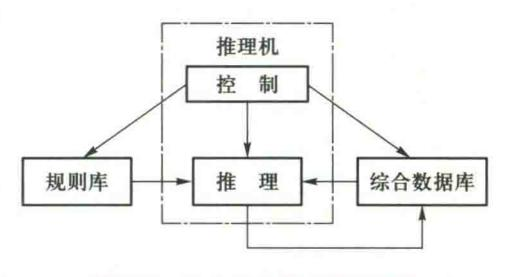

图 2.1 产生式系统的基本结构

组织是否合理等,将直接影响到系统的性能。因此,需要对规则库中的知识进行合理的组织和管理,检测并排除冗余及矛盾的知识,保持知识的一致性。采用合理的结构形式,可使推理避免访问那些与求解当前问题无关的知识,从而提高求解问题的效率。

## 2. 综合数据库

综合数据库又称为事实库、上下文、黑板等。它是一个用于存放问题求解过程中各种当前信息的数据结构,例如问题的初始状态、原始证据、推理中得到的中间结论及最终结论。当规则库中某条产生式的前提可与综合数据库的某些已知事实匹配时,该产生式就被激活,并把它推出的结论放入综合数据库中,作为后面推理的已知事实。显然,综合数据库的内容是在不断变化的。

## 3. 推理机

推理机由一组程序组成,除了推理算法,还控制整个产生式系统的运行,实现对问题的求解。 粗略地说,推理机要做以下几项工作:

① 推理。按一定的策略从规则库中选择与综合数据库中的已知事实进行匹配。所谓匹配是指把规则的前提条件与综合数据库中的已知事实进行比较,如果两者一致,或者近似一致且满

{16}------------------------------------------------

足预先规定的条件,则称匹配成功,相应的规则可被使用;否则称为匹配不成功。

- ② 冲突消解。匹配成功的规则可能不止一条,这称为发生了冲突。此时,推理机构必须调用相应的解决冲突策略进行消解,以便从匹配成功的规则中选出一条执行。
- ③ 执行规则。如果某一规则的右部是一个或多个结论,则把这些结论加入综合数据库中; 如果规则的右部是一个或多个操作,则执行这些操作。对于不确定性知识,在执行每一条规则时 还要按一定的算法计算结论的不确定性。
- ④ 检查推理终止条件。检查综合数据库中是否包含了最终结论,决定是否停止系统的运行。

# 2.3.3 产生式系统的例子——动物识别系统

下面以一个动物识别系统为例,介绍产生式系统求解问题的过程。这个动物识别系统是识别虎、金钱豹、斑马、长颈鹿、企鹅、鸵鸟、信天翁等七种动物的产生式系统。

首先根据这些动物识别的专家知识,建立如下规则库:

| 动物识别       | 系统 | 讲   | $r_1$ : | IF  | 该动物有引 | <b>E</b> 发 | THEN | Ŋ   | 该动物是哺乳动物 |
|------------|----|-----|---------|-----|-------|------------|------|-----|----------|
| 课视频▲       |    |     | $r_2$ : | IF  | 该动物有如 | 73         | THEN | V   | 该动物是哺乳动物 |
| $r_3$ :    | IF | 该动物 | 有羽      | 毛   |       | THEN       | 该动物  | 是鸟  |          |
| $r_4$ :    | IF | 该动物 | 会飞      |     |       | AND        | 会下蛋  |     |          |
|            |    |     |         |     |       | THEN       | 该动物  | 是鸟  |          |
| $r_5$ :    | IF | 该动物 | 吃肉      |     |       | THEN       | 该动物  | 是食  | 肉动物      |
| $r_6$ :    | IF | 该动物 | 有犬      | 齿   |       | AND        | 有爪   |     |          |
|            |    |     |         |     |       | AND        | 眼盯前  | 方   |          |
|            |    |     |         |     |       | THEN       | 该动物  | 是食  | 肉动物      |
| $r_7$ :    | IF | 该动物 | 是哺      | 乳动物 | 勿     | AND        | 有蹄   |     |          |
|            |    |     |         |     |       | THEN       | 该动物  | 是有品 | 蹄类动物     |
| $r_8$ :    | IF | 该动物 | 是哺      | 乳动物 | 勿     | AND        | 是咀嚼  | 反刍z | 动物       |
|            |    |     |         |     |       | THEN       | 该动物  | 是有品 | 蹄类动物     |
| $r_9$ :    | IF | 该动物 | 是哺      | 乳动物 | 勿     | AND        | 是食肉  | 动物  |          |
|            |    |     |         |     |       | AND        | 是黄褐  | 色   |          |
|            |    |     |         |     |       | AND        | 身上有  | 暗斑  | 点        |
|            |    |     |         |     |       | THEN       | 该动物  | 是金色 | 钱豹       |
| $r_{10}$ : | IF | 该动物 | 是哺      | 乳动物 | 勿     | AND        | 是食肉  | 动物  |          |
|            |    |     |         |     |       | AND        | 是黄褐  | 色   |          |
|            |    |     |         |     |       | AND        | 身上有  | 黑色  | 条纹       |
|            |    |     |         |     |       | THEN       | 该动物  | 是虎  |          |
|            |    |     |         |     |       |            |      |     |          |

{17}------------------------------------------------

| $r_{11}$ :        | IF | 该动物是有蹄类动物 | AND         | 有长脖子    |
|-------------------|----|-----------|-------------|---------|
|                   |    |           | AND         | 有长腿     |
|                   |    |           | AND         | 身上有暗斑点  |
|                   |    |           | THEN        | 该动物是长颈鹿 |
| r 12 : | IF | 该动物是有蹄类动物 | AND         | 身上有黑色条纹 |
|                   |    |           | THEN        | 该动物是斑马  |
| r 13 : | IF | 该动物是鸟     | AND         | 有长脖子    |
|                   |    |           | AND         | 有长腿     |
|                   |    |           | AND         | 不会飞     |
|                   |    |           | AND         | 有黑白二色   |
|                   |    |           | THEN        | 该动物是鸵鸟  |
| $r_{14}$ :        | IF | 该动物是鸟     | AND         | 会游泳     |
|                   |    |           | AND         | 不会飞     |
|                   |    |           | AND         | 有黑白二色   |
|                   |    |           | THEN        | 该动物是企鹅  |
| $r_{15}$ :        | IF | 该动物是鸟     | AND         | 善飞      |
|                   |    |           | THEN        | 该动物是信天翁 |
|                   |    |           | - 15 H H 10 |         |

由上述产生式规则可以看出,虽然系统是用来识别七种动物的,但它并不是简单地只设计 7 条规则,而是设计了 15 条。其基本想法是,首先根据一些比较简单的条件,如"有毛发""有羽毛""会飞"等对动物进行比较粗的分类,如"哺乳动物""鸟"等,然后随着条件的增加,逐步缩小分类范围,最后给出识别七种动物的规则。这样做有两个好处:一是当已知的事实不完全时,虽不能推出最终结论,但可以得到分类结果;二是当需要增加对其他动物(如牛、马等)的识别时,规则库中只需增加关于这些动物个性方面的知识,如  $r_0$ 至  $r_1$ 5,那样,而对  $r_1$ 至  $r_8$ 可直接利用,这样增加的规则就不会太多。 $r_1$ , $r_2$ ,…, $r_1$ 5分别是对各产生式规则所做的编号,以便于对它们的引用。

设在综合数据库中存放有下列已知事实:

# 该动物身上有暗斑点,长脖子,长腿,奶,蹄

并假设综合数据库中的已知事实与规则库中的知识是从第一条(即 $r_1$ )开始逐条进行匹配的,则当推理开始时,推理机的工作过程是:

① 从规则库中取出第一条规则  $r_1$ ,检查其前提是否可与综合数据库中的已知事实匹配成功。由于综合数据库中没有"该动物有毛发"这一事实,所以匹配不成功, $r_1$ 不能被用于推理。然后取第二条规则  $r_2$ 进行同样的工作。显然, $r_2$ 的前提"该动物有奶"可与综合数据库中的已知事实"该动物有奶"匹配。再检查  $r_3$ 至  $r_1$ 5均不能匹配。因为只有  $r_2$ 一条规则被匹配,所以  $r_2$ 被执行,并将其结论部分"该动物是哺乳动物"加入综合数据库中。并且将  $r_2$ 标注已经被选用过的记号,避免下次再被匹配。

{18}------------------------------------------------

此时综合数据库的内容变为:

## 该动物特征有暗斑点,长脖子,长腿,奶,蹄,哺乳动物

检查综合数据库中的内容,没有发现要识别的任何一种动物,所以要继续进行推理。

② 分别用  $r_1$ ,  $r_3$ ,  $r_4$ ,  $r_5$ ,  $r_6$ 与综合数据库中的已知事实进行匹配, 均不成功。但当用  $r_7$ 与之匹配时, 获得了成功。再检查  $r_8$ 至  $r_{15}$ 均不能匹配。因为只有  $r_7$ 一条规则被匹配,所以执行  $r_7$ 并将其结论部分"该动物是有蹄类动物"加入综合数据库中, 并且将  $r_7$ 标注已经被选用过的记号, 避免下次再被匹配。

此时综合数据库的内容变为:

## 该动物特征有暗斑点,长脖子,长腿,奶,蹄,哺乳动物,有蹄类动物

检查综合数据库中的内容,没有发现要识别的任何一种动物,所以还要继续进行推理。

③ 在此之后,除已经匹配过的  $r_2$ , $r_7$ 外,只有  $r_{11}$ 可与综合数据库中的已知事实匹配成功,所以将  $r_{11}$ 的结论加入综合数据库,此时综合数据库的内容变为:

# 该动物身上有暗斑点,长脖子,长腿,奶,蹄,哺乳动物,有蹄类动物,长颈鹿

检查综合数据库中的内容,发现要识别的对象之一长颈鹿已经包含在了综合数据库中,所以 推出了"该动物是长颈鹿"这一最终结论。至此,问题的求解过程就结束了。

上述问题的求解过程是一个不断地从规则库中选择可用规则与综合数据库中的已知事实进行匹配的过程,规则的每一次成功匹配都使综合数据库增加了新的内容,并朝着问题的解决方向前进了一步,这一过程称为推理,是专家系统中的核心内容。当然,上述过程只是一个简单的推理过程,后面将对推理的有关问题展开全面的讨论。

可以使用普通编程语言(如 C、C++)中的 if 语句实现产生式系统,但当产生式规则较多时会产生新的问题。例如,检查哪条规则被匹配需要很长时间遍历所有规则。因此,采用快速算法(如 RETE)匹配规则触发条件的专用产生式系统已经被开发出来。这种系统内嵌了消解多个冲突的算法。近年来,开发了专门用于计算机游戏开发的 RC++,它是 C++语言的超集,加入了控制角色行为的产生式规则,提供了反应式控制器的专用子集。

# 2.3.4 产生式表示法的特点

# 1. 产生式表示法的主要优点

## (1) 自然性

产生式表示法用"如果……,则……"的形式表示知识,这是人们常用的一种表达因果关系的知识表示形式,既直观、自然,又便于进行推理。正是由于这一原因,才使得产生式表示法称为人工智能中最重要且应用最多的一种知识表示方法。

#### (2) 模块性

产生式是规则库中最基本的知识单元,它们同推理机构相对独立,而且每条规则都具有相同的形式,这就便于对其进行模块化处理,为知识的增、删、改带来了方便,为规则库的建立和扩展提供了可管理性。

{19}------------------------------------------------

#### (3) 有效性

产生式表示法既可表示确定性知识,又可表示不确定性知识;既有利于表示启发式知识,又可方便地表示过程性知识。目前已建造成功的专家系统大部分是用产生式来表达其过程性知识的。

#### (4) 清晰性

产生式有固定的格式。每一条产生式规则都由前提与结论(操作)这两部分组成,而且每一部分所含的知识量都比较少。这就既便于对规则进行设计,又易于对规则库中知识的一致性及完整性进行检测。

# 2. 产生式表示法的主要缺点

## (1) 效率不高

在产生式系统求解问题的过程中,首先要用产生式的前提部分与综合数据库中的已知事实进行匹配,从规则库中选出可用的规则,此时选出的规则可能不止一个,这就需要按一定的策略进行"冲突消解",然后把选中的规则启动执行。因此,产生式系统求解问题的过程是一个反复进行"匹配一冲突消解—执行"的过程。鉴于规则库—般都比较庞大,而匹配又是一件十分费时的工作,因此其工作效率不高,而且大量的产生式规则容易引起组合爆炸。

## (2) 不能表达具有结构性的知识

产生式适合于表达具有因果关系的过程性知识,是一种非结构化的知识表示方法,所以,对具有结构关系的知识无能为力,它不能把具有结构关系的事物间的区别与联系表示出来。后面介绍的框架表示法可以解决这方面的问题。因此,产生式表示法除了可以独立作为一种知识表示模式外,还经常与其他表示法结合起来表示特定领域的知识。例如,在专家系统PROSPECTOR中用产生式与语义网络相结合,在 Aikins 中把产生式与框架表示法结合起来,等等。

# 3. 产生式表示法适合表示的知识

由上述关于产生式表示法的特点,可以看出产生式表示法适合于表示具有下列特点的领域知识:

- ① 由许多相对独立的知识元组成的领域知识,彼此间关系不密切,不存在结构关系。例如 化学反应方面的知识。
- ② 具有经验性及不确定性的知识,而且相关领域中对这些知识没有严格、统一的理论。例如医疗诊断、故障诊断等方面的知识。
- ③ 领域问题的求解过程可被表示为一系列相对独立的操作,而且每个操作可被表示为一条或多条产生式规则。

知识常常是一种很复杂的结构化的信息集合。谓词逻辑和产生式规则虽然是重要的知识表示方法,但难以表达比较复杂结构的知识,可以采用结构表示法的框架和语义网络知识表示方法。

{20}------------------------------------------------

# 2.4 框架表示法

框架表示法讲课 视频▲

1975 年美国著名的人工智能学者明斯基提出了框架理论。该理论认为人们对现实世界中各种事物的认识都是以一种类似于框架的结构存储在记忆中的。当面临一个新事物时,就从记忆中找出一个合适的框架,并根据实际情况对其细节加以修改、补充,从而形成对当前事物的认识。例如,一个人走进一个教室之前就能依据以往对"教室"的认识,想象到这个教室一定有四面墙,有门、窗,有天花板和地板,有课桌、凳子、讲台、黑板等。尽管他对这个教室的大小、门窗的个数、桌凳的数量、颜色等细节还不清楚,但对教室的基本结构是可

以预见到的。因为他通过以往看到的教室,已经在记忆中建立了关于教室的框架。该框架不仅指出了相应事物的名称(教室),而且还指出了事物各有关方面的属性(如有四面墙,有课桌,有黑板……),通过对该框架的查找就很容易得到教室的各个特征。在他进入教室后,经观察得到了教室的大小、门窗的个数、桌凳的数量、颜色等细节,把它们填入到教室框架中,就得到了教室框架的一个具体事例。这是他关于这个具体教室的视觉形象,称为事例框架。

框架表示法是一种结构化的知识表示方法,现已在多种系统中得到应用。

# 2.4.1 框架的一般结构

框架(frame)是一种描述所论对象(一个事物、事件或概念)属性的数据结构。

一个框架由若干个被称为"槽"(slot)的结构组成,每一个槽又可根据实际情况划分为若干个"侧面"。一个槽用于描述所论对象某一方面的属性,一个侧面用于描述相应属性的一个方面。槽和侧面所具有的属性值分别被称为槽值和侧面值。在一个用框架表示知识的系统中一般都含有多个框架,一个框架一般都含有多个不同槽、不同侧面,分别用不同的框架名、槽名及侧面名表示。无论是对框架、槽或侧面,都可以为其附加上一些说明性的信息,一般是一些约束条件,用于指出什么样的值才能填入到槽和侧面中去。

下面给出框架的一般表示形式:

| 〈框架名〉    |       |                                                               |
|----------|-------|---------------------------------------------------------------|
| 槽名1:     | 侧面名11 | 侧面值 $_{111}$ ,侧面值 $_{112}$ ,…,侧面值 $_{11p_1}$                  |
|          | 侧面名12 | 侧面值 $_{121}$ ,侧面值 $_{122}$ ,…,侧面值 $_{12p_2}$                  |
|          | 1     |                                                               |
|          | 侧面名」加 | 侧面值 $_{1m1}$ ,侧面值 $_{1m2}$ ,…,侧面值 $_{1mp_m}$                  |
| 槽名 2:    | 侧面名21 | 侧面值 $_{211}$ ,侧面值 $_{212}$ ,…,侧面值 $_{21p_1}$                  |
|          | 侧面名22 | 侧面值 $_{221}$ ,侧面值 $_{222}$ ,…,侧面值 $_{22p_2}$                  |
| <b>*</b> | •     |                                                               |
|          | 侧面名2m | 侧面值 2m1 ,侧面值 2m2 ,…,侧面值 2mpm |

{21}------------------------------------------------

| 槽名 n: | 侧面名"1 | 侧面值"11,侧面值"12,…,侧面值"19,                      |  |
|-------|-------|----------------------------------------------|--|
|       | 侧面名"2 | 侧面值"21,侧面值"22,…,侧面值"22,                      |  |
|       | :     |                                              |  |
|       | 侧面名"  | 侧面值 $_{nm1}$ ,侧面值 $_{nm2}$ ,…,侧面值 $_{nmp_m}$ |  |
| 约束:   | 约束条件。 |                                              |  |
|       | 约束条件2 |                                              |  |
|       | 1     |                                              |  |
|       | 约束条件。 |                                              |  |

由上述表示形式可以看出,一个框架可以有任意有限数目的槽,一个槽可以有任意有限数目的侧面,一个侧面可以有任意有限数目的侧面值。槽值或侧面值既可以是数值、字符串、布尔值,也可以是一个满足某个给定条件时要执行的动作或过程,还可以是另一个框架的名字,从而实现一个框架对另一个框架的调用,表示出框架之间的横向联系。约束条件是任选的,当不指出约束条件时,表示没有约束。

除了原始类型的值以外,还可以有缺省值(default value)、如果需要值(if-needed value)、如果加入值(if-added value)。将这些值分别填入相应的侧面中,这样每个槽可以表示为:

SLOT(槽) VALUE (值侧面)

DEFAULT (缺省值侧面)

IF-NEEDED (如果需要值侧面)

IF-ADDED (如果加入值侧面)

"缺省"值:当缺少有关事物的信息,同时又无直接反面证据时,就假设按惯例或者一般情况下的填充值。例如,不知道张三的身高,又没有证据说明张三为畸形,则"缺省"值可以按照男子的平均身高。

"如果需要"值:过程信息。例如,不知道张三的体重,但知道他的身高,根据经验可以从身高求得体重的近似值,则"如果需要"值可以按照身高计算体重的经验公式。

"如果加入"值:应该做什么的信息。槽中的信息所包含的类型并不是固定的,其数量也不是受限制的,设计者可以根据需要加以考虑。例如,怎样使用这个框架,预计下一步将发生什么情况,以及当情况与预计不符时应做些什么等;还可以表现为复杂的条件,反映多个框架对应的事情之间的关系。

# 2.4.2 用框架表示知识的例子

下面举些例子,说明建立框架的基本方法。

{22}------------------------------------------------

## 例 2.2 教师框架

框架名:〈教师〉

姓名:单位(姓、名)

年龄:单位(岁)

性别:范围(男、女)

缺省:男

职称:范围(教授,副教授,讲师,助教)

缺省:讲师

部门:单位(系,教研室)

住址:〈住址框架〉

工资:〈工资框架〉

开始工作时间:单位(年、月)

截止时间:单位(年、月)

缺省:现在

该框架共有九个槽,分别描述了"教师"九个方面的情况,或者说关于"教师"的九个属性。在每个槽里都指出了一些说明性的信息,用于对槽的填值给出某些限制。"范围"指出槽的值只能在指定的范围内挑选,例如对"职称"槽,其槽值只能是"教授""副教授""讲师""助教"中的某一个,不能是"工程师"等别的职称;"缺省"表示当相应槽不填入槽值时,就以缺省值作为槽值,这样可以节省一些填槽的工作。例如对"性别"槽,当不填入"男"或"女"时,就默认它是"男",这样对男性教师就可以不填这个槽的槽值。

对于上述这个框架,当把具体的信息填入槽或侧面后,就得到了相应框架的一个事例框架。 例如把某教师的一组信息填入"教师"框架的各个槽,就可得到:

框架名:〈教师-1〉

姓名:夏冰

年龄:36

性别:女

职称:副教授

部门:计算机系软件教研室

住址: (adr-1)

工资: (sal-1)

开始工作时间:1988,9

截止时间:1996.7

{23}------------------------------------------------

#### 例 2.3 教室框架

框架名:〈教室〉

墙数:

窗数:

门数:

座位数:

前墙:〈墙框架〉

后墙:〈墙框架〉

左墙:〈墙框架〉

右墙:〈墙框架〉

门:〈门框架〉

窗:〈窗框架〉

黑板:〈黑板框架〉

天花板:〈天花板框架〉

讲台:〈讲台框架〉

该框架共有13个槽,分别描述了"教室"的13个方面的情况或者属性。

例 2.4 关于自然灾害的新闻报道中所涉及的事实经常是可以预见的,这些可预见的事实就可以作为代表所报道的新闻中的属性。例如,将下列一则地震消息用框架表示:"某年某月某日,某地发生 6.0 级地震,若以膨胀注水孕震模式为标准,则三项地震前兆中的波速比为 0.45,水氡含量为 0.43,地形改变为 0.60。"

解 地震消息的框架如图 2.2 所示。"地震框架"也可以是"自然灾害框架"的子框架,"地震框架"中的值也可以是一个子框架,如图中的"地形改变"就是一个子框架。

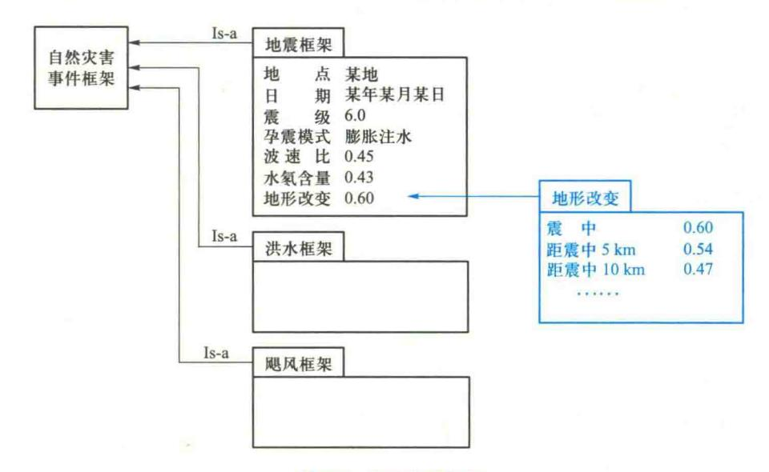

图 2.2 自然灾害框架

{24}------------------------------------------------

# 2.4.3 框架表示法的特点

#### 1. 结构性

框架表示法最突出的特点是便于表达结构性知识,能够将知识的内部结构关系及知识间的联系表示出来,因此它是一种结构化的知识表示方法。这是产生式知识表示方法不具备的,产生式系统中的知识单位是产生式规则,这种知识单位太小而难于处理复杂问题,也不能将知识间的结构关系表示出来。产生式规则只能表示因果关系,而框架表示法不仅可以通过 Infer 槽或者 Possible-reason 槽表示因果关系,还可以通过其他槽表示更复杂的关系。

#### 2. 继承性

框架表示法通过使槽值为另一个框架的名字实现不同框架间的联系,建立起表示复杂知识的框架网络。在框架网络中,下层框架可以继承上层框架的槽值,也可以进行补充和修改,这样不仅减少了知识的冗余,而且较好地保证了知识的一致性。

#### 3. 自然性

框架表示法与人在观察事物时的思维活动是一致的,比较自然。

# 2.5 语义网络表示法

# 2.5.1 语义网络

语义网络(semantic network)是一种出现比较早的知识表示形式,在人工智能中得到了比较广泛的应用。语义网络最早是 1968 年奎廉(Quillian)在他的博士论文中作为人类联想记忆的一个显式心理学模型提出的。1972 年,西蒙(Simmon)正式提出语义网络的概念,讨论了它和一阶谓词的关系,并将语义网络应用到自然语言理解的研究中。

语义网络是一种采用网络形式表示人类知识的方法。一个语义网络是一个带标识的有向图。其中,带有标识的结点表示问题领域中的物体、概念、事件、动作或者态势。

在语义网络知识表示中,结点一般划分为实例结点和类结点两种类型。结点之间带有标识的有向弧表示结点之间的语义联系,是语义网络组织知识的关键。

# 2.5.2 基本命题的语义网络表示

由于语义联系的丰富性,不同应用系统所需的语义联系的种类及其解释也不尽相同。比较典型的语义联系有:

# 1. 以个体为中心组织知识的语义联系

# (1) 实例联系

实例联系用于表示类结点与所属实例结点之间的联系,通常标识为 ISA。例如,"张三是一名教师"可以表示为如图 2.3 所示的语义网络。

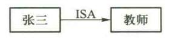

图 2.3 ISA 联系的例子

{25}------------------------------------------------

图 2.5 聚集联系的例子

一个实例结点可以通过 ISA 与多个类结点相连接,多个实例结点也可通过 ISA 与一个类结点相连接。

对概念进行有效分类有利于语义网络的组织和理解。将同一类实例结点中的共性成分在它们的类结点中加以描述,可以减少网络的复杂程度,增强知识的共享性;而不同的实例结点通过与类结点的联系,可以扩大实例结点之间的相关性,从而将分立的知识片断组织成语义丰富的知识网络结构。

## (2) 泛化联系

泛化联系用于表示一种类结点(如鸟)与更抽象的类结点(如动物)之间的联系,通常用AKO(a kind of)表示。通过 AKO 可以将问题领域中的所有类结点组织成一个 AKO 层次网络。图 2.4 给出了动物分类系统中的部分概念类型之间的 AKO 联系描述。

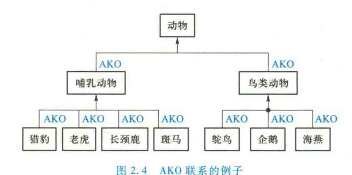

泛化联系允许低层类型继承高层类型的属性,这样可以将公用属性抽象到较高层次。由于这些共享属性不在每个结点上重复,减少了对存储空间的要求。

#### (3) 聚集联系

聚集联系用于表示某一个体与其组成成分之间的联系,通常用 part-of 表示。聚集联系基于概念的分解性,将高层概念分解为若干低层概念的集合。这里,可以把低层概念看作是高层概念的属性。例如,"两只手是人体的————————————————————————————————————

# (4) 属性联系

属性联系用于表示个体、属性及其取值之间的联系。通常用有向弧表示属性,用这些弧指向的结点表示各自的值。如图 2.6 所示,约翰的性别是男性,年龄为 30 岁,身高 180 cm,职业是程序员。

# 2. 以谓词或关系为中心组织知识的语义联系

设有n元谓词或关系 $R(arg_1, \dots, arg_n)$ , $arg_1$ 取值为 $a_1, \dots, arg_n$ 取值为 $a_n$ ,把R化成等价的一组二元关系如下:

$$arg_1(R, a_1), arg_2(R, a_2), \cdots, arg_n(R, a_n)$$

{26}------------------------------------------------

因此,只要把关系 R 也作为语义结点,其对应的关系语义网络便可以表示为图 2.7 所示的形式。

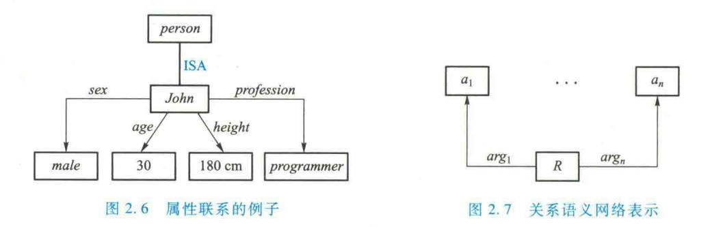

与个体结点一样,关系结点同样划分为类结点和实例结点两种。实例关系结点与类关系结点之间关系为 ISA。

# 2.5.3 连接词在语义网络中的表示方法

任何具有表达谓词公式能力的语义网络,除具备表达基本命题的能力外,还必须具备表达命题之间的与、或、非以及"蕴含"关系的能力。

## (1) 合取

在语义网络中,合取命题通过引入与结点来表示。事实上这种合取关系网络就是由与结点引出的弧构成的多元关系网络。例如命题

give(John, Mary, "War and Peace") ∧ read(Mary, "War and Peace") 可以表示为图 2.8 所示的带与结点的语义网络。

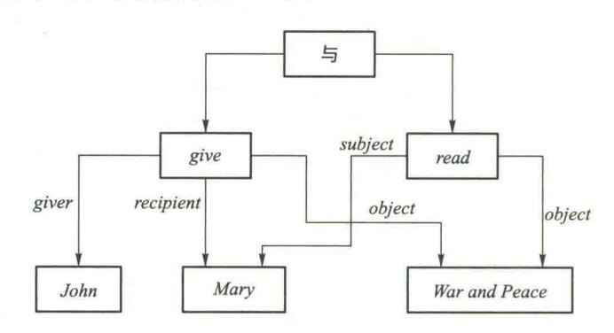

图 2.8 带与结点的语义网络的例子

# (2) 析取

析取命题通过引入或结点表示。例如命题

John is a programmer or Mary is a lawyer.

可以表示为图 2.9 所示的语义网络。

{27}------------------------------------------------

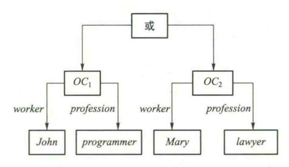

图 2.9 带或结点的语义网络的例子

其中,OC,、OC,为两个具体的职业关系,分别对应 John 为 programmer 及 Mary 为lawyer。

在命题的与、或关系相互嵌套的情况下,明显地标识与、或结点,对于正确地构造和理解语义网络的含义是非常有用的。

#### (3) 否定

在语义网络中,对于基本联系的否定,可以直接采用「ISA, AKO 及 part-of 的有向弧来标注。对于一般情况,则需要通过引进非结点来表示。例如命题

¬ give(John, Mary, "War and Peace") ∧ read(Mary, "War and Peace") 可以表示为图 2.10 所示的语义网络。

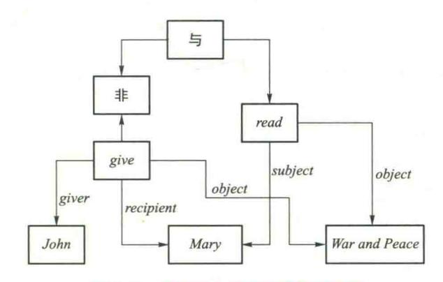

图 2.10 带非结点的语义网络的例子

# (4) 蕴含

在语义网络中,通过引人蕴含关系结点来表示规则中前提条件和结论之间的因果联系。从蕴含关系结点出发,一条弧指向命题的前提条件,记为 ANTE,另一条弧指向该规则的结论,记为 CONSE。

如规则"如果车库起火,那么用 CO2或沙来灭火",可以表示为图 2.11 所示的语义网络。

{28}------------------------------------------------

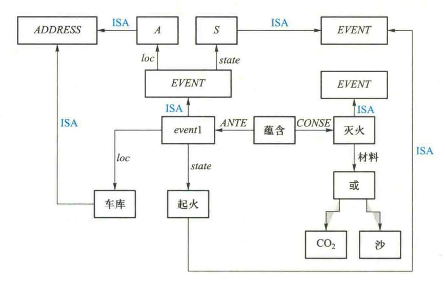

图 2.11 带蕴含结点的语义网络的例子

图 2.11 中, event1 表示特指的车库起火事件,它是一般事件的一个实例。任一事件包含地点属性(loc)及事件状态属性(state)。在抽象的 EVENT 类型结点中,用 A 表示一个地点,它是地点(ADDRESS)类的一个实例;用 S 表示一个状态,它是状态(STATE)类的一个实例。

# 2.5.4 变元和量词在语义网络中的表示方法

存在量词在语义网络中直接用 ISA 弧表示,而全称量词就要用分块方法来表示。例如命题 The dog bit the postman.

这句话意味着所涉及的是存在量词。图 2. 12(a)给出了相应的语义网络。网络中 D 结点表示一特定的狗,P 表示一特定的邮递员,B 表示一特定的咬人事件。咬人事件 B 包括两部分,一部分是攻击者,另一部分是受害者。结点 D、B 和 P 都用 ISA 弧与概念结点 DOG,BITE 以及 POSTMAN 相连,因此表示的是存在量词。

如果进一步表示

Every dog has bitten a postman.

这个事实,用谓词逻辑可表示为

$$(\forall x) DOG(x) \rightarrow (\exists y) [POSTMAN(y) \land BITE(x,y)]$$

上述谓词公式中包含有全称量词。用语义网络来表达知识的主要困难之一是如何处理全称量词。解决这个问题的一种方法是把语义网络分割成空间分层集合。每一个空间对应于一个或几个变量的范围。图 2. 12(b) 是上述事实的语义网络。其中,空间  $S_1$  是一个特定的分割,表示一个断言 A dog has bitten a postman。

{29}------------------------------------------------

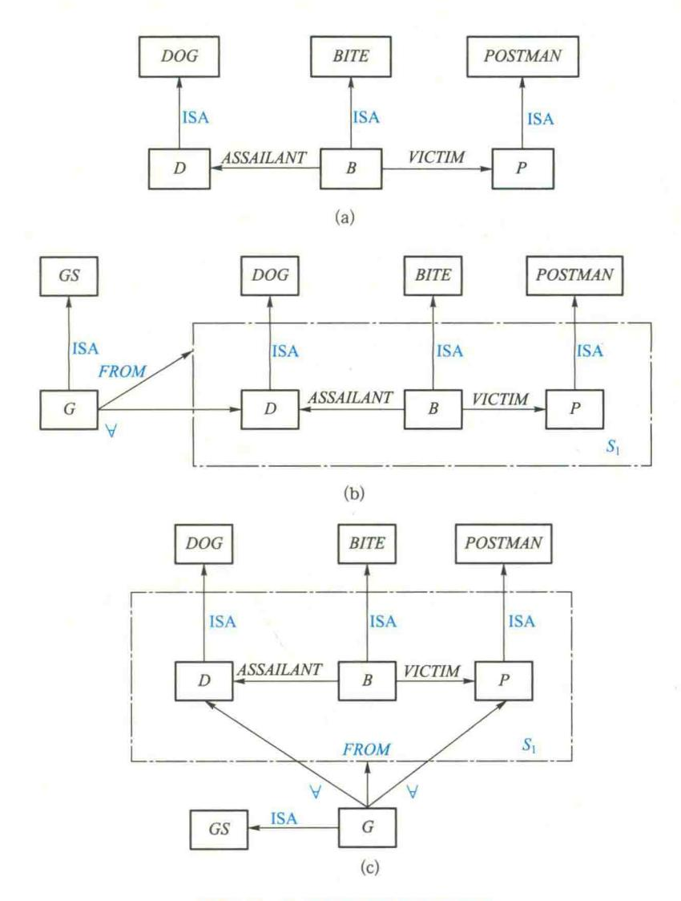

图 2.12 量词在语义网络中的表示

因为这里的狗应是指每一条狗,所以把这个特定的断言认作是断言 G。断言 G 有两部分:第一部分是断言本身,说明所断定的关系,称为格式(FORM);第二部分代表全称量词的特殊弧  $\forall$  ,一根  $\forall$  弧可表示一个全称量化的变量。GS 结点是一个概念结点,表示具有全称量化的一般事件,G 是 GS 的一个实例。在这个实例中,只有一个全称量化的变量 D,这个变量可代表 DOGS 这类物体中的每一个成员,而其他两个变量 B 和 P 仍被理解为存在量化的变量。换句话说,这样的语义网络表示对每一条狗存在一个咬人事件 B 和一个邮递员 P,使得 D 是 B 中的攻击者,而 P 是受害者。

{30}------------------------------------------------

为进一步说明分割如何表示量化变量,可考虑如何表示下述事实

Every dog has bitten every postman.

只需对图 2. 12(b) 作简单修改,用 $\forall$  弧与结点 P 相连。这样做的含义是每条狗咬了每个邮递员,如图 2. 12(c) 所示。

# 2.5.5 语义网络表示法示例

下面给出两个语义网络表示法的例子。

例 2.5 图 2.13 所示是关于桌子描述的语义网络。该语义网络中包含实例、泛化、聚集和属性四种联系。

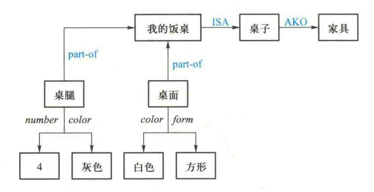

图 2.13 描述桌子的语义网络

由图 2.13 可见,以个体为中心来组织知识,其结点一般都是名词性个体或概念,并通过 ISA,AKO,part-of 等基本联系以及属性联系作为有向弧来描述有关结点概念之间的语义联系。

例 2.6 设有如图 2.14 所示动物分类网络片段,现在要求证明小贝贝是灰色的。

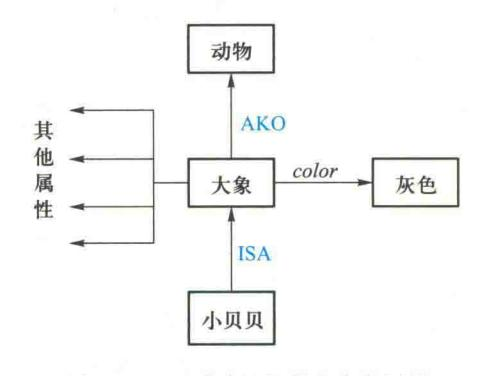

图 2.14 证明小贝贝是灰色的网络

由于在事实网络中不存在从"小贝贝"指向"灰色"的 color 弧,因此不能得到显式匹配。为此,沿分类网络 ISA 弧向上移到"大象"的结点,在那里有一条通向"灰色"的 color 弧,因而匹配

{31}------------------------------------------------

是成功的。这里,网络匹配过程中利用了小贝贝继承大象 color 属性的性质。

# 2.5.6 语义网络的推理过程

语义推理指的是依据词项之间的语义关系而进行的推理。例如,从"张明是上海人"可推出 "有人是上海人"和"张明是中国人"等。这种推理不同于命题逻辑或谓词逻辑中的形式推理,这 种推理所依据的是词项"张明"与"人""上海人"与"中国人"之间具体的语义关系。

## 语义网络的推理过程主要有两种:

- 1. 继承:把对事物的描述从抽象节点传递到具体节点,通常是沿着 IS-a、A-Kind-of 等继承 孤进行。通过继承可以得到所需节点的一些属性值。例如:猫是动物,继承了动物的会运动和会 吃的属性值。
- 2. 匹配:在知识库的语义网络中寻找与待求解问题相符的语义网络模式,匹配的主要过程如下:
- (1)根据待求解问题的要求构造一个网络片段,该网络片段中有些节点和弧的标识是空的,成为询问处,它反映的是待求解的问题。
  - (2) 根据该语义片段到知识库中寻找所需要的信息。
- (3) 当待求解问题的网络片段与知识库中的某语义网络片段相匹配时,则与询问处相匹配的事实就是该问题的解。

例如,对于图 2.14 所示的语义网络,当提出"猫会吃吗?"这一问题,系统首先访问语义网络中的"猫"结点,它不包含结构描述"会吃",因此沿"是一种"弧访问它的父点"动物",于是得到解答"猫会吃"。

# 2.5.7 语义网络表示法的特点

语义网络的主要优点是可以用来表示复杂的知识结构,它侧重于表示语义关系知识,还体现了联想思维过程,给我们提供了很自然的知识表示构架。人们基于联想记忆模型,可执行语义搜索,把相关事实从其直接相连的结点中推导出来,而不必遍历整个庞大的知识库,从而避免了组合爆炸。人们可以利用等级关系建立分类层次结构实现继承推理;也可利用继承特性,实现信息共享,将结点的公共性质存放于较高层结点中,可被子孙结点继承。因此语义网络很适合表示专业领域知识,如叙词表。

语义网络的主要缺点是因为目前的网络还缺乏标准的术语和约定,语义解释取决于操作网络的程序,所以造成网络结构复杂,建立和维护知识库较困难。因此网络搜索、调控的执行效率需要制定强有力的原则。在语义网络表示中,由于没有形式语义,没有统一的结构模型,人们根据不同的需求可以构成不同类型的语义网络(如重视联想的、重视推理的、表示词语的等)。人们在应用过程中,一部分网络用说明型方法表示知识,从演绎推理的角度来研究,发展成为另一类实用的知识表示方法,如框架表示法。

{32}------------------------------------------------

# 2.6 知识图谱

由于互联网内容的大规模、异质多元、组织结构松散的特点,给人们有效获取信息和知识提出了挑战。谷歌为了利用网络多源数据构建的知识库来增强语义搜索,提升搜索引擎返回的答案质量和用户查询的效率,于 2012 年 5 月 16 日首先发布了知识图谱(knowledge graph)。

知识图谱是一种互联网环境下的知识表示方法。在表现形式上,知识图谱和语义网络相似,但语义网络更侧重于描述概念与概念之间的关系,而知识图谱则更偏重于描述实体之间的关联。除了语义网络,万维网之父 Tim Berners Lee 于 1998 年提出的语义网(semantic Web)都可以说是知识图谱的前身。

知识图谱的目的是为了提高搜索引擎的能力,改善用户的搜索质量以及搜索体验。随着人工智能的技术发展和应用,知识图谱作为关键技术之一,已被广泛应用于智能搜索、智能问答、个性化推荐、内容分发等领域。现在的知识图谱已被用来泛指各种大规模的知识库。Google、百度和搜狗等搜索引擎公司为了改进搜索质量,纷纷构建知识图谱,分别称为知识图谱、知心和知立方。

# 2.6.1 知识图谱的定义

知识图谱(knowledge graph/vault),又称科学知识图谱,用各种不同的图形等可视化技术描述知识资源及其载体,挖掘、分析、构建、绘制和显示知识及它们之间的相互联系。

知识图谱以结构化的形式描述客观世界中概念、实体间的复杂关系,将互联网的信息表达成更接近人类认知世界的形式,提供了一种更好地组织、管理和理解互联网海量信息的能力。它把复杂的知识领域通过数据挖掘、信息处理、知识计量和图形绘制而显示出来,揭示知识领域的动态发展规律。

目前,知识图谱还没有一个标准的定义。简单地说,知识图谱是由一些相互连接的实体及其属性构成的。

知识图谱也可被看做是一张图,图中的节点表示实体或概念,而图中的边则由属性或关系构成。图 2.15 是一个典型的知识图谱。

(1) 实体:具有可区别性且独立存在的某种事物。如"中国""美国""日本"等。又如某个人、某个城市、某个大学、某种植物、某种商品等。

实体是知识图谱中的最基本元素,不同的实体间存在不同的关系。

- (2) 概念(语义类):具有同种特性的实体构成的集合。如国家、民族、书籍、电脑等。概念主要指集合、类别、对象类型、事物的种类,例如人物、地理等。
  - (3) 内容:通常作为实体和语义类的名字、描述、解释等,可以由文本、图像、音视频等来表达。
- (4) 属性(值):描述资源之间的关系,即知识图谱中的关系。不同的属性类型对应于不同类型属性的边。属性值主要指对象指定属性的值。如城市的属性包括面积、人口、所在国家、地理位置等。属性值主要指对象指定属性的值,例如多少人等。

{33}------------------------------------------------

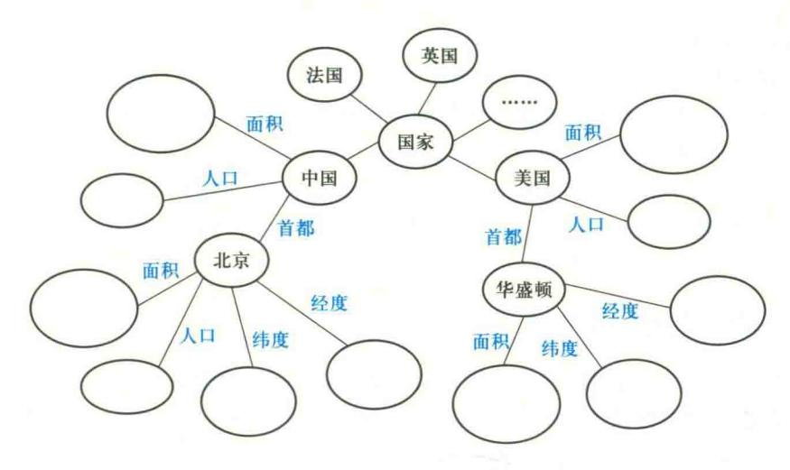

图 2.15 知识图谱示例

(5) 关系:把 k 个图节点(实体、语义类、属性值)映射到布尔值的函数。

三元组是知识图谱的一种通用表示方式。三元组的基本形式主要分为两种形式:

## (1) (实体 1-关系-实体 2)

(中国-首都-北京)是一个(实体1-关系-实体2)的三元组样例。

# (2) (实体-属性-属性值)

北京是一个实体,人口是一种属性,圆圈里要填入的是属性值。这样就构成一个(实体-属性-属性值)的三元组样例。

知识图谱是由一条条知识组成,每条知识表示为一个主谓宾 SPO (Subject-Predicate-Object) 三元组,如图 2.16 所示。

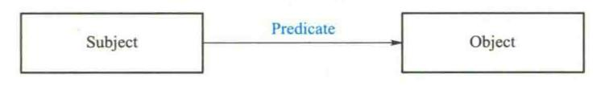

图 2.16 SPO 三元组

主语 Subject 可以是国际化资源标识符(internationalized resource identifiers, IRI)或空白节点(blank node)。

主语是资源,谓语和宾语分别表示其属性和属性值。例如"人工智能导论的授课教师是张 三老师"就可以表示为(人工智能导论授课教师,是,张莉)这个三元组。

blank node 是没有 IRI 和 literal 的资源,或者说是匿名资源。literal 是字面量,可以看作是带有数据类型的纯文本。

在知识图谱中,用资源描述框架(resource description framework, RDF)表示这种三元关系。 RDF用于描述实体/资源的标准数据模型。RDF图中一共有三种类型: international resource 

{34}------------------------------------------------

identifiers (IRIs), blank nodes 和 literals。

如果将 RDF 的一个三元组中的主语和宾语表示成节点,之间的关系表达成一条从主语到宾语的有向边,所有 RDF 三元组就将互联网的知识结构转化为图结构。合理地使用 RDF 能够将网络上各种繁杂的数据进行统一的表示。

知识图谱中的每个实体或概念用一个全局唯一确定的 ID 来标识,称为它们的标识符(identifier)。每个属性-值对(attribute-value pair, AVP)用来刻画实体的内在特性,而关系用来连接两个实体,刻画它们之间的关联。

# 2.6.2 知识图谱的架构与构建

知识图谱的架构包括自身的逻辑结构以及构建知识图谱所采用的体系架构。

## 1. 知识图谱的逻辑结构

知识图谱在逻辑上可分为模式层与数据层。

数据层主要是由一系列的事实组成,而知识以事实为单位进行存储。如果用(实体 1-关系-实体 2)和(实体-属性-属性值)这样的三元组来表达事实,可选择图数据库作为存储介质。

模式层构建在数据层之上,是知识图谱的核心。通常采用本体库来管理知识图谱的模式层。本体是结构化知识库的概念模板,通过本体库而形成的知识库不仅层次结构较强,并且冗余程度较小。

## 2. 知识图谱的体系架构

知识图谱的体系架构是指构建模式结构,如图 2.17 所示。其中虚线框内的部分为知识图谱的构建过程,也包含知识图谱的更新过程。

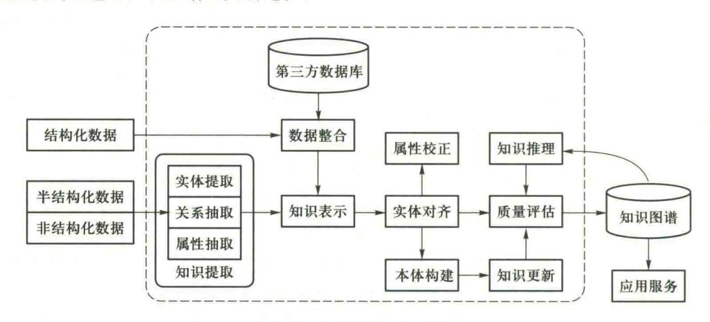

图 2.17 知识图谱的体系架构

获取知识的资源对象大体可分为结构化数据、半结构化数据和非结构化数据三类。

结构化数据是指知识定义和表示都比较完备的数据。如 DBpedia 和 Freebase 等已有知识图谱、特定领域内的数据库资源等。

{35}------------------------------------------------

半结构化数据是指部分数据是结构化的,但存在大量结构化程度较低的数据。在半结构化数据中,虽然知识的表示和定义并不一定规范统一,其中部分数据(如信息框、列表和表格等)仍遵循特定表示以较好的结构化程度呈现,但仍存在大量结构化程度较低的数据。半结构化数据的典型代表是百科类网站,一些领域的介绍和描述类页面往往也都归在此类,如电脑、手机等电子产品的参数性能分析介绍。

非结构化数据则是指没有定义和规范约束的"自由"数据。例如,最广泛存在的自然语言文本、音视频等。

#### 3. 知识图谱的构建

知识图谱经历了由人工和群体智慧构建,到面向互联网利用机器学习和信息抽取技术自动获取的过程。早期知识资源通过人工添加和合作编辑获得,如英文 WordNet、CYC 和中文的 HowNet。自动构建知识图谱的特点是面向互联网的大规模、开放、异构环境,利用机器学习和信息抽取技术自动获取互联网上的信息。例如,华盛顿大学图灵中心的 KnowItAll 和 TextRunner、卡内基梅隆大学的"永不停歇的语言学习者"(never-ending language learner,NELL)都是这种类型的知识库。目前,大多数通用的知识图谱均是通过对维基百科进行结构化来构建的。

知识图谱构建从最原始的数据(包括结构化、半结构化、非结构化数据)出发,采用一系列自动或者半自动的技术手段,从原始数据库和第三方数据库中提取知识事实,并将其存入知识库的数据层和模式层,这一过程包含:信息抽取、知识表示、知识融合、知识推理四个过程,每一次更新迭代均包含这四个阶段。

# 知识图谱主要有自顶向下(top-down)与自底向上(bottom-up)两种构建方式。

- (1) 自顶向下指的是先为知识图谱定义好本体与数据模式,再将实体加入知识库。该构建方式需要利用一些现有的结构化知识库作为其基础知识库,例如 Freebase 项目就是采用这种方式,它的绝大部分数据是从维基百科中得到的。
- (2) 自底向上指的是从一些开放链接数据中提取出实体,选择其中置信度较高的加入知识库,再构建项层的本体模式。目前,大多数知识图谱都采用自底向上的方式进行构建,其中最典型就是 Google 的 Knowledge Vault 和微软的 Satori 知识库,这也比较符合互联网数据内容知识产生的特点。

构建知识图谱需要大规模知识库,然而大规模知识库的构建与应用需要多种技术的支持。 我们可以通过知识提取技术,从一些公开的半结构化、非结构化和第三方结构化数据库的数据中 提取出实体、关系、属性等知识要素。

知识表示则通过一定有效手段对知识要素表示,便于进一步处理使用。然后我们通过知识融合,可消除实体、关系、属性等指称项与事实对象之间的歧义,形成高质量的知识库。知识推理则是在已有的知识库基础上进一步挖掘隐含的知识,从而丰富、扩展知识库。

下面以知识抽取、知识表示、知识融合以及知识推理技术为重点,选取代表性的方法,说明知识图谱构建过程中的相关技术。

{36}------------------------------------------------

# 2.6.3 知识抽取

知识抽取是从不同来源、不同结构的数据中进行知识提取,形成知识(结构化数据)存入知识图谱。

知识抽取主要是面向开放的链接数据,典型的输入是自然语言文本、图像或者视频多媒体内容文档等。然后通过自动化或者半自动化技术抽取出可用的知识单元。知识单元主要包括实体(概念的外延)、关系以及属性三个知识要素。

## 1. 实体抽取

实体抽取也称为命名实体学习(named entity learning)或命名实体识别(named entity recognition),是从原始数据语料中自动识别出命名实体。例如人名、地名、机构名、专有名词等。

由于实体是知识图谱中的最基本元素,其抽取的完整性、准确率、召回率等将直接影响到知识图谱构建的质量。

实体抽取是知识抽取中最为基础与关键的一步。实体抽取方法分为四种:

## (1) 基于百科或垂直站点抽取方法

基于百科站点或垂直站点提取方法是从维基百科、百度百科、互动百科等百科类站点的标题 和链接中抽取实体名。

基于百科站点或垂直站点实体抽取方法是最常规和最基本的实体抽取方法。这种方法的优点是可以得到开放互联网中最常见的实体名,其缺点是对于中低频的覆盖率低。与一般通用网站相比,垂直类站点的实体抽取可以获取特定领域的实体。例如从豆瓣的音乐、读书、电影等各频道抽取各种实体列表。这种方法主要是基于爬取技术来抽取。

# (2) 基于规则与词典的实体抽取方法

基于规则与词典的实体抽取方法通常需要为目标实体编写模板,然后在原始语料中进行匹配。

早期的实体抽取是在限定文本领域、限定语义单元类型的条件下进行的,主要采用的是基于规则与词典的方法,例如使用已定义的规则,抽取出文本中的人名、地名、组织机构名、特定时间等实体。

基于规则模板的方法不仅需要依靠大量的专家来编写规则或模板,覆盖的领域范围有限,而且很难适应数据变化的新需求。

# (3) 基于统计机器学习的实体抽取方法

基于统计机器学习的实体抽取方法主要是通过机器学习的方法对原始语料进行训练,然后 再利用训练好的模型去识别实体。

单纯的监督学习算法在性能上不仅受到训练集合的限制,并且算法的准确率(precision)与召回率(recall)都不够理想。随着深度学习的兴起应用,基于深度学习的命名实体识别得到广泛应用。

# (4) 面向开放域的实体抽取方法

面向开放域的实体抽取方法是从少量实体实例中自动发现具有区分力的模式,然后扩展到

{37}------------------------------------------------

海量文本去给实体做分类与聚类。例如,通过少量的实体实例建立特征模型,再通过将该模型应用于新的数据集得到新的命名实体。

## 2. 语义类抽取

语义类抽取是指从文本中自动抽取信息来构造语义类并建立实体和语义类的关联,作为实体层面上的规整和抽象。

语义类抽取方法包含三个模块:并列相似度计算、上下位关系抽取以及语义类生成。

## (1) 并列相似度计算

并列相似度是词和词之间的相似性信息度量。例如三元组(苹果,梨,s1)表示苹果和梨的并列相似度是 s1。

两个词有较高的并列相似度的条件是它们具有并列关系,即同属于一个语义类,并且有较大的关联度。例如,北京和上海具有较高的并列相似度,而北京和汽车的并列相似度很低,因为它们不属于同一个语义类。对于海淀、朝阳、闵行三个市辖区来说,海淀和朝阳的并列相似度大于海淀和闵行的并列相似度,因为前两者的关联度更高。

当前主流的并列相似度计算方法有分布相似度法(distributional similarity)和模式匹配法 (pattern matching)。它们都可以用来在数以百亿计的句子中或者数以十亿计的网页中抽取词的相似性信息。

分布相似度方法基于哈里斯(Harris)的分布假设(distributional hypothesis),即经常出现在类似的上下文环境中的两个词具有语义上的相似性。分布相似度方法分三个步骤:

- ① 定义上下文:
- ② 把每个词表示成一个特征向量,向量每一维代表一个不同的上下文,向量的值表示本词相对于上下文的权重;
  - ③ 计算两个特征向量之间的相似度,将其作为它们所代表的词之间的相似度。

模式匹配法的基本思想是把一些模式作用于源数据,得到一些词和词之间共同出现的信息,然后把这些信息聚集起来生成单词之间的相似度。模式可以是手工定义的,也可以是根据一些种子数据而自动生成的。

# (2) 上下位关系抽取

上下位关系抽取是从文档中抽取词的上下位关系信息,生成(下义词,上义词)数据对。例如(狗,动物)、(悉尼,城市)。

抽取上下位关系最简单的方法是解析百科类站点的分类信息,如维基百科的"分类"和百度 百科的"开放分类"。

上下位关系抽取方法的主要缺点:

- ① 不是所有分类词条都代表上位词。例如,百度百科中"狗"的开放分类"养殖"就不是其上位词;
  - ② 生成的关系图中没有权重信息,因此不能区分同一个实体所对应的不同上位词的重要性;
  - ③ 覆盖率偏低,即很多上下位关系并没有包含在百科站点的分类信息中。

{38}------------------------------------------------

## (3) 语义类生成

语义类生成包括聚类和语义类标定两个子模块。聚类的结果决定了要生成哪些语义类以及 每个语义类包含哪些实体,而语义类标定是给一个语义类附加一个或者多个上位词作为其成员 的公共上位词。

## 3. 属性和属性值抽取

属性抽取的任务是为每个语义类构造属性列表,而属性值抽取则为一个语义类的实体附加属性值。属性和属性值的抽取能够形成完整的实体概念的知识图谱维度。

常见的属性和属性值抽取方法包括从百科类站点中抽取,从垂直网站中生成模版抽取,从网页表格中抽取,以及利用手工定义或自动生成的模式从句子和查询日志中抽取。

## (1) 从百科类站点中抽取属性

通过解析百科类站点中的半结构化信息抽取常见的语义类/实体的属性/属性值。

百科类站点中的半结构化信息如维基百科的信息盒和百度百科的属性表格等。尽管这种方法能够得到许多属性,但需要采用其他方法来增加覆盖率,即为语义类增加更多属性以及为更多的实体添加属性值。

知识图谱除了基于维基类知识资源构造的知识图谱外,还有很多其他类型的知识图谱。如特定领域知识图谱用来描述限定领域内的概念和关系等。

## (2) 从垂直网站中生成模版抽取属性

垂直网站(vertical website)注意力集中在某些特定的领域或某种特定的需求,提供有关这个领域或需求的全部深度信息和相关服务。垂直网站如电子产品网站、图书网站、电影网站、音乐网站等。

垂直网站包含有大量实体的属性信息,例如图书的网页中包含了图书的作者、出版社、出版时间、评分等信息。可以从垂直站点中生成模版抽取属性信息。

模版生成方法分为手工法、有监督方法、半监督法以及无监督法。

考虑到需要从大量不同的网站中抽取信息,并且网站模版可能会更新等因素,无监督模版生成方法更加重要。无监督模版生成的基本思路是利用对同一个网站下面多个网页的超文本标签树的对比来生成模版。不同网页的公共部分往往对应于模版或者属性名,不同的部分则可能是属性值,而同一个网页中重复的标签块则预示着重复的记录。

# (3) 从网页表格中抽取属性

属性抽取的另一个信息源是网页表格。表格的内容对于人来说一目了然,而对于机器而言则要复杂得多。由于表格类型千差万别,很多表格制作不规则,加上机器缺乏人所具有的背景知识等原因,从网页表格中提取高质量的属性信息是困难的。

# (4) 从句子和查询日志中抽取属性

上述三种方法的共同点是通过挖掘原始数据中的半结构化信息来获取属性和属性值。与通过"阅读"句子进行信息抽取的方法相比,这些方法绕开了自然语言理解的困难。但只有一部分的人类知识是以半结构化形式体现的,而更多的知识则隐藏在自然语言句子中,因此最好能直接

{39}------------------------------------------------

从句子中抽取信息。

当前从句子和查询日志中抽取属性和属性值的基本手段是模式匹配和对自然语言的浅层处理。此过程通过将输入的模式作用到句子上而生成一些(词,属性)元组,根据语义类将这些数据元组进行合并而生成(语义类,属性)关系图。

在输入中包含种子列表或者语义类相关模式的情况下,整个方法是一个半监督的自举过程,分三个步骤:

- ① 模式生成:在句子中匹配种子列表中的词和属性从而生成模式。模式通常由词和属性的环境信息而生成;
  - ② 模式匹配:
- ③ 模式评价与选择:通过生成的(语义类,属性)关系图对自动生成的模式的质量进行自动评价并选择高分值的模式作为下一轮匹配的输入。

## 4. 关系抽取

关系抽取的目标是解决实体语义链接的问题。关系的基本信息包括参数类型、满足此关系的元组模式等。

例如关系 be capital of 表示一个国家的首都的基本信息如下:

参数类型:(capital, country)

#### 模式:

- 0 be the capital of 1
- {0} be the capital in {1}

元组:(北京,中国);(华盛顿,美国);capital 和 country 表示首都和国家两个语义类。 现在的关系抽取方式有开放式实体关系抽取和基于联合推理的实体关系抽取。

# 2.6.4 知识图谱的典型应用

维基百科(Wikipedia)是由维基媒体基金会负责运营的一个自由内容、自由编辑的多语言知识库。全球各地的志愿者们通过互联网和 Wiki 技术合作编撰。目前维基百科一共有 285 种语言版本,其中英语、德语、法语、荷兰语、意大利语、波兰语、西班牙语、俄语、日语版本已经有超过 100 万篇条目,而中文版本和葡萄牙语也有超过 90 万篇条目。维基百科中每一个词条包含对应语言的客观实体、概念的文本描述,以及各自丰富的属性、属性值。

2012 年启动的 WikiData 不仅继承了 Wikipedia 的众包协作的机制,而且支持以事实三元组为基础的知识条目编辑,截至 2017 年底已经包含超过 2500 万个词条。WikidData 支持标准格式导出,并可链接到数据网上的其他开放数据集。

DBpedia 作为开放链接数据(LOD)的核心,最早由 2007 年德国柏林自由大学以及莱比锡大学的研究者发起的一项从维基百科里萃取结构化知识的项目开始建立。2016 年 10 月的英文最新版共包含 660 万实体,其中 550 万被合理分类,包括人物 150 万,地点 84 万,音乐电影游戏

{40}------------------------------------------------

等 49.6万、组织机构 28.6万、动物 30.6万和植物 5.8万。共包含约 130 亿三元组,其中 17 亿来源于英文版的维基百科,66 亿来自其他语言版本的维基,48 亿来自 Wikipedia Commons 和 WikiData。

YAGO 是由德国马克斯-普朗克研究所(Max Planck Institute, MPI)构建的大型多语言的语义知识库,源自维基百科、WordNet和 GeoNames,从10个维基百科以不同语言提取事实和事实的组合。YAGO 拥有超过1000万个实体的知识,并且包含有关这些实体的超过1.2亿条事实三元组。

BabelNet 是最大的多语言百科全书式的字典和语义网络,由罗马大学计算机科学系的计算语言学实验室所创建。BabelNet 不仅是一个多语言的百科全书式的字典,用词典的方式编纂百科词条,同时 BabelNet 也是一个大规模的语义网络,概念和实体通过丰富的语义关系连接。BabelNet 由同义词集合构成,一共包含 15 788 626 个同义词集合,每个同义词集合表示一个具体的语义,包含不同语言下所有表达这个语义的同义词。BabelNet 4.0 版本包含 284 种语言,6 117 108 个概念,9 671 518 个实体,1 307 706 673 个词汇和语义关系。

XLORE 是由清华大学知识工程研究室自主构建的基于中、英文维基和百度百科的开放知识平台,是第一个中英文知识规模较为平衡的大规模中英文知识图谱。XLORE 通过维基内部的跨语言链接发现更多的中英文等价关系,并基于概念与实例间的 isA 关系验证提供更精确的语义关系。截至 2017 年底,XLORE 共有超过 1 400 万个实体、130 万个概念和 50 万个实例与概念间关系。

AMiner 是清华大学研发的一个科技情报知识服务引擎,它集成了来自多个数据源的近亿级的学术文献数据,从海量文献及互联网信息中,通过信息抽取方法自动获取研究者的教育背景、基本介绍等相关信息、论文引用关系、知识实体以及相关的学术会议和期刊等内容,并利用数据挖掘和社会网络分析与挖掘技术,提供面向话题的专家搜索、权威机构搜索、话题发现和趋势分析、基于话题的社会影响力分析、研究者社会网络关系识别、审稿人推荐、跨领域合作者推荐等功能。

知识图谱增强搜索结果,改善用户搜索体验,即语义搜索。Watson 是 IBM 公司研发团队历经十余年努力开发出的基于知识图谱的智能机器人,最初的目的是参加美国的一档智力游戏节目《Jeopardy!》,并于 2011 年以绝对优势赢得了人机对抗比赛。除去大规模并行化的部分,Watson 工作原理的核心部分是概率化基于证据的答案生成,根据问题线索不断缩小在结构化知识图谱上搜索空间,并利用非结构化的文本内容寻找证据支持。对于复杂问题,Watson 采用分治策略,递归地将问题分解为更简单的问题来解决。

知识图谱还可以应用于知识问答,领域大数据分析等。美国 Netflix 公司利用基于其订阅用户的注册信息和观看行为构建的知识图谱,通过分析受众群体、观看偏好、电视剧类型、导演与演员的受欢迎程度等信息,了解到用户很喜欢 Fincher 导演的作品,同时了解到 Spacey 主演的作品总体收视率不错及英剧版的《纸牌屋》很受欢迎这些信息,因此决定拍摄了美剧《纸牌屋》,最终在美国及 40 多个国家成为热门的在线剧集。

{41}------------------------------------------------

# 2.7 小结

#### 1. 知识的概念

把有关信息关联在一起所形成的信息结构称为知识。

知识主要具有相对正确性、不确定性、可表示性与可利用性等特性。

告成知识具有不确定性的原因主要有,随机性、模糊性、经验、认识不完全性。

## 2. 命题与一阶谓词公式

命题是一个非真即假的陈述句。

谓词的一般形式是: $P(x_1,x_2,\cdots,x_n)$ ,其中,P是谓词名, $x_1,x_2,\cdots,x_n$ 是个体。个体可以是常量、变元、函数。

用否定、析取、合取、蕴含、等价等连接词以及全称量词、存在量词把一些简单命题连接起来构成一个复合命题,以表示一个比较复杂的含义。

位于量词后面的单个谓词或者用括弧括起来的谓词公式称为量词的辖域,辖域内与量词中同名的变元称为约束变元,不受约束的变元称为自由变元。

对于谓词公式 P, 如果至少存在一个解释使得公式 P 在此解释下的真值为 T,则称公式 P 是可满足的,否则,则称公式 P 是不可满足的。

当且仅当 $(P_1\Lambda P_2\Lambda\cdots\Lambda P_n)\Lambda \cap Q$ 是不可满足的,则Q为 $P_1,P_2,\cdots,P_n$ 的逻辑结论。

一阶谓词逻辑表示法具有自然、精确、严密、容易实现等优点,但有不能表示不确定的知识、组合爆炸、效率低等缺点。

# 3. 产生式表示法

产生式表示法是目前应用最多的一种知识表示模型,许多成功的专家系统都用它来表示知识。

产生式通常用于表示事实、规则以及它们的不确定性度量。谓词逻辑中的蕴含式只是产生式的一种特殊情况。

产生式不仅可以表示确定性规则,还可以表示各种操作、规则、变换、算子、函数等。产生式不仅可以表示确定性知识,而且还可以表示不确定性知识。

产生式表示法具有自然性、模块性、有效性、清晰性等优点,但存在效率不高、不能表达具有结构性的知识等缺点,适合表示由许多相对独立的知识元组成的领域知识、具有经验性及不确定性的知识,也可以表示为一系列相对独立的求解问题的操作。

一个产生式系统由规则库、综合数据库、控制系统(推理机)三部分组成。产生式系统求解问题的过程是一个不断地从规则库中选择可用规则与综合数据库中的已知事实进行匹配的过程,规则的每一次成功匹配都使综合数据库增加新的内容,并朝着问题的解决方向前进一步。这一过程称为推理,是专家系统中的核心内容。

{42}------------------------------------------------

#### 4. 框架表示法

框架是一种描述所论对象(一个事物、事件或概念)属性的数据结构。

一个框架由若干个被称为"槽"(slot)的结构组成,每一个槽又可根据实际情况划分为若干个"侧面"(faced)。一个槽用于描述所论对象某一方面的属性。一个侧面用于描述相应属性的一个方面。槽和侧面所具有的属性值分别被称为槽值和侧面值。

框架表示法具有结构性、继承性、自然性的特点。

#### 5. 语义网络表示法

语义网络是带标识的有向图。其中,带有标识的结点表示问题领域中的物体、概念、事件、动作或者态势。结点之间带有标识的有向弧表示结点之间的语义联系。

比较典型的语义联系有:以个体为中心组织知识的语义联系,包括实例联系、泛化联系、聚集 联系、属性联系;以谓词或关系为中心组织知识的语义联系。

语义网络可以表达谓词公式中析取、合取、否定、蕴含以及存在量词、全称量词等关系。语义推理指的是依据词项之间的语义关系而进行的推理。

#### 6. 知识图谱

知识图谱是一种互联网环境下的知识表示方法。知识图谱是由一些相互连接的实体及其属性构成的。

知识图谱的三元组的基本形式主要分为两种形式:(实体 1-关系-实体 2)、(实体-属性-属性值)。

知识图谱在逻辑上可分为模式层与数据层。数据层主要是由一系列的事实组成,而知识以事实为单位进行存储。模式层构建在数据层之上,是知识图谱的核心。

知识图谱主要有自顶向下与自底向上两种构建方式。自顶向下指的是先为知识图谱定义好本体与数据模式,再将实体加入知识库。自底向上指的是从一些开放链接数据中提取出实体,选择其中置信度较高的加入知识库,再构建顶层的本体模式。

知识抽取是从不同来源、不同结构的数据中进行知识提取,形成知识存入知识图谱。

知识图谱的深度学习方法将实体的语义信息表示为稠密低维实值向量,进而在低维空间中高效计算实体、关系及其之间的复杂语义关联。

# 思考题

- 2.1 什么是知识,它有哪些特性,有哪几种分类方法?引起知识不确定性的主要原因有哪些?
- 2.2 什么是知识表示,如何选择知识表示方法?
- 2.3 什么是命题?请写出三个真值为T及真值为F的命题。
- 2.4 什么是谓词,什么是谓词个体及个体域,函数与谓词的区别是什么?
- 2.5 谓词逻辑和命题逻辑的关系如何,有何异同?
- 2.6 什么是谓词的项,什么是谓词的阶?请写出谓词的一般形式。

{43}------------------------------------------------

67

- 2.7 什么是谓词公式,什么是谓词公式的解释?
- 2.8 一阶谓词逻辑表示法是结构化知识还是非结构化知识?适合于表示哪种类型的知识,它有哪些 特点?
- 2.9 请写出用一阶谓词逻辑表示法表示知识的步骤。
- 2.10 产生式的基本形式是什么,它与谓词逻辑中蕴含式有什么共同处和不同处。产生式如何表示 知识的不确定性?
- 2.11 产生式系统由哪几部分组成?
- 2.12 试述产生式系统求解问题的一般步骤。
- 2.13 产生式系统中,推理机的推理方式有哪几种?在产生式推理过程中,如果发生策略冲突,如何 解决?
- 2.14 试述产生式表示法的特点。
- 2.15 框架的一般表示形式是什么?
- 2.16 框架表示法有何特点?请叙述用框架表示法表示知识的步骤。
- 2.17 试构造一个描述你的办公室或卧室的框架系统。
- 2.18 试构造一个描述计算机主机的框架系统。
- 2.19 在基于语义网络的推理系统中,一般有几种推理方法?简述它们的推理过程。
- 2.20 给出一个知识图谱实例。

# 习题

- 2.1 设有下列语句,请用相应的谓词公式把它们表示出来:
  - (1) 有的人喜欢梅花,有的人喜欢菊花,有的人既喜欢梅花又喜欢菊花。
  - (2) 他每天下午都去玩足球。
  - (3) 所有人都有饭吃。
  - (4) 喜欢玩篮球的人必喜欢玩排球。
  - (5) 要想出国留学,必须通过外语考试。
- 2.2 分别指出下列谓词公式中各量词的辖域,并指出哪些是约束变元,哪些是自由变元。
  - (1)  $(\forall x) (P(x,y) \lor (\exists y) (O(x,y) \land R(x,y)))$
  - (2)  $(\exists z)$   $(\forall v)$   $(P(z,v) \lor O(z,x)) \lor R(u,v)$
  - (3)  $(\forall x) (\neg P(x,f(x)) \lor (\exists z) (O(x,z) \land \neg R(z,y)))$
  - $(4) (\forall z) ((\exists y) ((\exists t) (P(z,t) \lor Q(y,t))) \land R(z,y))$
- 2.3 设  $D = \{1,2\}$ ,试给出谓词公式 $(\exists x)(\forall y)(P(x,y) \rightarrow Q(x,y))$ 的一个解释,并且指出该谓词公 式的真值。
- 2.4 试用谓词逻辑表达描述下列推理:
  - (1) 如果张三比李四大,那么李四比张三小。

{44}------------------------------------------------

- (2) 甲和乙结婚了,则或者甲为男,乙为女:或者甲为女,乙为男。
- (3) 如果一个人是老实人,他就不会说谎;张三说谎了,所以张三不是一个老实人。
- 2.5 将下列一则消息用框架表示:"今天,一次强度为里氏 8.5 级的强烈地震袭击了下斯洛文尼亚 (Low Slabovia)地区,造成 25 人死亡和 5 亿美元的财产损失。下斯洛文尼亚地区的主席说:多年来,靠近萨迪壕金斯(Sadie Haw Kins)断层的重灾区一直是一个危险地区。这是本地区发生的第 3 号地震。"
- 2.6 用产生式表示:
  - (1) 异或(XOR)逻辑。
  - (2) 如果一个人发烧、呕吐、出现黄疸,那么得肝炎的可能性为7成。
- 2.7 把下列语句表示成语义网络描述:
  - (1) All men are mortal.
  - (2) Every cloud has a silver lining.
  - (3) All branch managers of DEC participate in a profit-sharing plan.
- 2.8 用语义网络表示下列知识:
  - (1) 所有的鸽子都是鸟;
  - (2) 所有的鸽子都有翅膀;
  - (3) 信鸽是一种鸽子,它有翅膀。
- 2.9 用语义网络表示下列知识:
  - (1) 知更鸟是一种鸟:
  - (2) 鸵鸟是一种鸟:
  - (3) 鸟是会飞的:
  - (4) 鸵鸟不会飞;
  - (5) CLYDE 是一只知更鸟:
  - (6) CLYDE 从春天到秋天占一个巢。
- 2.10 对下列命题分别画出它的语义网络:
  - (1) 每个学生都有多本书:
  - (2) 孙老师从2月至7月给计算机应用专业讲"网络技术"课程:
  - (3) 王丽萍是天发电脑公司的经理,她35岁,住在南内环街68号。
- 2.11 把下列命题用一个语义网络表示出来:
  - (1) 猪和羊都是动物:
  - (2) 猪和羊都是偶蹄动物和哺乳动物:
  - (3) 野猪是猪,但牛长在森林中:
  - (4) 山羊是羊,且头上长着角:
  - (5) 绵羊是一种羊,它能生产羊毛。