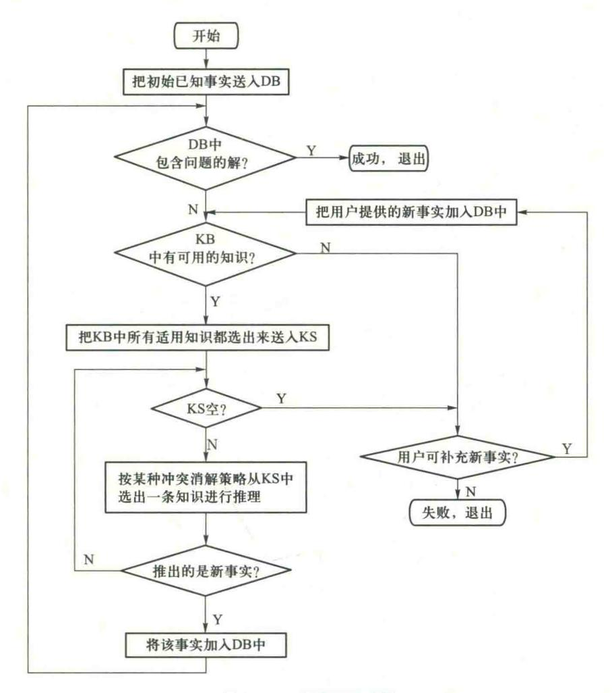
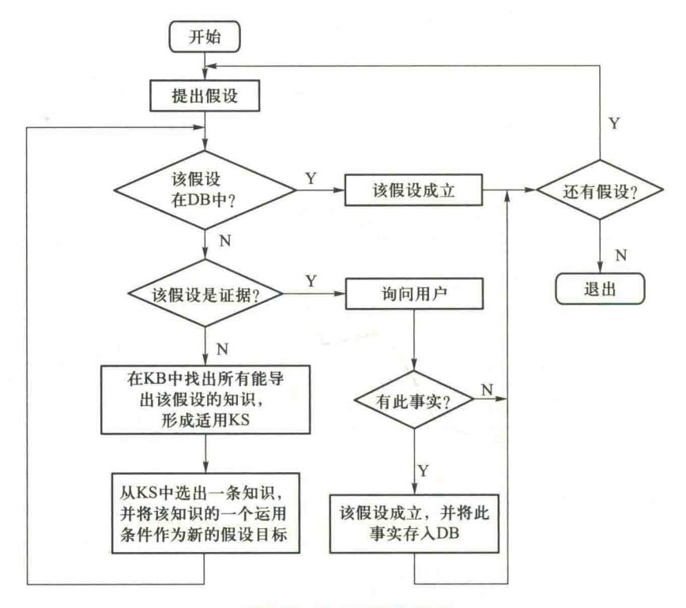
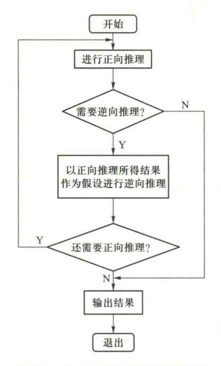
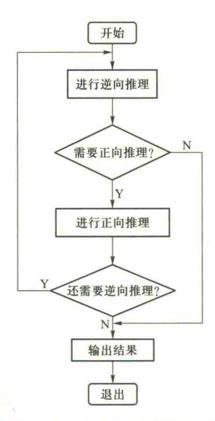
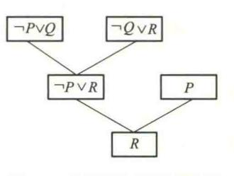
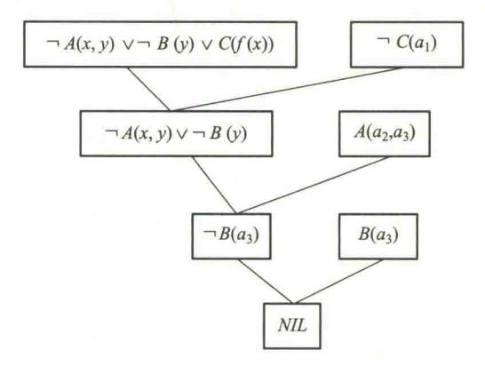
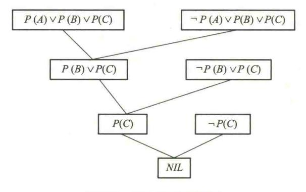
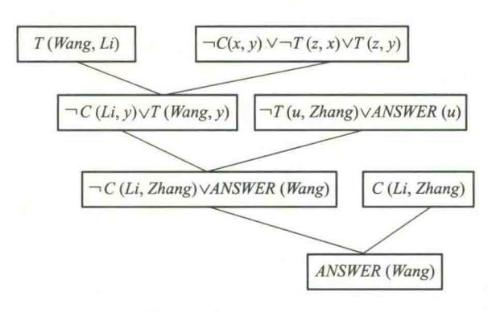

{0}------------------------------------------------

# 第3章 确定性推理方法

前面讨论了知识表示方法。这样就可以把知识用某种模式表示出来存储到计算机中去。但是,为使计算机具有智能,仅仅使计算机拥有知识是不够的,还必须使它具有思维能力,即能运用知识求解问题。推理是求解问题的一种重要方法。因此,推理方法成为人工智能的一个重要研究课题。目前,人们已经对推理方法进行了比较多的研究,提出了多种可在计算机上实现的推理方法。

下面首先讨论关于推理的基本概念,然后着重介绍鲁宾孙归结原理及其在机器定理证明和问题求解中的应用。其基本思想是先将要证明的定理表示为谓词公式,并化为子句集,然后再进行归结,如果归结出空子句,则定理得证。鲁宾孙归结原理使定理证明能够在计算机上实现。

## 3.1 推理的基本概念

### 3.1.1 推理的定义

人们在对各种事物进行分析、综合并最后作出决策时,通常是从已知的事实出发,通过运用已掌握的知识,找出其中蕴含的事实,或归纳出新的事实,这一过程通常称为推理,即从初始证据出发,按某种策略不断运用知识库中的已知知识,逐步推出结论的过程称为推理。


在人工智能系统中,推理是由程序实现的,称为推理机。已知事实和知识 推理的定义与分类是构成推理的两个基本要素。已知事实又称为证据,用以指出推理的出发点及 讲课视频 推理时应该使用的知识;而知识是使推理得以向前推进,并逐步达到最终目标的依据。例如,在医疗诊断专家系统中,专家的经验及医学常识以某种表示形式存储于知识库中。为病人诊治疾病时,推理机就是从存储在综合数据库中的病人症状及化验结果等初始证据出发,按某种搜索策略在知识库中搜寻可与之匹配的知识,推出某些中间结论,然后再以这些中间结论为证据,在知识库中搜索与之匹配的知识,推出进一步的中间结论,如此反复进行,直到最终推出结论,即病人的病因与治疗方案为止。

## 3.1.2 推理方式及其分类

人类的智能活动有多种思维方式。人工智能作为对人类智能的模拟,相应地也有多种推理方式。下面分别从不同的角度对它们进行分类。

{1}------------------------------------------------

### 1. 演绎推理、归纳推理、默认推理

若从推出结论的途径来划分,推理可分为演绎推理、归纳推理和默认推理。

演绎推理(deductive reasoning)是从全称判断推导出单称判断的过程,即由一般性知识推出适合于某一具体情况的结论。这是一种从一般到个别的推理。

演绎推理是人工智能中一种重要的推理方式。许多智能系统中采用了演绎推理。演绎推理 有多种形式,经常用的是三段论式。它包括:

- ① 大前提:已知的一般性知识或假设。
- ② 小前提:关于所研究的具体情况或个别事实的判断。
- ③ 结论:由大前提推出的适合于小前提所示情况的新判断。

下面是一个三段论推理的例子:

- ① 大前提:足球运动员的身体都是强壮的。
- ② 小前提:高波是一名足球运动员。
- ③ 结论:高波的身体是强壮的。

归纳推理(inductive reasoning)是从足够多的事例中归纳出一般性结论的推理过程,是一种从个别到一般的推理。

若从归纳时所选事例的广泛性来划分,归纳推理又可分为完全归纳推理和不完全归纳推理 两种。

所谓完全归纳推理是指在进行归纳时考察了相应事物的全部对象,并根据这些对象是否都 具有某种属性,从而推出这个事物是否具有这个属性。例如,某厂进行产品质量检查,如果对每 一件产品都进行了严格检查,并且都是合格的,则推导出结论"该厂生产的产品合格"。

所谓不完全归纳推理是指考察了相应事物的部分对象,就得出了结论。例如,检查产品质量时,只是随机地抽查了部分产品,只要它们都合格,就得出了"该厂生产的产品合格"的结论。

不完全归纳推理推出的结论不具有必然性,属于非必然性推理,而完全归纳推理是必然性推理。但由于要考察事物的所有对象通常都比较困难,因而大多数归纳推理都是不完全归纳推理。归纳推理是人类思维活动中最基本、最常用的一种推理形式。人们在由个别到一般的思维过程中经常要用到它。

默认推理又称为缺省推理(default reasoning)。它是在知识不完全的情况下假设某些条件已经具备所进行的推理。

例如,在条件 A 已成立的情况下,如果没有足够的证据能证明条件 B 不成立,则默认 B 是成立的,并在此默认的前提下进行推理,推导出某个结论。

由于这种推理允许默认某些条件是成立的,所以在知识不完全的情况下也能进行。在默认 推理的过程中,如果到某一时刻发现原先所作的默认不正确,则要撤销所作的默认以及由此默认 推出的所有结论,重新按新情况进行推理。

### 2. 确定性推理、不确定性推理

若按推理时所用知识的确定性来划分,推理可分为确定性推理和不确定性推理。

{2}------------------------------------------------

所谓确定性推理是指推理时所用的知识与证据都是确定的,推出的结论也是确定的,其真值或者为真或者为假,没有第三种情况出现。

本章将讨论的经典逻辑推理就属于这一类。经典逻辑推理是最先提出的一类推理方法,是根据经典逻辑(命题逻辑及一阶谓词逻辑)的逻辑规则进行的一种推理,主要有自然演绎推理、归结演绎推理及与/或形演绎推理等。由于这种推理是基于经典逻辑的,其真值只有"真"和"假"两种,因此它是一种确定性推理。

所谓不确定性推理是指推理时所用的知识与证据不都是确定的,推出的结论也是不确定的。

现实世界中的事物和现象大都是不确定的,或者模糊的,很难用精确的数学模型来表示与处理。不确定性推理又分为似然推理与近似推理或模糊推理,前者是基于概率论的推理,后者是基于模糊逻辑的推理。人们经常在知识不完全、不精确的情况下进行推理,因此,要使计算机能模拟人类的思维活动,就必须使它具有不确定性推理的能力。

### 3. 单调推理、非单调推理

若按推理过程中推出的结论是否越来越接近最终目标来划分,推理又分为单调推理和非单调推理。

单调推理是在推理过程中随着推理向前推进及新知识的加入,推出的结论越来越接近最终目标。

在单调推理的推理过程中不会出现反复的情况,即不会由于新知识的加入否定了前面推出的结论,从而使推理又退回到前面的某一步。本章将要讨论的基于经典逻辑的演绎推理属于单调性推理。

非单调推理是在推理过程中由于新知识的加入,不仅没有加强已推出的结论,反而要否定它,使推理退回到前面的某一步,然后重新开始。

非单调推理一般是在知识不完全的情况下发生的。由于知识不完全,为使推理进行下去,就要先做某些假设,并在假设的基础上进行推理,当以后由于新知识的加入发现原先的假设不正确时,就需要推翻该假设以及以此假设推出的所有结论,再用新知识重新进行推理。显然,默认推理是一种非单调推理。

在人们的日常生活及社会实践中,很多情况下进行的推理都是非单调推理。明斯基举了一个非单调推理的例子:当知道 X 是一只鸟时,一般认为 X 会飞,但之后又知道 X 是企鹅,而企鹅是不会飞的,则取消先前加入的 X 能飞的结论,而加入 X 是不会飞的结论。

### 4. 启发式推理、非启发式推理

若按推理中是否运用与推理有关的启发性知识来划分,推理可分为启发式推理(heuristic inference)和非启发式推理。

如果推理过程中运用启发式知识,则称为启发式推理,否则,称为非启发式推理。

所谓启发性知识是指与问题有关且能加快推理过程、求得问题最优解的知识。例如推理的目标是要在脑膜炎、肺炎、流感这三种疾病中选择一个,又设有 $r_1$ 、 $r_2$ 、 $r_3$ 这三条产生式规则可供使用,其中 $r_1$ 推出的是脑膜炎, $r_2$ 推出的是肺炎, $r_3$ 推出的是流感。如果希望尽早地排除脑膜炎这一

{3}------------------------------------------------

危险疾病,应该先选用  $r_1$ ;如果本地区目前正在盛行流感,则应考虑首先选择  $r_3$ 。这里,"脑膜炎危险"及"目前正在盛行流感"是与问题求解有关的启发性信息。

### 3.1.3 推理的方向


推理的方向讲课

推理过程是求解问题的过程。问题求解的质量与效率不仅依赖于所采用的求解方法(如匹配方法、不确定性的传递算法等),而且还依赖于求解问题的策略,即推理的控制策略。

推理的控制策略主要包括推理方向、搜索策略、冲突消解策略、求解策略及限制策略等。

初版▲

推理方向分为正向推理、逆向推理、混合推理及双向推理四种。

### 1. 正向推理

正向推理是以已知事实作为出发点的一种推理。

正向推理的基本思想:从用户提供的初始已知事实出发,在知识库 KB 中找出当前可适用的知识,构成可适用知识集 KS,然后按某种冲突消解策略从 KS 中选出一条知识进行推理,并将推出的新事实加入数据库中作为下一步推理的已知事实,此后再在知识库中选取可适用知识进行推理,如此重复这一过程,直到求得了问题的解或者知识库中再无可适用的知识为止。

由于这种推理方法是从规则的前提向结论进行推理,所以称之为正向推理。由于正向推理 是通过动态数据库中的数据来"触发"规则进行推理的,所以又称之为数据驱动的推理。

### 正向推理的推理过程可用如下算法描述:

- ① 将用户提供的初始已知事实送入数据库 DB。
- ② 检查数据库 DB 是否已经包含了问题的解,若有,则求解结束,并成功退出;否则,执行下一步。
- ③ 根据数据库 DB 中的已知事实,扫描知识库 KB,检查 KB 中是否有可适用(即可与 DB 中已知事实匹配)的知识,若有,则转向④,否则转向⑥。
  - ④ 把 KB 中所有的适用知识都选出来,构成可适用知识集 KS。
- ⑤ 若 KS 不空,则按某种冲突消解策略从中选出一条知识进行推理,并将推出的新事实加入 DB 中,然后转向②;若 KS 空,则转向⑥。
- ⑥ 询问用户是否可进一步补充新的事实,若可补充,则将补充的新事实加入 DB中,然后转向③;否则表示求不出解,失败退出。

以上算法如图 3.1 所示。

为了实现正向推理,有许多具体问题需要解决。例如,要从知识库中选出可适用的知识,就要用知识库中的知识与数据库中已知事实进行匹配,为此就需要确定匹配的方法。匹配通常难以做到完全一致,因此还需要解决怎样才算是匹配成功的问题。

#### 2. 逆向推理

逆向推理是以某个假设目标作为出发点的一种推理。

{4}------------------------------------------------



图 3.1 正向推理示意图

逆向推理的基本思想是:首先选定一个假设目标,然后寻找支持该假设的证据,若所需的证据都能找到,则说明原假设成立;若无论如何都找不到所需要的证据,说明原假设不成立;为此需要另作新的假设。

由于逆向推理是先假设求解目标成立,然后逆向使用规则进行推理的,所以又称为目标驱动的推理。

逆向推理过程可用如下算法描述:

- ① 提出要求证的目标(假设)。
- ② 检查该目标是否已在数据库中,若在,则该目标成立,退出推理或者对下一个假设目标进行验证;否则,转下一步。

{5}------------------------------------------------

- ③ 判断该目标是否是证据,即它是否为应由用户证实的原始事实,若是,则询问用户;否则, 转下一步。
  - ④ 在知识库中找出所有能导出该目标的知识,形成适用的知识集 KS,然后转下一步。
  - ⑤ 从 KS 中选出一条知识,并将该知识的运用条件作为新的假设目标,然后转向②。 该算法可用图 3.2 示意。



图 3.2 逆向推理示意图

与正向推理相比,逆向推理更复杂一些,上述算法只是描述了它的大致过程,许多细节没有反映出来。例如,如何判断一个假设是否是证据?当导出假设的知识有多条时,如何确定先选哪一条?另外,一条知识的运用条件一般有多个,当其中的一个经验证成立后,如何自动地换为对另一个的验证?其次,在验证一个运用条件时,需要把它当作新的假设,并查找可导出该假设的知识,这样就又会产生一组新的运用条件,形成一个树状结构,当到达叶结点(即数据库中有相应的事实或者用户可肯定相应事实存在等)时,又需逐层向上返回,返回过程中有可能又要下到下一层,这样上上下下重复多次,才会导出原假设是否成立的结论。这是一个比较复杂的推理过程。

逆向推理的主要优点是不必使用与目标无关的知识,目的性强,同时它还有利于向用户提供 解释。其主要缺点是起始目标的选择有盲目性,若不符合实际,就要多次提出假设,影响到系统 

{6}------------------------------------------------

的效率。

### 3. 混合推理

正向推理具有盲目、效率低等缺点,推理过程中可能会推出许多与问题无关的子目标;逆向推理中,若提出的假设目标不符合实际,也会降低系统的效率。为解决这些问题,可把正向推理与逆向推理结合起来,使其各自发挥自己的优势,取长补短。这种既有正向又有逆向的推理称为混合推理。另外,在下述几种情况下,通常也需要进行混合推理。

### (1) 已知的事实不充分

当数据库中的已知事实不够充分时,若用这些事实与知识的运用条件进行匹配进行正向推理,可能连一条适用知识都选不出来,这就使推理无法进行下去。此时,可通过正向推理先把其运用条件不能完全匹配的知识都找出来,并把这些知识可导出的结论作为假设,然后分别对这些假设进行逆向推理。由于在逆向推理中可以向用户询问有关证据,这就有可能使推理进行下去。

### (2) 正向推理推出的结论可信度不高

用正向推理进行推理时,虽然推出了结论,但可信度可能不高,达不到预定的要求。因此为了得到一个可信度符合要求的结论,可用这些结论作为假设,然后进行逆向推理,通过向用户询问进一步的信息,有可能得到一个可信度较高的结论。

### (3) 希望得到更多的结论

在逆向推理过程中,由于要与用户进行对话,有针对性地向用户提出询问,这就有可能获得一些原来不掌握的有用信息。这些信息不仅可用于证实要证明的假设,同时还有助于推出一些其他结论。因此,在用逆向推理证实了某个假设之后,可以再用正向推理推出另外一些结论。例如在医疗诊断系统中,先用逆向推理证实某病人患有某种病,然后再利用逆向推理过程中获得的信息进行正向推理,就有可能推出该病人还患有别的什么病。

由以上讨论可以看出,混合推理分为两种情况:一种是先进行正向推理,帮助选择某个目标,即从已知事实演绎出部分结果,然后再用逆向推理证实该目标或提高其可信度;另一种情况是先假设一个目标进行逆向推理,然后再利用逆向推理中得到的信息进行正向推理,以推出更多的结论。

先正向后逆向混合推理过程如图 3.3 所示。

先逆向后正向混合推理过程如图 3.4 所示。

### 4. 双向推理

在定理的机器证明等问题中,经常采用双向推理。所谓双向推理是指正向推理与逆向推理同时进行,且在推理过程中的某一步骤上"碰头"的一种推理。其基本思想是:一方面根据已知事实进行正向推理,但并不推到最终目标;另一方面从某假设目标出发进行逆向推理,但并不推至原始事实,而是让它们在中途相遇,即由正向推理所得到的中间结论恰好是逆向推理此时所要求的证据,这时推理就可结束,逆向推理时所做的假设就是推理的最终结论。

双向推理的困难在于"碰头"判断。另外,如何权衡正向推理与逆向推理的比重,即如何确定"碰头"的时机也是一个困难问题。

{7}------------------------------------------------



图 3.3 先正向后逆向混合推理过程



图 3.4 先逆向后正向混合推理过程

## 3.1.4 冲突消解策略


冲突消解策略讲 课视频▲ 在推理过程中,系统要不断地用当前已知的事实与知识库中的知识进行匹配。此时,可能发生如下三种情况:

- ①已知事实恰好只与知识库中的一个知识匹配成功。
- ② 已知事实不能与知识库中的任何知识匹配成功。
- ③ 已知事实可与知识库中的多个知识匹配成功;或者多个(组)已知事实都可与知识库中的某一个知识匹配成功;或者有多个(组)已知事实可与知识

库中的多个知识匹配成功。 这里已知事实与知识库中的知识匹配成功的含义,对正向推理而言,是指产生式规则的前件

对于第一种情况,由于匹配成功的知识只有一个,所以它就是可应用的知识,可直接把它应用于当前的推理。

和已知事实匹配成功:对逆向推理而言,是指产生式规则的后件和假设匹配成功。

当第二种情况发生时,由于找不到可与当前已知事实匹配成功的知识,使得推理无法继续进行下去。这或者是由于知识库中缺少某些必要的知识,或者由于要求解的问题超出了系统功能范围等,此时可根据当前的实际情况作相应的处理。

第三种情况刚好与第二种情况相反,它不仅有知识匹配成功,而且有多个知识匹配成功,称

{8}------------------------------------------------

这种情况为发生了冲突。此时需要按一定的策略解决冲突,以便从中挑出一个知识用于当前的推理,这一解决冲突的过程称为冲突消解(conflict resolution)。解决冲突时所用的方法称为冲突消解策略。对正向推理而言,它将决定选择哪一组已知事实来激活哪一条产生式规则,使它用于当前的推理,产生其后件指出的结论或执行相应的操作;对逆向推理而言,它将决定哪一个假设与哪一个产生式规则的后件进行匹配,从而推出相应的前件,作为新的假设。

目前已有多种消解冲突的策略,其基本思想都是对知识进行排序。常用的有以下几种。

### 1. 按规则的针对性排序

本策略是优先选用针对性较强的产生式规则。如果  $r_2$ 中除了包括  $r_1$ 要求的全部条件外,还包括其他条件,则称  $r_2$ 比  $r_1$ 有更大的针对性, $r_1$ 比  $r_2$ 有更大的通用性。因此,当  $r_2$ 与  $r_1$ 发生冲突时,优先选用  $r_2$ 。因为它要求的条件较多,其结论一般更接近于目标,一旦得到满足,可缩短推理过程。

### 2. 按已知事实的新鲜性排序

在产生式系统的推理过程中,每应用一条产生式规则就会得到一个或多个结论或者执行某个操作,数据库就会增加新的事实。另外,在推理时还会向用户询问有关的信息,也使数据库的内容发生变化。人们把数据库中后生成的事实称为新鲜的事实,即后生成的事实比先生成的事实具有较大的新鲜性。若一条规则被应用后生成了多个结论,则既可以认为这些结论有相同的新鲜性,也可以认为排在前面(或后面)的结论有较大的新鲜性,根据情况决定。

设规则  $r_1$ 可与事实组 A 匹配成功,规则  $r_2$ 可与事实组 B 匹配成功,则 A 与 B 中哪一组较新鲜,与它匹配的产生式规则就先被应用。

如何衡量 A 与 B 中哪一组事实更新鲜呢? 常用的方法有以下三种:

- ① 把 A = B 中的事实逐个比较其新鲜性, 若 A 中包含的更新鲜的事实比 B 多, 就认为 A 比 B 新鲜。例如, 设 A = B 中各有五个事实, 而 A 中有三个事实比 B 中的事实更新鲜,则认为 A 比 B 新鲜。
- ② 以 A 中最新鲜的事实与 B 中最新鲜的事实相比较,哪一个更新鲜,就认为相应的事实组更新鲜。
- ③ 以 A 中最不新鲜的事实与 B 中最不新鲜的事实相比较,哪一个更不新鲜,就认为相应的事实组有较小的新鲜性。

## 3. 按匹配度排序

在不确定性推理中,需要计算已知事实与知识的匹配度,当其匹配度达到某个预先规定的值时,就认为它们是可匹配的。若产生式规则  $r_1$ 与  $r_2$ 都可匹配成功,则优先选用匹配度较大的产生式规则。

## 4. 按条件个数排序

如果有多条产生式规则生成的结论相同,则优先应用条件少的产生式规则,因为条件少的规则匹配时花费的时间较少。

在具体应用时,可对上述几种策略进行组合,尽量减少冲突的发生,使推理有较快的速度和

{9}------------------------------------------------

较高的效率。

#### 5. 按上下文限制排序

把产生式规则按它们所描述的上下文分成若干组,在不同的条件下,只能从相应的组中选取有关的产生式规则。这样,不仅可以减少冲突的发生,而且由于缩小了搜索范围从而提高了推理的效率。例如食品装袋系统 BAGGER 就是这样做的。它把食品装袋过程分成核对订货、大件物品装袋、中件物品装袋、小件物品装袋四个阶段,每个阶段都有一组产生式规则与之对应。在装袋的不同阶段,只能应用对应组中的产生式规则,指示机器人做相应的工作。

### 6. 按冗余限制排序

如果一条产生式规则被应用后产生冗余知识,就降低它被应用的优先级,产生的冗余知识越 多,优先级降低越多。

### 7. 根据领域问题的特点排序

对某些领域问题,事先可知道它的某些特点,则可根据这些特点把知识排成固定的顺序。例如:

- ① 当领域问题有固定的解题次序时,可按该次序排列相应的知识,排在前面的知识优先被应用。
- ② 当已知某些产生式规则被应用后会明显地有利于问题的求解时,就使这些产生式规则优先被应用。

在逆向推理中也存在冲突消解问题,可采用与正向推理一样的方法解决。

## 3.2 自然演绎推理


从一组已知为真的事实出发,直接运用经典逻辑的推理规则推出结论的过程称为自然演绎推理。其中,基本的推理是P规则、T规则、假言推理、拒取式推理等。

假言推理的一般形式是

自然演绎推理讲

 $P, P \rightarrow 0 \Rightarrow 0$ 

课视频▲

它表示:由 $P \rightarrow 0$  及P 为真,可推出Q 为真。

例如,由"如果 x 是金属,则 x 能导电"及"铜是金属"可推出"铜能导电"的结论。 拒取式推理的一般形式是

$$P \rightarrow 0$$
,  $\neg 0 \Rightarrow \neg P$ 

它表示:由 $P \rightarrow Q$ 为真及Q为假,可推出P为假。

例如,由"如果下雨,则地上就湿"及"地上不湿"可推出"没有下雨"的结论。

这里,应该注意避免如下两类错误;一种是肯定后件(Q)的错误,另一种是否定前件(P)的错误。

所谓肯定后件是指,当  $P \rightarrow Q$  为真时,希望通过肯定后件 Q 为真来推出前件 P 为真,这是不允许的。

{10}------------------------------------------------

例如伽利略在论证哥白尼的日心说时,曾使用了如下推理:

- ① 如果行星系统是以太阳为中心的,则金星会显示出位相变化。
- ② 金星显示出位相变化(肯定后件)。
- ③ 所以,行星系统是以太阳为中心。

因为这里使用了肯定后件的推理,违反了经典逻辑规则,他为此遭到非难。

所谓否定前件是指,当  $P \rightarrow Q$  为真时,希望通过否定前件 P 来推出后件 Q 为假,这也是不允许的。例如下面的推理就是使用了否定前件的推理,违反了逻辑规则:

- ① 如果下雨,则地上是湿的。
- ② 没有下雨(否定前件)。
- ③ 所以, 地上不湿。

这显然是不正确的。因为当地上洒水时,地上也会湿。事实上,只要仔细分析蕴含 $P \rightarrow Q$  的定义,就会发现当 $P \rightarrow Q$  为真时,肯定后件或否定前件所得的结论既可能为真,也可能为假,不能确定。

下面举例说明自然演绎推理方法。

### 例 3.1 设已知如下事实:

- (1) 凡是容易的课程小王(Wang)都喜欢;
- (2) C 班的课程都是容易的:
- (3) ds 是 C 班的一门课程。

求证:小王喜欢 ds 汶门课程。

证明 首先定义谓词:

EASY(x):x 是容易的;

LIKE(x, y):x 喜欢 y;

C(x):x 是 C 班的一门课程。

把上述已知事实及待求证的问题用谓词公式表示出来:

(∀x) (EASY(x)→LIKE(Wang, x)) 凡是容易的课程小王都是喜欢的;

 $(\forall x) (C(x) \rightarrow EASY(x))$ 

C 班的课程都是容易的;

C(ds)

ds 是 C 班的课程:

LIKE (Wang, ds)

小王喜欢 ds 这门课程,这是待求证的问题。

应用推理规则进行推理:

因为

$$(\forall x) (EASY(x) \rightarrow LIKE(Wang, x))$$

所以由全称固化得

$$EASY(z) \rightarrow LIKE(Wang, z)$$

因为

$$(\forall x) (C(x) \rightarrow EASY(x))$$

{11}------------------------------------------------

所以由全称固化得

 $C(y) \rightarrow EASY(y)$ 

由 P 规则及假言推理得

C(ds),  $C(y) \rightarrow EASY(y) \Rightarrow EASY(ds)$ EASY(ds),  $EASY(z) \rightarrow LIKE(Wang, z)$ 

由T规则及假言推理得

LIKE (Wang, ds)

即小王喜欢ds这门课程。

一般来说,由已知事实推出的结论可能有多个,只要其中包括了待证明的结论,就认为问题得到了解决。

自然演绎推理的优点是表达定理证明过程自然,容易理解,而且它拥有丰富的推理规则,推理过程灵活,便于在它的推理规则中嵌入领域启发式知识。其缺点是容易产生组合爆炸,推理过程得到的中间结论一般呈指数形式递增,这对于一个大的推理问题来说是十分不利的。

## 3.3 谓词公式化为子句集的方法

在谓词逻辑中,有下述定义:

原子(atom)谓词公式是一个不能再分解的命题。

原子谓词公式及其否定,统称为文字(literal)。P 称为正文字, $\neg P$  称为负文字。P 与 $\neg P$  为互补文字。


归结演绎推理讲课视频▲

任何文字的析取式称为子句(clause)。任何文字本身也都是子句。

由子句构成的集合称为子句集。

不包含任何文字的子句称为空子句,表示为 NIL。

由于空子句不含有文字,它不能被任何解释满足,所以,空子句是永假的、 不可满足的。

在谓词逻辑中,任何一个谓词公式都可以通过应用等价关系及推理规则化成相应的子句集,从而能够比较容易地判定谓词公式的不可满足性。下面结合具体的例子,说明把谓词公式化成子句集的步骤。

例 3.2 将下列谓词公式化为子句集:

$$(\forall x)((\forall y)P(x,y)\rightarrow \neg (\forall y)(Q(x,y)\rightarrow R(x,y)))$$

解 (1) 消去谓词公式中的"→"和"↔"符号

利用谓词公式的等价关系

$$P \rightarrow Q \Leftrightarrow \neg P \lor Q$$

$$P \leftrightarrow Q \Leftrightarrow (P \land Q) \lor (\neg P \land \neg Q).$$


谓词公式化成子 句集讲课视频▲

{12}------------------------------------------------

### 上例等价变换为

$$(\forall x) (\neg (\forall y) P(x,y) \lor \neg (\forall y) (\neg Q(x,y) \lor R(x,y)))$$

(2) 把否定符号移到紧靠谓词的位置上

利用谓词公式的等价关系

双重否定律  $\neg (\neg P) ⇔ P$ 

徳・摩根律 ¬ (P∧Q)⇔¬ P∨¬ Q

 $\neg (P \lor Q) \Leftrightarrow \neg P \land \neg Q$ 

量词转换律  $\neg (\forall x) P \Leftrightarrow (\exists x) \neg P$ 

 $\neg (\exists x) P \Leftrightarrow (\forall x) \neg P$ 

把否定符号移到紧靠谓词的位置上,减少了否定符号的辖域。

上例等价变换为

$$(\forall x)((\exists y) \neg P(x,y) \lor (\exists y)(Q(x,y) \land \neg R(x,y)))$$

### (3) 变量标准化

所谓变量标准化就是重新命名变元,使每个量词采用不同的变元,从而使不同量词的约束变元有不同的名字。这是因为在任一量词辖域内,受到该量词约束的变元为一哑元(虚构变量),它可以在该辖域内被另一个没有出现过的任意变元统一代替,而不改变谓词公式的值

$$(\forall x) P(x) \equiv (\forall y) P(y)$$
$$(\exists x) P(x) \equiv (\exists y) P(y)$$

上例等价变换为

$$(\forall x)((\exists y) \neg P(x,y) \lor (\exists z)(Q(x,z) \land \neg R(x,z)))$$

(4) 消去存在量词

分两种情况:

一种情况是存在量词不出现在全称量词的辖域内。此时只要用一个新的个体常量替换受该存在量词约束的变元,就可以消去存在量词。因为如原谓词公式为真,则总能够找到一个个体常量,替换后仍然使谓词公式为真。这里的个体常量就是不含变量的 Skolem 函数。

另一种情况是存在量词出现在一个或者多个全称量词的辖域内。此时要用 Skolem 函数替换受该存在量词约束的变元,从而消去存在量词。这里认为所存在的 y 依赖于 x 值,它们的依赖 关系由 Skolem 函数所定义。

对于一般情况

$$(\forall x_1)(\forall x_2)\cdots(\forall x_n)(\exists y)P(x_1,x_2,\cdots,x_n,y)$$

存在量词 y 的 Skolem 函数记为

$$y=f(x_1,x_2,\cdots,x_n)$$

Skolem 函数所使用的函数符号必须是新的。可见,Skolem 函数把每个  $x_1, x_2, \cdots, x_n$  值,映射 到存在的那个 y。

用 Skolem 函数代替每个存在量词量化的变量的过程称为 Skolem 化。

{13}------------------------------------------------

对于上面的例子,存在量词 $(\exists y)$ 及 $(\exists z)$ 都位于全称量词 $(\forall x)$ 的辖域内,所以都需要用 Skolem 函数代替。设 y 和 z 的 Skolem 函数分别记为 f(x) 和 g(x),则替换后得到

$$(\forall x) (\neg P(x,f(x)) \lor (Q(x,g(x)) \land \neg R(x,g(x))))$$

### (5) 化为前束形

所谓前束形,就是把所有的全称量词都移到公式的前面,使每个量词的辖域都包括公式后的整个部分,即

其中,(前缀)是全称量词串, 母式 是不含量词的谓词公式。

对于上面的例子,因为只有一个全称量词,而且已经位于公式的最左边,所以,这一步不需要做任何工作。

(6) 化为 Skolem 标准形

Skolem 标准形的一般形式是

$$(\forall x_1)(\forall x_2)\cdots(\forall x_n)M$$

其中,M是子句的合取式,称为 Skolem 标准形的母式。

一般利用

$$P \lor (Q \land R) \Leftrightarrow (P \lor Q) \land (P \lor R)$$

或

$$P \land (Q \lor R) \Leftrightarrow (P \land Q) \lor (P \land R)$$

把谓词公式化为 Skolem 标准形。

对于上面的例子,有

$$(\forall x)((\neg P(x,f(x)) \lor Q(x,g(x))) \land (\neg P(x,f(x)) \lor \neg R(x,g(x))))$$

## (7) 略去全称量词

由于公式中所有变量都是全称量词量化的变量,因此,可以省略全称量词。母式中的变量仍然认为是全称量词量化的变量。

对于上面的例子,有

$$(\neg P(x,f(x)) \lor Q(x,g(x))) \land (\neg P(x,f(x)) \lor \neg R(x,g(x)))$$

(8) 消去合取词,把母式用子句集表示

对于上面的例子,有

$$\{\neg P(x,f(x)) \lor Q(x,g(x)), \neg P(x,f(x)) \lor \neg R(x,g(x))\}$$

(9) 子句变量标准化,即使每个子句中的变量符号不同

这是由于谓词公式的性质

$$(\ \forall \ x) \left[\ P(x) \land Q(x)\ \right] \equiv (\ \forall \ x) P(x) \land (\ \forall \ y) Q(y)$$

对于上面的例子,有

$$\{\neg P(x,f(x)) \lor Q(x,g(x)), \neg P(y,f(y)) \lor \neg R(y,g(y))\}\$$

注意:在子句集中各子句之间是合取关系。

{14}------------------------------------------------

上面介绍了将谓词公式化为子句集的步骤。下面再举几个例子进一步说明。

### 例 3.3 将下列谓词公式化为子句集:

 $(\forall x) \{ [\neg P(x) \lor \neg Q(x)] \rightarrow (\exists y) [S(x,y) \land Q(x)] \} \land (\forall x) [P(x) \lor B(x)]$ 

#### 解 (1) 消去蕴含符号

 $(\forall x) \{ \neg [\neg P(x) \lor \neg Q(x)] \lor (\exists y) [S(x,y) \land Q(x)] \} \land (\forall x) [P(x)]$  谓词公式化为子  $\forall B(x) ]$  句集举例讲课视 频  $\blacksquare$ 

(2) 把否定符号移到每个谓词前面

 $(\forall x) \{ [P(x) \land Q(x)] \lor (\exists y) [S(x,y) \land Q(x)] \} \land (\forall x) [P(x) \lor B(x)]$ 

(3) 变量标准化

 $(\forall x) \mid \lceil P(x) \land Q(x) \rceil \lor (\exists y) \lceil S(x,y) \land Q(x) \rceil \rbrace \land (\forall w) \lceil P(w) \lor B(w) \rceil$ 

(4) 消去存在量词

设 $\gamma$ 的 Skolem 函数是f(x),则

 $(\forall x) \mid \lceil P(x) \land Q(x) \rceil \lor \lceil S(x, f(x)) \land Q(x) \rceil \mid \land (\forall w) \lceil P(w) \lor B(w) \rceil$ 

(5) 化为前束形

 $(\forall x)(\forall w)\{\{[P(x) \land O(x)] \lor [S(x,f(x)) \land O(x)]\} \land [P(w) \lor B(w)]\}$ 

(6) 化为 Skolem 标准形

根据

$$P \land (Q \lor R) \Leftrightarrow (P \land Q) \lor (P \land R)$$

或者

$$(P \land Q) \lor (P \land R) \Leftrightarrow P \land (Q \lor R)$$

可以得到

$$(\forall x)(\forall w) \{ \{ [Q(x) \land P(x)] \lor [Q(x) \land S(x,f(x))] \} \land [P(w) \lor B(w)] \}$$

$$(\forall x)(\forall w) \{ Q(x) \land [P(x) \lor S(x,f(x))] \land [P(w) \lor B(w)] \}$$

(7) 略去全称量词

$$Q(x) \wedge [P(x) \vee S(x,f(x))] \wedge [P(w) \vee B(w)]$$

(8) 消去合取词,把母式用子句集表示

$$\{Q(x), P(x) \lor S(x, f(x)), P(w) \lor B(w)\}$$

(9) 子句变量标准化,即使每个子句中的变量符号不同

$$\{Q(x), P(y) \lor S(y,f(y)), P(w) \lor B(w)\}$$

例 3.4 将下列谓词公式化为子句集:

$$(\forall x) \{P(x) \rightarrow \{(\forall y) [P(y) \rightarrow P(f(x,y))] \land \neg (\forall y) [Q(x,y) \rightarrow P(y)]\}\}$$

解 (1) 消去蕴含符号

$$(\ \forall x) \{ \neg P(x) \lor \{ (\ \forall y) [\ \neg P(y) \lor P(f(x,y)) ] \land \neg (\ \forall y) [\ \neg Q(x,y) \lor P(y) ] \} \}$$

(2) 把否定符号移到每个谓词前面

{15}------------------------------------------------

$$(\forall x) \{ \neg P(x) \lor \{ (\forall y) [ \neg P(y) \lor P(f(x,y)) ] \land (\exists y) \{ \neg [ \neg Q(x,y) \lor P(y) ] \} \} \}$$

$$(\forall x) \{ \neg P(x) \lor \{ (\forall y) [ \neg P(y) \lor P(f(x,y)) ] \land (\exists y) [ Q(x,y) \land \neg P(y) ] \} \}$$

(3) 变量标准化

$$(\forall x) \{ \neg P(x) \lor \{ (\forall y) [ \neg P(y) \lor P(f(x,y)) ] \land (\exists w) [ Q(x,w) \land \neg P(w) ] \} \}$$

(4) 消去存在量词

设 w 的 Skolem 函数是 g(x),则

$$(\forall x) \mid \neg P(x) \lor \{(\forall y) \mid \neg P(y) \lor P(f(x,y)) \mid \land [Q(x,g(x)) \land \neg P(g(x))] \} \}$$

(5) 化为前束形

$$(\forall x)(\forall y)\{\neg P(x) \lor \{ [\neg P(y) \lor P(f(x,y)) ] \land [Q(x,g(x)) \land \neg P(g(x))] \} \}$$

(6) 化为 Skolem 标准形

$$(\forall x)(\forall y)\{[\neg P(x) \lor \neg P(y) \lor P(f(x,y))] \land [\neg P(x) \lor Q(x,g(x))] \land [\neg P(x) \lor \neg P(g(x))]\}$$

(7) 略去全称量词

$$\{ [\neg P(x) \lor \neg P(y) \lor P(f(x,y))] \land [\neg P(x) \lor Q(x,g(x))] \land [\neg P(x) \lor \neg P(g(x))] \}$$

(8) 消去合取词,把母式用子句集表示

$$\{\neg P(x) \lor \neg P(y) \lor P(f(x,y)), \neg P(x) \lor Q(x,g(x)), \neg P(x) \lor \neg P(g(x))\}\$$

(9) 子句变量标准化,即使每个子句中的变量符号不同

$$\{\neg P(x_1) \lor \neg P(y) \lor P(f(x_1,y)), \neg P(x_2) \lor Q(x_2,g(x_2)), \neg P(x_3) \lor \neg P(g(x_3))\}\$$

例 3.5 将下列谓词公式化为不含存在量词的前束形:

$$(\exists x)(\forall y)((\forall z)(P(z) \land \neg Q(x,z)) \rightarrow R(x,y,f(a)))$$

解 消去存在量词,得

$$(\forall y)((\forall z)(P(z) \land \neg Q(b,z)) \rightarrow R(b,y,f(a)))$$

消去蕴含符号,得

$$(\forall \gamma) (\neg (\forall z) (P(z) \land \neg Q(b,z)) \lor R(b,\gamma,f(a)))$$
$$(\forall \gamma) ((\exists z) (\neg P(z) \lor Q(b,z)) \lor R(b,\gamma,f(a)))$$

设 z 的 Skolem 函数是 g(y),则

$$(\forall y) (\neg P(g(y)) \lor Q(b,g(y)) \lor R(b,y,f(a)))$$

上面把谓词公式化成了相应的子句集,下面的定理表明两者的不可满足性是等价的。

定理 3.1 谓词公式不可满足的充要条件是其子句集不可满足。

由此定理可知,要证明一个谓词公式是不可满足的,只要证明相应的子句集是不可满足的就可以了。如何证明一个子句集是不可满足的呢?下面分别介绍海伯伦定理及鲁宾孙归结原理。

## 3.4 海伯伦定理

从前面的分析可以看出,谓词公式的不可满足性分析可以转化为子句集中子句的不可满足

{16}------------------------------------------------

性分析。为了判定子句集的不可满足性,就需要对子句集中的子句进行判定。而为了判定一个子句的不可满足性,需要对个体域上的一切解释逐个地进行判定,只有当子句对任何非空个体域上的任何一个解释都是不可满足时,才能判定该子句是不可满足的,这是一件非常困难的工作。针对这一情况,1930年,海伯伦(Herbrand)构造了一个特殊的域,称为海伯伦域,并证明只要对子句在海伯伦域上的一切解释进行判定,就可得知子句集是否不可满足,从而使问题得到简化。


海伯伦定理讲课 视频▲

下面给出海伯伦域的定义及其构造方法。

定义 3.1 设 S 为子句集,则按下述方法构造的域  $H_s$  称为海伯伦域,简记为H 域。

- ①  $\Diamond H_0 = \{a\}$ , 其中 a 为任意指定的一个个体常量。
- ② 令  $H_{i+1} = H_i \cup |S|$  中所有 n 元函数  $f(x_1, \dots, x_n) \mid x_j (j=1, \dots, n)$  是  $H_i$  中的元素 |, 其中,  $i=0,1,2,\cdots$ 。

可见, H是一个可数无穷集。

下面用例子说明海伯伦域的构造方法。

例 3.6 求子句集  $S = \{P(x) \lor Q(x), R(f(y))\}$  的 H 域。

解 在此例中没有个体常量,根据 H 域的定义可以任意指定一个常量 a 作为个体常量,于 是得到

```
H_0 = \{a\}
H_1 = H_0 \cup \{f(a)\} = \{a\} \cup \{f(a)\} = \{a, f(a)\}
H_2 = H_1 \cup \{f(a), f(f(a))\} = \{a, f(a), f(f(a))\}
H_3 = \{a, f(a), f(f(a)), f(f(f(a)))\}
\vdots
H_{\infty} = \{a, f(a), f(f(a)), f(f(f(a))), \cdots\}
例 3.7 求子句集 S = \{P(a), Q(b), R(f(x))\} 的 H 域。
解 根据 H 域的定义得到
H_0 = \{a, b\}
H_1 = H_0 \cup \{f(a), f(b)\} = \{a, b, f(a), f(b)\}
\vdots
例 3.8 求子句集 S = \{P(a), Q(f(x)), R(g(y))\} 的 H 域。
解 根据 H 域的定义得到
H_0 = \{a, b\}
H_1 = \{a, f(a), f(a), f(a), f(a), f(a), f(a), f(a), f(a)\}
```

{17}------------------------------------------------

$$H_2 = \{a, f(a), g(a), f(g(a)), g(f(a)), f(f(a)), g(g(a))\}\$$

例 3.9 求子句集  $S = \{P(x), Q(y) \lor R(y)\}$  的 H 域。

解 由于该子句中既无个体常量,又无函数,所以可以任意指定一个常量 a 作为个体常量,从而得到

$$H_0 = H_1 = \cdots = H_{\infty} = \{a\}$$

如果用H域中的元素代换子句中的变元,则所得子句称为基子句,其中的谓词称为基原子。子句集中所有基原子构成的集合称为原子集。子句集S在H域上的解释就是对S中出现的常量、函数及谓词取值,一次取值就是一个解释。下面给出S在H域上解释的定义。

定义 3.2 子句集 S 在 H 域上的一个解释 I 满足下列条件:

- ① 在解释 I下,常量映射到自身。
- ② S 中的一个 n 元函数是  $H^n \to H$  的映射,即设  $h_1, h_2, \dots, h_n \in H$ ,则  $f(h_1, h_2, \dots, h_n) \in H$ 。
- ③ S 中的任一个 n 元谓词是  $H^n \to |T,F|$  的映射,即谓词的真值可以指派为 T,也可以指派为 F。
- 例 3.10 设子句集  $S = \{P(a), Q(f(x))\}$ , 它的 H 域为  $\{a, f(a), f(f(a)), \dots\}$ 。 S 的原子集为  $\{P(a), Q(f(a)), Q(f(f(a)), \dots\}$ ,则 S 的解释为

$$\begin{split} I_1 &= \{ P(a) \ , Q(f(a)) \ , Q(f(f(a))) \ , \cdots \} \\ I_2 &= \{ P(a) \ , \neg \ Q(f(a)) \ , Q(f(f(a))) \ , \cdots \} \\ &: \end{split}$$

一般来说,一个子句集的基原子有无限多个,它在 H 域上的解释也有无限多个。可以证明,对给定域 D 上的任一个解释,总能在 H 域上构造一个解释与它对应。如果 D 域上的解释能满足子句集 S,则在 H 域上的相应解释也能满足 S。子句集 S 不可满足的充要条件是 S 对 H 域上的一切解释都为假。由此可推出如下海伯伦定理。

**定理 3.2** (海伯伦定理)子句集 S 不可满足的充要条件是存在一个有限的不可满足的基子句集 S'。

## 证明 (1) 充分性证明

设子句集 S 有一个不可满足的基子句集 S',因为它不可满足,所以一定存在一个解释 I' 使 S' 为假。根据 H 域上的解释与 D 域上的解释的对应关系,可知在 D 域上一定存在一个解释使 S 不可满足,即子句集 S 是不可满足的。

### (2) 必要性证明

设子句集 S 不可满足,因此 S 对 H 域上的一切解释都为假,这样必然存在一个基子句集 S',且它是不可满足的。

海伯伦定理奠定了推理算法的理论基础,但由上面的讨论不难看出,海伯伦只是从理论上给出了证明子句集不可满足性的可行性,但要在计算机上实现其证明过程却是很困难的。直到

{18}------------------------------------------------

1965年鲁宾孙提出了归结原理,大大简化了判定步骤,使推理算法达到了可实用的程度,才使机器定理证明达到了应用阶段。

## 3.5 鲁宾孙归结原理

鲁宾孙归结原理(Robinson resolution principle)又称为消解原理,是鲁宾孙 提出的一种证明子句集不可满足性,从而实现定理证明的一种理论及方法。它 是机器定理证明的基础。

由谓词公式转化为子句集的过程可以看出,在子句集中子句之间是合取关 系,其中只要有一个子句不可满足,则子句集就不可满足。由于空子句是不可 鲁宾孙归结原理 满足的,所以,若一个子句集中包含空子句,则这个子句集一定是不可满足的。 讲课视频 
鲁宾孙归结原理就是基于这个思想提出来的。其基本方法是:检查子句集 S 中是否包含空子句,若包含,则 S 不可满足;若不包含,就在子句集中选择合适的子句进行归结,一旦通过归结得到空子句,就说明子句集 S 是不可满足的。

下面对命题逻辑及谓词逻辑分别给出归结的定义。

#### 1. 命题逻辑中的归结原理

定义 3.3 设  $C_1$  与  $C_2$  是子句集中的任意两个子句,如果  $C_1$  中的文字  $C_2$  中的文字  $C_2$  与补,那么从  $C_1$  和  $C_2$  中分别消去  $C_2$  的归结式, $C_3$  的归结式, $C_4$  和  $C_5$  称为  $C_4$  的归结式, $C_5$  和  $C_6$  称为  $C_6$  的归结式, $C_7$  和  $C_8$  称为  $C_8$  的归结式, $C_8$  和  $C_8$  称为  $C_8$  的归结式, $C_8$  和  $C_8$  和  $C_8$  和  $C_8$  和  $C_8$  和  $C_8$  和  $C_8$  和  $C_8$  和  $C_8$  和  $C_8$  和  $C_8$  和  $C_8$  和  $C_8$  和  $C_8$  和  $C_8$  和  $C_8$  和  $C_8$  和  $C_8$  和  $C_8$  和  $C_8$  和  $C_8$  和  $C_8$  和  $C_8$  和  $C_8$  和  $C_8$  和  $C_8$  和  $C_8$  和  $C_8$  和  $C_8$  和  $C_8$  和  $C_8$  和  $C_8$  和  $C_8$  和  $C_8$  和  $C_8$  和  $C_8$  和  $C_8$  和  $C_8$  和  $C_8$  和  $C_8$  和  $C_8$  和  $C_8$  和  $C_8$  和  $C_8$  和  $C_8$  和  $C_8$  和  $C_8$  和  $C_8$  和  $C_8$  和  $C_8$  和  $C_8$  和  $C_8$  和  $C_8$  和  $C_8$  和  $C_8$  和  $C_8$  和  $C_8$  和  $C_8$  和  $C_8$  和  $C_8$  和  $C_8$  和  $C_8$  和  $C_8$  和  $C_8$  和  $C_8$  和  $C_8$  和  $C_8$  和  $C_8$  和  $C_8$  和  $C_8$  和  $C_8$  和  $C_8$  和  $C_8$  和  $C_8$  和  $C_8$  和  $C_8$  和  $C_8$  和  $C_8$  和  $C_8$  和  $C_8$  和  $C_8$  和  $C_8$  和  $C_8$  和  $C_8$  和  $C_8$  和  $C_8$  和  $C_8$  和  $C_8$  和  $C_8$  和  $C_8$  和  $C_8$  和  $C_8$  和  $C_8$  和  $C_8$  和  $C_8$  和  $C_8$  和  $C_8$  和  $C_8$  和  $C_8$  和  $C_8$  和  $C_8$  和  $C_8$  和  $C_8$  和  $C_8$  和  $C_8$  和  $C_8$  和  $C_8$  和  $C_8$  和  $C_8$  和  $C_8$  和  $C_8$  和  $C_8$  和  $C_8$  和  $C_8$  和  $C_8$  和  $C_8$  和  $C_8$  和  $C_8$  和  $C_8$  和  $C_8$  和  $C_8$  和  $C_8$  和  $C_8$  和  $C_8$  和  $C_8$  和  $C_8$  和  $C_8$  和  $C_8$  和  $C_8$  和  $C_8$  和  $C_8$  和  $C_8$  和  $C_8$  和  $C_8$  和  $C_8$  和  $C_8$  和  $C_8$  和  $C_8$  和  $C_8$  和  $C_8$  和  $C_8$  和  $C_8$  和  $C_8$  和  $C_8$  和  $C_8$  和  $C_8$  和  $C_8$  和  $C_8$  和  $C_8$  和  $C_8$  和  $C_8$  和  $C_8$  和  $C_8$  和  $C_8$  和  $C_8$  和  $C_8$  和  $C_8$  和  $C_8$  和  $C_8$  和  $C_8$  和  $C_8$  和  $C_8$  和  $C_8$  和  $C_8$  和  $C_8$  和  $C_8$  和  $C_8$  和  $C_8$  和  $C_8$  和  $C_8$  和  $C_8$  和  $C_8$  和  $C_8$  和  $C_8$  和  $C_8$  和  $C_8$  和  $C_8$  和  $C_8$  和  $C_8$  和  $C_8$  和  $C_8$  和  $C_8$  和  $C_8$  和  $C_8$  和  $C_8$  和  $C_8$  和  $C_8$  和  $C_8$  和  $C_8$  和  $C_8$  和  $C_8$  和  $C_8$  和  $C_8$  和  $C_8$  和  $C_8$  和  $C_8$  和  $C_8$  和  $C_8$  和  $C_8$  和  $C_8$  和  $C_8$  和  $C_8$  和  $C_8$  和  $C_8$  和  $C_8$  和  $C_8$  和  $C_8$  和  $C_8$  和  $C_8$  和  $C_8$  和  $C_8$  和  $C_8$  和  $C_8$  和  $C_8$  和  $C_8$  和  $C_8$  和  $C_8$  和  $C_8$  和  $C_8$  和  $C_8$  和  $C_8$  和  $C_8$  和  $C_8$  和  $C_8$  和  $C_8$  和  $C_8$  和  $C_8$  和

下面举例说明具体的归结方法。

例如,在子句集中取两个子句  $C_1 = P$ ,  $C_2 = \neg P$ , 可见,  $C_1$  与  $C_2$  是互补文字,则通过归结可得归结式  $C_{12} = NIL$ 。这里 NIL 代表空子句。

又如,设  $C_1$  = ¬ P  $\lor$  Q  $\lor$  R,  $C_2$  = ¬ Q  $\lor$  S, 可见, 这里  $L_1$  = Q,  $L_2$  = ¬ Q, 通过归结可得归结式  $C_{12}$  = ¬ P  $\lor$  R  $\lor$  S  $\circ$ 

例如,设 $C_1 = \neg P \lor Q, C_2 = \neg Q \lor R, C_3 = P_o$ 

首先对  $C_1$  和  $C_2$  进行归结,得到

$$C_{12} = \neg P \lor R$$

然后再用  $C_{12}$ 与  $C_3$  进行归结,得到

$$C_{123} = R$$

如果首先对  $C_1$  和  $C_3$  进行归结,然后再把其归结式与  $C_2$  进行归结,将得到相同的结果。

归结可用一棵树直观地表示出来。上面的归结过程可用图 3.5表示。

**定理 3.3** 归结式  $C_{12}$ 是其亲本子句  $C_1$  与  $C_2$  的逻辑结论。即 如果  $C_1$  与  $C_2$  为真,则  $C_{12}$ 为真。



图 3.5 归结过程的树形表示

{19}------------------------------------------------

证明 设 $C_1 = L \lor C'_1, C_2 = \neg L \lor C'_2$ ,

通过归结可以得到  $C_1$  和  $C_2$  的归结式  $C_{12} = C_1' \lor C_2'$ 。

因为

$$C_1' \lor L \Leftrightarrow \neg C_1' \to L$$
  
 $\neg L \lor C_2' \Leftrightarrow L \to C_2'$ 

所以

$$C_1 \wedge C_2 = (\neg C_1' \rightarrow L) \wedge (L \rightarrow C_2')$$

根据假言三段论得到

$$(\neg C'_1 \to L) \land (L \to C'_2) \Rightarrow \neg C'_1 \to C'_2$$
  
$$\neg C'_1 \to C'_2 \Leftrightarrow C'_1 \lor C'_2 = C_{12}$$
  
$$C_1 \land C_2 \Rightarrow C_1,$$

因为所以

由逻辑结论的定义即由  $C_1 \wedge C_2$  的不可满足性可推出  $C_{12}$ 的不可满足性,可知  $C_{12}$ 是其亲本子 句  $C_1$  和  $C_2$  的逻辑结论。

(证毕)

这个定理是归结原理中的一个很重要的定理。由它可得到如下两个重要的推论。

推论 1 设  $C_1$  与  $C_2$  是子句集 S 中的两个子句, $C_{12}$  是它们的归结式,若用  $C_{12}$  代替  $C_1$  和  $C_2$  后得到新子句集  $S_1$  ,则由  $S_1$  不可满足性可推出原子句集 S 的不可满足性,即

S, 的不可满足性 $\Rightarrow S$  的不可满足性

推论 2 设  $C_1$  与  $C_2$  是子句集 S 中的两个子句, $C_{12}$ 是它们的归结式,若把  $C_{12}$ 加入原子句集 S 中,得到新子句集  $S_2$ ,则 S 与  $S_2$  在不可满足的意义上是等价的,即

$$S_2$$
 的不可满足性 $\Leftrightarrow S$  的不可满足性

这两个推论说明:为要证明子句集S的不可满足性,只要对其中可进行归结的子句进行归结,并把归结式加入子句集S,或者用归结式替换它的亲本子句,然后对新子句集 $(S_1$ 或 $S_2$ )证明不可满足性就可以了。注意到空子句是不可满足的,因此,如果经过归结能得到空子句,则立即可得到原子句集S是不可满足的结论。这就是用归结原理证明子句集不可满足性的基本思想。

在命题逻辑中,对不可满足的子句集S,归结原理是完备的,即若子句集不可满足,则必然存在一个从S到空子句的归结演绎;若存在一个从S到空子句的归结演绎,则S一定是不可满足的。但是对于可满足的子句集S,用归结原理则得不到任何结果。

## 2. 谓词逻辑中的归结原理

在谓词逻辑中,由于子句中含有变元,所以不像命题逻辑那样可直接消去互补文字,而需要 先用最一般合一对变元进行代换,然后才能进行归结。

例如,设有如下两个子句

$$C_1 = P(x) \lor Q(x)$$

$$C_2 = \neg P(a) \lor R(y)$$

由于 P(x) 与 P(a) 不同,所以  $C_1$  与  $C_2$  不能直接进行归结,但若用最一般合一

$$\sigma = \{a/x\}$$

对两个子句分别进行代换

{20}------------------------------------------------

$$C_1 \sigma = P(a) \lor Q(a)$$
  
 $C_2 \sigma = \neg P(a) \lor R(\gamma)$ 

就可对它们进行直接归结,消去 P(a) 与 $\neg P(a)$ ,得到如下归结式

$$Q(a) \vee R(y)$$

下面给出谓词逻辑中关于归结的定义。

定义 3.4 设  $C_1$  与  $C_2$  是两个没有相同变元的子句,  $L_1$  和  $L_2$  分别是  $C_1$  和  $C_2$ 中的文字, 若  $\sigma$  是  $L_1$  和  $\Gamma_2$  的最一般合一,则称

$$C_{12} = (C_1 \sigma - |L_1 \sigma|) \vee (C_2 \sigma - |L_2 \sigma|)$$

为C,和C,的二元归结式。

例 3.11 设 
$$C_1 = P(a) \lor \neg Q(x) \lor R(x), C_2 = \neg P(y) \lor Q(b),$$
求其二元归结式。

解 若选 
$$L_1 = P(a)$$
,  $L_2 = \neg P(y)$ , 则  $\sigma = \{a/y\}$  是  $L_1$  与 $\neg L_2$  的最一般合一。因此,

$$C_1 \sigma = P(a) \lor \neg Q(x) \lor R(x)$$
  
 $C_2 \sigma = \neg P(a) \lor Q(b)$ 

根据定义可得

$$C_{12} = (C_1 \sigma - \{L_1 \sigma\}) \lor (C_2 \sigma - \{L_2 \sigma\})$$

$$= (\{P(a), \neg Q(x), R(x)\} - \{P(a)\}) \lor (\{\neg P(a), Q(b)\} - \{\neg P(a)\})$$

$$= (\{\neg Q(x), R(x)\}) \lor (\{Q(b)\})$$

$$= \{\neg Q(x), R(x), Q(b)\}$$

$$= \neg Q(x) \lor R(x) \lor Q(b)$$

若选  $L_1 = \neg Q(x), L_2 = Q(b), \sigma = \{b/x\}, 则可得$ 

$$C_{12} = ( \{ P(a), \neg Q(b), R(b) \} - \{ \neg Q(b) \} ) \lor ( \{ \neg P(y), Q(b) \} ) - \{ Q(b) \} )$$

$$= ( \{ P(a), R(b) \} ) \lor ( \{ \neg P(y) \} )$$

$$= \{ P(a), R(b), \neg P(y) \}$$

$$= P(a) \lor R(b) \lor \neg P(y)$$

例 3.12 设  $C_1 = P(x) \lor Q(a), C_2 = \neg P(b) \lor R(x),$ 求其二元归结式。

解 由于  $C_1$  与  $C_2$  有相同的变元,不符合定义的要求。为了进行归结,需修改  $C_2$  中的变元的名字,令  $C_2$  =  $\nabla$   $P(b) \vee R(y)$ 。此时,  $L_1$  = P(x) ,  $L_2$  =  $\nabla$  P(b) 。

 $L_1$  与  $L_2$  的最一般合一  $\sigma = \{b/x\}$  。则

$$C_{12} = ( | P(b), Q(a) | - | P(b) | ) \lor ( | \neg P(b), R(y) | - | \neg P(b) | )$$

$$= | Q(a), R(y) |$$

$$= Q(a) \lor R(y)$$

如果在参加归结的子句内部含有可合一的文字,则在归结之前应对这些文字先进行合一。

例 3.13 设有两个子句  $C_1 = P(x) \lor P(f(a)) \lor Q(x), C_2 = \neg P(y) \lor R(b), 求其二元归结式。$ 

解 在  $C_1$  中有可合一的文字 P(x) 与 P(f(a)),若用它们的最一般合一  $\theta = \{f(a)/x\}$  进行代换,得到  $C_1\theta = P(f(a)) \vee Q(f(a))$ 。此时可对  $C_1\theta$  和  $C_2$  进行归结,从而得到  $C_1$  与  $C_2$  的二元归结式。

{21}------------------------------------------------

对  $C_1\theta$  和  $C_2$  分别选  $L_1 = P(f(a))$ ,  $L_2 = \neg P(y)$ 。  $L_1$  和 $\neg L_2$  的最一般合一是  $\sigma = \{f(a)/y\}$ ,则  $C_{12} = R(b) \lor Q(f(a))$ 。

在上例中,把  $C_1\theta$  称为  $C_1$  的因子。一般来说,若子句 C 中有两个或两个以上的文字具有最一般的合一 $\sigma$ ,则称  $C\sigma$  为子句 C 的因子。如果  $C\sigma$  是一个单文字,则称它为 C 的单元因子。

应用因子的概念,可对谓词逻辑中的归结原理给出如下定义。

定义 3.5 子句  $C_1$  和  $C_2$  的归结式是下列二元归结式之一:

- ①  $C_1$  与  $C_2$  的二元归结式。
- ②  $C_1$  的因子  $C_1\sigma_1$  与  $C_2$  的二元归结式。
- ③  $C_1$  与  $C_2$  的因子  $C_2$  的二元归结式。
- ④  $C_1$  的因子  $C_1\sigma_1$  与  $C_2$  的因子  $C_2\sigma_2$  的二元归结式。

与命题逻辑中的归结原理相同,对于谓词逻辑,归结式是其亲本子句的逻辑结论。用归结式取代它在子句集 *S* 中的亲本子句所得到的新子句集仍然保持着原子句集 *S* 的不可满足性。

另外,对于一阶谓词逻辑,从不可满足的意义上说,归结原理也是完备的。即若子句集是不可满足的,则必存在一个从该子句集到空子句的归结演绎;若从子句集存在一个到空子句的演绎,则该子句集是不可满足的。关于归结原理的完备性可用海伯伦的有关理论进行证明,这里不再讨论。

需要指出的是,如果没有归结出空子句,则既不能说S不可满足,也不能说S是可满足的。因为,可能S是可满足的,而归结不出空子句,也可能没有找到合适的归结演绎步骤,而归结不出空子句。但是,如果确定不存在任何方法归结出空子句,则可以确定S是可满足的。


## 3.6 归结反演

归结原理给出了证明子句集不可满足性的方法。根据第 2 章的知识可知, 如欲证明 Q 为  $P_1, P_2, \cdots, P_n$  的逻辑结论,只需证明

归结反演讲课视

$$(P_1 \wedge P_2 \wedge \cdots \wedge P_n) \wedge \neg Q$$

是不可满足的。再根据定理 3.1 可知,在不可满足的意义上,谓词公式的不可满足性与其子句集的不可满足性是等价的。因此,可用归结原理进行定理的自动证明。

应用归结原理证明定理的过程称为归结反演。归结反演的一般步骤是:

- ① 将已知前提表示为谓词公式 F。
- ② 将待证明的结论表示为谓词公式 Q,并否定得到¬Q。
- ③ 把谓词公式集  $|F, \neg Q|$  化为子句集 S。
- ④ 应用归结原理对子句集 S 中的子句进行归结,并把每次归结得到的归结式都并入到 S 中。如此反复进行,若出现了空子句,则停止归结,此时就证明了 Q 为真。

#### 例 3.14 已知

$$F: (\forall x) ((\exists y) (A(x,y) \land B(y)) \rightarrow (\exists y) (C(y) \land D(x,y)))$$

$$Q: \neg (\forall x) C(x) \rightarrow (\forall x) (\forall y) (A(x,y) \rightarrow \neg B(y))$$

{22}------------------------------------------------

求证: 0 是 F 的逻辑结论。

证明 首先把 F 化为子句集:

消去蕴含符号

$$(\forall x)(\neg (\exists y)(A(x,y) \land B(y)) \lor (\exists y)(C(y) \land D(x,y)))$$

将否定符号移到谓词前面

$$(\forall x)((\forall y)(\neg A(x,y) \lor \neg B(y)) \lor (\exists y)(C(y) \land D(x,y)))$$

取 Skolem 函数为 y=f(x),则

$$(\forall x)(\forall y)((\neg A(x,y) \lor \neg B(y)) \lor (C(f(x)) \land D(x,f(x))))$$

$$(\forall x)(\forall y)((\neg A(x,y) \lor \neg B(y) \lor C(f(x)) \land (\neg A(x,y) \lor \neg B(y) \lor D(x,f(x))))$$

### 子句集为

- $(1) \neg A(x,y) \lor \neg B(y) \lor C(f(x))$
- $(2) \neg A(u,v) \lor \neg B(v) \lor D(u,f(u))$

把 7 Q 化为子句集

$$\neg (\neg (\forall x) C(x) \rightarrow (\forall x) (\forall y) (A(x,y) \rightarrow \neg B(y)))$$

$$\neg (\neg (\forall x) C(x) \rightarrow (\forall x) (\forall y) (\neg A(x,y) \lor \neg B(y)))$$

$$\neg (\forall z) C(z) \lor (\forall x) (\forall y) (\neg A(x,y) \lor \neg B(y))$$

$$(\exists z) \neg C(z) \land (\exists x) (\exists y) (A(x,y) \land B(y))$$

$$\neg C(a_1) \land A(a_2, a_3) \land B(a_3)$$

### 子句集为

- $(3) \neg C(a_1)$
- $(4) A(a_2, a_3)$
- $(5) B(a_3)$

## 下面进行归结

(6) 
$$\neg A(x,y) \lor \neg B(y)$$
 由(1)与(3)归结, $\{f(x)/a_1\}$ 

 $(7) \neg B(a_3)$ 

由(4)与(6)归结, [a<sub>2</sub>/x,a<sub>3</sub>/y]

(8) NIL(空子句)

由(5)与(7)归结

上述归结过程可用图 3.6 所示的归结树表示。

例 3.15 某公司招聘工作人员,A,B,C 三人应试,经面试后公司表示如下想法:

- (1) 三人中至少录取一人;
- (2) 如果录取 A 而不录取 B,则一定录取 C;
- (3) 如果录取 B,则一定录取 C。

求证:公司一定录取C。

证明 设用谓词 P(x)表示录取 x,则把公司的想法用谓词公式表示如下:

- (1)  $P(A) \vee P(B) \vee P(C)$
- (2)  $P(A) \land \neg P(B) \rightarrow P(C)$

{23}------------------------------------------------



图 3.6 例 3.14 的归结树

(3)  $P(B) \rightarrow P(C)$ 

把要求证的结论用谓词公式表示出来并否定,得

 $(4) \neg P(C)$ 

把上述公式化成子句集

- (1)  $P(A) \vee P(B) \vee P(C)$
- $(2) \neg P(A) \lor P(B) \lor P(C)$
- $(3) \neg P(B) \lor P(C)$
- $(4) \neg P(C)$

应用归结原理进行归结

- $(5) P(B) \vee P(C)$
- (1)与(2)归结
- (6) P(C)
- (3)与(5)归结

(7) NIL

(4)与(6)归结

所以公司一定录取 C。

上述归结过程可用图 3.7 所示的归结树表示。



图 3.7 例 3.15 的归结树

{24}------------------------------------------------

#### 例 3.16 已知:

规则 1:任何人的兄弟不是女性;

规则 2:任何人的姐妹必是女性。

事实: Mary 是 Bill 的姐妹。

求证: Mary 不是 Tom 的兄弟。

### 解 定义谓词:

brother(x,y) x 是 y 的兄弟

sister(x,y) x 是 y 的姐妹

woman(x) x 是女性

规则  $1: \forall x \forall y (brother(x,y) \rightarrow \neg woman(x))$ 

规则 2:  $\forall x \forall y (sister(x,y) \rightarrow woman(x))$ 

事实:sister(Mary, Bill)

求证:¬ brother(Mary, Tom)

化规则 1 为子句

$$\forall x \forall y (\neg brother(x,y) \lor \neg woman(x))$$

$$C_1 = \neg brother(x,y) \lor \neg woman(x)$$

化规则 2 为子句

$$\forall x \forall y (\neg sister(x,y) \lor woman(x))$$

$$C_2 = \neg sister(u,v) \lor woman(u)$$

事实原来就是子句形式

$$C_3 = sister(Mary, Bill)$$

 $C_2$ 与  $C_3$  归结为

$$C_{23} = woman(Mary)$$

 $C_{23}$ 与  $C_1$  归结为

$$C_{123} = \neg brother(Mary, y)$$

设  $C_4 = brother(Mary, Tom)$ ,则

$$C_{1234} = NIL$$

所以,得证。

## 3.7 应用归结原理求解问题

归结原理除了可用于定理证明外,还可用来求取问题的答案,其思想与定理证明类似。下面给出应用归结原理求解问题的步骤:

- ① 把已知前提用谓词公式表示出来,并且化为相应的子句集,设该子句集的名字为S。
  - ② 把待求解的问题也用谓词公式表示出来,然后把它否定并与答案谓词


应用归结原理求解

问题讲课视频▲

{25}------------------------------------------------

ANSWER 构成析取式,ANSWER 是一个为了求解问题而专设的谓词,其变元必须与问题公式的变元完全一致。

- ③ 把②中得到的析取式化为子句集,并把该子句集并入到子句集 S中,得到子句集 S'。
- ④ 对 S'应用归结原理进行归结,并把每次归结得到的归结式都并入到 S'中。如此反复进行,若得到归结式 ANSWER,则答案就在 ANSWER 中。

### 例 3.17 已知:

 $F_1$ : 王(Wang) 先生是小李(Li) 的老师。

F,:小李与小张(Zhang)是同班同学。

 $F_3$ :如果 x 与 y 是同班同学,则 x 的老师也是 y 的老师。

求小张的老师是谁?

### 解 首先定义谓词:

T(x,y):x 是 y 的老师。

C(x,y):x 与 y 是同班同学。

把已知前提及待求解的问题表示成谓词公式:

 $F_1: T(Wang, Li)$ 

 $F_{2}:C(Li, Zhang)$ 

 $F_3: (\forall x) (\forall y) (\forall z) (C(x,y) \land T(z,x) \rightarrow T(z,y))$ 

把待求解的问题表示成谓词公式,并把它否定后与谓词 ANSWER(x) 析取,得

 $G: \neg (\exists x) T(x, Zhang) \lor ANSWER(x)$ 

## 把上述公式化为子句集

- (1) T(Wang, Li)
- (2) C(Li, Zhang)
- $(3) \, \neg \, C(x,y) \, \vee \neg \, T(z,x) \, \vee \, T(z,y)$
- $(4) \neg T(u, Zhang) \lor ANSWER(u)$

### 应用归结原理进行归结

 $(5) \neg C(Li, y) \lor T(Wang, y)$ 

(1)与(3)归结

 $(6) \neg C(Li, Zhang) \lor ANSWER(Wang)$ 

(4)与(5)归结

(7) ANSWER(Wang)

(2)与(6)归结

由 ANSWER(Wang)得知小张的老师是王先生。

上述归结过程可用图 3.8 所示的归结树表示。

例 3.18 设 A,B,C 三人中有人从不说真话,也有人从不说假话,某人向这三人分别提出同一个问题:谁是说谎者? A 答:"B 和 C 都是说谎者";B 答:"A 和 C 都是说谎者";C 答:"A 和 B 中至少有一个是说谎者"。求谁是老实人,谁是说谎者?

解 设用 T(x)表示 x 说真话。

如果A说真话,则有

{26}------------------------------------------------



图 3.8 例 3.17 的归结树

$$T(A) \rightarrow \neg T(B) \land \neg T(C)$$

如果 A 说的是假话,则有

$$\neg T(A) \rightarrow T(B) \lor T(C)$$

对B和C说的话作相同的处理,可得

$$T(B) \rightarrow \neg T(A) \land \neg T(C)$$

$$\neg T(B) \rightarrow T(A) \lor T(C)$$

$$T(C) \rightarrow \neg T(A) \lor \neg T(B)$$

$$\neg T(C) \rightarrow T(A) \land T(B)$$

### 把上面这些公式化成子句集,得到 S

- $(1) \neg T(A) \lor \neg T(B)$
- $(2) \neg T(A) \lor \neg T(C)$
- (3)  $T(A) \vee T(B) \vee T(C)$
- $(4) \neg T(B) \lor \neg T(C)$
- $(5) \neg T(C) \lor \neg T(A) \lor \neg T(B)$
- (6)  $T(C) \vee T(A)$
- (7)  $T(C) \lor T(B)$

下面首先求谁是老实人。把 $\neg T(x) \lor ANSWER(x)$ 并人 S 得到  $S_1$ 。即  $S_1$  比 S 多如下一个子句:

 $(8) \neg T(x) \lor ANSWER(x)$ 

应用归结原理对S,进行归结

- $(9) \neg T(A) \lor T(C)$
- (1)和(7)归结

(10) T(C)

- (6)和(9)归结
- (11) ANSWER(C)
- (8)和(10)归结

所以C是老实人,即C从不说假话。

事实上,无论如何对  $S_1$  进行归结,都推不出 ANSWER(B) 与 ANSWER(A)。

下面来证明 A 和 B 不是老实人。

{27}------------------------------------------------

设 A 不是老实人,则有 $\neg$  T(A),把它否定并入 S 中,得到子句集  $S_2$ ,即  $S_2$  比 S 多如下一个子句:

(12)  $\neg$   $(\neg T(A))$ 即T(A)

应用归结原理对 S, 进行归结

 $(13) \neg T(A) \lor T(C)$ 

(1)和(7)归结

 $(14) \neg T(A)$ 

(2)和(9)归结

(15) NIL

(8)和(10)归结

所以A不是老实人。

同理,可证明 B 也不是老实人。

由上面的例子可以看出,在归结过程中,一个子句可以多次被用来进行归结,也可以不被用来归结。在归结时并不一定要把子句集的全部子句都用到,只要在定理证明时能归结出空子句, 在求取问题答案时能归结出 ANSWER 就可以了。

对子句集进行归结时,关键的一步是从子句集中找出可以进行归结的一对子句。由于事先不知道哪两个子句可以进行归结,更不知道通过对哪些子句对的归结可以尽快地得到空子句,因而必须对子句集中的所有子句逐对地进行比较,对任何一对可归结的子句对都进行归结。这样不仅要耗费许多时间,而且还会因为归结出了许多无用的归结式而多占用了许多存储空间,造成了时空的浪费,降低了效率。为解决这些问题,人们研究出了多种归结策略。这些归结策略大致可分为两大类:一类是删除策略,另一类是限制策略。前一类通过删除某些无用的子句来缩小归结的范围;后一类通过对参加归结的子句进行种种限制,尽可能地减少归结的盲目性,使其尽快地归结出空子句。

关于归结策略可以参看有关书籍。

## 3.8 小结

## 1. 推理的概念

从初始证据出发,按某种策略不断运用知识库中的已知知识,逐步推出结论的过程称为 推理。

演绎推理是从一般性知识推出适合于某一具体情况的结论。这是一种从一般到个别的推理。归纳推理是从足够多的事例中归纳出一般性结论的推理过程,是一种从个别到一般的推理。默认推理是在知识不完全的情况下假设某些条件已经具备所进行的推理。

所谓确定性推理是指推理时所用的知识与证据都是确定的,推出的结论也是确定的。所谓 不确定性推理是指推理时所用的知识与证据不都是确定的,推出的结论也是不确定的。

单调推理是在推理过程中随着推理向前推进及新知识的加入,推出的结论越来越接近最终目标。非单调推理是在推理过程中由于新知识的加入,不仅没有加强已推出的结论,反而要否定它,使推理退回到前面的某一步,然后重新开始。

{28}------------------------------------------------

若按推理中是否运用与推理有关的启发性知识来划分,推理可分为启发式推理与非启发式推理。

正向推理是以已知事实作为出发点的一种推理。逆向推理是以某个假设目标作为出发点的一种推理。既有正向又有逆向的推理称为混合推理。

### 2. 推理的方法

从一组已知为真的事实出发,直接运用经典逻辑的推理规则推出结论的过程称为自然演绎 推理。

原子谓词公式及其否定,称为文字。任何文字的析取式称为子句。

可以把谓词公式化成子句集。谓词公式不可满足的充要条件是其子句集不可满足。

鲁宾孙归结原理是机器定理证明的基础,是一种证明子句集不可满足性,从而实现定理证明的一种理论及方法。它的基本方法是:将要证明的定理表示为谓词公式,并化为子句集,然后进行归结,一旦归结出空子句,则定理得证。

应用归结原理求解问题的方法:把已知前提用谓词公式表示出来,并且化为相应的子句集,把待求解的问题也用谓词公式表示出来,然后把它否定并与谓词 ANSWER 构成析取式,化为子句集;对子句集进行归结,若得到归结式 ANSWER,则答案就在 ANSWER 中。

## 思考题

- 3.1 什么是推理、正向推理、逆向推理、混合推理? 试列出常用的几种推理方式并列出每种推理方式的特点。
- 3.2 什么是冲突? 在产生式系统中解决冲突的策略有哪些?
- 3.3 什么是子句? 什么是子句集? 请写出求谓词公式子句集的步骤。
- 3.4 谓词公式与它的子句集等价吗? 在什么情况下它们才会等价?
- 3.5 为什么要引入 Herbrand 理论? 什么是 H 域? 如何求子句集的 H 域?
- 3.6 什么是子句集在域 D 上的解释? 什么是 H 域的解释? 如何用 D 域上的一个解释 I 构造 H 域上的解释 I ?
- 3.7 引入鲁宾孙归结原理有何意义?什么是归结原理?什么是归结式?
- 3.8 请写出利用归结原理求解问题答案的步骤。

## 习题

- 3.1 设已知下述事实: $A:B:A\to C:B\land C\to D:D\to Q$ 。求证:Q为真。
- 3.2 将下列谓词公式化为相应的子句集。

 $\neg \exists x \forall y \exists z \forall w P(x,y,z,w)$ 

3.3 化下列逻辑表达式为不含存在量词的前束形。

{29}------------------------------------------------

```
(\exists x) (\forall y) [(\forall z) P(x,z) \rightarrow R(x,y,f(a))]
```

- 3.4 把下列谓词公式分别化为相应的子句集。
  - (1)  $(\forall z) (\forall y) (P(z,y) \land Q(z,y))$
  - (2)  $(\forall x) (\forall y) (P(x,y) \rightarrow Q(x,y))$
  - (3)  $(\forall x) (\exists y) (P(x,y) \lor Q(x,y) \rightarrow R(x,y))$
  - (4)  $(\forall x) (\forall y) (P(x,y) \lor Q(x,y) \rightarrow R(x,y))$
  - $(5) (\forall x) (\forall y) (\exists z) (P(x,y) \rightarrow Q(x,y) \lor R(x,z))$
  - (6)  $(\exists x) (\exists y) (\forall z) (\exists u) (\forall v) (\exists w) (P(x,y,z,u,v,w) \land (Q(x,y,z,u,v,w) \lor \neg R(x,z,w)))$
  - (7)  $(\forall x) \{ (\forall y) P(x,y) \rightarrow \neg (\forall y) [O(x,y) \rightarrow R(x,y)] \}$
- 3.5 判断下列子句集中哪些是不可满足的。
  - (1)  $S = \{ \neg P \lor Q, \neg Q, P, \neg P \}$
  - $(2) S = \{ P \lor Q, \neg P \lor Q, P \lor \neg Q, \neg P \lor \neg Q \}$
  - (3)  $S = \{ P(y) \lor Q(y), \neg P(f(x)) \lor R(a) \}$
  - $(4) S = \{ \neg P(x) \lor Q(x), \neg P(y) \lor R(y), P(a), S(a), \neg S(z) \lor \neg R(z) \}$
  - $(5) S = \{ \neg P(x) \lor \neg Q(y) \lor \neg L(x,y), P(a), \neg R(z) \lor L(a,z), R(b), Q(b) \}$
- 3.6 对下列各题分别证明 G 为  $F_1$ ,  $F_2$ ,  $\cdots$ ,  $F_n$ 的逻辑结论。
  - (1)  $F_1: (\exists x) (\exists y) P(x,y)$  $G: (\forall y) (\exists x) P(x,y)$
  - (2)  $F_1: (\forall x) (P(x) \land (Q(a) \lor Q(b)))$  $G: (\exists x) (P(x) \land Q(x))$
  - (3)  $F_1: (\exists x) (\exists y) (P(f(x)) \land Q(f(y)))$  $G: P(f(a)) \land P(y) \land Q(y)$
  - $(4) \ F_1: (\forall x) (P(x) \to (\forall y) (Q(y) \to \neg L(x,y)))$   $F_2: (\exists x) (P(x) \land (\forall y) (R(y) \to L(x,y)))$   $G: (\forall x) (R(x) \to \neg Q(x))$
  - (5)  $F_1: (\forall x) (P(x) \rightarrow (Q(x) \land R(x)))$   $F_2: (\exists x) (P(x) \land S(x))$  $G: (\exists x) (S(x) \land R(x))$
  - (6)  $F_1: (\forall z) (A(z) \land \neg B(z) \rightarrow (\exists y) (D(z,y) \land C(y)))$   $F_2: (\exists z) (E(z) \land A(z) \land (\forall y) (D(z,y) \rightarrow E(y)))$   $F_3: (\forall z) (E(z) \rightarrow \neg B(z))$  $G: (\exists z) (E(z) \land C(z))$
- 3.7 已知:
  - (1) 能够阅读的都是有文化的:
  - (2) 海豚是没有文化的;
  - (3) 某些海豚是有智能的。

{30}------------------------------------------------

用归结原理证明:某些有智能的并不能阅读。

- 3.8 已知前提:每个储蓄钱的人都获得利息。 用归结原理证明:如果没有利息,那么就没有人去储蓄钱。
- 3.9 已知:每个使用 Internet 的人都想从网络获得信息。 用归结原理证明:如果没有信息就不会有人使用 Internet。
- 3.10 设有如下关系:
  - (1) 如果  $x \in y$  的父亲,y 又是 z 的父亲,则是  $x \in z$  的祖父;
  - (2) 老李是大李的父亲;
  - (3) 大李是小李的父亲。

用归结原理回答:上述人员中谁和谁是祖孙关系?

3.11 已知:

 $F_1$ :如果无论小张(Zhang)在哪里,则小李(Li)就去那里。

F,:小张在学校里。

用归结原理回答:小李在哪里?

3.12 设 TONY、MIKE 和 JOHN 属于 ALPINE 俱乐部, ALPINE 俱乐部的成员不是滑雪运动员就是登山运动员。登山运动员不喜欢雨, 而且任何不喜欢雪的人不是滑雪运动员。 MIKE 讨厌 TONY 所喜欢的一切东西, 而喜欢 TONY 所讨厌的一切东西。 TONY 喜欢雨和雪。试用谓词公式的集合表示这段知识, 用归结原理回答问题: "谁是 ALPINE 俱乐部的一个成员?他是一个登山运动员但不是一个滑雪运动员吗?"