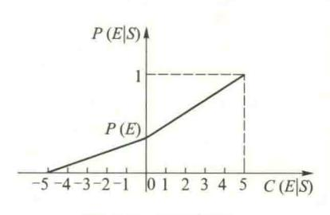
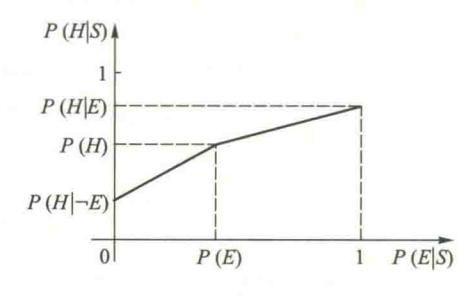
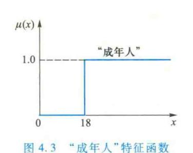
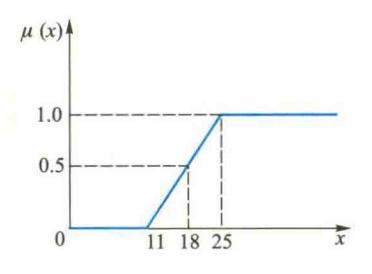
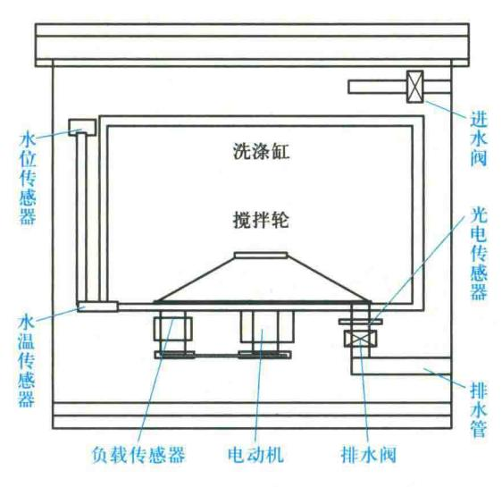
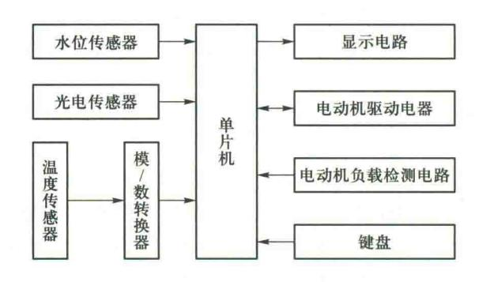
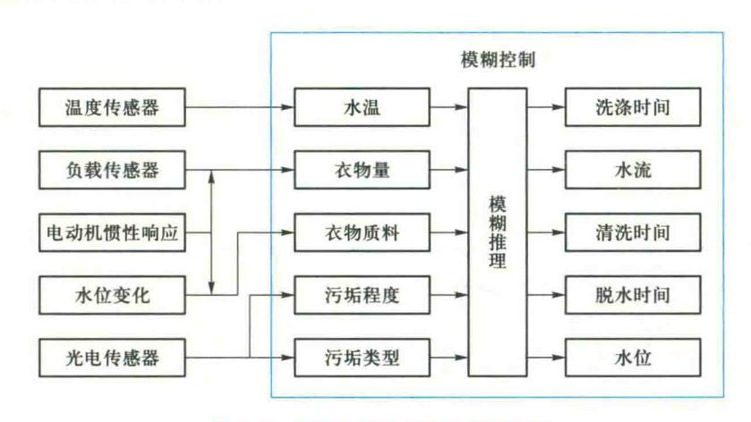
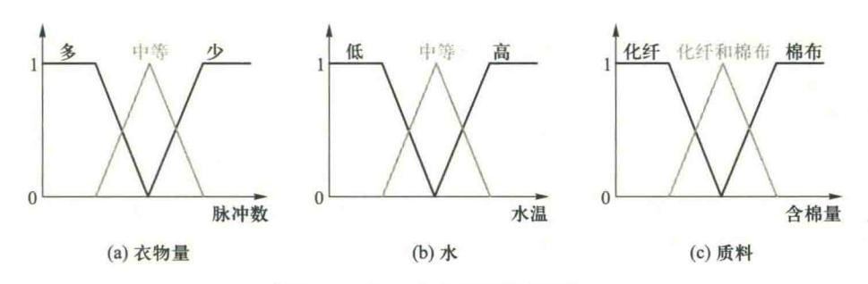
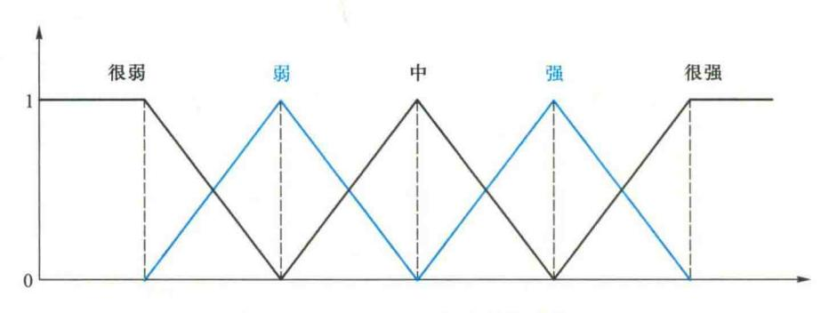

{0}------------------------------------------------

# 第4章 不确定性推理方法

上一章讨论了建立在经典逻辑基础上的确定性推理。这是一种运用确定性知识,从确定的事实或证据进行精确推理得到确定性结论的推理方法。但现实世界中的事物以及事物之间的关系是极其复杂的。由于客观上存在的随机性、模糊性以及某些事物或现象暴露得不充分性,导致人们对它们的认识往往是不精确、不完全的,具有一定程度的不确定性。这种认识上的不确定性反映到知识以及由观察所得到的证据上来,就分别形成了不确定性的知识及不确定性的证据。人们通常是在信息不完善、不精确的情况下,运用不确定性知识进行思维、求解问题的,推出的结论也是不确定的。因而还必须对不确定性知识的表示及推理进行研究。这就是本章将要讨论的不确定性推理。目前,人们对不确定性推理已经进行了比较多的研究,提出了多种表示和处理不确定性的方法。

下面首先讨论不确定性推理中的基本问题,然后着重介绍基于概率论的有关理论发展起来的不确定性推理方法,包括概率方法、主观 Bayes 方法、可信度方法、证据理论等,最后介绍目前在专家系统、信息处理、自动控制等领域广泛应用的依据模糊理论发展起来的模糊推理方法。

# 4.1 不确定性推理中的基本问题


不确定性推理是从不确定性的初始证据出发,通过运用不确定性的知识, 最终推出具有一定程度的不确定性但却是合理或者近乎合理的结论的思维过 程。

不确定性推理中 的基本问题讲课 视频▲ 在不确定性推理中,知识和证据都具有某种程度的不确定性,这就为推理 机的设计与实现增加了复杂性和难度。它除了必须解决推理方向、推理方法、 控制策略等基本问题外,一般还需要解决不确定性的表示与度量、不确定性匹 配、不确定性的传递算法以及不确定性的合成等重要问题。

# 1. 不确定性的表示与度量

在不确定性推理中,"不确定性"一般分为两类:一是知识的不确定性;二 是证据的不确定性。它们都要求有相应的表示方式和度量标准。

## (1) 知识不确定性的表示

知识的表示与推理是密切相关的两个方面,不同的推理方法要求有相应的知识表示模式与之对应。在不确定性推理中,由于要进行不确定性的计算,因而必须用适当的方法把不确定性及不确定的程度表示出来。

{1}------------------------------------------------

在确立不确定性的表示方法时,有两个直接相关的因素需要考虑:一是要能根据领域问题的特征把其不确定性比较准确地描述出来,满足问题求解的需要;二是要便于推理过程中对不确定性的推算。只有把这两个因素结合起来统筹考虑,相应的表示方法才是实用的。

目前,在专家系统中知识的不确定性一般是由领域专家给出的,通常是一个数值,它表示相应知识的不确定性程度,称为知识的静态强度。

静态强度可以是相应知识在应用中成功的概率,也可以是该条知识的可信程度或其他,其值的大小范围因其意义与使用方法的不同而不同。今后在讨论各种不确定性推理模型时,将具体地给出静态强度的表示方法及其含义。

#### (2) 证据不确定性的表示

在推理中,有两种来源不同的证据:一种是用户在求解问题时提供的初始证据,例如病人的症状、化验结果等;另一种是在推理中用前面推出的结论作为当前推理的证据。对于前一种情况,即用户提供的初始证据,由于这种证据多来源于观察,因而通常是不精确、不完全的,即具有不确定性。对于后一种情况,由于所使用的知识及证据都具有不确定性,因而推出的结论当然也具有不确定性,当把它用作后面推理的证据时,它亦是不确定性的证据。

一般来说,证据不确定性的表示方法应与知识不确定性的表示方法保持一致,以便于推理过程中对不确定性进行统一的处理。在有些系统中,为便于用户的使用,对初始证据的不确定性与知识的不确定性采取了不同的表示方法,但这只是形式上的,在系统内部亦做了相应的转换处理。

证据的不确定性通常也用一个数值表示。它代表相应证据的不确定性程度,称之为动态强度。对于初始证据,其值由用户给出;对于用前面推理所得结论作为当前推理的证据,其值由推理中不确定性的传递算法通过计算得到。

# (3) 不确定性的度量

对于不同的知识及不同的证据,其不确定性的程度一般是不相同的,需要用不同的数据表示其不确定性的程度,同时还需要事先规定它的取值范围,只有这样每个数据才会有确定的意义。例如,在专家系统 MYCIN 中,用可信度表示知识及证据的不确定性,取值范围为[-1,1]。当可信度取大于零的数值时,其值越大表示相应的知识或证据越接近于"真";当可信度的取值小于零时,其值越小表示相应的知识或证据越接近于"假"。

在确定一种度量方法及其范围时,应注意以下几点:

- ① 度量要能充分表达相应知识及证据不确定性的程度。
- ② 度量范围的指定应便于领域专家及用户对不确定性的估计。
- ③ 度量要便于对不确定性的传递进行计算,而且对结论算出的不确定性度量不能超出度量规定的范围。
  - ④ 度量的确定应当是直观的,同时应有相应的理论依据。

# 2. 不确定性匹配算法及阈值

推理是一个不断运用知识的过程。在这一过程中,为了找到所需的知识,需要用知识的前提

{2}------------------------------------------------

条件与数据库中已知的证据进行匹配,只有匹配成功的知识才有可能被应用。

对于不确定性推理,由于知识和证据都具有不确定性,而且知识所要求的不确定性程度与证据实际具有的不确定性程度不一定相同,因而就出现了"怎么才算匹配成功?"的问题。对于这个问题,目前常用的解决方法是,设计一个算法用来计算匹配双方相似的程度,另外再指定一个相似的"限度",用来衡量匹配双方相似的程度是否落在指定的限度内。如果落在指定的限度内,就称它们是可匹配的,相应知识可被应用,否则就称它们是不可匹配的,相应知识不可应用。上述中,用来计算匹配双方相似程度的算法称为不确定性匹配算法,用来指出相似的"限度"称为阈值。

#### 3. 组合证据不确定性的算法

在基于产生式规则的系统中,知识的前提条件既可以是简单条件,也可以是用 AND 或 OR 把多个简单条件连接起来构成的复合条件。进行匹配时,一个简单条件对应于一个单一的证据,一个复合条件对应于一组证据,称这一组证据为组合证据。在不确定性推理中,由于结论的不确定性通常是通过对证据及知识的不确定性进行某种运算得到的,因而需要有合适的算法计算组合证据的不确定性。目前,关于组合证据不确定性的计算已经提出了多种方法,如最大最小方法、Hamacher 方法、概率方法、有界方法、Einstein 方法等。每种方法都有相应的适应范围和使用条件,如概率方法只能在事件之间完全独立时使用。

#### 4. 不确定性的传递算法

不确定性推理的根本目的是根据用户提供的初始证据,通过运用不确定性知识,最终推出不确定性的结论,并推算出结论的不确定性程度。因此,需要解决下面两个问题:

- ① 在每一步推理中,如何把证据及知识的不确定性传递给结论。
- ② 在多步推理中,如何把初始证据的不确定性传递给最终结论。

对于第一个问题,在不同的不确定性推理方法中所采用的处理方法各不相同,这将在下面的几节中分别进行讨论。

对于第二个问题,各种方法所采用的处理方法基本相同,即把当前推出的结论及其不确定性度量作为证据放入数据库中,供以后推理使用。由于最初那一步推理的结论是用初始证据推出的,其不确定性包含了初始证据的不确定性对它所产生的影响,因而当它又用作证据推出进一步的结论时,其结论的不确定性仍然会受到初始证据的影响。由此一步步地进行推理,必然就会把初始证据的不确定性传递给最终结论。

## 5. 结论不确定性的合成

推理中有时会出现这样一种情况:用不同知识进行推理得到了相同的结论,但不确定性的程度却不相同。此时,需要用合适的算法对它们进行合成。在不同的不确定性推理方法中所采用的合成方法各不相同。

以上简要地列出了不确定性推理中一般应该考虑的一些基本问题,但这并不是说任何一个 不确定性推理都必须包括上述各项内容。

长期以来,概率论的有关理论和方法都被用作度量不确定性的重要手段,因为它不仅有完善

{3}------------------------------------------------

的理论,而且还为不确定性的合成与传递提供了现成的公式,因而它被最早用于不确定性知识的 表示与处理,像这样纯粹用概率模型来表示和处理不确定性的方法称为纯概率方法或概率方法。

纯概率方法虽然有严密的理论依据,但它通常要求给出事件的先验概率和条件概率,而这些数据又不易获得,因此其应用受到了限制。为了解决这个问题,人们在概率理论的基础上发展起来了一些新的方法及理论,主要有主观 Bayes 方法、可信度方法、证据理论等。

基于概率的方法虽然可以表示和处理现实世界中存在的某些不确定性,在人工智能的不确定性推理方面占有重要地位,但它们都没有把事物自身所具有的模糊性反映出来,也不能对其客观存在的模糊性进行有效的处理。扎德等人提出的模糊集理论及其在此基础上发展起来的模糊逻辑弥补了这一缺憾,对由模糊性引起的不确定性的表示及处理开辟了一种新途径,得到了广泛应用。

下面详细讨论几种主要的不确定性推理方法。

# 4.2 概率方法

# 4.2.1 经典概率方法

设有如下产生式规则:

IF E THEN  $H_i$   $i=1,2,\dots,n$ 

其中,E为前提条件,H,为结论,具有随机性。

在经典概率方法中,根据概率论中条件概率的含义,用条件概率  $P(H_i \mid E)$  表示上述产生式规则的不确定性程度,即表示为在证据 E 出现的条件下,结论  $H_i$ 成立的确定性程度。

对于复合条件

 $E = E_1$  AND  $E_2$  AND  $\cdots$  AND  $E_m$ 

可以用条件概率  $P(H_i \mid E_1, E_2, \dots, E_m)$ 作为在证据  $E_1, E_2, \dots, E_m$  出现时结论 H 的确定程度。

显然,经典概率方法是一种很简单的方法,只能用于简单的不确定性推理。另外,由于它只考虑证据为"真"或"假"这两种极端情况,因而使其应用受到了限制。

# 4.2.2 逆概率方法

#### 1. 逆概率方法的基本思想

经典概率方法要求给出在证据 E 出现情况下结论  $H_i$ 的条件概率  $P(H_i \mid E)$ 。这在实际应用中是相当困难的。逆概率方法是根据 Bayes 定理,用逆概率  $P(E \mid H_i)$  来求原概率  $P(H_i \mid E)$ 。确定逆概率  $P(E \mid H_i)$  比确定原概率  $P(H_i \mid E)$  要容易些。例如,若以 E 代表咳嗽,以  $H_i$ 代表支气管炎,如欲得到条件概率  $P(H_i \mid E)$ ,就需要统计在咳嗽的人中有多少是患支气管炎的,统计工作量较大,而要得到逆概率  $P(E \mid H_i)$  相对容易些,因为这时仅仅需要统计在患支气管炎的人中有多少人是咳嗽的,患支气管炎的人毕竟比咳嗽的人少得多。


概率方法讲课视

{4}------------------------------------------------

#### 2. 单个证据的情况

如果用产生式规则

IF E THEN 
$$H_i$$
  $i=1, 2, \dots, n$ 

中的前提条件 E 代替 Bayes 公式中 B,用 H,代替公式中的 A,就可得到

$$P(H_i \mid E) = \frac{P(E \mid H_i)P(H_i)}{\sum_{j=1}^{n} P(E \mid H_j)P(H_j)} \qquad i = 1, 2, \dots, n$$
 (4.1a)

这就是说,当已知结论  $H_i$  的先验概率  $P(H_i)$ ,并且已知结论  $H_i$   $(i=1,2,\cdots,n)$  成立时前提条件 E 所对应的证据出现的条件概率  $P(E\mid H_i)$ ,就可用式 (4.1a) 求出相应证据出现时结论  $H_i$  的条件概率  $P(H_i\mid E)$ 。

例 4.1 设  $H_1, H_2, H_3$  分别是三个结论, E 是支持这些结论的证据, 且已知

$$P(H_1) = 0.3$$
,  $P(H_2) = 0.4$ ,  $P(H_3) = 0.5$   
 $P(E \mid H_1) = 0.5$ ,  $P(E \mid H_2) = 0.3$ ,  $P(E \mid H_3) = 0.4$ 

求  $P(H_1 \mid E)$ ,  $P(H_2 \mid E)$  及  $P(H_3 \mid E)$  的值各是多少。

解 根据公式(4.1a)可得

$$P(H_1 \mid E) = \frac{P(H_1)P(E \mid H_1)}{P(H_1)P(E \mid H_1) + P(H_2)P(E \mid H_2) + P(H_3)P(E \mid H_3)}$$

$$= \frac{0.3 \times 0.5}{0.3 \times 0.5 + 0.4 \times 0.3 + 0.5 \times 0.4}$$

$$= 0.32$$

同理可得

$$P(H_2 \mid E) = 0.26$$
  
 $P(H_3 \mid E) = 0.43$ 

由此例可以看出,由于证据 E 的出现, $H_1$  成立的可能性略有增加, $H_2$ , $H_3$  成立的可能性有不同程度的下降。

#### 3. 多个证据的情况

对于有多个证据  $E_1, E_2, \dots, E_m$  和多个结论  $H_1, H_2, \dots, H_n$ ,并且每个证据都以一定程度支持结论的情况,上面的式(4.1a)可进一步扩充为

$$P(H_i \mid E_1 E_2 \cdots E_m) = \frac{P(E_1 \mid H_i) P(E_2 \mid H_i) \cdots P(E_m \mid H_i) P(H_i)}{\sum_{j=1}^{n} P(E_1 \mid H_j) P(E_2 \mid H_j) \cdots P(E_m \mid H_j) P(H_j)}$$

$$i = 1, 2, \dots, n$$
(4. 1b)

此时,只要已知  $H_i$  的先验概率  $P(H_i)$  以及  $H_i$  成立时证据  $E_1, E_2, \cdots, E_m$  出现的条件概率  $P(E_1 \mid H_i)$ , $P(E_2 \mid H_i)$ , $\cdots$ , $P(E_m \mid H_i)$ ,就可利用上式计算出在  $E_1, E_2, \cdots, E_m$  出现情况下  $H_i$  的条件概率  $P(H_i \mid E_1 E_2, \cdots E_m)$ 。

{5}------------------------------------------------

## 例 4.2 设已知

$$\begin{split} &P(H_1) = 0.4\,, \qquad P(H_2) = 0.3\,, \qquad P(H_3) = 0.3\,, \\ &P(E_1 \mid H_1) = 0.5\,, \quad P(E_1 \mid H_2) = 0.6\,, \quad P(E_1 \mid H_3) = 0.3\,, \\ &P(E_2 \mid H_1) = 0.7\,, \quad P(E_2 \mid H_2) = 0.9\,, \quad P(E_2 \mid H_3) = 0.1\,, \end{split}$$

求  $P(H_1 \mid E_1 E_2)$ 、 $P(H_2 \mid E_1 E_2)$  及  $P(H_3 \mid E_1 E_2)$  的值各是多少。

解 根据上述公式可得

$$P(H_1 \mid E_1E_2)$$

$$= \frac{P(E_1 \mid H_1)P(E_2 \mid H_1)P(H_1)}{P(E_1 \mid H_1)P(E_2 \mid H_1)P(H_1) + P(E_1 \mid H_2)P(E_2 \mid H_2)P(H_2) + P(E_1 \mid H_3)P(E_2 \mid H_3)P(H_3)}$$

$$= \frac{0.5 \times 0.7 \times 0.4}{0.5 \times 0.7 \times 0.4 + 0.6 \times 0.9 \times 0.3 + 0.3 \times 0.1 \times 0.3}$$

$$= 0.45$$

同理可得

$$P(H_2 \mid E_1 E_2) = 0.52$$
  
 $P(H_3 \mid E_1 E_2) = 0.03$ 

由此例可以看出,由于证据  $E_1$ 和  $E_2$ 的出现, $H_1$ 和  $H_2$ 成立的可能性有不同程度的增加, $H_3$ 成立的可能性下降了。

#### 4. 逆概率方法的优缺点

在实际应用中,这种方法有时是很有用的。例如,如果把  $H_i(i=1,2,\cdots,n)$  当作一组可能发生的疾病,把  $E_j(j=1,2,\cdots,m)$  当作相应的症状, $P(H_i)$  是从大量实践中经统计得到的疾病  $H_i$  发生的先验概率, $P(E_j \mid H_i)$  是疾病  $H_i$  发生时观察到的症状  $E_j$  的条件概率,则当对某病人观察到有症状  $E_1,E_2,\cdots,E_m$  时,应用上述 Bayes 公式就可计算出  $P(H_i \mid E_1E_2\cdots E_m)$ ,从而得知病人患疾病  $H_i$  的可能性。

逆概率方法的优点是它有较强的理论背景和良好的数学特征,当证据及结论都彼此独立时计算的复杂度比较低。其缺点是要求给出结论  $H_i$ 的先验概率  $P(H_i)$  及证据  $E_j$ 的条件概率  $P(E_j \mid H_i)$ ,尽管有些时候  $P(E_j \mid H_i)$  比  $P(H_i \mid E_j)$  相对容易得到,但总的来说,要想得到这些数据仍然是一件相当困难的工作。另外,Bayes 公式的应用条件是很严格的,它要求各事件互相独立等。如若证据间存在依赖关系,就不能直接使用这个方法。

# 4.3 主观 Bayes 方法

由上一节的讨论可知,直接使用逆概率方法求结论  $H_i$  在证据 E 存在情况下的条件概率  $P(H_i \mid E)$  时,不仅需要已知  $H_i$  的先验概率  $P(H_i)$ ,而且还需要知道结论  $H_i$ 成立的情况下,证据 E 出现的条件概率  $P(E \mid H_i)$ 。这在实际应用中也是相当困难的。为此,1976 年杜达(R. O. Duda)、哈特(P. E. Hart)等人在


主观 Bayes 方法讲课视频▲

{6}------------------------------------------------

Bayes 公式的基础上经适当改进提出了主观 Bayes 方法,建立了相应的不确定性推理模型,并在地矿勘探专家系统 PROSPECTOR 中得到了成功的应用。

### 4.3.1 知识不确定性的表示

在主观 Bayes 方法中,知识是用产生式规则表示的,具体形式为

IF E THEN 
$$(LS, LN)$$
 H  $(P(H))$ 

其中:

- ① E 是该知识的前提条件。它既可以是一个简单条件,也可以是复合条件。
- ② H 是结论。P(H) 是 H 的先验概率,它指出在没有任何证据情况下的结论 H 为真的概率,即 H 的一般可能性。其值由领域专家根据以往的实践及经验给出。
- ③ (LS,LN) 为规则强度。在统计学中称为似然比(likelihood ratio)。其值由领域专家给出。 LS,LN 相当于知识的静态强度。其中 LS 称为规则成立的充分性度量,用于指出 E 对 H 的支持程度,取值范围为 $[0,+\infty)$ ,其定义为

$$LS = \frac{P(E \mid H)}{P(E \mid \neg H)} \tag{4.2a}$$

LN 为规则成立的必要性度量,用于指出 $\neg E$  对 H 的支持程度,即 E 对 H 为真的必要性程度,取值范围为 $[0,+\infty]$ ,其定义为

$$LN = \frac{P(\neg E \mid H)}{P(\neg E \mid \neg H)} = \frac{1 - P(E \mid H)}{1 - P(E \mid \neg H)}$$
(4.2b)

(LS,LN)既考虑了证据 E 的出现对其结论 H 的支持,又考虑了证据 E 的不出现对其结论 H 的影响。它所表示的物理意义将在下面进行讨论。

# 4.3.2 证据不确定性的表示

在主观 Bayes 方法中,证据的不确定性也是用概率表示的。例如对于初始证据 E,由用户根据观察 S 给出概率  $P(E\mid S)$ 。它相当于动态强度。但由于  $P(E\mid S)$ 不太直观,因而在具体的应用系统中往往采用符合一般经验的比较直观的方法,如在地矿勘测专家系统PROSPECTOR 中就引进了可信度的概念,让用户在-5至 5 之间的 11 个整数中根据实际情况选一个数作为初始证据的可信度,表示他对所提供的证据可以相信的程度。然后再从可信度  $C(E\mid S)$  计算出概率  $P(E\mid S)$ 。

可信度  $C(E \mid S)$  与概率  $P(E \mid S)$  的对应关系如下:

- $C(E \mid S) = -5$ ,表示在观察 S 下证据 E 肯定不存在,即  $P(E \mid S) = 0$ 。
- $C(E \mid S) = 0$ ,表示观察 S 与证据 E 无关,应该仍然是先验概率,即  $P(E \mid S) = P(E)$ 。
- $C(E \mid S) = 5$ ,表示在观察 S 下证据 E 肯定存在,即  $P(E \mid S) = 1$ 。
- $C(E \mid S)$  为其他数时与  $P(E \mid S)$  的对应关系,则通过对上述三点进行分段线性插值得到,如图 4.1 所示。

{7}------------------------------------------------

由图 4.1 可得到如下 C(E|S)与 P(E|S)的关系式

$$P(E \mid S) = \begin{cases} \frac{C(E \mid S) + P(E) \times (5 - C(E \mid S))}{5} & \text{ if } 0 \le C(E \mid S) \le 5 \\ \frac{P(E) \times (C(E \mid S) + 5)}{5} & \text{ if } -5 \le C(E \mid S) < 0 \end{cases}$$

这样,用户只要对初始证据给出相应的可信度  $C(E \mid S)$ ,就可由上式将它转换为相应的概率  $P(E \mid S)$ 。



图 4.1  $C(E \mid S)$ 与  $P(E \mid S)$ 的对应关系

# 4.3.3 组合证据不确定性的算法

当组合证据是多个单一证据的合取时,即

$$E = E_1$$
 AND  $E_2$  AND ... AND  $E_n$ 

则组合证据的概率取各个单一证据的概率的最小值,即

$$P(E \mid S) = \min \{ P(E_1 \mid S), P(E_2 \mid S), \dots, P(E_n \mid S) \}$$

当组合证据是多个单一证据的析取时,即

$$E = E_1$$
 OR  $E_2$  OR  $\cdots$  OR  $E_n$ 

则组合证据的概率取各个单一证据的概率的最大值,即

$$P(E \mid S) = \max \{ P(E_1 \mid S), P(E_2 \mid S), \dots, P(E_n \mid S) \}$$

对于非运算,则用下式计算:

$$P(\neg E \mid S) = 1 - P(E \mid S)$$

# 4.3.4 不确定性的传递算法

在主观 Bayes 方法的表示中,P(H) 是专家对结论 H 给出的先验概率,它是在没有考虑任何证据的情况下根据经验给出的。随着新证据的获得,对 H 的信任程度应该有所改变。主观 Bayes 方法推理的任务就是根据证据 E 的概率 P(E) 及 LS, LN 的值,把 H 的先验概率 P(H) 更新为后验概率  $P(H \mid E)$  或  $P(H \mid \neg E)$ 。即


不确定性的传递算 法讲课视频▲

$$P(H) \xrightarrow{P(E), LS, LN} P(H \mid E)$$
 或  $P(H \mid \neg E)$ 

由于一条知识所对应的证据可能是肯定存在的,也可能是肯定不存在的,或者是不确定的, 而且在不同情况下确定后验概率的方法不同,所以下面分别进行讨论。

# 1. 证据肯定存在的情况

在证据肯定存在时, $P(E) = P(E \mid S) = 1$ 。

由 Bayes 公式可得证据 E 成立的情况下,结论 H 成立的概率为

$$P(H \mid E) = P(E \mid H) \times P(H) \mid P(E)$$
(4.3)

同理证据 E 成立的情况下,结论 H 不成立的概率为

$$P(\neg H \mid E) = P(E \mid \neg H) \times P(\neg H) \mid P(E)$$
(4.4)

{8}------------------------------------------------

用式(4.3)除以式(4.4),可得

$$\frac{P(H \mid E)}{P(\neg H \mid E)} = \frac{P(E \mid H)}{P(E \mid \neg H)} \times \frac{P(H)}{P(\neg H)}$$

$$(4.5)$$

为简洁起见,引入几率(odds)函数 O(x),它与概率 P(x)的关系为

$$O(x) = \frac{P(x)}{P(\neg x)} = \frac{P(x)}{1 - P(x)}$$
(4.6a)

或者

$$P(x) = \frac{O(x)}{1 + O(x)} \tag{4.6b}$$

概率和几率的取值范围是不同的,概率  $P(x) \in [0,1]$ ,几率  $O(x) \in [0,\infty)$ 。显然,P(x) = O(x)有相同的单调性。即,若  $P(x_1) < P(x_2)$ ,则  $O(x_1) < O(x_2)$ ,反之亦然。可见,虽然几率函数和概率函数有着不同的形式,但一样可以表示证据的不确定性。它们的变化趋势是相同的,当证据为真的程度越大时,几率函数的值也越大。

由 LS 的定义式(4.1),以及概率与几率的关系式(4.6),可将式(4.5)写为 Bayes 修正公式

$$O(H \mid E) = LS \times O(H) \tag{4.7}$$

这就是在证据肯定存在时,把先验几率(Prior odds)O(H)更新为后验几率(posterior odds) $O(H \mid E)$ 的计算公式。如果用式(4.6)把几率换成概率,就可得到

$$P(H \mid E) = \frac{LS \times P(H)}{(LS - 1) \times P(H) + 1} \tag{4.8}$$

这是把先验概率 P(H) 更新为后验概率 P(H/E) 的计算公式。

由以上讨论可以看出充分性度量 LS 的意义:

① 当 LS>1 时,由式(4.7)可得

$$O(H \mid E) > O(H)$$

由 P(x)与 O(x) 具有相同单调性,可知

$$P(H \mid E) > P(H)$$

这表明,当 LS>1 时,由于证据 E 的存在,将增大结论 H 为真的概率,而且 LS 越大, $P(H\mid E)$  就越大,即 E 对 H 为真的支持越强。当  $LS\to\infty$ 时, $O(H\mid E)\to\infty$ ,即  $P(H\mid E)\to1$ ,表明由于证据 E 的存在,将导致 H 为真,由此可见,E 的存在对 H 为真是充分的,故称 LS 为充分性度量。

② 当 LS=1 时,由式(4.7)可得

$$O(H \mid E) = O(H)$$

这表明E与H无关。

③ 当 LS<1 时,由式(4.7)可得

这表明,由于证据E的存在,将使H为真的可能性下降。

{9}------------------------------------------------

#### ④ 当 LS=0 时,由式(4.7)可得

$$O(H/E) = 0$$

这表明,由于证据E的存在,将使H为假。

上述关于 LS 的讨论可作为领域专家为 LS 赋值的依据。当证据 E 越是支持 H 为真时,应使相应 LS 的值越大。

### 2. 证据肯定不存在的情况

在证据肯定不存在时, $P(E) = P(E \mid S) = 0$ , $P(\neg E) = 1$ 。

由于

$$P(H \mid \neg E) = P(\neg E \mid H) \times P(H) \mid P(\neg E)$$

$$P(\neg H \mid \neg E) = P(\neg E \mid \neg H) \times P(\neg H) \mid P(\neg E)$$

两式相除得到

$$\frac{P(H \mid \neg E)}{P(\neg H \mid \neg E)} = \frac{P(\neg E \mid H)}{P(\neg E \mid \neg H)} \times \frac{P(H)}{P(\neg H)}$$

由 LN 的定义式(4.2),以及概率与几率的关系式(4.6),可将上式写为 Bayes 修正公式

$$O(H \mid \neg E) = LN \times O(H) \tag{4.9}$$

这就是在证据 E 肯定不存在时,把先验几率 O(H) 更新为后验几率  $O(H \mid \neg E)$  的计算公式。如果用式(4.6) 把几率换成概率,就可得到

$$P(H \mid \neg E) = \frac{LN \times P(H)}{(LN-1) \times P(H) + 1}$$
 (4.10)

这是把先验概率 P(H) 更新为后验概率  $P(H \mid \neg E)$  的计算公式。

由以上讨论可以看出必要性度量 LN 的意义:

(1) 当 LN>1 时,由式(4.9)可得

$$O(H \mid \neg E) > O(H)$$

由 P(x) 与 O(x) 具有相同单调性,可知

$$P(H \mid \neg E) > P(H)$$

这表明,当 LN>1 时,由于证据 E 不存在,将增大结论 H 为真的概率,而且 LN 越大, $P(H \mid \neg E)$  就 越大,即 $\neg E$  对 H 为真的支持越强。当  $LN\to\infty$ 时, $O(H \mid \neg E)\to\infty$ ,即 $P(H \mid \neg E)\to 1$ ,表明由于证据 E 不存在,将导致 H 为真。

(2) 当 LN=1 时,由式(4.9)可得

$$O(H \mid \neg E) = O(H)$$

这表明¬E与H无关。

(3) 当 LN<1 时,由式(4.9)可得

$$O(H \mid \neg E) < O(H)$$

这表明,由于证据 E 不存在,将使 H 为真的可能性下降,或者说由于证据 E 不存在,将反对 H 为真。由此可以看出 E 对 H 为真的必要性。

{10}------------------------------------------------

(4) 当 LN=0 时,由式(4.9)可得

$$O(H \mid \neg E) = 0$$

这表明,由于证据 E 不存在,将导致 H 为假。由此也可以看出 E 对 H 为真的必要性,故称 LN 为必要性度量。

依据上述讨论,领域专家可为 LN 赋值,若证据 E 对 H 越是必要,则相应 LN 的值越小。

另外,由于E和¬E不可能同时支持H或同时反对H,所以在一条知识中的LS和LN一般不应该出现如下情况中的任何一种:

- (1) LS>1, LN>1
- (2) LS < 1, LN < 1

只有如下情况存在:

- (1)  $LS \ge 1$   $\coprod LN \le 1$
- (2)  $LS \leq 1$   $\exists LN \geq 1$

例 4.3 设有如下知识:

$$r_1: \text{IF} \quad E_1 \quad \text{THEN} \quad (10,1) \quad H_1 \quad (0.03)$$
  
 $r_2: \text{IF} \quad E_2 \quad \text{THEN} \quad (20,1) \quad H_2 \quad (0.05)$   
 $r_3: \text{IF} \quad E_3 \quad \text{THEN} \quad (1,0.002) \quad H_3 \quad (0.3)$ 

求:当证据  $E_1, E_2, E_3$  存在及不存在时,  $P(H_i \mid E_i)$  及  $P(H_i \mid \neg E_i)$  的值各是多少?

解 由于 $r_1$ 和 $r_2$ 中的LN=1,所以 $E_1$ 与 $E_2$ 不存在时对 $H_1$ 和 $H_2$ 不产生影响,即不需要计算 $P(H_1 \mid \neg E_1)$ 和 $P(H_2 \mid \neg E_2)$ ;因它们的LS>1,所以在 $E_1$ 与 $E_2$ 存在时需要计算 $P(H_1 \mid E_1)$ 和 $P(H_2 \mid E_2)$ 。由公式(4.8)可计算 $P(H_1 \mid E_1)$ 和 $P(H_2 \mid E_2)$ 。

后验概率: 
$$P(H_1 \mid E_1) = \frac{LS_1 \times P(H_1)}{(LS_1 - 1) \times P(H_1) + 1}$$

$$= \frac{10 \times 0.03}{(10 - 1) \times 0.03 + 1}$$

$$= 0.24$$

$$\frac{P(H_1 \mid E_1)}{P(H_1)} = \frac{0.24}{0.03} = 8$$

$$P(H_2 \mid E_2) = \frac{LS_2 \times P(H_2)}{(LS_2 - 1) \times P(H_2) + 1}$$

$$= \frac{20 \times 0.05}{(20 - 1) \times 0.05 + 1}$$

$$= 0.51$$

$$\frac{P(H_2 \mid E_2)}{P(H_2)} = \frac{0.51}{0.05} = 10.2$$

由此可以看出,由于 $E_1$ 的存在使 $H_1$ 为真的可能性比先验概率增加了8倍;由于 $E_2$ 的存在使 $H_2$ 

{11}------------------------------------------------

为真的可能性增加了10多倍。

对于  $r_3$ , 由于 LS=1, 所以  $E_3$  的存在对  $H_3$  无影响, 不需要计算  $P(H_3\mid E_3)$ , 但因它的 LN<1, 所以当  $E_3$  不存在时需计算  $P(H_3\mid \neg E_3)$ 。

由公式(4.10)可计算  $P(H_3 \mid \neg E_3)$  如下:

$$P(H_3 \mid \neg E_3) = \frac{LN_3 \times P(H_3)}{(LN_3 - 1) \times P(H_3) + 1}$$

$$= \frac{0.002 \times 0.3}{(0.002 - 1) \times 0.3 + 1}$$

$$= 0.000 \ 86$$

$$\frac{P(H_3)}{P(H_3 \mid \neg E_3)} \approx 350$$

由此可以看出,由于  $E_3$  不存在使  $H_3$  为真的可能性削弱了近 350 倍。

例 4.4 设有如下知识:

$$r_1: E_1 \rightarrow H \quad LS_1 = 20 \quad LN_1 = 1$$
  
 $r_2: E_2 \rightarrow H \quad LS_2 = 300 \quad LN_2 = 1$   
 $P(H) = 0.03$ 

若  $E_1$ ,  $E_2$ , 依次出现, 求  $P(H \mid E_1, E_2)$  的值。

$$\begin{split} P(H \mid E_1) &= \frac{LS_1 \times P(H)}{(LS_1 - 1) \times P(H) + 1} \\ &= \frac{20 \times 0.03}{(20 - 1) \times 0.03 + 1} \\ &= 0.382 \\ P(H \mid E_1, E_2) &= \frac{LS_2 \times P(H \mid E_1)}{(LS_2 - 1) \times P(H \mid E_1) + 1} \\ &= \frac{300 \times 0.382}{(300 - 1) \times 0.382 + 1} \\ &= 0.994 \end{split}$$

# 3. 证据不确定的情况

上面讨论了在证据肯定存在和肯定不存在情况下把 H 的先验概率更新为后验概率的方法。在现实中,这种证据肯定存在和肯定不存在的极端情况是不多的,更多的是介于两者之间的不确定情况。因为对初始证据来说,由于客观事物或现象是不精确的,因而用户所提供的证据是不确定的;另外,一条知识的证据往往来源于由另一条知识推出的结论,一般也具有某种程度的不确定性。例如用户告知只有 60%的把握说明证据 E 是真的,这就表示初始证据 E 为真的程度为 0.6,即 $P(E\mid S)=0.6$ 。这里 S 是对 E 的有关观察。现在要在  $0<P(E\mid S)<1$  的情况下确定 H 的后验概率  $P(H\mid S)$ 。

{12}------------------------------------------------

在证据不确定的情况下,不能再用上面的公式计算后验概率,而要用杜达等人 1976 年证明 了的如下公式:

$$P(H \mid S) = P(H \mid E) \times P(E \mid S) + P(H \mid \neg E) \times P(\neg E \mid S)$$

$$(4.11)$$

下面分四种情况讨论这个公式。

 $(1) P(E \mid S) = 1$ 

当  $P(E \mid S) = 1$  时,  $P(\neg E \mid S) = 0$ 。此时公式(4.11) 变成

$$P(H \mid S) = P(H \mid E) = \frac{LS \times P(H)}{(LS - 1) \times P(H) + 1}$$

这就是证据肯定存在的情况,见式(4.8)。

(2)  $P(E \mid S) = 0$ 

当  $P(E \mid S) = 0$  时,  $P(\neg E \mid S) = 1$ 。此时公式(4.11)变成

$$P(H \mid S) = P(H \mid \neg E) = \frac{LN \times P(H)}{(LN-1) \times P(H) + 1}$$

这就是证据肯定不存在的情况,见式(4.10)。

(3)  $P(E \mid S) = P(E)$ 

当  $P(E \mid S) = P(E)$ 时,表示  $E \subseteq S$  无关。利用全概率公式  $P(B) = \sum_{i=1}^{n} P(A_i)P(B \mid A_i)$  就将公式 (4.11) 变为

$$P(H \mid S) = P(H \mid E) \times P(E) + P(H \mid \neg E) \times P(\neg E) = P(H)$$

(4) P(E | S) 为其他值。

上面已经得到了三种特殊情况的结果,当  $P(E\mid S)$  为其他值时,可以根据这三个特殊点,通过分段线性插值得到计算  $P(H\mid S)$ 的公式。

$$P(H \mid S) = \begin{cases} P(H \mid \neg E) + \frac{P(H) - P(H \mid \neg E)}{P(E)} \times P(E \mid S), & \text{if } 0 \leq P(E \mid S) < P(E) \\ P(H) + \frac{P(H \mid E) - P(H)}{1 - P(E)} \times [P(E \mid S) - P(E)], & \text{if } P(E) \leq P(E \mid S) \leq 1 \end{cases}$$

该公式称为 EH 公式或 UED 公式,如图 4.2 所示。



图 4.2 EH 公式的分段线性插值

{13}------------------------------------------------

对于初始证据,由于其不确定性是用可信度  $C(E \mid S)$  给出的,此时只要把 $P(E \mid S)$  与  $C(E \mid S)$  的对应关系转换公式代入 EH 公式,就可得到用可信度  $C(E \mid S)$  计算  $P(H \mid S)$  的公式

$$P(H \mid S) = \begin{cases} P(H \mid \neg E) + [P(H) - P(H \mid \neg E)] \times \left[\frac{1}{5}C(E \mid S) + 1\right], \; \not\exists \; C(E \mid S) \leq 0 \\ P(H) + [P(H \mid E) - P(H)] \times \frac{C(E \mid S)}{5}, \; \not\exists \; C(E \mid S) > 0 \end{cases}$$

该公式称为 CP 公式。

这样,当用初始证据进行推理时,根据用户告知的  $C(E \mid S)$ ,通过运用 CP 公式就可求出  $P(H \mid S)$ ;当用推理过程中得到的中间结论作为证据进行推理时,通过运用 EH 公式就可求出 P(H/S)。

# 4.3.5 结论不确定性的合成算法

若有n条知识都支持相同的结论,而且每条知识的前提条件所对应的证据  $E_i(i=1,2,\cdots,n)$  都有相应的观察  $S_i$  与之对应,则只要先对每条知识分别求出  $O(H|S_i)$ ,然后就可运用下述公式求出  $O(H|S_1,S_2,\cdots,S_n)$ 。


结论不确定性的合 成算法讲课视频▲

$$O(H \mid S_1, S_2, \dots, S_n) = \frac{O(H \mid S_1)}{O(H)} \times \frac{O(H \mid S_2)}{O(H)} \times \dots \times \frac{O(H \mid S_n)}{O(H)} \times O(H)$$

(4.12)

为了熟悉主观 Bayes 方法的推理过程,下面给出一个例子。

例 4.5 设有如下知识:

$$r_1$$
: IF  $E_1$  THEN  $(2,0.001)$   $H_1$ 
 $r_2$ : IF  $E_2$  THEN  $(100,0.001)$   $H_1$ 
 $r_3$ : IF  $H_1$  THEN  $(200,0.01)$   $H_2$ 
已知: $O(H_1) = 0.1$ ,  $O(H_2) = 0.01$ 
 $C(E_1 \mid S_1) = 2$ ,  $C(E_2 \mid S_2) = 1$ 

解 (1) 计算  $O(H, |S_1)$ 

求  $O(H, | S_1, S_2)$ 。

$$P(H_1) = \frac{O(H_1)}{1 + O(H_1)}$$

$$= \frac{0.1}{1 + 0.1}$$

$$= 0.09$$

$$P(H_1 \mid E_1) = \frac{O(H_1 \mid E_1)}{1 + O(H_1 \mid E_1)}$$

$$= \frac{LS_1 \times O(H_1)}{1 + LS_1 \times O(H_1)}$$

{14}------------------------------------------------

$$= \frac{2 \times 0.1}{1 + 2 \times 0.1}$$
$$= 0.17$$

因为  $C(E_1 | S_1) = 2 > 0$ , 所以使用 CP 公式的后半部计算  $P(H_1 | S_1)$ 。

$$P(H_1 \mid S_1) = P(H_1) + [P(H_1 \mid E_1) - P(H_1)] \frac{1}{5}C(E_1 \mid S_1)$$

$$= 0.09 + [0.17 - 0.09] \times \frac{2}{5}$$

$$= 0.122$$

$$O(H_1 \mid S_1) = \frac{P(H_1 \mid S_1)}{1 - P(H_1 \mid S_1)}$$

$$= \frac{0.122}{1 - 0.122}$$

$$= 0.14$$

(2) 计算  $O(H_1 \mid S_2)$ 

由上面的计算得知  $P(H_1) = 0.09$ 

$$P(H_1 \mid E_2) = \frac{O(H_1 \mid E_2)}{1 + O(H_1 \mid E_2)}$$

$$= \frac{LS_2 \times O(H_1)}{1 + LS_2 \times O(H_1)}$$

$$= \frac{100 \times 0.1}{1 + 100 \times 0.1}$$

$$= 0.91$$

因为  $C(E_2 | S_2) = 1 > 0$ , 所以用 CP 公式的后半部计算  $P(H_1 | S_2)$ 。

$$P(H_1 \mid S_2) = P(H_1) + [P(H_1 \mid E_2) - P(H_1)] \frac{1}{5}C(E_2 \mid S_2)$$

$$= 0.09 + [0.91 - 0.09] \times \frac{1}{5}$$

$$= 0.254$$

$$O(H_1 \mid S_2) = \frac{P(H_1 \mid S_2)}{1 - P(H_1 \mid S_2)}$$

$$= \frac{0.254}{1 - 0.254}$$

$$= 0.34$$

(3) 计算  $O(H_1 | S_1, S_2)$ 

{15}------------------------------------------------

$$O(H_1 \mid S_1, S_2) = \frac{O(H_1 \mid S_1) O(H_1 \mid S_2)}{O(H_1)} O(H_1)$$

$$= \frac{0.14}{0.1} \times \frac{0.34}{0.1} \times 0.1$$

$$= 0.476$$

(4) 计算  $P(H_2 | S_1, S_2)$  及  $O(H_2 | S_1, S_2)$ 

为了确定应用 EH 公式的哪一部分,需要判断  $P(H_1)$  及  $P(H_1 | S_1, S_2)$  的大小关系。

因为  $O(H_1 \mid S_1, S_2) = 0.476$ ,  $O(H_1) = 0.1$ , 显然  $O(H_1 \mid S_1, S_2) > O(H_1)$ , 所以  $P(H_1 \mid S_1, S_2) > P(H_1)$ , 因此, 选用 EH 公式的后半部分, 即

因为
$$P(H_2 \mid S_1, S_2) = P(H_2) + \frac{P(H_1 \mid S_1, S_2) - P(H_1)}{1 - P(H_1)} [P(H_2 \mid H_1) - P(H_2)]$$

$$P(H_2) = \frac{O(H_2)}{1 + O(H_2)}$$

$$= \frac{0.01}{1 + 0.01}$$

$$= 0.01$$

$$P(H_1 \mid S_1, S_2) = \frac{O(H_1 \mid S_1, S_2)}{1 + O(H_1 \mid S_1, S_2)}$$

$$= \frac{0.476}{1 + 0.476}$$

$$= 0.32$$

$$P(H_2 \mid H_1) = \frac{O(H_2 \mid H_1)}{1 + O(H_2 \mid H_1)}$$

$$= \frac{LS_3 \times O(H_2)}{1 + LS_3 \times O(H_2)}$$

$$= \frac{200 \times 0.01}{1 + 200 \times 0.01}$$

$$= 0.67$$
可得
$$P(H_2 \mid S_1, S_2) = 0.01 + \frac{0.32 - 0.09}{1 - 0.09} \times (0.67 - 0.01)$$

$$= 0.175$$

$$O(H_2 \mid S_1, S_2) = \frac{P(H_2 \mid S_1, S_2)}{1 - P(H_2 \mid S_1, S_2)}$$

$$= \frac{0.175}{1 - 0.175}$$

=0.212

{16}------------------------------------------------

 $H_2$  原先的几率是 0.01,通过运用知识  $r_1, r_2, r_3$  及初始证据的可信度  $C(E \mid S_1), C(E \mid S_2)$  进行推理,最后算出  $H_2$  的后验几率是 0.212,相当于几率增加了 20 多倍。

主观 Bayes 方法的主要优点是:

- ① 主观 Bayes 方法中的计算公式大多是在概率的基础上推导出来的,具有较坚实的理论基础。
- ② 知识的静态强度 LS 及 LN 是由领域专家根据实践经验给出的,这就避免了大量的数据统计工作。另外,它既用 LS 指出了证据 E 对结论 H 的支持程度,即指出了 E 对 H 的充分性程度,又用 LN 指出了 E 对 H 的必要性程度,这就比较全面地反映了证据与结论间的因果关系,符合现实世界中某些领域的实际情况,使推出的结论比较准确。
- ③ 主观 Bayes 方法不仅给出了在证据肯定存在或肯定不存在情况下由 H 的先验概率更新为后验概率的方法,而且还给出了在证据不确定情况下更新先验概率为后验概率的方法。另外,由其推理过程可以看出,它确实实现了不确定性的逐级传递。因此,可以说主观 Bayes 方法是一种比较实用且较灵活的不确定性推理方法。

它的主要缺点是:

- ① 它要求领域专家在给出知识时,同时给出H的先验概率P(H),这是比较困难的。
- ② Bayes 定理中关于事件独立性的要求使主观 Bayes 方法的应用受到了限制。


# 4.4 可信度方法

可信度方法是肖特里菲(E. H. Shortliffe)等人在确定性理论(theory of confirmation)的基础上,结合概率论等提出的一种不确定性推理方法。它首先在专家系统 MYCIN 中得到了成功的应用。由于该方法比较直观、简单,而且效果也比较好,因而受到人们的重视。目前,许多专家系统都是基于这一方法建造起来的。

可信度方法讲课 视频▲

# 4.4.1 可信度的概念

人们在长期的实践活动中,对客观世界的认识积累了大量的经验,当面临一个新事物或新情况时,往往可用这些经验对问题的真、假或为真的程度作出判断。这种根据经验对一个事物或现象为真的相信程度称为可信度(certainty)。

显然,可信度带有较大的主观性和经验性,其准确性难以把握。但由于人工智能所面向的多是结构不良的复杂问题,难以给出精确的数学模型,先验概率及条件概率的确定又比较困难,因而用可信度来表示知识及证据的不确定性仍不失为一种可行的方法。另外,由于领域专家有丰富的专业知识及实践经验,也不难对领域内的知识给出其可信度。

{17}------------------------------------------------

#### 4.4.2 C-F 模型

C-F 模型是基于可信度表示的不确定性推理的基本方法,其他可信度方法都是在此基础上发展起来的。

#### 1. 知识不确定性的表示

在 C-F 模型中,知识是用产生式规则表示的,其一般形式为

IF 
$$E$$
 THEN  $H$   $(CF(H,E))$ 

其中,CF(H,E)是该条知识的可信度,称为可信度因子(certainty factor)。CF(H,E)反映了前提条件与结论的联系强度。它指出当前提条件 E 所对应的证据为真时,它对结论 H 为真的支持程度,CF(H,E)的值越大,就越支持结论 H 为真。例如

表示当病人确实有"头痛"及"流涕"的症状时,则有七成的把握认为他是患了感冒。

CF(H,E)在[-1,1]上取值,CF(H,E)的值要求领域专家直接给出。其原则是:若由于相应证据的出现增加结论 H 为真的可信度,则取 CF(H,E) > 0,证据的出现越是支持 H 为真,就使 CF(H,E) 的值越大;反之,取 CF(H,E) < 0,证据的出现越是支持 H 为假,就使 CF(H,E) 的值越小;若证据的出现与否与 H 无关,则取 CF(H,E) = 0。

#### 2. 证据不确定性的表示

在 C-F 模型中,证据的不确定性也是用可信度因子表示的。例如,CF(E)=0.6 表示 E 的可信度为 0.6。

证据可信度值的来源分两种情况:对于初始证据,其可信度的值由提供证据的用户给出;对于用先前推出的结论作为当前推理的证据,其可信度的值在推出该结论时通过不确定性传递算法计算得到。

证据 E 的可信度 CF(E) 也是在[-1,1] 上取值的。对于初始证据,若对它的所有观察 S 能肯定它为真,则取 CF(E) = 1; 若肯定它为假,则取 CF(E) = -1; 若它以某种程度为真,则取 CF(E) 为(0,1) 中的某一个值,即 0 < CF(E) < 0 ; 若它以某种程度为假,则取 CF(E) 为(-1,0) 中的某一个值,即 -1 < CF(E) < 0 ; 若它还未获得任何相关的观察,此时可看作观察 S 与它无关,则取 CF(E) = 0 。

在该模型中,尽管知识的静态强度与证据的动态强度都是用可信度因子 CF 表示的,但它们所表示的意义不相同。静态强度 CF(H,E)表示的是知识的强度,即当 E 所对应的证据为真时对 H 的影响程度,而动态强度 CF(E)表示的是证据 E 当前的不确定性程度。

#### 3. 组合证据不确定性的算法

当组合证据是多个单一证据的合取时,即

$$E = E_1$$
 AND  $E_2$  AND  $\cdots$  AND  $E_n$ 

若已知  $CF(E_1)$ ,  $CF(E_2)$ ,  $\cdots$ ,  $CF(E_n)$ , 则

$$CF(E) = \min \left\{ CF(E_1), CF(E_2), \cdots, CF(E_n) \right\}$$
(4.13)

{18}------------------------------------------------

当组合证据是多个单一证据的析取时,即

$$E = E_1$$
 OR  $E_2$  OR  $\cdots$  OR  $E_n$ 

若已知  $CF(E_1)$ ,  $CF(E_2)$ , ...,  $CF(E_n)$ , 则

$$CF(E) = \max \{ CF(E_1), CF(E_2), \cdots, CF(E_n) \}$$

$$(4.14)$$

#### 4. 不确定性的传递算法

C-F 模型中的不确定性推理从不确定的初始证据出发,通过运用相关的不确定性知识,最终推出结论并求出结论的可信度值。其中,结论 *H* 的可信度由下式计算

$$CF(H) = CF(H,E) \times \max \{0, CF(E)\}$$

$$(4.15)$$

由上式可以看出,当相应证据以某种程度为假,即CF(E)<0时,则

$$CF(H) = 0$$

这说明在该模型中没有考虑证据为假时对结论 H 所产生的影响。另外,当证据为真,即 CF(E)=1时,由上式可推出:

$$CF(H) = CF(H,E)$$

这说明知识中的规则强度 CF(H,E) 实际上就是在前提条件对应的证据为真时结论 H 的可信度。或者说,当知识的前提条件所对应的证据存在且为真时,结论 H 有 CF(H,E) 大小的可信度。

#### 5. 结论不确定性的合成算法

若由多条不同知识推出了相同的结论,但可信度不同,则可用合成算法求出综合可信度。由于对多条知识的综合可通过两两的合成实现,所以下面只考虑两条知识的情况。

设有如下知识:

IF 
$$E_1$$
 THEN  $H$  ( $CF(H, E_1)$ )  
IF  $E_2$  THEN  $H$  ( $CF(H, E_2)$ )

则结论 H 的综合可信度可分为如下两步算出:

(1) 分别对每一条知识求出 CF(H)

$$CF_1(H) = CF(H, E_1) \times \max\{0, CF(E_1)\}\$$
  
 $CF_2(H) = CF(H, E_2) \times \max\{0, CF(E_2)\}\$ 

(2) 用下述公式求出  $E_1$  与  $E_2$  对 H 的综合影响所形成的可信度  $CF_{1,2}(H)$ 

$$CF_{1,2}(H) = \begin{cases} CF_1(H) + CF_2(H) - CF_1(H) CF_2(H) & \text{ $\vec{E}$ } CF_1(H) \geqslant 0, \quad CF_2(H) \geqslant 0 \\ CF_1(H) + CF_2(H) + CF_1(H) CF_2(H) & \text{ $\vec{E}$ } CF_1(H) < 0, \quad CF_2(H) < 0 \\ \hline \frac{CF_1(H) + CF_2(H)}{1 - \min\{ \mid CF_1(H) \mid , \mid CF_2(H) \mid \}} & \text{ $\vec{E}$ } CF_1(H) CF_2(H) < 0 \end{cases}$$

$$(4.16)$$

例 4.6 设有如下一组知识:

$$r_1$$
: IF  $E_1$  THEN  $H$  (0.8)  
 $r_2$ : IF  $E_2$  THEN  $H$  (0.6)  
 $r_3$ : IF  $E_3$  THEN  $H$  (-0.5)

{19}------------------------------------------------

 $r_4$ : IF  $E_4$  AND  $(E_5 \text{ OR } E_6)$  THEN  $E_1$  (0.7)  $r_5$ : IF  $E_7$  AND  $E_8$  THEN  $E_3$  (0.9)已知:  $CF(E_2) = 0.8$ ,  $CF(E_4) = 0.5$ ,  $CF(E_5) = 0.6$ ,  $CF(E_6) = 0.7$ ,  $CF(E_7) = 0.6$ ,  $CF(E_8) = 0.9$ 。求 CF(H)

解 第一步:对每一条规则求出 CF(H)。

由ra得到

$$CF(E_1) = 0.7 \times \max \{0, CF[E_4 \text{ AND } (E_5 \text{ OR } E_6)]\}$$

$$= 0.7 \times \max \{0, \min \{CF(E_4), CF(E_5 \text{ OR } E_6)\}\}$$

$$= 0.7 \times \max \{0, \min \{CF(E_4), \max \{CF(E_5), CF(E_6)\}\}\}$$

$$= 0.7 \times \max \{0, \min \{0.5, \max \{0.6, 0.7\}\}\}$$

$$= 0.35$$

由r、得到

$$CF(E_3) = 0.9 \times \max\{0, CF(E_7 \text{ AND } E_8)\}\$$
  
= 0.9 \times \max\{0, \min\{CF(E\_7), CF(E\_8)\}\}\  
= 0.9 \times \max\{0, \min\{0.6,0.9\}\}\  
= 0.54

由r、得到

$$CF_1(H) = 0.8 \times \max\{0, CF(E_1)\}\$$
  
= 0.8 \times \text{max}\{0, 0.35}\\  
= 0.28

由r,得到

$$CF_2(H) = 0.6 \times \max\{0, CF(E_2)\}\$$
  
= 0.6 \times \max\{0,0.8\}\  
= 0.48

由r、得到

$$CF_3(H) = -0.5 \times \max\{0, CF(E_3)\}\$$
  
= -0.5 \times \text{max}\{0, 0.54}\  
= -0.27

第二步:根据结论不确定性的合成算法得到

$$CF_{1,2}(H) = CF_1(H) + CF_2(H) - CF_1(H) \times CF_2(H)$$

$$= 0.28 + 0.48 - 0.28 \times 0.48$$

$$= 0.63$$

$$CF_{1,2,3}(H) = \frac{CF_{1,2}(H) + CF_3(H)}{1 - \min\{ \mid CF_{1,2}(H) \mid , \mid CF_3(H) \mid \} }$$

{20}------------------------------------------------

$$= \frac{0.63 - 0.27}{1 - \min\{0.63, 0.27\}}$$
$$= \frac{0.36}{1 - 0.27}$$
$$= 0.49$$

即综合可信度为

$$CF(H) = 0.49$$

# 4.5 证据理论

证据理论(theory of evidence)由德普斯特(A. P. Dempster)于 20 世纪 60 年代首先提出,并由沙佛(G. Shafer)在 20 世纪 70 年代中期进一步发展起来的一种处理不确定性的理论,所以,又称为 D-S 理论。1981 年巴纳特(J. A. Barnett)把该理论引入专家系统中,同年卡威(J. Garvey)等人用它实现了不确定性推理。由于该理论能够区分"不确定"与"不知道"的差异,并能处理由"不知道"引起的不确定性推理。由于该理论能够区分"不确定"与"不知道"的差异,并能处理由"不知道"引起的不确定性推理模型。本节简单介绍几种不确定性推理模型。

# 4.5.1 概率分配函数


证据理论是用集合表示命题的。

设 D 是变量 x 所有可能取值的集合,且 D 中的元素是互斥的,在任一时刻 x 都取且只能取 D 中的某一个元素为值,则称 D 为 x 的样本空间。

在证据理论中,D 的任何一个子集 A 都对应于一个关于 x 的命题,称该命

概率分配函数讲 题为"x 的值是在 A 中"。例如,用 x 代表打靶时所击中的环数, $D = \{1,2,\cdots, \frac{10}{2}, \frac{10}{2}, \frac{10}{2}\}$  表示"x 的值是 5"或者"击中的环数为 5"; $A = \{5,6,7,8\}$  表示"击中的环数是 5,6,7,8 中的某一个"。又如,用 x 代表所看到的颜色, $D = \{4,5,6,7,8\}$  ,则  $A = \{4,5,5,7,8\}$  ,则它表示"x 或者是红色";若  $A = \{4,5,5,7,8\}$  ,则它表示"x 或者是红色",或者是蓝色"。

证据理论中,为了描述和处理不确定性,引入了概率分配函数、信任函数及似然函数等概念。 下面首先介绍概率分配函数的概念。

设 D 为样本空间,领域内的命题都用 D 的子集表示,则概率分配函数 (basic probability assignment function)定义如下:

定义 4.1 设函数  $M:2^{D} \rightarrow [0,1]$ ,即对任何一个属于 D 的子集 A,命它对应一个数  $M \in [0,1]$ ,且满足

$$M(\varnothing) = 0$$

$$\sum_{A \subseteq D} M(A) = 1$$

{21}------------------------------------------------

## 则称 $M \neq 2^{\circ}$ 上的基本概率分配函数, M(A) 称为 A 的基本概率数。

关于概率分配函数的定义有以下几点说明:

① 设样本空间 D 中有 n 个元素,则 D 中子集的个数为  $2^n$  个,定义中的  $2^D$  就是表示这些子集的。例如,设

则它的子集个数刚好是23=8个,具体为

$$A_1 = \{ \text{红} \}, A_2 = \{ \text{黄} \}, A_3 = \{ \text{蓝} \}, A_4 = \{ \text{红}, \text{黄} \},$$
  
 $A_5 = \{ \text{红}, \text{蓝} \}, A_6 = \{ \text{黄}, \text{\Xi} \}, A_7 = \{ \text{红}, \text{黄}, \text{\Xi} \}, A_8 = \emptyset$ 

其中,Ø表示空集。

② 概率分配函数的作用是把 D 的任意一个子集 A 都映射为 [0,1] 上的一个数M(A)。概率分配函数实际上是对 D 的各个子集进行信任分配,M(A) 表示分配给 A 的那一部分。例如,设

$$A = \{ \{ \{ \} \} \}, \quad M(A) = 0.3$$

它表示对命题"x 是红色"的正确性的信任度是 0.3。

当 A 由多个元素组成时,M(A) 不包括对 A 的子集的信任度,而且也不知道该对它如何进行分配。例如,在

中不包括对 A= |红|的信任度 0.3,而且也不知道该把这个 0.2 分配给 |红 |还是分配给 |黄 |。

当 A = D 时,M(A) 是对 D 的各子集进行信任分配后剩下的部分,它表示不知道该对这部分如何进行分配。例如,当

$$M(D) = M(\{ \text{红}, 黄, 蓝 \}) = 0.1$$

时,它表示不知道该对这个 0.1 如何分配,但它不是属于 | 红 | ,就一定是属于 | 黄 | 或 | 蓝 | ,只是由于存在某些未知信息,不知道应该如何分配。

③ 概率分配函数与概率不同。例如,设

且设

$$M(\{ \text{红} \}) = 0.3, M(\{ \text{黄} \}) = 0, M(\{ \text{蓝} \}) = 0.1, M(\{ \text{红}, \text{黄} \}) = 0.2,$$
  
 $M(\{ \text{红}, \text{蓝} \}) = 0.2, M(\{ \text{黄}, \text{\Xi} \}) = 0.1, M(\{ \text{红}, \text{黄}, \text{\Xi} \}) = 0.1, M(\emptyset) = 0$ 

显然,M符合概率分配函数的定义,但是

若按概率的要求,这三者的和应等于1。

# 4.5.2 信任函数

定义 4.2 命题的信任函数(belief function)  $Bel: 2^b \rightarrow [0,1],$ 且

$$Bel(A) = \sum_{B \in A} M(B)$$

对所有的 $A \subseteq D$ 

(4.17) 信任函数与似然 函数讲课视频▲


{22}------------------------------------------------

### 其中 2<sup>D</sup> 表示 D 的所有子集。

Bel 函数又称为下限函数,Bel(A)表示对命题 A 为真的总的信任程度。由信任函数及概率分配函数的定义容易推出

$$Bel(\emptyset) = M(\emptyset) = 0$$
  
 $Bel(D) = \sum_{B \subseteq D} M(B) = 1$ 

根据上面给出的数据,可以求得

$$Bel(\{ \ \ \ \ \ \ \ \ \ \ \ \ \ \ \ \ \ \ \$$

### 4.5.3 似然函数

似然函数(plausibility function)又称为不可驳斥函数或上限函数,下面给出它的定义。

定义 4.3 似然函数 Pl:2°→[0,1],且

$$Pl(A) = 1 - Bel(\neg A)$$
 对所有的  $A \subseteq D$  (4.18)

现在我们来讨论似然函数的含义。由于 Bel(A)表示对 A 为真的信任程度,所以  $Bel(\neg A)$  就表示对  $\neg A$  为真,即 A 为假的信任程度,由此可推出 Pl(A)表示对 A 为非假的信任程度。下面来看两个例子,其中用到的基本概率数仍为上面给出的数据。

$$Pl(\{ \{ \{ \{ \{ \} \} \} \}) = 1 - Bel( \{ \{ \{ \{ \} \} \} \}) = 1 - Bel( \{ \{ \{ \{ \} \} \} \} \}) = 1 - [M(\{ \{ \{ \} \} \} \} + M(\{ \{ \{ \{ \} \} \} \} + M(\{ \{ \{ \{ \} \} \} \} \})] = 1 - [0 + 0.1] = 0.8$$
 $Pl(\{ \{ \{ \{ \} \} \} \}) = 1 - Bel( \{ \{ \{ \{ \{ \} \} \} \} \}) = 1 - Bel( \{ \{ \{ \{ \{ \} \} \} \} \}) = 1 - 0.3$ 
 $= 0.7$ 

另外,由于与{红|相交不为空集的那些子集

$$\sum_{|\underline{x}| \cap B \neq \emptyset} M(B) = M(|\underline{x}|) + M(|\underline{x},\underline{\sharp}|) + M(|\underline{x},\underline{x}|) + M(|\underline{x},\underline{\sharp}|)$$

$$= 0.3 + 0.2 + 0.2 + 0.1$$

$$= 0.8$$

{23}------------------------------------------------

$$\sum_{|\dot{\pm}|,\dot{\pm}|\cap B\neq\emptyset} M(B) = M(\{\dot{\pm}\}) + M(\{\dot{\pm}\}) + M(\{\dot{\pm},\dot{\pm}\}) + M(\{\dot{\pm},\dot{\pm}\}) + M(\{\dot{\pm},\dot{\pm}\}) + M(\{\dot{\pm},\dot{\pm}\}) + M(\{\dot{\pm},\dot{\pm}\}) + M(\{\dot{\pm},\dot{\pm}\}) + M(\{\dot{\pm},\dot{\pm}\}) + M(\{\dot{\pm},\dot{\pm}\}) + M(\{\dot{\pm},\dot{\pm}\}) + M(\{\dot{\pm},\dot{\pm}\}) + M(\{\dot{\pm},\dot{\pm}\}) + M(\{\dot{\pm},\dot{\pm}\}) + M(\{\dot{\pm},\dot{\pm}\}) + M(\{\dot{\pm},\dot{\pm}\}) + M(\{\dot{\pm},\dot{\pm}\}) + M(\{\dot{\pm},\dot{\pm}\}) + M(\{\dot{\pm},\dot{\pm}\}) + M(\{\dot{\pm},\dot{\pm}\}) + M(\{\dot{\pm},\dot{\pm}\}) + M(\{\dot{\pm},\dot{\pm}\}) + M(\{\dot{\pm},\dot{\pm}\}) + M(\{\dot{\pm},\dot{\pm}\}) + M(\{\dot{\pm},\dot{\pm}\}) + M(\{\dot{\pm},\dot{\pm}\}) + M(\{\dot{\pm},\dot{\pm}\}) + M(\{\dot{\pm},\dot{\pm}\}) + M(\{\dot{\pm},\dot{\pm}\}) + M(\{\dot{\pm},\dot{\pm}\}) + M(\{\dot{\pm},\dot{\pm}\}) + M(\{\dot{\pm},\dot{\pm}\}) + M(\{\dot{\pm},\dot{\pm}\}) + M(\{\dot{\pm},\dot{\pm}\}) + M(\{\dot{\pm},\dot{\pm}\}) + M(\{\dot{\pm},\dot{\pm}\}) + M(\{\dot{\pm},\dot{\pm}\}) + M(\{\dot{\pm},\dot{\pm}\}) + M(\{\dot{\pm},\dot{\pm}\}) + M(\{\dot{\pm},\dot{\pm}\}) + M(\{\dot{\pm},\dot{\pm}\}) + M(\{\dot{\pm},\dot{\pm}\}) + M(\{\dot{\pm},\dot{\pm}\}) + M(\{\dot{\pm},\dot{\pm}\}) + M(\{\dot{\pm},\dot{\pm}\}) + M(\{\dot{\pm},\dot{\pm}\}) + M(\{\dot{\pm},\dot{\pm}\}) + M(\{\dot{\pm},\dot{\pm}\}) + M(\{\dot{\pm},\dot{\pm}\}) + M(\{\dot{\pm},\dot{\pm}\}) + M(\{\dot{\pm},\dot{\pm}\}) + M(\{\dot{\pm},\dot{\pm}\}) + M(\{\dot{\pm},\dot{\pm}\}) + M(\{\dot{\pm},\dot{\pm}\}) + M(\{\dot{\pm},\dot{\pm}\}) + M(\{\dot{\pm},\dot{\pm}\}) + M(\{\dot{\pm},\dot{\pm}\}) + M(\{\dot{\pm},\dot{\pm}\}) + M(\{\dot{\pm},\dot{\pm}\}) + M(\{\dot{\pm},\dot{\pm}\}) + M(\{\dot{\pm},\dot{\pm}\}) + M(\{\dot{\pm},\dot{\pm}\}) + M(\{\dot{\pm},\dot{\pm}\}) + M(\{\dot{\pm},\dot{\pm}\}) + M(\{\dot{\pm},\dot{\pm}\}) + M(\{\dot{\pm},\dot{\pm}\}) + M(\{\dot{\pm},\dot{\pm}\}) + M(\{\dot{\pm},\dot{\pm}\}) + M(\{\dot{\pm},\dot{\pm}\}) + M(\{\dot{\pm},\dot{\pm}\}) + M(\{\dot{\pm},\dot{\pm}\}) + M(\{\dot{\pm},\dot{\pm}\}) + M(\{\dot{\pm},\dot{\pm}\}) + M(\{\dot{\pm},\dot{\pm}\}) + M(\{\dot{\pm},\dot{\pm}\}) + M(\{\dot{\pm},\dot{\pm}\}) + M(\{\dot{\pm},\dot{\pm}\}) + M(\{\dot{\pm},\dot{\pm}\}) + M(\{\dot{\pm},\dot{\pm}\}) + M(\{\dot{\pm},\dot{\pm}\}) + M(\{\dot{\pm},\dot{\pm}\}) + M(\{\dot{\pm},\dot{\pm}\}) + M(\{\dot{\pm},\dot{\pm}\}) + M(\{\dot{\pm},\dot{\pm}\}) + M(\{\dot{\pm},\dot{\pm}\}) + M(\{\dot{\pm},\dot{\pm}\}) + M(\{\dot{\pm},\dot{\pm}\}) + M(\{\dot{\pm},\dot{\pm}\}) + M(\{\dot{\pm},\dot{\pm}\}) + M(\{\dot{\pm},\dot{\pm}\}) + M(\{\dot{\pm},\dot{\pm}\}) + M(\{\dot{\pm},\dot{\pm}\}) + M(\{\dot{\pm},\dot{\pm}\}) + M(\{\dot{\pm},\dot{\pm}\}) + M(\{\dot{\pm},\dot{\pm}\}) + M(\{\dot{\pm},\dot{\pm}\}) + M(\{\dot{\pm},\dot{\pm}\}) + M(\{\dot{\pm},\dot{\pm}\}) + M(\{\dot{\pm},\dot{\pm}\}) + M(\{\dot{\pm},\dot{\pm}\}) + M(\{\dot{\pm},\dot{\pm}\}) + M(\{\dot{\pm},\dot{\pm}\}) + M(\{\dot{\pm},\dot{\pm}\}) + M(\{\dot{\pm},\dot{\pm}\}) + M(\{\dot{\pm},\dot{\pm}\}) + M(\{\dot{\pm},\dot{\pm}\}) + M(\{\dot{\pm},\dot{\pm}\}) + M(\{\dot{\pm},\dot{\pm}\}) + M(\{\dot{\pm},\dot{\pm}\}) + M(\{\dot{\pm},\dot{\pm}\}) + M(\{\dot{\pm},\dot{\pm}\}) + M(\{\dot{\pm},\dot{\pm}\}) + M(\{\dot{\pm},\dot{\pm}\}) + M(\{\dot{\pm},\dot{\pm}\}) + M(\{\dot{\pm},\dot{\pm}\}) + M(\{\dot{\pm},\dot{\pm}\}) + M(\{\dot{\pm},\dot{\pm}\}) + M(\{\dot{\pm},\dot{\pm}\}) + M(\{\dot{\pm},\dot{\pm}\}) + M($$

可见 Pl({红}), Pl({黄,蓝})亦可分别用下面的式子计算

$$Pl(\{ \pounds \}) = \sum_{|\underline{x}| \cap B \neq \emptyset} M(B)$$
 $Pl(\{ \sharp, \underline{x} \}) = \sum_{|\underline{x}, \underline{x}| \cap B \neq \emptyset} M(B)$ 

推广到一般情况可以得出

$$Pl(A) = \sum_{A \cap B \neq \emptyset} M(B) \tag{4.19}$$

这可证明如下:

因为

$$Pl(A) - \sum_{A \cap B \neq \emptyset} M(B) = 1 - Bel(\neg A) - \sum_{A \cap B \neq \emptyset} M(B)$$

$$= 1 - (Bel(\neg A) + \sum_{A \cap B \neq \emptyset} M(B))$$

$$= 1 - (\sum_{C \subseteq \neg A} M(C) + \sum_{A \cap B \neq \emptyset} M(B))$$

$$= 1 - \sum_{E \subseteq D} M(E)$$

$$= 0$$

$$Pl(A) = \sum_{A \cap B \neq \emptyset} M(B)$$

所以

# 4.5.4 信任函数与似然函数的关系

$$\begin{split} Bel(A) + Bel(\neg A) &= \sum_{B \subseteq A} M(B) + \sum_{C \subseteq \neg A} M(C) \\ &\leq \sum_{E \subseteq D} M(E) = 1 \\ Pl(A) - Bel(A) &= 1 - Bel(\neg A) - Bel(A) \\ &= 1 - (Bel(\neg A) + Bel(A)) \end{split}$$

所以

所以

$$Pl(A) \ge Bel(A)$$

 $\geq 0$ 

由于 Bel(A)表示对 A 为真的信任程度, Pl(A)表示对 A 为非假的信任程度, 因此可分别称 Bel(A) 和 Pl(A) 为对 A 信任程度的下限与上限, 记为

下面用例子进一步说明下限与上限的意义:

A(0,0):由于 Bel(A)=0,说明对 A 为真不信任;另外,由于  $Bel(\neg A)=1-Pl(A)=1-0=1$ ,

{24}------------------------------------------------

说明对 $\neg A$  信任。所以A(0,0) 表示A 为假。

A(0,1):由于 Bel(A)=0,说明对 A 为真不信任;另外,由于  $Bel(\neg A)=1-Pl(A)=1-1=0$ ,说明对 $\neg A$  也不信任。所以 A(0,1)表示对 A 一无所知。

A(1,1):由于 Bel(A)=1,说明对 A 为真信任;另外,由于  $Bel(\neg A)=1-Pl(A)=1-1=0$ ,说明对 $\neg A$  不信任。所以 A(1,1)表示 A 为真。

A(0.25,1):由于 Bel(A)=0.25,说明对 A 为真有一定程度的信任,信任度为 0.25;另外,由于  $Bel(\neg A)=1-Pl(A)=0$ ,说明对  $\neg A$  不信任。所以,A(0.25,1)表示对 A 为真有 0.25 的信任度。

A(0,0.85):由于 Bel(A) = 0,而  $Bel(\neg A) = 1 - Pl(A) = 1 - 0.85 = 0.15$ ,所以A(0,0.85)表示对 A 为假有一定的信任,信任度为 0.15。

A(0.25,0.85):由于 Bel(A) = 0.25,说明对 A 为真有 0.25 的信任度;由于  $Bel(\neg A) = 1-0.85 = 0.15$ ,说明对 A 为假有 0.15 的信任度。所以 A(0.25,0.85)表示对 A 为真的信任度比对 A 为假的信任度稍高一些。

在上面的讨论中已经指出,Bel(A)表示对 A 为真的信任程度; $Bel(\neg A)$ 表示对  $\neg A$ ,即 A 为 假的信任程度;Pl(A)表示对 A 为非假的信任程度。那么,Pl(A) – Bel(A) 表示对 A 不知道的程度,即既非对 A 信任又非不信任的那部分。在上例的 A(0.25,0.85) 中,0.85 – 0.25 = 0.60 就表示了对 A 不知道的程度。

# 4.5.5 概率分配函数的正交和(证据的组合)


有时对同样的证据会得到两个不同的概率分配函数,例如,对样本空间  $D = \{a, b\}$ 

从不同的来源分别得到如下两个概率分配函数

$$M_1(\{a\}) = 0.3, \quad M_1(\{b\}) = 0.6, \quad M_1(\{a,b\}) = 0.1, \quad M_1(\emptyset) = 0$$
  
 $M_1(\{a\}) = 0.4, \quad M_1(\{b\}) = 0.4, \quad M_1(\{a,b\}) = 0.2, \quad M_1(\emptyset) = 0$ 

证据理论讲课规  $M_2(\{a\}) = 0.4$ ,  $M_2(\{b\}) = 0.4$ ,  $M_2(\{a,b\}) = 0.2$ ,  $M_2(\varnothing) = 0$ 

無 此时需要对它们进行组合,德普斯特(A. P. Dempster)提出的组合方法就是对这两个概率分配函数进行正交和运算。

定义 4.4 设  $M_1$  和  $M_2$  是两个概率分配函数;则其正交和  $M=M_1 \oplus M_2$  为

$$M(\varnothing) = 0$$

$$M(A) = K^{-1} \sum_{x \cap y = A} M_1(x) M_2(y)$$
(4.20)

其中,K由下式计算

$$K = 1 - \sum_{x \in Y = \emptyset} M_1(x) M_2(y) = \sum_{x \in Y \neq \emptyset} M_1(x) M_2(y)$$
 (4.21)

如果  $K \neq 0$ ,则正交和 M 也是一个概率分配函数;如果 K = 0,则不存在正交和 M,即没有可能存在概率函数,称 M,与 M。矛盾。

对于多个概率分配函数  $M_1, M_2, \cdots, M_n$ , 如果它们可以组合, 也可通过正交和运算将它们组

{25}------------------------------------------------

合为一个概率分配函数,其定义如下。

定义 4.5 设  $M_1, M_2, \cdots, M_n$ 是 n 个概率分配函数,则其正交和  $M = M_1 \oplus M_2 \oplus \cdots \oplus M_n$  为

$$M(\varnothing) = 0$$

$$M(A) = K^{-1} \sum_{\bigcap A_i = A} \prod_{i \le i \le n} M_i(A_i)$$
 (4.22)

其中,K由下式计算

$$K = \sum_{\substack{\bigcap A_i \neq \emptyset \\ 1 \le i \le n}} M_i(A_i)$$
 (4.23)

下面举例说明求正交和的方法。

设 D= |黑,白|,且设

$$M_1(\{\mathbb{R}\},\{\dot{\mathbf{n}}\},\{\dot{\mathbf{n}}\},\{\mathbb{R},\dot{\mathbf{n}}\},\emptyset) = (0.3,0.5,0.2,0)$$
  
 $M_2(\{\mathbb{R}\},\{\dot{\mathbf{n}}\},\{\mathbb{R},\dot{\mathbf{n}}\},\emptyset) = (0.6,0.3,0.1,0)$ 

则由定义 4.4 得到

$$K = 1 - \sum_{x \cap y = \emptyset} M_1(x) M_2(y)$$

$$= 1 - [M_1(\{ \mathbb{R} \}) M_2(\{ \dot{\Xi} \}) + M_1(\{ \dot{\Xi} \}) M_2(\{ \mathbb{R} \})]$$

$$= 1 - [0.3 \times 0.3 + 0.5 \times 0.6]$$

$$= 0.61$$

$$M(\{ \mathbb{R} \}) = K^{-1} \sum_{x \cap y = | \mathbb{R} |} M_1(x) M_2(y)$$

$$= \frac{1}{0.61} [M_1(\{ \mathbb{R} \}) M_2(\{ \mathbb{R} \}) + M_1(\{ \mathbb{R} \}) M_2(\{ \mathbb{R} \}) + M_1(\{ \mathbb{R} \}) M_2(\{ \mathbb{R} \}) + M_1(\{ \mathbb{R} \}) + M_1(\{ \mathbb{R} \}) + M_1(\{ \mathbb{R} \}))$$

$$= \frac{1}{0.61} [0.3 \times 0.6 + 0.3 \times 0.1 + 0.2 \times 0.6] = 0.54$$

同理可得

$$M(\{ \dot{\mathbf{1}} \}) = 0.43$$
  
 $M(\{ \mathbb{R}, \dot{\mathbf{1}} \}) = 0.03$ 

所以,经对 $M_1$ 与 $M_2$ 进行组合后得到的概率分配函数为

$$M(\{\mathbb{R}\},\{\dot{\alpha}\},\{\mathbb{R}\},\{\mathbb{R},\dot{\alpha}\},\emptyset) = (0.54,0.43,0.03,0)$$

# 4.5.6 基于证据理论的不确定性推理

基于证据理论的不确定性推理,大体可分为以下步骤:

- ① 建立问题的样本空间 D;
- ② 由经验给出,或者由随机性规则和事实的信度度量计算求得幂集  $2^{D}$ 的基本概率分配函数;


证据理论推理讲 课视频▲

{26}------------------------------------------------

- ③ 计算所关心的子集  $A \in 2^{D}$  的信任函数值 Bel(A) 或者似然函数值 Pl(A);
- ④ 由 Bel(A)或者 Pl(A)得出结论。

下面通过实例进行说明。

#### 例 4.7 设有规则:

(1) 如果 流鼻涕 则 感冒但非过敏性鼻炎(0.9)

或 过敏性鼻炎但非感冒(0.1)

(2) 如果 眼发炎 则 感冒但非过敏性鼻炎(0.8)

或 过敏性鼻炎但非感冒(0.05)

又有事实:

- (1) 小王流鼻涕(0.9)
- (2) 小王发眼炎(0.4)

括号中的数字表示规则和事实的可信度。

用证据理论推理小王患的什么病?

解 首先,取样本空间

$$D = \{h_1, h_2, h_3\}$$

其中 $,h_1$ 表示"感冒但非过敏性鼻炎" $,h_2$ 表示"过敏性鼻炎但非感冒" $,h_3$ 表示"同时得了两种病"。

由式(4.15)可以计算该问题的样本空间的基本概率分配函数。根据第一条规则和第一个 事实的可信度,得到基本概率分配函数为

$$M_1(\{h_1\}) = 0.9 \times 0.9 = 0.81$$
  
 $M_1(\{h_2\}) = 0.9 \times 0.1 = 0.09$   
 $M_1(h_3) = 0.9 \times 0 = 0$   
 $M_1(h_1,h_2) = 0$   
 $M_1(h_1,h_3) = 0$   
 $M_1(h_2,h_3) = 0$ 

$$M_1(\{h_1, h_2, h_3\}) = 1 - M_1(\{h_1\}) - M_1(\{h_2\}) - M_1(h_3) - M_1(h_1, h_2) - M_1(h_1, h_3) - M_1(h_2, h_3)$$
  
= 1-0.81-0.09=0.1

根据第二条规则和第二个事实的可信度,得到基本概率分配函数为

$$M_2(\{h_1\}) = 0.4 \times 0.8 = 0.32$$
  
 $M_2(\{h_2\}) = 0.4 \times 0.05 = 0.02$   
 $M_2(h_3) = 0.4 \times 0 = 0$   
 $M_2(h_1, h_2) = 0$   
 $M_2(h_2, h_3) = 0$   
 $M_2(h_1, h_3) = 0$ 

{27}------------------------------------------------

$$M_{2}(\{h_{1},h_{2},h_{3}\}) = 1 - M_{2}(\{h_{1}\}) - M_{2}(\{h_{2}\}) - M_{2}(h_{3}) - M_{2}(h_{1},h_{2}) - M_{2}(h_{1},h_{3}) - M_{2}(h_{2},h_{3})$$

$$= 1 - 0.32 - 0.02 = 0.66$$

用证据理论将上述两个由不同规则得到的概率分配函数组合,得

$$K = 1 - [M_{1}(\{h_{1}\})M_{2}(\{h_{2}\}) + M_{1}(\{h_{2}\})M_{2}(\{h_{1}\})]$$

$$= 1 - [0.81 \times 0.02 + 0.09 \times 0.32] = 0.955$$

$$M(\{h_{1}\}) = K^{-1}[M_{1}(\{h_{1}\})M_{2}(\{h_{1}\}) + M_{1}(\{h_{1}\})M_{2}(\{h_{1},h_{2},h_{3}\}) + M_{1}(\{h_{1},h_{2},h_{3}\})M_{2}(\{h_{1}\})]$$

$$= \frac{1}{0.955} \times 0.825 \ 8 = 0.87$$

$$M(\{h_{2}\}) = K^{-1}[M_{1}(\{h_{2}\})M_{2}(\{h_{2}\}) + M_{1}(\{h_{2}\})M_{2}(\{h_{1},h_{2},h_{3}\} + M_{1}(\{h_{1},h_{2},h_{3}\})M_{2}(\{h_{2}\})]$$

$$= \frac{1}{0.955} \times 0.063 \ 2 = 0.066$$

$$M(\{h_{2}\}) = 1 + M(\{h_{3}\}) = 1 + M(\{h_{3}\}) = 1 + 0.87 + 0.066 = 0.066$$

 $M(\{h_1, h_2, h_3\}) = 1 - M(\{h_1\}) - M(\{h_2\}) = 1 - 0.87 - 0.066 = 0.064$ 

由信任函数的定义式(4.17)得

$$Bel( \{h_1\} ) = M( \{h_1\} ) = 0.87$$
  
 $Bel( \{h_2\} ) = M( \{h_2\} ) = 0.066$ 

由似然函数的定义式(4.18)得

$$\begin{split} Pl(\mid h_{1}\mid) &= 1 - Bel(\mid h_{1}\mid) = 1 - Bel(\mid h_{2}, h_{3}\mid) \\ &= 1 - [M(\mid h_{2}\mid + M(\mid h_{3}\mid)] \\ &= 1 - [0.066 + 0] = 0.934 \\ Pl(\mid h_{2}\mid) &= 1 - Bel(\mid \mid h_{2}\mid) = 1 - Bel(\mid h_{1}\mid + M(\mid h_{3}\mid)] \\ &= 1 - [M(\mid h_{1}\mid + M(\mid h_{3}\mid)] \\ &= 1 - [0.87 + 0] = 0.13 \end{split}$$

### 综合上述结果得:

- "感冒但非过敏性鼻炎"为真的信任度为 0.87,非假的信任度为 0.934;
- "讨敏性鼻炎但非感冒"为真的信任度为 0.066,非假的信任度为 0.13。因此,患者是感冒了 而非过敏性鼻炎。

#### 4.6 模糊推理方法

#### 模糊逻辑的提出与发展 4.6.1

"模糊"是人类感知万物,获取知识,思维推理,决策实施的重要特征。"模 糊"比"清晰"所拥有的信息容量更大,内涵更丰富,更符合客观世界。为了用 发展讲课视频▲


{28}------------------------------------------------

数学方法描述和处理自然界出现的不精确、不完整的信息,如人类语言信息和图像信息,1965年 美国著名学者加利福尼亚大学教授扎德(L. A. Zadeh)发表了题为"fuzzy set"的论文,首先提出 了模糊理论。

在刚提出模糊理论的年代,由于科学技术尤其是计算机技术发展的限制,以及科技界对"模糊"含义的误解,使得模糊理论没有得到应有的发展。在美国、欧洲、中国和日本,只有少数科学家研究模糊理论。在 20 世纪 80 年代之前,虽然理论文章发表了约 5 000 篇,但实际应用却寥寥无几。

模糊理论成功的应用首先是在自动控制领域。1974年,英国伦敦大学教授 Mamdani 首次将模糊理论应用于热电厂的蒸汽机控制,揭开了模糊理论在控制领域应用的新篇章,充分展示了模糊控制技术的应用前景。1976年,Mamdani 又将模糊理论应用于水泥旋转炉的控制。在所有应用中,模糊控制在欧洲主要用于工业自动化,在美国主要用于军事领域。尽管在此之后的10多年内,模糊控制技术应用取得了很好的效果,然而,没有取得根本上的突破。

到 20 世纪 80 年代,随着计算机技术的发展,日本科学家将模糊理论成功地运用于工业控制和消费品控制,在世界范围内掀起了模糊控制应用高潮。1983 年日本 Fuji Electric 公司实现了饮水处理装置的模糊控制。1987 年日本 Hitachi 公司研制出地铁的模糊控制系统。1987—1990年在日本申报的模糊产品专利就达 319 种,分布在过程控制、汽车电子、图像识别/图像数据处理、测量技术/传感器、机器人、诊断、家用电器控制等领域。

目前,各种模糊产品充满日本、西欧和美国市场,如模糊洗衣机、模糊吸尘器、模糊电冰箱和模糊摄像机等。各国都将模糊技术作为本国重点发展的关键技术。

在日常生活中,人们往往用"较少""较多""小一些""很小"等模糊语言来进行控制。例如, 当我们拧开水阀向水桶放水时,有这样的经验:桶里没有水或水较少时,水阀应开大一些;桶里的 水比较多时,水阀应开小一些;水桶快满时应把阀门开得很小;水桶里的水满时,应迅速关掉水 阀。这里的水阀开"大一些""小一些",水桶里的水"比较多""快满""比较少"等都是模糊 概念。

常规控制一般都要求系统有精确的数学模型。但大多数的工业过程的参数呈现极强的时变非线性特性,一般很难建立数学模型,所以对于不确定性系统,采用常规控制很难实现有效控制,而模糊控制可以利用语言信息却不需要精确的数学模型,从而可以实现对不确定性系统较好的控制。模糊控制技术是由模糊数学、计算机科学、人工智能、知识工程等多门学科相互渗透,且理论性很强的科学技术。

模糊控制是以模糊数学为基础,运用语言规则知识表示方法和先进的计算机技术,由模糊推理进行决策的一种高级控制策略。它无疑属于智能控制范畴,而且发展至今已成为人工智能领域中的一个重要分支。

在人工智能领域里,特别是在知识表示方面,模糊逻辑有相当广阔的应用前景。目前在自动控制、模式识别、自然语言理解、机器人及专家系统研制等方面,应用模糊逻辑取得了一定的成果,引起了本领域越来越多专家学者的关注。

{29}------------------------------------------------

### 4.6.2 模糊集合

#### 1. 模糊集合的定义

模糊集合(Fuzzy Sets)是经典集合的扩充。下面首先介绍集合论中的几个名词。

论域:所讨论的全体对象称为论域。一般用 U、E 等大写字母表示论域。

元素:论域中的每个对象。一般常用a,b,c,x,y,z等小写字母表示集合中的元素。


模糊集合讲课初

集合:论域中具有某种相同属性的确定的、可以彼此区别的元素的全体,常  $^{5/4}$ 用 A,B,C,X,Y,Z 等表示集合。如  $A=\{x\mid f(x)>0\}$ 。

在经典集合中,元素 a 和集合 A 的关系只有两种: a 属于 A 或 a 不属于 A,即只有两个真值 "真"和"假"。

例如,若定义 18 岁以上的人为"成年人"集合,则一位超过 18 岁的人属于"成年人"集合,而另外一位不足 18 岁的人,哪怕只差一天也不属于该集合。

经典集合可用特征函数表示。例如,"成年人"集合可以表示为

$$\mu_{\text{ket}}(x) = \begin{cases} 1 & x \ge 18 \\ 0 & x < 18 \end{cases}$$

如图 4.3 所示。这是一种对事物的二值描述即二值逻辑。

经典集合只能描述确定性的概念,而不能描述现实世界中模糊的概念。例如,"天气很热"等概念。模糊逻辑模仿人类的智慧,引入隶属度(degree of membership)的概念,描述介于"真"与"假"中间的过程。

模糊集合中每一个元素被赋予一个介于0和1之间的实数,描述其元素属于一个集合的强度,该实数称为元素属于一个模糊集合的隶属度。

模糊集合中所有元素的隶属度全体构成集合的隶属函数。如上述例子中,一个人变成"成年人"的过程可用一连续曲线表示,如图 4.4 所示。





图 4.4 "成年人"隶属函数

模糊集合是经典集合的推广。实际上,经典集合是模糊集合中隶属度只取0或1的特例。

{30}------------------------------------------------


#### 2. 模糊集合的表示方法

与经典集合表示不同的是,模糊集合中不仅要列出属于这个集合的元素, 而且要注明这个元素属于这个集合的隶属度。

当论域中元素数目有限时,模糊集合 A 的数学描述为

模糊集合表示讲

$$A = \{ (x, \mu_A(x)), x \in X \}$$
 (4.24)

课视频▲

其中, $\mu_A(x)$ 为元素 x 属于模糊集 A 的隶属度,X 是元素 x 的论域。

- (1) Zadeh 表示法
- ① 当论域是离散且元素数目有限时,常采用模糊集合的 Zadeh 表示法

$$A = \mu_A(x_1)/x_1 + \mu_A(x_2)/x_2 + \dots + \mu_A(x_n)/x_n = \sum_{i=1}^n \mu_A(x_i)/x_i$$
 (4.25)

其中, $x_i$  表示模糊集合所对应的论域中的元素,而  $\mu_A(x_i)$  表示相应的隶属度,"/"只是一个分隔符号,并不表示分数的意思。符号"+"或者" $\Sigma$ "也不表示求和,而是表示模糊集合在论域上的整体。

上式也可以等价地表示为

$$A = \{ \mu_A(x_1)/x_1, \mu_A(x_2)/x_2, \cdots, \mu_A(x_n)/x_n \}$$
 (4. 26)

② 当论域是连续的,或者其中元素数目无限时,Zadeh 将模糊集 A 表示为

$$A = \int_{x \in U} \mu_A(x) / x \tag{4.27}$$

这里的" 」"不是数学中的积分符号,也不是求和,只是表示论域中各元素与其隶属度对应关系的总括,是一个记号。

(2) 序偶表示法

$$A = \{ (\mu_A(x_1), x_1), (\mu_A(x_2), x_2), \cdots, (\mu_A(x_n), x_n) \}$$
(4.28)

(3) 向量表示法

$$A = [\mu_A(x_1), \mu_A(x_2), \cdots, \mu_A(x_n)]$$
 (4.29)

在向量表示法中,因为默认模糊集合中的元素依次是 $x_1, x_2, \cdots, x_n$ ,所以,隶属度为0的项不能省略。

#### 3. 隶属函数

#### 模糊集合中所有元素的隶属度全体构成模糊集合的隶属度函数(membership function)。

正确地确定隶属函数是运用模糊集合理论解决实际问题的基础。隶属函数是对模糊概念的定量描述。我们遇到的模糊概念不胜枚举,然而准确地反映模糊集合的隶属函数,却无法找到统一的模式。

隶属函数的确定过程,本质上说应该是客观的,但每个人对于同一个模糊概念的认识理解又有差异。因此,隶属函数的确定又带有主观性。实际上,引进隶属度后,将人们认识事物的模糊性转化为确定隶属函数的主观性。

隶属函数一般根据经验或统计进行确定,也可由专家给出。对于同一个模糊概念,不同的人

{31}------------------------------------------------

会建立不完全相同的隶属函数,尽管形式不完全相同,只要能反映同一模糊概念,在解决和处理 实际模糊信息的问题中仍然殊途同归。常见的隶属函数有高斯型、三角形和梯形等。

例如,以年龄作论域,取 U=[0,200],扎德给出了"年老"O 与"年青"Y 两个模糊集合的隶属函数为

$$\mu_{0}(u) = \begin{cases} 0 & 0 \le u \le 50 \\ \left[1 + \left(\frac{5}{u - 50}\right)^{2}\right]^{-1} & 50 < u \le 200 \end{cases}$$

$$\mu_{Y}(u) = \begin{cases} 1 & 0 \le u \le 25 \\ \left[1 + \left(\frac{u - 25}{5}\right)^{2}\right]^{-1} & 25 < u \le 200 \end{cases}$$

采用 Zadeh 表示法,"年老"0与"年青"Y两个模糊集合可以表示为

$$O = \int_{50 < u \le 200} \left[ 1 + \left( \frac{u - 50}{5} \right)^{-2} \right]^{-1} / u$$

$$Y = \int_{0 \le u \le 25} 1 / u + \int_{25 < u \le 200} \left[ 1 + \left( \frac{u - 25}{5} \right)^{2} \right]^{-1} / u$$

隶属函数确定方法:

- ①模糊统计法。
- ② 专家经验法。
- ③ 二元对比排序法。
- ④ 基本概念扩充法。

常见模糊隶属函数有:正态分布、三角分布、梯形分布等。

# 4.6.3 模糊集合的运算

模糊集合是经典集合的推广,所以,经典集合的运算可以推广到模糊集合。但由于模糊集合要由它的隶属函数加以确定,所以,需要重新定义模糊集合的基本运算。

(1) 模糊集合的包含关系

若  $\mu_A(x) > \mu_B(x)$ ,则称 A 包含 B,记作 A⊇B。

(2) 模糊集合的相等关系

若 $\mu_A(x) = \mu_B(x)$ ,则称A 与 B相等,记作A = B。

(3) 模糊集合的交并补运算

设A、B是论域U中的两个模糊集:

① 交运算(intersection)  $A \cap B$ :

$$\mu_{A \cap B}(x) = \min \{ \mu_A(x), \mu_B(x) \} = \mu_A(x) \land \mu_B(x)$$

② 并运算(union)AUB:


模糊集合运算讲

{32}------------------------------------------------

$$\mu_{A \cup B}(x) = \max \{ \mu_A(x), \mu_B(x) \} = \mu_A(x) \vee \mu_B(x)$$

③ 补运算(complement) A 或者 Ac:

$$\mu_{\overline{A}}(x) = 1 - \mu_{A}(x)$$

其中, ∧表示取小运算; ∨表示取大运算。

例 4.8 设论域  $U = \{x_1, x_2, x_3, x_4\}$ , A 及 B 是论域 U 上的两个模糊集合,已知  $A = 0.3/x_1 + 0.5/x_2 + 0.7/x_3 + 0.4/x_4$   $B = 0.5/x_1 + 1/x_2 + 0.8/x_3$ 

求 $\overline{A}$ , $\overline{B}$ , $A \cap B$ , $A \cup B$ 。

解

$$\begin{split} \overline{A} &= 0.\ 7/x_1 + 0.\ 5/x_2 + 0.\ 3/x_3 + 0.\ 6/x_4 \\ \overline{B} &= 0.\ 5/x_1 + 0.\ 2/x_3 + 1/x_4 \\ A \cap B &= \frac{0.\ 3 \wedge 0.\ 5}{x_1} + \frac{0.\ 5 \wedge 1}{x_2} + \frac{0.\ 7 \wedge 0.\ 8}{x_3} + \frac{0.\ 4 \wedge 0}{x_4} \\ &= 0.\ 3/x_1 + 0.\ 5/x_2 + 0.\ 7/x_3 \\ A \cup B &= \frac{0.\ 3 \vee 0.\ 5}{x_1} + \frac{0.\ 5 \vee 1}{x_2} + \frac{0.\ 7 \vee 0.\ 8}{x_3} + \frac{0.\ 4 \vee 0}{x_4} \\ &= 0.\ 5/x_1 + 1/x_2 + 0.\ 8/x_3 + 0.\ 4/x_4 \end{split}$$

(4) 模糊集合的代数运算

设 A、B 是论域 U 中的两个模糊集:

①代数积

$$\mu_{A \cdot B}(x) = \mu_{A}(x)\mu_{B}(x)$$

② 代数和

$$\mu_{A+B}(x) = \mu_A(x) + \mu_B(x) - \mu_{A+B}(x)$$

③ 有界和

$$\mu_{A \oplus B}(x) = \min \{1, \mu_A(x) + \mu_B(x)\} = 1 \land [\mu_A(x) + \mu_B(x)]$$

④ 有界积

$$\mu_{A\otimes B}(x) = \max\{0, \mu_A(x) + \mu_B(x) - 1\} = 0 \vee [\mu_A(x) + \mu_B(x) - 1]$$

例 4.9 设论域  $U = \{x_1, x_2, x_3, x_4, x_5\}$ , A 及 B 是论域上的两个模糊集合,已知  $A = 0.2/x_1 + 0.4/x_2 + 0.9/x_3 + 0.5/x_5$   $B = 0.1/x_1 + 0.7/x_3 + 1.0/x_4 + 0.3/x_5$ 

求  $A \cdot B A + B A \oplus B A \otimes B$ 。

解

$$A \cdot B = 0.02/x_1 + 0.63/x_3 + 0.15/x_5$$

{33}------------------------------------------------

$$A+B = 0. \ 28/x_1 + 0. \ 4/x_2 + 0. \ 97/x_3 + 1. \ 0/x_4 + 0. \ 65/x_5$$

$$A \oplus B = 0. \ 3/x_1 + 0. \ 4/x_2 + 1. \ 0/x_3 + 1. \ 0/x_4 + 0. \ 8/x_5$$

$$A \otimes B = 0. \ 6/x_3$$

(5) 模糊集合运算的基本性质

设A、B是论域U中的两个模糊集:

① 幂等律:

 $A \cup A = A$ 

 $A \cap A = A$ 

② 交换律:

 $A \cup B = B \cup A$ 

 $A \cap B = B \cap A$ 

③ 结合律:

 $(A \cup B) \cup C = A \cup (B \cup C)$ 

 $(A \cap B) \cap C = A \cap (B \cap C)$ 

④ 分配律:

 $(A \cup B) \cap C = (A \cap C) \cup (B \cap C)$ 

 $(A \cap B) \cup C = (A \cup C) \cap (B \cup C)$ 

⑤ 吸收律:

 $(A \cup B) \cap A = A$ 

 $(A \cap B) \cup A = A$ 

⑥ 同一律:

 $A \cup U = U$ 

 $A \cap U = A$ 

 $A \cup \emptyset = A$ 

 $A \cap \emptyset = \emptyset$ 

⑦ 复原律:

 $(A^c)^c = A$ 

⑧ 对偶律:

 $(A \cup B)^c = A^c \cap B^c$ 

 $(A \cap B)^c = A^c \cup B^c$ 

注意:模糊集合一般不满足互补律,即  $A \cup A^c \neq U, A \cap A^c \neq \emptyset$ ,这是因为模糊集合没有明确的边界, $A^c$  也没有明确的边界。

{34}------------------------------------------------

## 4.6.4 模糊关系与模糊关系的合成

#### 1. 模糊关系


在模糊集合论中,模糊关系占有重要地位。模糊关系是普通关系的推 广。普通关系是描述两个集合中的元素之间是否有关联。模糊关系则描 述两个模糊集合中的元素之间的关联程度。当论域为有限时,可以采用模 糊矩阵表示模糊关系。

模糊关系讲课视

例 4.10 某地区人的身高论域  $X = \{140, 150, 160, 170, 180\}$  (单位:cm),体重论域  $Y = \{40, 50, 60, 70, 80\}$  (单位:kg)。身高与体重两个集合的元素之间没

有确定的关系,只有一定程度的关联。它们之间的关联程度如表 4.1 所示。

| Y<br>X | 40   | (3UR)UK | 30/80K) | 70   | 80   |
|--------|------|---------|---------|------|------|
| 140    | 1    | 0.8     | 0. 2    | 0. 1 | 0    |
| 150    | 0.8  | 1       | 0.8     | 0. 2 | 0. 1 |
| 160    | 0. 2 | 0.8     | 1       | 0. 8 | 0. 2 |
| 170    | 0. 1 | 0. 2    | 0.8     | 1    | 0.8  |
| 180    | 0    | 0. 1    | 0. 2    | 0.8  | 1    |

表 4.1 身高与体重的模糊关系

它是从 X 到 Y 的一个模糊关系 R,可用模糊矩阵表示为

$$R = \begin{bmatrix} 1 & 0.8 & 0.2 & 0.1 & 0 \\ 0.8 & 1 & 0.8 & 0.2 & 0.1 \\ 0.2 & 0.8 & 1 & 0.8 & 0.2 \\ 0.1 & 0.2 & 0.8 & 1 & 0.8 \\ 0 & 0.1 & 0.2 & 0.8 & 1 \end{bmatrix}$$

下面给出模糊关系的定义。

设 $A \setminus B$ 为两个模糊集合,在模糊数学中,模糊关系可用叉积(cartesian product)表示

$$R: A \times B \rightarrow [0,1]$$

每一数对(a,b)都对应介于0和1中的一个实数,它描述了该数对相互之间关系的强弱。在模糊逻辑中,这种叉积常用最小算子运算,即

$$\mu_{A \times B}(a, b) = \min |\mu_{A}(a), \mu_{B}(b)|$$
 (4.30)

若 A、B 为离散模糊集,其隶属函数分别为

{35}------------------------------------------------

$$\mu_{A} = [\mu_{A}(a_{1}), \mu_{A}(a_{2}), \cdots, \mu_{A}(a_{n})]$$
  
 $\mu_{B} = [\mu_{B}(b_{1}), \mu_{B}(b_{2}), \cdots, \mu_{B}(b_{n})]$ 

则其叉积运算为

$$\mu_{A\times B}(a,b) = \mu_A^{\mathrm{T}} \circ \mu_B \tag{4.31}$$

#### 其中"。"为模糊向量乘积。

上述定义的模糊关系,又称为二元模糊关系。通常所谓的模糊关系 R,一般是指二元模糊关系。下面举例说明模糊关系的具体求取方法。

例 4.11 已知输入的模糊集合 A 和输出的模糊集合 B 分别为

$$A = 1. \ 0/a_1 + 0. \ 8/a_2 + 0. \ 5/a_3 + 0. \ 2/a_4 + 0. \ 0/a_5$$
  
 $B = 0. \ 7/b_1 + 1. \ 0/b_2 + 0. \ 6/b_3 + 0. \ 0/b_4$ 

求A到B的模糊关系R。

解

$$R = A \times B = \mu_A^{\mathrm{T}} \circ \mu_B = \begin{bmatrix} 1 & 0 \\ 0 & 8 \\ 0 & 5 \\ 0 & 2 \\ 0 & 0 \end{bmatrix} \circ [0.71.00.60.0]$$

$$= \begin{bmatrix} 1. & 0 \land 0. & 7 & 1. & 0 \land 1. & 0 & 1. & 0 \land 0. & 6 & 1. & 0 \land 0. & 0 \\ 0. & 8 \land 0. & 7 & 0. & 8 \land 1. & 0 & 0. & 8 \land 0. & 6 & 0. & 8 \land 0. & 0 \\ 0. & 5 \land 0. & 7 & 0. & 5 \land 1. & 0 & 0. & 5 \land 0. & 6 & 0. & 5 \land 0. & 0 \\ 0. & 2 \land 0. & 7 & 0. & 2 \land 1. & 0 & 0. & 2 \land 0. & 6 & 0. & 2 \land 0. & 0 \\ 0. & 0 \land 0. & 7 & 0. & 0 \land 1. & 0 & 0. & 0 \land 0. & 6 & 0. & 0 \land 0. & 0 \end{bmatrix}$$

$$= \begin{bmatrix} 0.7 & 1.0 & 0.6 & 0.0 \\ 0.7 & 0.8 & 0.6 & 0.0 \\ 0.5 & 0.5 & 0.5 & 0.0 \\ 0.2 & 0.2 & 0.2 & 0.0 \\ 0.0 & 0.0 & 0.0 & 0.0 \end{bmatrix}$$

可以看出,两个模糊向量的叉积,类似于两个向量的乘积,只是其中的乘积运算用取小运算代替。

#### 2. 模糊关系的合成

模糊关系的合成是普通关系合成的推广,定义为:

设  $U \setminus V \setminus W$  是论域, Q 是 U 到 V 的一个模糊关系, R 是 V 到 W 的一个模糊关系, 则模糊关系 Q 与模糊关系 R 的合成  $Q \circ R$  是 U 到 W 的一个模糊关系, 它具有隶属函数

{36}------------------------------------------------

$$\mu_{Q*R}(u, w) = \bigcup_{v \in V} (\mu_Q(u, v) \wedge \mu_R(v, w))$$
 (4.32)

当论域 U、V、W 为有限时,模糊关系的合成可用模糊矩阵的合成表示。设 Q、R、S 三个模糊关系对应的模糊矩阵分别为

$$Q = \left( \begin{array}{cc} q_{ij} \end{array} \right)_{n \times m}, \quad R = \left( \begin{array}{cc} r_{jk} \end{array} \right)_{m \times l}, \quad S = \left( \begin{array}{cc} s_{ik} \end{array} \right)_{n \times l}$$

则有

$$S_{ik} = \bigcup_{i=1}^{m} (q_{ij} \wedge r_{jk}) \tag{4.33}$$

模糊关系 Q 与模糊关系 R 的合成 S 是模糊矩阵的叉乘  $Q \circ R$ 。

模糊矩阵的合成可以由多种计算方法得到。例如下列常用的几种计算方法:

- (1)最大-最小合成法:写出矩阵乘积 QR 中的每个元素,然后将其中的乘积运算用取小运算代替,求和运算用取大运算代替。
- (2) 最大一代数积合成法:写出矩阵乘积 QR 中的每个元素,然后将其中的求和运算用取大运算代替,而乘积运算不变。
- 例 4.12 设模糊集合  $X \setminus Y \setminus Z$  分别为  $X = \{x_1, x_2, x_3, x_4\}, Y = \{y_1, y_2, y_3\}, Z = \{z_1, z_2\},$ 设  $Q \in X \times Y, R \in Y \times Z, S \in X \times Z,$ 求  $S \in X \times Z$ , 求  $S \in X \times Z$ , 求  $S \in X \times Z$ , 求  $S \in X \times Z$ , 求  $S \in X \times Z$ , 求  $S \in X \times Z$ , 求  $S \in X \times Z$ , 求  $S \in X \times Z$ , 求  $S \in X \times Z$ , 求  $S \in X \times Z$ , 求  $S \in X \times Z$ , 求  $S \in X \times Z$ , 求  $S \in X \times Z$ , 求  $S \in X \times Z$ , 求  $S \in X \times Z$ , 求  $S \in X \times Z$ , 求  $S \in X \times Z$ , 求  $S \in X \times Z$ , 求  $S \in X \times Z$ , 求  $S \in X \times Z$ ,  $S \in X \times Z$ ,  $S \in X \times Z$ ,  $S \in X \times Z$ ,  $S \in X \times Z$ ,  $S \in X \times Z$ ,  $S \in X \times Z$ ,  $S \in X \times Z$ ,  $S \in X \times Z$ ,  $S \in X \times Z$ ,  $S \in X \times Z$ ,  $S \in X \times Z$ ,  $S \in X \times Z$ ,  $S \in X \times Z$ ,  $S \in X \times Z$ ,  $S \in X \times Z$ ,  $S \in X \times Z$ ,  $S \in X \times Z$ ,  $S \in X \times Z$ ,  $S \in X \times Z$ ,  $S \in X \times Z$ ,  $S \in X \times Z$ ,  $S \in X \times Z$ ,  $S \in X \times Z$ ,  $S \in X \times Z$ ,  $S \in X \times Z$ ,  $S \in X \times Z$ ,  $S \in X \times Z$ ,  $S \in X \times Z$ ,  $S \in X \times Z$ ,  $S \in X \times Z$ ,  $S \in X \times Z$ ,  $S \in X \times Z$ ,  $S \in X \times Z$ ,  $S \in X \times Z$ ,  $S \in X \times Z$ ,  $S \in X \times Z$ ,  $S \in X \times Z$ ,  $S \in X \times Z$ ,  $S \in X \times Z$ ,  $S \in X \times Z$ ,  $S \in X \times Z$ ,  $S \in X \times Z$ ,  $S \in X \times Z$ ,  $S \in X \times Z$ ,  $S \in X \times Z$ ,  $S \in X \times Z$ ,  $S \in X \times Z$ ,  $S \in X \times Z$ ,  $S \in X \times Z$ ,  $S \in X \times Z$ ,  $S \in X \times Z$ ,  $S \in X \times Z$ ,  $S \in X \times Z$ ,  $S \in X \times Z$ ,  $S \in X \times Z$ ,  $S \in X \times Z$ ,  $S \in X \times Z$ ,  $S \in X \times Z$ ,  $S \in X \times Z$ ,  $S \in X \times Z$ ,  $S \in X \times Z$ ,  $S \in X \times Z$ ,  $S \in X \times Z$ ,  $S \in X \times Z$ ,  $S \in X \times Z$ ,  $S \in X \times Z$ ,  $S \in X \times Z$ ,  $S \in X \times Z$ ,  $S \in X \times Z$ ,  $S \in X \times Z$ ,  $S \in X \times Z$ ,  $S \in X \times Z$ ,  $S \in X \times Z$ ,  $S \in X \times Z$ ,  $S \in X \times Z$ ,  $S \in X \times Z$ ,  $S \in X \times Z$ ,  $S \in X \times Z$ ,  $S \in X \times Z$ ,  $S \in X \times Z$ ,  $S \in X \times Z$ ,  $S \in X \times Z$ ,  $S \in X \times Z$ ,  $S \in X \times Z$ ,  $S \in X \times Z$ ,  $S \in X \times Z$ ,  $S \in X \times Z$ ,  $S \in X \times Z$ ,  $S \in X \times Z$ ,  $S \in X \times Z$ ,  $S \in X \times Z$ ,  $S \in X \times Z$ ,  $S \in X \times Z$ ,  $S \in X \times Z$ ,  $S \in X \times Z$ ,  $S \in X \times Z$ ,  $S \in X \times Z$ ,  $S \in X \times Z$ ,  $S \in X \times Z$ ,  $S \in X$

$$Q = \begin{bmatrix} 0.5 & 0.6 & 0.3 \\ 0.7 & 0.4 & 1 \\ 0 & 0.8 & 0 \\ 1 & 0.2 & 0.9 \end{bmatrix} \qquad R = \begin{bmatrix} 0.2 & 1 \\ 0.8 & 0.4 \\ 0.5 & 0.3 \end{bmatrix}$$

解 (1) 最大-最小合成法

$$S = Q \circ R = \begin{bmatrix} 0.5 & 0.6 & 0.3 \\ 0.7 & 0.4 & 1 \\ 0 & 0.8 & 0 \\ 1 & 0.2 & 0.9 \end{bmatrix} \circ \begin{bmatrix} 0.2 & 1 \\ 0.8 & 0.4 \\ 0.5 & 0.3 \end{bmatrix}$$

$$= \begin{bmatrix} (0.5 \land 0.2) \lor (0.6 \land 0.8) \lor (0.3 \land 0.5) & (0.5 \land 1) \lor (0.6 \land 0.4) \lor (0.3 \land 0.3) \\ (0.7 \land 0.2) \lor (0.4 \land 0.8) \lor (1 \land 0.5) & (0.7 \land 1) \lor (0.4 \land 0.4) \lor (1 \land 0.3) \\ (0 \land 0.2) \lor (0.8 \land 0.8) \lor (0 \land 0.5) & (0 \land 1) \lor (0.8 \land 0.4) \lor (0 \land 0.3) \\ (1 \land 0.2) \lor (0.2 \land 0.8) \lor (0.9 \land 0.5) & (1 \land 1) \lor (0.2 \land 0.4) \lor (0.9 \land 0.3) \end{bmatrix}$$

$$\begin{bmatrix} 0.6 & 0.5 \\ 0.5 & 0.7 \end{bmatrix}$$

(2) 最大-代数积合成法

{37}------------------------------------------------

$$S = Q \circ R = \begin{bmatrix} 0.5 & 0.6 & 0.3 \\ 0.7 & 0.4 & 1 \\ 0 & 0.8 & 0 \\ 1 & 0.2 & 0.9 \end{bmatrix} \circ \begin{bmatrix} 0.2 & 1 \\ 0.8 & 0.4 \\ 0.5 & 0.3 \end{bmatrix}$$

$$= \begin{bmatrix} (0.5 \times 0.2) \vee (0.6 \times 0.8) \vee (0.3 \times 0.5) & (0.5 \times 1) \vee (0.6 \times 0.4) \vee (0.3 \times 0.3) \\ (0.7 \times 0.2) \vee (0.4 \times 0.8) \vee (1 \times 0.5) & (0.7 \times 1) \vee (0.4 \times 0.4) \vee (1 \times 0.3) \\ (0 \times 0.2) \vee (0.8 \times 0.8) \vee (0 \times 0.5) & (0 \times 1) \vee (0.8 \times 0.4) \vee (0 \times 0.3) \\ (1 \times 0.2) \vee (0.2 \times 0.8) \vee (0.9 \times 0.5) & (1 \times 1) \vee (0.2 \times 0.4) \vee (0.9 \times 0.3) \end{bmatrix}$$

$$= \begin{bmatrix} 0.48 & 0.5 \\ 0.5 & 0.7 \\ 0.64 & 0.32 \\ 0.45 & 1 \end{bmatrix}$$

不能用模糊矩阵表达的模糊关系也可以进行合成运算,也遵循最大、最小原则。例如,设R,S为 $X\times Y$ 和 $Y\times Z$ 上的模糊关系,且不能用矩阵表示,其隶属度函数分别为 $\mu_R(x,y)$ 和 $\mu_S(y,z)$ ,则 $R\circ S$ 的隶属函数为

$$\mu_{R*S}(x,z) = \bigvee_{y \in Y} (\mu_R(x,y) \land \mu_S(y,z))$$
 (4.34)

### 4.6.5 模糊推理

### 1. 模糊知识表示

人类思维判断的基本形式是:

如果(条件)→则(结论)

其中的条件和结论常常是模糊的。

例如,对下列模糊知识

如果 压力较高且温度在上升 则 阀门略开

可以用模糊集合表示这个知识中压力、温度和阀门值的不确定性。

许多模糊规则实际上是一组多重条件语句,可以表示为从条件论域到结论论域的模糊关系矩阵 R。通过条件模糊向量与模糊关系 R 的合成进行模糊推理,得到结论的模糊向量,然后采用"清晰化"方法将模糊结论转换为精确量。

根据模糊集合和模糊关系理论,对于不同类型的模糊规则可用不同的模糊推理方法。

2. 对 IF A THEN B 类型的模糊规则的推理

若已知输入为A,则输出为B;若现在已知输入为A',则输出B'用合成规则求取

$$B' = A' \circ R \tag{4.35}$$

其中R为A到B的模糊关系

例 4.13 对于例 4.11 所示模糊系统,当输入为


模糊推理讲课视

{38}------------------------------------------------

 $A' = 0.4/a_1 + 0.7/a_2 + 1.0/a_3 + 0.6/a_4 + 0.0/a_5$ 

时,求系统的输出 B'。

解

$$B' = A' \circ R = \begin{bmatrix} 0.4\\0.7\\1.0\\0.6\\0.0 \end{bmatrix}^{\mathsf{T}} \begin{bmatrix} 0.7&1.0&0.6&0.0\\0.7&0.8&0.6&0.0\\0.5&0.5&0.5&0.5\\0.2&0.2&0.2&0.0\\0.0&0.0&0.0&0.0 \end{bmatrix}$$

 $= [ (0.4 \land 0.7) \lor (0.7 \land 0.7) \lor (1.0 \land 0.5) \lor (0.6 \land 0.2) \lor (0.0 \land 0.0),$ 

 $(0.4 \land 1.0) \lor (0.7 \land 0.8) \lor (1.0 \land 0.5) \lor (0.6 \land 0.2) \lor (0.0 \land 0.0)$ ,

 $(0.4 \land 0.6) \lor (0.7 \land 0.6) \lor (1.0 \land 0.5) \lor (0.6 \land 0.2) \lor (0.0 \land 0.0)$ 

 $(0.4 \land 0.0) \lor (0.7 \land 0.0) \lor (1.0 \land 0.0) \lor (0.6 \land 0.0) \lor (0.0 \land 0.0)$ 

 $= [(0.4 \lor 0.7 \lor 0.5 \lor 0.2 \lor 0.0), (0.4 \lor 0.7 \lor 0.5 \lor 0.2 \lor 0.0),$ 

 $(0.4 \lor 0.6 \lor 0.5 \lor 0.2 \lor 0.0)$ ,  $(0.0 \lor 0.0 \lor 0.0 \lor 0.0 \lor 0.0)$ 

= (0.7, 0.7, 0.6, 0.0)

则

$$B' = 0.7/b_1 + 0.7/b_2 + 0.6/b_3 + 0.0/b_4$$

系统的控制规则库一般是由若干条规则组成的,对于每一条推理规则都可以得到一个相应的模糊关系,n 条规则就有 n 个模糊关系: $R_1$ , $R_2$ ,…, $R_n$ ,对于整个系统的全部控制规则所对应的模糊关系 R,可通过对 n 个模糊关系 R,(i=1,2,…,n) 取"并"操作得到,即

$$R = R_1 \cup R_2 \cup \cdots \cup R_n = \bigcup_{i=1}^n R_i$$
 (4.36)

# 3. 对 IF x is A AND···AND y is B THEN z is C 类型的模糊规则的推理

对于 MIMO 系统,专家知识可以表达为下列一般形式

$$R = \{R_{MIMO}^{1}, R_{MIMO}^{2}, \cdots, R_{MIMO}^{N}\}$$
 (4.37)

其中

$$R_{\text{MIMO}}^{i}$$
: IF  $(x \text{ is } A_{i} \text{ AND} \cdots \text{AND } y \text{ is } B_{i})$  THEN  $(z_{1} \text{ is } C_{i}, \cdots, z_{q} \text{ is } D_{i})$ 

显然, MIMO 的规则  $R_{MMO}$  可以分解为 q 条 MISO 规则

$$R_{MISO}^1: (x \text{ is } A_i \text{ AND} \cdots \text{AND } y \text{ is } B_i) \text{ THEN } (z_1 \text{ is } C_i)$$

$$\vdots \qquad (4.38)$$

$$R_{MISO}^q$$
:  $(x \text{ is } A_i \text{ AND} \cdots \text{AND } y \text{ is } B_i) \text{ THEN } (z_q \text{ is } D_i)$ 

可见,对 MIMO 系统的模糊推理,可以转化为 MISO 系统的模糊推理。因此,下面讨论 MISO 系统的模糊推理。不失一般性,讨论两个输入一个输出的模糊系统

{39}------------------------------------------------

$$R_1: \text{IF} \quad x \text{ is } A_1 \quad \text{AND} \quad y \text{ is } B_1 \quad \text{THEN} \quad z \text{ is } C_1$$
 also  $R_2: \text{IF} \quad x \text{ is } A_2 \quad \text{AND} \quad y \text{ is } B_2 \quad \text{THEN} \quad z \text{ is } C_2$   $\vdots$  also  $R_2: \text{IF} \quad x \text{ is } A_2 \quad \text{AND} \quad y \text{ is } B_2 \quad \text{THEN} \quad z \text{ is } C_3 \quad \text{THEN} \quad z \text{ is } C_4 \quad \text{THEN} \quad z \text{ is } C_4 \quad \text{THEN} \quad z \text{ is } C_4 \quad \text{THEN} \quad z \text{ is } C_4 \quad \text{THEN} \quad z \text{ is } C_4 \quad \text{THEN} \quad z \text{ is } C_4 \quad \text{THEN} \quad z \text{ is } C_4 \quad \text{THEN} \quad z \text{ is } C_4 \quad \text{THEN} \quad z \text{ is } C_4 \quad \text{THEN} \quad z \text{ is } C_4 \quad \text{THEN} \quad z \text{ is } C_4 \quad \text{THEN} \quad z \text{ is } C_4 \quad \text{THEN} \quad z \text{ is } C_4 \quad \text{THEN} \quad z \text{ is } C_4 \quad \text{THEN} \quad z \text{ is } C_4 \quad \text{THEN} \quad z \text{ is } C_4 \quad \text{THEN} \quad z \text{ is } C_4 \quad \text{THEN} \quad z \text{ is } C_4 \quad \text{THEN} \quad z \text{ is } C_4 \quad \text{THEN} \quad z \text{ is } C_4 \quad \text{THEN} \quad z \text{ is } C_4 \quad \text{THEN} \quad z \text{ is } C_4 \quad \text{THEN} \quad z \text{ is } C_4 \quad \text{THEN} \quad z \text{ is } C_4 \quad \text{THEN} \quad z \text{ is } C_4 \quad \text{THEN} \quad z \text{ is } C_4 \quad \text{THEN} \quad z \text{ is } C_4 \quad \text{THEN} \quad z \text{ is } C_4 \quad \text{THEN} \quad z \text{ is } C_4 \quad \text{THEN} \quad z \text{ is } C_4 \quad \text{THEN} \quad z \text{ is } C_4 \quad \text{THEN} \quad z \text{ is } C_4 \quad \text{THEN} \quad z \text{ is } C_4 \quad \text{THEN} \quad z \text{ is } C_4 \quad \text{THEN} \quad z \text{ is } C_4 \quad \text{THEN} \quad z \text{ is } C_4 \quad \text{THEN} \quad z \text{ is } C_4 \quad \text{THEN} \quad z \text{ is } C_4 \quad \text{THEN} \quad z \text{ is } C_4 \quad \text{THEN} \quad z \text{ is } C_4 \quad \text{THEN} \quad z \text{ is } C_4 \quad \text{THEN} \quad z \text{ is } C_4 \quad \text{THEN} \quad z \text{ is } C_4 \quad \text{THEN} \quad z \text{ is } C_4 \quad \text{THEN} \quad z \text{ is } C_4 \quad \text{THEN} \quad z \text{ is } C_4 \quad \text{THEN} \quad z \text{ is } C_4 \quad \text{THEN} \quad z \text{ is } C_4 \quad \text{THEN} \quad z \text{ is } C_4 \quad \text{THEN} \quad z \text{ is } C_4 \quad \text{THEN} \quad z \text{ is } C_4 \quad \text{THEN} \quad z \text{ is } C_4 \quad \text{THEN} \quad z \text{ is } C_4 \quad \text{THEN} \quad z \text{ is } C_4 \quad \text{THEN} \quad z \text{ is } C_4 \quad \text{THEN} \quad z \text{ is } C_4 \quad \text{THEN} \quad z \text{ is } C_4 \quad \text{THEN} \quad z \text{ is } C_4 \quad \text{THEN} \quad z \text{ is } C_4 \quad \text{THEN} \quad z \text{ is } C_4 \quad \text{THEN} \quad z \text{ is } C_4 \quad \text{THEN} \quad z \text{ is } C_4 \quad \text{THEN} \quad z \text{ is } C_4 \quad \text{THEN} \quad z \text{ is } C_4 \quad \text{THEN} \quad z \text{ is } C_4 \quad \text{THEN} \quad z \text{ is } C_4 \quad \text{THEN} \quad z \text{ is } C_4 \quad \text{THEN} \quad z \text{ is } C_4 \quad \text{THEN} \quad z \text{ is } C_$ 

当输入:x is A' AND y is B'

求输出:z is C'

模糊控制规则"IF x is A, AND y is B, THEN z is C,"的模糊蕴含关系 R, 定义为

$$R_i = (A_i \text{ AND } B_i) \rightarrow C_i \tag{4.39}$$

即

$$\mu_{R} = \left[ \mu_{A}(x) \text{ AND } \mu_{B}(y) \right] \rightarrow \mu_{C}(z) \tag{4.40}$$

考虑 n 条模糊控制规则的总的模糊蕴含关系为

$$R = R_1 \cup R_2 \cup \dots \cup R_n = \bigcup_{i=1}^n R_i$$
 (4.41)

最后,求得推理的结论为

$$C' = (A' \text{AND } B') \circ R \tag{4.42}$$

其中

$$\mu_{(A' \text{ AND } B')}(x, y) = \mu_{A'}(x) \wedge \mu_{B'}(y) \tag{4.43}$$

下面举例说明公式(4.39)-(4.43)的含义,以及具体的推理过程。

例 4.14 已知一个双输入单输出的模糊系统,其输入量为x 和y,输出量为z,其输入输出关系可以用如下两条模糊规则描述

$$R_1: \text{IF} \quad x \text{ is } A_1 \quad \text{AND} \quad y \text{ is } B_1 \quad \text{THEN} \quad z \text{ is } C_1$$

also  $R_2$ : IF x is  $A_2$  AND y is  $B_2$  THEN z is  $C_2$ 

现已知 x is A' AND y is B', 求输出量 z。已知

$$\begin{split} A_1 &= \frac{1 \cdot 0}{a_1} + \frac{0 \cdot 5}{a_2} + \frac{0 \cdot 0}{a_3} \,, \qquad B_1 = \frac{1 \cdot 0}{b_1} + \frac{0 \cdot 6}{b_2} + \frac{0 \cdot 2}{b_3} \,, \qquad C_1 = \frac{1 \cdot 0}{c_1} + \frac{0 \cdot 4}{c_2} + \frac{0 \cdot 0}{c_3} \,, \\ A_2 &= \frac{0 \cdot 0}{a_1} + \frac{0 \cdot 5}{a_2} + \frac{1 \cdot 0}{a_3} \,, \qquad B_2 = \frac{0 \cdot 2}{b_1} + \frac{0 \cdot 6}{b_2} + \frac{1 \cdot 0}{b_3} \,, \qquad C_2 = \frac{0 \cdot 0}{c_1} + \frac{0 \cdot 4}{c_2} + \frac{1 \cdot 0}{c_3} \,, \\ A' &= \frac{0 \cdot 5}{a_1} + \frac{1 \cdot 0}{a_2} + \frac{0 \cdot 5}{a_3} \,, \qquad B' &= \frac{0 \cdot 6}{b_1} + \frac{1 \cdot 0}{b_2} + \frac{0 \cdot 6}{b_3} \,. \end{split}$$

{40}------------------------------------------------

### 解 (1) 求每条规则的蕴含关系

$$R_i = (A_i \text{ AND } B_i) \rightarrow C_i \qquad (i = 1, 2)$$

$$A_{1} \text{ AND } B_{1} = A_{1} \times B_{1} = \mu_{A_{1}}^{T} \circ \mu_{B_{1}} = \begin{bmatrix} 1 & 0 \\ 0 & 5 \\ 0 & 0 \end{bmatrix} \circ \begin{bmatrix} 1 & 0 & 0 & 6 & 0 & 2 \end{bmatrix} = \begin{bmatrix} 1 & 0 & 0 & 6 & 0 & 2 \\ 0 & 5 & 0 & 5 & 0 & 2 \\ 0 & 0 & 0 & 0 \end{bmatrix}$$

$$\overline{R}_{A_1 \times B_1} = [1.0 \quad 0.6 \quad 0.2 \quad 0.5 \quad 0.5 \quad 0.2 \quad 0 \quad 0]$$

则

$$R_{1} = (A_{1} \text{ AND } B_{1}) \rightarrow C_{1} = \overline{R}_{A_{1} \times B_{1}}^{\mathsf{T}} \circ C_{1}$$

$$= \begin{bmatrix} 1 & 0 \\ 0 & 6 \\ 0 & 2 \\ 0 & 5 \\ 0 & 5 \\ 0 & 2 \\ 0 \\ 0 \\ 0 \end{bmatrix} \circ \begin{bmatrix} 1 & 0 & 0 & 4 & 0 \\ 0 & 6 & 0 & 4 & 0 \\ 0 & 2 & 0 & 2 & 0 \\ 0 & 5 & 0 & 4 & 0 \\ 0 & 5 & 0 & 4 & 0 \\ 0 & 5 & 0 & 4 & 0 \\ 0 & 5 & 0 & 4 & 0 \\ 0 & 2 & 0 & 2 & 0 \\ 0 & 0 & 0 & 0 \\ 0 & 0 & 0 & 0 \\ 0 & 0 &$$

同样可以求得

$$R_2 = (A_2 \quad \text{and} \quad B_2) \rightarrow C_2 = \begin{vmatrix} 0 & 0 & 0 \\ 0 & 0 & 0 \\ 0 & 0.2 & 0.2 \\ 0 & 0.4 & 0.5 \\ 0 & 0.2 & 0.2 \\ 0 & 0.4 & 0.5 \\ 0 & 0.2 & 0.2 \\ 0 & 0.4 & 0.6 \\ 0 & 0.4 & 1.0 \end{vmatrix}$$

# (2) 求总的模糊蕴含关系 R

$$R = R_1 \cup R_2 = \begin{bmatrix} 1.0 & 0.4 & 0 \\ 0.6 & 0.4 & 0 \\ 0.2 & 0.2 & 0 \\ 0.5 & 0.4 & 0.2 \\ 0.5 & 0.4 & 0.5 \\ 0.2 & 0.4 & 0.5 \\ 0 & 0.2 & 0.2 \\ 0 & 0.4 & 0.6 \\ 0 & 0.4 & 1.0 \end{bmatrix}$$

{41}------------------------------------------------

(3) 计算输入量的模糊集合 A' AND B'

$$A' \text{ AND } B' = A' \times B' = A'^{T} \circ B' = \begin{bmatrix} 0.5 \\ 1.0 \\ 0.5 \end{bmatrix} \circ \begin{bmatrix} 0.6 & 1.0 & 0.6 \end{bmatrix} = \begin{bmatrix} 0.5 & 0.5 & 0.5 \\ 0.6 & 1.0 & 0.6 \\ 0.5 & 0.5 & 0.5 \end{bmatrix}$$

$$\overline{R}_{A' \times B'} = [0.5 \quad 0.5 \quad 0.5 \quad 0.6 \quad 1.0 \quad 0.6 \quad 0.5 \quad 0.5 \quad 0.5]$$

(4) 计算输出量的模糊集合

$$C' = (A' \text{ AND } B') \circ R = \overline{R}_{A' \times B'} \circ R$$

$$= \begin{bmatrix} 0.5 & 0.5 & 0.5 & 0.6 & 1.0 & 0.6 & 0.5 & 0.5 & 0.5 \end{bmatrix} \circ \begin{bmatrix} 1.0 & 0.4 & 0 \\ 0.6 & 0.4 & 0 \\ 0.2 & 0.2 & 0 \\ 0.5 & 0.4 & 0.2 \\ 0.5 & 0.4 & 0.5 \\ 0.2 & 0.4 & 0.5 \\ 0 & 0.2 & 0.2 \\ 0 & 0.4 & 0.6 \\ 0 & 0.4 & 1.0 \end{bmatrix}$$

 $= [0.5 \quad 0.4 \quad 0.5]$ 

即,输出量的模糊集合为

$$C' = \frac{0.5}{c_1} + \frac{0.4}{c_2} + \frac{0.5}{c_3}$$

# 4.6.6 模糊决策

由上述模糊推理得到的结论或者操作是一个模糊向量,不能直接应用,需要先转化为确定值。将模糊推理得到的模糊向量,转化为确定值的过程称为"模糊决策",或者"模糊判决""反模糊化""清晰化"等。下面介绍几种简单、实用的模糊决策方法。


模糊决策讲课视

频▲

# 1. 最大隶属度法

最大隶属度法是在模糊向量中,取隶属度最大的量作为推理结果。例如,当得到模糊向量为

$$U' = 0.1/2 + 0.4/3 + 0.7/4 + 1.0/5 + 0.7/6 + 0.3/7$$

由于推理结果隶属于等级5的隶属度为最大,所以取结论为

$$U = 5$$

如果有两个以上的元素均为最大(一般依次相邻),则可以取它们的平均值。例如 U'=0.5/-3+0.5/-2+0.5/-1+0.0/0+0.0/1+0.0/2+0.0/3

{42}------------------------------------------------

则

$$U = \frac{-3 - 2 - 1}{3} = -2$$

这种方法的优点是简单易行,缺点是完全排除了其他隶属度较小的量的作用,没有充分利用 推理过程取得的信息。

### 2. 加权平均判决法

为了克服最大隶属度法的缺点,可以采用加权平均判决法,即

$$U = \frac{\sum_{i=1}^{n} \mu(U_i) U_i}{\sum_{i=1}^{n} \mu(U_i)}$$
 (4.44)

例如

U' = 0.1/2 + 0.6/3 + 0.5/4 + 0.4/5 + 0.2/6

则

$$U = \frac{2 \times 0. \ 1 + 3 \times 0. \ 6 + 4 \times 0. \ 5 + 5 \times 0. \ 4 + 6 \times 0. \ 2}{0. \ 1 + 0. \ 6 + 0. \ 5 + 0. \ 4 + 0. \ 2} = 4$$

#### 3. 中位数法

论域上把隶属函数曲线与横坐标围成的面积平分为两部分的元素称为模糊集的中位数。

中位数法就是把模糊集的中位数作为系统控制量。

当论域为有限离散点时,中位数 $U^*$ 可以用下列公式求取

$$\sum_{U_{i}}^{U^{*}} \mu(U_{i}) = \sum_{U_{i}^{*} + 1}^{U_{n}} \mu(U_{j})$$
(4.45)

例如,U'=0.1/-4+0.5/-3+0.1/-2+0.0/-1+0.1/0+0.2/1+0.4/2+0.5/3+0.1/4,由于 $U_1=0.1/-4+0.5/-3+0.1/-2+0.0/-1+0.1/0+0.2/1+0.4/2+0.5/3+0.1/4$ ,由于 $U_1=0.1/-4+0.5/-3+0.1/-2+0.0/-1+0.1/0+0.2/1+0.4/2+0.5/3+0.1/4$ ,由于 $U_1=0.1/-4+0.5/-3+0.1/-2+0.0/-1+0.1/0+0.2/1+0.4/2+0.5/3+0.1/4$ ,由于 $U_1=0.1/-4+0.1/0+0.1/0+0.1/0+0.1/0+0.1/0+0.1/0+0.1/0+0.1/0+0.1/0+0.1/0+0.1/0+0.1/0+0.1/0+0.1/0+0.1/0+0.1/0+0.1/0+0.1/0+0.1/0+0.1/0+0.1/0+0.1/0+0.1/0+0.1/0+0.1/0+0.1/0+0.1/0+0.1/0+0.1/0+0.1/0+0.1/0+0.1/0+0.1/0+0.1/0+0.1/0+0.1/0+0.1/0+0.1/0+0.1/0+0.1/0+0.1/0+0.1/0+0.1/0+0.1/0+0.1/0+0.1/0+0.1/0+0.1/0+0.1/0+0.1/0+0.1/0+0.1/0+0.1/0+0.1/0+0.1/0+0.1/0+0.1/0+0.1/0+0.1/0+0.1/0+0.1/0+0.1/0+0.1/0+0.1/0+0.1/0+0.1/0+0.1/0+0.1/0+0.1/0+0.1/0+0.1/0+0.1/0+0.1/0+0.1/0+0.1/0+0.1/0+0.1/0+0.1/0+0.1/0+0.1/0+0.1/0+0.1/0+0.1/0+0.1/0+0.1/0+0.1/0+0.1/0+0.1/0+0.1/0+0.1/0+0.1/0+0.1/0+0.1/0+0.1/0+0.1/0+0.1/0+0.1/0+0.1/0+0.1/0+0.1/0+0.1/0+0.1/0+0.1/0+0.1/0+0.1/0+0.1/0+0.1/0+0.1/0+0.1/0+0.1/0+0.1/0+0.1/0+0.1/0+0.1/0+0.1/0+0.1/0+0.1/0+0.1/0+0.1/0+0.1/0+0.1/0+0.1/0+0.1/0+0.1/0+0.1/0+0.1/0+0.1/0+0.1/0+0.1/0+0.1/0+0.1/0+0.1/0+0.1/0+0.1/0+0.1/0+0.1/0+0.1/0+0.1/0+0.1/0+0.1/0+0.1/0+0.1/0+0.1/0+0.1/0+0.1/0+0.1/0+0.1/0+0.1/0+0.1/0+0.1/0+0.1/0+0.1/0+0.1/0+0.1/0+0.1/0+0.1/0+0.1/0+0.1/0+0.1/0+0.1/0+0.1/0+0.1/0+0.1/0+0.1/0+0.1/0+0.1/0+0.1/0+0.1/0+0.1/0+0.1/0+0.1/0+0.1/0+0.1/0+0.1/0+0.1/0+0.1/0+0.1/0+0.1/0+0.1/0+0.1/0+0.1/0+0.1/0+0.1/0+0.1/0+0.1/0+0.1/0+0.1/0+0.1/0+0.1/0+0.1/0+0.1/0+0.1/0+0.1/0+0.1/0+0.1/0+0.1/0+0.1/0+0.1/0+0.1/0+0.1/0+0.1/0+0.1/0+0.1/0+0.1/0+0.1/0+0.1/0+0.1/0+0.1/0+0.1/0+0.1/0+0.1/0+0.1/0+0.1/0+0.1/0+0.1/0+0.1/0+0.1/0+0.1/0+0.1/0+0.1/0+0.1/0+0.1/0+0.1/0+0.1/0+0.1/0+0.1/0+0.1/0+0.1/0+0.1/0+0.1/0+0.1/0+0.1/0+0.1/0+0.1/0+0.1/0+0.1/0+0.1/0+0.1/0+0.1/0+0.1/0+0.1/0+0.1/0+0.1/0+0.1/0+0.1/0+0.1/0+0.1/0+0.1/0+0.1/0+0.1/0+0.1/0+0.1/0+0.1/0+0.1/0+0.1/0+0.1/0+0.1/0+0.1/0+0.1/0+0.1/0+0.1/0+0.1/0+0.1/0+0.1/0+0.1/0+0.1/0+0.1/0+0.1/0+0.1/0+0.1/0+0.1/0+0.1/0+0.1/0+0.1/0+0.1/0+0.1/0+0.1/0+0.1/0+0.1/0+0.1/0+0.1/0+0.1/0+0.1/0+0.1/0+0.1/0+0.1/0+0.1/0+0.1/0+0.1/0+0.1/0+0.1/0+0.1/0+0.1/0+0.1/0+0.$ 

$$-4$$
 ,  $U_9$  = 4 , 则当  $U^* = U_6$  时, $\sum_{U_1}^{U_6} \mu(U_i) = \sum_{U_7}^{U_9} \mu(U_i) = 1$  , 所以中位数为  $U^* = U_6 = 1$  ,则  $U = 1$ 。

如果该点在有限元素之间,可用插值的方法来求取。例如

$$U' = 0.1/-4+0.5/-3+0.3/-2+0.1/-1+0.1/0+0.4/1+0.5/2+0.1/3+0.2/4$$

显然, $U^*$  在元素 0 和 1 之间。这时,可用线性插值处理,即令  $\Delta U$  = 1. 2/(1. 1+1. 2) = 0. 522,所以取  $U^*$  =  $U_5$  +  $\Delta U$  = 0. 522。实际上,模糊推理计算不需要很精确,因此,也可以不用插值法,直接取  $U^*$  = 0 或者  $U^*$  = 1。

与最大隶属度法相比,这种方法利用了更多的信息,但计算比较复杂,特别是在连续隶属度函数时,需要求解积分方程,因此应用场合要比加权平均法少。

加权平均法比中位数法具有更佳的性能,而中位数法的动态性能要优于加权平均法,静态性能则略逊于加权平均法。使用中位数法的模糊控制器类似于多级继电器控制,加权平均法则类似于 PI 控制器。一般情况下,它们都优于最大隶属度法。

{43}------------------------------------------------

### 4.6.7 模糊推理的应用

例 4.15 设有模糊控制规则:"如果温度低,则将风门开大"。设温度和风门开度的论域为 {1,2,3,4,5}。"温度低"和"风门大"的模糊量可以表示为

已知事实"温度较低",可以表示为

"温度较低"=0.8/1+1.0/2+0.6/3+0.3/4+0.0/5

试用模糊推理确定风门开度。

#### 解 (1) 确定模糊关系 R

$$R = \begin{bmatrix} 1 & 0 \\ 0 & 6 \\ 0 & 3 \\ 0 & 0 \\ 0 & 0 \end{bmatrix} \cdot \begin{bmatrix} 0 & 0 & 0 & 0 & 0 & 0 & 3 & 0 & 6 & 1 & 0 \end{bmatrix}$$

$$= \begin{bmatrix} 1 & 0 \wedge 0 & 0 & 1 & 0 \wedge 0 & 0 & 1 & 0 \wedge 0 & 3 & 1 & 0 \wedge 0 & 6 & 1 & 0 \wedge 1 & 0 \\ 0 & 6 \wedge 0 & 0 & 0 & 6 \wedge 0 & 0 & 0 & 6 \wedge 0 & 3 & 0 & 6 \wedge 0 & 6 & 0 & 6 \wedge 1 & 0 \\ 0 & 3 \wedge 0 & 0 & 0 & 3 \wedge 0 & 0 & 0 & 3 \wedge 0 & 3 & 0 & 3 \wedge 0 & 6 & 0 & 3 \wedge 1 & 0 \\ 0 & 0 & 0 \wedge 0 & 0 & 0 \wedge 0 & 0 & 0 & 0 \wedge 0 & 3 & 0 & 0 \wedge 0 & 6 & 0 & 0 \wedge 1 & 0 \\ 0 & 0 & 0 \wedge 0 & 0 & 0 & 0 \wedge 0 & 0 & 0 &$$

#### (2) 模糊推理

$$B' = A' \cdot R = \begin{bmatrix} 0.8 \\ 1.0 \\ 0.6 \\ 0.3 \\ 0.0 \end{bmatrix}^{\mathsf{T}} \cdot \begin{bmatrix} 0.0 & 0.0 & 0.3 & 0.6 & 1.0 \\ 0.0 & 0.0 & 0.3 & 0.6 & 0.6 \\ 0.0 & 0.0 & 0.3 & 0.3 & 0.3 \\ 0.0 & 0.0 & 0.3 & 0.3 & 0.3 \\ 0.0 & 0.0 & 0.0 & 0.0 & 0.0 \\ 0.0 & 0.0 & 0.0 & 0.0 & 0.0 \end{bmatrix}$$

$$= \begin{bmatrix} 0.0, 0.0, 0.3, 0.3, 0.6, 0.8 \end{bmatrix}$$

#### (3) 模糊决策

用最大隶属度法进行决策得风门开度为 5。用加权平均判决法和中位数法进行决策得风门 开度为 4。

{44}------------------------------------------------

# 4.7 模糊控制

组成讲课视频▲

模糊控制已经得到非常广泛的应用,被公认为是简单而有效的控制技术。模糊控制是以模糊数学为基础,运用语言规则表示方法和先进的计算机技术,由模糊推理进行决策的一种高级计算机控制策略。模糊控制系统的组成类同于一般的计算机控制系统,如图 4.5 所示。


与一般的计算机控制系统不同的是,模糊控制系统的控制器是模糊控制器。模糊控制器是基于模糊条件语句描述的语言控制规则。下面以二维模糊控制器为例,扼要介绍模糊控制方法。

# 4.7.1 模糊控制器的输入、输出变量

### 1. 输入、输出变量的选择

模糊控制器是模仿人的一种控制。因此,我们可以考察一下人工控制的过程。在人工控制过程中,一般根据被控量的误差 E、误差的变化 EC 和误差变化的变化 ER(即误差变化的速率)进行决策。人对误差最敏感,其次是误差的变化,再次是误差变化的速率。因此,模糊控制器的输入变量通常取 E 或 E、EC 或 E、EC、ER,分别构成所谓一维、二维、三维模糊控制器。一维模糊控制器的动态性能不佳,通常用于一阶被控对象;三维模糊控制器的控制规则相对难以总结。二维模糊控制器的控制性能和控制复杂性都比较好,是目前广泛采用的一种形式。

一般选择控制量的增量作为模糊控制器的输出变量。


模糊控制的输入、输出变量讲课视

频▲

# 2. 描述输入和输出变量的词集

在模糊控制中,不是用具体的数量描述输入、输出变量的大小,而是以语言形式来描述的,因此要选择描述这些变量大小的词汇。

日常语言中对各种事物和变量的描述,总是习惯于分为三个等级,如物体的大小分为大、中、小;运动的速度分为快、中、慢;年龄的大小分为老、中、青;人的身高分为高、中、矮;产品的质量分为优、中、劣(或一、二、三等)。所以,一般都选用"大、中、小"三个词汇来描述模糊控制器的输入、输出变量的状态,再加

都远用 人、中、小 三个问 上正负两个方向和零状态,共有七个词汇:

负大,负中,负小,零,正小,正中,正大

一般用这些词的英文首字母缩写为:

NB, NM, NS, O, PS, PM, PB

{45}------------------------------------------------

一般情况下,选择上述七个词汇比较合适,但也可以多选或少选。选择较多的词汇可以精确描述变量,提高控制精度,但使控制规则变得复杂;选择的词汇过少使变量的描述太粗糙,导致控制器性能变坏。

为了提高系统稳态精度,通常在系统控制误差接近于零时增加分辨率,将"零"又细分为"正零"和"负零",因此,描述误差变量的词集一般取为:

{负大,负中,负小,负零,正零,正小,正中,正大}

用英文首字母简记为:

注意:上述"零""负零""正零"与其他词汇一样,都是描述了变量的一个区域。

#### 3. 输入、输出变量的模糊化

某个变量变化的实际范围称为该变量的基本论域。记误差的基本论域为 $[-x_e,x_e]$ ,误差变化的基本论域为 $[-x_e,x_e]$ ,模糊控制器的输出变量(系统的控制量)的基本论域为 $[-y_u,y_u]$ 。显然,基本论域内的量是精确量,因而模糊控制器的输入和输出都是精确量,但是模糊控制算法需要模糊量。因此,输入的精确量(数字量)需要转换为模糊量。将输入模糊控制器的精确量转换为模糊量的过程称为"模糊化"(fuzzification)。

比较实用的模糊化方法是将基本论域分为 n 个档次,即取变量的模糊子集论域为

$$\{-n, -n+1, \cdots, 0, \cdots, n-1, n\}$$

从基本论域[a,b]到模糊子集论域[-n,n]的转换公式为

$$y = \frac{2n}{b-a} \left[ x - \frac{a+b}{2} \right] \qquad (a \le x \le b)$$
 (4.46)

增加论域中的元素个数可提高控制精度,但增大了计算量,而且模糊控制效果的改善并不显著。一般选择模糊论域中所含元素个数为模糊语言词集总数的两倍以上,以确保模糊集能较好地覆盖论域,避免出现失控现象。例如,在选择上述七个词汇情况下,可选择 E 和 EC 的论域均为

$$\{-6, -5, -4, -3, -2, -1, 0, 1, 2, 3, 4, 5, 6\}$$

选择模糊控制器的输出变量即系统的控制量 U 的论域为

$$\{-7,-6,-5,-4,-3,-2,-1,0,1,2,3,4,5,6,7\}$$

为了实现模糊化,要在上述离散化了的精确量与表示模糊语言的模糊量之间建立关系,即确 定论域中的每个元素对各个模糊语言变量的隶属度。

隶属度是描述某个确定量隶属于某个模糊语言变量的程度,例如,在上述 E 和 EC 的论域中,6 隶属于 PB(正大),隶属度为 1.0;+5 也隶属于 PB,但隶属度要比+6 差,可取为 0.8;+4 属于 PB 的程度更小,隶属度可取为 0.4;显然,-6~0 就不属于 PB 了,所以隶属度取为 0。

确定隶属度要根据实际问题的具体情况。实验研究结果表明,人进行控制活动时的模糊概念一般可以用正态型模糊变量描述。表  $4.2 \sim$  表 4.4 给出了常用的确定模糊变量隶属度  $\mu$  的赋值表。

{46}------------------------------------------------

表 4.2 模糊变量 E 的赋值表

| μ<br>E | -6   | -5   | -4   | -3   | -2   | -1  | -0  | +0  | +1  | +2   | +3   | +4  | +5  | +6   |
|--------|------|------|------|------|------|-----|-----|-----|-----|------|------|-----|-----|------|
| PB     | 0    | 0    | 0    | 0    | 0    | 0   | 0   | 0   | 0   | 0    | 0. 1 | 0.4 | 0.8 | 1.0  |
| PM     | 0    | 0    | 0    | 0    | 0    | 0   | 0   | 0   | 0   | 0. 2 | 0.7  | 1.0 | 0.7 | 0. 2 |
| PS     | 0    | 0    | 0    | 0    | 0    | 0   | 0   | 0.3 | 0.8 | 1.0  | 0.5  | 0.1 | 0   | 0    |
| PO     | 0    | 0    | 0    | 0    | 0    | 0   | 0   | 1.0 | 0.6 | 0. 1 | 0    | 0   | 0   | 0    |
| N0     | 0    | 0    | 0    | 0    | 0. 1 | 0.6 | 1.0 | 0   | 0   | 0    | 0    | 0   | 0   | 0    |
| NS     | 0    | 0    | 0. 1 | 0.5  | 1.0  | 0.8 | 0.3 | 0   | 0   | 0    | 0    | 0   | 0   | 0    |
| NM     | 0. 2 | 0. 7 | 1.0  | 0.7  | 0. 2 | 0   | 0   | 0   | 0   | 0    | 0    | 0   | 0   | 0    |
| NB     | 1. 0 | 0. 8 | 0. 4 | 0. 1 | 0    | 0   | 0   | 0   | 0   | 0    | 0    | 0   | 0   | 0    |

表 4.3 模糊变量 EC 的赋值表

| μ ec<br>EC | -6   | -5  | -4   | -3   | -2   | -1  | 0   | +1   | +2   | +3   | +4   | +5  | +6   |
|------------|------|-----|------|------|------|-----|-----|------|------|------|------|-----|------|
| PB         | 0    | 0   | 0    | 0    | 0    | 0   | 0   | 0    | 0    | 0. 1 | 0.4  | 0.8 | 1.0  |
| PM         | 0    | 0   | 0    | 0    | 0    | 0   | 0   | 0    | 0. 2 | 0.7  | 1.0  | 0.7 | 0. 2 |
| PS         | 0    | 0   | 0    | 0    | 0    | 0   | 0   | 0.9  | 1.0  | 0. 7 | 0. 2 | 0   | 0    |
| 0          | 0    | 0   | 0    | 0    | 0    | 0.5 | 1.0 | 0. 5 | 0    | 0    | 0    | 0   | 0    |
| NS         | 0    | 0   | 0. 2 | 0.7  | 1.0  | 0.9 | 0   | 0    | 0    | 0    | 0    | 0   | 0    |
| NM         | 0. 2 | 0.7 | 1.0  | 0.7  | 0. 2 | 0   | 0   | 0    | 0    | 0    | 0    | 0   | 0    |
| NB         | 1.0  | 0.8 | 0.4  | 0. 1 | 0    | 0   | 0   | 0    | 0    | 0    | 0    | 0   | 0    |

表 4.4 模糊变量 U 的赋值表

| u<br>U | 0 tt s | -6 | -5 | -4 | -3 | -2 | #-1<br> -1<br> -1 |     | #119<br>#119<br>##71 | +2   | +3   | +4   | +5   | +6   | +7  |
|--------|--------|----|----|----|----|----|-------------------|-----|----------------------|------|------|------|------|------|-----|
| PB     | 0      | 0  | 0  | 0  | 0  | 0  | 0                 | 0   | 0                    | 0    | 0    | 0. 1 | 0.4  | 0.8  | 1.0 |
| PM     | 0      | 0  | 0  | 0  | 0  | 0  | 0                 | 0   | 0                    | 0. 2 | 0. 7 | 1.0  | 0. 7 | 0. 2 | 0   |
| PS     | 0      | 0  | 0  | 0  | 0  | 0  | 0                 | 0.4 | 1.0                  | 0.8  | 0.4  | 0. 1 | 0    | 0    | 0   |

{47}------------------------------------------------

续表

| μ<br>U | -7  | -6   | -5  | -4°  | -3  | -2   | -1  | 0   | 15.13<br>141<br>15.03 | +2 | +3 | +4 | +5 | +6 | +7 |
|--------|-----|------|-----|------|-----|------|-----|-----|-----------------------|----|----|----|----|----|----|
| 0      | 0   | 0    | 0   | 0    | 0   | 0    | 0.5 | 1.0 | 0.5                   | 0  | 0  | 0  | 0  | 0  | 0  |
| NS     | 0   | 0    | 0   | 0. 1 | 0.4 | 0.8  | 1.0 | 0.4 | 0                     | 0  | 0  | 0  | 0  | 0  | 0  |
| NM     | 0   | 0. 2 | 0.7 | 1.0  | 0.7 | 0. 2 | 0   | 0   | 0                     | 0  | 0  | 0  | 0  | 0  | 0  |
| NB     | 1.0 | 0.8  | 0.4 | 0.1  | 0   | 0    | 0   | 0   | 0                     | 0  | 0  | 0  | 0  | 0  | 0  |

## 4.7.2 模糊控制规则

人类思维判断的基本形式是:

如果 (条件)→则 (结论)

其中的条件和结论常常是模糊的。

例如,模糊规则

如果 压力较高且温度在缓慢上升 则 阀门略开


模糊控制规则讨

模糊控制是语言控制,因此要用语言归纳专家的手动控制策略,从而建立模糊控制规则表。手动控制策略一般都可以用条件语句加以描述。条件语句的基本类型为

例如水温控制规则之一为:

若 水温高或偏高,且温度上升快或较快,

则 加大冷水流量

用条件语句表达为

$$\begin{array}{cccccccccccccccccccccccccccccccccccc$$

下面推荐一种根据系统输出的误差和误差的变化趋势,来消除误差的模糊控制规则。该规则用下述 21 条模糊条件语句来描述,基本总结了众多的被控对象手动操作过程中,各种可能出现的情况和相应的控制策略。其中误差 E、误差变化 EC 和控制量 U 对于不同的被控对象有着不同的物理意义。例如,锅炉的压力与加热的关系,汽轮机转速与阀门开度的关系,反应堆的热交换关系,飞机、轮船的航向与舵的关系,卫星的姿态与作用力的关系等。

- 1. if E=NB or NM and EC=NB or NM then U=PB
- 2. if E = NB or NM and EC = NS or O then U = PB
- 3. if E = NB or NM and EC = PS then U = PM
- 4. if E=NB or NM and EC=PM or PB then U=O
- 5. if E = NS and EC = NB or NM then U = PM

{48}------------------------------------------------

```
6. if E = NS
                  and EC = NS or O
                                       then U = PM
7. if E = NS
                   and EC = PS
                                        then U = 0
8. if E = NS
                                    PB then U = NS
                   and EC = PM or
9. if E = NO or PO
                    and EC = NB
                                 or
                                    NM then U = PM
10. if E = NO or
                PO
                    and EC = NS
                                          then U = PS
11. if E = NO
                PO
                    and EC = 0
                                         then
                                              U = 0
             or
12. if E = NO
                PO
                    and EC = PS
                                         then U = NS
             or
13. if E = NO
             or PO and EC=PM or PB then U=NM
14. if E = PS
                    and
                         EC = NB or NM then U = PS
15. if E = PS
                    and
                         EC = NS
                                         then U=0
16. if E = PS
                    and EC = 0 or PS then U = NM
              17. if E = PS
                                   and EC = PM or
                                                   PB
                                                        then U = NM
              18. if E = PM or PB and EC = NB
                                                 or
              19. if
                    E = PM
                           or PB and EC = NS
```

模糊控制规则表 讲课视频▲

NM then U=0then U = NM20. if E = PMor PB and EC = 0PS then U = NBor 21. if E = PM or PB and EC = PM or PB then U = NB上述 21 条模糊条件语句可以归纳为模糊控制规则表 4.5。

表 4.5 模糊控制规则表

| E EC | РВ | РМ | PS | O  | NS | NM | NB |
|------|----|----|----|----|----|----|----|
| PB   | NB | NB | NB | NB | NM | 0  | 0  |
| PM   | NB | NB | NB | NB | NM | 0  | 0  |
| PS   | NM | NM | NM | NM | 0  | PS | PS |
| PO   | NM | NM | NS | 0  | PS | PM | PM |
| NO   | NM | NM | NS | 0  | PS | PM | PM |
| NS   | NS | NS | 0  | PM | PM | PM | PM |
| NM   | 0  | 0  | PM | PB | PB | PB | РВ |
| NB   | 0  | 0  | PM | PB | PB | PB | PB |

# 4.7.3 模糊推理与决策

模糊挖制规则库一般是由若干条规则组成的。对于每一条规则可以表示为从误差论域到控

{49}------------------------------------------------

制量论域的模糊关系矩阵 R。对于 n 条规则就有 n 个模糊关系:  $R_1$ ,  $R_2$ ,  $\cdots$ ,  $R_n$ , 对于整个系统的全部控制规则所对应的模糊关系 R, 可通过对 n 个模糊关系  $R_i$  (i = 1, 2,  $\cdots$ , n) 取"并"操作得到,即

$$R = R_1 \cup R_2 \cup \dots \cup R_n = \bigcup_{i=1}^n R_i$$
 (4.47)

通过误差的模糊向量 E'和误差变化的模糊向量 EC'与模糊关系 R 的合成进行模糊推理,得到控制量的模糊向量,然后采用"清晰化"方法将模糊控制向量转换为精确量。

显然,实际的控制量u应为从控制表中查到的量化等级U乘以比例因子。设实际的控制量u的变化范围为[a,b],量化等级为{-n,-n+1, $\cdots$ ,0, $\cdots$ ,n-1,n},则实际的控制量应为

$$u = \frac{a+b}{2} + \frac{b-a}{2n}U$$
 (4.48a)

若  $a = -y_{\mu}$ ,  $b = y_{\mu}$ , 则

$$u = \frac{y_u}{n}U\tag{4.48b}$$

例如,在上述二维模糊控制器中当 E 和 EC 的量化等级分别为-3,+1 时,由控制表查得 U=3, 模糊控制器输出的实际控制量应为  $u=\frac{3}{7}y_u$ 。

根据上述模糊控制原理,可以用多种方法实现模糊控制算法。

在大型的模糊控制系统中常采用软件模糊推理法。这种方法是将模糊控制的全过程用软件实现,在线进行输入量模糊化、模糊推理、模糊决策过程。目前美、日、德等国已经研制了多种模糊控制软件,以供各种应用程序的移植。

为了提高模糊控制的实时性,在许多成熟的产品中采用模糊控制器专用芯片。用硬件实现 模糊控制的特点是实时性好、控制精度高。目前模糊控制器专用芯片已经商品化,在伺服系统、 机器人、汽车等控制中得到广泛应用。随着模糊控制的广泛应用,模糊控制专用芯片的价格将不 断降低。

在许多实际模糊控制系统中,特别是像采用单片机实现的模糊控制器中,通常采用查表法。 这是模糊控制应用最早、最广的方法。这种方法是离线完成模糊推理,得到模糊控制表,然后将 模糊控制表存入计算机,在线控制时只要进行简单的查表操作,一般的单片机就能完成,而且实 时性好。目前模糊控制家电产品大都采用这种方法。查表法的缺点是当改变模糊控制规则和隶 属函数时,则需要重新计算模糊控制表。

模糊关系、模糊推理以及模糊判决的运算可以离线进行,最后得到模糊控制器输入量的量化等级 E、EC 与输出量即系统控制量的量化等级 U 之间的确定关系,这种关系通常称为"控制表"。

对应于前面介绍的21条控制规则的"控制表"如表4.6。

{50}------------------------------------------------

| EC | 線 fiv. | 1.50 | i marki | 1 100 | 1882 | t n ta | 1: Birl | E. B. of | 战隊 | li ms | D. Hil | (A) phi | 231A |
|----|--------|------|---------|-------|------|--------|---------|----------|----|-------|--------|---------|------|
| E  | -6     | -5   | -4      | -3    | -2   | -1     | 0       | +1       | +2 | +3    | +4     | +5      | +6   |
| -6 | 7      | 6    | 7       | 6     | 7    | 7      | 7       | 4        | 4  | 2     | 0      | 0       | 0    |
| -5 | 6      | 6    | 6       | 6     | 6    | 6      | 6       | 4        | 4  | 2     | 0      | 0       | 0    |
| -4 | 7      | 6    | 7       | 6     | 7    | 7      | 7       | 4        | 4  | 2     | 0      | 0       | 0    |
| -3 | 7      | 6    | 6       | 6     | 6    | 6      | 6       | 3        | 2  | 0     | -1     | -1      | -1   |
| -2 | 4      | 4    | 4       | 5     | 4    | 4      | 4       | 1        | 0  | 0     | -1     | -1      | -1   |
| -1 | 4      | 4    | 4       | 5     | 4    | 4      | 1       | 0        | 0  | 0     | -3     | -2      | -1   |
| -0 | 4      | 4    | 4       | 5     | 1    | 1      | 0       | -1       | -1 | -1    | -4     | -4      | -4   |
| +0 | 4      | 4    | 4       | 5     | 1    | 1      | 0       | -1       | -1 | -1    | -4     | -4      | -4   |
| +1 | 2      | 2    | 2       | 2     | 0    | 0      | -1      | -4       | -4 | -3    | -4     | -4      | -4   |
| +2 | 1      | 2    | 1       | 2     | 0    | -3     | -4      | -4       | -4 | -3    | -4     | -4      | -4   |
| +3 | 0      | 0    | 0       | 0     | -3   | -3     | -6      | -6       | -6 | -6    | -6     | -6      | -6   |
| +4 | 0      | 0    | 0       | -2    | -4   | -4     | -7      | -7       | -7 | -6    | -7     | -6      | -7   |
| +5 | 0      | 0    | 0       | -2    | -4   | -4     | -6      | -6       | -6 | -6    | -6     | -6      | -6   |
| +6 | 0      | 0    | 0       | -2    | -4   | -4     | -7      | -7       | -7 | -6    | -7     | -6      | -7   |

表 4.6 模糊控制表

模糊控制表可以离线求出,作为文件存储在计算机中,计算机实时控制时只要将 A/D 得到的误差 e 和误差的变化 ec 进行量化,得到相应的等级 E 和 EC,然后从文件中直接查询所需采取的控制量的等级。

# 4.7.4 全自动洗衣机的模糊控制

传统的全自动洗衣机是按事先设定好的参数进行顺序控制,属于开环控制系统。它实际上不是"全自动",不能根据具体的情况和条件的变化来改变控制参数。应用模糊控制技术的洗衣机,能根据所洗衣服的数量、种类和脏的程度等自动确定水的多少、水流的强度和洗衣的时间等

控制参数,以达到在洗干净衣服的前提下尽量不损伤衣服、省电、省水、省时等目的。

下面以一种模糊控制洗衣机为例来介绍实现模糊控制的原理和方法。

#### 1. 模糊控制洗衣机的检测

模糊控制洗衣机的结构大致如图 4.6 所示。它由洗涤缸、电动机、搅拌轮、进水阀、排水阀和各种传感器构成。要对洗衣机进行控制,首先要用各种传感


{51}------------------------------------------------

器不断地检测洗衣过程中的相关状态,并将它们作为控制器的输入量。为了实现模糊控制,需要检测的主要参数有:



图 4.6 模糊控制洗衣机的结构剖面图

(1) 衣物量检测。主要用来检测所洗衣物的多少以决定洗涤缸里的水位。一般通过检测电动机的负载来间接测量所洗衣物的多少。目前有多种实现方法。可以用测量正常运转时的驱动电流来计量电动机负载,也可以用测量电动机断电后的反电动势的大小及波形来测量电动机负载。

下面介绍测量断电后反电动势大小来间接测量电动机负载的方法。当衣服投入洗涤缸中后,先加入适量的水,然后启动电动机旋转若干圈后断电,测量电动机线圈两端的反电动势,经A/D转换器变换成数字量后送入计算机处理判断,以决定洗涤缸里衣物的多少。一般而言,衣物重,负载大,其反电动势也大,但是跌落也快,即惯性转动的时间也短;反之亦然。

另外一种测量衣物量的方法:放入待洗衣物后,放水并启动电动机,反复用脉冲电压(如开0.3 s、关0.7 s)驱动电动机很短时间(如32 s)。在此过程中用光耦合器发送和接收的脉冲来计量在关断期间轮盘的惯性转动的圈数。由于衣物越多转动时间越短,计量的脉冲数M也越少,反之则越多。

(2) 质料检测。质料检测主要用来区分所洗衣物是棉制品还是化纤制品,是柔软布料还是粗厚布料。

区分棉制品与化纤制品的方法。放入待洗衣物后,放水并启动电动机,同时用脉冲电压(如开 0.3 s、关 0.7 s)驱动电动机很短时间(如 32 s)。在此过程中用光耦合器发送和接收的脉冲数来计量在关断期间轮盘的惯性转动的圈数。由于衣物越多惯性转动时间越短,计量的脉冲数 M 也越少。在负载检测的基础上,把水放掉一点,同样用脉冲电压驱动电动机很短时间,记下脉冲数为 N;根据 N-M 值就可判断质料分布比例的大体情况。棉制品越

{52}------------------------------------------------

多,N-M的值越大,反之越小。

区分柔软布料与牛仔布类的硬厚布料制品的方法。在注水进行脉冲驱动很短时间(如 32 s)后,比较启动前后水的变化量。若变化量较小,说明布料容易吸水,倾向于是毛巾类布料,反之可能是牛仔布类厚布料。因为厚布料吸水慢,往往要搅动一段时间后才能充分吸水,这就会使水位变化量大。

- (3) 水位检测。水位检测是用一种专用水位传感器实现的。这种水位传感器是一根与缸体等高的空管,它与缸体构成一个连通器。空管的上端有一个用压力膜隔开的差动电感器,当缸中有水注入时,管内的空气被压缩使压力膜上压力增大,继而推动与它联动的铁心移动,引起线圈的电感量变化。用此电感器构成的 LC 振荡器的频率就能反映水位的高低。
- (4)水温检测。可以采用热电阻或者热电偶测量水温。它把洗衣机启动时的温度作为当时的室温,然后再检测供水的温度,以作为洗衣条件之一。根据需要可以对水加热控温。
- (5) 衣物污垢的检测。被洗衣物的污垢程度是通过测量水的透光率间接检测的。将光电传感器安排在排水管出口,发光二极管和光敏管分别相对着安装在管子的两边。发光二极管发出的光经聚焦后,透过水被光敏管接收,接收到的光的强度反映了水的透明度,从而反映了水的污浊的程度。

这是一种间接测量衣物污垢的方法,因为衣物脏的程度与洗涤水的污浊度有关。开始注入清水时,水的透明度很高,随着污垢析出,水逐渐变浊,透明度下降,最后达到一个饱和稳定值。根据透光率的变化形态和过程,可以知道污垢的性质和程度。对于泥污类的污垢,一般分离得快,较早进入水中,故其透光率进入饱和状态的时间较短;而油污类污垢分离得相对较慢,因此透


洗衣机的模糊控制 讲课视频▲

光率的变化速率小,达到饱和值的时间也较长。饱和值的高低反映了衣物脏的 程度;透光率下降到饱和值的时间长短反映了污垢的性质。

#### 2. 洗衣机的模糊控制结构

图 4.7 所示为一种模糊控制洗衣机电路框图。它以单片机为核心,由电动机负载检测电路、电动机驱动电路、水位传感器、温度传感器、模/数转换器、光电传感器,以及键盘、显示电路组成。



图 4.7 模糊控制洗衣机电路框图

{53}------------------------------------------------

模糊控制洗衣机是多输入、多输出控制系统,其模糊控制器以衣物量、质料、水位、水温、污垢程度与类型等多种检测信息为输入量,进行模糊化处理后,根据模糊规则进行推理,对推理结果进行模糊决策,以确定最适当的水流、水位、洗涤时间、清洗时间和脱水时间。

模糊控制洗衣机的控制结构如图 4.8 所示。



图 4.8 模糊控制洗衣机的控制结构

#### 3. 洗衣机控制输入、输出的模糊化

衣物量、质料、水温各输入语言变量均采用大、中、小(或高、中、低)3级语言值,并采用简单的三角形隶属度函数,如图4.9所示。水流强度、洗涤时间等输出语言变量采用4级或5级语言值,如很强、强、中、弱、很弱(或者很长、长、中、短、很短)5级。也用简单的三角形隶属度函数,如图4.10所示。由此可建立各语言变量的赋值表。



图 4.9 输入变量的隶属度函数

#### 4. 洗衣机的模糊控制规则

下面仅介绍模糊控制洗衣机如何根据衣物量、质料、水温采用模糊推理确定水流和洗涤时间。实际上,洗涤剂浓度也可以用模糊推理确定。

根据输入语言变量的所有组合,写出相应的洗涤控制规则,形式如下:

{54}------------------------------------------------



图 4.10 输出变量的隶属度函数

规则 1:如果衣物量少,质料化纤品多且水温高,则水流为弱,洗涤时间为短。规则 2:如果衣物量多,质料棉织品多且水温低,则水流为强,洗涤时间为长。

将上述规则用模糊条件语句写出,即可建立表 4.7 所示的模糊控制规则表。

|       | 质料  | 梢  | 织品偏多 | 3 | 棉 | 织和化纤维 | 各半 | 化纤品偏多 |   |    |  |
|-------|-----|----|------|---|---|-------|----|-------|---|----|--|
| 衣 控 制 | 水温量 | 低  | 中    | 高 | 低 | 中     | 高  | 低     | 中 | 高  |  |
| 多     | 水流  | 很强 | 强    | 强 | 强 | 强     | 中  | 中     | 中 | 中  |  |
| 多     | 时间  | 很长 | 长    | 中 | 长 | 长     | 中  | 长     | 中 | 中  |  |
| , to  | 水流  | 强  | 中    | 中 | 中 | 中     | 中  | 中     | 弱 | 弱  |  |
| 中     | 时间  | 长  | 中    | 短 | 长 | 中     | 中  | 中     | 中 | 短  |  |
| ds    | 水流  | 弱  | 弱    | 弱 | 弱 | 弱     | 弱  | 弱     | 弱 | 很弱 |  |
| 少     | 时间  | 中  | 中    | 短 | 中 | 短     | 短  | 中     | 短 | 很短 |  |

表 4.7 模糊控制规则表

根据上面的模糊控制规则和隶属度函数可以离线计算模糊控制表。根据不同的模糊控制规则和隶属度函数取值,可以得到不同的控制表。将这些表存在单片机里供实时控制时查询。

# 4.8 小结

### 1. 不确定性推理中的基本问题

- (1) 知识与证据不确定性的表示与度量
- (2) 不确定性匹配算法及阈值

{55}------------------------------------------------

- (3) 组合证据不确定性的算法
- (4) 不确定性的传递算法
- (5) 结论不确定性的合成

#### 2. 概率方法

经典概率方法是用条件概率  $P(H \mid E)$ 表示产生式规则的不确定性程度,即表示为在证据 E出现的条件下,结论 H成立的确定性程度。

逆概率方法是根据 Bayes 定理,用逆概率  $P(E \mid H)$ 来求原概率  $P(H \mid E)$ 。确定逆概率  $P(E \mid H)$ 比确定原概率  $P(H \mid E)$ 要容易一些。

### 3. 主观 Bayes 方法

主观 Bayes 方法的主要理论基础是概率论中的 Bayes 理论,在缺乏大量统计数据的情况下,用专家主观估计的规则强度 LS 和 LN 表示知识的不确定性,用用户对证据的相信程度,即可信度求取相应的证据的概率。

对于证据肯定存在的情况, Bayes 修正公式为

$$O(H \mid E) = LS \times O(H)$$

对于证据肯定不存在的情况, Bayes 修正公式为

$$O(H \mid \neg E) = LN \times O(H)$$

对于证据不确定的情况,计算后验概率的公式为

$$P(H \mid S) = P(H \mid E) \times P(E \mid S) + P(H \mid \neg E) \times P(\neg E \mid S)$$

## 4. 可信度方法

可信度因子 CF(H,E) 在[-1,1]上取值,反映了前提条件与结论的联系强度,具体值由领域专家直接给出。其原则是:若由于相应证据的出现增加结论 H 为真的可信度,则取 CF(H,E) > 0,证据的出现越是支持 H 为真,就使 CF(H,E) 的值越大;反之,取 CF(H,E) < 0,证据的出现越是支持 H 为假,就使 CF(H,E) 的值越小;若证据的出现与否与 H 无关,则取 CF(H,E) = 0。

证据 E 的可信度 CF(E) 也是在[-1,1] 上取值的。对于初始证据,若对它的所有观察 S 能肯定它为真,则取 CF(E)=1;若肯定它为假,则取 CF(E)=-1;若它以某种程度为真,则取 CF(E) 为(0,1) 中的某一个值;若它以某种程度为假,则取 CF(E) 为(-1,0) 中的某一个值;若它还未获得任何相关的观察,此时可看作观察 S 与它无关,则取 CF(E)=0。

### 5. D-S 证据理论

D-S 证据理论引入概率分配函数、信任函数而非采用概率来度量不确定性,引用似然函数来处理由不知道而引起的不确定性。用概率分配函数的正交和来进行证据组合。

### 6. 模糊推理

在模糊逻辑中,给集合中每一个元素赋予一个介于 0 和 1 之间的实数,描述其属于一个集合的程度,该实数称为元素属于一个集合的隶属度。集合中所有元素的隶属度全体构成集合的隶属函数。

模糊关系描述两个模糊集合中的元素之间关联程度的多少。当论域为有限时,可以采用模

{56}------------------------------------------------

糊矩阵表示模糊关系。

当论域为有限时,模糊关系的合成可用模糊矩阵的合成表示。模糊矩阵的合成可以由多种 计算方法得到。例如下列常用的几种计算方法。

(1) 最大-最小合成法

写出矩阵乘积中的每个元素,然后将其中的乘积运算用取小运算代替,求和运算用取大运算代替。

(2) 最大-代数积合成法

写出矩阵乘积中的每个元素,然后将其中的求和运算用取大运算代替,而乘积运算不变。

通过条件模糊向量与模糊关系 R 的合成进行模糊推理,得到结论的模糊向量,然后采用模糊决策将模糊结论转换为精确量。

模糊决策方法有最大隶属度法、加权平均判决法、中位数法等。

#### 7. 模糊控制

模糊控制器是基于模糊条件语句描述的语言控制规则。

模糊控制器一般采用被控量的误差 E、误差的变化 EC 和误差变化的变化即误差变化的速率 ER 进行决策,分别构成所谓一维、二维、三维模糊控制器。

一般选择控制量的增量作为模糊控制器的输出变量。

模糊控制规则实际上是一组多重条件语句,可以表示为从误差论域到控制量论域的模糊关系矩阵 R。通过误差的模糊向量 E'和误差变化的模糊向量 EC'与模糊关系 R 的合成进行模糊推理,得到控制量的模糊向量  $B'=A'\cdot R$ ,然后采用模糊判决方法将模糊控制向量转换为精确量。

实际的控制量 u 的变化范围为 [a,b],量化等级为  $\{-n,-n+1,\cdots,0,\cdots,n-1,n\}$ ,则实际的控制量应为  $u=\frac{a+b}{2}+\frac{b-a}{2n}U$ 。

许多实际模糊控制采用查表法,即离线完成模糊推理,得到模糊控制表,然后将模糊控制表存入计算机,在线控制时只要进行简单的查表操作。

# 思考题

- **4.1** 什么是不确定性推理,有哪几类不确定性推理方法,不确定性推理中需要解决的基本问题有哪些?
- **4.2** 什么是可信度? 由可信度因子 CF(H,E) 的定义说明它的含义。
- 4.3 什么是信任增长度?什么是不信任增长度?根据定义说明它们的含义。
- 4.4 简述求取问题结论可信度的步骤。
- **4.5** 说明主观 Bayes 方法中 *LS* 与 *LN* 的含义。
- 4.6 说明概率分配函数、信任函数、似然函数的含义。
- 4.7 概率分配函数与概率相同吗? 为什么?

{57}------------------------------------------------

- 4.8 如何用 D-S 证据理论描述假设、规则和证据的不确定性,并实现不确定性的推理的组合?
- 4.9 什么是模糊性?它与随机性有什么区别?试举出几个日常生活中的模糊概念。
- 4.10 模糊推理的一般过程是什么?

# 习题

4.1 设有三个独立的结论  $H_1, H_2, H_3$ 及两个独立的证据  $E_1, E_2$ , 它们的先验概率和条件概率分别为

$$P(H_1) = 0.4, P(H_2) = 0.3, P(H_3) = 0.3, P(E_1|H_1) = 0.5, P(E_1|H_2) = 0.3,$$

 $P(E_1 | H_3) = 0.5, P(E_2 | H_1) = 0.7, P(E_2 | H_2) = 0.9, P(E_2 | H_3) = 0.1$ 

利用概率方法分别求出:

- (1) 当只有证据  $E_1$ 出现时, $P(H_1 \mid E_1)$ 、 $P(H_2 \mid E_1)$ 、 $P(H_3 \mid E_1)$ 的值;并说明  $E_1$ 的出现对证据  $H_1$ ,H,和 H,的影响。
- (2) 当  $E_1$ 和  $E_2$ 同时出现时, $P(H_1 \mid E_1 E_2)$ 、 $P(H_2 \mid E_1 E_2)$ 、 $P(H_3 \mid E_1 E_2)$ 的值;并说明  $E_1$ 和  $E_2$ 同时出现对证据  $H_1$ , $H_2$ 和  $H_3$ 的影响。
- 4.2 已知如下推理规则

$$r_1$$
: IF  $E_1$  THEN (100, 0.1)  $H_1$ 

$$r_{2}$$
: IF  $E_{2}$  THEN (15, 1)  $H_{2}$ 

$$r_3$$
: IF  $E_3$  THEN (1, 0.05)  $H_3$ 

且已知  $P(H_1) = 0.02, P(H_2) = 0.4, P(H_3) = 0.06$ 。

当证据  $E_1$ 、 $E_2$ 、 $E_3$ 存在或不存在时, $P(H_i | E_i)$  或  $P(H_i | \neg E_i)$  (i=1,2,3) 各是多少?

4.3 设有如下推理规则

$$r_1$$
: IF  $E_1$  THEN (2, 0.0001)  $H_1$   
 $r_2$ : IF  $E_2$  THEN (100, 0.0001)  $H_1$   
 $r_3$ : IF  $E_3$  THEN (200, 0.001)  $H_2$   
 $r_4$ : IF  $H_1$  THEN (50, 0.01)  $H_2$ 

且已知  $P(H_1)=0.1$ ,  $P(H_2)=0.01$ ,  $C(E_1|S_1)=3$ ,  $C(E_2|S_2)=1$ ,  $C(E_3|S_3)=2$ , 用主观 Bayes 方法求  $P(H_2|S_1,S_2,S_3)$  的值。

4.4 有如下知识

$$r_1: \text{ IF } E_1 \text{ THEN } (2,0.01) \ H$$
 $r_2: \text{ IF } E_2 \text{ THEN } (20,1) \ H$ 
 $r_3: \text{ IF } E_3 \text{ THEN } (65,1) \ H$ 
 $r_4: \text{ IF } E_4 \text{ THEN } (3,1) \ H$ 

已知:结论 H 的先验概率 P(H) = 0.06。当证据  $E_1, E_2, E_3, E_4$ 必然发生后,用结论不确定性的合成算法计算结论 H 的概率变化。

4.5 设有如下一组推理规则

{58}------------------------------------------------

$$r_1: \text{ IF } E_1 \text{ THEN } E_2 \text{ (0.6)}$$
 $r_2: \text{ IF } E_2 \text{ AND } E_3 \text{ THEN } E_4 \text{ (0.8)}$ 
 $r_3: \text{ IF } E_4 \text{ THEN } H \text{ (0.7)}$ 
 $r_4: \text{ IF } E_5 \text{ THEN } H \text{ (0.9)}$ 

且已知  $CF(E_1) = 0.5$ ,  $CF(E_3) = 0.6$ ,  $CF(E_5) = 0.4$ , 结论 H 的初始可信度一无所知。求 CF(H) 为多少?

4.6 已知:规则可信度为

$$r_1$$
: IF  $E_1$  THEN  $H_1$  (0.7)  
 $r_2$ : IF  $E_2$  THEN  $H_1$  (0.6)  
 $r_3$ : IF  $E_3$  THEN  $H_1$  (0.4)  
 $r_4$ : IF ( $H_1$ AND  $H_2$ ) THEN  $H_2$  (0.2)

证据可信度为:  $CF(E_1) = CF(E_2) = CF(E_3) = CF(E_4) = 0.5$ ,  $H_1$ 的初始可信度一无所知, $H_2$ 的初始可信度  $CF_0(H_2) = 0.3$ ,计算结论  $H_2$ 的可信度  $CF(H_2)$ 。

4.7 设有如下规则

$$\begin{array}{cccccccccccccccccccccccccccccccccccc$$

并已知初始证据的可信度为  $CF(E_3)=0.8, CF(E_4)=0.9, CF(E_5)=0.8, CF(E_6)=0.1, CF(E_7)=0.5$ ,试画出推理网络,并用可信度法计算  $CF(H_1)$ 。

4.8 设样本空间  $D = \{a, b, c, d\}$ ,  $M_1$ ,  $M_2$ 为定义在  $2^b$ 上的概率分布函数:  $M_1$ ,  $M_1$ ( $\{b, c, d\}$ ) = 0.7,  $M_1$ ( $\{a, b, c, d\}$ ) = 0.3,  $M_1$ 的其余基本概率数均为 0;  $M_2$ ,  $M_2$ ( $\{a, b\}$ ) = 0.6,  $M_2$ ( $\{a, b, c, d\}$ ) = 0.4,  $M_2$ 的其余基本概率数均为 0。

求它们的正交和  $M = M_1 \oplus M_2$ 。

4.9 设有论域 
$$U = \{x_1, x_2, x_3, x_4, x_5\}$$
,  $A \setminus B \in U$  上的两个模糊集,且有 
$$A = 0.85/x_1 + 0.7/x_2 + 0.9/x_3 + 0.9/x_4 + 0.7/x_5$$
 
$$B = 0.5/x_1 + 0.65/x_2 + 0.8/x_3 + 0.98/x_4 + 0.77/x_5$$

4.10 设有如下两个模糊关系

$$A = \begin{bmatrix} 0.7 & 0.6 & 0.3 \\ 0.7 & 0.6 & 0.2 \\ 0.5 & 0.5 & 0.2 \end{bmatrix} \qquad B = \begin{bmatrix} 0.8 & 0.4 \\ 0.6 & 0.2 \\ 0.9 & 0.4 \end{bmatrix}$$

求 $A \circ B$ 。

4.11 设有如下两个模糊关系

{59}------------------------------------------------

$$R_{1} = \begin{bmatrix} 0.2 & 0.8 & 0.4 \\ 0.4 & 0 & 1.0 \\ 1.0 & 0.5 & 0 \\ 0.7 & 0.6 & 0.5 \end{bmatrix} \qquad R_{2} = \begin{bmatrix} 0.7 & 0.3 \\ 0.4 & 0.8 \\ 0.2 & 0.9 \end{bmatrix}$$

求两个模糊关系的合成R,。R,。

4.12 设有如下三个模糊关系

$$R_1 = \begin{bmatrix} 1. & 0 & 0. & 0 & 0. & 7 \\ 0. & 3 & 0. & 2 & 0. & 0 \\ 0. & 0 & 0. & 5 & 1. & 0 \end{bmatrix} \qquad R_2 = \begin{bmatrix} 0. & 6 & 0. & 6 & 0. & 0 \\ 0. & 0 & 0. & 6 & 0. & 1 \\ 0. & 0 & 0. & 1 & 0. & 0 \end{bmatrix} \qquad R_3 = \begin{bmatrix} 1. & 0 & 0. & 0 & 0. & 7 \\ 0. & 0 & 1. & 0 & 0. & 0 \\ 0. & 7 & 0. & 0 & 1. & 0 \end{bmatrix}$$

求模糊关系的合成 $R_1 \circ R_2, R_1 \circ R_3, R_1 \circ R_2, R_3$ 。

**4.13** 用  $X = \{x_1, x_2, x_3\}$  表示病人集合, $Y = \{y_1, y_2, y_3, y_4, y_5\}$  表示病人症状集合, $Z = \{z_1, z_2, z_3\}$  表示病名集合。已知病人集合 X 与病人症状集合 Y 之间的模糊关系 Q、病人症状集合 Y 与病名集合 Z 之间的模糊关系 Q 分别为

$$Q = \begin{bmatrix} 0. & 1 & 0. & 8 & 0. & 2 & 0. & 6 & 0. & 1 \\ 0. & 7 & 0. & 2 & 0. & 1 & 0. & 1 & 0. & 8 \\ 0. & 8 & 0. & 2 & 0. & 6 & 0. & 2 & 0. & 1 \end{bmatrix} \quad R = \begin{bmatrix} 0. & 3 & 0. & 7 & 1. & 0 \\ 1. & 0 & 0. & 3 & 0. & 2 \\ 0. & 3 & 1. & 0 & 1. & 0 \\ 1. & 0 & 0. & 3 & 0. & 2 \\ 0. & 3 & 1. & 0 & 0. & 7 \end{bmatrix}$$

确定病人集合X与病名集合Z之间的模糊关系S。

- **4.14** 由 4 名运动员分别组成运动员水平和比赛得分论域  $U = V = \{a, b, c, d, \}$ 。设有模糊规则: If x is 运动水平较高 then y is 得分较多; 其中  $x \in U, y \in V$ 。如果对运动员的模糊评价为:运动水平较高, A = 1/a + 0.5/b: 得分较多, B = 1/a + 0.6/b + 0.4/c。求解以下问题:
  - (1) 确定模糊规则"if x is 运动水平较高 then y is 得分较多"的模糊关系 R;
- (2) 根据一场比赛的表现,若运动员的水平模糊评价为:A' = 1/a + 0.4/b + 0.2/c,应用模糊推理(采用最大最小合成法),求 4 名运动员得分能力的模糊评价:
  - (3) 根据(2)得出的模糊评价,采用最大隶属度法,确定哪名运动员得分能力最强。