{0}------------------------------------------------

# 第5章 搜索求解策略

在求解一个问题时,涉及两个方面:一是该问题的表示,如果一个问题找不到一个合适的表示方法,就谈不上对它求解;二是选择一种相对合适的求解方法。在人工智能中,问题求解的基本方法有搜索法、归约法、归结法、推理法及产生式等。由于绝大多数需要用人工智能方法求解的问题缺乏直接求解的方法,因此,搜索不失为一种求解问题的一般方法。搜索求解的应用非常广泛,例如在下棋等游戏软件中。

下面首先讨论搜索的基本概念,然后着重介绍状态空间知识表示和搜索策略,主要有回溯策略、宽度优先搜索、深度优先搜索等盲目的图搜索策略,以及A及A"搜索算法等启发式图搜索策略。


视频▲

# 5.1 搜索的概念

# 5.1.1 搜索的基本问题与主要过程

- 1. 搜索中需要解决的基本问题
- ①搜索过程是否一定能找到一个解。
- ② 搜索过程是否终止运行或是否会陷入一个死循环。
- ③ 当搜索过程找到一个解时,找到的是否最佳解。
- ④ 搜索过程的时间与空间复杂性如何。

# 2. 搜索的主要过程

- ① 从初始或目的状态出发,并将它作为当前状态。
- ② 扫描操作算子集,将适用当前状态的一些操作算子作用于当前状态而得到新的状态,并建立指向其父结点的指针。
- ③ 检查所生成的新状态是否满足结束状态,如果满足,则得到问题的一个解,并可沿着有关指针从结束状态反向到达开始状态,给出一解答路径;否则,将新状态作为当前状态,返回第②步再进行搜索。

# 5.1.2 搜索策略

### 1. 搜索的方向

(1) 从初始状态出发的正向搜索,也称为数据驱动

正向搜索是从问题给出的条件——一个用于状态转换的操作算子集合出发的。搜索过程为:应用操作算子从给定的条件中产生新条件,再用操作算子从新条件产生更多的新条件,这个

{1}------------------------------------------------

过程一直持续到有一条满足目的要求的路径产生为止。数据驱动就是用问题给定数据中的约束知识指导搜索,使其沿着那些已知是正确的线路前进。

(2) 从目的状态出发的逆向搜索,也称为目的驱动

逆向搜索则是先从想达到的目的入手,看哪些操作算子能产生该目的以及应用这些操作算子产生该目的时需要哪些条件,这些条件就成为要达到的新目的,即子目的。逆向搜索就是通过不断产生子目的,直至所产生的子目的需要的条件为问题给定的条件为止。这样就找到了一条从数据到目的的操作算子所组成的链。

#### (3) 双向搜索

结合上述两种方式的搜索称为双向搜索,即从开始状态出发作正向搜索,同时又从目的状态 出发作逆向搜索,直到两条路径在中间的某处汇合为止。

### 2. 盲目搜索与启发式搜索

根据搜索过程中是否运用与问题有关的信息,可以将搜索方法分为启发式搜索和盲目搜索。 所谓盲目搜索(blind search)是指在对特定问题不具有任何有关信息的条件下,按固定的步骤 (依次或随机调用操作算子)进行的搜索,它能快速地调用一个操作算子。

所谓启发式搜索(heuristic search)则是考虑特定问题领域可应用的知识,动态地确定调用操作算子的步骤,优先选择较适合的操作算子,尽量减少不必要的搜索,以求尽快地到达结束状态,提高搜索效率。

盲目搜索中,由于没有可参考的信息,只要能匹配的操作算子都需运用,从而搜索出更多的状态,生成较大的状态空间显示图;而启发式搜索中,运用一些启发信息,只采用少量的操作算子,生成较小的状态空间显示图,就能搜索到一个解,但是每使用一个操作算子便需做更多的计算与判断。启发式搜索一般要优于盲目搜索,但不可过于追求更多的甚至完整的启发信息。

## 3. 人工智能领域中主要的搜索策略

(1) 求任一解的搜索策略

爬山法(hill climbing)

深度优先法(depth-first search)

限定范围搜索法(beam search)

回溯法(back-tracking)

最好优先法(best-first search)

(2) 求最佳解的搜索策略

大英博物馆法(british museum)

宽度优先法(breadth-first search)

分支定界法(branch and bound)

动态规划法(dynamic programming)

最佳图搜索法(A\*)

{2}------------------------------------------------

### (3) 求与或关系解图的搜索法

一般的与或图解搜索法(AO\*)

极大极小法(minimax)

α-β剪枝法(alpha-beta pruning)

启发式剪枝法(heuristic pruning)


# 5.2 状态空间知识表示方法

## 5.2.1 状态空间表示法

状态空间表示法 讲课视频▲ 状态空间(State Space)表达法是知识表示的一种基本方法。 所谓状态是用来表示系统状态、事实等叙述型知识的一组变量或数组

$$Q = \left[ q_1, q_2, \cdots, q_n \right]^{\mathrm{T}} \tag{5.1}$$

所谓操作是用来表示引起状态变化的过程型知识的一组关系或函数

$$F = \{f_1, f_2, \dots, f_m\} \tag{5.2}$$

状态空间是利用状态变量和操作符号,表示系统或问题的有关知识的符号体系。状态空间可以用一个四元组表示:

$$(S, 0, S_0, G)$$

其中,S 是状态集合,S 中每一元素表示一个状态,状态是某种结构的符号或数据;O 是操作算子的集合,利用算子可将一个状态转换为另一个状态; $S_0$ 是包含问题的初始状态,是 S 的非空子集, $S_0 \subset S$ ;G 是包含问题的目的状态,是 S 的非空子集, $G \subset S$ 。G 可以是若干具体状态,也可以是满足某些性质的路径信息描述。

从  $S_0$ 结点到 G 结点的路径称为求解路径。求解路径上的操作算子序列为状态空间的一个解。例如,操作算子序列  $O_1,O_2,\cdots,O_k$  使初始状态转换为目标状态:

$$S_0 \xrightarrow{O_1} S_1 \xrightarrow{O_2} S_2 \xrightarrow{O_3} \cdots \xrightarrow{O_k} G$$

则  $O_1, O_2, \cdots, O_k$  即为状态空间的一个解。当然,解往往不是唯一的。

任何类型的数据结构都可以用来描述状态,如符号、字符串、向量、多维数组、树和表格等。 所选用的数据结构形式要与状态所蕴含的某些特性具有相似性。例如对八数码问题,一个 3×3 的阵列便是一个合适的状态描述方式。

例 5.1 八数码问题的状态空间表示。

八数码问题(重排九宫问题)是在一个 3×3 的方格盘上,放有 1~8 的数码,余下一格为空。空格四周上下左右的数码可移到空格。需要找到一个数码移动序列使初始的无序数码转变为一些特殊的排列。例如,下面初始状态为问题的一个布局,需要找到一个数码移动序列使这个初始布局转变为目标状态排列:

{3}------------------------------------------------

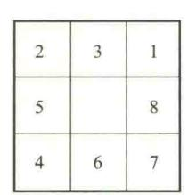

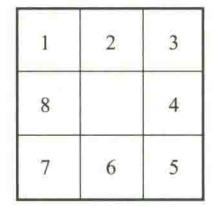

初始状态

目标状态

该问题可以用状态空间来表示。此时八数码的任何一种摆法就是一个状态,所有的摆法即为状态集S,它们构成了一个状态空间,其数目为9!。而G是指定的某个或某些状态。如着眼在数码上,相应的操作算子就是数码的移动,其操作算子共有 $4(方向)\times 8(数码)=32$ 个,如着眼在空格上,即空格在方格盘上的每个可能位置的上下左右移动,其操作算子可简化成仅4个:

如果空格上边有数字,则将空格向上移 Up

如果空格左边有数字,则将空格向左移 Left

如果空格下边有数字,则将空格向下移 Down

如果空格右边有数字,则将空格向右移 Right

移动时要确保空格不会移出方格盘之外,因此并不是在任何状态下都能运用这 4 个操作算子。如空格在方格盘的右上角时,只能运用两个操作算子——向左移 Left 和向下移 Down。

## 5.2.2 状态空间的图描述

状态空间可用有向图来描述,图的结点表示问题的状态,图的弧表示状态之间的关系,就是求解问题的步骤。初始状态对应于实际问题的已知信息,是图中的根结点。问题的状态空间描述中,寻找从一种状态转换为另一种状态的某个操作算子序列就等价于在一个图中寻找某一路径。

如图 5.1 所示用有向图描述的状态空间。图中表示对状态  $S_0$ , 允许使用操作算子  $O_1$ ,  $O_2$ 及  $O_3$ , 并分别使  $S_0$ 转换为  $S_1$ ,  $S_2$ 及  $S_3$ 。这样一步步利用操作算子转换下去,如  $S_{10} \in G$ ,则  $O_2$ ,  $O_6$ ,  $O_{10}$  就是一个解。

上面是较为形式化的说明,下面再以八数码问题为例,讨论具体问题的状态空间的有向图描述。

在某些问题中,各种操作算子的执行是有不同费用的。如在旅行商问题中,两两城市之间的距离通常是不相等的,那么,在图中只需要给各弧线标注距离或费用即可。

例 5.2 对于八数码问题,如果给出问题的初始状态,就可以用图来描述其状态空间。其中的弧可用表明空格的 4 种可能移动的 4 个操作算子来标注,即空格向上移 Up、向左移 Left、向下移 Down、向右移 Right。该图的部分描述如图 5.2 所示。

下面以旅行商问题为例说明这类状态空间的图描述,其终止条件则是用解路径本身的特点来描述,即经过图中所有城市的最短路径找到时搜索便结束。

{4}------------------------------------------------

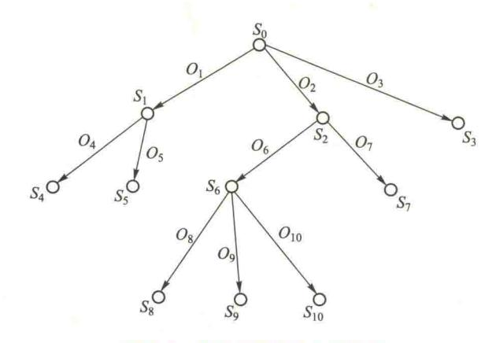

图 5.1 状态空间的有向图描述

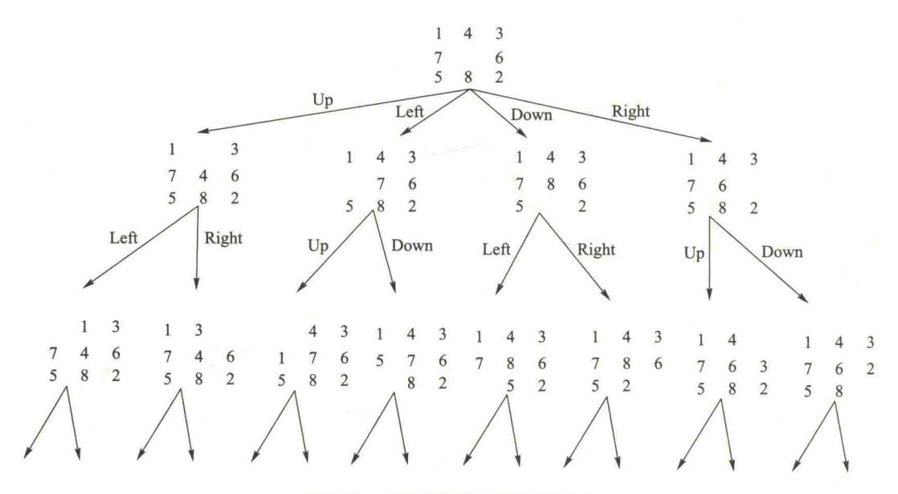

图 5.2 八数码状态空间图(部分)

例 5.3 旅行商问题(traveling salesman problem, TSP)或推销员路径问题是假设一个推销员从出发地,到若干个城市去推销产品,然后回到出发地。问题是要找到一条最好的路径,使得推销员访问每个城市后回到出发地所经过的路径最短或者费用最少。

图 5.3 是这个问题的一个实例,图中结点代表城市,弧上标注的数值表示经过该路径的距离(或费用)。假定推销员从 A 城出发。

可能的路径有很多,例如,距离为 375 的路径(A,B,C,D,E,A)就是一个可能的旅行路径,但目的是要找具有最小距离的旅行路径。注意,这里对目的的描述是关注整个路径的特性而不是单个状态的特性。

{5}------------------------------------------------

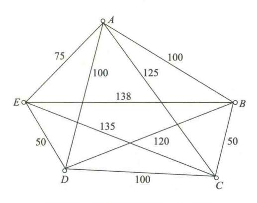

图 5.3 旅行商问题的一个实例

图 5.4 是该问题的部分状态空间表示。

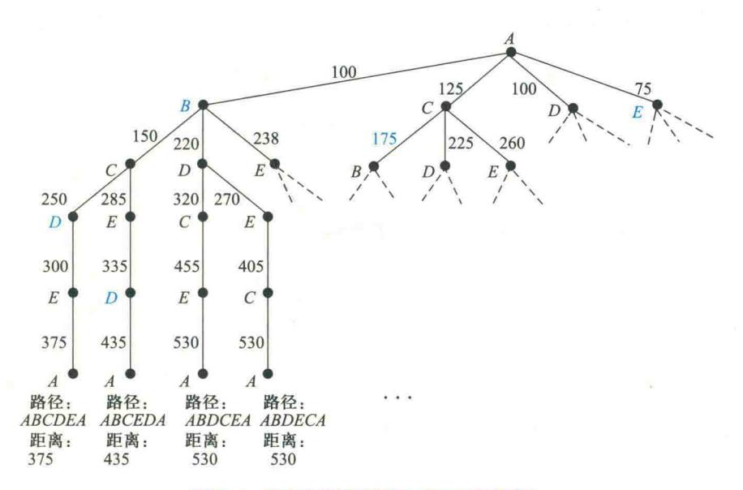

图 5.4 旅行商问题的状态空间图(部分)

上面两个例子中,只绘出了问题的部分状态空间图,当然,完全可以绘出问题的全部状态空间图,但对实际问题,要在有限的时间内绘出问题的全部状态图是不可能的。因此,这类显示描述对于大型问题的描述是不切实际的,而对于具有无限结点集合的问题则是不可能的。因此,要研究能在有限时间内搜索到较好解的搜索算法。

状态空间搜索是搜索某个状态空间以求得操作算子序列的一个解答的过程。这种搜索是状态空间问题求解的基础。

{6}------------------------------------------------

搜索策略的主要任务是确定选取操作算子的方式。它有两种基本方式:盲目搜索和启发式搜索。


# 5.3 盲目的图搜索策略

### 5.3.1 回溯策略

回溯策略讲课视 频▲

不管是正向搜索还是逆向搜索求解问题,都是在状态空间图中找到从初始 状态到目的状态的路径。路径上弧的序列对应于解题的步骤。若在选择操作

算子求解问题时,能给出绝对可靠的预测或者绝对正确的选择策略,一次性地成功穿过状态空间而达到目的,构造出一条解题路径,那就不需要所谓的搜索了。但事实上,不可能给出绝对可靠的预测,求解实际问题时必须尝试多条路径直到找到目的为止。回溯策略是一种系统地尝试状态空间中各种不同路径的技术。

带回溯策略的搜索是从初始状态出发,不停地、试探性地寻找路径,直到它到达目的或"不可解结点",即"死胡同"为止。

回溯策略是当遇到不可解结点时就回溯到路径中最近的父结点上,查看该结点是否还有其他的子结点未被扩展。若有,则沿这些子结点继续搜索;如果找到目标,就成功退出搜索,返回解题路径。

可以看出,回溯策略的搜索过程呈现出递归过程的性质,搜索过程在每个结点上的检查遵循着递归方式。下面给出递归过程。

```
Step Track (DataList):
```

Data: = First(DataList);

if Member(Data, Tail(DataList))
then return FAIL:

if Goal (Data) then return NIL;

if DeadEnd(Data) then return FAIL;

if Length (DataList) > Bound then return FAIL;

Rules: = AppRules(Data);

Loop: if Null(Rules) then return FAIL;

R: = First(Rules);

Rules: = Tail(Rules);

Newdata: = Gen(R, Data);

NewDataList: = Cons(Newdata, DataList);

Path: = Back Track(NewDataList);

- \* 当前状态为状态序列表中
- 第一个状态
- \* 回老路,退回
- \*到达目的地,成功返回
- \* 到达不合理状态,退回
- \*已到深度限制,退回
- \* 得出可应用的规则集
- \*进入死胡同,退回
- \*取出第一条可用规则
- \*运用规则,生成新状态
- \*递归

{7}------------------------------------------------

If Path: = FAIL then go Loop
 else return Cons(R, Path);

说明:变量符号 Data, DataList, Rules, R, Newdata, NewdataList, Path 分别表示当前状态、状态序列表、规则集序列表、当前运用的规则、生成的新状态、生成的新状态序列表、当前解路径表;常量符号 FAIL, NIL, Bound, Loop 分别表示回溯点标记、空表、深度限制值、循环标号;函数 First(y)表示在 y 表中取第一个元素,函数 Tail(x)是取除了第一个元素的 x 表的其余部分,函数 Member(x,y)表示变量 x 是否为 y 表的一个元素,函数 Goal(x)表示变量状态 x 是否为目的状态,函数 DeadEnd(x)表示变量状态 x 是否为不可能是解路径上的状态,函数 Length(x)是取 x 表的表长度,函数 AppRules(x)是求出在变量状态 x 上可运用的规则集,函数 Null(x)表示 x 表是否为空表,函数 Gen(x,y)是求 x 规则运用在 y 状态后所生成的新状态,函数 Cons(x,y)是将变量状态 x 加在 y 表的前部。

从递归过程可以看出,如当前状态 S 未达到目的的要求,就对它的第一个子状态  $S_{child}$  递归调用回溯过程。如果在以  $S_{child}$  为根的子图中未找到目的,就对它的兄弟子状态  $S_{child}$  递归调用回溯过程。这样重复进行,直到某个子状态的后裔是目的状态或者所有子状态都搜索完为止。若 S 的子状态中没有一个能达到目的,则回溯到 S 的父状态。这样算法就可以对 S 的兄弟状态进行搜索。算法就以这种方式搜索直到找到目的状态或遍历了状态空间为止。图 S . S 给出了一个状态空间中应用回溯搜索的示意过程,图中虚线箭头的方向表示搜索的轨迹,结点边的数字表示被搜索到的次序。

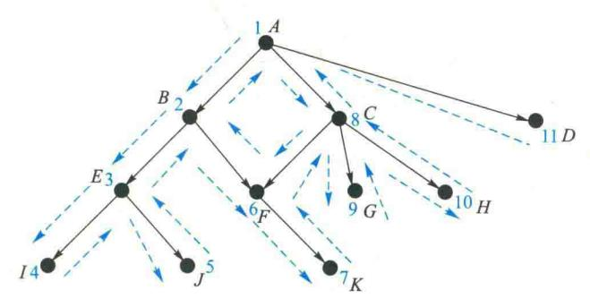

图 5.5 回溯搜索示意图

至此,可以定义一个回溯搜索的算法。

算法用三张表来保存状态空间中的不同性质结点:

(1) 路径状态(path states)表 PS

保存当前搜索路径上的状态。如果找到了目的,PS 就是解路径上的状态有序集。

(2) 新的路径状态(new path states)表 NPS

新的路径状态表。它包含了等待搜索的状态,其后裔状态还未被搜索到,即未被生成扩展。

{8}------------------------------------------------

#### (3) 不可解状态(no solvable states)表 NSS

不可解状态集,列出了找不到解路径的状态。如果在搜索中扩展出的状态是它的元素,则可立即将之排除,不必沿该状态继续搜索。

为了避免造成无穷循环搜索,需要检测并删除多次出现的那些状态。具体检测可通过判断每一个新生成的状态是否在 PS、NPS、NSS 三张表中来实现。如果它属于其中一张表,就说明它已被搜索过而不必再考虑。

当前正在被检测的状态,记作 CS(current state)。CS 总是等于最近加入 PS 中的状态,是当前正在探寻解题路径的"前锋"。各种合适的推理规则或其他问题求解操作都可应用于 PS。应用后一般便得到一些新状态,即 PS 的子状态的有序集,然后再将该集合中的第一个子状态作为当前状态 CS,并加入 PS 中,其余的则按序放入 NPS 中,用于以后的搜索。如果应用后 CS 没有子状态,则要从 PS、NPS 中删除它,同时将其加入 NSS,之后回溯查找 NPS 中表首位置的状态。

```
Function backtrack:
begin
  PS:= [Start]; NPS:= [Start]; NSS:= []; CS:= Start; *初始化
  while NPS≠ do
      begin
      if CS=目的状态 then return(PS):
                                        *成功,返回解题路径
      if CS 没有子状态(不包括 PS.NPS 和 NSS 中已有的状态)
         then
          begin
           while((PS 非空) and(CS=PS 中的第一个元素)) do
               begin
                 将 CS 加入 NSS
                                         *标明此状态不可解
                 从 PS 中删除第一个元素 CS * 回溯
                 从 NPS 中删除第一个元素 CS:
                 CS:= NPS 中的第一个元素:
               end;
          将 CS 加入 PS:
      end
      else
        begin
        将 CS 子状态(不包括 PS、NPS 和 NSS 中已有的)加入 NPS;
        CS:= NPS 中的第一个元素:
          将 CS 加入到 PS;
        end
```

{9}------------------------------------------------

end:

return FAIL:

end.

图 5.5 的回溯轨迹如下:

初值:PS=[A];NPS=[A];NSS=[];CS=A;

| 重复 | CS | PS             | NPS          | NSS      |
|----|----|----------------|--------------|----------|
| 0  | À  | [A]            | [ <i>A</i> ] | [ ]      |
| 1  | В  | [ BA ]         | [ BCDA ]     | [ ]      |
| 2  | E  | [ <i>EBA</i> ] | [ EFBDCA ]   | [ ]      |
| 3  | I  | [ IEBA ]       | [ IJEFBCDA ] | [ ]      |
| 4  | J  | [ JEBA ]       | [ JEFBCDA ]  | [1]      |
| 5  | F  | [FBA]          | [ FBCDA ]    | [EJI]    |
| 6  | K  | [ KFBA ]       | [KFBCDA]     | [EJI]    |
| 7  | C  | [ CA ]         | [ CDA ]      | [BFKEJI] |
| .8 | G  | [ GCA ]        | [ GHCDA ]    | [BFKEJI] |

上面的搜索过程显示出回溯是状态空间中的一个正向搜索。它将初始条件作为初始状态,对其子状态进行搜索以寻找目的。如将目的作为搜索图的根即初始状态,本算法便可看作逆向搜索。如对算法中"成功并返回解路径"的判别条件"CS=目的状态"修改为"搜索路径的性质优劣",那算法必须通过检查 PS中的路径来确定是否到达目的。

回溯是状态空间搜索的一个基本算法。各种图搜索算法,包括深度优先、宽度优先、最好优先搜索等,都有回溯的思想:

- ① 用新的路径状态表(NPS)使算法能返回(回溯)到其中任一状态。
- ② 用不可解状态表(NSS)来避免算法重新搜索无解的路径。
- ③ 在路径状态表 PS 中记录当前搜索路径的状态,当满足目的时可以将它作为结果返回。
- ④ 为避免陷入死循环必须对新生成的子状态进行检查,看它是否在该三张表中。

下面将介绍一些与回溯算法类似的用表来保存搜索空间中状态轨迹的搜索算法。与回溯算法不同的是,它们实现了另外一些搜索策略,因而为解题提供了一个更为灵活

的手段。

# 5.3.2 宽度优先搜索策略

一个搜索算法的策略就是要决定树或图中状态的搜索次序。宽度、深度优先搜索是状态空间的最基本的搜索策略。

宽度优先搜索策 略讲课视频▲

{10}------------------------------------------------

宽度优先搜索法是按照图 5.6 所示的次序来搜索状态的。由  $S_0$ 生成状态 1,2,然后扩展状

态 1,生成状态 3,4,5,接着扩展状态 2,生成状态 6,7,8,该层扩展完后,再进入下一层,对状态 3 进行扩展,如此一层一层地扩展下去,直到搜索到目的状态(如果目的状态存在)。

在实际宽度优先搜索时为了保存状态空间搜索的轨迹,用到了两个表: open 表和 closed 表。open 表与回溯算法中的 NPS 表相似,包含了已经生成出来但其子状态未被搜索的状态。open 表中状态的排列次序就是搜索的次序。closed 表记录了已被生成扩展过的状态,它相当于回溯算法中 PS 表和 NSS 表的合并。

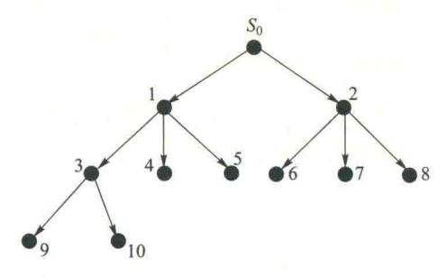

图 5.6 宽度优先搜索策略中搜索状态的次序

下面是宽度优先搜索过程。

Procedure breadth\_first\_search

begin

open:=[start]; closed:=[] \* 初始化 while open≠[] do

begin

从 open 表中删除第一个状态,称之为 n;

将n放入closed表中;

if n = 目的状态 then return (success);

生成 n 的所有子状态;

从 n 的子状态中删除已在 open 或 closed 表中出现的状态;\*避免循环搜索;

将 n 的其余子状态,按生成的次序加入 open 表的后段。

end;

end;

注意, open 表是一个队列结构,即先进先出(FIFO)的数据结构; 曾在 open 表或 closed 表中出现过的子状态要删去。

如果过程因 while 循环条件(open≠[ ])不满足而结束,则表明已搜索完整个状态空间但未搜索到目的状态,说明搜索失败了。

如果整个状态空间是无限的并不能满足 while 的循环条件即无解,过程便会一直搜索下去, 所以在过程中应增加"搜索超时而结束"的终止部分。

下面举一个宽度优先搜索的例子。

例 5.4 如图 5.7 所示,通过搬动积木块,希望从初始状态达到一个目的状态,即三块积木堆叠在一起。积木A在顶部,积木B在中间,而积木C在底部。

{11}------------------------------------------------

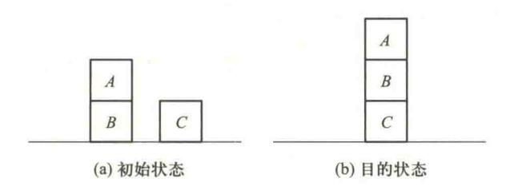

图 5.7 积木问题

解 这个问题的唯一操作算子为 MOVE(X,Y),即把积木 X 搬到 Y( 积木或桌面) 上面。如 "搬动积木 A 到桌面上"表示为 MOVE(A,Table)。该操作算子可运用的先决条件是:

- ①被搬动积木的顶部必须为空。
- ② 如果 Y 是积木(不是桌面),则积木 Y 的顶部也必须为空。
- ③ 同一状态下,运用操作算子的次数不得多于一次(可从 open 表和 closed 表加以检查)。

图 5.8 表示了由宽度优先搜索所产生的搜索树。各结点是以产生和扩展的先后次序编下标的。当搜索到  $S_{10}$ 目的状态时,过程便结束。此时,open 表包含  $S_0$ 至  $S_5$ ,而 closed 表包含  $S_6$ 至  $S_{10}$ 。

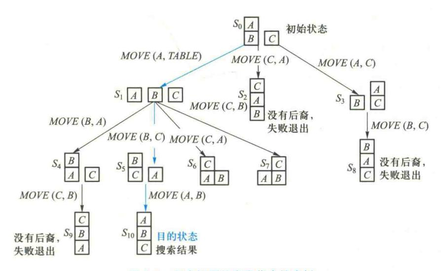

图 5.8 积木问题的宽度优先搜索树

由于宽度优先搜索总是在生成扩展完 N 层的所有结点之后才转向 N+1 层,所以它总能找到最好的解(如有解),但当图的分支数太多,即状态的后裔数的平均值较大,这种组合爆炸就会使算法耗尽资源,从而在可利用的空间中找不到解。这是由于每层搜索中所有生成的未扩展的结点都要保存到 open 表中,如果解题路径较长,这个数目将会大得使搜索无法进行。

{12}------------------------------------------------


深度优先搜索策 略讲课视频▲

# 5.3.3 深度优先搜索策略

深度优先搜索法是按图 5.9 所示的次序来搜索状态的。

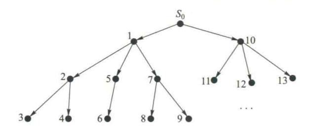

图 5.9 深度优先搜索法中状态的搜索次序

搜索从  $S_0$ 出发,沿一个方向一直扩展下去,如状态  $1,2,3,\cdots$ ,直到达到一定的深度(这里假定为 3 层)。如果未找到目的状态或无法再扩展时,便回溯到另一条路径(状态 4)继续搜索;若还未找到目的状态或无法再扩展时,再回溯到另一条路径(状态 5,6)搜索……

在深度优先搜索中,当搜索到某一个状态时,它所有的子状态以及子状态的后裔状态都必须 先于该状态的兄弟状态被搜索。深度优先搜索在搜索空间时应尽量往深处去,只有再也找不出 某状态的后裔状态时,才能考虑它的兄弟状态。

很明显,深度优先搜索法不一定能找到最优解,并且可能由于深度的限制,会找不到解(待求问题存在着解),然而,如果不加深度限制值,则可能会沿着一条路径无限地扩展下去,这当然是不希望的。为了保证找到解,那就应选择合适的深度限制值,或采取不断加大深度限制值的办法,反复搜索,直到找到解。

修改宽度优先搜索过程便可得到深度优先搜索过程:

Procedure depth\_first\_search

```
begin
```

open:=[start];closed:=[];d:=深度限制值

while open≠[ ] do

begin

从 open 表中删除第一个状态,称之为 n;

将n放入closed表中;

if n=目的状态 then return (success);

if n的深度<d then continue;

生成 n 的所有子状态;

从 n 的子状态中删除已在 open 或 closed 表中出现的状态;

将 n 的其余子状态,按生成的次序加入 open 表的前端。

end

end

{13}------------------------------------------------

注意:open 表是一个堆栈结构,即先进后出(FILO)的数据结构。open 表用堆栈实现的方法使得搜索偏向于最后生成的状态,曾在 open 表或 closed 表中出现过的子状态要删去。和 breadth\_first\_search 中一样,此处 open 表列出了所有已生成但未做扩展的状态(搜索的"前锋"),closed 表记录了已扩展过的状态。同 breadth\_first\_search 一样,两个算法都可以把每个结点同它的父结点一起保存,以便构造一条从起始状态到目的状态的路径。

与宽度优先搜索不同的是,深度优先搜索并不能保证第一次搜索到的某个状态时的路径是到这个状态的最短路径。对任何状态而言,以后的搜索有可能找到另一条通向它的路径。如果路径的长度对解题很关键的话,当算法多次搜索到同一个状态时,它应该保留最短路径。具体可把每个状态用一个三元组来保存(状态,父状态,路径长度)。当生成子状态时,将路径长度加1,与子状态一起保存起来。当有多条路径可到达某子状态时,这些信息可帮助选择最优的路径。必须指出,深度优先搜索中简单保存这些信息也不能保证算法能得到的解题路径是最优的。

下面举一深度优先搜索的例子。

例 5.5 卒子穿阵问题,要求一卒子从顶部通过图 5.10 所示的阵列到达底部。卒子行进中不可进入到代表敌兵驻守的区域(标注1),并不准后退。假定深度限制值为 5。

| 行 | 1 | 2 | 3 | 4 | 列 |
|---|---|---|---|---|---|
| 1 | 1 | 0 | 0 | 0 |   |
| 2 | 0 | 0 | 1 | 0 |   |
| 3 | 0 | 1 | 0 | 0 |   |
| 4 | 1 | 0 | 0 | 0 |   |

图 5.10 阵列图

由深度优先搜索法产生的搜索树如图 5.11 所示。在结点  $S_0$ ,卒子还没有进入阵列,在其他结点,其所处的阵列位置用一对数字(行号,列号)表示,结点的编号代表搜索的次序。

当搜索过程终止时,open 表含有结点  $S_{17}$ (为一目的结点)和  $S_{18}$ ,而其他结点( $S_0 \sim S_{16}$ )都在 closed 表中。很明显,所求得的解路( $S_0$ , $S_8$ , $S_{14}$ , $S_{15}$ , $S_{16}$ , $S_{17}$ )比最优路径(从(1,4)进入)多走一步。

此外,由于本算法把状态空间作为搜索树来考虑,而不是当作一般的搜索图考虑,所以,忽略了两个不同的结点  $S_2$  和  $S_9$  实际上是代表了同一个状态这个问题。因而,从结点  $S_9$  向下的搜索实际是在重复从结点  $S_2$  向下的搜索。

深度优先搜索能尽快地深入下去,如果已知解题路径很长,深度搜索就不会在开始状态的周围即"浅层"状态上浪费时间;但另一方面,深度优先搜索会在搜索的深处"迷失方向",找不到通向目的的更短路径或陷入一个不通往目的的无限长的路径中。深度优先搜索在搜索有大量分支的状态空间时有相当高的效率,它不需要把某一层上的所有结点都进行扩展。

{14}------------------------------------------------

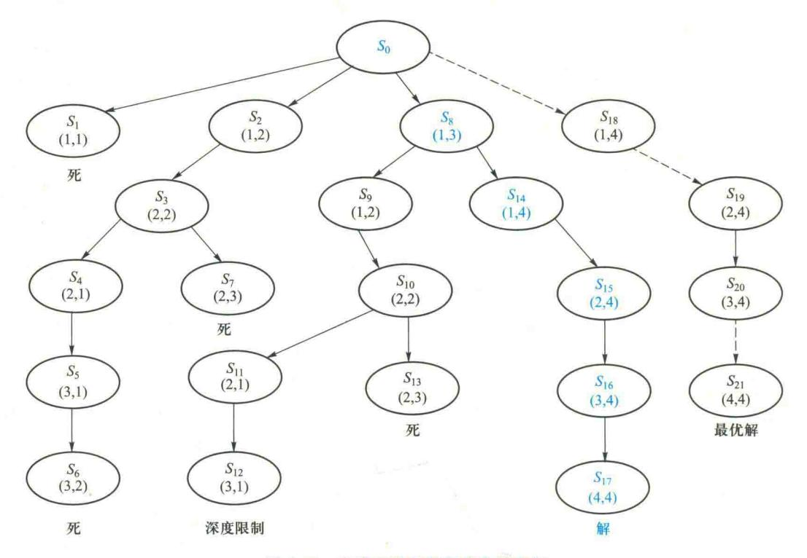

图 5.11 卒子穿阵的深度优先搜索树


# 5.4 启发式图搜索策略

前节所介绍的大部分搜索方法都是盲目搜索方法,其搜索的复杂性往往是 启发式图搜索策 很高的。为了提高算法的效率,必须放弃利用纯数学的方法来决定搜索结点的 略讲课视频

本节先对启发及启发式策略所涉及的问题作一介绍,然后具体介绍启发式图搜索算法—— A及A\*算法,最后讨论启发式搜索算法的性质。

# 5.4.1 启发式策略

# 启发式(heuristic)策略是利用与问题有关的启发信息引导搜索。

在状态空间搜索中,启发式被定义成一系列操作算子,并能从状态空间中选择最有希望到达问题解的路径。

问题求解系统可在两种基本情况下运用启发式策略:

{15}------------------------------------------------

- ① 由于在问题陈述和数据获取方面存在模糊性,可能会使一个问题没有一个确定的解,这就要求系统能运用启发式策略作出最有可能的解释。
- ② 虽然一个问题可能有确定解,但是其状态空间特别大,搜索中生成扩展的状态数会随着搜索的深度呈指数级增长。穷尽式搜索策略如宽度优先或深度优先搜索,在一个给定的较实际的时空内很可能得不到最终的解,而启发式策略则通过引导搜索向最有希望的方向进行来降低搜索复杂度。

但是,启发式策略也是极易出错的。在解决问题过程中启发仅仅是下一步将要采取措施的一个猜想,它常常根据经验和直觉来判断。由于启发式搜索只利用特定问题的有限的信息,很难准确地预测下一步在状态空间中采取的具体的搜索行为。一个启发式搜索可能得到一个次优解,也可能一无所获。这是启发式搜索固有的局限性,而这种局限性不可能由所谓更好的启发式策略或更有效的搜索算法来彻底消除。

在问题求解中,需要用启发式知识来剪枝减少状态空间的大小,否则只能求解一些小规模问题。因此,启发式搜索策略及算法设计一直是人工智能的核心问题。

启发式搜索通常由两部分组成:启发方法和使用该方法搜索状态空间的算法。

**例 5.6** 一字棋游戏。在九宫棋盘(即 3×3 的方格盘)上,从空棋盘开始,双方轮流在棋盘上摆各自的棋子×或○(每次一枚),谁先取得三子一线(一行、一列或一条对角线)的结果就取胜。

×和○在棋盘中摆成的各种不同的棋局,每种棋局就是问题空间中的不同状态。在 9 个位置上摆放 | 空,×,○ | 有 3°种棋局。当然,其中大多数不会在实际对局中出现。任一方的摆棋就是状态空间中的一条弧。由于第三层及更底层的某些状态可以通过不同路径到达,所以其状态空间是图而不是树。但图中不会出现回路,因为弧具有方向性(下棋时不允许悔棋)。这样搜索路径时就不必检测是否有回路。

在一字棋游戏中,第一步有 9 个空格便有 9 种可能的走法,第二步 8 种,第三步 7 种……如此递减,所以共有 9×8×7×…×1 即 9! 种不同的棋局状态,其状态空间较大,穷尽搜索的组合数较大。

可以利用启发方法来剪枝以减少状态空间的大小。根据棋盘的对称性可以减少搜索空间的大小。棋盘上很多棋局是等价的,如第一步实际上只有3种走法,角、边的中央和棋盘正中,这时状态空间的大小为3×8!。在状态空间的第二层上,由对称性还可进一步减少到3+12×7!种,当然还可以再进一步减少状态空间的大小。

此外,使用启发方法进行搜索几乎可以整个地消除复杂的搜索过程。设想将棋子走到棋盘上×有最多的赢线的格子上,若两种状态有相等的赢的几率,取其中的一种。最初的三种状态显示在图 5.12 中。这样的话,可设计一种算法(完全实现启发式搜索),它选择具有最高启发值的棋局状态放棋子。例如,对于图 5.12(a)×方有 8 种布子成一线,而〇方只有 5 种布子成一线,所以×方赢的几率为 8-5=3;对于图 5.12(b),〇方有 6 种布子成一线,所以×方赢的几率为 8-6=2;对于图 5.12(c),〇方有 4 种布子成一线,所以×方赢的几率为 8-4=4,是×方的最佳走步。因此,

{16}------------------------------------------------

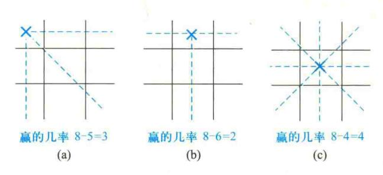

图 5.12 启发式策略的运用

在本例的这种情况下,只需搜索×占据棋盘正中位置的棋局状态,而其他的各种棋局状态连同它们的延伸棋局状态都不必再考虑了。如图 5.13 所示 2/3 的状态空间就不必搜索了。

第一步棋下完后,对方只能有两种走法。无论选择哪种走法,我方均可以通过启发式搜索来选择下一步可能的走法。在搜索过程中,每一步只需估价单个结点的子结点便可决定下哪步棋。图 5.13 显示了游戏前三步简化了的搜索过程。每种状态都标记了它的启发值。图中实线表示最佳走步。

要精确地计算待搜索的状态数目比较难,但可以大致计算它的上限。一盘棋最多走9步,每步的下一步平均有4、5种走法,这样大约就是4.5×9,近40种状态,这比原来9!大小的状态空间缩小了很多,如图5.13所示。

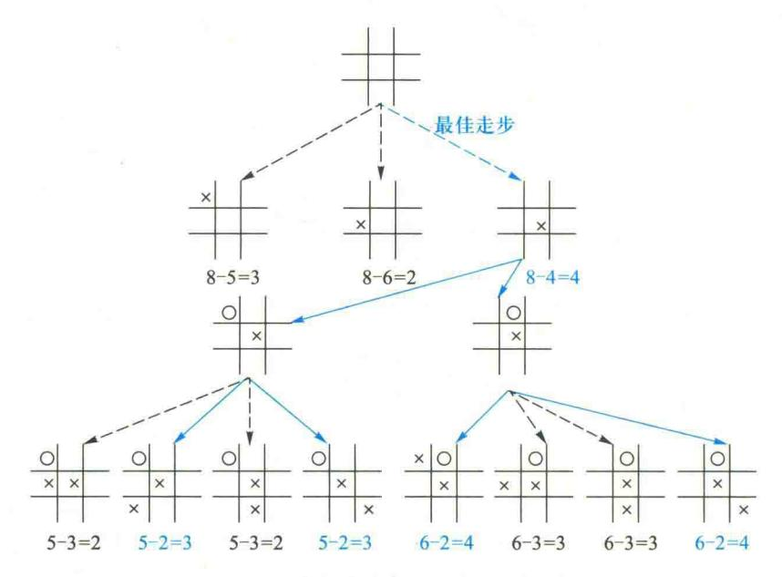

图 5.13 启发式搜索下缩减的状态空间

{17}------------------------------------------------

国际象棋软件采用启发式搜索算法,在搜索棋局时加入剪枝策略。谷歌开发的 AlphaGo 利用深度学习算法学习人类的棋谱,模拟人类选择几个优势点,然后通过蒙特卡洛搜索,穷举计算这几个胜率,从中优选。AlphaGo 中有两个深度神经网络,value networks(价值网络)和 policy networks(策略网络)。其中 value networks评估棋盘选点位置,policy networks选择落子。深度神经网络不仅向人类专家学习,而目能自己和自己下棋(self-play),进行强化学习,不断提高棋艺。

# 5.4.2 启发信息和估价函数

在解决一个实际问题时,人们常常把一个复杂的实际问题抽象化,保留某些主要因素,忽略大量次要因素,从而将这个实际问题转化成具有明确结构的有限或无限的状态空间问题。这个状态空间中的状态和变换规律都是已知的集合,因此可以找到一个求解该问题的算法。


估价函数讲课视

在具体求解中,启发式搜索能够利用与该问题有关的信息来简化搜索过程,称此类信息为启发信息。然而,在求解问题中能利用的大多不是具有完备性的启发信息,而是非完备的启发信息。其原因是:

- ① 大多数情况下,求解问题系统不可能知道与实际问题有关的全部信息,因而无法知道该问题的全部状态空间,也不可能用一套算法来求解所有的问题。这样就只能依靠部分状态空间、一些特殊的经验和有关信息来求解其中的部分问题。
- ② 有些问题在理论上虽然存在着求解算法,但是在工程实践中,这些算法不是效率太低,就是无法实现。为了提高求解问题的效率,不得不放弃使用这些"完美的"算法,而求助于一些启发信息来进行启发式搜索。

如在博弈问题中,计算机为了保证最后胜利,可以将所有可能的走法都试一遍,然后选择最佳走步。这样的算法是可以找到的,但计算所需的时空代价十分惊人。对于可能有的棋局数来说,一字棋是 9!  $\approx 3.6 \times 10^5$ ,西洋跳棋是 $10^{78}$ ,国际象棋是 $10^{120}$ ,围棋是 $10^{761}$ 。假设每步可以搜索一个棋局,用极限并行速度 $(10^{-104}$ 年/步)来处理,搜索一遍国际象棋的全部棋局也得 $10^{16}$ 年即 1亿亿年才可以算完,而已知的宇宙寿命才 100 亿年!因此,必须采用启发式的求解方法。

启发信息按运用的方法不同可分为三种:

- ① 陈述性启发信息。一般被用于更准确、更精练地描述状态,使问题的状态空间缩小,如待求问题的特定状况等属于此类信息。
- ② 过程性启发信息。一般被用于构造操作算子,使操作算子少而精,如一些规律性知识等属于此类信息。
- ③ 控制性启发信息。它是表示控制策略方面的知识,包括协调整个问题求解过程中所使用 的各种处理方法、搜索策略、控制结构等有关的知识。

为提高搜索效率就需要利用上述三种启发信息作为搜索的辅助性策略。这里主要介绍控制性的启发信息。

利用控制性的启发信息有两种极端的情况:一种是没有任何控制性知识作为搜索的依据,因

{18}------------------------------------------------

而搜索的每一步完全是随意的,如随机搜索、宽度搜索、深度搜索等;另一种是有充分的控制知识作为依据,因而搜索的每一步选择都是正确的,但这是不现实的。一般情况介于二者之间。在搜索过程中需要根据这些启发信息估计各个结点的重要性。

用估价函数(evaluation function)估计待搜索结点的"有希望"程度,并依次给它们排定次序。估价函数f(x)可以是任意一种函数,如定义为结点x处于最佳路径上的概率,或是x结点和目的结点之间的距离或差异,或是x格局的得分等。

一般来说,估计一个结点的价值,必须综合考虑两方面的因素:已经付出的代价和将要付出的代价。因此,估价函数 f(n) 定义为从初始结点经过 n 结点到达目的结点的路径的最小代价估计值,其一般形式是

$$f(n) = g(n) + h(n)$$
 (5.3)

其中,g(n)是从初始结点到 n 结点的实际代价,而 h(n)是从 n 结点到目的结点的最佳路径的估计代价。因为实际代价 g(n) 可以根据已生成的搜索树实际计算出来,而估计代价 h(n)是对未生成的搜索路径作某种经验性的估计。这种估计来源于对问题解的某些特性的认识,希望依靠这些特性来更快地找到问题的解,因此,主要是h(n)体现了搜索的启发信息。h(n)称为启发函数。

g(n)的作用一般是不可忽略的。因为它代表了从初始结点经过 n 结点到达目的结点的总代价估值中实际已付出的那一部分。保持 g(n) 项就保持了搜索的宽度优先成分,g(n) 的比重越大,越倾向于宽度优先搜索方式。这有利于搜索的完备性,但会影响搜索的效率。h(n) 的比重越大,表示启发性能越强。在特殊情况下,如果只希望找到达到目的结点的路径而不关心会付出什么代价,则 g(n) 的作用可以忽略。另外,当  $h(n) \gg g(n)$  时,也可忽略 g(n),这时有 f(n) = h(n),有利于提高搜索的效率,但影响搜索的完备性。

给定一个问题后,根据该问题的特性和解的特性,可以有多种方法定义估价函数,用不同的估价函数指导搜索,其效果可以相差很远。因此,必须尽可能选择最能体现问题特性的、最佳的估价函数。

- **例 5.7** 八数码问题的估价函数。它设计方法有多种,并且不同的估价函数对求解八数码问题有不同的影响。
- ① 估价函数是一格局与目的格局位置不符的数码数目。这是最简单的设计方法。直观感觉认为这种估价函数很有效,因为在其他条件相同的情况下,某格局位置不符的数码数目越少,则它和最终目的越接近,因而它是下一个搜索格局。但是,这种估价函数并没有充分利用所能获得的信息。它没有考虑数码所需移动的距离。
  - ② 估价函数是各数码移到目的位置所需移动的距离的总和。

这两种估价函数都没有考虑数码逆转(与目的格局中数码排列的先后顺序)的情况。如果两块数码相邻但与目标格局相比位置相反,则至少需移动3次才能将它们移到正确的位置上。

- ③ 估价函数对每一对逆转数码乘以一个倍数。
- ④ 估价函数是位置不符数码数目的总和与 3 倍数码逆转数目相加。它克服了仅计算数码

{19}------------------------------------------------

逆转数目策略的局限。

这个例子说明,设计一个好的估价函数具有相当的难度。设计估价函数的目标就是利用有限的信息作出一个较精确的估价函数。好的估价函数的设计是一个经验问题,判断和直觉是很重要的因素,但是衡量其好坏的最终标准是在具体应用时的搜索效果。

## 5.4.3 A 搜索算法

启发式图搜索法的关键是如何寻找并设计一个与问题有关的 h(n) 及构造 出f(n) = g(n) + h(n),然后以 f(n) 的大小来排列待扩展状态的次序,每次选择 f(n) 值最小者进行扩展。


A搜索算法讲课

与宽度优先及深度优先搜索算法一样,启发式图搜索算法使用两张表记录 视频▲ 状态信息:在 open 表中保留所有已生成而未扩展的状态;在 closed 表中记录已扩展过的状态。 算法中有一步是根据某些启发信息来排列 open 表的。它既不同于宽度优先所使用的队列(先进 先出),也不同于深度优先所使用的堆栈(先进后出),而是一个按状态的启发估价函数值的大小 排列的一个表。进入 open 表的状态不是简单地排在队尾(或队首),而是根据其估值的大小插 入到表中合适的位置,每次从表中优先取出启发估价函数值最小的状态加以扩展。

A 算法是基于估价函数的一种加权启发式图搜索算法,具体步骤如下:

步骤 1 把附有  $f(S_0)$  的初始结点  $S_0$  放入 open 表;

步骤 2 若 open 表为空,则搜索失败,退出;

步骤 3 移出 open 表中第一个结点 N 放入 closed 表中,并顺序编号 n;

步骤 4 若目标结点把附有  $f(S_0)$  的初始  $S_a = N$ ,则搜索成功,结束;

步骤 5 若 N 不可扩展,则转步骤 2;

步骤 6 扩展 N,生成一组附有 f(x) 的子结点,对这组子结点做如下处理。

- ① 考察是否有已在 open 表或 closed 表中存在的结点。若有则再考察其中有无 N 的先辈结点,若有则删除之,对于其余结点也删除之,但由于它们又被第二次生成,因此需要考虑是否修改已经存在于 open 表或 closed 表中的这些结点及其后裔的返回指针和 f(x) 的值。修改原则是:选 f(x) 值小的路径走。
- ② 为其余子结点配上指向 N 的返回指针后放入 open 表中,并对 open 表按 f(x) 值以升序排序、转步骤 2。

启发式图搜索的 A 算法描述如下:

procedure heuristic\_search

```
open:=[start]; closed:=[]; f(s):=g(s)+h(s); * 初始化 while open \neq[] do begin
```

从 open 表中删除第一个状态,称之为 n; if n=目的状态 then return(success);

{20}------------------------------------------------

```
生成 n 的所有子状态:
   if n 没有任何子状态 then continue;
   for n 的每个子状态 do
     case 子状态 is not already on open 表 or closed 表;
      begin
        计算该子状态的估价函数值;
        将该子状态加到 open 表中:
      end:
     case 子状态 is already on open 表:
      if 该子状态是沿着一条比在 open 表已有的更短路径而到达
      then 记录更短路径走向及其估价函数值;
     case 子状态 is already on closed 表:
      if 该子状态是沿着一条比在 closed 表已有的更短路径而到达
        then
        begin
        将该子状态从 closed 表移到 open 表中;
        记录更短路径走向及其估价函数值;
      end:
     case end;
     将 n 放入 closed 表中:
     根据估价函数值,从小到大重新排列 open 表;
                      * open 表中结点已耗尽
  end:
 return (failure):
end.
```

从上面的描述可见,在 A 搜索算法中,从 open 表中取出第一个状态,如果该状态满足目的条件,则算法返回到该状态的搜索路径,在这里,每个状态都保留了其父状态的信息,以保证能返回完整的搜索路径。

如果 open 表的第一个状态不是目的状态,则算法利用与之相匹配的一系列操作算子进行相应的操作来产生它的子状态。如果某个子状态已在 open 表(或 closed 表)中出现过,即该状态再一次被发现时,则通过刷新它的祖先状态的历史记录,使算法极有可能找到到达目的状态的更短的路径。

接着,用A搜索算法计算 open 表中每个状态的估价函数值,按照值的大小重新排序,将值最小的状态放在表头,使其第一个被扩展。

图 5.14 是一个层次式状态空间,有些状态还用括号标上了相应的估价函数值。标上值的那些状态都是在 A 搜索中实际生成的。在这个图中, A 搜索算法扩展的状态都已显示,可以看出 A

{21}------------------------------------------------

算法无法搜索所有的状态空间。A 搜索算法的目标是尽可能地减小搜索空间而得到解,一般地说,启发信息给得越多即估价函数值越大,需搜索处理的状态数就越少。

A 搜索算法总是从 open 表中选取估价函数值最小的状态进行扩展。但是,在图 5.14 中假定 P 是目的状态,而到 P 的路径上的状态有较小的估价函数值,从而可以看出,启发信息难免会有错误,状态 O 比 P 的估价函数值小而先被搜索扩展。然而,A 算法本身具有纠错功能,能从不理想的状态跳转到正确的状态即从 B 跳到 C 上来进行搜索。

因此,A 算法并不丢弃其他所生成的状态而把它们保留到 open 表中。当某一个启发信息将搜索导向错误路径时,算法可以从 open 表中检索出先前生成的"次最好"状态,并且将搜索方向转向状态空间的另一部分上。如图 5.14 所示,当算法发现状态 F 的子状态的估价函数值很差时,搜索便转移到 C,但 F 的子状态 L 和 M 都保留在 open 表中,以防算法在未来的某一步再一次转向它们。

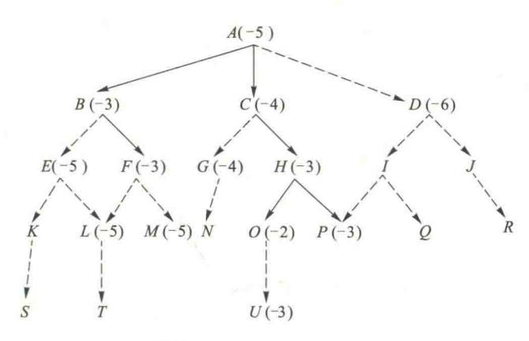

图 5.14 启发式图搜索示意

例 5.8 图 5.15 给出了利用 A 搜索算法求解八数码问题的搜索树,解的路径为 s , B , E , I , K , L 。图中状态旁括号内的数字表示该状态的估价函数值,其估价函数定义为

$$f(n) = d(n) + w(n)$$

其中,d(n)代表状态的深度,每步为单位代价;w(n)表示以"不在位"的数码数作为启发信息的度量。例如,A的状态深度为 1,不在位的数码数为 5,所以 A 的启发数值为 6。又如,E 的状态深度为 2,不在位的数码数为 3,所以 E 的启发函数值为 5。

搜索过程中 open 表和 closed 表内状态排列的变化情况如表 5.1 所示。

前面已提到启发信息给得越多即估价函数值越大,则 A 算法须搜索处理的状态数就越少, 其效率就越高。但也不是估价函数值越大越好,因为估价函数值太大会使 A 算法不一定能搜索 到最优解。

{22}------------------------------------------------

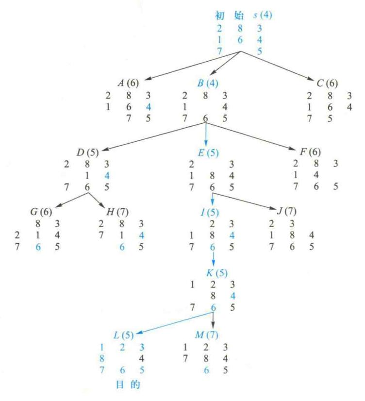

图 5.15 人数码问题的 A 搜索树

表 5.1 搜索过程中 open 表和 closed 表内状态排列的变化情况

| West Comment of the Comment of the Comment of the Comment of the Comment of the Comment of the Comment of the Comment of the Comment of the Comment of the Comment of the Comment of the Comment of the Comment of the Comment of the Comment of the Comment of the Comment of the Comment of the Comment of the Comment of the Comment of the Comment of the Comment of the Comment of the Comment of the Comment of the Comment of the Comment of the Comment of the Comment of the Comment of the Comment of the Comment of the Comment of the Comment of the Comment of the Comment of the Comment of the Comment of the Comment of the Comment of the Comment of the Comment of the Comment of the Comment of the Comment of the Comment of the Comment of the Comment of the Comment of the Comment of the Comment of the Comment of the Comment of the Comment of the Comment of the Comment of the Comment of the Comment of the Comment of the Comment of the Comment of the Comment of the Comment of the Comment of the Comment of the Comment of the Comment of the Comment of the Comment of the Comment of the Comment of the Comment of the Comment of the Comment of the Comment of the Comment of the Comment of the Comment of the Comment of the Comment of the Comment of the Comment of the Comment of the Comment of the Comment of the Comment of the Comment of the Comment of the Comment of the Comment of the Comment of the Comment of the Comment of the Comment of the Comment of the Comment of the Comment of the Comment of the Comment of the Comment of the Comment of the Comment of the Comment of the Comment of the Comment of the Comment of the Comment of the Comment of the Comment of the Comment of the Comment of the Comment of the Comment of the Comment of the Comment of the Comment of the Comment of the Comment of the Comment of the Comment of the Comment of the Comment of the Comment of the Comment of the Comment of the Comment of the Comment of the Comment of the Comment of the Comment of the Comment of the Comment of the Comment of the Comment of the C |                                |  |  |
|--------------------------------------------------------------------------------------------------------------------------------------------------------------------------------------------------------------------------------------------------------------------------------------------------------------------------------------------------------------------------------------------------------------------------------------------------------------------------------------------------------------------------------------------------------------------------------------------------------------------------------------------------------------------------------------------------------------------------------------------------------------------------------------------------------------------------------------------------------------------------------------------------------------------------------------------------------------------------------------------------------------------------------------------------------------------------------------------------------------------------------------------------------------------------------------------------------------------------------------------------------------------------------------------------------------------------------------------------------------------------------------------------------------------------------------------------------------------------------------------------------------------------------------------------------------------------------------------------------------------------------------------------------------------------------------------------------------------------------------------------------------------------------------------------------------------------------------------------------------------------------------------------------------------------------------------------------------------------------------------------------------------------------------------------------------------------------------------------------------------------------|--------------------------------|--|--|
| open 表                                                                                                                                                                                                                                                                                                                                                                                                                                                                                                                                                                                                                                                                                                                                                                                                                                                                                                                                                                                                                                                                                                                                                                                                                                                                                                                                                                                                                                                                                                                                                                                                                                                                                                                                                                                                                                                                                                                                                                                                                                                                                                                         | closed 表                       |  |  |
| 初始化:(s(4))<br>一次循环后:                                                                                                                                                                                                                                                                                                                                                                                                                                                                                                                                                                                                                                                                                                                                                                                                                                                                                                                                                                                                                                                                                                                                                                                                                                                                                                                                                                                                                                                                                                                                                                                                                                                                                                                                                                                                                                                                                                                                                                                                                                                                                                           | ( )                            |  |  |
| (B(4) A(6) C(6))<br>二次循环后:                                                                                                                                                                                                                                                                                                                                                                                                                                                                                                                                                                                                                                                                                                                                                                                                                                                                                                                                                                                                                                                                                                                                                                                                                                                                                                                                                                                                                                                                                                                                                                                                                                                                                                                                                                                                                                                                                                                                                                                                                                                                                                     | (s(4))                         |  |  |
| (D(5)  E(5)  A(6)  C(6)  F(6))<br>三次循环后:                                                                                                                                                                                                                                                                                                                                                                                                                                                                                                                                                                                                                                                                                                                                                                                                                                                                                                                                                                                                                                                                                                                                                                                                                                                                                                                                                                                                                                                                                                                                                                                                                                                                                                                                                                                                                                                                                                                                                                                                                                                                                       | (s(4)  B(4))                   |  |  |
| (E(5)  A(6)  C(6)  F(6)  G(6)  H(7)) 四次循环后:                                                                                                                                                                                                                                                                                                                                                                                                                                                                                                                                                                                                                                                                                                                                                                                                                                                                                                                                                                                                                                                                                                                                                                                                                                                                                                                                                                                                                                                                                                                                                                                                                                                                                                                                                                                                                                                                                                                                                                                                                                                                                    | (s(4)  B(4)  D(5))             |  |  |
| $(I(5) \ A(6) \ C(6) \ F(6) \ G(6) \ H(7) \ J(7))$<br>五次循环后:                                                                                                                                                                                                                                                                                                                                                                                                                                                                                                                                                                                                                                                                                                                                                                                                                                                                                                                                                                                                                                                                                                                                                                                                                                                                                                                                                                                                                                                                                                                                                                                                                                                                                                                                                                                                                                                                                                                                                                                                                                                                   | (s(4)  B(4)  D(5)  E(5))       |  |  |
| (K(5)  A(6)  C(6)  F(6)  G(6)  H(7)  J(7))                                                                                                                                                                                                                                                                                                                                                                                                                                                                                                                                                                                                                                                                                                                                                                                                                                                                                                                                                                                                                                                                                                                                                                                                                                                                                                                                                                                                                                                                                                                                                                                                                                                                                                                                                                                                                                                                                                                                                                                                                                                                                     | (s(4)  B(4)  D(5)  E(5)  I(5)) |  |  |
|                                                                                                                                                                                                                                                                                                                                                                                                                                                                                                                                                                                                                                                                                                                                                                                                                                                                                                                                                                                                                                                                                                                                                                                                                                                                                                                                                                                                                                                                                                                                                                                                                                                                                                                                                                                                                                                                                                                                                                                                                                                                                                                                |                                |  |  |

{23}------------------------------------------------

续表

| 世里可 <sub>多</sub> 西在外岛的                                    | open 表                | 対策日  | 有别戏  | 系 | closed 表                                                                                             |
|-----------------------------------------------------------|-----------------------|------|------|---|------------------------------------------------------------------------------------------------------|
| 六次循环后:<br>(L(5) A(6) C(6)<br>(7))<br>七次循环后:<br>L为目的状态,则成功 | F(6) G(6)<br>J退出,结束搜索 | H(7) | J(7) | M | $(s(4) \ B(4) \ D(5) \ E(5) \ I(5) \ K(5))$<br>$(s(4) \ B(4) \ D(5) \ E(5)$<br>$I(5) \ K(5) \ L(5))$ |

## 5.4.4 A\*搜索算法及其特性分析

定义 h\*(n) 为状态 n 到目的状态的最优路径的代价,则当 A 搜索算法的启发函数 h(n) 小于等于 h\*(n),即满足

$$h(n) \leq h * (n)$$
,对所有结点  $n$  (5.4)


时,A搜索算法被称为A\*搜索算法。

A\*搜索算法是由著名的人工智能学者 Nilsson 提出的,它是目前最有影响 A<sup>\*</sup>搜索算法讲课的启发式图搜索算法,也称为最佳图搜索算法。 视频▲

如果某一问题有解,那么利用 A\* 搜索算法对该问题进行搜索则一定能搜索到解,并且一定能搜索到最优解。例 5.8 八数码问题中的 w(n) 即为 h(n)。它表示了"不在位"的数码数。这个 w(n) 满足了  $h(n) \le h*(n)$  的条件,因此,图 5.15 的八数码 A 搜索树也是 A\* 搜索树,所得的解路 (s,B,E,I,K,L) 为最优解路,其步数为状态 L(5) 上所标注的 5,因为这时不在位的数码数为 0。

A\* 搜索算法比 A 搜索算法好。它不仅能得到目标解,并且还一定能找到最优解(只要问题有解)。

在一些问题求解中,只要搜索到一个解,就会想得到最优解,关键是提高搜索效率。那么,是 否还有更好的启发式策略?在什么意义上称某一启发式策略比另一个好?另外,当通过启发式 搜索得到某一状态的路径代价时,是否能保证在以后的搜索中不会出现到达该状态有更小的代价? 就上面这些问题,下面讨论 *A* \* 算法的有关特性。

#### 1. 可采纳性

对于可解状态空间图,如果一个搜索算法在有限步内终止,并能得到最优解,就称该搜索算法是可采纳的。

通过估价函数 f(n) = g(n) + h(n),可归纳出一类可采纳性的启发搜索策略的特征。若 n 是状态空间图中的一个状态,g(n) 是衡量某一状态在图中的深度,h(n) 是 n 到目的状态代价的估计值,此时 f(n) 则是从起点出发,通过 n 到达目标的路径的总代价的估计值。

定义最优估价函数

$$f * (n) = g * (n) + h * (n)$$
 (5.5)

{24}------------------------------------------------

式中,g\*(n)为起点到n 状态的最短路径代价值;h\*(n)是n 状态到目的状态的最短路径的代价值。这样,f\*(n)就是起点出发通过n 状态而到达目的状态的最佳路径的总代价值。

尽管在绝大部分实际问题中并不存在f\*(n)这样的先验函数,但可以将f(n)作为f\*(n)的一个近似估计函数。在A 及A\* 搜索算法中,g(n)作为g\*(n)的近似估价,可能两者并不相等,但有 $g(n) \ge g*(n)$ 。仅当搜索过程已发现了到达n 状态的最佳路径时,它们才相等。

同样,可以用 h(n)代替 h\*(n)作为 n 状态到目的状态的最小代价估计值。虽然在绝大多数情况下无法计算 h\*(n),但是要判别某一 h(n)是否大于 h\*(n)还是可能的。

可以证明,所有的A\*搜索算法都是可采纳的。

宽度优先算法是 A\* 搜索算法的一个特例,是一个可采纳的搜索算法。该算法相当于 A\* 算法中取 h(n)=0 和 f(n)=g(n)。宽度优先搜索时对某一状态只考虑它同起始状态的距离代价。这是由于该算法在考虑 n+1 层状态之前,已考察了 n 层中的任意一种状态,所以每个目的状态都是沿着最短的可能路径而找到的。但宽度优先搜索算法的搜索效率太低。

#### 2. 单调性

在 A\* 搜索算法中并不要求 g(n)=g\*(n),这意味着要采纳的启发式算法可能会沿着一条 非最佳路径搜索到某一中间状态。如果对启发函数 h(n)加上单调性的限制,可以减少比较代价 和调整路径的工作量,从而减少搜索代价。

下面介绍启发函数单调性的概念。

如果某一启发函数满足:

- ① 对所有状态  $n_i$  和  $n_j$ ,其中  $n_j$  是  $n_i$  的后裔,满足  $h(n_i) h(n_j) \le \cos t(n_i, n_j)$ ,其中  $\cos t(n_i, n_j)$  是从  $n_i$  到  $n_j$  的实际代价。
  - ② 目的状态的启发函数值为 0 或 h(Goal) = 0。

则称该启发函数 h(n) 是单调的。

搜索算法的单调性可这样描述:在整个搜索空间都是局部可采纳的。一个状态和任一个子状态之间的差由该状态与其子状态之间的实际代价所限定,这就是说,启发策略无论何处都是可采纳的,总是从祖先状态沿着最佳路径到达任一状态。

于是,由于算法总是在第一次发现该点时就已经发现了到达该点状态的最短路径,所以当某一状态被重新搜索时,就无须检验新的路径是否更短,那是不可能的,这就意味着当某一状态被重新搜索时,可以将其立即从 open 表或 closed 表中删除,而无须修改路径的信息。

容易证明单调性启发策略是可采纳的。这意味着单调性策略中的 h(n),满足A\*搜索策略的下界要求,算法是可采纳的。

#### 3. 信息性

在两个 A\* 启发策略的  $h_1$  和  $h_2$  中,如果对搜索空间中的任一状态 n 都有  $h_1(n) \leq h_2(n)$ ,就称策略  $h_2$  比  $h_1$  具有更多的信息性。如果某一搜索策略的 h(n) 越大,则它所搜索的状态要少得多。

如果启发策略  $h_2$  的信息性比  $h_1$  多,则用  $h_2$  所搜索的状态集合是  $h_1$  所搜索的状态集合的一

{25}------------------------------------------------

个子集。因此,A\* 算法的信息性越多,它所搜索的状态数就越少。必须注意的是,更多的信息性需要更多的计算时间,从而有可能抵消减少搜索空间所带来的益处。

# 5.5 与/或图搜索策略

与/或图是一种超图,通常为树图的形式,也称为与/或树,它基于人们在求解问题时的如下两种思维方法。


与/或图搜索策略

讲课视频▲

### 1. 分解——与树

分解是将复杂的大问题分解为一组简单的小问题,将总问题分解为若干子问题。若所有子问题都解决了,则总问题也解决了。这是**与**的逻辑关系。同样,子问题又可分为子子问题。依此类推,可以形成问题分解的树图,称为与树,如图 5.16 所示。

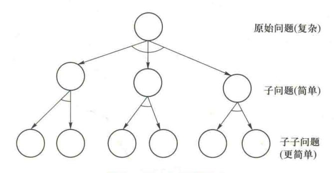

图 5.16 与树问题分解

### 2. 变换——或树

变换是将较难的问题变换为较易的等价或等效的问题。若一个困难问题可以等价变换为几个容易问题,则任何一个容易问题解决了,也就解决了原有的困难问题。这是或的逻辑关系。而这些容易问题还有可能进一步再等价变换为若干更容易的问题,如此下去,可形成问题变换的或树,如图 5.17 所示。

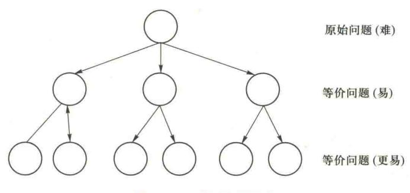

图 5.17 或树问题变换

{26}------------------------------------------------

在实际问题求解过程中,常常是兼用分解和变换方法,因而可用与树和或树相结合的图——与/或图表达法。

例 5.9 猴子和香蕉问题。如图 5.18 所示,设猴子位于 a 处,目的物香蕉挂在 c 处上方,猴子想吃香蕉,但高度不够,拿不着。在 b 处有可移动的台子,若猴子站在台子上,就可以拿到香蕉。问题是制定猴子的行动计划,使猴子能拿到香蕉。

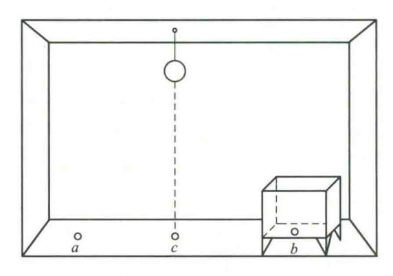

图 5.18 猴子和香蕉问题

先用状态空间法表示上述问题,设系统的状态用四元数组描述

$$S = (w, x, y, z)$$

其中, w:猴子所处水平位置;

x:台子所在水平位置;

y:猴子是否在台子上(y=1,在;y=0,不在);

z:猴子是否拿到香蕉(z=1,拿到;z=0,没有拿到)。

可能出现的状态为: $S_0 = (a,b,0,0)$ ; $S_1 = (b,b,0,0)$ ; $S_2 = (c,c,0,0)$ ; $S_3 = (c,c,1,0)$ ; $S_4 = (c,c,1,1)$ 。 其中, $S_0$ 为初始状态, $S_4$ 为目标状态。

允许的操作集为

$$F = \{f_1, f_2, f_3, f_4\}$$

其中, $f_1(u)$ 为猴子走到u处:

$$(w,x,0,z) \rightarrow (u,x,0,z)$$

 $f_2(v)$  为猴子推台子到 v 处:

$$(x,x,0,0) \rightarrow (v,v,0,0)$$

f. 为猴子爬上台子:

$$(x,x,0,z) \rightarrow (x,x,1,z)$$

f, 为猴子拿到香蕉:

$$(c,c,1,0) \rightarrow (c,c,1,1)$$

比较目标状态 $(S_4)$ 与初始状态 $(S_0)$ 的差异,来选择主操作。由于  $S_0$ 与  $S_4$ 中的 4个状态量

{27}------------------------------------------------

都有差异,相应的操作为 $f_1$ , $f_2$ , $f_3$  和 $f_4$ ,都可选为主操作。因此,可将原问题变换为 4 个新问题,而新问题又可分为几个子问题及子子问题。这一过程可用与/或树表示,如图 5. 19 所示。

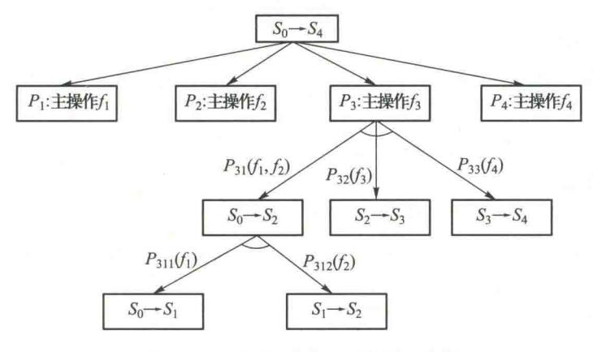

图 5.19 "猴子-香蕉"问题的与/或树

与普通图搜索算法相似,与/或图搜索算法有盲目搜索,如宽度优先、深度优先搜索法等;也有启发式搜索,如AO或AO\*搜索法。这里不赘述。

# 5.6 小结

### 1. 搜索的概念

在搜索中需要解决是否一定能找到一个解、是否终止运行、找到的解是否最佳解、搜索过程的时间与空间复杂性如何等基本问题。

搜索的方向有正向搜索、逆向搜索和双向搜索。

盲目搜索是在不具有对特定问题的任何有关信息的条件下,按固定的步骤(依次或随机调用操作算子)进行的搜索。

启发式搜索则是考虑特定问题领域可应用的知识,动态地确定调用操作算子的步骤,优先选择较适合的操作算子。

## 2. 状态空间知识表示方法

状态空间是利用状态变量和操作符号,表示系统或问题的有关知识的符号体系,状态空间是一个四元组 $(S,O,S_0,G)$ 。

任何类型的数据结构都可以用来描述状态,如符号、字符串、向量、多维数组、树和表格等。

从  $S_0$  结点到 G 结点的路径被称为求解路径。状态空间的一个解是一个有限的操作算子序列,它使初始状态转换为目标状态。

#### 3. 回溯策略

带回溯策略的搜索是从初始状态出发,不停地、试探性地寻找路径,若它遇到不可解结点就

{28}------------------------------------------------

回溯到路径中最近的父结点上,查看该结点是否还有其他的子结点未被扩展。若有,则沿这些子结点继续搜索;如果找到目标,就成功退出搜索,返回解题路径。

回溯是状态空间搜索的一个基本算法。各种图搜索算法,包括深度优先、宽度优先、最好优先搜索等,都有回溯的思想。

#### 4. 宽度优先搜索法

宽度优先搜索法是由  $S_0$  生成新状态,然后依次扩展这些状态,再生成新状态,该层扩展完后,再进入下一层,如此一层一层地扩展下去,直到搜索到目的状态(如果目的状态存在)。

#### 5. 深度优先搜索法

深度优先搜索法是从 $S_0$ 出发,沿一个方向一直扩展下去,直到达到一定的深度。如果未找到目的状态或无法再扩展时,便回溯到另一条路径继续搜索;若还未找到目的状态或无法再扩展时,再回溯到另一条路径搜索……

### 6. 启发式图搜索策略

在具体求解中,能够利用与该问题有关的信息来简化搜索过程,称此类信息为启发信息,而 称这种利用启发信息的搜索过程为启发式搜索。

A 搜索算法是寻找并设计一个与问题有关的 h(n) 及构造出 f(n) = g(n) + h(n),然后以 f(n) 的大小来排列待扩展状态的次序,每次选择 f(n) 值最小者进行扩展。

定义 h\*(n) 为状态 n 到目的状态的最优路径的代价。对于一具体问题,只要有解,则一定存在 h\*(n)。当要求估价函数中的 h(n) 都小于等于 h\*(n)时,A 搜索算法就成为 A\* 搜索算法。

# 思考题

- 5.1 什么是搜索? 有哪两大类不同的搜索方法? 两者的区别是什么?
- 5.2 什么是启发式搜索? 什么是启发信息?
- **5.3** 用状态空间法表示问题时,什么是问题的解,求解过程的本质是什么,什么是最优解,最优解唯 一吗?
- 5.4 请写出状态空间图的一般搜索过程。在搜索过程中 open 表和 closed 表的作用分别是什么,有何区别?
- 5.5 什么是盲目搜索? 主要有几种盲目搜索策略?
- **5.6** 在深度优先搜索中,每一个结点的子结点是按某种次序生成和扩展的,在决定生成子状态的最优次序时,应该用什么标准来衡量?
- **5.7** 宽度优先搜索与深度优先搜索有何不同?分析深度和宽度优先的优缺点。在何种情况下,宽度优先搜索优于深度优先搜索;在何种情况下,深度优先搜索优于宽度优先搜索?
- 5.8 什么是  $A^*$ 搜索算法? 它的估价函数是如何确定的?  $A^*$ 搜索算法与 A 搜索算法的区别是什么?

{29}------------------------------------------------

习题

- 5.1 修道士和野人的问题。设有 3 个修道士和 3 个野人来到河边,打算用一条船从河的左岸渡到河的右岸。但该船每次只能装载 2 个人,在任何岸边野人的数目都不得超过修道士的人数,否则修道士就会被野人吃掉。假设野人服从任何一种过河安排,如何规划过河计划才能把所有人安全地渡过河去? 用状态空间表示法表示修道士和野人的问题,画出状态空间图。
- 5.2 用状态空间搜索法求解农夫、狐狸、鸡、小米问题。农夫、狐狸、鸡、小米都在一条河的左岸,现在要把它们全部送到右岸去,农夫有一条船,过河时,除农夫外,船上至多能载狐狸、鸡和小米中的一样。狐狸要吃鸡,鸡要吃小米,除非农夫在那里。试规划出一个确保全部安全的过河计划。(提示: a. 用四元组(农夫、狐狸、鸡、小米)表示状态,其中每个元素都可为0或1。0表示在左岸,1表示在右岸。b. 每次过河的一种安排作为一个算符,每次过河都必须有农夫,因为只有他可以划船。)
- 5.3 用有界深度优先搜索方法求解图题 5.3 所示八数码难题。初始状态为  $S_0$ ,目标状态为  $S_1$ ,要求寻找从初始状态到目标状态的路径。

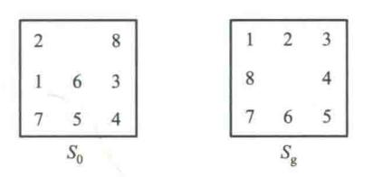

图题 5.3

- 5.4 用 A\*算法求解图题 5.3 所示八数码难题。
- 5.5 试证明定理:平行四边形的两条对角线彼此相交后相互等分。应用**与/或**树画出搜索求证步骤, 并指明构成此定理证明的解树。