{0}------------------------------------------------

# 第6章 进化算法及其应用

受自然界和生物界规律的启迪,人们根据其原理模仿设计了许多求解问题的算法,包括人工神经网络、模糊逻辑、遗传算法、DNA 计算、模拟退火算法、禁忌搜索算法、免疫算法、膜计算、量子计算、粒子群优化算法、蚁群算法、人工蜂群算法、人工鱼群算法以及细菌群体优化算法等,这些算法称为智能计算也称为计算智能(computational intelligence, CI)。智能优化方法通常包括进化计算和群智能等两大类方法,是一种典型的元启发式随机优化方法,已经广泛应用于组合优化、机器学习、智能控制、模式识别、规划设计、网络安全等领域,是21世纪有关智能计算中的重要技术之一。

进化算法是以达尔文的进化论思想为基础,通过模拟生物进化过程与机制的求解问题的自组织、自适应的人工智能技术,是一类借鉴生物界自然选择和自然遗传机制的随机搜索算法,这些方法本质上从不同的角度对达尔文的进化原理进行了不同的运用和阐述,非常适用于处理传统搜索方法难以解决的复杂和非线性优化问题。

本章首先简要介绍进化算法的概念,详细介绍基本遗传算法,这是进化算法的基本框架。然后介绍双倍体、双种群、自适应等比较典型的改进遗传算法及其应用。最后,介绍了差分进化算法和量子进化算法及其应用。

# 6.1 进化算法的产生与发展

# 6.1.1 进化算法的概念

进化算法(evolutionary algorithms, EA)是基于自然选择和自然遗传等生物进化机制的一种搜索算法。生物进化是通过繁殖、变异、竞争和选择实现的;而进化算法则主要通过选择、重组和变异这三种操作实现优化问题的求解。

进化算法是一个"算法簇",包括遗传算法(genetic algorithms, GA)、遗传规划(genetic programming)、进化策略(evolution strategies)和进化规划(evolution programming)等。尽管它有很多的变化,有不同的遗传基因表达方式,不同的交叉和变异算子,特殊算子的引用,以及不同的再生和选择方法,但它们产生的灵感都来自大自然的生物进化,进化算法的基本框架是遗传算法所描述的框架。

与普通搜索算法一样,进化算法也是一种迭代算法。不同的是在最优解的搜索过程中,普通搜索算法是从某个单一的初始点开始搜索,而进化算法是从原问题的一组解出发改进到另一组较好的解,再从这组改进的解出发进一步改进。而且,进化算法不是直接对问题的具体参数进行处理,而是要求当原问题的优化模型建立后,还必须对原问题的解进行编码。

{1}------------------------------------------------

进化算法在搜索过程中利用结构化和随机性的信息,使最满足目标的决策获得最大的生存可能,是一种概率型的算法。在进化搜索中用目标函数值的信息,可以不必用目标函数的导数信息或与具体问题有关的特殊知识,因而进化算法具有广泛的应用性,高度的非线性,易修改性和可并行性。因此,与传统的基于微积分的方法和穷举法等优化算法相比,进化算法是一种具有高鲁棒性和广泛适用性的全局优化方法,具有自组织、自适应、自学习的特性,能够不受问题性质的限制,能适应不同的环境和不同的问题,有效地处理传统优化算法难以解决的大规模复杂优化问题。

## 6.1.2 进化算法的生物学背景

进化算法类似于生物进化,需要经过长时间的成长演化,最后收敛到最优 化问题的一个或者多个解。因此,了解一些生物进化过程,有助于理解遗传算 法的工作过程。


"适者生存"揭示了大自然生物进化过程中的一个规律:最适合自然环境的个体产生后代的可能性大。生物进化的基本过程如图 6.1 所示。

进化算法的产生与 发展讲课视频▲

生物的遗传物质的主要载体是染色体(chromosome), DNA 是其中最主要的遗传物质。染色体中基因的位置称 作基因座,而基因所取的值又叫作等位基因。基因和基因 座决定了染色体的特征,也决定了生物个体(individual)的 性状。如头发的颜色是黑色、棕色或者金黄色等。

以一个初始生物群体(population)为起点,经过竞争后,一部分个体被淘汰而无法再进入这个循环圈,而另一部分则成为种群。竞争过程遵循生物进化中"适者生存,优胜劣汰"的

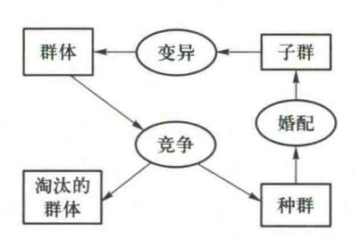

图 6.1 生物进化的基本过程

基本规律,所以都有一个竞争标准,或者生物适应环境的评价标准。适应程度高的并不一定进入种群,只是进入种群的可能性比较大。而适应程度低的并不一定被淘汰,只是进入种群的可能性比较小。这一重要特性保证了种群的多样性。

生物进化中种群经过婚配产生子代群体(简称子群)。在进化的过程中,可能会因为变异而产生新的个体。每个基因编码了生物机体的某种特征,如头发的颜色、耳朵的形状等。综合变异的作用,子群成长为新的群体而取代旧群体。在新的一个循环过程中,新的群体代替旧的群体而成为循环的开始。

# 6.1.3 进化算法的设计原则

一般来说,进化算法的求解包括以下几个步骤:给定一组初始解;评价当前这组解的性能;从 当前这组解中选择一定数量的解作为迭代后的解的基础;再对其进行操作,得到迭代后的解;若 这些解满足要求则停止,否则将这些迭代得到的解作为当前解重新操作。

设计进化算法的基本原则:

{2}------------------------------------------------

- (1)适用性原则:一个算法的适用性是指该算法所能适用的问题种类,它取决于算法所需的限制与假定。优化问题的不同,则相应的处理方式也不同。
- (2) 可靠性原则:一个算法的可靠性是指算法对于所设计的问题,以适当的精度求解其中大多数问题的能力。因为演化计算的结果带有一定的随机性和不确定性,所以,在设计算法时应尽量经过较大样本的检验,以确认算法是否具有较大的可靠度。
- (3) 收敛性原则:指算法能否收敛到全局最优。在收敛的前提下,希望算法具有较快的收敛速度。
- (4)稳定性原则:指算法对其控制参数及问题的数据的敏感度。如果算法对其控制参数或问题的数据十分敏感,则依据它们取值的不同,将可能产生不同的结果,甚至过早地收敛到某一局部最优解。所以,在设计算法时应尽量使得算法对一组固定的控制参数能在较广泛的问题的数据范围内解题,而且对一组给定的问题数据,算法对其控制参数的微小扰动不很敏感。
- (5) 生物类比原则:因为进化算法的设计思想是基于生物演化过程的,所以那些在生物界被认为是有效的方法及操作可以通过类比的方法引入到算法中,有时会带来较好的结果。

# 6.2 基本遗传算法

对于自然界中生物遗传与进化机理的模仿,针对不同的问题设计了许多不同的编码方法来表示问题的可行解,产生了多种不同的遗传算子来模仿不同环境下的生物遗传特性。这样,由不同的编码方法和不同的遗传算子就构成了各种不同的遗传算法。但这些遗传算法都具有共同的特点,即通过对生物遗传和进化过程中选择、交叉、变异机理的模仿,来完成对问题最优解的自适应搜索过程。基于这个共同的特点,Goldberg总结出了基本遗传算法(simple genetic algorithms,SGA),只使用选择算子、交叉算子和变异算子三种基本遗传算子,其遗传进化操作过程简单,容易理解,它给各种遗传算法提供了一个基本框架。进化算法的基本框架也是基本遗传算法所描述的框架。

## 6.2.1 遗传算法的基本思想

遗传算法主要借用生物进化中"适者生存"的规律。在遗传算法中,染色体对应的是数据或数组,通常是由一维的串结构数据来表示的。串上各个位置对应上述的基因座,而各位置上所取的值对应上述的等位基因。遗传算法处理的是染色体,或者称为基因型个体。一定数量的个体组成了群体。群体中个体的数量称为种群的大小,也叫种群的规模。各个个体对环境的适应程度叫适应度。适应度大的个体被选择进行遗传操作产生新个体,体现了生物遗传中适者生存的原理。选择两个染色体进行交叉产生一组新的染色体的过程,类似生物遗传中的婚配。编码的某一个分量发生变化的过程,类似生物遗传中的变异。

遗传算法包含两个数据转换操作,一个是从表现型到基因型的转换,将搜索空间中的参数或

{3}------------------------------------------------

解转换成遗传空间中的染色体或个体,这个过程称为编码(coding)。另一个是从基因型到表现型的转换,即将个体转换成搜索空间中的参数,这个过程称为译码(decode)。

遗传算法在求解问题时从多个解开始,然后通过一定的法则进行逐步迭代以产生新的解。这多个解的集合称为一个种群,记为p(t)。这里 t 表示迭代步,称为演化代。一般地,p(t) 中元素的个数在整个演化过程中是不变的,可将群体的规模记为N。p(t) 中的元素称为个体或染色体,记为 $x_1(t)$ , $x_2(t)$ ,……在进行演化时,要选择当前解进行交叉以产生新解。这些当前解称为新解的父解(parent),产生的新解称为后代解(offspring)。

## 6.2.2 遗传算法的发展历史

遗传算法的研究兴起在 20 世纪 80 年代末和 90 年代初,但它的历史起源可追溯到 60 年代初期。早期的研究大多以对自然遗传系统的计算机模拟为主,其特点是侧重于对某些复杂操作的研究。虽然其中像自动博弈、生物模拟、模式识别和函数优化等给人以深刻的印象,但总的来说,这是一个无明确目标的发展时期,缺乏带有指导性的理论和计算工具的开拓。这种现象直到 20 世纪 70 年代中期,由于美国密歇根大学 J.Holland 和 DeJong 的创造性研究成果的发表才得到改观。当然,早期的研究成果对于遗传算法的发展仍然有一定的影响,尤其是其中一些有代表性的技术和方法已被后来的遗传算法所吸收和发展。

在遗传算法作为搜索方法用于人工智能系统中之前,已有不少生物学家用计算机来模拟自然遗传系统,尤其是 Fraser 的模拟研究。Fraser 于 1962 年提出了和现在的遗传算法十分相似的概念和思想,但是,他和其他一些学者并未认识到自然遗传算法可以转化为人工遗传算法,而 Holland 教授和他的学生不久就认识到这一转化的重要性。Holland 认为比起寻找这种或那种具体的求解问题的方法来说,开拓一种能模拟自然选择遗传机制的带有一般性的理论和方法更有意义。在这一时期,Holland 不但发现了基于适应度的人工遗传选择的基本作用,而且还对群体操作等进行了认真的研究。1965 年,他首次提出了人工遗传操作的重要性,并把这些应用于自然系统和人工系统中。

1967年, Holland 教授的学生 Bagley 在他的博士论文中首次提出了遗传算法这一术语,并讨论了遗传算法在博弈中的应用。他所提出的选择、交叉和变异操作与目前遗传算法中的相应操作十分接近,尤其是他对选择做了十分有意义的研究。他认识到,在遗传进化过程的前期和后期,选择概率应合适地变动。为此,他引入了适应度定标概念。他还首次提出了遗传算法自我调整概念,即把交叉和变异的概率融于染色体本身的编码中,从而可使算法自我调整优化。尽管 Bagley 没有进行计算机模拟实验,但这些思想对于后来遗传算法的发展具有重要的意义。

在同一时期,Rosenberg 也对遗传算法进行了研究。他的研究依然是以模拟生物进化为主,但他在遗传操作方面提出了不少独特的设想。1970 年,Cavicchio 把遗传算法应用于模式识别中,实际上他并未直接涉及模式识别,而仅用遗传算法设计一组应用于识别的检测器。Cavicchio对于遗传操作以及遗传算法的自动调整也做了不少有特色的研究。

{4}------------------------------------------------

1971 年, Hollstien 第一个把遗传算法用于函数优化。他在论文《计算机控制系统中人工 遗传自适应方法》中阐述了遗传算法用于数字反馈控制的方法,但实际上,主要讨论了对于二 变量函数的优化问题,其中,对于优势基因控制、交叉和变异以及各种编码技术进行了深入的 研究。

1975年是遗传算法研究历史上十分重要的一年。这一年,美国 J. Holland 出版了他的专 著《自然系统和人工系统的适配》,系统地阐述了遗传算法的基本理论和方法,并提出了对遗 传算法的理论研究和发展极为重要的模式理论。同年, DeJong 完成了重要论文《遗传自适应 系统的行为分析》,把 Holland 的模式理论与他的计算实验结合起来。这是遗传算法发展中的 又一个里程碑。尽管 DeJong 和 Hollstien 一样主要侧重于函数优化的应用研究,但他将选择、 交叉和变异操作进一步完善和系统化,同时又提出了诸如代沟等新的遗传操作技术。DeJong 的研究工作为遗传算法及其应用打下了坚实的基础,他所得出的许多结论具有普遍的指导 意义。

20 世纪80年代以后,遗传算法进入兴盛发展时期,无论是理论研究还是应用研究都成了十 分热门的课题。遗传算法广泛应用于自动控制、生产计划、图像处理、机器人等研究领域。


遗传算法中包含了五个基本要素:参数编码、初始群体的设定、适应度函数 的设计、遗传操作设计、控制参数设定。

遺传编码讲课视

遗传算法求解问题不是直接作用在问题的解空间上,而是作用于解的某种 编码。因此,必须通过编码将要求解的问题表示成遗传空间的染色体或者个 体。它们由基因按一定结构组成。由于遗传算法的鲁棒性,对编码表示方式的 要求一般并不苛刻,但有时对算法的性能、效率等会产生很大影响。

### 1. 位串编码

将问题空间的参数编码为一维排列的染色体的方法,称为一维染色体编码方法。一维染色 体编码中最常用的符号集是二值符号集 [0,1],即采用二进制编码。

### (1) 二进制编码

二进制编码是用若干二进制数表示一个个体,将原问题的解空间映射到位串空间 B={0,1} 上,然后在位串空间上进行遗传操作。

设某一个参数 u 的变化范围为  $[u_{min}, u_{max}]$ , 其编码后的值为 a, 编码长度为 n, 则编码精度为

$$\delta = \frac{u_{\text{max}} - u_{\text{min}}}{2^n - 1} \tag{6.1a}$$

参数 u 与其编码存在如下关系

$$u = u_{\min} + \frac{a(u_{\max} - u_{\min})}{2^n - 1}$$
 (6.1b)

二进制编码的优点:二进制编码类似于生物染色体的组成,从而使算法易于用生物遗传理论

{5}------------------------------------------------

来解释,并使得遗传操作如交叉、变异等很容易实现。另外,采用二进制编码时,算法处理的模式数最多。

### 二进制编码的缺点:

- ① 相邻整数的二进制编码可能具有较大的 Hamming 距离。例如,15 和 16 的二进制表示为 01111 和 10000,因此,算法要从 15 改进到 16 则必须改变所有的位。这种缺陷造成了 Hamming 悬崖(Hamming cliffs),将降低遗传算子的搜索效率。
- ②二进制编码时,一般要先给出求解的精度。但求解的精度确定后,就很难在算法执行过程中进行调整,从而使算法缺乏微调(fine-tuning)的功能。若在算法一开始就选取较高的精度,那么串长就很大,这样也将降低算法的效率。
  - ③ 在求解高维优化问题时,二进制编码串将非常长,从而使得算法的搜索效率很低。

### (2) Gray 编码

Gray 编码是将二进制编码通过一个变换进行转换得到的编码。设二进制串 $\langle \beta_1 \beta_2 ... \beta_n \rangle$ 对应的 Gray 串 $\langle \gamma_1 \gamma_2 ... \gamma_n \rangle$ ,则从二进制编码到 Gray 编码的变换为

$$\gamma_k = \begin{cases} \beta_1, & k = 1 \\ \beta_{k-1} \oplus \beta_k, & k > 1 \end{cases}$$
 (6.2a)

式中, ①表示模 2 的加法。从一个 Gray 串到二进制串的变换为

$$\beta_k = \sum_{i=1}^k \gamma_i \pmod{2} = \begin{cases} \gamma_1, & k=1\\ \beta_{k-1} \oplus \gamma_k, & k>1 \end{cases}$$
 (6.2b)

Gray 编码的优点是克服了二进制编码的 Hamming 悬崖的缺点。因为任意两个正整数的差是这两个正整数所对应的 Gray 码值之间的 Hamming 距离。

#### 2. 实数编码

为克服二进制编码的缺点,对问题的变量是实向量的情形,可以直接采用实数编码。

实数编码是用若干实数表示一个个体,然后在实数空间上进行遗传操作。

采用实数表达法不必进行数制转换,可直接在解的表现型上进行遗传操作。从而可引入与问题领域相关的启发式信息来增加算法的搜索能力。近年来,遗传算法在求解高维或复杂优化问题时一般使用实数编码。

### 3. 多参数级联编码

对于多参数优化问题的遗传算法,常采用多参数级联编码。其基本思想是把每个参数先进行二进制或其他编码得到子串,再把这些子串连成一个完整的染色体。多参数级联编码中的每个子串对应各自的编码参数,所以,可以有不同的串长度和参数的取值范围。

### 4. 有序串编码

对很多组合优化问题,目标函数的值不仅与表示解的字符串的值有关,而且与其所在字符串的位置有关。这样的问题称为有序问题。例如,采用顶点排列表示的旅行商问题即是一个纯有序问题。用遗传算法求解有序问题时,传统的遗传操作将可能产生非法的后代。因此,对这类问

{6}------------------------------------------------

题需要针对具体问题专门设计有效且能保证后代合法的遗传算子。这类编码方案较多地用在组合优化问题之中。

#### 5. 结构式编码

在自然界生物进化过程中,染色体的长度不是固定不变的,越是高等生物其染色体越长。基于这种机制,Goldberg等提出一种称为 MessyGA(mGA)的遗传算法编码方法。

### 6.2.4 群体设定

由于遗传算法是对群体进行操作的,所以,必须为遗传操作准备一个由若干初始解组成的初始群体。群体设定主要包括以下两个方面:初始种群的产生;种群规模的确定。

### 1. 初始种群的产生

遗传算法中初始群体中的个体可以是随机产生的,但最好采用如下策略设定:

- ① 根据问题固有知识,设法把握最优解所占空间在整个问题空间中的分布范围,然后,在此分布范围内设定初始群体。
- ② 先随机产生一定数目的个体,然后从中挑选最好的个体加到初始群体中。这种过程不断 迭代,直到初始群体中个体数目达到了预先确定的规模。

#### 2. 种群规模的确定

#### 群体中个体的数量称为种群规模。

群体规模影响遗传优化的结果和效率。当群体规模太小时,遗传算法的优化性能一般不会 太好,容易陷入局部最优解;而当群体规模太大时,则计算复杂。

群体规模的确定受遗传操作中选择操作的影响很大。模式定理表明:若群体规模为M,则遗传操作可从这M个个体中生成和检测M3个模式,并在此基础上能够不断形成和优化积木块,直到找到最优解。

显然,群体规模越大,遗传操作所处理的模式就越多,产生有意义的积木块并逐步进化为最优解的机会就越高。群体规模太小,会使遗传算法的搜索空间范围有限,因而搜索有可能停止在未成熟阶段,出现未成熟收敛现象,使算法陷入局部最优解。因此,必须保持群体的多样性,即群体规模不能太小。

另一方面,群体规模太大会带来若干弊病:一是群体越大,其适应度评估次数增加,所以计算量也增加,从而影响算法效率;二是群体中个体生存下来的概率大多采用和适应度成比例的方法,当群体中个体非常多时,少量适应度很高的个体会被选择而生存下来,但大多数个体却被淘

汰,这会影响配对库的形成,从而影响交叉操作。

## 6.2.5 适应度函数

遗传算法遵循自然界优胜劣汰的原则,在进化搜索中基本上不用外部信息,而是用适应度值表示个体的优劣,作为遗传操作的依据。个体的适应度高,则被选择的概率就高,反之就低。适应度函数(fitness function)是用来区分群

适应度函数讲课

{7}------------------------------------------------

体中的个体好坏的标准,是算法演化过程的驱动力,是进行自然选择的唯一依据。改变种群内部结构的操作都是通过适应值加以控制的。因此,适应度函数设计非常重要。

在具体应用中,适应度函数的设计要结合求解问题本身的要求而定。一般而言,适应度函数 是由目标函数变换得到的,但要保证适应度函数是最大化问题和非负性。下面讨论将目标函数 变换成适应度函数的方法。

### 1. 将目标函数映射成适应度函数的方法

最直观的方法是直接将待求解优化问题的目标函数作为适应度函数。

若目标函数 f(x) 为最大化问题,则适应度函数可以取为

$$Fit(f(x)) = f(x) \tag{6.3a}$$

若目标函数 f(x) 为最小化问题,则适应度函数可以取为

$$Fit(f(x)) = \frac{1}{f(x)} \tag{6.3b}$$

由于遗传算法中,要比较个体的适应度进行排序,并在此基础上计算选择概率,所以,适应度 函数的值要取正值。但在许多优化问题求解中,不能保证所有的目标函数值都有非负值。因此, 在不少场合采用问题的目标函数作为个体的适应性度量时,必须将目标函数转换为求最大值的 形式,而且保证函数值必须非负。转换可采用以下的方法进行:

若目标函数为最小化问题,则适应度函数可以取为

$$Fit(f(x)) = \begin{cases} C_{\text{max}} - f(x) & f(x) < C_{\text{max}} \\ 0 & \text{其他情况} \end{cases}$$
 (6.4a)

式中, $C_{\max}$ 为 f(x)的最大估计值,可以是一个合适的输入值,也可采用迄今为止过程中 f(x)的最大值或当前群体中 f(x)的最大值,当然  $C_{\max}$ 也可以是前 K 代中 f(x)的最大值。显然,存在多种方式来选择系数  $C_{\max}$ ,但  $C_{\max}$ 最好与群体无关。

若目标函数为最大化问题,则适应度函数可以取为

$$Fit(f(x)) = \begin{cases} f(x) - C_{\min} & f(x) > C_{\min} \\ 0 & 其他情况 \end{cases}$$
 (6.4b)

式中, $C_{\min}$ 为 f(x)的最小估计值。 $C_{\min}$ 可以是一个合适的输入值,或者是当前一代或前 K 代中 f(x)的最小值,也可以是群体方差的函数。

上述方法称为界限构造法。使用这些方法时,有时存在界限值预选估计困难或者不能精确估计的问题。转换也可以采用以下的方法进行:

若目标函数为最小化问题,则适应度函数可以取为

$$Fit(f(x)) = \frac{1}{1+c+f(x)}$$
  $c \ge 0$ ,  $c+f(x) \ge 0$  (6.5a)

若目标函数为最大化问题,则适应度函数可以取为

$$Fit(f(x)) = \frac{1}{1+c-f(x)} \qquad c \ge 0, \quad c-f(x) \ge 0$$

$$(6.5b)$$

{8}------------------------------------------------

式中,c为目标函数界限的保守估计值。

### 2. 适应度函数的尺度变换

在遗传算法中,将所有妨碍适应度值高的个体产生,从而影响遗传算法正常工作的问题统称为欺骗问题(deceptive problem)。

在设计遗传算法时,群体的规模一般在几十至几百,与实际物种的规模相差很远。因此,个体繁殖数量的调节在遗传操作中就显得比较重要。如果群体中出现了超级个体,即该个体的适应值大大超过群体的平均适应值,则当按照适应值比例进行选择时,该个体很快就会在群体中占有绝对的比例,从而导致算法较早地收敛到一个局部最优点,这种现象称为过早收敛,是一种欺骗问题。为了防止出现过早收敛问题应该缩小这些个体的适应度,以降低这些超级个体的竞争力。另一方面,在搜索过程的后期,虽然群体具有足够的多样性,但群体的平均适应值可能会接近群体的最优适应值群体中实际上已不存在竞争,从而搜索目标也难以得到改善,出现了停滞现象,也是一种欺骗问题。在这两种情况下,都应该改变原始适应值的比例关系,以提高个体之间的竞争力。

对适应度函数值域的某种映射变换称为适应度函数的尺度变换(fitness scaling)或者定标。

#### (1) 线性变换

设原适应度函数为f,定标后的适应度函数为f',则线性变换可采用下式表示

$$f' = af + b \tag{6.6}$$

式中,系数 a 和 b 可以有多种途径设定,但要满足两个条件:

① 变换后的适应度的平均值  $f'_{avg}$  要等于原适应度平均值  $f_{avg}$  ,以保证适应度为平均值的个体在下一代的期望复制数为 1,即

$$f'_{avg} = f_{avg} \tag{6.7a}$$

② 变换后适应度函数的最大值  $f'_{max}$  要等于原适应度函数平均值  $f_{avg}$  的指定倍数,以控制适应度最大的个体在下一代中的复制数。

$$f'_{\text{max}} = C_{\text{mult}} \cdot f_{\text{avg}} \tag{6.7b}$$

式中, $C_{mult}$ 是为得到所期待的最优群体个体的复制数。实验表明,对于不太大的群体 ( $n = 50 \sim 100$ ), $C_{mult}$ 可在 1.2~2.0 范围内取值。

根据上述条件,可以确定线性变换的系数。

$$a = \frac{(C_{mult} - 1)f_{avg}}{f_{max} - f_{avg}}$$
 (6.8a)

$$b = \frac{(f_{\text{max}} - C_{\text{mult}} f_{\text{avg}}) f_{\text{avg}}}{f_{\text{max}} - f_{\text{avg}}}$$
(6.8b)

线性变换法变换了适应度之间的差距,保持了种群的多样性,计算简便,易于实现。如果种群里某些个体适应度远远低于平均值时,有可能出现变换后适应度值为负的情况。为满足最小适应度值非负的条件,可以进行如下变换:

{9}------------------------------------------------

$$a = \frac{f_{avg}}{f_{avg} - f_{\min}} \tag{6.9a}$$

$$b = \frac{-f_{\min} f_{avg}}{f_{avg} - f_{\min}}$$
 (6.9b)

#### (2) 幂函数变换法

变换公式为

$$f' = f^K \tag{6.10}$$

式中,幂指数 K 与求解问题有关,而且在算法过程中可按需要修正。

#### (3) 指数变换法

变换公式为

$$f' = e^{-af}$$
 (6.11)

这种变换方法的基本思想来源于模拟退火过程,式中的系数 a 决定了复制的强制性,其值越小,复制的强制性就越趋向于那些具有最大适应度的个体。

### 6.2.6 选择

选择操作也称为复制(reproduction)操作是从当前群体中按照一定概率选出优良的个体,使它们有机会作为父代繁殖下一代子孙。判断个体优良与否的准则是各个个体的适应度值。显然这一操作借用了达尔文适者生存的进化原则,即个体适应度越高,其被选择的机会就越多。选择操作的实现方法很多。这里,介绍几种常用的选择方法。


选择操作讲课视

#### 1. 个体选择概率分配方法

在遗传算法中,哪个个体被选择进行交叉是按照概率进行的。适应度大的个体被选择的概率大,但不是说一定能够选上。同样,适应度小的个体被选择的概率小,但也可能被选上。 所以,首先要根据个体的适应度确定被选择的概率。个体选择概率的常用分配方法有以下两种:

### (1) 适应度比例方法

适应度比例方法(fitness proportional model)也称为蒙特卡罗法(Monte Carlo),是目前遗传算法中最基本也是最常用的选择方法。适应度比例法中,各个个体被选择的概率和其适应度值成比例。设群体规模大小为M,个体i的适应度值为 $f_i$ ,则这个个体被选择的概率为

$$p_{si} = \frac{f_i}{\sum_{i=1}^{M} f_i}$$
 (6. 12)

#### (2) 排序方法

排序方法(rank-based model)是计算每个个体的适应度后,根据适应度大小顺序对群体中个体进行排序,然后把事先设计好的概率按排序分配给个体,作为各自的选择概率。在排序方法

{10}------------------------------------------------

中,选择概率仅仅取决于个体在种群中的序位,而不是实际的适应度值。排在前面的个体有较多的被选择的机会。

它的优点是克服了适应值比例选择策略的过早收敛和停滞现象,而且对于极大值或极小值问题,不需要进行适应值的标准化和调节,可以直接使用原始适应值进行排名选择。排序方法比比例方法具有更好的鲁棒性,是一种比较好的选择方法。

### ①线性排序。

线性排序选择最初由 J.E.Baker 提出,他首先假设群体成员按适应值大小从好到坏依次排列为 $x_1,x_2,\cdots,x_M$ ,然后根据一个线性函数给第i个个体 $x_i$ 分配选择概率 $p_i$ 

$$p_i = \frac{a - bi}{M(M + 1)} \tag{6.13}$$

式中, a, b是常数。

② 非线性排序。

Z.Michalewicz 提出将群体成员按适应值从好到坏依次排列,并按下式分配选择概率

$$p_{i} = \begin{cases} q \ (1-q)^{i-1} & i = 1, 2, \dots, M-1 \\ (1-q)^{M-1} & i = M \end{cases}$$
 (6.14)

式中, i 为个体排序序号。q 是一个常数, 表示最好的个体的选择概率。

也可使用其他非线性函数来分配选择概率 p,,只要满足以下条件:

a. 若  $P = \{x_1, x_2, \cdots, x_M\}$  且  $f(x_1) \ge f(x_2) \ge \cdots \ge f(x_M)$ ,则分配的概率  $p_i$  满足  $p_1 \ge p_2 \ge \cdots \ge p_M$ 。

b. 
$$\sum_{i=1}^{M} p_i = 1_{\circ}$$

#### 2. 选择个体方法

选择操作是根据个体的选择概率确定哪些个体被选择进行交叉、变异等操作。基本的选择方法如下。

#### (1) 轮盘赌选择

轮盘赌选择(roulette wheel selection)策略在遗传算法中使用得最多。

在轮盘赌选择方法中先按个体的选择概率产生一个轮盘,轮盘每个区的角度与个体的选择概率成比例,然后产生一个随机数,它落入轮盘的哪个区域就选择相应的个体交叉。

显然,选择概率大的个体被选中的可能性大,获得交叉的机会就大。

在实际计算时,可以按照个体顺序求出每个个体的累积概率,然后产生一个随机数,它落入累积概率的哪个区域就选择相应的个体交叉。例如,表 6.1 所示 11 个个体的适应度、选择概率和累积概率。为了选择交叉个体,需要进行多轮选择。例如,第 1 轮产生一个随机数为 0.81,落在第 5 个和第 6 个个体之间,则第 6 个个体被选中。第 2 轮产生一个随机数为 0.32,落在第 1 个和第 2 个个体之间,则第 2 个个体被选中。依此类推。

{11}------------------------------------------------

| 个体   | 1     | 2     | 3     | 4     | 5     | 6     | 7    | 8     | 9     | 10    | 11   |
|------|-------|-------|-------|-------|-------|-------|------|-------|-------|-------|------|
| 适应度  | 2. 0  | 1.8   | 1.6   | 1.4   | 1.2   | 1.0   | 0.8  | 0.6   | 0.4   | 0. 2  | 0. 1 |
| 选择概率 | 0. 18 | 0. 16 | 0. 15 | 0. 13 | 0. 11 | 0.09  | 0.07 | 0.05  | 0. 03 | 0. 02 | 0.01 |
| 累积概率 | 0.18  | 0.34  | 0.49  | 0.62  | 0.73  | 0. 82 | 0.89 | 0. 94 | 0.97  | 0.99  | 1.00 |

表 6.1 个体适应度、选择概率和累积概率

### (2) 锦标赛选择方法

锦标赛选择方法(tournament selection model)是从群体中随机选择 k 个个体,将其中适应度最高的个体保存到下一代。这一过程反复执行,直到保存到下一代的个体数达到预先设定的数量为止。参数 k 称为竞赛规模。

锦标赛选择方法的优点是克服了基于适应值比例选择和基于排名的选择在群体规模很大时,其额外计算量(如计算总体适应值或排序)很大的问题。它常常比轮盘赌选择得到更加多样化的群体。

显然,这种方式也使得适应值好的个体具有较大的生存机会。同时,由于它只使用适应值的相对值作为选择的标准,而与适应值的数值大小不成直接比例,从而也能避免超级个体的影响,一定程度上避免了过早收敛和停滞现象的发生。

作为锦标赛选择方法的一种特殊情况,随机竞争方法(stochastic tournament)是每次按赌轮选择方法选取一对个体,然后让这两个个体进行竞争,适应度高者获胜。如此反复,直到选满为止。

## (3) (μ,λ) 和 μ+λ 选择

 $(\mu, \lambda)$  选择是先从规模为 $\mu$  的群体中随机选取个体通过交叉和变异生成 $\lambda$ ( $\geq \mu$ )个后代,然后再从这些后代中选取 $\mu$ 个最优的后代作为新一代种群。

 $\mu+\lambda$  选择则是从这些后代与其父体共 $\mu+\lambda$  中选取 $\mu$ 个最优的后代。

### (4) Boltzmann 锦标赛选择

首先在种群中随机选取两个个体  $x_1, x_2, \ddot{A} \mid f(x_1) - f(x_2) \mid \geq \theta$  则选择适应值好的作为胜者,否则计算概率  $p = \exp[-|f(x_1) - f(x_2)|/T]$ ,若  $p > \operatorname{random}[0,1)$ ,选择差解,否则选择好解。这里, $\operatorname{random}[0,1)$ 表示区间[0,1)上的一个均匀随机数, $\theta$ ,T 是两个控制参数。 $\theta$  称为阈值,是一个常数,而 T 则类似模拟退火算法中的温度,它随着演化的推进逐渐减小。

该算法的缺点是对具体的问题如何选择 T 及  $\theta$  的冷却进度,才能取得较好的结果,是一个比较难的问题。

### (5) 最佳个体保存方法

最佳个体保存方法或称为精英选拔方法(elitist model)是把群体中适应度最高的一个或者多个个体不进行交叉而直接复制到下一代中,保证遗传算法终止时得到的最后结果一定是历代出现过的最高适应度的个体。使用这种方法能够明显提高遗传算法的收敛速度,但可能使种群过快收敛,从而只找到局部最优解。实验结果表明:保留种群个体总数的2%~5%的适应度最高的

{12}------------------------------------------------

个体,效果最理想。

在使用其他选择方法时,一般都同时使用最佳个体保存方法,以保证不会丢失最优个体。


交叉与变异操作 讲课视频▲

## 6.2.7 交叉

遗传算法中起核心作用的是交叉算子,也称为基因重组(recombination)。 交叉操作是对经过选择操作的两个个体进行的。采用的交叉方法应能够使父 串的特征遗传给子串。子串应能够部分或者全部地继承父串的结构特征和有 效基因。

### 1. 基本的交叉算子

### (1) 一点交叉

一点交叉(single-point crossover)又称为简单交叉。其具体操作是:在个体串中随机设定一个交叉点,实行交叉时,该点前或后的两个个体的部分结构进行互换,并生成两个新的个体。

### (2) 二点交叉

二点交叉(two-point crossover)的操作与一点交叉类似,只是设置了两个交叉点(仍然是随机设定).将两个交叉点之间的码串相互交换。

类似于二点交叉,可以采用多点交叉(multiple-point crossover)。

### (3) 均匀交叉

均匀交叉(uniform crossover)或一致交叉是按照均匀概率抽取一些位,每一位是否被选取都是随机的,并且独立于其他位。然后将两个个体被抽取位互换组成两个新个体。

基本的交叉算子还有洗牌交叉(shuffle crossover)、缩小代理交叉(crossover with reduced surrogate)等。

下面从模式角度分析点式交叉和均匀交叉算子的优缺点:

- (1)由于点式交叉破坏模式的概率小,从而在搜索过程中能以较大的概率保护好的模式,但它能搜索到的模式数也较小。这样,在群体规模较小时,其搜索能力将受到一定的影响。
- (2)由于均匀交叉在交换位时并不考虑其所在的位置,破坏模式的概率较大。但它能搜索到一些点式交叉无法搜索到的模式。因此,当群体规模较小时,使用均匀交叉比较合适,而当规模较大时,群体内在的多样性使得没有必要搜索更多的模式,可使用点式交叉以加快收敛的速度。

### 2. 修正的交叉方法

由于交叉,可能出现不满足约束条件的非法染色体。为解决这一问题,可以采取构造惩罚函数的方法,但试验效果不佳,使本已复杂的问题更加复杂。另一种处理方法是对交叉、变异等遗传操作进行适当的修正,使其满足优化问题的约束条件。例如,在 TSP 问题中采用部分匹配交叉(partially matched crossover, PMX),顺序交叉(order crossover, OX)和循环交叉(cycle crossover, CX)等。这些方法对于其他一些问题也同样适用。

{13}------------------------------------------------

#### (1) 部分匹配交叉 PMX

PMX 是由 Goldberg D.E.和 R.Lingle (1985)提出的。在 PMX 操作中,先依据均匀随机分布产生两个位串交叉点,定义这两点之间的区域为一匹配区域,并使用位置交换操作交换两个父串的匹配区域。例如,在任务排序问题中,两父串及匹配区域为

首先交换 A 和 B 的两个匹配区域,得到

$$A'=9$$
 8 4 | 2 3 9 | 1 3 2  $B'=8$  7 1 | 5 6 7 | 5 4 6

显然, A'和 B'中出现重复的任务, 所以是非法的调度。解决的方法是将 A'和 B'中匹配区域外出现的重复任务, 按照匹配区域内的位置映射关系进行交换, 从而使排列成为可行调度。

#### (2) 顺序交叉 OX

与 PMX 相似, Davis L. (1985)提出了一种 OX 法。在  $A \setminus B$  中选择匹配区域, 然后根据匹配区域的映射关系, 在其区域外的相应位置标记 H, 得到

$$A' = H \quad 8 \quad 4 \quad | \quad 5 \quad 6 \quad 7 \quad | \quad 1 \quad H \quad H$$
  
 $B' = 8 \quad H \quad 1 \quad | \quad 2 \quad 3 \quad 9 \quad | \quad H \quad 4 \quad H$ 

再移动匹配区至起点位置,且在其后预留相等于匹配区域的空间(H数目),然后将其余的码按 其相对次序排列在预留区后面,得到

最后将父串  $A \setminus B$  的匹配区域相互交换,并放置到  $A'' \setminus B''$ 的预留区内,即可得到两个子代:

### (3) 循环交叉 CX

Smith D.(1985)提出的 CX 方法与 PMX 方法和 OX 方法有不同之处。CX 是以父串的特征作为参考,使 TSP 问题中每个城市在约束条件下进行重组。

采用较大的交叉概率  $P_c$  可以增强遗传算法开辟新的搜索区域的能力,但高性能模式遭到破坏的可能性增加。采用太低的交叉概率会使搜索陷入迟钝状态。 $P_c$  一般取为 0.25~1.00。

## 3. 实数编码的交叉方法

对于实数编码,可以采用下列交叉方法。

### (1) 离散交叉

离散交叉(discrete crossover)分为部分离散交叉和整体离散交叉。

部分离散交叉是在父解向量中选择一部分分量(如一个分量或从某分量以后的所有分量),

{14}------------------------------------------------

然后交换这些分量,这相当于二进制的点式交叉。

整体离散交叉则以 0.5 的概率交换父体  $s_1$ 与  $s_2$ 的所有分量,这有点像二进制编码的均匀性交叉,通过生成模板的形式来实现。

### (2) 算术交叉

算术交叉(arithmetical crossover)可分为部分算术交叉和整体算术交叉。

部分算术交叉是先在父解向量中选择一部分分量,如第k个分量以后的所有分量,然后生成n-k个[0,1]区间的随机数,并将两个后代定义为

$$\begin{split} s_z &= \left( \left( v_1^{(1)}, \cdots, v_k^{(1)}, a_{k+1} v_{k+1}^{(1)} + \left( 1 - a_{k+1} \right) v_{k+1}^{(2)}, \cdots, a_n v_n^{(1)} + \left( 1 - a_n \right) v_n^{(2)} \right) \\ s_w &= \left( \left( v_1^{(2)}, \cdots, v_k^{(2)}, a_{k+1} v_{k+1}^{(2)} + \left( 1 - a_{k+1} \right) v_{k+1}^{(1)}, \cdots, a_n v_n^{(2)} + \left( 1 - a_n \right) v_n^{(1)} \right) \end{split} \tag{6.15}$$

这里,可取  $a_{k+1} = \cdots = a_n$ ,从而只需生成一个随机数。

整体算术交叉是先生成 n 个区间的随机数,则后代分别定义为

$$z_{i} = a_{i} v_{i}^{(1)} + (1 - a_{i}) v_{i}^{(2)} = v_{i}^{(2)} + a_{i} (v_{i}^{(1)} - v_{i}^{(2)})$$

$$w_{i} = a_{i} v_{i}^{(2)} + (1 - a_{i}) v_{i}^{(1)} = v_{i}^{(1)} + a_{i} (v_{i}^{(2)} - v_{i}^{(1)})$$

$$(6.16)$$

这里同样可取  $a_1 = a_2 = \cdots = a_n$ 。

### 6.2.8 变异

变异的主要目的是维持群体的多样性,为选择、交叉过程中可能丢失的某些遗传基因进行修 复和补充。变异算子的基本内容是对群体中的个体串的某些基因座上的基因值作变动。变异操 作是按位进行的,即把某一位的内容进行变异。主要变异方法如下。

#### 1. 整数编码的变异方法

#### (1) 位点变异

位点变异是指对群体中的个体码串,随机挑选一个或多个基因座,并对这些基因座的基因值以变异概率  $P_m$  作变动。为了消除非法性,将其他基因所在的基因座上的基因变为被选择的基因。对于二进制编码的个体来说,若某位原为 0,则通过变异操作就变成了 1,反之亦然。对于整数编码,将被选择的基因变为以概率选择的其他基因。

### (2) 逆转变异

在个体码串中随机选择两点(称为逆转点),然后将两个逆转点之间的基因值以逆向排序插 入到原位置中。

(3) 插入变异

在个体码串中随机选择一个码,然后将此码插入随机选择的插入点中间。

(4) 互换变异

随机选取染色体的两个基因进行简单互换。

(5) 移动变异

随机选取一个基因,向左或者向右移动一个随机位数。

(6) 自适应变异

{15}------------------------------------------------

与位点变异的操作内容类似,唯一不同的是变异概率  $P_m$  不是固定不变,而是随群体中个体的多样性程度而自适应调整。

在遗传算法中,变异属于辅助性的搜索操作。变异概率  $P_m$  一般不能大,以防止群体中重要的、单一的基因被丢失。事实上,变异概率太大将使遗传算法趋于纯粹的随机搜索。通常取变异概率  $P_m$  为 0.001 左右。

#### 2. 实数编码的变异方法

对于实数编码,可以采用下列变异方法。

### (1) 均匀性变异

设  $s = (v_1, v_2, \dots, v_k, \dots, v_n)$  是父解, $s' = (v_1, v_2, \dots, v_k', \dots, v_n)$  是变异产生的后代。均匀性变异则是先在父解向量中随机地选择一个分量,假设是第 k 个,然后在区间[ $a_k$ ,  $b_k$ ] 中以均匀概率随机选择一个数  $v'_k$  代替  $v_k$  以得到 s',即

$$s' = \begin{cases} v_i, & i \neq k \\ v'_k, & i = k \end{cases}$$
 (6.17)

也可以先确定一些较小的区间 $[-A_i,A_i]$ , $i=1,2,\cdots,n$ ,对  $v_k$  变异时,均匀随机地在 $[-A_i,A_i]$ 中取一个数 y,并令  $v'_k=v_k+y$ 。这里  $A_i$  称为变异域,一般取区间 $[a_i,b_i]$ 长度的某个百分比,如取  $A_i=0.1(b_i-a_i)$ 。

### (2) 正态性变异

设群体中的一个个体由一个解向量  $s = (v_1, v_2, \dots, v_n)$  和一个摄动向量  $\sigma = (\sigma_1, \sigma_2, \dots, \sigma_n)$  组成。这个摄动向量是变异解向量的控制参数,并且它自己也要不断进行变异。假设 $(s, \sigma)$ 是被选个体,正态性变异(normal distributed mutation)按下式变异获得新个体 $(s', \sigma')$ :

$$\sigma'_{i} = \sigma_{i} \exp(N_{i}(0, \Delta \sigma))$$

$$v'_{i} = v_{i} + N(0, \sigma'_{i}), \qquad i = 1, 2, \dots, n$$

$$(6.18)$$

式中, $\Delta \sigma \in R$  称为二级步长控制参数; $N_i(0,\Delta \sigma)$  是相互独立的均值为 0、方差为  $\Delta \sigma$ 、符合正态分布的随机数。在进行解向量 s 的变异之前,首先要对标准差进行变异。

### (3) 非一致性变异

在传统的遗传算法中,算子的作用与代数没有直接关系。因此,当算法演化到一定代数以后,由于缺乏局部搜索,传统的遗传算子将很难获得好的收益。基于上述原因,Z.Michalewicz 首先提出将变异算子的结果与演化代数联系起来。在演化初期,变异范围相对较大,而随着演化的推进,变异范围越来越小,起着一种对演化系统的微调作用。其算法如下:

设  $s = (v_1, v_2, \dots, v_k, \dots, v_n)$  是一个父解,分量  $v_k$  被选择进行变异,其定义区间是[ $a_k, b_k$ ],则 变异后的解为  $s' = (v_1, v_2, \dots, v_{k-1}, v'_k, \dots, v_n)$ ,其中

$$v'_{k} = \begin{cases} v_{k} + \Delta(t, b_{k} - v_{k}) & \text{rnd}(2) = 0 \\ v_{k} + \Delta(t, b_{k} - a_{k}) & \text{rnd}(2) = 1 \end{cases}$$
(6.19)

式中,rnd(2)表示将随机均匀地产生的正整数模 2 所得的结果;t 为当前演化代数;而函数  $\Delta(t,$ 

{16}------------------------------------------------

y)的值域为[0,y],并使得当t增大时, $\Delta(t,y)$ 接近于0的概率增加,即t的值越大, $\Delta(t,y)$ 取值接近于0的值可能性越大,从而使得算法在演化初期能搜索到较大范围,而在后期主要是局部搜索。 $\Delta(t,y)$ 函数的具体表达式可取为

$$\Delta(t,y) = y(1 - r^{(1-t/T)^{\lambda}})$$
 (6. 20)

式中,r是[0,1]上的一个随机数;T表示最大代数; $\lambda$  是决定非一致性程度的一个参数,它起着调整局部搜索区域的作用,其取值一般为2到5。

### (4) 自适应变异

尽管非一致性变异加强了算法的局部搜索能力,但局部搜索的范围只与演化代数有关,而与解的质量无关。无论解的质量好或者坏,其搜索范围都是相同的。更为合理的算法应该使适应值大的个体在较小的范围内搜索,而适应值小的个体在较大范围内搜索。基于此,首先引入解的变异温度的概念,定义如下:

设  $s = (v_1, v_2, \dots, v_n)$  是解空间的一个向量,f(s) 是它的适应值, $f_{max}$  是所解问题的最大适应值,则其变异温度可定义为

$$T = 1 - \frac{f(s)}{f_{\text{max}}} \tag{6.21}$$

由于很多问题是很难确定的,可用当前群体中的最大适应值作为 $f_{max}$ 。

自适应变异方式与非一致性变异算子相同,只是将其中的演化代数 t 改为 T,函数表达式变为

$$\Delta(T, y) = y(1 - r^{T\lambda}) \tag{6.22}$$

## 6.2.9 模式定理

在对遗传算法进行分析时,常常还有用到模式(schemata)定理。模式是一个描述字符串集的模板,该字符串集中的串的某些位置上存在相似性。不失一般性,考虑二值字符集 $\{0,1\}$ ,由此可以产生通常的0,1字符串。若我们用\*表示一个通配符,即在该位置既可取0又可取1,则空间 $V'=\{0,1,*\}$ \*表示所有的模式全体,出现在模式中取确定值位置的数目称为模式H的阶,记为o(H),模式中第一个取确定值位置与最后一个取确定值位置之间的距离称为模式的定义长度,记为 $\delta(H)$ 。

## 1. 选择操作对模式的作用

假设在第 t 代,群体 A(t) 中模式 H 所能匹配的样本数为 m,记作 m(H,t)。在选择中,一个 串是根据其适应度进行复制的,如以概率  $p_i = f_i / \sum f_j$  进行选择,其中  $f_i$  是个体  $A_i(t)$  的适应度。假设一代中群体大小(群体中个体的总数)为 n,且个体两两互不相同,则模式 H 在第 t+1 代中的样本数 m(H,t+1)为

$$m(H,t+1) = m(H,t) \frac{nf(H)}{\sum f_j}$$
 (6.23a)

其中,f(H)是模式 H 所有样本的平均适应度。令群体平均适应度为  $f = \sum f_i/n$ ,则有

{17}------------------------------------------------

$$m(H,t+1) = m(H,t)\frac{f(H)}{\bar{f}}$$
 (6.23b)

可见,模式的增长(减少),即样本数的增加(减少),依赖于模式的平均适应度与群体平均适应度 之比:那些平均适应度高于群体平均适应度的模式将在下一代中得以增长;而那些平均适应度低 于群体平均适应度的模式将在下一代中减少。

现在,假定模式 H 的平均适应度一直高于群体平均适应度,且设高出部分为 cf, cf, cf, cf, df, df, df, df, df, df, df, df, df, df, df, df, df, df, df, df, df, df, df, df, df, df, df, df, df, df, df, df, df, df, df, df, df, df, df, df, df, df, df, df, df, df, df, df, df, df, df, df, df, df, df, df, df, df, df, df, df, df, df, df, df, df, df, df, df, df, df, df, df, df, df, df, df, df, df, df, df, df, df, df, df, df, df, df, df, df, df, df, df, df, df, df, df, df, df, df, df, df, df, df, df, df, df, df, df, df, df, df, df, df, df, df, df, df, df, df, df, df, df, df, df, df, df, df, df, df, df, df, df, df, df, df, df, df, df, df, df, df, df, df, df, df, df, df, df, df, df, df, df, df, df, df, df, df, df, df, df, df, df, df, df, df, df, df, df, df, df, df, df, df, df, df, df, df, df, df, df, df, df, df, df, df, df, df, df, df, df, df, df, df, df, df, df, df, df, df, df, df, df, df, df, df, df, df, df, df, df, df, df, df, df, df, df, df, df, df, df, df, df, df, df, df, df, df, df, df, df, df, df, df, df, df, df, df, df, df, df, df, df, df, df, df, df, df, df, df, df, df, df, df, df, df, df, df, df, df, df, df, df, df, df, df, df, df, df, df, df, df, df, df, df, df, df, df, df, df, df, df, df, df, df, df, df, df, df, df, df, df, df, df, df, df, df, df, df, df, df, df, df, df, df, df, df, df, df, df, df, df, df, df, df, df, df, df, df, df, df, df, df, df, df, df, df, df, df, df, df, df, df, df, d

$$m(H,t+1) = m(H,t) \cdot (\overline{f} + c\overline{f}) / \overline{f} = m(H,t) \cdot (1+c)$$
 (6.24a)

假设从 t=0 开始,c 保持为常值,则由式(6.24a)得

$$m(H,t+1) = m(H,0)(1+c)^{t+1}$$
 (6.24b)

可见,在选择作用下,平均适应度高于群体平均适应度的模式将呈指数级增长;而平均适应度低于群体平均适应度的模式将呈指数级减少。

#### 2. 交叉操作对模式的作用

模式 H 只有当交叉点落在定义距之外才能生存。在简单交叉(单点交叉)下的 H 的生存概率  $P_s=1-\delta(H)/(l-1)$ 。而交叉本身也是以一定的概率  $P_c$  发生的,所以模式 H 的生存概率为

$$P_{s} = 1 - P_{s} \cdot \delta(H) / (l - 1)$$
 (6.25)

现在考虑先前暂且忽略的可能性,即交叉发生在定义距内,模式 H 不被破坏的可能性。式 (6.25) 给出的生存概率只是一个下界,即有

$$P_s \ge 1 - P_c \delta(H) / (l - 1)$$
 (6. 26)

式(6.26)描述了模式在交叉算子作用下的生存概率。现在考虑模式 H 在选择和交叉算子的共同作用下的变化。参照式(6.25)和式(6.26),则有

$$m(H,t+1) \ge m(H,t) \cdot (f(H)/f) \cdot \lceil 1 - P_o \delta(H)/(l-1) \rceil$$
 (6.27)

由式(6.27)可以看出,在选择和交叉算子的共同作用下,模式的增长(减少)取决于两个因素:

- ① 模式的平均适应度是否高于群体平均适应度;
- ② 模式是否具有较短的定义距。

显然,那些平均适应度高于群体平均适应度、具有较短定义距的模式将呈指数级增长。

### 3. 变异操作对模式的作用

假定串的某一位置发生改变的概率为  $P_{\text{m}}$ ,则该位置不变的概率为  $1-P_{\text{m}}$ ,而模式 H 在变异算子作用下若要不受破坏,则其中所有的确定位置必须保持不变。因此模式 H 保持不变的概率为  $(1-P_{\text{m}})O(H)$ ,其中 O(H) 为模式 H 的阶数。当  $P_{\text{m}}$   $\ll$  1 时,模式 H 在变异算子作用下的生存概率为

$$P_s = (1 - P_m)^{\theta(H)} \approx 1 - \theta(H) \cdot P_m$$
 (6.28)

综上所述,模式 H 在遗传算子选择、交叉和变异的共同作用下,其子代的样本数为

{18}------------------------------------------------

 $m(H,t+1) \ge m(H,t) \cdot (f(H)/f) \cdot [1-P_c \cdot \delta(H)/(l-1) - O(H) \cdot P_m]$  (6.29) 

由式(6.29),可以得到以下模式定理:

模式定理:在遗传算子选择、交叉和变异的作用下,具有低阶、短定义距以及平均适应度高于群体平均适应度的模式在子代中将得以指数级增长。

### 6.2.10 遗传算法的一般步骤

综上所述,遗传算法步骤如下:

Step 1 使用随机方法或者其他方法,产生一个有N个染色体的初始群体pop(1),t:=1;

Step 2 对群体 pop(t) 中的每一个染色体 pop(t), 计算它的适应值

$$f_i = fitness(pop_i(t))$$

Step 3 若满足停止条件,则算法停止;否则,以概率

$$p_i = f_i / \sum_{i=1}^N f_i$$

从 pop(t)中随机选择一些染色体构成一个新种群

$$newpop(t+1) = \{pop_{i}(t) | j=1,2,\dots,N\}$$

Step 4 以概率  $P_c$  进行交叉产生一些新的染色体,得到一个新的群体

$$crosspop(t+1)$$

Step 5 以一个较小的概率  $P_m$  使染色体的一个基因发生变异,形成 mutpop(t+1); t:=t+1,成为一个新的群体 pop(t)=mutpop(t+1);返回 Step 2。

遗传算法的基本流程如图 6.2 所示。

## 6.2.11 遗传算法的特点

遗传算法比起其他普通的优化搜索,采用了许多独特的方法和技术。归纳起来,主要有以下几个方面:

- ① 遗传算法的编码操作使得它可以直接对结构对象进行操作。所谓结构对象泛指集合、序列、矩阵、树、图、链和表等各种一维、二维、甚至三维结构形式的对象。因此,遗传算法具有非常广泛的应用领域。
- ② 遗传算法是一个利用随机技术来指导对一个被编码的参数空间进行高效率搜索的方法,而不是无方向的随机搜索。这与其他随机搜索是不同的。
- ③ 许多传统搜索方法都是单解搜索算法,即通过一些变动规则,将问题的解从搜索空间中的当前解移到另一解。对于多峰分布的搜索空间,这种点对点的搜索方法常常会陷于局部的某个单峰的优解。而遗传算法采用群体搜索策略,即采用同时处理群体中多个个体的方法,同时对搜索空间中的多个解进行评估,从而使遗传算法具有较好的全局搜索性能,减少了陷于局部优解的风险。同时,遗传算法本身也十分易于并行化。

{19}------------------------------------------------

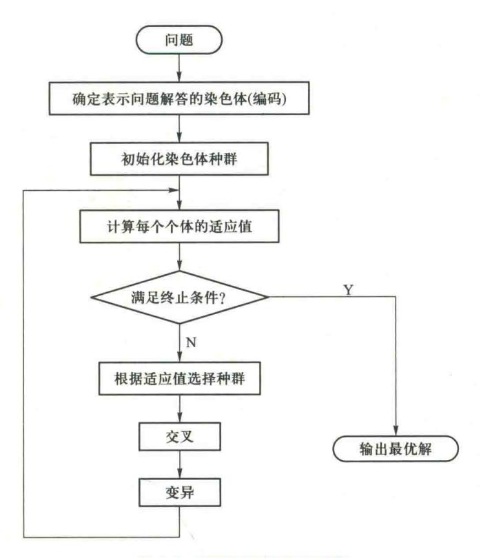

图 6.2 遗传算法的基本流程

④ 在基本遗传算法中,基本上不用搜索空间的知识或其他辅助信息,而仅用适应度函数值 来评估个体,并在此基础上进行遗传操作,使种群中个体之间进行信息交换。特别是遗传算法的 适应度函数不仅不受连续可微的约束,而且其定义域也可以任意设定。对适应度函数的唯一要 求是能够算出可以比较的正值。遗传算法的这一特点使它的应用范围大大扩展,非常适合于传 统优化方法难以解决的复杂优化问题。

#### 遗传算法的改进算法 6.3

为了改进遗传算法的优化性能,人们提出了许多改进算法。下面介绍几种 主要的改进算法。

#### 6.3.1 双倍体遗传算法

#### 1. 基本思想

Holland 提出的遗传算法通常被称为基本遗传算法 (simple genetic algo- 讲课视频▲


双倍体遗传算法

{20}------------------------------------------------

rithms,SGA)。SGA是一种"单倍体遗传",每个基因型由一条染色体组成。自然界中一些简单的植物采用这种遗传,而大多数动物和高级植物都采用双倍体遗传,即每个基因型由一对染色体组成。

双倍体遗传算法(double chromosomes genetic algorithm, DCGA)采用显性和隐性两个染色体同时进行进化。因此,双倍体遗传算法提供了一种记忆以前有用的基因块的功能:在某些低适应度染色体中,其局部基因块十分有用,是最优解中的基因片段,但由于基因块在当前染色体中的位置不适等因素,导致当前染色体的适应度值不高。保留这些基因块,有利于提高物种的适应能力。

双倍体遗传算法采用显性遗传,如图 6.3 所示。当一对染色体对应的基因块不同时,显性基因遗传给后代,图中大写字母为显性遗传。

这种双倍体遗传延长了有用基因块的寿命,提高了算法的收敛能力,并且在变异概率低的情况下,也能保持一定水平的多样性。Goldberg 用动态 Knapsack 问题进行了比较研究,实验表明双倍体比单倍体的动态跟踪能力强。

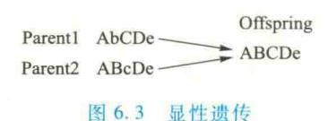

#### 2. 双倍体遗传算法的设计

#### (1) 编码/解码

对于双倍体遗传算法,群体中的每个个体具有两个染色体,一个是显性染色体,一个是隐性染色体。显性染色体、隐性染色体的编码/解码方式与基本遗传算法相同。

### (2) 复制算子

当进行复制操作时,计算显性染色体的适应度,按照显性染色体的复制概率将个体复制到下一代群体当中。

## (3) 交叉算子

对于交叉操作,从群体中选取两个个体,两个个体的显性染色体进行交叉操作,隐性染色体 也同时进行交叉操作。显性交叉率和隐性交叉率可以不同,为了工程实现方便也可将显性交叉 率和隐性交叉率设为相同,然后进入下一代群体。

## (4) 变异算子

对于变异操作,个体的显性染色体按照正常的变异概率  $P_m$ 执行变异操作;而个体的隐性染色体则按照较大的变异概率执行变异操作,例如按  $\min(2P_m,1)$ 概率变异。

## (5) 双倍体遗传算法显隐性重排算子

当三个遗传算子都执行完成以后,将个体的染色体显隐性进行重新排定,个体中适应值较大的染色体设定为显性染色体,适应值较小的染色体设定为隐性染色体。

双倍体遗传算法程序流程如图 6.4 所示。

{21}------------------------------------------------

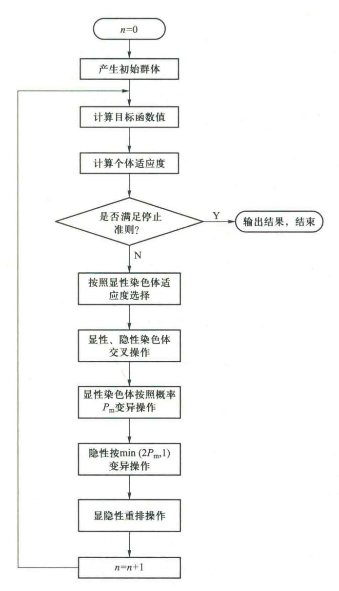

图 6.4 双倍体遗传算法程序流程图

# 6.3.2 双种群遗传算法

### 1. 基本思想

基本遗传算法针对一个宏观的种群进行复制、交叉、变异三种操作,类似于人类进化过程,一群人随着时间的推移而不断地进化,并具备越来越多的优良


双种群遗传算法 讲课视频▲

{22}------------------------------------------------

品质。然而由于他们的生长、演化、环境和原始祖先的局限性,经过相当长的时间后,他们将逐渐进化到某些特征相对优势的状态,称之为平衡态。当一个种群进化到这种状态,这个种群的特性就不会再有很大的变化。为了解决这个问题,可以在遗传算法中使用多种群同时进化,并交换种群之间优秀个体所携带的遗传信息,以打破种群内的平衡态达到更高的平衡态,有利于算法跳出局部最优。就本质而言,多种群遗传算法是一种并行算法,可以提高算法的效率。

下面介绍双种群遗传算法(double populations genetic algorithm, DPGA)。

### 2. 双种群遗传算法的设计

建立两个遗传算法群体,分别独立地运行复制、交叉、变异操作,同时当每一代运行结束以后,选择两个种群中的随机个体及最优个体分别交换。

(1) 编码/解码设计

编码/解码方法与基本遗传算法相同。

(2) 交叉算子、变异算子

两个种群分别进行选择、交叉、变异等操作,且交叉概率、变异概率不同。

(3) 杂交算子

设种群 A 与种群 B, 当 A 与 B 种群都完成了选择、交叉、变异算子后,产生一个随机数 num,随机选择 A 中 num 个个体与 A 中最优个体,随机选择 B 中 num 个个体与 B 中最优个体,交换两者,以打破平衡态。

双种群遗传算法程序流程图如图 6.5 所示。

 $P_{mo}$ 。这是一件烦琐的工作,而且很难找到适应每个问题的最佳值。

## 6.3.3 自适应遗传算法

### 1. 基本思想


遗传算法的交叉概率  $P_c$  和变异概率  $P_m$  是影响遗传算法行为和性能的关键参数,直接影响算法的收敛性。  $P_c$  越大,新个体产生的速度就越快;然而,  $P_c$  过大时遗传模式被破坏的可能性也越大,使得具有高适应度的个体结构很快被破坏;但是如果  $P_c$  过小,会使搜索过程缓慢,以至停滞不前。对于变异概率  $P_m$ ,如果  $P_m$  过小,就不易产生新的个体结构;如果  $P_m$  取值过大,则遗传算法变成了纯粹的随机搜索算法。针对不同的优化问题,需要反复实验来确定  $P_c$  和

自适应遗传算法 讲课视频▲

Srinvivas M, Patnaik L M 等在 1994 年提出一种自适应遗传算法(adaptive genetic algorithms, AGA)。自适应遗传算法使交叉概率  $P_e$  和变异概率  $P_m$  能够随适应度自动改变。当种群各个体适应度趋于一致或者趋于局部最优时,使  $P_e$  和  $P_m$  增加,以跳出局部最优;而当群体适应度比较分散时,使  $P_e$  和  $P_m$  减少,以利于优良个体的生存。同时,对于适应度高于群体平均适应值的个体,选择较低的  $P_e$  和  $P_m$ ,使得该解得以保护进入下一代;对低于平均适应值的个体,选择较高的

分散时,使 $P_c$ 和 $P_m$  减少,以利于优良个体的生存。同时,对于适应度高于群体平均适应值的个体,选择较低的 $P_c$ 和 $P_m$ ,使得该解得以保护进入下一代;对低于平均适应值的个体,选择较高的 $P_c$ 和 $P_m$ 值,使该解被淘汰。因此,自适应的 $P_c$ 和 $P_m$ 能够提供相对某个解的最佳 $P_c$ 和 $P_m$ 。自适应遗传算法在保持群体多样性的同时,保证遗传算法的收敛性。

{23}------------------------------------------------

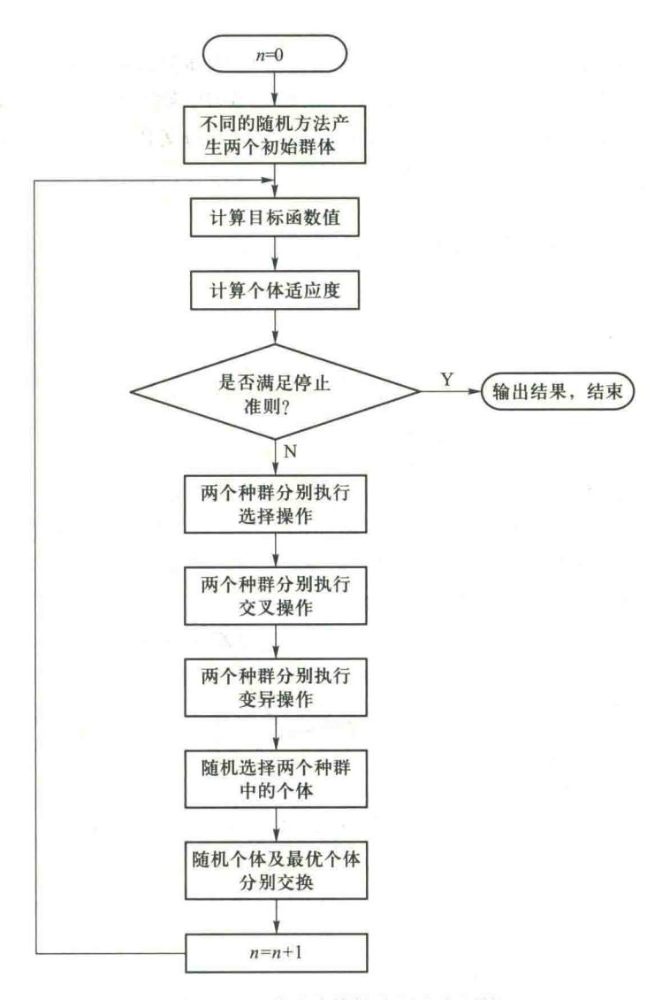

图 6.5 双种群遗传算法程序流程图

#### 2. 自适应遗传算法的步骤

- Step1 编码/解码设计同基本遗传算法。
- Step2 用初始种群产生的一些方法,产生 N(N 是偶数)个候选解,组成初始解集。
- Step3 定义适应度函数为 f=1/ob, 计算适应度  $f_{io}$
- Step4 按照轮盘赌规则选择 N 个个体,计算群体的平均适应度  $f_{nx}$ 和最大适应度  $f_{mx}$ 。
- Step 5 将群体中的各个个体随机搭配成对,共组成 N/2 对,对每一对个体,按照自适应公式计算自适应交叉概率  $P_e$ ,以  $P_e$  为交叉概率进行交叉操作,即随机产生 R(0,1),如果  $R< P_e$ 则对

{24}------------------------------------------------

该对染色体进行交叉操作。

Step6 对于群体中的所有个体,共N个,按照自适应变异公式计算自适应变异概率 $P_{--}$ ,以  $P_m$  为变异概率进行变异操作,即随机产生 R(0,1),如果  $R < P_m$  则对该染色体进行变异操作。

Step7 计算由交叉和变异生成新个体的适应度,新个体与父代一起构成新群体。

Step8 判断是否达到预定的迭代次数,是则结束寻优过程;否则转 Step4。

### 3. 自适应的交叉概率与变异概率

在自适应遗传算法中, $P_{c}$ 和 $P_{m}$ 按照以下公式进行调整:

$$P_{c} = \begin{cases} \frac{k_{1}(f_{\text{max}} - f')}{f_{\text{max}} - f_{\text{avg}}} & f' > f_{\text{avg}} \\ k_{2} & f' \leq f_{\text{avg}} \end{cases}$$
 (6.30a)

$$P_{\rm m} = \begin{cases} \frac{k_3 (f_{\rm max} - f)}{f_{\rm max} - f_{\rm avg}} & f > f_{\rm avg} \\ k_4 & f \leq f_{\rm avg} \end{cases}$$
 (6. 30b)

式中, $f_{max}$ 是群体中最大的适应度值; $f_{max}$ 是每代群体的平均适应度值;f'是要交叉的两个个体中较 大的适应度值;f 是要变异的个体的适应度值。 $k_1,k_2,k_3,k_4$  是(0,1)之间的常数。

普通自适应算法中,当个体适应度值越接近最大适应度值时,交叉概率与变异概率就越小: 当等于最大适应度值时,交叉概率和变异概率为零。这种调整方法对于群体处于进化后期比较 合适,但对处于进化初期不利,因为进化初期群体中的较优个体(尤其是适应度值接近群体最大 适应度值的个体)几乎处于一种不发生变化的状态。这增加了进化走向局部最优的可能性。因 此,应该做进一步的改进,如式(6.31)所示,当 $f'=f_{max},P_{c}=P_{c2}>0$ ;当 $f=f_{max},P_{m}=P_{m2}>0$ ,于是,群 体中的较优个体相对于普通自适应遗传算法,拥有更高的交叉概率与变异概率。同时,为了保证 每一代的最优个体不被破坏,采用最优保存策略,将其直接复制到下一代中。

改进后的交叉概率、变异概率计算公式为

$$P_{c} = \begin{cases} P_{c1} - \frac{(P_{c1} - P_{c2})(f' - f_{avg})}{f_{max} - f_{avg}} & f' > f_{avg} \\ P_{c1} & f' \leq f_{avg} \end{cases}$$
(6.31a)

$$P_{c} = \begin{cases} P_{c1} - \frac{(P_{c1} - P_{c2})(f' - f_{avg})}{f_{max} - f_{avg}} & f' > f_{avg} \\ P_{c1} & f' \leq f_{avg} \end{cases}$$

$$P_{m} = \begin{cases} P_{m1} - \frac{(P_{m1} - P_{m2})(f - f_{avg})}{f_{max} - f_{avg}} & f > f_{avg} \\ P_{m1} & f \leq f_{avg} \end{cases}$$

$$(6.31a)$$

一般取  $P_{c1} = 0.9$ ;  $P_{c2} = 0.6$ ;  $P_{m1} = 0.1$ ;  $P_{m2} = 0.001$ 

这里将其命名为 F-自适应方法。

根据上述的思想: 当前代的最优个体不被破坏, 仍然保留(最优保存策略); 但较优个体要对 应于更高的交叉概率与变异概率。下面给出改进的自适应方法(由于采用了正弦函数,命名为 S-自适应方法)。 $P_{c}\setminus P_{m}$  计算公式如下:

{25}------------------------------------------------

S-自适应方法交叉概率、变异概率计算公式为

$$P_{c} = \begin{cases} k_{1} \sin\left(\frac{\pi}{2} \frac{f_{\text{max}} - f'}{f_{\text{max}} - f_{\text{avg}}}\right) & f' > f_{\text{avg}} \\ k_{2} & f' \leq f_{\text{avg}} \end{cases}$$

$$(6.32a)$$

$$P_{\text{m}} = \begin{cases} k_{3} \sin\left(\frac{\pi}{2} \frac{f_{\text{max}} - f}{f_{\text{max}} - f_{\text{avg}}}\right) & f > f_{\text{avg}} \\ k_{4} & f \leq f_{\text{avg}} \end{cases}$$

$$(6.32b)$$

取  $k_1 = 1.0$ ;  $k_2 = 1.0$ ;  $k_3 = 0.5$ ;  $k_4 = 0.5$ 。

下面给出另一种自适应方法(由于采用了余弦函数,命名为 C-自适应方法)。 C-自适应方法交叉概率、变异概率计算公式为

$$P_{c} = \begin{cases} 1 - k_{1} \cos\left(\frac{\pi}{2} \frac{f_{\text{max}} - f'}{f_{\text{max}} - f_{\text{avg}}}\right) & f' > f_{\text{avg}} \\ k_{2} & f' \leq f_{\text{avg}} \end{cases}$$

$$(6.33a)$$

$$P_{\mathrm{m}} = \begin{cases} 1 - k_{3} \cos\left(\frac{\pi}{2} \frac{f_{\mathrm{max}} - f}{f_{\mathrm{max}} - f_{\mathrm{avg}}}\right) & f > f_{\mathrm{avg}} \\ k_{4} & f \leq f_{\mathrm{avg}} \end{cases}$$

$$(6.33b)$$

 $\mathfrak{P}_{1} = 1.0; k_{2} = 1.0; k_{3} = 0.5; k_{4} = 0.5_{\odot}$ 

# 6.4 基于遗传算法的生产调度方法

由于生产调度问题的解容易进行编码,而且,遗传算法可以处理大规模问题,所以,遗传算法成为求解生产调度问题的重要方法。


# 6.4.1 基于遗传算法的流水车间调度方法

#### 1. 流水车间调度问题

生产调度方法

流水车间调度问题(flow-shop scheduling problem, FSP)是与城市不对称情 课视况下的旅行商问题难度相当的同一类型的 NP 完全问题中最困难的问题之一。

自从 Johnson 1954 年发表第一篇关于 FSP 的文章以来, FSP 引起了许多学者的关注。整数规划和分支定界法是寻求最优解的常用方法,但 FSP 是 NP 完全问题,对于一些大规模甚至中等规模的问题,整数规划和分支定界方法仍是很困难的。在多数情况下很难用数学方法求解生产调度问题,数学计算和智能算法的结合往往是有效的。

FSP 一般可以描述为 n 个工件要在 m 台机器上加工,每个工件需要经过 m 道工序,每道工序要求不同的机器,n 个工件在 m 台机器上的加工顺序相同。工件在机器上的加工时间是给定的,设为  $t_{ii}(i=1,\cdots,n;j=1,\cdots,m)$ 。问题的目标是确定 n 个工件在每台机器上的最优加工顺序,

{26}------------------------------------------------

使最大流程时间达到最小。

对该问题常常做如下假设:

- ① 每个工件在机器上的加工顺序是给定的。
- ② 每台机器同时只能加工一个工件。
- ③ 一个工件不能同时在不同的机器上加工。
- ④ 工序不能预定。
- ⑤ 工序的准备时间与顺序无关,且包含在加工时间中。
- ⑥ 工件在每台机器上的加工顺序相同,且是确定的。

令  $c(j_i,k)$  表示工件  $j_i$  在机器 k 上的加工完工时间, $\{j_1,j_2,\cdots,j_n\}$  表示工件的调度,那么,对于无限中间存储方式,n 个工件、m 台机器的流水车间调度问题的完工时间可表示为

$$c(j_{1},1) = t_{j_{1}1}$$

$$c(j_{1},k) = c(j_{1},k-1) + t_{j_{1}k} \quad k = 2, \dots, m$$

$$c(j_{i},1) = c(j_{i-1},1) + t_{j_{i}1} \quad i = 2, \dots, n$$

$$c(j_{i},k) = \max\{c(j_{i-1},k), c(j_{i},k-1)\} + t_{j_{i}k}$$

$$i = 2, \dots, n; k = 2, \dots, m$$

$$(6.34)$$

最大流程时间为

$$c_{\max} = c(j_n, m) \tag{6.35}$$

调度目标为确定 $\{j_1,j_2,\cdots,j_n\}$ ,使得 $c_{\max}$ 最小。

### 2. 求解 FSP 的遗传算法设计

由于遗传算法所固有的全局搜索与收敛特性,由它得到的次优解往往优于传统方法得到的局部极值解,加之搜索效率比较高,因而被认为是一种切实有效的方法,得到了日益广泛的研究。

下面介绍遗传算法求解 FSP 的编码与适应度函数的设计。

## (1) FSP 的编码方法

对于调度问题,通常不采用二进制编码,而使用实数编码。将各个生产任务编码为相应的整数变量。一个调度方案是生产任务的一个排列,其排列中每个位置对应于每个带编号的任务。 GA 算法根据一定评价函数,求出最优的排列。

对于 FSP,最自然的编码方式是用染色体表示工件的顺序,例如,对于有四个工件的 FSP,第 k 个染色体  $v_k$  = [1,2,3,4],表示工件的加工顺序为: $j_1$ , $j_2$ , $j_3$ , $j_4$ 。

## (2) FSP 的适应度函数

令  $c_{\max}^k$ 表示 k 个染色体  $v_k$  的最大流程时间,那么,FSP 的适应度函数取为

$$eval(v_k) = \frac{1}{c_{max}^k} \tag{6.36}$$

## 3. 求解 FSP 的遗传算法实例

例 6.1 由 Ho 和 Chang(1991)给出的 5 个工件、4 台机器问题的加工时间如表 6.2 所示。

{27}------------------------------------------------

| 工件 <i>j</i> | $t_{j1}$ | $t_{j_2}$ | $t_{j3}$ | $t_{\mu}$ |
|-------------|----------|-----------|----------|-----------|
| 1           | 31       | 41        | 25       | 30        |
| 2 -         | 19       | 55        | 3        | 34        |
| 3           | 23       | 42        | 27       | 6         |
| 4           | 13       | 22        | 14       | 13        |
| 5           | 33       | 5         | 57       | 19        |

表 6.2 加工时间表

为了便于比较,先用穷举法求得最优解为:4-2-5-1-3,加工时间为 213;最劣解为:1-4-2-3-5,加工时间为 294;平均解的加工时间为:265。

下面用遗传算法求解。选择交叉概率  $P_{\text{e}}=0.6$ ,变异概率  $P_{\text{m}}=0.1$ ,种群规模为 20,迭代次数 N=50。运算结果如表 6.3 和图 6.6~图 6.8 所示。

| 总运行次数 | 最好解 | 最坏解 | 平均      | 最好解的频率 | 最好解的平均代数 |
|-------|-----|-----|---------|--------|----------|
| 20    | 213 | 221 | 213. 95 | 0. 85  | 12       |

表 6.3 遗传算法运行的结果

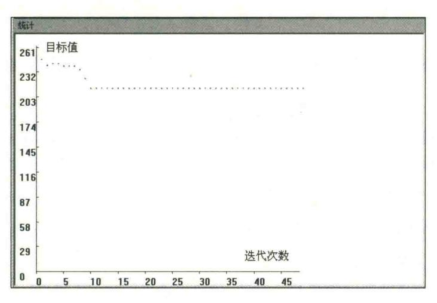

图 6.6 最优解收敛图

{28}------------------------------------------------

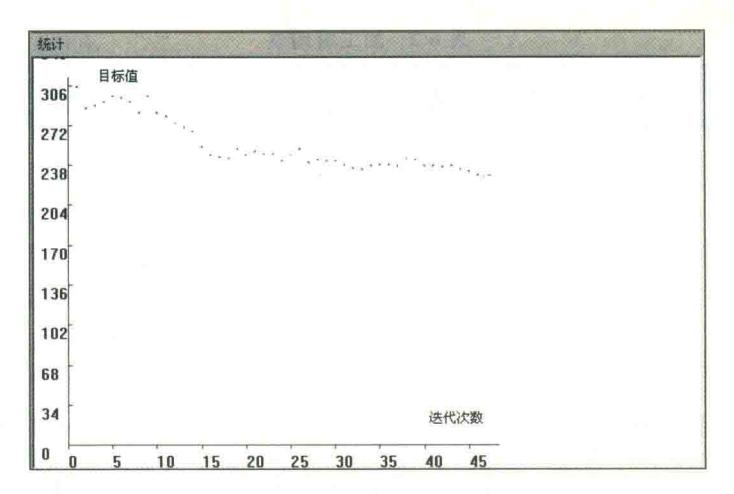

图 6.7 平均值收敛图

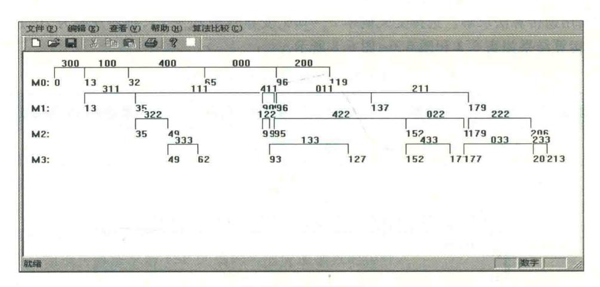

图 6.8 机器甘特图

可见,用 GA 绝大部分都能找到最好解,即使没有找到最好解,找到的最差的解也有 221,比起平均加工时间 265 还是好了很多。这说明: GA 一般能找到量局最优解,至少能找到比较好的解。

# 6.4.2 基于遗传算法的混合流水车间调度方法

### 1. 混合流水车间调度问题

混合流水车间调度问题(hybrid flow-shop scheduling problem, HFSP)是一般流水车间调度问题的推广,比一般的流水车间调度问题更复杂。它的特征是在某些工序上存在并行机器。它非常具有代表性,相当普遍地存在于化工、钢铁、制药等流程工业中,被称为柔性流水线。

HFSP 可描述为:需要加工多个工件,所有工件的加工路线都相同,都需要依次通过几道工

{29}------------------------------------------------

序,在所有工序中至少有一个工序存在着多台并行机器。需要解决的问题是确定并行机器的分配情况以及同一台机器上工件的加工排序。目标是最小化最大流程时间。

对于有N个工件,S个工序,每个工序i有 $M_i$ 台并行机器 $(1 \le i \le S)$ 的混合Flow-shop 调度问题,已经提出了分支定界算法、启发式算法等算法,但这些算法都只能解决规模较小的生产调度问题。

下面用遗传算法解 HFSP 的最小化最大流程时间问题。

### 2. 混合 HFSP 的遗传算法编码方法

下面给出一种 HFSP 的编码方法,能很好地处理工序之间的约束关系,使得产生的每个染色体都对应一个可行的调度,而且在进行遗传操作时也不会产生非法解。

假设要加工N个工件,每个工件都要依次经过S个加工工序,每个工序的并行机器数为 $M_i$ , $(i=1,\dots,S)$ 。所有工序中至少有一个工序存在并行机,即至少有一个 $M_i$ 大于1。下面构造一个 $S\times N$ 维的 HFSP 的编码矩阵

$$A_{S\times N} = \begin{bmatrix} a_{11} & a_{12} & \cdots & a_{1N} \\ a_{21} & a_{22} & \cdots & a_{2N} \\ \vdots & \vdots & & \vdots \\ a_{S1} & a_{S2} & \cdots & a_{SN} \end{bmatrix}$$

$$(6.37)$$

编码矩阵的元素  $a_{ij}$ 为区间 $(1, M_i+1)$ 上的一个实数,表示工件j的第i个工序在第  $Int(a_{ij})$ 台并行机上加工。函数 Int(x)表示对实数 x 取整。显然,可能会出现 $Int(a_{ij}) = Int(a_{ik})$ , $j \neq k$ ,这表明多个工件在同一台机器上加工同一个工序。这时,假如是第一个工序(i=1),则按照  $a_{ij}$ 的升序来加工工件。假如不是第一道工序(i>1),则根据每个工件的前一个工序的完成时间来确定其加工顺序,前一个工序先完成的先加工。假如完成时间相同,则也按照  $a_{ij}$ 的升序来加工。

根据上述编码矩阵可以确定染色体。染色体由 S 个小段组成。每个小段包括 N 个基因。由编码矩阵的每一行组成一个小段。小段之间用标识符"0"隔开,表示不同的工序。因此,染色体的长度为  $S \times N + S - 1$ 。染色体可表示为

$$Ind_k = [a_{11}, a_{12}, \cdots, a_{1N}, 0, a_{21}, \cdots, a_{2N}, 0, \cdots, 0, a_{S1}, a_{S2}, \cdots, a_{SN}]$$
(6.38)

例如,对于有3个工件、3道工序、各工序的并行机器数分别为3,2,2的混合 Flow-shop 调度问题,各机器编号如图6.9 所示。其中,机器4表示工序2的第一台并行机,机器5表示工序2的第二台并行机,机器6表示工序3的第一台并行机,机器7表示工序3的第二台并行机。

假设产生如下的编码矩阵:

$$A = \begin{bmatrix} 2.1 & 2.4 & 1.9 \\ 1.6 & 2.1 & 2.3 \\ 1.1 & 2.4 & 1.2 \end{bmatrix}$$
 (6. 39)

对矩阵的各元素分别取整,并根据前面各工序上的并行机编号规则,可得到各工件与机器的对应关系,矩阵

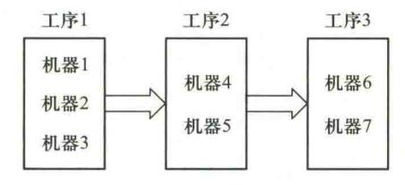

图 6.9 混合 Flow-shop 调度的机器编号

{30}------------------------------------------------

的第1列的3个元素分别表示工件1的第一个工序在机器2上加工,第二个工序在第二个工序中的第1台机器即编号为4的机器上加工,第三个工序在第三个工序中的第1台机器即编号为6的机器上加工;矩阵的第二列表示工件2的第一个工序在机器2上加工,第二个工序在第二个工序的第2台机器即编号为5的机器上加工,第三个工序在第三个工序中的第2台机器即编号为7的机器上加工;矩阵的第三列表示工件3的第一个工序在机器1上加工,第二个工序在第二个工序中的第2台机器即编号为5的机器上加工,第三个工序在第三个工序的第1台机器即编号为6的机器上加工。

以上得到的是机器的分配情况,从3个工件的加工路径可看出,对于第一个工序,工件1和2都在机器2上加工,则由于2.1<2.4,所以在机器2上先加工工件1,然后是工件2。对于机器5,由于它加工的是工件2和3的第二个工序,所以要根据工件2和3的第一工序的完工时间来确定其先后顺序,假如工件3的第一个工序的完工时间早于工件2的第一个工序的完工时间,则先加工工件3,然后才加工工件2,如果相同,则由于2.1<2.3,则先加工工件2,然后加工工件3。对于机器6的处理类似于机器5。

根据上面的编码矩阵(6.32)可得到一个染色体为

$$[2.1, 2.4, 1.9, 0, 1.6, 2.1, 2.3, 0, 1.1, 2.4, 1.2]$$

### 3. 基于遗传算法的求解方法

(1) 初始群体的产生

根据上述染色体表示方法,随机产生一些编码矩阵,构成染色体组成初始群体。

(2) 适应度函数的选择

用最大流程时间的倒数作为适应度函数。

## (3) 选择

为了防止早熟收敛,采用非线性排名策略来确定个体被复制概率。首先将种群成员按适应值从好到坏依次排列  $f_1>f_2>\cdots>f_N$ ,然后按下式分配复制概率:

$$p_{i} = \begin{cases} a (1-a)^{i-1} & i = 1, 2, \dots, N-1 \\ (1-a)^{N-1} & i = N \end{cases}$$
 (6.40)

式中,a 是一个常数,表示最好个体的选择概率。为了加快算法的收敛速度,a 不能取得太小,同时为了使种群在进化过程中保持多样性,a 也不能太大。

### (4) 交叉操作

根据前面的编码方式,只要满足  $a_{ij} \in (1, M_i + 1)$  这一条件,就可保证个体的合法性,因此,采取分段交叉的方式,对每个小段分别进行两点交叉,每段的交叉点可以相同,也可以不同。

在两个父体的各段中随机选取一部分基因,然后交换,得到子代个体。

## (5) 变异操作

同样也采取分段的方式,对于第i个小段的第j个基因 $a_{ij}$ ,变异步骤为:

- ①  $d = \text{Rand}\{-1,1\}_{\circ}$
- ② 若 d=1,则  $r=\text{Rand}(0,M_i-a_{ij})$ ,否则  $r=\text{Rand}(0,a_{ij})$ 。

{31}------------------------------------------------

### 3 $a'_{ii} = a_{ii} + d \times r_{\circ}$

其中,d 是整数,r 是实数, $a_{ii}$ 为要变异个体, $a'_{ii}$ 为变异的结果。

显然这种变异方法使得  $a'_{ij}$ 在保持区间 $(1,M_i+1)$ 之内,从而保证其合法性,同时也使变异具有充分的随机性。

### 4. 调度实例

某汽车发动机厂金加工车间要加工 12 个工件,每个工件都有车、刨、磨 3 个工序,现有 3 台车床,2 台刨床,4 台磨床,每台机床的加工能力不同,具体加工时间如表 6.4 所示。

| 工件   | 工序1 |      |      | IJ   | <b>茅 2</b> |      | 工序3  |      |      |  |
|------|-----|------|------|------|------------|------|------|------|------|--|
| 1.14 | 机器1 | 机器 2 | 机器 3 | 机器 4 | 机器 5       | 机器 6 | 机器 7 | 机器 8 | 机器 9 |  |
| 1    | 2   | 2    | 3    | 4    | 5          | 2    | 3    | 2    | 3    |  |
| 2    | 4   | 5    | 4    | 3    | 4          | 3    | 4    | 5    | 4    |  |
| 3    | 6   | 5    | 4    | 4    | 2          | 3    | 4    | 2    | 5    |  |
| 4    | 4   | 3    | 4    | 6    | 5          | 3    | 6    | 5    | 8    |  |
| 5    | 4   | 5    | 3    | 3    | ĺ          | 3    | 4    | 6    | 5    |  |
| 6    | 6   | 5    | 4    | 2    | 3          | 4    | 3    | 9    | 5    |  |
| 7    | 5   | 2    | 4    | 4    | 6          | 3    | 4    | 3    | 5    |  |
| 8    | 3   | 5    | 4    | 7    | 5          | 3    | 3    | 6    | 4    |  |
| 9    | 2   | 5    | 4    | 1    | 2          | 7    | 8    | 6    | 5    |  |
| 10   | 3   | 6    | 4    | 3    | 4          | 4    | 8    | 6    | 7    |  |
| 11   | 5   | 2.   | 4    | 3    | 5          | 6    | 7    | 6    | 5    |  |
| 12   | 6   | 5    | 4    | 5    | 4:         | 3    | 4    | 7    | 5    |  |

表 6.4 工件在每个机器上的加工时间

算法中使用的参数为 a=0.07,  $P_e=0.80$ ,  $P_m=0.01$ , 种群规模为 30, 种群经过 100 代的进化,目标函数最小值随着种群的进化逐渐地减小,最后收敛于极值,目标函数平均值也随着群体的进化逐渐减少,最后趋近于最优值。

得到的最好的染色体是:

[2.77, 3.51, 1.74, 3.52, 2.42, 1.36, 3.28, 3.94, 1.09, 1.22, 2.24, 3.64, 0, 1.60, 1.13, 1.24, 2.97, 1.73, 1.88, 1.08, 2.68, 1.16, 2.69, 2.51, 2.96, 0, 4.99, 3.29, 4.95, 2.35, 1.10, 1.01, 1.73, 1.35, 3.06,

{32}------------------------------------------------

#### 1.20, 4.13, 3.67

相应的甘特图如图 6.10 所示。从甘特图可见,最大流程时间为 29,各并行机器的加工任务 比较均匀,而且各机器加工时间基本保持连续,这样可以减少加工时间,表明所得到的调度结果 是比较合理的。

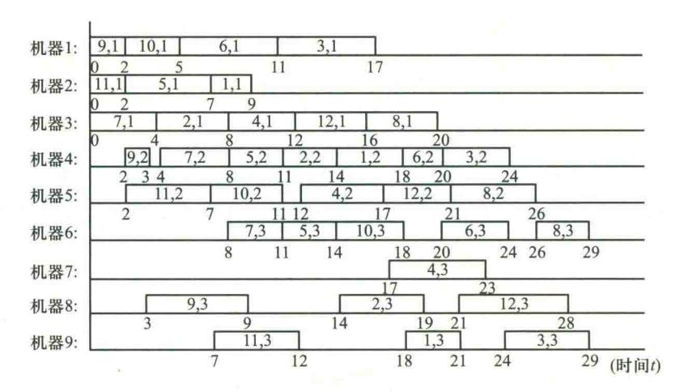

图 6.10 混合 Flow-shop 调度结果甘特图

# 6.5 差分进化算法及其应用

差分进化算法(differential evolution, DE)是一种新兴的进化计算技术,或称为差分演化算法、微分进化算法、微分演化算法、差异演化算法。它是由 Rainer Storn 和 Kenneth Price 于 1995年为求解切比雪夫多项式而提出的一种采用实数矢量编码在连续空间中进行随机搜索的优化算法。

DE 保留了进化算法基于种群的全局搜索策略,采用实数编码、基于差分的简单变异操作和一对一的淘汰机制来更新种群,降低了遗传操作的复杂性。同时,DE 特有的记忆能力使其可以动态跟踪当前的搜索情况,调整搜索策略,具有较强的全局收敛能力和鲁棒性。

同其他进化算法一样,差分进化算法不利用函数的梯度信息,因此对函数的可导性甚至连续性没有要求,不需要借助问题的特征信息,适于求解一些利用常规的数学规划方法无法求解的复杂优化问题。近年来,DE以其很强的鲁棒性、稳健性和实数域全局搜索能力在多个领域得到广泛应用。

# 6.5.1 差分进化算法

差分进化算法是一种基于实数编码的具有保优思想的贪婪遗传算法。与实数编码的遗传算法相似,也包括选择、交叉和变异等操作,但在产生子代的方式上有所不同,DE 在父代个体间的

{33}------------------------------------------------

差向量基础上生成变异个体,然后按一定的概率对父代个体与变异个体进行交叉操作,最后采用 "贪婪"选择策略产生子代个体。

差分进化算法的要素主要有:初始种群的产生、适应度函数的设计、差分操作(变异、交叉、选择)设计和控制参数设置。

### 1. 初始种群的产生

DE 利用 NP 个维数为 D 的实数值参数向量作为每一代的种群,每个个体表示为: $x_{i}^{t} = [x_{i,1}^{t}, x_{i,2}^{t}, \cdots, x_{i,D}^{t}]$ 。NP 表示种群规模,D 表示问题空间维数,t 表示进化代数。

寻找初始种群的一个方法是从给定边界约束内的值中随机选择。

在 DE 算法中,一般假定所有随机初始化种群均符合均匀概率分布。设参数变量的界限为  $x_i^{(L)} < x_i < x_i^{(U)}$ ,则

$$x_{i,j}^{0} = (x_{i}^{(U)} - x_{i}^{(L)}) rand[0,1] + x_{i}^{(L)}, \quad i = 1, 2, \dots, NP; \quad j = 1, 2, \dots, D$$
(6.41)

rand[0,1]表示在[0,1]之间产生的均匀随机数。

如果预先可以得到问题的初始解,初始种群也可以通过对初始解加入正态分布随机偏差来 产生。

### 2. 适应度函数的设计

在差分进化算法中,差分操作主要通过适应度函数的导向来实现。通常根据具体问题定义适应度函数。最直观的方法是直接将待求解优化问题的目标函数作为适应度函数。具体方法与遗传算法的适应度函数相似。

### 3. 变异操作

对每个目标个体  $x_i^t$ ,  $i=1,2,\cdots,NP$ , 它的变异个体  $v_i^{t+1}$  的产生方式根据差向量的个数以及父代基向量的选取方式的不同分为如下几种:

① 以随机选择的个体作为父代基向量(rand),采用一个差向量来生成变异个体:

$$v_i^{t+1} = x_{r_1}^t + F(x_{r_2}^t - x_{r_3}^t)$$
 (6.42a)

② 以当前种群最优个体作为父代基向量(best),采用一个差向量来生成变异个体:

$$v_i^{t+1} = x_{\text{best}}^t + F(x_{r_i}^t - x_{r_i}^t)$$
 (6.42b)

③ 以随机选择的个体作为父代基向量(rand),采用两个差向量来生成变异个体:

$$v_i^{t+1} = x_{r_1}^t + F[(x_{r_2}^t - x_{r_3}^t) + (x_{r_4}^t - x_{r_5}^t)]$$
(6. 42c)

④ 以当前种群最优个体作为父代基向量(best),采用两个差向量来生成变异个体:

$$v_i^{t+1} = x_{\text{best}}^t + F\left[ (x_{r_1}^t - x_{r_2}^t) + (x_{r_3}^t - x_{r_4}^t) \right]$$
 (6.42d)

⑤ 以当前种群最优个体与目标个体的差向量加权后与目标个体的求和作为父代基向量 (rand-to-best),采用一个差向量来生成变异个体:

$$v_i^{t+1} = x_i^t + \lambda \left( x_{\text{best}}^t - x_i^t \right) + F\left( x_{r_1}^t - x_{r_2}^t \right)$$
 (6.42e)

其中, $r_1$ 、 $r_2$ 、 $r_3$ 、 $r_4$  和  $r_5$  表示随机产生的[1,NP]之间互异且不等于目标个体序号 i 的自然数。 $\lambda \in [0,1]$ 表示加权因子,控制父代基向量的加权方式。 $F \in [0,2]$ 表示缩放比例因子,是一

{34}------------------------------------------------

个实常数因数,控制偏差变量的放大作用。

### 4. 交叉操作

对目标个体  $u_i^{t+1}$  进行交叉操作生成试验个体  $u_i^{t+1} = [u_{i,1}^{t+1}, u_{i,2}^{t+1}, \cdots, u_{i,D}^{t+1}]$ 。 DE 交叉操作分二项式(bin)交叉和指数(exp)交叉两种交叉方式。

### (1) 二项式(bin)交叉

随机产生[1,D]之间的自然数  $mbr_i$ 。对第 j 位参数,若  $j=mbr_i$ :取变异个体  $v_i^{t+1}$  上的第 j 位参数作为试验个体  $u_i^{t+1}$  上的第 j 位参数;若  $j\neq mbr_i$ :随机产生[0,1] 之间的随机实数  $r_j$ ,若  $r_j \leq CR$ ,取变异个体  $v_i^{t+1}$  上的第 j 位参数作为试验个体  $u_i^{t+1}$  上的第 j 位参数,否则,取目标个体  $v_i^{t+1}$  上的第 j 位参数作为试验个体  $v_i^{t+1}$  上的第 j 位参数。二项式交叉表示为

$$u_{i,j}^{t+1} = \begin{cases} v_{i,j}^{t+1}, & \text{if } r_j \leq CR \text{ or } j = rnbr\_i \\ x_{i,j}^t, & \text{otherwise} \end{cases}$$
 (6. 43)

其中, $r_j$  为第j个[0,1]之间的随机数; $rnbr_i$  为[1,D]之间的随机自然数,它确保了 $u_i^{t+1}$ 至少从 $v_i^{t+1}$  获得一个参数;CR 为交叉概率,取值范围为[0,1]。

二项式交叉的实例如图 6.11 所示,其交叉方式类似于遗传算法中的均匀交叉。

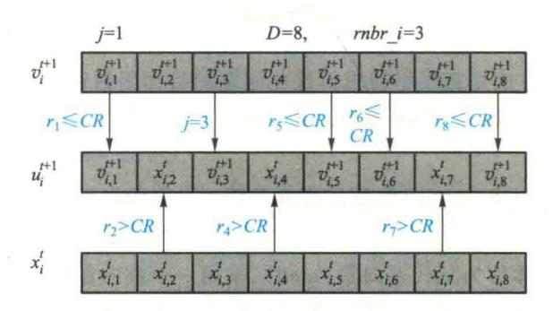

图 6.11 二项式交叉示意图

## (2) 指数(exp)交叉

随机产生[1,D]之间的自然数  $mbr_i$ 。对第 j 位参数,若  $j < mbr_i$ :取目标个体  $x_i^t$  上的第 j 位参数作为试验个体  $u_i^{t+1}$  上的第 j 位参数;若  $j = mbr_i$ :取变异个体  $v_i^{t+1}$  上的第 j 位参数作为试验个体  $u_i^{t+1}$  上的第 j 位参数;若  $j > mbr_i$ :随机产生[0,1] 之间的随机实数  $r_j$ ,若  $r_j \leq CR$ ,取变异个体  $v_i^{t+1}$  上的第 j 位参数作为试验个体  $u_i^{t+1}$  上的第 j 位参数作为试验个体  $u_i^{t+1}$  上前第 j 位参数,否则,试验个体  $u_i^{t+1}$  上剩下的所有参数都从目标个体  $x_i^t$  继承。

指数交叉示意图如图 6.12 所示,其交叉方式类似于遗传算法中的二点交叉。

{35}------------------------------------------------

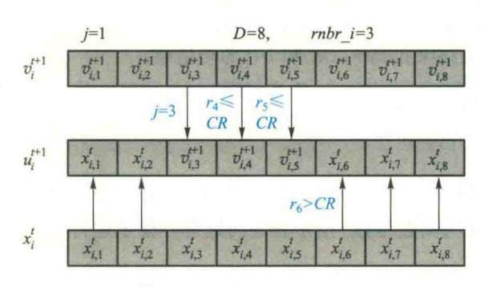

图 6.12 指数交叉示意图

### 5. 选择操作

DE 采用贪婪准则在x'和 $u'^{+1}$ 之间进行选择,产生下一代个体 $x'^{+1}$ :

$$x_{i}^{t+1} = \begin{cases} u_{i}^{t+1}, & \text{if } f(u_{i}^{t+1}) > f(x_{i}^{t}) \\ x_{i}^{t}, & \text{otherwise} \end{cases}$$
 (6.44)

其中 $,f(\cdot)$ 表示目标函数。式(6.44)是针对最大化问题而言,若是最小化问题,那么选择试验个体作为子代个体的条件是 $f(u_i^{t+1}) < f(x_i^t)$ 。

### 6. 控制参数设置

DE 的搜索性能取决于算法全局探索和局部开发能力的平衡,而这在很大程度上依赖于算法的控制参数的选取。相对其他进化算法而言,DE 所需调节的参数较少,主要包括种群规模、缩放比例因子和交叉概率等。

- ① 种群规模。必须满足  $NP \ge 4$  以确保 DE 具有足够多不同的变异向量,根据经验, NP 的合理选择在  $5D \sim 10D(D)$  为问题空间的维数)之间。
- ② 缩放比例因子。缩放比例因子  $F \in [0,2]$  是一个实常数,它决定偏差向量的放大比例。F 越大,算法越容易逃出局部极小点而收敛到全局最优点,但是当 F > 1 时,收敛速度将变慢。研究表明,小于 0.4 和大于 1 的 F 值仅偶尔有效,F = 0.5 通常是一个较好的初始选择。若种群过早收敛,那么应该增加 F 或 NP。
- ③ 交叉概率。交叉概率 *CR* 是一个范围在[0,1]的实数,它控制着一个试验向量参数来自变异向量的概率。 *CR* 越大,算法越容易收敛,但易发生早熟现象。 *CR* 的一个较好的选择是 0.3 左右。
- ④ 最大迭代代数。一般而言,最大迭代代数越大,最优解越精确,但计算时间越长,要根据 具体问题设定。一般范围为 100~200 代。
- ⑤ 终止条件。除最大进化代数可作为 DE 的终止条件外,有时还需要其他判定准则,一般当目标函数值在连续若干代的变化量小于阈值时程序终止,阈值常选为10<sup>-6</sup>。

上述参数中,F、CR与NP一样,在搜索过程中是常数,一般F和CR影响搜索过程的收敛速

{36}------------------------------------------------

度和鲁棒性,它们的优化值不仅依赖于目标函数的特性,还与NP有关。通常可通过在对不同值做一些试验之后利用试验结果找到F、CR 和NP的合适值。

### 6.5.2 差分进化算法的流程

基本 DE 的流程如下:

步骤 1 在问题的可行解空间随机初始化种群  $X^0 = [x_1^0, x_2^0, \cdots, x_{NP}^0]$  (NP 为种群规模),个体  $x_i^0 = [x_{i,1}^0, x_{i,2}^0, \cdots, x_{i,D}^0]$  (D 为问题维数)用于表征问题解。设定运行代数t = 0。

步骤 2 设置 j=1。

步骤 3 对当前种群中的个体  $x_j^t$ ,随机产生[1,NP]之间互异且不等于 j 的自然数  $r_1$ 、 $r_2$ 、 $r_3$ ,进行变异操作产生变异个体  $v_i^{t+1}$ :

$$v_j^{t+1} = x_{r_1}^t + F(x_{r_2}^t - x_{r_3}^t)$$

其中, $x'_{i,j}$ 为父代基向量; $(x'_{i,j}-x'_{i,j})$ 称作父代差分向量;F 为缩放比例因子。

步骤 4 对个体  $x_i^i$  和变异个体  $v_i^{i+1}$  实施交叉操作生成试验个体  $u_i^{i+1}$ :

$$\begin{aligned} u_{j}^{t+1} &= \left[ \begin{array}{c} u_{j,1}^{t+1} \,, u_{j,2}^{t+1} \,, \cdots \,, u_{j,D}^{t+1} \end{array} \right] \\ u_{j,k}^{t+1} &= \begin{cases} v_{j,k}^{t+1} \,, \text{if} \left( randb \left( k \right) \leqslant CR \right) \text{ or } & k = rnbr(j) \\ x_{i,k}^{t} \,, \text{otherwise} \end{cases} \end{aligned}$$

其中,randb(k)为[0,1]之间随机数发生器的第k个估计值;rnbr(j)为[1,D]之间的随机自然数,它确保了 $u_i^{t+1}$ 至少从 $v_i^{t+1}$ 获得一个参数;CR为交叉概率,取值范围为[0,1]。

步骤 5 采用贪婪准则在  $x_i^t$  和  $u_i^{t+1}$  之间进行选择,产生下一代个体  $x_i^{t+1}$ :

$$x_{j}^{t+1} = \begin{cases} u_{j}^{t+1}, \ f(u_{j}^{t+1}) > f(x_{j}^{t}) \\ x_{j}^{t}, otherwise \end{cases}$$

若是最小化问题,那么选择试验个体作为子代个体的条件是 $f(u_i^{t+1}) < f(x_i^t)$ 。

步骤 6 j=j+1, 若  $j \leq NP$ , 则转至步骤 3; 否则, 执行步骤 7。

步骤 7 t=t+1,判断是否满足终止条件,若满足,则输出最优解并终止迭代过程;否则,转至步骤 2。

# 6.5.3 差分讲化算法的改讲

DE 的收敛速度远胜于一般的进化算法,但易陷入局部最优,存在早熟收敛现象。为提高算法性能,许多学者提出了改进型的 DE。目前,对 DE 的改进主要可归纳为如下几方面:

- ① 对进化操作的改进。包括对控制参数的取值、参加变异的父代基向量的选择、差分进化模式以及变异、交叉、选择操作等方面的改进。
- ② 多种群。主要是将 DE 分成多个子种群,各个子种群独立寻优,在跨种群间实现信息交流,提高算法摆脱局部极值的能力。

{37}------------------------------------------------

- ③ 嵌入新操作。在 DE 中嵌入有效的局部搜索策略、引入加速和迁移操作以及搜索空间扩展机制等。
- ④ 与其他算法混合。包括与蚁群算法、遗传算法、粒子群算法、单纯形优进策略、粒子滤波等算法的混合来确定控制参数的取值、动态选择合适的进化操作算子及差分进化模式等,以改进算法性能。

DE 已经在许多领域得到了应用,譬如人工神经元网络、化工、电力、机械设计、机器人、信号处理、生物学、运筹学、系统辨识与故障诊断等领域。

# 6.6 量子进化算法及其应用

量子计算(quantum computing)是物理学中的量子力学和计算机科学相结合的产物,是一种新兴的计算理论。自 20 世纪 80 年代初 Benioff 和 Feynman 提出了量子计算的概念后,1994 年 Shor 提出大整数质因子分解的量子算法,1996 年 Grover 提出无序数据库的量子搜索算法,量子计算以其独特的计算性能引起了广泛瞩目,并迅速成为研究的热点。Bennett 于 2000 年在他的专著"量子信息与量子计算"中进行了比较详细的介绍。量子计算理论是一种新型的计算理论,利用量子叠加(superposition)、纠缠(entangle)和干涉(interference)等量子态所特有的特性,并通过量子并行计算(quantum parallelism)求解问题。

理论上已经证明:进化算法能在概率意义上以随机的方式寻求问题的最优解。但在实际应用中也存在着容易产生早熟、收敛速度慢、局部寻优能力差等缺点。最早将量子计算和进化算法相结合的是在 1996 年,Narayanan 将量子的多宇宙理论引入遗传算法,提出一种全干扰交叉 (interference crossover) 思想,并成功解决了小规模 TSP 问题。Han 在 2000 到 2004 年间,提出了一系列量子进化算法方面的新想法,包括量子遗传算法、并行量子遗传算法、基于移民操作的量子进化算法、基于一种新的终止判断条件的两段式量子进化算法,同时对算法的参数设计问题进行了探讨,并成功应用于背包问题,取得了优于传统遗传算法的效果。

目前,已有量子智能算法除了量子进化算法,还有量子退火算法、量子神经网络、量子聚类、量子贝叶斯网络、量子小波变换等。这些算法都是受到量子计算机制的启发设计的,虽然在当前的计算机上实现有相当的限制,但比其他的智能算法仍具有更强的优势,特别是随着量子计算机的出现将发生革命性的变化。

# 6.6.1 量子进化算法的基本概念

量子进化算法(quantum evolutionary algorithm, QEA),是一种基于量子位、量子叠加态等量子机制的进化算法。

### 1. 量子位

量子位又称为量子比特(Q-bit),是量子计算中保存信息的最小单元。一个量子位可能处于状态  $|0\rangle$ ,也可能处于状态  $|1\rangle$ ,还可以是两种状态的线性叠加。因此,一个量子位可以表示为:

{38}------------------------------------------------

$$|\psi\rangle = \alpha |0\rangle + \beta |1\rangle \tag{6.45}$$

其中  $\alpha$  和  $\beta$  为复数,分别表示状态  $|0\rangle$  和  $|1\rangle$  的概率幅,且满足正交性,即满足  $|\alpha|^2 + |\beta|^2 = 1$ 。  $|\alpha|^2$  和  $|\beta|^2$  表示该量子位处于状态  $|0\rangle$  和  $|1\rangle$  的概率大小。

区别于经典比特,量子比特可以处于 0、1 两个本征态的任意叠加状态,而且对量子比特的操作过程中,两态的叠加振幅可以相互干涉,称为量子干涉。对每个叠加分量进行的变换相当于一种经典计算,并且这些经典计算同时完成,并按一定的概率振幅叠加起来,给出量子计算的计算结果,称为量子并行计算。

### 2. 量子个体

量子个体即量子染色体,在量子进化算法中,染色体的编码不是用确定的值(如传统的字符串、二进制、浮点数等)表示,而是采用量子位或者概率幅表示。在量子力学里,概率幅(量子幅)是一个描述粒子的量子行为的复函数。因此,一个染色体长度为 m 的量子个体可表示为:

$$\begin{bmatrix} \alpha_1 & \alpha_2 & \dots & \alpha_m \\ \beta_1 & \beta_2 & \dots & \beta_m \end{bmatrix}$$
 (6.46a)

其中

$$|\alpha_i|^2 + |\beta_i|^2 = 1, \quad i = 1, 2, \dots, m$$
 (6.46b)

因此,一个长度为 m 的量子个体能够基于概率同时表示 2<sup>m</sup> 种状态。基于量子比特表示与传统表示方法相比,因为一个量子个体可以表示若干个量子位状态的叠加,从而一个小种群的量子个体可以对应于传统表示方法下的大种群的个体。同时,量子门操作的存在使得量子进化算法有着很强的全局搜索能力。另一方面,随着量子进化算法的收敛,各个量子位上取 1 或取 0 的概率幅趋于 1,由量子旋转门驱动的搜索过程自动地由全局搜索变为局部搜索,这些特征正是由量子算法内在的概率机制所决定的。

# 6.6.2 基本量子进化算法

基本量子进化算法在量子位和量子个体的基础上,主要包含了六个基本要素:染色体编码、初始化种群(initialization)、量子观测(observation)、进化操作(evolutionary operation)、量子评价(evaluation)、量子更新(updating)等。

### 1. 染色体编码

量子进化算法中不再使用确定性编码方式,而是根据量子的叠加性,使用一种不确定性的基于量子比特的概率编码方式。

#### (1) 二进制编码

二进制编码的种群  $P(t) = \{p_1^t, \cdots, p_n^t\}, p_j^t$  为第 t 代种群中的第 j 个个体,且  $p_j^t = \begin{bmatrix} \alpha_1^t & \alpha_2^t & \cdots & \alpha_m^t \\ \beta_1^t & \beta_2^t & \cdots & \beta_m^t \end{bmatrix}$ 表示一个具有 m 个最小比特位的量子染色体,m 为量子染色体的长度,即个

{39}------------------------------------------------

体中量子比特位个数。

根据二进制编码的特点,可以用两个量子位表示 4 个状态,以此类推,用 m 个量子位表示  $2^m$  个状态。二进制编码中一个量子位表示两种状态,实现简单,但是只适用于能用二进制编码解决的问题,有一定局限性。

### (2) 多进制编码

多进制编码是将二进制编码扩展到n维,每一维都代表一个量子比特,通常用一个量子矩阵表示。矩阵的每一行即一个二进制编码表示,矩阵由n列这样的二进制编码组成,采用多个量子位表示一个多状态基因,对实际问题的编码设计通用性好且实现简单。

### (3) 概率复合位表示

概率复合位表示从另一个角度提出了一种多状态表示方法。一种n个状态的染色体可表示为

$$[p_0, p_1, p_2, \cdots, p_{n-1}]^T$$
 (6.47a)

其中,

$$p_0 + p_1 + p_2 + \dots + p_{n-1} = 1$$
 (6.47b)

其中, $p_0$ , $p_1$ , $p_2$ ,…, $p_{n-1}$ 分别表示取 0,1,…,n-1 的概率。在这种编码下,通过产生一个均匀随机数  $r \in [0,1]$ ,以轮盘赌方式确定观测值,并采用一种基于概率值的特有方法进行更新操作。

用量子比特表示的量子染色体的特点就是群体的多样性,因为它可以概率地表示线性叠加 状态。例如,一条长度为3的量子染色体可以表示为

$$\begin{bmatrix} \frac{1}{\sqrt{2}} & \frac{1}{\sqrt{2}} & \frac{1}{2} \\ \\ \frac{1}{\sqrt{2}} & \frac{1}{\sqrt{2}} & \frac{\sqrt{3}}{2} \end{bmatrix}$$

根据上面的染色体,可以得到二进制串,例如

$$\frac{1}{4} \mid 000 > + \frac{\sqrt{3}}{4} \mid 001 > -\frac{1}{4} \mid 010 > -\frac{\sqrt{3}}{4} \mid 011 > +\frac{1}{4} \mid 100 > + \frac{\sqrt{3}}{4} \mid 101 > -\frac{1}{4} \mid 110 > -\frac{\sqrt{3}}{4} \mid 111 >$$

上述结果的意思是状态 |000>, |001>, |010>, |011>, |100>, |101>, |110>和 |111>的概率分别为  $\frac{1}{16}$ ,  $\frac{3}{16}$ ,  $\frac{1}{16}$ ,  $\frac{3}{16}$ ,  $\frac{1}{16}$ ,  $\frac{3}{16}$ ,  $\frac{1}{16}$ ,  $\frac{3}{16}$ ,  $\frac{1}{16}$ , 因此,  $\frac{3}{16}$  为世子比特的量子染色体可以包含 8 个状态的信息。那么, 长度为 m 的量子染色体可以包含  $2^m$  个状态的信息。

一个量子个体代表任意线性叠加状态,因此能够表示大量的信息,作用在个体上的操作就具有了并行性,而一般的编码方式只能表示一个具体状态,所以量子进化更容易保持种群的多样性。这个特点使得量子进化算法能够以较小的种群,取得较好的寻优结果。随着 $|\alpha|^2$ 和 $|\beta|^2$ 趋于0.或者1.这时多样性消失,量子个体也收敛到单一状态。

{40}------------------------------------------------

### 2. 初始化种群

- (1) 种群规模
- ①固定种群规模

传统的遗传算法中染色体与解之间是一对一关系,而量子进化算法则可以采用一个染色体表示多解,因此,算法可以用较小的种群规模表示多个问题解。对多种不同规模种群 QEA 的实验证明,量子染色体种群越大,算法解的鲁棒性就越高。量子进化算法中,固定种群规模的设定依赖于具体的应用问题,量子染色体规模一般设定在 10~100 个之间。

### ② 可变种群规模

可变种群规模就是在算法迭代过程中,按照一定原则选择其中的优良种群进行下一次迭代。该算法中,初始种群仅包含n个路径生成矩阵,且每个矩阵的每个元素均用量子位表示。算法运行中,量子位表示矩阵生成若干个可行路径矩阵,进行交叉、变异、矩阵内各行随机移动等操作,生成新的个体。种群更新时,选取若干个最优个体,并随机选择一个个体以保持种群多样性。该算法充分利用了量子位表示方法可以表示多个解的特性,保持解种群的分散特性。

- (2) 染色体初始值
- ① 基本染色体初始化方法

基本量子进化算法中,量子染色体由量子位组成,并且所有的量子位的初始值均设为  $\left[\frac{1}{\sqrt{2}} \quad \frac{1}{\sqrt{2}}\right]$ 。这种初始化方法十分简单,但是量子染色体的初始化没有考虑到具体的应用问题,因此优化效果有一定的局限性。

### ② 两阶段初始化方法

量子位的初始值对量子进化算法的性能有着显著的影响,由此提出了一种两阶段的复合量子遗传算法框架。在第一阶段中随机初始化量子位,经过若干次量子进化搜索后,将得到的优良结果用于第二阶段量子遗传算法的初始化,进行进一步的解空间的全局搜索。这里初始解空间的设计主要依靠对问题解决方案的正确把握,并总结出相应的先验知识。

### 3. 量子观测

量子观测是指模拟量子的坍塌对种群中的各个体进行一次测量,使得个体从叠加状态转化到单一的确定状态。

在基本量子进化算法中,量子观测一般采用如下方法:根据  $p_i'$  中概率幅的取值情况构造长度为 m 的二进制串  $r_i'$ 。构造方法:产生[0,1]上的一个随机数 s,若 $s>|\alpha_i'|^2$ ,则二进制串  $r_j'$  第 i 位上取值为 1,否则为 0。由此得到二进制串种群  $R(\iota)$ 。

量子观测的结果和作用就是将只有在量子计算机中才能观测的信息转换成在二进制计算机中能表示的信息。这一过程将导致具有 2<sup>™</sup> 个状态的量子染色体退变成一个确定的状态,在量子理论中被称为量子坍塌(collapse)。

其中常用的量子观测过程伪代码如下:

procedure observe (x)

{41}------------------------------------------------

```
begin i \leftarrow 0 while (i < m) do begin i \leftarrow i + 1 if random[0,1] > |\alpha_i|^2 or |\beta_i|^2 then x_i \leftarrow 1 else x_i \leftarrow 0 end
```

### 4. 量子进化

量子进化操作的基本思想就是对通过量子观测所得到的 R(t) 中的个体进行交叉、变异的进化操作,生成新的 R(t)。

基本量子进化算法中,由于量子旋转门(quantum rotating gate)更新实际上就相当于对量子染色体进行了相应的进化操作,因此一般认为这些操作可以采用也可以省略。但是,只采用量子旋转门而没有交叉、变异等遗传操作,仍然可能陷于局部极小。基本的量子进化操作主要是量子交叉和量子变异。量子交叉和量子变异的基本思想和进化算法中的交叉和变异相同,不同的只是操作的对象是量子染色体。

### 5. 量子评价

量子评价即根据实际的应用问题,对 R(t) 各个体进行评价并保留最优个体 b。该过程与遗传算法等进化算法中的评价适应度函数过程相同。

### 6. 量子更新

量子更新可以采用很多种方法,例如量子异或门、量子 Hadamard 变换门等各种量子门。目前应用最多的是采用量子旋转门  $U(\theta)$ 来更新 P(t),称为基于量子旋转门的进化算法。

### (1) 量子门

在量子更新过程中,量子门是最终实现进化操作的执行机构,最常用的为量子旋转门,进化过程由量子旋转门更新量子位概率幅来实现:

$$\begin{bmatrix} \alpha_i' \\ \beta_i' \end{bmatrix} = U(\theta_i) \begin{bmatrix} \alpha_i \\ \beta_i \end{bmatrix} = \begin{bmatrix} \cos(\theta_i) & -\sin(\theta_i) \\ \sin(\theta_i) & \cos(\theta_i) \end{bmatrix} \begin{bmatrix} \alpha_i \\ \beta_i \end{bmatrix}$$
 (6.48)

其中, $[\alpha_i, \beta_i]^{\mathsf{T}}$  为第 i 个量子位概率幅,且满足  $\theta_i = s(\alpha_i, \beta_i) \Delta \theta_i$ 。 这里的  $\theta_i$  为旋转角, $s(\alpha_i, \beta_i)$  为旋转方向。一般采用查 Lookup 表确定  $\theta_i = s(\alpha_i, \beta_i) \Delta \theta_i$ 。

 $\theta_i$  根据具体问题设定,通常由  $r_i^i$  及其对应的函数值与 b 及其对应的函数值的相对关系设计。 Lookup 表的典型结构如表 6.5 所示。在 Lookup 表中, $x_i$  和  $b_i$  分别代表当前二进制解决方案和最优解决方案的第 i 位,f(x) 是 x 的适应度值, $\theta_i$  控制着当前解往最优解收敛的速度, $s(\alpha_i, \beta_i)$  控制着旋转的方向。

{42}------------------------------------------------

|   | $b_i f(x)$            | - 6( b)          | $\Delta \theta_i$ | $s(\alpha_i \beta_i)$  |                        |                |               |  |  |
|---|-----------------------|------------------|-------------------|------------------------|------------------------|----------------|---------------|--|--|
| x | $x_i = \theta_i f(x)$ | $\geqslant f(b)$ | $\Delta \theta_i$ | $\alpha_i \beta_i > 0$ | $\alpha_i \beta_i < 0$ | $\alpha_i = 0$ | $\beta_i = 0$ |  |  |
| 0 | 0                     | false            | 0                 | 0                      | 0                      | 0              | 0             |  |  |
| 0 | 0                     | true             | 0                 | 0                      | 0                      | 0              | 0             |  |  |
| 0 | ĺ                     | false            | 0                 | 0                      | 0                      | 0              | 0             |  |  |
| 0 | 1                     | true             | 0. 05π            | 0                      | +1                     | ±1             | 0             |  |  |
| 1 | 0                     | false            | 0. 01π            | -1                     | +1                     | ±1             | 0             |  |  |
| 1 | 0                     | true             | 0. 025π           | +1                     | Ï                      | 0              | ±1            |  |  |
| 1 | 1                     | false            | 0. 005π           | +1                     | -1                     | 0              | ±1            |  |  |
| 1 | 1                     | true             | 0. 025π           | +1                     | -1                     | 0              | ±1            |  |  |

表 6.5 Lookup 表

借助于 Lookup 表,上述过程可用伪代码表示如下:

```
procedure update (q)

begin

i \leftarrow 0

while (i <m) do

begin

i \leftarrow i + 1

determine \theta_i with the lookup table

obtain(\alpha_i', \beta_i') as [\alpha_i', \beta_i']^T = U(\theta)[\alpha_i, \beta_i]^T
\nend

q \leftarrow q'
```

通过上述 Update 操作,量子进化算法完成了一次量子更新,也相当于经典算法中进行一次交叉、变异等的进化操作。

### (2) 量子进化更新机制

为什么 Update 操作能引导当前解收敛到最优解?由于 $|\alpha|^2+|\beta|^2=1$ ,我们可以想象它们位于一个单位圆中。如果当前条件为 $x_i=0$ , $b_i=1$ ,f(x)>f(b),那么为了获取一个更好的量子染色体, $x_i$ 取 0 的概率应该增大,也就是说 random[0,1]> $|\alpha_i|^2$  的概率应该变小,即 $|\alpha_i|^2$  的值应该增大。因此,如果 $(\alpha_i,\beta_i)$ 在一、三象限, $\theta_i$  应该顺时针转动,反之,应当逆时针转动,这样当前二进制解决方案就会更进一步接近最优解。

{43}------------------------------------------------

这里的 Lookup 表实际上就是一种收敛策略,关于 Lookup 表中的  $\Delta\theta_i$  值的大小,有如下规律:如果  $\Delta\theta_i$  值过大,则容易产生发散,导致当前解不易收敛到最优解或早熟收敛到局部最优解;而  $\Delta\theta_i$  值过小又会产生收敛时间长,算法效率低等问题。

各种文献中对具体的  $\Delta\theta_i$  值也有不同的表述,应该根据具体的应用问题对  $\Delta\theta_i$  值进行合理的设计。

### (3) 量子更新迭代

进化算法的迭代主要集中在如何判断算法的终止条件上,但是也可以通过判断其他条件来满足算法的终止条件。量子进化算法开始于一种全局搜索并自动收敛于一种局部搜索,这主要是量子算法内在的概率机制。基于这一点,判断算法终止条件可以用最优解中各个量子位出现的概率满足某个规定的上限这一条件来取代基本量子进化算法中的算法终止条件 t<MAX\_GEN。

为了改进量子进化算法的优化性能,人们提出了许多改进算法,主要有并行量子进化算法、混合量子进化算法等。

量子进化算法的表示形式决定了种群中的每个个体可以同时表示多个状态,但在基本的量子进化算法中,种群中的每个个体仅由其本身概率幅和当前最优解个体决定,个体与个体之间的联系不紧密。因此,类似于多种群遗传算法,并行量子进化算法是将整个种群划分为若干个子种群,每个子种群独立进行进化操作,并在一定的进化代数之后进行个体的交换,即所谓"移民"(migration)操作以传递信息,如此可实现并行算法。

混合量子进化算法将不同的优化算法互相结合,综合不同优化算法的优点,可以显著提高算法的性能。例如,将量子进化算法与粒子群算法混合、量子进化算法与免疫算法混合等。

## 6.6.3 基本量子讲化算法的流程

基本量子进化算法的流程如下:

- Step 1 初始化种群。令 t=0,初始化种群  $P(t)=\{p_1^t,\cdots,p_n^t\}$ ,可以采用基本染色体初始化方法,或者两阶段初始化方法。
- Step 2 量子观测。根据  $p_i^t$  中概率幅的取值情况构造长度为 m 的二进制串  $r_i^t$ , 方法: 产生 [0,1] 上的一个随机数 s,  $\Xi s > |\alpha_i^t|^2$ , 则  $r_i^t$  中该位取值为 1, 否则为 0。由此得到二进制串种群 R(t)。
  - Step 3 进化操作。对 R(t) 中的个体进行交叉、变异的进化操作,生成新的R(t)。
- Step 4 评价。评价 R(t) 中各个体,保留最优个体 b。若终止条件满足,算法终止;否则继续。
  - Step 5 量子更新。采用量子旋转门  $U(\theta)$ 来更新 P(t)。
  - Step 6 判断终止条件并迭代。令 t=t+1,并返回步骤 2。

量子进化算法的基本流程可以用如下的伪代码表示:

procedure QEA

begin

t←0

{44}------------------------------------------------

```
initialize P(t)

observe P(t) and produce R(t)
\nevaluate R(t)

store the best solution b amongR(t)

while(t <MAX-GEN) do

begin
\nupdate P(t)

t←t + 1

observe P(t) and produce R(t)
\nevaluate R(t)

store the best solution b among R(t)
\nend
```

end

量子进化算法的基本流程如图 6.13 所示。

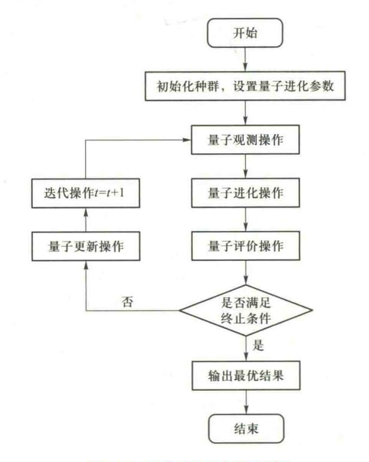

图 6.13 量子进化算法的流程图

{45}------------------------------------------------

## 6.6.4 基于量子进化算法的生产调度方法

量子进化算法已经得到越来越广泛的应用。下面介绍量子进化算法应用于求解 Flow Shop 生产调度问题。

### 1. 求解 Flow Shop 调度问题的量子讲化算法设计

(1) 量子编码:在 FSP 中,采用量子进化算法的基本原则,一个具有 m 个量子比特的量子染色体同样可以表示为

$$\begin{bmatrix} \alpha_1 & \alpha_2 & \dots & \alpha_m \\ \beta_1 & \beta_2 & \dots & \beta_m \end{bmatrix}$$

其中  $|\alpha_i|^2 + |\beta_i|^2 = 1, i = 1, 2, \dots, m_0$ 

- (2) 量子选择:所有量子染色体从好到差排序,然后复制前 pop\_size/5 项,pop\_size 表示种群规模,再用前 pop\_size/5 项代替最后 pop\_size/5 个个体。
- (3) 量子交叉:随机产生一个数 i(i) 小于等于染色体长度),然后交换量子染色体位于位置 i 之后的量子比特位  $\alpha_i, \cdots, \alpha_m$ 。
- (4) 量子变异:随机产生一个数 i(i) 小于等于染色体长度),然后交换量子染色体位于位置 i 的  $\alpha_i$ , $\beta_i$  的位置。
- (5) 量子更新:结合量子进化算法中的更新操作和 FSP 本身的特点。在 Flow Shop 调度问题中,可以根据当前最优解各个工件所在位置与种群中个体相应工件所在位置之间的距离 d 确定  $\Delta\theta_i$  的大小。如果距离大,那么需要增大其相应位置  $\alpha_i$  的值,距离越大其值就越大。如果距离为 0,那么  $\Delta\theta_i$  为零。例如,当前最优解为[2 1 4 3],种群中的一个个体为[1 2 3 4],当前最优解中,工件 2 排在最前面,个体中工件 2 排在第二,那么 d=1,为了使种群往当前最优解方向发展,那么就需要增大工件 2 相应位置概率幅的值。d 值越大,相应  $\Delta\theta_i$  的值就应该越大。
  - (6) 量子观测:通过量子观测,将量子染色体转变成一般的实数染色体。
- (7) 量子评价:在流水车间调度问题当中,问题的解为所有工件的排列。所以应该把用量子比特表示的量子染色体转化为工件的排列。在量子染色体中,认为[ $\alpha_1$   $\alpha_2$  ···  $\alpha_m$ ]分别表示工件 1,2,···,m 的概率幅,m 为染色体长度。那么工件 i 排在前面的概率为  $|\alpha_i|^2$ ,即  $|\alpha_i|^2$  越大,工件 i 排在前面的可能性越大。例如,三个工件的染色体  $[\alpha_1$   $\alpha_2$   $\alpha_3$ ],表示工件 1,2,3 排在前的概率分别为  $|\alpha_1|^2$ ,  $|\alpha_2|^2$ ,  $|\alpha_3|^2$ 。如果  $|\alpha_3|^2$  >  $|\alpha_1|^2$  >  $|\alpha_2|^2$ ,就说明工件的排列顺序为  $[3\ 1\ 2]$ ,即根据概率大小确定工件的排列。

## 2. Flow Shop 调度问题实例

为了测试 QEA 算法的性能,采用由 Carlier 设计的 8 个不同规模的 Benchmark 问题 Carl, Car2,…,Car8 进行实验。

仿真时的参数设置为:种群规模 40,最大代数(停止条件)为 J×M,染色体长度为 J,量子交叉

{46}------------------------------------------------

概率和遗传交叉概率为1,量子变异概率和遗传变异概率都为0.05。

对于每个问题,算法执行 20 次,仿真结果如表 6.6。其中的 RE 表示相对误差, BRE 和 ARE 分别表示最优和平均相对误差。

| λ¬ px | 工件数, | 100 War at 1870 Act | NEH   | QEA   |       |  |
|-------|------|---------------------|-------|-------|-------|--|
| 问题    | 机器数  | -, INCAMEN          | RE    | BRE   | ARE   |  |
| Car1  | 11,5 | 7 038               | 0     | 0     | 0     |  |
| Car2  | 13,4 | 7 166               | 2. 93 | 0     | 1. 90 |  |
| Car3  | 12,5 | 7 312               | 1. 19 | 1. 19 | 1. 65 |  |
| Car4  | 14,4 | 8 003               | 0     | 0     | 0.06  |  |
| Car5  | 10,6 | 7 720               | 1. 49 | 0     | 0.11  |  |
| Car6  | 8,9  | 8 505               | 3. 15 | 0     | 0. 19 |  |
| Car7  | 7,7  | 6 590               | 0     | 0     | 0     |  |
| Car8  | 8,8  | 8 366               | 2. 37 | 0     | 0.03  |  |

表 6.6 仿 真 结 果

从上表中可以看出,QEA 比经典 NEH 算法具有更好的性能。

# 6.7 小结

# 1. 基本遗传算法

遗传算法主要借用生物进化中"适者生存"的规律。

遗传算法的设计包括:编码、适应度函数、选择、控制参数、交叉与变异等遗传算子等。

遗传算法常用的编码方案有位串编码(二进制编码、Gray编码)、实数编码、有序串编码、结构式编码等。

遗传算法中初始群体中的个体可以是随机产生的。群体规模太小时,遗传算法的优化性能一般不会太好,容易陷入局部最优解。而当群体规模太大时,则计算复杂。

遗传算法的适应度函数是用来区分群体中的个体好坏的标准。适应度函数一般是由目标函数变换得到的,但必须将目标函数转换为求最大值的形式,而且保证函数值必须非负。为了防止欺骗问题,对适应度函数值域的某种映射变换,称为适应度函数的尺度变换或者定标。

个体选择概率的常用分配方法有适应度比例方法、排序方法等。选择个体方法主要有轮盘赌选择、锦标赛选择方法、最佳个体保存方法等。

遗传算法中起核心作用的是交叉算子。主要有一点交叉、二点交叉、均匀交叉等基本的交叉

{47}------------------------------------------------

算子,有部分匹配交叉、顺序交叉、循环交叉等修正的交叉方法。

变异操作主要有位点变异、逆转变异、插入变异、互换变异、移动变异等整数编码的变异方法,有均匀性变异、正态性变异、非一致性变异等实数编码的变异方法。

### 2. 改进遗传算法

双倍体遗传算法群体中的每个个体具有一个显性染色体,一个隐性染色体。每个染色体的编码/解码方式与基本的遗传算法相同。双倍体遗传算法采用显性遗传,即计算显性染色体的适应度,按照显性染色体的适应度进行选择、交叉、变异操作,隐性染色体也同时进行操作。当三个遗传算子都执行完成以后,将个体的染色体显隐性进行重新排定,个体中适应值较大的染色体设定为显性染色体,适应值较小的染色体设定为隐性染色体。

双种群遗传算法建立两个遗传算法群体,分别独立地运行复制、交叉、变异操作,同时当每一代运行结束以后,选择两个种群中的随机个体及最优个体分别交换。

自适应遗传算法的交叉和变异概率能够随适应度自动改变。当种群各个体适应度趋于一致或者趋于局部最优时,使交叉和变异概率增加,以跳出局部最优;而当群体适应度比较分散时,使交叉和变异概率减少,以利于优良个体的生存。

### 3. 基本差分进化算法

差分进化算法是一种基于实数编码的具有保优思想的贪婪遗传算法,也包括选择、交叉和变异等操作,但在产生子代的方式上有所不同,DE 在父代个体间的差向量基础上生成变异个体,然后按一定的概率对父代个体与变异个体进行交叉操作,最后采用"贪婪"选择策略产生子代个体。

### 4. 基本量子进化算法

量子进化算法建立在量子的态矢量表达基础上,是一种基于量子位、量子叠加态等量子机制的进化算法。主要包含了六个基本要素:量子编码初始化种群、量子观测、进化操作、量子评价、量子更新等。

# 思考题

- 6.1 遗传算法的基本步骤和主要特点是什么?
- 6.2 适应度函数在遗传算法中的作用是什么?试举例说明如何构造适应度函数。
- 6.3 选择的基本思想是什么?
- 6.4 遗传算法避免局部最优解的关键技术是什么?
- 6.5 解释多倍体遗传算法与基本遗传算法的异同。
- 6.6 解释多种群遗传算法与基本遗传算法的异同。
- 6.7 解释自适应遗传算法与基本遗传算法的异同。
- 6.8 简述差分进化算法的流程。
- 6.9 简述量子进化算法的流程。

{48}------------------------------------------------

# 习题

- **6.1** 编制遗传算法的计算程序,具体求解一个优化问题。记录算法结束时的迭代次数,画出最优个体的适应度变化曲线和群体适应度的平均值变化曲线。
- **6.2** 已知 10 个个体的适应度如题 6.2 表所示,用幂函数变换法求出调整后的适应度值(K=2),然后采用适应度比例法分别求出调整前后各个个体的选择概率。

| 型 6.2 农 |      |          |       |              |  |  |  |  |  |  |
|---------|------|----------|-------|--------------|--|--|--|--|--|--|
| 个体编号    | 原适应度 | 调整后的 适应度 | 原选择概率 | 调整后的<br>选择概率 |  |  |  |  |  |  |
| 1       | 2. 5 |          |       |              |  |  |  |  |  |  |
| 2       | 1.0  |          | _     |              |  |  |  |  |  |  |
| 3       | 3. 0 |          |       |              |  |  |  |  |  |  |
| 4       | 1. 2 |          |       |              |  |  |  |  |  |  |
| 5       | 2. 1 |          |       |              |  |  |  |  |  |  |
| 6       | 0.8  |          |       |              |  |  |  |  |  |  |
| 7       | 2. 3 |          |       |              |  |  |  |  |  |  |
| 8       | 1.5  |          |       |              |  |  |  |  |  |  |
| 9       | 0. 9 |          |       |              |  |  |  |  |  |  |
| 10      | 1.8  |          |       |              |  |  |  |  |  |  |

颞 6.2 表

6.3 用遗传算法求解下列非线性函数的最小值:

$$f(x_1, x_2) = \frac{-\sin(x_1) + \sqrt{x_1^2 - 4x_2^2}}{x_2}$$
$$0 \le x_i \le 1.5, \quad i = 1, 2$$

- (1) 若采用二进制编码,要求编码精度为 0.01,试确定染色体的长度;
- (2) 描述二进制编码的优势与特点。
- 6.4 用遗传算法求解下列非线性函数的最小值:

$$f(x_1, x_2) = \frac{\cos(x_1) + \sin(x_2)}{\sqrt{x_1^2 + x_2^2}}$$

{49}------------------------------------------------

# $0 \le x_i \le 1.5$ , i = 1, 2

- (1) 若采用二进制编码,要求编码精度为0.1,试确定染色体的长度;
- (2) 描述二进制编码的优势与特点;
- (3) 分析交叉概率和变异概率对遗传算法性能的影响。