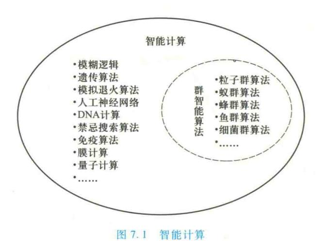
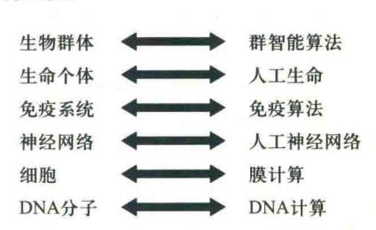
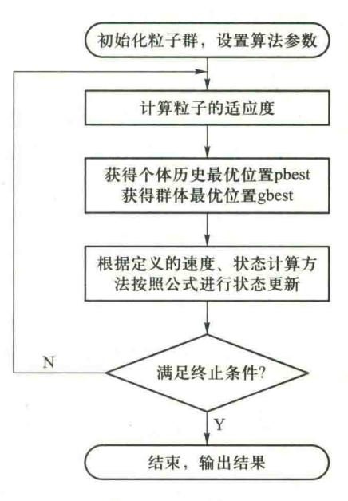
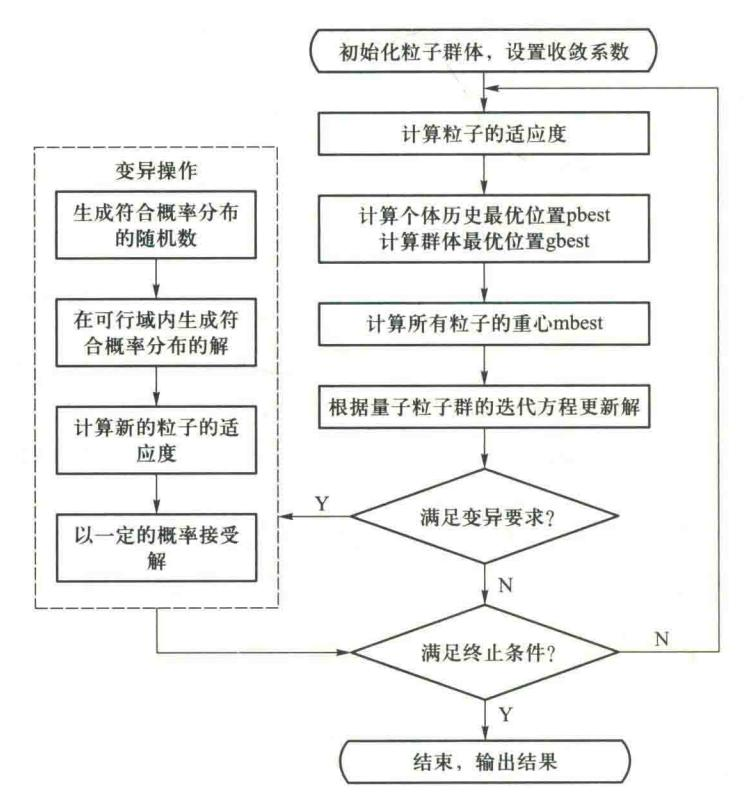
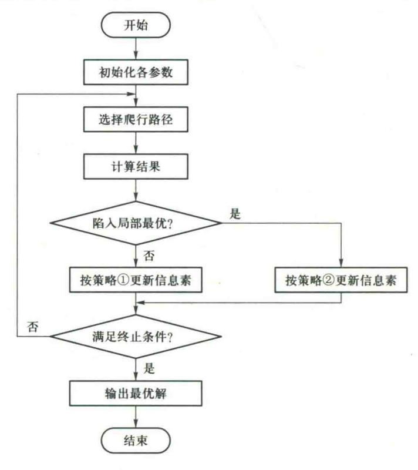
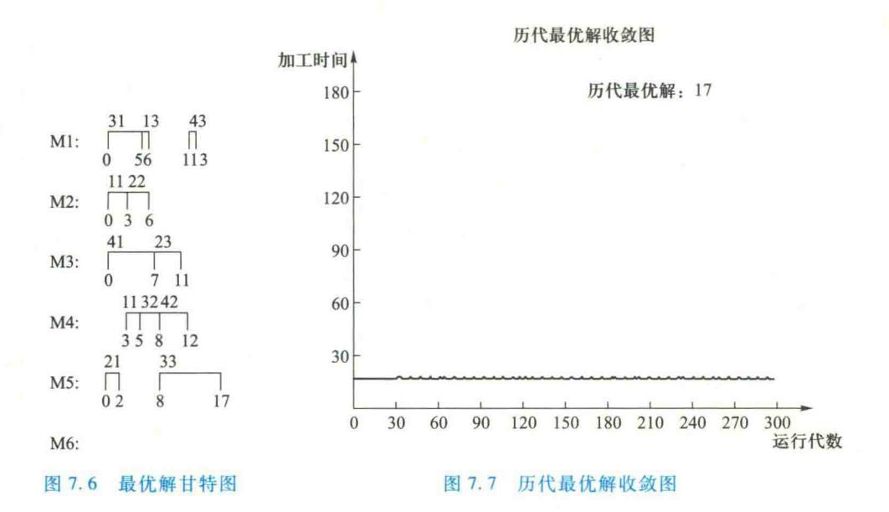

{0}------------------------------------------------

# 第7章 群智能算法及其应用

智能优化方法中受动物群体智能启发的算法称为群智能算法。本章首先简要介绍群智能算法产生的背景,然后详细介绍粒子群优化算法、量子粒子群优化算法、蚁群算法等群智能算法及其应用。

# 7.1 群智能算法产生的背景

在众多智能计算方法中,受动物群体智能启发的算法称为群智能(swarm intelligence, SI)算法,如图 7.1 所示。

自然界中有许多现象令人惊奇,如蚂蚁搬家、鸟群觅食、蜜蜂筑巢等,这些现象不仅吸引生物学家去研究,也让计算机学家痴迷。

鸟群的排列看起来似乎是随机的,其实它们有着惊人的同步性,这种同步性使得鸟群的整体运动非常流畅。有几位科学家对鸟群的运动进行了计算机仿真,他们让每个个体按照特定的规则运动,形成鸟群整体的复杂行为。所提模型成功的关键在于对个体间距离的操作,也就是说群体行为的同步性是因为个体努力维持自身与邻居之间的距离为最优,为此每个个体必须知道自身位置和邻居的信息。生物社会学家 E.O.Wilson 也曾说过"至少从理论上,在搜索食物的过程中群体中的个体成员可以得益于所有其他成员的发现和先前的经历。当食物源不可预测地零星分布时,这种协作带来的优势是决定性的,远大于对食物的竞争带来的劣势。"

这些在由简单个体组成的群落与环境以及个体之间的互动行为,称为"群智能"。群智能算

{1}------------------------------------------------

法是基于群体行为对给定的目标进行寻优的启发式搜索算法,其寻优过程体现了随机、并行和分布式等特点。在计算智能领域,群智能算法包括:粒子群优化算法、蚁群算法和人工免疫算法。粒子群优化算法起源于对简单社会系统的模拟。最初设想是用粒子群优化算法模拟鸟群觅食的过程,但后来发现它是一种很好的优化工具。蚁群算法是对蚂蚁群落食物采集过程的模拟,已经成功运用在很多离散优化问题上。

从生物社会学的角度,群智能是蚂蚁、鸟群等社会性动物在觅食、御敌、筑巢等活动中所表现出的一种集体形式的"智能"。从计算机科学的角度,群智能可以定义为由非智能主体组成的系统通过相互之间或环境之间的交互作用表现出的集体智能行为。从应用的角度,群智能是以社会性动物群体行为和人工生命理论为基础,研究各群体行为的内在原理,并以这些原理为基础设计新的问题求解方法。

图 7.2 表示了生物学上的现象与对应的仿生智能计算的关系。

群智能算法与进化算法既有相同之处,也有明显的不同之处。相同之处:首先,群智能算法和进化算法都是受自然现象的启发,基于抽取出的简单自然规则而发展出的计算模型;其次,两者又都是基于种群的方法,且种群中的个体之间、个体与环境之间存在相互作用;最后,两者都是一种元启发式随机搜索方法。不同之处:进化算法方法强调种群的达尔文主义的进化模型,而群智能算法则注重对群体中个体之间的相互作用与分布式协同的模拟。

图 7.2 生物层次与仿生智能 计算的对应关系

# 7.2 粒子群优化算法

# 7.2.1 粒子群优化算法的基本原理

粒子群优化(particle swarm optimization, PSO)算法是美国普渡大学的社会心理学家 Kennedy 和电气工程师 Eberhart 受到他们早期对鸟类群体行为研究结果的启发,于 1995 年在 IEEE International Conference on Neural Networks 国际会议上提出的一种仿生优化算法,利用并改进了生物学家的生物群体模型,使粒子能够飞向解空间并在最优解处降落。PSO 算法是一种全局优化算法,通过群体中粒子间的合作与竞争产生的群体智能指导优化搜索。

PSO 算法与其他进化算法相似,也是基于群体的,根据对环境的适应度将群体中的个体移动到好的区域,然而它不像其他进化算法那样对个体使用进化算子,而是将每个个体看作 n 维搜索空间中一个没有体积质量的粒子,在搜索空间中以一定的速度飞行。

粒子群优化算法在n 维连续搜索空间中,对粒子群中的第 $i(i=1,2,\cdots,m)$ 个粒子,定义n 维当前位置向量  $x^i(k) = \begin{bmatrix} x_1^i & x_2^i & \cdots & x_n^i \end{bmatrix}^{\mathrm{T}}$  表示搜索空间中粒子i 的当前位置,n 维最优位置向量  $p^i(k) = \begin{bmatrix} p_1^i & p_2^i & \cdots & p_n^i \end{bmatrix}^{\mathrm{T}}$  表示粒子i 至今所获得的具有最优适应度  $f_p^i(k)$  的位置。

{2}------------------------------------------------

群体经历过的最优位置(gbest)记为  $p^s(k) = \begin{bmatrix} p_1^s & p_2^s & \cdots & p_n^s \end{bmatrix}^T$ , n 维速度向量  $v^i(k) = \begin{bmatrix} v_1^i & v_2^i & \cdots & v_n^i \end{bmatrix}^T$  表示粒子 i 当前的运行速度,则基本的 PSO 算法为

$$v_{j}^{i}(k+1) = \omega(k)v_{j}^{i}(k) + \varphi_{1}rand(0, a_{1})(p_{j}^{i}(k) - x_{j}^{i}(k)) + \varphi_{2}rand(0, a_{2})(p_{j}^{g}(k) - x_{j}^{i}(k))$$
(7. 1a)  
$$x_{j}^{i}(k+1) = x_{j}^{i}(k) + v_{j}^{i}(k+1)$$
$$i = 1, 2, \dots, m; \quad j = 1, 2, \dots, n$$

其中, $\omega$  是惯性权重因子。 $\varphi_1$ 、 $\varphi_2$  是加速度常数,均为非负值。 $rand(0,a_1)$  和  $rand(0,a_2)$  为  $[0,a_1]$ 、 $[0,a_2]$  范围内的具有均匀分布的随机数, $[a_1]$  与  $[a_2]$  为相应的控制参数。

式(7.1a)右边的第一部分表示粒子具有惯性,即下一时刻的速度与前一时刻的速度有关;第二部分为个体"认知(cognition)"分量,表示粒子本身的思考,将现有的位置和自己曾经经历过的最优位置相比。第三部分是群体"社会(social)"分量,表示粒子间的信息共享与相互合作。 $\varphi_1$  和  $\varphi_2$  分别控制个体认知分量和群体社会分量相对贡献的学习率。引入  $rand(0,a_1)$  和  $rand(0,a_2)$  将增加认知和社会搜索方向的随机性和算法多样性,避免陷入局部最优解。

基于学习率  $\varphi_1, \varphi_2$ , Kennedy 给出以下 4 种类型的 PSO 模型:

- (1) 若  $\varphi_1 > 0$ ,  $\varphi_2 > 0$ , 则称该算法为 PSO 全模型。
- (2) 若 $\varphi_1>0, \varphi_2=0$ ,则称该算法为 PSO 认知模型。
- (3) 若  $\varphi_1 = 0, \varphi_2 > 0$ ,则称该算法为 PSO 社会模型。
- (4) 若  $\varphi_1 = 0, \varphi_2 > 0$  且  $g \neq i$ ,则称该算法为 PSO 无私模型。

标准的粒子群优化算法分为两个版本:全局版和局部版。上面介绍的是全局版粒子群优化 算法。局部版与全局版的差别在于,用局部领域内最优邻居的状态代替整个群体的最优状态。 全局版的收敛速度比较快,但容易陷入局部极值点,而局部版搜索到的解可能更优,但速度较慢。

#### 粒子群优化算法的流程如下:

- ① 初始化每个粒子,即在允许范围内随机设置每个粒子的初始位置和速度。
- ② 评价每个粒子的适应度,计算每个粒子的目标函数。
- ③ 设置每个粒子经历过的最好位置  $P_i$ 。对每个粒子,将其适应度与其经历过的最好位置  $P_i$ 对应的适应度进行比较,如果优于  $P_i$ ,则将其作为该粒子的最好位置  $P_i$ 。
- ④ 设置全局最优值  $P_s$ 。对每个粒子,将其适应度与群体经历过的最好位置  $P_s$  进行比较,如果优于  $P_s$ ,则将其作为当前群体的最好位置  $P_s$ 。
  - ⑤ 根据式(7.1)更新粒子的速度和位置。
  - ⑥ 检查终止条件。如果未达到设定条件(预设误差或者迭代的次数),则返回第②步。 粒子群优化算法的流程图如图 7.3 所示。

# 7.2.2 粒子群优化算法的参数分析

## 1. PSO 算法的参数

PSO 算法的参数包括:群体规模 m,惯性权重  $\omega$ ,加速度  $\varphi_1$ 、 $\varphi_2$ ,最大速度  $V_{\max}$ ,最大代数  $G_{\max}$ 。

{3}------------------------------------------------

### (1) 最大速度 Vmax

对速度  $v_i$ ,算法中有最大速度  $V_{max}$ 作为限制,如果当前 粒子的某维速度大于最大速度  $V_{max}$ ,则该维的速度就被限制为最大速度  $V_{max}$ 。

最大速度  $V_{\text{max}}$ 决定当前位置与最好位置之间的区域的分辨率(或精度)。如果  $V_{\text{max}}$ 太大,粒子可能会飞过好的解;如果  $V_{\text{max}}$ 太小,粒子容易陷入局部最优解。

### (2) 权重因子

在 PSO 算法中有 3 个权重因子: 惯性权重 ω, 加速度 常数  $φ_1, φ_2$ 。

惯性权重  $\omega$  使粒子保持运动惯性,使其有扩展搜索空间的趋势,并有能力搜索新的区域。

加速度常数  $\varphi_1$  和  $\varphi_2$  代表将每个粒子推向  $P_i$  和  $P_s$  位置的统计加速度项的权重。低的值允许粒子在被拉回之前可以在目标区域外徘徊,而高的值则导致粒子突然冲向或者越过目标区域。

图 7.3 粒子群优化算法流程图

### 2. 位置更新方程中各部分的影响

对于式(7.1a),如果只有第一部分,而没有后两部分,即  $\varphi_1 = \varphi_2 = 0$ ,则粒子将保持当前的速度飞行,一直到达边界。由于它只能搜索有限的区域,所以很难找到最优解。

如果没有第一部分,即 $\omega$ =0,则速度只取决于粒子当前位置和其历史最好位置 $P_i$ 和 $P_g$ ,速度本身没有记忆性。假设一个粒子位于全局最好位置,它将保持静止。而其他粒子则飞向它本身最好位置 $P_i$ 和全局最好位置 $P_g$ 的加权中心。在这种条件下,粒子群将收敛到当前的全局最好位置,更像一个局部算法。加上第一部分后,粒子有扩展搜索空间的趋势,即第一部分有全局搜索能力。这也使得 $\omega$ 的作用为针对不同的搜索问题,调整算法全局和局部搜索能力的平衡。

如果没有第二部分,即  $\varphi_1$  = 0,则粒子没有认知能力,也就是"只有社会模型"。在粒子的相互作用下,有能力达到新的搜索空间。它的收敛速度比标准版本更快,但对复杂问题,则比标准版本更容易陷入局部最优点。

如果没有第三部分,即 $\varphi_2=0$ ,则粒子间没有社会共享信息,也就是"只有认知"模型。因为个体间没有交互,一个规模为M的群体等价于M个单个粒子的运行,因而得到最优解的概率非常小。

### 3. 参数设置

早期的实验将  $\omega$  固定为 1.0, $\varphi_1$  和  $\varphi_2$  固定为 2.0,因此  $V_{\max}$ 成为唯一需要调节的参数,通常 设为每维变化范围  $10\%\sim20\%$ 。Suganthan 的实验表明, $\varphi_1$  和  $\varphi_2$  为常数时可以得到较好的解,但 不一定必须为 2。

这些参数也可以通过模糊系统进行调节。Shi 和 Eberhart 提出一个模糊系统来调节  $\omega$ ,该系

{4}------------------------------------------------

统包括 9 条规则,有两个输入和一个输出。一个输入为当前代的全局最好适应值,另一个输入为当前的 $\omega$ ;输出为 $\omega$ 的变化。每个输入和输出定义了 3 个模糊集,结果显示该方法能显著提高平均适应值。

粒子群优化算法初始群体的产生方法与遗传算法类似。可以随机产生,也可以根据问题的固有知识产生。群体的初始化虽然也是影响算法性能的一个方面,但 Angeline 对不对称的初始化进行了实验,发现 PSO 只是略微受影响。粒子群优化算法的种群的大小根据问题的规模而定,同时要考虑运算的时间。

粒子的适应度函数根据具体问题而定,将目标函数转换成适应度函数的方法与遗传算法 类似。

在基本的粒子群优化算法中,粒子的编码使用实数编码方法。这种编码方法在求解连续的 函数优化问题时十分方便,同时对粒子的速度求解与粒子的位置更新也很自然。

# 7.3 量子粒子群优化算法

在经典力学中,粒子通过位置向量  $x_i$  和速度向量  $v_i$  来描述粒子的运动轨迹,粒子在牛顿力学确定的轨迹下移动。而在量子力学中是没有确定的轨迹的,因为根据海森堡不确定性原理,位置向量  $x_i$  和速度向量  $v_i$  是不可能同时确定的。因此,在粒子群算法中的个体加入量子行为,将会丰富算法中种群的多样性,提高算法的全局搜索能力。孙俊(Sun J)等受到量子空间中粒子运动的启发,于 2004 年提出了一种能够保证全局收敛的具有量子行为的量子粒子群优化(quantum-behaved particle swarm optimization,QPSO) 算法,其中建立基于量子  $\delta$  势阱的量子粒子群模型,粒子以一定的概率到达任何量子空间位置,即QPSO 算法同样以一定的概率在搜索空间中的任何位置产生一个新的解,这个策略能够避免粒子落入局部最优。

量子粒子群优化算法是基于吸引子的进化算法,更适合于连续优化问题,具有全局收敛性、 收敛速度快、寻优能力强等特点。

# 7.3.1 基本量子粒子群优化算法

在量子粒子群优化算法中,粒子不再被描述为位置向量  $x_i$  和速度向量  $v_i$ ,而是采用波函数 (wave-function)来表示。根据粒子群优化算法中粒子收敛性分析,种群中每个个体必定存在以  $p_i$  为中心的吸引势。基于量子理论,在  $p_i$  点吸引势中建立  $\delta$  势阱。

在量子搜索空间中,种群中粒子的变化遵循薛定谔方程(Schrödinger equation):

$$\frac{2m}{h^2} \left[ E + \gamma \delta(x - p_i) \psi \right] + \frac{d^2 \psi}{d(x - p_i)^2} = 0$$
 (7.2)

式(7.2)中,m为每个个体的质量,h为普朗克常量,E为种群中每个个体的能量。 粒子的波函数为

{5}------------------------------------------------

$$\psi(x-p_i) = \frac{1}{\sqrt{L}} \exp\left(-\frac{|x-p_i|}{L}\right) \tag{7.3}$$

式(7.3)中,波函数是时间和坐标的复函数,代表三维空间中每个个体的位置向量信息。种群中粒子出现在点位置 $p_i$ 的概率密度函数为

$$Q(x-p_i) = |\psi(x-p_i)|^2 = \frac{1}{L} \exp\left(-2\frac{|x-p_i|}{L}\right)$$
 (7.4a)

其中, $p_i$ 为每个粒子历史的最好位置。式(7.3)给出了粒子在量子空间中定态波函数。定态是具有一定能量的状态

参数 L 称为  $\delta$  势阱的特征长度, 定义为

$$L(t+1) = 2\beta \times |p_t - x(t)| \tag{7.4b}$$

L 指出了微粒的搜索空间范围。 $\beta$  称为收缩-扩张因子,用来控制粒子的收敛速度,取值是介于 (0,1) 之间的随机分布数,不同的 $\beta$  影响算法的收敛速度,一般取 $\beta$  的值为

$$\beta = \frac{(1.0 - 0.5) \times (MAXITER - t)}{MAXITER} + 0.5$$
 (7.4c)

其中, MAXITER 为最大迭代次数, t 为当前迭代次数。

为了求解群体中个体的精确位置信息,将量子状态塌缩到经典状态,即将个体从搜索空间过渡到解空间,由概率密度函数通过蒙特卡罗(Monte Carlo)方法计算得到粒子位置

$$x(t) = p_i \pm \frac{L}{2} \ln \left( \frac{1}{u} \right) \tag{7.5a}$$

$$u = rand(0,1) \tag{7.5b}$$

式(7.5)中, u是(0,1)之间的均匀分布随机数。

Sun J 在量子粒子群优化算法中引入平均最优位置 mbest (mean best position), mbest 为所有粒子的中心:

$$mbest = \sum_{i=1}^{M} \frac{p_i}{M} = \left(\sum_{i=1}^{M} \frac{pbest_{i1}}{M}, \sum_{i=1}^{M} \frac{pbest_{i2}}{M}, \dots, \sum_{i=1}^{M} \frac{pbest_{id}}{M}\right)$$
(7.6)

其中,M 是种群数目, $pbest_{i1}$ 是第i个粒子的个体最优,d表示粒子的维度。

通过将所有粒子的中心 mbest 取代每个粒子的最好位置  $p_i$ ,可以有效提高算法的全局搜索能力。

$$p_{id} = \mu pbest_i + (1 - \mu) gbest \tag{7.7}$$

式(7.7)中 $,p_{id}$ 为第i个粒子最优位置 $,\mu$ 为[0,1]上的均匀随机数,当 $\mu$ =0.5,代表 $pbest_i$ 与gbest的合成。

 $\delta$  势阱的特征长度 L 表示为

$$L(t+1) = 2\beta \mid mbest - x(t) \mid$$
 (7.8)

吸引子和特征长度有多种构造方法。在很多算法中,粒子的局部最优作为吸引子。粒子的当前位置和局部最优的距离、当前位置与局部最优的平均值的距离等都被尝试用来构建特征长度。

将式(7.8)代入参数 L, QPSO 算法的进化方程为

{6}------------------------------------------------

$$x_{id}(t+1) = \begin{cases} p_{id} + \beta \mid mbest - x_{id}(t) \mid \ln \frac{1}{u}, & \text{if } u < 0.5 \\ p_{id} - \beta \mid mbest - x_{id}(t) \mid \ln \frac{1}{u}, & \text{if } u \ge 0.5 \end{cases}$$
 (7.9)

其中, $x_{id}(t+1)$ 为个体在第 t+1 代的位置,式(7.9)实现对量子空间中粒子准确位置的测量。它是量子粒子群优化算法的核心迭代公式,通过不断更新吸引子  $p_i$  和特征长度 L,实现了粒子按照量子力学的运动形式在整个决策空间的高效搜索。

### 量子粒子群优化算法的基本步骤如下:

step1 初始化粒子群体。确定种群规模为 M,随机产生服从均匀分布的粒子的位置向量  $x_i(t) = (x_{ii}(t), x_{ij}(t), \cdots, x_{id}(t))$ ,其中  $i = 1, 2, \cdots, M$ ,个体位置向量均位于  $[x_{min}, x_{max}]$  范围之内。

step2 求解  $pbest_i$  和  $gbest_i$  设置个体历史最优值  $pbest_i = x_i$ , 计算每个粒子对应的适应度函数值, 并将群体中适应度函数值最优的粒子设置为全局最优值  $gbest_i$ 。

step3 根据公式(7.6)计算所有粒子的重心(mbest)。

step4 根据公式(7.7)来计算粒子的最优位置 $(p_{id})$ 。

step5 根据量子粒子群进化方程式(7.9)更新每个粒子的位置,产生新的种群。

step6 计算个体历史最优值(pbest)。根据适应度函数计算每一个微粒的适应度值,通过和个体的历史最优值比较,如果当前值优于个体历史最优值,则把当前值替换为个体最优值(pbest),否则不替换。

step7 计算群体的历史最优值(gbest)。计算所有微粒的适应值,并与当前的全局最优值(gbest)比较,若当前值优于全局最优值,则把当前值替换为全局最优值(gbest)。

step8 粒子适应度值满足收敛条件或者达到最大迭代次数,则算法结束,否则跳转到 step2 继续迭代执行。

# 7.3.2 改进量子粒子群优化算法

基本量子粒子群优化算法虽然相对于粒子群优化算法具有更好的收敛性和全局搜索能力,但是在求解约束优化问题的时候,会产生大量的不可行解,破坏种群的多样性,导致算法陷入局部极值。为了克服算法的早熟和陷入局部最优,使用不同的概率分布函数产生随机数作为变异概率。

### 1. 三种概率分布函数

### (1) 正态分布

正态分布是具有两个参数  $\mu$  和  $\sigma^2$  的连续型随机变量的分布,第一参数  $\mu$  是服从正态分布的随机变量的均值,第二个参数  $\sigma^2$  是此随机变量的方差。正态分布记作 $N(\mu,\sigma^2)$ 。服从正态分布的随机变量的概率规律为取与  $\mu$  邻近的值的概率大,而取与  $\mu$  越远的值的概率越小; $\sigma$  越小,分布越集中在  $\mu$  附近, $\sigma$  越大,分布越分散。正态分布的概率密度函数为

{7}------------------------------------------------

$$f(x) = \frac{1}{\sigma\sqrt{2\pi}} e^{-\frac{(x-\mu)^2}{2\sigma^2}}$$
 (7.10)

## (2) X2 分布

设随机变量  $X_1, X_2, \cdots, X_k$  相互独立,并且都服从标准正态分布 N(0,1),则随机变量  $X^2 = X_1^2 + X_2^2 + \cdots + X_k^2$  的概率密度函数为

$$f_{x^{2}}(x) = \begin{cases} \frac{1}{2^{\frac{k}{2}} \Gamma(\frac{k}{2})} x^{\frac{k}{2}-1} e^{-\frac{x}{2}}, & x > 0\\ 0, & x \leq 0 \end{cases}$$
 (7.11)

### (3) t 分布

设随机变量 X 与 Y 独立 ,并且 X 服从标准正态分布 N(0,1) , Y 服从自由度为 k 的  $X^2$  分布,则随机变量  $t=X\sqrt{\frac{k}{V}}$  的概率密度函数为

$$f_{t}(z) = \frac{\Gamma\left(\frac{k+1}{2}\right)}{\sqrt{k\pi} \Gamma\left(\frac{k}{2}\right)} \left(1 + \frac{z^{2}}{k}\right)^{\frac{k+1}{2}}$$

$$(7. 12)$$

### 2. 变异操作

(1) 生成符合正态分布的随机数

产生 U(0,1) 均匀分布的随机数 30 个,记为  $u_1,u_2,\cdots,u_{30}$ ;由于  $E(u_i)=\frac{1}{2},D(u_i)=\frac{1}{12}(i=1,0)$ 

 $2, \cdots, 30$ )。根据中心极限定理,可以认为近似服从均值为 $\frac{1}{2} \times 30 = 15$ ,方差为 $\frac{30}{12}$ 2.5的正态分布。

- (2) 对个体的每个维度产生在可行域区间内符合下列概率分布之一的可行解
- ① 正态分布

生成一个符合正态分布的随机数 v,变换  $x=\mu+\sigma v$ ,由正态分布的性质可知,它可以看作是来自正态分布  $N(\mu,\sigma^2)$ 的一个随机数。取  $\mu=\frac{X_{\max ii}-X_{\min ii}}{2}$ 。 $\sigma$  为可变参数,用于控制解在可行域范围内的分布情况。可行解  $X_{ii}'=u+\sigma v$ 。

# ② X2 分布

生成 k 个满足标准正态分布 N(0,1) 的随机数  $(Y_1,Y_2,\cdots,Y_k)$  ,取  $X^2=Y_1^2+Y_2^2+\cdots+Y_k^2$ 。 k 为可变参数,用于控制解在可行域范围内的分布情况。可行解  $X_{ii}'=X^2+\frac{X_{\max ii}-X_{\min ii}}{2}$ 。

## ③ t分布

生成 2 个满足标准正态分布 N(0,1) 的随机数 $(Y_1,Y_2)$ ,取 $\mathcal{X}^2 = Y_1^2 + Y_2^2$ ,生成一个符合正态分

{8}------------------------------------------------

布的随机数 X,取  $t=X\sqrt{\frac{2}{Y}}$ 。 可行解  $X'_{it}=t+\frac{X_{\max it}-X_{\min it}}{2}$ 。

### (3) 计算适应度

由前面所生成的个体  $X' = (x'_1, x'_2, x'_3, \cdots, x'_n)$  在可行域区间内,符合概率分布。根据适应度公式计算个体的适应度 f'(x)。

#### (4) 以一定的概率接受解

计算动态变异率

$$p_{m} = \frac{f'(x) - f(x)}{f(x)} + p_{\min}$$
 (7.13)

其中, f(x)为原个体的适应度。f'(x)为变异操作后个体的适应度。依照概率  $\min\{1, p_m\}>$  random[0,1]接受解,即将原个体 X 替换为变异后的解 X'。上式表明若  $p_m>1$  则表示 X'是个极好解,这个解必定被接受。

### 3. 改进量子粒子群优化算法流程

基于概率分布的量子粒子群优化算法如图 7.4 所示。

图 7.4 基于概率分布的量子粒子群优化算法流程图

{9}------------------------------------------------

# 7.4 粒子群优化算法的应用

## 7.4.1 粒子群优化算法应用领域

粒子群优化算法已在诸多领域得到应用,简单归纳如下:

- (1) 神经网络训练。利用 PSO 来训练神经元网络,将遗传算法与 PSO 结合来设计递归/模糊神经元网络等。利用 PSO 设计神经元网络是一种快速、高效并具有潜力的方法。
- (2) 化工系统领域。利用 PSO 求解苯乙烯聚合反应的最优稳态操作条件,获得了最大的转化率和最小的聚合体分散性;使用 PSO 来估计在化工动态模型中产生不同动态现象(如周期振荡、双周期振荡、混沌等)的参数区域,仿真结果显示提高了传统动态分叉分析的速度;利用 GP和 PSO 辨识最优生产过程模型及其参数。
- (3) 电力系统领域。将 PSO 用于最低成本发电扩张 GEP 问题,结合罚函数法解决带有强约束的组合优化问题;利用 PSO 优化电力系统稳压器参数;利用 PSO 解决考虑电压安全的无功功率和电压控制问题;利用 PSO 算法解决满足发电机约束的电力系统经济调度问题;利用 PSO 解决满足开、停机热备约束的机组调度问题。
- (4) 机械设计领域。利用 PSO 优化设计碳纤维强化塑料;利用 PSO 对降噪结构进行最优化设计。
  - (5) 通信领域。利用 PSO 设计电路;将 PSO 用于光通信系统的 PMD 补偿问题。
- (6) 机器人领域。利用 PSO 和基于 PSO 的模糊控制器对可移动式传感器进行导航;利用 PSO 求解机器人路径规划问题。
- (7) 经济领域。利用 PSO 求解博弈论中的均衡解;利用 PSO 和神经元网络解决最大利益的股票交易决策问题。
- (8) 图像处理领域。离散 PSO 方法解决多边形近似问题,提高多边形近似结果;利用 PSO 对用于放射治疗的模糊认知图的模型参数进行优化;利用基于 PSO 的微波图像法来确定电磁散射体的绝缘特性;利用结合局部搜索的混合 PSO 算法对生物医学图像进行配准。
- (9) 生物信息领域。利用 PSO 训练隐马尔可夫模型来处理蛋白质序列比对问题,克服利用 Baum-Welch 算法 HMMS 时容易陷入局部极小的缺点;利用基于自组织映射和 PSO 的混合聚类方法来解决基因聚类问题。
  - (10) 医学领域。离散 PSO 选择 MLR 和模型 PLS 的参数,并预测血管紧缩素的对抗性。
  - (11) 运筹学领域。基于可变领域搜索的 VNS 的 PSO,解决满足最小耗时指标的置换问题。

# 7.4.2 粒子群优化算法在 PID 参数整定中的应用

在计算机控制系统中,典型的 PID 控制系统的控制量 u 与偏差 e = (R-y) 之间满足以下差分方程:

{10}------------------------------------------------

$$u(n) = K_{p} \left[ e(n) + \frac{1}{T_{i}} \sum_{k=0}^{n} e(k) T + T_{d} \frac{e(n) - e(n-1)}{T} \right]$$
 (7.14)

PID 控制器就是通过调整  $K_p$ 、 $T_i$ 、 $T_d$ 这三个参数来使系统的控制性能达到给定的要求。从最优控制的角度,就是在  $K_p$ 、 $T_i$ 、 $T_d$ 这三个变量的参数空间中,寻找最优的值使系统的控制性能达到最优。

 $K_{\rm p}$ ,  $T_{\rm i}$ ,  $T_{\rm d}$ 这三个变量的参数空间是很大的。手工整定法建立在经验的基础上, 从根本上来说是一种试凑法, 对较大的参数空间它往往难以找到较优的结果。而基于其他优化方法的一些解析法也常常因对象模型的不确定而难以得到全局最优解。为优化 PID 参数, 可以选取如下函数作为评价控制性能的指标:

$$Q = \int_0^\infty t \mid e(t) \mid dt \tag{7.15}$$

#### 1. 编码与初始种群

早期的粒子群优化算法使用二进制编码,存在码位长,转化为浮点数的精度等问题。现在一般都采用实数编码。这里用三维空间的一个粒子表示 PID 的三个参数。

在初始群体的生成上,首先根据经验估计出 PID 三个参数的取值范围,在此范围内采用随机生成的方式,使粒子群优化算法在整个可行解空间中进行搜索。

#### 2. 适应度函数

由于 PID 参数优化是求目标函数 Q 的极小值问题,因而需要将极小值问题转换为极大值问题,适应度函数可以取为

$$F = \frac{1}{\int_0^\infty t \mid e(t) \mid dt}$$
 (7.16)

例如,采用 PID 控制器对被控对象进行控制,假定控制对象具有二阶惯性加延迟的模型,其传递函数为  $H(s) = \frac{e^{-0.4s}}{(0.3s+1)^2}$ 。假定采样周期选择为 0.1 s,根据经验  $K_p$  参数范围为(0,4), $T_i$  参数范围为(0,1), $T_a$  参数范围为(0,1)。取粒子群种群规模为 20,迭代次数为 50, $c_1$  的取值根据迭代的次数线性减小,初始值为 1.5,最终值 0.4。 $\varphi_1 = \varphi_2 = 2$ 。

PID 参数粒子群优化算法寻优结果见表 7.1。为了说明粒子群优化算法的有效性,表中同时也给出了用单纯形法的寻优结果。

| 算法            |           | $T_i$     | T d | <b>Q</b> 4. 842 32 |  |
|---------------|-----------|-----------|----------------|--------------------|--|
| 粒子群优化算法       | 0. 629 32 | 0. 593 49 | 0. 237 15      |                    |  |
| 单纯形法 0.630 57 |           | 0. 594 81 | 0. 237 03      | 4. 868 18          |  |

表 7.1 优化结果及比较

{11}------------------------------------------------

# 7.4.3 粒子群优化算法求解车辆路径问题

### 1. 车辆路径问题(VRP)的模型

车辆路径问题:假定配送中心最多可以用  $K(k=1,2,\cdots,K)$  辆车对  $L(i=1,2,\cdots,L)$  个客户进行运输配送,i=0 表示仓库。每个车辆载重为  $b_k(k=1,2,\cdots,K)$ ,每个客户的需求为  $d_i(i=1,2,\cdots,L)$ ,客户 i 到客户 j 的运输成本为  $c_i($  可以是距离,时间,费用等)。定义如下变量:

$$x_{ijk} = \begin{cases} 1 & \text{客户 } i \text{ 由车辆 } k \text{ 配送} \\ 0 & \text{其他} \end{cases}$$

$$x_{ijk} = \begin{cases} 1 & \text{车辆 } k \text{ 从 } i \text{ 访问 } j \\ 0 & \text{其他} \end{cases}$$

则车辆路径问题的数学模型如下表示:

$$\min \sum_{k=1}^{K} \sum_{i=0}^{L} \sum_{j=0}^{L} c_{ij} x_{ijk}$$
 (7.17a)

$$\sum_{i=1}^{L} d_{i} y_{ik} \leq b_{k} \forall k$$
 (7.17b)

$$\sum_{k=1}^{K} y_{ik} = 1 \quad \forall i \tag{7.17c}$$

$$\sum_{i=1}^{L} x_{ijk} = y_{jk} \quad \forall j, k \tag{7.17d}$$

$$\sum_{i=1}^{L} x_{ijk} = y_{ik} \quad \forall i, k \tag{7.17e}$$

$$\sum_{i:i \in S \times S} x_{ijk} \leq |S| - 1 \quad S \in \{1, 2, \dots, L\} \quad \forall k$$
 (7.17f)

$$x_{ijk} = 0 \text{ gd } 1 \quad \forall i, j, k$$
 (7.17g)

$$y_{ik} = 0 \quad \text{if} \quad \forall i, k \tag{7.17h}$$

约束(7.17b)为每辆车的能力约束。约束(7.17c)保证每个客户都被服务。约束(7.17d)、(7.17e)保证客户是仅被一辆车访问。约束(7.17f)消除子回路。(7.17g)、(7.17h)表示变量的取值范围。

### 2. 编码与初始种群

对这类组合优化问题,编码方式、初始解的设置对问题的求解都有很大的影响。采用常用的自然数编码方式。对于 K 辆车和 L 个客户的问题,用从 1 到 L 的自然数随机排列来产生一组解  $X = (x_1, x_2, \cdots, x_L)$ 。然后分别用节约法或最近插入法构造初始解。

#### 3. 实验结果

粒子群优化算法的各个参数设置如下:种群规模 P=50,迭代次数 N=1 000, $c_1$  的初始值为 1,随着迭代的进行,线性减小到 0, $c_2=c_3=1.4$ ,  $|V_{max}| \leq 100$ 。优化结果及其与遗传算法的比较 如表 7.2 所示。其中, dev(%) 为与最优解的偏差。

{12}------------------------------------------------

|           | P     | PSO     | GA    |        |  |
|-----------|-------|---------|-------|--------|--|
| 实例        | best  | dev( %) | best  | dev(%) |  |
| A-n32-k5  | 829   | 5. 73   | 818   | 4. 34  |  |
| A-n33-k5  | 705   | 6. 65   | 674   | 1. 97  |  |
| A-n34-k5  | 832   | 6. 94   | 821   | 5. 52  |  |
| A-n39-k6  | 872   | 6. 08   | 866   | 5. 35  |  |
| A-n44-k6  | 1 016 | 8. 49   | 991   | 5. 76  |  |
| A-n46-k7  | 977   | 6. 89   | 957   | 4.7    |  |
| A-n54-k7  | 1 205 | 3. 26   | 1 203 | 3. 08  |  |
| A-n60-k9  | 1 476 | 9. 01   | 1 410 | 4. 13  |  |
| A-n69-k9  | 1 275 | 10      | 1 243 | 7. 24  |  |
| A-n80-k10 | 1 992 | 12. 98  | 1 871 | 6. 12  |  |

表 7.2 优化结果及其与遗传算法的比较

# 7.5 基本蚁群算法

蚁群算法(ant colony optimization, ACO)是由意大利科学家 Marco Dorigo 等受蚂蚁觅食行为的启发,在 20 世纪 90 年代初提出来的。它是继模拟退火算法、遗传算法、禁忌搜索算法、人工神经网络算法等启发式搜索算法后的又一种应用于组合优化问题的启发式搜索算法。研究表明,蚁群算法在解决离散组合优化方面具有良好的性能,并在多方面得到应用。

Marco Dorigo, V. Maniezzo 等人在观察蚂蚁觅食习性时发现,蚂蚁总能找到巢穴与食物之间的最短路径。经研究发现,蚁群觅食时总存在信息素(phero-mone)跟踪和信息素遗留两种行为,即一方面蚂蚁会按照一定的概率沿着信息素较强的路径觅食,另一方面,蚂蚁会在走过的路上释放信息素,使得在一定范围内的其他蚂蚁能够觉察到并由此影响它们的行为。当一条路上的信息素越来越多,后来的蚂蚁选择这条路的概率也越来越大,从而进一步增加该路径的信息素强度,而其他路径上蚂蚁越来越少时,这条路径上的信息素会随着时间的推移逐渐减弱。这种选择过程称为蚂蚁的自催化过程,其原理是一种正反馈机制,所以蚂蚁系统也称为增强型学习系统。

20世纪90年代后期,这种算法逐渐引起了很多研究者的注意,他们对算法做了各种改进并应用到其他领域。Dorigo等提出了蚁群的算法框架,所有符合蚁群优化描述框架的蚂蚁算法都

{13}------------------------------------------------

可称之为蚁群优化算法,或简称为蚁群算法。Gutgahr 首先证明了 ACO 类算法的收敛性。

## 7.5.1 基本蚁群算法模型

蚁群算法的第一个应用是著名的旅行商问题(TSP), M. Dorigo 等人充分利用了蚁群搜索食物的过程与旅行商问题之间的相似性,通过人工模拟蚂蚁搜索食物的过程,即通过个体之间的信息交流与相互协作最终找到从蚁穴到食物源的最短路径,来求解旅行商问题。下面用旅行商问题阐明蚁群系统的模型。

设 m 是蚁群中蚂蚁的数量,给定 n 个城市的集合, $d_{xy}(x,y=1,\cdots,n)$  表示元素(城市)x 和元素(城市)y 之间的距离。欧几里得空间中, $d_{xy}=\sqrt{(X_x-X_y)^2+(Y_x-Y_y)^2}$ 。 $\eta_{xy}$ 表示能见度,称为启发信息函数,等于距离的倒数,即  $\eta_{xy}=\frac{1}{d_{xy}}$ 。 $b_x(t)$ 表示时刻 t 位于城市 x 的蚂蚁的个数, $m=\sum_{i=1}^{n}b_x(t)$ 。 $\tau_{xy}(t)$ 表示 t 时刻在 xy 连线上残留的信息素,各条路径上初始时刻的

蚂蚁  $k(k=1,\cdots,m)$  在运动过程中,根据各条路径上的信息素和启发信息决定转移方向。每只蚂蚁在 t 时刻选择下一个城市,并在 t+1 时刻到达那里。 $P_{xy}^k(t)$  表示在 t 时刻蚂蚁 k 选择从元素(城市) x 转移到元素(城市) y 的概率。

信息素相等,为一个小的正常数,即 $\tau_{co}(0) = C(const)$ 。

 $P_{xy}^k(t)$  由信息素  $\tau_{xy}(t)$  和局部启发信息  $\eta_{xy}$ 共同决定,也称为随机比例规则(random-proportional rule)。

$$P_{xy}^{k}(t) = \begin{cases} \frac{\left[\tau_{xy}(t)\right]^{\alpha} \left[\eta_{xy}\right]^{\beta}}{\sum_{y \in allowed_{k}(x)} \left[\tau_{xy}(t)\right]^{\alpha} \left[\eta_{xy}\right]^{\beta}} & if \quad y \in allowed_{k}(x) \\ 0 & \sharp \text{ th} \end{cases}$$

$$(7.18)$$

其中, $allowed_k(x) = \{1,2,\cdots,n\}$   $-tabu_k(x)$ ,表示蚂蚁 k 下一步允许选择的城市。 $tabu_k(x)$  ( $k = 1,2,\cdots,m$ ) 记录蚂蚁 k 当前所走过的城市。 $\alpha$  是信息素启发式因子,表示轨迹的相对重要性,反映了残留信息素浓度  $\tau_{xx}(t)$  在指导蚁群搜索中的相对重要程度。

 $\alpha$  值越大,该蚂蚁越倾向于选择其他蚂蚁经过的路径,该状态转移概率越接近于贪婪规则。 当  $\alpha=0$  时,就不再考虑信息素水平,算法就成为有多重起点的随机贪婪算法。而当  $\beta=0$  时,算 法就成为纯粹的正反馈的启发式算法。

随着时间的推移,以前留下的信息素逐渐挥发,用参数  $1-\rho$  表示信息素挥发程度,其中, $\rho$  为  $0\sim1$  之间的常数。 $\rho$  越小,信息素挥发越快。蚂蚁完成一次循环,各路径上信息素浓度挥发规则可以取为

$$\tau_{xy}(t+1) = \rho \tau_{xy}(t) + \Delta \tau_{xy}(t)$$
 (7.19)

x与y之间路径上的信息素增量为

{14}------------------------------------------------

$$\Delta \tau_{xy}(t) = \sum_{k=1}^{m} \Delta \tau_{xy}^{k}(t)$$
 (7.20)

M.Dorigo 给出  $\Delta \tau_{xy}^k(t)$  的三种不同模型。

第一种称为蚂蚁圈系统(ant-cycle system)。单只蚂蚁所访问路径上的信息素浓度更新规则为

$$\Delta \tau_{xy}^{k}(t) = \begin{cases} \frac{Q}{L_{k}} & \text{若第 } k \text{ 只蚂蚁在本次循环中从 } x \text{ 到 } y \\ 0 & \text{否则} \end{cases}$$
 (7.21)

其中, $\Delta \tau_{xy}(t)$ 为路径(x,y)上 t 到 t+1 时刻信息素的增量, $\Delta \tau_{xy}^k(t)$  为第 k 只蚂蚁 t 到 t+1 时刻留在路径(x,y)上信息素的增量。Q 为常数, $L_k$  为优化问题的目标函数值,表示第 k 只蚂蚁在本次循环中所走路径的长度。根据具体算法的不同, $\Delta \tau_{xy}^k(t)$ 、 $\Delta \tau_{xy}(t)$ 、 $\tau_{xy}(t)$  及  $P_{xy}^k(t)$ 的表达形式可以不同,要根据具体问题而定。

第二种称为蚂蚁数量系统(ant-quantity system):

$$\Delta \tau_{xy}^{k}(t) = \begin{cases} \frac{Q}{d_{xy}} & \text{若第 } k \text{ 只蚂蚁在本次循环中从 } x \text{ 到 } y \\ 0 & \text{否则} \end{cases}$$
 (7. 22)

第三种称为蚂蚁密度系统(ant-density system):

$$\Delta \tau_{xy}^{k}(t) = \begin{cases} Q & \text{若第 } k \text{ 只蚂蚁在本次循环中从 } x \text{ 到 } y \\ 0 & \text{否则} \end{cases}$$
 (7.23)

第一种模型利用的是整体信息,即蚂蚁完成一个循环后,更新所有路径上的信息,通常作为蚁群算法的基本模型。后两种模型利用的是局部信息,每走一步都要更新残留信息素的浓度,而非等到所有蚂蚁完成对所有 n 个城市的访问以后。

比较上述三种方法,蚂蚁圈系统的效果最好,这是因为它利用的是全局信息  $Q/L_k$ ,而其余两种算法用的是局部信息  $Q/d_{xy}$ 和 Q。全局信息更新方法很好地保证了残留信息素不会无限累积。如果路径没有被选中,那么上面的残留信息素会随时间的推移而逐渐减弱,这使算法能"忘记"不好的路径。即使路径经常被访问也不会因为  $\Delta \tau_{xy}^k(t)$  的累积,而产生  $\Delta \tau_{xy}^k(t) \gg \eta_{xy}(t)$  使期望值的作用无法体现。这充分体现了算法中全局范围内较短路径(较好解)的生存能力,加强了信息正反馈性能,提高了系统搜索收敛的速度。因而,在蚁群算法中,通常采用蚂蚁圈系统作为基本模型。

# 7.5.2 蚁群算法的参数选择

从蚁群搜索最短路径的机理不难看到,算法中有关参数的不同选择对蚁群算法的性能有至关重要的影响,但其选取的方法和原则,目前尚没有理论上的依据,通常都是根据经验而定。

{15}------------------------------------------------

信息素启发因子 $\alpha$ 。它的大小反映了蚁群在路径搜索中随机性因素作用的强度。其值越大,蚂蚁选择以前走过的路径的可能性越大,搜索的随机性减弱,但当 $\alpha$ 过大时会使蚁群的搜索过早陷入局部最优。

期望值启发式因子  $\beta$ 。它的大小反映了蚁群在路径搜索中先验性、确定性因素作用的强度,其值越大,蚂蚁在某个局部点上选择局部最短路径的可能性越大。虽然搜索的收敛速度得以加快,但蚁群在最优路径的搜索过程中随机性减弱,易于陷入局部最优。蚁群算法的全局寻优性能,首先要求蚁群的搜索过程必须有很强的随机性;而蚁群算法的快速收敛性能,又要求蚁群的搜索过程必须要有较高的确定性。因此, $\alpha$  和  $\beta$  对蚁群算法性能的影响和作用是相互配合、密切相关的。

信息素挥发度  $1-\rho$ 。蚁群算法与遗传算法等各种模拟进化算法一样,也存在着收敛速度慢、易于陷入局部最优等缺陷。而信息素挥发度  $1-\rho$  直接关系到蚁群算法的全局搜索能力及其收敛速度。由于信息素挥发度  $1-\rho$  的存在,当要处理的问题规模比较大时,会使那些从来未被搜索到的路径(可行解)上的信息量减小到接近于 0,因而降低了算法的全局搜索能力。但当  $1-\rho$  过大时,会使那些从未被搜索到的路径上的信息量减少到接近 0,所以以前搜索过的路径被再次选择的可能性也会过大,这会影响算法的随机性能和全局搜索能力。反之,通过减小信息素挥发度  $1-\rho$  虽然可以提高算法的随机性能和全局搜索能力,但又会使算法的收敛速度降低。

对于旅行商问题,单个蚂蚁在一次循环中所经过的路径,表现为问题的可行解集中的一个解,k个蚂蚁在一次循环中所经过的路径,则表现为问题的可行解集中的一个子集。显然,子集越大(即蚁群数量多)可以提高蚁群算法的全局搜索能力以及算法的稳定性。但蚂蚁数目增大后,会使大量的曾被搜索过的解(路径)上的信息素量的变化比较平均,信息素正反馈的作用不明显,搜索的随机性虽然得到了加强,但收敛速度减慢。反之,子集较小(即蚁群数量少),特别是当要处理的问题规模比较大时,会使那些从来未被搜索到的解(路径)上的信息素量减小到接近于0,搜索的随机性减弱,虽然收敛速度加快,但会使算法的全局性能降低,算法的稳定性差,容易出现过早停滞现象。

在蚂蚁圈系统模型中,总信息素量 Q 为蚂蚁循环—周时释放在所经过的路径上的信息素总量。总信息素量 Q 越大,则在蚂蚁已经走过的路径上信息素的累积越快,可以加强蚁群搜索时的正反馈性能,有助于算法的快速收敛。由于在蚁群算法中各个算法参数的作用实际上是紧密结合的,其中对算法性能起着主要作用的应该是信息素启发式因子  $\alpha$ 、期望启发式因子  $\beta$  和信息素残留常数  $\beta$  等三个参数。总信息素量  $\beta$  对算法性能的影响则有赖于上述三个参数的配置,以及算法模型的选取。例如,在蚂蚁圈系统模型和蚂蚁密度系统模型中,总信息素量  $\beta$  对算法性能的影响显然有较大的差异。同样,信息素的初始值  $\beta$ 0 对算法性能的影响不是很大。

{16}------------------------------------------------

# 7.6 改进蚁群算法

### 7.6.1 蚂蚁-Q系统

1995 年,意大利学者 M.Luca、M.Gambardella、M.Dorigo 提出了蚂蚁 – Q 系统 (ant – Q system)。该算法在 ACA 算法的随机比例规则基础上,在解构造过程中提出了伪随机比例状态迁移规则,从而能够实现解构造过程中知识探索和知识利用的平衡,并引入信息素局部更新过程,信息素局部更新规则引入了强化学习理论中的 Q 学习机制,此外在信息素的全局更新中采用了精英策略。随机数  $q \in [0,1]$ ,参数  $q_0 \in [0,1]$ ,决定了蚁群在搜索时的知识利用与探索之间的权重差别。

$$y = \begin{cases} \arg \max_{y \in allowed_k(x)} \left\{ \left[ HE(x, y) \right]^{\alpha} \cdot \left[ AQ(x, y) \right]^{\beta} \right\} & if \ q \leq q_0 \\ Y & otherwise \end{cases}$$
(7. 24)

根据式(7.24)计算概率分布:

$$P_{k}(x,y) = \begin{cases} \frac{\left[HE\left(x,y\right)\right]^{\alpha} \cdot \left[AQ\left(x,y\right)\right]^{\beta}}{\sum_{y \in allowed_{k}(x)}} & if y \in allowed_{k}(x) \\ 0 & otherwise \end{cases}$$

$$(7.25)$$

AQ 值按照如下规则进行更新:

$$AQ(x,y) \leftarrow (1-\alpha)AQ(x,y) + \alpha(\Delta AQ(x,y) + \gamma \cdot \max_{y \in allword_L(x)} AQ(x,y))$$
 (7.26)

$$\Delta AQ(x,y) = \begin{cases} \frac{w}{L_k} & \text{if ant } k \text{ goes from } x \text{ to } y\\ 0 & \text{otherwise} \end{cases}$$
 (7.27)

# 7.6.2 蚁群系统

1996 年, Gambardella 和 Dorigo 又在 Ant-Q 算法的基础上,提出一种修正的蚁群算法,称之为蚁群系统(ant colony system, ACS),该算法可以看成是 Ant-Q 算法的特例。它与前面提到的 ant-cycle system 算法的不同之处在于蚂蚁选择城市时遵循的规则不同,这里使用的是所谓的状态转移规则(state transition rule)

$$S_{k} = \begin{cases} \arg \max \left\{ \left[ \tau(r, s) \right]^{\alpha} \left[ \eta(r, s) \right]^{\beta} \right\} & q \leq q_{0} \\ S & 其他 \end{cases}$$
 (7.28)

 $S_k$  是序号为 k 的蚂蚁所选中的下一个节点, q 表示一个随机变量,  $q_0$  是一个适当选定的阈

{17}------------------------------------------------

值。蚂蚁在选择下一个城市之前先进行一次随机试验得 q,若  $q < q_0$ ,则选择城市时按第一种情况。选择当前信息素浓度最大的路径。上式中的第一种情况表示若自变量不在蚂蚁 k 的禁忌表  $J_k(r)$ 中,且令花括号中表达式最大,则整个表达式的值为该自变量的值,这称为知识利用,是非随机的方法(其余参数含义同前)。若 $q > q_0$ ,则按第二种情况随机选择变量 S,即采用基本蚁群算法的选择法,称为知识搜索,相当于遗传算法中的轮盘赌选择法。S 的概率分布  $P_k(r,s)$ 与前述ant-cycle algorithm 算法中的计算方法相同,参见公式 (7.25)。从中可以看出,上述算法和以前算法的主要不同在于蚂蚁选择下一城市之前,多进行了一次随机试验,将选择情况分成"利用已知信息"和"探索"两类。

Dorigo 等讨论不同的蚁群初始分布对求解的影响,提出了所谓的精英策略(elitist strategy),以强化精英蚂蚁(发现迄今最好路径的蚂蚁)的影响。结果发现,对精英蚂蚁数而言有一个最优的范围:低于此范围,增加精英蚂蚁数可较早地发现更好的路径,高于此范围,精英蚂蚁会在搜索早期迫使寻优过程始终在次优解附近,导致性能变差。

## 7.6.3 最大-最小蚂蚁系统

最大-最小蚂蚁系统(max-min ant system, MMAS)是德国学者 Thomas Stutzle 等在 1997 年提出的。该算法在启动时将所有支路上的信息素浓度初始化为最大值  $\tau_{max}$ ;为了更好地利用历史信息,每次迭代后按挥发系数  $\rho$  降低信息素浓度,只有最佳路径上的支路才允许增加其信息素浓度并保持在高水平上,也就是用当前找到的最好解更新信息素来指引蚂蚁向更高质量的解空间搜索的贪婪策略。信息素可按公式(7.29)进行更新。

$$\tau(x,y) = \rho \cdot \tau(x,y) + \Delta \tau(x,y)^{\text{best}}$$
 (7.29)

式中, $\Delta \tau (x,y)^{\text{best}} = \frac{1}{f(s^{\text{best}})}$ 。 $f(s^{\text{best}})$ 表示该次迭代中的最优路径或是全局最优路径的代价函数。

为了避免算法过早收敛于局部最优解,将各条路径可能的信息素浓度限制于 $[\tau_{\min}, \tau_{\max}]$ ,超出这个范围的值将被强制设为  $\tau_{\min}$ 或  $\tau_{\max}$ ,可以有效地避免某条路径上的信息量远大于其余路径,使得所有的蚂蚁都集中到同一条路径上,从而使算法不再扩散。但是,只采用最大最小信息素浓度的限制,还不足以在较长的运行时间里消除停滞现象,因此,采用了让轨迹上信息素浓度的增加正比于  $\tau_{\max}$ 和当前浓度  $\tau(x,y)$ 之差的平滑机制,如式(7.30)所示,其中  $0<\delta<1$ 。

$$\tau'(x,y) = \tau(x,y) + \delta(\tau_{\max}(x,y) - \tau(x,y))$$
 (7.30)

# 7.6.4 自适应蚁群算法

自适应蚁群算法能根据判断搜索结果是否陷入局部收敛从而采用一种新的信息素更新策略,自适应动态调整陷入局部收敛的蚂蚁所经过路径上的信息素 $\rho$  和信息素强度Q,使得算法能更快地跳出局部收敛,防止"早熟",同时对所有路径上的信息素取值限定范围,有利于算法的全局搜索。

{18}------------------------------------------------

### 1. 状态转移规则

第 k 只蚂蚁由节点 r 转移到节点 s 的概率按式(7.31) 计算,所得的概率记为  $P_{rs}^k$ 

$$P_{rs}^{k} = \begin{cases} \frac{\tau_{ij}^{\alpha} \cdot \eta_{ij}^{\beta}}{\sum_{i \in p} \tau_{ij}^{\alpha} \cdot \eta_{ij}^{\beta}} & if(p_{ij} < p_{imax}) \\ 0 & otherwise \end{cases}$$
(7.31)

其中, $\tau_{ij}$ 表示节点 r 到节点 s(其中 s 表示第 i 个工件的第 j 道工序)的信息素, $\eta_{ij}$ 表示节点 r 到节点 s 的可见度, $p_{ij}$ 表示第 i 个工件的第 j 道工序, $p_{imax}$ 表示第 i 个工件的最大工序, $\alpha$ 、 $\beta$  分别表示信息素和可见度的偏重系数,可见度  $\eta_{ij}$ 由公式(7.32)来计算。

$$\eta_{ij} = \frac{1}{t_{wait} + c} \tag{7.32}$$

其中, $t_{wait}$ 为在加工 $p_{ij}$ 前的等待时间。为了避免 $t_{wait}$ =0 而使可见度趋于无限大,同时分母为1时, $\eta_{ij}$ =1,偏重系数 $\beta$ 不起作用,故在分母加上常数c(c>1)以保证可见度对节点选择的影响,在算法具体实现时取c=2。经过式(7.31)计算后,再用轮盘赌方法从工件集中选择一个节点,并记下这个节点的起止时间,以便计算等待时间和最后完成所有工件的加工时间。

### 2. 判断是否发生局部收敛

各代所有蚂蚁爬行完毕后对所搜索到的最优解进行判断,看是否陷入局部收敛,判断方法如下:当连续几代最优蚂蚁搜索得到的路径相同时,算法即陷入了局部收敛,此时最优蚂蚁的爬行路径总长度相同,故可以认为当连续几代的最优蚂蚁爬行路径总长度相同时算法陷入了局部最优,在 job-shop 调度问题中即为连续几代搜索到的最大完工时间相同时发生局部收敛。

# 3. 自适应信息素挥发系数ρ

当算法陷入局部收敛时, $\rho$ 不再为常数,而是随着连续最优解相同的代数的增大而增大,表达式如下:

$$\rho = \begin{cases} \rho_0 & n \leq n_0 + 1 \\ 1 - \frac{1 - \rho_0}{n - n_0} & n > n_0 + 1 \end{cases}$$
 (7.33)

其中, $\rho_0$  为初始挥发度,n 为各代最优解连续相等的次数, $n_0$  为大于 1 的整数。当  $n>n_0+1$ 时, $\rho$  开始减小,n 越大  $\rho$  越小。算法具体实现时, $\rho_0$ 、 $n_0$  可以根据需要进行调节。

# 4. 自适应信息素强度 Q(n)

当算法陷入局部收敛时,采用时变函数 Q(n)来代替基本蚁群算法中调整信息素  $\Delta \tau_{ij}^k = Q/L_k$ 中为常数项的信息素强度 Q,即选择  $\Delta \tau_{ij}^k = Q(n)/L_k$ ,Q(n) 随着人工蚂蚁搜索过程动态地调整,如下所示:

$$Q(n) = \begin{cases} Q_0 & n \leq n_0 \\ -Q_0 \times (n - n_0) & n > n_0 \end{cases}$$
 (7.34)

{19}------------------------------------------------

其中, Q。为初始信息素强度, 可以根据需要调整。

### 5. 改进的信息素更新策略

信息素更新策略存在多种方式,如果对人工蚂蚁走过的全部路径上的信息素进行更新,则容易导致算法获得的结果振荡,不易收敛;若只是更新人工蚂蚁目前搜索到最优边上的信息素,则进一步加强了蚁群算法的正反馈作用,导致搜索过程迅速陷入局部最优解。

记l为每代最优解对应的蚂蚁,蚂蚁总数为m。为了进一步克服蚁群算法的上述问题,可以采用如下两种更新策略:

(1) 当算法未陷人局部最优时,采用全局更新和局部更新结合的策略,其中 $\rho$  和 Q 均为初始值:

步骤1 全局更新,计算所有蚂蚁经过路径上的信息素增量:

$$\Delta \tau_{ij} = \sum_{k=1}^{m} \Delta \tau_{ij}^{k}, \quad \Delta \tau_{ij}^{k} = Q(n)/L_{k}, \quad Q(n) = Q_{0}, k = 1, \dots, m$$
 (7.35)

 $\Delta \tau_{ij}^k$ 为蚂蚁 k 在经过路径上留下的信息素  $L_k$  为蚂蚁 k 经过路径长度  $\Delta \tau_{ij}$  为所有经过路径 ij 的蚂蚁留下的信息素总和。

步骤 2 局部更新,如果该代最优解为历代最优解,则调整蚂蚁 l 经过路径上的信息素增量:

$$\Delta \tau_{ij(\text{new})}^{(l)} = \Delta \tau_{ij(\text{old})}^{(l)} + \Delta \tau_{ij}^{l}, \quad \Delta \tau_{ij}^{l} = Q(n)/L_{l}, \quad Q(n) = Q_{0}$$
 (7.36)

 $\Delta \tau_{ij(\text{new})}^{(l)}$ 为经全局和局部更新后第 l 只蚂蚁经过路径上的信息素增量, $\Delta \tau_{ij(\text{old})}^{(l)}$ 为全局更新后第 l 只蚂蚁经过路径上的信息素增量, $\Delta \tau_{ii}^{l}$ 为蚂蚁 l 在经过路径上留下的信息素。

步骤 3 更新所有蚂蚁经过路径上的信息素:

$$\tau_{ii(\text{new})} = (1 - \rho) \tau_{ii(\text{old})} + \Delta \tau_{ii}, \quad \rho = \rho_0$$
 (7.37)

 $\tau_{ij(new)}$ 为此次循环后各路径上的信息素, $\tau_{ij(old)}$ 为此次循环前各路径上的信息素, $\tau_{ij}$ 为全局和局部更新后各路径上的信息素增量。

(2) 当算法陷入局部最优时,仅采用全局更新策略。

步骤1 计算除最优蚂蚁 l 外所有其他蚂蚁经过路径上的信息素增量:

$$\Delta \tau_{ij} = \sum_{k=1}^{m} \Delta \tau_{ij}^{k}, \quad \Delta \tau_{ij}^{k} = Q(n)/L_{k}, \quad Q(n) = Q_{0}, \quad k = 1, \dots, l-1, l+1, \dots, m$$
 (7.38)

步骤 2 计算蚂蚁 l 经过的路径上的信息素增量:

$$\Delta \tau_{ii}^{(l)} = \Delta \tau_{ii}^{l}, \quad \Delta \tau_{ii}^{l} = Q(n)/L_{l}, \quad Q(n) = -Q_{0} \times (n - n_{0})$$
 (7.39)

步骤 3 更新除蚂蚁 l 外所有其他蚂蚁经过路径上的信息素:

$$\tau_{ii} = (1 - \rho) \tau_{ii} + \Delta \tau_{ii}, \quad \rho = \rho_0 \tag{7.40}$$

步骤 4 更新蚂蚁 l 经过路径上的信息素:

$$\tau_{ij}^{(l)} = (1 - \rho) \tau_{ij}^{(l)} + \Delta \tau_{ij}^{(l)}, \quad \rho = 1 - \frac{1 - \rho_0}{n - n_0}$$
(7.41)

{20}------------------------------------------------

使用该策略后,在算法初期一般  $n \leq n_0$ ,未陷入局部收敛,此时采用全局更新和局部更新可以使最优路径上的信息量快速增加,算法收敛速度加快。当迭代到一定代数后,由于个别路径上的信息素迅速增加,解趋向于单一化,如果此时还不是我们所要求的满意解,迭代最优解就会相同,算法倾向于局部收敛,n 不断增大,当  $n > n_0$  时算法陷入局部收敛,此时自适应  $\rho$  ,Q 使蚂蚁 l 经过路径即最优路径上的信息素挥发度增大,信息素增量  $\Delta \tau_{ij}^{(l)}$  变为负值,并且搜索陷入局部收敛越深, $\rho$  越大, $|\Delta \tau_{ij}^{(l)}|$  越大,最优路径上的信息素减小越快。需要注意的是最优路径的信息素  $\rho$  虽然随着 n 的增加而减小,但绝对不会小于 0 ,当最优路径上的 $\rho$  减小到不明显比其他路径上的  $\rho$  大时蚂蚁就不会再选择该路径,因此最优路径发生变化,算法跳出局部收敛,先前最优路径上的  $\rho$  不再减小。其他非蚂蚁 l 经过路径上的信息素更新规则不变。这种信息素更新策略可以使解重新趋于多样化,算法快速跳出局部收敛。经过对 JSP 问题的仿真表明该方法比其他的算法更容易跳出局部收敛,搜索到更好的解。

### 6. 限定信息素的范围

通过缩小各路径信息素的差距,可以使算法有更好的全局收敛性。对各路径上的信息素进行限定,以防止某些路径上的信息素过大或过小而影响算法的全局收敛性。

改进自适应蚁群算法的流程如图 7.5 所示。

图 7.5 自适应蚁群算法流程图

{21}------------------------------------------------

# 7.7 蚁群算法的应用

柔性作业车间调度问题:某加工系统有 6 台机床,要加工 4 个工件,每个工件有 3 道工序,如表 7.3 所示。比如工序  $p_{11}$ 代表第一个工件的第一道工序,可由机床 1 用 2 个单元时间完成,或由机床 2 用 3 个单元时间完成,或由机床 3 用 4 个单元时间完成。

| 工序选择        |                        | 加工机床及加工时间 |   |    |   |   |    |  |
|-------------|------------------------|-----------|---|----|---|---|----|--|
|             |                        | 1         | 2 | 3  | 4 | 5 | 6  |  |
| $J_{\rm t}$ | P 11        | 2         | 3 | 4  |   |   |    |  |
|             | <i>p</i> 12 |           | 3 |    | 2 | 4 |    |  |
|             | P 13        | 1         | 4 | 5  |   |   |    |  |
| $J_2$       | P 21        | 3         |   | 5  |   | 2 |    |  |
|             | P 22                   | 4         | 3 |    | 6 |   |    |  |
|             | P 23        |           |   | 4  |   | 7 | 11 |  |
| $J_3$       | P 31        | 5         | 6 |    |   |   |    |  |
|             | P 32        |           | 4 |    | 3 | 5 |    |  |
|             | P 33        |           |   | 13 |   | 9 | 12 |  |
| $J_4$       | $p_{41}$               | 9         |   | 7  | 9 |   |    |  |
|             | P 42        |           | 6 | _  | 4 |   | 5  |  |
|             | P 43        | 1         |   | 3  |   |   | 3  |  |

表 7.3 柔性作业车间调度事例

经算法运行 300 代后,得到最优解为 17 个单元时间。甘特图、历代最优解收敛图分别如图 7.6、图 7.7 所示。

由图 7.6 可以看出机器 6 并没有加工任何工件。分析其原因为它虽然可以加工工序  $p_{23}$ 、 $p_{33}$ 、 $p_{42}$ 、 $p_{43}$ ,但从表 7.3 可知机器 6 的加工时间大于其他可加工机器,特别是  $p_{23}$ 、 $p_{33}$ 的加工时间,因此机器 6 并未分到任何加工任务。

由图 7.7 可知,算法在大约 30 代以前就收敛到最优解,且各代最优解相差不大,可见算法较为稳定。

{22}------------------------------------------------

# 7.8 小结

### 1. 粒子群优化算法

- ① 初始化每个粒子,即在允许范围内随机设置每个粒子的初始位置和速度。
- ② 评价每个粒子的适应度,计算每个粒子的目标函数。
- ③ 设置每个粒子的  $P_i$ 。对每个粒子,将其适应度与其经历过的最好位置  $P_i$  进行比较,如果优于  $P_i$ ,则将其作为该粒子的最好位置  $P_i$ 。
- ④ 设置全局最优值  $P_g$ 。对每个粒子,将其适应度与群体经历过的最好位置  $P_g$  进行比较,如果优于  $P_g$ ,则将其作为当前群体的最好位置  $P_g$ 。
  - ⑤ 根据式(7.1)更新粒子的速度和位置。
  - ⑥ 检查终止条件。如果未达到设定条件(预设误差或者迭代的次数),则返回第② 步。

# 2. 量子粒子群优化算法

- ① 确定种群规模和粒子维数,初始化粒子群体。
- ② 计算个体历史最优值:根据适应度函数计算每一个微粒的适应度值,通过和个体的历史最优值比较,如果当前值优于个体历史最优值,则把当前值替换为个体最优值,否则不替换。
- ③ 计算群体的历史最优值:计算所有微粒的适应值,并与当前的全局最优值比较,若当前值优于全局最优值,则把当前值替换为全局最优值。
  - ④ 计算所有粒子的重心:根据公式(7.5)来更新所有粒子的重心。
  - ⑤ 根据量子粒子群进化方程(7.9)更新每个粒子的位置,产生新的种群。

{23}------------------------------------------------

⑥ 粒子适应度满足收敛条件或者是达到最大迭代次数,则算法结束,否则跳转到步骤2继 续迭代执行。

### 3. 基本蚁群算法

蚂蚁在运动过程中,根据各条路径上的信息素和启发信息按概率决定转移方向。 在 t 时刻蚂蚁 k 选择从元素(城市)x 转移到元素(城市)y 的概率:

$$P_{xy}^{k}(t) = \begin{cases} \frac{\left[\tau_{xy}(t)\right]^{\alpha} \left[\eta_{xy}\right]^{\beta}}{\sum\limits_{y \in allowed_{k}(x)} \left[\tau_{xy}(t)\right]^{\alpha} \left[\eta_{xy}\right]^{\beta}} & if \quad y \in allowed_{k}(x) \\ 0 & \sharp \&$$

α 值越大,该蚂蚁越倾向于选择其他蚂蚁经过的路径,该状态转移概率越接近于贪婪规则。 当  $\alpha=0$  时,就不再考虑信息素水平,算法就成为有多重起点的随机贪婪算法。而当  $\beta=0$  时,算 法就成为纯粹的正反馈的启发式算法。

各路径上信息素浓度消散规则为: $\tau_{xy}(t+1) = \rho \tau_{xy}(t) + \Delta \tau_{xy}(t)$ 

蚁群的信息素浓度更新规则为: 
$$\Delta \tau_{xy}(t) = \sum_{k=1}^{m} \Delta \tau_{xy}^{k}(t)$$

蚂蚁圈系统 : 
$$\Delta \tau_{xy}^k(t) = \begin{cases} \frac{Q}{L_k} & \text{若第 } k \text{ 只蚂蚁在本次循环中从 } x \text{ 到 } y \\ 0 & \text{否则} \end{cases}$$

蚂蚁圈系统: 
$$\Delta \tau_{xy}^k(t) = \begin{cases} \frac{Q}{L_k} & \text{若第 } k \text{ 只蚂蚁在本次循环中从 } x \text{ 到 } y \\ 0 & \text{否则} \end{cases}$$
 蚂蚁数量系统:  $\Delta \tau_{xy}^k(t) = \begin{cases} \frac{Q}{d_k} & \text{若第 } k \text{ 只蚂蚁在本次循环中从 } x \text{ 到 } y \\ 0 & \text{否则} \end{cases}$ 

蚂蚁密度系统 : 
$$\Delta \tau_{xy}^k(t) = \begin{cases} Q & \text{若第 } k \text{ 只蚂蚁在本次循环中从 } x \text{ 到 } y \\ 0 & \text{否则} \end{cases}$$

# 思考题

- 7.1 群智能算法的基本思想是什么?
- 7.2 群智能算法的主要特点是什么?
- 7.3 列举几种典型的群智能算法,分析他们的主要优点、缺点。
- 74 简述群智能算法与进化算法的异同。
- 7.5 举例说明粒子群算法的搜索原理,并简要叙述粒子群算法有哪些特点。
- 7.6 简述粒子群算法位置更新方程中各部分的影响。
- 7.7 简述粒子群算法的流程。
- 7.8 为什么要对粒子群算法进行改进?一般有几种改进方法?
- 7.9 粒子群算法的寻优过程包含哪几个阶段?寻优的准则有哪些?

{24}------------------------------------------------

- 7.10 粒子群算法中的参数如何选择?
- 7.11 简述量子粒子群算法的流程。
- 7.12 举例说明蚁群算法的搜索原理,并简要叙述蚁群算法有哪些特点。
- 7.13 蚁群算法的寻优过程包含哪几个阶段?寻优的准则有哪些?
- 7.14 蚁群算法中的参数如何选择?
- 7.15 为什么要对蚁群算法进行改进? 一般有几种改进方法?