{0}------------------------------------------------

# 第8章 人工神经网络及其应用

人工神经网络(artificial neural network, ANN)是一个将大量简单处理单元广泛连接而组成的人工网络,是对人脑或生物神经网络若干基本特性的抽象和模拟。神经网络理论为许多问题的研究提供了一条新的思路,目前已经在模式识别、机器视觉、语音识别、机器翻译、图像处理、联想记忆、自动控制、信号处理、软测量、决策分析、智能计算、组合优化问题求解、数据挖掘等方面获得成功应用。

神经网络的研究已经获得许多成果,提出了大量的神经网络模型和算法。本章着重介绍最基本、最典型、应用最广泛的 BP 神经网络和 Hopfield 神经网络及其在模式识别、联想记忆、软测量、智能计算、组合优化问题求解等方面的应用。然后介绍作为深度学习基础的卷积神经网络、胶囊网络、生成对抗网络等深度神经网络。在此基础上,读者可以进一步学习神经网络的其他内容。

# 8.1 神经元与神经网络

# 8.1.1 生物神经元的结构

现代人的大脑内约有 1011个神经元,每个神经元与其他神经元之间约有 1 000 个连接,这样,大脑内约有 1014个连接。人的智能行为就是由如此高度复杂的组织产生的。浩瀚的宇宙中,也许只有包含数千亿颗星球的银河系的复杂性能够与大脑相比。

神经元结构与模 型讲课视频▲

从生物控制与信息处理的角度看,生物神经元构造如图 8.1 所示。

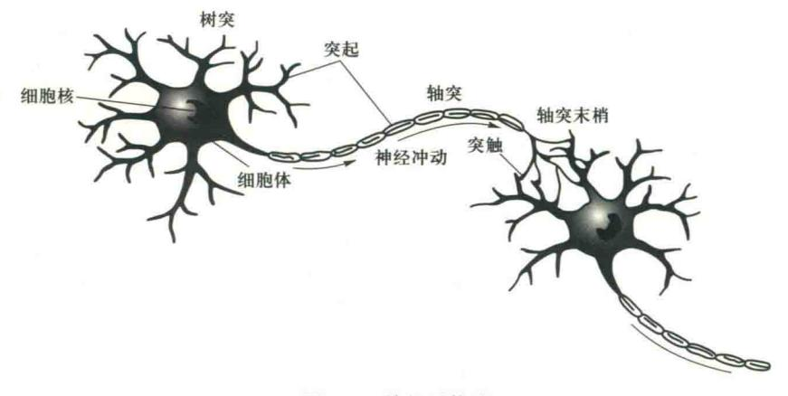

图 8.1 神经元构造

{1}------------------------------------------------

神经元(neuron)的主体部分为细胞体(soma)。细胞体由细胞核(cell neuclear)、细胞质、细胞膜等组成。每个细胞体都有一个细胞核,进行呼吸和新陈代谢等许多生化过程。神经元还包括树突(dendrite)和一条长的轴突(axon)。由细胞体向外伸出的最长的一条分支称为轴突即神经纤维。轴突末端部分有许多分支,称为轴突末梢(axonterminal)。典型的轴突有1cm长,是细胞体直径的100倍。一个神经元通过轴突末梢与10到10万个其他神经元相连接,组成一个复杂的神经网络。轴突是用来传递和输出信息的,其端部的许多轴突末梢为信号输出端子,将神经冲动传给其他神经元。由细胞体向外伸出的其他许多较短的分支称为树突。树突相当于细胞的输入端,树突的全长各点都能接收其他神经元的冲动。神经冲动只能由前一级神经元的轴突末梢传向下一级神经元的树突或细胞体,不能进行反方向的传递。

神经元具有两种常规工作状态:兴奋与抑制状态,即满足"0-1"律。当传入的神经冲动使细胞膜电位升高超过阈值时,细胞进入兴奋状态,产生神经冲动并由轴突输出;当传入的冲动使膜电位下降低于阈值时,细胞进入抑制状态,没有神经冲动输出。

## 8.1.2 神经元数学模型

早在1943年,美国神经和解剖学家麦克洛奇和数学家皮兹就提出了神经元的数学模型 (M-P模型),从此开创了神经科学理论研究的时代。从20世纪40年代开始,根据神经元的结构和功能不同,先后提出的神经元模型有几百种之多。下面介绍神经元的一种数学模型,它由三部分组成,即加权求和、线性动态系统和非线性函数映射,如图8.2所示。

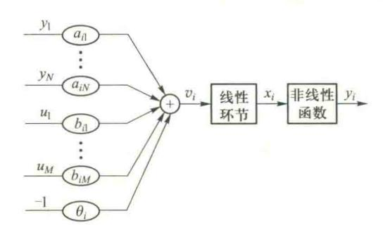

图 8.2 神经元数学模型

图 8.2 中, $y_i(t)$  为第 i 个神经元的输出, $\theta_i$  为第 i 个神经元的阈值(i=1,2,…,N); $u_k(t)$ (k=1,2,…,M)为外部输入; $a_{ij}$ , $b_{ik}$ 为权值。

加权求和

$$v_{i}(t) = \sum_{j=1}^{N} a_{ij} y_{j}(t) + \sum_{k=1}^{M} b_{ik} u_{k}(t) - \theta_{i}$$
 (8.1)

将式(8.1)记为矩阵形式

$$V(t) = AY(t) + BU(t) - \theta \tag{8.2}$$

{2}------------------------------------------------

式中, $A = \{a_{ij}\}_{N \times N}$ , $B = \{b_{ik}\}_{N \times M}$ , $V = [v_1, \dots, v_N]^{\mathrm{T}}$ , $Y = [y_1, \dots, y_N]^{\mathrm{T}}$ , $U = [u_1, \dots, u_M]^{\mathrm{T}}$ , $\theta = [\theta_1, \dots, \theta_N]^{\mathrm{T}}$ 。

线性环节的传递函数描述为

$$X_i(s) = H(s) V_i(s) \tag{8.3}$$

式中,H(s)通常取为 1, $\frac{1}{s}$ , $\frac{1}{Ts+1}$ , $e^{-Ts}$ 及其组合等。

最常用的非线性激活函数有以下几种。

#### (1) 阶跃函数

$$f(x_i) = \begin{cases} 1 & x_i \ge 0 \\ 0 & x_i < 0 \end{cases}$$
 (8.4a)

或

$$f(x_i) = \begin{cases} 1 & x_i \ge 0 \\ -1 & x_i < 0 \end{cases}$$
 (8.4b)

#### (2) S型函数

它具有平滑和渐近性,并保持单调性,是最常用的非线性函数。最常用的 S 型函数为 Sigmoid 函数

$$f(x_i) = \frac{1}{1 + e^{-\alpha x_i}}$$
 (8.5)

对于需要神经元输出在[-1,1]区间时,S型函数可以取双曲线正切函数(hyperbolic tangent function)

$$f(x_i) = \frac{1 - e^{-\alpha x_i}}{1 + e^{-\alpha x_i}}$$
 (8.6)

式中,α可以控制其斜率。

Sigmoid 函数的缺点是在输入的绝对值大于某个阈值后,过快进入饱和状态(即函数值趋于1或者-1,而不再有显著的变化),出现梯度消失情况,即梯度会趋于0,在实际模型训练中会导致模型收敛缓慢,性能不够理想。因此,在一些现代网络结构中,逐渐为 ReLU 等类模型的激活函数取代。

#### (3) ReLU函数

ReLU(rectified linear units)是近年来深度学习研究中广泛使用的一个激活函数。ReLU不是一个光滑曲线,而是一个很简单的分段线性函数,即

$$f(x_i) = \begin{cases} 0 & x_i < 0 \\ x_i & x_i \ge 0 \end{cases}$$
 (8.7)

ReLU 函数尽管形式简单,但在实际应用中没有饱和问题,运算速度快,收敛效果好,在卷积神经网络等深度神经网络中效果很好。

{3}------------------------------------------------

# 8.1.3 神经网络的结构与工作方式

#### 1. 神经网络的结构

神经网络的结构 与工作方式讲课 视频▲

神经网络是由众多简单的神经元连接而成的一个网络。尽管每个神经元结构、功能都不复杂,但神经网络的行为并不是各单元行为的简单相加,网络的整体动态行为是极为复杂的,可以组成高度非线性动力学系统,从而可以表达很多复杂的物理系统,表现出一般复杂非线性系统的特性(如不可预测性、不可逆性、多吸引子、可能出现混沌现象等)和作为神经网络系统的各种性质。神经网络具有大规模并行处理能力和自适应、自组织、自学习能力以及分布式存储等特点,在许多领域得到了成功的应用,展现了非常广阔的应用前景。

众多的神经元的轴突和其他神经元或者自身的树突相连接,构成复杂的神经网络。根据神经网络中神经元的连接方式可以划分为不同类型的结构。目前人工神经网络主要有前馈型和反馈型两大类神经网络。

#### (1) 前馈型

前馈型神经网络中,各神经元接受前一层的输入,并输出给下一层,没有反馈。前馈网络可分为不同的层,第i层只与第i-1层输出相连,输入与输出的神经元与外界相连。后面着重介绍的 BP 神经网络就是一种前馈型神经网络。

#### (2) 反馈型

在反馈型神经网络中,存在一些神经元的输出经过若干个神经元后,再反馈到这些神经元的输入端。最典型的反馈型神经网络是 Hopfield 神经网络。它是全互联神经网络,即每个神经元和其他神经元都相连。

## 2. 神经网络的工作方式

当满足兴奋条件时,神经网络中的神经元就会改变为兴奋状态,当不满足兴奋条件时,它就会改变为抑制状态。如果神经网络中各个神经元同时改变状态,则称为同步(synchronous)工作方式;如果是一个一个地改变状态,即当某个神经元改变状态时,其他神经元保持状态不变,称为异步(asynchronous)工作方式。神经网络在不同的工作方式下的性能有些差异。

# 8.1.4 神经网络的学习

神经网络方法是一种知识表示方法和推理方法。神经网络知识表示方法与谓词、产生式、框架、语义网络等方法是知识的显式表架、语义网络等方法是知识的显式表示,例如,在产生式系统中知识独立地表示为一条规则。神经网络知识表示是一种隐式的表示方法。在这里,将某一问题的若干知识通过学习表示在同一网络中。

神经网络的发展 概况讲课视频▲

神经网络的学习是指调整神经网络的连接权值或者结构,使输入输出具有需要的特性。

1944年加拿大心理学家赫布(Donald Hebb)提出了改变神经元连接强度

{4}------------------------------------------------

的 Hebb 学习规则。由于 Hebb 学习规则的基本思想很容易被接受,得到了较为广泛的应用,至今仍在各种神经网络模型的研究中起着重要的作用。但近年来神经科学的许多发现都表明, Hebb 学习规则并没有准确反映神经元在学习过程中突触变化的基本规律。

Hebb 学习规则: 当某一突触两端的神经元同时处于兴奋状态,那么该连接的权值应该增强。用数学方式描述调整权值  $w_n$ 的方法为

$$w_{ij}(k+1) = w_{ij}(k) + \alpha y_i(k) y_j(k) \quad (\alpha > 0)$$
 (8.8)

式中, $w_{ij}(k+1)$ 为权值的下一步值; $w_{ij}(k)$ 为权值的当前值。

1957年,受 Hebb 学习规则的启发,美国康奈尔航空实验室(Cornell aeronautical laboratory)的计算科学家弗兰克·罗森布拉特(Frank Rosenblatt)提出了由两层神经元组成的神经网络,并将其命名为"感知器"(perceptron)。不同于 M-P 模型,感知器模型可以从样例中学习,并采用梯度下降法自动更新参数。激活函数采用阶跃函数,即输入大于 0 时,输出 1,其余输出-1。1962年罗森布拉特在理论上证明了,单层神经网络在处理线性可分的模式识别问题时,可以做到收敛。

后来,罗森布拉特因"感知器"而名声大振,纽约时报等很多新闻媒体都报道了他的研究成果。但罗森布拉特的高调,引起了连接主义的奠基人、图灵奖得主明斯基的不满。他在会议上与罗森布拉特争辩,认为神经网络并不能解决所有问题。

经过充分的理论研究,1969年,明斯基和同事西摩尔·派普特(Seymour Papert)合作撰写了学术著作《感知器:计算几何导论》(Perceptrons: An Introduction to Computational Geometry)。书中指出,感知器存在两个关键问题难以解决:

- (1) 单层神经网络无法解决不可线性分割的问题,例如无法实现简单的异或门电路(XOR circuit)。
- (2)利用当时最先进的计算机也没有足够计算力,完成多层感知器训练所需的超大计算量。鉴于明斯基的学术地位(1969年,刚刚获得计算机科学界最高奖项——图灵奖),他的论断直接就把人工智能的研究送进一个长达近二十年的低潮,史称"人工智能冬天(AI winter)"。感知器的失败,导致人工神经网络研究的日渐式微。

1958年,著名神经生物学家休伯尔(Hubel)与威泽尔(Wiesel)研究发现,动物大脑皮层对视觉信息的处理,是分级、分层进行的。正是这个重要的生理学发现,使得二人获得了1981年的诺贝尔医学奖。这个重要科学发现的意义,并不限于生理学领域,它也间接促成了在五十年后人工智能的突破性发展。因为休伯尔和威泽尔等人对大脑的"深入认识",启迪了计算机科学家,为科研人员从"观察大脑"到"重现大脑"搭起了桥梁。

感知器之所以无法解决"非线性可分"问题,原因就是作为一个单层神经网络的感知器,结构过于简单。简单的结构,表征的能力就不强。如果想提升网络表征能力,网络结构势必要向复杂网络进发。按照这个思路,可以在输入层和输出层之间,添加几层神经元,将其称之为隐含层(hidden layer,亦有文献称为"隐藏层""隐层"),形成多层感知器模型。

1974年,哈佛大学博士生保罗·沃波斯(Paul Werbos)在博士论文中首次提出了通过误差的 反向传播(back propagation, BP)来训练人工神经网络。令人遗憾的是,沃波斯的研究并没有得到

{5}------------------------------------------------

应有的重视。原因很简单,那时正值神经网络研究的低潮期,反向传播网络的研究显然不合时宜。

直到十多年后的 1986 年,加拿大多伦多大学教授杰弗里·辛顿(Geoffrey Hinton)和戴维·鲁梅尔哈特(David Runelhart)等人重新设计了 BP 算法,在多层感知器中使用 Sigmoid 激活函数代替原来的阶跃函数,以"人工神经网络"模仿大脑工作机理,唤醒了沉睡多年的人工智能研究。但 BP 算法于 1991 年被指出存在梯度消失(vanishing gradient)问题,成为影响 BP 神经网络发展的主要原因,使之第二次进入低潮。

直到 2006 年,杰弗里·辛顿(Geoffrey Hinton)和他的学生在《科学》(Science)上发表文章指出:梯度消失的问题可以采用"无监督训练对权值进行初始化,再使用有监督训练进行微调"的方法解决,掀起了深度学习的新浪潮。2011 年 ReLU 激活函数被提出可以取代 Sigmod 函数,有效解决深度学习梯度消失的问题。2011 年后,微软首次将 DNN(深层神经网络)应用到语音识别,获得重大突破。2012 年,Hinton 为了证明卷积神经网络的效果,和他的学生 Alex Krizhevsky参加 ImageNet 图像识别大赛(ILSVRC),使用了深度卷积网络 AlexNet 进行图像分类,一举夺得分类任务冠军。

# 8.2 BP 神经网络及其学习算法

## 8.2.1 BP 神经网络的结构

BP 神经网络(back propagation neural network)就是多层前向网络,其结构如图 8.3 所示。

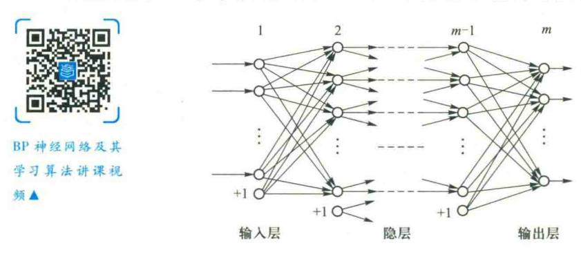

图 8.3 BP 神经网络结构

设 BP 神经网络具有 m 层。第一层称为输入层,最后一层称为输出层,中间各层称为隐层。标上"+1"的圆圈称为偏置单元。没有其他单元连向偏置单元(bias units)。偏置单元没有输入,它的输出总是+1。输入层起缓冲存储器的作用,把数据源加到网络上,因此,输入层的神经元的输入输出关系一般是线性函数。隐层中各个神经元的输入输出关系一般为非线性函数。隐层 k 与输出层中各个神经元的非线性输入输出关系记为  $f_k(k=2,\cdots,m)$ 。由第 k-1 层的第 j 个神经元到第 k 层的第 i 个神经元的连接权值为  $w_{ii}^k$ 。并设第 k 层中第 i 个神经元输入的总和为  $u_i^k$ ,输出

{6}------------------------------------------------

为水,则各变量之间的关系为

$$y_{i}^{k} = f_{k}(u_{i}^{k})$$

$$u_{i}^{k} = \sum_{j} w_{ij}^{k-1} y_{j}^{k-1}$$

$$k = 2, \dots, m$$
(8.9)

当 BP 神经网络输入数据  $X = [x_1, x_2, \cdots, x_{p_1}]^T$  (设输入层有  $p_1$  个神经元),从输入层依次经过各隐层结点,可得到输出数据  $Y = [y_1^m, y_2^m, \cdots, y_{p_m}^m]^T$  (设输出层有  $p_m$  个神经元)。因此,可以把BP 神经网络看成是一个从输入到输出的非线性映射。

给定N组输入输出样本为 $\{X_{si},Y_{si}\}$ , $i=1,2,\cdots,N$ 。如何调整 BP 神经网络的权值,使 BP 神经网络输入为样本 $X_{si}$ 时,神经网络的输出为样本 $Y_{si}$ 。这就是 BP 神经网络的学习问题。可见,BP 算法是一种有教师学习算法。

要解决 BP 神经网络的学习问题,关键是解决两个问题:

第一,是否存在一个BP神经网络能够逼近给定的样本或者函数。

下述定理可以回答这个问题。

定理 8.1(Kolmogorov 定理) 给定任意  $\varepsilon>0$ ,对于任意的连续函数 f,存在一个三层前向神经网络,其输入层有  $p_1$  个神经元,中间层有  $2p_1+1$  个神经元,输出层有  $p_m$  个神经元,它可以在任意  $\varepsilon$  平方误差精度内逼近 f。

上述定理不仅证明了映射网络的存在,而且说明了映射网络的结构。就是说,总存在一个结构为 $p_1 \times (2p_1+1) \times p_m$ 的三层前向神经网络能够精确地逼近任意的连续函数f。但对多层 BP 神经网络,如何合理地选取 BP 网络的隐层数及隐层的结点数,目前尚无有效的理论和方法。

第二,如何调整 BP 神经网络的权值,使 BP 神经网络的输入与输出之间的关系与给定的样本相同。BP 学习算法给出了具体的调整算法。

# 8.2.2 BP 学习算法

BP 学习算法最早是 1974 年由哈佛大学 Werbos 在博士论文《Parallel Distributed Processing》 提出的。Werbos 获得神经网络先驱奖,曾任 ISSN 主席、IEEE tnn 主编和美国自然科学基金委员会信息学部主任。

大卫·鲁梅尔哈特(David Rumelhart)等于 1985 年发展了 BP 学习算法,实现了 Minsky 多层感知器的设想。1986年,大卫·鲁梅尔哈特、杰弗里·辛顿(Geoffrey Hinton)和罗纳德·威廉姆斯(Ronald Williams)联名发表了具有里程碑意义的经典论文《通过误差反向传播学习表示》(learning representations by back-propagating errors),通过实验展示反向传递算法,可以在神经网络的隐层中学到对输入数据的有效表达。

BP 学习算法是通过反向学习过程使误差最小,因此选择目标函数为

$$\min J = \frac{1}{2} \sum_{i=1}^{p_m} (y_i^m - y_{si})^2$$
 (8.10)

{7}------------------------------------------------

即选择神经网络权值使期望输出  $y_{si}$ 与神经网络实际输出  $y_{i}^{m}$  之差的平方和最小。这种学习算法 实际上是求目标函数 J 的极小值,约束条件是式(8.9),可以利用非线性规划中的"最快下降法",使权值沿目标函数的负梯度方向改变,因此,神经网络权值的修正量为

$$\Delta w_{ij}^{k-1} = -\varepsilon \frac{\partial J}{\partial w_{ii}^{k-1}} \quad (\varepsilon > 0)$$
 (8.11)

式中, $\varepsilon$  为学习步长。

下面推导 BP 学习算法。先求 $\frac{\partial J}{\partial w_{ii}^{k-1}}$ ,由复变函数的链式求导法则,得

$$\frac{\partial J}{\partial w_{ij}^{k-1}} = \frac{\partial J}{\partial u_i^k} \frac{\partial u_i^k}{\partial w_{ij}^{k-1}} = \frac{\partial J}{\partial u_i^k} \frac{\partial}{\partial w_{ij}^{k-1}} \left( \sum_j w_{ij}^{k-1} y_j^{k-1} \right) = \frac{\partial J}{\partial u_i^k} y_j^{k-1}$$

记

$$d_{i}^{k} = \frac{\partial J}{\partial u_{i}^{k}} \quad (k = 2, \dots, m)$$

则

$$\Delta w_{ij}^{k-1} = -\varepsilon d_i^k y_j^{k-1} \quad (k = 2, \dots, m)$$
 (8.12)

下面推导计算  $d_i^k$  的公式

$$d_{i}^{k} = \frac{\partial J}{\partial u_{i}^{k}} = \frac{\partial J}{\partial y_{i}^{k}} \frac{\partial y_{i}^{k}}{\partial u_{i}^{k}} = \frac{\partial J}{\partial y_{i}^{k}} f'_{k}(u_{i}^{k})$$

下面分两种情况求 $\frac{\partial J}{\partial y_i^k}$ 

① 对输出层(第 m 层)的神经元,即  $k=m,y_i^k=y_i^m$ ,由误差定义式得

$$\frac{\partial J}{\partial y_i^k} = \frac{\partial J}{\partial y_i^m} = y_i^m - y_{si} \tag{8.13}$$

则

$$d_i^m = (y_i^m - y_{si})f'_m(u_i^m)$$
(8.14)

② 若 i 为隐单元层 k,则有

$$\frac{\partial J}{\partial y_i^k} = \sum_{l} \frac{\partial J}{\partial u_l^{k+1}} \frac{\partial u_l^{k+1}}{\partial y_i^k} = \sum_{l} w_{li}^k d_l^{k+1}$$

则

$$d_{i}^{k} = f_{k}'(u_{i}^{k}) \sum_{l} w_{li}^{k} d_{l}^{k+1}$$
(8.15)

综上所述,BP 学习算法可以归纳为

$$\Delta w_{ij}^{k-1} = -\varepsilon d_i^k y_j^{k-1} \tag{8.16a}$$

$$d_i^m = (y_i^m - y_{ii}) f_m'(u_i^m)$$
(8. 17a)

$$d_{i}^{k} = f_{k}'(u_{i}^{k}) \sum_{l} d_{l}^{k+1} w_{li}^{k} \quad (k = m-1, \dots, 2)$$
(8.18a)

{8}------------------------------------------------

#### 若取f6(·)为S型函数,即

$$y_i^k = f_k(u_i^k) = \frac{1}{1 + e^{-u_i^k}}$$

则

$$\frac{\partial y_i^k}{\partial u_i^k} = f_k'(u_i^k) = \frac{e^{-u_i^k}}{[1 + e^{-u_i^k}]^2} = y_i^k(1 - y_i^k)$$

BP学习算法可以归纳为

$$\Delta w_{ii}^{k-1} = -\varepsilon d_i^k y_i^{k-1} \tag{8.16b}$$

$$d_i^m = y_i^m (1 - y_i^m) (y_i^m - y_{si})$$
 (8. 17b)

$$d_i^k = y_i^k (1 - y_i^k) \sum_i w_{ii}^k d_i^{k+1} \quad (k = m-1, \dots, 2)$$
(8.18b)

从以上公式可以看出,求第 k 层的误差信号  $d_i^k$ ,需要上一层的  $d_l^{k+1}$ 。因此,误差函数的求取是一个始于输出层的反向传播的递归过程,所以称为反向传播(back propagation, BP)学习算法。通过多个样本的学习,修改权值,不断减少偏差,最后达到满意的结果。

## 8.2.3 BP 算法的实现

BP 学习算法的程序框图如图 8.4 所示。

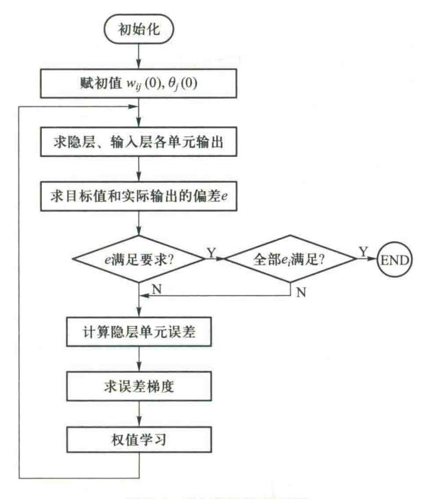

图 8.4 BP 算法程序框图

{9}------------------------------------------------

在 BP 算法实现时,还要注意下列问题:

- ① 训练数据一般需要进行预处理。预处理过程包含一系列的线性的特征比例变换,将所有的特征变换到[0,1]或者[-1,1]区间内,使得在每个训练集上,每个特征的均值为0,并且具有相同的方差。预处理过程也称为尺度变换(scaling),或者规格化(normalization)。
- ② 后处理过程。当应用神经网络进行分类操作时,通常将输出值编码成所谓的名义变量,具体的值对应类别标号。在一个两类分类问题中,可以仅使用一个输出,将它编码成一个二值变量(例如+1,-1)。当具有更多的类别时,应当为每个类别分配一个代表类别决策的名义输出值。例如,对于一个三类分类问题,可以设置三个名义输出,每个名义输出取值为{+1,-1},对应的各个类别决策为{+1,-1,-1},{-1,+1,-1},{-1,-1,+1}。利用阈值可以将神经网络的输出值变换成为合适的名义输出值。
- ③ 初始权值的影响及设置:和所有梯度下降算法一样,初始权值对 BP 神经网络的最终解有很大的影响。虽然全部设置为 0 显得比较自然,但从式(8.18)可以看出这将导致很不理想的结果。如果输出层的权值全部为 0,则反向传播误差也将为 0,输出层前面的权值将不会改变。因此,一般以一个均值为 0 的随机分布设置 BP 神经网络的初始权值。

# 8.3 BP 神经网络的应用

## 8.3.1 BP 神经网络在模式识别中的应用

模式识别主要研究用计算机模拟生物、人的感知,对模式信息,如图像、文字、语音等,进行识别和分类。传统人工智能的研究部分地显示了人脑的归纳、推理等智能。但是,对于人类底层的智能,如视觉、听觉、触觉等方面,现代计算机系统的信息处理能力还不如一个幼儿园的孩子。

神经网络模型模拟了人脑神经系统的特点:处理单元的广泛连接;并行分布式信息储存、处理;自适应学习能力等。神经元网络的研究为模式识别开辟了新的研究途径。与模式识别的传统方法相比,神经网络方法具有较强的容错能力、自适应学习能力、并行信息处理能力。

**例 8.1** 设计一个三层 BP 网络对数字 0 至 9 进行分类。训练数据如图 8.5 所示,测试数据如图 8.6 所示。

解 该分类问题有10类,且每个目标向量应该是这10个向量中的一个。目标值由数字1

至9的9个向量中的一个表示,0是由所有结点的输出全为0来表示。每个数字用9×7的网格表示,灰色像素代表0,黑色像素代表1。将网格表示为0或者1的长位串。位映射由左上角开始向下直到网格的整个一列,然后重复其他列。

BP神经网络在模式识别中的应用 讲课视频▲ 例如,数字"1"的网格的数字串为 $\{0,0,0,0,0,0,0,0,0,0,0,0,0,0,0,0,0,1,0,0,0,1,0,0,0,1,0,0,0,0,0,0,0,0,0,0,0,0,0,0,0,0,0,0,0,0$ 

{10}------------------------------------------------

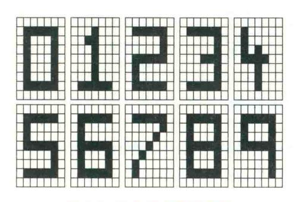

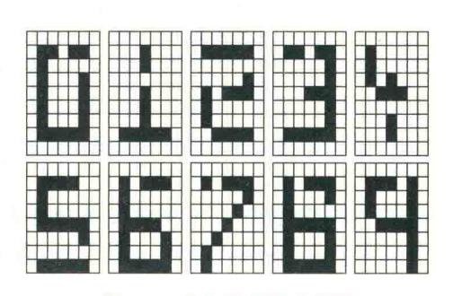

图 8.6 数字分类测试数据

选择网络结构为 63-6-9。9×7 个输入结点,对应上述网格的映射。9 个输出结点对应 10 种分类。使用的学习步长为 0.3。训练 1 000 个周期,如果输出结点的值大于 0.9,则取为 1,如果输出结点的值小于 0.1,则取为 0。

当训练成功后,对如图 8.6 所示测试数据进行测试。图 8.6 所示测试数据都有一个或者多个位丢失。测试结果表明:除了 8 以外,所有被测的数字都能够被正确地识别。对于数字 8,第 8个结点的输出值为 0.49,而第 6个结点的输出值为 1,表明第 8个样本网络是模糊的,可能是数字 6,也可能是数字 8,但也不完全确信是两者之一。实际上,人识别这个数字时也会发生这种错误。

# 8.3.2 BP 神经网络在软测量中的应用

#### 1. 软测量技术

在工业过程中,为了保证产品的质量和生产的连续平稳,需要对与品质密切相关的过程变量进行实时监控,然而常常存在一些重要的变量无法或难以用传感器直接检测,例如,化学反应器的产品质量、发酵罐的菌体浓度等都是很难在线测量的。有时,这类变量可以采用在线分析仪直接测量,但需要很大的设备投资,并且会有很大的滞后。对于这类变量可以采用软测量方法进行间接测量。

BP 神经网络在软 测量中的应用讲 课视频▲

## 软测量是利用一些可测变量去估计推测那些难以测量的变量。

软测量技术基于 20 世纪 70 年代 Brosillow 提出的推断控制,近年来,软测量技术在理论研究和工业应用方面都取得了较大进展。理论研究已经历了从线性到非线性、从静态到动态、从无校正到有校正功能的过程。它能够连续计算那些不可测或难以检测的参数,在一定程度上可以代替在线分析仪表。

软测量的基本过程是:依据生产过程中有关的变量间的关联,选择与被估计变量(难以或无法在线检测的)相关的一组可测变量,构造以可测变量为输入、被估计变量为输出的数学模型,用计算机软件实现被估计变量的最佳估计。在软测量系统中,被估计的变量称为主导变量,与被估计变量相关的一组可测变量称为辅助变量。软测量的基本过程如图 8.7 所示。

{11}------------------------------------------------

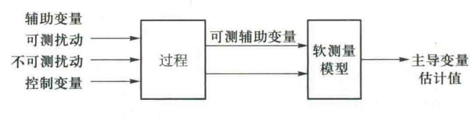

图 8.7 软测量的基本过程

这类数学模型及相应的计算机软件被称为软测量器或软仪表。软测量的输出可作为控制系统的被控变量或反映过程特征的工艺参数,为优化控制与决策提供基础。

软测量系统的设计主要有:主导变量和辅助变量的选择,软测量模型的建立,数据采集与处理等。

辅助变量的选择。辅助变量的选择对主导变量的估计有重要的影响。辅助变量的选择包括 变量类型、变量数量和检测点位置的选择。这三个方面是互相关联、互相影响的,不但由过程特 性决定,还受设备价格和可靠性、安装和维护的难易程度等外部因素制约。辅助变量数目的下限 是被估计的变量数,而最佳数目则与过程的自由度、测量噪声以及模型的不确定性有关。辅助变量的选择确定了软测量的输入信息矩阵,因而直接决定了软测量模型的结构和输出。

数据采集与处理。测量数据通过安装在现场的传感器、变送器等仪表获得,受到仪表精度、测量原理和测量方法、生产环境的影响,测量数据都不可避免地含有误差,甚至有严重的误差。如果将这些数据直接用于软测量,则很难得到正确的主导变量估计值。因此,必须对原始数据进行预处理(数据校正和数据变换)以得到精确可靠的数据。这是软测量成败的关键,具有十分重要的意义。

软测量模型的建立。软测量模型是软测量技术的核心。它不同于一般意义上的数学模型,它主要是通过辅助变量来获得对主导变量的最佳估计。目前已经提出了许多建模方法,例如,基于过程机理分析的机理建模方法、基于实验数据的系统辨识方法等。事实上,实际过程的输入和输出的关系可能是复杂的,很难用一个简单的函数表示,特别是很难弄清楚数据中输入和输出的关系。BP神经网络能够逼近任意复杂函数,具有学习功能,非常适合于作为软测量模型,可以从实验数据中"学习"到这个关系。

下面以污水处理质量指标检测为例,介绍神经网络的软测量方法。

# 2. 污水处理过程神经网络软测量模型

随着现代工业的迅猛发展,工业污水对人类赖以生存的水资源的破坏越来越大,污水处理成为国内外迫切需要解决的问题。近几年来水处理过程控制成为国内外的研究热点。但是,由于目前检测污水质量指标的传感器实时性差、误差大、价格昂贵,许多方法采用开环控制,或者选择其他间接指标进行控制,影响了控制效果。因此,在线检测污水质量指标成为提高控制质量的关键。

随着能够检测污水生物处理过程参数的检测仪器的发展,很多研究人员对污水生物处理中各种底物(C、N,P)和各种检测参数之间的变化规律进行了研究,试图采用间接指标实现反馈控

{12}------------------------------------------------

制。但由于这些关系的复杂性,很难基于机理分析方法给出确切的关系。下面运用 BP 神经网络实现污水处理质量指标软测量。

污水所含的污染物质千差万别,主要指标有物理、化学、生物三大类。从水体有机污染物看,其主要危害是消耗水中溶解氧。一般采用生物化学需氧量(BOD)、化学需氧量(COD)等指标来反映水中需氧有机物的含量。污水中的氮(N)、磷(P)虽为植物营养元素,但过多的N、P进入天然水体却易导致富营养化。因此,BOD、COD、N和P是反映水质好坏的重要指标。污水中COD特别是BOD的测定方法较为烦琐且耗时很长,使测出结果的时间严重滞后实际运行的时间,不能及时反应实际情况。目前,虽然出现了COD浓度在线检测仪,但仍存在滞后、较大误差及价格昂贵等问题。

对于污水的监测和处理已经提出了许多方法。目前广泛使用的是序批式活性污泥法(SBR),SBR 法是由曝气池、沉淀池、污泥回流和剩余污泥排除几个系统组成,如图 8.8 所示。

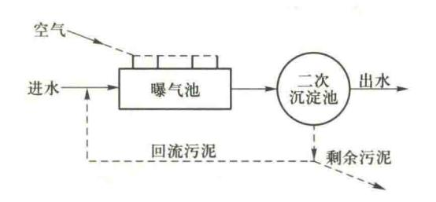

图 8.8 活性污泥法的基本流程

污水和回流的活性污泥一起进入曝气池形成混合液,通过曝气设备充入空气,空气中的氧溶入污水使混合液产生好氧代谢反应,使混合液得到足够的搅拌而呈悬浮状态,然后流入沉淀池,混合液中的悬浮固体在沉淀池中沉淀下来和水分离,流出沉淀池的就是净化水。沉淀池中的污泥大部分回流,成为回流污泥。回流污泥的目的是使曝气池内保持一定的悬浮固体浓度,也就是保持一定的微生物浓度。

在 SBR 法中,根据出水 BOD(或 COD)浓度的变化来调节控制反应(曝气)时间固然是最具有保证的方法。国内外的学者曾采用 ORP、DO、PH 或污泥浓度 MLSS 来间接控制污水处理过程,但这些单个的控制参数在动态的污水处理过程中仍未取得好的效果。单独使用 ORP,有时由于污水性质或 DO 的差异、特征点不明显,而且 ORP 过于敏感,小的误差会带来控制的不稳定;而单独使用 DO、PH 或 MLSS 则不能反映处理的整个过程(有机物、氮和磷的去除)。因此,必须联合这三者作为控制参数才能做到高效节能,取得最满意的效果。

综合上述分析,可以选择 BOD、COD、N 和 P 作为软测量模型的主导变量,选择 ORP、DO、PH 和 MLSS 作为辅助变量。

利用人工神经网络的软测量技术,建立一个三层 BP 网络,如图 8.9 所示。它采用能够在线检测的 ORP、DO、PH 和 MLSS 作为系统输入信号,实现污水的 COD、BOD、N 和 P 等参数的软测量,从而估计进水水质、决定曝气量大小、反应时间,控制出水水质,实现对污水处理过程的实时

{13}------------------------------------------------

控制。

根据污水处理质量指标神经网络软测量的要求,对实际污水处理运行过程的一些分析仪表得到的实验数据进行处理,可以得到反映污水处理质量指标复杂关系的实验数据,将其作为 BP 神经网络的训练数据,对神经网络进行训练。训练好的 BP 神经网络作为软测量仪表,能够实时估计污水的 COD、BOD、N、P等参数,有效地解决污水处理质量的实时估计问题。

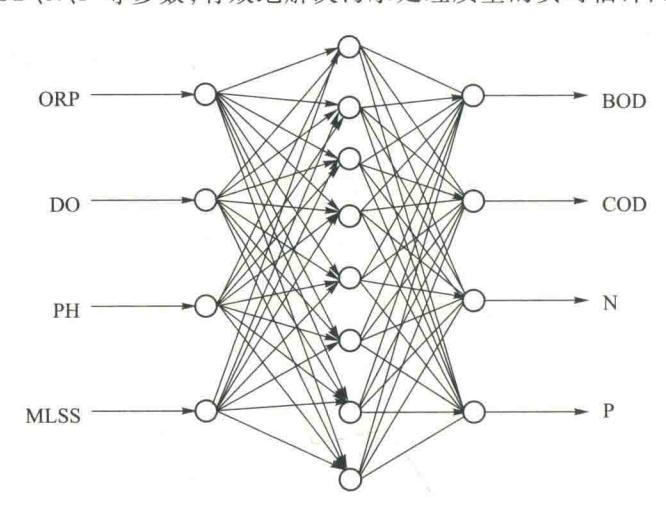

图 8.9 污水质量指标 BP 神经网络图

基于 BP 神经网络的污水处理软测量系统,能够实现污水的 COD、BOD、N、P 等参数的实时测量,估计处理的污水的水质、从而决定曝气量大小、反应时间,控制出水水质,实现各种活性污泥法过程的实时反馈控制,提高污水处理系统的可靠性和节约能耗,具有重要的理论意义和应用价值。

# 8.4 Hopfield 神经网络及其改进

从 20 世纪 60 年代初到 80 年代初,神经网络的研究处于"冰河期",到了 20 世纪 80 年代中期,美国加州理工学院生物物理学家霍普菲尔德(J.J.Hopfield)在神经网络建模及应用方面的开创性成果,在世界范围内重新掀起了神经网络的研究热潮。

离散型 HNN 讲课 视频▲

1982 年和 1984 年,霍普菲尔德先后提出离散型 Hopfield 神经网络和连续型 Hopfield 神经网络,引入"计算能量函数"的概念,给出了网络稳定性判据,尤其是给出了 Hopfield 神经网络的电子电路实现,为神经计算机的研究奠定了基础,同时开拓了神经网络用于联想记忆和优化计算的新途径,从而有力地推动了神经网络的研究。这两种模型是目前最重要的神经优化计算模型之一。

{14}------------------------------------------------

# 8.4.1 离散型 Hopfield 神经网络

Hopfield 神经网络(HNN)是全互联反馈神经网络,它的每一个神经元都和其他神经元相连接。

具有 N 个神经元的离散型 Hopfield 神经网络 HNN,可由一个  $N\times N$  阶矩阵  $w=[w_{ij}]N\times N$  和一个 N 维列向量  $\theta=[\theta_1,\theta_2,\cdots,\theta_N]^{\mathsf{T}}$  所唯一确定,记为  $N=(w,\theta)$ ,其中, $w_{ij}$ 为从第 j 个神经元的输出到第 i 个神经元的输入之间的连接权值,表示神经元 i 与 j 的连接强度,且  $w_{ji}=w_{ij}$ , $w_{ii}=0$ ;  $\theta_i$  表示神经元 i 的阈值。若用  $v_i(k)$ 表示 k 时刻神经元所处的状态,那么神经元 i 的状态随时间变化的规律(又称演化律)为

二值硬限器(binary hardlimiters):

$$v_i(k+1) = \begin{cases} 1 & u_i(k) \ge 0 \\ 0 & u_i(k) < 0 \end{cases}$$
 (8.19)

或者为双极硬限器:

$$v_i(k+1) = \begin{cases} 1 & u_i(k) \ge 0 \\ -1 & u_i(k) < 0 \end{cases}$$
 (8.20)

式中

$$u_{i}(k) = \sum_{\substack{j=1\\j \neq i}}^{n} w_{ij} v_{j}(k) - \theta_{i} \quad (1 \le i \le N)$$
(8.21)

Hopfield 神经网络可以是同步工作方式,也可以是异步工作方式。即神经元更新既可以同步(并行)进行,也可以异步(串行)进行。在同步进行时,神经网络中所有神经元的更新同时进行。在异步进行时,在同一时刻只有一个神经元更新,而且这个神经元在网络中每个神经元都更新之前不会再次更新。在异步更新时,神经元的更新顺序可以是随机的。

Hopfield 神经网络中的神经元相互作用,不断演化。如果神经网络在演化过程中,从某一时刻开始,神经网络中的所有神经元的状态不再改变,则称该神经网络是稳定的。

Hopfield 神经网络是高维非线性动力学系统,可能有若干个稳定状态。从任一初始状态开始运动,总可以达到某个稳定状态。这些稳定状态可以通过改变各个神经元之间的连接权值而得到。

稳定性是 Hopfield 神经网络的最重要的特性,下面分析 Hopfield 神经网络的稳定性。

Hopfield 神经网络是一个多输入多输出带阈值的二态非线性动力学系统,所以,类似于李雅普若夫稳定性分析方法,在 Hopfield 神经网络中,也可以构造一种 Lyapunov 函数,在满足一定的参数条件下,该函数值在网络运行过程中不断降低,最后趋于稳定的平衡状态。Hopfield 引入这种能量函数作为网络计算求解的工具,因此,常常称它为计算能量函数。

离散型 Hopfield 神经网络的计算能量函数定义为

{15}------------------------------------------------

$$E = -\frac{1}{2} \sum_{i=1}^{N} \sum_{j=1}^{N} w_{ij} v_i v_j + \sum_{i=1}^{N} \theta_i v_i$$
 (8.22)

式中 $,v_i,v_i$ 是各个神经元的输出。

下面考察第m个神经元的输出变化前后,计算能量函数E值的变化。设 $v_m = 0$ 时的计算能量函数值为 $E_1$ 

$$E_1 = -\frac{1}{2} \sum_{i=1}^{N} \sum_{\substack{j=1 \ i \neq i}}^{N} w_{ij} v_i v_j + \sum_{i=1}^{N} \theta_i v_i$$
 (8.23)

将 i=m 项分出来,并注意到  $v_m=0$ 

$$E_{1} = -\frac{1}{2} \sum_{i=1}^{N} \sum_{j=1}^{N} w_{ij} v_{i} v_{j} + \sum_{i=1}^{N} \theta_{i} v_{i}$$
(8. 24)

类似地, 当  $v_m = 1$  时的计算能量函数值为  $E_2$ , 则有

$$E_{2} = -\frac{1}{2} \sum_{i=1}^{N} \sum_{j=1}^{N} w_{ij} v_{i} v_{j} + \sum_{i=1}^{N} \theta_{i} v_{i} - \sum_{j=1}^{N} w_{mj} v_{j} + \theta_{m}$$

$$(8.25)$$

当神经元状态由"0"变为"1"时,计算能量函数 E 值的变化量  $\Delta E$  为

$$\Delta E = E_2 - E_1 = -\left(\sum_{j=1}^{N} w_{mj} v_j - \theta_m\right)$$
 (8.26)

由于此时神经元的输出由0变为1,因此满足神经元兴奋条件

$$\sum_{\substack{j=1\\ i \neq m}}^{N} w_{mj} v_j - \theta_m > 0 \tag{8.27}$$

由式(8.26),得 ΔE<0。

当神经元状态由"1"变为"0"时,计算能量函数 E 值的变化量  $\Delta E$  为

$$\Delta E = E_1 - E_2 = \sum_{\substack{j=1\\ j \neq m}}^{N} w_{mj} v_j - \theta_m$$
 (8.28)

由于此时神经元的输出由1变为0,因此

$$\sum_{\substack{j=1\\j\neq m}}^{N} w_{mj} v_j - \theta_m < 0 \tag{8.29}$$

也得  $\Delta E < 0$ 。

综上所述,神经元状态变化时总有  $\Delta E < 0$ ,这表明神经网络在运行过程中能量将不断降低,最后趋于稳定的平衡状态。

关于离散型 Hopfield 神经网络的稳定性,早在 1983 年就由科恩(Cohen)与葛劳斯伯格(S. Grossberg)给出了稳定性的证明。Hopfield 等又进一步证明,只要连接权值构成的矩阵是非负对角元的对称矩阵,该网络就具有串行稳定性;若该矩阵为非负定矩阵,则该网络就具有并行稳定性。

{16}------------------------------------------------

# 8.4.2 连续型 Hopfield 神经网络及其 VLSI 实现

离散型 Hopfield 神经网络中的神经元与生物神经元的差别较大,因为生物神经元的输入输出是连续的,而且,生物神经元存在时滞。1984年,Hopfield 又提出一种连续时间神经网络模型,在这种网络中,神经元的状态可以取 0 至 1 之间的任一实数值。

连续型 HNN 讲课 视频▲

连续型 Hopfield 神经网络的电子线路实现如图 8.10 所示。

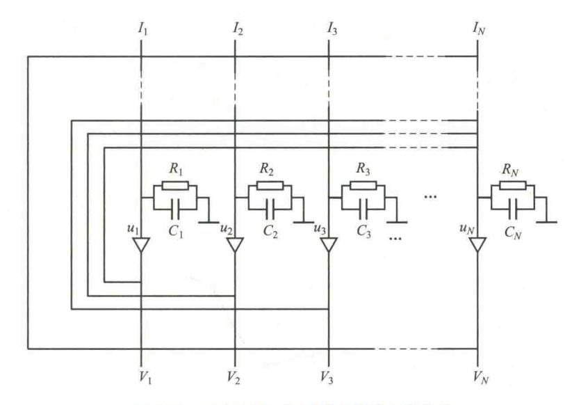

图 8.10 连续型 Hopfield 神经网络电子线路

其中,每一个神经元由电阻  $R_i$  和电容  $C_i$  以及具有饱和非线性特性的运算放大器模拟,输出  $v_i$  同时还反馈至其他神经元,但不反馈自身。 $u_i$  表示神经元 i 的膜电位状态; $v_i$  表示它的输出; $C_i$  表示细胞膜输入电容; $R_i$  表示细胞膜的传递电阻;电阻  $R_i$  电容  $C_i$  并联模拟了生物神经元输出的时间常数;而输出  $v_i$  对  $u_j$  (j=1,2,…,N) 的影响则模拟了神经元之间互连的突触特性;运算放大器模拟神经元的非线性特性。

由基尔霍夫电流定律,连续型 Hopfield 神经网络动力学系统方程为

$$\frac{1}{R_{i}}u_{i}+C_{i}\frac{du_{i}}{dt}=I_{i}+\sum_{j=1}^{N}w_{ij}v_{j}$$

$$v_{i}=f(u_{i})=\frac{1}{1+e^{-\frac{2u_{i}}{u_{0}}}} \quad (i=1,2,\cdots,N)$$

式中, $I_i$  为施加在第 i 神经元上的偏置电流,表示系统外部的输入; $w_{ij} = \frac{1}{R_{ii}}$ 模拟神经元 j 与 i 之间

{17}------------------------------------------------

互连的突触特性;f(ui)是放大器的非线性饱和特性,近似于S形函数。

连续型 Hopfield 神经网络模型,在简化了生物神经元性质的同时,重点突出了以下重要特性:

- ① 神经元作为一个输入输出变换,其传输特性具有 S 特性。
- ② 细胞膜具有时空整体作用。
- ③ 神经元之间存在大量的兴奋和抑制性连接,这种连接主要是通过反馈来实现的。
- ④ 具有既代表产生动作电位的神经元,又代表按渐近方式工作的神经元的能力。

因此,连续型 Hopfield 神经网络准确地保留了生物神经网络的动态和非线性特征,有助于理解大量神经元之间的协同作用是怎样产生巨大的计算能力的。

连续型 Hopfield 神经网络的计算能量函数 E(t) 定义为

$$E(t) = -\frac{1}{2} \sum_{i=1}^{N} \sum_{i=1}^{N} w_{ij} v_i(t) v_j(t) - \sum_{i=1}^{N} v_i(t) I_i + \sum_{i=1}^{N} \frac{1}{R_i} \int_{0}^{v_i(t)} f^{-1}(v) dv$$
 (8.31)

定理 8.2 对于连续型 Hopfield 神经网络, 若 $f^{-1}(\cdot)$  为单调递增的连续函数,  $C_i > 0$ ,  $w_{ij} = w_{ij}$ ,

则 
$$\frac{\mathrm{d}E\left(t\right)}{\mathrm{d}t} \leq 0$$
; 当且仅当  $\frac{\mathrm{d}v_{i}\left(t\right)}{\mathrm{d}t} = 0$ ,  $(1 \leq i \leq N)$  时,  $\frac{\mathrm{d}E\left(t\right)}{\mathrm{d}t} = 0$ 。

证明

$$\frac{\mathrm{d}E(t)}{\mathrm{d}t} = \sum_{i=1}^{N} \frac{\partial E(t)}{\partial v_i(t)} \frac{\mathrm{d}v_i(t)}{\mathrm{d}t}$$
(8.32)

而

$$\frac{\partial E(t)}{\partial v_{i}(t)} = -\frac{1}{2} \sum_{j=1}^{N} w_{ij}v_{j}(t) - \frac{1}{2} \sum_{j=1}^{N} w_{ji}v_{j}(t) - I_{i} + \frac{1}{R_{i}}f^{-1}(v_{i})$$

$$= -\frac{1}{2} \sum_{j=1}^{N} (w_{ji} - w_{ij})v_{j}(t) - \left[\sum_{j=1}^{N} w_{ij}v_{j}(t) + I_{i} - \frac{u_{i}(t)}{R_{i}}\right]$$

$$= -\frac{1}{2} \sum_{j=1}^{N} (w_{ji} - w_{ij})v_{j}(t) - C_{i} \frac{du_{i}(t)}{dt}$$

$$= -\frac{1}{2} \sum_{j=1}^{N} (w_{ji} - w_{ij})v_{j}(t) - C_{i} \frac{df^{-1}(v_{i})}{dt}$$

$$= -\frac{1}{2} \sum_{j=1}^{N} (w_{ji} - w_{ij})v_{j}(t) - C_{i} \frac{df^{-1}(v_{i})}{dv_{i}} \frac{dv_{i}}{dt}$$
(8.33)

将式(8.33)代入式(8.32),得

$$\frac{dE(t)}{dt} = \sum_{i=1}^{N} \frac{\partial E(t)}{\partial v_i(t)} \frac{dv_i(t)}{dt} 
= -\frac{1}{2} \sum_{i=1}^{N} \sum_{j=1}^{N} (w_{ji} - w_{ij}) v_j(t) \frac{dv_i(t)}{dt} - \sum_{i=1}^{N} C_i \frac{df^{-1}(v_i)}{dv_i} \left(\frac{dv_i}{dt}\right)^2$$
(8.34)

由于  $w_{ij} = w_{ji}$ ,  $C_i > 0$  和  $f^{-1}(\cdot)$  为单调递增,即有  $\frac{\mathrm{d} f^{-1}(v_i)}{\mathrm{d} v_i} > 0$ ,所以从式(8.34)得

{18}------------------------------------------------

$$\frac{\mathrm{d}E(t)}{\mathrm{d}t} = -\sum_{i=1}^{N} C_i \frac{\mathrm{d}f^{-1}(v_i)}{\mathrm{d}v_i} \left(\frac{\mathrm{d}v_i}{\mathrm{d}t}\right)^2 \le 0 \tag{8.35}$$

从式(8.35)可见,若 $\frac{\mathrm{d}v_i}{\mathrm{d}t}$ =0,则 $\frac{\mathrm{d}E(t)}{\mathrm{d}t}$ =0;反之,若 $\frac{\mathrm{d}E(t)}{\mathrm{d}t}$ =0,则必须满足 $\frac{\mathrm{d}v_i}{\mathrm{d}t}$ =0。

证毕。

上面的定理表明,Hopfield 神经网络的能量函数的值随着时间的推移总是在不断地减少,神经网络趋于某一平衡状态,平衡点就是 E(t) 的极小值点;反之亦然。这说明 Hopfield 神经网络的演变过程就是在 $[0,1]^N$  空间内寻找极小值稳定点(吸引子)的过程,并在达到这些点后稳定下来。因此,这种神经网络同样具有自动求极小值的计算功能。

无论是离散型 Hopfield 神经网络,还是连续型 Hopfield 神经网络,虽然理论上都能够收敛到极值点,但一般都不能收敛到最优点。为了解决这一问题,下面介绍随机神经网络和混沌神经网络。

## 8.4.3 随机神经网络

在 Hopfield 神经网络中,神经元状态为 1 是根据其输入是否大于阈值确定的,是确定性的。而在随机神经网络中,神经元状态为 1 是随机的,服从一定的概率分布。例如,服从玻耳兹曼(Boltzmann)、高斯(Gaussian)、柯西(Cauchy)分布等,从而构成玻耳兹曼机、高斯机、柯西机等随机机。

随机神经网络讨 课视频▲

下面主要以玻耳兹曼机为例,介绍随机神经网络。

1985年,加拿大多伦多大学教授欣顿(Hinton)等人借助统计物理学的概念和方法,提出了Boltzmann 机神经网络模型。Boltzmann 机是离散型 Hopfield 神经网络的一种变型,通过对离散型 Hopfield 神经网络加以扰动,使其以概率的形式表达,而网络的模型方程不变,只是输出值类似于 Boltzmann 分布以概率分布取值。Boltzmann 机是按 Boltzmann 概率分布动作的神经网络。

离散型 Hopfield 神经网络的输出为

$$v_{i}(k+1) = \operatorname{sgn}\left(\sum_{\substack{j=1\\ i \neq i}}^{N} w_{ij}v_{j}(k) - \theta_{i}\right)$$
 (8.36)

对于 Boltzman 机,设内部状态为

$$I_{i} = \sum_{\substack{j=1\\j \neq i}}^{N} w_{ij} v_{j}(k) - \theta_{i}$$
(8.37)

神经元 i 输出值为 0 和 1 时的概率分别为  $p_i(0)$  和  $p_i(1)$ ,即

$$p_{i}(1) = \frac{1}{1 + e^{-I/T}}$$

$$p_{i}(0) = 1 - p_{i}(1)$$
(8.38)

式中, T 为类似温度的扰动。

{19}------------------------------------------------

从式(8.38)可见,当 T 较大时, $p_i(0)$ 和  $p_i(1)$ 几乎相等;当 T 较小时,两概率值将由系统内部状态决定。因此,在系统运行时,先将 T 置于较大值以使系统能够跃过能量较大的状态来避免陷入局部极小,然后将 T 值逐渐减小,从而使系统最终收敛到全局能量最小的状态。这与模拟退火算法的机制几乎一样。应用模拟退火算法的 Hopfield 神经网络,实际上就是一种最基本的 Boltzmann 机。由式(8.38)可知, $I_i$ 越大, $p_i(1)$ 越大,神经元变为 1 的可能性越大。

设神经网络由 N 个神经元构成,每个神经元服从二态规律,即只取 0,1 两种状态,且假定神经元之间的连接权矩阵是对称的。在网络中,当神经元的输入加权和发生变化时,将引起神经元状态的更新,这种更新在各个神经元之间是非同步的,可用概率分析方法描述。设  $\Delta E_i = E(v_i = 0) - E(v_i = 1)$ ,那么,神经元状态  $v_i$  为 1 的概率  $P_i$  服从玻耳兹曼分布。

与 HNN 相类似, Boltzmann 的能量函数定义为

$$E = -\frac{1}{2} \sum_{i} \sum_{j \neq i} w_{ij} v_i v_j + \sum_{i} v_i \theta_i$$
 (8.39)

式中, $v_i$  和  $\theta_i$  分别是神经元 i 的状态和阈值; $w_{ij}$  为连接权。首先按下式计算神经元 i 状态转换时 网络能量的变化

$$\Delta E_i = \sum_j w_{ij} v_j - \theta_i \tag{8.40}$$

然后,依据  $\Delta E$  的大小,将神经元 i 以概率

$$p_i = \frac{1}{1 + \exp\left(-\frac{\Delta E_i}{T}\right)} \tag{8.41}$$

改变为状态"1"。

上式中,T 为温度。此式表明:在很高的温度下(T>>1), $p_i$ 将接近于 0.5,神经元行为具有随机性;在同一温度下, $\Delta E_i$  较大时,状态为"1"的概率增大;在温度很低时,随机性将趋于消失,此时玻尔兹曼机性能与确定性网络相同。

与 Boltzmann 相似,高斯机可以由连续 Hopfield 神经网络获得。高斯机的动态特性与连续型 Hopfield 神经网络类似,只不过在每个神经元处加入了一个随机变量,从而有

$$\frac{\mathrm{d}u_i}{\mathrm{d}t} = \sum_{j=1}^{N} w_{ij}v_j + I_i + \eta \tag{8.42}$$

式中, $\eta$  是一个均值为 0 的高斯随机变量,它的方差为  $\sigma=cT,c$  是常数,T 是温度。加入随机扰动的目的是使网络能够跳出局部最小值。

将高斯机中的高斯随机变量(白噪声)用柯西随机变量(有色噪声)取代,可以得到柯西机, 也称为快速模拟退火。由于采用了有色噪声,增加了网络接受一个代价变大转移的可能性,因而 增加了它跳出局部最小值的能力。

随机 Hopfield 神经网络是连续型 Hopfield 神经网络的一种变型,即在每个输入上加入扰动。设扰动参数为 T,扰动幅度用 T与神经元自身电位的函数  $q(u_1,u_2)$ 的乘积表示,模型方程为

{20}------------------------------------------------

$$C_{i} \frac{\mathrm{d}u_{i}}{\mathrm{d}t} = -\frac{u_{i}}{R_{i}} + \sum_{i} T_{ji}v_{j} + I_{i} + \sqrt{2Tq(u_{i}, u_{o})} u_{i}$$
 (8.43)

当 T 加大时, 扰动也加大。当有关神经元正要完全兴奋或者完全抑制时, 表现在  $q(u_i,u_a)$  和  $v_i$  上扰动也加大。这样系统就有足够的时间选择兴奋或者抑制的状态。当系统冷却时, 网络将会收敛到全局能量最小的状态。

## 8.4.4 混沌神经网络

#### 1. 混沌

混沌是自然界中一种较为普遍的非线性现象,其行为看似混乱复杂且类似随机,却存在精致的内在规律性。混沌具有以下独特性质:① 随机性,即混沌具有类似随机变量的杂乱表现;② 遍历性,即混沌能够不重复地历经一定范围

混沌神经网络证

课初梅▲

内的所有状态;③ 规律性,即混沌是由确定性的迭代式产生的。介于确定性和随机性之间,混沌 具有丰富的时空动态,系统动态的演变可导致吸引子的转移。

混沌学的研究热潮开始于 20 世纪 70 年代初期。1963 年, Lorenz E.N.在分析气候数据时发现:初值十分接近的两条曲线的最终结果会相差很大,从而获得了混沌的第一个例子;1975 年,李天岩(Li T.Y.)和约克(Yorke J.A.)给出一种混沌的数学定义,使"混沌"一词首先出现在科技文献中。混沌的发现,对科学的发展具有深远的影响。

近年来,混沌控制、混沌同步和混沌神经网络受到了广泛关注。混沌神经网络除了广泛应用于组合优化领域外,还用于联想记忆、语音识别、二维物体识别、保密通信、人眼运动机制模拟等。

#### 2. 混沌神经元

1987年,Freeman 首先提出了混沌神经元的概念。混沌神经元是构造混沌神经网络的基本单位,混沌神经网络的研究起于并基于混沌神经元的研究。在混沌神经元的研究中,振荡子(oscillator)是一种典型的研究对象,因为振荡子或它们的组合可表现出丰富的混沌动力学行为。

混沌神经元模型可以用如下差分方程表示

$$u(k+1) = Ku(k) - g(v(k)) + I(k) - \theta$$
  
 
$$v(k+1) = f(u(k+1))$$
 (8.44)

式中,v(k+1),u(k+1)分别表示在时刻 k+1 的神经元输出和内部状态;I(k)为时刻 k 的神经元外部输入;K 为参数 $(0 \le K \le 1)$ ; $\theta$  为阈值;f 为神经元的输出函数;g 为神经元输出与不应性之间关系的函数。

#### 3. 混沛袖经网络

受混沌神经元的启发,通过在 Hopfield 神经网络中引入混沌动态,1990 年, Aihara 等提出了第一个混沌神经网络模型(chaotic neural network, CNN)。次年, Inoue 等利用两个混沌振荡子耦合成一个神经元的方法,构造出一个混沌神经计算机,这个模型在求解 TSP 问题中取得了良好的效果。1992 年, Nozawa 基于欧拉离散化的 Hopfield 神经网络,通过增加一个大的自反馈项,得到了一个与Aihara 等提出的类似的 CNN 模型。

{21}------------------------------------------------

混沌的遍历性特点可作为 Hopfield 神经网络避免陷入局部极小的一种优化机制,这与模拟退火的概率性劣向转移和禁忌搜索的禁忌表检验存在明显的区别。由于反馈型的 Hopfield 神经网络正是神经网络与非线性动力学行为的良好结合,因而 Hopfield 结构可作为研究混沌神经网络的基础网络模型。近年来,人们通过各种各样的方法在 Hopfield 神经网络的基础上构造出了性能各异的混沌神经网络。归纳起来,主要有以下三种:

#### (1) 基于模拟退火策略的自抑制混沌神经网络

1995年, Chen 等提出的暂态混沌神经网络(transient chaotic neural network, TCNN)模型如下:

$$v_{i}(k) = f(u_{i}(k)) = \frac{1}{1 + e^{-u_{i}(k)/\varepsilon}}$$

$$u_{i}(k+1) = Ku_{i}(k) + \alpha \left[ \sum_{j \neq i}^{N} w_{ij}v_{j}(k) + I_{i} \right] - z_{i}(k) \left[ v_{i}(k) - I_{0} \right]$$

$$z_{i}(k+1) = (1 - \beta)z_{i}(k)$$
(8.45)

式中, $v_i(k)$ 为神经元i的输出; $u_i(k)$ 为神经元i的内部状态; $w_{ij}$ 为神经元j到神经元i的连接权,且  $w_{ij}=w_{ji}$ ; $I_i$  为神经元i的输入偏置电流; $\alpha$  为神经元输入的比例参数; $K(0 \le K \le 1)$  为神经薄膜的衰减因子; $z_i(k)$  为自反馈连接权; $\beta(0 \le \beta \le 1)$  为  $z_i(k)$  的衰减因子; $I_0$  为正的参数; $\varepsilon(\varepsilon > 0)$  为输出函数的效率参数。

这种网络基于模拟退火的策略,利用自抑制反馈项 $z_i(k)(v_i(k)-I_0)$ 产生混沌,具有如下特点:

① 网络具有暂态混沌特性。

以求解如下非线性函数为例:

$$E(x_1, x_2) = (x_1 - 0.7)^2 [(x_2 + 0.6)^2 + 0.1] + (x_2 - 0.5)^2 [(x_1 + 0.4)^2 + 0.15]$$

当神经元各参数为: $\varepsilon=150$ 、K=1.0、 $\alpha=0.015$ 、 $\beta=0.01$ 、 $I_0=0.5$ 、z(0)=[0.082,0.082]时,单个神经元的输出  $z_1(k)$  和自反馈连接权  $z_1(k)$  随迭代步数 k 的演化过程如图 8.11 所示。从图中可看出,在状态演化的初始阶段存在混沌特性,它是一种倍周期倒分叉过程:随着  $z_i(k)$  的指数衰减,这种分叉过程会很快结束,使每个这样的神经元都表现出暂态混沌特性。

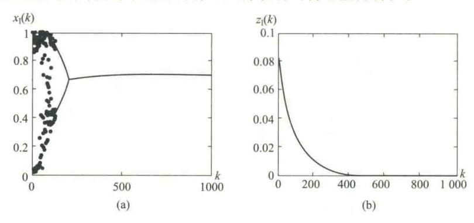

图 8.11 单个神经元的输出  $x_1(k)$  和自反馈连接权  $z_1(k)$  的演化过程

{22}------------------------------------------------

② 网络能演化到一个稳定状态。

当  $z_i(k)$  按指数衰减到一定值时,倒分叉过程结束,使网络状态的奇异吸引子到达一个稳定平衡点。此时,TCNN 逐渐趋于 CHNN。根据 CHNN 的特性可知,网络最终将收敛到一个稳定状态。

- ③ 搜索区域为一分形结构。
- ④ 具有混沌退火机制。
- $z_i(k)$  对应着模拟退火中的温度,控制网络的混沌收敛行为和倒分叉速度。这种混沌退火不仅在搜索效率上,而且在计算速度上都比随机模拟退火有明显的优点,因为其搜索空间比随机模拟退火要小得多。
  - ⑤ TCNN 是一种广义的混沌神经网络。

从状态演化来看,它与 CHNN 和混沌神经网络(CNN)都有着密切的联系。当 $z_i(k)$ 为常数时,TCNN 就变成 CNN;当 $z_i(k)$ = 0 时,TCNN 就退化为 HNN。

- ⑥ 网络既可求解 0-1 问题,也可求解连续非线性优化问题。
- (2) 基于加大时间步长的混沌神经网络

考虑 CHNN 的欧拉离散化:

$$u_i(t+\Delta) = \left(1 - \frac{\Delta}{\tau}\right) u_i(t) + \Delta \left[\sum_{i=1}^{N} w_{ij} v_j(t) + I_i\right]$$
(8.46)

1998年, Wang 和 Smith 根据上式,采用加大时间步长来产生混沌,即首先令式(8.46)的开始时间步长很大,然后随着网络的迭代逐渐减小时间步长 Δ,例如采用指数衰减规则

$$\Delta(t+1) = (1-\beta)\Delta(t) \tag{8.47}$$

式中, $0<\beta<1$ 。这样,网络以混沌状态开始,经过一个倒分叉过程,最终收敛于稳定状态。系统收敛时,使混沌神经网络的能量函数最小。

## (3) 引入噪声的混沌神经网络

1995年, Hayakawa 等在离散化的 CHNN 中加入混沌噪声, 并用来求解 TSP。他们的混沌神经网络定义如下:

$$u_{i}(t+\Delta) = \left(1 - \frac{\Delta}{\tau}\right) u_{i}(t) + \Delta \left[\sum_{j}^{N} w_{ij} v_{j}(t) + I_{i}\right]$$

$$v_{i}(t) = f(u_{i}(t) + A\eta_{i}(t))$$
(8.48)

式中,A 是混沌噪声  $\eta_i(t)$  的倍增; $f(\cdot)$  是  $\varepsilon=1$  的 Sigmoid 激活函数。不同初值的混沌噪声连接 到每个神经元,就产生 Logistic 映射

$$z_i(t+1) = az_i(t) [1-z_i(t)]$$
 (8.49a)

从而得到如下的非线性序列

$$\eta_i(t) = \frac{z_i(t) - \langle z \rangle_i}{\sigma_z} \tag{8.49b}$$

式中, $\sigma_z$ 是序列的标准偏差; $\langle z \rangle$ 是 $z_i$ 的平均值。在每步迭代中,为了判断解的可行性,引入状态

{23}------------------------------------------------

变量的偏差

$$v_{ij}^{d} = \begin{cases} 1 & v_{ij} > \sum_{i}^{N} \sum_{j}^{N} v_{ij}(t) / N \times N \\ 0 & \text{ 其他} \end{cases}$$
 (8.49c)

并调整式(8.49a)中 Logistic 映射的参数 a 和式(8.48)中放大器因子 A。

# 8.5 Hopfield 神经网络的应用

Hopfield 神经网络的许多应用都是利用 Hopfield 神经网络能够收敛到它的一个稳定状态这个特性。例如,利用 Hopfield 神经网络的稳定状态能够实现联想记忆、优化等应用。下面简单介绍基于 Hopfield 神经网络的联想记忆与优化方法。

# 8.5.1 Hopfield 神经网络在联想记忆中的应用

Hopfield 神经网络 的应用讲课视频▲

如果将网络的一个稳态作为一个记忆样本,那么以后当给这个网络一个适 当的激励时,网络能够收敛到和输入模式最为相似的样本模式。初态朝稳态的 收敛过程便是寻找记忆样本的过程。初态可以认为是给定样本的部分信息,网 络改变的过程可以认为是从部分信息找到全部信息,从而实现了联想记忆的 功能。

Hopfield 神经网络联想记忆过程,就是非线性动力学系统朝某个稳定状态运行的过程。这就需要调整连接权值使得所要记忆的样本作为 Hopfield 神经网络的能量局部极小点。Hopfield 神经网络联想记忆过程分为学习和联想两个阶段。在给定样本的条件下,调整连接权值,使得存储的样本成为 Hopfield 神经网络的稳定状态。这就是学习阶段。联想是指在已经调整好权值不变的情况下,给出部分不全或者受了干扰的信息,按照动力学规则改变神经元的状态,使神经网络最终变到某个稳定状态。

实现 Hopfield 神经网络联想记忆的关键是网络到达记忆样本能量函数极小点时,决定网络的神经元间连接权值  $w_{ij}$ 和阈值  $\theta_i$  等参数。下面介绍按照 Hebb 学习规则设计 Hopfield 神经网络的连接权值。

设给定 m 个样本  $x^{(k)}(k=1,2,\cdots,m)$ ,  $x_i^{(k)}$  表示第 k 个样本中的第 i 个元素。记  $w_{ij}$ 是神经元 i 到神经元 j 的权值。

当神经元输出  $x_i \in \{-1, +1\}$  时,

$$w_{ij} = \begin{cases} \sum_{k=1}^{m} x_i^{(k)} x_j^{(k)} & i \neq j \\ 0 & i = j \end{cases}$$
 (8.50a)

{24}------------------------------------------------

$$w_{ij}(k) = w_{ij}(k-1) + x_i^{(k)} x_j^{(k)} \qquad (k=1,2,\dots,m)$$

$$w_{ii}(0) = 0 \qquad w_{ii} = 0$$
(8.50b)

当神经元输出  $x_i \in \{0,1\}$  时,

$$w_{ij} = \begin{cases} \sum_{k=1}^{m} (2x_i^{(k)} - 1)(2x_j^{(k)} - 1) & i \neq j \\ 0 & i = j \end{cases}$$
 (8.51a)

或者

$$w_{ij}(k) = w_{ij}(k-1) + (2x_i^{(k)} - 1)(2x_j^{(k)} - 1) (k=1,2,\dots,m) (8.51b)$$

$$w_{ij}(0) = 0 w_{ii} = 0$$

显然,按照上面公式设计的网络连接权值满足对称条件。可以证明,按照上面公式设计的网络连接权值时,Hopfield 神经网络的稳定状态是给定样本。

依据上述算法的联想记忆功能,可用于模式识别。但当样本多且彼此相近时,容易引起混淆。在网络结构与参数一定的条件下,要保证联想功能的正确实现,网络所能存储的最大的样本数,称为网络的记忆容量。网络的记忆容量不仅与神经元个数有关,还与连接权的设计、要求的联想的范围大小、样本的性质等有关。当网络要求存储的样本模式是两两正交的,可以有最大的记忆容量。

例 8.2 设计基于 Hopfield 神经网络的分类器。

解 当人看见苹果和橘子的时候,虽然和以前见过的不完全一样,但通过自联想能力仍然能够识别。利用 Hopfield 神经网络的联想特性,能够设计苹果和橘子的分类器,如图 8.12 所示。输送带将苹果和橘子传送给外形、质地、质量三个传感器检测,Hopfield 神经网络根据传感器检测结果识别,如果识别结果是苹果则执行器就将这个苹果放进苹果筐,否则放进橘子筐。

传感器检测结果为1或者0,其意义如表8.1所示。

三个传感器输出表示为[外形,质地,质量],则标准橘子表示为: $x^{(1)}$ =[1,0,1]T;标准苹果表示为: $x^{(2)}$ =[0,1,0]T。

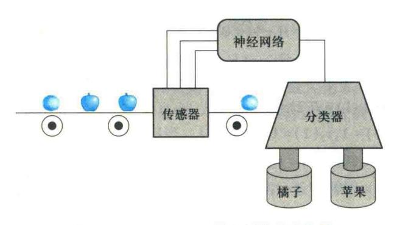

图 8.12 基于 Hopfield 神经网络的分类器

{25}------------------------------------------------

| 类别 | 1      | 0      |
|----|--------|--------|
| 外形 | 圆      | 椭圆     |
| 质地 | 光滑     | 粗糙     |
| 质量 | <300 g | ≥300 g |

表 8.1 分类特征编码

#### (1) 设计 DHNN 结构

设计有三个神经元的 Hopfield 神经网络如图 8.13 所示。三个神经元的阈值都为 0。

#### (2) 设计连接权矩阵

$$w_{ij} = \begin{cases} \sum_{k=1}^{2} (2x_i^{(k)} - 1)(2x_j^{(k)} - 1) & i \neq j \\ 0 & i = j \end{cases}$$

$$w_{ji} = w_{ij} \quad i = 1, 2, \dots, n \quad j = 1, 2, \dots, n$$

$$w_{12} = (2 \times 1 - 1) \times (2 \times 0 - 1) + (2 \times 0 - 1) \times (2 \times 1 - 1) = -1 - 1 = -2$$

$$w_{21} = w_{12} = -2$$

$$w_{23} = (2 \times 0 - 1) \times (2 \times 1 - 1) + (2 \times 1 - 1) \times (2 \times 0 - 1) = -1 - 1 = -2$$

$$w_{32} = w_{23} = -2$$

$$W = \begin{bmatrix} 0 & -2 & 2 \\ -2 & 0 & -2 \\ 2 & -2 & 0 \end{bmatrix}$$

$$w = \begin{bmatrix} -2 & 0 \\ 2 & -2 \end{bmatrix}$$

## (3) 测试

测试用例: $[1,1,1]^{\mathsf{T}}$ ,取初始状态: $v_1(0)=1,v_2(0)=1,v_3(0)=1$ 。神经元状态调整次序取为: $2\rightarrow 1\rightarrow 3$ 。当 k=1 时,

$$v_{2}(1) = f\left(\sum_{j=1}^{3} w_{2j}v_{j}(0)\right)$$

$$= f((-2) \times 1 + 0 \times 1 + (-2) \times 1) = f(-4) = 0$$

$$v_1(2) = f\left(\sum_{j=1}^{3} w_{1j}v_j(1)\right)$$
  
=  $f(0 \times 1 + (-2) \times 0 + 2 \times 1) = f(2) = 1$ 

神经元状态调整为: $v_1(1)=1,v_2(1)=0,v_3(1)=1$ 。当k=2时

$$v_1(1) = v_1(0) = 1$$
,  $v_3(1) = v_3(0) = 1$   
 $v_2(2) = v_2(1) = 0$ ,  $v_3(2) = v_3(1) = 1$ 

神经元状态调整为: $v_1(2)=1$ , $v_2(2)=0$ , $v_3(2)=1$ 。

类似地,有:
$$v_1(3) = 1$$
, $v_2(3) = 0$ , $v_3(3) = 1$ 。

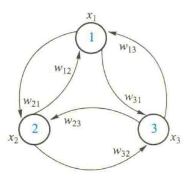

图 8.13 3 个神经元的 Hopfield 神经网络

{26}------------------------------------------------

可见输入[1,1,1]T,输出[1,0,1]T。

# 8.5.2 Hopfield 神经网络优化方法

如果将网络的稳态作为一个优化问题的目标函数的极小点,那么神经网络的初态朝稳态的收敛过程便是优化计算的过程。该优化计算是在网络演化过程中自动完成的。

Hopfield 神经网络 优化方法讲课视 频▲

1985 年霍普菲尔德和塔克(D.W.Tank)应用神经网络方法求解旅行商问题 优化方 这一著名的组合优化难题获得成功,引起了世界各国学者的广泛重视。他们的 工作不仅对研究神经网络理论具有重要意义,也为组合优化问题求解开辟了新的途径。

#### 1. 基本思想

无论是离散型 Hopfield 神经网络模型还是连续型 Hopfield 神经网络模型,能量函数都表征了网络的动力学演化过程,并揭示了该演化过程与网络稳定状态之间的内在联系。因此, Hopfield 能量函数极小化过程表示了神经网络从初始状态到稳定状态的演化过程。通常,约束优化问题的求解过程实际上就是目标函数的极小化过程,选择合适的能量函数使其最小值对应于问题的最优解。因此,目标函数达到局部极小或者全局最小,相应的解为约束优化问题的局部最优解或者全局最优解。如果将目标函数与能量函数相联系,并通过能量函数将约束优化问题的解映射到神经网络的一个稳定状态上去,那么,就可以利用神经网络的演化过程来实现优化计算。这就是应用神经网络解决优化问题的基本思想。

用神经网络方法求解优化问题的关键是如何把待求解的优化问题映射为一个神经网络。一般可以将求解的组合优化问题的每一个可行解用换位矩阵(permutation matrix)表示。

另一个关键问题是构造能量函数,使其最小值对应于问题的最优解。它决定了一个特定问题是否能够用神经网络方法求解。目前还没有直接将约束优化问题映射为神经网络的方法,通常采用优化理论中的拉格朗日(Lagrange)函数和乘子法,即利用优化问题的目标函数和约束条件构造相应的能量函数。一般使用在计算能量函数 E 中添加一些违反约束条件的惩罚项的简单方法,用罚函数法写出求解优化问题的能量函数,即

$$E = \sum_{i=1}^{m} C_i E_i + C_0 E_0 \tag{8.52}$$

式中, $E_i$  是违背约束条件的惩罚函数; $E_0$  是优化的目标函数; $C_i$  和  $C_0$  为平衡  $E_i$  和  $E_0$  在总能量函数中的作用的比例常数,且如果最小化  $E_0$ ,则  $C_0 > 0$ ;如果最大化  $E_0$ ,则  $C_0 < 0$ 。

显然,神经网络和能量函数的形式不是唯一的,如何设计出更好的映射方法及其能量函数构造方法是一个重要的课题。

## 2. 一般步骤

基于上述基本思想,用神经网络方法求解优化问题的一般步骤为:

- ①将求解的优化问题的每一个可行解用换位矩阵表示。
- ② 将换位矩阵与由 n 个神经元构成的神经网络相对应:每一个可行解所对应的换位矩阵的

{27}------------------------------------------------

各元素与相应的神经元稳态输出相对应。

- ③ 构造能量函数,使其最小值对应于优化问题的最优解,并满足约束条件。
- ④ 用罚函数法构造目标函数,与 Hopfield 神经网络的计算能量函数表达式相等,确定各连接权  $w_{ii}$ 和偏置参数  $I_{i}$ 等。
- ⑤ 给定网络初始状态和网络参数 A,B,C,D 等,使网络(可以是计算机模拟)按动态方程运行,直到达到稳定状态,并将它解释为优化问题的解。

Hopfield 神经网络模型与初始状态有关,例如在 TSP 问题中,原则上可选  $v_{xi}^0 = 1/n$  为每个神经元的初始值,因为它满足  $\sum_{x} \sum_{i} v_{xi}^0 = n$ 。但由于相同长度的等价路径有 2n 条,系统无法从中抉择,所以要加一定的噪声值(±0.1 $v_{xi}^0$ )来打破这种平衡。

当在计算机上实现上述演化时,需要离散化。此时, $\Delta t$  的选择很重要, $\Delta t$  太大可能导致离散后的算法与原连续算法有很大差异,甚至不收敛; $\Delta t$  太小则迭代次数太多,计算时间长。可以证明,只要  $\Delta t$  选取得合理,上述算法一定收敛。如果不加其他条件,收敛到的解不一定对应有效的访问路径,可能是不可行解。有些人在理论上对此进行了分析(Aiyer,S.V.B.等,1990;Gee,A.H.等,1993),提出了一些改进方法。这些方法的缺点是使权系数的表达式复杂化,降低了收敛速度。

鉴于神经网络动力学性质的复杂性,神经网络优化计算方面仍有许多问题需要进一步深入研究。目前存在的主要问题有:

- ① 计算结果的不稳定性。
- ② 系数  $A \setminus B \setminus C \setminus D$  的确定。
- ③ 能量函数存在大量局部极小值,求解结果不能保证为最优解。
- 3. Hopfield 神经网络优化方法求解 TSP

旅行商问题(traveling salesman problem, TSP)或者邮递员路径问题:有n个城市,其相互间的距离,或者旅行成本为已知,求合理的路线使每个城市都访问一次,且总路径(或者总成本)为最短。

对于 TSP,一条访问路径可以用一个换位矩阵表示。以 5 个城市为例,如表 8.2 所示换位矩阵表示访问 5 个城市的路径顺序为  $C_3 \rightarrow C_1 \rightarrow C_5 \rightarrow C_2 \rightarrow C_4 \rightarrow C_3$ ,其路径总长度为

$$l = d_{c_3c_1} + d_{c_1c_5} + d_{c_5c_2} + d_{c_2c_4} + d_{c_4c_3}$$

5 1  $C_1$ 0 0 0 1  $C_2$ 0 0 0 1 Ca 1 0  $C_4$ 0 0  $C_5$ 0 0

表 8.2 用换位矩阵表示访问次序

{28}------------------------------------------------

如果下标x,y表示城市,i表示第i次访问,则路径长度可以表示为下列一般形式

$$l = \frac{1}{2} \sum_{x} \sum_{y \neq x} \sum_{i} d_{xy} v_{xi} v_{y,i+1} + \frac{1}{2} \sum_{x} \sum_{y \neq x} \sum_{i} d_{xy} v_{xi} v_{y,i-1}$$

$$= \frac{1}{2} \sum_{x} \sum_{y \neq x} \sum_{i} d_{xy} v_{xi} (v_{y,i+1} + v_{y,i-1})$$
(8.53)

式中, $d_{xy}$ 表示城市 x,y 之间的距离; $v_{xi}$ 表示换位矩阵中的第 x 行第 i 列的元素,其值为 1 时表示第 i 步访问城市 x,其值为 0 时表示第 i 步不访问城市 x。

在表 8.2 中,各行各列只能有一个元素为 1,其余都是 0,否则它表示一条无效的路径。每列中只有一个元素为 1,表示每次只访问一个城市,表示为

$$\sum_{i} v_{xi} = 1 \quad \forall i$$
 (8.54)

每行中只有一个元素为1,表示每个城市必须且只能访问一次,可以表示为

$$\sum_{i} v_{xi} = 1 \quad \forall x \tag{8.55}$$

综合上述讨论,TSP 可以表示为如下优化问题:

$$\min l = \frac{1}{2} \sum_{x} \sum_{y \neq x} \sum_{i} d_{xy} v_{xi} (v_{y,i+1} + v_{y,i-1})$$

$$st. \qquad \sum_{x} v_{xi} = 1 \quad \forall i$$

$$\sum_{i} v_{xi} = 1 \quad \forall x$$

$$(8.56)$$

用罚函数法,将上述约束优化问题表示为下列无约束优化问题:

$$J = \frac{A}{2} \sum_{x} \sum_{i} \sum_{j \neq i} v_{xi} v_{xj} + \frac{B}{2} \sum_{i} \sum_{x} \sum_{y \neq x} v_{xi} v_{yi} + \frac{C}{2} \left( \sum_{x} \sum_{i} v_{xi} - n \right)^{2} + \frac{D}{2} \sum_{x} \sum_{y \neq x} \sum_{i} d_{xy} v_{xi} (v_{y,i+1} + v_{y,i-1})$$
(8.57)

令式(8.57)与 Hopfield 神经网络的计算能量函数相等,比较同一变量两端的系数,可得第x行第i列位置上的神经元与第y行第j列位置上的神经元之间的连接权值为

$$W_{xi,yj} = -A\delta_{xy}(1 - \delta_{ij}) - B\delta_{ij}(1 - \delta_{xy}) - C - Dd_{xy}(\delta_{j,i+1} + \delta_{j,i-1})$$

$$I_{xi} = Cn$$
(8.58)

式中

$$\delta_{ij} = \begin{cases} 1 & i = j \\ 0 & 其他 \end{cases}$$

Hopfield 神经网络的动态方程为

$$\frac{\mathrm{d}u_{xi}}{\mathrm{d}t} = -\frac{u_{xi}}{\tau} - \frac{\partial E}{\partial v_{xi}} \tag{8.59}$$

{29}------------------------------------------------

$$= -\frac{u_{xi}}{\tau} - A \sum_{j \neq i} v_{xj} - B \sum_{y \neq x} v_{yi} - C \left( \sum_{x} \sum_{i} v_{xi} - n \right) - D \sum_{y \neq x} d_{xy} (v_{y, i+1} + v_{y, i-1})$$

$$v_{xi} = f(u_{xi}) = \frac{1}{2} \left[ 1 + \tanh \left( \frac{u_{xi}}{u_0} \right) \right]$$

求解上式,直到收敛,可以得到神经网络的稳态解。在演化过程中,有些神经元的输出 v\_逐 新增大到 1, 而有些神经元的输出 vi逐渐减少到 0, 最后收敛到稳定状态, 所以, 神经元输出 0 或 者 1。

#### Hopfield 神经网络优化方法求解 JSP 8 6

#### 8.6.1 作业车间调度问题

作业车间调度问题(job-shop scheduling problem, JSP)是一类满足任务配 置和顺序约束要求的资源分配问题,可以描述为:

给定一个作业(工件)的集合和一个机器的集合,每个作业包括多道工序, 每道工序需要在一台给定的机器上非间断地加工一段时间;每台机器一次最多 只能加工一道工序,调度就是把工序分配给机器上某个时间段,使加工完成时 间最短。

Hopfield 神经网络 优化方法求解 JSP

讲课视频▲

正如 1967 年 Conway 等在《生产调度理论》(Theory of Scheduling)一书中所 说的那样:"一般作业车间调度问题是一个迷人的挑战性问题。尽管问题本身描述非常容易,但 是朝着问题求解的方向做任何的推进都是极端困难的"。JSP 是一个非常难解的组合优化问题, 即使对于单台机器加工问题,如果有 n 个作业而每个作业只考虑加工时间以及与操作序列有关 的安装时间,则这个问题就和 n 个城市的 TSP 等价。因此,虽然对于 JSP 的研究已经有几十年的 历史,提出了许多最优化求解方法,但至今尚未形成系统的理论与方法。

神经网络优化方法能够非常自然地实现并行计算,成为目前生产调度研究的热点之一。Foo S.Y.和 Y.Takefuji 在 1988 年最早提出用 Hopfield 神经网络求解 JSP,是一个比较有影响的方法。 但由于没有包括 JSP 的全部约束条件,所以不能保证得到可行调度解。本书作者给出了 JSP 的 所有约束条件及其换位矩阵表示,提出了新的包括所有约束条件的计算能量函数表达式,得到相 应的 JSP 的 Hopfield 神经网络结构与权值解析表达式,能够保证神经网络稳态输出为可行的调 度方案。为了避免 Hopfield 神经网络容易收敛到局部极小,从而产生非法调度解的缺点,将模拟 退火算法应用于 Hopfield 神经网络求解。

# 8.6.2 JSP 的 Hopfield 神经网络及其求解

## 1. JSP 的换位矩阵表示

在下面的讨论中,用三元组(i,j,k)表示作业i的工序i在机器k上执行。

{30}------------------------------------------------

选择 JSP 的换位矩阵具有 mn 行(mn+1)列,行和列分别对应一种工序。矩阵的元素  $P_{ij}(i=1,2,\cdots,mn;j=0,1,2,\cdots,mn)$ 的值只取"1"和"0",表示"工序(i,j,k)依赖于另一工序(p,q,r)"的命题,命题成立时记为"1",否则记为"0"。矩阵中的第 1 列表示一种"工序(i,j,k)不依赖于任何别的工序"的命题,即在 0 时刻启动的工序,同样按命题成立与否将其元素记为"1"或"0"。

n 作业 m 机器 JSP 的工序必须满足以下约束条件:

条件1 各工序应服从优先顺序关系。任一工序可以依赖于另一个工序,也可以不依赖于任何工序(如在0时刻启动的工序)。

条件2 所有工序不允许自依赖和互依赖。

条件 3 允许在 0 时刻启动的工序数不超过 m。即在 n>m 时,在 0 时刻启动的工序数应为 m。

条件4 在同一时刻启动的同一作业的工序不多于一个。

条件5 在同一时刻同一机器上启动的工序不多于一个。

由上述 JSP 的约束条件,可以得到换位矩阵元素的一些约束。换位矩阵的任一行都严格含有一个"1"元素,其余均为"0"。这个约束称为换位矩阵的行约束。整个换位矩阵共有 mn 个"1"元素,这个约束称为换位矩阵的全局约束。

根据条件 1,各工序应服从优先顺序关系,就是说,工序(i,j,k)在工序(p,q,r)前面,即 i=p,j<q,则相应的矩阵元素为"0"。根据条件 2,所有工序不允许自依赖,所以,换位矩阵的元素  $P_{i,i+1}$ ( $i=1,2,\cdots,mn$ )为"0"。而所有工序不允许互依赖,所以, $P_{ij}$ 和  $P_{i-1,j+1}$ ( $i=1,2,\cdots,mn$ ); $j=1,2,\cdots,mn$ )不能同时为"1"。这个约束称为换位矩阵的非对称约束。

根据条件 3,在 n>m 时,换位矩阵的第 1 列中元素应该有 m 个"1"元素。这个约束称为换位矩阵的列约束。在 0 时刻各个作业的第一个工序允许启动,而其他工序不允许启动,所以,对工序(i,j,k),如果  $j\ge 2$ ,则第 1 列中对应的元素为 0。

根据条件 4, 把换位矩阵的每列分成 n 组, 每组有同一个作业的 m 个工序, 每一组不多于 1 个为 1 的元素。同理, 根据条件 5 把换位矩阵的每列分成 m 组, 每组有同一个机器上的 n 个工序, 每一组不多于 1 个为 1 的元素。

从上面的讨论可见,在换位矩阵中,除了一定为 0 的元素,在其他位置可以任意设置一些满足行约束、列约束、非对称约束和全局约束的"1",都表示了 JSP 的一种可行调度方案。

#### 2. JSP 计算能量函数

采用 Hopfield 神经网络求解 JSP 的基本方法是基于上述换位矩阵,用  $mn \times (mn+1)$ 个神经元阵列组成 Hopfield 网络。(x,i)表示对应换位矩阵中x行j列的神经元。神经元的开启和关闭状态与矩阵元素"1"和"0"相对应。构造能量函数 E,使其极小值对应于 JSP 的解。根据 JSP 的特点,构造如下 JSP 计算能量函数:

$$E = \frac{A}{2} \sum_{x=1}^{mn} \sum_{i=1}^{mn+1} \sum_{j=1}^{mn+1} v_{xi} v_{xj} + \frac{B}{2} \left( \sum_{x=1}^{mn} \sum_{i=1}^{mn+1} v_{xi} - mn \right)^{2} + \frac{C}{2} \sum_{i \ge 2}^{mn+1} \sum_{x=1}^{mn} v_{xi} v_{i-1,x+1} + \frac{B}{2} \left( \sum_{x=1}^{mn} \sum_{i=1}^{mn+1} v_{xi} v_{xi} + \frac{B}{2} \left( \sum_{x=1}^{mn} \sum_{i=1}^{mn+1} v_{xi} v_{xi} + \frac{B}{2} \left( \sum_{x=1}^{mn+1} \sum_{i=1}^{mn} v_{xi} v_{xi} + \frac{B}{2} \left( \sum_{x=1}^{mn+1} \sum_{i=1}^{mn+1} v_{xi} + \frac{B}{2} \left( \sum_{x=1}^{mn+1} \sum_{i=1}^{mn+1} v_{xi} + \frac{B}{2} \left( \sum_{x=1}^{mn+1} \sum_{i=1}^{mn+1} v_{xi} + \frac{B}{2} \left( \sum_{x=1}^{mn+1} \sum_{i=1}^{mn+1} v_{xi} + \frac{B}{2} \left( \sum_{x=1}^{mn+1} \sum_{i=1}^{mn+1} v_{xi} + \frac{B}{2} \left( \sum_{x=1}^{mn+1} \sum_{i=1}^{mn+1} v_{xi} + \frac{B}{2} \left( \sum_{x=1}^{mn+1} \sum_{i=1}^{mn+1} v_{xi} + \frac{B}{2} \left( \sum_{x=1}^{mn+1} \sum_{i=1}^{mn+1} v_{xi} + \frac{B}{2} \left( \sum_{x=1}^{mn+1} \sum_{i=1}^{mn+1} v_{xi} + \frac{B}{2} \left( \sum_{x=1}^{mn+1} \sum_{i=1}^{mn+1} v_{xi} + \frac{B}{2} \left( \sum_{x=1}^{mn+1} \sum_{i=1}^{mn+1} v_{xi} + \frac{B}{2} \left( \sum_{x=1}^{mn+1} \sum_{i=1}^{mn+1} v_{xi} + \frac{B}{2} \left( \sum_{x=1}^{mn+1} \sum_{i=1}^{mn+1} v_{xi} + \frac{B}{2} \left( \sum_{x=1}^{mn+1} \sum_{i=1}^{mn+1} v_{xi} + \frac{B}{2} \left( \sum_{x=1}^{mn+1} \sum_{i=1}^{mn+1} v_{xi} + \frac{B}{2} \left( \sum_{x=1}^{mn+1} \sum_{i=1}^{mn+1} v_{xi} + \frac{B}{2} \left( \sum_{x=1}^{mn+1} \sum_{i=1}^{mn+1} v_{xi} + \frac{B}{2} \left( \sum_{x=1}^{mn+1} \sum_{i=1}^{mn+1} v_{xi} + \frac{B}{2} \left( \sum_{x=1}^{mn+1} \sum_{i=1}^{mn+1} v_{xi} + \frac{B}{2} \left( \sum_{x=1}^{mn+1} \sum_{i=1}^{mn+1} v_{xi} + \frac{B}{2} \left( \sum_{x=1}^{mn+1} \sum_{i=1}^{mn+1} v_{xi} + \frac{B}{2} \left( \sum_{x=1}^{mn+1} \sum_{i=1}^{mn+1} v_{xi} + \frac{B}{2} \left( \sum_{x=1}^{mn+1} \sum_{i=1}^{mn+1} v_{xi} + \frac{B}{2} \left( \sum_{x=1}^{mn+1} v_{xi} + \frac{B}{2} \left( \sum_{x=1}^{mn+1} v_{xi} + \frac{B}{2} \left( \sum_{x=1}^{mn+1} v_{xi} + \frac{B}{2} \left( \sum_{x=1}^{mn+1} v_{xi} + \frac{B}{2} \left( \sum_{x=1}^{mn+1} v_{xi} + \frac{B}{2} \left( \sum_{x=1}^{mn+1} v_{xi} + \frac{B}{2} \left( \sum_{x=1}^{mn+1} v_{xi} + \frac{B}{2} \left( \sum_{x=1}^{mn+1} v_{xi} + \frac{B}{2} \left( \sum_{x=1}^{mn+1} v_{xi} + \frac{B}{2} \left( \sum_{x=1}^{mn+1} v_{xi} + \frac{B}{2} \left( \sum_{x=1}^{mn+1} v_{xi} + \frac{B}{2} \left( \sum_{x=1}^{mn+1} v_{xi} + \frac{B}{2} \left( \sum_{x=1}^{mn+1} v_{xi} + \frac{B}{2} \left( \sum_{x=1}^{mn+1} v_{xi} + \frac{B}{2} \left( \sum_{x=1}^{mn+1} v_{xi} + \frac{B}{2} \left( \sum_{$$

{31}------------------------------------------------

$$\frac{D_1}{2} \left( \sum_{x=1}^{mn} v_{x1} - m \right)^2 + \frac{D_2}{2} \sum_{k_1=1}^n \sum_{k_2=1}^m \sum_{k_3=1}^m v_{k_2 + (k_1 - 1)m, i} v_{k_3 + (k_1 - 1)m, i} + \frac{D_3}{2} \sum_{k_1=1}^m \sum_{k_2=1}^n \sum_{k_3=1}^n v_{k_1 + (k_2 - 1)m, i} v_{k_1 + (k_3 - 1)m, i} + \frac{D_3}{2} \sum_{k_1=1}^m \sum_{k_2=1}^n \sum_{k_3=1}^n v_{k_1 + (k_2 - 1)m, i} v_{k_1 + (k_3 - 1)m, i} + \frac{D_3}{2} \sum_{k_1=1}^m \sum_{k_2=1}^n \sum_{k_3=1}^n v_{k_1 + (k_2 - 1)m, i} v_{k_1 + (k_3 - 1)m, i} + \frac{D_3}{2} \sum_{k_1=1}^m \sum_{k_2=1}^n \sum_{k_3=1}^n v_{k_1 + (k_2 - 1)m, i} v_{k_1 + (k_3 - 1)m, i} + \frac{D_3}{2} \sum_{k_1=1}^m \sum_{k_2=1}^n \sum_{k_3=1}^n v_{k_1 + (k_2 - 1)m, i} v_{k_1 + (k_3 - 1)m, i} + \frac{D_3}{2} \sum_{k_1=1}^n \sum_{k_2=1}^n v_{k_2 + (k_1 - 1)m, i} v_{k_2 + (k_1 - 1)m, i} + \frac{D_3}{2} \sum_{k_1=1}^n \sum_{k_2=1}^n v_{k_2 + (k_2 - 1)m, i} v_{k_1 + (k_2 - 1)m, i} + \frac{D_3}{2} \sum_{k_1=1}^n \sum_{k_2=1}^n v_{k_2 + (k_2 - 1)m, i} v_{k_1 + (k_2 - 1)m, i} + \frac{D_3}{2} \sum_{k_1=1}^n \sum_{k_2=1}^n v_{k_2 + (k_2 - 1)m, i} v_{k_1 + (k_2 - 1)m, i} + \frac{D_3}{2} \sum_{k_1=1}^n \sum_{k_2=1}^n v_{k_2 + (k_2 - 1)m, i} v_{k_1 + (k_2 - 1)m, i} + \frac{D_3}{2} \sum_{k_2=1}^n \sum_{k_2=1}^n v_{k_2 + (k_2 - 1)m, i} v_{k_2 + (k_2 - 1)m, i} + \frac{D_3}{2} \sum_{k_2=1}^n \sum_{k_2=1}^n v_{k_2 + (k_2 - 1)m, i} v_{k_2 + (k_2 - 1)m, i} + \frac{D_3}{2} \sum_{k_2=1}^n \sum_{k_2=1}^n v_{k_2 + (k_2 - 1)m, i} + \frac{D_3}{2} \sum_{k_2=1}^n \sum_{k_2=1}^n v_{k_2 + (k_2 - 1)m, i} + \frac{D_3}{2} \sum_{k_2=1}^n \sum_{k_2=1}^n v_{k_2 + (k_2 - 1)m, i} + \frac{D_3}{2} \sum_{k_2=1}^n \sum_{k_2=1}^n v_{k_2 + (k_2 - 1)m, i} + \frac{D_3}{2} \sum_{k_2=1}^n \sum_{k_2=1}^n v_{k_2 + (k_2 - 1)m, i} + \frac{D_3}{2} \sum_{k_2=1}^n \sum_{k_2=1}^n v_{k_2 + (k_2 - 1)m, i} + \frac{D_3}{2} \sum_{k_2=1}^n \sum_{k_2=1}^n v_{k_2 + (k_2 - 1)m, i} + \frac{D_3}{2} \sum_{k_2=1}^n \sum_{k_2=1}^n v_{k_2 + (k_2 - 1)m, i} + \frac{D_3}{2} \sum_{k_2=1}^n \sum_{k_2=1}^n v_{k_2 + (k_2 - 1)m, i} + \frac{D_3}{2} \sum_{k_2=1}^n \sum_{k_2=1}^n v_{k_2 + (k_2 - 1)m, i} + \frac{D_3}{2} \sum_{k_2=1}^n \sum_{k_2=1}^n v_{k_2 + (k_2 - 1)m, i} + \frac{D_3}{2} \sum_{k_2=1}^n \sum_{k_2=1}^n v_{k_2 + (k_2 - 1)m, i} + \frac{D_3}{2} \sum_{k_2=1}^n \sum_{k_2=1}^n v_{k_2 + (k_2 - 1)m, i} + \frac{D_3}{2} \sum_{k_2=1}^n \sum_{k_2=1}^n v_{k_2 + (k_2 - 1)m,$$

式中 $,v_{xi}$ 表示与矩阵中(x,i)位置相对应的神经元的输出状态。

上式中的第一项为行约束,当且仅当每行中均不含有多于一个"1"元素,其余元素均为"0" 时,第一项才为零;第二项为全局约束,当且仅当整个矩阵中有 mn 个"1"元素时,第二项才为零; 第三项为换位矩阵的非对称约束,当且仅当换位矩阵中(不包括第1列)关于对角线对称的两个 元素不同时为1,第三项才为零;第四项为换位矩阵的第1个列约束,当且仅当换位矩阵第一列 中含有 m 个"1"元素,其余元素均为"0"时,第四项才为零;第五项为换位矩阵的第2个列约束, 当且仅当换位矩阵的每一列的 n 组中均不含有多于一个"1"元素,而其余元素均为"0"时,式中 第五项才为零;第六项为换位矩阵的第3个列约束,当且仅当换位矩阵的每一列的 m 组中均不 含有多于一个"1"元素,而其余元素均为"0"时,式中第六项才为零。

 $A \setminus B \setminus C \setminus D_1 \setminus D_2 \setminus D_3$ 为正常数,都是与优化问题有关的,可以为任意的正常数。A 为对应行抑 制的连接系数; B 为全局抑制变量,用于限制仅有 mn 个神经元处于激活状态; C 为非对称约束抑 制变量。常数  $D_1, D_2, D_3$  为三个列约束抑制变量。

用 Hopfield 神经网络求解著名的旅行商问题(TSP)时,由于其计算能量函数中不仅包含了 所有的约束条件,而且也包含了路径函数,所以得到的是最优解。上述 JSP 计算能量函数中,不 包含处理时间最短等目标函数,所以,当网络处于稳定状态,计算能量函数 E=0 时,该状态只保 证是一个可行的调度,但不一定是最优调度。

## 3. Hopfield 神经网络的参数

连续型 Hopfield 神经网络的计算能量函数 E 定义为

$$E = -\frac{1}{2} \sum_{i=1}^{N} \sum_{j=1}^{N} w_{ij} v_i v_j - \sum_{i=1}^{N} v_i I_i + \sum_{i=1}^{N} \frac{1}{R_i} \int_{0}^{v_i} f^{-1}(v) dv$$
 (8.61)

令 JSP 能量函数式(8.60)与连续 Hopfield 神经网络的能量函数式(8.61)相等,可确定神经 元(x,i)与神经元(y,j)之间的连接权 $w_{x_i,y_i}$ 与神经元(x,i)的偏置电流 $I_{x_i}$ 分别为

$$w_{xi,yj} = -A\delta_{xy} (1 - \delta_{ij}) - B - C\delta_{y(i-1)}\delta_{j(x+1)} (1 - \delta_{i1}) (1 - \delta_{xy}) (1 - \delta_{ij}) - D_1\delta_{i1}\delta_{j1} - \sum_{k_1=1}^{n} \sum_{k_2=1}^{m} \sum_{k_3=1}^{m} D_2\delta_{x[k_2+(k_1-1)m]}\delta_{y[k_3+(k_1-1)m]} - \sum_{k_1=1}^{m} \sum_{k_2=1}^{n} \sum_{k_3=1}^{n} D_3\delta_{x[k_1+(k_2-1)m]}\delta_{y[k_1+(k_3-1)m]}$$

$$= Bmn + D_1 m\delta_{i1}$$
(8. 62)

(8.63)

{32}------------------------------------------------

$$\delta_{ij} = \begin{cases} 1, & i = j \\ 0, & i \neq j \end{cases}$$

如果 Hopfield 神经网络没有自反馈,则 w,,,,=0。

对上述换位矩阵中那些一定为 0 的元素对应的神经元提供负偏置电流,是为了对这些神经元进行强抑制,使这些神经元在稳态输出时为 0,能量函数则为最小值 0,从而使神经网络输出满足约束条件。

#### 4. Hopfield 神经网络的运动方程

将连接权和偏置电流代入 Hopfield 网络的运动方程,可以得到表示 JSP 的 Hopfield 神经网络的运动方程为

$$c_{xi} \frac{\mathrm{d}u_{xi}}{\mathrm{d}t} = -\frac{u_{xi}}{r_{xi}} - A \sum_{j=1}^{mn+1} v_{xj} - B \sum_{y=1}^{mn} \sum_{j=1}^{mn+1} v_{yj} - Cv_{(i-1)(x+1)} (1 - \delta_{i1}) (1 - \delta_{x(i-1)}) (1 - \delta_{i(x+1)}) - D_1 \sum_{y=1}^{mn} v_{y1} \delta_{i1} - D_2 \sum_{k_1=1}^{n} \sum_{k_2=1}^{m} \sum_{k_3=1}^{m} v_{[k_3+(k_1-1)m]i} \delta_{x[k_2+(k_1-1)m]} - D_3 \sum_{k_1=1}^{m} \sum_{k_2=1}^{n} \sum_{k_3=1}^{n} v_{[k_1+(k_3-1)]i} \delta_{x[k_1+(k_2-1)m]} + I_{xi}$$

$$(8.64)$$

根据上面的动力学方程,可以在计算机上模拟神经网络求解 JSP。用连续型 Hopfield 神经 网络时,神经元的输出  $v_{xi}$ 在[0,1]区间变化,但在连续演变过程中,少数神经元的输出将逐渐增大,其他则逐渐减少,最后收敛到符合 JSP 的输出值要求为 0 或者 1 的状态,从而产生一个稳定的换位矩阵,表示了一个可行调度方案。

#### 5. 成本树

神经网络稳定时,将换位矩阵中输出为"1"的神经元编码组成 m 棵成本树(cost function tree),它们表示了 JSP 的解。成本树中结点代表操作(i,j,k),有向链代表操作间的依赖关系,链上的权代表操作的处理时间(成本)。每棵树的顶端结点(根结点)代表处理时间为零的空(NULL)操作。换位矩阵中全为 0 的那些列,对应的操作是叶结点,第一列("0"列)为 1 的元素所在行对应的那些操作是根结点。

构造成本树的方法很简单。首先选择第"0"列中为"1"的那些行对应的操作,作为各个成本树中的第一个结点,然后搜索这个操作所对应的列,如果该列中某个元素为"1",则这个元素所在行对应的操作作为下一个结点。以此类推,直到一列中的元素全为"0",这个成本树结束。但用该方法构造的成本树有时会出现死锁调度。为了防止死锁调度,这里给出成本树构造算法如下:

step1 根据换位矩阵,构造成本树。即选择第"0"列中为"1"的操作作为各个成本树中的第一个结点,然后搜索该操作所在的列,如果某个元素为"1",则这个元素对应的操作作为下一个结点。以此类推,直到一列中的元素全为"0"。

{33}------------------------------------------------

step 2 计算成本树上各操作(i,j,k)的开始时间  $S_{ijk}$ 和结束时间  $E_{ijk}$ 。首先给  $S_{ijk}$ 和  $E_{ijk}$ 赋初值  $0(i=1,2,\cdots,n;j=1,2,\cdots,m;k=1,2,\cdots,m)$ ,其中 m 是机器数,n 是工件数;然后搜索各棵树,从第一个结点到最后一个结点,其中第一个结点的开始时间为 0,后一结点的开始时间为前一结点的结束时间,各结点的结束时间为其开始时间加上其加工时间。

step3 判断是否出现死锁调度,即如果  $tree\_sum>min \mid m,n \mid$  (其中  $tree\_sum$  表示成本树的棵数),则出现死锁调度。

step4 调整死锁调度。令死锁调度中一个操作的开始时间为一很小的常数,同时删除该操作依赖前一操作的关系,然后再计算死锁调度中各操作的开始时间和结束时间,得到成本树。

全部作业的总处理时间,可通过计算叶结点至根结点的路径成本来确定。

#### 6. 甘特图

由于用 HNN 求解 JSP 时,其能量函数没有包括各操作的处理时间,故直接由成本树求得的甘特图(Gantt chart)往往会发生重叠。这里给出计算机求解甘特图的算法,具体步骤如下:

step1 根据换位矩阵,计算成本树上各操作的开始时间和结束时间,并给出相应的甘特图,即确定甘特图中各机器上各作业的加工顺序及各作业的开始时间和结束时间。

step2 判断甘特图中每台机器上各作业的开始时间是否发生重叠,即按作业加工顺序检查每台机器上各作业的开始时间,如果同一机器上一作业的开始时间大于前一作业的结束时间,则发生重叠,那么该作业的开始时间要调整为前一作业的结束时间,而且该作业的后续作业也要进行调整,即后续作业的开始时间调整为原开始时间加上该作业调整前后的增量时间。

step3 按操作顺序检查每一作业的各操作的开始时间,如果同一作业的一操作的开始时间 大于前一操作的结束时间,即发生重叠,则该操作的开始时间调整为前一操作的结束时间,而且 该操作的后续操作的开始时间调整为原开始时间加上该操作调整前后的增量时间。

step4 重复 step2 和 step3,直至甘特图中同一机器上各作业的开始时间和同一作业的各操作的开始时间都不发生重叠为止。为防止死循环,设置最大重复次数 N,其中 N 为一正整数。

采用上述甘特图求解算法求得的甘特图中不会出现重叠。

# 8.6.3 作业车间生产调度举例

下面给出一个 2 作业 3 机器的 JSP 例子。机器分配如表 8.3 所示,加工时间分配如表 8.4 所示。根据表 8.3,可得所有的操作为:111,122,133,213,221,232。对应的换位矩阵如表 8.5 所示,表中已经给出一定为 0 的那些元素。

Hopfield 神经网络由 6 行 7 列的神经元阵列组成,设常数 A=500、B=100、C=200、 $D_1=500$ 、 $D_2=300$ 、 $D_3=300$ ,偏置电流矩阵如表 8.6 所示。随机设置网络的初始状态,然后求解网络动态方程式(8.64),当网络稳定时,可以得到一些计算能量函数为 0 的换位矩阵,如表 8.7 所示就是其中一种结果。

{34}------------------------------------------------

表 8.3 机器分配

3

作业

1

2

# 工序 1 2 3 1 2 3

1

表 8.4 加工时间分配

| th− slle | A SECTION | 156 2 |   |
|----------|-----------|-------|---|
| 作业       | 1         | 2     | 3 |
| 1        | 5         | 8     | 2 |
| 2        | 7         | 3     | 9 |

#### 表 8.5 换位矩阵

2

|     | 0 | 111 | 122 | 133 | 221 | 232 | 213 |
|-----|---|-----|-----|-----|-----|-----|-----|
| 111 |   | 0   | 0   | 0   |     |     |     |
| 122 | 0 |     | 0   | 0   |     |     |     |
| 133 | 0 |     |     | 0   |     |     |     |
| 221 | 0 |     |     |     | 0   | 0   |     |
| 232 | 0 |     |     |     |     | 0   |     |
| 213 |   |     |     |     | 0   | 0   | 0   |

## 表 8.6 神经网络偏置电流矩阵

|     | 0      | 111  | 122  | 133  | 221  | 232  | 213  |
|-----|--------|------|------|------|------|------|------|
| 111 | -1 600 | 0. 1 | 0. 1 | 0.1  | -600 | -600 | -600 |
| 122 | 0. 1   | -600 | 0. 1 | 0. 1 | -600 | -600 | -600 |
| 133 | 0. 1   | -600 | -600 | 0. 1 | -600 | -600 | -600 |
| 221 | 0. 1   | -600 | -600 | -600 | 0. 1 | 0. 1 | -600 |
| 232 | 0. 1   | -600 | -600 | -600 | -600 | 0. 1 | -600 |
| 213 | -1 600 | -600 | -600 | -600 | 0. 1 | 0. 1 | 0. 1 |

## 表 8.7 计算能量函数为 0 的换位矩阵

| 101-1-1 | 0 | 111 | 122 | 133 | 221 | 232 | 213 |
|---------|---|-----|-----|-----|-----|-----|-----|
| 111     | 1 | 0   | 0   | 0   | 0   | 0   | 0   |
| 122     | 0 | 1   | 0   | 0   | 0   | 0   | 0   |
| 133     | 0 | 0   | 1   | 0   | 0   | 0   | 0   |
| 221     | 0 | 0   | 0   | 0   | 0   | 0   | 1   |
| 232     | 0 | 0   | 1   | 0   | 0   | 0   | 0   |
| 213     | 1 | 0   | 0   | 0   | 0   | 0   | 0   |

{35}------------------------------------------------

根据表 8.7 所示换位矩阵可以画出对应的成本树,如图 8.14 所示。根据图 8.14 所示的成本树可以绘制出相应的甘特图,如图 8.15 所示。从图 8.15 所示甘特图可见,上述 2 工件 3 机器 JSP 的最大完成时间为 22 个单元时间。

下面再给出一个 4 作业 3 机器的 JSP 例子。表 8.8 给出机器分配情况,表 8.9 给出各工序需要的加工时间。

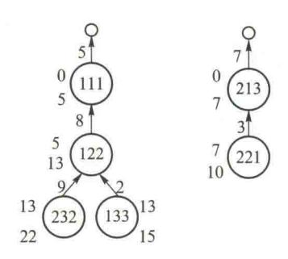

图 8.14 成本树

M1  $\begin{bmatrix} 111 & 221 \\ 0 & 5 & 7 & 10 \end{bmatrix}$ M2  $\begin{bmatrix} 122 & 232 \\ \hline 5 & 13 & 22 \end{bmatrix}$ M3  $\begin{bmatrix} 213 & 133 \\ \hline & & & \\ & & & \\ \end{bmatrix}$ 

图 8.15 甘特图

表 8.8 机器分配情况

| 作业    | 分准的压量的 <b>工序</b> 2年纪 = 四次 |   |   |  |  |  |  |  |
|-------|---------------------------|---|---|--|--|--|--|--|
| TE AV | 1                         | 2 | 3 |  |  |  |  |  |
| 1     | 1                         | 2 | 3 |  |  |  |  |  |
| 2     | 3                         | 1 | 2 |  |  |  |  |  |
| 3     | 1                         | 3 | 2 |  |  |  |  |  |
| 4     | 2                         | 3 | 1 |  |  |  |  |  |

表 8.9 各工序的加工时间

| 作业   | () () () () () () () () () () () () () ( |    |    |  |  |  |  |
|------|------------------------------------------|----|----|--|--|--|--|
| 1F.W | 1                                        | 2  | 3  |  |  |  |  |
| 1    | 5                                        | 8  | 2  |  |  |  |  |
| 2    | 7                                        | 3  | 9  |  |  |  |  |
| 3    | 1                                        | 7  | 10 |  |  |  |  |
| 4    | 4                                        | 11 | 7  |  |  |  |  |

根据表 8.8 得所有的工序为:111,122,133,213,221,232,311,323,332,412,423,431。因此,Hopfield 神经网络由 12 行 13 列的神经元矩阵组成。神经网络偏置电流矩阵取为(如表 8.10 所示)。

|     | 0     | 111  | 122  | 133  | 213  | 221  | 232  | 311  | 323  | 332  | 412 | 423 | 431 |
|-----|-------|------|------|------|------|------|------|------|------|------|-----|-----|-----|
| 111 | I     | -0.1 | -0.1 | -0.1 | I    | I    | I    | I    | I    | 1    | I   | I   | I   |
| 122 | -0. 1 | I    | -0.1 | -0.1 | I    | I    | I    | I    | I    | 1    | I   | I   | I   |
| 133 | -0.1  | I    | I    | -0.1 | I    | I    | I    | I    | I    | I    | I   | I   | I   |
| 213 | I     | 1    | Ī    | I    | -0.1 | -0.1 | -0.1 | I    | 1    | I    | I   | I   | I   |
| 221 | -0.1  | I    | I    | I    | I    | -0.1 | -0.1 | I    | I    | I    | I   | I   | I   |
| 232 | -0.1  | I    | I    | I    | I    | I    | -0.1 | I    | I    | I    | I   | I   | I   |
| 311 | I     | I    | I    | I    | I    | I    | I    | -0.1 | -0.1 | -0.1 | I   | I   | I   |

表 8.10 神经网络偏置电流矩阵

{36}------------------------------------------------

|     |     |      | 续表   |     |     |     |  |
|-----|-----|------|------|-----|-----|-----|--|
| 232 | 311 | 323  | 332  | 412 | 423 | 431 |  |
| I   | I   | -0.1 | -0.1 | I   | I   | I   |  |
| I   | I   | I    | -0.1 | 1   | 1   | I   |  |

I

I

I

-0.1

I

-0.1

-0.1

I

-0.1

-0.1

-0.1

神经网络偏置电流  $I_{xi}$  = I = 2 400; 负偏置电流 I 取为 -0.1; 取常数 A = 500, B = 200, C = 200, D 1 =500, D2=300, D3=300; 随机设置神经元初始状态; 然后求解网络运动方程, 可以得到表示 JSP 的调度方案的一些换位矩阵。如表 8.11 表示一个可行的调度方案。

由换位矩阵得到成本树组成如下:

0

-0.1

-0.1

I

-0.1

-0.1

323

332

412

423

431

111

I

I

I

I

122

I

I

I

I

I

133

I

I

I

I

213

I

I

I

I

221

I

I

I

I

I

I

I

I

I

1

I

I

$$\begin{array}{c|ccccccccccccccccccccccccccccccccccc$$

表 8.11 换 位 矩 阵

|     | 0 | 111 | 122 | 133 | 213 | 221 | 232 | 311 | 323 | 332 | 412 | 423 | 431 |
|-----|---|-----|-----|-----|-----|-----|-----|-----|-----|-----|-----|-----|-----|
| 111 | 1 | 0   | 0   | 0   | 0   | 0   | 0   | 0   | 0   | 0   | 0   | 0   | 0   |
| 122 | 0 | 1   | 0   | 0   | 0   | 0   | 0   | 0   | 0   | 0   | 0   | 0   | 0   |
| 133 | 0 | 0   | 0   | 0   | 0   | 0   | 0   | 0   | 0   | 0   | 0   | 1   | 0   |
| 213 | 1 | 0   | 0   | 0   | 0   | 0   | 0   | 0   | 0   | 0   | 0   | 0   | 0   |
| 221 | 0 | 0   | 0   | 0   | 1   | 0   | 0   | 0   | 0   | 0   | 0   | 0   | 0   |
| 232 | 0 | 0   | 1   | 0   | 0   | 0   | 0   | 0   | 0   | 0   | 0   | 0   | 0   |
| 311 | 0 | 1   | 0   | 0   | 0   | 0   | 0   | 0   | 0   | 0   | 0   | 0   | 0   |
| 323 | 0 | 0   | 0   | 0   | 1   | 0   | 0   | 0   | 0   | 0   | 0   | 0   | 0   |
| 332 | 0 | 0   | 0   | 0   | 0   | 0   | 1   | 0   | 0   | 0   | 0   | 0   | 0   |
| 412 | 1 | 0   | 0   | 0   | 0   | 0   | 0   | 0   | 0   | 0   | 0   | 0   | 0   |
| 423 | 0 | 0   | 0   | 0   | 0   | 0   | 0   | 0   | 1   | 0   | 0   | 0   | 0   |
| 431 | 0 | 0   | 0   | 0   | 0   | 0   | 0   | 0   | 0   | 0   | 0   | 1   | 0   |

{37}------------------------------------------------

或者用图 8.16 表示成本树。

相应的甘特图如图 8.17 所示,可以看出,最后完成时间为 32。

需要指出的是,采用上面介绍的基于 Hopfield 神经网络的方法,得到的很多结果很可能是局部极小点,这时  $E \neq 0$ ,表示得到的是一个非法的调度方案。为了解决这个问题,可以采用基于随机神经网络和混沌神经网络的生产调度方法。

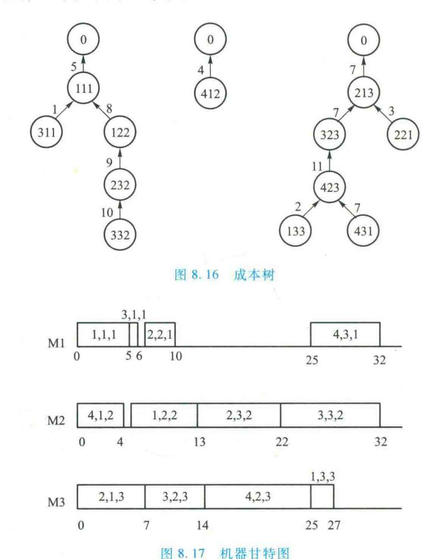

# 8.6.4 基于随机神经网络的生产调度方法

上述方法将作业调度问题映射为对应的 Hopfield 神经网络,使可行调度对应于计算能量函数的最小值 0。但根据神经网络理论,由于计算能量函数存在着大量的局部极小,导致上述 JSP 的神经网络的稳定输出常常是局部最优解,相应的计算能量函数不是最小值 0,根据 JSP 的计算能量函数的定义可知,不完全满足换位矩阵的约束,相应的神经网络输出肯定不是一个可行调

{38}------------------------------------------------

度解。

为了解决这一问题,可以把模拟退火方法应用于 Hopfield 神经网络求解,即在系统寻优过程中,利用神经元状态更新的随机性,允许向较差方向搜索,以跳出局部极小。经多次寻查后,最终使系统稳定于能量最低状态,使神经网络收敛到计算能量函数的最小值 0,从而使神经网络输出是一个可行调度解。

下面根据改进 Metropolis 方法,给出一种求解 JSP 的基于模拟退火的神经网络算法。

#### (1) 初始化

设置初始温度  $T_0 \leftarrow T_{\text{max}}$ , 合适的输入偏置电流, 凝结温度  $T_{\text{min}}$ , 温度下降速率 r, 在每个温度点的循环处理次数 k。

#### (2) 随机爬山

对每个神经元i,由求解网络方程计算输出电压。由网络稳定状态集组成成本树,求出最大成本变化量 $\Delta\cos t_i$ 。

若 Δcost, <0,则转去(3);否则计算能量变化量

$$\Delta E_i = \sum_j w_{ij} v_j + \theta_i \tag{8.65}$$

若  $\Delta E_i < 0$ ,则令

$$\Delta E_i \leftarrow \Delta E_i + \Delta \cos t_i \tag{8.66}$$

否则,令

$$\Delta E_i \leftarrow \Delta E_i - \Delta \cos t_i \tag{8.67}$$

计算概率

$$p_{i} = \frac{1}{1 + \exp\left(-\frac{\Delta E_{i}}{T}\right)} \tag{8.68}$$

选择均匀分布随机数 RAND,若  $P_i > RAND$ ,则令神经元 i 的状态为"1",否则,令为"0"。 重复该步骤 k 次。

# (3) 退火/收敛检验

令  $T_n \leftarrow (r)^n T_{\text{max}}$ ,若  $T_n \ge T_{\text{min}}$ ,则转去(2);否则停止。

在理论上,模拟退火算法只有在初始温度  $T_{max}$ 充分高,温度下降足够慢,在每个温度点下循环处理无限多次,并在  $T \rightarrow 0$  时,才能收敛于全局最优解,但导致计算时间大大增加。目前虽然提出了快速模拟退火、并行模拟退火等多种改进算法,但也没有完全解决局部极小问题。如何更好地解决这一问题,仍是神经优化计算理论中值得深入研究的重要问题之一。

例如,仍以前面介绍过的一个 4 作业 3 机器的 JSP 为例,机器分配和各工序需要的加工时间如表 8.8 和表 8.9 所示。可以设置模拟退火算法搜索参数为:  $T_{\max}=100$ ,  $T_{\min}=0$ . 18, r=0. 9, 每个温度上的循环次数 k=5, 时间步长 h=0. 000 01, 温度减少步数 n=5。其他参数与前面用神经网络相同。根据上面介绍的步骤容易得到表示可行调度的换位矩阵,具体过程不再赘述。

{39}------------------------------------------------

# 8.7 卷积神经网络及其应用

# 8.7.1 深度神经网络的提出

BP 神经网络以数值作为输入。如果要处理图像相关的信息,则要先从图像中提取特征。随着神经网络的层数加深,训练过程存在严重的"梯度扩散"(gradient diffusion)现象,即网络的输出结果通过反向传播,当到达最前面的几层时,梯度会逐渐消失,不能指引网络权值的训练,从而导致网络训练过程不能收敛。因此,BP 学习算法一般只能用于浅层网络结构(通常等于3)的学习,这就限制了 BP 学习算法的数据表征能力,影响了在诸多工程领域中的应用。此外,由于 BP 学习算法依赖于梯度调参,也容易陷入局部最优解。许多研究通过很多数学和工程技巧来增加神经网络隐层的层数,也就是深度,所以相应的神经网络称为深度神经网络(deep neural networks, DNN),相应的学习算法被称为深度学习(deep learning, DL)。

2006年,加拿大多伦多大学教授 Hinton 和博士生萨拉赫丁诺夫(Salakhutdinov)根据生物学的重要发现,提出了深度学习方法。

1968 年神经生物学家大卫·休伯尔(David Hunter Hubel)与托斯坦·威泽尔(Torsten N. Wiesel)在研究猫脑皮层中用于局部敏感和方向选择的神经元时,有两个重要发现:

- (1) 对于视觉的编码,动物大脑皮层的神经元存在局部感受域(localized receptive field),也就是说,它们是局部敏感的且具有方向选择性。
- (2) 动物大脑皮层是分级、分层处理的。在大脑的初级视觉皮层中存在三类细胞:简单细胞 (simple cell)、复杂细胞(complex cell)和超复杂细胞(hyper-complex cell),这些不同类型细胞承担不同抽象层次的视觉感知功能。

2006年, Hinton 等在著名学术刊物《科学》上发表了深度学习算法,首次提出了"深度信念网络"(deep belief network, DBN)的概念,并给出了两个重要结论:

- (1) 具有多个隐层的人工神经网络具有更好的特征学习能力,每一层特征的抽取都是前一层的抽象,学习到的特征更好地刻画了数据。深度学习分层预训练的本质,就是对输入数据进行逐级抽象,符合生物大脑的认知过程。大脑在认知过程中,会将看到的视觉图像或听到的声波信号逐层抽象,最终抽象成语义符号。
- (2) 通过逐层初始化的"逐层预训练"(layer-wise pre-training),可以找到一个接近最优解的神经网络权值,然后再通过"微调"(fine-tuning)对整个网络进行优化训练,从而大幅减少训练多层神经网络所需的时间。与传统的人工神经网络学习需要人工提取特征不同,深度学习实现特征的自动抽取,从输入层开始,到中间为数众多的隐层,再到输出层的判断,所有层的特征提取都无须人工干预。

深度学习的提出也得益于高性能计算和大数据技术的快速发展。如图形处理器(graphics processing unit, GPU)、大规模集群直接支撑了深度神经网络的训练。深度学习是一个数据驱

{40}------------------------------------------------

动(data-driven)的计算模型,它需要使用大量数据进行训练。目前,海量、高增长率和多样化的信息为大规模深度神经网络训练提供了充分的数据。

本节和后面几节将分别介绍应用广泛的卷积神经网络、胶囊网络以及生成对抗网络。

## 8.7.2 卷积神经网络的结构

卷积神经网络(convolutional neural networks, CNN)是一种多层神经网络,每层由多个二维平面组成,而每个平面由多个独立神经元组成。卷积神经网络的结构示例如图 8.18 所示。

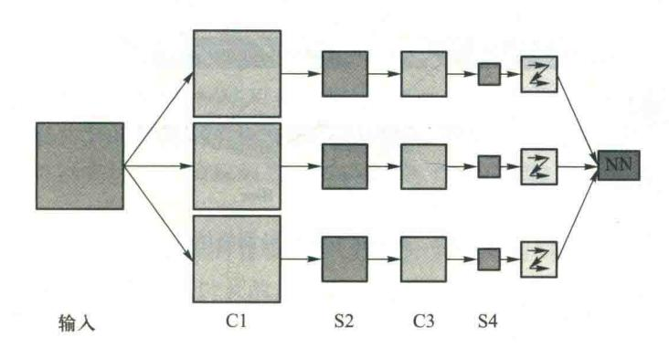

图 8.18

输入层通常是一个矩阵,例如一幅图像的像素组成的矩阵。

C层为特征提取层,称为卷积层,对输入图像进行卷积,提取该局部的特征。

S 层是特征映射层,称为池化层(pooling)或者下采样层(subsampling),对提取的局部特征进行综合。网络的每个计算层由多个特征映射组成,每个特征映射为一个平面,平面上所有神经元的权值相等。特征映射结构采用 Sigmoid 函数作为激活函数,使得特征映射具有位移不变性。

CNN 中的每一个卷积层 C 都紧跟着一个求局部平均用于二次提取特征的池化层 S。C、S 层中的每一层都由多个二维平面组成,每一个二维平面是一个特征图 (feature map)。这种特有的两次特征提取结构能够容许识别过程中输入样本有较严重的畸变。

在图 8.18 中输入图像通过三个卷积核(convolution kernel,也称滤波器 filter)和可加偏置进行卷积,卷积后在 C1 层产生三个特征图。C1 层的三个特征图分别通过池化,对特征图中每组的像素再进行求和、加权、加偏置,得到 S2 层的三个特征图。这三个特征图通过一个卷积核卷积得到 C3 层的三个特征图。与前面类似,池化得到 S4 层的三个特征图。最后,S4 层的特征图光栅化后,变成向量。这个向量输入到传统的全连接神经网络(fully connected networks)NN 中进行进一步的分类,得到输出。

图 8.18 中的 C1、S2、C3、S4 层中的所有特征图都可以用"像素×像素"定义图像大小。由于这些特征图组成了神经网络的卷积层和池化层,这些特征图中的每一个像素恰恰就代表了一个

{41}------------------------------------------------

神经元。每一层所有特征图的像素个数,就是这层网络的神经元个数。

一个典型的卷积神经网络结构如图 8.19 所示。

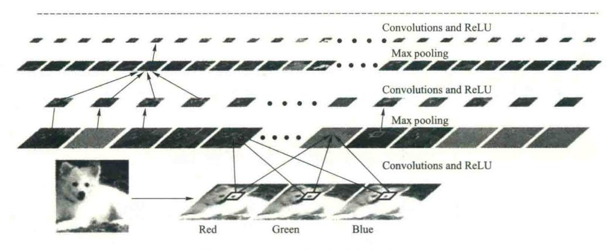

图 8.19 典型的卷积神经网络结构

最初的几个阶段是由卷积层和池化层组成,特征图中的每一个单元通过卷积核的权值,连接到上一层的特征图的一个局部块,得到一个局部加权和,然后传给一个非线性函数,如 ReLU。 卷积和池化过程如图 8.20 所示。

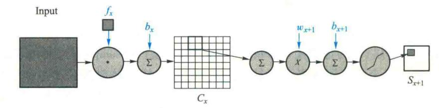

图 8.20 卷积和池化讨程

卷积过程:用一个可以训练的卷积核 $f_x$  去卷积一个输入图像(第一阶段是输入图像,其他各阶段就是特征图了,但本质上仍然是图像),然后加上一个偏置  $b_x$ ,得到卷积层  $C_x$ 。在一个特征图中的全部单元经过相同的卷积核,不同层的特征图使用不同的卷积核。使用这种结构出于两方面的原因:首先,在数组数据中,比如图像数据,附近的值经常是高度相关的,具有明显的局部特征。其次,在一个地方出现的某个特征,也可能出现在别的地方,所以不同位置的单元可以共享权值。在数学上,对特征图进行的是一个卷积操作。这也是卷积神经网络名称的由来。

池化过程:邻域几个像素(如图中 4 个像素)通过池化变为一个像素,然后通过标量  $w_{x+1}$  加权,加偏置  $b_{x+1}$ ,再通过一个 Sigmoid 函数,产生一个缩小几倍的特征图  $S_{x+1}$ 。池化层的作用是在语义上把相似的特征合并起来,减少表达的维度以及保持数据平移的不变性。

在卷积神经网络上进行反向传播算法和在一般的深度网络上是一样的,可以让所有卷积核

{42}------------------------------------------------

中的全部权值得到训练。

CNN 把提取特征、池化和传统的神经网络整合成一个新的网络。CNN 是深度学习的基础,已经成为当前众多科学领域的研究热点之一,特别是在模式分类领域,由于该网络避免了对图像的复杂前期预处理,可以直接输入原始图像,避免了传统识别算法中复杂的特征提取和数据重建过程,因而得到了更为广泛的应用,特别是成为当前和图像处理领域的研究热点。

CNN 是为识别位移、缩放及其他形式扭曲不变性的二维图形而特殊设计的一种多层感知器。卷积神经网络更像生物神经网络,具有权值共享网络结构,降低了网络模型的复杂度,减少了权值的数量。由于 CNN 的特征检测层通过训练数据进行学习,所以在使用 CNN 时,避免了通常由人完成的显式的特征抽取,可以由 CNN 自动地隐式地从训练数据中进行学习。另外,同一特征映射面上的神经元权值相同,网络可以并行学习,这也是卷积神经网络的一大优势。卷积神经网络以其局部权值共享的特殊结构在语音识别和图像处理方面有着独特的优越性,特别是多维输人向量的图像可以直接输入到网络这一特点避免了特征提取和分类过程中数据重建的复杂度。

下面首先介绍卷积神经网络中的卷积运算,然后分别介绍卷积神经网络使用的4个关键技术:局部连接、权值共享、多卷积核以及池化。

# 8.7.3 卷积神经网络的卷积运算

卷积(Convolutional)源自拉丁文"convolvere",其含义就是"卷在一起(roll together)",是数学上的一个重要的运算,由于其具有丰富的物理、生物、生态等意义,所以具有非常广泛的应用。

下面介绍卷积神经网络中用到的卷积运算方法。

在图像处理中,采用卷积运算对输入图像或 CNN 上一层的特征图进行变换,也就是特征抽取,得到新的特征。这就是为什么卷积之后的结果被称为"特征图"的原因。

一幅灰度图片可以用一个像素矩阵表示。矩阵中的每个数字的取值范围为[0,255]。0表示黑色,255表示白色,其他灰度为介于0~255的整数。如果是彩色图片,则用 RGB 三个像素矩阵共同表示。如(255,0,0)表示红色,(218,112,214)表示淡紫色。每个像素矩阵称之为通道,因此,灰度图像为单通道,彩色图像为3通道。在数学上,把这样的3通道数据矩阵称为三阶张量(tensor)。张量的长度和宽度即像素矩阵行数和列数分别为图像的分辨率,通道数称为高度。

人类通过长期的进化,当眼睛看到图像时大脑就自动提取出很多用以识别类别的特征。但对计算机而言,从一系列的数字矩阵提取特征不是一件简单的事情。在计算机的"眼睛"里,图像是数字矩阵,那么提取图像的特征实际上就是对数字矩阵进行运算,其中非常重要的运算就是卷积。

为计算简单起见,考虑一个给定 5×5 的像素值的矩阵,它的像素值仅为或 0 或 1(实际灰度图像的像素值的范围是 0~255)。卷积核是一个 3×3 的矩阵,其中的值也是或 0 或 1(实际上可以是其他值),如图 8.21 所示。

{43}------------------------------------------------

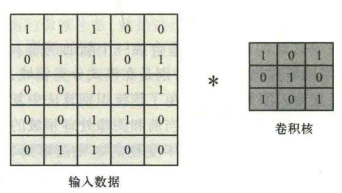

图 8.21 输入矩阵和卷积核

用卷积核矩阵在输入矩阵上从左到右、从上到下滑动,每次滑动。个像素,滑动的距离。称为步幅(stride)。卷积特征矩阵是输入矩阵和卷积核矩阵重合部分的内积,即卷积特征矩阵每个位置上的值是重合部分两个矩阵间的相应元素乘积之和。因此,卷积特征矩阵称为特征图。

例如,卷积特征矩阵中第一行的第一个元素为: $(1\times1+1\times0+1\times1)+(0\times0+1\times1+1\times0)+(0\times1+1\times0+1\times1)=2+1+1=4$ ,如图 8. 22(a)。然后向右移动一格(设步幅 s=1),可以得到卷积特征矩阵中第一行的第二个元素为: $(1\times1+1\times0+0\times1)+(1\times0+1\times1+0\times0)+(0\times1+1\times0+1\times1)=1+1+1=3$ ,如图 8. 22(b)。再向右移动一格,可以得到卷积特征矩阵第一行的第一个元素为 4,如图 8. 22(c)。卷积核矩阵移至最左边并往下移一格(如图 8. 22(d)所示),同样计算可以得到 2。以此类推,这里不赘述。

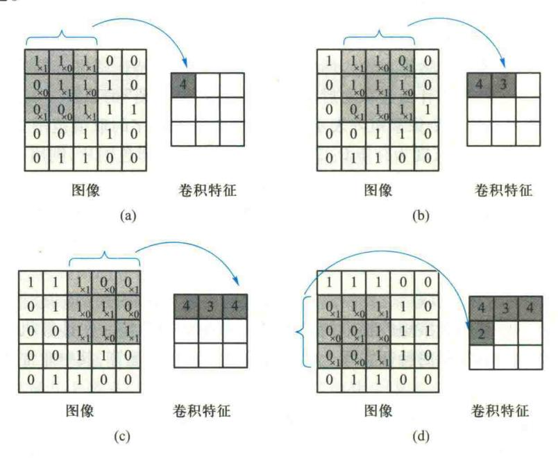

图 8.22 矩阵卷积运算

{44}------------------------------------------------

很显然,卷积特征矩阵比原来的输入矩阵维数低。如果希望得到的卷积特征矩阵维数和原来的输入矩阵维数一样,可以在原输入矩阵四周进行 0 填充,扩大输入矩阵的维数。这种操作称为补零(zero padding)。例如,在上面这个例子中,可以在原输入矩阵四周进行 0 填充,扩大输入矩阵的维数为 7×7,这样经过 3×3 的卷积核卷积后,可以得到维数为 5×5 的卷积特征矩阵。

在卷积神经网络中,卷积核的设计非常重要。卷积核的定义:

其中, filter\_width 是卷积核的宽; filter\_height 是卷积核的高; filter\_channels 是卷积图像的通道数; filter\_types 是卷积的种类。

例如,5×5×3→20:卷积核宽、高各为5个像素,卷积通道数为3,共20种卷积核。

在卷积核和输入图像矩阵进行卷积过程中,图像中的所有像素点会被线性变换组合,得到图像的一些特征。例如,分别用图 8.23 (a)、(b)两个卷积核,可以分别得到输入图像的竖向边缘和横向边缘。

$$\begin{bmatrix} 1 & 0 & -1 \\ 1 & 0 & -1 \\ 1 & 0 & -1 \end{bmatrix} \qquad \begin{bmatrix} 1 & 1 & 1 \\ 0 & 0 & 0 \\ -1 & -1 & -1 \end{bmatrix}$$
(a) (b)

在没有边缘的比较平坦的区域,像素值的变化比较小,而横向 边缘上下两侧的像素差异明显,竖向边缘左右两侧的像素差异比较

图 8.23 卷积核

大。在(a)中,用三行1,0,-1组成的卷积核和输入图像卷积实际是计算了输入图像中每个3×3区域内的左右像素的差值,所以得到了输入图像的竖向边缘。在(b)中,用三列1,0,-1组成的卷积核和输入图像卷积实际是计算了输入图像中每个3×3区域内的上下像素的差值,所以得到了输入图像的横向边缘。

卷积核越大,感受域越大,看到的图片信息越多,因此获得的特征越好。但是大的卷积核会导致计算量大增,计算性能会降低、不利于模型深度的增加。实用中,3×3卷积核被广泛应用。

# 8.7.4 卷积神经网络的局部连接

在图像处理中,往往把图像表示为像素的向量。如图 8.24(a)所示 1000×1000 的图像,可以表示为一个 1000 000 的向量。在 BP 神经网络中,如果隐含层数目与输入层一样,即也是 1000 000 时,那么输入层到隐含层的参数数据为 1000 000×1000 000 =  $10^{12}$ ,这么多的权值参数很难训练。

人对外界的认知是从局部到全局的,而图像的空间联系也是局部的像素联系较为紧密,而距离较远的像素相关性则较弱。视觉皮层的神经元就是局部接受信息的,这些神经元只受某些特定区域刺激的响应。因而,每个神经元不是对全局图像进行感知,而只对局部进行感知,然后在更高层将局部的信息综合起来得到全局信息。这样可以减少神经元之间的连接数,从而减少神经网络需要训练的权值参数的个数。

如图 8.24(b) 所示, 假如局部感受域是 10×10, 隐层每个感受域只需要和这 10×10 的局部图像相连接, 所以 100 万个隐层神经元就只有一亿个连接, 即 108 个参数, 比原来减少了 4 个数量级, 但需要训练的参数仍然很多, 可以进一步简化。

{45}------------------------------------------------

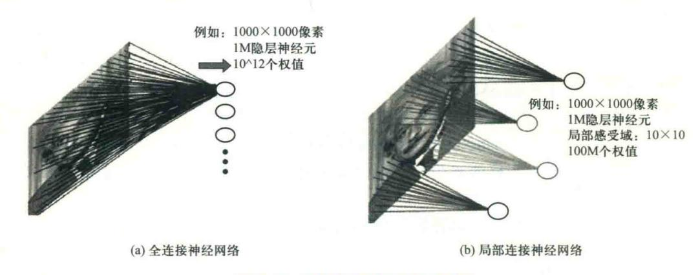

图 8.24 卷积神经网络的局部连接

# 8.7.5 卷积神经网络的权值共享

CNN 受生物学里面的视觉系统结构启发,每个映射面上的神经元共享权值,因而减少了网络自由参数的个数。

隐含层的每一个神经元如果只和 10×10 个像素连接,也就是说每一个神经元存在 10×10 = 100 个连接权值参数。如果将每个神经元的 100 个参数设置成相同,就只有 100 个参数了。不管隐层的神经元个数有多少,两层间的连接都只有 100 个参数,这就是卷积神经网络的权值共享。上述讨论未考虑每个神经元的偏置部分,所以共享权值个数需要加 1,这也是同一种卷积核所共享的。

权值共享隐含的原理则是:图像的一部分的统计特性与其他部分是一样的。这也意味着在这一部分学习的特征也能用在另一部分上,所以对于这个图像上的所有位置,都能使用同样的学习特征。

更直观一些,当从一个大尺寸图像中随机选取一小块,比如说 8×8 作为样本,并且从这个小块样本中学习到了一些特征,这时可以把从这个 8×8 样本中学习到的特征,应用到这个图像的任意地方中去。特别是,可以用从 8×8 样本中所学习到的特征跟原本的大尺寸图像作卷积,从而对这个大尺寸图像上的任一位置获得一个不同特征的激活值。

每张特征图上神经元的数目和输入图的宽(width)、高(height)、卷积核的宽(filter\_width)、卷积核的高(filter\_height)、卷积核的步长(stride)均有关,且等于原图上可取的卷积区域的数目。一般情况下,需要按下面的公式来算。设特征图的宽、高分别是 n 和 m,则

$$n = \left[\frac{width - filter\_width}{stride} + 1\right]$$

$$m = \left[\frac{height - filter\_height}{stride} + 1\right]$$
(8.70)

{46}------------------------------------------------

# 8.7.6 卷积神经网络的多卷积核

上面所述只有 100 个参数时,表明只有 1 个 100×100 的卷积核,显然,特征提取是不充分的。 卷积神经网络的多卷积核就是添加多个不同卷积核分别提取不同的特征。每个卷积核都会将原 图像生成为另一幅图像。如图 8.25 所示 2 个卷积核,生成了两幅图像,这两幅图像可以看做是 一张图像的不同的通道。

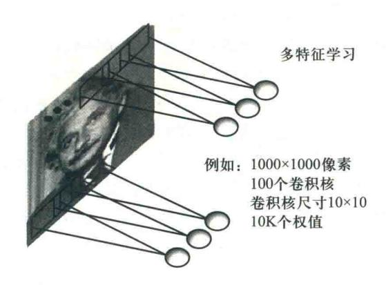

图 8.25 卷积神经网络的多卷积核

图 8. 26 展示了在四个通道上的卷积操作。用两个卷积核生成两个通道。其中需要注意的是,四个通道上每个通道对应一个卷积核,先将 $w^1$  忽略,只看 $w^0$ ,那么在 $w^0$  的某位置(i,j)处的值,是由四个通道上(i,j)处的卷积结果相加然后再取激活函数值得到的。

$$h_{ij}^{k} = \tanh((w^{k} * x)_{ij} + b_{k})$$
 (8.71)
 $m$ -1层 隐层 $m$ 

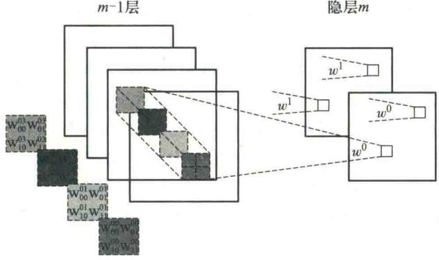

图 8.26 四个通道上的卷积操作

在图 8.26 由 4 个通道卷积得到 2 个通道的过程中,参数的数目为 4×2×2×2 个,其中 4 表示 4 个通道,第一个 2 表示生成 2 个通道,最后的 2×2 表示卷积核大小。

{47}------------------------------------------------

# 8.7.7 卷积神经网络的池化

通过卷积获得了特征之后,如果直接利用这些特征训练分类器,计算量是非常大的。例如:对于一个96×96 像素的图像,假设已经学习得到了400 个定义在8×8 输入上的特征,每一个特征和图像卷积都会得到一个(96-8+1)×(96-8+1)=7921维的卷积特征,由于有400个特征,所以每个样本都会得到一个7921×400=3168400维的卷积特征向量。学习一个超过300万特征输入的分类器是非常困难的,并且容易出现过拟合。

为了解决这个问题,对不同位置的特征进行聚合统计来降低特征的维度。例如,可以计算图像一个区域上的某个特定特征的平均值(或最大值)。这些聚合的统计特征不仅具有低得多的维度(相比使用所有提取得到的特征),同时还会改善结果(不容易过拟合)。这种聚合的操作称为池化(pooling),有时采用平均池化或者最大池化方法。

卷积神经网络中的卷积和池化层灵感来源于视觉神经科学中的简单细胞和复杂细胞。这种细胞是以 LNG-V1-V2-V4-IT 这种层级结构形成视觉回路的。当给一个卷积神经网络和猴子一幅相同的图片的时候,卷积神经网络展示了猴子下颞叶皮质中随机 160 个神经元的变化。

卷积神经网络在池化层丢失大量的信息,从而降低了空间分辨率,导致了对于输入微小的变化,其输出几乎是不变的。

# 8.7.8 卷积神经网络的实现与应用

如今的深度神经网络架构有 10~20 层、上百万个权值以及几十亿个连接。图形处理器 (graphics processing unit, GPU) 虽然有强大的计算能力,适合于加速深度神经网络训练,但深度神经网络具有深层结构、数千万参数需要学习,导致训练非常耗时,需要采用数据并行技术加速 DNN 训练。对微信语音识别应用,在模型收敛速度和模型性能上都取得了有效提升。实验结果表明,相比单 GPU 4.6 倍加速比,数十亿样本的训练数天收敛,测试集字错率降低约 10%。目前基于此框架训练的模型成功上线到微信语音输入法、微信语音开放平台和微信语音消息转文字。

卷积神经网络很容易在芯片或者现场可编程门阵列(FPGA)中高效实现,许多公司比如 NVIDIA、Mobileye、Intel、Qualcomm 以及 Samsung,正在开发卷积神经网络芯片,以使智能机、相机、机器人以及自动驾驶汽车中的实时视觉系统成为可能。

20世纪90年代以来,基于卷积神经网络出现了大量的应用。最开始是用时延神经网络来做语音识别以及文档阅读。一个比较原始的1D卷积神经网络被称为时延神经网络,可以被用来识别语音以及简单的单词。这个文档阅读系统使用一个被训练好的卷积神经网络和一个概率模型,实现了语言方面的一些约束。20世纪90年代末,在美国这个系统被用于超过10%的支票阅读上。后来,微软开发了基于卷积神经网络的字符识别系统以及手写体识别系统。

21世纪开始,卷积神经网络就被成功地大量用于检测、分割、物体识别以及图像的各个领域。 这些应用都是使用了大量的有标签的数据,比如交通信号识别,生物信息分割,面部探测,文本、行人 以及自然图形中的人的身体部分的探测。近年来,卷积神经网络的一个重大成功应用是人脸识别。 

{48}------------------------------------------------

2012年的 ImageNet 竞赛使计算机视觉以及机器学习团队开始重视卷积神经网络。卷积神经网络被用在上百万张网络图片数据集,这个数据集包含了 1000 个不同的类。该结果比当时最好的方法几乎降低了一半的错误率。目前,卷积神经网络被用于几乎全部的识别和探测任务中。

# 8.7.9 卷积神经网络在手写数字识别中的应用

一种典型的手写数字识别系统的卷积神经网络是 Yann LeCun 于 1998 年提出的 LeNet-5。 美国大多数银行当年用它识别支票上面的手写数字,说明该算法具有很高的准确性。

LeNet-5 共有 7 层,不包含输入层,每层都包含可训练参数(连接权重),如图 8.27 所示。

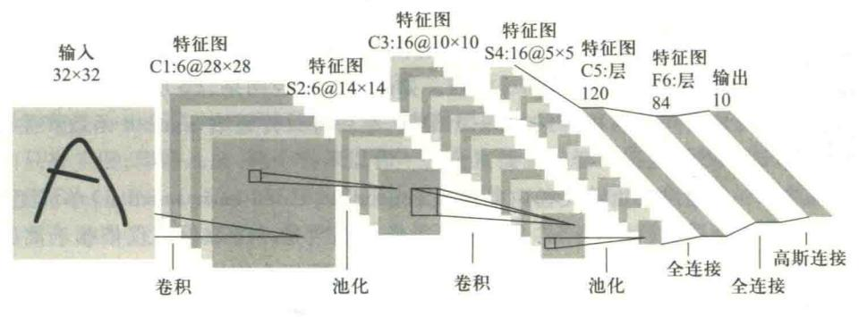

图 8.27 LeNet-5 算法

输入图像为 32×32 大小。这样能够使一些重要特征如笔画、断点或角点能够出现在最高层特征监测子感受域的中心。

C1 层是一个卷积层,由 6 个特征图构成。这之间有个单通道卷积核  $5\times5\times1\to6$ , stride = 5。卷积核大小为  $5\times5\times1=25$ ,有一个可加偏置,6 种卷积核得到 C1 的 6 个特征图。通过卷积运算,可以使原信号特征增强,并且降低噪音。特征图中每个神经元与输入中  $5\times5$  的邻域相连。特征图的大小为  $28\times28$ ,这样能防止输入的连接掉到边界之外。C1 有  $(5\times5\times1+1)\times6=156$  个可训练参数。C1 共有  $156\times(28\times28)=122$  304 个连接。

S2 层是一个池化层,有 6 个 14×14 的特征图。对图像进行池化,可以减少数据处理量同时保留有用信息。特征图中的每个单元与 C1 中相对应特征图的 2×2 邻域相连接。C1 层每个单元的 4 个输入相加,乘以一个可训练参数,再加上一个可训练偏置可得到 S2 层。每个单元的 2×2 感受域并不重叠,因此 S2 中每个特征图的大小是 C1 中特征图大小的 1/4(行和列各 1/2)。S2 层有 6×(1+1)=12 个可训练参数和 14×14×6×(2×2+1)=5 880 个连接。

C3 层也是一个卷积层。它同样通过 5×5 的卷积核去卷积层 S2, 然后得到的特征图 map 就只有 10×10 个神经元, 但是它有 16 种不同的卷积核, 所以就存在 16 个特征映射。

这里需要注意的是:C3 中的每个特征映射并不都连接到 S2 中的所有特征映射,将连接的数量保持在合理范围内,而且使不同的特征图有不同的输入,迫使它们抽取不同的特征。这里用组合模拟人的视觉系统,底层的结构构成上层更抽象的结构,例如边缘构成形状或者目标的部分。

{49}------------------------------------------------

例如,C3的前6个特征图以S2中3个相邻的特征图子集为输入。接下来6个特征图以S2中4个相邻特征图子集为输入。后续3个特征图以不相邻的4个特征图子图为输入,最后1个特征图以S2中所有特征图为输入。这样C3层有1516个可训练参数和151600个连接。

S4 层是一个下采样层,由 16 个 5×5 大小的特征图构成。特征图中的每个单元与 C3 中相应特征图的 2×2 邻域相连接,跟 C1 和 S2 之间的连接一样。S4 层有 32×[16×(1+1)]个可训练参数(每个特征图 1 个因子和一个偏置)和 2 000 个连接。

C5 层是一个卷积层,有 120 个特征图。每个单元与 S4 层的全部 16 个单元的 5×5 邻域相连。由于 S4 层特征图的大小也为 5×5,同卷积核一样,故 C5 特征图的大小为 1×1:这构成了 S4 和 C5 之间的全连接。C5 层有 120× (16×5×5+1) = 48 120 个可训练连接。

根据输出层的设计,F6 层有 84 个单元,与 C5 层全相连,有 10 164×[84×121×(120+1)]个可训练参数。如同经典神经网络,F6 层计算输入向量和权重向量之间的点积,再加上一个偏置,然后将其传递给 Sigmoid 函数产生单元 *i* 的一个状态。

CNN 优点和缺点 讲课视频▲

8.7节阅读文献▲

输出层由欧氏径向基函数 (euclidean radial basis function) 单元组成,每类一个单元,每个有84个输入。径向基函数是一个取值仅仅依赖于离原点距离的实值函数,欧氏距离是其中一个实例,即每个输出RBF单元计算输入向量和参数向量之间的欧式距离。输入离参数向量越远,RBF输出越大。假设 $x,x_0 \in R^N$ ,以 $x_0$ 为中心,x到 $x_0$ 的径向距离为半径所形成的  $\|x-x_0\|$  构成的函数系满足 K(x)=0,  $\|x-x_0\|$  称为径向基函数。常用的径向基函数有高斯分布函数等。

# 8.8 胶囊网络

针对卷积神经网络训练数据需求大、环境适应能力弱、可解释性差、数据分享难等不足,2017年10月,Hinton G E 教授等在"神经信息处理系统大会(conference and workshop on neural information processing systems,NIPS)"这个机器学习的顶级会议上发表论文,提出了新型神经网络结构——胶囊网络(capsule networks,简称 Caps Net)。

# 8.8.1 胶囊网络的基本思想

胶囊(capsule)是一个包含多个神经元的载体,每个神经元表示了图像中出现的特定实体的各种属性。这些属性可以包括许多不同类型的实例化参数(instantiation parameter),例如姿态(位置、大小、方向)、变形、速度、色相、纹理等。它的输出数值大小就是实体存在的概率。

胶囊网络用向量神经元(vector neuron, VN)的向量输出代替传统标量神经元(scalar neuron, SN)的标量输出,可以表示更丰富的内容,从而能够识别更加复杂多变的场景。特别是胶囊网络具有一定的可解释性,为深度学习提供了一种新的神经网络结构及方法。与卷积神经网络的工

{50}------------------------------------------------

作机理相比,胶囊网络更接近于人类大脑的工作方式。胶囊网络擅长处理不同类型的视觉刺激, 在视频中人类行为定位、医学图像目标分割、文本分类等任务上都取得更好的效果。胶囊网络有 可能会取代目前常用的卷积神经网络。

胶囊网络的核心思想:胶囊不是传统神经网络中的一个神经元,而是一组神经元。胶囊里封装的检测特征的相关信息是以向量的形式存在的,其输入输出均为高维的活动向量(activity vector),胶囊的输入是一个向量,是用一组神经元来表示多个特征。通过归一化处理,向量的"长度"可表示检测实体存在的概率,也就是向量的输出数值大小;向量的"方向"表示检测实体的各个属性,也就是向量的各个维度信息。这些实体的属性一般包括各种不同种类的实例化参数(instantiation parameter),如姿态(位置、大小、方向)、变形、速度、色相、纹理等。

## 8.8.2 胶囊网络的基本结构

胶囊网络是一种新的神经网络架构。一个浅层胶囊网络 CapsNet 结构如图 8.28(a)所示。这个结构只有 4 层,即输入层、两个卷积层和一个全连接层。输入层就是数字图片本身。后面三层分别记作 Conv1、PrimaryCaps 和 DigitCaps。虽然这个 CapsNet 的网络架构的层数并不多,但由于它利用了向量神经元和动态路由等技术,导致其性能与深层卷积神经网络差不多。

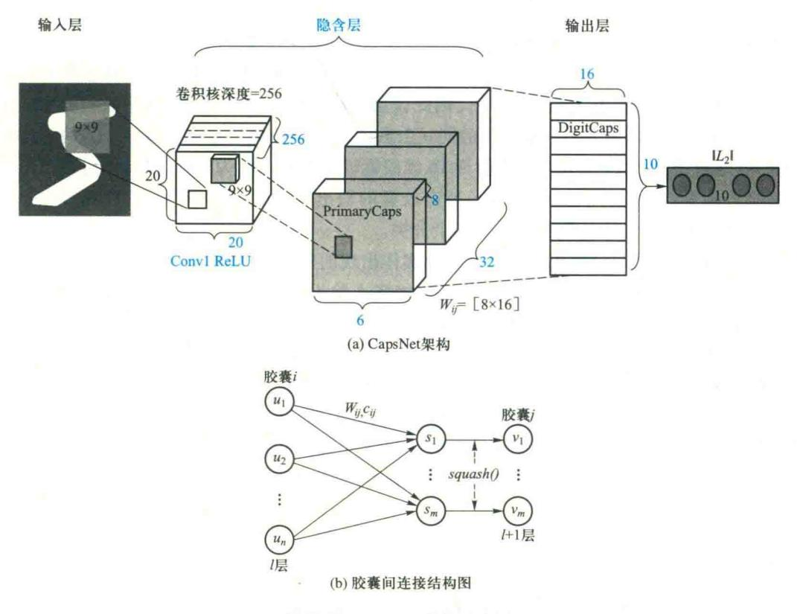

图 8.28 CapsNet 结构示意图

{51}------------------------------------------------

胶囊网络还有一个全连接层。胶囊网络和全连接网络的连接方式一样,前一层每一个胶囊神经单元都会和后一层每一个胶囊神经单元相连,如图 8.28(b)所示。胶囊网络的每一个连接也有权重。在全连接神经网络中,每一个神经元都是标量,所以每个权重都只是一个标量。但在胶囊网络中,每一个胶囊神经元都是向量,所以每个胶囊神经元的权值 W 也应该是一个向量。W 仍然可以采用 BP 学习算法更新。

图 8. 28(a)是一个简单的 CapsNet 架构,其中输入是一张 28×28 的手写字的图片。Conv1 是一个标准的卷积层,有 256 个通道,每个通道均用 9×9 的卷积核,将输入层图片中的像素亮度转化成局部特征输出,作为 Conv1 层的输入。该层的激活函数是 ReLU。由于一层卷积神经网络不足以抽取到合适的特征,因此,在 Conv1 之后,CapsNet 又加了一个卷积层 Primary Capsules(简称 PrimaryCaps),称为初级胶囊层。

PrimaryCaps 是一个卷积的胶囊层,包含 32 个胶囊。PrimaryCaps 才是胶囊真正开始的地方。该层使用 9×9 的卷积核对 ReLU Conv1 做卷积操作,并将其调整成适用于 CapsNet 的向量神经元层 PrimaryCaps (每个输出都是 8 维向量),而不是以往的标量神经元。PrimaryCaps 到 DigitCaps层的传播也就是 CapsNet 和以往操作的最大区别。在 PrimaryCaps 层中,参与卷积操作的对象不再是单个神经元,而是粒度更大的神经胶囊。因此,可以将 PrimaryCaps 理解为"胶囊版本"的卷积层。

DigitCaps 层是胶囊网络(CapsNet)的全连接层,称为高级胶囊层。这一层里胶囊个数对应分类任务的目标类别数,每个胶囊对应的向量长度代表某一类别所能呈现的不同状态及其存在的概率。例如要识别的是 10 类数字( $0\sim9$ ),因此该层的胶囊个数共有 10 个,每个胶囊表示的向量中元素的个数为 16,代表着不同状态下的同一个数字。每个胶囊接受一个  $6\times6\times32$  的 8 维向量作为输入,通过  $W_{ij}$ 将 8 维输入空间映射到 16 维胶囊输出空间。因为拓扑结构为全连接,所以每个胶囊都会接受前一层(即 PrimaryCaps)所有胶囊的输出。对这 10 个向量求模,求得模值最大的那个向量代表的就是图片概率最大的那个分类。

在胶囊网络中,用向量模的大小衡量某个实体出现的概率,模值越大,概率越大。因此 Caps-Net 更适合去检测那些重叠在一起的图片。比如在人脸识别中,每个胶囊都代表着一个检测任务,最后的输出层只要 2 个胶囊,即分别检测的是"脸"和"不是脸"。中间层的胶囊都负责检测一些更低级特征的任务,比如鼻子、眼睛、嘴巴等,还有一些如耳环、眼镜等。这些中间层的胶囊要把激活值输出给下一层的胶囊,例如输出给"脸"和"不是脸"这两个胶囊。胶囊更倾向于选择和自己最接近也是最相似的输出胶囊或者关系最大的胶囊,例如,"眼睛""鼻子""嘴"这一类的胶囊应该比选择"脸"的胶囊的概率更大,而选择"不是脸"的胶囊的概率更小。而"眼镜"这一类的胶囊能就应该选择"不是脸"的胶囊的概率更大,而选择"脸"的胶囊的概率更小。

# 8.8.3 胶囊网络的学习运算

#### 1. 胶囊网络计算

胶囊网络与全连接神经网络的输入即线性加权求和类似,但是在线性求和阶段上多加了一

{52}------------------------------------------------

个耦合系数  $c_{ii}$ 。 胶囊网络的输入  $s_i$  由公式(8.72)进行向量加权求和得到:

$$s_{j} = \sum_{i} c_{ij} \hat{u}_{i|i}, \quad \hat{u}_{j|i} = W_{ij} u_{i}$$
 (8.72)

其中, $u_i$ 是上一层胶囊网络的输出,W是每个输出的权值,是上一层每一个胶囊神经元连接到后一层的某一个神经元的权值, $c_i$ 称为耦合系数。

根据下面公式计算 c:::

$$c_{ij} = \frac{\exp(b_{ij})}{\sum_{k} \exp(b_{ik})}$$
(8.73)

可见,每个权重是一个小于1的非负值,所有权重 $c_{ij}$ 的总和等于1,所以, $c_{ij}$ 符合概率的概念。 胶囊网络之间的权值更新机制采用了相似度评价指标,通过计算预测向量 $\hat{u}$ 与激活向量v之间的相似度b来确定低层胶囊与高层胶囊的相似性,相似度越高,则两个胶囊越相似。根据下面公式计算 $b_{ij}$ :

$$b_{ij} \leftarrow b_{ij} + \hat{u}_{j+i} \cdot v_j \tag{8.74}$$

在前向传播线性求和s的过程中,把W设计成随机值,b初始化为0,可以得到耦合系数c,u就是上一层胶囊网络的输出,有了这三个值,就可以得到下一层的s。

在全连接神经网络中, CNN 选择的激活函数通常为 Sigmoid, tanh 等。但在胶囊网络中, Hinton 构造了新的非线性激活函数 Squashing:

$$v_{j} = \frac{\parallel s_{j} \parallel^{2}}{1 + \parallel s_{j} \parallel^{2}} \frac{s_{j}}{\parallel s_{j} \parallel}$$
(8.75)

非线性激活函数 Squashing 函数也称为压缩函数,前一部分是输入向量线性求和 s 的缩放尺度,后一部分是线性求和 s 的单位向量。该激活函数主要功能是使得  $v_j$  的长度不超过 1,而且保持  $v_i$  和  $s_i$  同方向。

# 2. 动态路由算法

采用迭代动态路由(iterative dynamic routing)算法确定权重 b 的算法为

#### Procedure 1 Routing algorithm.

1: procedure ROUTING  $(\hat{u}_{i+1}, r, l)$ 

- 2: for all capsule i in layer l and capsule j in layer  $(l+1):b_{ii} \leftarrow 0$ .
- 3: for r iterations do
- 4: for all capsule i in layer  $l: c_i \leftarrow \text{softmax}(b_i)$   $\triangleright \text{softmax computes Eq. 8.73}$
- 5: for all capsule j in layer(l+1): $s_j \leftarrow \sum c_{ij} \hat{u}_{j+1}$
- 6: for all capsule j in layer  $(l+1): v_i \leftarrow \text{squash}(s_i)$   $\triangleright \text{squash computes Eq. 8.75}$
- 7: for all capsule i in layer l and capsule j in layer  $(l+1): b_{ij} \leftarrow b_{ij} + \hat{u}_{j+1}, v_j$ return  $v_i$

{53}------------------------------------------------

上面通过几次迭代,根据高级胶囊的输出逐步调整低级胶囊输出给高级胶囊的分布,最后会达到一种理想的分布。

在胶囊网络中用动态路由算法代替了卷积神经网络中的池化提取了更多的有用信息。

#### 迭代动态路由算法具体过程如下:

第 1 行:计算过程用到的所有输入到 l 层的输出  $\hat{u}_{j+i}$ ,路由迭代次数 r。Hinton 在论文中设置 迭代次数为 3。

第 2 行:定义  $b_{ij}$ 是 l 层向量神经元  $VN_i$  应该连接 l+1 层向量神经元  $VN_j$  的可能性。设置 b 的 初始值为 0,使 c 为均匀分布。

第3行:执行第4~7行r次。

第 4 行:对 l 层的  $VN_i$ ,将  $b_{ij}$ 用 softmax 转化成概率  $c_{ij}$ ,这里 softmax 函数是非负数而且总和为 1,致使 c 是一组概率变量。

第 5 行:对 l+1 层的  $VN_i$ , 加权求和  $s_i$ , 是低层所有 VN 的"共识"输出。

第 6 行:对 l+1 层的  $VN_j$ ,压缩  $s_j$  得到  $v_j$ 。 squash 确保向量  $s_j$  的方向不变,但长度不超过 1,因为长度代表 VN 具有给定特征的概率。

第 7 行:用  $\hat{u}_{j|i}$ 和  $v_j$  的点积更新  $b_{ij}$ ,其中前者是  $l \in VN_i$  对  $l+1 \in VN_j$  的"个人"预测,而后者 是所有  $l \in VN$  对  $l+1 \in VN_j$  的"共识"预测:当两者相似,点积就大, $b_{ij}$ 就变大,低层  $VN_i$  连接高层  $VN_j$  的可能性就变大;当两者相异,点积就小, $b_{ij}$ 就变小,低层  $VN_i$  连接高层  $VN_j$  的可能性就变小。

# 3. 损失函数

除了耦合系数 C 是通过动态路由更新的,整个网络其他的卷积参数和 Capsule 内的 W 都需要根据损失函数进行更新。采用的损失函数和 SVM 的损失函数比较类似,即最大化正负样本到超平面的距离,表达式如下:

$$L_{c} = T_{c} \max(0, m^{+} - ||v_{c}||)^{2} + \lambda (1 - T_{c}) \max(0, ||v_{c}|| - m^{-})^{2}$$
(8.76)

其中,c是分类; $T_c$ 是分类的指示函数(c类存在为 1,不存在为 0); $m^+$ 为上界,惩罚假阳性 (false positive),即预测 c类存在但真实不存在,识别出来但错了; $m^-$ 为下界,惩罚假阴性(false negative),即预测 c类不存在但真实存在,没识别出来; $\lambda$  是比例系数,调整两者比重。 $\lambda$  是为了减小那些图片中没有出现过的数字类别的损失,防止一开始损失过大,导致全部的输出值都在收缩。

总的损失是各个样例损失之和。Hinton 等人论文中  $m^+=0.9$ ,  $m^-=0.1$ ,  $\lambda=0.5$ , 表明: 如果 c 类存在, $\|v_e\|$  不会小于 0.9; 如果 c 类不存在, $\|v_e\|$  不会大于 0.1。即损失最终希望正例样本预测为 0.9, 超过就没必要继续提高了; 负例样本预测为 0.1, 低于 0.1 就没必要继续下降了。

#### 4. 重构网络

重构是用预测的类别 Capsule 向量,即模值最大的向量重新构建出该类别代表的实际图像。 Hinton 等人使用额外的重构损失来促进 DigitCaps 层对输入数字图片进行编码。重构网络的架构如图 8.29 所示。

{54}------------------------------------------------

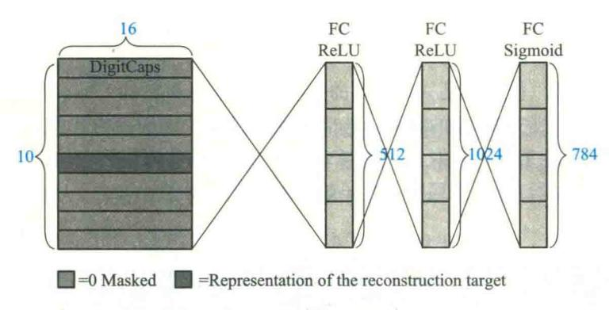

图 8.29 重构网络的架构

图 8.29 展示了胶囊网络顶层的包含三个全连接层的网络解码器。它是由两个全连接的 ReLU 层加上一个全连接的 Sigmoid 层组成,该解码器输出 784 个数字,对应重构图像的像素个数(图像是 28×28=784 像素)。这一过程的损失函数通过计算 FC Sigmoid 层的输出像素商店与原始图像像素点的欧氏距离而构建。

## 8.8.4 胶囊网络测试结果

胶囊网络在手写数字图像数据集 MNIST 上达到了比已有算法更好的性能。部分实验结果如图 8.30。

在图 8.30 中,l 代表标签,p 代表预测值,r 为重构出的图片。其中左边四列是预测正确的结果。从图中可以看到重构出来的图像形状、位置和输入极其类似,这说明胶囊网络起到了良好的作用,即一个 Capsule 的确包含了物体的多个信息:特征、位置、大小等。而后面两列是预测失败的。其实,这种图即使是人眼也会看错。

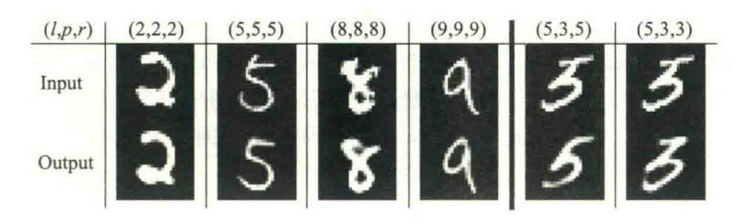

图 8.30 MNIST 实验结果

为了测试胶囊网络的泛化能力,使用 MNIST 测试集(对数字大小、粗细、位置做了部分改变) 对同时训练 Capsule 和 CNN,然后将有重叠的不同手写数字组的 AFFNIST 数据集(这个数据集中的样本都是经过小幅度变化后的 MNIST 样本)用于测试。用一个训练过的测试准确率为 

{55}------------------------------------------------

99.23%的 Capsule 模型做测试,得到准确率为 79%。而一个实现相似准确度为 99.22%的传统 CNN 模型只能达到 66%的准确率。实验结果表明胶囊网络在有重叠数字的 AFFNIST 数据集上 获得了比 CNN 好得多的结果。

另外,动态路由可以被看作是一种并行的注意机制,它允许在同一层的每个胶囊去关注低一层上的一些激活胶囊并忽略其他的胶囊。这应该允许模型去识别图像中多目标,即使这些目标重叠。在识别数字高度重叠的数据集 MultiMNIST 上(该数据集两个数字的边框范围平均有80% 是重合的),如图 8.31 所示,胶囊网络实现了较低的分类错误率。

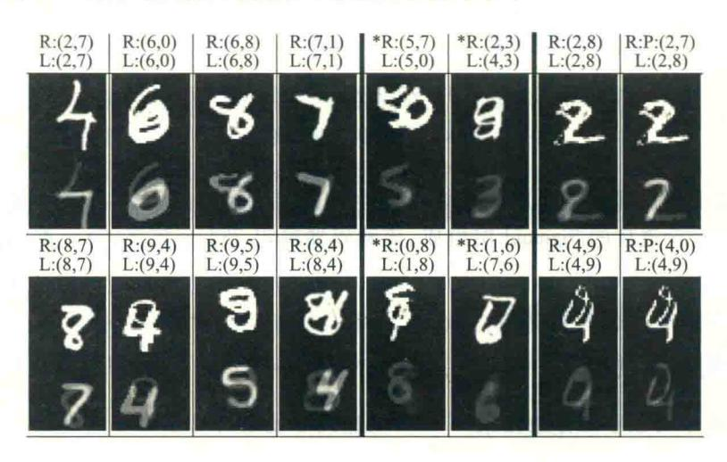

图 8.31 MultiMNIST 图片(上排)和由 CapsNet 重构后的结果(下排)

在图 8.31 中,"R"=重构后的结果;"L"=标注。例如,对第一个样例(左上角)的预测是准确的,重构的结果也对。但是在第五个例子里,预测(5,7)是错的,不是标签(5,0)。因此,5 被正确地重构了,但是 0 没有。这可以看出由于不同的胶囊各自工作,在一个识别结果中用到的特征并不会影响到另一个识别结果,不受重叠的影响。

和其他模型相比,胶囊网络在不同角度的图片分类上,甚至图像本身重叠或者丢失了部分信息,仍然有着良好的辨识度。当两个数字重叠在一起时,胶囊网络也能重构两个数字。Hinton 在数字重叠分类实验中,模型错误率达到了5%。这是因为胶囊网络中的两个向量能完整表达两个数字的特征,虽然有些特征重叠在一起导致难以分辨。

使用胶囊神经网络需要的训练数据量,远小于卷积神经网络,它采用动态路由协议算法,仅使用三层网络便可表现出很出色的性能,能够与深度卷积神经网络相当。胶囊网络还解决了卷积神经网络存在的信息丢失、视角变化等问题。

由于胶囊网络具有分别处理不同属性的能力,相比于 CNN 可以提高对图像变换的鲁棒性,在图像分割中也会有出色的表现。胶囊网络使用向量表征某个类别实例的各方面属性,能够通过矩阵乘法建模的方式更好地利用空间信息。

{56}------------------------------------------------

胶囊网络相对于卷积网络的工作机理更接近人脑的工作方式。胶囊网络的研究虽然刚刚开始,但已经展现了广阔的应用前景。

# 8.8.5 胶囊网络研究新讲展

2019 年,牛津大学博士生 Adam R. Kosiorek 等提出了堆叠胶囊自动编码器 8.8 节阅读文献▲ (Stacked Capsule Autoencoders, SCAE),这是他在谷歌大脑实习期间完成的研究 成果。深度学习创始人、图灵奖得主 Hinton 亲自指导了这项研究,担任论文的通讯作者,并称赞它是一种非常好的胶囊网络新版本。

SCAE 在无标签数据上训练时捕获整体和部分之间的空间关系,自我监督和归纳偏差在更高效的学习中扮演了重要的角色,可以无监督地学习图像中的特征,所以,SCAE 是一个无监督胶囊网络。神经编码器通过解码器的反向传播进行训练,推测物体胶囊的位置和姿势的。

#### SCAE 主要由三部分组成:

- (1)集群胶囊自编码器(clusters capsule autoencoder, CCAE):用二维点表示零件,并且把它们的坐标作为系统的输入。
- (2) 部件胶囊自编码器(part capsule autoencoder, PCAE): 先将输入的对象图片分割成连续的部件,推测它们的姿态后,通过仿射变换学习模板,使用姿势来构建新的输入。
- (3)目标胶囊自编码器(object capsule autoencoder, OCAE):尝试将发现的部件和它们的姿势组成更小的对象集合,它可以通过每个部件进行预测,从而解释每个部件的姿态,从而发现潜在的结构。

SCAE 在 SVHN 的无监督分类上达到了目前最先进的水平(55%),在 MNIST 上达到了接近最先进水平(98.5%)。但 SCAE 目前还不能够处理图像中多次出现相同类型的部件,在 CIFAR-10、ImageNet 等数据集上准确率也不如 CNN。

# 8.9 生成对抗网络及其应用

生成对抗网络中也有两个角色:生成器和判别器。金庸武侠小说《射雕英雄传》里描写的"老顽童"周伯通,被困在桃花岛期间创造了"左右互搏"之术,即用自己的左手跟自己的右手打架,在左右手互搏过程中提高自己的功力。生成对抗网络基本原理类似于"左右互搏"之术。生成器类似于左手扮演攻方,判别器类似于右手扮演守方。造假币技术和验钞技术也一样,生成器扮演造假币的机器造出以假乱真的假钞,判别器扮演验钞机判别是不是假钞。造假币技术和验钞技术在对抗中提高各自的生成和判别能力。

# 8.9.1 生成对抗网络的基本原理

深度学习的模型可大致分为判别模型和生成模型,目前,深度学习取得的成果主要集中在判别模型。判别模型是将一个高维的感官输入映射为一个类别标签。研究生成模型不多的主要原

{57}------------------------------------------------

因是对深度神经网络使用最大似然估计时,遇到了麻烦的概率计算问题,而 GAN 的提出则巧妙地绕过了这个问题。

著名物理学家 Richard 指出,要想真正理解一样东西我们必须能够把它创造出来。因此,要想让机器理解现实世界,并基于此进行推理与创造,从而实现真正的人工智能,必须使机器能够通过观测现实世界的样本,学习其内在统计规律,并基于此生成类似样本,这种能够反映数据内在概率分布规律并生成全新数据的模型,称为生成模型。

生成方法是机器学习方法中一个重要分支,涉及对数据显式或隐式变量的分布假设和对分布参数的学习,基于学习得到的模型采样出新样本。生成模型则是通过上述生成方法学习得到的模型,概念图如图 8.32 所示。

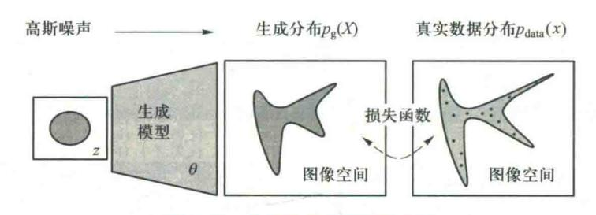

图 8.32 参数化生成模型概念图

在图 8.32 中,每个黑点分别表示采样于真实数据分布  $p_{data}(x)$  的一张图像,参数化生成模型将一个高斯噪声矢量 z 映射为一个生成概率分布  $p_{g}(x)$ ,通过优化损失函数调整参数  $\theta$  使生成概率分布  $p_{g}(x)$ 尽可能逼近真实数据分布  $p_{data}(x)$ 从而准确解释真实数据。

生成网络把随机点变成与数据集相似的图片。这些随机点是从一个潜在空间中随机抽取的。生成网络其实就是一个实现点到点变换的函数,把潜在点空间中的点变成图像空间中的点。 生成网络生成的点称为生成点。生成网络将潜在空间中的分布变换为图像空间中的分布,称为 生成分布,所以生成网络也称为生成器。

生成模型是一个极具挑战的机器学习问题,首先,对真实世界进行建模需要大量先验知识,建模的好坏直接影响生成模型的性能;其次,真实世界的数据往往非常复杂,简单的函数很难把这些随机点恰好都变到真实图像的位置,所以需要非常复杂的模型,拟合模型所需计算量往往非常庞大,甚至难以承受。针对上述两大困难,伊恩·古德费洛(Ian Goodfellow)于 2014 年提出一种新型生成模型——生成对抗网络(generative adversarial network, GAN)。

传统生成模型往往采用最大似然函数作为损失函数,而 GAN 则在生成模型之外引入一个判别模型,通过两者之间的对抗训练达到优化目的。生成对抗网络是属于无监督学习的一种深度学习模型,通过让"生成模型"和"判别模型"两个神经网络以相互博弈的方式进行学习。

生成对抗网络 GAN 的核心思想源于博弈论的纳什均衡。在二元零和博弈中,博弈双方的利益之和为零或一个常数,即一方有所得,另一方必有所失。基于这个思想,GAN 的框架中包含一

{58}------------------------------------------------

对相互对抗的模型:生成器和判别器。判别器的目的是正确区分真实数据和生成数据,从而最大化判别准确率;生成器则是尽可能逼近真实数据的潜在分布。为了在博弈中胜出,二者需不断提高各自的判别能力和生成能力,优化的目标就是寻找二者间的纳什均衡。这类似于造假钞和验假钞的博弈。生成器类似于造假钞的机器,希望制造出尽可能以假乱真的假钞,而判别器类似于验钞机,希望尽可能鉴别是否为假钞。造假钞的人和警察双方在博弈中,不断提升各自的能力。对应于 GAN 来说,就是生成模型恢复了训练数据的分布(生成了和真实数据一模一样的样本),判别模型判别准确率为 50%,也就是相当于乱猜。这时两个网络都得到利益最大化,于是不再改变自己的策略,即不再更新自己的权值。

# 8.9.2 生成对抗网络的结构与训练

#### 1. GAN 的结构

生成对抗网络是由生成网络(generative network)和判别网络(discriminative network)两部分构成,如图 8.33 所示。其中前者就是随机生成观测数据,例如"创作"出某个人的照片,而后者就负责辨别数据的真伪,即判别一张图片是来自真实数据,还是由生成网络"伪造"的数据。例如,判断一张照片是某个人真正的照片,还是计算机创作的照片。

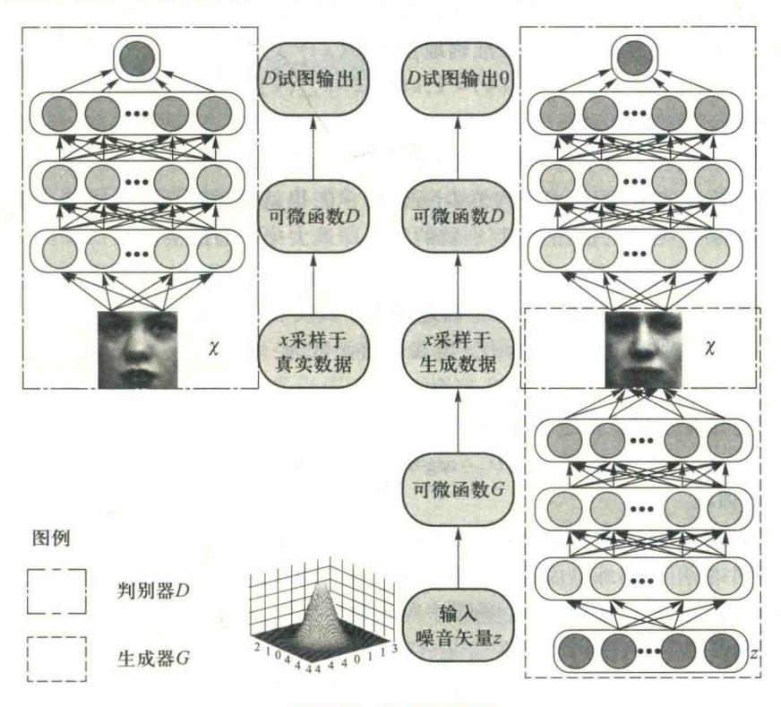

图 8.33 GAN 示意图

{59}------------------------------------------------

生成器(图 8.29 中虚线框内的多层感知机)的输入是一个来自常见概率分布的随机噪声矢量 z,输出是计算机生成的伪数据;判别器(图 8.33 中实线框内的多层感知机)的输入是图片 x,x 可能采样于真实数据,也可能采样于生成数据,判别器的输出是一个标量,用来代表 x 是真实图片的概率,即当判别器认为 x 是真实图片时输出 1,反之输出 0。判别器和生成器不断优化,当判别器无法正确区分数据来源时,可以认为生成器捕捉到真实数据样本的分布。

该算法的目标是令生成器生成与真实数据几乎没有区别的样本,即一个造假一流的生成模型。从数学意义来说,即将随机变量生成为某一种概率分布,也可以说概率密度函数为相等的  $P_{\rm g}(X) = P_{\rm data}(x)$ ,这正是数学上证明生成器高效性的策略:即定义一个最优化问题,其中最优生成器 (G) 满足  $P_{\rm g}(X) = P_{\rm data}(x)$ 。如果我们知道求解的 G 最后会满足该关系,那么我们就可以合理地期望神经网络通过典型的随机梯度下降方法训练就能得到最优的 G。

那如何求解这个最优化问题呢?正如前面介绍的验钞机和假币的关系,定义最优化问题可以由以下两部分组成。首先我们需要定义一个判别器D以判别样本是不是从 $P_{\rm data}(x)$ 分布中取出来的,因此有

$$E_{x \sim p_{Acc}(x)} \log(D(x)) \tag{8.77}$$

其中,E 指代取期望。这一项是根据对数损失函数而构建的。最大化这一项相当于令判别器 D 在 x 服从于 data 的概率密度时能准确地预测 D(x)=1,即

$$D(x) = 1, when x \sim p_{data}(x)$$
(8.78)

另外一项是企图欺骗判别器的生成器 G。该项根据对数损失函数来构建,即

$$E_{Z-P_{Z}(z)}\log(1-D(G(z)))$$
 (8.79)

如果最大化该项的值,则需要令均值  $D(G(z)) \approx 0$ ,也就是说对于从生成器产生的数据不能"欺骗"判别器。将这两项的值相加,判别器的目标即最大化下面的值:

$$E_{x \sim P_{\text{data}}(x)} \log(D(x)) + E_{Z \sim P_{Z}(Z)} \log(1 - D(G(z)))$$
 (8.80)

给定生成器 G,其代表了判别器 D 正确地识别了真实和伪造数据点。给定一个生成器 G,上式所得出来的最优判别器可以表示为  $D_G$ ,定义价值函数为

$$V(G,D) = E_{x-p_{\text{data}}(x)} \log(D(x)) + E_{Z-P_{Z}(Z)} \log(1-D(G(z)))$$
(8.81)

最终我们可以将最优化问题表述为

$$D_G = \arg\max_D V(G, D) \tag{8.82}$$

# 2. GAN 的训练

GAN 的训练过程包括两个相互交替的阶段:一个是固定生成网络,用来训练判别网络;另一个是固定判别网络,用来训练生成网络。两个网络相互对抗的过程,就是各自网络参数不断调整的过程,而参数的调整过程就是学习过程。

固定生成网络,训练判别网络。在训练判别网络时,通过不断给它输入两种类别的图片,并标注不同的分值。一类图片是生成网络生成的图片,另一类是真实图片。将生成图片和真实图片组成一个二分类的数据集,训练判别网络。将生成图片和实际图片分别输入到判别网络,如果

{60}------------------------------------------------

输入图片是来自真实数据集,则输出为1。如果输入图片来自生成网络,则输出为0。通过这样的训练,来提高判别网络的甄别能力,同时给生成网络进一步训练提供信息。

固定判别网络,训练生成网络。持续地在潜空间中生成一些随机数据,用生成网络将这些数据变换为生成图片,分值越高,说明图片越逼真。将这些图片输入到判别器中,得到"这个图片为真实图片"的概率,概率越大,说明图片越逼真。例如 0.5,它表示这个图片有 50%的概率来自真实数据集,也有 50%的概率来自生成网络。生成网络利用这些信息调整生成网络参数,使得后面生成出来的图片更接近实际图片。

#### 3. GAN 的缺点

GAN 在训练中也容易出现一些问题,训练过程具有强烈的不稳定性,实验结果随机,难以复现,具体表现在:

- (1) 训练过程难以收敛,经常出现震荡。
- (2) 训练收敛,但是出现模式崩溃(model collapse)。用数据集训练,训练后的 GAN 模型只能生成训练数据集中部分数据,而失去其他模式。例如,用 MNIST 数据集训练 GAN 模型,但只能生成十个数字中的某一个或者几个。其主要原因是深度神经网络只能逼近连续映射,而传输映射本身是具有间断点的非连续映射。目前已经提出了一些改进算法。
  - (3) 训练收敛,但是 GAN 还会生成一些没有意义或者现实中不可能出现的图片。

# 8.9.3 生成对抗网络在图像处理中的应用

目前,深度学习已经得到非常广泛的应用,而且新的应用正如雨后春笋般不断出现。生成对抗网络因为其内部对抗训练的机制,可以解决一些传统的机器学习面临的数据不足的问题,因此可以应用在半监督学习、无监督学习、多视角、多任务学习中。

生成对抗网络最先被应用于图像处理领域,后被推广到语音处理和自然语言处理等。与语音处理和图像处理不同,自然语言的生成结果是离散序列,从而导致梯度没法从判别模型直接传到生成模型。

作为一个生成模型,GAN可以生成一些图像和视频,以及生成一些自然语句和音乐等。目前,GAN应用最成功的领域是生成以假乱真的图像和视频、三维物体模型等,生成各种图像、数字、人脸等,如图像风格迁移、图像翻译、图像修复、图像上色、人脸图像编辑以及构成各种逼真的室内外场景,从物体轮廓恢复物体图像等。

# (1) 超分辨率

这是一个能把低分辨率图像重建为高清图像的技术。在机器学习中,实现超分辨率(super resolution)需要用成对样本对系统进行训练:一个是原始高清图像,一个是降采样后的低分辨率图像。低分辨率图像输入到生成器,重建出高分辨率图像。目标函数由对抗损失函数和内容损失函数共同构成,其中,对抗损失函数通过训练判别器区分真实图片和由生成器进行超分辨重构的图片,通过峰值信噪比和结构相似性等指标对重建图像进行评估,然后,重建图片和原始图片输入到判别器,判断哪一幅是原始图像。

{61}------------------------------------------------

#### (2) 图像修复

Denton 等将 GAN 应用到图像修复,以图像缺失部分的周边像素为条件训练生成式模型,生成完整的修复图像。利用对抗思想训练判别器对真实样本和修复样本进行判断。经对抗训练后,生成器所生成的修复图像与遮挡区块周边是连贯的,而且是符合语义的,如图 8.34 所示。

人脸图像去遮挡是图像修复的延伸应用, Zhao 等训练判别器区分真实无遮挡人脸图像和基于有遮挡图像而复原的人脸图像,能有效移除人脸图像中的遮挡物并用于人脸识别。GAN 应用于人脸图片编辑,如图 8.35 所示。

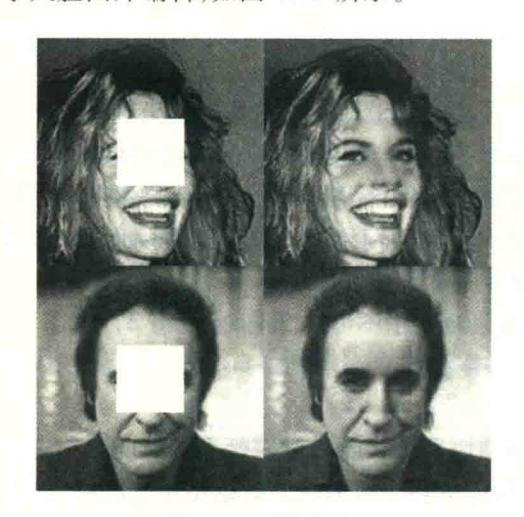

图 8.34 图像修复

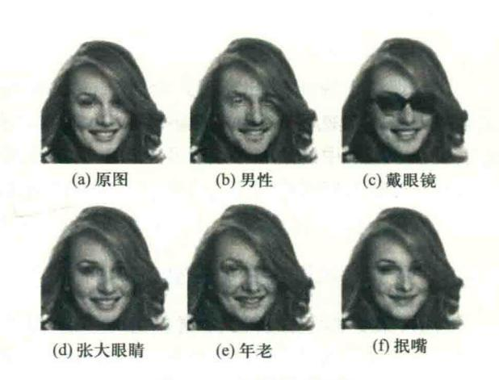

图 8.35 人脸图像编辑

# (3) 图像风格迁移

GAN 除了能够生成高质量的自然图像(例如手写字体、卧室、人眼和人脸等)外,还能生成抽象的艺术作品。图 8.36 所示将 GAN 应用于图像风格迁移。其中图(f)是运用深度学习算法,根据 19 世纪英国著名画家特纳的作品《沉船》,将小镇变化成另一幅"作品"。

# (4) 图像翻译

图 8.37 所示将 GAN 应用于根据地图生成航拍图像、根据轮廓图像生成照片、根据白天图像生成对应夜景等,大大增加了生成图像的多样性。由 Google 开发的 AI 算法 AutoDraw,可以根据艺术家制作的草图制作艺术作品,如图 8.37(b) 所示。它基于自动完成原则工作,它根据草图或艺术家的轮廓猜测所需的输出并提供艺术作品选项。人工智能将速度、效率和精度的古老技术原则带入艺术创作领域。

图 8.38 进一步将图像翻译拓展到多模态图像翻译,增加了生成图像的多样性。

除了从二维图像到二维图像的翻译外, Gadelha 等提出的 PrGAN 能够以一种完全无监督的 训练方式将给定的一系列甚至是一张 2D 图像翻译为该物体的 3D 体素形状和深度信息。

{62}------------------------------------------------

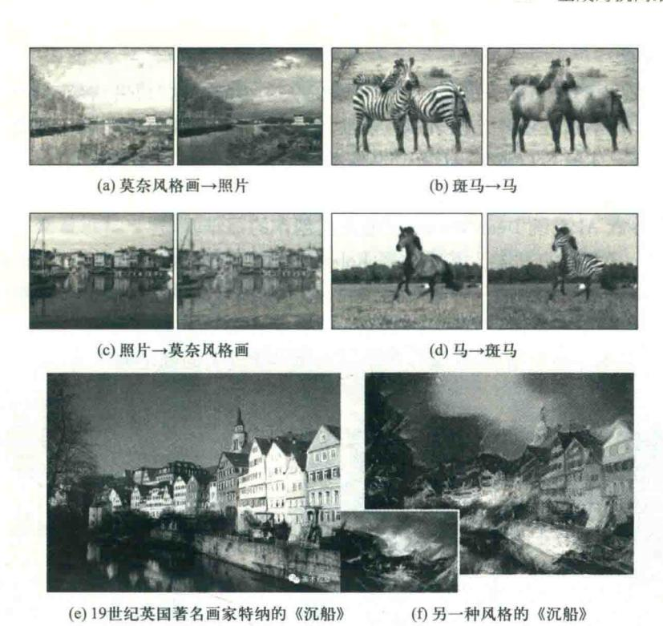

图 8.36 图像风格迁移

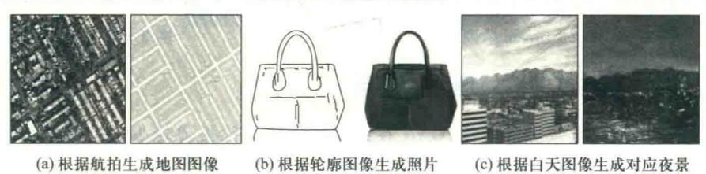

图 8.37 图像翻译

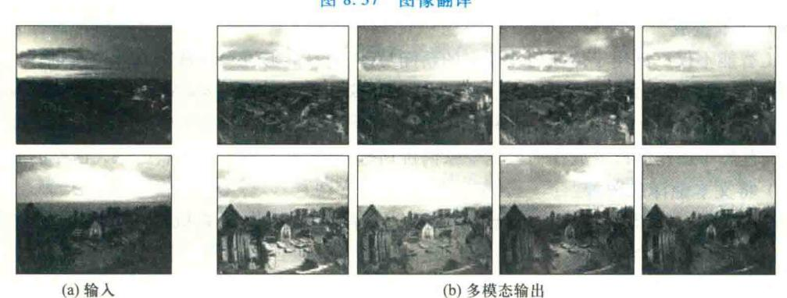

图 8.38 多模态图像翻译

{63}------------------------------------------------

## (5) 艺术创作

艺术和创意是人类思想的专属领域?艺术将是人工智能正在"攻占"的下一个领域。人工智能已经闯入艺术和创意,在制作音乐、诗歌、歌曲、艺术品等方面取得令人震惊的成绩。音乐作曲家、画家或诗人等艺术家可以依靠 AI 来产生基本输出,然后可以扩展或巩固。人工智能能够协助艺术家提高生产力和产出,加快创作来改变艺术产业。

图 8.39 是谷歌 AI 系统 Deep Dream 在电脑上创作的画作。

2018年7月,英国举办机器人艺术比赛 RobotArt,展示机器人研究领域的工程师如何开发会作画的机器人,即机器人像画家一样拿画笔作画,而不是在电脑中生成图像。比赛规则明确要求"上颜料或作画的动作必须由机器人系统使用一支或多支真实的画笔进行"。全球 19 个机器人团队共提交 100 多幅作品。图 8.40 是作画机器人用多支真实的画笔创作的作品。

图 8.39 Deep Dream 的画作

图 8.40 机器人作画

# 8.9.4 生成对抗网络在语言处理中的应用

相对于在计算机视觉领域的应用,GAN 在语言处理领域的报道较少。这是由于图像和视频数据的取值是连续的,可直接应用梯度下降对可微的生成器和判别器进行训练,而语言生成模型中的音节、字母和单词等都是离散值,难以直接应用到基于梯度的生成对抗网络。

#### (1) 文本生成

人工智能不仅广泛用于体裁比较固定的新闻写作,而且能够进行诗歌写作等文学创作。例如,微软小冰:幸福的人生的逼迫,这就是人类生活的意义。FAIR: The crow crooked on more beautiful and free, He journeyed off into the quarter sea. 清华大学研制的九歌诗歌创作机器人,把机器人创作的诗歌与文艺青年创作的诗歌放在一起让专家们辨别,结果机器人创作的诗歌更像人创作的。

# (2) 将文本翻译成图像

GAN 可以将文本翻译成图像。给计算机输入一段文字描述,计算机自动生成与文字描述相近的图片。相比从图像到图像的转换,从文本到图像的转换困难得多,因为以文本描述为条件的图像分布往往是高度多模态的,有太多的例子符合文本描述的内容,符合同样文本描述的生成图像之间差别可能很大。另一方面,虽然从图像生成文字也面临着同样问题,但由于文本能按照一

{64}------------------------------------------------

定语法规则分解,因此,从图像生成文本是一个比从文本生成图像更容易定义的预测问题。

通过 GAN 的生成器和判别器分别进行文本到图像、图像到文本的转换,二者经过对抗训练后能够生成以假乱真的图像。例如根据文字"这只小鸟有着小小的鸟喙、胫骨和双足,蓝色的冠部和覆羽以及黑色的脸颊"生成图 8.41(a) 所示的图片。输入"这朵花有着长长的粉色花瓣和朝上的橘黄色雄蕊。"则输出图 8.41(b) 所示的图片。

通过对输入变量进行可解释的拆分,能改变图像的风格、角度和背景。当然,目前所合成的图像尺寸依然较小,该研究的下一步工作是尝试合成像素更高的图像和增加文字所描述的特征数量。根据文本创作图像的方法可以验证生成模型模拟真实数据样本的性能。

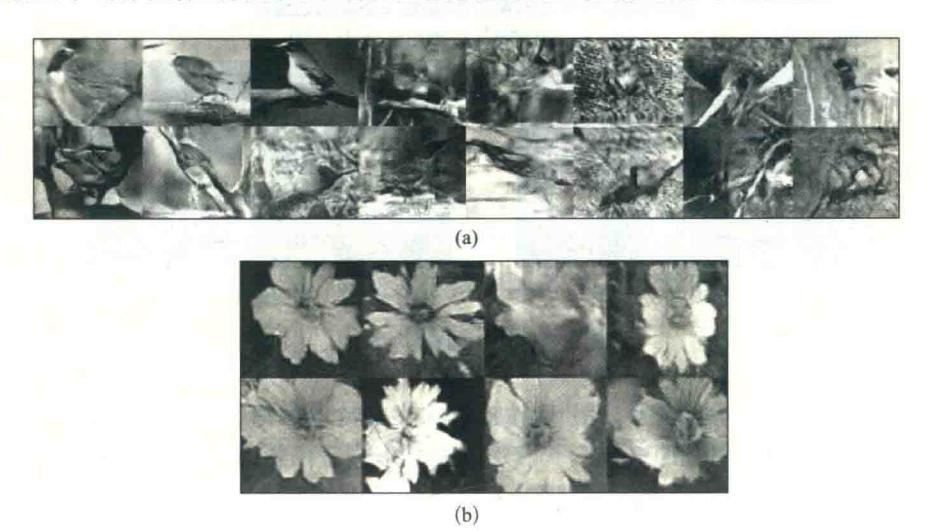

图 8.41 从文字描述生成图片

# 8.9.5 生成对抗网络在视频生成中的应用

GAN 能从静态照片中生成多帧视频。首先,识别静态图片的对象,然后,生成 32 帧的视频, 这些生成视频中对象的动作非常合乎常理。这种对动作的预测能力是机器未来融入人类生活的 关键,因为这使机器能辨别什么动作于人于己都是没有伤害的。

# (1) 实时 3D 变脸技术

南加州大学的 Pinscreen 团队以 GAN 等技术实现实时 3D 变脸技术。输入一张实验者的照片, GAN 变脸软件能够生成实验者的 3D 视频,并且通过软件控制 3D 视频中人物的动作,例如,眨眼、张嘴、微笑等。用生成的实验者的 3D 视频代替实验者本人能够通过刷脸测试。为了防止变脸技术造成的信息安全,美国国防部开发了 AI 侦测工具,识别是实验者本人的视频,还是计算机生成的实验者视频,反变脸精度达到 99%。

# (2) 人工智能主持人

2018年11月7~9日,在乌镇第五届世界互联网大会上,新华社对外宣布:中国首个"人工智

{65}------------------------------------------------

能主持人"正式上岗,如图 8.42(a) 所示。2019.2.19 新华社又发布站立式合成主播上岗,如图 8.42(b)、(c) 所示。

(a) 邱浩——新小浩

(b) 邱浩——新小浩站立式

(c) 屈萌——新小萌站立式

图 8.42 人工智能主持人

用真正的主持人主持一段节目,用 3D 扫描仪收集主持人主持节目的视觉数据,计算机生成的主持人化身看上去与其真正的主持人真假难辨。采集真正的主持人的嗓音作为深度学习的输入数据,然后人工智能会学习你的嗓音特征,并能以你的嗓音生成新的内容——说话或者唱歌,并记录主体的行为和动作等个人数据,由此就可以再现他们的说话模式和性格特点。特别是计算机生成的主持人以真正的主持人的嗓音用真正的主持人根本不会讲的语言生成内容,例如不仅能够讲中文,而且能够讲英语、日语或韩语等各种语言。

# 8.9.6 生成对抗网络在医疗中的应用

人工智能在医疗中的应用是最有前景和最有价值的领域。

# (1) 医学影像识别

基于深度学习等人工智能技术的 X 光、核磁、CT、超声等医疗影像多模态大数据的分析技术,提取二维或三维医疗影像隐含的疾病特征。例如,黑色素瘤识别:将 1 万张有标记的影像交给机器学习,然后让 3 名医生和计算机一起看另外的 3000 张。人的识别精度为 84%,计算机的识别精度达到 97%。

Schlegl 等将 GAN 用于医学图像的异常检测,通过学习健康数据集的特征能抽象出病变特征。例如,能够检测到测试样本中的视网膜积液,而这在训练样本集中并没有出现过。

#### (2) 药物匹配

Insilico Medicine 的研究人员提出了一种运用 GAN 进行药物匹配的方法。我们的目标是训

{66}------------------------------------------------

练生成器,尽可能精确地从一个药物数据库中对现有药物进行按病取药的操作。经过训练后,可以使用生成器获得一种以前不可治愈的疾病的药方,并使用判别器确定生成的药方是否治愈了特定疾病。

# 8.10 小结

8.9节阅读文献▲

#### 1. 人工神经网络的概念

神经元的数学模型由加权求和、线性动态系统和非线性函数映射三部分组成。

前馈型神经网络中,各神经元接受前一层的输入,并输出给下一层,没有反馈。

在反馈型神经网络中,存在一些神经元的输出经过若干个神经元后,再反馈到这些神经元的输入端。最典型的反馈型神经网络是 Hopfield 神经网络。它是全互联神经网络。

#### 2. BP 神经网络的学习

神经网络的学习是指调整神经网络的连接权值或者结构,使输入输出具有需要的特性。

Hebb 学习规则: 当某一突触两端的神经元同时处于兴奋状态,那么该连接的权值应该增强。 存在一个三层 BP 神经网络,可以逼近任意的连续函数。BP 学习算法可以归纳为式(8.16)~式(8.17)。

## 3. Hopfield 神经网络及其改进

Hopfield 神经网络可能有若干个稳定状态。从任一初始状态开始运动,总可以达到某个稳定状态。这些稳定状态可以通过改变各个神经元之间的连接权值得到。

连续 Hopfield 神经网络的电子线路实现如图 8.9 所示。

对于连续型 Hopfield 神经网络,若 $f^{-1}(\cdot)$ 为单调递增的连续函数, $C_i > 0$ , $w_{ij} = w_{ji}$ ,则 $\frac{\mathrm{d}E(t)}{\mathrm{d}t} \leq 0$ 。

在随机神经网络中,神经元状态为1是随机的,服从一定的概率分布。例如,服从玻耳兹曼(Boltzmann)、高斯(Gaussian)、柯西(Cauchy)分布等,从而构成玻耳兹曼机、高斯机、柯西机等随机机。

通过在 Hopfield 神经网络中引人混沌动态,可以构造性能各异的混沌神经网络模型。基于模拟退火策略的自抑制混沌神经网络、基于加大时间步长的混沌神经网络、引入噪声的混沌神经网络等。

# 4. Hopfield 神经网络的应用

如果将 Hopfield 网络的稳态作为一个联想记忆问题的样本,那么初态朝稳态的收敛过程便是联想记忆的过程。

如果将 Hopfield 网络的稳态作为一个优化问题的目标函数的极小点,那么初态朝稳态的收敛过程便是优化计算的过程。

## 5. 卷积神经网络

卷积神经网络是一个多层的神经网络,每层由多个二维平面组成,每个平面由多个独立神经元组成。特征提取层 C 代表对输入图像进行滤波后得到的所有组成的层。和特征映射层 S 代表对输入图像进行下采样得到的层。

{67}------------------------------------------------

卷积神经网络使用 4 个关键技术来利用自然信号的属性:局部连接、权值共享、多卷积核以及池化的使用。

#### 6. 胶囊网络

胶囊网络中胶囊不是传统神经网络中的一个神经元,而是一组神经元,其输入输出均为高维的活动向量,通过归一化处理,向量的"长度"可表示检测实体存在的概率,也就是向量的输出数值大小;向量的"方向"表示检测实体的各个属性,也就是向量的各个维度信息,表示的内容丰富,便于识别更加复杂多变的场景。

#### 7. 生成对抗网络

生成对抗网络中包含生成器和判别器。使用对抗训练机制对生成器和判别器两个神经网络同时进行训练。

生成器的输入是一个来自常见概率分布的随机噪声矢量,输出是计算机生成的伪数据。

判别器的输入是图片(可能采样于真实数据,也可能采样于生成数据),判别器的输出是一个标量,用来代表是真实图片的概率。

GAN 应用最成功的领域是计算机视觉,包括图像和视频生成,如图像翻译、图像超分辨率、图像修复、图像上色、人脸图像编辑以及视频生成等。

# 思考题

- 8.1 为什么说人工神经网络是一个非线性系统?如果 BP 神经网络中所有结点都为线性函数,那么,BP 神经网络还是一个非线性映射系统吗?
- 8.2 简述人工神经网络的知识表示形式和推理机制,试举例说明。
- 8.3 BP 学习算法是什么类型的学习算法,它主要有哪些不足?
- 8.4 Hopfield 神经网络分为哪两类,两者的区别是什么?
- 8.5 Hopfield 神经网络优化方法的基本步骤和主要特点是什么?
- 8.6 Hopfield 神经网络与 BP 网络的结构有什么不同?
- 8.7 简述卷积神经网络的学习机理。
- 8.8 简述卷积神经网络的结构。
- 8.9 什么是卷积神经网络中局部连接?
- 8.10 什么是卷积神经网络中权值共享?
- 8.11 为什么要采用多卷积核?
- 8.12 什么是卷积神经网络中的池化?常用的有哪些方法?池化过程有什么缺点?
- 8.13 简述胶囊网络的结构。
- 8.14 简述胶囊网络的特点。
- 8.15 简述生成对抗网络的结构和基本原理。
- 8.16 为什么生成对抗网络中的生成网络能够生成以假乱真的图片?

{68}------------------------------------------------

# 习题

- 8.1 一个全连接的前向神经网络具有 6 个源结点,2 个隐层,一个隐层有 4 个神经元,另一个隐层有 3 个神经元,1 个输出神经元。构造这个神经网络的结构图。
- 8.2 给定样本为  $X = [1, -1, 1], Y = [1, 1], 选 \varepsilon = 0.1, BP$  神经网络的初始权值矩阵选为:

$$W_{1} = \begin{bmatrix} 1 & 1 & 1 \\ 2 & 0 & 2 \\ 3 & 3 & -3 \end{bmatrix} \qquad W_{2} = \begin{bmatrix} 1 & -1 & 1 \\ 0 & 1 & 1 \end{bmatrix}$$

如习题 8.2 图所示。

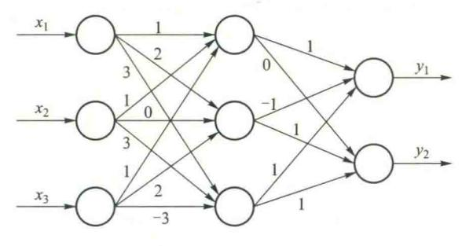

习题 8.2图

隐层和输出层的神经元的输入输出非线性函数取为  $f(x) = \frac{2}{1+e^{-x}} - 1$ 。试用 BP 学习算法计算权值的调整过程。

- 8.3 已知下列函数:
  - $(1) f(x) = \frac{1}{x}, 1 \le x \le 100$
  - (2)  $f(x) = \lg x, 1 \le x \le 10$
  - $(3) f(x) = e^{-x}, 1 \le x \le 10$
  - $(4) \ f(x) = \sin x, 1 \le x \le \frac{\pi}{2}$

利用 BP 算法及 sigmoid 函数,对上面的函数完成如下工作:

- (1) 获取两组数据,一组作为训练集,一组作为测试集;
- (2) 利用训练集,训练一个单隐层的网络:
- (3) 利用测试集检验训练结果,改变隐层神经元个数,研究它对逼近效果的影响。
- 8.4 用三层 BP 神经网络解决字母 T 和 L 的识别问题。如习题 8.4 图所示,每个字母用  $3\times3$  的二维二值图表示,令黑方格为 1,白方格为 0,每个字母有 4 个样本,包括字母正常位置及旋转  $90^\circ$ ,180 $^\circ$ 和  $270^\circ$ 的

{69}------------------------------------------------

图像,希望输入不同的位置的 T 时,网络输出为 1,而输入不同的位置的 L 时,网络输出为 0。 用 BP 算法 求出权系数和阈值。  $\left($  建议:选择网络结构为9-3-1。 隐单元非线性函数为  $f(x)=\frac{2}{1+e^{-\alpha x}}-1$ ,输出单元非线性函数为  $f(x)=\frac{1}{1+e^{-\alpha x}}$ 。

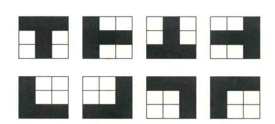

习题 8.4 图

**8.5** 澳大利亚野兔眼睛晶状体的重量与其年龄的关系如习题 8.5 表所示。不能用一个单值函数表示之间的关系。相反,利用一个负指数可将这个数据集的一个非线性最小平方模型如下:

| 年龄/天 | 重量/mg  | 年龄/天 | 重量/mg   | 年龄/天 | 重量/mg   | 年龄/天 | 重量/mg   |
|------|--------|------|---------|------|---------|------|---------|
| 15   | 21.66  | 75   | 94. 6   | 218  | 174. 18 | 338  | 203. 23 |
| 15   | 22. 75 | 82   | 92. 5   | 218  | 173. 03 | 347  | 188. 38 |
| 15   | 22. 3  | 85   | 105     | 219  | 173. 54 | 354  | 189. 7  |
| 18   | 31. 25 | 91   | 101.7   | 224  | 178. 86 | 357  | 195. 31 |
| 28   | 44. 79 | 91   | 102. 9  | 225  | 177. 68 | 375  | 202. 63 |
| 29   | 40. 55 | 97   | 110     | 227  | 173. 73 | 394  | 224. 82 |
| 37   | 50. 25 | 98   | 104. 3  | 232  | 159. 98 | 513  | 203. 3  |
| 37   | 46. 88 | 125  | 134. 9  | 232  | 161. 29 | 535  | 209. 7  |
| 44   | 52. 03 | 142  | 130. 68 | 237  | 187. 07 | 554  | 233. 9  |
| 50   | 63. 47 | 142  | 140. 58 | 246  | 176. 13 | 591  | 234. 7  |
| 50   | 61.13  | 147  | 155. 3  | 258  | 183. 4  | 648  | 244. 3  |
| 60   | 81     | 147  | 152. 2  | 276  | 186. 26 | 660  | 231     |
| 61   | 73. 09 | 150  | 144. 5  | 285  | 189. 66 | 705  | 242. 4  |
| 64   | 79. 09 | 159  | 142. 15 | 300  | 186. 09 | 723  | 230. 77 |
| 65   | 79. 51 | 165  | 139. 81 | 301  | 186. 7  | 756  | 242. 57 |
| 65   | 65. 31 | 183  | 153. 22 | 305  | 186. 8  | 768  | 232. 12 |
| 72   | 71.9   | 192  | 145. 72 | 312  | 195. 1  | 860  | 246. 7  |
| 75   | 86. 1  | 195  | 161.1   | 317  | 216. 41 |      |         |

习题 8.5 表 澳大利亚野兔眼睛晶状体重量与其年龄的关系

{70}------------------------------------------------

其中, $\varepsilon$  是误差项。利用反向传播算法,设计一个 BP 神经网络,能够为这个数据集提供一个非线性最小平方逼近。与上述最小平方模型比较结果。

- 8.6 如果要设计一个 BP 神经网络,根据花瓣的颜色与形态对一组桂花树进行品种分类,并将任意一棵桂花树分配到这些类别的一类中。现在有一个包含 300 个样本的数据集,这些样本取自 4 种主要品种类别的桂花树:金桂,银桂,月桂,紫桂。数据集中的每一种植物用描述花的特征的 5 个变量来表示:萼片长度、萼片宽度、花瓣长度、花瓣宽度和花瓣的颜色。萼片长度的取值范围为 4.3~7.9 cm,萼片宽度的取值范围为 2.0~4.4 cm,花瓣长度的取值范围为 1.0~6.9 cm,花瓣宽度的取值范围为 0.1~2.5 cm,花瓣的颜色分为红色、白色、金黄色与黄白色。先将数据集里的桂花数据进行归一化,然后随机地划分为包含 250 个样本的训练集和包含 50 个样本的测试集。
  - (1) 确定该 BP 神经网络的输入层神经元个数,并说明对应的输入信息。
- (2)确定该 BP 神经网络的输出层神经元个数,举例说明对应的输出信息,并给出输出层神经元的非线性函数。
- 8.7 已知只有3个神经元的离散 Hopfield 神经网络的权值矩阵为

$$W = \begin{bmatrix} 0 & -\frac{2}{3} & \frac{2}{3} \\ -\frac{2}{3} & 0 & -\frac{2}{3} \\ \frac{2}{3} & -\frac{2}{3} & 0 \end{bmatrix}$$

3 个神经元的阈值取为 0。因为有 3 个神经元,所以有  $2^3 = 8$  个状态。试计算验证: (1,-1,1) 和 (-1,-1) 是稳定状态,其他状态都会收敛到与之邻近的稳定状态上。

8.8 已知有 4 个神经元的离散 Hopfield 神经网络的权值矩阵为

$$W = \begin{bmatrix} 0 & 3.4 & 2.8 & -3.1 \\ 3.4 & 0 & 4.7 & -1.2 \\ 2.8 & 4.7 & 0 & -5.9 \\ -3.1 & -1.2 & -5.9 & 0 \end{bmatrix}$$

4 个神经元的阈值取为(6.3,-4.3,-2.5,-9.6)。任意给定一个初始状态 $V(0) = \{1,0,1,0\}$ ,计算这个状态的能量,确定一个稳定状态。

**8.9** 异或(Exclusive-OR)(XOR)问题可以用 4 条产生式规则表示:

IF 
$$x_1 = 0$$
 AND  $x_2 = 0$  THEN  $y = 0$   
IF  $x_1 = 0$  AND  $x_2 = 1$  THEN  $y = 1$   
IF  $x_1 = 1$  AND  $x_2 = 0$  THEN  $y = 1$   
IF  $x_1 = 1$  AND  $x_2 = 1$  THEN  $y = 0$ 

验证**异或**问题可以表示为习题 8.9 图所示的神经网络:其中  $f(x) = \begin{cases} 1, & x \ge 0 \\ 0, & x < 0 \end{cases}$ 

{71}------------------------------------------------

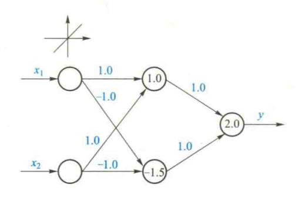

习题 8.9 图

- 8.10 早期的人工神经网络多使用 Sigmod 函数作为激活函数,在输入较小或较大的时候,函数会趋于平缓,梯度会趋近为 0,即出现梯度消失问题。求取 Sigmod 函数的导数,分析造成梯度消失的原因。
- 8.11 为了避免 Sigmod 导致的梯度消失现象,可以选择使用 ReLU 函数代替 Sigmod 函数。求 ReLU 函数的导数,分析造成梯度消失的原因。
- 8.12 使用 Python 编程或用深度学习框架(如 TensorFlow、Keras 等)实现卷积神经网络,并在手写字符识别数据集 MNIST 上进行试验测试。