{0}------------------------------------------------

# 第9章 机器学习

机器学习(machine learning)是人工智能中一个重要的研究领域,一直受到人工智能及认知心理学家们的普遍关注。近年来,随着专家系统的发展,需要智能系统具有学习能力,促进了机器学习的研究,使之获得了较快的发展,研制出了多种学习系统。特别是近年来深度学习使机器学习掀起了新的研究与应用热潮。

机器学习与计算机科学、心理学等多种学科都有密切的关系,牵涉的面比较宽,而且许多理论及技术上的问题尚处于研究之中。因此,本章首先介绍机器学习的基本概念,然后简要介绍一些基本的符号学习方法。最后介绍目前正在兴起的深度学习方法。

# 9.1 机器学习的基本概念

# 9.1.1 学习

学习是人类具有的一种重要的智能行为,但至今还没有一个精确的、能被公认的学习的定义。这一方面是由于来自不同学科,例如神经学、认知心理学、计算机科学等的研究人员,分别从不同的角度对学习给出了不同的解释;另一方面,也是最重要的原因是学习是一个多侧面、综合性的心理活动,它与记忆、思维、知觉、感觉等多种心理行为都有着密切联系,使得人们难以把握学习的机理与实质,因而无法给出确切的定义。

机器学习基本概念讲课视频▲

目前,对"学习"的定义有较大影响的观点主要有:

- ① 学习是系统改进其性能的过程。这是西蒙(Simon)关于"学习"的观点。1980年他在卡内基-梅隆大学召开的机器学习研讨会上做了"为什么机器应该学习"的发言。在此发言中,他把学习定义为:学习是系统中的任何改进,这种改进使得系统在重复同样的工作或进行类似的工作时,能完成得更好。这一观点在机器学习研究领域中有较大的影响。学习的基本模型就是基于这一观点建立起来的。
- ② 学习是获取知识的过程。这是专家系统研究人员提出的观点。由于知识获取一直是专家系统建造中的困难问题,因此他们把机器学习与知识获取联系起来,希望通过对机器学习的研究,实现知识的自动获取。
- ③ 学习是技能的获取。这是心理学家关于如何通过学习获得熟练技能的观点。人们通过 大量实践和反复训练可以改进机制和技能,如像骑自行车、弹钢琴等都是这样。但是,学习并不 只是获得技能,它只是学习的一个方面。
  - ④ 学习是事物规律的发现过程。在20世纪80年代,由于对智能机器人的研究取得了一定

{1}------------------------------------------------

的进展,同时又出现了一些发现系统,于是人们开始把学习看作是从感性知识到理性知识的认识过程,从表层知识到深层知识的转化过程,即发现事物规律、形成理论的过程。

综合上述各种观点,可以将学习定义为:学习是一个有特定目的的知识获取过程,其内在行为是获取知识、积累经验、发现规律;外部表现是改进性能、适应环境、实现系统的自我完善。

# 9.1.2 机器学习

机器学习使计算机能模拟人的学习行为,自动地通过学习获取知识和技能,不断改善性能, 实现自我完善。

作为人工智能的一个研究领域,机器学习主要研究以下三方面问题:

- ① 学习机理。这是对人类学习机制的研究,即人类获取知识、技能和抽象概念的天赋能力。 通过这一研究,将从根本上解决机器学习中的问题。
- ② 学习方法。研究人类的学习过程,探索各种可能的学习方法,建立起独立于具体应用领域的学习算法。机器学习方法的构造是在对生物学习机理进行简化的基础上,用计算的方法进行再现。
  - ③ 学习系统。根据特定任务的要求,建立相应的学习系统。

从计算机算法角度研究机器学习问题,与生物学、医学和生理学,从生理、生物功能角度研究生物界,特别是人类学习问题有着密切的联系。最近国际上新兴的脑机交互(brain-computer interface, BCI)就是从大脑中直接提取信号,并经过计算机处理加以应用。

# 9.1.3 机器学习系统

# 1. 机器学习系统的定义

为了使计算机系统具有某种程度的学习能力,使它能通过学习增长知识、改善性能、提高智能水平,需要为它建立相应的学习系统。

能够在一定程度上实现机器学习的系统称为学习系统。

1973年萨利斯(Saris)曾对学习系统给出如下定义:如果一个系统能够从某个过程或环境的未知特征中学到有关信息,并且能把学到的信息用于未来的估计、分类、决策或控制,以便改进系统的性能,那么它就是学习系统。

1977 年施密斯等人又给出了一个类似的定义:如果一个系统在与环境相互作用时,能利用过去与环境作用时得到的信息,并提高其性能,那么这样的系统就是学习系统。

# 2. 机器学习系统的条件和能力

由上述定义可以看出,一个学习系统应具有如下条件和能力。

# (1) 具有适当的学习环境

无论是在萨利斯的定义中还是在施密斯等人的定义中,都使用了"环境"这一术语。这里所说的环境是指学习系统进行学习时的信息来源。如果把学习系统比作学生,那么"环境"就是为学生提供学习信息的教师、书本及各种应用、实践的过程。没有环境,学生就无从学习与应用新

{2}------------------------------------------------

知识。同样,如果没有环境,学习系统就失去了学习和应用的基础,不能实现机器学习。

对于不同的学习系统及不同的应用,环境一般都是不相同的。例如,当把学习系统用于专家系统的知识获取时,环境就是领域专家以及有关的文字资料、图像等;当把它用于博弈时,环境就是博弈的对手以及千变万化的棋局。

### (2) 具有一定的学习能力

环境只是为学习系统提供了学习及应用的条件。学习系统要从中学到有关信息,还必须有合适的学习方法及一定的学习能力,否则它仍然学不到知识,或者学得不好。这正如一个学生即使他有好的教师和教材,如果他没有掌握适当的学习方法或者学习能力不强,他仍然不能取得理想的学习效果一样。

学习过程是系统与环境相互作用的过程,是边学习、边实践,然后再学习、再实践的过程。就以学生的学习来说,学生首先从教师及书本那里取得有关概念和技术的基本知识,经过思考、记忆等过程把它变成自己的知识,然后在实践(如做作业、实验、课程设计等)中检验学习的正确性,如果发现问题,就再次向教师或书本请教,修正原来理解上的错误或者补充新的内容。学习系统的学习过程与此类似。它也通过与环境多次相互作用逐步学到有关知识,而且在学习过程中要通过实践验证、评价所学知识的正确性。一个完善的学习系统只有同时具备这两种能力,才能学到有效的知识。

### (3) 能应用学到的知识求解问题

学习的目的在于应用。在萨利斯的定义中,就明确指出了学习系统应"能把学到的信息用于未来的估计、分类、决策或控制",强调学习系统应该做到学以致用。事实上,如果一个人或者一个系统不能应用学到的知识求解遇到的现实问题,那他(它)也就失去了学习的作用及意义。

#### (4) 能提高系统的性能

这是学习系统应达到的目标。通过学习,系统应能增长知识,提高技能,改善系统的性能,使它能完成原来不能完成的任务,或者比原来做得更好。例如对于博弈系统,如果它第一次失败了,那么它应能从失败中吸取经验教训,通过与环境的作用学到新的知识,做到"吃一堑,长一智",使得以后不重蹈覆辙。

### 3. 机器学习系统的基本模型

由以上分析可以看出,一个学习系统一般应该有环境、学习、知识库、执行与评价四个基本部分组成。各部分之间的关系如图 9.1 所示,其中,箭头表示信息的流向。

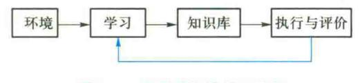

图 9.1 学习系统的基本结构

"环境"指外部信息的来源。它将为系统的学习机构提供有关信息。系统通过对环境的搜索取得外部信息,然后经分析、综合、类比、归纳等思维过程获得知识,并将这些知识存入知识

{3}------------------------------------------------

库中。

"知识库"用于存储由学习得到的知识,在存储时要进行适当的组织,使它既便于应用又便于维护。

"执行与评价"实际上是由"执行"与"评价"这两个环节组成的。执行环节用于处理系统面临的现实问题,即应用学到的知识求解问题,如定理证明、智能控制、自然语言处理、机器人行动规划等;评价环节用于验证、评价执行环节执行的效果,如结论的正确性等。目前对评价的处理有两种方式:一种是把评价时所需的性能指标直接建立在系统中,由系统对执行环节得到的结果进行评价;另一种是由人来协助完成评价工作。如果采用后一种方式,则图 9.1 中可略去评价环节,但环境、学习、知识库、执行等环节是不可缺少的。

"学习"部分将根据反馈信息决定是否要从环境中索取进一步的信息进行学习,以修改、完善知识库中的知识。这是学习系统的一个重要特征。

# 9.1.4 机器学习的发展

关于机器学习的研究,可以追溯到 20 世纪 50 年代中期。当时人们从仿生学的角度研究人类大脑及神经系统的学习机理。但由于受到客观条件的限制,未能如愿。以后几经波折,直到 20 世纪 80 年代才获得了蓬勃发展。若以机器学习的研究目标及研究方法来划分,其发展过程可分为如下三个阶段。

### 1. 神经元模型的研究

这一阶段始于 20 世纪 50 年代中期,主要是应用决策理论的方法研制可适应环境的通用学习系统(general purpose learning system)。它的基本思想是:如果给系统一组刺激、一个反馈源和修改自身组织的自由度,那么系统就可以自适应地趋向最优组织。这实际上是希望构造一个神经网络和自组织系统。

在此期间有代表性的工作是 1957 年罗森勃拉特(Rosenblatt F.)提出的感知器模型。它由阈值神经元组成,试图模拟动物和人脑的感知及学习能力。此外,这阶段最有影响的研究成果是塞缪尔研制的具有自学习、自组织、自适应能力的跳棋程序。该程序在分析了约 175 000 幅不同棋局后,归纳出了棋类书上推荐的走法,能根据下棋时实际情况决定走步的策略,准确率达到48%。这是机器学习发展史上一次卓有成效的探索。

1969年明斯基和佩珀特(Papert)发表了颇有影响的论著《Perceptron》,对神经元模型的研究作出了悲观的论断。鉴于明斯基在人工智能界的地位及影响以及神经元模型自身的局限性,致使对它的研究开始走向低潮。

# 2. 符号学习的研究

这一阶段始于 20 世纪 70 年代中期。当时对专家系统的研究已经取得了很大成功,迫切要求解决知识获取问题。这一需求刺激了机器学习的发展,研究者们力图在高层知识符号表示的基础上建立人类的学习模型,用逻辑的演绎及归纳推理代替数值的或统计的方法。莫斯托夫(Mostow D.J.)的指导式学习、温斯顿(Winston)和卡鲍尼尔(Carbonell J.G.)的类比学习以及米切

{4}------------------------------------------------

尔(Mitchell T.M.)等人提出的解释学习都是在这阶段提出来的。

### 3. 连接学习的研究

这一阶段始于 20 世纪 80 年代。当时由于人工智能的发展与需求以及 VLSI 技术、超导技术、生物技术、光学技术的发展与支持,使机器学习的研究进入了更高层次的发展时期。当年从事神经元模型研究的学者们经过 10 多年的潜心研究,克服了神经元模型的局限性,提出了多层网络的学习算法,从而使机器学习进入了连接学习的研究阶段。连接学习是一种以非线性大规模并行处理为主流的神经网络的研究,特别是深度学习研究目前仍在继续进行之中。

在这一阶段中,符号学习的研究也取得了很大进展,它与连接学习各有所长,具有较大的互补性。连接学习适用于连续发音的语音识别及连续模式的识别;而符号学习在离散模式识别及专家系统的规则获取方面有较多的应用。现在人们已开始把两者结合起来进行研究。

1980年在卡内基-梅隆大学召开了第一届机器学习国际研讨会,以后每两年召开一次会议,探讨机器学习研究中的问题。1986年创刊了第一本机器学习杂志《Machine Learning》,对机器学习的研究发挥了重要作用。该杂志的主编蓝利(Langley P.)在其发刊词中宣称,机器学习过去几年的发展已引起了人工智能及认知心理学界的极大兴趣,现在它已进入了一个令人鼓舞的发展时期。

机器学习是一个活跃的、充满生命力的研究领域,同时也是一个困难的、争议较多的研究领域。在这个领域中,新的思想、方法不断涌现,取得了令人瞩目的成就,但还存在大量未解决的问题,有广阔的研究前景。另外,由于机器学习与其他多种学科都有密切的联系,因此机器学习的研究还有待这些有关学科的研究取得进展。

机器学习的发展趋势表明,机器学习的技术水平和应用领域将可能超过专家系统,为人工智能的发展作出贡献。从目前的研究趋势来看,估计机器学习今后将在以下几个方面做更多的研究工作:

- ①人类学习机制的研究。
- ②发展和完善现有的学习方法,并开展新的学习方法的研究。例如知识发现和数据挖掘的研究。这是近年来发展最快的机器学习技术,使机器学习和应用进入一个崭新的发展时期。
  - ③ 建立实用的学习系统,特别是多种学习方法协同工作的集成化系统的研究。
  - ④ 机器学习的结构模型、计算理论、算法和混合学习的有关理论及应用的研究。
- ⑤ 泛化能力(generalization ability)表征了学习系统对新事件的适应性。泛化能力是机器学习关注的一个根本问题,是当前机器学习四大研究方向之首(Dietterichk T.G., AIMag, 1997)。

# 9.1.5 机器学习的分类

# 1. 机器学习的一般分类方法

机器学习可从不同的角度,根据不同的方式进行分类。主要有:

# (1) 按系统的学习能力分类

机器学习可分为有监督学习与无监督学习、弱监督学习。这是当前最常用的分类方法。

{5}------------------------------------------------

有监督学习在学习时需要教师的示教或训练,这往往需要很大的工作量,甚至不可能 实现。无监督学习是用评价标准来代替人的监督工作,一般效果比较差。

弱监督学习则结合有监督学习与无监督学习的优点,利用不完全的有标签数据进行有监督 学习,同时利用大量的无标签数据进行无监督学习。弱监督学习方法主要有半监督学习、迁移学 习和强化学习。

Yann LeCun 有一个非常著名的比喻:"假设机器学习是一个蛋糕,强化学习是蛋糕上的一粒樱桃,监督学习是外面的一层糖衣,无监督学习才是蛋糕的糕体"。

### (2) 按学习方法分类

正如人们有各种各样的学习方法一样,机器学习也有多种学习方法。若按学习时所用的方法进行分类,机器学习可分为机械式学习、指导式学习、示例学习、类比学习、解释学习等。这是温斯顿在1977年提出的一种分类方法。

若按学习方法是否为符号表示来分类,则机器学习可分为符号学习与非符号学习。9.2 节 先讨论符号学习,关于非符号学习,即连接学习,已在第8章中进行了初步讨论。本章最后将进 一步讨论深度学习方法。

### (3) 按推理方式分类

若按学习时所采用的推理方式进行分类,则机器学习可分为基于演绎的学习及基于归纳的 学习。

基于演绎的学习是指以演绎推理为基础的学习。解释学习在其推理过程中主要用的演绎方法,因而可将它划入基于演绎的学习这一类。

基于归纳的学习是指以归纳推理为基础的学习。示例学习、发现学习等在其学习过程中主要使用了归纳推理,因而可划入归纳学习这一类。

早期的机器学习系统一般都使用单一的推理方式,现在则趋于集成多种推理技术来支持学习。例如类比学习就既用到演绎推理又用到归纳推理,解释学习也是这样,只是因它演绎部分所占的比例较大,所以把它归入基于演绎的学习。

# (4) 按综合属性分类

随着机器学习的发展以及人们对它认识的提高,要求对机器学习进行更科学、更全面的分类。因而近年来有人提出了按学习的综合属性进行分类,它综合考虑了学习的知识表示、推理方法、应用领域等多种因素,能比较全面地反映机器学习的实际情况。用这种方法进行分类,不仅可以把过去已有的学习方法都包括在内,而且反映了机器学习的最近发展。

按照这种分类方法,机器学习可分为归纳学习、分析学习、连接学习以及遗传算法与分类器系统等。

分析学习是基于演绎和分析的学习。学习时从一个或几个实例出发,运用过去求解问题的 经验,通过演绎对当前面临的问题进行求解,或者产生能更有效应用领域知识的控制性规则。分 析学习的目标不是扩充概念描述的范围,而是提高系统的效率。

机器学习还有其他多种分类方法。例如,若按所学知识的表示方式分类,机器学习可分为逻

{6}------------------------------------------------

辑表示法学习、产生式表示法学习、框架表示法学习等;若按机器学习的应用领域分类,机器学习可分为专家系统、机器人学、自然语言处理、图像识别、博弈、数学、音乐等。

下面着重介绍按学习能力分类的机器学习方法。

### 2. 监督学习(有教师学习)

监督学习(supervised learning)的基本学习方法如图 9.2 所示。监督学习系统中根据"教师" 提供的正确响应调整学习系统的参数和结构。简单地说,监督学习就是在已知输入和输出的情况下训练出一个模型,将输入映射到输出。典型的监督学习包括归纳学习、示例学习、支持向量机、BP 学习等。

监督学习是机器学习中最重要、最广泛使用的一类方法,已经发展出了数以百计的不同方法,占据了目前机器学习算法的绝大部分,但监督学习技术通过学习大量标记的训练样本来构建预测模型,在很多领域都获得了巨大的成功,但是由于数据标注的本身往往需要很高的成本,在很多任务上都很难获得全部真值标签这样的比较强的监督信息。

### 3. 无监督学习(无教师学习)

无监督学习(unsupervised learning)的基本学习方法如图 9.3 所示。无监督学习系统完全按照环境提供的数据的某些统计规律调节自身的参数或者结构(自组织),以表示出外部输入的某种固有特性。例如,聚类或者某种统计上的分布特征。无监督学习方法包括各种自组织学习方法如聚类学习、自组织神经网络学习、自编码器等。

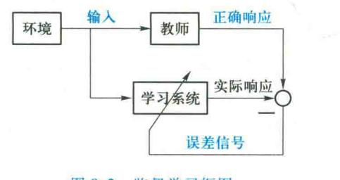

图 9.2 监督学习框图

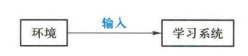

图 9.3 无监督学习框图

无监督学习不需要人类进行数据标注,而是通过模型不断地自我认知、自我巩固,最后进行自我归纳来实现其学习过程,这对大数据分析尤为重要。但由于缺乏制定的标签,在实际应用中的性能往往存在很大的局限。

虽然目前无监督学习还处于研究阶段,但是机器学习未来的发展方向,正在引起越来越多的 关注。2015年,Yann LeCun, YoshuaBengio, Geoffrey Hinton 首次合作在 Nature 杂志撰文对深度 学习的未来展望时指出:无监督学习对于重新点燃深度学习的热潮起到了促进作用。我们期望 无监督学习在未来越来越重要,使我们能够通过观察发现世界的内在结构,而不是被告知每一个 客观事物的名称。

{7}------------------------------------------------

### 4. 弱监督学习

针对监督学习和无监督学习各自的优缺点,研究人员提出了弱监督学习的概念。

弱监督学习中的数据标签允许是不完全的,即训练集中只有一部分数据是有标签的,而其余的数据甚至是绝大部分数据是没有标签的。

弱监督学习更接近人类的学习方式。例如,父母教一个婴儿认识猫,会指着一只小猫或者拿着一张猫的照片,告诉他这是"猫"。以后小孩遇到不同的猫或者猫的照片的时候,尽管父母不会一直告诉他们这也是"猫",但小孩会不断地自我发现、学习、调整自己对"猫"的认识,从而最终理解并认识什么是"猫"。

父母教婴儿认识猫是监督学习,但父母给小孩看的猫或者猫的照片是不完全的标签数据。小孩看到的其他不同的猫或者猫的照片,是无标签数据,小孩会不断地自我发现、学习、调整自己对"猫"的认识是无监督学习。如果仅仅用监督学习,则要求父母一次次反复地告诉机器学习模型什么是"猫",也许要高达数万甚至数十万次。很显然,弱监督学习的模式更加接近小孩的学习方式。

弱监督学习一方面降低了人工标记的工作量,同时又可以引入人类的监督信息在很大程度 上提高无监督学习的性能,成为当前机器学习领域的重要研究方向,已经被广泛应用在自动控制、调度、金融、网络通信等领域,在认知、神经科学领域,强化学习也有重要研究价值。

弱监督学习涵盖的范围很广泛,可以说只要标注信息是不完全、不确切或者不精确的标记学习都可以看作是弱监督学习。下面仅介绍半监督学习、迁移学习和强化学习这三种典型的弱监督学习。

# (1) 半监督学习

半监督学习是一种典型的弱监督学习方法。在半监督学习中,只有少量有标注的数据,还有大量未标注的数据可供使用。因为仅仅学习这些少量有标注数据还不足以训练出好的模型,还需要用大量的无监督数据来改善模型性能。因此,半监督学习不仅最大限度地发挥有标注数据的作用,而且还从体量巨大、结构繁多的无标注数据中挖掘出隐藏的规律。半监督学习成为近年来机器学习领域比较活跃的研究方向,被广泛应用于社交网络分析、文本分类、计算机视觉和生物医学信息处理等领域。

近年来,随着大数据相关技术的飞速发展,容易收集大量的未标记数据,例如,在大量的互联 网应用中,无标记的数据量是极为庞大甚至是无限的。而获取大量有标记的样本则相对较为困 难,往往需要大量的人力、物力和财力。例如在医学图像处理中,随着医学影像技术的发展,容易 获取成像数据,但是对病灶等数据的标识往往需要有经验的医生进行诊断。由于时间和精力的 限制,医学专家只能标注相当少的一部分图像,所以,适合采用半监督学习进行医学影像分析。

# (2) 迁移学习

迁移学习侧重于将已经学习过的知识迁移应用到新的问题中。

我们通常所说的举一反三的能力就是迁移学习。比如我们学会了打羽毛球,再学打网球就会变得相对容易;我们学会了中国象棋,再学习国际象棋也会变得相对容易。对于计算机来说,

{8}------------------------------------------------

我们同样希望机器学习模型在学习到一种能力之后,稍加调整就可用于一个新的领域。人类对举一反三的理论研究要追溯到1901年,心理学家桑代克和伍德沃思提出了学习迁移(transfer of learning)的概念。他们主要研究了人们学习某个概念时如何对学习其他概念产生迁移,这些理论对后来教育学的发展产生了重要影响。

1990年以来,大量研究都涉及迁移学习的概念,如自主学习、终生学习、多任务学习、知识迁移等,但没有形成一个完整的迁移学习体系。直到2010年,提出了迁移学习的形式化定义,迁移学习成为机器学习中一个重要的分支领域。

随着大数据时代的到来,迁移学习变得越来越重要。我们现在可以很容易地获取大量的城市交通、视频监控、行业物流等不同类型的数据,互联网也在不断产生大量的图像、文本、语音等数据。但这些数据往往都是没有标注的。而现在很多机器学习方法都是有监督学习方法,需要以大量的标注数据为前提。如果我们能够将在标注数据上训练得到的模型,有效地迁移到这些无标注数据上,无疑具有重要的价值。

在迁移学习中,通常称有知识和数据标注的领域为源域,是要迁移的对象;而把最终要赋予知识、赋予标注的对象称作目标域。迁移学习的核心目标就是将知识从源域中迁移到目标域。目前迁移学习主要通过以下三种方式来实现:

- ① 样本迁移。在源域中找到与目标域相似的数据,并赋予其更高的权重,从而完成从源域到目标域的迁移。这种方法的优点是简单且容易实现,但是权重和相似度的选择往往高度地依赖经验,使得算法的可靠性降低。
- ② 特征迁移。通过特征变换将源域和目标域的特征映射到同一个特征空间中,然后再用经典的机器学习方法来求解。这种方法的优点是对大多数方法适用,而且效果较好,但是在实际问题中通常难以求解。
- ③ 模型迁移。假设源域和目标域共享模型参数,即将在源域中通过大量数据训练好的模型应用到目标域上。从源数据中挑选出和目标数据更相似的样本来参与训练,而剔除和目标数据不相似的样本。例如,在一个千万量级的标注样本集上训练得到了一个图像分类系统,在一个新领域的图像分类任务中,可以直接用之前训练好的模型,再加上目标域的几万张标注样本进行微调,即可以得到很高精度的模型。模型迁移是目前最主流的迁移学习方法,可以很好地利用模型之间的相似度,具有广阔的应用前景。

迁移学习可以充分利用既有模型的知识,使得机器学习模型在面临新的任务时,只需要进行少量的微调即可完成相应的任务,具有重要的应用价值。目前,迁移学习已经在机器人控制、机器翻译、图像识别、人机交互等诸多领域获得了广泛的应用。

# (3) 强化学习(再励学习)

强化学习是弱监督学习的一类典型算法。强化学习算法理论的形成可以追溯到 20 世纪七八十年代,但是最近引起了广泛关注,特别是 2016 年 3 月,DeepMind 开发的 AlphaGo 利用强化学习算法击败了人类世界围棋冠军,成为解决通用人工智能的关键路径。目前,强化学习算法已经在游戏、机器人等领域中取得突出成果。

{9}------------------------------------------------

强化学习(reinforcement learning, RL)的基本学习方法如图 9.4 所示。监督学习是对每个输

入模式都有一个正确的目标输出,而强化学习中外部环境对系统输出结果只给出评价信息(奖励或者惩罚),而不是正确答案,学习系统通过那些受惩的动作改善自身的性能。基于遗传算法的学习方法就是一种强化学习。

与监督学习不同,强化学习中的智能体通过尝试来发现各个动作产生的结果。因为没有标注数据告诉机器应当做哪个动作,只能通过设置合适的奖励函数,使得机器学习模型在奖励函数的引导下,自主地学习到相应的策略。

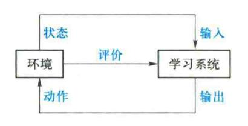

图 9.4 强化学习框图

强化学习的目标就是研究智能体在与环境的交互过程中,如何学习到一种行为策略,以最大 化得到的累积奖赏。强化学习就是在训练的过程中,不断地尝试,错了就扣分,对了就奖励,从而 得到在各个状态环境中最好的决策。

# 9.2 符号学习

# 9.2.1 机械式学习

符号学习讲课视 频▲

机械式学习(rote learning)又称为记忆学习,或者死记式学习,是一种最简单、最原始的学习方法。机械式学习通过直接记忆或者存储外部环境所提供的信息达到学习的目的,并在以后通过对知识库的检索得到相应的知识直接用来求解问题。

例如,已知输入(前提、条件)是 $(x_1, x_2, \dots, x_n)$ 时,输出(结论、操作)是 $(y_1, y_2, \dots, y_m)$ ,则把联想对

$$[(x_1,x_2,\cdots,x_n),(y_1,y_2,\cdots,y_m)]$$

存入知识库中。当以后又出现 $(x_1, x_2, \dots, x_n)$ 时,只要直接从知识库中检索出 $(y_1, y_2, \dots, y_n)$ 就可以了,不需要进行计算和推导。

机械式学习实质上是用存储空间来换取处理时间。虽然节省了计算时间,但却多占用了存储空间。当因学习而积累的知识逐渐增多时,占用的空间就会越来越大,检索的效率也将随着下降。所以,在机械式学习中要权衡时间与空间的关系,这样才能取得较好的效果。

应用机械式学习的一个典型例子是塞缪尔的跳棋程序 CHECKERS。该程序采用极大极小方法搜索博弈树,在给定的搜索深度下用估价函数对格局进行评分,然后通过倒推计算求出上层结点的倒推值,以决定当前的最佳走步。学习环节把每个格局的倒推值都记录下来,当下次遇到相同的情况时,就直接利用"记住"的倒推值决定最佳走步,而不必重新计算。例如,设在某一格局 A 时轮到 CHECKERS 走步,它向前搜索三层,得到如图 9.5 所示的搜索树。

在图 9.5 中,根据对端结点的静态估值,可求得 A 的倒推值为 6,最佳走步是走向 C。这时

{10}------------------------------------------------

CHECKERS 记住 A 及其倒推值 6。假若在以后的对弈中又出现了格局 A 且轮到它走步,则它就 可以通过检索直接得到 A 的倒椎值,而不必再进行倒椎计算。如果博弈时出现了图 9.6 所示的 情况,格局 A 是搜索树的端点,此时使用 A 的倒推值比使用它的静态估值将更准确,同时由于对 A 使用了所记忆的倒推值,因而对格局 O 来说,相当于搜索深度扩大到六层。

# 9.2.2 指导式学习

指导式学习(learning by being told)又称为嘱咐式学习或教授式学习。指导式学习由外部 环境向系统提供一般性的指示或建议,系统把它们具体地转化为细节知识并送入知识库中。 在学习过程中要反复对形成的知识进行评价,使其不断完善。

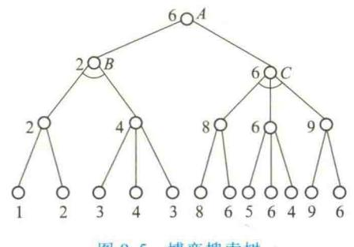

图 9.5 博弈搜索树

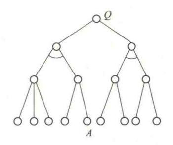

图 9.6 以 A 为结点的博弈树

一般地说, 指导式学习的学习过程由下列四个步骤组成。

# 1. 征询指导者的指示或建议

指导式学习的第一步工作是征询指导者的指示或建议。其征询方式可以是简单的,也可以 是复杂的:可以是主动的,也可以是被动的。所谓简单征询是指导者给出一般性的意见,系统将 其具体化:所谓复杂征询是指系统不仅要求指导者给出一般性的建议,而且还要具体地鉴别 知识库中可能存在的问题,并给出修改意见:所谓被动征询是指系统只是被动地等待指导者 提供意见;所谓主动征询是指系统不只是被动地接受指示,而且还能主动地提出询问,把指导 者的注意力集中在特定的问题上。

理论上讲,为了实现征询,系统应具有识别、理解自然语言的能力。这样才能使系统直接与 指导者进行对话。但由于目前还不能完全实现这一要求,因而目前征询通常使用某种约定的语 言进行。

# 2. 把征询意见转换为可执行的内部形式

征询意见的目的是为了获得知识,以便用这些知识求解问题。为此学习系统应具有把用约 定形式表示的征询意见转化为计算机内部可执行形式的能力,并且能在转化过程中进行语法检 查及适当的语义分析。

### 3. 加入知识库

经转化后的知识就可加入知识库。在加入过程中要对知识进行一致性检查,以防止出现矛

{11}------------------------------------------------

盾、冗余、环路等问题。

#### 4. 评价

为了检验新知识的正确性,需要对它进行评价。最简单也是最常用的评价方法是对新知识进行经验测试,即执行一些标准例子,然后检查执行情况是否与已知情况一致。如果出现了不一致,表示新知识中存在某些问题,此时可把有关信息反馈给指导者,请他给出另外的指导意见。

指导式学习是一种比较实用的学习方法,可用于专家系统的知识获取。它既可以避免由系统自己进行分析、归纳从而产生新知识所带来的困难,又无须领域专家了解系统内部知识表示和组织的细节,因此目前应用得较多。

# 9.2.3 归纳学习

归纳学习(inductive learning)是应用归纳推理进行学习的一类学习方法。按其有无教师指导可分为示例学习及观察与发现学习两种形式。

归纳推理是应用归纳方法所进行的推理,即从足够多的事例中归纳出一般性的知识。它是一种从个别到一般、从部分到整体的推理。

由于在进行归纳时,多数情况下不可能考察全部有关的事例,因而归纳出的结论不能绝对保证它的正确性,只能以某种程度相信它为真。这是归纳推理的一个重要特征。例如,由"麻雀会飞""鸽子会飞""燕子会飞"……这样一些已知事实,有可能归纳出"有翅膀的动物会飞""长羽毛的动物会飞"等结论。这些结论一般情况下都是正确的,但当发现鸵鸟有羽毛、有翅膀,但却不会飞时,就动摇了上面归纳出的结论。这说明上面归纳出的结论不是绝对为真的,只能以某种程度相信它为真。它是一种主观不充分置信的推理。

归纳推理是人们经常使用的一种推理方法,人们通过大量的实践总结出了多种归纳方法,以下列出其中常用的几种方法。

### 1. 枚举归纳

设  $a_1, a_2, \dots$ 是某类事物 A 中的具体事物,若已知  $a_1, a_2, \dots, a_n$  都有属性 P,并且没有发现反例,当 n 足够大时,就可得出"A 中所有事物都有属性 P"的结论。这是一种从个别事例归纳出一般性知识的方法,"A 中所有事物都有属性 P"是通过归纳得到的新知识。

例如,设有如下已知事例:

张三是足球运动员,他的体格健壮。 李四是足球运动员,他的体格健壮。

刘六是足球运动员,他的体格健壮。

当事例足够多时,就可归纳出如下一个一般性知识:

凡是足球运动员,他的体格一定健壮。

考虑到可能会出现反例的情况,可给这条知识增加一个可信度,如可信度为0.9。

{12}------------------------------------------------

另外,如果每个事例都带有可信度,例如

张三是足球运动员,他的体格健壮(0.95)

则可用各个事例可信度的平均值作为一般性知识的可信度。在以下讨论的方法中,除非特别说明外,一般都可用求平均值的方法得到经归纳所得知识的可信度,不再一一说明。另外,为了提高归纳结论的可靠性,应该尽量增加被考察对象的数量,扩大考察范围,并且注意收集反例。

### 2. 联想归纳

若已知两个事物a与b有n个属性相似或相同,即

a 具有属性  $P_1$ , b 也具有属性  $P_1$  a 具有属性  $P_2$ , b 也具有属性  $P_2$ 

a 具有属性  $P_{a}$ , b 也具有属性  $P_{a}$ 

并且还发现"a 具有属性 P,,,",则当 n 足够大时,可归纳出

b 也具有属性 Pn+1

这一新知识。

例如,通过观察发现两个孪生兄弟都有相同的身高、体重、面貌,都喜欢唱歌、跳舞且喜欢吃相同的食品等,而且还发现其中一人喜欢画山水画,虽然还没有发现另一个也喜欢画山水画,但很容易联想到另一个"也喜欢画山水画"。这就是联想归纳。

由于归纳推理是一种主观不充分置信推理,因而经归纳得出的结论可能会有错误。在上例中,如果经考察发现另一个不喜欢画山水画,那么这一归纳就出现了错误,此时应撤销得出的归纳结论以及由该归纳结论推出的所有其他结论。由此可见,归纳推理是非单调的。

# 3. 类比归纳

设 A,B 分别是两类事物的集合:

$$A = \{ a_1, a_2, \cdots \}$$
  
 $B = \{ b_1, b_2, \cdots \}$ 

并设 $a_i$  与 $b_i$  总是成对地出现,且当 $a_i$  有属性P 时, $b_i$  就有属性Q 与之对应,即

$$P(a_i) \rightarrow Q(b_i)$$
  $i = 1, 2, \cdots$ 

则当 A 与 B 中有一对新元素出现时(设为 A 中的 a' 及 B 中的 b'),若已知 a' 有属性 P,就可得出 b' 有属性 Q,即

$$P(a') \rightarrow Q(b')$$

### 4. 逆推理归纳

这是一种由结论成立而推出前提以某种置信度成立的归纳方法。这种方法的一般模式是:

- ① 若 H 为真时,则  $H \rightarrow E$  必为真或以置信度  $cf_1$ 成立。
- ② 观察到 E 成立或以置信度 cf2成立。
- ③ 则 H 以某种置信度(cf)成立。

这可用公式表示为

{13}------------------------------------------------

$$H \rightarrow E$$
  $cf_1$ 
 $E$   $cf_2$ 
 $H$   $cf$ 

在日常生活及科学研究中,人们经常使用这种方法进行归纳推理。例如,花农们都知道"若月季花得了黑斑病,就会在植株下部的叶片上出现黑斑",现在发现月季花植株下部的叶片上有黑斑,花农就会以某种置信度断定该月季花得了黑斑病,并采取相应措施进行根治。

cf 的计算方法可根据问题的实际情况确定。例如,可把  $P(E \mid H)$  当作  $H \rightarrow E$  的置信度  $cf_1$ ,则  $E \rightarrow H$  的置信度  $cf_1'$ 可按 Bayes 公式算出

$$cf_1' = P(H \mid E) = \frac{P(E \mid H) \times P(H)}{P(E)} = cf_1 \times \frac{P(H)}{P(E)}$$

这样,由 cf,及 cf, 就可求出 H 的置信度

$$cf = cf_1' \times cf_2$$

#### 5. 消除归纳

在日常生活及科学研究中,当对某个事物发生的原因还没有搞清楚时,通常都会作出若干假设。这些假设间是析取关系。以后,随着对事物认识的不断深化,原先作出的某些假设有可能被否定,经过若干次否定后,最后剩下来未被否定的假设就可作为事物发生的原因。这样一个思维过程称为消除归纳。它是通过不断否定原先的假设来得出结论的。这可形式地描述为

已知: $A_1 \lor A_2 \lor \cdots \lor A_i \lor \cdots \lor A_n$ 

$$\neg A_1$$
 $\cdots$ 
 $\neg A_{i-1}$ 
 $\neg A_{i+1}$ 
 $\cdots$ 
 $\neg A_n$ 

结论: A,

例如,当一个发高烧的病人到医院急诊时,在未做化验等进一步的诊断之前,医生可怀疑他是患了肠炎、肺炎等与发烧有关的疾病,但经化验等进一步诊断后,原先的怀疑(假设)就会被逐个排除,最后剩下未被排除的那个假设就可作为病人所患疾病的结论。

以上讨论了归纳推理中常用的一些归纳方法,下面对演绎推理与归纳推理进行比较,分析它们的主要差别:

① 演绎推理是从一般到个别的推理。它从当前已知或假设的事实出发,通过运用普遍适用的公理、规则及领域知识,逻辑地推出适合当前情况的结论;而归纳推理是从个别到一般的推理,它是由个别事例通过归纳推出一般性结论的。从认识发展的过程来看,两者的方向是相反的。

{14}------------------------------------------------

- ② 演绎推理是一种必然性推理,具有"保真性",即只要  $E \rightarrow H$  为真且 E 为真,则由肯定前件的假设推理规则必然地推出 H 为真。因此,在演绎推理中,结论的正确性取决于前提是否正确以及推理形式是否符合逻辑规则。但归纳推理不具有保真性,它是一种或然性推理,或称它是一种"主观不充分置信"的推理。这是因为归纳推理通常是在事例不完全的情况下进行的。这就难免会漏掉某些与所得结论相悖的事例,从而使得归纳出来的一般性结论难以完全可信,只能以某种置信度为真,而且一旦出现了与所得结论相反的事例,就会否定原先归纳出的结论,使它变为假。
- ③ 演绎推理的常用形式是三段论,由大前提和小前提经演绎推出的结论决不会超出前提所断定的范围,即由演绎推理所得到的结论是本来就蕴涵在大前提的一般性知识之中的。这与数理逻辑中由公理推导定理类似。归纳推理是由个别事例推导一般性知识的,结论将适用于更大的范围。若从获取新知识的角度来看,演绎推理不能真正地获取新知识,而归纳推理可以获取新知识。

# 9.2.4 示例学习

人们要解决一个新的问题,常常是将过去成功解决的类似的案例,用于求解新的问题。例如,医生在对某个病人作了检查后,会想到以前看过的病人的情况,找出几个在重要病症上相似的病人,将那些病人的诊断和治疗方案用于这个病人。这就是示例学习的基本思想。

示例学习(learning from examples)又称为实例学习或从例子中学习。示例学习是通过从外部环境中取得若干与某概念有关的例子,经归纳得出一般性概念的一种学习方法。在这种学习方法中,外部环境(教师)提供一组例子(正例和反例),然后从这些特殊知识中归纳出适用于更大范围的一般性知识,它将覆盖所有的正例并排除所有反例。例如,如果用一批动物作为示例,并且告诉学习系统哪一个动物是"马",哪一个动物不是,当示例足够多时,学习系统就能概括出关于"马"的概念模型,使自己能识别马,并且能把马与其他动物区别开来,这一学习过程就是示例学习。

# 1. 示例学习的学习模型

示例学习的过程是:首先从示例空间中选择合适的训练示例,然后经解释归纳出一般性的知识,最后再从示例空间中选择更多的示例对它进行验证,直到得到可实用的知识为止。示例学习的学习模型如图 9.7 所示。

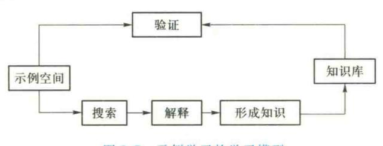

图 9.7 示例学习的学习模型

{15}------------------------------------------------

"示例空间"是所有可对系统进行训练的示例集合。与示例空间有关的主要问题是示例的质量、数量以及它们在示例空间中的组织。示例的质量和数量将直接影响到学习的质量,而示例的组织方式将影响到学习效率。

"搜索"的作用是从示例空间中查找所需的示例。为了提高搜索的效率,需要设计合适的搜索算法,并把它与示例空间的组织统筹考虑。

"解释"是从搜索到的示例中抽象出所需的有关信息供形成知识使用。当示例空间中的示例与知识的表示形式有较大差别时,需要将其转换为某种适合于形成知识的过渡形式。

"形成知识"是指把经解释得到的有关信息通过综合、归纳等形成一般性的知识。关于形成知识的方法,将在下面讨论。

"验证"的作用是检验所形成的知识的正确性,为此需从示例空间中选择大量的示例。如果通过验证发现形成的知识不正确,则需进一步获得示例,对刚才形成的知识进行修正。重复这一过程,直到形成正确的知识为止。

#### 2. 形成知识的方法

利用归纳方法可得出多种形成知识的技术,下面列出常用的几种。

#### (1) 变量代换常量

这是枚举归纳常用的方法。例如,假设示例空间中有如下两个关于扑克牌"同花"概念的示例:

示例 1: 花色 $(c_1, 梅花) \land 花色(c_2, 梅花) \land 花色(c_3, 梅花) \land 花色(c_4, 梅花) \rightarrow 同花(c_1, c_2, c_3, c_4)$ 

示例 2: 花色 $(c_1, \text{红桃}) \land$  花色 $(c_2, \text{红桃}) \land$  花色 $(c_3, \text{红桃}) \land$  花色 $(c_4, \text{红桃}) \rightarrow$  同花 $(c_1, c_2, c_3, c_4)$ 

其中,花色 $(c_1,梅花)$ 表示  $c_1$  这张牌的花色是梅花,余者类推。

对这两个示例,只要把"梅花"及"红桃"这些常量都用变量 x 替换,就可得到一条一般性的知识:

规则 1:花色 $(c_1, x)$  \ 花色 $(c_2, x)$  \ 花色 $(c_3, x)$  \ 花色 $(c_4, x)$  \ 一同花 $(c_1, c_2, c_3, c_4)$ 

### (2) 舍弃条件

舍弃条件是指把示例中的某些无关的子条件舍去。例如,对如下示例:

花色 $(c_1, \text{红桃}) \land 点数(c_1, 2) \land$ 花色 $(c_2, \text{红桃}) \land 点数(c_2, 4) \land$ 花色 $(c_3, \text{红桃}) \land 点数(c_3, 6) \land$ 花色 $(c_4, \text{红桃}) \land 点数(c_4, 8) \rightarrow$ 同花 $(c_1, c_2, c_3, c_4)$ 

由于"点数"对形成"同花"概念不存在直接的影响,这样就可把示例中的"点数"子条件舍去,如若再把"红桃"用变量x代换,就可得到上述的规则 1。

{16}------------------------------------------------

### (3) 增加操作

常用的操作方法有前件析取法和内部析取法。

前件析取法是通过对示例的前件进行析取操作形成知识的。例如,设有如下关于"脸牌"的示例:

示例 1:点数 $(c_1, J) \rightarrow \mathbb{h}(c_1)$ 

示例 2:点数 $(c_1, Q) \rightarrow \mathbb{R}(c_1)$ 

示例 3:点数 $(c_1, K) \rightarrow \mathbb{R}(c_1)$ 

若将各示例的前件进行析取,就可得到如下知识:

规则 2:点数 $(c_1, J) \lor$ 点数 $(c_2, Q) \lor$ 点数 $(c_3, K) \rightarrow bb(c_1)$ 

内部析取法是在示例的表示中使用集合与集合间的成员关系来形成知识的。例如,设有如下示例:

示例 1:点数 $(c_1) \in \{J\} \rightarrow \mathbb{h}(c_1)$ 

示例 2:点数 $(c_1) \in \{Q\} \rightarrow \mathbb{D}(c_1)$ 

示例 3:点数 $(c_1) \in [K] \rightarrow \mathbb{h}(c_1)$ 

用内部析取法可得到如下知识:

点数
$$(c_1) \in \{J, Q, K\} \rightarrow \mathbb{h}(c_1)$$

# (4) 合取变析取

这是通过把示例中条件的合取关系变为析取关系来形成一般性知识的。例如,由"男同学与女同学可以组成一个班"可以归纳出"男同学或女同学可以组成一个班"。

# (5) 归结归纳

利用归结原理,可得到如下形成知识的方法:

由

$$P \wedge E_1 \rightarrow H$$
$$\neg P \wedge E_2 \rightarrow H$$

可得到

$$E_1 \vee E_2 \longrightarrow H$$

例如,设有如下两个示例:

示例 1:某天下雨,且自行车在路上出了毛病需修理,所以他上班迟到。

示例 2:某天没下雨,但交通堵塞,所以他上班迟到。

由这两个示例,通过归结归纳,可得到如下知识:

如果自行车在路上出了毛病需修理,或者交通堵塞,则他有可能上班迟到。

# (6) 曲线拟合

设在示例空间提供了一批如下形式的示例:

其中,x和y为输入,z为输出。现在希望通过示例学习形成能反映这些示例的一般性知识。此

{17}------------------------------------------------

时可用曲线拟合法,例如最小二乘法等达到这一目的。现将上述形式的示例具体化为:

示例 1:(1,0,10)

示例 2:(2,1,18)

示例 3:(-1,-2,-6)

应用曲线拟合法可得到如下式子

$$z = 2x + 6y + 8$$

对于 x 和 y 的任何输入值,都可用这个式子求出 z 的值。

# 9.2.5 观察与发现学习

观察与发现学习(learning from observation and discovery)分为观察学习与发现学习两种。前者用于对事例进行概念聚类,形成概念描述;后者用于发现规律,产生定律或规则。

### 1. 概念聚类

概念聚类是一种观察学习,是由米卡尔斯基(R.S.Michalski)在1980年首先提出来的。概念聚类的基本思想是把事例按一定的方式和准则进行分组,如划分为不同的类,不同的层次等,使不同的组代表不同的概念,并且对每一个组进行特征概括,得到一个概念的语义符号描述。

例如对如下事例:

喜鹊、麻雀、布谷鸟、乌鸦、鸡、鸭、鹅、…

可根据它们是否家养分为如下两类:

鸟={喜鹊,麻雀,布谷鸟,乌鸦,⋯} 家禽={鸡,鸭,鹅,⋯}

这里,"鸟"和"家禽"就是由聚类得到的新概念,并且根据相应动物的特征还可得知:

"鸟有羽毛、有翅膀、会飞、会叫、野生"

"家禽有羽毛、有翅膀、会飞、会叫、家养"

如果把它们的共同特性抽取出来,就可进一步形成"鸟类"的概念。

# 2. 发现学习

发现学习是从系统的初始知识、观察事例或经验数据中归纳出规律或规则。

这是最困难且最富创造性的一种学习。它可分为经验发现与知识发现两种,前者指从经验数据中发现规律和定律;后者是指从已观察的事例中发现新的知识。

发现学习使用归纳推理,在学习过程中除了初始知识外,教师不进行任何指导,所以,它是无教师指导的归纳学习。

# 9.2.6 类比学习

类比是人类认识世界的一种重要方法,也是诱导人们学习新事物、进行创造性思维的重要手段。类比学习(learning by analogy)就是通过类比,即通过对相似事物进行比较所进行的一种学

{18}------------------------------------------------

习。例如,当人们遇到一个新问题需要进行处理,但又不具备处理这个问题的知识时,通常采用的办法是回忆一下过去处理过的类似问题,找出一个与目前情况最接近的处理方法来处理当前的问题。再如,当教师要向学生讲授一个较难理解的新概念时,总是用一些学生已经掌握且与新概念有许多相似之处的例子作为比喻,使学生通过类比加深对新概念的理解。

类比学习的基础是类比推理,因此,本节首先简要地讨论类比推理,然后再具体讨论两种类 比学习方法。

#### 1. 类比推理

类比推理是指由新情况与记忆中的已知情况在某些方面相似,从而推出它们在其他相关方面也相似。显然,类比推理是在两个相似域之间进行的:一个是已经认识的域,它包括过去曾经解决过且与当前问题类似的问题以及相关知识,称之为源域,记为S;另一个是当前尚未完全认识的域,它是遇到的新问题,称之为目标域,记为T。类比推理的目的是从S中选出与当前问题最近似的问题及其求解方法来求解当前的问题,或者建立起目标域中已有命题间的联系,形成新知识。

设用  $S_1$  与  $T_1$  分别表示 S 与 T 中的某一情况,且  $S_1$ 与  $T_1$ 相似,再假设  $S_2$ 与  $S_1$ 相关,则由类比推理可推出 T 中的  $T_2$ ,且  $T_2$ 与  $S_2$ 相似。其推理过程分为如下四步。

### (1) 回忆与联想

在遇到新情况或新问题时,首先通过回忆与联想在S中找出与当前情况相似的情况,这些情况是过去已经处理过的,有现成的解决方法及相关的知识。找出的相似情况可能不止一个,可依其相似度从高至低进行排序。

# (2) 选择

从上一步找出的相似情况中选出与当前情况最相似的情况及其有关知识。在选择时,相似 度越高越好,这有利于提高推理的可靠性。

# (3) 建立对应关系

这一步的任务是在S与T的相似情况之间建立相似元素的对应关系,并建立起相应的映射。

# (4) 转换

这一步的任务是在上一步建立的映射下,把S中的有关知识引到T中来,从而建立起求解当前问题的方法或者学习到关于T的新知识。

在以上每一步中都有一些具体的问题需要解决。下面将结合两种具体的类比学习方法即属性类比学习和转换类比学习进行讨论。实际上还有很多类比方法,如派生类比、联想类比等。

# 2. 属性类比学习

# 属性类比学习是根据两个相似事物的属性实现类比学习的。

1979年,温斯顿研究开发了一个属性类比学习系统。通过对这个系统的讨论可具体地了解属性类比学习的过程。在该系统中,源域和目标域都是用框架表示的,分别称为源框架和目标框架。框架的槽用于表示事物的属性。其学习过程是把源框架中的某些槽值传递到目标框架的相应槽中去。传递分以下两步进行。

{19}------------------------------------------------

### (1) 从源框架中选择若干槽作为候选槽

所谓候选槽是指其槽值有可能要传递给目标框架的那些槽。选择的方法是相继使用如下启 发式规则:

- ① 选择那些具有极端槽值的槽作为候选槽。如果在源框架中有某些槽是用极端值作为槽值的,例如"很大","很小","非常高"等,则首先选择这些槽作为候选槽。
- ② 选择那些已经被确认为"重要槽"的槽作为候选槽。如果某些槽所描述的属性对事物的特性描述占有重要地位,则这些槽可被确认为重要的槽,从而被作为候选槽。
- ③ 选择那些与源框架相似的框架中不具有的槽作为候选槽。设S为源框架,S'是任一与S相似的框架,如果在S中有某些槽,但S'不具有这些槽,则就选这些槽作为候选槽。
- ④ 选择那些相似框架中不具有这种槽值的槽作为候选槽。设S为源框架,S'是任一与S相似的框架,如果S有某槽,其槽值为a,而S'虽有这个槽但其槽值不是a,则这个槽可被选为候选槽。
- ⑤ 把源框架中的所有槽都作为候选槽。当用上述启发式规则都无法确定候选槽,或者所确定的候选槽不够用时,可把源框架中的所有槽都作为候选槽,供下一步进行筛选。
  - (2) 根据目标框架对候选槽进行筛选

筛选按以下启发式规则进行:

- ① 选择那些在目标框架中还未填值的槽。
- ② 选择那些在目标框架中为典型事例的槽。
- ③ 选择那些与目标框架有紧密关系的槽,或者与目标框架的槽类似的槽。

通过上述筛选,一般都可得到一组槽值,分别把它们填入到目标框架的相应槽中,就实现了 源框架中某些槽值向目标框架的传递。

#### 3. 转换类比学习

在状态空间表示法的知识表示中,用"状态"和"算符"表示问题。其中,"状态"用于描述问题在不同时刻的状况;"算符"用于描述改变状态的操作。当问题由初始状态变换到目标状态时,所用算符的序列就构成了问题的一个解。但是,如何使问题由初始状态变换到目标状态呢?除了可用前面讨论的各种搜索策略外,还可用"手段-目标分析"法(means-end analysis,MEA)。该方法又称为"中间-结局分析"法,是纽厄尔等人在其完成的通用问题求解程序 GPS(general problem solver)中提出的一种问题求解模型。它求解问题的基本过程是:

- ① 把问题的当前状态与目标状态进行比较,找出它们之间的差异。
- ② 根据差异找出一个可减小差异的算符。
- ③ 如果该算符可作用于当前状态,则用该算符把当前状态改变为另一个更接近于目标状态的状态;如果该算符不能作用于当前状态,即当前状态所具备的条件与算符所要求的条件不一致,则保留当前状态,并生成一个子问题,然后对此子问题再应用 MEA。
  - ④ 当子问题被求解后,恢复保留的状态,继续处理原问题。

转换类比学习是在 MEA 基础上发展起来的一种学习方法。转换类比学习由外部环境获得

{20}------------------------------------------------

与类比有关的信息,学习系统找出与新问题相似的旧问题的有关知识,把这些知识进行转换使之适用于新问题,从而获得新的知识。

转换类比学习主要由两个过程组成:回忆过程与转换过程。

回忆过程适用于找出新、旧问题间的差别,包括:

- ①新、旧问题初始状态的差别。
- ② 新、旧问题目标状态的差别。
- ③ 新、旧问题路径约束的差别。
- ④ 新、旧问题求解方法可应用度的差别。

由这些差别可求出新、旧问题的差别度。其差别度越小,表示两者越相似。

转换过程是把旧问题的求解方法经适当变换使之成为求解新问题的方法。变换时,其初始状态是与新问题类似的旧问题的解,即一个算符序列,目标状态是新问题的解。变换中要用 MEA 来减小目标状态与初始状态间的差异,使初始状态逐步过渡到目标状态,即求出新问题的解。

# 9.2.7 解释学习

解释学习(explanation-based learning)是 20 世纪 80 年代中兴起的一种机器学习方法,是一种演绎学习方法。解释学习是通过运用相关的领域知识,对当前提供的单个问题求解实例进行分析,从而构造解释并产生相应知识的。目前,已经建立了一些解释学习系统,如米切尔等人研制的 LEX 和 LEAP 系统以及明顿(S.Minton)等人研制的 PRODIGY 系统等。

### 1. 解释学习的概念

解释学习与前面讨论的归纳学习及类比学习不同,它不是通过归纳或类比进行学习,而是通过运用相关的领域知识及一个训练实例来对某一目标概念进行学习,并最终生成这个目标概念的一般性描述。该一般描述是一个可形式化表示的一般性知识。

提出解释学习方法的主要原因是:

- ① 人们经常能从观察或执行的单个实例中得到一个一般性的概念及规则,这就为提出解释学习提供了可能性。
- ② 归纳学习虽然是人们常用的一种学习方法,但由于它在学习中不使用领域知识分析、判断实例的属性,而仅仅通过实例间的比较来提取共性,所以无法保证推理的正确性,而解释学习因在其学习过程中运用领域知识对提供给系统的实例进行分析,避免了类似问题的发生。
  - ③ 应用解释学习方法进行学习,有望提高学习的效率。

关于解释学习,1986年,米切尔(Mitchell)用如下框架给出了它的一般性描述:

给定:领域知识 DT:

目标概念 TC;

训练实例 TE:

操作性准则 OC。

{21}------------------------------------------------

找出:满足 OC 的关于 TC 的充分条件。

其中,领域知识 DT 是相关领域的事实和规则,在学习系统中作为背景知识,用于证明训练实例 TE 为什么可作为目标概念的一个实例,从而形成相应的解释;目标概念 TC 是要学习的概念;训练实例 TE 是为学习系统提供的一个例子,在学习过程中起着重要的作用,应能充分地说明目标概念 TC;操作性准则 OC 用于指导学习系统对用来描述目标的概念进行取舍,使得通过学习产生的关于目标概念 TC 的一般性描述成为可用的一般性知识。

由米切尔的描述可以看出,在解释学习中,为了对某一目标概念进行学习,从而得到相应的知识,必须为学习系统提供完善的领域知识以及能说明目标概念的一个训练实例。系统进行学习时,首先运用领域知识 DT 找出训练实例 TE 为什么是目标概念 TC 之实例的证明(即解释),然后根据操作性准则 OC 对证明进行推广,从而得到关于目标概念 TC 的一个一般性描述,即一个可供以后使用的形式化表示的一般性知识。

若仅从需要提供实例这一点来看,解释学习与示例学习类似,但其实它们是两种完全不同的 学习方法。它们的主要区别有:

- ① 在示例学习中,系统要求输入一组实例;而解释学习只要求输入一个实例。
- ② 在示例学习中,其学习方法是归纳,它不要求提供领域知识;而解释学习要求提供领域知识,而且要求提供完善的领域知识,其学习方法主要是演绎,是通过应用领域知识进行演绎构造解释的。
- ③ 示例学习侧重于概念的获取,即侧重于知识增加的一面;而解释学习侧重于技能提高的 一面,通过学习将把非操作性的知识转换为可操作的形式化知识。

### 2. 解释学习的学习过程

对于解释学习,米切尔等人1986年提出了分两步进行学习的步骤:

# (1) 构造解释

这一步的任务是证明提供给系统的训练实例为什么是满足目标概念的一个实例。其证明过程是通过运用领域知识进行演绎实现的,证明的结果是得到一个解释结构。简单地说,这一步是通过分析一个求解实例来产生解释结构。

例如,设置要学习的目标概念是"一个物体 $(Obj_1)$ 可以安全地放置在另一个物体 $(Obj_2)$ 上",即  $Safe-To-Stack(Obj_1,Obj_2)$ 

训练实例为描述物体 Obj, 与 Obj2 的下述事实:

 $On(Obj_1, Obj_2)$   $Isa(Obj_1, book-AI)$   $Isa(Obj_2, table-book)$   $Volume(Obj_1, 1)$   $Density(Obj_1, 0.1)$ 

领域知识是把一个物体放置在另一个物体上面的安全准则:

{22}------------------------------------------------

¬ Fragile(y) → Safe – To – Stack(x,y)

Lighter(x,y) → Safe – To – Stack(x,y)

Volume(p,v) 
$$\land$$
 Density(p,d)  $\land$  \* (v,d,w) → Weight(p,w)

Isa(p,table-book) → Weight(p,15)

Weight(p1,w1)  $\land$  Weight(p2,w2)  $\land$  Smaller(w1,w2) → Lighter(p1,p2)

这是一个由目标概念引导的逆向推理,最终获得了一个解释结构。证明过程如图 9.8 所示。

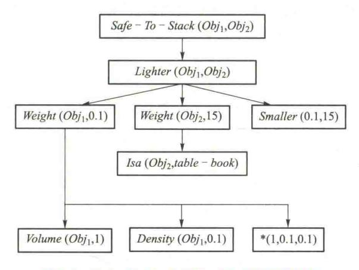

图 9.8 Safe-To-Stack(Obj,,Obj2)的解释结构

#### (2) 获取一般性的知识

这一步的任务是对上一步得到的解释结构进行一般化处理,从而得到关于目标概念的一般性知识。处理的方法通常是把常量变换为变量,并把某些不重要的信息去掉,只保留那些对以后求解问题所必需的关键性信息。当对图 7.8 所示的解释结构进行一般化处理后可得到图 9.9 所示的解释结构,由此得到如下一般性知识:

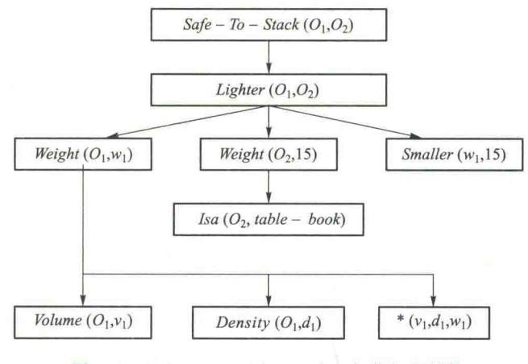

图 9.9 Safe-To-Stack(O1,O2)一般化解释结构

{23}------------------------------------------------

$$\begin{aligned} \textit{Volume}(\ O_{1}\ , v_{1}) \ \land \ \textit{Density}(\ O_{1}\ , d_{1}) \ \land \ ^{*}(\ v_{1}\ , d_{1}\ , w_{1}) \\ \land \ \textit{Isa}(\ O_{2}\ , table-book) \ \land \ \textit{Smaller}(\ w_{1}\ , 15) \rightarrow \\ Safe-To-Stack(\ O_{1}\ , O_{2}) \end{aligned}$$

当以后求解类似问题时,可直接利用这个知识进行求解。这就提高了系统求解问题的效率。

#### 3. 领域知识的完善性

在解释学习系统中,系统是通过应用领域知识逐步地进行演绎,最终构造出训练实例满足目标概念的证明(即解释)的。其中,领域知识对证明的形成起着重要的作用,所以要求领域知识是完善的,只有完善的领域知识才能产生正确的学习描述。但是,不完善是难以避免的。此时,有可能出现如下两种极端情况。

#### (1) 构造不出解释

构造不出解释是由于系统中缺少某些相关的领域知识,或者是由于领域知识中包含了矛盾等错误引起的。由于存在这些问题,当演绎推理用到这些知识时,就不得不中断,使系统不能达到构造出解释的目标。

#### (2) 构造出了多种解释

在本来应该构造出一种解释的情况下,构造出了多种解释。这也是错误的。其原因也是由于领域知识不健全,已有的知识不足以把不同的解释区分开来。

为了解决以上问题,最根本的办法是提供完善的领域知识。另外,学习系统也应具有测试和修正不完善知识的能力,使问题能尽早地被发现,尽快地被修正。

# 9.3 知识发现与数据挖掘

随着计算机和网络技术的迅速发展,出现了以数据库和数据仓库为存储单位的海量数据,而且这种数据仍然在以惊人的速度不断增长。如何对这些海量数据进行有效处理,特别是如何从这些数据中归纳、提取出高一级的更本质、更有用的规律性信息,就成了信息领域的一个重要课题。事实上,这些海量数据不仅承载着大量的信息,同时也蕴藏着丰富的知识。正是在这样的背景下,知识发现与数据挖掘技术应运而生。

知识发现与数据挖掘现已成为人工智能和信息科学领域的一个热门方向,其应用范围非常广泛,如企业数据、商业数据、科学实验数据、管理决策数据等。

# 9.3.1 知识发现与数据挖掘的概念

知识发现的全称是从数据库中发现知识(knowledge discovering from data base, KDD)。数据挖掘(data mining, DM)是从数据库中挖掘知识。KDD 和 DM 的本质含义是一样的,只是知识发现的概念主要流行于人工智能和机器学习领域,而数据挖掘的概念则主要流行于统计、数据分析、数据库和管理信息系统领域。所以,现在有关文献中一般都把二者同时列出。

知识发现和数据挖掘的目的就是从数据集中抽取和精化一般规律或模式。其涉及的数据形

{24}------------------------------------------------

态包括数值、文字、符号、图形、图像、声音,甚至视频和 Web 网页,等等。数据组织方式可以是有结构的、半结构的或非结构的。知识发现的结果可以表示成各种形式,包括概念、规则、定律、公式、议程等。本节仅对知识发现与数据挖掘技术作一简单介绍。

# 9.3.2 知识发现的一般过程

知识发现过程可粗略地划分为数据准备、数据挖掘以及结果的解释和评价三步。

#### 1. 数据准备

数据准备又可分为三个子步骤:数据选取、数据预处理和数据变换。数据选取就是确定目标数据,即操作对象,它是根据用户的需要从原始数据库中抽取的一组数据。数据预处理一般可能包括消除噪声、推导计算缺值数据、消除重复记录、完成数据类型转换等。当数据开采的对象是数据仓库时,一般来说,数据预处理已经在生成数据仓库时完成了。数据变换的主要目的是消减数据维数,即从初始特征中找出真正有用的特征以减少数据开采时要考虑的特征或变量个数。

### 2. 数据挖掘

数据挖掘阶段首先要确定挖掘的任务或目的是什么,如数据总结、分类、聚类、关联规则或序列模式等。确定了挖掘任务后,就要决定使用什么样的挖掘算法。同样的任务可以用不同的算法来实现,选择实现算法有两个考虑因素:一是不同的数据有不同的特点,因此需要用与之相关的算法来挖掘;二是用户或实际运行系统的要求,有的用户可能希望获取描述型的、容易理解的知识,而有的用户系统的目的是获取预测准确度尽可能高的预测型知识。

# 3. 结果的解释和评价

数据挖掘阶段发现的知识模式中可能存在冗余或无关的模式,所以还要经过用户或机器的评价。若发现所得模式不满足用户要求,则需要退回到发现阶段之前,如重新选取数据,采用新的数据变换方法,设定新的数据挖掘参数值,甚至换一种挖掘算法。另外,由于 KDD 最终是面向人的,因此可能要对发现的模式进行可视化,或者把结果转换为用户易懂的另一种表示,如把分类决策树转换为"if-then"规则。

# 9.3.3 知识发现的任务

所谓知识发现的任务,就是知识发现所要得到的具体结果。

### 1. 数据总结

数据总结的目的是对数据进行浓缩,给出它的紧凑描述。传统的也是最简单的数据总结方法是计算出数据库的各个字段上的求和值、平均值、方差值等统计值,或者用直方图、饼状图等图形方式表示。数据挖掘主要关心从数据泛化的角度来讨论数据总结。数据泛化是一种把数据库中的有关数据从低层抽象到高层次上的过程。

# 2. 概念描述

有两种典型的描述:特征描述和判别描述。特征描述是从学习任务相关的一组数据中提取出关于这些数据的特征式,这些特征式表达了该数据集的总体特征;而判别描述则描述了两个或

{25}------------------------------------------------

多个类之间的差异。

### 3. 分类

分类是数据挖掘中一项非常重要的任务,目前在商业应用最多。分类的目的是提出一个分 类函数或分类模型(也常常称作分类器),该模型能把数据库中的数据项映射到给定类别中的 一个。

#### 4. 聚类

聚类是根据数据的不同特征,将其划分为不同的类。它的目的是使得属于同一类别的个体之间的差异尽可能地小,而不同类别的个体间的差异尽可能地大。聚类方法包括统计方法、机器学习方法、神经网络方法和面向数据库的方法等。

### 5. 相关性分析

相关性分析的目的是发现特征之间或数据之间的相互依赖关系。数据相关性关系代表一类重要的可发现的知识。一个依赖关系存在于两个元素之间。如果从一个元素 A 的值可以推出 另一个元素 B 的值,则称 B 依赖于 A。这里所谓元素可以是字段,也可以是字段间的关系。

### 6. 偏差分析

偏差分析包括分类中的反常实例、例外模式、观测结果对期望值的偏离以及量值随时间的变化等,其基本思想是寻找观察结果与参照量之间的有意义的差别。通过发现异常,可以引起人们对特殊情况加倍注意。

### 7. 建模

建模就是通过数据挖掘,构造出能描述一种活动、状态或现象的数学模型。

# 9.3.4 知识发现的方法

知识发现主要有以下几种方法。

# 1. 统计方法

事物的规律性,一般从其数量上会表现出来。而统计方法就是从事物的外在数量上的表现去推断事物可能的规律性。因此,统计方法就是知识发现的一个重要方法。常见的统计方法有回归分析、判别分析、聚类分析以及探索分析等。

# 2. 粗糙集

粗糙集(rough set)理论由 Zdziskew Pawlak 在 1982 年提出,它是一种新的数学工具,用于处理含糊性和不确定性,粗糙集在数据挖掘中也可发挥重要作用。什么是粗糙集呢?由于篇幅所限,这里不给出其精确的数学定义,简单地说,粗糙集是由集合的下近似、上近似来定义的。下近似中的每一个成员都是该集合的确定成员,若不是上近似中的成员肯定不是该集合的成员。粗糙集的上近似是下近似和边界区的合并。边界区的成员可能是该集合的成员,但不是确定的成员。可以认为粗糙集是具有三值隶属函数的模糊集,即是、不是、也许。与模糊集一样,它是一种处理数据不确定性的数学工具,常与规则归纳、分类和聚类方法结合起来使用。

{26}------------------------------------------------

#### 3. 可视化

可视化(visualization)就是把数据、信息和知识转化为图形的表现形式的过程。可视化可使抽象的数据信息形象化。于是,人们便可以直观地对大量数据进行考察、分析,发现其中蕴藏的特征、关系、模式和趋势等。因此,信息可视化也是知识发现的一个有用的手段。

### 4. 传统机器学习方法

包括符号学习和连接学习。

# 9.3.5 知识发现的对象

#### 1. 数据库

数据库是当然的知识发现对象。当前研究比较多的是关系数据库的知识发现。其主要研究课题有超大数据量、动态数据、噪声、数据不完整性、冗余信息和数据稀疏等。

### 2. 数据仓库

随着计算机技术的迅猛发展,到 20 世纪 80 年代,许多企业的数据库中积累了大量的数据。于是,便产生了进一步使用这些数据的需求,就是想通过对这些数据的分析和推理,为决策提供依据。但对于这种需求,传统的数据库系统却难以实现,主要有两个原因:一是传统数据库一般只存储短期数据,而决策需要大量历史数据;二是决策信息涉及许多部门的数据,而不同系统的数据难以集成。在这种情况下,数据仓库(data warehouse)技术应运而生。

目前,人们对数据仓库有很多不同的理解。Inmon 将数据仓库明确定义为:数据仓库是面向主题的、集成的、内容相对稳定的、不同时间的数据集合,用以支持经营管理中的决策制定过程。

具体来讲,数据仓库收集不同数据源中的数据,将这些分散的数据集中于一个更大的库中,最终用户从数据仓库中进行查询和数据分析。数据仓库中的数据应是良好定义的、一致的、不变的,数据量也应足够支持数据分析、查询、报表生成,此外还包括长期积累分布的、跨平台的数据,使用过程中可忽略许多技术细节。总之,数据仓库有四个基本特征:

- ① 数据仓库的数据是面向主题的。
- ② 数据仓库的数据是集成的。
- ③ 数据仓库的数据是稳定的。
- ④ 数据仓库的数据是随时间不断变化的。

数据仓库是面向决策分析的,数据仓库从事务型数据抽取并集成得到分析型数据后,需要各种决策分析工具对这些数据进行分析和挖掘,才能得到有用的决策信息。而数据挖掘技术具备从大量数据中发现有用信息的能力,于是数据挖掘自然成为数据仓库中进行数据深层分析的一种必不可少的手段。

数据挖掘往往依赖于经过良好组织和预处理的数据源,数据的好坏直接影响数据挖掘的效果,因此数据的前期准备是数据挖掘过程中一个非常重要的阶段。而数据仓库具有从各种数据源中抽取数据,并对数据进行清理、聚集和转移等各种处理的能力,恰好为数据挖掘提供了良好的进行前期数据准备工作的环境。

{27}------------------------------------------------

因此,数据仓库和数据挖掘技术的结合成为必然的趋势。数据挖掘为数据仓库提供深层次数据分析的手段,数据仓库为数据挖掘提供经过良好预处理的数据源。目前许多数据挖掘工具都采用了基于数据仓库的技术。例如,中科院计算所智能信息处理开放实验室开发的知识发现平台 DBMiner 就是一个典型的例子。

### 3. Web 信息

随着 Web 的迅速发展,分布在 Internet 上的 Web 网页已构成了一个巨大的信息空间。在这个信息空间中也蕴藏着丰富的知识。因此,Web 信息也就理所当然地成为一个知识发现对象。

Web 知识发现主要分内容发现和结构发现。内容发现是指从 Web 文档的内容中提取知识;结构发现是指从 Web 文档的结构信息中推导知识。Web 内容发现又可分为对文本文档(包括 text, HTML 等格式)和多媒体文档(包括 image 、audio、video 等类型)的知识发现。Web 结构发现包括文档之间的超链接结构、文档内部的结构、文档 URL 中的目录路径结构等。

### 4. 图像和视频数据

图像和视频数据中也存在有用的信息需要挖掘。比如,地球资源卫星每天都要拍摄大量的图像或录像,对同一个地区而言,这些图像存在着明显的规律性,白天和黑夜的图像不一样,当可能发生洪水时与正常情况下的图像又不一样。通过分析这些图像的变化,我们可以推测天气的变化,可以对自然灾害进行预报。这类问题,在通常的模式识别与图像处理中都需要通过人工来分析这些变化规律,从而不可避免地漏掉了许多有用的信息。

# 9.4 深度学习

# 9.4.1 深度学习的提出

人工智能目前许多成功应用都是基于 2006 年以来迅速发展起来的深度学习(deep learning, DL)。机器学习经历了两次研究高潮:

# (1) 机器学习的第一次浪潮:浅层学习

20世纪80年代末期提出的BP算法可以让一个人工神经网络模型从大量训练样本中学习统计规律,从而对未知事件做预测。这种基于统计的机器学习方法比起过去基于人工规则的系统,在很多方面显示出优越性。与人工规则构造特征的方法相比,利用大数据来学习特征,更能够刻画数据的丰富内在信息。

继 BP 算法提出之后,20 世纪 90 年代,提出各种各样的机器学习方法,例如支持向量机 (support vector machines,SVM)、Boosting、最大熵方法(如 logistic regression,LR)等。这些模型的 结构基本上可以看成带有一层隐层节点(如 SVM、Boosting),或没有隐层节点(如 Logistic regression,LR),所以称为浅层学习(shallow learning)方法。由于神经网络理论分析的难度大,训练方法又需要很多经验和技巧,有限样本和有限计算单元情况下对复杂函数的表示能力有限,针对复杂分类问题其泛化能力受到一定制约。这个时期浅层人工神经网络的研究进展较慢。

{28}------------------------------------------------

# (2) 机器学习的第二次浪潮:深度学习

2006年,加拿大多伦多大学教授 Geoffrey Hinton 和他的学生 Ruslan Salakhutdinov 在《科学》 上发表的文章"Reducing the Dimension of Data with Neural Network"。通过无监督学习实现"逐层初始化"(layer-wise pre-training),有效克服深度神经网络在训练上的难度,掀起了深度学习的浪潮。

传统的机器学习具有优异的特征学习能力,但在处理未加工数据时,需要设计一个特征提取器,把原始数据(如图像的像素值)转换成一个适当的内部特征表示或特征向量。深度学习是一种特征学习方法,原始数据通过一些简单的、非线性的模型转变成为更高层次的、更加抽象的表达。通过足够多的转换组合,非常复杂的函数也可以被学习。深度学习的实质是通过构建具有很多隐层的机器学习模型和海量的训练数据,来学习更有用的特征,从而提升分类或预测的准确性。

深度学习具有较多层的隐层节点,通过逐层特征变换,将样本在原空间的特征表示变换到一个新特征空间,从而使分类或预测更加容易。深度学习能够发现大数据中的复杂结构,它是利用 BP 算法来完成这个发现过程的。深度学习可通过学习一种深层非线性神经网络结构,实现复杂函数逼近,表征输入数据分布式表示,具有很强的从少数样本集中学习数据集本质特征的能力。

对于分类任务,高层次的表达能够强化输入数据的区分能力,同时削弱不相关因素。比如,一幅图像的原始格式是一个像素数组,那么在第一层上的学习特征表达通常指的是在图像的特定位置和方向上有没有边的存在。第二层通常会根据那些边的某些排放检测图案,这时候会忽略掉一些边上小的干扰。第三层或许会把那些图案进行组合,从而使其对应于熟悉目标的某部分。随后的一些层会将这些部分再组合,从而构成待检测目标。深度学习获取上述各层的特征都不是利用人工来设计的,而是使用一种通用的学习过程从数据中学到的。

通过深度学习得到的深度网络结构符合神经网络的特征,就是深层次的神经网络,称为深度神经网络(deep neural networks, DNN)。深度神经网络是由多个单层非线性网络叠加而成的。常见的单层网络按照编码解码情况分为3类:只包含编码器部分、只包含解码器部分、既有编码器部分又有解码器部分。编码器提供从输入到隐含特征空间的自底向上的映射,解码器以重建结果尽可能接近原始输入为目标将隐含特征映射到输入空间。深度神经网络分为以下3类:

#### (1) 前馈深度网络

前馈深度网络(feed-forward deep networks,FFDN)由多个编码器层叠加而成,如多层感知机(multi-layer perceptrons,MLP)、卷积神经网络(convolutional neural networks,CNN)等。由于 BP 学习算法具有收敛速度慢、需要大量带标签的训练数据、容易陷入局部最优等缺点,多层感知机效果并不十分理想。1984年日本学者 K.Fukushima 等基于感受域概念提出的神经认知机可以看作是卷积神经网络的一种特例。Y.Lecun 等提出的卷积神经网络是神经认知机的推广形式。卷积神经网络是由多个单层卷积神经网络组成的可训练的多层网络结构。每个单层卷积神经网络包括卷积、非线性变换和下采样 3 个阶段,其中下采样阶段不是每层都有的。

{29}------------------------------------------------

### (2) 反馈深度网络

反馈深度网络(feed-back deep networks,FBDN)由多个解编码器层叠加而成,如反卷积网络(deconvolutional networks,DN)、层次稀疏编码网络(hierarchical sparse coding,HSC)等。前馈网络是对输入信号进行编码的过程,而反馈网络是对输入信号解码的过程。

#### (3) 双向深度网络

双向深度网络(bi-directional deep networks, BDDN)通过叠加多个编码器层和解码器层构成,每层可以是单独的编码过程或解码过程,也可以既包含编码过程又包括解码过程,如深度波尔兹曼机(deep Boltamann machines, DBM)、深度信念网络(deep belief networks, DBN)栈式自编码器(stacked auto-encoders, SAE)等。

第8章已经从人工神经网络角度介绍了卷积神经网络、胶囊网络、生成对抗网络等深度学习 算法,下面从机器学习角度探讨深度学习的更一般方法。

# 9.4.2 人脑视觉机理

机器学习是研究计算机模拟人类学习行为的学科。因此,我们先了解人的 视觉系统是怎么工作的,怎么知道哪些特征好哪些特征不好的。

1981 年的诺贝尔医学奖获得者美国神经生物学家 David Hubel 和 Torsten-Wiesel 的主要贡献,是发现了视觉系统的信息处理:可视皮层是分级的。

人脑视觉机理讲 课视频▲

1958年, David Hubel 等研究瞳孔区域与大脑皮层神经元的对应关系。他们在猫的后脑头骨上,开了一个3毫米的小洞,向洞里插入电极,测量神经元的

活跃程度。经历了很多天反复的试验, David Hubel 发现了一种被称为"方向选择性细胞"的神经元。当瞳孔发现了物体的边缘, 而且这个边缘指向某个方向时, 这种神经元细胞就会兴奋。因此, 神经-中枢-大脑的工作过程, 或许是一个不断迭代、不断抽象的过程。从原始信号, 做低级抽象, 逐渐向高级抽象迭代。

人类的逻辑思维,经常使用高度抽象的概念。例如,从原始信号摄入开始(瞳孔摄入像素),接着做初步处理(大脑皮层某些细胞发现边缘和方向),然后抽象(大脑判定眼前的物体的形状是圆形的),进一步抽象(大脑进一步判定该物体是只气球)。这个生理学的发现,促成了人工智能在四十年后的突破性发展。

总的来说,人的视觉系统的信息处理是分级的。从低级的 V1 区提取边缘特征,到 V2 区的形状或者目标部分等,再到更高层,整个目标、目标的行为等。也就是说高层的特征是

低层特征的组合,从低层到高层的特征表示越来越抽象,越来越能表现语义或者意图。而抽象层面越高,存在的可能猜测就越少,就越利于分类。

特征讲课视频▲

# 9.4.3 特征

机器学习用于图像识别、语音识别、天气预测、基因表达等问题的基本步骤 如图 9.10 所示。

{30}------------------------------------------------

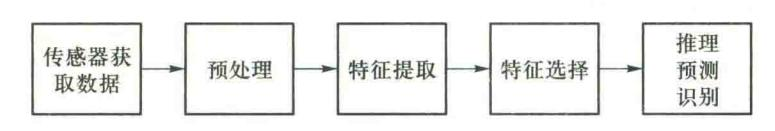

图 9.10 机器学习解决问题的基本步骤

从传感器获取数据,经过预处理、特征提取、特征选择,再到推理、预测或者识别,最后一个部分就是机器学习部分。中间的三部分是特征表达,目前一般是用手工完成的。但手工选取特征是一件非常费力、需要专业知识的工作,而且它的调节需要大量的时间。深度学习能够自动地学习一些特征。

特征是机器学习系统的原材料,对建模影响很大。如果数据被很好地表达成了特征,通常线性模型就能达到满意的精度。

学习算法在一个什么粒度上的特征表示,才能发挥作用?就一个图片来说,像素级的特征根本没有价值。例如一张摩托车的图片,从像素级别根本得不到任何信息,无法进行识别。而如果特征是一个结构,比如是否具有车把手,是否具有车轮,就很容易把摩托车和非摩托车区分,学习算法才能发挥作用。

为解决这个问题, David Field 提出了稀疏编码(sparse coding)算法, 它是一个重复迭代的过程, 每次迭代分两步:

- (1) 选择一组照片的碎片 S[k],  $k=1,2,\cdots,n$ , 然后调整权重系数 a[k], 使得 S[k] \* S[k]) 最接近目标碎片 T。
- (2) 固定住 a[k], 在 n 个碎片中, 选择其他更合适的碎片 S'[k], 替代原先的 S[k], 使得  $Sum_k(a[k]*S'[k])$  最接近 T。

经过几次迭代后,最佳的 S[k] 组合被遴选出来了,其中被选中的 S[k] 基本上都是照片上不同物体的边缘线,这些线段形状相似,区别在于方向。

David Field 的算法结果,与 David Hubel 的生理发现不谋而合。不仅图像处理存在这个规律,声音处理也存在这个规律。他们从未标注的声音中发现了 20 种基本的声音结构,其余的声音可以由这 20 种基本结构合成。

更结构化、更复杂、具有概念性的图形需要更高层次的特征表示,比如 V2、V4。因此 V1 看像素级是像素级, V2 看 V1 是像素级,这个是层次递进的,高层表达由低层表达的组合而成。

我们知道需要层次的特征构建,由浅入深,但每一层该有多少个特征呢?一般说来,任何一种方法,特征越多,给出的参考信息就越多,准确性会得到提升。但特征多意味着计算复杂,探索的空间大,可以用来训练的数据在每个特征上就会稀疏,都会带来各种问题,并不一定特征越多越好。

{31}------------------------------------------------

# 9.4.4 深度学习的基本思想

假设系统 S 有 n 层(S1,…,Sn),它的输入是 I,输出是 0,表示为: I=>S1=>S2=>…=>Sn=> 0。如果调整系统中参数,使得它的输出 0 等于输入 I,那么就可以自动地获得输入 I 的一系列层次特征,即 S1,…,Sn。通过这种方式,就可以实现对输入信息进行分级表达了。

DL 的基本思想讲 课视频▲

输出严格地等于输入的要求太严格,可以要求输入与输出的差别尽可能地小。上述就是深度学习的基本思想。

深度学习的目的是建立、模拟人脑进行分析学习的神经网络,它模仿人脑的机制来解释图像、声音和文本等数据,深度学习通过组合低层特征形成更加抽象的高层表示属性类别或特征,以发现数据的分布式特征表示。深度学习是一种无监督的学习。

深度学习采用了多层前向神经网络的分层结构,包括输入层、隐层(多层)、输出层组成的多层网络,只有相邻层节点之间有连接,同一层以及跨层节点之间相互无连接。这种分层结构,是比较接近人类大脑结构的。

BP 学习算法是采用迭代的算法来训练整个网络,随机设定初值,计算当前网络的输出,然后根据当前输出和样本之间的差去改变前面各层的权值,直到收敛,本质上是一个梯度下降法。对于一个深度网络(7层以上),一方面训练的计算量很大,另一方面残差传播到最前面的层已经变得太小,出现所谓的梯度扩散(gradient diffusion)而不能收敛到稳定状态。在典型的深度学习系统中,有可能有数以百万计的样本和权值,和带有标签的样本,用来训练深度神经网络器。与BP 学习算法相比,深度学习采用了分层计算(layer-wise)的训练机制,以克服 BP 神经网络训练中的问题。

# 9.4.5 深度学习的训练过程

hn H 34 65 +

如果对所有层同时训练,时间复杂度会太高;如果每次训练一层,偏差就会逐层传递,而且深度网络的神经元和参数太多,会严重欠拟合。

DL 的训练过程讲 课视频▲

对整个网络进行训练。

2006年,Hinton提出了在非监督数据上建立多层神经网络的一个有效方法,简单地说,分为两步,一是"预训练"(pre-training),每次训练一层隐节点,训练时将上一层隐节点的输出作为输入,而本层隐节点的输出作为下一层隐节点的输入;二是"调优"(time-tuning),即在各层训练完成后再利用 BP 算法等

深度学习训练过程具体如下:

(1) 使用自下上升非监督学习,从底层开始,一层一层地往顶层训练。

采用无标签数据或有标签数据分层训练各层参数。这一步可以看作是一个无监督训练过程,是与传统神经网络的最大区别。这个过程可以看作是特征学习过程。先用无标定数据训练第一层,训练时先学习第一层的参数。第一层可以看作是得到一个使得输出和输入差别最小的

{32}------------------------------------------------

三层神经网络的隐层。由于模型 capacity 的限制以及稀疏性约束,使得得到的模型能够学习到 数据本身的结构,从而得到比输入更具有表示能力的特征;在学习得到第 n-1 层后,将 n-1 层的 输出作为第 n 层的输入,训练第 n 层,由此分别得到各层的参数。

(2) 自顶向下的监督学习,通过带标签的数据去训练,误差自顶向下传输,对网络进行微调。 每层采用 wake-sleep 算法进行调优,每次调整一层,逐层调整。

wake 阶段:认知过程。通过下层的输入特征和向上的认知权重产生每一层的抽象表示,再 通过向下的生成权重产生一个重建信息,计算输入特征和重建信息残差,使用梯度下降修改层间 的下行的牛成权重。

sleep 阶段: 生成过程。通过上层概念和下行的生成权重生成下层状态,再利用认知权重产 生一个抽象表示。利用初始上层概念和新建的抽象表示的残差,使用梯度下降法修改层间的上 行的认知权重。

基于第一步得到的各层参数进一步调整整个多层模型的参数,这一步是一个有监督训练过程; 第一步类似神经网络的随机初始化初值过程,由于 DL 的第一步不是随机初始化,而是通过学习输 入数据的结构得到的,因而这个初值更接近全局最优,从而能够取得更好的效果:所以深度学习效 果好很大程度上归功于第一步的特征学习过程。

# 9.4.6 白编码器

深度学习的最简单的一种方法是利用人工神经网络的特点,人工神经网络 (ANN)本身就是具有层次结构的系统,如果给定一个神经网络,假设其输出与 输入是相同的,然后训练调整其参数,得到每一层中的权重。自然地,就得到了 输入 I 的几种不同表示(每一层代表一种表示),这些表示就是特征。

自编码器(auto-encoder)就是一种尽可能复现输入信号的神经网络。为了

实现这种复现,自编码器就必须捕捉可以代表输入数据的最重要的因素,就像 PCA 那样,找到可以代表原信息的主要成分。自编码器是一种无监督学习方法。由无监督预训 练和有监督调优两个阶段构成,是许多深度学习算法的思想基础。

具体过程简单地说明如下:

# (1)给定无标签数据,用无监督学习学习特征。

像 BP 神经网络学习的是样本,称为是有标签的。BP 算法根据当前神经网络的实际输出和 样本输出之间的差去改变前面各层的参数,直到收敛。但现在只有样本输入,没有样本输出,称 为无标签的。

如图 9.11 所示,为了实现机器学习,将样本数据输入到编码器就会得到一个编码,这个编码 也就是样本输入的一种表示。为了验证这个编码表示就是样本输入,将这个编码器的输出输入 到解码器。如果解码器输出的信息和输入样本信息相似(理想情况下相同),说明这个编码是合 适的。所以,可以通过调整编码器和解码器的参数,使得重构误差最小,这时候就得到了样本输 入的编码表示了。因为是无标签数据,所以误差的来源就是直接重构后与原输入相比较得到。

{33}------------------------------------------------

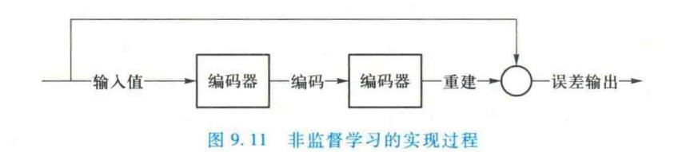

### (2) 通过编码器产生特征,然后逐层训练下一层。

上面得到了原输入信号的第一层编码。第二层训练方式可以类似于第一层的训练,如图 9.12 所示就是将第一层输出的编码当成第二层的输入信号,同样最小化重构误差,就会得到第二层的参数,并且得到第二层输入的编码,也就是原输入信息的第二个表达了。依此类推,其他各层按照同样的方法训练。

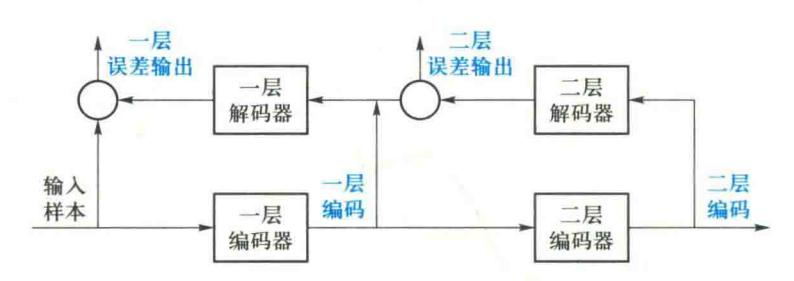

图 9.12 二层编码解码过程

自动编码器变体

#### (3) 有监督微调。

经过上面的训练,可以得到很多层的编码。每一层都会得到原始输入的不同表达,而且越来越抽象了,就像人的视觉系统一样。

上面介绍的自编码器能够获得代表输入的特征,这个特征可以最大程度上 代表原输入信号,但还不能用来分类数据。它只是学会了如何重构或复现它的 输入。或者说,它只是学习。为了实现分类,可以在最后一个编码器的后面添

加一个分类器(例如 BP 神经网络、SVM 等),然后通过标准的多层神经网络的监督训练方法(梯度下降法)去训练这个分类器。

目前自编码器的应用主要有两个方面:一是数据去噪,即通过自编码器将原图像当中的噪声去除。该方法通过引入合适的损失函数,使得模型可以学习到在受损的输入情况下依然可以获得良好的特征表达的能力,进而恢复对应的无噪声输入。二是数据的降维,即通过对隐特征加上适当的维度和稀疏性约束,使得自编码器可以学习到低维的数据投影。例如,假设输入和输出层都有100个神经元,隐层只有50个神经元,通过自编码器就可以只用隐含层的50个神经元找到100个输入层数据的特点,能够保证输出数据和输入数据大致一致,从而实现了降维的目标。目前,自编码器已成功应用于降维和信息检索等任务中。

{34}------------------------------------------------

# 9.4.7 自编码器的变体

对自编码器加上一些约束条件可以得到一些新的深度学习算法。

#### 1. 稀疏自编码器

如果在自编码器的基础上加上 L1 的规则限制,即约束每一层中的节点中大部分都要为 0,只有少数不为 0,可以得到稀疏自编码器(sparse auto-encoder),如图 9.13 所示。

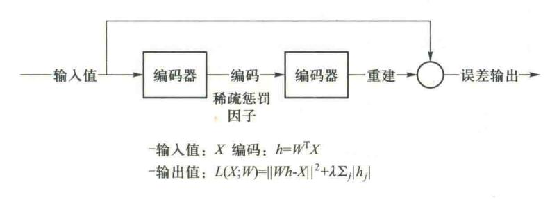

图 9.13 稀疏自编码器

限制每次得到的表达尽量稀疏,是因为稀疏的表达往往更有效,正如人脑视觉信息处理系统中,某个输入只是刺激人脑中某些神经元,其他大部分神经元是受到抑制的。

### 2. 降噪自编码器

如图 9.14 所示,降噪自编码器(denoising auto-encoders, DA)是在自编码器的基础上,将噪声加入训练数据,让自编码器学习去除这种噪声而获得实际输入。降噪自编码器可以通过梯度下降法去训练。

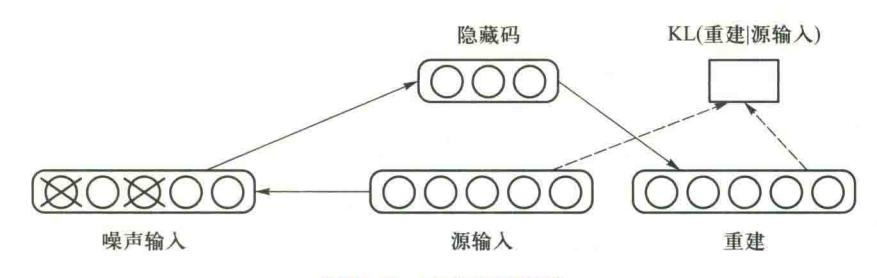

图 9.14 降噪自编码器

# 9.4.8 受限玻尔兹曼机

由于受限波尔兹曼机只具有两层结构,严格说来并不是一种真正的深度学习模型,但可以用它作为基本模块来构造自编码器、深层信念网络、深层波尔兹曼机等许多深度学习模型。

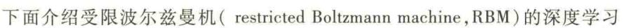

受限玻尔兹曼机讲课视频▲

{35}------------------------------------------------

模型。

#### 1. 能量模型和概率分布

波尔兹曼网络是一种随机网络,网络节点的取值状态是随机的,从贝叶斯网的观点来看,要描述整个网络,需要用三种概率分布来描述系统,即联合概率分布,边缘概率分布和条件概率分布。从贝叶斯网的观点看,受限波尔兹曼网络可以看作一个双向的有向图,即从输入层节点可以计算隐层节点取某一种状态值的概率,反之亦然。

能量函数是描述整个系统状态的一种测度。系统越有序或者概率分布越集中,系统的能量越小。反之,系统越无序或者概率分布越趋于均匀分布,则系统的能量越大。能量函数的最小值,对应于系统的最稳定状态。模拟退火算法就是在高温中试图跳出局部最小。

在马尔科夫随机场(MRF)中能量模型主要扮演着两个作用:一是全局解的度量(目标函数);二是能量最小时的解(各种变量对应的配置)为目标解。

RBM 的能量函数的定义如下:

$$E(v,h) = -\sum_{i=1}^{n} \sum_{j=1}^{m} w_{ij} h_{i} v_{j} - \sum_{i=1}^{m} b_{j} v_{j} - \sum_{i=1}^{n} c_{i} h_{i}$$
(9.1)

这个能量函数表明:每个可视节点和隐藏节点之间的连接结构都有一个能量,通俗来说就是可视节点的每一组取值和隐藏节点的每一组取值都有一个能量,如果可视节点的一组取值(也就是一个训练样本的值)为(1,0,1,0,1,0),隐藏节点的一组取值(也就是这个训练样本编码后的值)为(1,0,1),然后分别代入上面的公式,就能得到这个连接结构之间的能量。

#### 2. RBM 的网络结构

一个普通的 RBM 网络结构如图 9.15 所示。

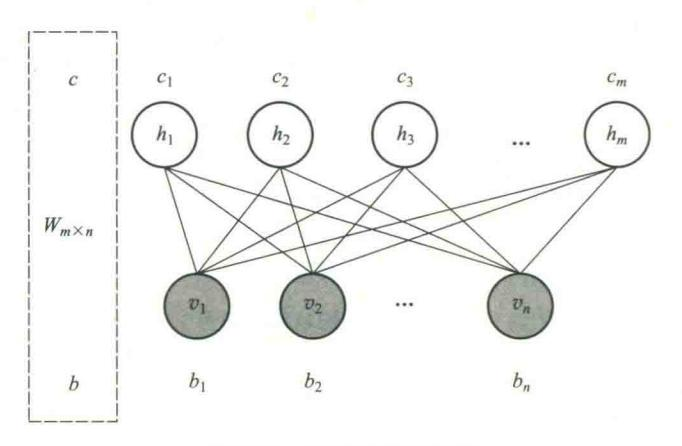

图 9.15 RBM 网络结构图

以上的 RBM 网络结构有n个可视节点和m个隐藏节点,其中每个可视节点只和m个隐藏节点相关,和其他可视节点是独立的,也就是这个可视节点的状态只受m个隐藏节点的影响,对于每个隐藏节点也是,只受m个可视节点的影响,这个特点使得mRBM 的训练简单化。

{36}------------------------------------------------

RBM 网络有几个参数,一个是可视层与隐藏层之间的权重矩阵  $W_{m\times n}$ ,一个是可视节点的偏移量  $b = (b_1, b_2 \cdots, b_n)$ ,一个是隐藏节点的偏移量  $c = (c_1, c_2 \cdots, c_m)$ ,这几个参数决定了 RBM 网络将一个 n 维的样本编码成一个什么样的 m 维的样本。

根据能量函数定义可视节点和隐藏节点的联合概率为

$$p(v,h) = \frac{e^{-E(v,h)}}{\sum_{v,h} e^{-E(v,h)}}$$
(9.2)

上式表明,一个可视节点的一组值(一个状态)和一个隐藏节点的一组值(一个状态)发生的概率 p(v,h) 是由能量函数来定义的。在统计热力学上,当系统和它周围的环境处于热平衡时,一个基本的结果是状态 i 发生的概率为

$$p_i = \frac{1}{Z} \times e^{-\frac{E_i}{k_b \times T}} \tag{9.3}$$

其中, $E_i$ 表示系统在状态 i 时的能量,T 为开尔文绝对温度, $k_b$ 为 Boltzmann 常数,Z 为与状态无关的常数。这个概率是一个特殊的 Gibbs 分布。根据上述联合概率可以得到一些条件概率

$$p(v) = \frac{\sum_{h} e^{-E(v,h)}}{\sum_{v,h} e^{-E(v,h)}}, \qquad p(h) = \frac{\sum_{v} e^{-E(v,h)}}{\sum_{v,h} e^{-E(v,h)}}$$
$$p(v \mid h) = \frac{e^{-E(v,h)}}{\sum_{v} e^{-E(v,h)}}, \qquad p(h \mid v) = \frac{e^{-E(v,h)}}{\sum_{h} e^{-E(v,h)}}$$

记  $\theta = (W, b, c)$ 表示 RBM 中的参数,可将其视为把 W、b、c 中的所有分量拼接起来得到的长向量。此外,为了便于讨论,我们假定 RBM 中所有神经元均为一值的,即  $\forall i,j, f \ v_i, h_j \in \{0,1\}$ 。 这样的 RBM 也称为 Binarg RBM。

### 3. RBM 网络的特征学习过程

假设每个节点取值都在集合  $\{0,1\}$  中,即  $\forall i,j,\,v_i\in\{0,1\}$  , $h_j\in\{0,1\}$  。一个训练样本 x 取值为  $x=(x_1,x_2,\cdots,x_n)$ ,根据 RBM 网络,可以得到这个样本的 m 维的编码后的样本  $y=(y_1,y_2,\cdots,y_m)$ ,这 m 维的编码也可以认为是抽取了 m 个特征的样本。 m 维编码后的样本是按照下面的规则生成的:对于给定的  $x=(x_1,x_2,\cdots,x_n)$ ,隐藏节点的第 j 个特征的取值为 1 的概率为  $p(h_j=1|v)=\sigma(\sum_{i=1}^n w_{ij}\times v_i+c_j)$ ,其中的  $v_i$  取值就是  $x_i$ , $h_j$ 的取值就是  $y_j$ ,也就是说,编码后的样本 y 的第 y 个位置的取值为 y 的概率是 y 的第 y 个位置的取值为 y 的概率是 y 的第 y 个位置的取值为 y 的概率是 y 的,所以,生成 y 的过程为:

- (1) 根据 x 的值计算概率  $p(h_j = 1 \mid v) = \sigma(\sum_{i=1}^n w_{ij} \times v_i + c_j)$ ,其中  $v_i$  的取值就是  $x_i$ 的值。
- (2) 然后产生一个0到1之间的随机数,如果它小于 $p(h_j=1 \mid v)$ , $y_j$ 的取值就是1,否则就是0。反过来,已知一个编码后的样本y,要得到原来的样本x,即解码过程,跟上面过程类似,过程如下:

{37}------------------------------------------------

- (1) 根据 y 的值计算概率  $p(v_i=1\mid h) = \sigma(\sum_{j=1}^m w_{ji}h_j+b_i)$ ,其中  $h_j$ 的取值就是  $y_j$ 的值。
- (2) 产生一个 0 到 1 之间的随机数,如果它小于  $p(v_i=1|h)$ , $x_i$ 的取值就是 1,否则就是 0。

#### 4. RBM 的作用

RBM 的作用主要有:

- (1) 对数据进行编码,然后由监督学习方法进行分类或回归。
- (2)得到权重矩阵和偏移量,供 BP 神经网络初始化训练。因为神经网络也是要训练一个权重矩阵和偏移量,但如果直接用 BP 神经网络,初始值选不好的话,往往会陷入局部极小值。实际应用结果表明,直接把 RBM 训练得到的权重矩阵和偏移量作为 BP 神经网络初始值,得到的结果会非常好。
- (3) RBM 估计联合概率 p(v,h),如果把 v 当作训练样本,h 当成类别标签(隐藏节点只有一个的情况,能得到一个隐藏节点取值为 1 的概率),就可以利用贝叶斯公式求  $p(h \mid v)$ ,然后就可以进行分类,类似朴素贝叶斯、LDA、HMM。说得专业点,RBM 可以作为一个生成模型(generative model)使用。
- (4) RBM 直接计算条件概率 p(h|v),如果把 v 当作训练样本,h 当成类别标签(隐藏节点只有一个的情况,能得到一个隐藏节点取值为 1 的概率),RBM 可以作为一个判别模型(discriminative model)使用。

### 5. 基于 RBM 的深度网络结构

如果把 RBM 的隐层数增加,可以得到深度波尔兹曼机(deep Boltzmann machine, DBM)。

如果在靠近可视层的部分使用贝叶斯信念网络即有向图模型,而在远离可视层的部分使用RBM,可以得到深信度网络(deep belief nets)。

深度学习正在取得重大进展,解决了人工智能界的尽最大努力很多年仍没有进展的问题。它已经被证明,它能够发现高维数据中的复杂结构,因此它能够被应用于科学、商业和政府等领域。目前已经在图像识别、语音识别、预测潜在的药物分子的活性、分析粒子加速器数据、重建大脑回路、预测在非编码 DNA 突变对基因表达和疾病的影响等领域取得比传统机器学习方法更好

9.4节阅读文献

的结果。特别是在自然语言理解的各项任务中产生了非常可喜的成果,尤其是 主题分类、情感分析、自动问答和语言翻译。

深度学习算法需要采集到充分大的高维数据样本,才能缓解复杂模型的过度 学习(overfitting)。深度学习的另一局限性是可解释性不强,即很难对深度学习 算法在具体问题上给出具体解释。

# 9.5 小结

学习是一个有特定目的的知识获取过程,其内在行为是获取知识、积累经验、发现规律;外部表现是改进性能、适应环境、实现系统的自我完善。

{38}------------------------------------------------

机器学习使计算机能模拟人的学习行为,自动地通过学习获取知识和技能,不断改善性能,实现自我完善。机器学习主要研究学习机理、学习方法、学习系统三方面问题。

能够在一定程度上实现机器学习的系统称为学习系统。一个学习系统一般应该有环境、学习、知识库、执行与评价等四个基本部分组成。

机械式学习通过直接记忆或者存储外部环境所提供的信息达到学习的目的,并在以后通过对知识库的检索得到相应的知识直接用来求解问题。

指导式学习由外部环境向系统提供一般性的指示或建议,系统把它们具体地转化为细节知识并送入知识库中。在学习过程中要反复对形成的知识进行评价,使其不断完善。指导式学习是一种比较实用的学习方法,目前应用得较多。

归纳学习是应用归纳推理进行学习的一类学习方法。按其有无教师指导可分为示例学习及 观察与发现学习两种形式。

示例学习是通过从环境中取得若干与某概念有关的例子,经归纳得出一般性概念的一种学习方法。在这种学习方法中,外部环境(教师)提供一组例子(正例和反例),然后从这些特殊知识中归纳出适用于更大范围的一般性知识,它将覆盖所有的正例并排除所有反例。

观察学习用于对事例进行概念聚类,形成概念描述。概念聚类是一种观察学习。概念聚类的基本思想是把事例按一定的方式和准则进行分组,使不同的组代表不同的概念,并且对每一个组进行特征概括,得到一个概念的语义符号描述。

发现学习用于发现规律,产生定律或规则。发现学习是从系统的初始知识、观察事例或经验数据中归纳出规律或规则。

类比学习是通过类比,即通过对相似事物进行比较所进行的一种学习。

解释学习是通过运用相关的领域知识及一个训练实例来对某一目标概念进行学习,并最终生成这个目标概念的一般性描述。

深度学习基于人脑视觉机理是分级处理的,因此采用多层前向神经网络,包括输入层、隐层(多层)、输出层组成的多层网络,能够自动提取特征。

深度学习训练过程:使用自下上升无监督学习,从底层开始,一层一层地往顶层训练。自顶向下的监督学习,通过带标签的数据去训练,误差自顶向下传输,对网络进行微调。

自编码器是一种尽可能复现输入信号的神经网络。给定无标签数据,用无监督学习特征。通过编码器产生特征,然后逐层训练下一层。在最后一个编码器的后面添加一个分类器,然后通过标准的多层神经网络的监督训练方法训练。

受限波尔兹曼机是一种随机网络,网络节点的取值状态是随机的。从输入层节点可以计算隐层节点取某一种状态值的概率,反之亦然。用能量函数作为系统状态的一种测度。

# 思考题

# 9.1 什么是学习和机器学习?

{39}------------------------------------------------

- 9.2 试述机器学习系统的基本结构,并说明各部分的作用。
- 9.3 试述机器学习的模式。机器学习有哪些重要问题需要加以研究?
- 9.4 机械式学习的基本思想是什么,机械式学习有哪些重要问题需要加以研究,在设计机械式学习 系统时要考虑哪些问题?
- 9.5 什么是指导式学习,指导式学习的学习过程包括哪些步骤?
- 9.6 什么是归纳学习,它与演绎学习有哪些主要区别?
- 9.7 假设把桌子这个概念定义为一切具有大而平的顶部和至少有三条分开的腿的物体。试说明归纳算法如何学习这个概念,并给出一张桌子和其他近似物的描述序列。
- 9.8 示例学习的基本思想是什么,在示例学习中提供正、反例的信息源有哪些?
- 9.9 简述类比学习的基本思想。利用类比学习可以学到哪些东西,利用类比学习策略学习新概念的 步骤是什么?
- 9.10 简述知识发现的一般过程。
- 9.11 简述深度学习的基本思想。
- 9.12 简述深度学习与 BP 学习算法的异同。
- 9.13 简述自编码器的基本原理。