{0}------------------------------------------------

# 附录 A 部分习题解答

## 第2章习题解答

- 2.1 (1) 定义谓词:likes(x,y)为 x 喜欢 y。x:人;flower1:梅花;flower2:菊花(∃x)(likes(x,flower1)) ∨ (∃x)(likes(x,flower2)) ∨ (∃x)(likes(x,flower2))
  - (2) 定义谓词:plays(z,y,x)为z在x时间玩y。x:下午。
  - $(\forall x) (plays(he, football, x))$
- (3) 定义谓词:have(x,y)为 x 有 y。eat(x,y)为 x 吃 y。x:人。( $\forall x$ )( $have(x,rice) \land eat(x,rice)$ )
  - (4) 定义谓词:like(x,y)为x喜欢y。x:人。
  - $(\forall x) [like(x, play(basketball)) \rightarrow like(x, play(volleyball))]$
- (5) 定义谓词:pass(x,y)为x通过y。study(x,y)为x到y学习。x:人。exam(English)为外语考试。
  - $(\forall x) [\neg pass(x, exam(English)) \rightarrow \neg (study(x, abroad))]$
- **2.2** (1) ( $\forall x$ )的辖域为( $P(x,y) \lor (\exists y) (Q(x,y) \land R(x,y))$ )。( $\exists y$ )的辖域为( $Q(x,y) \land R(x,y)$ )。谓词公式中 x 为约束变元,P(x,y)中的 y 为自由变元。 $Q(x,y) \land R(x,y)$ 中的 y 为约束变元。
- (2)  $(\exists z)$ 、 $(\forall y)$ 的辖域为 $(P(z,y) \lor Q(z,x))$ 。谓词公式中 z,y 为约束变元,x,u,v 为自由变元。
- (3) ( $\forall x$ )的辖域为 $\neg P(x, f(x)) \lor (\exists z) (Q(x,z) \land \neg R(z,y))$ 。( $\exists z$ )的辖域为 Q(x,z)  $\land \neg R(z,y)$ 。谓词公式中 x,z 为约束变元,y 为自由变元。
- (4) ( $\forall z$ )的辖域为( $\exists y$ )(( $\exists t$ )( $P(z,t) \lor Q(y,t)$ )  $\land R(z,y)$ )。( $\exists y$ )的辖域为( $\exists t$ )( $P(z,t) \lor Q(y,t)$ ),( $\exists t$ )的辖域为  $P(z,t) \lor Q(y,t)$ 。谓词公式中 R(z,y)的 y 为自由变元,z 为约束变元。
  - 2.3 设对谓词指派的真值为:

$$P(1,1) = T, P(1,2) = F, P(2,1) = T, P(2,2) = F$$
  
 $Q(1,1) = F, Q(1,2) = F, Q(2,1) = T, Q(2,2) = T$ 

上述指派就是对题中给出的谓词公式的一个解释。在此解释下

当 x=1,y=1 时,有 P(1,1)=T,Q(1,1)=F,则  $P(1,1)\rightarrow Q(1,1)$ 的真值为 F

当 x=2,y=1 时,有 P(2,1)=T,Q(2,1)=T,则  $P(2,1)\rightarrow Q(2,1)$  的真值为 T

当 x=1, y=2 时,有  $P(1,2)=F, Q(1,2)=F, 则 <math>P(1,2)\rightarrow Q(1,2)$  的真值为 T

当 x=2,y=2 时,有 P(2,2)=F,Q(2,2)=T,则  $P(2,2)\rightarrow Q(2,2)$ 的真值为 T

{1}------------------------------------------------

即对个体域 D 中的所有 y 总存在 x 使  $P(x,y) \rightarrow Q(x,y)$  的真值为 T。所以公式谓词( $\exists x$ )( $\forall y$ )  $P(x,y) \rightarrow Q(x,y)$  在该解释下的真值为 T。

- **2.4** (1)  $Older(x,y): x \bowtie y \uparrow_{\circ} Older(Zhang, Li) \rightarrow \neg Older(Li, Zhang)$
- (2) Man(x):x 为男;¬ Man(x):x 为女;Marry(x,y):x 与 y 结婚

 $Marry( \Psi, Z) \rightarrow (Man( \Psi) \land \neg Man( Z)) \lor (Man( Z) \land \neg Man( \Psi))$ 

(3) Honest(x):x 是老实人;Lie(x):x 说谎

 $Honest(x) \rightarrow \neg Lie(x)$ 

Lie(Zhang) → ¬ Honest(Zhang)

2.5 见习题解答 2.5 图。

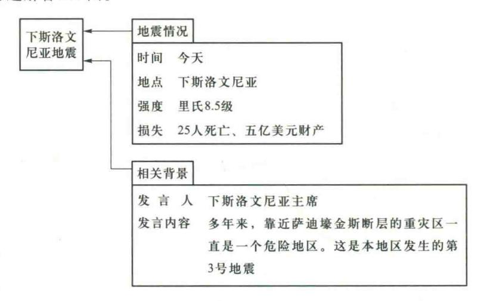

#### 习题解答 2.5 图

2.6 (1) IF 
$$x_1 = 0$$
 AND  $x_2 = 0$  THEN  $y = 0$ 
IF  $x_1 = 0$  AND  $x_2 = 1$  THEN  $y = 1$ 
IF  $x_1 = 1$  AND  $x_2 = 0$  THEN  $y = 1$ 
IF  $x_1 = 1$  AND  $x_2 = 1$  THEN  $y = 0$ 
(2) IF 发烧 AND 呕吐 AND 黄疸 THEN 肝炎 0.7

2.7 见习题解答 2.7 图。

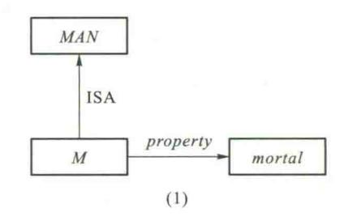

{2}------------------------------------------------

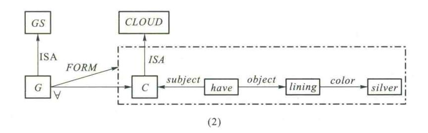

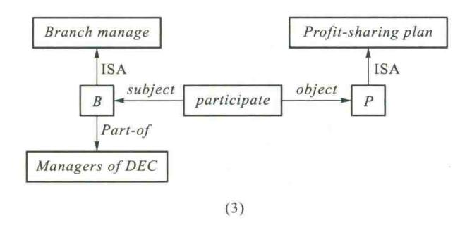

习题解答 2.7 图

#### 2.8 见习题解答 2.8 图。

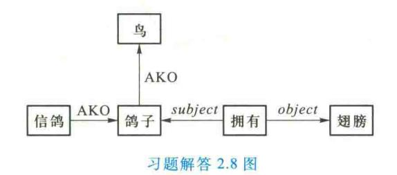

#### 2.9 见习题解答 2.9 图。

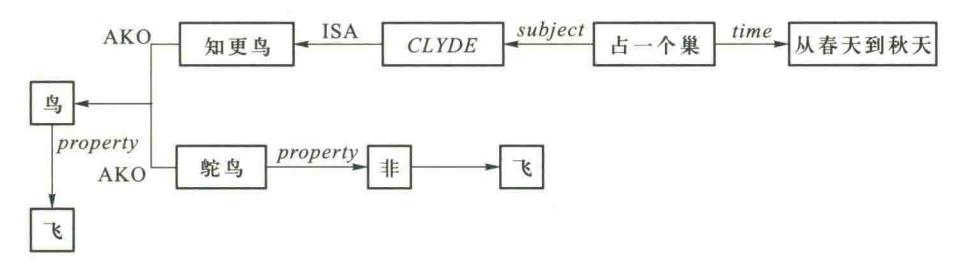

习题解答 2.9 图

{3}------------------------------------------------

### 2.10 见习题解答 2.10 图。

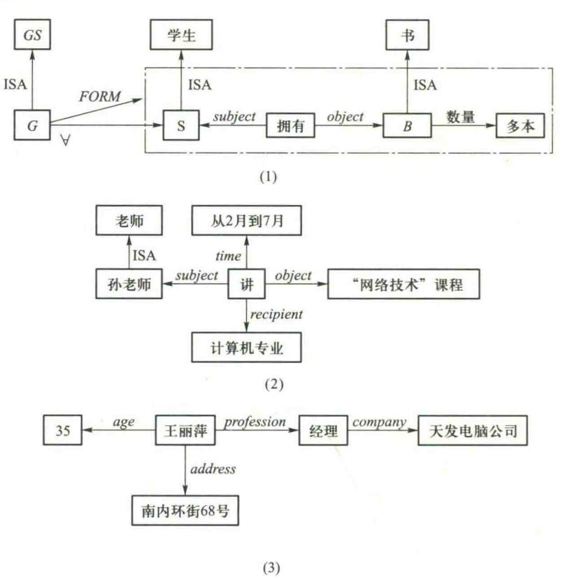

习题解答 2.10 图

#### 2.11 见习题解答 2.11 图。

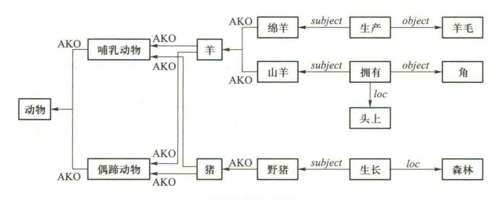

习题解答 2.11 图

{4}------------------------------------------------

### 第3章习题解答

3.1 因为

A,  $A \rightarrow C \Rightarrow C$  P 规则及假言推理 B,  $C \Rightarrow B \land C$  引入合取词  $B \land C$ ,  $B \land C \rightarrow D \Rightarrow D$  T 规则及假言推理 D,  $D \rightarrow Q \Rightarrow Q$  T 规则及假言推理

所以 0 为真

3.2 移动否定符号,得

$$\forall x \exists y \forall z \exists w (\neg P(x,y,z,w))$$

设 y 的 Skolem 函数是 f(x), w 的 Skolem 函数是 g(x,z),则

$$\forall x \forall z (\neg P(x, f(x), z, g(x, z)))$$

略去全称量词,得不含量词的子句为: $\neg P(x,f(x),z,g(x,z))$ 

3.3 消去存在量词,得 $(\forall y)[(\forall z)P(b,z)\rightarrow R(b,y,f(a))]$ 

消去蕴含符号,得 $(\forall y)$ [ $\neg (\forall z)P(b,z) \lor R(b,y,f(a))$ ]

$$(\forall y)[(\exists z)(\neg P(b,z)) \lor R(b,y,f(a))]$$

设 z 的 Skolem 函数是 g(y),则( $\forall y$ )[ $\neg P(b,g(y)) \lor R(b,y,f(a))$ ]

**3.4** (1) 
$$(\forall z) (\forall y) (P(z,y) \land Q(z,y))$$

其子句集为: P(z,y), Q(u,v)

$$(2) (\forall x) (\forall y) (P(x,y) \rightarrow Q(x,y))$$

$$\neg P(x,y) \lor Q(x,y)$$

其子句集为: $\neg P(x,y) \lor Q(x,y)$ 

(3) 
$$(\forall x)(\exists y)(\neg (P(x,y) \lor Q(x,y)) \lor R(x,y))$$
  
 $(\forall x)(\exists y)(\neg (P(x,y) \land \neg Q(x,y)) \lor R(x,y))$   
 $(\forall x)(\exists y)(\neg P(x,y) \lor R(x,y)) \land (\neg Q(x,y) \lor R(x,y))$ 

 $\Rightarrow y = f(x)$ 

$$(\forall x)((\neg P(x,f(x)) \lor R(x,f(x))) \land (\neg Q(x,f(x)) \lor R(x,f(x))))$$
$$(\neg P(x,f(x)) \lor R(x,f(x))) \land (\neg Q(x,f(x)) \lor R(x,f(x)))$$

其子句集为:
$$\{\neg P(x,f(x)) \lor R(x,f(x)), \neg Q(x,f(x)) \lor R(x,f(x))\}$$
  
 $\{\neg P(x,f(x)) \lor R(x,f(x)), \neg Q(y,f(y)) \lor R(y,f(y))\}$ 

$$(4) (\forall x) (\forall y) ((\neg P(x,y) \land \neg Q(x,y)) \lor R(x,y) | \neg P(x,y) \lor R(x,y), \neg Q(u,v) \lor R(u,v) |$$

$$(5) \ (\ \forall \ x) \ (\ \forall \ y) \ (\ \exists \ z) \ (\neg \ P(\ x,y) \ \lor \ (\ Q(\ x,y) \ \lor R(\ x,z) \ )\ )$$

 $\Leftrightarrow z = f(x, y)$ 

{5}------------------------------------------------

$$(\forall x) (\forall y) (\neg P(x,y) \lor Q(x,y) \lor R(x,f(x,y)))$$
  
$$\neg P(x,y) \lor Q(x,y) \lor R(x,f(x,y))$$

其子句集为: $\neg P(x,y) \lor Q(x,y) \lor R(x,f(x,y))$ 

(6)  $(\exists x)(\exists y)(\forall z)(\exists u)(\forall v)(\exists w)(P(x,y,z,u,v,w) \land (Q(x,y,z,u,v,w) \lor \neg R(x,z,w)))$ 

由于存在量词 x, y, 不在任何全称量词范围内, 故可直接消去原式

$$(\forall z)(\exists u)(\forall v)(\exists w)P(a,b,z,u,v,w) \land (Q(a,b,z,u,v,w) \lor \neg R(a,z,w))$$

利用 Skolem 函数,设 w=f(z,v), u=g(z),得

$$\begin{array}{l} (\ \forall \, z) \, (\ \forall \, v) \, (\, P(\, a \, , b \, , z \, , g(\, z) \, \, , v \, , f(\, z \, , v) \, \, ) \, \, \wedge \\ (\, Q(\, a \, , b \, , z \, , g(\, z) \, \, , v \, , f(\, z \, , v) \, \, ) \, \, \vee \, \neg \, \, R(\, x \, , z \, , f(\, z \, , v) \, \, ) \, \, ) \\ P(\, a \, , b \, , z \, , g(\, z) \, \, , v \, , f(\, z \, , v) \, \, ) \, \, \wedge \, \, (\, Q(\, a \, , b \, , z \, , g(\, z) \, \, , v \, , f(\, z \, , v) \, \, ) \, \, \vee \, \neg \, \, R(\, x \, , z \, , f(\, z \, , v) \, \, ) \, \, ) \\ \end{array}$$

其子句集为:

$$|P(a,b,z,g(z),v,f(z,v)),Q(a,b,z,g(z),v,f(z,v)) \vee \neg R(a,z,f(z,v)) |$$

$$(7) (\forall x)((\forall y)P(x,y)\rightarrow \neg (\forall y)(Q(x,y)\rightarrow R(x,y)))$$

$$(\forall x)(\neg (\forall y)P(x,y) \vee \neg (\forall y)(Q(x,y)\rightarrow R(x,y)))$$

$$(\forall x)(\neg (\forall y)P(x,y) \vee \neg (\forall y)(\neg Q(x,y) \vee R(x,y)))$$

$$(\forall x)((\exists y)\neg P(x,y) \vee (\exists y)(Q(x,y) \wedge \neg R(x,y)))$$

重新命名变元代人 z 有

$$(\ \forall \ x) \ ((\ \exists \ y) \ \neg \ P(\ x,y) \ \lor \ (\ \exists \ z) \ (\ Q(\ x,z) \ \land \ \neg \ R(\ x,z) \ ))$$

引入 Skolem 函数, 令 y=f(x), z=g(x)

$$(\forall x) (\neg P(x,f(x)) \lor (Q(x,g(x)) \land \neg R(x,g(x))))$$

$$\neg P(x,f(x)) \lor (Q(x,g(x)) \land \neg R(x,g(x)))$$

$$(\neg P(x,f(x)) \lor Q(x,g(x))) \land (\neg P(x,f(x)) \lor \neg R(x,g(x)))$$

其子句集为: $\{\neg P(x,f(x)) \lor Q(x,g(x)), \neg P(y,f(y)) \lor \neg R(y,g(y))\}$ 

- 3.5 (1) -P 与 P 归结得 NIL, 故子句集不可满足。
- (2)  $P \lor Q$  与  $P \lor \neg Q$  归结得  $P; \neg P \lor Q$  与  $\neg P \lor \neg Q$  归结得  $\neg P \lor \neg P$  归结得  $\neg P \lor \neg P$  归结得  $\neg P \lor \neg P$  归结得  $\neg P \lor \neg P$  归结得  $\neg P \lor \neg P$  归结得  $\neg P \lor \neg P$  归结得  $\neg P \lor \neg P$  归结得  $\neg P \lor \neg P$  归结得  $\neg P \lor \neg P$  归结得  $\neg P \lor \neg P$  归结得  $\neg P \lor \neg P$  归结得  $\neg P \lor \neg P$  归结得  $\neg P \lor \neg P$  归结得  $\neg P \lor \neg P$  归结得  $\neg P \lor \neg P$  归结得  $\neg P \lor \neg P$  归结得  $\neg P \lor \neg P$  归结得  $\neg P \lor \neg P$  归结得  $\neg P \lor \neg P$  归结得  $\neg P \lor \neg P$  归结得  $\neg P \lor \neg P$  归结得  $\neg P \lor \neg P$  归结得  $\neg P \lor \neg P$  归结得  $\neg P \lor \neg P$  归结得  $\neg P \lor \neg P$  归结得  $\neg P \lor \neg P$  归结得  $\neg P \lor \neg P$  归结得  $\neg P \lor \neg P$  归结得  $\neg P \lor \neg P$  归结得  $\neg P \lor \neg P$  归结得  $\neg P \lor \neg P$  归结得  $\neg P \lor \neg P$  归结得  $\neg P \lor \neg P$  归结得  $\neg P \lor \neg P$  归结得  $\neg P \lor \neg P$  归结得  $\neg P \lor \neg P$  归结得  $\neg P \lor \neg P$  归结得  $\neg P \lor \neg P$  归结得  $\neg P \lor \neg P$  归结得  $\neg P \lor \neg P$  归结得  $\neg P \lor \neg P$  归结得  $\neg P \lor \neg P$  归结得  $\neg P \lor \neg P$  归结得  $\neg P \lor \neg P$  归结得  $\neg P \lor \neg P$  归结得  $\neg P \lor \neg P$  归结得  $\neg P \lor \neg P$  归结得  $\neg P \lor \neg P$  归结得  $\neg P \lor \neg P$  归结得  $\neg P \lor \neg P$  归结得  $\neg P \lor \neg P$  归结得  $\neg P \lor \neg P$  归结得  $\neg P \lor \neg P$  归结得  $\neg P \lor \neg P$  归结得  $\neg P \lor \neg P$  归结得  $\neg P \lor \neg P$  归结得  $\neg P \lor \neg P$  归结得  $\neg P \lor \neg P$  归结得  $\neg P \lor \neg P$  归结得  $\neg P \lor \neg P$  归结得  $\neg P \lor \neg P$  归结得  $\neg P \lor \neg P$  归结得  $\neg P \lor \neg P$  归结得  $\neg P \lor \neg P$  归结得  $\neg P \lor \neg P$  归结得  $\neg P \lor \neg P$  归结得  $\neg P \lor \neg P$  归结得  $\neg P \lor \neg P$  归结得  $\neg P \lor \neg P$  归结得  $\neg P \lor \neg P$  归结得  $\neg P \lor \neg P$  归结得  $\neg P \lor \neg P$  归结得  $\neg P \lor \neg P$  归结得  $\neg P \lor \neg P$  归结得  $\neg P \lor \neg P$  归结得  $\neg P \lor \neg P$  归结得  $\neg P \lor \neg P$  归结得  $\neg P \lor \neg P$  归结得  $\neg P \lor \neg P$  归结得  $\neg P \lor \neg P$  归待  $\neg P \lor \neg P$  归待  $\neg P \lor \neg P$  归待  $\neg P \lor \neg P$  归待  $\neg P \lor \neg P$  归待  $\neg P \lor \neg P$  归待  $\neg P \lor \neg P$  归待  $\neg P \lor \neg P$  归待  $\neg P \lor \neg P$  归待  $\neg P \lor \neg P$  归待  $\neg P \lor \neg P$  归待  $\neg P \lor \neg P$  归待  $\neg P \lor \neg P$  归待  $\neg P \lor \neg P$  归待  $\neg P \lor \neg P$  归待  $\neg P \lor \neg P$   $\neg P \lor \neg P$   $\neg P \lor \neg P$   $\neg P \lor \neg P$   $\neg P \lor \neg P$   $\neg P \lor \neg P$   $\neg P \lor \neg P$   $\neg P \lor \neg P$   $\neg P \lor \neg P$   $\neg P \lor \neg P$   $\neg P \lor \neg P$   $\neg P \lor \neg P$   $\neg P \lor \neg P$   $\neg P \lor \neg P$   $\neg P \lor \neg P$   $\neg P \lor \neg P$   $\neg P \lor \neg P$   $\neg P \lor \neg P$   $\neg P \lor \neg P$   $\neg P \lor \neg P$   $\neg P \lor \neg P$   $\neg P \lor \neg P$   $\neg P \lor \neg P$   $\neg P \lor \neg P$   $\neg P \lor \neg P$   $\neg P \lor \neg P$   $\neg P \lor \neg P$   $\neg P \lor \neg P$   $\neg P \lor \neg P$   $\neg P \lor \neg P$   $\neg P \lor \neg P$   $\neg P \lor \neg P$   $\neg P \lor \neg P$   $\neg P \lor \neg P$   $\neg P \lor \neg P$   $\neg P \lor \neg P$   $\neg P \lor \neg P$   $\neg P \lor \neg P$   $\neg P \lor \neg P$   $\neg P \lor \neg P$   $\neg P \lor \neg P$   $\neg P$ 
  - (3) 由于存在 R(a),不可能归结出空子句,所以该子句集是可满足的。
- (4) P(a)与¬ P(y)  $\forall$  R(y) 归结得 R(a); S(a)与¬ S(z)  $\forall$  ¬ R(z) 归结得¬ R(a); R(a)与¬ R(a) 归结得 NIL, 故子句集不可满足。
- (5) R(b)与¬ R(z)  $\forall$  L(a,z) 归结得 L(a,b); P(a)与¬ P(x)  $\forall$ ¬ Q(y)  $\forall$ ¬ L(x,y) 归结得 ¬ Q(y)  $\forall$ ¬ L(a,y), 与 Q(b) 归结得¬ L(a,b), 再与 L(a,b) 归结得 NIL, 故子句集不可满足。
- **3.6** (1)  $F_1$ 的子句集为 P(a,b)。¬G的子句集为¬P(x,b),归结得 NIL,故 G为  $F_1$ 的逻辑结论。
  - (2)  $F_1$ 的子句集为 $\{P(x),Q(a) \lor Q(b)\}; \neg G$ 的子句集为 $\{\neg P(x) \lor \neg Q(x)\}; Q(a) \lor$

{6}------------------------------------------------

Q(b)与 $\neg P(x)$   $\forall \neg Q(x)$  归结得 $\neg P(b)$ ; 再与 P(x) 归结得 NIL, 故 G 为 F, 的逻辑结论。

- (3)  $F_1$ 的子句集为 $\{P(f(a)), Q(f(b))\}; \neg G$ 的子句集为 $\{\neg P(f(a)) \lor \neg P(y) \lor \neg Q(y)\}; P(f(a)) \ominus \{\neg P(f(a)) \lor \neg P(y) \lor \neg Q(y)\}$ 归结得 $\neg P(y) \lor \neg Q(y);$ 再与Q(f(b))归结得 $\neg P(f(b));$ 再与P(f(a))归结得 $\neg P(f(b))$ ;
- (4)  $F_1$ 化为子句集:① ¬ P(x)  $\forall$  ¬ Q(y)  $\forall$  ¬ L(x,y);把  $F_2$ 化为子句集并更换变量后为:② P(a),③ ¬ R(y)  $\forall$  L(a,y);对 ¬ G 化为子句集并进行变量代换,得到其子句集:④ R(b),⑤ Q(b)。

对得到的子句集进行归结:②与①进行归结得⑥¬Q(y) ∨¬L(a,y);⑥与③进行归结得 ⑦¬R(y) ∨¬Q(y);⑦与④进行归结得⑧¬Q(b);⑧与⑤进行归结得 NIL,故可得证 G 为 F1的逻辑结论。

- (5) 将  $F_1, F_2, \neg G$  化为子句集有:  $F_1: \{\neg P(x) \lor Q(x), \neg P(x) \lor R(x)\}; F_2: \{P(a), S(a)\}; \neg G: \neg S(z) \lor \neg R(z)$
- 对子句进行归结:S(a)与¬S(z)  $\forall$ ¬R(z) 进行归结得¬R(a);与¬P(x)  $\forall$  R(x) 进行归结得¬P(a);与P(a) 进行归结得 NIL,故 G 为  $F_1$ 、 $F_2$ 的逻辑结论。
- (6) 化为子句集:  $F_1$ : 令 y = f(z),① ¬  $A(z) \lor B(z) \lor D(z, f(z))$ ,② ¬  $A(u) \lor B(u) \lor C(f(u))$ ; $F_2$ :③ E(a) ④ A(a) ⑤ ¬  $D(a,v) \lor E(v)$ ; $F_3$ :⑥ ¬  $E(p) \lor$  ¬ B(p);⑦ ¬ G: ¬  $E(t) \lor$  ¬ C(t)。对得到的子句集进行归结:③和⑥归结得⑧ ¬ B(a);⑧和②归结得⑨ ¬  $A(a) \lor C(f(a))$ ;⑨和④归结得⑩ C(f(a));⑩和⑦归结得⑪ ¬ E(f(a));⑧和①归结得⑫ ¬  $A(a) \lor D(a, f(a))$ ;⑫和 ④归结得⑬ D(a, f(a));⑬和⑤归结得⑭ E(f(a));⑪和⑭归结得 NIL。故可证: $G 为 F_1, F_2$ 和  $F_3$ 的 逻辑结论。
- 3.7 定义谓词:R(x)表示 x 能够阅读;L(x)表示 x 有文化;D(x)表示 x 是海豚;I(x)表示 x 有智能。将前提和结论表示为谓词公式: $(\forall x)(R(x) \to L(x));(\forall y)(D(y) \to \neg L(y));(\exists z) \cdot (D(z) \land I(z));(\exists w)(I(w) \land \neg R(w))$ 。

将前提的谓词公式和结论的谓词公式的否定式化为子句集为: ① ¬  $R(x) \lor L(x)$ ; ② ¬  $D(y) \lor ¬ L(y)$ ; ③ D(a); ④ I(a); ⑤ ¬  $I(w) \lor R(w)$ 。

对得到的子句集进行归结:⑤与④归结得⑥R(a);⑥与①归结得⑦L(a);⑦与②归结得  $8 \neg D(a)$ ;⑧与③归结得  $NIL_o$ 

3.8 定义谓词:S(x,y)表示 x 储蓄 y;M(x)表示 x 是钱;I(x)表示 x 是利息;E(x,y)表示 x 获得 y。

将前提表示为谓词公式:( $\forall x$ )(( $\exists y$ )( $S(x,y) \land M(y)$ ) $\rightarrow$ ( $\exists y$ )( $I(y) \land E(x,y)$ ));化为子句集:① ¬ $S(x,y) \lor \neg M(y) \lor I(f(x))$ ;② ¬ $S(x,y) \lor \neg M(y) \lor E(x,f(x))$ 。

将结论表示为谓词公式:¬(∃x)I(x)→(∀x)(∀y)(M(y)→¬S(x,y));化为子句集: ③¬I(z);④S(a,b);⑤M(b)。

①与④归结得⑥¬ $M(b) \lor I(f(a))$ ;⑥与⑤归结得⑦I(f(a));⑦与③归结得NIL。

3.9 定义谓词:U(x,y):x使用y;E(u,v):u得到v;I(z):z是 Internet;F(u):u是信息。

{7}------------------------------------------------

把已知前提表示成谓词公式: $F:(\forall x)((\exists y)(U(x,y) \land I(y)) \rightarrow (\exists u)(F(u) \land E(x,u)))$ 。化为子句集:① ¬  $U(x,y) \lor \neg I(y) \lor F(f(x))$ ;② ¬  $U(x,y) \lor \neg I(y) \lor E(x,f(x))$ 。

把待求证的结论表示成谓词公式并否定得 $\neg G: \neg (\neg (\exists u) F(u) \rightarrow (\forall x) (\forall y) (I(y) \rightarrow \neg U(x,y)));$ 化为子句集:③  $\neg F(u);$ ④ I(b);⑤ U(a,b)。

进行归结:①与④归结得⑥¬ $U(x,b) \lor F(f(x))$ ;⑤与⑥归结得⑦F(f(a));⑦与③归结得⑧NIL。

**3.10** 把前提表示为谓词公式:  $F_1$ :  $\forall x \forall y \forall z (F(x,y) \land F(y,z) \rightarrow G(x,z))$ ;  $F_2$ : F(Lao, Da);  $F_3$ : F(Da, Xiao)。

求其子句集如下:①  $\neg F(x,y) \lor \neg F(y,z) \lor G(x,z)$ ;② F(Lao,Da);③ F(Da,Xiao)。

设求证的公式为  $G:\exists x\exists yG(x,y)$  (即存在 x 和 y,x 是 y 的祖父);把其否定化为子句形式再析取一个答案谓词 ANSWER(x,y),得④¬  $G(u,v) \lor ANSWER(u,v)$ 

对①~④进行归结,得⑤¬ $F(Da,z) \lor G(Lao,z)$ ,(1),(2), $\{Lao/x,Da/y\}$ ;⑥G(Lao,Xiao),③,⑤ $\{Xiao/z\}$ ;⑦ANSWER(Lao,Xiao),④,⑥ $\{Lao/u,Xiao/v\}$ 。所以,上述人员中,老李是小李的祖父。

**3.11** 定义谓词:AT(y,x):y 在 x 处。把已知前提及待求解的问题表示成谓词公式: $F_1$ :  $(\forall x)(AT(Zhang,x) \rightarrow AT(Li,x))$ ; $F_2$ :AT(Zhang,School)。把待求解的问题表示成谓词公式,并把它否定后与谓词 ANSWER(x) 析取,得 G: $\neg (\exists x) AT(Li,x) \lor ANSWER(x)$ 。化为子句集:①  $\neg AT(Zhang,x) \lor AT(Li,x)$ ;② AT(Zhang,School);③  $\neg AT(Li,x) \lor ANSWER(x)$ 。

应用归结原理进行归结:①与②归结得④AT(Li,School);④与③归结得⑤ANSWER(School)。由 ANSWER(School)得知小李在学校。

**3.12** 定义谓词:A(x):x 是 *ALPINE* 的一个成员;B(x):x 是滑雪运动员;C(x):x 是登山运动员;L(x,y):x 喜欢 y。

将前提表示成谓词公式:A(TONY),A(MIKE),A(JOHN);( $\forall x$ )( $A(x) \rightarrow [B(x) \land \neg C(x)] \lor [\neg B(x) \land C(x)]$ );( $\forall x$ )( $C(x) \rightarrow \neg L(x,Rain)$ );( $\forall x$ )( $\neg L(x,Snow) \rightarrow \neg B(x)$ );( $\forall x$ )( $L(TON-Y,x) \rightarrow \neg L(MIKE,x)$ );( $\forall x$ )( $\neg L(TONY,x) \rightarrow L(MIKE,x)$ );L(TONY,Rain);L(TONY,Snow)

将前提化为子句集:① A(TONY);② A(MIKE);③ A(JOHN);④  $\neg A(x) \lor B(x) \lor \neg B(x)$ ;

- $\bigcirc$   $\neg A(x) \lor B(x) \lor C(x); \bigcirc$   $\neg A(x) \lor \neg B(x) \lor \neg C(x); \bigcirc$   $\neg A(x) \lor \neg C(x) \lor C(x)$
- $\textcircled{8} \ \neg \ C(x) \ \lor \neg \ L(x,Rain) \ ; \textcircled{9} \ L\left(x,Rain\right) \ \lor \neg \ B\left(x\right); \textcircled{10} \ \neg \ L\left(\textit{TONY},x\right) \ \lor \neg \ L\left(\textit{MIKE},x\right);$
- 1  $L(TONY,x) \lor L(MIKE,x); \textcircled{1} L(TONY,Rain); \textcircled{1} L(TONY,Snow)$

将待求解的问题表示成谓词公式,然后否定,并与答案谓词析取:¬ $(A(x) \land C(x) \land \neg B(x)) \lor ANSWER(x)$ 。化为子句集: $(A \cap A(x) \lor \neg C(x) \lor B(x) \lor ANSWER(x)$ 。

归结过程如下: ⑩与⑫归结得⑮¬L(MIKE,Rain); ⑮与⑨归结得⑯¬B(MIKE); ⑯与⑤归结得⑰¬A(MIKE) ∨ C(MIKE); ⑰与②归结得 ⑱C(MIKE); ⑱与⑭归结得⑲¬A(MIKE) ∨ B(MIKE) ∨ ANSWER(MIKE); ⑲与②归结得⑳B(MIKE) ∨ ANSWER(MIKE); ㉑与⑯归结得ANSWER(MIKE)。

{8}------------------------------------------------

因此, MIKE 是 ALPINE 俱乐部的一个成员, 他是一个登山运动员, 但不是一个滑雪运动员。

### 第4章习题解答

4.1

(1)

$$P(H_{1} | E_{1}) = \frac{P(H_{1})P(E_{1} | H_{1})}{P(H_{1})P(E_{1} | H_{1}) + P(H_{2})P(E_{1} | H_{2}) + P(H_{3})P(E_{1} | H_{3})}$$

$$= \frac{0.4 \times 0.5}{0.4 \times 0.5 + 0.3 \times 0.3 + 0.3 \times 0.5}$$

$$= 0.45$$

$$P(H_{2} | E_{1}) = \frac{P(H_{2})P(E_{1} | H_{2})}{P(H_{1})P(E_{1} | H_{1}) + P(H_{2})P(E_{1} | H_{2}) + P(H_{3})P(E_{1} | H_{3})}$$

$$= \frac{0.3 \times 0.3}{0.4 \times 0.5 + 0.3 \times 0.3 + 0.3 \times 0.5}$$

$$= 0.20$$

$$P(H_{3} | E_{1}) = \frac{P(H_{3})P(E_{1} | H_{3})}{P(H_{1})P(E_{1} | H_{1}) + P(H_{2})P(E_{1} | H_{2}) + P(H_{3})P(E_{1} | H_{3})}$$

$$= \frac{0.3 \times 0.5}{0.4 \times 0.5 + 0.3 \times 0.5}$$

$$P(H_3 \mid E_1) = \frac{P(H_3)P(E_1 \mid H_3)}{P(H_1)P(E_1 \mid H_1) + P(H_2)P(E_1 \mid H_2) + P(H_3)P(E_1 \mid H_3)}$$

$$= \frac{0.3 \times 0.5}{0.4 \times 0.5 + 0.3 \times 0.3 + 0.3 \times 0.5}$$

$$= 0.34$$

经比较可知, $E_1$ 的出现, $H_1$ 和 $H_3$ 成立的可能性略有增加, $H_2$ 成立的可能性略有下降。 (2)

$$\begin{split} P(H_1 \mid E_1 E_2) &= \frac{P(H_1) P(E_1 \mid H_1) P(E_2 \mid H_1)}{P(H_1) P(E_1 \mid H_1) P(E_2 \mid H_1) + P(H_2) P(E_1 \mid H_2) P(E_2 \mid H_2) + P(H_3) P(E_1 \mid H_3) P(E_2 \mid H_3)} \\ &= \frac{0.4 \times 0.5 \times 0.7}{0.4 \times 0.5 \times 0.7 + 0.3 \times 0.3 \times 0.9 + 0.3 \times 0.5 \times 0.1} \\ &= \frac{0.14}{0.14 + 0.081 + 0.015} \\ &= \frac{0.14}{0.236} \\ &= 0.593 \ 2 \\ P(H_2 \mid E_1 E_2) &= \frac{0.081}{0.236} \\ &= 0.343 \ 2 \end{split}$$

{9}------------------------------------------------

$$P(H_3 \mid E_1 E_2) = \frac{0.015}{0.236}$$
$$= 0.063 6$$

经比较可知, $E_1$ 和  $E_2$ 同时出现, $H_1$ 成立的可能性显著增加, $H_2$ 成立的可能性略有增加, $H_3$ 成立的可能性显著下降。

**4.2** 因为  $LN_2=1$ ,所以  $E_2$  不存在时,不会对  $H_2$ 的结果产生影响,不必计算  $P(H_2 \mid \neg E_2)$ 。 又因为  $LS_3=1$ ,所以  $E_3$ 存在时,不会对  $H_3$ 的结果产生影响,不必计算  $P(H_3 \mid E_3)$ 。剩余的值计算如下:

$$\begin{split} P(H_1 \mid E_1) &= \frac{LS_1 \times P(H_1)}{(LS_1 - 1) \times P(H_1) + 1} = \frac{100 \times 0.02}{(100 - 1) \times 0.02 + 1} = 0.67 \\ P(H_1 \mid \neg E_1) &= \frac{LN_1 \times P(H_1)}{(LN_1 - 1) \times P(H_1) + 1} = \frac{0.1 \times 0.02}{(0.1 - 1) \times 0.02 + 1} = 0.002 \\ P(H_2 \mid E_2) &= \frac{LS_2 \times P(H_2)}{(LS_2 - 1) \times P(H_2) + 1} = \frac{15 \times 0.4}{(15 - 1) \times 0.4 + 1} = 0.91 \\ P(H_3 \mid \neg E_3) &= \frac{LN_3 \times P(H_3)}{(LN_3 - 1) \times P(H_3) + 1} = \frac{0.05 \times 0.06}{(0.05 - 1) \times 0.06 + 1} = 0.003 \end{split}$$

**4.3** (1) 先计算  $O(H_2 | S_1, S_2)$ 

$$O(H_1) = \frac{P(H_1)}{1 - P(H_1)} = \frac{0.1}{1 - 0.1} = \frac{1}{9}$$

$$O(H_2) = \frac{P(H_2)}{1 - P(H_2)} = \frac{0.01}{1 - 0.01} = \frac{1}{99}$$

$$P(H_1 \mid E_1) = \frac{O(H_1 \mid E_1)}{1 + O(H_1 \mid E_1)} = \frac{LS_1 \times O(H_1)}{1 + LS_1 \times O(H_1)} = \frac{2 \times \frac{1}{9}}{1 + 2 \times \frac{1}{9}} = \frac{2}{11}$$

而  $C(E_1 \mid S_1) = 3 > 0$ , 故先用 CP 公式的后半部分,则

$$P(H_1 \mid S_1) = P(H_1) + [P(H_1 \mid E_1) - P(H_1)] \times \frac{1}{5}C(E_1 \mid S_1)$$

$$= 0.1 + (\frac{2}{11} - 0.1) \times \frac{1}{5} \times 3 = 0.149$$

$$O(H_1 \mid S_1) = \frac{P(H_1 \mid S_1)}{1 - P(H_1 \mid S_1)} = \frac{0.149}{1 - 0.149} = 0.175$$

同理

{10}------------------------------------------------

$$P(H_1 \mid E_2) = \frac{100 \times \frac{1}{9}}{1 + 100 \times \frac{1}{9}} = \frac{100}{109}$$

又因  $C(E_2 | S_2) = 1 > 0$ ,故先用 CP 公式的后半部分,则

$$\begin{split} P(H_1 \mid S_2) &= P(H_1) + [P(H_1 \mid E_2) - P(H_1)] \times \frac{1}{5}C(E_2 \mid S_2) \\ &= 0.1 + \left(\frac{100}{109} - 0.1\right) \times \frac{1}{5} \times 1 = 0.263 \ 5 \\ O(H_1 \mid S_2) &= \frac{0.263 \ 5}{1 - 0.263 \ 5} = 0.357 \ 8 \end{split}$$

因为 
$$O(H_1 \mid S_1, S_2) = \frac{O(H_1 \mid S_1)}{O(H_1)} \times \frac{O(H_1 \mid S_2)}{O(H_1)} \times O(H_1)$$

$$= \frac{0.175}{\frac{1}{9}} \times \frac{0.357 \text{ 8}}{\frac{1}{9}} \times \frac{1}{9} = 0.563 \text{ 5}$$

又因为  $O(H_1 \mid S_1, S_2) > O(H_1)$ , 故先用 EH 公式的后半部分,则

$$P(H_2 \mid S_1, S_2) = P(H_2) + \frac{P(H_1 \mid S_1, S_2) - P(H_1)}{1 - P(H_1)} \times [P(H_2 \mid H_1) - P(H_2)]$$

其中

$$P(H_1 \mid S_1, S_2) = \frac{O(H_1 \mid S_1, S_2)}{1 + O(H_1 \mid S_1, S_2)} = \frac{0.563 \text{ 5}}{1 + 0.563 \text{ 5}} = 0.360$$

$$P(H_2 \mid H_1) = \frac{O(H_2 \mid H_1)}{1 + O(H_2 \mid H_1)} = \frac{LS_4 \times O(H_2)}{1 + LS_4 \times O(H_2)}$$

$$= \frac{50 \times \frac{1}{99}}{1 + 50 \times \frac{1}{99}} = 0.336$$

所以 
$$P(H_2 \mid S_1, S_2) = 0.01 + \frac{0.360 - 0.1}{1 - 0.1} \times [0.336 - 0.01] = 0.104$$

故 
$$O(H_2 \mid S_1, S_2) = \frac{0.104}{1 - 0.104} = 0.116$$

(2) 再计算  $P(H_2 | S_3)$  的值

由  $C(E_3 | S_3) = 2 > 0$  可得,取 CP 公式的后半部分,则

$$P(H_2 \mid S_3) = P(H_2) + [P(H_2 \mid E_3) - P(H_2)] \times \frac{1}{5}C(E_3 \mid S_3)$$

{11}------------------------------------------------

其中

$$P(H_2 \mid E_3) = \frac{O(H_2 \mid E_3)}{1 + O(H_2 \mid E_3)} = \frac{LS_3 \times O(H_2)}{1 + LS_3 \times O(H_2)} = \frac{200 \times \frac{1}{99}}{1 + 200 \times \frac{1}{99}} = 0.669$$

所以

$$P(H_2 \mid S_3) = 0.01 + [0.669 - 0.01] \times \frac{1}{5} \times 2 = 0.274$$
  
 $O(H_2 \mid S_3) = \frac{0.274}{1 - 0.274} = 0.377$ 

(3) 最后计算  $P(H_2 | S_1, S_2, S_3)$  的值

$$O(H_2 \mid S_1, S_2, S_3) = \frac{O(H_2 \mid S_1, S_2)}{O(H_2)} \times \frac{O(H_2 \mid S_3)}{O(H_2)} \times O(H_2)$$

$$= \frac{0.116}{\frac{1}{99}} \times \frac{0.377}{\frac{1}{99}} \times \frac{1}{99} = 4.329$$

得最后结果

$$P(H_2 \mid S_1, S_2, S_3) = \frac{O(H_2 \mid S_1, S_2, S_3)}{1 + O(H_2 \mid S_1, S_2, S_3)} = \frac{4.329}{1 + 4.329} = 0.812$$

**4.4** 当 E1必然发生时, P(H | S) = P(H | E)

所以 
$$O(H|S) = O(H|E)$$

所以 
$$O(H \mid S_1, S_2, \dots, S_n) = \frac{O(H \mid E_1)}{O(H)} \times \frac{O(H \mid E_2)}{O(H)} \times \dots \times \frac{O(H \mid E_n)}{O(H)} \times O(H)$$
又因为  $P(H \mid E_1) = \frac{LS_1 \times P(H)}{(LS_1 - 1) \times P(H) + 1} = \frac{2 \times 0.06}{(2 - 1) \times 0.06 + 1} = 0.113 \ 2$ 
 $O(H \mid E_1) = \frac{0.113 \ 2}{1 - 0.113 \ 2} = 0.127 \ 65$ 
 $P(H \mid E_2) = \frac{LS_2 \times P(H)}{(LS_2 - 1) \times P(H) + 1} = \frac{20 \times 0.06}{(20 - 1) \times 0.06 + 1} = 0.561$ 
 $O(H \mid E_2) = \frac{0.561}{1 - 0.561} = 1.276$ 
 $P(H \mid E_3) = \frac{LS_3 \times P(H)}{(LS_3 - 1) \times P(H) + 1} = \frac{65 \times 0.06}{(65 - 1) \times 0.06 + 1} = 0.806$ 
 $O(H \mid E_3) = \frac{0.806}{1 - 0.806} = 4.149$ 
 $P(H \mid E_4) = \frac{LS_4 \times P(H)}{(LS_4 - 1) \times P(H) + 1} = \frac{3 \times 0.06}{(3 - 1) \times 0.06 + 1} = 0.161$ 

{12}------------------------------------------------

$$O(H \mid E_4) = \frac{0.161}{1 - 0.161} = 0.192$$

又因为 
$$O(H) = \frac{0.06}{1-0.06} = 0.063 8$$

所以 
$$O(H \mid S_1, S_2, S_3, S_4) = \frac{0.127}{0.063 \text{ 8}} \times \frac{1.276}{0.063 \text{ 8}} \times \frac{4.149}{0.063 \text{ 8}} \times \frac{0.192}{0.063 \text{ 8}} \times 0.063 \text{ 8} = 499$$

所以 
$$P(H \mid E_1, E_2, E_3, E_4) = \frac{499}{1+499} = 0.998$$

故当证据发生后,使结论 H 的概率大大增加。

4.5 
$$CF(E_2) = 0.6 \times \max \{0, CF(E_1)\} = 0.6 \times \max \{0, 0.5\} = 0.3$$
  
 $CF(E_4) = 0.8 \times \max \{0, CF(E_2 \text{ AND } E_3)\}$   
 $= 0.8 \times \max \{0, \min \{CF(E_2), CF(E_3)\}\}$   
 $= 0.8 \times \max \{0, 0.3\}$   
 $= 0.24$ 

$$CF_3(H) = 0.7 \times \max\{0, CF(E_4)\} = 0.7 \times \max\{0, 0.24\} = 0.168$$
  
 $CF_4(H) = 0.9 \times \max\{0, CF(E_5)\} = 0.9 \times \max\{0, 0.4\} = 0.36$ 

又因为 CF3(H)>0,CF4(H)>0,故

$$CF(H) = CF_3(H) + CF_4(H) - CF_3(H) CF_4(H)$$
  
= 0.168+0.36-0.168×0.36  
= 0.47

**4.6** 
$$CF_1(H_1) = 0.7 \times \max\{0, CF(E_1)\} = 0.7 \times \max\{0, 0.5\} = 0.35$$
  
 $CF_2(H_1) = 0.6 \times \max\{0, CF(E_2)\} = 0.6 \times \max\{0, 0.5\} = 0.3$   
 $CF_3(H_1) = 0.4 \times \max\{0, CF(E_3)\} = 0.4 \times \max\{0, 0.5\} = 0.2$   
 $CF_{1,2}(H_1) = CF_1(H_1) + CF_2(H_1) - CF_1(H_1) CF_2(H_1)$   
 $= 0.35 + 0.3 - 0.35 \times 0.3 = 0.545$ 

同理 
$$CF(H_1) = CF_{1,2,3}(H_1) = 0.2 + 0.545 - 0.545 \times 0.2 = 0.636$$
  
则  $CF_4(H_2) = 0.2 \times \max\{0, CF(H_1 \text{ AND } E_4)\}$   
 $= 0.2 \times \max\{0, \min\{CF(H_1), CF(E_4)\}\}$   
 $= 0.2 \times \max\{0, 0.5\}$   
 $= 0.1$   
 $CF(H_2) = CF_4(H_2) + CF_0(H_2) - CF_4(H_2) CF_0(H_2)$   
 $= 0.1 + 0.3 - 0.1 \times 0.3$ 

= 0.37

{13}------------------------------------------------

4.7

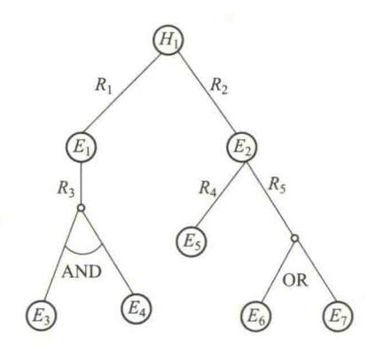

习题解答 4.7 图

由习题解答图 4.7 可知:
$$CF(E_3 \quad \text{AND} \quad E_4) = \min\{CF(E_3), CF(E_4)\} = 0.8$$
所以  $CF(E_1) = 0.9 \times \max\{0, CF(E_3 \quad \text{AND} \quad E_4)\} = 0.72$ 

$$CF(E_6 \quad \text{OR} \quad E_7) = \max\{CF(E_6), CF(E_7)\} = 0.5$$
所以  $CF_5(E_2) = (-0.3) \times \max\{0, CF(E_6 \quad \text{OR} \quad E_7)\} = (-0.3) \times \max\{0, 0.5\} = -0.15$ 

$$CF_4(E_2) = 0.7 \times \max\{0, CF(E_5)\} = 0.7 \times \max\{0, 0.8\} = 0.56$$

$$CF(E_2) = \frac{CF_5(E_2) + CF_4(E_2)}{1 - \min\{|CF_5(E_2)|, |CF_4(E_2)|\}} = \frac{0.41}{0.85} = 0.48$$

$$CF_1(H_1) = 0.8 \times \max\{0, CF(E_1)\} = 0.576$$

$$CF_2(H_1) = 0.9 \times \max\{0, CF(E_2)\} = 0.432$$
所以  $CF(H_1) = CF_1(H_1) + CF_2(H_1) - CF_1(H_1) \times CF_2(H_1) = 0.759$ 
4.8 因为  $K = 1 - \sum_{X \cap Y = \emptyset} M_1(X) M_2(Y) = \sum_{X \cap Y \neq \emptyset} M_1(X) M_2(Y)$ 

$$= M_1(\{a,b,c,d\}) M_2(\{a,b\}) + M_1(\{a,b,c,d\}) M_2(\{a,b,c,d\}) + M_1(\{a,b,c,d\}) M_2(\{a,b,c,d\}) + M_1(\{a,b,c,d\}) M_2(\{a,b\}) + M_1(\{a,b,c,d\}) M_2(\{a,b,c,d\})$$

$$= 0.7 \times 0.6 + 0.7 \times 0.4 + 0.3 \times 0.6 + 0.3 \times 0.4 = 1$$

所以 
$$M(A) = K \times \sum_{X \cap Y = A} M_1(X) M_2(Y) = \sum_{X \cap Y = A} M_1(X) M_2(Y)$$
所以  $M(b) = M_1(\{b,c,d\}) \times M_2(\{a,b\}) = 0.7 \times 0.6 = 0.42$ 
 $M(b,c,d) = M_1(\{b,c,d\}) \times M_2(\{a,b,c,d\}) = 0.7 \times 0.4 = 0.28$ 
 $M(a,b) = M_1(\{a,b,c,d\}) \times M_2(\{a,b\}) = 0.3 \times 0.6 = 0.18$ 
 $M(a,b,c,d) = M_1(\{a,b,c,d\}) \times M_2(\{a,b,c,d\}) = 0.3 \times 0.4 = 0.12$ 
 $M$  的其余基本概率分配函数为  $0$ 。

{14}------------------------------------------------

4.9

$$A \cap B = \frac{0.85 \land 0.5}{x_1} + \frac{0.7 \land 0.65}{x_2} + \frac{0.9 \land 0.8}{x_3} + \frac{0.9 \land 0.98}{x_4} + \frac{0.7 \land 0.77}{x_5}$$

$$= 0.5/x_1 + 0.65/x_2 + 0.8/x_3 + 0.9/x_4 + 0.7/x_5$$

$$A \cup B = \frac{0.85 \lor 0.5}{x_1} + \frac{0.7 \lor 0.65}{x_2} + \frac{0.9 \lor 0.8}{x_3} + \frac{0.9 \lor 0.98}{x_4} + \frac{0.7 \lor 0.77}{x_5}$$

$$= 0.85/x_1 + 0.7/x_2 + 0.9/x_3 + 0.98/x_4 + 0.77/x_5$$

$$\neg A = 0.15/x_1 + 0.3/x_2 + 0.1/x_3 + 0.1/x_4 + 0.3/x_5$$

4.10

$$A \circ B = \begin{bmatrix} 0.7 & 0.4 \\ 0.7 & 0.4 \\ 0.5 & 0.4 \end{bmatrix}$$

4.11

$$R_1 \circ R_2 = \begin{bmatrix} 0.4 & 0.8 \\ 0.4 & 0.9 \\ 0.7 & 0.5 \\ 0.7 & 0.6 \end{bmatrix}$$

4.12

$$\begin{split} R_1 \circ R_2 = \begin{bmatrix} 0.6 & 0.6 & 0.0 \\ 0.3 & 0.2 & 0.1 \\ 0.0 & 0.5 & 0.1 \end{bmatrix}; \quad R_1 \circ R_3 = \begin{bmatrix} 1.0 & 0.0 & 0.7 \\ 0.3 & 0.2 & 0.3 \\ 0.7 & 0.5 & 1.0 \end{bmatrix}; \\ R_1 \circ R_2 \circ R_3 = \begin{bmatrix} 0.6 & 0.6 & 0.6 \\ 0.3 & 0.2 & 0.3 \\ 0.1 & 0.5 & 0.1 \end{bmatrix} \end{split}$$

4.13

$$S = \begin{bmatrix} 0.8 & 0.3 & 0.2 \\ 0.3 & 0.8 & 0.7 \\ 0.3 & 0.7 & 0.8 \end{bmatrix}$$

### 第5章习题解答

**5.1** 以变量 m 和 c 表示修道士和野人在左岸和船上的实际人数,变量 b 表示船是否在左岸,b=1 表示在,b=0 表示不在。问题状态用三元组(m,c,b)表示,则问题求解的任务为:  $(3,3,1) \rightarrow (0,0,0)$ 。在这个问题上,状态空间可能的状态总数为 $4 \times 4 \times 2 = 32$ ,但由于遵守约束: $m+c \le 2$ , $m \ge c$ ,只有 20 个是合法的。例如,(1,0,1),(1,2,1),(2,3,1) 等是不合法的。

{15}------------------------------------------------

由于存在不合法的状态,导致某些合法的状态不可达,例如,(0,0,1),(0,3,1),所以这个问题只有 16 个可达的合法状态。渡河问题的操作算子可以定义两类:L(m,c)、R(m,c)分别表示船从左岸划到右岸,和船从右岸划到左岸。由于m,c取值的可能组合只有 5 个:10,20,11,01,02,所以总共有 10 个操作算子。可以画出渡河问题的状态空间的有向图,如习题解答 5.1图所示。

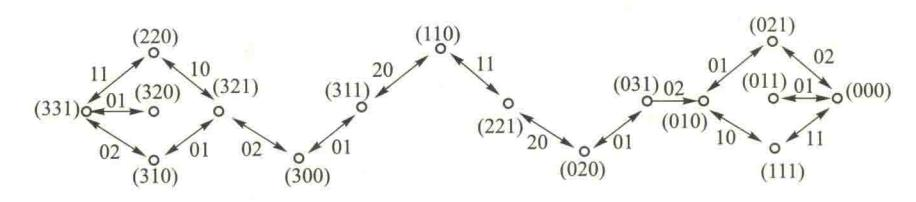

习题解答 5.1 图

#### 5.2 该系统的状态用四元数组表示

S=(农夫,狐狸,鸡,米)

0:左岸

1:右岸

允许的状态有:

初始状态: $S_0 = (0,0,0,0)$ ,  $S_1 = (1,0,1,0)$ ,  $S_2 = (0,0,1,0)$ ,  $S_3 = (1,1,1,0)$ 或(1,0,1,1),  $S_4 = (0,1,0,0)$ 或(0,0,0,1),  $S_5 = (1,1,0,1)$ ,  $S_6 = (0,1,0,1)$ 

目标状态: $S_7 = (1,1,1,1)$ 

允许操作等  $F = \{f_1, f_2, f_3, f_4\}$ 

其中 $f_1(x)$ :农夫不载物到x岸 x, y,z,p=0 左

f2(γ):农夫载鸡到γ岸:

1 右

 $f_3(z)$ :农夫载狐狸到z岸:

f4(p):农夫载米到 p 岸:

或 f(u,v):

u=0 无物 v=0 左

农夫载u到v岸

1 鸡 1 右

2 狐狸

3米

- 5.3 参见例 5.2。
- 5.4 略
- **5.5** 要证明平行四边形对应边相等只要证明对角线彼此相交后相互等分,即习题解答 5.4 图(1)中所示的 AO = OC, BO = DO, 这里只有证明其中一对边相等即可,另外一对边也同理可得,而要证明 BO = DO, 只要证明  $\triangle AOD = \triangle BOC$  即可。全等分为四种方法,在此用到或树,如习题解答 5.4 图(2)所示。

{16}------------------------------------------------

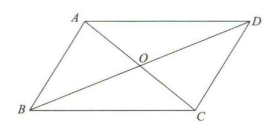

习题解答 5.5 图(1)

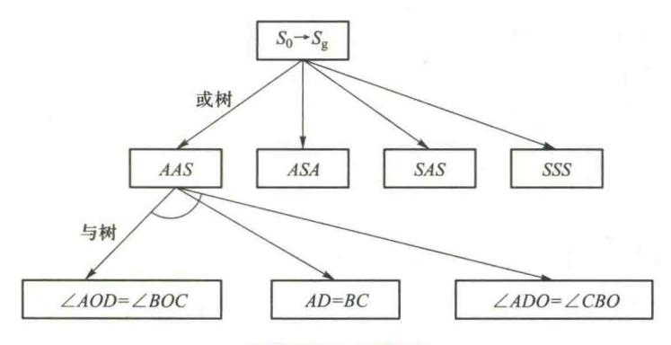

习题解答 5.5 图(2)

## 第6章习题解答

6.2

| 个体编号 | 原适应度 | 调整后的适应度 | 原选择概率 | 调整后的选择概率 |
|------|------|---------|-------|----------|
| 1    | 2.5  | 6.25    | 0.15  | 0.18     |
| 2    | 1.0  | 1.00    | 0.06  | 0.03     |
| 3    | 3.0  | 9.00    | 0.18  | 0.26     |
| 4    | 1.2  | 1.44    | 0.07  | 0.04     |
| 5    | 2.1  | 4.41    | 0.12  | 0.13     |
| 6    | 0.8  | 0.64    | 0.05  | 0.02     |
| 7    | 2.3  | 5.29    | 0.13  | 0.17     |
| 8    | 1.5  | 2.25    | 0.09  | 0.06     |
| 9    | 0.9  | 0.81    | 0.05  | 0.02     |
| 10   | 1.8  | 3.24    | 0.10  | 0.09     |

{17}------------------------------------------------

- **6.3** 由式(6.1)得  $\delta = \frac{u_{\text{max}} u_{\text{min}}}{2^n 1}$ ,得  $2^n = 151$ ,解得 n = 8。
- **6.4** 由式(6.1)得  $\delta = \frac{u_{\text{max}} u_{\text{min}}}{2^n 1}$ ,得  $2^n = 16$ ,解得 n = 4。

### 第8章习题解答

- **8.6** (1) 该 BP 神经网络的输入层应包含 5 个神经元,输入信息为萼片长度、萼片宽度、花瓣长度、花瓣宽度和花瓣颜色。(2) 输出层可包含 4 个神经元,例如输出[1000]T为金桂,输出 [0100]T为银桂,输出[0010]T为月桂,输出[0001]T为紫桂。对应输出层神经元的非线性函数为:Sigmoid 型函数或  $\frac{1}{1+e^{-\alpha x}}$ ,其中  $\alpha=1$ 。
  - **8.9** 设  $x_1 = 0, x_2 = 0$ ,则  $u_1' = 0 < 1, y_1' = 0; u_2' = 0, y_2' = 1; u_1^2 = 1 < 2, y = 0;$ 其余类推。
- **8.10** Sigmod 函数及其导数如习题解答 8.10 图所示, Sigmod 函数的导数的取值范围为(0,0.25], 所以 Sigmod 函数求导的最大值也只有 0.25, 小于 1 的数值相乘若干次, 数值很容易趋于 0, 造成梯度消失。

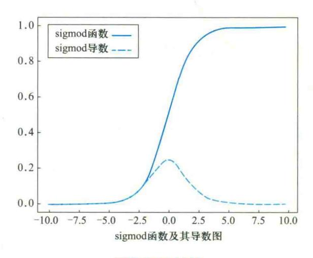

习题解答 8.10 图

经过两层传播后,链式求导会叠加两个 Sigmod 导数,即使两个导数均取最大值 0.25,那经过四次反向传播之后也只有 0.003 9,因此 Sigmod 函数导数的特性较容易造成梯度消失。

**8.11** 求 ReLU 函数的导数均为常数,兴奋边界更加宽阔,不会像 Sigmod 函数那样出现两端饱和的情况。由习题解答 8.11 图可以看到 ReLU 函数在负半区的导数为 0,所以在这部分的神

{18}------------------------------------------------

经元不会经过训练,这样会使得网络具有稀疏性,更接近生物神经元的特性,网络的泛化性能也 会更好。

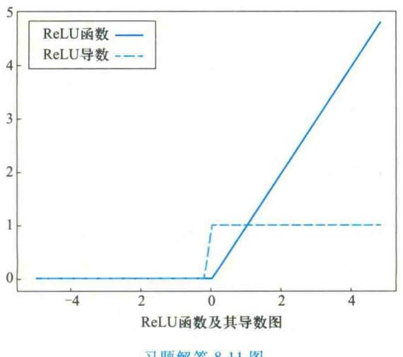

习题解答 8.11 图