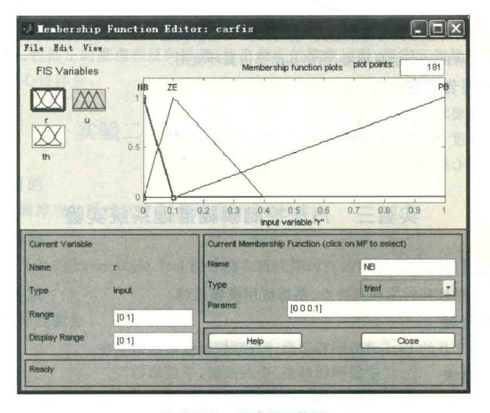
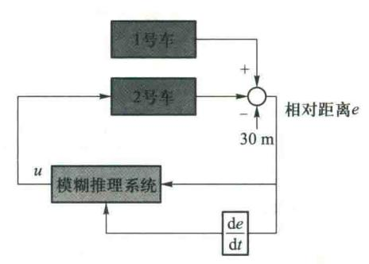
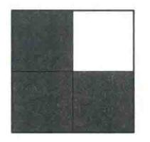
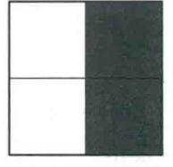
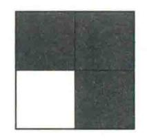
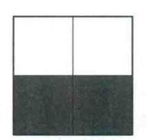

{0}------------------------------------------------

# 附录 B 实验指导书

# 实验一 产生式系统实验

### 一、实验目的

熟悉一阶谓词逻辑和产生式表示法,掌握产生式系统的运行机制,以及基于规则推理的基本方法。

### 二、实验内容

设计并编程实现一个小型产生式系统(如分类、诊断等类型)。

#### 三、实验要求

- 1. 具体应用领域自选,具体系统名称自定。
- 2. 用一阶谓词逻辑和产生式规则作为知识表示,利用产生式系统实验程序,建立知识库,分别运行正、反向推理。

#### 四、实验报告要求

- 1. 系统设置,包括系统名称和系统谓词,给出谓词名及其含义。
- 2. 编辑知识库,通过输入规则或修改规则等,建立规则库。
- 3. 建立事实库(综合数据库),输入多条事实或结论。
- 4. 运行推理,包括正向推理和反向推理,给出相应的推理过程、事实区和规则区。
- 5. 总结实验心得体会。

# 实验二 洗衣机模糊推理系统实验

### 一、实验目的

理解模糊逻辑推理的原理及特点,熟练应用模糊推理。

### 二、实验内容

采用 Matlab 7.0 的 Fuzzy Logic Tool 设计洗衣机洗涤时间的模糊控制。

### 三、实验要求

已知人的操作经验为

- "污泥越多,油脂越多,洗涤时间越长";
- "污泥适中,油脂适中,洗涤时间适中";
- "污泥越少,油脂越少,洗涤时间越短"。

模糊控制规则如附表 2.1 所示。

{1}------------------------------------------------

| x  | у  | z  |
|----|----|----|
| SD | NG | VS |
| SD | MG | M  |
| SD | LG | L  |
| MD | NG | S  |
| MD | MG | M  |
| MD | LG | L  |
| LD | NG | M  |
| LD | MG | L  |
| LD | LG | VL |

附表 2.1 洗衣机的模糊控制规则表

其中SD(污泥少)、MD(污泥中)、LD(污泥多)、NG(油脂少)、MG(油脂中)、LG(油脂多)、VS(洗涤时间很短)、S(洗涤时间短)、M(洗涤时间中等)、L(洗涤时间长)、VL(洗涤时间很长)。

- (1) 假设污泥、油脂、洗涤时间的论域分别为[0,100]、[0,100]和[0,120],设计相应的模糊推理系统,给出输入、输出语言变量的隶属函数图,模糊控制规则表和推论结果立体图。
- (2) 假定当前传感器测得的信息为  $x_0$ (污泥)=  $60,y_0$ (油脂)= 70,采用模糊决策,给出模糊推理结果,并观察模糊推理的动态仿真环境,给出其动态仿真环境图。

# 四、实验报告要求

- 1. 按照实验要求,给出相应结果。
- 2. 分析隶属度、模糊关系和模糊规则的相互关系。
- 3. 总结实验心得体会。

# 实验三 汽车控制模糊推理系统实验

# 一、实验目的

理解模糊逻辑推理的原理及特点,熟练应用模糊推理。

### 二、实验内容

采用 Matlab 7.0 的 Fuzzy Logic Tool 设计汽车控制模糊推理系统。

### 三、实验要求

假设两汽车均为理想状态,即 $\frac{Y(s)}{U(s)} = \frac{4}{s^2 + 2 \times 0.7 \times 2s + 4}$ , Y 为速度, U 为油门控制输入。

{2}------------------------------------------------

- (1)设计模糊推理系统控制 2 号汽车由静止启动,追赶 200 m 外时速 90 km 的1 号汽车并与 其保持 30 m 的距离。
  - (2) 在25 时刻 1 号汽车速度改为时速110 km 时,仍与其保持30 m 距离。
  - (3) 在35 时刻1号汽车速度改为时速70 km时,仍与其保持30 m距离。

模糊控制规则如附表 3.1 所示,其中  $r=\sqrt{e^2+\dot{e}^2}$ ,  $\theta=\tan\frac{\dot{e}}{e}$ , r、 $\theta$  和油门控制 u 的论域分别为  $\begin{bmatrix} 0,1 \end{bmatrix}$ 、 $\begin{bmatrix} -3,3 \end{bmatrix}$ 和 $\begin{bmatrix} -1,1 \end{bmatrix}$ 。

| $\theta \backslash r$ | NB | ZE | PB |
|-----------------------|----|----|----|
| PB                    | ZE | NM | NB |
| PM                    | ZE | PM | PB |
| ZE                    | ZE | PM | PB |
| NM                    | ZE | NM | NB |
| NB                    | ZE | NM | NB |

附表 3.1 模糊控制规则表

r的隶属函数如附图 3.1 所示。

附图 3.1 r的隶属函数图

{3}------------------------------------------------

- (1) 如附图 3.2 所示,设计两输入一输出的模糊推理系统作为 2 号汽车的模糊控制器,其中输入为误差 e 和误差的变化 e,输出为 1 号汽车的油门控制 u,采用面积等分法反模糊化,给出输
- 人、输出语言变量的隶属函数图,模糊控制规则表,推论结果立体图和模糊推理的动态仿真环境图。
- (2) 用 SIMULINK 仿真两车追赶的模糊控制系统, 给出目标车(1号汽车)的速度曲线图,以及追赶车(2 号汽车)的速度曲线图和与目标车(1号汽车)相对距离 变化图。

# 四、实验报告要求

- 1. 按照实验要求,给出相应结果。
- 2. 分析隶属度、模糊关系和模糊规则的相互关系。
- 3. 总结实验心得体会。

附图 3.2 两车追赶的模糊控制系统框图

# 实验四 A\*算法求解八数码问题实验

#### 一、实验目的

熟悉和掌握启发式搜索的定义、估价函数和算法过程,并利用  $A^*$  算法求解 N 数码难题,理解求解流程和搜索顺序。

### 二、实验内容

以 8 数码问题和 15 数码问题为例实现 A\* 算法的求解程序(编程语言不限),要求设计两种不同的估价函数。

# 三、实验要求

1. 设置相同的初始状态和目标状态,针对不同的估价函数,求得问题的解,比较它们对搜索 算法性能的影响,包括扩展节点数、生成节点数等,填入附表 4.1。

| the second the second second second second |           |                     |  |  |  |  |
|--------------------------------------------|-----------|---------------------|--|--|--|--|
|                                            | 启发函数 h(n) |                     |  |  |  |  |
| HER STREET STREET                          | 不在位数      | HELPHARICA SERVICES |  |  |  |  |
| 初始状态                                       |           |                     |  |  |  |  |
| 目标状态                                       | 123804765 | 123804765           |  |  |  |  |
| 最优解                                        |           |                     |  |  |  |  |
| 扩展节点数                                      |           |                     |  |  |  |  |
| 生成节点数                                      |           |                     |  |  |  |  |
| 运行时间                                       | \·        |                     |  |  |  |  |

附表 4.1 不同启发函数 h(n) 求解 8 数码问题的结果比较

{4}------------------------------------------------

- 2. 设置与上述 1 相同的初始状态和目标状态,用宽度优先搜索算法(即令估计代价 h(n)=0的  $A^*$ 算法)求得问题的解,以及搜索过程中的扩展节点数、生成节点数,填入表 1。
- 3. 实现 A\*算法求解 15 数码问题的程序,设计两种不同的估价函数,然后重复上述 1 和 2 的 实验内容,把结果填入附表 4. 2。

|       | 启发函数 h(n) |                  |  |  |
|-------|-----------|------------------|--|--|
|       | 不在位数      | · 在平)的连座由线部和与目标。 |  |  |
| 初始状态  |           |                  |  |  |
| 目标状态  |           |                  |  |  |
| 最优解   |           |                  |  |  |
| 扩展节点数 |           | ×                |  |  |
| 生成节点数 |           |                  |  |  |
| 运行时间  |           |                  |  |  |

附表 4.2 不同启发函数 h(n) 求解 15 数码问题的结果比较

#### 四、实验报告要求

- 1. 分析不同的估价函数对 A\*算法性能的影响。
- 2. 根据宽度优先搜索算法和 A\*算法求解 8、15 数码问题的结果,分析启发式搜索的特点。
  - 3. 画出 A\*算法求解 N 数码问题的流程图。
  - 4. 提交源程序。
  - 5. 总结实验心得体会。

# 实验五 A\* 算法求解迷宫寻路问题实验

### 一、实验目的

熟悉和掌握 A\*算法实现迷宫寻路功能,要求掌握启发式函数的编写以及各类启发式函数 效果的比较。

# 二、实验内容

寻路问题常见于各类游戏中角色寻路、三维虚拟场景中运动目标的路径规划、机器人寻路等多个应用领域。迷宫寻路问题是在以方格表示的地图场景中,对于给定的起点、终点和障碍物(墙),如何找到一条从起点开始避开障碍物到达终点的最短路径。

假设在一个 n×m 的迷宫里,人口坐标和出口坐标分别为(1,1)和(5,5),每一个坐标点有两种可能:0或1,其中0表示该位置允许通过,1表示该位置不允许通过。

{5}------------------------------------------------

#### 如地图:

00000

10101

00111

01000

00010

#### 最短路径应该是

A B 0 0 0

1 C 1 O 1

E D 1 1 1

FIJKL

GHI1M

$$\mathbb{P}:(1,1)-(1,2)-(2,2)-(3,2)-(3,1)-(4,1)-(5,1)-(5,2)-(5,3)-(4,3)-(4,4)-(4,5)-(5,5)$$

以寻路问题为例实现 A\*算法的求解程序(编程语言不限),要求设计两种不同的估价函数。

#### 三、实验要求

- 1. 画出用 A\*算法求解迷宫最短路径的流程图。
- 2. 设置不同的地图,以及不同的初始状态和目标状态,记录 A\*算法的求解结果,包括最短路径、扩展节点数、生成节点数和算法运行时间。
- 3. 对于相同的初始状态和目标状态,设计不同的启发式函数,比较不同启发式函数对迷宫 寻路速度的提升效果,包括扩展节点数、生成节点数和算法运行时间。

# 四、实验报告要求

- 1. 画出 A\*算法求解迷宫最短路径问题的流程图。
- 2. 分析不同启发式函数 h(n) 对迷宫寻路求解的速度提升效果。
- 3. 分析 A\*算法求解不同规模迷宫最短路径问题的性能。
- 4. 提交源程序。
- 5. 总结实验心得体会。

# 实验六 遗传算法求函数最大值实验

# 一、实验目的

熟悉和掌握遗传算法的原理、流程和编码策略,并利用遗传求解函数优化问题,理解求解流程并测试主要参数对结果的影响。

{6}------------------------------------------------

#### 二、实验内容

采用 Matlab 7.X 的遗传算法工具箱求解函数最大值。

#### 三、实验要求

1. 用遗传算法求解下列函数的最大值,设定求解精度到15位小数。

$$f(x,y) = \frac{6.452(x+0.125y) \left[\cos(x) - \cos(2y)\right]^{2}}{\sqrt{0.8 + (x-4.2)^{2} + 2(y-7)^{2}}} + 3.226y$$

$$x \in [0,10], \quad y \in [0,10]$$

- (1) 给出适应度函数(Fitness Function)的 M 文件(Matlab 中要求适应度函数最小化)。
- (2)设计及选择上述问题的编码、选择操作、交叉操作、变异操作以及控制参数等,填入表1,给出最佳适应度(best fitness)和最佳个体(best individual)图。
- (3)使用相同的初始种群,设置不同的种群规模,如5、20和100,初始种群的个体取值范围为[0,10],其他参数同表1,然后求得相应的最佳适应度、平均适应度和最佳个体,填入附表6.1,分析种群规模对算法性能的影响。

| 种群规模        | 是件法应度         | 适应度    平均适应度 | The state of | 最佳个体 |        |  |
|-------------|---------------|--------------|--------------|------|--------|--|
| <b>种杆双快</b> | 最佳适应度    平均适应 | 平均迫应反        | x 朱平恒        |      | Part y |  |
| 5           |               |              |              |      |        |  |
| 20          |               |              |              |      |        |  |
| 100         |               |              |              |      |        |  |

附表 6.1 不同的种群规模的 GA 运行结果

(4)设置种群规模为20,初始种群的个体取值范围为[0,10],选择不同的选择操作、交叉操作和变异操作,其他参数同附表6.2,然后独立运行算法10次,完成附表6.3,并分析比较采用不同的选择策略、交叉策略和变异策略的算法运行结果。

| 编码                   | 编码方式(population type)       | 3. 分析人。對抗和 |
|----------------------|-----------------------------|------------|
| 51 HY 52 W           | 种群规模(population size)       |            |
| 种群参数                 | 初始种群的个体取值范围(initial range)  |            |
| 选择操作                 | 个体选择概率分配策略(fitness scaling) |            |
|                      | 个体选择方法(selection function)  |            |
| 最佳个体保存               | 优良个体保存数量(elite count)       |            |
| <b>之</b> 可担 <i>体</i> | 交叉概率(crossover fraction)    |            |
| 交叉操作                 | 交叉方式(crossover function)    |            |

附表 6.2 遗传算法参数的选择

{7}------------------------------------------------

续表

| 编码   | 编码方式(population type)    |  |
|------|--------------------------|--|
| 变异操作 | 变异方式(mutation function)  |  |
|      | 最大迭代步数(generations)      |  |
|      | 最大运行时间限制(time limit)     |  |
| 停止参数 | 最小适应度限制(fitness limit)   |  |
|      | 停滞代数(stall generations)  |  |
|      | 停滯时间限制(stall time limit) |  |

附表 6.3 不同的选择策略、交叉策略和变异策略的算法运行结果

| 遗传算法参数设                                      | 性置(gaoptimset)                                                                                                  | 1 1                                                                                                                                                                                                                              | 2                                                                                                                                                                                                                                                                                 | 3                                                                                                                                                                                                                                      | 4                                                                                                                                                                                                                                             |
|----------------------------------------------|-----------------------------------------------------------------------------------------------------------------|----------------------------------------------------------------------------------------------------------------------------------------------------------------------------------------------------------------------------------|-----------------------------------------------------------------------------------------------------------------------------------------------------------------------------------------------------------------------------------------------------------------------------------|----------------------------------------------------------------------------------------------------------------------------------------------------------------------------------------------------------------------------------------|-----------------------------------------------------------------------------------------------------------------------------------------------------------------------------------------------------------------------------------------------|
| 个体选择概率分配                                     | Rank(排序) @ fitscalingrank                                                                                    | √ °                                                                                                                                                                                                                              | V                                                                                                                                                                                                                                                                                 |                                                                                                                                                                                                                                        | V                                                                                                                                                                                                                                             |
| 选择操作                                         | Proportional(比率) @ fitscalingprop                                                                            |                                                                                                                                                                                                                                  |                                                                                                                                                                                                                                                                                   | V                                                                                                                                                                                                                                      |                                                                                                                                                                                                                                               |
|                                              | Roulette(轮盘赌选择) @ selectionroulette                                                                          | V                                                                                                                                                                                                                                | V                                                                                                                                                                                                                                                                                 |                                                                                                                                                                                                                                        | V                                                                                                                                                                                                                                             |
|                                              | Tournament(锦标赛选择) @ selectiontournament                                                                      |                                                                                                                                                                                                                                  |                                                                                                                                                                                                                                                                                   | V                                                                                                                                                                                                                                      |                                                                                                                                                                                                                                               |
| 单点交叉 @ crossove                              | rsinglepoint                                                                                                    | $\vee$                                                                                                                                                                                                                           |                                                                                                                                                                                                                                                                                   | V                                                                                                                                                                                                                                      | V                                                                                                                                                                                                                                             |
| CrossoverFcn 两点交叉 @ crossovertwopoint        |                                                                                                                 |                                                                                                                                                                                                                                  | V                                                                                                                                                                                                                                                                                 |                                                                                                                                                                                                                                        |                                                                                                                                                                                                                                               |
| Uniform(均匀变异)(                               | @ mutationuniform                                                                                               | V                                                                                                                                                                                                                                | V                                                                                                                                                                                                                                                                                 | V                                                                                                                                                                                                                                      |                                                                                                                                                                                                                                               |
| MutationFcn Gaussian(高斯变异)@ mutationgaussian |                                                                                                                 |                                                                                                                                                                                                                                  |                                                                                                                                                                                                                                                                                   |                                                                                                                                                                                                                                        | V                                                                                                                                                                                                                                             |
| 最好道                                          | 适应度                                                                                                             |                                                                                                                                                                                                                                  |                                                                                                                                                                                                                                                                                   |                                                                                                                                                                                                                                        |                                                                                                                                                                                                                                               |
| 最差道                                          | 适应度                                                                                                             |                                                                                                                                                                                                                                  |                                                                                                                                                                                                                                                                                   |                                                                                                                                                                                                                                        |                                                                                                                                                                                                                                               |
| 平均近                                          | 适应度                                                                                                             |                                                                                                                                                                                                                                  |                                                                                                                                                                                                                                                                                   |                                                                                                                                                                                                                                        |                                                                                                                                                                                                                                               |
|                                              | 个体选择概率分配 FitnessScalingFcn  个体选择 SelectionFcn  单点交叉 @ crossove 两点交叉 @ crossove Uniform(均匀变异) Gaussian(高斯变异) 最好近 | Rank(排序) @ fitscalingrank Proportional(比率) @ fitscalingprop  Roulette(轮盘赌选择) @ selectionroulette  Tournament(锦标赛选择) @ selectiontournament  単点交叉 @ crossoversinglepoint  两点交叉 @ crossovertwopoint  Uniform(均匀变异)@ mutationuniform | Rank(排序) ② fitscalingrank  Proportional(比率) ② fitscalingprop  Roulette(轮盘赌选择) ② selectionroulette  Tournament(锦标赛选择) ② selectiontournament  単点交叉 ② crossoversinglepoint  两点交叉 ② crossovertwopoint  Uniform(均匀变异)② mutationuniform  Gaussian(高斯变异)② mutationgaussian  最好适应度  最差适应度 | Rank(排序) @ fitscalingrank Proportional(比率) @ fitscalingprop  Roulette(轮盘赌选择) @ selectionroulette Tournament(锦标赛选择) @ selectiontournament  単点交叉@crossoversinglepoint  两点交叉@crossovertwopoint Uniform(均匀变异)@mutationgaussian 最好适应度 最差适应度 | Rank(排序) ② fitscalingrank  Proportional(比率) ② fitscalingprop  Roulette(轮盘賭选择) ② selectionFon  Tournament(锦标赛选择) ③ selectiontournament  単点交叉 ② crossoversinglepoint  V  西点交叉 ② crossovertwopoint  Uniform(均匀变异)② mutationuniform  最好适应度  最差适应度 |

备注:options = gaoptimset('PopulationSize', 20, 'PopInitRange', [0;10], 'FitnessScalingFcn', @fitscalingrank, 'SelectionFcn', @selectionroulette, 'CrossoverFcn', @crossoversinglepoint, 'MutationFcn', @mutationuniform)

2. 用遗传算法求解下面 Rastrigin 函数的最小值,设定求解精度到 15 位小数。

$$f(x_1, x_2) = 20 + x_1^2 + x_2^2 - 10(\cos 2\pi x_1 + \cos 2\pi x_2)$$

- (1) 给出适应度函数的 M 文件(Matlab 中要求适应度函数最小化)。
- (2)设计上述问题的编码、选择操作、交叉操作、变异操作以及控制参数等,填入附表 6.4,并画出最佳适应度和最佳个体图。

{8}------------------------------------------------

| 附表 6.4 当 | 贵传算: | 法参 | 数的 | 选择 |
|----------|------|----|----|----|
|----------|------|----|----|----|

| 编码               | 编码方式(population type)          |  |
|------------------|--------------------------------|--|
| IA ## 45 #4      | 种群规模(population size)          |  |
| 种群参数             | 初始种群的个体取值范围(initial range)     |  |
| V4 44 45 14      | 个体选择概率分配策略(对应 fitness scaling) |  |
| 选择操作             | 个体选择方法(selection function)     |  |
| 最佳个体保存           | 优良个体保存数量(elite count)          |  |
| → p 49 /L        | 交叉概率(crossover fraction)       |  |
| 交叉操作             | 交叉方式(crossover function)       |  |
| 变异操作             | 变异方式(mutation function)        |  |
| 6) 15 (2 W 17 P. | 最大迭代步数(generations)            |  |
|                  | 最大运行时间限制(time limit)           |  |
| 停止参数             | 最小适应度限制(fitness limit)         |  |
|                  | 停滞代数(stall generations)        |  |
|                  | 停滯时间限制(stall time limit)       |  |

- (3)设置种群的不同初始范围,例如[1,1.1]、[1,100]和[1,2],画出相应的最佳适应度值(best fitness)和平均距离(distance)图,比较分析初始范围及种群多样性对遗传算法性能的影响。
- (4) 设置不同的交叉概率(crossover fraction = 0,0.8,1),画出无变异的交叉(crossover fraction = 1)、无交叉的变异(crossover fraction = 0)以及交叉概率为 0.8 时最佳适应度值(best fitness)和平均距离(distance)图,分析交叉和变异操作对算法性能的影响。

# 四、实验报告要求

- 1. 画出遗传算法的算法流程图。
- 2. 根据实验内容,给出相应结果以及结果分析。
- 3. 总结遗传算法的特点,并说明适应度函数在遗传算法中的作用。
- 4. 总结实验心得体会。

{9}------------------------------------------------

# 实验七 遗传算法求 TSP 问题实验

#### 一、实验目的

熟悉和掌握遗传算法的原理、流程和编码策略,理解求解 TSP 问题的流程并测试主要参数 对结果的影响,掌握遗传算法的基本实现方法。

#### 二、实验内容

用遗传算法求解不同规模(如10个城市,20个城市,100个城市)的 TSP 问题。

### 三、实验要求

1. 用遗传算法求解不同规模(如 10 个城市,20 个城市,100 个城市)的 TSP 问题,把结果填入附表 7.1。

| 城市规模 | 最好适应度 | 最差适应度 | 平均适应度 | 平均运行时间 |  |  |
|------|-------|-------|-------|--------|--|--|
| 10   |       |       |       |        |  |  |
| 20   |       |       |       |        |  |  |
| 100  |       |       |       |        |  |  |

附表 7.1 遗传算法求解不同规模的 TSP 问题的结果

2. 对于同一个 TSP 问题(如 10 个城市),设置不同的种群规模(如 10,20,100)、交叉概率 (0,0.5,1)和变异概率(0,0.5,1),把结果填入附表 7.2。

| 种群规模 | 交叉概率  | 变异概率  | 最好适应度 | 最差适应度 | 平均适应度 | 平均运行时间 |
|------|-------|-------|-------|-------|-------|--------|
| 10   | 0. 85 | 0. 15 |       |       |       |        |
| 20   | 0. 85 | 0. 15 |       |       |       |        |
| 100  | 0. 85 | 0. 15 |       |       |       |        |
| 100  | 0     | 0. 15 |       |       |       |        |
| 100  | 0. 5  | 0. 15 |       |       |       |        |
| 100  | 1     | 0. 15 |       |       |       |        |
| 100  | 0. 85 | 0     |       |       |       |        |
| 100  | 0. 85 | 0. 5  |       |       |       |        |
| 100  | 0. 85 | 1     |       |       |       |        |

附表 7.2 不同的种群规模、交叉概率和变异概率的求解结果

{10}------------------------------------------------

3. 设置种群规模为 100, 交叉概率为 0. 85, 变异概率为 0. 15, 然后增加 1 种变异策略(如相邻两点互换变异、逆转变异或插入变异等)和 1 种个体选择概率分配策略(如按线性排序或者按非线性排序分配个体选择概率)用于求解同一 TSP 问题(如 10 个城市), 把结果填入附表 7.3。

| 变异策略 | 个体选择 概率分配 | 最好适应度 | 最差 适应度 | 平均 适应度 | 平均运行 时间 |
|------|--------------|-------|-----------|-----------|---------|
| 两点互换 | 按适应度比例分配     |       |           |           |         |
| 两点互换 | 按适应度比例分配     |       |           |           |         |
|      |              |       |           |           |         |
|      |              |       |           |           |         |

附表 7.3 不同的变异策略和个体选择概率分配策略的求解结果

#### 四、实验报告要求:

- 1. 画出遗传算法求解 TSP 问题的流程图。
- 2. 分析遗传算法求解不同规模的 TSP 问题的算法性能。
- 3. 对于同一个 TSP 问题,分析种群规模、交叉概率和变异概率对算法结果的影响。
- 4. 增加 1 种变异策略和 1 种个体选择概率分配策略,比较求解同一 TSP 问题时不同变异策略及不同个体选择分配策略对算法结果的影响。
  - 5. 提交源程序。
  - 6. 总结实验心得体会。

# 实验八 基于神经网络的模式识别实验

### 一、实验目的

理解 BP 神经网络和离散 Hopfield 神经网络的结构和原理,掌握反向传播学习算法对神经元的训练过程,了解反向传播公式。通过构建 BP 网络和离散 Hopfield 网络模式识别实例,熟悉前馈网络和反馈网络的原理及结构。

# 二、实验内容

Matlab 7.X 的神经网络工具箱:在 Matlab 7.X 的命令窗口输入 nntool,然后在键盘上输入 Enter 键,即可打开神经网络工具箱。

# 三、实验要求

1. 针对教材例 8.1,设计一个 BP 网络结构模型(63-6-9),并以教材图 8.5 为训练样本数据,图 8.6 为测试数据。

{11}------------------------------------------------

(1) 从 Matlab 工作空间导入(import)训练样本数据(inputdata, outputdata)和测试数据(testinputdata),然后新建一个神经网络(new network),选择参数如附表 8.1 所示,给出 BP 神经网络结构图。

| network name(神经网络名称)                  |                               |  |
|---------------------------------------|-------------------------------|--|
| network type(神经网络类型)                  | feed-forward backprop(前馈反向传播) |  |
| input ranges(输入信息范围)                  | 来自训练样本的输入数据(inputdata)        |  |
| training function(训练函数)               | TRAINGD(梯度下降 BP 算法)           |  |
| performance function(性能函数)            | MSE(均方误差)                     |  |
| number of layers(神经网络层数)              | 2                             |  |
| layer1(第1层)的 number of neurons(神经元个数) | 6                             |  |
| layer1(第1层)的 transfer function(传递函数)  | TANSIG(双曲正切 S 型函数)            |  |
| layer2(第2层)的 number of neurons(神经元个数) | 2                             |  |
| layer2(第2层)的 transfer function(传递函数)  | LOGSIG(S型函数)                  |  |

附表 8.1 BP 网络结构模型的各项参数设置

(2) 输入训练样本数据(inputdata/outputdata),随机初始化连接权(initialize weights),给出BP 神经网络训练成功后的误差变化曲线图,训练参数设置如附表 8.2 所示。

| 训练次数(epochs)       | 1 000  |
|--------------------|--------|
| 训练时间(time)         | Inf    |
| 训练目标(goal)         | 0      |
| 学习率(lr)            | 0. 3   |
| 最大确认失败次数(max_fail) | 5      |
| 最小性能梯度(min_grad)   | 1e-025 |
| 两次显示之间的训练步数(show)  | 25     |

附表 8.2 BP 网络训练参数

- (3)选择不同的训练函数,例如 TRAINGDM(梯度下降动量 BP 算法)、TRAINLMM(levenberg-marquardt BP 训练函数),然后输入训练样本数据(inputdata/outputdata),训练参数设置如表 8.2 所示,设置相同的初始连接权(revert weights),观察不同 BP 训练算法的学习效果,给出各训练算法下的误差变化曲线图。
- (4) 在上述 3 个训练好的 BP 神经网络中,选择训练误差最小的一个网络,并给出训练后的连接权值和偏置,然后输入测试数据(testinputdata)进行仿真(simulate),并把训练和测试的

{12}------------------------------------------------

结果都导出到工作空间,给出训练后的输出结果和输出误差,以及测试后的输出结果和输出误差。

- (5) 针对 training function(训练函数)为 TRAINGD 的 BP 网络,设置不同的学习率(lr),如 0.01,0.1,0.5,1,观察 TRAINGD 训练算法的学习效果,给出各学习率下的误差变化曲线图。
  - 2. 已知字符点阵为 2×2 模式,两组训练数据如附图 8.1 所示。

$$a^{(1)} = [1 \ 0 \ 1 \ 1]^{L}$$
 (大写字母 L)  
 $a^{(2)} = [0 \ 1 \ 0 \ 1]^{I}$  (小写字母 I)

大写字母L

小写字母1

附图 8.1 训练数据

设计一个能够存储这两个字符的离散 Hopfield 神经网络,要求:

- (1) 给出相应的离散 Hopfield 神经网络结构图;
- (2) 计算连接权值及阈值(阈值可设为0);
- (3) 输入下列测试数据,如附图 8.2 所示。

$$t^{(1)} = \begin{bmatrix} 1 & 1 & 0 & 1 \end{bmatrix}^{\mathrm{T}}$$
$$t^{(2)} = \begin{bmatrix} 0 & 0 & 1 & 1 \end{bmatrix}^{\mathrm{T}}$$

附图 8.2 测试数据

给出网络最终输出的稳定状态。

# 四、实验报告要求

- 1. 按照实验内容,给出相应结果。
- 2. 分析比较采用梯度下降训练算法的 BP 网络学习率变化对训练结果的影响。
- 3. 分析比较 BP 网络和离散 Hopfield 网络在模式识别方面的异同点。
- 4. 总结实验心得体会。

{13}------------------------------------------------

# 实验九 基于神经网络的优化计算实验

### 一、实验目的

掌握连续 Hopfield 神经网络的结构和运行机制,理解连续 Hopfield 神经网络用于优化计算的基本原理,掌握连续 Hopfield 神经网络用于优化计算的一般步骤。

#### 二、实验内容

采用 VC++6.0 编写基于连续 Hopfield 神经网络求解 TSP 问题的程序。

#### 三、实验要求

- 1. 编写基于连续 Hopfield 神经网络求解 TSP 问题的程序,给出 15 个城市和 20 个城市的求解结果(包括最短路径和最佳路线),分析连续 Hopfield 神经网络求解不同规模 TSP 问题的算法性能。
- 2. 对于同一个 TSP 问题(例如 15 个城市的 TSP 问题),设置不同的网络参数,分析不同参数 对算法结果的影响。

#### 四、实验报告要求

- 1. 画出连续 Hopfield 神经网络求解 TSP 问题的流程图。
- 2. 根据实验内容,给出相应结果及分析。
- 3. 总结连续 Hopfield 神经网络和遗传算法用于 TSP 问题求解时的优缺点。
- 4. 提交源代码。
- 5. 总结实验心得体会。

# 实验十 采用卷积神经网络分类 MINST 数据集

# 一、实验目的

熟悉掌握卷积神经网络的定义,了解网络中卷积层、池化层等各层特点,并利用卷积神经网络对 MINST 数据集进行分类。

### 二、实验内容

以 MINST 数据集为数据,实现对 MINST 数据集分类的操作,其中 MINST 数据集有 10 类分别为手写数字 0~9。

# 三、实验要求

- (1) 从网上下载 MINST 数据集,训练你所编写的网络,要求记录每次迭代的损失值。
- (2) 改变卷积神经网络卷积层和池化层数,观察分类准确率。思考网络层数的多少对分类准确率的影响。
  - (3) 改变卷积神经网络卷积核大小,观察分类准确率。思考网络卷积核大小对分类准确率

{14}------------------------------------------------

的影响。

#### 四、实验报告要求

- (1) 按照实验要求,给出相应结果。
- (2) 分析卷积层和池化层数对网络的影响。
- (3) 总结实验心得体会。

# 实验十一 采用胶囊网络分类 MINST 数据集

### 一、实验目的

熟悉掌握胶囊网络的定义,了解网络中胶囊、动态路由等特点,并利用胶囊神经网络对MINST数据集进行分类。

### 二、实验内容

以 MNST 数据集为数据,实现对 MINST 数据集分类的操作,其中 MINST 数据集有 10 类分别 为手写数字 0~9。

#### 三、实验要求

- (1) 从网上下载 MINST 数据集,训练你所编写的网络,要求记录每次迭代的损失值。
- (2) 改变胶囊网络中胶囊的参数,观察损失值和分类准确率。思考参数的改变对分类准确率的影响。
- (3) 去掉重构层以及重构损失,观察损失值和分类准确率。思考为什么要增加重构层来加快训练。

### 四、实验报告要求

- (1) 按照实验要求,给出相应结果。
- (2) 分析胶囊参数对网络的影响。
- (3) 分析重构层对网络的影响。
- (4) 总结实验心得体会。

# 实验十二 用生成对抗网络生成数字图像

### 一、实验目的

熟悉和掌握生成对抗网络的定义、生成器和判别器,并利用生成对抗网络生成数字图像。理解网络模型的对抗过程。

# 二、实验内容

以 MINST 数据集为数据,用 GAN 实现手写数字 5 的图像生成(编程语言不限)。

{15}------------------------------------------------

### 三、实验要求

- (1) 从网上下载 MINST 数据集,训练你所编写的网络,要求记录每次迭代生成器和判别器的损失函数值。
- (2)每隔固定代数生成一次图片,比较随代数增加图像的清晰程度。思考在一定清晰程度后图像清晰度不再变化的原因。

### 四、实验报告要求

- (1) 按照实验要求,给出相应结果。
- (2) 分析 GAN 中生成器和判别器的关系。
- (3) 总结实验心得体会。