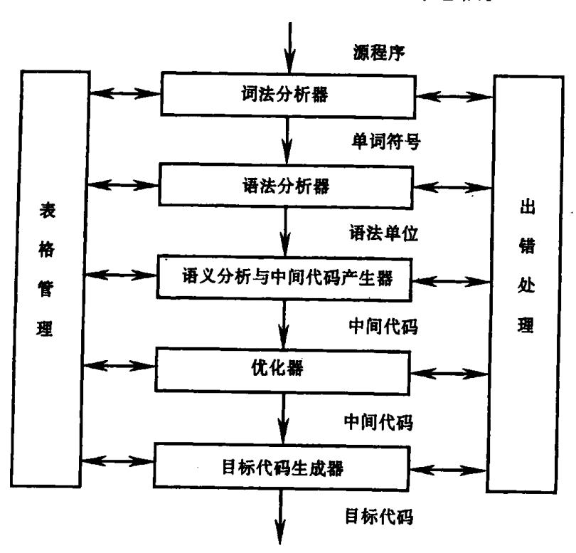
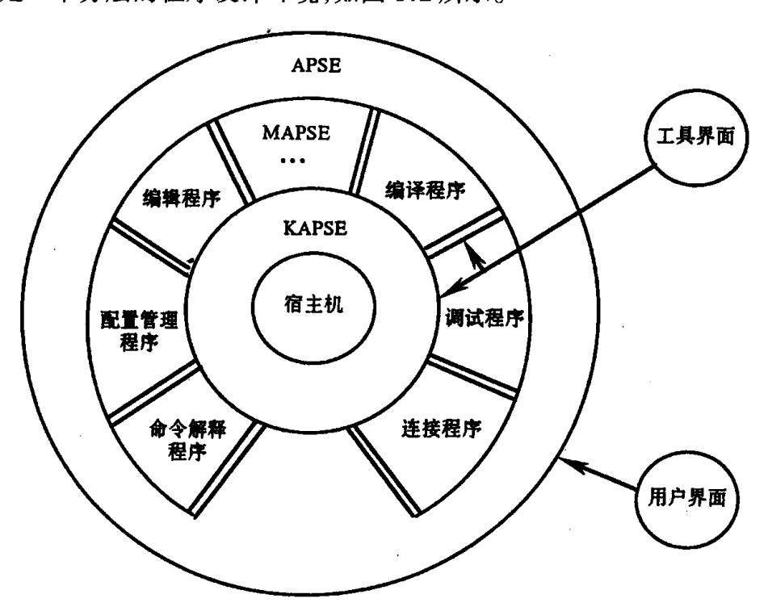
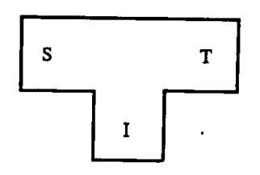
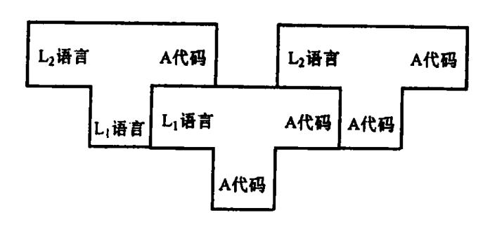
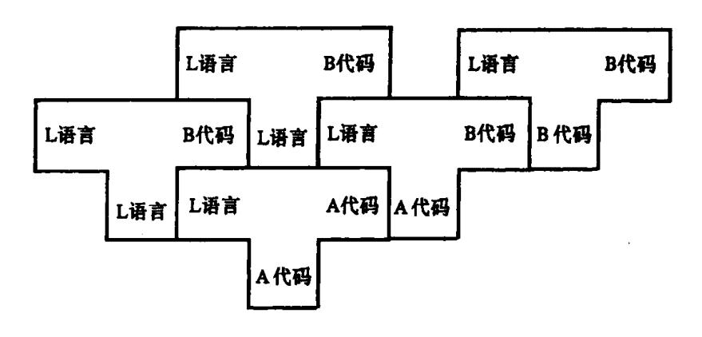

{0}------------------------------------------------

# 第一章 引 论

# 1.1 什么叫编译程序

使用过现代计算机的人都知道,多数用户是应用高级语言来实现他们所需要的计算的。现代计算机系统一般都含有不止一个的高级语言编译程序,对有些高级语言甚至配置了几个不同性能的编译程序,供用户按不同需要进行选择。高级语言编译程序是计算机系统软件最重要的组成部分之一,也是用户最直接关心的工具之一。

在计算机上执行一个高级语言程序一般要分为两步:第一步,用一个编译程序把高级语言翻译成机器语言程序;第二步,运行所得的机器语言程序求得计算结果。

通常所说的翻译程序是指这样的一个程序,它能够把某一种语言程序(称为源语言程序)转换成另一种语言程序(称为目标语言程序),而后者与前者在逻辑上是等价的。如果源语言是诸如 FORTRAN、Pascal、C、Ada、Smalltalk 或 Java 这样的"高级语言",而目标语言是诸如汇编语言或机器语言之类的"低级语言",这样的一个翻译程序就称为编译程序。

高级语言程序除了像上面所说的先编译后执行外,有时也可"解释"执行。一个源语言的解释程序是这样的程序,它以该语言写的源程序作为输入,但不产生目标程序,而是边解释边执行源程序本身。本书将不对解释程序作专门的讨论。实际上,许多编译程序的构造与实现技术同样适用于解释程序。

根据不同的用途和侧重,编译程序还可进一步分类。专门用于帮助程序开发和调试的编译程序称为诊断编译程序(Diagnostic Compiler),着重于提高目标代码效率的编译程序叫优化编译程序(Optimizing Compiler)。现在很多编译程序同时提供了调试、优化等多种功能,用户可以通过"开关"进行选择。运行编译程序的计算机称宿主机,运行编译程序所产生目标代码的计算机称目标机。如果一个编译程序产生不同于其宿主机的机器代码,则称它为交叉编译程序(Cross Compiler)。如果不需重写编译程序中与机器无关的部分就能改变目标机,则称该编译程序为可变目标编译程序(Retargetable Compiler)。

世界上第一个编译程序——FORTRAN 编译程序是 20 世纪 50 年代中期研制成功的。当时,人们普遍认为设计和实现编译程序是一件十分困难、令人生畏的事情。经过 40 年的努力,编译理论与技术得到迅速发展,现在已形成了一套比较成熟的、系统化的理论与方法,并且开发出了一些好的编译程序的实现语言、环境与工具。在此基础上设计并实现一个编译程序不再是高不可攀的事情。

本书主要介绍设计和构造编译程序的基本原理和方法。我们不想罗列太多细节性的材料,着重讲一些原理性的东西,但将反映一些最新的进展。

{1}------------------------------------------------

### 1.2 编译过程概述

编译程序的工作,从输入源程序开始到输出目标程序为止的整个过程,是非常复杂的。但就其过程而言,它与人们进行自然语言之间的翻译有许多相近之处。当我们把一种文字翻译为另一种文字,例如把一段英文翻译为中文时,通常需经下列步骤:

- (1) 识别出句子中的一个个单词:
- (2) 分析句子的语法结构:
- (3) 根据句子的含义进行初步翻译;
- (4) 对译文进行修饰;
- (5) 写出最后的译文。

类似地,编译程序的工作过程一般也可以划分为五个阶段:词法分析、语法分析、语义 分析与中间代码产生、优化、目标代码生成。

第一阶段,词法分析。词法分析的任务是:输入源程序,对构成源程序的字符串进行扫描和分解,识别出一个个的单词(亦称单词符号或简称符号),如基本字(begin、end、if、for、while 等),标识符、常数、算符和界符(标点符号、左右括号等等)。例如,对于 Pascal 的循环语句

for I: = 1 to 100 do

词法分析的结果是识别出如下的单词符号:

基本字 for I

这些单词是组成上述 Pascal 语句的基本符号。单词符号是语言的基本组成成分,是人们理解和编写程序的基本要素。识别和理解这些要素无疑也是翻译的基础。如同将英文翻译成中文的情形一样,如果你对英语单词不理解,那就谈不上进行正确的翻译。在词法分析阶段的工作中所依循的是语言的词法规则(或称构词规则)。描述词法规则的有效工具是正规式和有限自动机。

第二阶段,语法分析。语法分析的任务是:在词法分析的基础上,根据语言的语法规则,把单词符号串分解成各类语法单位(语法范畴),如"短语"、"子句"、"句子"("语句")、"程序段"和"程序"等。通过语法分析,确定整个输入串是否构成语法上正确的"程序"。语法分析所依循的是语言的语法规则。语法规则通常用上下文无关文法描述。词法分析是一种线性分析,而语法分析是一种层次结构分析。例如,在很多语言中,符号串

$$Z: = X + 0.618 * Y$$

代表一个"赋值语句",而其中的 X + 0.618 \* Y 代表一个"算术表达式"。因而,语法分析的任务就是识别 X + 0.618 \* Y 为算术表达式,同时,识别上述整个符号串属于赋值语句

{2}------------------------------------------------

这个范畴。

第三阶段,**语义分析与中间代码产生**。这一阶段的任务是:对语法分析所识别出的各类语法范畴,分析其含义,并进行初步翻译(产生中间代码)。这一阶段通常包括两个方面的工作。首先,对每种语法范畴进行静态语义检查,例如,变量是否定义、类型是否正确等等。如果语义正确,则进行另一方面工作,即进行中间代码的翻译。这一阶段所依循的是语言的语义规则。通常使用属性文法描述语义规则。

"翻译"仅仅在这里才开始涉及到。所谓"中间代码"是一种含义明确、便于处理的记号系统,它通常独立于具体的硬件。这种记号系统或者与现代计算机的指令形式有某种程度的接近,或者能够比较容易地把它变换成现代计算机的机器指令。例如,许多编译程序采用了一种与"三地址指令"非常近似的"四元式"作为中间代码。这种四元式的形式是:

| 算符 左操作数 | 右操作数 | 结果 |
|---------|------|----|

它的意义是:对"左、右操作数"进行某种运算(由"算符"指明),把运算所得的值作为"结果"保留下来。在采用四元式作为中间代码的情形下,中间代码产生的任务就是按语言的语义规则把各类语法范畴翻译成四元式序列。例如,下面的赋值句

$$Z: = (X + 0.418) * Y/W$$

可被翻译为如下的四元式序列:

| 序号  | 算符 | 左操作数           | 右操作数  | 结果    |
|-----|----|----------------|-------|-------|
| (1) | +  | Х              | 0.418 | $T_1$ |
| (2) | *  | $T_{I}$        | Y     | $T_2$ |
| (3) | /  | T 2 | W     | Z     |

其中, $T_1$ 和  $T_2$ 是编译期间引进的临时工作变量;第一个四元式意味着把 X 的值加上 0.418 存放于  $T_1$ 中;第二个四元式指将  $T_1$  的值和 Y 的值相乘存于  $T_2$ 中;第三个四元式指将  $T_2$  的值除以 Y 的值留结果于 Z中。

一般而言,中间代码是一种独立于具体硬件的记号系统。常用的中间代码,除了四元式之外,还有三元式、间接三元式、逆波兰记号和树形表示等等。

第四阶段,优化。优化的任务在于对前段产生的中间代码进行加工变换,以期在最后阶段能产生出更为高效(省时间和空间)的目标代码。优化的主要方面有:公共子表达式的提取、循环优化、删除无用代码等等。有时,为了便于"并行运算",还可以对代码进行并行化处理。优化所依循的原则是程序的等价变换规则。例如,如果我们把程序片断

for 
$$K: = 1$$
 to 100 do begin 
$$M: = I + 10 * K;$$

$$N: = J + 10 * K$$

end

{3}------------------------------------------------

#### 的中间代码:

| 序号    | OP  | ARG1 | ARG2           | RESULT         | 注解                                            |
|-------|-----|------|----------------|----------------|-----------------------------------------------|
| (1)   | :=  | 1    |                | K              | K: = 1                                        |
| (2)   | j < | 100  | K              | (9)            | 若 100 < K 转至第(9)个四元式                          |
| (3)   | *   | 10   | K              | T 1 | T 1 :=10 * K; T 1 为临时变量 |
| (4)   | +   | I    | $T_1$          | M              | $M:=I+T_1$                                    |
| (5)   | *   | 10   | K              | T 2 | T 2 :=10*k;T 2 为临时变量    |
| (6)   | +   | J    | T 2 | N              | $N:=J+T_2$                                    |
| (7)   | +   | K    | 1              | K              | K: = K + 1                                    |
| . (8) | j   |      |                | (2)            | 转至第(2)个四元式                                    |
| (9)   |     | _    |                |                |                                               |

#### 转换成如下的等价代码:

| 序号  | OP  | ARG1 | ARG2 | RESULT | 注 解                               |
|-----|-----|------|------|--------|-----------------------------------|
| (1) | :=  | I    |      | М      | M: = I                            |
| (2) | :=  | J    |      | N      | N: = J                            |
| (3) | :=  | 1    |      | K      | K: = 1                            |
| (4) | j < | 100  | K    | (9)    | if(100 < k)goto(9)                |
| (5) | +   | M    | 10   | M      | $M_{:} = M + 10$                  |
| (6) | +   | N    | 10   | N      | $N_{:} = N + 10$                  |
| (7) | +   | Ķ    | 1    | K      | $\mathbf{K}_{:} = \mathbf{K} + 1$ |
| (8) | j   |      |      | (4)    | goto (4)                          |
| (9) | i   |      |      |        |                                   |

那么,最终所得的目标程序的执行效率就肯定会提高很多。因为,对于前者,在循环中需做 300 次加法和 200 次乘法;对于后者,在循环中只需做 300 次加法。尤其是,在多数硬件中,乘法的时间比加法的时间要长得多。

第五阶段,**目标代码生成**。这一阶段的任务是:把中间代码(或经优化处理之后)变换成特定机器上的低级语言代码。这阶段实现了最后的翻译,它的工作有赖于硬件系统结构和机器指令含义。这阶段工作非常复杂,涉及到硬件系统功能部件的运用,机器指令的选择,各种数据类型变量的存储空间分配,以及寄存器和后援寄存器的调度,等等。如何产生出足以充分发挥硬件效率的目标代码是一件非常不容易的事情。

目标代码的形式可以是绝对指令代码或可重定位的指令代码或汇编指令代码。如目标代码是绝对指令代码,则这种目标代码可立即执行。如果目标代码是汇编指令代码,则需汇编器汇编之后才能运行。必须指出,现代多数实用编译程序所产生的目标代码都是一种可重定位的指令代码。这种目标代码在运行前必须借助于一个连接装配程序把各个

{4}------------------------------------------------

目标模块(包括系统提供的库模块)连接在一起,确定程序变量(或常数)在主存中的位置,装入内存中指定的起始地址,使之成为一个可以运行的绝对指令代码程序。

上述编译过程的五个阶段是一种典型的分法。事实上,并非所有编译程序都分成这五阶段。有些编译程序对优化没有什么要求,优化阶段就可省去。在某些情况下,为了加快编译速度,中间代码产生阶段也可以去掉。有些最简单的编译程序是在语法分析的同时产生目标代码。但是,多数实用编译程序的工作过程大致都像上面所说的那五个阶段。

# 1.3 编译程序的结构

#### 1.3.1 编译程序总框

上述编译过程的五个阶段是编译程序工作时的动态特征。编译程序的结构可以按照这五阶段的任务分模块进行设计。图 1.1 给出了编译程序总框。

图 1.1 编译程序总框

词法分析器,又称扫描器,输入源程序,进行词法分析,输出单词符号。

语法分析器,简称分析器,对单词符号串进行语法分析(根据语法规则进行推导或归约),识别出各类语法单位,最终判断输入串是否构成语法上正确的"程序"。

**语义分析与中间代码产生器**,按照语义规则对语法分析器归约出(或推导出)的语法单位进行语义分析并把它们翻译成一定形式的中间代码。

有的编译程序在识别出各类语法单位后,构造并输出一棵表示语法结构的语法树,然后,根据语法树进行语义分析和中间代码产生。还有许多编译程序在识别出语法单位后并不真正构造语法树,而是调用相应的语义子程序。在这种编译程序中,扫描器、分析器和中间代码产生器三者并非是截然分开的,而是相互穿插的。

{5}------------------------------------------------

优化器,对中间代码进行优化处理。

目标代码生成器,把中间代码翻译成目标程序。

除了上述五个功能模块外,一个完整的编译程序还应包括"表格管理"和"出错处理" 两部分。

#### 1.3.2 表格与表格管理

编译程序在工作过程中需要保持一系列的表格,以登记源程序的各类信息和编译各阶段的进展状况。合理地设计和使用表格是编译程序构造的一个重要问题。在编译程序使用的表格中,最重要的是符号表。它用来登记源程序中出现的每个名字以及名字的各种属性。例如,一个名字是常量名、变量名,还是过程名等等;如果是变量名,它的类型是什么、所占内存是多大、地址是什么等等。通常,编译程序在处理到名字的定义性出现时,要把名字的各种属性填入到符号表中;当处理到名字的使用性出现时,要对名字的属性进行查证。

当扫描器识别出一个名字(标识符)后,它把该名字填入到符号表中。但这时不能完全确定名字的属性,它的各种属性要在后续的各阶段才能填入。例如,名字的类型等要在语义分析时才能确定,而名字的地址可能要到目标代码生成才能确定。

由此可见,编译各阶段都涉及到构造、查找或更新有关的表格。

#### 1.3.3 出错处理

一个编译程序不仅应能对书写正确的程序进行翻译,而且应能对出现在源程序中的错误进行处理。如果源程序有错误,编译程序应设法发现错误,把有关错误信息报告给用户。这部分工作是由专门的一组程序(叫做出错处理程序)完成的。一个好的编译程序应能最大限度地发现源程序中的各种错误,准确地指出错误的性质和发生错误的地点,并且能将错误所造成的影响限制在尽可能小的范围内,使得源程序的其余部分能继续被编译下去,以便进一步发现其它可能的错误。如果不仅能够发现错误,而且还能自动校正错误,那当然就更好了。但是,自动校正错误的代价是非常高的。

编译过程的每一阶段都可能检测出错误,其中,绝大多数错误可以在编译的前三阶段检测出来。源程序中的错误通常分为语法错误和语义错误两大类。语法错误是指源程序中不符合语法(或词法)规则的错误,它们可在词法分析或语法分析时检测出来。例如,词法分析阶段能够检测出"非法字符"之类的错误;语法分析阶段能够检测出诸如"括号不匹配"、"缺少;"之类的错误。语义错误是指源程序中不符合语义规则的错误,这些错误一般在语义分析时检测出来,有的语义错误要在运行时才能检测出来。语义错误通常包括:说明错误、作用域错误、类型不一致等等。关于错误检测和处理方法,我们将穿插在有关章节介绍。

#### 1.3.4 遍

前面介绍的编译过程的五个阶段仅仅是逻辑功能上的一种划分。具体实现时,受不同源语言、设计要求、使用对象和计算机条件(如主存容量)的限制,往往将编译程序组织为若干遍(Pass)。所谓"遍"就是对源程序或源程序的中间结果从头到尾扫描一次,并作

{6}------------------------------------------------

有关的加工处理,生成新的中间结果或目标程序。通常,每遍的工作由从外存上获得的前一遍的中间结果开始(对于第一遍而言,从外存上获得源程序),完成它所含的有关工作之后,再把结果记录于外存。既可以将几个不同阶段合为一遍,也可以把一个阶段的工作分为若干遍。例如,词法分析这一阶段可以单独作为一遍,但更多的时候是把它与语法分析合并为一遍;为了便于处理,语法分析和语义分析与中间代码产生又常常合为一遍。在优化要求很高时,往往还可把优化阶段分为若干遍来实现。

当一遍中包含若干阶段时,各阶段的工作是穿插进行的。例如,我们可以把词法分析、语法分析及语义分析与中间代码产生这三阶段安排成一遍。这时,语法分析器处于核心位置,当它在识别语法结构而需要下一单词符号时,它就调用词法分析器,一旦识别出一个语法单位时,它就调用中间代码产生器,完成相应的语义分析并产生相应的中间代码。

一个编译程序究竟应分成几遍,如何划分,是与源语言、设计要求、硬件设备等诸因素有关的,因此难于统一划定。遍数多一点有个好处,即整个编译程序的逻辑结构可能清晰一点。但遍数多势必增加输入/输出所消耗的时间。因此,在主存可能的前提下,一般还是遍数尽可能少一点为好。应当注意的是,并不是每种语言都可以用单遍编译程序实现。

#### 1.3.5 编译前端与后端

概念上,我们有时把编译程序划分为编译前端和编译后端。前端主要由与源语言有关但与目标机无关的那些部分组成。这些部分通常包括词法分析、语法分析、语义分析与中间代码产生,有的代码优化工作也可包括在前端。后端包括编译程序中与目标机有关的那些部分,如与目标机有关的代码优化和目标代码生成等。"通常,后端不依赖于源语言而仅仅依赖于中间语言。

可以取编译程序的前端,改写其后端以生成不同目标机上的相同语言的编译程序。如果后端的设计是经过精心考虑的,那么后端的改写将用不了太大工作量,这样就可实现编译程序的目标机改变。也可以设想将几种源语言编译成相同的中间语言,然后为不同的前端配上相同的后端,这样就可为同一台机器生成不同语言的编译程序。然而,由于不同语言存在某些微妙的区别,因此在这方面所取得的成果还非常有限。

为了实现编译程序可改变目标机,通常需要有一种定义良好的中间语言支持。例如,在著名的 Ada 程序设计环境 APSE 中,使用的是一种称为 Diana 的树形结构的中间语言。一个 Ada 源程序通过前端编译转换为 Diana 中间代码,由编译后端把 Diana 中间代码转换为目标代码。编译前端与不同的编译后端以 Diana 为界面,实现编译程序的目标机改变。

又如,在 Java 语言环境中,为了使编译后的程序从一个平台移到另一个平台执行, Java 定义一种虚拟机代码——Bytecode。只要实际使用的操作平台上实现了执行 Bytecode 的 Java 解释器,这个操作平台就可以执行各种 Java 程序。这就是所谓 Java 语言的操作平台无关性。

## 1.4 编译程序与程序设计环境

编译程序无疑是实现高级语言的一个最重要的工具。但支持程序设计人员进行程序

{7}------------------------------------------------

开发通常还需要一些其它的工具;如编辑程序、连接程序,调试工具等等。编译程序与这些程序设计工具一起构成所谓的程序设计环境。

在高级语言发展的早期,这些程序设计工具往往是独立的,缺乏整体性,而且也缺乏对软件开发全生命周期的支持。随着软件技术的不断发展,现在人们越来越倾向于构造集成化的程序设计环境。一个集成化的程序设计环境的特点是,它将相互独立的程序设计工具集成起来,以便为程序员提供完整的、一体化的支持,从而进一步提高程序开发效率,改善程序质量。在一个好的集成化程序设计环境中,不仅包含丰富的程序设计工具,而且还支持程序设计方法学,支持程序开发的全生命周期。有代表性的集成化程序设计环境有 Ada 语言程序设计环境 APSE、LISP 语言程序设计环境 INTERLISP 等。广大读者所熟悉的 Turbo Pascal、Turbo C、Visual C++等语言环境也都可认为是集成化的程序设计环境。

下面以 Ada 语言的程序设计环境 APSE 为例,介绍程序设计环境的基本构成和主要工具。

APSE 是一个分层的程序设计环境,如图 1.2 所示。

图 1.2 Ada 程序设计环境

最内层(第0层)是宿主计算机系统,它包括硬件、宿主操作系统和其它支持软件。

第一层是核心 APSE(KAPSE)。它包括环境数据库、通信及运行时支撑功能等。

第二层,最小 APSE(MAPSE)。它包括了 Ada 程序开发及维护的基本工具,这些工具包括编译程序、编辑程序、连接程序、调试程序、命令解释程序、配置管理程序、美化打印程序、静态分析工具、动态分析工具等等。

第三层, APSE。在 MAPSE 外面再加上更广泛的工具就构成了完整的 APSE。对这一层没有精确规定工具的类型, 它通常可以包括面向应用的工具和支持特定程序设计方法的工具等。可以是支持需求分析、设计、实现、维护等软件开发全生命周期的工具。

{8}------------------------------------------------

在一个程序设计环境中,编译程序起着中心的作用。连接程序、调试程序、程序分析等工具的工作直接依赖于编译程序所产生的结果,而其它工具的构造也常常要用到编译的原理、方法和技术。

## 1.5 编译程序的生成

以前人们构造编译程序大多是用机器语言或汇编语言作工具的。为了充分发挥各种不同硬件系统的效率,为了满足各种不同的具体要求,现在许多人仍然采用这种工具来构造编译程序(或编译程序的"核心"部分)。但是,越来越多的人已经使用高级语言作工具来编译程序。因为,这样可以大大节省程序设计时间,而且所构造出来的编译程序易于阅读、维护和移植。

为了便于说明,我们用一种 T 形图来表示源语言 S、目标语言 T 和编译程序实现语言 I 之间的关系,如图 1.3 所示。

图 1.3 T形图

如果 A 机器上已有一个用 A 机器代码实现的某高级语言  $L_1$  的编译程序,则我们可以用  $L_1$  语言编写另一种高级  $L_2$  的编译程序,把写好的  $L_2$  编译程序经过  $L_1$  编译程序编译后就可得到 A 机器代码实现的  $L_2$  编译程序,如图 1.4 所示。

图 1.4 用 L 语言编写编译程序

采用一种所谓的"移植"方法,我们可以利用 A 机器上已有的高级语言 L 编写一个能够在 B 机器上运行的高级语言 L 的编译程序。做法是,先用 L 语言编写出在 A 机器上运行的产生 B 机器代码的 L 编译程序源程序,然后把该源程序经过 A 机器上的 L 编译程序编译后得到能在 A 机器上运行的产生 B 机器代码的编译程序,用这个编译程序再一次编译上述编译程序源程序就得到了能在 B 机器上运行的产生 B 机器代码的编译程序。用 T 形图表示为图 1.5 所示。

我们还可以采用"自编译方式"产生编译程序。方法是,先对语言的核心部分构造一个小小的编译程序(可用低级语言实现),再以它为工具构造一个能够编译更多语言成分的较大编译程序。如此扩展下去,就像滚雪球一样,越滚越大,最后形成人们所期望的整

{9}------------------------------------------------

图 1.5 编译程序"移植"

个编译程序。这种通过一系列自展途径而形成编译程序的过程叫做自编译过程。

现在人们已建立了多种编制部分编译程序或整个编译程序的有效工具。有些能用于自动产生扫描器(如 LEX),有些可用于自动产生语法分析器(如 YACC),有些甚至可用来自动产生整个的编译程序。这些构造编译程序的工具称为编译程序—编译程序、编译程序产生器或翻译程序书写系统,它们是按对源程序和目标语言(或机器)的形式描述(作为输入数据)而自动产生编译程序的。

最后,我们来谈一谈如何学习构造编译程序。要在某一台机器上为某种语言构造一个编译程序,必须掌握下述三方面的内容:

- (1)源语言,对被编译的源语言(如 FORTRAN、Pascal 或 C),要深刻理解其结构(语法)和含义(语义);
- (2)目标语言,假定目标语言是机器语言,那么,就必须搞清楚硬件的系统结构和操作系统的功能;
- (3)编译方法,把一种语言程序翻译为另一种语言程序方法很多,但必须准确地掌握一二。

本课程是讲编译方法的,并且主要是讨论 FORTRAN、Pascal、C 之类强制式语言的编译技术,同时也将介绍一些有关面向对象语言编译和并行化编译的内容。尽管假设读者对这些语言已有一定的基本知识,但为了衔接,第二章,我们仍将复习一下高级语言的基本概念。

在本门课中,我们并不假定以某种特定机器作为目标机器。当需要涉及目标指令时, 将采用一些人所共知的假想指令。因此,在学习这门课之前,读者必须具有计算机基础程 序设计的知识。

由于编译程序是一个极其复杂的系统,故在讨论中,只好把它肢解开来,一部分一部分地进行研究。因此,在学习过程中应注意前后联系,切忌用静止的、孤立的观点看待问题。作为一门技术课程,学习时务必注意理论联系实际,多做练习,多多实践。要加强实践教学环节,学完这门课后,学生们应能实现一个小编译程序(如 Pascal 语言子集的编译程序)。有关实践方面的讨论,可参阅参考文献 46。

本书中所使用的具体算法有些是用文字描述的,有些是用类似 Pascal 的语言表示的。 所有这些算法都是原理性和解释性的,而且大多是不完备的(忽略某些次要因素或尚未学 到的成分)。因此,并不意味着这些算法可以直接照抄使用。 

{10}------------------------------------------------

在着手构造一个编译程序时,需要预先考虑种种具体因素[诸如,系统功能要求(这种要求常常是多方面的)、硬件设备、软件工具等等],特别是必须估量所有这些因素对编译程序构造的影响。虽然这些都是工程实现时应予考虑的细节,但因篇幅所限,不可能涉及太多。

后面,在复习高级语言的基本概念之后,我们将按照1.2节所说的编译过程的各基本阶段,逐步介绍编译程序的构造方法和技术。