{0}------------------------------------------------

# 第七章 语义分析和中间代码产生

上一章介绍了属性文法和语法制导翻译,本章我们将把上章所介绍的方法和技术应用于语义分析和中间代码产生中。

紧接在词法分析和语法分析之后,编译程序要做的工作就是进行**静态语义检查**和翻译。静态语义检查通常包括:

- (1) 类型检查。如果操作符作用于不相容的操作数,编译程序必须报告出错信息。
- (2) 控制流检查。控制流语句必须使控制转移到合法的地方。例如,在 C 语言中break 语句使控制跳离包括该语句的最小 while、for 或 switch 语句。如果不存在包括它的这样的语句,则应报错。
- (3)一致性检查。在很多场合要求对象只能被定义一次。例如 Pascal 语言规定同一标识符在一个分程序中只能被说明一次,同一 case 语句的标号不能相同,枚举类型的元素不能重复出现等等。
- (4) 相关名字检查。有时,同一名字必须出现两次或多次。例如,Ada 语言程序中,循环或程序块可以有一个名字,它出现在这些结构的开头和结尾,编译程序必须检查这两个地方用的名字是相同的。

其它如名字的作用域分析等也都是静态语义分析的工作。

虽然源程序可以直接翻译为目标语言代码,但是许多编译程序却采用了独立于机器的、复杂性介于源语言和机器语言之间的中间语言。这样做的好处是:

- (1) 便于进行与机器无关的代码优化工作;
- (2) 使编译程序改变目标机更容易:
- (3) 使编译程序的结构在逻辑上更为简单明确。以中间语言为界面,编译前端和后端的接口更清晰。

静态语义检查和中间代码产生在编译程序中的地位如图 7.1 所示。

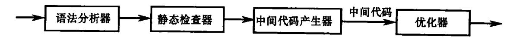

图 7.1 静态检查和中间代码产生的地位

# 7.1 中间语言

在 6.2.4 节中我们介绍了抽象语法树,它是源程序的中间表示方法之一。在本节中, 我们将介绍其它几种常见的**中间语言**形式:后缀式,三地址代码(包括三元式、四元式、间 接三元式),DAG 图表示。其中在本章后面几节中用得最多的是三地址代码。

{1}------------------------------------------------

## 7.1.1 后缀式

后缀式表示法是波兰逻辑学家卢卡西维奇(Lukasiewicz)发明的一种表示表达式的方法,因此又称逆波兰表示法。这种表示法是,把运算量(操作数)写在前面,把算符写在后面(后缀)。例如,把 a + b 写成 ab + ,把 a \* b 写成 ab \* 。

- 一个表达式 E 的后缀形式可以如下定义:
- (1) 如果 E 是一个变量或常量,则 E 的后缀式是 E 自身。
- (2) 如果  $E \neq E_1$  op  $E_2$  形式的表达式,这里 op 是任何二元操作符,则 E 的后缀式为  $E_1'E_2'$  op,这里  $E_1'$ 和  $E_2'$ 分别为  $E_1$  和  $E_2$  的后缀式。
  - (3) 如果  $E \to E(E_1)$ 形式的表达式,则  $E_1$  的后缀式就是 E 的后缀式。

这种表示法用不着使用括号。例如,(a+b)\*c将被表示成 ab+c\*。根据运算量和 算符出现的先后位置,以及每个算符的目数,就完全决定了一个表达式的分解。例如

只要我们知道每个算符的目数,对于后缀式,不论从哪一端进行扫描,都能对它正确进行唯一分解。

把一般表达式翻译为后缀式是很容易的。表 7.1 给出了把表达式翻译为后缀式的语义规则描述,其中 E.code 表示 E.fc 后缀形式, op 表示任意二元操作符,"  $\parallel$ "表示后缀形式的连接。

| 产生式                          | 语义规则                                                       |
|------------------------------|------------------------------------------------------------|
| $E \rightarrow E_1$ op $E_2$ | $E. code$ : = $E_1. code \parallel E_2. code \parallel op$ |
| $E \rightarrow (E_1)$        | $E.code$ : = $E_1.code$                                    |
| E→id                         | E. code: = id                                              |

表 7.1 把表达式翻译成后缀式的语义规则描述

后缀表示形式可以从表达式推广到其它语言成分。

#### 7.1.2 图表示法

我们这里所要介绍的图表示法包括 DAG 与抽象语法树。

抽象语法树已在前面介绍过。下面介绍一下无循环有向图(Directed Acyclic Graph,简称 DAG)。与抽象语法树一样,对表达式中的每个子表达式,DAG中都有一个结点。一个内部结点代表一个操作符,它的孩子代表操作数。两者不同的是,在一个 DAG中代表公共子表达式的结点具有多个父结点,而在一棵抽象语法树中公共子表达式被表示为重复的子树。例如,表达式 a+a\*(b-c)+(b-c)\*d 的 DAG 如图 7.2 所示。

图 7.2 中叶结点 a 有两个父结点,因为 a 是两个子表达式 a 和 a \* (b-c)的公共子表达式。同样,公共子表达式 b-c 也有两个父结点。

抽象语法树描述源程序的自然层次结构。DAG 也可以描述同样的信息,而且更加紧

{2}------------------------------------------------

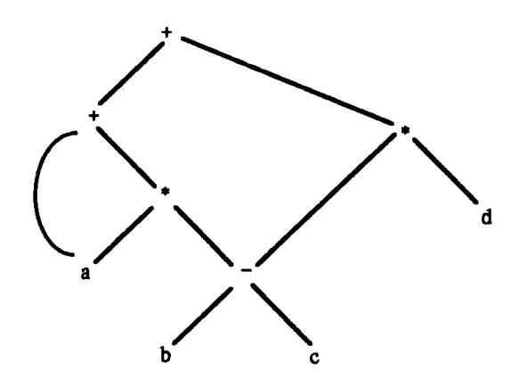

图 7.2 a+a\* (b-c)+(b-c)\*d的 DAG

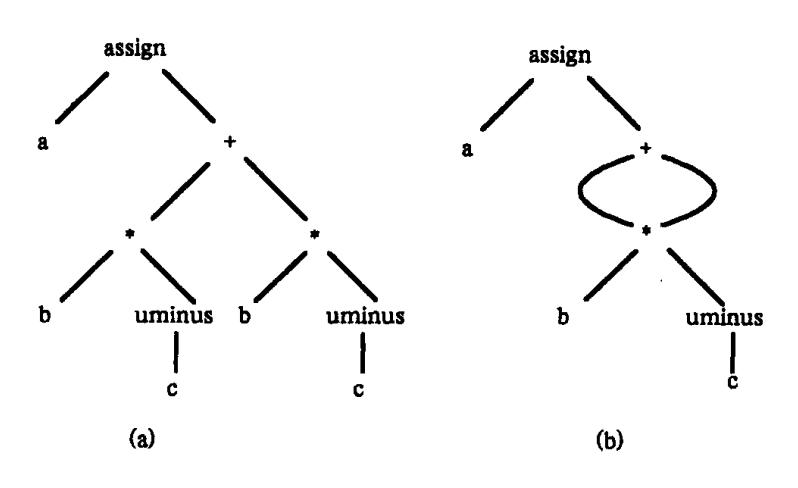

图 7.3 a: = b\* - c + b\* - c 的图表示法 (a)语法树;(b)DAG。

凑,因为它可以标识出公共子表达式。如图 7.3 是赋值语句 a: = b\* - c + b\* - c 的语法 树和 DAG。

可以看出,后缀式是抽象语法树的线性表示形式;后缀式是树结点的一个序列,其中的每个结点都是在它的所有子结点之后立即出现的。例如,在图 7.3(a)中的语法树的后缀式是:

抽象语法树的边没有显式地出现在后缀式中,这些边可以根据结点出现的次序及表示操作符的结点要求操作数的个数还原出来。

产生赋值语句抽象语法树的属性文法如表 7.2 所示,它是第 6.2 节关于表达式的属性文法的一个扩展。非终结符号 S产生一个赋值语句。二目算符 + 和 \* 是从典型语言运算符号集中选出的两个代表。运算符的结合律和优先次序按照通常的规定,这些规定未在文法中体现。根据表 7.2,可以从输入串 a: = b \* - c + b \* - c 构造出相应的图 7.3(a)的抽象语法树。

若函数 mknode(op, child)和 mknode(op, left, right)每当可能时就返回一个指向一个存在的结点的指针,以代替建立新的结点,那么,同样的这个属性文法将生成图 7.3(b)中的 DAG。符号 id 有一个属性 place,它是一个指向符号表中该标识符表项的指针。

在 7.3 节中, 我们将介绍如何查找标识符相应的符号表入口。

{3}------------------------------------------------

| 产生式                       | 语义规则                                                       |
|---------------------------|------------------------------------------------------------|
| S→id: = E                 | S.nptr: = mknode('assign', mkleaf(id, id.place), E.nptr)   |
| $E \rightarrow E_1 + E_2$ | E. nptr: = $mknode(' + ', E_1 \cdot nptr, E_2 \cdot nptr)$ |
| $E \rightarrow E_1 * E_2$ | E. nptr: = $mknode('* *', E_1. nptr, E_2. nptr)$           |
| $E \rightarrow -E_1$      | E. nptr: = $mknode('uminus', E_1. nptr)$                   |
| E→ (E <sub>1</sub> )      | $\mathbf{E.nptr}_{:} = \mathbf{E}_{1} . \mathbf{nptr}$     |
| E→id                      | E.nptr: = mkleaf(id,id.place)                              |

表 7.2 产生赋值语句抽象语法树的属性文法

对于图 7.3(a)中的抽象语法树,可以有两种表示法,见图 7.4。每一个结点用一个记录来表示,该记录包括一个运算符号域和若干个指向子结点的指针域。在图 7.4(b)中,把所有的结点安排在一个记录的数组中,结点的位置或索引作为指向地点的指针。从第 10 号位置上的根结点开始并沿着指针所指的方向进行,抽象语法树中的所有结点都能被访问到。

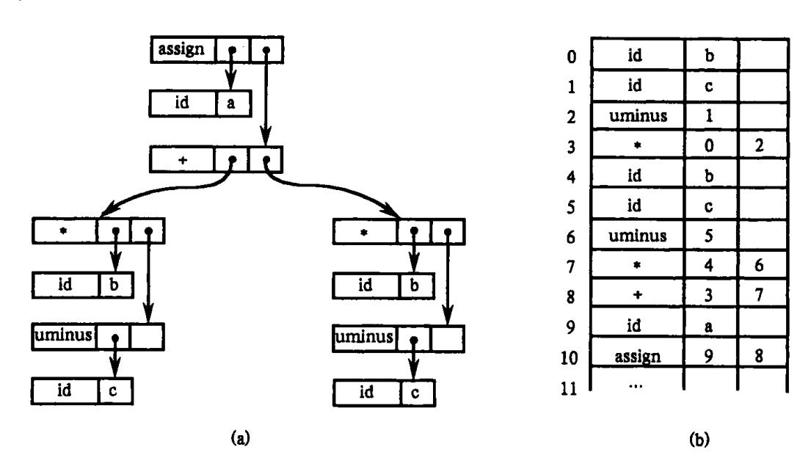

图 7.4 图 7.3 抽象语法树的两种表示法 (a)表示方法之一; (b)表示方法之二。

## 7.1.3 三地址代码

三地址代码是由下面一般形式的语句构成的序列:

$$x = y \text{ op } z$$

其中,x、y、z为名字、常数或编译时产生的临时变量;op 代表运算符号如定点运算符、浮点运算符、逻辑运算符等等。每个语句的右边只能有一个运算符。例如,源语言表达式 x+y\*z可以被翻译为如下语句序列:

$$T_1:=y*z$$

$$T_2 : = x + T_1$$

其中,T1,T2为编译时产生的临时变量。

{4}------------------------------------------------

三地址代码可以看成是抽象语法树或 DAG 的一种线性表示。例如图 7.5 给出了图 7.3 中的抽象语法树和 DAG 分别对应的三地址代码。

之所以称为三地址代码是因为每条语句通常包含三个地址,两个用来表示操作数,一个用来存放结果。对于后面给出的三地址代码中,用户定义的名字在实际实现时将由指向符号表中的相应名字入口的指针所代替。

$$T_{1} := -c \\ T_{2} := b * T_{1} \\ T_{3} := -c \\ T_{4} := b * T_{3} \\ T_{5} := T_{2} + T_{4} \\ a := T_{5} \\ (a)$$
 
$$T_{1} := -c \\ T_{2} := b * T_{1} \\ T_{5} := T_{2} + T_{2} \\ a := T_{5} \\ (b)$$

图 7.5 相应于图 7.3 的树和 DAG 的三地址代码 (a) 对于抽象语法树的代码; (b) 对于 DAG 的代码。

三地址语句类似于汇编语言代码。语句可以带有符号标号,而且存在各种控制流语句。符号标号代表存放中间代码的数组中三地址代码语句的下标。下面列出本书所使用的三地址语句的种类。

- (1) 形如 x: = y op z 的赋值语句,其中 op 为二元算术算符或逻辑算符。
- (2) 形如 x:=op y 的赋值语句,其中 op 为一元算符,如一元减 uminus、逻辑非 not、移位算符及转换算符(如将定点数转换成浮点数)。
  - (3) 形如 x: = y 的复制语句,它将 y 的值赋给 x。
- (4) 形如 goto L 的无条件转移语句,即下一条将被执行的语句是带标号 L 的三地址语句。
- (5) 形如 if x relop y goto L 或 if a goto L 的条件转移语句。第一种形式语句施用关系运算符号 relop(如 < , = , > , = 等等)于 x 和 y,若 x 与 y 满足关系 relop,那么下面就执行带标号 L 的语句,否则下面就继续执行 if 语句之后的语句。第二种形式的语句中,a 为布尔变量或常量,若 a 为真,则执行带标号 L 的语句,否则执行后一条语句。
- (6) 用于过程调用的语句 param x 和 call p,n,以及返回语句 return y。源程序中的过程调用语句  $p(x_1,x_2,\cdots,x_n)$ 通常产生如下的三地址代码:

param  $x_1$ param  $x_2$ .....

param  $x_n$ call p, n

其中 n 表示实参个数。过程返回语句 return y 中 y 为过程返回的一个值。

- (7) 形如  $x_{:} = y[i]$ 及  $x[i]_{:} = y$  的索引赋值。前者把相对于地址 y 的后面第 i 个单元 里的值赋给  $x_{:}$ 。后者把 y 的值赋给相对于地址  $x_{:}$ 后面的第 i 个单元。
- (8) 形如 x:=&y, x:=\*y 和 \* x:=y 的地址和指针赋值。其中第一个赋值语句把 y 的地址赋给 x。这里假定 y 是一个名字,或者是一个临时变量,代表一个具有左值的表达

{5}------------------------------------------------

式,例如 A[i,j];并且 x 是一个指针名字或临时变量。也就是说,x 的右值将被赋予对象 y 的左值。第二个赋值语句 x: = \* y,假定 y 是一个指针或者是一个其右值为地址的临时变量。此语句执行的结果是把 y 所指示的地址单元里存放的内容赋给 x。第三个赋值语句 \* x: = y,将把 x 所指向的对象的右值赋为 y 的右值。

在设计中间代码形式时,运算符的选择是非常重要的。显然,算符种类应足以用来实现源语言中的运算。一个小型算符集合较易于在新的目标机器上实现。然而,用局限的指令集合会使某些源语言运算表示成中间形式时代码加长,从而需要在目标代码生成时做较多的工作以获得高效的代码。

生成三地址代码时,临时变量的名字对应抽象语法树的内部结点。对于产生式  $E \top$   $E_1 + E_2$  的左端的非终结符号 E 而言,它的经过计算得出的值往往放到一个新的临时变量 T 中。一般说来,赋值语句 id: = E 的三地址代码包括:对表达式 E 求值并置于变量 T 中,然后进行赋值 id. place: = T 。如果一个表达式仅有一单个标识符,例如 y ,则由 y 自身保留表达式的值。我们先假设对新的临时变量的引入不加限制,7.3 节再来考虑临时单元的 重用。

表 7.3 是为赋值语句生成三地址代码的 S-属性文法定义。如给定输入 a:=b\*-c+ b\*-c,便可产生如图 7.5(a)的代码。非终结符号 S 有综合属性 S.code,它代表赋值语句 S 的三地址代码。非终结符号 E 有如下两个属性:

- (1) E. place 表示存放 E 值的名字;
- (2) E. code 表示对 E 求值的三地址语句序列。

函数 newtemp 的功能是,每次调用它时,将返回一个不同临时变量名字,如 T<sub>1</sub>,T<sub>2</sub>,…。为了方便,我们在表 7.3 中使用 gen(x ':=' y '+' z)表示生成三地址语句 x:=y+z。代替 x,y或 z 出现的表达式在传递给 gen 时求值,用单引号括起来的运算符或操作数将保留引号里字面的符号。在实际实现中,三地址语句序列往往是被存放到一个输出文件中,而不是将三地址语句序列置入 code 属性之中。在表 7.3 中可以加进有关控制语句的产生式及语义规则,从而产生控制语句的三地址代码。关于控制语句的翻译我们将在稍后介绍。

| 产生式                       | 语义规则                                                                          |
|---------------------------|-------------------------------------------------------------------------------|
| S→id: = E                 | S.code: = E.code    gen(id.place ': = 'E.place);                              |
| $E \rightarrow E_1 + E_2$ | E. place; = newtemp;                                                          |
|                           | $E. code$ : = $E_1. code \parallel E_2. code \parallel$                       |
|                           | gen(E.place ': = 'E <sub>1</sub> .place '+ 'E <sub>2</sub> .place);           |
| $E \rightarrow E_1 * E_2$ | E.place: = newtemp;                                                           |
|                           | $E. code: = E_1. code \parallel E_2. code \parallel$                          |
|                           | gen(E. place ': = ' $E_1$ . place '* ' $E_2$ . place);                        |
| $E \rightarrow -E_1$      | E. place: = newtemp;                                                          |
|                           | $E. code$ : = $E_1. code \parallel gen(E. place ': = ' 'uminus' E_1. place);$ |
| $E \rightarrow (E_1)$     | $E.place: = E_1.place;$                                                       |
|                           | $E.code; = E_1.code;$                                                         |
| E→id                      | E. place: = id. place;                                                        |
|                           | E. code = ' ';                                                                |

表73 对赋值语句产生三批址代码的属性文法

{6}------------------------------------------------

三地址语句可看成中间代码的一种抽象形式。编译程序中,三地址代码语句的具体实现可以用记录表示,记录中包含表示运算符和操作数的域。通常有三种表示方法:四元式、三元式、间接三元式。

## 1. 四元式

一个四元式是一个带有四个域的记录结构,这四个域分别称为 op、arg1、arg2 及 result。域 op 包含一个代表运算符的内部码。三地址语句 x:=y op z 可表示为:将 y 置于 arg1 域,z 置于 arg2 域,x 置于 result 域,:= 为算符。带有一元运算符的语句如 x:=-y 或者 x:=y 的表示中不用 arg2。而像 param 这样的运算符仅使用 arg1 域。条件和无条件转移语句将目标标号置于 result 域中。赋值语句 a:=b\*-c+b\*-c 的四元式表示如表 7.4(a) 所示,它们从图 7.5(a) 中的三地址代码获得。通常,四元式中的 arg1, arg2 和 result 的内容都是一个指针,此指针指向有关名字的符号表入口。这样,临时变量名也要填入符号表。

表 7.4 三地址语句的四元式、三元式表示

| 1 | a) | DП | 元  | # |
|---|----|----|----|---|
|   | 4, | -  | /4 |   |

|     | Op     | argl           | arg2           | result         |
|-----|--------|----------------|----------------|----------------|
| (0) | uminus | c              |                | $T_1$          |
| (1) | *      | b              | T <sub>1</sub> | T <sub>2</sub> |
| (2) | uminus | c              |                | T <sub>3</sub> |
| (3) | *      | ь              | T <sub>3</sub> | T <sub>4</sub> |
| (4) | +      | $T_2$          | T <sub>4</sub> | T <sub>5</sub> |
| (5) | :=     | T <sub>5</sub> |                | a              |
|     |        |                |                |                |

(b) 三元式

|     | op       | argl | arg2    |
|-----|----------|------|---------|
| (0) | uminus   | c    |         |
| (1) | *        | b    | (0)     |
| (2) | uminus   | c    |         |
| (3) | *        | ь    | (2)     |
| (4) | +        | (1)  | (3)     |
| (5) | assign   | a    | (4)     |
|     | <u> </u> |      | <u></u> |

#### 2. 三元式

为了避免把临时变量填入到符号表,我们可以通过计算这个临时变量值的语句的位置来引用这个临时变量。这样表示三地址代码的记录只需三个域: op、arg1 和 arg2,如表7.4(b)所示。因为用了三个域,所以称之为三元式。运算符 op 的两个操作数域 arg1 和 arg2,或者是指向符号表的指针(对程序中定义的名字或常量而言),或者是指向三元式表的指针(对于临时变量而言)。

在表 7.4(b)中,括号内的数表示指向三元式表的某一项的指针,而指向符号表的指针由名字自身表示。在实践中,应该能区分 arg1 或 arg2 中是哪一种指针,是指向符号表还是指向三元式表?表 7.4(b)中,三元式(0)代表 -c 的结果,三元式(1)中的(0)指第 0个三元式的结果,依次类推。

对于一目运算符 op、arg1 和 arg2 只需用其一。我们可随意规定选用一个,如我们在表 7.4(b)中,我们用的是 arg1。对于多目运算运算符,可用若干相继的三元式表示。例如,x[i]:= y 在三元式表中要用两项,如表 7.5(a)所示,而 x:= y[i]表示为两步操作,如表 7.5(b)所示。

{7}------------------------------------------------

表 7.5 多目运算的三元式表示

(a)

|     | op     | arg1 | arg2 |
|-----|--------|------|------|
| (0) | =[]    | x    | i    |
| (1) | assign | (0)  | у    |

(b)

|     | op     | argl | arg2 |
|-----|--------|------|------|
| (0) | []=    | у    | i    |
| (1) | assign | x    | (0)  |

## 3. 间接三元式

为了便于代码优化处理,有时不直接使用三元式表,而是另设一张指示器(称为间接码表),它将按运算的先后顺序列出有关三元式在三元表中的位置。换句话说就是,我们用一张间接码表辅以三元式表的办法来表示中间代码。这种表示法称为**间接三元式**。

例如,语句

$$X: = (A + B) * C;$$

$$Y: = D \uparrow (A + B)$$

的间接三元式表示如表 7.6 所示。

表 7.6 间接三元式表示

| 间接代码 |     | 三元式表     |      |      |
|------|-----|----------|------|------|
| (1)  |     | OP       | ARG1 | ARG2 |
| (2)  | (1) | +        | A    | В    |
| (3)  | (2) | *        | (1)  | С    |
| (1)  | (3) | :=       | X    | (2)  |
| (4)  | (4) | <b>†</b> | D    | (1)  |
| (5)  | (5) | ; =      | Y    | (1)  |

当在代码优化过程中需要调整运算顺序时,只需重新安排间接码表,无需改动三元式表。事实上,改动三元式表是很困难的,因为,许多三元式通过指示器紧密相联系。正因为这一点,我们需要间接三元式。例如 151 - FORTRAN 所用的中间语言就是间接三元式。

由于另设了间接表,因此,相同的三元式就无需重复填进三元式表中。如上述两个赋值句中均含有子式(A+B),而三元式(+,A,B)则只在表中出现一次。这样,可以节省三元式空间。

对于间接三元式表示,语义规则中应增添产生间接码表的动作,并且在向三元式表填进一个三元式之前,必须先查看一下此式是否已在其中,如已在其中,就无须填入。

我们可以把四元式与三元式和间接三元式作一些比较。四元式之间的联系是通过临时变量实现的。这一点和三元式不同。要更动一张三元表是很困难的,它意味着必须改变其中一系列指示器的值。但要更动四元式表是很容易的,因为调整四元式之间的相对位置并不意味着必须改变其中一系列指示器的值。因此,当需要对中间代码进行优化处理时,四元式比三元式要方便得多。对优化这一点而言,四元式和间接三元式同样方

{8}------------------------------------------------

便。

# 7.2 说明语句

当考查一个过程或分程序的一系列说明语句时,便可为局部于该过程的名字分配存储空间。对每个局部名字,我们都将在符号表中建立相应的表项,并填入有关的信息如类型、在存储器中的相对地址等。相对地址是指对静态数据区基址或活动记录中局部数据区基址的一个偏移量。有关活动记录我们将在第九章详细介绍。

当产生中间代码地址时,对目标机一些情况做到心中有数是有好处的。例如,假定在一个以字节编址的目标机上,整数必须存放在4的倍数的地址单元,那么,计算地址时就应以4的倍数增加。

## 7.2.1 过程中的说明语句

在 C、Pascal 及 FORTRAN 等语言的语法中,允许在一个过程中的所有说明语句作为一个组来处理,把它们安排在一所数据区中。从而我们需要一个全程变量如 offset 来跟踪下一个可用的相对地址的位置。

在图 7.6 关于说明语句的翻译模式中,非终结符号 P产生一系列形如 id:T 的说明语句。在处理第一条说明语句之前,先置 offset 为 0,以后每次遇到一个新的名字,便将该名字填入符号表中并置相对地址为当前 offset 之值,然后使 offset 加上该名字所表示的数据对象的域宽。

```
P→ D
                                  \{\text{offset}:=0\}
D→D:D
D→id:T
                                  enter(id. name, T. type, offset);
                                         offset: = offset + T. width
T→integer
                                  T. type: = integer;
                                     T. width: =4
T→real
                                  {T. type: = real:}
                                     T. width: = 8
T\rightarrow array[num] of T_1\{T.type: = array(num.val, T_1.type);
                                     T. width: = num. val \times T_1. width
T \rightarrow \uparrow T_1
                                  \{T. type: = pointer(T_1. type);
                                     T. width: = 4
```

图 7.6 计算说明语句中名字的类型和相对地址

过程 enter(name, type, offset)用来把名字 name 填入到符号表中,并给出此名字的类型 type 及在过程数据区中的相对地址 offset。非终结符号 T 有两个综合属性 T. type 和 T. width,分别表示名字的类型和名字的域宽(即该类型名字所占用的存储单元个数)。在图 7.6 中,假定整数类型域宽为 4;实数域宽为 8;一个数组的域宽可以通过把数组元素数目与一个元素的域宽相乘获得;每个指针类型的域宽假定为 4。

{9}------------------------------------------------

如果把图 7.6 中的第一条产生式及其语义动作写在一行,则对 offset 赋初值更明显,如下式所示:

$$P \rightarrow | \text{offset} := 0 | D \tag{7.1}$$

在 6.5 节曾谈到产生  $\varepsilon$  的标记非终结符号,可以用它来重新改写上述产生式以便语义动作均出现在整个产生式的右边。我们可采用标记非终结符号 M 来重写式(7.1):

$$P \rightarrow M D$$

$$M \rightarrow \varepsilon \qquad \{ \text{offset: } = 0 \}$$

## 7.2.2 保留作用域信息

允许嵌套过程的语言,对于每一个过程,其中局部名字的相对地址计算可以采用图 7.6 的方法。而当遇到一个嵌入的过程说明时,则应当暂停包围此过程的外围过程说明 语句的处理。这种方法可以通过在如下的语言中加入有关语义动作来说明。

$$P \rightarrow D$$
  
 $D \rightarrow D; D \mid id; T \mid proc id; D; S$  (7.2)

由于我们当前的目标是考虑说明语句,因而对其中产生语句的非终结符号 S 及产生类型的非终结符号 T 的产生式我们没有给出。与图 7.6 中相同, T 有两个综合属性 type 和 width。

为简化起见,我们假定对于式(7.2)的语言的每一个过程都有一张独立的符号表。这种符号表可用链表实现。当碰到过程说明 D→proc id; D<sub>1</sub>; S 时,便创建一张新的符号表,并且把在 D<sub>1</sub> 中的所有说明项都填入此符号表内。新表有一个指针指向刚好包围该嵌入过程的外围过程的符号表,由 id 表示的过程名字作为该外围过程的局部名字。对图 7.6 处理变量说明的唯一修改是,要告诉 enter 在哪个符号表填入一项。

例如,图 7.7 给出了下面程序中五个过程的符号表。过程 readarray, exchange 和 quick-sort 的符号表有指针指向其外围过程 sort 的符号表。另一过程 partition 是在 quicksort 中被说明,因此,它的符号表有指针指向 quicksort 的符号表。

在下面的语义规则中用到如下操作。

- (1) mktable(previous)创建一张新符号表,并返回指向新表的一个指针。参数 previous 指向一张先前创建的符号表,譬如刚好包围嵌入过程的外围过程符号表。指针 previous 之值放在新符号表表头,表头中还可存放一些其它信息如过程嵌套深度等等。我们也可以按过程被说明的顺序对过程编号,并把这一编号填入表头。
- (2) enter (table name type offset) 在指针 table 指示的符号表中为名字 name 建立一个新项,并把 类型type 相对地址 offset 填入到该项中。
- (3) addwidth(able, with) 指针 table 指示的符号表表头中记录下该表中所有名字占用的总宽度
- (4) enterprov(table nae, newtable)在指针 table 指示的符号表中为名字为 name 的过程建立一个新项。参数 newtable 指向过程 name 的符号表。

在图 7.8 中的翻译模式给出了如何在一遍扫描中对数据进行处理,它使用了一个栈 tblptr 保存各外层过程的符号表指针。

{10}------------------------------------------------

对于图7.7所示的符号表,当处理过程partition中的说明语句时,栈tblptr中将包括指

```
(1) program sort(input, output)
      var a: array[0..10] of integer;
(2)
(3)
          x: integer;
(4)
          procedure readarray;
(5)
             var i: integer;
(6)
             begin ··· a ··· end {readarray}
(7)
          procedure exchange (i, j: integer);
(8)
             begin
(9)
                  x := a[i]; a[i] := a[j]; a[j] := x
(10)
             end exchange:
(11)
          procedure quicksort (m, n:integer);
(12)
             var k, v: integer;
(13)
             function partition (y, z: integer):integer;
(14)
                     var i, j: integer;
                    begin ···a···
(15)
(16)
                           ···exchange(i, j);···
(17)
(18)
                    end | partition |;
(19)
            begin ... end | quicksort |;
(20) begin ··· end {sort}.
```

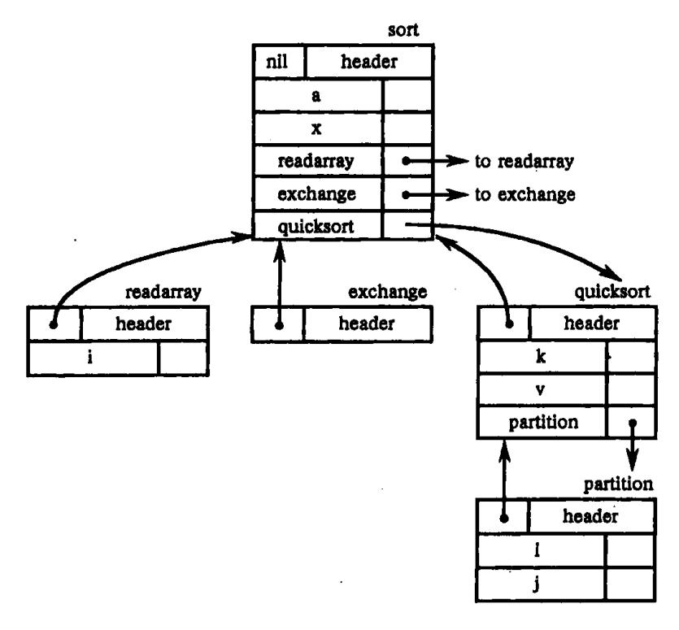

图 7.7 嵌套过程的符号表

向 sort, quicksort 及 partition 的符号表的指针。指向当前符号表的指针在栈顶。另一个栈 offset 存放各嵌套过程的当前相对地址。offset 的栈顶元素为当前被处理过程的下一个局 部名字的相对地址。

{11}------------------------------------------------

```
P \rightarrow M D
                                  addwidth(top(tblptr),top(offset));
                                      pop(tblptr); pop(offset) }
M→e
                                 t: = mktable(nil):
                                    push(t,tblptr);push(0,offset) }
D \rightarrow D_1; D_2
D→proc id; N D<sub>1</sub>; S
                                 t:=top(tblptr);
                                   addwidth(t,top(offset));
                                   pop(tblptr); pop(offset);
                                    enterproc(top(tblptr),id.name,t) {
D→id:T
                                 enter(top(tblptr), id. name, T. type,
                                    top(offset));
                                    top(offset); = top(offset) + T. width }
N→ε
                                t: = mktable(top(tblptr));
                                     push(t,tblptr); push(0,offset) |
```

图 7.8 处理嵌套过程中的说明语句

对于

```
A→B C {actionA}
```

所有关于非终结符号 B、C 的语义动作均已先于 actionA 完成。因此,在图 7.8 中将先做与标记非终结符号 M 相应的语义动作。

M 的语义动作把栈 tblptr 初始化为仅含指向最外层作用域的符号表的指针,由 mk-table(nil)创建初始符号表,并把符号表的指针返回给 t;同时还把相对地址 0 压入栈 offset 中。当出现一个过程说明时,非终结符起着类似的作用。它的语义动作使用 mktable(top(tblptr))来创建一个新的符号表。这里参数 top(tblptr)为指向刚好包围此嵌入过程的外围过程符号表的指针。把指向新表的指针压入栈 ablptr 的栈顶,同样把相对地址 0 压入 offset 栈顶。

每遇到一个变量说明 id:T,就把 id 填入在当前符号表中。这时栈 tblptr 保持不变,而栈 offset 的栈顶值增加 T. width。当开始执行产生式  $D \rightarrow proc$  id;  $ND_1$ ; S 右边的语义动作时,由  $D_1$ 产生的所有名字占用的总宽度便是 offset 的栈顶值,它由过程 addwidth 记录下来;同时,栈 tblptr D offset 的栈项值被弹出,我们返回到外层过程中的说明语句继续处理。并在此时把过程的名字 id 填入到其外围过程的符号表中。

#### 7.2.3 记录中的域名

除了基本类型、指针和数组外,下述产生式使非终结符号 T产生记录类型:

```
T→record D end
```

图 7.9 给出了为记录中的域名建立一张符号表的翻译模式。因为在图 7.8 中过程定义并不影响域宽的计算,因此我们允许过程定义出现在记录中。这样,图 7.9 的 D 与图 7.8 中的 D 意义相同。

当遇到保留字 record 时,与标记非终结符号 L 相应的语义动作为记录中的各域名创建一张新的记录符号表。把指向该表的指针压入栈 tblptr 中,并把相对地址 0 压入栈 off-

{12}------------------------------------------------

set 中。根据图 7.8 可知,产生式 D→id:T 的语义动作是将域名 id 的有关信息填入此记录的符号表中。当记录的所有域名都被检查过之后,在 offset 的栈顶将存放着记录之内的所有数据对象的总域宽。图 7.9 中 end 之后的语义动作是将 offset 的栈顶的总域宽作为综合属性 T. width 的值。类型 T. type 通过对指向本记录符号表的指针施用类型构造符 record 而得到。在下一节该指针将用来从 T. type 恢复记录中各域的域名、类型及域宽等。有关类型构造符和类型表达式概念将在 7.7 节介绍。

```
T→record LD end { T.type: = record(top(tblptr));

T.width: = top(offset);

pop(tblptr); pop(offset) }

L→ε { t: = mktable(nil);

push(t, tblptr); push(0, offset))}
```

图 7.9 为记录中的域名建立一张符号表

# 7.3 赋值语句的翻译

在本节中赋值语句中的表达式的类型可以是整型、实型、数组和记录。作为翻译赋值语句为三地址代码的一个部分,我们将讨论如何在符号表中查找名字及如何存取数组和记录的元素。

## 7.3.1 简单算术表达式及赋值语句

我们在 7.1 节的三地址语句中直接使用了名字,并且将它理解为指向符号表中该名字人口的指针。图 7.10 给出了把简单算术表达式及赋值语句翻译为三地址代码的翻译模式。该翻译模式中还说明了如何查找符号表的人口。属性 id. nam. 表示 id 所代表的名字本身。过程 lookup(id. name)检查是否在符号表中存在相应此名字的人口。如果有,则返回一个指向该表项的指针,否则,返回 nil 表示没有找到。

在图 7.10 的语义动作中,调用过程 emit 将生成的三地址语句发送到输出文件中,而不是如表 7.3 中那样建造非终结符号的 code 属性。

我们可以重新解释在图 7.10 中的 lookup 操作,若采用最近嵌套作用域规则查找非局部名字,如 Pascal 语言中的那样,此时图 7.10 中的翻译模式仍是可用的。为直观起见,假定赋值语句出现在如下文法形成的上下文环境中:

P→M D
$$M \rightarrow \varepsilon$$
D→D; D|id:T|proc id; N D; S
$$N \rightarrow \varepsilon$$
(7.3)

如果把这些产生式加到图 7.10 中的文法中,非终结符 P 就变为开始符号。

对于上述文法(7.3)所生成的每一个过程,图 7.8 中的翻译模式都将为之建立一张独立的符号表。而每个这样的符号表表头均有一个指针指向其直接外层过程(见图 7.7 的

{13}------------------------------------------------

例子)。当处理构成过程体的语句时,一个指向此过程的符号表的指针出现在栈 tblptr 的顶部。这是由产生式 D→proc id; N D; S 右边的标记非终结符号 N 的语义动作将该指针压入栈中的。

```
S \rightarrow id : = E
                                               p: = lookup(id.name);
                                               if p \neq nil then
                                               emit(p ':= ' E.place)
                                               else error
E \rightarrow E_1 + E_2
                                               {E. place: = newtemp;
                                               emit(E. place ': = 'E<sub>1</sub>. place '+ 'E<sub>2</sub>. place)
                                               {E. place: = newtemp;
E \rightarrow E_1 * E_2
                                               emit(E. place ':= 'E_1. place '* 'E_2. place)
                                               {E. place: = newtemp;
E \rightarrow E_1
                                               emit(E. place': = ' 'uminus' E<sub>1</sub>. place)
E \rightarrow (E_1)
                                               \{E. place: = E_1. place\}
E→id
                                            {p := lookup(id. name);}
                                               if p≠nil then
                                               E. place: = p
                                               else error
```

图 7.10 产生赋值语句三地址代码的翻译模式

非终结符号 S 的产生式如图 7.10。由 S 所产生的赋值语句中的名字必须或者是在 S 所在的那个过程中已被说明,或者是在某个外层过程中已被说明。当应用到 name 时,新的 lookup 过程先通过 top(tblptr)指针在当前符号表中查找,看是否 name 在表中。若未找到,lookup 就利用当前符号表表头的指针找到该符号表的外围符号表,然后在那里查找名字 name,一直到查找出 name 为止。如果所有外围过程的符号表中均无此 name,则 lookup 返回 nil,表明查找失败。

例如,对于图 7.7 中的符号表,假定过程 partition 中的一条赋值语句正在被处理。操作 lookup(i)将在 partition 的符号表中找到一个人口;因 v 不在这个符号表中,lookup(v)将使用此表表头中的指针继续在外层过程 quicksort 的符号表中查找。

#### 7.3.2 数组元素的引用

我们现在讨论包含数组元素的表达式和赋值句的翻译问题。数组在存储器中的存放方式决定了数组元素的地址计算法,从而也决定了应该产生什么样的中间代码。

若数组 A 的元素存放在一片连续单元里,则可以较容易地访问数组的每个元素。假设数组 A 每个元素宽度为 w,则 A[i]这个元素的起始地址为

$$base + (i - low) \times w \tag{7.4}$$

其中 low 为数组下标的下界并且 base 是分配给数组的相对地址,即 base 为 A 的第一个元素 A[low]的相对地址。

把式(7.4)整理为

{14}------------------------------------------------

$$i \times w + (base - low \times w)$$

则其中子表达式  $C = base - low \times w$  可以在处理数组说明时计算出来。我们假定 C 值存放在符号表中数组 A 的对应项中,则 A[i] 相对地址可由  $i \times w + C$  计算出来。

对于多维数组也可作类似处理。一个二维数组,可以按行或按列存放。如对于 2 x 3 的数组 A,图 7.11 给出了存放方式,图 7.11(a)是将它按行存放,图 7.11(b)是将它按列存放。FORTRAN 采用按列存放,Pascal 采用按行存放。

若二维数组 A 按行存放,则可用如下公式计算 A[i1,i2]的相对地址:

base + 
$$((i_1 - low_1) \times n_2 + i_1 - low_2) \times w$$

其中, $low_1$ 、 $low_2$  分别为  $i_1$ 、 $i_2$ 的下界; $n_2$ 是  $i_2$ 可取值的个数。即若  $high_2$ 为  $i_2$ 的上界,则  $n_2$  =  $high_2$  –  $low_2$  + 1。假定  $i_1$ 、 $i_2$ 是编译时唯一尚未知道的值,我们可以重写上述表达式为

$$((i_1 \times n_2) + i_2) \times w + (base - ((low_1 \times n_2) + low_2) \times w)$$
 (7.5)  
后一项子表达式 $(base - ((low_1 \times n_2) + low_2) \times w)$ 的值是可以在编译时确定的。

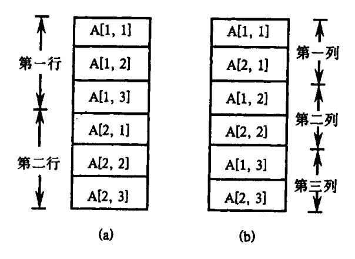

图 7.11 二维数组的存放方式 (a)按行存放;(b)按列存放。

按行或按列存放方式可推广到多维数组。若多维数组 A 按行存放,则越往右边的下标变化越快,像自动计程仪显示数据一样。式(7.5)可推广成如下计算元素  $A[i_1,i_2,\cdots,i_k]$ 相对地址公式:

$$((\cdots i_1 \ n_2 + i_2) n_3 + i_3) \cdots) n_k + i_k) \times w +$$

$$base - ((\cdots ((low_1 \ n_2 + low_2) n_3 + low_3) \cdots) n_k + low_k) \times w$$
(7.6)

假定对任何  $j, n_j = high_j - low_j + 1$  是确定的,则式(7.6)中子项

$$C = ((\cdots((low_1 \ n_2 + low_2)n_3 + low_3)\cdots)n_k + low_k) \times w$$
(7.7)

可以在编译时计算出来并存放到符号表中数组 A 对应的项里。至于按列存放方式,则最左边下标变化最快。

某些语言允许数组的长度在运行时刻一个过程被调用时动态地确定。有关这种数组在运行时栈中的分配情况,将在第九章中介绍。计算这种数组元素地址的公式与在固定长度数组情况下是同样的,只是上、下界在编译时是未知的。

要生成有关数组引用的代码,其主要问题是把式(7.6)的计算与数组引用的文法联系起来。如果在图 7.10 的文法中 id 出现的地方也允许下面产生式中的 L 出现,则可把数组元素引用加入到赋值语句中。

{15}------------------------------------------------

Elist→Elist, E|E

为了便于语义处理,我们改写上述产生式为

即把数组名字 id 与最左下标表达式 E 相联系,而不是在形成 L 时与 Elist 相联系。其目的是使我们在整个下标表达式串 Elist 的翻译过程中随时都能知道符号表中相应于数组名字 id 的全部信息。对于非终结符号 Elist 引进综合属性 array,用来记录指向符号表中相应数组名字表项的指针。

我们还利用 Elist. ndim 来记录 Elist 中的下标表达式的个数,即维数。函数 limit(array, j)返回  $n_j$ ,即由 array 所指示的数组的第 j 维长度。最后, Elist. place 表示临时变量,用来临时存放由 Elist 中的下标表达式计算出来的值。

一个 Elist 可以产生一个 k – 维数组引用  $A[i_1,i_2,\cdots,i_k]$  的前 m 维下标,并将生成计算下面式子的三地址代码:

$$(\cdots((i_1n_2+i_2)n_3+i_3)\cdots)n_m+i_m$$
 (7.8)

利用如下的递归公式进行计算:

$$e_1 = i_1, e_m = e_{m-1} \times n_m + i_m$$
 (7.9)

于是, 当 m = k 时将 e<sub>k</sub> 乘以元素域宽 w 便可计算出式(7.6)的第一个子项。

描述 L 的左值(即地址)用两个属性 L. place 及 L. offset。如果 L 仅为一个简单名字, L. place 就为指向符号表中相应此名字表项的指针, 而 L. offset 为 null, 表示这个左值是一个简单的名字而非数组引用。非终结符号 E 的属性 E. place 的意义同图 7.10。

下面考虑在赋值语句中加入数组元素之后的翻译模式,我们将把语义动作加入到如下文法中:

- (1)  $S \rightarrow L := E$
- (2)  $E \rightarrow E + E$
- $(3) \quad E \rightarrow (E)$
- (4) E→L
- (5) L→Elist ]
- (6) L→id
- (7) Elist→ Elist, E
- (8) Elist→id [ E

与没有数组元素时的简单算术表达式的处理一样,在语义动作中由 emit 过程产生三地址代码。

若 L 是一个简单的名字,将生成一般的赋值;否则,若 L 为数组元素引用,则生成对 L 所指示地址的索引赋值:

1.  $S \rightarrow L := E$ 

对于算术表达式的代码完全与图 7.10 相同:

{16}------------------------------------------------

```
2. E \rightarrow E_1 + E_2
           {E. place: = newtemp;
                emit(E. place ':= 'E_1. place '+ 'E_2. place)
    3. E \rightarrow (E_1)
                \{E. place : = E_1. place\}
当一个数组引用 L 归约到 E 时,我们需要 L 的右值。因此我们使用索引来获得地址 L.
place[L.offset]的内容:
    4. E→L
           if L. offset = null then
               E. place: = L. place
           else begin
               E. place: = newtemp;
               emit(E.place ': = ' L.place '[ ' L.offset ']')
           end}
L. offset 是一个新的临时变量,存放着 w 与 Elist. place 的值的乘积。因此 L. offset 等价于式
(7.6)的第一项:
    5. L→Elist ]
           {L. place: = newtemp;
           emit(L. place ':= 'Elist. array '- 'C); {C的定义见式(7.7)}
           L. offset: = newtemp;
           emit(L.offset ':=' w '*' Elist.place)}
一个空的 offset 表示一个简单的名字:
    6. L→id
           { L. place: = id. place; L. offset: = null }
每当扫描到下一个下标表达式时,我们应用递归公式(7.9)。在下列语义动作中,Elist1.
place 与式(7.7)中的 e<sub>m-1</sub>对应, Elist. place 与式(7.9)中的 e<sub>m</sub> 对应。注意若 Elist1 有 m-1
个元素,则产生式左部的 Elist 有 m 个元素。
    7. Elist \rightarrow Elist<sub>1</sub>, E
           \{t: = newtemp;
               m: = Elist_1 . ndim + 1;
               emit(t ': = ' Elist1.place '* 'limit(Elist1.array,m));
               emit(t':=' t '+' E.place);
               Elist. array: = Elist_1. array;
               Elist.place: = t;
               Elist . ndim : = m
E. place 保存表达式 E 的值,以及当 m = 1 时式(7.8)之值。
    8. Elist→id [ E
               Elist.place: = E.place;
```

Elist. ndim: = 1;

{17}------------------------------------------------

Elist.array: = id.place}

例 7.1 设 A 为一个  $10 \times 20$  的数组,即 n1 = 10, n2 = 20,并设 w = 4。对赋值语句 x: = A[y,z]的带注释的语法分析树见图 7.12。该赋值语句被翻译成如下三地址语句序列:

$$T_1 := y * 20$$
 $T_1 := T_1 + z$ 
 $T_2 := A - 84$ 
 $T_3 := 4 * T_1$ 
 $T_4 := T_2[T_3]$ 
 $x := T_4$ 

其中每个变量,我们用它的名字来代替 id. place。

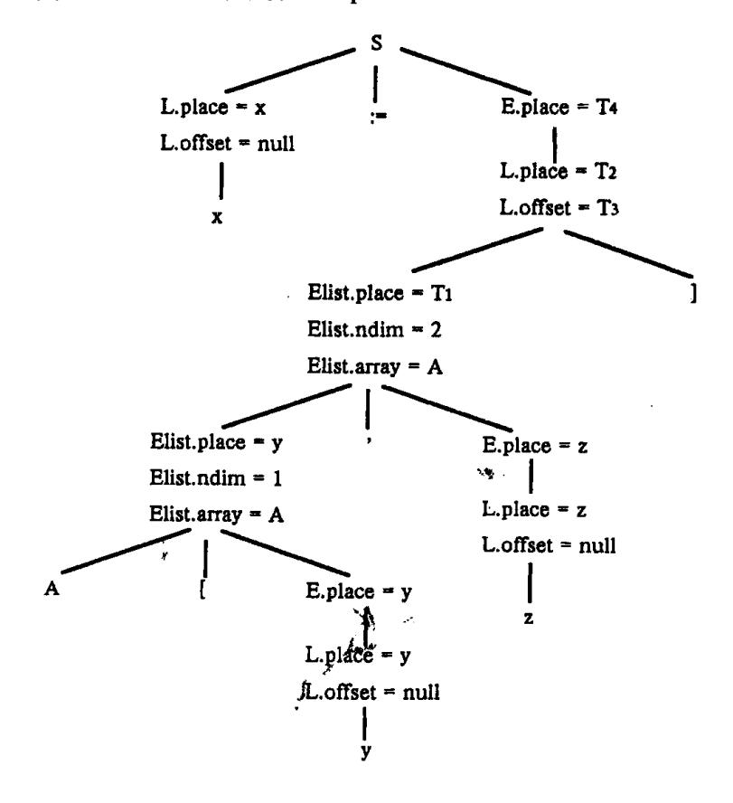

图 7.12 关于 x := A[y,z]的带注释的分析树

在前面关于算术表达式和赋值语句的翻译中,我们是假定所有的 id 都是同一类型的。实际上,在一个表达式中可能出现各种不同类型的变量或常数。所以,编译程序必须做到:或者拒绝接受某种混合运算,或者产生有关类型转换的指令。

我们现在假定前面有关算术表达式和赋值语句的文法中 id 既可以是实型量也可以是整型量。当两个不同类型的量进行运算时,我们规定首先必须把整型量转换为实型量。在这种混合运算的情况下,每个非终结符的语义值必须增添类型信息。我们用 E. type 表示非终结符 E 的类型属性。E. type 的值或为 real(实型)或为 integer(整型)。于是,对应产生式  $E \rightarrow E_1$  op  $E_2$  的语义动作中关于 E. type 的语义规则可定义为:

{ if 
$$E_1$$
. type = integer and  $E_2$ . type = integer then  $E$ . type: = integer

{18}------------------------------------------------

```
else E. type: = real}
```

从而,关于  $E \rightarrow E_1$  op  $E_2$  的语义动作应作修改,使得必要时能够产生对运算量进行类型转换的三地址代码。三地址代码

$$x := inttoreal y$$

意味着把整型量 y 转换成实型量,结果放在 y 中。此外,对于运算符应指出相应的类型, 说明是定点还是浮点运算。例如假定输入串为

$$x := y + i * j$$

其中,x、y 为实型;i、j 为整型。这个赋值句产生的三地址代码为

$$T_1$$
: = i int \* j

 $T_3$ : = inttoreal  $T_1$ 
 $T_2$ : = y real +  $T_3$ 

x: =  $T_2$ 

其中, int \* 和 real + 分别表示整型乘和实型加。

这样,关于产生式  $E \rightarrow E_l + E_l$ 的语义动作如下:

```
{E. place: = newtemp; if E_1. type = integer and E_2. type = integer then begin emit (E. place ': = 'E<sub>1</sub>. place 'int + 'E<sub>2</sub>. place); E. type: = integer end else if E_1. type = real and E_2. type = real then begin emit (E. place ': = 'E<sub>1</sub>. place 'real + 'E<sub>2</sub>. place); E. type: = real
```

end

else if  $E_1$ . type = integer and  $E_2$ . type = real then begin

u: = newtemp;

emit (u ':= ' inttoreal'  $E_1$ .place); emit (E.place ':= ' u 'real + '  $E_2$ .palce);

E.type: = real

end

else if  $E_1$ . type = real and  $E_1$ . type = integer then begin

u: = newtemp;

emit (u ': = 'inttoreal' E<sub>2</sub>.place);\nemit (E.place ': = 'E<sub>1</sub>.place 'real + 'u);

E.type: = real

end

else E. type: = type\_error

在上述的语义规则中,非终结符 E 的语义值除了含有 E. place 外还含有 E. type。这两方面的信息都必须保存在翻译栈中。如果运算量的类型增多,那么,语义程序中必须区别的情形也就迅速增多,从而使语义子程序变得累赘不堪。因此,在运算量的类型比较多的

{19}------------------------------------------------

情况下,仔细推敲语义规则就是一件重要的事情。

## 7.3.3 记录中域的引用

编译器必须将记录中的域的类型和相对地址保持下来。一般说来,把这些信息保存在相应的域名的符号表表项之中。这样做的好处是,可以把用在符号表中查找名字的程序同样用来查找域名。在此意义下,利用上一节图 7.9 中的语义动作可为每一个记录类型建立一张单独的符号表。如果 t 是一个指向某个记录类型的指针,把类型构造符 record 施于该指针,返回所形成的类型 record(t)作为属性 T. type 的值。

我们用表达式

$$p \uparrow . info + 1$$

翻译指向符号表的指针如何从属性 E. type 中提取出来。从这个表达式我们可以看出 p是一个指向某个记录的指针,这个记录有一个类型为算术型的域名 info。如果类型像图 7.8 和图 7.9 一样构造,则 p 的类型可以由类型表达式 pointer(record(t))给出。于是 p f 的类型是 record(t),t 可由此被先取出来。也就是说,域名 info 将可以在 t 所指向的符号表中查找。

# 7.4 布尔表达式的翻译

在程序设计语言中,布尔表达式有两个基本的作用:一个是用作计算逻辑值;另一个是用作控制流语句如 if - then , if - then - else 和 while - do 等之中的条件表达式。

布尔表达式是用布尔运算符号(and, or, not)作用到布尔变量或关系表达式上而组成的。关系表达式形如  $E_1$  relop  $E_2$ ,其中  $E_1$  和  $E_2$  是算术表达式, relop 为关系运算符(<, $\leq$ ,=, $\neq$ ,>, $\geq$ )。

在本节中,我们考虑由下列文法产生的布尔表达式:

我们使用 relop 的属性 relop.op 来确定 relop 指的是六个关系运算符中的哪一个。按惯例,我们假定 or 和 and 是左结合的,并且规定 or 的优先级最低,其次是 and, not 的优先级最高。

计算布尔表达式的值通常有两种办法。一种办法是,如同计算算术表达式一样,一步不差地从表达式各部分的值计算出整个表达式的值。例如,按通常的习惯,用数值1代表true,用0代表 false,那么,布尔式1 or (not 0 and 0) or 0 的计算过程是:

另一种计算法是采取某种优化措施。例如,假定要计算 A or B,如果计算出 A 的值为 1,那么,B 的值就无须再计算了。因为不管 B 的结果是什么,A or B 的值都为 1。同理,在 计算 A and B 时,若发现 A 为 0,则 B 的值也就无需再计算了。这种计算法意味着,我们可以用 if – then – else 来解释 or, and 和 not。也就是

{20}------------------------------------------------

把 A or B解释成 if A then true else B 把 A and B解释成 if A then B else false 把 not A解释成 if A then false else true

上述这两种计算法对于不包含布尔函数调用的式子是没有什么差别的。但是,假若一个布尔式中含有布尔函数调用,并且这种函数调用引起副作用(指对全局量的赋值)时,那么,上述两种计算法未必是等价的。有些程序语言规定,函数过程调用应不影响这个调用所处环境的计值。或者说,函数过程的工作不许产生副作用。在这种规定下,我们可以任选上述的一种方法。

下面我们将分别用这两种方法来讨论如何把布尔表达式翻译成地址代码。

## 7.4.1 数值表示法

让我们首先考虑用 1 表示真,0 表示假来实现布尔表达式的翻译。用这种方法,布尔表达式将从左到右按类似算术表达式的求值方法来计算。例如,对于布尔表达式:

a or b and not c

将被翻译成如下三地址序列:

 $T_1$ : = not c  $T_2$ : = b and  $T_1$  $T_3$ : = a or  $T_1$ 

一个形如 a < b 的关系表达式可等价地写成 if a < b then 1 else 0,并可将它翻译成如下三地址语句序列(我们假定语句序号从 100 开始):

100: if a < b goto 103 101: T: = 0 102: goto 104 103: T: = 1 104:

产生布尔表达式的三地址代码的翻译模式见图7.13。在此翻译模式中,我们假定过

```
E \rightarrow E_1 or E_2
                                 E. place: = newtemp;
                                       emit(E.place ':= 'E_1.place 'or' E_2.place)
E \rightarrow E_1 and E_2
                                 E. place: = newtemp;
                                       emit(E. place ':= 'E_1. place 'and 'E_2. place)
E \rightarrow not E_1
                                 E. place; = newtemp;
                                       emit(E.place ':= ' 'not' E_1.place)
E \rightarrow (E_1)
                                 \{E. place: = E_1. place\}
                                 {E. place: = newtemp;
E→id<sub>i</sub> relop id<sub>2</sub>
                                       emit('if' id_1.place relop. op id_2. place 'goto' nextstat + 3);
                                       emit(E.place ':=' '0');
                                       emit('goto' nextstat + 2);
                                       emit(E.place': = ' '1')}
E \rightarrow id
                                 E. place: = id. place
```

图 7.13 关于布尔表达式的数值表示法的翻译模式

{21}------------------------------------------------

程 emit 将三地址代码送到输出文件中, nextstat 给出输出序列中下一条三地址语句的地址索引,每产生一条三地址语句后,过程 emit 便把 nextstat 加 1。

例 7.2 根据图 7.13,对布尔表达式 a < b or c < d and e < f 可以生成图 7.14 中的三地址代码。

| 100: | if a < b goto 103   | 107: | $T_2:=1$                     |
|------|---------------------|------|------------------------------|
| 101: | $T_1:=0$            | 108: | if e < f goto 111            |
| 102: | goto 104            | 109: | $T_3:=0$                     |
| 103: | $T_1 := 1$          | 110: | goto 112                     |
| 104: | if $c < d$ goto 107 | 111: | $T_3:=1$                     |
| 105: | $T_2:=0$            | 112: | $T_4$ : = $T_2$ and $T_3$    |
| 106: | goto 108            | 113: | $T_5 := T_1 \text{ or } T_4$ |

图 7.14 布尔表达式 a < b or c < d and e < f 的翻译

## 7.4.2 作为条件控制的布尔式翻译

出现在条件语句

if E then S<sub>1</sub> else S<sub>2</sub>

(7.10)

中的布尔表达式 E,它的作用仅在于控制对  $S_1$  和  $S_2$  的选择。只要能够完成这一使命, E 的值就无须最终保留在某个临时单元之中。因此,作为转移条件的布尔式 E,我们可以赋予它两种"出口"。一是"真"出口,出向  $S_1$ ;一是"假"出口,出向  $S_2$ 。于是,语句(7.10)可翻译成如图 7.15 所示的一般形式。\*\*\*

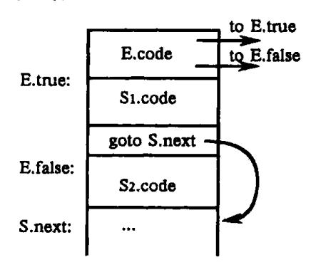

图 7.15 if - then - else 语句的代码结构

对于作为转移条件的布尔式,我们可以把它翻译为一串跳转指令。例如,可把语句 if a>c or b<d then  $S_l$  else  $S_2$ 

翻译成如下一串三地址代码:

if a > c goto  $L_2$ 

goto L<sub>1</sub>

 $L_1$ : if b < d goto  $L_2$ 

goto L<sub>3</sub>

 $L_2$ : (关于  $S_1$  的三地址代码序列)

{22}------------------------------------------------

## goto Lnext

L<sub>3</sub>: (关于 S<sub>2</sub> 的三地址代码序列)

Lnext:

在翻译过程中,我们假定可以用符号标号来标识一条三地址语句,并且假定每次调用函数 newlabel 后都返回一个新的符号标号。

对于一个布尔表达式 E, 我们引用两个标号: E. true 是 E 为'真'时控制流转向的标号; E. false 是 E 为'假'时控制流转向的标号。

我们的基本翻译思想如下:

假定 E 形如 a < b,则将生成如下的 E 的代码:

if a < b goto E. true goto E. false

假定 E 形如  $E_1$  or  $E_2$ 。若  $E_1$  为真,则立即可知 E 为真,于是  $E_1$ . true 与 E. true 是相同的。若  $E_1$  为似,则必须对  $E_2$  求值,因此我们置  $E_1$ . false 为  $E_2$  的代码的第一条指令的标号。而  $E_2$  的真、假出口可以分别与 E 的真、假出口相同。类似可考虑形如  $E_1$  and  $E_2$  的 E 的翻译。至于形如 not  $E_1$  的布尔表达式 E 不必生成新的代码,只要把  $E_1$  的假、真出口作为 E 的真、假出口即可。表 7.7 是按此方式将布尔表达式译成三地址代码的语义规则。注意 E 的 true 和 false 属性均为继承属性。

表 7.7 产生布尔表达式三地址代码的语义规则

| 产生式                                 | 语 义 规 则                                                                     |
|-------------------------------------|-----------------------------------------------------------------------------|
| $E \rightarrow E_1 \text{ or } E_2$ | $E_1$ . true: = $E$ . true;                                                 |
|                                     | $E_1$ . false: = newlabel;                                                  |
|                                     | $F_2$ .true; = E.true;                                                      |
|                                     | $E_2$ .false; = E.false;                                                    |
|                                     | $E. code$ : = $E_1. code \parallel gen(E_1. false ':') \parallel E_2. code$ |
| $E \rightarrow E_1$ and $E_2$       | $E_1$ . true: = newlabel;                                                   |
|                                     | $E_1$ . false: = E. false;                                                  |
|                                     | $E_2$ . true; = E. true;                                                    |
|                                     | E <sub>2</sub> .false; = E.fasle;                                           |
|                                     | E. code: = $E_1$ . code    gen( $E_1$ . true ':')    $E_2$ . code           |
| E→not E <sub>1</sub>                | $E_{I}$ .true: = E.false;                                                   |
|                                     | $E_{l}$ . false: = $E$ . true;                                              |
|                                     | $E. code$ : = $E_1. code$                                                   |
| $E \rightarrow (E_1)$               | $E_{l}$ . true; = $E$ . true;                                               |
|                                     | $E_1$ .false: = E.false;                                                    |
|                                     | $E.code: = E_I.code$                                                        |
| E→id₁ relop id₂                     | E. code: = gen('if' id1. place relop. op id2. place 'goto' E. true)         |
|                                     | gen('goto' E.false)                                                         |
| E→true                              | E.code: = gen('goto' E.true)                                                |
| E-→false                            | E. code: = gen('goto' E. false)                                             |

{23}------------------------------------------------

## 例 7.3 考虑如下表达式:

a < b or c < d and e < f

假定整个表达式的真假出口已分别置为 Ltrue 和 Lfalse,则按表 7.7 的定义将生成如下的代码:

if a < b goto Ltrue

goto L<sub>1</sub>

 $L_1$ : if c < d goto  $L_2$ 

goto Lfalse

 $L_2$ : if e < f goto Ltrue

goto Lfalse

自然,这里的代码是未优化的,有冗余的指令。

实现表 7.7 中的对布尔表达式进行翻译的语义规则的最容易方法是经过两遍扫描。首先,为给定的输入串构造一棵语法树;然后,对语法树进行深度优先遍历,进行语义规则中规定的翻译。下面我们要讨论如何通过一遍扫描来产生布尔表达式的代码。

为了便于讨论,我们假设下面在实现三地址代码时,采用四元式形式实现。把四元式 存入一个数组中,数组下标就代表四元式的标号。并且我们约定,在下面讨论中,

通过一遍扫描来产生布尔表达式和控制流语句的代码的主要问题在于,当生成某些转移语句时我们可能还不知道该语句将要转移到的标号究竟是什么。为了解决这个问题,我们可以在生成形式分支的跳转指令时暂时不确定跳转目标,而建立一个链表,把转向这个目标的跳转指令的标号键人这个链表。一旦目标确定之后再把它填入有关的跳转指令中。这种技术称为回填。

按照这个思想,我们为非终结符 E 赋予两个综合属性 E. truelist 和 E. falselist。它们分别记录布尔表达式 E 所应的四元式中需回填"真"、"假"出口的四元式的标号所构成的链表。具体实现时,我们可以借助于需要回填的跳转四元式的第四区段来构造这种链。例如,假定 E 的四元式中需回填"真"出口的有 p,q 和 r 三个四元式,这三个四元式可连成如下图所示的一条"真"链(truelist),作为 E. truelist 之值的是链首(r):

为了便于处理,需用到下面几个变量或函数(过程):

{24}------------------------------------------------

(7) M→ε

- (1) 变量 nextquad,它指向下一条将要产生但尚未形式的四元式的地址(标号)。nextquad 的初值为 1,每当执行一次 emit 之后, nextquad 将自动增 1。
- (2) 函数 makelist(i),它将创建一个仅含 i 的新链表,其中 i 是四元式数组的一个下标 (标号);函数返回指向这个链的指针。
- (3) 函数  $merge(p_1, p_2)$ , 把以 p1 和 p2 为链首的两条链合并为一, 作为函数值, 回送合并后的链首。
- (4) 过程 backpatch(p, t),其功能是完成"回填",把 p 所链接的每个四元式的第四区段都填为 t。

现在,我们来构造一个翻译模式,使之能在自底向上的分析过程中生成布尔表达式的四元式代码。我们在文法中插入了标记非终结符 M,以便在适当的时候执行一个语义动作,记下下一个将要产生的四元式标号。我们使用的文法如下:

```
(1) E \rightarrow E_1 \text{ or } M E_2
(2)
              \mid \mathbf{E}_1 \text{ and } \mathbf{M} \cdot \mathbf{E}_2 \mid
(3)
              I not E<sub>1</sub>
(4)
              ||(\mathbf{E}_1)||
(5)
              lid<sub>1</sub> relop id<sub>2</sub>
(6)
              lid
(7)
       M→ε
按照上面所考虑的一些思想,构造出布尔表达式的翻译模式如下:
(1) E \rightarrow E_1 or M E_2
                                  backpatch(E<sub>1</sub>.falselist, M.quad);
                                     E. truelist: = merge(E_1. truelist, E_2. truelist);
                                     E. falselist : = E_2. falselist
(2) E \rightarrow E_1 and M E_2
                                  backpatch(E<sub>1</sub>.truelist, M.quad);
                                  E. truelist: = E_2. truelist;
                                 E. falselist: = merge(E_1. falselist, E_2. falselist) }
(3) E \rightarrow not E_1
                                  E. truelist := E_1. falselist;
                                 E. falselist: = E_1. truelist
(4) E \rightarrow (E_1)
                                 \{E. truelist: = E_1. truelist; \}
                                    E. falselist: = E_1. falselist
(5) E→id<sub>1</sub> relop id<sub>2</sub>
                                 { E. truelist: = makelist(nextquad);
                                 E. falselist: = makelist(next quad + 1);
                                 emit('j' relop.op', 'id1.place', 'id2.place', ''0');
                                 emit('i, -, -, 0')
(6) E→id
                                 E. truelist: = makelist(nextguad):
                                    E. falselist: = makelist(nextquad + 1);
                                    emit('jnz',' id .place',','-',','0')
                                    emit('i, -, -, 0')
```

M. quad: = nextquad

考虑产生 E→E1 or M E2。如果 E1 为真,则 E 也为真。如果 E1 为假,须进一步检测

{25}------------------------------------------------

 $E_2$ 。若  $E_2$  为真则 E 也为真,若  $E_2$  为假则 E 为假。从而在  $E_1$  . falselist 所指向的表中所表示的那些转移指令的目标标号应为  $E_2$  的第一条语句的标号。这个目标标号是利用标记非终结符号 M 得到的。属性 M . quad 记录着  $E_2$  . code ( $E_2$  的代码)的第一条语句的标号。对产生式  $M \rightarrow \varepsilon$ ,我们有如下的语义动作:

变量 nextquad 保存着下一条将产生的四元式的标号,即四元式数组的索引。该值在分析完产生式  $E \rightarrow E_1$  or M  $E_2$  的其余部分以后用来回填到  $E_1$  . falselist 所指向的链中的指令中。

产生式(5)的语义动作中将生成两条语句:一条是条件转移语句;另一条是无条件转移语句。它们的目标标号均未填写。其中第一条语句的标号放到新构建的由 E. truelist 指向的表中;第二条语句的标号放到新构建的由 E. falselist 指向的表中。

例 7.4 重新考虑表达式 a < b or c < d and e < f。一棵作了注释的分析树如图 7.16 所示。语义动作是在对树的深度优先遍历中完成的。由于所有的语义动作均出现在产生式的右端的终点,因而它们可以在自下而上的语法分析中随着对产生式的归约来完成。

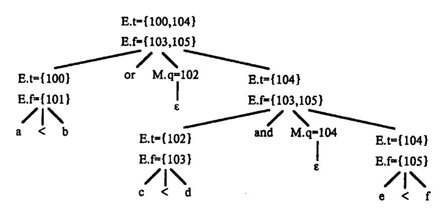

图 7.16 关于 a < b or c < d and e < f 的加了注释的分析树

在利用产生式(5)将 a < b 归约为 E 时,生成如下两个四元式:

这里我们假定语句标号从 100 开始。产生式  $E \rightarrow E_1$  or  $M E_2$  中的标记非终结符记录下一个 将要产生的四元式的标号 nextquad,此时是 102。通过第(5)个产生式把 c < d 归约到 E 产生四元式:

我们现在已分析到产生式  $E \rightarrow E_1$  and M  $E_2$  中的  $E_1$ 。这个产生式中的标记非终结符记录下当前 nexquad 的值,现在为 104。通过产生式(5)把 e < f 归约为 E 时产生四元式:

相应的 E 结点处的 E.t= $\{104\}$ , E.f $\{105\}$ 。现在让我们对产生式 E $\rightarrow$ E<sub>1</sub> and M E<sub>2</sub> 进行归约。相应的语义动作中有过程调用 backpatch( $\{102\}$ , 104), 其中参数 $\{102\}$ 表示一个指针,此指针指向仅包含标号 102 的表,这个表就是那个由 E<sub>1</sub>. truelist 所指向的。此次调用将把 104 回填到指令 102 中的目标标号部分(第四区段)。至今生成的六条指令如下:

{26}------------------------------------------------

最后用产生式 E→E<sub>1</sub> or M E<sub>2</sub> 进行归约,调用 backpatch({101},102)将上述指令变为:

整个表达式翻译完后,留下两个"真"出口(100 和 104)和两个假出口(103 和 105),这四条指令的转移目标没有填入,这要等到编译到一定时刻当布尔表达式为真作什么为假作什么确定之后才能填入。

# 7.5 控制语句的翻译

我们下面讨论控制语句的翻译。

## 7.5.1 控制流语句

现在我们考虑 if - then, if - then - else, while - do 语句的翻译。文法如下:

$$S$$
 if  $E$  then  $S_1$   
I if  $E$  then  $S_1$  else  $S_2$   
I while  $E$  do  $S_1$ 

其中E为布尔表达式。

与上一节一样,我们先讨论对这些语句进行翻译的一般的语义规则。然后讨论如何 通过一遍扫描产生上述语句的代码,给出相应的翻译模式。

关于这三条语句的代码结构如图 7.17 所示。条件语句 S 的语义规则允许控制从 S 的代码 S.code 之内转移到紧接 S.code 之后的那一条三地址指令。但是,有时此条紧接 S.code之后的指令是一条无条件转移指令,它转移到标号为 L 的指令。通过使用继承属性 S.next 可以避免上述连续转移的情况发生,而从 S.code 之内直接转移到标号为 L 的指令。S.next 之值是一个标号,它指出继 S 的的代码之后将被执行的第一条三地址指令。

在翻译 if – then 语句 S→if E then  $S_1$  时,我们建立了一个新的标号 E. true,并且用它来标识  $S_1$  的代码的第一条指令,如图 7.17(a) 所示。表 7.8 给出了一个属性文法。在 E 的代码中将有这样的转移指令:若 E 为真则转移到 E. true,并且若 E 为假则转移到 S. next。因此我们置 E. false 为 S. next。

{27}------------------------------------------------

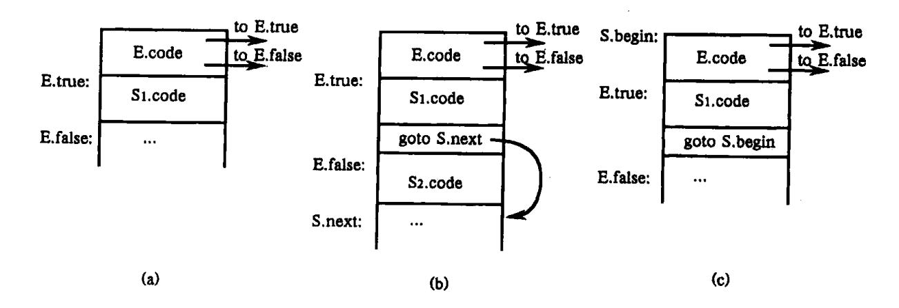

图 7.17 关于 if - then, if - then - else 和 while - do 语句的代码结构
(a) if - then; (b) if - then - else; (c) while - do。

表 7.8 控制流语句的属性文法

|                                                | - X 7.6 在构造的两层人丛                                 |
|------------------------------------------------|--------------------------------------------------|
| 产生式                                            | 语 义 规 则                                          |
| S→if E then S <sub>1</sub>                     | E. true: = newlabel;                             |
|                                                | E. flase: = S. next;                             |
|                                                | $S_1$ . next; = $S$ . next                       |
|                                                | S.code: = E.code                                 |
|                                                | gen(E.true ':')    S <sub>1</sub> .code          |
| S→if E then S <sub>1</sub> else S <sub>2</sub> | E. true; = newlabel;                             |
|                                                | E.false; = newlabel;                             |
|                                                | $S_1 \cdot \text{next} := S \cdot \text{next}$   |
|                                                | $S_2$ . next; = $S$ . next;                      |
|                                                | S.code: = E.code                                 |
|                                                | gen(E. true':')    S <sub>1</sub> . code         |
|                                                | gen('goto' S.next)                               |
|                                                | $gen(E.false ':') \parallel S_2.code$            |
| S→while E do S₁                                | S. begin: = newlabel;                            |
|                                                | E. true: = newlabel;                             |
|                                                | E.false: = S.next;                               |
|                                                | $S_1 \cdot \text{next} := S \cdot \text{begin};$ |
|                                                | S. code: = gen(S. begin ':')    E. code          |
|                                                | gen(E. true':')    S <sub>1</sub> . code         |
|                                                | gen('goto' S. begin)                             |

在翻译 if – then – else 语句  $S \rightarrow$  if E then  $S_1$  else  $S_2$  时,布尔表达式 E 的代码中有这样的转移指令:若 E 为真则转移到  $S_1$  的第一条指令,若 E 为假则转移到  $S_2$  的第一条指令。如

{28}------------------------------------------------

图 7.17(b)所示。与 if – then 语句一样,继承属性 S. next 给出了紧接着 S 的代码之后将被执行的三地址指令的标号。在  $S_1$  的代码之后有一条明显的转移指令 goto S. next,但  $S_2$  之后没有。请读者注意,考虑到语句的相互嵌套, S. next 未必是紧跟在  $S_2$ . code 之后的那条代码的标号。如:

if  $E_1$  then if  $E_2$  then  $S_1$  else  $S_2$  else  $S_3$ 

说明了这种情况。

while – do 语句 S→while E do  $S_1$  的代码结构如图 7.17(c)所示。我们建立了一个新的标号 S. begin,并用它来标识 E 的代码的第一条指令。另一个标号 E. true 标识  $S_1$  的代码的第一条指令。在 E 的代码中有这样的转移指令:若 E 为真则转移到标号为 E. true 的语句,若 E 为假则转移到 S. next。同前面一样,我们置 E. false 为 S. next。在  $S_1$  的代码之后我们放上指令 goto S. begin,用来控制转移到此布尔表达式的代码的开始位置。注意,我们置  $S_1$ . next 为标号 S. begin,这样在  $S_1$ . code 之内的转出指令就能直接转移到 S. begin。

## 例 7.5 考虑如下语句:

while a < b do

if c < d then

x := y + z

else

x := y - z

根据上述属性文法和赋值语句的翻译模式,将生成下列代码:

 $L_1$ : if a < b goto  $L_2$ 

goto Lnext

 $L_2$ : if c < d goto  $L_3$ 

goto L<sub>4</sub>

 $L_3: T_1: = y + z$ 

 $x:=T_1$ 

goto L

 $L_4: T_2: = y - z$ 

 $x := T_2$ 

goto L<sub>1</sub>

Lnext:

现在,我们来看如何使用回填技术通过一遍扫描翻译控制流语句。我们考虑下面文法对应的翻译模式。

- (1) S→if E then S
- (2) | if E then S else S
- (3) While E do S
- (4) | begin L end
- $(5) \qquad |A|$
- (6) L→L:S

{29}------------------------------------------------

#### (7) IS

这里,S表示语句;L表示语句表;A为赋值语句;E为一个布尔表达式。实际上还应有一些其它的产生式如生成赋值语句的产生式,然而这里所给出的已足够用来说明翻译控制流语句的技术。

与 7.4 节讨论布尔表达式的翻译时一样, 我们仍然采用四元式来实现三地址代码, 用到的有关变量、函数、过程也与 7.4 节一样。

非终结符号 E 有两个属性 E. truelist 和 E. falselist。同样,表示语句的 S 和表示语句表的 L 也分别需要一个未填写目标标号而在以后需要回填的转移指令的链。这些链表分别由属性 L. nextlist 和 S. nextlist 指示。指针 S. nextlist (L. nextlist)指向一个转移指令链表。表中相应的指令将控制流转移到紧接语句 S(L)之后要执行的代码处。

如图 7.17(c)所示关于产生式 S→while E do S1 的代码结构中,标号 S. begin 和 E. true 分别标记整个语句 S 的代码的头一条指令和其中的循环体  $S_1$  的代码的头一条指令。因此,在下面产生式中引入了标记非终结符 M,以记录这些位置的四元式标号:

S
$$\rightarrow$$
while M<sub>1</sub> E do M<sub>2</sub> S<sub>1</sub>

M 的产生式为  $M \rightarrow \varepsilon$ , 其语义动作是把下一条四元式的标号赋给属性 M. quad。当 while 语句中  $S_1$  的代码执行完毕以后, 控制流转向 S 语句的开始处。因此, 当我们归约 while  $M_1$  E do  $M_2$   $S_1$  为 S 时, 我们回填表  $S_1$ . nextlist 中所有相应的转移指令的目标标号为 M. quad。自然, 我们需要在  $S_1$  的代码之后增加一条转移到 E 的代码的开始位置的目标指令。另外, 我们回填表 E. truelist 中相应的转移指令的目标标号为  $M_2$ . quad, 即  $S_1$  的代码的开始位置。

考虑条件语句 if E then  $S_1$  else  $S_2$  的代码生成,执行完  $S_1$  的代码后,应跳过  $S_2$  的代码。因此,在  $S_1$  的代码之后应有一条无条件转移指令。我们用一个标记非终结符 N 来生成这么一条跳转指令,N 的产生式为  $N \rightarrow \varepsilon$ ,它具有属性 N. nextlist,它是一个链,链中包含由 N 的语义动作所产生的跳转指令的标号。根据以上讨论,我们给出修改后的文法的翻译模式:

(1)  $S \rightarrow if E$  then  $M_1 S_1 N$  else  $M_2 S_2$ 

{backpatch(E.truelist, M<sub>1</sub>.quad);

backpatch (E. falselist, M<sub>2</sub>. quad);

S. nextlist: = merge( $S_1$ . nextlist, N. nextlist,  $S_2$ . nextlist)

对 E 为真的那些四元式(即 E. truelist 所链的那些四元式)需回填为  $M_1$ . quad,即  $S_1$  的第一条四元式的标号。同样,对 E 为假的那些四元式,需回填  $S_2$  的第一条四元式的标号。链表 S. nextlist 中包含跳出  $S_1$ 、 $S_2$  的转移指令和 N 生成的转移指令。

(2) N→ε

{30}------------------------------------------------

emit('j, -, -, 'M<sub>1</sub>.quad)}
(6) S→begin L end
$$\{S. nextlist: = L. nextlist\}$$
(7) S→A
$$\{S. nextlist: = makelist(')\}$$

这里,我们将 S. nextlist 初始化为空表

(8) 
$$L \rightarrow L_1$$
; M S

{backpatch(L<sub>1</sub>.nextlist, M.quad);

L. nextlist; = S. nextlist

按执行顺序而言,在 $L_1$ 之后的语句应是S的开始。因此,表 $L_1$ .nextlist 中相应的转移指令的目标标号应被回填为M.quad,即S的代码的开始位置。

(9) L
$$\rightarrow$$
S {L. nextlist: = S. nextlist}

要注意的是,在上述语义规则中除了(2)和(5)以外,均未生成新的四元式。所有其它代码将由与赋值语句和表达式相连的语义规则产生。所谓控制流程,即在适当的时候进行回填,以使赋值和布尔表达式的求值得到合适的连接。

例 7.6 按照上述的语义动作,加上前述关于赋值句和布尔表达式的翻译法,语句

while 
$$(a < b)$$
 do  
if  $(c < d)$  then  $x := y + z$ ;

将被翻译成如下的一串四元式:

## 7.5.2 标号与 goto 语句

很多语句都保留了标号和 goto 语句作为最基本的程序设计语言成分。一个带标号的语句形式是

当这种语句被处理之后,标号 L 称为"定义了"的。也就是,在符号表中,标号 L 的"地址" 栏将登记上语句 S 的第一个四元式的地址(编号)。

如果 goto L 是一个向后转移的语句,那么,当编译程序碰到这个语句时,L 必是已定义了的。通过对 L 查找符号表获得它的定义地址 p,编译程序可立即产生出相应于这个 goto L 的四元式(j,-,-,p)。

如果 goto L是一个向前转移的语句,也就是说,标号 L尚未定义,那么,若 L是第一次出现,则把它填进符号表中并标志上"未定义"。由于 L尚未定义,对 goto L我们只能产生一个不完全的四元式(j, -, -, -),它的转移目标须待 L定义时再回填进去。在这种情况下,必须把所有那些以 L为转移目标的四元式的地址全都记录下来,以便一旦 L定义时就可对这些四元式进行回填。一种做法是采用如图 7.18 所示的结链办法,把所有以 L

{31}------------------------------------------------

为转移目标的四元式串在一起。链的首地址放在符号表中 L 的"地址"栏中。建链的方法是:若 goto L 中的标号 L 尚未在符号表中出现,则把 L 填入表中,置 L 的"定义否"标志为"未",把 nextquad 填进 L 的地址栏中作为新链头,然后,产生四元式(j, -, -, 0),其中 0为链末标志。若 L 已在符号表中出现(但"定义否"标志为"未"),则把它的地址栏中的编号(记为 q)取出,把 nextquad 填进该栏作新链头,然后,产生四元式(j, -, -, q)。

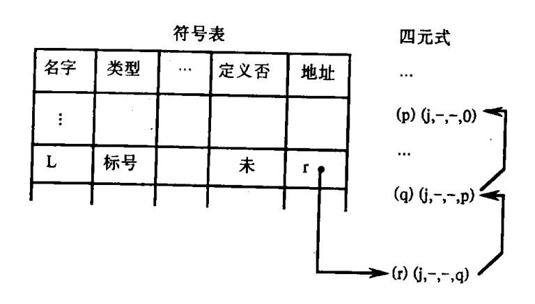

图 7.18 未定义标号的引用链

一旦标号 L 定义时,我们将根据这条链回填那些待填转移目标的四元式。一般而言,假定用下面的产生式来定义带标号语句

S→label S label→i:

那么,当用 label → i:进行归纳时,应做如下的语义动作:

- (1) 若 i 所指的标识符(假定为 L)不在符号表中,则把它填入,置"类型"为"标号", "定义否"为"已","地址"为 nextquad。
  - (2) 若 L 已在符号表中但"类型"不为"标号"或"定义否"为"已",则报告出错。
- (3) 若 L 已在符号表中,则把标志"未"改为"已",然后,把地址栏中的链头(记为 q)取出,同时把 nextquad 填在其中,最后,执行 backpatch(q, nextquad )。

#### 7.5.3 CASE 语句的翻译

许多程序语言中含有种种不同形式的分叉语句(case 语句或 switch 语句),我们这里讨论的分叉语句假定具有如下形式的语法结构:

| case             | E | of               |
|------------------|---|------------------|
| $C_i$ :          |   | $S_{I}$ ;        |
| C <sub>2</sub> : |   | S <sub>2</sub> ; |
| • • •            |   |                  |
| $C_{n-1}$ :      |   | $S_{n-1}$ ;      |
| otherwise:       |   | $S_n$            |
| end              |   |                  |

这里 E 是一个表达式,称为选择子。E 通常是一个整型表达式或字符(char)型变量。每个 Ci 的值为常数, $S_i$  是语句。case 语句的语义是:若 E 的值等于某个  $C_i$ ,则执行  $S_i$ (i=1,2,

{32}------------------------------------------------

 $\cdots$ , n-1), 否则执行  $S_n$ 。当某个  $S_i$  执行完之后, 整个 case 语句也就执行完了。语句中的 otherwise 称为"此外"值。

case 语句有种种不同的实现方法。如果分叉情形不太多,如只有 10 个左右,那么,我们可以把它翻译成如下的一连串条件转移语句:

对 E 求值的代码,结果存入 T 中

L<sub>1</sub>: if T≠C<sub>1</sub> goto L<sub>2</sub> S<sub>1</sub> 的代码

goto next

L<sub>2</sub>: if T≠C<sub>2</sub> goto L<sub>3</sub> S<sub>2</sub> 的代码

goto next .

L<sub>3</sub>:

 $L_{n-1}$ : if  $T \neq C_{n-1}$  goto  $L_n$   $S_{n-1}$ 的代码 goto next

L<sub>n</sub>: S<sub>n</sub> 的代码

next:

我们还可以采用另一种更紧凑的实现方法。这种办法是,形成一张包含 n 项的开关表。此表的每一项含有两栏数据,第一栏为  $C_i$  的值,第二栏为  $C_i$  的对应语句  $S_i$  的地址;但最后一项的第一栏将包含运行时选择子 E 的现行值,第二栏含  $S_n$  的地址。编译程序将构造这样的一张开关表,产生出把选择子 E 值传送到该表末项第一栏的指令组,并构造一个对 E 值查找开关表的循环程序。在运行时,这个循环程序就对 E 值查找开关表,当 E 匹配上某个 E 时就转去执行相应的 E 。若不存在 E 。与 E 匹配,则末项自动配上(因末项第一栏所记录的正是 E 值自身),于是便执行"此外"语句 E 。注意,如果 E 。不是转移指令,那么在 E 。之后应产生一条无条件转移指令,以便把程序控制引导到整个 case 语句之后的地方。

如果 case 句的分叉情形比较多,例如 10 个以上,那最好建立一个杂凑表,此表的每一项都包含某个  $C_i$  的值和对应的  $S_i$  地址( $i=1,2,\cdots,n-1$ )。如果按 E 的杂凑地址找不到与 E 匹配的  $C_i$ ,则意味着必须执行"此外"句  $S_n$ 。

常常存在一种特殊情形:选择子 E 值变化范围较小,如从 0 至 127,而在这区间中只有少数几个值不被选为  $C_i$ 。在这种情形下,我们可以建立一个含 128 个元素的数组 B[0:127],每个元素  $B[C_i]$ 中存放着  $S_i$  的地址。对于不被选为  $C_i$  的每个整数 J,令 B[J]中存放着"此外"句  $S_i$  的地址。使用这种办法实现分叉语句可以说是最高效的了。

下面讨论分叉语句的一种翻译法,这种翻译法便于语法分析制导实现。我们假定它的中间码将采取如下的一种比较一般的形式:

关于把 E 计值在临时单元 T 中的中间码

goto test

{33}------------------------------------------------

```
关于 S<sub>1</sub> 的中间码
L<sub>1</sub>:
                goto next
                关于 S<sub>2</sub> 的中间码
L<sub>2</sub>:
               goto next
 :
               关于 Sn-1的中间码
L_{n-1}:
               goto next
               关于 S<sub>n</sub> 的中间码
L<sub>n</sub>:
               goto next
               if T = C_1 goto L_1
test:
               if T = C_2 goto L_2
               if T = C_{n-1} goto L_{n-1}
               goto L<sub>n</sub>
```

next:

由于把条件转移语句统统安排的末尾,因此,在最后的目标代码产生阶段,就易于产生较高质量的目标指令。例如,可以产生对同一个值(T)实行多次测试的转移指令序列。

产生上述中间码的过程大致是: 当见到基本字 case 时,我们就产生标号 test、next 和一个临时单元 T。然后,按通常办法产生计算 E 值并把计算结果放在 T 中的四元式(即按赋值句 T: = E 产生四元式序列)。在处理 E 后见到 of 时,就是生成一个 goto test 的四元式,然后,设置一个空队列 queue。

当碰到  $C_i$ : (注意  $C_i$  是常数)时,产生一个标号  $L_i$ ,把它连同 nextquad 填进符号表,然后,把( $C_i$ ,  $P_i$ )排在 queue 的末端。这里, $P_i$  是  $L_i$  在符号表中的位置(注意,这个 queue 是属于现行 case 句的,在嵌套的情况下,对不同层的 case 句,当然要有不同的 queue)。在这之后,就按通常的办法产生语句  $S_i$  的四元式。要注意的是,在  $S_i$  的四元式之后要有一个 goto next 的四元式。

当 case 句的结尾词 end 到达时,我们就应着手产生以 test 为标号的 n 个条件转移语句的四元式。通过逐项读出 queue 的内容,即可形成如下的四元式序列:

```
(case, C_1, P_1, - ) /* 所有 P_i 均为标号 L_i 在符号表中的位置 */ (case, C_2, P_2, - ) 
 : 
 (case, C_{n-1}, P_{n-1}, - ) 
 (case, T, P_n, - ) 
 (label, next, - , - )
```

其中,T 是存放选择子 E 值的临时单元名。每个四元式(case,  $C_i$ ,  $P_i$ , -)实际代表一个条件语句

if 
$$T = C_i$$
 goto  $L_i$ 

我们这里之所以用 case 作为四元式的操作码,乃是希望目标代码产生器能对它进行优化

{34}------------------------------------------------

处理。最后,这组四元式也可以看成是一张开关表的雏型。其中,末端的四元式(label, next, -,-)将告诉代码产生器,它现在可以视不同情况产生实现多向转移的目标指令组了。换句话说,上述的这种中间代码形式为目标代码产生器提供了最终产生目标指令的灵活性。

## 7.6 过程调用的处理

过程是程序设计语言中最常用的一种结构。我们这节所讨论的也包括函数,实际上函数可以看作是返回结果值的过程。

我们考虑过程调用文法如下:

- (1) S→call id (Elist)
- (2) Elist→Elist, E
- (3) Elist→E

过程调用的实质是把程序控制转移到子程序(过程段)。在转子之前必须用某种办法把实在参数的信息传递给被调用的子程序,并且应该告诉子程序在它工作完毕后返回到什么地方。现在计算机的转子指令大多在实现转移的同时就把返回地址(转子指令之后的那个单元地址)放在某个寄存器或内存单元之中。因此,在返回方面并没有什么需要特殊考虑的问题。关于传递实在参数信息方面有种种不同的处理方法。我们这里只讨论最简单的一种,即传递实在参数地址(传地址)的处理方式。

如果实在参数是一个变量或数组元素,那么,就直接传递它的地址。如果实参是其它表达式,如 A+B或 2,那么,就先把它的值计算出来并存放在某个临时单元 T中,然后传送 T的地址。所有实在参数的地址应存放在被调用的子程序能够取得到的地方。在被调用的子程序(过程)中,相应每个形式参数都有一个单元(称为形式单元)用来存放相应的实在参数的地址。在子程序段中对形式参数的任何引用都当作是对形式单元的间接访问。当通过转子指令进入子程序后,子程序段的第一步工作就是把实在参数的地址取到对应的形式单元中,然后,再开始执行本段中的语句。

传递实在参数地址的一个简单办法是,把实参的地址逐一放在转子指令的前面。例如,过程调用

CALL S(A + B, Z)

## 将被翻译成:

 计算 A + B 置于 T 中的代码
 /\* T: = A + B \* /

 par T
 /\* 第一个实参地址 \* /

 par Z
 /\* 第二个实参地址 \* /

 call S
 /\* 转子指令 \* /

当通过执行转子指令 call 而进入子程序 S 之后, S 就可根据返回地址(假定为 k, 它是 call 后面的那条指令地址)寻找到存放实在参数地址的单元(分别为 k-3 和 k-2)。

根据上述关于过程调用的目标结构,我们现在来讨论如何产生反映这种结构的代码。 为了在处理实在参数串的过程中记住每个实参的地址,以便最后把它们排列在 call 指令 之前,我们需要把这些地址存放起来。用来存放这些地址的一个方便的数据结构是队列, 

{35}------------------------------------------------

一个先进先出表。我们将赋予产生式 Elist→Elist, E 的语义动作是;将表达式 E 的存放地址 E. place 放入队列 queue 中。产生式 S→call id (Elist)的语义动作是:对队列 queue 中的每一项生成一条 param 语句,并让这些语句接在对参数表达式求值的那些语句之后。对参数表达式求值的语句已在将它们归约为 E 时产生。下面的翻译模式体现了上述思想。

1. S→call id (Elist)

{for 队列 queue 中的每一项 p do emit('param' p); emit('call' id.place)}

S 的代码包括:首先是 Elist 的代码(即对各参数表达式求值的代码),其次是顺序为每一个参数对应一条 param 语句,最后是一个 call 语句。

2. Elist→Elist, E

将 E. place 加入到 queue 的队尾

3. Elist→E

初始化 queue 仅包含 E. place

这里,初始化 queue 为一个空队列,然后将 E. place 送入 queue。

# 7.7 类型检查

类型检查是静态语义分析的重要内容,本节我们将讨论有关这方面的一些问题。大多数静态语义分析的工作都可以用语法制导技术实现。有些工作可以合并到其它工作中。例如,当我们把一个名字填入到符号表的时候,我们就可以检查这个名字是否只说明了一次。又如,前面我们讨论算术表达式的翻译时,就考虑了类型转换的问题。

类型检查验证一种结构的类型是否匹配其上下文要求的类型。例如, Pascal 的算术运算符 mod 要求整型的操作数, 所以, 类型检查器必须验证 mod 的操作数是整数类型的。还有: 下标只能用于数组; 调用用户定义的函数或过程时, 实参的个数和类型要与形参一致; 等等。7.7.2 节将介绍一个简单的类型检查器。

生成目标代码时,需要类型检查时收集的类型信息。像算术运算符+通常用于整型或实型的数据;但还可能用于其它类型的数据,这要根据上下文来验证操作的合法性。如果一个运算符在不同的上下文中表示不同的运算,则称该运算符为重载运算符(overloading operator)。Pascal 的+运算符就是一个重载运算符,它根据上下文确定进行加法运算还是集合的并运算。重载可以伴随类型强制,编译程序按照运算符把操作数转换成上下文要求的类型。7.7.3 将介绍如何处理重载。

还有一种与重载有所不同的表示——"多态性"。具有多态性的函数可以根据不同类型的参数从而执行不同的动作。多态性是面向对象语言的重要特点之一。在 7.7.4 节中我们将讨论多态性的处理。

## 7.7.1 类型系统

为了设计类型检查器,需要首先考虑的是关于语法结构、表示类型的记号和把类型赋给语法结构的规则。下面的两段叙述分别是从 Pascal 报告和 C 语言参考手册里摘录下来

{36}------------------------------------------------

的。

"如果加法、减法和乘法算术运算符的两个操作数都是整型的,则运算的结果也是整型的"。

"一元运算符 & 的结果是一个指针,指向操作数提供的对象。如果操作数的类型是…,则结果的类型是指向…的指针"。

这两段话说明,每个表达式都有一个类型与之相关。诸如这类的问题,是设计编译程序时应该考虑的问题。在 Pascal 和 C 语言里,类型或者是基本类型,或者是结构化的类型。基本类型指的是它的构成不再取决于其它类型。在 Pascal 语言里,基本类型有布尔类型、字符类型、整数类型和实数类型;子域类型,如 1..10;枚举类型,如 (violet, indigo, blue, green, yellow, orange, red)也可以看成基本类型。Pascal 允许程序员用基本类型和其它结构化类型构造结构化类型,比如数组、记录和集合。另外,指针和函数也可以处理成结构化类型。

下面我们引入**类型表达式**的概念。一个类型表达式或者是基本类型,或者由类型构造符施于其它类型表达式组成。基本类型和类型构造符都取决于具体的语言。类型表达式定义如下:

- (1)一个基本类型是一个类型表达式。基本类型有 boolean、char、integer 和 real。一个专用的基本类型 type error,在类型检查过程中指示类型错误。还有一个基本类型为 void,表示被检查的语句没有数据类型。
  - (2) 由于对类型表达式可以命名,所以,一个类型名是一个类型表达式。
- (3) 用类型构造符施于类型表达式,得到一个新的类型表达式。类型构造符有如下几种:
- ① 数组。如果 T 是一个类型表达式,则 array(I,T)是一个类型表达式,表示一个数组类型,其中数组元素的类型为 T,下标的集合为 I。通常,I 是一个整数域。例如,按照 Pascal 的变量说明

var A: array [1..10] of integer;

与 A 相关的类型表达式为

array (1...10, integer)

- ② 乘积。如果  $T_1$  和  $T_2$  是两个类型表达式,则它们的 Cartesisan 乘积  $T_1 \times T_2$  是一个类型表达式。假定算符  $\times$  是左结合的。
- ③ 记录。记录类型可以认为是记录中各域类型的 Cartesisan 乘积。记录与乘积的区别在于记录的域有名字。记录的类型用一个类型表达式表示。在前面 7.2.3 节中,我们曾把类型构造符 record 作用于指向域名在符号表中的人口的指针中。关于记录的类型表达式是把类型构造符 record 施于一个二元组构成的,二元组中包含各域的名称及其相关的类型。例如,Pascal 程序段:

type row = record

address: integer;

lexeme: array [1.. 15] of char

end:

var table: array [1.. 10] of row;

{37}------------------------------------------------

说明了类型名 row 代表类型表达式

record ((address 
$$\times$$
 integer)  $\times$  (lexeme  $\times$  array (1.. 15, char)))

因此,变量 table 是这个记录类型的数组。

④ 指针。如果 T 是一个类型表达式,则 pointer(T)是表示"指向 T 类型对象的指针" 类型。例如, Pascal 的变量说明

说明变量 p 具有 pointer (row)类型。

⑤ 函数。从数学的角度来讲,一个函数把某一个域中的元素映射到另一个域。在程序设计语言里,可以把函数的类型处理成由作用域类型 D 到位域类型 R 的映射。这样,函数的类型可以用类型表达式 D→R 表示。例如 Pascal 内部函数 mod 的作用域类型表达式为 int × int,即两个整数类型的 Cartesian 乘积,结果的域类型是 int。所以, mod 的类型为

另一个 Pascal 的函数

作用域类型是 char × char, 结果的域类型是 pointer (integer)。于是,关于函数 f 的类型表达式为

从实现的角度来看,函数返回值的类型通常有一定的限制,比如不能返回数组和函数。但是,也有的语言,像 Lisp,允许函数返回任意类型的对象。例如,我们可以定义具有如下类型的函数 g:

也就是说函数 g 的参数是把整数映射成整数的函数, g 的返回结果是和参数类型相同的另一函数。

(4) 类型表达式可以包含变量,变量的值是类型表达式。类型变量将在7.7.4 节中介绍。

类型表达式可以用图表示。用第六章介绍的语法制导的方法可以为类型表达式构造一棵树或 DAG,其中的内结点表示类型构造符,叶表示基本类型、类型名或者类型变量。例如,关于类型表达式

的树形表示和 DAG 表示如图 7.19 所示。

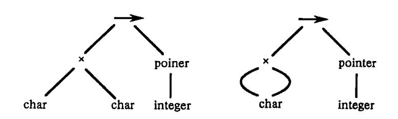

图 7.19 char × char→pointer (integer)的树形表示和 DAG 表示

所谓**类型系统**就是把类型表达式赋给语言各相关结构成分的规则的集合。同一种语言的编译程序,在不同的实现系统里,可能使用不同的类型系统。例如,关于标准 Pascal

{38}------------------------------------------------

数组的类型表达式包含数组的下标域,这样,包含形参数组的函数,其实参只能是具有相同下标域的数组。但是,许多 Pascal 的编译程序对数组做参数的情况都进行了扩充,允许下标域不定。可见,这些编译程序使用和标准 Pascal 不同的类型系统。类似地,在 UNIX 系统中,实用程序 lint 检验 C 程序中可能存在的缺陷,它所用的类型系统比 C 编译程序使用的类型系统还要详细。

如果类型检查在编译时进行,则称之为静态的;而如果类型检查在程序运行时进行,则称为动态的。从原理上讲,只要目标代码中带有足够的类型信息,类型检查总可以动态进行。

如果消除了动态检查类型错误的需要,则为良类型系统。良类型系统允许我们静态 地确定目标程序运行时不会发生类型错误。一个语言称为强类型的,如果它的编译器能 保证编译通过的程序运行时不会出现类型错误。

实际上,有些类型检查只能动态进行。例如,我们首先说明:

table: array [0.. 255] of char;

i: integer;

然后在程序中引用了 table[i],编译器通常不能保证在执行时 i 的值将落在 0~255 之间。

## 7.7.2 类型检查器的规格说明

这一节给出一种简单语言**类型检查器**的规格说明。这种语言要求每个标识符在使用 之前都必须预先说明。类型检查器可以处理简单类型、数组、指针、语句和函数。这个简 单语言的文法如下:

P→D:E

 $D \rightarrow D; D \mid id: T$ 

T→char | integer | array [ num ] of T | ↑ T

E→literal | num | id | E mod E | E | E | | E ↑

(7.11)

文法中,P代表程序;D代表说明;E代表表达式。例如,由以上文法可以生成如下程序语句:

key: integer;

key mod 1999

在讨论类型表达式之前,需要考察一下语言中的类型。这个语言本身提供两种基本类型: char 和 integer。除此之外还有缺省的基本类型 type\_error 和 void。为了简化,我们假定所有数组都从下标 1 开始。例如,由类型

array [256] of char

导出类型表达式

array (1... 256, char)

它把类型构造符 array 作用于子域 1..256 和类型 char。与 Pascal 语言一样,用前缀运算符 ↑建立一个指针类型,所以,由

**↑** integer

导出类型表达式

pointer (integer)

{39}------------------------------------------------

它由类型构造符 pointer 作用于类型 integer 构成。

我们给出确定标识符类型的部分翻译模式,如图 7.20 所示。

```
    (1) P→D; E
    (2) D→D; D
    (3) D→id: T {addtype (id. entry, T. type)}
    (4) T→char {T. type: = char}
    (5) T→integer {T. type: = integer}
    (6) T→↑T₁ {T. type: = pointer (T₁. type)}
    (7) T→array [num] of T₁ {T. type: = array (num. val, T₁. type)}
```

图 7.20 确定标识符类型的翻译模式

在这个翻译模式里,和产生式 D→id:T相关的语义动作

addtype (id.entry, T.type)

把一个类型 T. type 存入 id 所代表的标识符的符号表中。这里,综合属性 id. entry 指向 id 在符号表中的人口,非终结符的综合属性 type 是一个类型表达式。

如果类型 T产生 char 或 integer,则 T. type 分别定义为 char 或 integer。数组的上界是由单词符号 num 的属性值 val 得来的,该属性给出由 num 表示的整数。假定数组的下标都从 1 开始,所以,类型构造符 array 施于子域 1... num. val 和数组元素的类型。

由于 D 出现在 E 的之前,所以,可以认为所说明的标识符在由 E 生成的表达式被检查以前,其类型都已保存起来。事实上,适当地修改文法,可以在自顶向下或自底向上的语法分析过程中实现图 7.20 所示的翻译模式。

下面讨论关于表达式的类型检查。

在下面语义动作中,E的综合属性 E. type 通过类型系统把类型表达式赋给由 E产生的表达式。其中的语义规则表示,单词符号 literal 和 num 表示的常量分别具有类型 char 和 integer。

```
E→literal {E.type: = char}
E→num {E.type: = integer}
```

我们用函数 lookup(e)从符合表中取出 e 所确定的项的类型。当 E 为标识符时,从符号表中取出该标识符的类型,赋给属性 E.type。

$$E \rightarrow id$$
 {E. type: = lookup (id. entry)}

当把运算符 mod 用于两个子表达式时,这两个子表达式的类型都是 integer,结果类型也是 integer,否则,结果的类型为 type\_error。规则如下:

```
E \rightarrow E_1 \mod E_2 { if E_1.type = integer and E_2.type = integer then E.type: = integer else E.type: = type_error}
```

在数组引用  $E_1[E_2]$ 中,下标表达式  $E_2$  必须具有整数类型。在这种情况下,结果是从  $E_1$  的类型 array(s,t)获得的元素类型 t,和数组的下标集 s 无关。

$$E \rightarrow E_1[E_2]$$
 { if  $E_2$ . type = integer and  $E_1$ . type = array(s,t)  
then  $E$ . type: = t

{40}------------------------------------------------

else E. type: = type\_error}

在表达式  $E \uparrow E$ ,运算符  $\uparrow$  产生由其操作数所指的对象,所以, $E \uparrow$  的类型是指针 E 所指的对象的类型 t。

```
E \rightarrow E_1 \uparrow { if E1.type = pointer (t)
then E.type: = t
else E.type: = type_error}
```

关于表达式的其它类型和运算相应的产生式和语义规则,我们留给读者来补充。例如,若允许表达式中出现 boolean 类型的量,则可以在文法中增加产生式 T→boolean。对 E 的产生式引入像 < 和 and 之类的关系运算符和逻辑运算符,则可以构造 boolean 类型的表达式。

我们再来考虑一下语句的类型检查。

很多语言中语句没有值,因此给它们赋予一个基本类型 void。如果在语句中检查类型出错误,则赋给这个语句的类型是 type\_error。

下面考虑关于赋值语句、条件语句、while 语句以及若干语句组成的语句序列的类型检查;语句序列由若干用分号分隔的语句组成。关于语句的类型检查的翻译模式如图 7.21 所示。如果我们把前面文法中代表程序的非终结符 P 的产生式改为 P→D;S 则可把图 7.21 的产生式加到前面文法中。这样,说明后面紧跟语句。前面关于表达式的类型检查的规则仍然需要,因为语句中会有表达式。

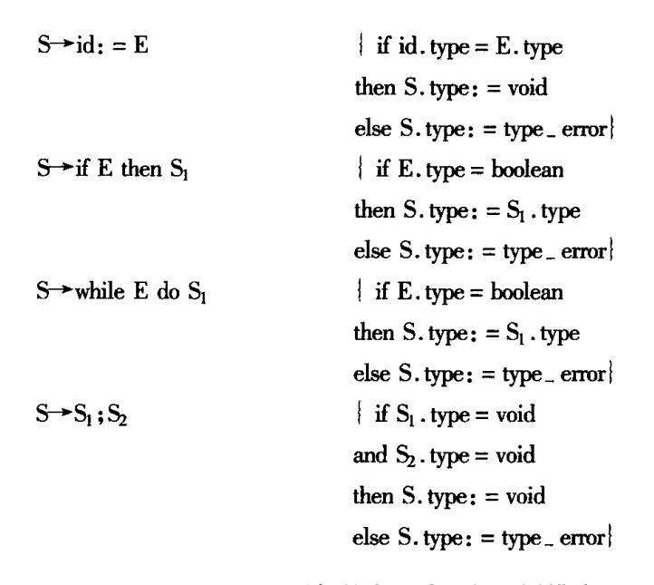

图 7.21 语句的类型检查的翻译模式

第一个产生式的语义规则检查赋值语句的左边和右边是否具有相同类型。第二和第三个产生式的语义动作检查条件语句和 while 语句中的表达式是否具有布尔类型。最后一个产生式处理语句序列的类型检查,仅当其中的每个语句都有类型 void 才能使语句序列具有类型 void;这样,如果其中有一个语句的类型错,则结果产生类型错误 type\_error。

作为一个类型检查器,在整个类型检查过程中,除了确定错误类型 type\_error 之外,还要报告类型错误的位置和性质。

{41}------------------------------------------------

最后,我们来考虑一下函数的类型检查。 带有参数的函数引用可由下面产生式描述:

$$E \rightarrow E(E)$$

下面产生式可以使关于函数的类型表达式和非终结符 T 结合,其语义动作允许在说明中出现函数的类型。

$$T \rightarrow T_1$$
 ' $\rightarrow$ '  $T_2$  {T. type: =  $T_1$ . type  $\rightarrow$   $T_2$ . type}

其中,用引号括起来的箭头用作函数的类型构造符,表示由类型  $T_1$ . type 映射成类型  $T_2$ . type,结果 T. type 是函数的类型表达式。

关于函数引用的类型检查规则如下:

$$E \rightarrow E_1(E_2)$$
 { if  $E_2$ . type = s and  $E_1$ . type = s  $\rightarrow$  t  
then E. type: = t  
else E. type: = type\_error}

这一规则表示,在函数调用  $E_1(E_2)$ 形成的表达式中,当  $E_2$  的类型为 s,  $E_1$  的类型为 s→t 时,结果  $E_1(E_2)$ 的类型为 t,即由类型 s 经  $E_1$  映射出的结果类型。

当函数有多个参数时,由各参数的类型建立一个 Cartesian 乘积类型。假定 n 个参数的类型分别为  $T_1$ , $T_2$ ,…, $T_n$ ,可以把它们看成一个参数的类型  $T_1 \times T_2 \times \cdots \times T_n$ 。例如,我们可以写这样一个函数:

即函数 root 有一个从 real 映射到 real 的函数参数和另一个 real 类型的参数,结果为 real 类型。如果用 Pascal 写,这个函数说明为

function root (function f (y: real); real; x: real): real

## 7.7.3 函数和运算符的重载

重载运算符(overloading operator)根据上下文可以执行不同的运算。在数学中,加法运算符+是重载符号,因为在 A+B中,当 A和 B为整数、实数、复数或者矩阵时,运算符执行不同类型的运算。在 Ada 语言里,括弧()是重载符号,因为表达式 A(I)可能访问数组 A的第 I 个元素,也可能以 I 为实参调用函数 A,还可能显式地把表达式 I 转换成 A 类型的。

当出现重载运算符时,要确定它所表示的唯一的意义。例如,如果加号能表示整数加法和实数加法,那么,在表达式 x+(i+j)中两次出现的加号可能表示不同类型的加法,这要看 x、i 和 j 的类型。解决重载问题要确定运算符表示哪种运算,所以,有时也称为运算符识别。

在大多数程序设计语言里,算术运算符都是重载运算符。但是,像+这样算术运算符的重载,可以通过检查运算符的操作数来解决。通过分析确定用实型加法还是整型加法。

有时,通过检查函数的参数的类型并不一定能解决重载问题,因为一个子表达式可能有不止一个类型,而是有一个可能的类型集合。在 Ada 语言里,上下文必需提供足够的信息,以缩小选出一个类型的范围。

例 7.7 在 Ada 语言里,对运算符 \* 的一个标准解释是,两个整型数相乘产生一个整型数。这个运算符与下列的说明重载:

{42}------------------------------------------------

function "\*" (i,j:integer) return complex;

function "\*" (x,y:complex) return complex;

当给出以上说明之后,关于\*可能的类型包括

integer × integer →integer

integer × integer - complex

complex → complex

假定 2、3 和 5 唯一可能的类型都是整型。在以上的说明里,子表达式 3 \* 5 的类型可能是整型,也可能是复型,这要看它的上下文。如果整个表达式是 2 \* (3 \* 5),那么,3 \* 5 只能是整型,因为 2 \* (3 \* 5)中的第一个 \* 取两个整型或者两个实型量作为操作数。而当整个表达式是(3 \* 5) \* z 时,并且其中的 z 说明为 complex 类型的,则 3 \* 5 应该是 complex 类型的。

在7.7.2 节中我们曾经假定,每个表达式都有唯一的类型,所以,函数引用的类型检查规则为

$$E \rightarrow E_1(E_2)$$
 if  $E_2$ . type = s and  $E_1$ . type = s  $\rightarrow$  t  
then E. type: = t  
else E. type: = type\_error

表 7.7 给出了类型规则的一般形式,其中的运算只有函数引用。检查表达式中其它运算的规则与此类似。由于一个重载标识符可能有几个说明,所以,在符号表中可能包含一个可能类型的集合,函数 lookup 返回这个集合。在表 7.7 里,作为开始符号的非终结符 E'产生一个完整的表达式。

| 产生式                      | 语 义 规 则                                                                                   |  |
|--------------------------|-------------------------------------------------------------------------------------------|--|
| E'→E                     | E'.types: = E.types                                                                       |  |
| E─►id                    | E.types: = lookup(id.entry)                                                               |  |
| $E \rightarrow E_1(E_2)$ | E. types: = $\{t \mid s \in E_2 \text{. types}, s \rightarrow t \in E_1 \text{. types}\}$ |  |

表 7.7 确定表达式可能类型的集合

表 7.7 中第三条规则说明,如果 s 是  $E_2$  的一个类型,并且  $E_1$  的一个类型可以从 s 映射到 t,那么,t 就是  $E_1(E_2)$ 的一个类型。在函数引用时如果类型不匹配,则使集合 E. types 为空,我们可以用一个条件来监视,以便发出错误信息。

例 7.8 除了表 7.7 中列出的规则之外,我们看这种方法怎样应用于其它结构。假设有表达式 3 \*·5。令运算符 \* 如例 7.7 所述,即 \* 根据上下文能把两个整数映射成或者一个整数,或者一个复数。这样,子表达式 3 \* 5 可能类型的集合如图 7.22 所示,其中的 i 和

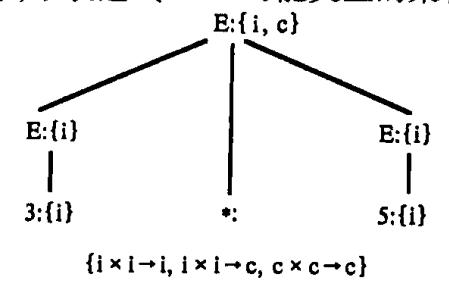

图 7.22 表达式 3 \* 5 可能类型的集合

{43}------------------------------------------------

c 分别是整数类型 integer 和复数类型 complex 的缩写。

我们再假定3和5可能的类型只有 integer,于是,运算符\*施于两个整型数。如果我们把这两个整型数看成一个单位,那么结果的类型就可以由 integer × integer 得出。在把\*施于两个整型数的类型集中有两个函数,分别返回整型数和复数,所以,图7.22 中树的根可以有类型 integer 或者 complex。

### 7.7.4 多态函数

通常,过程只能带固定类型的参数;而**多态**过程的特点是,每次被调用时,传递过来的参数可以具有不同类型。多态性这个术语可以用于任何接受不同类型参数的代码段,所以我们还可以有多态函数,多态操作符等等。

有些语言的内部操作符,如数组下标操作符,指针操作符等通常具有多态性,因为不受限于特殊类型的数组和指针。例如,C语言参考手册中关于指针操作符 & 是这样说的:"如果操作数的类型为'…',则结果类型就是'指向…'。"既然任何类型都可以替换'…',所以 C 中的 & 操作符是多态的。

在 Ada 中,"类属"函数是多态的,但 Ada 中的多态性有一定局限。因为类属也被用于 重载函数和函数参数的强制转换,所以我们将不用这个术语。

本节我们讨论带有多态函数的语言的类型检查器设计的问题。为了便于处理,我们扩充类型表达式集合,使之包含**类型变量**。

多态函数吸引人之处在于它能实现对数据结构进行操作的算法,不管数据结构的元素类型是什么。例如,用它能编写确定表的长度的程序而无须知道表中的元素类型是什么。

像 Pascal 这样的语言要求对函数参数类型进行完整说明,因此,下面确定整数链表长度的程序就不能用于实型链表。

```
type link = ↑ cell;
    cell = record
         info: integer;
         next: link
         end:
function length (lptr:link): integer;
var len: integer;
begin
    len: = 0:
    while lptr < > vil do begin
         len: = len + 1
         lptr: = lptr \uparrow . next
    end:
    length: = len
end:
对于具有多态函数的语言,如 ML,可以写一个 length 函数能作用于任何类型的表。
fun length (lptr) =
```

{44}------------------------------------------------

```
if null (lptr) then 0
else length (t1 (lptr)) +1;
```

在这个 ML 函数中,关键字 fun 说明函数为递归函数。null 和 tl 都是预定义的函数, null 测 试表是否为空, tl 返回移掉第一个元素之后表的其余部分。下面两个函数调用结果都为 3:

```
length(["sun", "man", "tue"]);
length([10,9,8])
```

在第一个调用中, length 作用于字符串的表; 在第二个调用中, length 作用于整数表。

代表类型表达式的变量用作未知类型。在本小节其余部分,我们将用希腊字母  $\alpha,\beta$ , ···表示类型表达式中的变量。

在不要求标识符必须先定义后使用的语言(如 FORTRAN)中,类型变量的一个重要用处就是检查标识符使用的一致性。用一个变量代表未说明标识符的类型。我们可以通过扫描程序知道标识符是否已用过。如果在一个语句中把它当整数,而在另一个语句中把它当数组,对这种不一致的用法就应报错。另一方面,如果这个变量标识符总是用非整数,那么我们不仅能确信它的一致用法,而且在处理过程中也推断出它的类型一定是什么。

类型"推断"是一个从它的使用方式确定语言结构的类型的问题。这个术语经常用于 从函数体推断函数类型。

例 7.9 类型推断技术可以用于像 C 和 Pascal 这样的语言,在编译时完成缺少的类型信息。下面代码段说明了过程 mlist,它有一个过程参数 p。

```
type link = ↑ cell;
procedure mlist (lptr:link; procedure p);
begin
    while lptr < > nil do begin
        p(lptr);
        lptr: = lptr ↑ . next
    end\nend;
```

考察过程 mlist 的第一行后我们知道 p 是过程,但我们不知道 p 的参数的个数和类型。这种不完整说明根据 C 和 Pascal 手册是允许的。

过程 mlist 把参数 p 作用于链表中的每个 cell 元素。比如, p 的功能可能是用于初始 化或打印 cell 元素中的整数。尽管 p 的参数类型没有说明, 但我们可以从 p 的调用表达式 p(lptr)推断出 p 的类型一定是:

#### link→void

用不是这种类型的过程参数对 mlist 调用是错误的。过程可以看作不返回值的函数, 所以结果类型为 void。

类型推断技术和类型检查有很多共同之处。在两种情况中,我们都不得不处理包含变量的类型表达式。下面例子,将在本节稍后一点用于类型检查器中推断变量所表示的类型,这就是一个证明。

{45}------------------------------------------------

例 7.10 在下面伪代码程序中,可以推断出多态函数 deref 的类型。函数 deref 的作用与 Pascal 中的 ↑操作符一样。

function deref (p);

begin

return p

end;

当处理到第一行

function deref (p);

时,我们不知道 p 的类型,因此,我们用类型变量  $\beta$  表示它。由定义,后缀运算符  $\uparrow$  把指针作用于一个对象并返回这个对象。既然在表达式 p  $\uparrow$  中  $\uparrow$  操作符作用于 p,可以看出 p 一定是指向一个未知类型  $\alpha$  的指针,因此,我们有:

$$\beta = pointer(\alpha)$$

这里  $\alpha$  是指一个类型变量。更进一步,表达式 p 人具有类型  $\alpha$ ,因此,我们可以写出类型表达式:

对任意类型 
$$\alpha$$
, pointer( $\alpha$ ) $\rightarrow \alpha$  (7.12)

作为函数 deref 的类型。

到目前为止,我们所说的多态函数就是它可以接收不同类型的参数而执行。关于多态函数允许的类型集合的精确描述可用符号 \ \rightarrow,意思为"对任何类型",因此:

$$\forall \alpha . pointer(\alpha) \rightarrow \alpha$$
 (7.13)

就是式(7.12)关于函数 deref 的类型表达式。前面的多态函数 length 接受任意类型的表并返回一个整数,所以它的类型可以写为

$$\forall \alpha . \text{list}(\alpha) \rightarrow \text{integer}$$
 (7.14)

这里 list 是一个类型构造符。如果没有 ∀ 符号我们只能给出 length 的可能的作用域和值域的例子:

list(integer) →integer

list(char) →integer

像式(7.13)这样的类型表达式是描述多态函数类型的最一般的形式。

∀称为全称量词,它所作用的类型变量称为由它约束的。约束变量可以重新命名,只要变量的所有出现重新命名。因此,类型表达式

$$\forall \gamma$$
 pointer( $\gamma$ ) $\rightarrow \gamma$ 

与式(7.13)是等价的。带有∀符号的类型表达式称为"多态类型"。

我们将使用一个带有多态函数的语言,其语法定义见图 7.23。

这个文法产生的程序具有如下形式:首先是一个说明序列,然后是要被检查的表达式 E。例如:

deref: 
$$\forall \alpha$$
 . pinter  $(\alpha) \rightarrow \alpha$ ;  
q: pointer (pointer (integer)); (7.15)  
deref (deref(q))

我们用非终结符 T 直接产生类型表达式以简化记号。构造符→和×形成函数和乘积类型。Unary 构造符(由 unary – constructor 表示)允许类型写作 pointer(integer)和 list(integer)

{46}------------------------------------------------

这样的形式。要对其类型进行检查的表达式的语法很简单:它们可以是标识符、表达式序列、或带有一个参数的函数调用。

```
P→D; E

D→D; D|id; Q

Q→∀ type - variable. Q|T

T→T '→' T

|T × T

| unary - constructor(T)

| basic - type
| type - variable
|(T)

E→E(E)|E,E|id
```

图 7.23 带有多态函数的语言的文法

对于多态函数的类型检查规则与 7.7.2 节中介绍的一般函数有三点不同。在给出这些规则之前,我们通过程序(7.15)中的表达式 deref(deref(q))来解释这些不同。这个表达式的抽象语法树如图 7.24 所示。每个结点上有两个标号,第一个标号指出结点所代表的子表达式,第二个表示赋予这个子表达式的类型表达式。下标 o 和 i 分别代表 deref 的外层(outer)和内层(inner)出现。

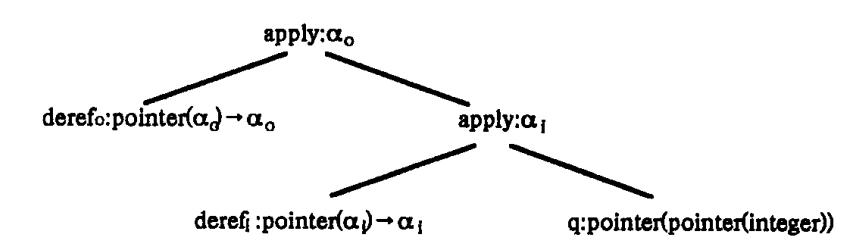

图 7.24 deref (deref(q))的带标号抽象语法树

#### 与一般函数的规则不同之处有:

- (1) 同一个表达式中多态函数的不同出现不一定具有相同类型的参数。在表达式 deref (deref(q))中, derefi 消除了一级间接指针, 所以 derefo 作用于不同类型的参数。这个 特性的实现是基于对  $\forall$   $\alpha$  的解释(即对任意类型  $\alpha$ )。 deref 的每个出现都对式(7.13)的约束变量(有自己的观点。因此, 我们给 deref 的每个出现赋予一个类型表达式, 这个类型表达式是这样形成的: 把式(7.13)中的  $\alpha$  替换为一个新变量并去掉  $\forall$  量词。在图 7.24 中, 新变量  $\alpha$ 0 和  $\alpha$ 1 分别用作 deref 的内层和外层出现对应的类型表达式。
- (2) 既然变量可以出现在类型表达式中,我们就必须考虑类型的等价问题。假设类型为 s→s′的 E<sub>1</sub> 作用于类型 t 的 E<sub>2</sub>,我们不是简单地确定 s 和 t 的等价性,而必须使它们一致。一致化的问题我们下面定义。通常,我们通过用类型表达式替换 s 和 t 中的类型变量来确定 s 和 t 是否结构等价。例如,在图 7.24 中标记为 apply 的内部结点,等式

$$pointer(\alpha_i) = pointer(pointer(integer))$$

成立,如果把 a<sub>i</sub> 替换为 pointer(integer)。

{47}------------------------------------------------

(3) 我们需要一种机制,记录对两个表达式进行一致化的效果。通常,一个类型变量可以在若干个类型表达式中出现。如果 s 和 s'的一致化导致变量  $\alpha$  代表类型 t,那么,当类型检查进行时  $\alpha$  必须继续代表 t。例如,在图 7.24 中, $\alpha$ <sub>i</sub> 是 deref<sub>i</sub> 的值域类型,所以我们可以把它用作 deref<sub>i</sub>(q)的类型。因此,把 derefi 的作用域类型一致化为 q 的类型影响到apply 所标记的内结点的类型表达式。图 7.24 中的另一个类型变量  $\alpha$ <sub>o</sub> 代表 integer。

通过定义从类型变量到类型表达式的映射从而对变量代表的类型进行形式化的方法 叫做"替换"。下面递归函数 subst(t)对用一个替换 s 来代替表达式 t 的所有类型变量作了精确描述。通常,我们把函数类型构造符作为"典型"的构造符。

function subst(t:type - expression):type - expression

begin

if t 为简单类型 then 返回 t

else if t 为变量 then 返回 S(t)

else if  $t 为 t_1 \rightarrow t_2$  then 返回  $subst(t_1) \rightarrow subst(t_2)$ 

end

为了方便,我们把 subst 作用于 t 所产生的类型表达式写作 S(t),结果 S(t)称为 t 的一个"实例"。如果替换 S 没有为变量  $\alpha$  指定一个表达式,我们就假设  $S(\alpha)$ 为  $\alpha$ ,也就是说 S 是这个变量的等同映射。

例 7.11 在下面,我们用 s < t 表示 s 为 t 的实例:

Pointer(integer) < Pointer( $\alpha$ )

 $Pointer(real) < Pointer(\alpha)$ 

integer  $\rightarrow$  integer  $< \alpha \rightarrow \alpha$ 

 $Pointer(\alpha) < \beta$ 

 $\alpha < \beta$ 

然而,在下面,左边的类型表达式不是右边的实例(理由附后)

integer real

替换不能用于基本类型

integer→real α→α

对α的不一致替换

integer  $\rightarrow \alpha \quad \alpha \rightarrow \alpha$ 

必须对所有出现进行替换

两个类型表达式是"一致化"的,如果存在某个替换 S 使  $S(t_1) = S(t_2)$ 。实践中,我们对"最一般的一致化器"感兴趣,它是一种给表达式中的变量强加最少约束的一种替换。 更精确地讲,对表达式  $t_1$  和  $t_2$  的最一般的一致化器是具有以下特性的一致化 S:

- (1)  $S(t_1) = S(t_2)_{\circ}$
- (2) 对其它任何一个使  $S'(t_1) = S'(t_2)$ 的替换 S',替换  $S'(t_1)$ 是 S(t)的一个实例。以后,当我们说到"一致化"时,我们就指的是最一般的一致化器。

下面来考虑对多态函数的检查。

对图 7.23 给出的文法进行表达式检查将用到下面对类型图的操作:

- (1) fresh(t),把类型表达式 t 中的约束变量替换为一个新变量并返回一个指向代表替换后的类型表达式的结点的指针。∀符号在处理时被消除。
- (2) unify(m,n),对由 m 和 n 所指结点所代表的类型表达式进行一致化。它的副作用是跟踪使表达式等价的替换。如果表达式一致化失败,则整个类型检查失败。

{48}------------------------------------------------

类型图中的每个叶结点和内部结点的构造使用类似于 6.2.4 节中介绍的 mkleaf 和 mknode 操作。对每个类型变量有各自的叶结点是必要的,但其它结构等价的表达式可以 共用结点。

unify 基于下面的一致化和替换的图论公式。假设结点 m 和 n 分别代表表达式 e 和 f,则如果 S(e) = S(f),我们说结点 m 和 n 在替换 S 下等价。找到一个最一般一致化器 S 的问题可以陈述为把必须在 S 下等价的结点划分为不同集合。如果表达式等价,它们的根必须等价。还有,两个结点 m 和 n 等价当且仅当它们代表同一操作且它们的孩子等价。

由于篇幅关系,对于判断类型结构等价的方法和对两个表达式进行一致化的算法我们在这里就不介绍,有兴趣的读者可以参阅有关文献。

对表达式进行类型检查的规则如图 7.25 所示。我们没有给出说明部分是如何处理的。当考察非终结符 T 和 Q 所产生的类型表达式时, mkleaf 和 mknode 把结点加到类型图中。当一个标识符被说明时,说明中的类型被以指向代表类型的结点的指针形式存入到符号表中。在图 7.25 中,这种指针用作综合属性 id. type。正如上面所提到的,当把约束变量替换为新变量时, fresh 操作消除了  $\forall$  操作。与产生式  $E \rightarrow E_1$ ,  $E_2$  相对应的语义动作把 E. type 置为  $E_1$  和  $E_2$  的类型的乘积。

对应函数调用的产生式  $E \rightarrow E_1(E_2)$ 的类型检查规则考虑了这种情况:  $E_1$ . type 和  $E_2$ . type都是类型变量,  $E_1$ . type =  $\alpha$  且  $E_2$ . type =  $\beta$ 。这里,  $E_1$ . type 一定是某个未知类型  $\gamma$  的函数, 并有  $\alpha = \beta \rightarrow \gamma$ 。在图 7.25 中, 建立了一个与  $\gamma$  相应的新的类型变量并且把  $E_1$ . type 与  $E_2$ . type  $\rightarrow \gamma$  一致化。每次通过 newtypevar 的调用将返回一个新类型变量,它对应的叶结点由 mkleaf 构造。代表与  $E_1$ . type 一致化的函数的结点由 mknode 构造。一致化成功后, 这个新叶结点就代表结果类型。

图 7.25 中的规则可以通过一个简单例子详细解释。我们写出赋予每个子表达式对应的类型表达式来归纳一下算法的工作,如表 7.8 所示。对每个函数引用,unify 操作将产生一个副作用:记录某些类型变量对应的类型表达式,这种副作用在表 7.8 的替换栏说明。

| ACTO AMIN'S MICKE                                    |                                                 |  |
|------------------------------------------------------|-------------------------------------------------|--|
| 表达式:类型                                               | 替 换                                             |  |
| q: pointer(pointer(integer))                         |                                                 |  |
| $deref_i$ : $pointer(\alpha_i) \rightarrow \alpha_i$ |                                                 |  |
| deref <sub>i</sub> (q): pointer(integer)             | $\alpha_{\rm i} = {\rm pointer}({\rm integer})$ |  |
| $deref_0: pointer(\alpha_0) \rightarrow \alpha_0$    |                                                 |  |
| derfe <sub>0</sub> (derefi(q)): integer              | $\alpha_0 = integer$                            |  |

表 7.8 自底向上确定类型

{49}------------------------------------------------

例 7.12 对 (7.15)程序中的表达式  $deref_0(deref_i(q))$ 进行类型检查,从叶结点开始自底向上进行处理。再一次我们用下标 0 和 i 区分 deref 的两次出现。当考察子表达式 deref0 时, fresh 用一个新类型变量  $\alpha_0$  构造结点,如图 7.26 所示。

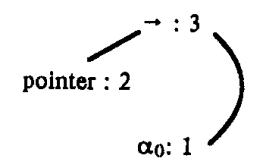

图 7.26 用 α 构造结点

结点中的数字表达结点所属的等价类。类型图中对应三个标识符的部分如图 7.27 所示。图中通过虚线表示序号为 3、6 和 9 的结点分别对应 deref<sub>o</sub>、deref<sub>i</sub> 和 q<sub>o</sub>

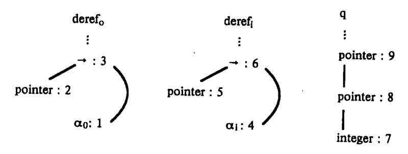

图 7.27 三个标识符

检查到函数调用  $deref_i(q)$ 时,构造一个结点 n,它代表从 q 的类型到新的类型变量  $\beta$  的函数。这个函数与结点 m 代表的  $deref_i$  的类型一致化成功。在结点 m 与 n 一致化之前,每个结点有个不同的序号。一致化以后,等价的结点具有相同的序号。我们对改变了的序号划了一下划线,如图 7.28 所示。

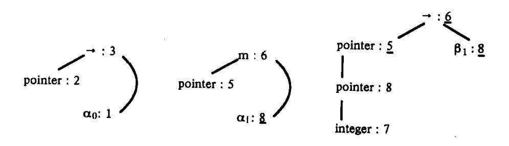

图 7.28 改变了的序号

注意: $\alpha_i$  的结点和 pointer(integer)的结点都有序号 8,也就是说  $\alpha_i$  与这个类型表达式一致化了,如表 7.8 所示。随后, $\alpha_i$  与 integer 一致化。

下一个例子将 ML 语言的多态函数的类型推断与图 7.25 的类型检查规则联系起来。 ML 中的函数定义语法为

fun  $id_0(id_1, \dots, id_k) = E$ ;

这里, $id_0$  代表函数名; $id_1$ ,…, $id_k$  为函数的参数。为了简化,我们假定表达式 E 的语法与图 7.23 中的文法一样,并且 E 中的标识符只能是函数名、参数以及内部函数。

这个方法是例 7.10 的形式化,在那里推断了 deref 的多态类型。通常内部函数具有多态类型,出现在这些类型中的类型变量由  $\forall$  量词约束。然后检查  $id_0(id_1,\cdots,id_k)$ 与 E 的

{50}------------------------------------------------

类型是否匹配。当匹配成功时,我们就推断出函数名的类型。最后,推断类型中的任何变量由 V 量词约束以给出函数的多态类型。

例 7.13 我们重新考虑确定表长度的 ML 函数:

```
fun length(lptr)
    if null(lptr) then 0
    else length(t1(lptr)) + 1;
```

分别为 length 和 lptr 的类型引入类型变量  $\beta$  和  $\gamma$ 。我们发现 length (lptr)的类型与构成函数体的表达式的类型匹配,而且 length 必须具有类型:

对任意类型 α, list(α)→integer

所以 length 的类型为

```
\forall \alpha . list(\alpha) \rightarrow integer
```

更详细地说,我们建立一个如图 7.29 所示的程序,把图 7.25 中的类型检查规则应用于这个程序。程序中的说明把新类型变量  $\beta$  和  $\gamma$  与 length 和 lptr 联系起来,并且显式说明内部函数的类型。我们用图 7.23 的风格来写条件式,把 if 操作符用于三个操作数:被测试的表达式,then 部分, else 部分。在说明部分指出 then 部分和 else 部分可以是任意类型,这也是结果类型。

```
length : \beta;

lptr : \gamma;
\nif : \forall \alpha. boolean \times \alpha \times \alpha \rightarrow \alpha;

null : \forall \alpha. list(\alpha) \rightarrow boolean;

t1 : \forall \alpha. list(\alpha) \rightarrow list(\alpha)

0 : integer;

1 : integer \times integer \rightarrow integer;

match : \forall \alpha . \alpha \times \alpha \rightarrow \alpha;

match(

length(lptr),
\nif(null(lptr),0,length(t1(lptr))+1)
```

图 7.29 说明后面跟要检查的表达式

很清楚, length(lptr)必须与函数体具有相同类型;这种检查被编写为操作符 match。match 的使用体现了技术性的方便,允许所有检查用图 7.23 风格的程序来做。

把图 7.25 的规则用于图 7.29 的程序的效果如表 7.9 所示。把 fresh 操作用于内部函数的多态类型引入了一些新变量,这些新变量通过在  $\alpha$  上加下标加以区分。从第 3 行我们知道 length 一定是从  $\gamma$  到某个未知类型  $\delta$  的一个函数。然后,检查子表达式 null(lptr),我们从第 6 行发现  $\gamma$  与 lost( $\alpha_n$ )一致,这里  $\alpha_n$  是一个未知类型。这个时候,我们知道 length 的类型一定是:

对任何类型  $\alpha_n$ , list  $(\alpha_n) \rightarrow \delta$ 

{51}------------------------------------------------

最后, 当检查到第 15 行的加法时, δ 与 integer 一致。

当检查完成时,类型变量  $\alpha_n$  仍然在 length 的类型表达式中。因为我们不能对  $\alpha_n$  作任何假设,所以在函数使用时任何类型都可以替换它。最终写出 length 的类型:

 $\forall \alpha_n . \operatorname{list}(\alpha_n) \rightarrow \operatorname{integer}$ 

表 7.9 推断 length 的类型为 list(an)→integer

| LINE | EXPRESSION: TYPE                                                                                   | SUBSTITUTION                             |
|------|----------------------------------------------------------------------------------------------------|------------------------------------------|
| (1)  | lptr :γ                                                                                            |                                          |
| (2)  | length :β                                                                                          |                                          |
| (3)  | $length(lptr):\delta$                                                                              | $\beta = \gamma \rightarrow \delta$      |
| (4)  | lptr :γ                                                                                            |                                          |
| (5)  | $\text{null : list}(\alpha_n) \longrightarrow \text{boolean}$                                      |                                          |
| (6)  | null(lptr):boolean                                                                                 | $\gamma = \operatorname{list}(\alpha_n)$ |
| (7)  | 0 : integer                                                                                        |                                          |
| (8)  | $\mathrm{lptr}: \mathrm{list}(\alpha_{\mathtt{n}})$                                                |                                          |
| (9)  | $t1: list(\alpha_t) \rightarrow list(\alpha_t)$                                                    |                                          |
| (10) | $t1(lptr): list(\alpha_n)$                                                                         | $\alpha_t = \alpha_n$                    |
| (11) | $length: list(\alpha_n) \longrightarrow \delta$                                                    |                                          |
| (12) | $length(t1(lptr)):\delta$                                                                          |                                          |
| (13) | 1 ; integer                                                                                        |                                          |
| (14) | + : integer × integer → integer                                                                    |                                          |
| (15) | length(t1(lptr)) + 1; integer                                                                      | $\delta$ = integer                       |
| (16) | if : boolean $\times \alpha_i \times \alpha_i  \alpha_i$                                           |                                          |
| (17) | if():integer                                                                                       | $\alpha_{\rm i} = {\rm integer}$         |
| (18) | $\mathrm{match}:\alpha_\mathrm{m}\times\alpha_\mathrm{m}^{-\!\!\!\!-\!\!\!\!\!-}\alpha_\mathrm{m}$ |                                          |
| (19) | match():integer                                                                                    | $\alpha_{\rm m} = {\rm integer}$         |

# 练 习

1. 给出下面表达式的逆波兰表示(后缀式):

$$\begin{array}{lll} a*&(-b+c) & \text{not A or not (C or not D)} \\ a+b*&(c+d/e) & (A \text{ and B) or (not C or D)} \\ -a+b*&(-c+d) & (A \text{ or B) and (C or not D and E)} \\ \text{if } & (x+y)*z=0 & \text{then } & (a+b) & \uparrow c & \text{else} & a & \uparrow b & \uparrow c \\ \end{array}$$

- \*2. 假定所有算符都是二目的,那么,由算符和操作数组成的符号串是一个后缀式的必要充分条件为:(1)算符的个数比操作数的个数少1;(2)每段非空前缀中算符的个数少于操作数的个数。
  - 3. 请将表达式 -(a+b)\*(c+d)-(a+b+c)分别表示成三元式、间按三元式和四

{52}------------------------------------------------

元式序列。

4. 按 7.3 节所说的办法,写出下面赋值句

$$A:=B*(-C+D)$$

的自下而上语法制导翻译过程。给出所产生的三地址代码。

5. 按照 7.3.2 节所给的翻译模式,把下列赋值句翻译为三地址代码:

$$A[i,j] := B[i,j] + C[A[k,l]] + d[i+j]$$

- 6. 按 7.4.2 节的办法, 写出布尔式 A or (B and not (C or D))的四元式序列。
- 7. 用 7.5.1 节的办法,把下面的语句翻译成四元式序列:

while 
$$A < C$$
 and  $B < D$  do  
if  $A = 1$  then  $C := C + 1$  else  
while  $A \le D$  do  $A := A + 2$ ;

8. 在 7.4.2 节中,关系式  $i^{(1)} < i^{(2)}$ 被翻成相继的两个四元式

这种翻译法常常浪费一个四元式。如果我们把这个关系翻译成如下的一个四元式:

$$(j \ge , i^{(1)}, i^{(2)}, _{-})$$

那么,在 i<sup>(1)</sup> < i<sup>(2)</sup>为真的情况下就不发生转移(即自动滑下来)。但若这个关系式之后有一个"V"运算,则另一无条件转移指令是不可避免的。例如

if 
$$A < B$$
 or  $C < D$  then  $X := Y$ 

应翻成

100 
$$(j \ge A, B, 102)$$
  
101  $(j, -, -, 103)$   
102  $(j \ge C, D, 104)$   
103  $(: = Y, -, X)$   
104

其中,四元式(101)是不可省的。

请按上述要求改写翻译布尔式的语义动作。

- 9. 写出翻译布尔表达式的递归下降程序(参考 6.4.3 节中介绍的技术)。
- 10. 设有一台单累加器的计算机,它的汇编语言含有通常的指令:LOAD、STORE、ADD和 MULT。
  - (1) 写一个递归下降程序,把下面文法所定义的赋值句翻译成汇编语言:

$$A \rightarrow i := E$$
  
 $E \rightarrow E + E \mid E * E \mid (E) \mid i$ 

- (2)利用加、乘满足交换律这一性质,改进你的翻译程序,以期产生较高效的目标代码。
  - 11. C语言中的 for 语句的一般形式为

for 
$$(E_1; E_2; E_3)S$$

其意义如下:

{53}------------------------------------------------

```
while (E_2) do begin S; E_3; end
```

试构造一个属性文法和翻译模式,把 C 语言的 for 语句翻译成三地址代码。

12. Pascal 语言中 for 语句的一般形式为

for v: = initial to final do S

其意义如下:

```
begin t_1 \colon = \text{initial}; \ t_2 \colon = \text{final}; if t_1 \leqslant t_2 then begin v \colon = t_1; S; while v \neq t_2 do begin v \colon = \text{succ}(v); S; end end
```

end (1) 设有下列 Pascal 程序:

```
program forloop (input, output);
  var i, initial, final: integer;
  begin
    read (initial, final);
    for i: = initial to final do
        writeln (i)
```

end

当 initial = MAXINT - 5、final = MAXINT 时,该程序的执行结果是什么? 其中 MAXINT 是目标机上能表示的最大整数。

- (2) 试构造一个翻译模式,把 Pascal 语言的 for 语句翻译成四元式。
- 13. 分别对下列类型写出类型表达式:
- (1) 一个指向实型量的指针数组,其下标范围 1~100;
- (2) 一个二维数组,其行下标 0~9,列下标 10~10;
- (3)一个函数,其实参为一个整型数,返回值为一个指针,指向由一个整型数和一个字符组成的记录。
  - 14. 设有下列 C 语言的说明:

```
typedef struct {
   int a, b;
   } CELL, * PCELL;
```

{54}------------------------------------------------

CELL foo [100];
PCELL bar (x, y)\nint x; CELL y;
{...}

试分别对数组 foo 和函数 bar 写出类型表达式。

15. 下列文法包含关于文字串表的定义,其中符号的意义和文法(7.11)中的意义相同,只是增加了类型 list,表示一个元素表,表中元素的类型由 of 后面的类型 T 确定。

P→D; E
D→D; D|id: T
T→list of T|char|integer
E→(L)|literal|num|id
L→E, L|E

试设计一个翻译模式,确定表达式(E)和表(L)的类型。

16. 假定对练习 15 增加产生式

E→nil

表示一个表达式可以为空表。考虑 nil 可以代替其元素为任意类型的空串的情况,修改由练习题 15 得到的翻译模式。

- 17. 修改 7.7.2 中对表达式类型检查的翻译模式,使之打印当检查出类型正确或者错误时的有关信息。
  - 18. 修改图 7.21 的翻译模式,使之处理:
- (1) 语句的结果值。赋值语句的值是赋值号: = 右边表达式的值; if 语句和 while 语句的值是语句体的值; 语句序列的值是该序列中最后一个语句的值。
- (2) 布尔表达式。增加逻辑运算符 and、or 和 not,以及关系运算符 < 、 ≤ 等等;并且增加相应的翻译规则,给出这些表达式的类型。