{0}------------------------------------------------

# 第三章 词法分析

人们理解一篇文章(或一个程序)起码是在单词的级别上来思考的。同样,编译程序也是在单词的级别上来分析和翻译源程序的。词法分析的任务是:从左至右逐个字符地对源程序进行扫描,产生一个个的单词符号,把作为字符串的源程序改造成为单词符号串的中间程序。因此,词法分析是编译的基础。

执行词法分析的程序称为**词法分析器**。这一章将讨论词法分析程序的构造。前一部分讨论手工构造方法,后一部分讨论自动构造方法。

# 3.1 对于词法分析器的要求

本节首先讨论词法分析器输出的单词符号的一般形式,然后研究词法分析器应如何 和语法分析器相衔接。

# 3.1.1 词法分析器的功能和输出形式

词法分析器的功能是输入源程序,输出单词符号。单词符号是一个程序语言的基本语法符号。程序语言的单词符号一般可分为下列五种。

- (1) **关键字** 是由程序语言定义的具有固定意义的标识符。有时称这些标识符为保留字或基本字。例如, Pascal 中的 begin, end, if, while 都是保留字。这些字通常不用作一般标识符。
  - (2) 标识符 用来表示各种名字,如变量名、数组名、过程名等等。
- (3) 常数 常数的类型一般有整型、实型、布尔型、文字型等等。例如,100,3.14159, TRUE, 'Sample'。
  - (4) 运算符 如 + 、-、\*、/等等。
  - (5) 界符 如逗号、分号、括号、/\*,\*/等等。
- 一个程序语言的关键字、运算符和界符都是确定的,一般只有几十个或上百个。而对于标识符或常数的使用通常都不加什么限制。

词法分析器所输出的单词符号常常表示成如下的二元式:

(单词种别,单词符号的属性值)

单词种别通常用整数编码。一个语言的单词符号如何分种,分成几种,怎样编码,是一个技术性的问题。它主要取决于处理上的方便。标识符一般统归为一种。常数则宜按类型(整、实、布尔等)分种。关键字可将其全体视为一种,也可以一字一种。采用一字一种的分法实际处理起来较为方便。运算符可采用一符一种的分法,但也可以把具有一定共性的运算符视为一种。至于界符一般用一符一种的分法。

{1}------------------------------------------------

如果一个种别只含一个单词符号,那么,对于这个单词符号,种别编码就完全代表它自身了。若一个种别含有多个单词符号,那么,对于它的每个单词符号,除了给出种别编码之外,还应给出有关单词符号的属性信息。

单词符号的属性是指单词符号的特性或特征。属性值则是反应特性或特征的值。例如,对于某个标识符,常将存放它的有关信息的符号表项的指针作为其属性值;对于某个常数,则将存放它的常数表项的指针作为其属性值。

在本书中,我们假定关键字、运算符和界符都是一符一种。对于它们,词法分析器只给出其种别编码,不给出它自身的值。标识符单列一种。常数按类型分种。

考虑下述 C++代码段:

while 
$$(i > = j)$$
 i--;

经词法分析器处理后,它将被转换为如下的单词符号序列:

< while, - >
<(', - >
<id, 指向 i 的符号表项的指针 >
< > = , - >
<id, 指向 j 的符号表项的指针 >
<), - >
<id, 指向 i 的符号表项的指针 >
< - - , - >
<;, - >

### 3.1.2 词法分析器作为一个独立子程序

为何将词法分析作为一个独立阶段呢?是否还应该将它安排为独立的一遍呢? 把词法分析安排为一个独立阶段的好处是,它可使整个编译程序的结构更简洁、清晰和条理化。词法分析比语法分析要简单得多,可用更有效的特殊方法和工具进行处理。 这是本章后一部分所要讨论的主要问题。

但是,这并不意味着我们也必须把词法分析作为独立的一遍。当然,也可以把词法分析安排成独立的一遍。让它把整个源程序翻译成一连串的单词符号(上述二元式)存放于文件中。待语法分析程序进入工作时再对从文件输进的这些单词符号进行分析。这种做法意味着必须在文件中保存整个源程序的内码形式,这似乎是没有必要的。我们可以把词法分析器安排成一个子程序,每当语法分析器需要一个单词符号时就调用这个子程序。每一次调用,词法分析器就从输入串中识别出一个单词符号,把它交给语法分析器。这样,把词法分析器安排成一个子程序似乎比较自然。在后面的讨论中,我们假定词法分析器是按这种方式进行工作的。

# 3.2 词法分析器的设计

我们将按照词法分析的任务和作为一个独立子程序的要求来考虑词法分析器的设 计。

{2}------------------------------------------------

#### 3.2.1 输入、预处理

词法分析器工作的第一步是输入源程序文本。输入串一般是放在一个缓冲区中,这个缓冲区称输入缓冲区。词法分析的工作(单词符号的识别)可以直接在这个缓冲区中进行。但在许多情况下,把输入串预处理一下,对单词符号的识别工作将是比较方便的。

对于许多程序语言来说,空白符、跳格符、回车符和换行符等编辑性字符除了出现在文字常数中之外,在别处的任何出现都没有意义,而注解部分几乎允许出现在程序中的任何地方。它们不是程序的必要组成部分;它们存在的意义仅仅在于改善程序的易读性和易理解性。对于它们,预处理时可以将其剔掉。

有些语言把空白符(一个或相继数个)用作单词符号之间的间隔,即用作界符。在这种情况下,预处理时可把相继的若干个空白结合成一个。

我们可以设想构造一个**预处理子程序**,它能够完成上面所述的任务。每当词法分析器调用它时,它就处理出一串确定长度(如 120 个字符)的输入字符,并将其装进词法分析器所指定的缓冲区中(称为**扫描缓冲区**)。这样,分析器就可以在此缓冲区中直接进行单词符号的识别,而不必照管其它繁琐事务。

分析器对扫描缓冲区进行扫描时一般用两个指示器,一个指向当前正在识别的单词的开始位置(指向新单词的首字符),另一个用于向前搜索以寻找单词的终点。

不论扫描缓冲区设得多大都不能保证单词符号不会被它的边界所打断。因此,扫描缓冲区最好使用一个如下所示的一分为二的区域:

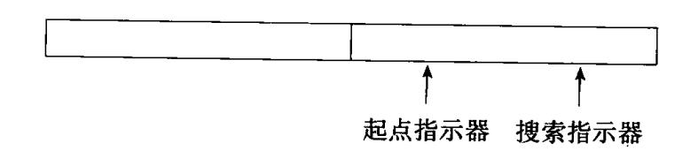

假定每半区可容 120 个字符,而这两个半区又是互补使用的。如果搜索指示器从单词起点出发搜索到半区的边缘但尚未到达单词的终点,那么就应调用预处理程序,令其把后续的 120 个输入字符装进另半区。我们认定,在搜索指示器对另半区进行扫描的期间内,现行单词的终点必定能够到达。这意味着对标识符和常数的长度实际上必须加以限制(例如,不得多于 120 个字符),否则,即使缓冲区再大也无济于事。

## 3.2.2 单词符号的识别:超前搜索

词法分析器的结构如图 3.1 所示。当词法分析器调用预处理子程序处理出一串输入字符放进扫描缓冲区之后,分析器就从此缓冲区中逐一识别单词符号。当缓冲区里的字符串被处理完之后,它又调用预处理程序装入新串。

下面我们来介绍单词符号识别的一个简单方法——超前搜索。

## 关键字的识别

像 FORTRAN 这样的语言,关键字不加特殊保护(只要不引起矛盾,用户可以用它们作为普通标识符),关键字和用户自定义的标识符或标号之间没有特殊的界符作间隔。这就使得关键字的识别甚为麻烦。请看下面的例子:

{3}------------------------------------------------

- 1 D099K = 1.10
- 2 IF(5.EO.M) I = 10
- 3 DO99K = 1.10
- 4 IF(5) = 55

这四个语句都是正确的 FORTRAN 语句。语句 1 和 2 分别是 DO 和 IF 语句,它们都是以基本字开头的。语句 3 和 4 是赋值句,它们都是以用户自定义标识符开头的。

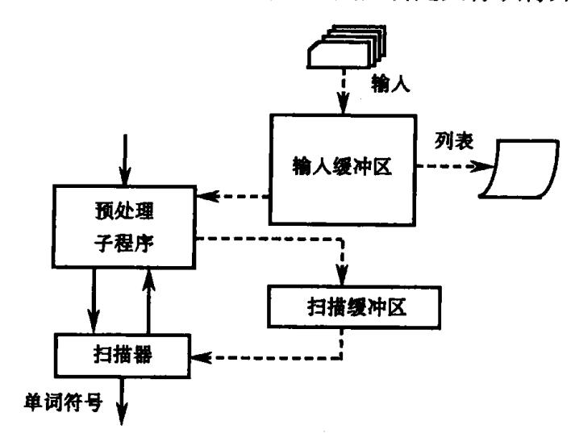

图 3.1 词法分析器

为了从 1、2 中识别出关键字 DO 和 IF,我们必须要能够区别 1、3 和区别 2、4。语句 1、3 的区别在于等号之后的第一个界符:一个为逗点,另一个为句末符。语句 2、4 的主要区别在于右括号后的第一个字符:一个为字母,另一个为等号。这就是说,为了识别 1、2 中的关键字,我们必须超前扫描许多个字符,超前到能够肯定词性的地方为止。对于 1、3 来说,尽管都以'D'和'O'两字母开头,但不能一见'DO'就认定是 DO 语句。我们必须超前扫描,跳过所有的字母和数字,看看是否有等号。如果有,再向前搜索。若下一个界符是逗号,则可以肯定 DO 应为关键字。否则,DO 不构成关键字,它只是用户标识符的头两个字母。所以,为了区别 1 和 3,我们必须超前扫描到等号后的第一个界符处。对于语句 2、4 来说,必须超前扫描到与 IF 后的左括号相对应的那个右括号之后的第一个字符为止。若此字符是字母,则得逻辑 IF。若此字符是数字,则得算术 IF。否则,就应认为是用户自定义标识符 IF。

## 标识符的识别

多数语言的标识符是字母开头的"字母/数字"串,而且在程序中标识符的出现都后跟着算符或界符。因此标识符的识别大多没有困难。

#### 常数的识别

多数语言算术常数的表示大体相似,对它们的识别也是很直接的。但对于某些语言的常数的识别也需用超前搜索的方法。例如,对于上述 FORTRAN 片断的第 2 句中的 5. EQ. M,只有当超前扫描到字母 Q 时才能断定 5 的词性。因为 5. EQ. M 的头三个字符完全一样。

逻辑(或布尔)常数和用引号括起来的字符串常数都很容易识别。但对 FORTRAN 的

{4}------------------------------------------------

文字常数(例如 3HABC)的识别却有点麻烦。对 3HABC 的识别单单依靠形式规则是不够的,而且需要了解"3H"的含义。也就是说,对于这种单词的识别有赖于理解词头的词义。所以,FORTRAN 文字常数的识别通常需要特殊处理: 当分析器读到尾跟 H 的无符号整型常数时,必须首先将这个常数的值翻译出来,然后把后续的 n 个(n 为该整型常数的值)字符取出来,作为"字符串常数"输出。

# 算符和界符的识别

词法分析器应将那些由多个字符复合成的算符和界符(如 C++和 Java 中的++、--、>=等)拼合成一个单词符号。因为这些字符串是不可分的整体,若分划开来,便失去了原来的意义。在这里同样需要超前搜索。

至此为止,如果读者了解某个源语言的词法规则,就应该能够为它设计一个词法分析器了。下一节我们要介绍状态转换图,它是一种设计词法分析器的好工具。

#### 3.2.3 状态转换图

使用状态转换图是设计词法分析程序的一种好途径。转换图是一张有限方向图。在状态转换图中,结点代表状态,用圆圈表示。状态之间用箭弧连结。箭弧上的标记(字符)代表在射出结点(即箭弧始结点)状态下可能出现的输入字符或字符类。例如,图 3.2(a)表示:在状态 1 下,若输入字符为 X,则读进 X,并转换到状态 2。若输入字符为 Y,则读进 Y,并转换到状态 3。一张转换图只包含有限个状态(即有限个结点),其中有一个被认为是初态,而且实际上至少要有一个终态(用双圈表示)。

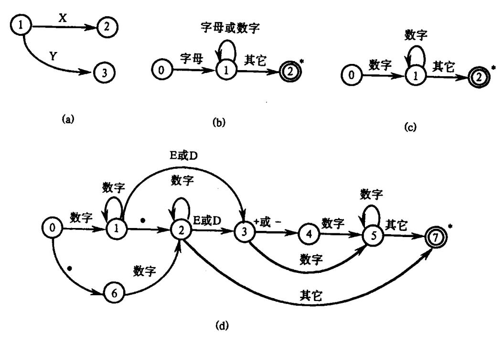

图 3.2 状态转换图 (a)转换图示例;(b)识别标识符的转换图;(c)识别整数的转换图;(d)识别 FORTRAN 实型常数的转换图。

一个状态转换图可用于识别(或接受)一定的字符串。例如,识别标识符的转换图如图 3.2(b)所示。其中 0 为初态,2 为终态。这个转换图识别(接受)标识符的过程是:从初

{5}------------------------------------------------

态 0 开始,若在状态 0 之下输入字符是一个字母,则读进它,并转入状态 1。在状态 1 之下,若下一个输入字符为字母或数字,则读进它,并重新进入状态 1。一直重复这个过程,直到状态 1 发现输入字符不再是字母或数字时(这个字符也已被读进)就进入状态 2。状态 2 是终态,它意味着到此已识别出一个标识符,识别过程宣告终止。终态结上打个星号\*意味着多读进了一个不属于标识符部分的字符,应把它退还给输入串。如果在状态 0时输入字符不为"字母",则意味着识别不出标识符,或者说,这个转换图工作不成功。

又例如,识别整数的转换图如图 3.2(c)所示。其中 0 为初态,2 为终态。

图 3.2(d)是一个识别 FORTRAN 实型常数的转换图。其中 0 为初态,7 为终态。

一个非常重要的事实是,大多数程序语言的单词符号都可以用转换图予以识别。作为一个综合例子,我们来构造一个识别某个简单语言的所有单词符号的转换图。表 3.1 列出了这个小语言的所有单词符号,以及它们的种别编码和内部值。由于直接使用整数编码不利于记忆,故用一些特殊符号来表示种别编码。这些特殊符号全都以\$开始。我们甚至可以设想,用于编写词法分析程序的语言允许以\$为首的标识符,并可以用宏定义将这些特殊符号和具体的整数值联系起来。

| 单词符号  | 种别编码 | 助忆符       | 内码值    |
|-------|------|-----------|--------|
| DIM   | 1    | \$ DIM    | _      |
| IF    | 2    | \$ IF     | -      |
| DO    | 3    | \$ DO     | _      |
| STOP  | 4    | \$ STOP   | _      |
| END   | 5    | \$ END    | _      |
| 标识符   | 6    | \$ ID     | _      |
| 常数(整) | 7    | \$ INT    | 内部字符串  |
| =     | 8    | \$ ASSIGN | 标准二进形式 |
| +     | 9    | \$ PLUS   | -      |
| *     | 10   | \$STAR    | _      |
| * *   | 11   | \$ POWER  | -      |
| ,     | 12   | \$ COMMA  | _      |
| (     | 13   | \$ LPAR   | _      |
| )     | 14   | \$ RPAR   | _      |

表 3.1 单词符号及内部表示

关于这个例子,有几点重要的限制,这些限制仅仅是为了在现阶段将例子做得简单一点而已。有关的限制是:

首先,所有关键字(如 IF、WHILE 等)都是"保留字"。所谓保留字的意思是,用户不得使用它们作为自己定义的标识符。例如,下面的写法是绝对禁止的:

$$IF(5) = x$$

因为,我们的分析器在识别出 IF 时就认定它是一个关键字。如果不采用保留字的办法,就必须使用超前搜索技术。

其次,由于把关键字作为保留字,故可以把关键字作为一类特殊标识符来处理。也就

{6}------------------------------------------------

是说,对于关键字不专设对应的转换图。但把它们(及其种别编码)预先安排在一张表格中(此表叫做保留字表)。当转换图识别出一个标识符时,就去查对这张表,确定它是否为一个关键字。

再次,如果关键字、标识符和常数之间没有确定的运算符或界符作间隔,则必须至少用一个空白符作间隔(此时,空白符不再是完全没有意义的了)。例如,一个条件语句应写为

IF 
$$i > 0$$
  $i = 1$ ;

而绝对不要写成

IF
$$i > 0$$
  $i = 1$ ;

因为对于后者,我们的分析器将无条件地将 IFi 看成一个标识符。

在上述假定下,多数单词符号的识别就不必使用超前搜索技术。图 3.3 是一张识别表 3.1 的单词符号的状态转换图。在图 3.3 中,状态 0 为初态;凡带双圈者均为终态;状态 13 是识别不出单词符号的出错情形。

在上面的例子中我们加了三点限制,虽然这些限制大都可以接受,但这并不意味着使

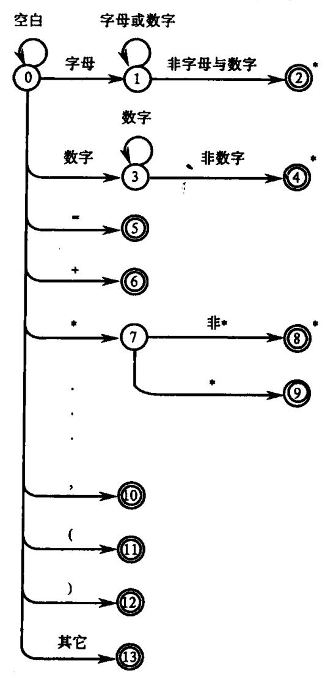

图 3.3 对简单语言进行词法分析的状态转换图

{7}------------------------------------------------

用状态转换图识别单词符号通通都必须加这些限制。例如,对于标准 C++而言,我们完全可以使用转换图来描述它的所有单词符号,用不到外加限制。

注意,一个程序语言的所有单词符号的识别也可以用若干张状态转换图予以描述。 虽然用一张图就可以了,但用若干张图有时会有助于概念的清晰化。

# 3.2.4 状态转换图的实现

转换图容易用程序实现。最简单的办法是让每个状态结点对应一小段程序。下面我们将引进一组全局变量和过程,将它们作为实现转换图的基本成分。这些变量和过程是:

- (1) ch 字符变量,存放最新读进的源程序字符。
- (2) strToken 字符数组,存放构成单词符号的字符串。
- (3) GetChar 子程序过程,将下一输入字符读到 ch 中,搜索指示器前移一字符位置。
- (4) GetBC 子程序过程,检查 ch 中的字符是否为空白。若是,则调用 GetChar 直至 ch 中进入一个非空白字符。
- (5) Concat 子程序过程,将 ch 中的字符连接到 strToken 之后。例如,假定 str-Token 原来的值为"AB",而 ch 中存放着'C',经调用 Concat 后, strToken 的值就变为"ABC"。
- (6) IsLetter 和 IsDigit 布尔函数过程,它们分别判断 ch 中的字符是否为字母和数字。
- (7) Reserve 整型函数过程,对 strToken 中的字符串查找保留字表,若它是一个保留字则返回它的编码,否则返回 0 值(假定 0 不是保留字的编码)。
- (8) Retract 子程序过程,将搜索指示器回调一个字符位置,将 ch 置为空白字符。
- (9) InsertId 整型函数过程,将 strToken 中的标识符插入符号表,返回符号表指针。
- (10) InsertConst 整型函数过程,将 strToken 中的常数插入常数表,返回常数表指针。 这些函数和子程序过程都不难编制。使用它们能够方便地构造状态转换图的对应程 序。一般来说,可让每个状态结点对应一程序段。

对于不含回路的分叉结点来说,可让它对应一个 switch 语句或一组 if…then…else 语句。例如,图 3.4(a)的状态结点 i 所对应的程序段可表示为:

GetChar( );

```
if (IsLetter()) {…状态 j 的对应程序段…;} else if (IsDigit()) {…状态 k 的对应程序段…;} else if (ch = '/') {…状态 l 的对应程序段…;} else {…错误处理…;}
```

当程序执行到达"错误处理"时,意味着现行状态 i 和当前所面临的输入串不匹配。如果后面还有状态图,出现在这个地方的代码应为:将搜索指示器回退一个位置,并令下一个状态图开始工作。如果后面没有其它状态图,则出现在上述位置的代码应进行真正的出错处理,报告源程序含有非法符号,并进行善后处理。

对于含回路的状态结点来说,可让它对应一个由 while 语句和 if 语句构成的程序段。

{8}------------------------------------------------

例如,图 3.4(b)的状态结点 i 所对应的程序段可为:

```
GetChar();
while (IsLetter() or IsDigit())
GetChar();
…状态;的对应程序段…
```

终态结点一般对应一个形如 return (code, value)的语句。其中,code 为单词种别编码;value 或是单词符号的属性值,或无定义。这个 return 意味着从分析器返回到调用者,一般指返回到语法分析器。凡带星号\*的终态结点意味着多读进了一个不属于现行单词符号的字符,这个字符应予退回,也就是说,必须把搜索指示器回调一字符位置。这项工作由 Retract 过程来完成。

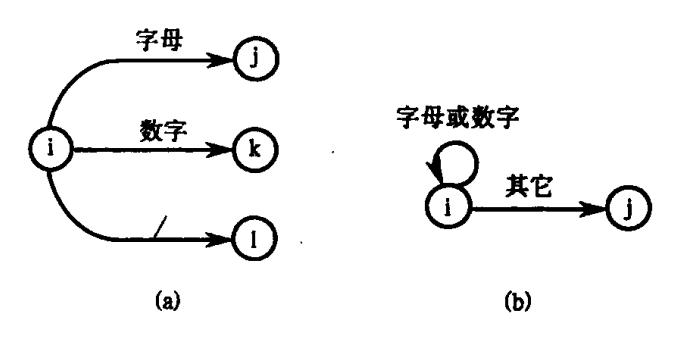

图 3.4 状态转换图 (a)具有不含回路的分叉结点的转换图; (b)具有含回路的状态结点的转换图。

对于图 3.3 中的状态 2,由于它既是标识符的出口又是关键字的出口,所以,为了弄清楚到底是关键字还是用户自定义的标识符,需要对 strToken 查询保留字表。这项工作由整型函数过程 Reserve 来完成。若此过程工作结果所得的值为 0,则表示 strToken 中的字符串是一个标识符;否则,表示关键字编码。

对于某些状态,若需要将 ch 的内容送进 strToken,则可以调用 Concat。

相应于转换图 3.3 的词法分析器现在可构造如下:

```
int code, value;
strToken := ""; /* 置 strToken 为空串 */
GetChar(); GetBC();\nif (IsLetter())
begin
while (IsLetter() or IsDigit())
begin
Concat(); GetChar();\nend
Retract();
code := Reserve();\nif(code = 0)
begin
value := InsertId(strToken);
```

{9}------------------------------------------------

```
return ($ID, value);
       end
       else
             return (code, -):
 end
 else if (IsDigit())
 begin
      while (IsDigit())
      begin
           Concat(); GetChar();
      end
      Retract();
      value : = InsertConst(strToken);
      return($INT, value):
end
else if (ch = ' = ') return (\$ASSIGN, -);
else if (ch = '+') return ($PLUS, -);
else if (ch = '*')
begin
     GetChar():
     if (ch = '*') return (\$POWER. -):
     Retract(); return ($STAR, -);
end
else if (ch = ';') return ($SEMICOLON, -);
else if (ch = '(') return ($LPAR, -);
else if (ch = ')') return ($RPAR, -);
else if (ch = '{') return ($LBRACE, -);
else if (ch = '}') return ($RBRACE, -);
else ProcError();
                   /* 错误处理*/
```

# 3.3 正规表达式与有限自动机

为了更好地使用状态转换图构造词法分析程序,为了讨论词法分析程序的自动生成,需要将上述转换图的概念稍加形式化。由于我们的主要兴趣在于构造词法分析程序,因此,对所述的某些结果不予形式证明。对证明有兴趣的读者请参阅有关文献。

# 3.3.1 正规式与正规集

对于字母表  $\Sigma$ ,我们感兴趣的是它的一些特殊字集,即所谓**正规集**。我们将使用**正规**式这个概念来表示正规集。下面是正规式和正规集的递归定义:

- (1)  $\varepsilon$  和  $\phi$  都是  $\Sigma$  上的正规式,它们所表示的正规集分别为 $\{\varepsilon\}$  和  $\phi$ ;
- (2) 任何  $a \in \Sigma$ ,  $a \in \Sigma$ 上的一个正规式, 它所表示的正规集为  $\{a\}$ ;
- (3) 假定 U 和 V 都是  $\Sigma$  上的正规式,它们所表示的正规集分别记为 L(U)和 L(V),那

{10}------------------------------------------------

 $\Delta$ ,(U|V), $(U\cdot V)$ 和(U)\*也都是正规式,它们所表示的正规集分别为  $L(U)\cup L(V)$ ,L(U)L(V)(连接积)和(L(U))\*(闭包)。

仅由有限次使用上述三步骤而得到的表达式才是 Σ 上的**正规式**。仅由这些正规式 所表示的字集才是 $\Sigma$ 上的**正规集**。

正规式的运算符"1"读为"或","·"读为"连接","\*"读为"闭包"(即,任意有限次的自 重复连接)。在不致混淆时,括号可以省去,但规定算符的优先顺序为:先"\*",次"·",最 后"।"。连接符"•"一般可省略不写。

例 3.1  $\diamondsuit \Sigma = \{a, b\}$ , 下面是  $\Sigma$  上的正规式和相应的正规集:

正规式

正规集

ba\*

 $\Sigma$ 上所有以 b 为首后跟任意多个 a 的字。

 $a(a|b)^*$ 

Σ上所有以 a 为首的字。

 $(a|b)^*(aa|bb)(a|b)^*$  Σ上所有含有两个相继的 a 或两个相继的 b 的字。

例 3.2  $\diamondsuit$   $\Sigma = \{A, B, 0, 1\}, 则$ 

正规式

正规集

 $(A|B)(A|B|0|1)^*$ 

Σ上的"标识符"的全体。

 $(0|1)(0|1)^*$ 

Σ上的"数"的全体。

若两个正规式所表示的正规集相同,则认为二者等价。两个等价的正规式 U 和 V 记 为 U = V。例如,b(ab)\* = (ba)\*b, (a|b)\* = (a\*b\*)\*。

令 U、V 和 W 均为正规式,显而易见,下列关系普遍成立:

- (1) UIV = VIU(交换律):
- (2) UI(VIW) = (UIV) IW(结合律);
- (3) U(VW) = (UV)W(结合律):
- (4) U(V|W) = UV|UW(分配律) (V|W)U = VU|WU:
- (5).  $\varepsilon U = U \varepsilon = U_{\odot}$

#### 3.3.2 确定有限自动机(DFA)

一个确定有限自动机(DFA) M 是一个五元式

$$M = (S, \Sigma, \delta, s_0, F)$$

其中

- (1) S 是一个有限集,它的每个元素称为一个状态。
- (2)  $\Sigma$  是一个有穷字母表,它的每个元素称为一个输入字符。
- (3)  $\delta$  是一个从  $S \times \Sigma$  至 S 的单值部分映射。  $\delta(s,a) = s'$  意味着: 当现行状态为 s、输入 字符为 a 时,将转换到下一状态 s'。我们称 s'为 s 的一个后继状态。
  - (4)  $s_0 \in S$ , 是唯一的**初态**。
  - (5) F⊆S,是一个**终态集**(可空)。

显然,一个 DFA 可用一个矩阵表示,该矩阵的行表示状态,列表示输入字符,矩阵元 素表示 δ(s.a)的值。这个矩阵称为状态转换矩阵。例如,有 DFA

$$M = (\{0,1,2,3\},\{a,b\},\delta,0,\{3\})$$

{11}------------------------------------------------

其中δ为

| $\delta(0,a)=1$          | $\delta(0,b)=2$ |
|--------------------------|-----------------|
| $\delta(1,\mathbf{a})=3$ | $\delta(1,b)=2$ |
| $\delta(2,a)=1$          | $\delta(2,b)=3$ |
| $\delta(3,a)=3$          | $\delta(3,b)=3$ |

它所对应的状态转换矩阵如表 3.2 所列。

| 表 3.2 | 状态 | 转换矩 | 阵 |
|-------|----|-----|---|
|-------|----|-----|---|

| 状态 | а | b   |
|----|---|-----|
| 0  | 1 | 2   |
| 1  | 3 | 2   |
| 2  | 1 | 3   |
| 3  | 3 | . 3 |

一个 DFA 也可表示成一张(确定的)状态转换图。假定 DFA M 含有 m 个状态和 n 个输入字符,那么,这个图含有 m 个状态结点,每个结点顶多有 n 条箭弧射出和别的结点相连接,每条箭弧用  $\Sigma$  中的一个不同输入字符作标记,整张图含有唯一的一个初态结点和若干个(可以是 0 个)终态结点。

对于  $\Sigma^*$  中的任何字  $\alpha$ ,若存在一条从初态结点到某一终态结点的通路,且这条通路上所有弧的标记符连接成的字等于  $\alpha$ ,则称  $\alpha$  可为 DFA M 所识别(读出或接受)。若 M 的 初态结点同时又是终态结点,则空字  $\varepsilon$  可为 M 所识别(或接受)。DFA M 所能识别的字的全体记为 L(M)。

例如,上一例子所定义的 DFA M 相应的状态转换图如图 3.5 所示。它能识别  $\Sigma$  上所有含有相继两个 a 或相继两个 b 的字(图中用"a,b"标志的弧实际上是指分别由 a 和 b 标志的两条弧)。

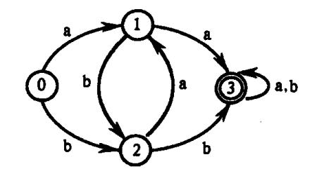

图 3.5 状态转换图

如果一个 DFA M 的输入字母表为  $\Sigma$ ,则我们也称 M 是  $\Sigma$  上的一个 DFA。可以证明:  $\Sigma$  上的一个字集  $V \subseteq \Sigma^*$  是正规的,当且仅当存在  $\Sigma$  上的 DFA M,使得 V = L(M)。

DFA 的确定性表现在映射  $\delta: S \times \Sigma \to S$  是一个单值函数。也就是说,对任何状态  $s \in S$  和输入符号  $a \in \Sigma$ ,  $\delta(s,a)$  唯一地确定了下一状态。从转换图的角度来看,假定字母表  $\Sigma$  含有 n 个输入字符,那么,任何一个状态结最多只有 n 条弧射出,而且每条弧以一个不同的输入字符标记。如果也允许  $\delta$  是一个多值函数,我们就得到非确定自动机的概念。

{12}------------------------------------------------

# 3.3.3 非确定有限自动机(NFA)

一个非确定有限自动机(NFA)M 是一个五元式  $M = (S, \Sigma, \delta, S_0, F)$ 

## 其中

- (1) S同 3.3.2 的 1;
- (2) Σ同 3.3.2 的 2:
- (3)  $\delta$  是一个从  $S \times \Sigma^*$  到 S 的子集的映照,即

$$\delta: S \times \Sigma^* \rightarrow 2^S$$

- (4) S<sub>0</sub>⊆S,是一个非空**初态集**;
- (5) F⊆S,是一个终态集(可空)。

显然,一个含有 m 个状态和 n 个输入字符的 NFA 可表示成如下的状态转换图:该图含有 m 个状态结点,每个结点可射出若干条箭弧与别的结点相连接,每条弧用  $\Sigma^*$  中的一个字(不一定要不同的字而且可以是空字  $\varepsilon$ )作标记(称为输入字),整张图至少含有一个初态结点以及若干个(可以是 0 个)终态结点。某些结点既可以是初态结点也可以是终态结点。

对于  $\Sigma^*$  中的任何一个字  $\alpha$ ,若存在一条从某一初态结点到某一终态结点的通路,且这条通路上所有弧的标记字依序连接成的字(忽略那些标记为  $\epsilon$  的弧)等于  $\alpha$ ,则称  $\alpha$  可为 NFA M 所**识别(读出或接受**)。若 M 的某些结点既是初态结点又是终态结点,或者存在一条从某个初态结点到某个终态结点的  $\epsilon$  通路,那么,空字  $\epsilon$  可为 M 所接受。

例如,图 3.6 就是一个 NFA。这个 NFA 所能识别的也是所有含有相继两个 a 或相继两个 b 的字。

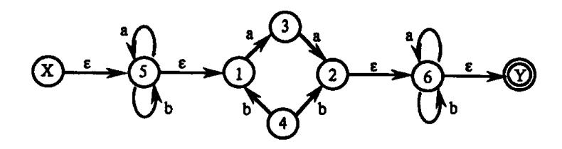

图 3.6 非确定有限自动机

显然,DFA 是 NFA 的特例。但是,对于每个 NFA M 存在一个 DFA M",使 L(M) = L(M")。证明过程如下:

- (1) 假定 NFA  $M = \langle S, \Sigma, \delta, S_0, F \rangle$ ,我们对 M 的状态转换图进行以下改造:
- ① 引进新的初态结点 X 和终态结点 Y,X,Y&S,
- 从 X 到  $S_0$  中任意状态结点连一条  $\varepsilon$  箭弧,从 F 中任意状态结点连一条  $\varepsilon$  箭弧到 Y。
- ② 对 M 的状态转换图进一步施行图 3.7 所示的替换,其中 k 是新引入的状态。

重复这种分裂过程直至状态转换图中的每条箭弧上的标记或为  $\varepsilon$ ,或为  $\Sigma$  中的单个字母。将最终得到的 NFA 记为 M',显然 L(M') = L(M)。

- (2) 将 M'进一步变换为 DFA,方法如下:
- ① 假定 I 是 M'的状态集的子集,定义 I 的 ε 闭包 ε\_CLOSURE(I)为:

{13}------------------------------------------------

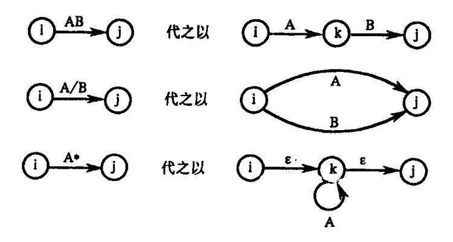

图 3.7 替换规则

- (a) 若q∈I,则q∈ε\_CLOSURE(I);
- (b) 若 q $\in$  I,那么从 q 出发经任意条  $\varepsilon$  弧而能到达的任何状态 q'都属于  $\varepsilon$ \_CLOSURE (I);
  - ② 假定 I 是 M'的状态集的子集, $a \in \Sigma$ ,定义

$$I_a = \varepsilon CLOSURE(J)$$

其中,J是那些可从I中的某一状态结点出发经过一条a弧而到达的状态结点的全体。

③ 假定  $\Sigma = \{a_i, \dots, a_k\}$ 。我们构造一张表,此表的每一行含有 k+1 列。置该表的首行首列为  $\varepsilon$ \_CLOSURE(X)。一般而言,如果某一行的第一列的状态子集已经确定,例如记为 I,那么,置该行的 i+1 列为 I<sub>ai</sub>( $i=1,\dots,k$ )。然后,检查该行上的所有状态子集,看它们是否已在表的第一列中出现,将未曾出现者填入到后面空行的第一列。重复上述过程,直至出现在第 i+1 列( $i=1,\dots,k$ )上的所有状态子集均已在第一列上出现。因为 M'的状态子集的个数是有限的,所以上述过程必定在有限步内终止。

现在,我们将构造出来的表视为状态转换表,将其中的每个状态子集视为新的状态。显然,该表唯一地刻划了一个 DFA M"。它的初态是该表首行首列的那个状态,终态是那些含有原终态的状态子集。根据上述构造方法,不难得出:L(M'') = L(M') = L(M)。

上述把 NFA 确定化为 DFA 的方法称为子集法。

例 3.3 正规式(a|b)\*(aa|bb)(a|b)\*对应的 NFA 如图 3.6 所示,其中 X 为初态, Y 为终态。按照上述证明过程构造出来的状态转换矩阵见表 3.3。

| I                  | Ia                 | $I_{\rm b}$        |
|--------------------|--------------------|--------------------|
| {X, 5, 1}          | <b> 5, 3, 1 </b>   | [5, 4, 1]          |
| <b>[5, 3, 1]</b>   | {5, 3, 1, 2, 6, Y} | [5, 4, 1]          |
| {5, 4, 1}          | {5, 3, 1}          | {5, 4, 1, 2, 6, Y} |
| 5, 3, 1, 2, 6, Y   | {5, 3, 1, 2, 6, Y} | [5, 4, 1, 6, Y]    |
| {5, 4, 1, 6, Y}    | [5, 3, 1, 6, Y]    | {5, 4, 1, 2, 6, Y} |
| {5, 4, 1, 2, 6, Y} | {5, 3, 1, 6, Y}    | [5, 4, 1, 2, 6, Y] |
| 5, 3, 1, 6, Y      | {5, 3, 1, 2, 6, Y} | 5, 4, 1, 6, Y      |

表 3.3 对应于例 3.3 中正规式的状态转换矩阵

{14}------------------------------------------------

| s   | a   | b |
|-----|-----|---|
| 0   | 1   | 2 |
| 1   | 3   | 2 |
| . 2 | 1   | 5 |
| 3   | 3   | 4 |
| 4   | 6   | 5 |
| 5   | 6   | 5 |
| 6   | 3 . | 4 |

对表 3.3 中的所有状态子集重新命名,得到表 3.4 所列的状态转换矩阵。 表 3.4 对表 3.3 中状态子集重新命名后的状态转换矩阵

与表 3.4 相对应的状态转换图如图 3.8 所示,其中 0 为初态,3、4、5 和 6 为终态。显然,图 3.6 和图 3.8 所示的有限自动机是等价的。

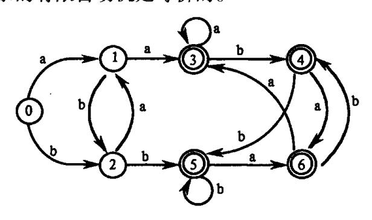

图 3.8 未化简的 DFA

#### 3.3.4 正规文法与有限自动机的等价性

对于正规文法 G 和有限自动机 M,如果 L(G) = L(M),则称 G 和 M 是**等价**的。关于正规文法和有限自动机的等价性,有以下结论:

- (1) 对每一个右线性正规文法 G 或左线性正规文法 G,都存在一个有限自动机(FA) M,使得 L(M) = L(G)。
- (2) 对每一个 FA M,都存在一个右线性正规文法  $G_R$  和左线性正规文法  $G_L$ ,使得  $L(M) = L(G_R) = L(G_L)$ 。

#### 证明 1:

(1) 设右线性正规文法  $G = \langle V_T, V_N, S, \mathscr{P} \rangle$ 。将  $V_N$  中的每一非终结符号视为状态符号,并增加一个新的终结状态符号 f,f $\not\in V_N$ 。

令  $M = \langle V_N \bigcup \{f\}, V_T, \delta, S, \{f\} \rangle$ ,其中状态转换函数  $\delta$  由以下规则定义:

- (a) 若对某个 A∈V<sub>N</sub>及 a∈V<sub>T</sub>∪  $\{\epsilon\}$ ,  $\mathscr{P}$ 中有产生式 A→a, 则令  $\delta(A,a) = f_o$
- (b) 对任意的  $A \in V_N$  及  $a \in V_T \cup \{\epsilon\}$ , 设  $\mathcal{P}$ 中左端为 A, 右端第一符号为 a 的所有产生

{15}------------------------------------------------

式为

$$A \rightarrow aA_1 \mid \cdots \mid aA_k$$
 (不包括  $A \rightarrow a$ ),

则令  $\delta(A,a) = \{A_1, \dots, A_k\}_o$ 

显然,上述 M 是一个 NFA。

对于右线性正规文法 G,在  $S \xrightarrow{+} w$  的最左推导过程中,利用  $A \xrightarrow{-} aB$  一次就相当于在 M 中从状态 A 经过标记为 a 的箭弧到达状态 B(包括  $a = \varepsilon$  的情形)。在推导的最后,利用  $A \xrightarrow{-} a$  一次则相当于在 M 中从状态 A 经过标记为 a 的箭弧到达终结状态 f(包括  $a = \varepsilon$  的情形)。综上,在正规文法 G 中, $S \xrightarrow{+} w$  的充要条件是:在 M 中,从状态 S 到状态 f 有一条通路,其上所有箭弧的标记符号依次连接起来恰好等于 w,这就是说, $w \in L(G)$  当且仅当  $w \in L(M)$ ,故 L(G) = L(M)。

(2)设左线性正规文法  $G=\langle V_T,V_N,S,\mathscr{P}\rangle$ 。将  $V_N$  中的每一符号视为状态符号,并增加一个初始状态符号  $q_0,q_0\not\in V_N$ 。

令  $M = \langle V_N \bigcup \{q_0\}, V_T, \delta, q_0, \{S\} \rangle$ ,其中状态转换函数  $\delta$  由以下规则定义:

- (a) 若对某个 A∈  $V_N$  及 a∈  $V_T$   $\bigcup$  { $\varepsilon$ },  $\mathscr{P}$ 中有产生式 A→a, 则令  $\delta(q_0,a) = A_o$
- (b) 对任意的  $A \in V_N$  及  $a \in V_T \cup \{\epsilon\}$ ,若  $\mathcal{P}$ 中所有右端第一符号为 A,第二个符号为 a 的产生式为

$$A_1 \rightarrow Aa$$
, ...,  $A_k \rightarrow Aa$ 

则令  $\delta(A,a) = \{A_1, \dots, A_k\}$ 。

与(1)类似,可以证明 L(G) = L(M)。

证明 2:

设 DFA  $M = \langle S, \Sigma, \delta, s_0, F \rangle$ 

- (1) 若  $s_0$  ∈ F, 我们令  $G_R = \langle \Sigma, S, s_0, \mathscr{P} \rangle$ , 其中  $\mathscr{P}$  是由以下规则定义的产生式集合: 对任何  $a \in \Sigma$  及  $A, B \in S$ , 若有  $\delta(A, a) = B$ , 则:
- (a) 当 B € F 时, 令 A→aB;
- (b) 当 B∈F 时, 令 A→a | aB。

对任何  $w \in \Sigma^*$ ,不妨设  $w = a_1 \cdots a_k$ ,其中  $a_i \in \Sigma$  ( $i = 1, \cdots k$ )。若  $s_0 \xrightarrow{+} w$ ,则存在一个最 左推导:

 $s_0 \Rightarrow a_1 A_1 \Rightarrow a_1 a_2 A_2 \Rightarrow \cdots \Rightarrow a_1 \cdots a_i A_i \Rightarrow a_1 \cdots a_{i+1} A_{i+1} \Rightarrow \cdots \Rightarrow a_1 \cdots a_k$ 因而,在 M 中有一条从  $s_0$  出发依次经过  $A_1, \cdots, A_{k-1}$ 到达终态的通路,该通路上所有箭弧的标记依次为  $a_1, \cdots, a_k$ 。反之亦然。所以, $w \in L(G_R)$ 当且仅当  $w \in L(M)$ 。

现在考虑  $s_0 \in F$  的情形。因为  $\delta(s_0, \varepsilon) = s_0$ ,所以  $\varepsilon \in L(M)$ 。但  $\varepsilon$  不属于上面构造的  $G_R$  所产生的语言  $L(G_R)$ 。不难发现, $L(G_R) = L(M) - \{\varepsilon\}$ 。所以,我们在上述  $G_R$  中添加新的非终结符号  $s_0'$ ,( $s_0 \notin S$ )和产生式  $s_0' \rightarrow s_0 \mid \varepsilon$ ,并用  $s_0'$ 代替  $s_0$  作开始符号。这样修正  $G_R$  后得到的文法  $G_R'$ 仍是右线性正规文法,并且  $L(G_R') = L(M)$ 。

(2) 类似于(1),从 DFA M 出发可构造左线性正规文法  $G_L$ ,使得  $L(G_L) = L(M)$ 。 最后,由 DFA 和 NFA 之间的等价性,结论 2 得证。

下面通过例子对前述证明过程进行具体解释。

例 3.4 设 DFA M = < {A,B,C,D}, {0,1},δ,A, {B} > 。 M 的状态转换图如图 3.9(a)

{16}------------------------------------------------

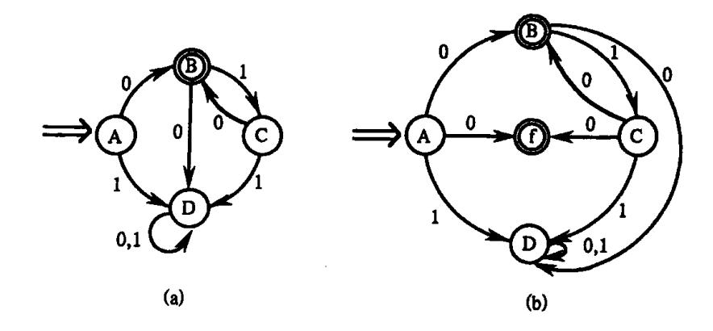

图 3.9 状态转换图

(a)初始的转换图;(b)从等价的右线性正规文法导出的转换图。

所示。不难发现,L(M) = 0(10)\*。

(1) 根据以上证明过程获得的右线性正规文法为

G<sub>R</sub> = < {0,1}, {A,B,C,D},A, \$\mathcal{P}\$>,其中 \$\mathcal{P}\$由下列产生式组成:

A→0|0B|1D

 $B \rightarrow 0D | 1C$ 

 $C \rightarrow 0 \mid 0B \mid 1D$ 

 $D\rightarrow 0D11D$ 

显然  $L(G_R) = L(M) = 0(10)$ \*。

(2) 再从 GR 出发构造 NFA M 为

 $M = \langle \{A, B, C, D, f\}, \{0, 1\}, \delta', A, \{f\} \rangle$ , M 的状态转换图如图 3.9(b) 所示。显然  $L(M) = L(G_R)$ 。

(3) 最后,从 NFA M 出发构造左线性正规文法

 $G_L = \langle \{0,1\}, \{B,C,D,f\}, f,\mathcal{P}' \rangle$ ,其中 $\mathcal{P}'$ 由下列产生式组成:

 $f \rightarrow 0 \mid C0$ 

C→B1

 $B \rightarrow 0 \mid C0$ 

 $D \rightarrow 1 \mid C1 \mid D0 \mid D1 \mid B0$ 

易证  $L(G_L) = L(M)_{\circ}$ 

## 3.3.5 正规式与有限自动机的等价性

下面我们将证明:

- (1) 对任何 FA M, 都存在一个正规式 r, 使得 L(r) = L(M)。
- (2) 对任何正规式 r,都存在一个 FAM,使得 L(M) = L(r)。

上述结论加上 3.3.3 节和 3.3.4 节所证明的结论,说明正规文法、正规式、确定有限自动机和非确定有限自动机在接收语言的能力上是互相等价的。

证明 1:

对于  $\Sigma$  上的 NFA M, 我们来构造  $\Sigma$  上的正规式 r, 使得 L(r) = L(M)。

首先,我们将状态转换图的概念拓广,令每条弧可用正规式作标记。

在 M 的转换图上加进两个结点,一个为 X,另一个为 Y。从 X 用  $\epsilon$  弧连接到 M 的所有初态结点;从 M 的所有终态结点用  $\epsilon$  弧连接到 Y,从而形成一个新的 NFA,记为 M',它只有一个初态 X 和一个终态 Y。显然,L(M) = L(M')。即,这两个 NFA 是等价的。

{17}------------------------------------------------

现在逐步消去 M'中的所有结点,直至只剩下 X 和 Y 为止。在消除结点的过程中,逐步用正规式来标记箭弧。消弧的过程是很直观的,只需反复使用图 3.10 的替换规则即可。

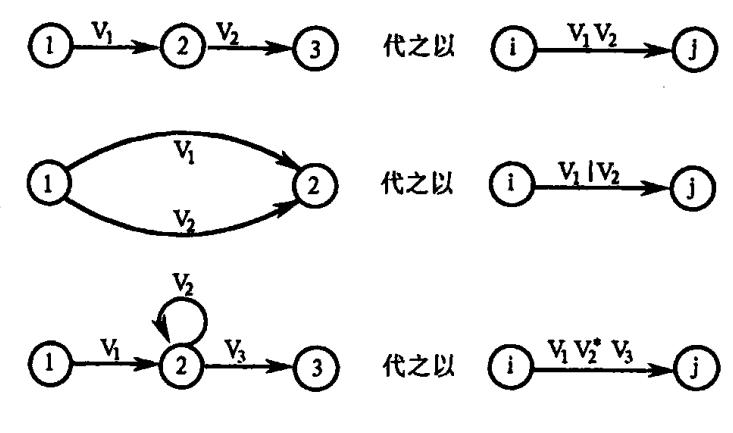

图 3.10 替换规则

#### 证明 2:

对于  $\Sigma$ 上的正规式 r, 我们将构造一个 NFA M, 使 L(M) = L(r), 并且 M 只有一个终态, 而且没有从该终态出发的箭弧。

下面使用关于r中运算符数目的归纳法证明上述结论。

(1) 若 r 具有零个运算符,则  $r=\varepsilon$  或  $r=\phi$  或 r=a,其中  $a\in\Sigma$ 。此时图 3.11(a)、(b)和 (c)所示的三个有限自动机显然符合上述要求。

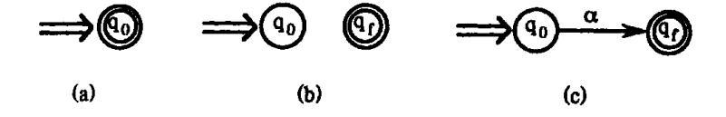

图 3.11 对应于零个运算符的正规式的状态转换图 (a)对应于正规式 ε 的转换图; (b)对应于正规式 φ 的转换图; (c)对应于正规式 a 的转换图。

(2) 假设结论对于少于 k(k≥1)个运算符的正规式成立。

当 r 中含有 k 个运算符时,r 有三种情形。

情形 1:  $r = r_1 \mid r_2, r_1, r_2$  中运算符个数少于 k。从而,由归纳假设,对  $r_i$  存在  $M_i = < S_i$ ,  $\Sigma_i$ ,  $\delta_i$ ,  $q_i$ ,  $\{f_i\}$  > ,使得  $L(M_i) = L(r_i)$ ,并且  $M_i$  没有从终态出发的箭弧(i = 1, 2)。不妨设  $S_1$   $\bigcap S_2 = \emptyset$ ,在  $S_1 \bigcup S_2$  中加入两个新状态  $q_0$ ,  $f_0$ 。

令  $M = \langle S_1 \cup S_2 \cup \{q_0, f_0\}, \Sigma_1 \cup \Sigma_2, \delta, q_0, \{f_0\} \rangle$ , 其中  $\delta$  定义如下:

- (a)  $\delta(q_0, \varepsilon) = \{q_1, q_2\}_{\circ}$
- (b)  $\delta(q,a) = \delta_1(q,a), \ \ \ \ \ \ \ \ \ \ \ \ \ \ \ \ \ \ \$
- (c)  $\delta(q,a) = \delta_2(q,a), \stackrel{\text{def}}{=} q \in S_2 \{f_2\}, a \in \Sigma_2 \cup \{\epsilon\}.$
- (d)  $\delta(f_1, \varepsilon) = \delta(f_2, \varepsilon) = \{f_0\}_{\circ}$

M 的状态转换如图 3.12(a)所示。从该图中不难看出, M 中有一条从  $q_0$  到  $f_0$  的通路 w,当且仅当在  $M_1$  中有一条从  $q_1$  到  $f_1$  的通路 w 或者在  $M_2$  中有一条从  $q_2$  到  $f_2$  的通路 w,即:

{18}------------------------------------------------

$$L(\mathbf{M}) = L(\mathbf{M}_1) \bigcup L(\mathbf{M}_2) = L(\mathbf{r}_1) \bigcup L(\mathbf{r}_2) = L(\mathbf{r})$$

情形 2: r=r<sub>1</sub>r<sub>2</sub>。设 M<sub>i</sub> 同情形 1(i=1,2)。

令  $M = \langle S_1 \cup S_2, \Sigma_1 \cup \Sigma_2, \delta, q_1, \{f_2\} \rangle$ ,其中  $\delta$  定义如下:

- (a)  $\delta(q,a) = \delta_1(q,a), \leq q \in S_1 \{f_1\}, a \in \Sigma_1 \cup \{\epsilon\}.$
- (b)  $\delta(q,a) = \delta_2(q,a), \stackrel{\omega}{=} q \in S_2, a \in \Sigma_2 \cup \{\epsilon\}.$
- (c)  $\delta(f_1, \varepsilon) = \{q_2\}_{\circ}$

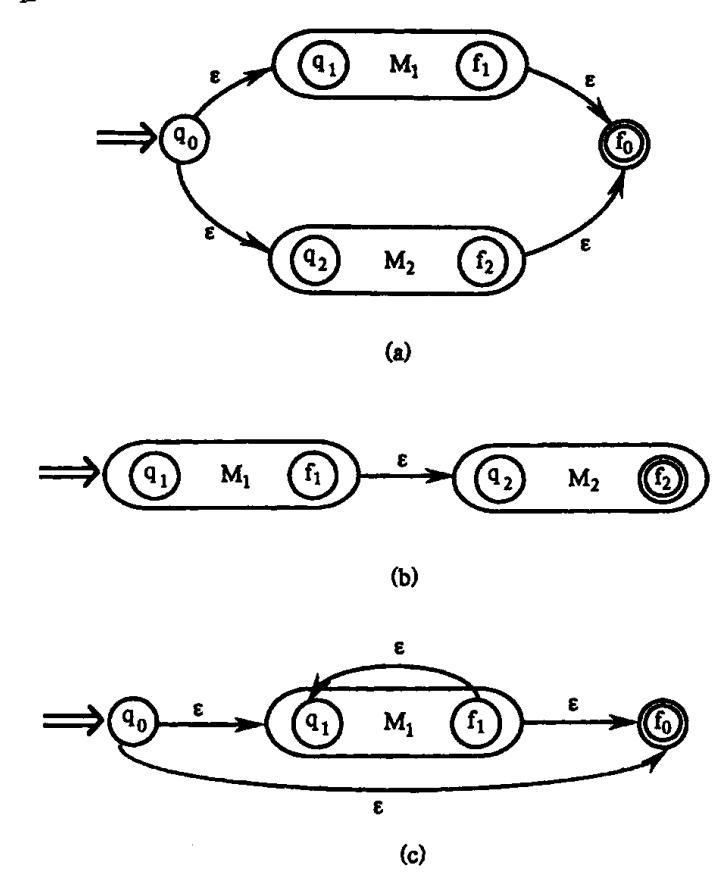

图 3.12 状态转换图的合并 (a)并运算;(b)连接运算;(c)闭包运算。

M 的状态转换如图 3.12(b)所示。从该图同样可推知

$$L(M) = L(M_1)L(M_2) = L(r_1)L(r_2) = L(r)_{\circ}$$

情形 3: r=r<sub>1</sub>\*。设 M<sub>1</sub> 同情形 1。

令  $M = \langle S_1 \cup \{q_0, f_0\}, \Sigma_1, \delta, q_0, \{f_0\} \rangle$ ,其中  $q_0, f_0 \notin S_1, \delta$ 定义如下:

- (a)  $\delta(q_0, \varepsilon) = \delta(f_1, \varepsilon) = \{q_1, f_0\}_{\circ}$
- (b)  $\delta(q,a) = \delta_1(q,a), \leq q \in S_1 \{f_1\}, a \in \Sigma_1 \cup \{\epsilon\}.$

M 的状态转换如图 3.12(c)所示。M 中任何一条从  $q_0$  到  $f_0$  的路径,或者是一条从  $q_0$  到  $f_0$  经过标记为  $\epsilon$  的路径,或者,首先从  $q_0$  经  $\epsilon$  标记到达  $q_1$ ,在  $M_1$  中经由标记为  $L(M_1)$ 中的字从  $q_1$  到  $f_1$ ,然后从  $f_1$  经  $\epsilon$  标记折回  $q_1$ ,再在  $M_1$  中从  $q_1$  到达  $f_1$ ,如此往返若干次(包括零次),最后从  $f_1$  经由标记  $\epsilon$  到达  $f_0$ 。因此,如果在 M 中有一条从  $q_0$  到  $f_0$  的通路 w,当且仅当 w 能够写成  $w_1 \cdots w_n (n=0$ 表示 w 为  $\epsilon$ ),其中  $w_i(L(M_1))$ 。 $(i=1,\cdots,n)$ 。所以,

{19}------------------------------------------------

$$L(M) = L(M_1)^* = L(r_1)^* = L(r)$$

至此,结论2获证。上述证明过程实质上是一个将正规表达式转换为有限自动机的算法。

例 3.5 与正规式  $r_1 = 1^*$ ,  $r_2 = 01^*$ ,  $r_3 = 01^*$  | 1 等价的有限自动机分别如图 3.13(a)、(b)和(c)所示。

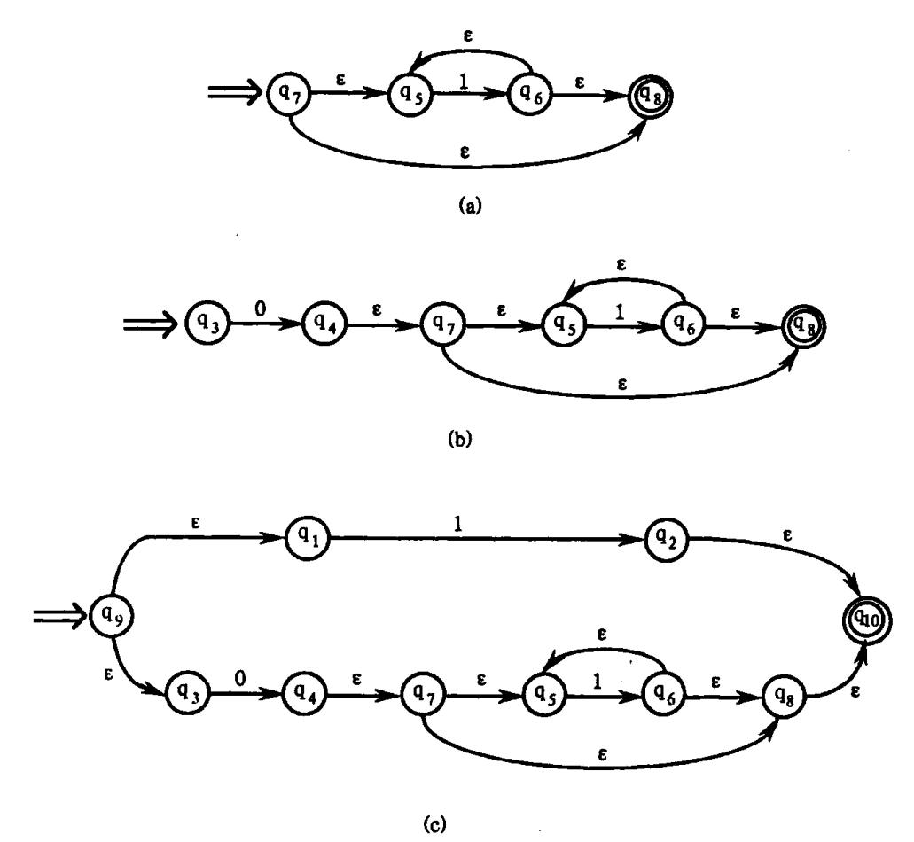

图 3.13 与正规式等价的有限自动机 (a)对应于正规式 1\*的转换图;(b)对应于正规式 01\*的转换图; (c)对应于正规式 01\*11 的转换图。

#### 3.3.6 确定有限自动机的化简

一个确定有限自动机 M 的化简是指:寻找一个状态数比 M 少的 DFA M',使得 L(M) = L(M')。

假定 s 和 t 是 M 的两个不同状态,我们称 s 和 t 是**等价**的:如果从状态 s 出发能读出某个字 w 而停于终态,那么同样,从 t 出发也能读出同样的字 w 而停于终态;反之,若从 t 出发能读出某个字 w 而停于终态,则从 s 出发也能读出同样的 w 而停于终态。如果 DFA M 的两个状态 s 和 t 不等价,则称这两个状态是**可区别的**。例如,终态与非终态是可区别的。因为,终态能读出空字  $\varepsilon$ ,非终态则不能读出空字  $\varepsilon$ 。又例如,图 3.8 中的状态 1 与 2 是可区别的,因为,状态 1 读出 a 而停于终态,状态 2 读出 a 后不到达终态。

一个 DFA M 的状态最少化过程旨在将 M 的状态集分割成一些不相交的子集,使得任

{20}------------------------------------------------

何不同的两子集中的状态都是可区别的,而同一子集中的任何两个状态都是等价的。最后,在每个子集中选出一个代表,同时消去其它等价状态。

对 M 的状态集 S 进行分划的步骤是: 首先, 把 S 的终态与非终态分开, 分成两个子集, 形成基本分划  $\Pi$ 。显然, 属于这两个不同子集的状态是可区别的。假定到某个时候  $\Pi$  已含 m 个子集, 记  $\Pi = \{I^{(1)}, I^{(2)}, \cdots, I^{(m)}\}$ , 并且属于不同子集的状态是可区别的。检查  $\Pi$  中的每个  $I^{(i)}$ 看能否进一步分划。对于某个  $I^{(i)}$ , 令  $I^{(i)} = \{q_1, q_2, \cdots, q_k\}$ , 若存在一个输入字符 a 使得  $I_a^{(i)}$ (关于  $I_a$  的定义见 3.3.3)不全包含在现行  $\Pi$  的某一子集  $I^{(i)}$ 中,就将  $I^{(i)}$ 一分为二。例如,假定状态  $s_1$  和  $s_2$  经 a 弧分别达到状态  $t_1$  和  $t_2$ ,而  $t_1$  和  $t_2$  属于现行  $\Pi$  的两个不同子集,那就将  $I^{(i)}$ 分成两半,使得一半含有  $s_1$ :

 $I^{(il)} = \{s \mid s \in I^{(i)} \leq 1 \text{ s.s.}$  经 a 弧到达  $t_i$  所在子集中的某状态}

另一半含有 so:

$$I^{(i2)} = I^{(i)} - I^{(i1)}$$

由于  $t_1$  和  $t_2$  是可区别的,即存在一个字 w,  $t_1$  将读出 w 而停于终态,而  $t_2$  或读不出 w 或虽然可读出 w 但不到达终态;或情形恰好相反。因而字 aw 将状态  $s_1$  和  $s_2$  区别开来。也就是说, $I^{(i1)}$ 中的状态与  $I^{(i2)}$ 中的状态是可区别的。至此我们将  $I^{(i)}$ 分成两半,形成了新的分划。

一般地,若  $I_a^{(i)}$  落入现行  $\Pi$  中 N 个不同子集,则应将  $I^{(i)}$  划分为 N 个不相交的组,使得每个组 J 的  $J_a$  都落入  $\Pi$  的同一子集,这样形成新的分划。重复上述过程,直至分划中所含的子集数不再增长为止。至此, $\Pi$  中的每个子集已不可再分。也就是说,每个子集中的状态是互相等价的,而不同子集中的状态则是可互相区别的。

经上述过程之后,得到一个最后分划  $\Pi$ 。对于这个  $\Pi$  中的每一个子集,我们选取子集中的一个状态代表其它状态。例如,假定  $I=\{q_1,\cdots,q_k\}$ 是这样一个子集,我们即可挑选  $q_1$  代表这个子集。在原来的自动机中,凡导人到  $q_2,\cdots,q_k$  的弧都改成导入到  $q_1$ 。然后,将  $q_2,\cdots,q_k$  从原来的状态集 S 中删除。若 I 中含有原来的初态,则  $q_1$  是新初态;若 I 中含有原来的终态,则  $q_1$  是新终态。可以证明,经如此化简之后得到的 DFA M'和原来的 M 是等价的,也就是 L(M) = L(M')。若从 M'中删除所有无用状态(即从初态结开始永远到达不了的那些状态),则 M'便是最简的(包含最少状态)。

例 3.6 图 3.8 所示的 DFA M 的化简过程是:

首先,把 M 的状态分成两组:终态组 3,4,5,6 ,非终态组 (0,1,2)。

其次,考察 ${3,4,5,6}$ ,由于 ${3,4,5,6}$ <sub>a</sub> $\subset {3,4,5,6}$ 和 ${3,4,5,6}$ <sub>b</sub> $\subset {3,4,5,6}$ ,所以,它不能再分划。

再考察 $\{0,1,2\}$ ,由于 $\{0,1,2\}$ <sub>a</sub>= $\{1,3\}$ ,它既不包含在 $\{3,4,5,6\}$ 之中也不包含在 $\{0,1,2\}$ 之中,因此,应把 $\{0,1,2\}$ 一分为二。由于状态 1 经 a 弧到达状态 3,而状态 0、2 经 a 弧都到达状态 1,因此,应把 1 分出来,形成 $\{1\}$ 、 $\{0,2\}$ 。

现在,整个分划中含有三组: {3,4,5,6}、{1}和{0,2}。

由于 $\{0,2\}_b = \{2,5\}$ 未包含在上述三组中的任一组之中,故 $\{0,2\}$ 也应一分为二: $\{0\}$ ,  $\{2\}$ 。

至此,整个分划含有四组: {3,4,5,6}、{0}、{1}、{2}。每个组都已不可再分。

{21}------------------------------------------------

最后,令状态 3 代表 $\{3,4,5,6\}$ 。把原来到达状态  $4\sqrt{5}$ 0 的弧都导入 3,并删除  $4\sqrt{5}$ 0, 这样,就得到图 3.5 所示的化简了的 DFA。

# 3.4 词法分析器的自动产生

我们现在用正规式描述单词符号,并研究如何从正规式产生识别这些单词符号的词法分析程序。

下面,先介绍一个描述词法分析器的语言 LEX,讨论 LEX 的实现(即研究它的编译器构造),从而,用它来描述和自动产生所需的各种词法分析器。

一个描述词法分析器的 LEX 程序由一组正规式以及与每个正规式相应的一个"动作"(Action)组成。"动作"本身是一小段程序代码,它指出了当按正规式识别出一个单词符号时应采取的行动。将 LEX 程序被编译后所得的结果程序记为 L,其作用就如同一个有限自动机一样,可用来识别和产生单词符号。结果程序含有一张状态转换表和一个控制程序。LEX 及其编译系统的作用如图 3.14 所示。

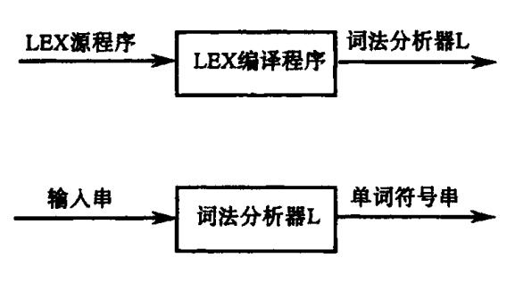

图 3.14 LEX 编译系统的作用

#### 3.4.1 语言 LEX 的一般描述

一个 LEX 源程序主要包括两部分。一部分是正规定义式,另一部分是识别规则。如果  $\Sigma$  是一个字母表, $\Sigma$  上的正规定义式是下述形式的定义序列:

$$d_{1} \rightarrow r_{1}$$

$$d_{2} \rightarrow r_{2}$$

$$\vdots$$

$$d_{i} \rightarrow r_{i}$$

其中  $d_i$  表示不同的名字,每个  $r_i$  是  $\Sigma \bigcup \{d_1, \cdots, d_{i-1}\}$  上的符号所构成的正规式。  $r_i$  中不能含有  $d_i$ ,  $d_{i+1}$ ,  $\cdots$ ,  $d_n$ , 这样,对任何  $r_i$ , 可以构成一个  $\Sigma$  上的正规表达式,只要反复地将式中出现的名字代之以相应的正规式即可。注意,如果允许  $r_i$  中出现某些  $d_j$ ,  $j \ge i$ , 那么这种替代过程将有可能不终止。

例如,Pascal 标识符的集合可由以下的正规定义式表示:

letter 
$$\rightarrow$$
 A | B | ··· | Z | a | b | ··· | z digit  $\rightarrow$  0 | 1 | ··· | 9 id  $\rightarrow$  letter (letter | digit) \*

{22}------------------------------------------------

又如,Pascal 的无符号数具有 4096,3.1415926,6.18E3,6.18E-3 等形式。它们的集合可由以下的正规定义式表示:

LEX 源程序中的识别规则是一串如下形式的 LEX 语句:

$$\begin{array}{lll} P_1 & \{A_1\} \\ P_2 & \{A_2\} \\ \vdots & \vdots \\ P_m & \{A_m\} \end{array}$$

其中,每个  $P_i$  是一个正规式,称为**词形**。 $P_i$  中除了出现  $\Sigma$  中的字符外,还可以出现正规定义式左部所定义的任何简名  $d_i$ 。即,  $P_i$  是  $\Sigma \cup \{d_1, \cdots, d_n\}$  上的一个正规式。由于每个  $d_i$  最终都可化为纯粹  $\Sigma$  上的正规式,因此,每个  $P_i$  也同样如此。每个  $A_i$  是一小段程序代码,它指出了,在识别出词形为  $P_i$  的单词之后,词法分析器应采取的动作。这些识别规则完全决定了词法分析器 L 的功能。分析器 L 只能识别具有词形  $P_i$ ,  $\cdots$ ,  $P_m$  的单词符号。

关于描述动作  $A_i$  的 LEX 语言成分可以有种种不同的选择。下面,在讨论 L 的作用时,将对  $A_i$  的有关组成成分予以必要的说明和解释。

首先,我们考察由 LEX 所产生的目标程序 L(词法分析器)是如何进行工作的:L逐一扫描输入串的每个字符,寻找一个最长的子串匹配某个 P<sub>i</sub>,将该子串截下来放在一个叫做 TOKEN 的缓冲区中(事实上,这个 TOKEN 也可以只包含一对指示器,它们分别指出这个子串在原输入缓冲区中的始末位置)。然后,L就调用动作子程序 A<sub>i</sub>,当 A<sub>i</sub> 工作完后,L就 把所得的单词符号(由种别编码和属性值两部分构成)交给语法分析程序。当L重新被调用时就从输入串中继上次截出的位置之后识别下一个单词符号。

可能存在这样的情形,对于现行输入串找不到任何词形 P<sub>i</sub> 与之相匹配。在这种情形下,L应报告输入串含有错误(如非法字符),并进行善后处理。但也可能存在一个最长子串,可以匹配若干个不同的 P<sub>i</sub>。在这种二义的情形下,以 LEX 程序中出现在最前面的那个 P<sub>i</sub> 为准。换句话说,愈处于前面的 P<sub>i</sub>,匹配优先权就愈高(在服从最长匹配的前提下)。

每个词形  $P_i$  相应的动作  $A_i$  的基本组成成分是"返回  $P_i$  的种别编码和属性值"。这可用一个 LEX 过程表示成 return(code, value)。如果  $P_i$  是"标识符",则 value 为符号表入口指针;若  $P_i$  是"整型常数",则 value 为常数表入口指针;若  $P_i$  既不是标识符也不是某种常数,那么,value 便无定义。

下面是一个识别表 3.1 的单词符号的 LEX 程序: AUXILIARY DEFINITIONS /\* 辅助定义 \*/ letter→A|B|···|Z digit→0|1|···|9

{23}------------------------------------------------

```
RECOGNITION RULES /* 识别规则 */
 1 DIM
                            \{\text{return}(1, -)\}
2 IF
                            return(2, -)
3 DO
                            \[ \text{return(3, -)} \]
4 STOP
                            {return(4, -)}
5 END
                           | return(5, -) |
6 letter(letter|digit)*
                           return(6, getSymbolTableEntryPoint())}
7 digit (digit)*
                           {return(7, getConstTableEntryPoint())}
8 =
                           {return(8, -)}
9 +
                           \return(9, -)\
10 *
                           return(10, -)
11 * *
                           |return(11, -)|
12.
                           return(12, -)
13 '('
                           return(13, -)
14 ')'
                           return(14, -)
```

按照这个程序所列的识别规则,当后跟一个空白符的 DIM 被扫描到时,规则 1 和规则 6 都可能对它进行匹配。但由于作为保留字的正规式列在前面,因此,识别的结果将 DIM 作为一个基本字,而不是作为一般的标识符。又例如,当相继的两个星号的第一个被扫描时,因为它不构成所有可能匹配的最长子串,因此,识别的结果是产生代表乘幂符的 双星而不是单星。

注意,在形式地定义 LEX 时,务必将组成正规式的运算符,如1、\*、(、)等,和  $\Sigma$  中可能出现的字符严格区别开来。上述 LEX 程序的规则 6 和 7 中的左、右括号与规则 13 和 14 中的左、右括号显然是完全属于两个不同范畴的符号。为了明确这种区别,规则 13 和 14 中的左、右括号都带上了引号。

#### 3.4.2 超前搜索

在某些语言中,要识别一个单词符号必须超前看若干字符。例如,在标准 FORTRAN中,空白字符除了出现在文字常数中有意义之外,在别的任何地方出现都是没有意义的。一个众所周知的例子是:

DO 
$$501 I = 1.25$$

在碰到小数点之前,我们弄不清楚这是 DO 语句还是一个对标识符 DO501I 进行赋值的赋值语句。为此,我们引进另一个正规式运算符'/',用它来指出一个单词符号的截取点。于是,关于基本字 DO 的识别规则就可写为

这意味着要求词法分析器 L 向前扫描到逗点,识别出具有如下词形的输入子串:

在寻找到这种匹配之后,就按识别规则中斜线所指处将输入串截断,取出其前一部分子串(即 DO)作为词法分析器 L 的输出,而将后一部分子串归还给输入串。斜线'/'应被当成是正规式的一个"算符",可称它为"截断"算符。因此,并不意味着要求在输入串中有相应的斜线。分析器 L 下次扫描将从 DO 后面的那个字符开始。

{24}------------------------------------------------

对于 FORTRAN 这种语言,对其基本字的识别往往都得超前多看若干个字符。另一例子是关于基本字逻辑 IF 的识别问题,在 FORTRAN 中,语句

$$IF(M) = 322$$

是完全正确的。因此,当我们看到 IF 时,不能立即断定它就是基本字逻辑 IF。要判别它是否是基本字逻辑 IF,就必须看右括号右边是否是一个语句。由于 FORTRAN 的语句都是以字母开头的,因此,等于要看右括号右边的第一个字符是否为字母。于是,识别逻辑 IF 的规则可表示为

其中,辅助定义名 any 代表 FORTRAN 字母表中任一字符。同样,识别算术 IF 的规则 应为

### 3.4.3 LEX 的实现

LEX 的编译程序旨在将一个 LEX 源程序改造为一个词法分析器 L,这个词法分析器 L 将像有限自动机那样工作。LEX 程序的编译过程是直观的。首先,对每条识别规则  $P_i$  构造一个相应的非确定有限自动机  $M_i$ ;然后,引进一个新初态 X,通过  $\varepsilon$  弧(如图 3.15 所示),将这些自动机连接成一个新的 NFA;最后,用 3.3.6 节所述的方法将它改造成一个等价的 DFA(必要时,还可以对这个 DFA 进行化简)。

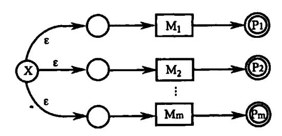

图 3.15 FA 的组装

但是,根据 LEX 程序的要求,在编译时还必须注意以下几点。

首先,在原来的每个 NFA M<sub>i</sub> 中都有它自己的一个终态,它指明一个匹配于词形 P<sub>i</sub> 的输入子串已被识别到。在等价的 DFA 中,一个状态子集可能包含若干个不同的终态。而且,这个 DFA 的终态(子集)和通常的意义也有所不同。因为,我们要求的是匹配最长的子串,因此,在到达某个终态之后,这个 DFA 应继续工作下去,以便寻找更长的匹配,直到无法继续前进为止(即,到达那样的一个状态,它对所面临的输入字符没有后继状态)。

当到达"无法继续前进"的情形时,就回头检查 DFA 所经历的每个状态子集,从后面逐个向前检查,直到发现某个含有原来的 NFA 终态的子集为止(如果不存在这种子集则认为输入串含有错误)。如果这个子集中含有若干个原来的 NFA 终态,那么,就以那个与最先出现的识别规则相对应的终态为准。

下面的例子有助于将上述思想明确化。假定有如下的一个 LEX 程序(忽略了动作部分):

{25}------------------------------------------------

识别这三个词形的三个 NFA 如图 3.16 所示。将它们合并为一个 NFA 后,得到图 3.17。再将该 NFA 确定化之后得到如表 3.5 所列的 DFA。

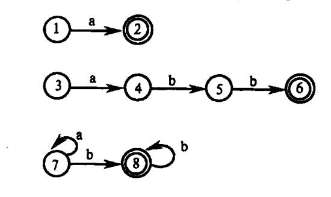

图 3.16 三个 NFA

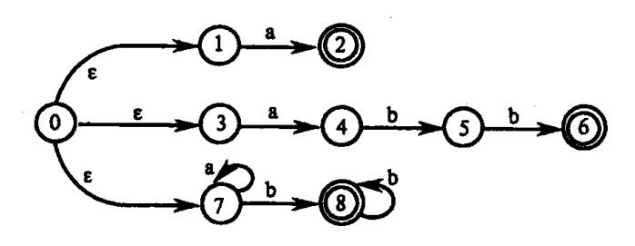

图 3.17 合并后的 NFA

状 态 到达终态时所识别的单词 初态 0137 247 8 终态 247 7 58 终态 8 8 a\*bb' 7 8 终态 58 68 a \* bb \* 终态 68 8 abb

表 3.5 DFA 的转换矩阵表

在这个 DFA 中,初态为 0137,终态有 247、8、58 和 68。在前三个终态子集中各只含原来 NFA 的一个终态(分别为 2、6、8),因此,它们是没有二义的。对于最后一个终态子集 68,其中 6 和 8 都是原来 NFA 的终态,但由于 6 所代表的识别规则列在 8 所代表的规则之前,因此,我们认为子集 68 代表了原先 6 所识别的结果。

现在,假定输入串为 aba…。表 3.5 的 DFA 从初态 0137 开始工作,当它扫描到第一个字符 a 时,进入状态 247。然后,见到 b 又进至状态 58。但 58 对于后面的输入字符 a 没有后继状态,因此,不能继续前进了。至此,这个 DFA"吃进"两个字符 a 与 b,经历了三个状态——0137、247 和 58。下面,按反序逐一检查它所经历的每个状态,看哪个状态中含有原来 NFA 的终态。首先,检查 58,它恰好含有唯一的一个原 NFA 的终态 8,因此,所识别出的单词 ab 就认为是属于 8 所指的那个词形 a\*bb\*。假若 58 中未含原来的终态,那么,就得把最后吃进的那个字符(b)退还给输入串。同时,检查前一个状态 247。一旦吃进的字符都退还完了,就宣布识别失败。

注意,如果表 3.5 的 DFA 的每个状态(子集)对任何输入字符 a 或 b 都有后继状态,那

{26}------------------------------------------------

么,这个 DFA 的工作就永远没完,到达不了"不能继续前进"的地步。这种情形对现实程序语言是不会发生的,因为,不可能设想有一个可容纳一切输入字符的单词存在。现实中存在的问题是,为了计划缓冲区的大小,单词符号的长度要受限制。具体地说,对标识符和常数的长度要有限制,超出这个限制就认为是错误的。

关于动作  $A_i$  的处理,那是十分明显的。仅当最终明确所识别出的最长子串是属于  $P_i$  时,词法分析器才让相应的  $A_i$  开始工作。

关于正规式中超前搜索'/'的实现问题可作如下处理: 当将一个词形 P<sub>i</sub> 化成相应的 NFA M<sub>i</sub> 时,我们将'/'当作 ε,但将射出'/'弧的结标记为"截断结"。这意味着,当最终的 DFA 用于识别输入串时,我们不要求有一个真正的'/'与之对应。但当含有'/'的词形获得匹配时,必须把截断结以后的字符退还给输入串,而只取截断点前的那部分字符作为单词。

至此,我们简要地描述了 LEX 编译程序如何将 LEX 源程序翻译成一张状态转换表 (如表 3.5)和一个有关控制程序的基本过程。由于词法分析工作很费时间和空间,因此,对确定化的自动机应进行状态化简。还有,当对 LEX 源程序的识别规则中的词形 P<sub>i</sub> 进行展开时,其中那些代表字符类的辅助定义名(如 letter, digit)可以保留不动,就好像它们也是一个"字符"那样。这样,就可为后来的 NFA 或 DFA 的构造节省许多状态。这意味着,当从输入串读入一个字符时,首先要判别它是否属于诸如字母或数字这样的类。

如果大量的关键字都作为正规式列于 LEX 源程序的识别规则之中,那么,状态结点的数目就很大,而且有许多结点非常相似。因此,为了节省内存,对最终所得的状态转换矩阵表应使用一种紧凑的数据表示法。

# 练 习

- 1. 编写一个对于 Pascal 源程序的预处理程序。该程序的作用是,每次被调用时都将下一个完整的语句送进扫描缓冲区,去掉注解行,同时要对源程序列表打印。
  - 2. 请给出以下 C++程序段中的单词符号及其属性值。

```
int CInt::nMulDiv(int n1, int n2)
{
    if (n3 = = 0) return 0;
    else return (n1 * n2)/n3;
}
```

- 3. 用类似 C 或 Pascal 的语言编写过程 GetChar, GetBC 和 Concat。
- 4. 用某种高级语言编写并调试一个完整的词法分析器。
- 5. 证明 3.3.1 中关于正规式的交换律、结合律等五个关系。
- 6. 令 A、B 和 C 是任意正规式,证明以下关系成立:

$$A \mid A = A$$

$$(A^*)^* = A^*$$

$$A^* = \varepsilon \mid AA^*$$

$$(AB)^* A = A(BA)^*$$

{27}------------------------------------------------

7. 构造下列正规式相应的 DFA

1(0|1) \* 101 1(1010 \* |1(010) \* 1) \* 0 0 \* 10 \* 10 \* 10 \*

(00|11)\*((01|10)(00|11)\*(01|10)(00|11)\*)\*

- 8. 给出下面正规表达式:
- (1) 以 01 结尾的二进制数串;
- (2) 能被 5 整除的十进制整数;
- (3) 包含奇数个1或奇数个0的二进制数串:
- (4) 英文字母组成的所有符号串,要求符号串中的字母依照字典序排列;
- (5) 没有重复出现的数字的数字符号串的全体;
- (6) 最多有一个重复出现的数字的数字符号串的全体:
- (7) 不包含子串 abb 的由 a 和 b 组成的符号串的全体。
- 9. 对下面情况给出 DFA 及正规表达式:
- (1) {0,1}上的含有子串 010 的所有串;
- (2) {0,1}上不含子串 010 的所有串。
- 10. 一个人带着狼、山羊和白菜在一条河的左岸。有一条船,大小正好能装下这个人和其它三件东西中的一件。人和他的随行物都要过到河的右岸。人每次只能将一件东西摆渡过河。但若人将狼和羊留在同一岸而无人照顾的话,狼将把羊吃掉。类似地,若羊和白菜留下来无人照看,羊将会吃掉白菜。请问是否有可能渡过河去,使得羊和白菜都不被吃掉?如果可能,请用有限自动机写出渡河的方法。
  - 11. 用某种高级语言写出:
  - (1) 将正规式变成 NFA 的算法:
  - (2) 将 NFA 确定化的算法;
  - (3) DFA 状态最少化的算法。
  - 12. 将图 3.18 的(a)和(b)分别确定化和最少化。

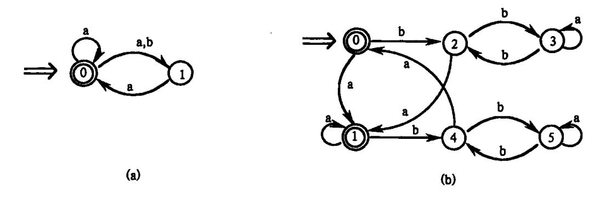

图 3.18 有限自动机 (a)零确定化的有限自动机;(b)需最小化的有限自动机。

{28}------------------------------------------------

13.

- (1) 给出描述 C 浮点数的 DFA;
- (2) 给出描述 Java 表达式的 DFA。
- 14. 构造一个 DFA,它接受  $\Sigma = \{0,1\}$ 上所有满足如下条件的字符串:每个 1 都有 0 直接跟在右边。
  - 15. 给定右线性文法 G:

S-0S|1S|1A|0B

 $A \rightarrow 1C \mid 1$ 

 $B \rightarrow 0C10$ 

 $C \rightarrow 0C | 1C | 0 | 1$ 

求出一个与 G 等价的左线性文法。

- \* 16. 非形式地说明:任何正规集 L 都存在一个非负整数 p,使得 L 中任何长度超过 p 的字都可表示成  $\alpha\beta\gamma$ ,其中  $0<|\beta|\leqslant p(|\beta|$ 指  $\beta$  的长度),而对任何  $i\geqslant 0$ ,  $\alpha\beta^i\gamma$  属于 L。
  - \*17. 下面的字集是否为正规集?或写出其正规式,或给出否证。
  - (1)  $L_1 = \{a^n b^n | n \ge 0\};$
  - (2)  $L_0 = \{x \mid x \text{ 中含有相同个数的 a 和 b}\};$
  - (3) La = {a<sup>p</sup>|p 为素数}。
  - 18. 假定 L 和 M 都是正规集:
  - (1) 证明 LUM、L∩M 和~M(补集)也是正规的;
  - (2) L'是 L 中每个字的逆转,证明 L 也是正规的。
  - 19. 写出描述 ANSI C 的单词符号的 LEX 程序。
  - 20. 假定有正规定义式

$$A_0 \rightarrow a \mid b$$

$$A_1 \rightarrow A_0 A_0$$

. . .

$$A_n \rightarrow A_{n-1}A_{n-1}$$

#### 考虑词形 A。

- (1) 把 A<sub>n</sub> 中所有简名都换掉,最终所得的正规式的长度是多少;
- (2) 字集 An 的元素是什么? 把它们非形式地表示成 n 的函数;
- (3) 证明识别 An 的 DFA 只需用 2n+1 个状态就足够了。
- 21. 把 LEX 的"动作"成分加以充实使得可用它来编写语法制导编辑器。