{0}------------------------------------------------

# 第九章 运行时存储空间组织

我们知道,编译程序最终的目的是将源程序翻译成等价的目标程序。为了达到此目的,除了已介绍的对源程序进行词法、语法和语义分析外,在生成目标代码前,需要把程序静态的正文和实现这个程序的运行时的活动联系起来,弄清楚将来在代码运行时刻,源代码中的各种变量、常量等用户定义的量是如何存放的,如何去访问它们。

在程序的执行过程中,程序中数据的存取是通过与之对应的存储单元来进行的。在程序语言中,程序中使用的存储单元都由标识符来表示。它们对应的内存地址都是由编译程序在编译时或由其生成的目标程序运行时进行分配。所以,对编译程序来说,存储组织与管理是一个复杂而又十分重要的问题。本章就目标程序运行时的活动和运行环境进行讨论,主要讨论存储组织与管理,包括活动记录的建立与管理、存储器的组织与存储分配策略、非局部名称的访问等。

本章 9.1 节介绍运行时存储组织的预备知识,包括过程的活动与参数传递;9.2 节概述存储组织的基本概念;9.3 节以 FORTRAN 为例介绍静态存储分配及其实现;9.4 节和 9.5 节以 C 和 Pascal 为例讨论栈式存储分配及其实现;最后,在 9.6 节简述堆式存储分配。

# 9.1 目标程序运行时的活动

## 9.1.1 过程的活动

这一节讨论一个过程的静态源程序和它的目标程序在运行时的活动之间的关系。为了讨论方便,以 Pascal 为例,假定程序由若干个过程组成。

过程(procedure)定义是一个说明,其最简单的形式是一个标识符和一段语句相关,标识符是过程名,语句是过程体。例如,下面的 Pascal 程序(图 9.1)在(3)~(7)行包含名为 readarray 的过程定义,而(5)~(7)行是它的过程体。许多程序设计语言中都把有返回结果值的过程称为函数(function)。为了方便,我们把函数也列入过程一起讨论;并且把完整的程序也看成是过程。

当过程名出现在可执行语句里的时候,称这过程在这一点被调用。过程调用导致过程体的执行。在程序(图 9.1)里,主程序分别在第(23)和第(24)行调用过程 readarray 和quicksort。过程调用还可能出现在表达式里,如第(16)行调用 partition。

出现在过程定义中的某些标识符是具有特殊意义的。如在第(12)行的 m 和 n 是过程 quicksort 中的形式参数。表达式作为实在参数可以传递给被调用的过程,替换过程体中的形式参数。如在第(18)行调用过程 quicksort,其实参为 i + 1 和 n。随后将讨论形式参数与实在参数的结合过程。

{1}------------------------------------------------

```
(1) program sort(input, output)
(2)
      var a: array[0..10] of integer;
(3)
      procedure readarray;
(4)
         var i: integer;
(5)
         begin
(6)
           for i := 1 to 9 do read(a[i])
(7)
         end:
      function partition(y, z:integer):integer;
(8)
(9)
        var i:integer;
(10)
         begin .....
(11)
         end:
(12)
         procedure quicksort(m, n:integer);
(13)
           var i: integer;
(14)
           begin
(15)
              if (n > m) then begin
(16)
                i := partition(m, n);
                quicksort(m, i-1);
(17)
                quicksort(i+1, n)
(18)
(19)
              end;
(20)
         end;
(21)
       begin
         a[0] := -9999; a[10] := 9999;
(22)
(23)
         readarray;
         quicksort(1, 9)
(24)
(25)
      end.
```

图 9.1 程序

一个过程的活动指的是该过程的一次执行。就是说,每次执行一个过程体,产生该过程体的一个活动。关于过程 P 一个活动的生存期,指的是从执行该过程体第一步操作到最后一步操作之间的操作序,包括执行 P 时调用其它过程花费的时间。一般来说,术语"生存期"指的是在程序执行过程中若干步骤的一个顺序序列。

在像 Pascal 这样的语言里,每次控制从过程 P 进入过程 Q 后,如果没有错误,最后都返回到过程 P。确切地说,每次控制流从过程 P 的一个活动进入过程 Q 的一个活动,最后都返回到过程 P 的同一个活动。

如果 a 和 b 都是过程的活动,那么,它们的生存期或者是不重叠的,或者是嵌套的。就是说,如果控制在退出 a 之前进入 b,那么,必须在退出 a 之前退出 b。

一个过程是**递归**的,如果该过程在没有退出当前的活动时,又开始其新的活动。从程序(图 9.1)可以看出,在程序刚开始执行不久(第(24)行),控制进入 quicksort(1, 9)的活动,而退出这一活动是在程序将要结束时的末尾。在从 quicksort(1, 9)进入到它退出的整个期间,还有几个 quicksort 的活动,所以这一过程是递归的。一个递归过程 P 并不一定需要直接调用它本身,它可以通过调用过程 Q,而 Q 经过若干调用又调用 P。如果过程递

{2}------------------------------------------------

归,在某一时刻可能有它的几个活动活跃着。

语言中的说明是规定名称含义的语法结构。说明可以用显式的方式。例如,Pascal的变量说明

### Var i: integer;

说明也可以用隐含方式,如 FORTRAN 语言,在无其它说明的情况下,认为变量 i 是整型的。

一个说明在程序里能起作用的范围称为该说明的作用域。如果一个说明的作用域是在一个过程里,那么在这个过程里出现的该说明中的名称都是局部于本过程的;除此之外的名称就是非局部的。因此,在一个程序的不同部分,同一个名称可能是不相关的。当一个名称在程序正文中出现时候,语言的作用域规则决定该名称应属于哪个说明。在程序(图 9.1)里,名称 i 分别在第(4)、(9)和(13)行被说明三次,而在过程 readarray、partition 和 quicksort 中的使用是相互独立的。第(6)行使用的 i 属于第(4)行说明的。在第(16)~(18)行使用的 i 都属于第(13)行说明的。

### 9.1.2 参数传递

过程(函数)是结构化程序设计的主要手段,同时也是节省程序代码和扩充语言能力的主要途径。只要过程有定义,就可以在别的地址调用它。调用与被调用(过程)两者之间的信息往来或者通过全局量或者经由参数传递。本小节主要介绍参数传递的几种方式。

#### 1. 参数

在图 9.1 中的 Pascal 程序中,从(12)行到(20)行定义了一个称为 quicksort 的过程。其中 m、n 称为形式参数,简称形参(在 FORTRAN 中称为哑元)。第(24)行的语句表示了主程序对这个过程的一次调用:

(24)quicksort(1, 9)

其中,1和9称为**实在参数**,简称**实参**。实参也可以是一个变量或较复杂的表达式。 实参与对应的形参在性质上应相容不悖。

问题是,如何把实在参数传递给相应的形式参数呢? 在图 9.1 的程序中从(8)行到(11)行定义了函数 partition,并在(16)行调用了它:

(16) 
$$i: = partition(m, n);$$

这里的问题是,在函数工作完毕返回时如何把函数值送回来以便赋给变量 i 呢? 对于后一个问题一般不存在什么困难,因为编译程序可以设想把函数值留在某个确定的累加器中。

下面,我们将分别讨论参数传递的三种不同途径:

- 传地址(call by reference)
- 传值(call by value)
- 传名(call by name):也称为"换名"

#### 2. 传地址

所谓传地址是指把实在参数的地址传递给相应的形式参数。在过程段中每个形式参数都有一个相应的单元,称为形式单元。形式单元将用来存放相应的实在参数的地址。

{3}------------------------------------------------

当调用一个过程时,调用段必须预先把实在参数的地址传递到一个为被调用段可以拿得到的地方。如果实在参数是一个变量(包括下标变量),则直接传递它的地址。如果实在参数是常数或其它表达式(如 A + B),那就先把它的值计算出来并存放在某一临时单元之中,然后传送这个临时单元的地址。当程序控制转入被调用段后被调用段首先把实参地址抄进自己相应的形式单元中,过程体对形式参数的任何引用或赋值都被处理成对形式单元的间接访问。当被调用段工作完毕返回时,形式单元(它们都是指针)所指的实在参数单元就持有了所期望的值。例如,对于下面的 Pascal 过程:

```
procedure swap(n, m: real);
    var j: real;
    begin
    j: = n;
    n: = m;
    m: = j;
    end
```

调用 swap(i,k(i))所产生的结果等同于执行下列的指令步骤:

- (1)把 i 和 k(i)的地址分别传递到已知单元,如 J1 和 J2 中;
- (2)n: = J1:m: = J2:
- (3)j: = n ↑ ; / \* n ↑ 指对 n 的间接访问 \* /
- $(4)n \uparrow := m \uparrow ;$
- (5)m $\uparrow$ : = j;

和"传地址"相似(但不等价)的另一种参数传递方法是所谓"得结果"(call by result)。这种方法的实质是:每个形式参数对应有两个单元,第一个单元存放实参的地址,第二个单元存放实参的值。在过程体中对形参的任何引用或赋值都看成是对它的第二个单元的直接访问,但在过程工作完成返回前必须把第二个单元的内容存放到第一个单元所指的那个实参单元之中。

### 3. 传值

这是一种最简单的参数传递方法。调用段把实在参数的值计算出来并存放在一个被调用段可以拿得到的地方。被调用段开始工作时,首先把这些值抄进自己的形式单元中,然后就好像使用局部名一样使用这些形式单元。如果实在参数不为指针,那么,在这种情况下被调用段无法改变实参的值。在上面关于 swap 的例子中,若采用传值方式处理参数传递,则过程调用 swap(i,k(i))将不产生任何结果。

#### 4. 传名

这是 ALGOL60 所定义的一种特殊的形 – 实参数结合方式。ALGOL 用"替换规则"解释"传名"参数的意义:过程调用的作用相当于把被调用段的过程体抄到调用出现的位置,把其中任一出现的形式参数都替换成相应的实在参数(文字替换)。如果在替换时发现过程体中的局部名和实在参数中的名字使用相同的标识符,则必须用不同的标识符来表示这些局部名。而且,为了表现实在参数的整体性,必要时在替换前先把它用括号括起来。

例如,对于前面的过程 swap,假定采用传名方式传递实参,则过程调用 swap(i,k(i))的作用等价于执行下面的语句:

{4}------------------------------------------------

j: = i;\ni: = k(i);
k(i): = j;

显然,这和采用传地址或传值的方式所产生的结果均不相同。

这种替换方式的基本实现办法是:在进入被调用段之前不对实在参数预先进行计值, 而是让过程体中每当使用到相应的形参时才逐次对它实行计值(或计算地址)。因此,在 实现时通常都把实参处理成一个子程序(称为参数子程序),每当过程体中使用到相应形 参时就调用这个子程序。

由上两小节讨论可以看出,编译程序为了组织存储空间,必须考虑下面几个问题:

- 过程是否允许递归?
- 当控制从一个过程的活动返回时,对局部名称的值如何处理?
- 讨程是否允许引用非局部名称?
- 过程调用时如何传递参数;过程是否可以做为参数被传递和做为结果被返回?
- 存储空间可否在程序控制下进行动态分配?
- 存储空间是否必须显式地释放?

# 9.2 运行时存储器的划分

#### 9.2.1 运行时存储器的划分

编译程序为了使它编译后得到的目标程序能够运行,要从操作系统中获得一块存储空间。从上一节的讨论我们知道,对这块提供运行的空间应该进行划分以便存放,其中包括生成的目标代码、数据对象和跟踪过程活动的控制栈。目标代码的大小在编译时可以确定,所以编译程序可以把它放在一个静态确定的区域。同样,有一些数据对象的大小在编译时也能确定,因此它们也可以放在静态确定的区域。这样,运行时存储空间划分如图9.2 所示。应尽可能多地静态分配数据对象,因为编译时这些对象的内存地址被编译进目标代码。如 FORTRAN 语言,所有数据对象都可静态地进行存储分配。

| 目标代码 |
|------|
| 静态数据 |
| 栈    |
| Į.   |
| t    |
| 堆    |

图 9.2 运行时存储空间的划分

在 Pascal 和 C 的实现系统中,使用扩充的栈来管理过程的活动。当发生过程调用时,中断当前活动的执行,激活新被调用过程的活动,并把包含在这个活动生存期中的数据对象以及和该活动有关的其它信息存入栈中。当控制从调用返回时,将所占存储空间弹出栈顶。同时,被中断的活动恢复执行。

{5}------------------------------------------------

在运行存储空间的划分中有一个单独的区域叫做堆(heep),留给存放动态数据。Pascal 和 C语言都允许数据对象在程序运行时分配空间以便建立动态数据结构,这样的数据存储空间可以分配在堆区。

一个栈或堆的大小都随程序的运行而改变的,所以应使它们的增长方向相对,如图 9.2 所示。栈按地址增加方向向下增长,这样栈顶在下边。如果 top 标记栈顶,那么,由 top 可以求出到栈顶的位移。许多机器都提供一个专用寄存器来存放指针 top。

#### 9.2.2 活动记录

为了管理过程在一次执行中所需要的信息,使用一个连续的存储块,我们把这样的一个连续存储块称为活动记录(Activation Record)。如 Pascal 和 C 语言,当过程调用时,产生一个过程的新的活动,用一个活动记录表示该活动的相关信息,并将其压入栈。当过程返回(活动结束)时,当前活动记录一般包含如下内容:

#### • 连接数据

- 返回地址
- 动态链:指向调用该过程前的最新活动记录地址的指针。运行时,使运行栈上各数据区按动态建立的次序结成链。链头为栈顶起始位置。
- 静态链:指向静态直接外层最新活动记录地址的指针,用来访问非局部数据。像 FORTRAN 这样的语言是不需要的,因为其非局部数据都放在固定地方,而 Pascal 是必要的。
- •形式单元:存放相应的实在参数的地址或值。
- 局部数据区:局部变量、内情向量、临时工作单元(如存放对表达式求值的结果)。 其结构如图 9.3 所示。

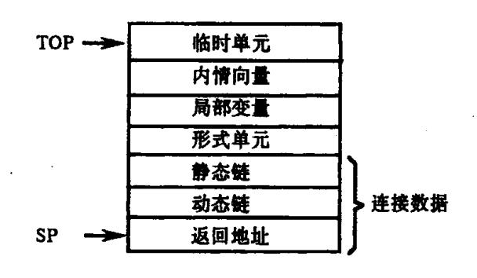

图 9.3 活动记录结构

指针 SP 指向现行过程(即最新进入工作的那个过程)的活动记录在栈里的起始位置。由于活动记录是一个过程在一次运行时(活动)所需的实际的存储空间,其大小在编译时可确定(这里排除了可变数据结构的存在)。因此,过程的任何局部变量、形式参数等的相对位置(相对于 SP 所指的地方)也在编译时确定。若把 SP 作为运行时的变址器的内容,那么,过程的所有局部单元都可用变址方式进行访问。

编译时对每个名称所表示的数据对象需要提供多大的存储空间,要根据这个名称的 类型来确定。

{6}------------------------------------------------

### 9.2.3 存储分配策略

不同的编译程序关于数据空间的存储分配策略可能不同。静态分配策略在编译时对所有数据对象分配固定的存储单元,且在运行时始终保持不变。栈式动态分配策略在运行时把存储器作为一个栈进行管理,运行时,每当调用一个过程,它所需要的存储空间就动态地分配于栈顶,一旦退出,它所占空间就予以释放。堆式动态分配策略在运行时把存储器组织成堆结构,以便用户关于存储空间的申请与归还(回收),凡申请者从堆中分给一块,凡释放者退回给堆。

在一个的具体的编译系统中,究竟采用哪种存储分配策略,主要应根据程序语言关于名称的作用域和生存期的定义规则。像 FORTRAN 这样的语言,不允许过程递归,不含可变体积的数据对象或待定性质的名称,能在编译时完全确定其程序的每个数据对象在运行时在存储空间的位置。因此在设计 FORTRAN 语言编译程序时,可采用静态存储分配策略。像 Pascal 和 C语言,由于它们允许递归过程,在编译时刻无法预先确定哪些递归过程在运行时被激活,更难以确定它们的递归深度,而每次递归调用,都要为该过程中的每个数据对象分配一个新的存储空间。由上可见,它们的编译程序则不能采用静态分配策略,只能采用在程序运行时动态地进行分配(栈式分配)。又如 Pascal 和 C语言,还允许用户动态地申请和释放存储空间,而且申请与释放之间不一定遵守先申请后释放或后申请先释放的原则,因此,需要采用一种更复杂的堆式动态分配策略。

本章主要以 FORTRAN 和 Pascal、C 为例讨论静态分配策略、栈式动态分配策略和堆式分配策略。

# 9.3 静态存储分配

如果在编译时就能够确定一个程序在运行时所需的存储空间的大小,则在编译时就 能够安排好目标程序运行时的全部数据空间,并能确定每个数据项的单元地址。存储空 间的这种分配方法叫做**静态分配**。

FORTRAN 程序的特点是:不允许过程的递归性;每个数据名所需的存储空间大小都是常量(即不许含可变体积的数据,如可变数组);并且所有数据名的性质是完全确定的(不允许那种需在运行时动态确定其性质的名字)。这些特点告诉我们,整个程序所需数据空间的总量在编译时是完全确定了的,从而每个数据名的地址就可静态地进行分配(此处要注意一点是,作为 FORTRAN 过程哑元的"可调数组"并不是我们这里所说的"可变数组"。"可调数组"所需的存储空间是由实在参数提供的,对于这种数组,编译时只须分配给它几个足以存放"内情向量"的单元就可以了,且这些单元的数目仅仅依赖于哑数组的维数)。

静态存储分配是一种非常简单的策略。FORTRAN标准文本规定,每个初等类型数据(不论变量或常数)都用某一确定长度的"机器字"表示之,整、实和逻辑型的数据各用一个机器字表示。双(精度)实型和复型数据各用相继的两个机器字表示。数组在存储器中必须按列为序连续存放。一个含 N 个元素的实型、整型或逻辑型数组需用连续的 N 个机器字表示之,而一个含 N 个元素的双实型或复型数组则需用连续 2N 个机器字表示。对于

{7}------------------------------------------------

文字常数,我们总是假定从机器字的边界处开始存放。如果右端末正好到达字的边界,则 用空白符补足。编译程序必须按照上述规定分配每类数据的存储空间。

但是,FORTRAN 的公用(COMMON)和等价(EQUIVALENCE)这些特殊概念带来了存储分配的复杂性。公用和等价完全是针对存储空间的相对位置而言的,不依赖于有关数据类型的数学性质。因此,编译程序必须按照标准文本对各类数据所需的存储空间大小以及存储表示方式所作的规定建立复杂的"名字-地址"对应关系。然后,根据这些对应关系对名字的地址进行分配。

#### 9.3.1 数据区

因为每个 FORTRAN 程序段可以独立编译,因此,FORTRAN 的编译程序通常是,对于每个程序段和公用块都定义了一个对应的数据区。前者用来存放程序段中未出现在 COMMON 里的局部名的值,称为该段的局部区。后者用来存放公用块里各名字的值,称为公用区。每个数据区有一个编号。地址分配时,在符号表中,对每个数据名将登记上它是属于哪个数据区的,以及在该区中的相对位置。

一般而言,程序段的局部区可直接安排在该段的指令代码和常数单元之后,具名公用区和无名公用区安排在目标程序的最后端。编译时我们只注意统计每个数据区的体积(单元数),对于各区的首地址暂不作分配。等到运行前再用一个"装入程序"(LOADER) 把它们连成可运行的整体。

编译程序必须累计每个数据区的体积。对于每个程序段的局部区,编译程序用一个计数器累计该段的局部名数据区的体积;但对于在该段中定义的每个公用块分别用不同的计数器累计它们的大小。如果各程序段是分开独立编译的,那么,最后的 LOADER 应根据每个公用块名选择它在各程序段中所定义的最大体积。

编译程序对于每个数据区构造一个相应的存储映像,描述该区的内容。对于程序段局部区而言,这个映像的最简单情形可只由符号表中属于该区局部名的人口及其相对地址所组成。对于每个公用块而言,在各有关程序段的符号表中都有一条连接该块各名字(依出现顺序的先后)的链。一个公用块在各程序段中的所有这些名链构成了该块所对应数据区的存储映像。

一个 FORTRAN 程序段局部数据区的内容一般含有如图 9.4 中的各项。

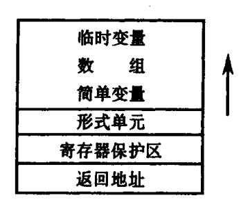

图 9.4 局部数据区

其中,"返回地址"单元用来保存调用此程序段时的返回地址。"寄存器保护区"用来保存调用段留在寄存器中的有关信息,使得这些寄存器可在过程体工作时重新使用。形式单元是和形式参数(哑元)相对应的,旨在存放实在参数的地址或值。

{8}------------------------------------------------

一般来说,用户在一程序段中所定义的局部变量和数组所需的存储空间构成了该段局部区的主要部分。程序段运行时所需的临时工作单元是局部区的另一重要组成部分。

例如,当编译程序完成了对子程序段

SUBROUTINE SWAP(A,B)

T = A

A = B

B = T

RETURN

**END** 

中的变量名和数组名进行地址分配后,符号表的内容将如图 9.5 所示。

| 名字   | 性 质       | 地  | 址    |
|------|-----------|----|------|
| NAME | ATTRIBUTE | DA | ADDR |
| SWAP | 子程序, 二目   |    |      |
| Α    | 哑、实变量     | k  | a    |
| В    | 哑、实变量     | k  | a+2  |
| Т    | 实 变 量     | k  | a+4  |

图 9.5 符号表"名字 - 地址"对应

表中地址栏的子栏、DA 记录数据区编号,ADDR 记录此名在该区中的相对地址。令 k 是现行段局部名数据区编号,a 是保护区(包括一个返回地址单元)的长度,假定每个哑变量用两个机器字,那么,A、B 的地址分别为 a 和 a l 2,变量 T 的地址为 a l 4。

下面,我们将讨论用公用(COMMON)变量名、数组名和局部变量名、数组名的存储分配问题。临时变量名的存储分配问题将作为一单独问题进行专门讨论。在讨论公用名和局部名的地址分配之前,首先必须讨论 COMMON 语句和 EQUIAVLENCE 语句的处理问题。

## \*9.3.2 公用语句的处理

FORTRAN 的 COMMON 句旨在建立不同程序段间数据名的存储空间的同一性。由于 FORTRAN 对说明句的语序没有严格限定,当首次扫描到一个公用句时往往不能立即确定 每个公用元的相对地址。例如,对于

COMMON/B1/A, B, C(50)

DIMENSION A(10, 10), B(100)

COMPLEX A, B

在处理第二、三行之前,我们无法知道公用块 B1 中的公用元 A、B、C 的相对地址关系。因此,在初次遇到一个公用句时,只好把每个公用块的所有公用元按其出现顺序——记录下来,待处理到说明部分结尾时(或待处理到程序段的 END 行时)再回头处理每个公用块,分配各块中每个公用元的地址。

为了记录各公用块的所有公用元,最简单的办法是在符号表中增设一个新栏(指

{9}------------------------------------------------

示器栏),用它把同一公用块中的所有名字按出现顺序连接成一条链。这个新栏叫做 CMP。

公用块的名字可以和其它名字一起登记在一张统一的符号表中,但这种做法不方便。由于标识公用块名字的标识符也可以用来标识其它对象,并且各程序段中所定义的每个公用块的名字及其对应的数据区长度信息必须在最后阶段和目标代码一起提交给LOADER。因此,专设一张公用块名表(登记公用块名字及其有关信息)是很有必要的。这张表称为 COMLIST。如果编译程序要求对每个 FORTRAN 源程序的所有程序段集中统一编译(即不许各段独立编译),那么,由于公用块名是全局性的,因此,可只设一张统一的COMLIST 供各段编译时公用。在后面的叙述中我们都假定只采用一张各段共享的 COMLIST。

COMLIST 的结构如图 9.6(b)所示,它的主栏 NAME 登记公用块的名字,第一项 NAME 总是由六个空白字符组成的代表无名公用块的"名字"。LENGTH 登记公用区的长度(字数),它取各程序段所定义的同名公用区的最大长度。FT 和 LT 是两个工作指示器,每开始处理一个新的程序段时它们都预置为 null。在程序段的处理过程中,FT 和 LT 分别指向正在形成的各公用块的各链在符号表中首、末位置。

例如,假定某程序含有如下公用句:

COMMON X.Y

COMMON /B1/A, B, C/D, E, F(100)

经处理后,公用名链和 COMLIST 如图 9.6 所示。

| NAME |               | CMP           |
|------|---------------|---------------|
| X    |               | 2             |
| Y    |               | 6             |
| A    |               | 4             |
| В    |               | 5             |
| С    |               | 0             |
| D    |               | 7             |
| E    |               | 8             |
| F    |               | 0_            |
|      | X Y A B C D E | X Y A B C D E |

| NAME           | LENGTH | FT | LT |
|----------------|--------|----|----|
| 无名             | ***    | 1  | 8  |
| B <sub>1</sub> |        | 3  | 5  |
|                | (3-)   |    |    |

图 9.6 COMLIST 和公用名链 (a)符号表;(b)COMLIST。

每当编译程序开始分析一个新程序段时,首先总把 COMLIST 中的所有 FT 栏和 LT 栏都置为 null。当碰到一个 COMMON 句,如

COMMON /BLK1/NAM1, NAM2

编译程序应做的事情是:

- 若块名 BLK1 未出现在 COMLIST 中,则把它填入并形成它的空链(其实 FT 和 LT 原已为 null)。
- 把符号表中的 NAM1 和 NAM2 标志为属于公用区,并把它们依次接到 BLK1 原链的

{10}------------------------------------------------

末端。若原链为空链则把 NAM1 的人口填到 FT 栏之中。最后,调整 LT 使它指向新链的末端。

#### \*9.3.3 等价语句的处理

FORTRAN等价语句的作用旨在建立一个程序段中诸变量或数组元素之间的存储空间同一性。由于语序上的原因,在第一次扫描到一个等价句时,我们可能无法立即对它进行处理。因此,应把它们暂时记录下来,待到达说明部分结束时(或待到达程序段的 END 行时)再予处理。下面讨论对等价语句的处理方法。

在分配数据名的地址之前对等价语句的处理要求是,求出相互等价的各个名字的相对地址关系,在寻找这种关系的同时把各个相关的等价片归并为一。例如,令 A 是一个10 \* 10 的数组,那么,等价语句

99 EQUIVALENCE(X, A(2, 3)), (I, J, A(1, 2), K)

告诉我们,由于 A 出现在两个等价片中,因此这两个等价片是相关的,可合二为一;而且 若令 X 的地址为 0,那么数组 A 的首地址应为 – 21,于是 A(1, 2)的地址为 – 11,从而 I、I、I K 的地址都应为 – 11。为了在概念上有所区分,我们把此处的所谓"地址"改称为"相对数"。

在处理完所有等价片之后,我们要求在符号表中把所有相互等价的名字连结成一个环形链,标记上每个等价元的相对数。在下一小节.我们将根据这些环形链和各等价元的相对数进行数据名的地址分配。为了表示等价链和相对数,需要在符号表中增设两个新栏,一栏为 EQ,另一栏为 OFFSET。每个 EQ 是一个指示器,它的值或为 null(表示不属于等价链)或指向下一个等价元的人口(即在符号表中的位置)。OFFSET 用来登记等价元的相对数。例如,在处理了等价语句(99)之后,符号表的有关登记项如下图所示:

| , | NUC A TO | l | OFFSFE      | EQ  |
|---|----------|---|-------------|-----|
| 1 | NEAE     |   | OFFSFE      | EQ  |
| 2 | I        |   | - 11        | 3   |
| 3 | J        |   | <b>– 11</b> | 4 · |
| 4 | K        |   | - 11        | 2   |
| 5 | X        |   | 0           | 5   |
|   | A        |   | - 21        | 1   |

为了归并相关等价片,建立等价链和求出各等价元的相对数,在处理等价语句时我们需要两个工作变量。一个是指示器 P,用来指示现行等价链首元在符号表中的人口。另一个是整数单元 BASE,用来作为计算等价元相对数的基准。

对于每个等价元我们将按如下办法计算它的足标:若此等价元是一个简单变量,其足标为0;若此等价元是一个数组元素,譬如说是 $A(i_1,I_2,\cdots,i_n)$ ,则其足标为

$$(i_1-1)+d_1(i_2-1)+\cdots+d_1\cdots d_{n-1}(i_n-1)$$

其中,d<sub>1</sub>,···,d<sub>n</sub>是数组各维的体积。

下面是一个简易但稍许低效的等价片归并算法的一般描述。

{11}------------------------------------------------

- (1)置现行程序段符号表中所有的 EQ 栏均为 null。
- (2)准备开始处理一个等价片,置 P: = null; BASE; = 0。
- (3)从等价片中取出一个等价元 X,令 X 的符号表入口为 N,求出 X 的足标 j。如果 X 是复型或双实型,则置 L=2,否则置 L=1。变量 L 的值指现行等价元 X 所需占用的字数。置 X 的相对数 Z 为 Z: = BASE i \* L。
  - (4)若 X 已出现在等价链中(EO[N]≠null),即转第 6 步。否则
  - (5)把 X 加进现行环链中,即

IF P = null THEN P := N ELSE EQ[N] := EQ[P];

EO[P]:=N; OFFSET[N]:=z; 转第7步。

- (6) X 已在某一等价环链中,准备把现行环和 X 原来所在的那个环合并为一(注意,这两个环可能原是同一个环)。这时必须根据 X 的老相对数 OFFSET[N]和现行相对数 Z 的 差数 D(D = OFFSET[N] z)来调整现行环中各等价元的相对数(把现行环中各等价元的相对数递增 D),同时调整 BASE,置 BASE;= BASE + D;然后把两环合并为一。
  - (7)如果现行片中还有等价元则转第3步,否则(表示已处理完一等价片)。
- (8) 若还有其它未处理的等价片则转第 2 步; 否则表示所有等价语句已处理完

例如,等价语句(99)的处理过程如图 9.7 所示。当第 2 步结束时,我们已处理完了第一个等价片,建立了一个等价环。第 3 步开始处理第二个等价片,建立第二个等价环。但在第 5 步时我们发现 A 已在第一个等价环中。于是,经调整新环中各元的相对数后把两环合二为一。由于两环合并,BASE 变成为 – 11。在第 6 步处理 K 时,它的相对数就在新的 BASE 基准上进行计算。

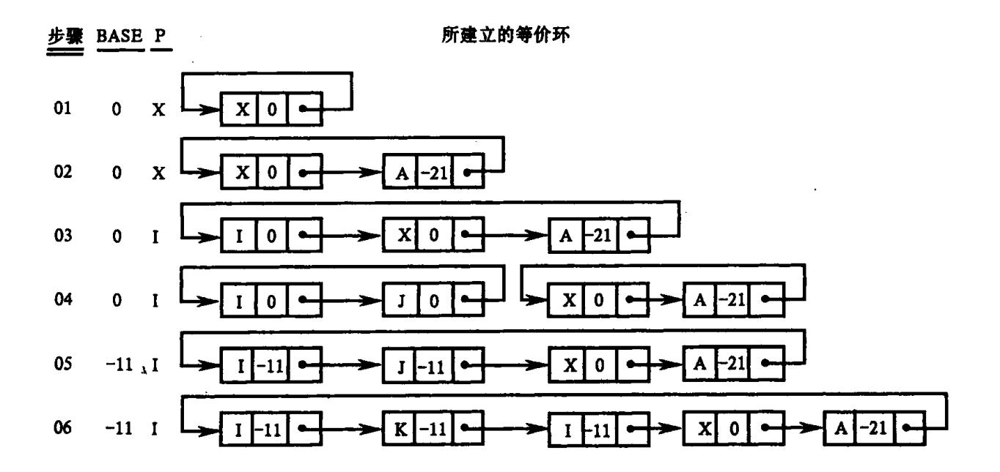

图 9.7 等价环的建立

一个比较形式化的归并算法见图 9.8。

{12}------------------------------------------------

```
BEGIN 把符号表中所有 EO 栏置为 null;
  WHILE 存在未处理的等价片 DO
    BEGIN /* 开始处理新等价片 */
       P: = null: BASE: = 0:
       WHILE 现行片中尚有未处理的等价元 DO
          BEGIN 取出下一等价元 X, 假定它在符号表的人口为 N, 计算 X 的足标 j;
                 IF X 为"双实型"或"复型"THEN L: = 2 ELSE L: = 1;
                 z: = BASE - j * L; / * z 为 X 的相对数 */
                 IF EO[N] = null /* X 未在等价链中出现过 */ THEN
                     BEGIN
                         IF P = \text{mull THEN } P := N \text{ ELSE EQ[N]} := EQ[P];
                         EQ[P] = N; OFFSET[N] : = z;
                     END
                 ELSE /* X已在等价链中 */
                     BEGIN
                         D: = OFFSET[N] - Z:
                         BASE := BASE + D:
                        IF P = \text{null THEN } P_1 = N \text{ ELSE}
                        BEGIN Q_1 = p_1
                          LOOP: IF Q = N THEN
                            IF D≠0 THEN ERROR / * 等价冲突 * /
                            ELSE GOTO NXELE;
                            OFFSET[Q] := OFFSET[Q] + D;
                            Q1: = Q; Q: = EQ[Q];
                            IF Q \neq P THEN GOTO LOOP:
                          MERGE:/* 归并 */
                            EO[O1] := EO[N] : EO[N] := P
                    END OF MERGING:
               END:
         NXELE:
      END OF THE INNER WHILE:
   END OF THE OUTER WHILE;
END
```

图 9.8 等价片归并算法

#### \*9.3.4 地址分配

在建立了公用链和等价环之后,现在可以着手对程序段中用户定义的变量名和数组名分配存储空间了。我们首先讨论各公用元的地址分配,然后讨论局部名的地址分配。

假定各程序段的编译共享一个 COMLIST 表。因此,它的长度栏 LENGTH 应反映各个已处理了的程序段所定义的公用区的最大长度。

我们用公用块名在 COMLIST 中的人口数加上一个常数 127 作为对应的公用区的编号。常数 127 的选择是随意的,仅意味着我们认定所有公用区的编号均大于 127。把小于 128 的数作为局部数据区的编号,并假定采用程序段的自然序号作为它的局部数据区的编号。目前所说的地址分配的每个"地址"乃由两部分组成,一部分是数据区编号 DA,另一部分是该区中的相对地址。

{13}------------------------------------------------

在开始地址分配前,符号表中地址栏的子栏 DA 一律清 0,表示所有名字均未分配地址。

公用块中各名字的地址分配是沿公用链(由 COMLIST 的 FT 所指)从头到尾逐一进行的。当碰上等价环时,环中各元的地址也同时分配。假定在分配到公用链的第  $N_1$  项时发现该项属于等价环,令此环含有 m 个元素  $N_1$  ,  $N_2$  ,  $\cdots$  ,  $N_m$  , 它们的相对数分别为  $f_1$  ,  $f_2$  ,  $\cdots$  ,  $f_m$ 。由于  $N_1$  在公用区中,令它的相对地址为 a , 因此 ,  $N_i$  的相对地址应为  $a+(f_i-f_1)$  , i=2 , 3 ,  $\cdots$  , m 。等价的结果可能延伸公用区。假若有某个  $a+(f_i-f_1)<0$  , 这意味着公用区冒头。假定在分配这个等价环的元素地址前公用区的长度已达到 len , 那么,在处理这个等价环后公用区的长度应为

$$MAX(len, a + \underset{i=1}{\overset{m}{MAX}}(f_i - f_1 + size(N_i))$$

其中,size(N)指符号表中第 N 项名字所需的存储单元个数(字数)。

公用区的地址分配算法见图 9.9,图中,变量 a 用作地址计数器,len 用作长度计数器, d 表示公用区编号。

```
FOR COMLIST 中每个 FT 不为 null 的项 i DO
 BEGIN a: = 0; len: = 0; d: = i + 127; N: = FT[i];
     WHILE N≠ null DO
     BEGIN
          IF DA[N]≠0/* 第 N 项已分配 */ THEN
                {IF DA[N]≠d OR ADDR[N]≠a THEN ERROR(冲突)}
          ELSE / * DA[N] = 0, 第 N 项未分配 */
          IF EQ[N] = null THEN \{DA[N] := d; ADDR[N] := a\}
          ELSE /* EQ[N]≠null,第 N 项是等价元 */
                BEGIN N1: = N: f: = OFFSET[N]:
                      REPEAT
                             al := a + (OFFSET[N1] - f);
                             IF al < 0 THEN ERROR /*冒头; */
                             IF DA[N1] \neq 0 AND (DA[N1] \neq d OR ADDR[N1] \neq a1)
                                 THEN ERROR /* 非法等价 */
                             ELSE BEGIN
                                     DA[N1]:=d; ADDR[N1]:=a1;
                                     len: = MAX(len, al + size(N1));
                                     N1 := EO(N1)
                                   END
                             UNTIL NI – N
               END:
         a: = a + size[N];
         len: = MAX(len, a);
         N := CMP[N]
    END OF WHILE:
    LENGTH[i]: = MAX(LENGTH[i], len);
    FT[i] := NULL; LT[i] := null
END OF FOR LOOP:
```

图 9.9 公用区地址分配算法

{14}------------------------------------------------

在分配完公用区之后,符号表中所有未分配的数据名均应分配在现行程序的局部数据区中。对于哑名而言,根据它们的种属和参数传递的方式不难——分配它们的地址。对于其它的局部变量和数组可按它们在符号表中的人口顺序逐一分配。但每当碰到等价环时应从那个具有最小相对数的等价元开始,对环中的所有元素同时进行地址分配。假定所碰到的等价环含有 m 个元素  $N_1,N_2,\cdots,N_m$ ,它们的相对数分别为  $f_1,f_2,\cdots,f_m$ ,假定  $f_1$  最小。那么,若分配给  $N_1$  的地址为 a,则分配给  $N_1$  的地址应为 a + ( $f_i$  –  $f_1$ ),i = 2, $\cdots$ ,m。这 m 个等价元分配完毕之后,局部区的长度将达到

$$\alpha + \underset{i=1}{\overset{m}{AX}}(f_i - f_1 + size(N_i))$$

局部区等价环分配算法见图 9.10。图中,N 指等价环的一个人口;a 是地址计数器。

```
N1:=N; f:=OFFSET[N];
WHILE EQ[N1]≠N DO
```

图 9.10 等价环存储分配算法

#### 9.3.5 临时变量的地址分配

在讨论中间代码产生时我们假定,每调用一次 NEWTEMP 就产生一个新的临时变量名。按第七章所述的产生四元式的算法,我们几乎是不加限制地大量引进临时变量名。以后将看到,这种做法对于代码优化处理是很有好处的。由于临时变量是编译时为(目标程序运行时)暂存某些中间结果而引进的。它们不会出表达现在 COMMON、EQUIVA-LENCE、EXTERNAL 或形式参数表之中,它们本质上无非是 INTEGER、REAL、LOGICAL、COMPLEX 或 DOUBLE PRECISION 等五种初等类型之一的简单变量。由于它们的属性非常简单,因此没有必要登记人符号表,只须在它们出现的地方(四元式)附带上类型信息就足够了。以前我们曾是这样假定的,现在仍用同样假定讨论临时变量名的地址分配问题。

尽管在翻译时大量引进了临时变量名,但并不是对每个名字分配一个不同的存储单元。那样做太浪费空间了。一个一般的分配原则是,如果两个临时变量名的作用域不相交,则它们可分配在同一单元中,一个临时变量名自它第一次被定值(赋值)的地方起直至它最后一次被引用的地方止,这区间的程序所能到达的全体四元式构成了它的作用域。对于用来暂存表达式中间结果的临时变量名而言,只存在一次定值和一次引用,并且在定值和引用之间不存在分叉转移(不论转进或转出)。这类临时变量名作用域的确定是非常简单的。它们的存储分配可用一种特别简易的办法实现(见后面的讨论)。

如果两个临时变量名的作用域不相交,则它们显然可共用一个存储单元。假定我们

{15}------------------------------------------------

已经有了计算作用域的算法,那么,可按下述办法对临时变量名进行存储分配:令临时变量名均分配在局部数据区中,若某一单元已分配给某些临时变量名,则把这些名字的作用域(它们必须是互不相交的)作为此单元的分配信息记录下来。每当要对一个新临时变量名进行分配时,首先求出此名的作用域,然后按序检查每个已分配单元,一旦发现新求出的作用域与某个单元所记录的全部作用域均不相交时就把这个单元分配给这个新名,同时把它的作用域也添加到该单元的分配信息之中。若新临时变量的作用域和所有已分配单元的作用域均有冲突(存在相交情形),则就分配给它一个新单元,同时把新名的作用域作为此单元的分配信息。

我们说过,大部分临时变量名是用来存放表达式的中间结果。这些临时变量各有一个特点,它们均只被定值一次,被引用一次。它们的作用域如同配对的括号序列所管辖的区域一样是层次嵌套的。因此,我们可以设想用一个栈(先进后出区)来存放这类临时变量名的值。也就是说,可以用一个栈来存放表达式计值过程中的中间结果。为简单起见,我们假定所有临时变量值只需要一种同一长度的栈单元。令 k 为栈的指示器,设它的初值是局部区中用来存放临时变量值的的区域首地址。每当发现对一个新的临时变量名 T; 定值时,就用 k 的现行值作为 Ti 的地址,然后把 k 累增 1。每当引用了某个临时变量名 T; 作为操作数时(此时 T<sub>i</sub> 的地址必已分配),就把指示器 k 的值递减 1。例如,赋值句

$$X: = A * B - C * D + E * F$$

的四元式如图 9.11(a)所示。当扫描第一个四元式时,分配给  $T_1$  的地址为 a(令 k 的初值为 a),然后 k 累增 1。当扫描第二个四元式时,分配给  $T_2$  的地址为 a+1,k 再累增 1。当扫描第三个四元式时,出于引用了  $T_1$  和  $T_2$  作为操作数,因此 k 递减了 2,变成了 a。于是我们又把 a分配给  $T_3$ ,然后再把 k 累增 1,如此等等。图 9.11(b)列出了对临时变量名"代真"后的四元式,以及每个四元式"代真"后的 k 值。临时变量名的地址码前一律冠以 \$,以示标志。我们看到,在上述语句的计值过程中实际中只用 \$a 和 \$(a+1) 两个临时工作单元。

|     |     | 匹              | 元式    |                | 临时变量名          | 地址    |
|-----|-----|----------------|-------|----------------|----------------|-------|
| (1) | *   | A              | В     | $T_1$          | $T_1$          | a     |
| (2) | *   | C              | D     | $T_2$          | $T_2$          | a + 1 |
| (3) | _   | $T_1$          | $T_2$ | $T_3$          | $T_3$          | a     |
| (4) | *   | E              | F     | $T_4$          | $T_4$          | a + 1 |
| (5) | +   | $T_3$          | $T_4$ | T <sub>5</sub> | T <sub>5</sub> | a     |
| (6) | : = | T <sub>5</sub> |       | X              |                |       |
|     |     |                | (a    | )              |                |       |
|     |     | 四元式            |       |                | <u>k(初值</u> )  | 为 a)  |
| (1) | *   | A              | В     | \$a            | a +            | 1     |
| (2) | *   | C              | D     | (a+1)          | a + 2          | 2     |
| (3) | -   | \$a            | (a+1) | <b>\$</b> a    | a + :          | i     |
| (4) | *   | E              | F     | (a+1)          | a + 2          | 2     |
| (5) | +   | \$a            | (a+1) | \$a            | a+1            | l     |
| (6) | : = | \$a            |       | X              | a              |       |
|     |     |                | (b)   | )              |                |       |
|     |     |                |       |                |                |       |

图 9.11 临时变量名的栈式地址分配 (a)四元式序列;(b) 代真后的四元式序列。

{16}------------------------------------------------

对于简单表达式来说,使用上述办法对临时变量名进行地址分配是很方便的。但若表达式的概念复杂一点,如条件表达式,一个临时变量名的定值和引用就可能不只一次。在这种情况下,上述的分配办法不能简单套用。

# 9.4 简单的栈式存储分配

本节,我们首先考虑一种简单的程序语言的实现。这种语言没有分程序结构,过程定义不许嵌套,但允许过程的递归调用。例如,C语言就是这样的一种语言。C语言的程序结构如图 9.12 所示。在这种情况下,关于局部名称的存储分配,可以直接采用栈式存储分配策略。

```
全局数据说明
Main()

Main 中的数据说明

void R()

R 中的数据说明

...

void Q()

Q 中的数据说明
```

图 9.12 C语言的程序结构

使用栈式存储分配法意味着把存储组成一个栈,运行时,每当进入一个过程(一个新的活动开始)时,就把它的活动记录压入栈(累筑于栈顶),从而形成过程工作时的数据区,一个过程的活动记录的体积在编译时是可静态确定的。当该活动结束(过程退出)时,再把它的活动记录弹出栈,这样,它在栈顶上的数据区也随即不复存在。

对于 C 语言,程序运行时数据空间可表示为如图 9.13 所示的结构。图中显示了主程序调用了过程 Q,而 Q 又调用了 R,在 R 进入运行后的存储结构。应该指出的是低部存区(栈底)是可静态的确定的。因此,对它们可采用静态存储分配策略,即编译时就能确定每个非局部名称的地址。于是,在某过程体中引用非局部名称时可直接使用该地址。而在过程里边说明的局部名称,都局部于它所在的活动,其存储空间在相应的活动记录里。

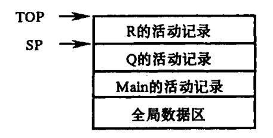

图 9.13 C语言程序的存储组织

指示运行栈最顶端数据区的是两个指示器 SP 和 TOP:

- SP 总是指向现行过程活动记录的起点,用于访问局部数据。
- TOP 始终指向(已占用)栈顶单元。

{17}------------------------------------------------

这两个指示器实际上是固定分配了两个变址器。当进一个过程时,TOP 指向为此过程创建的活动记录的顶端,在分配数组之后,TOP 就改为指向数组区(整个数据区)的顶端。

#### 9.4.1 C的活动记录

C的活动记录有以下四个项目。

- 连接数据,有两个:
  - (1) 老 SP 值,即前一活动记录的地址:
  - (2) 返回地址。
- 参数个数。
- •形式单元(存放实在参数的值或地址)。
- 过程的局部变量、数组内情向量和临时工作单元。其结构如图 9.14 所示。

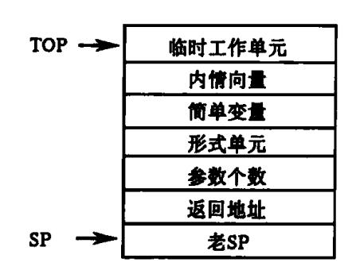

图 9.14 C 过程的活动记录

C语言不允许过程嵌套,就是说,不允许一个过程定义出现在另一个过程定义之内, 所以,C语言的非局部量仅能出现在源程序头,非局部量可采用静态存储分配,编译时确 定它们的地址。

由图 9.14 所示,过程的每一局部变量或形参在活动记录中的位置是确定的,就是说,对它们都分配了存储单元,其地址是相对于活动记录的基地址(SP)的。因此,变量和形参运行时在栈上的绝对地址是:

绝对地址 = 活动记录基地址 + 相对地址

于是,对一个当前正在活动的过程中的任何局部变量或形参 X 的引用可表示为变址访问 X[SP],此处 X 代表相对数,也就是相对于活动记录起点的地址。这个相对数在编译时可 完全确定下来。过程的局部数组的内情向量的相对地址在编译时也同样可完全确定下来,一旦数据空间在过程里获得分配后,对数组元素的引用也就容易用变址访问的方式来 实现。

# 9.4.2 C的过程调用、过程进入、数组空间分配和过程返回

我们说过,过程调用的四元式序列是

par T<sub>1</sub>
:
par T<sub>n</sub>

{18}------------------------------------------------

#### call P, n

现在我们考虑在运行时四元式 par 和 call 是如何执行的,或者说,对于 par 和 call 应产 生些什么相应的目标代码。由于 TOP 总是指向栈顶, 而形式单元和活动记录起点之间的 距离是确定的(等于 3),因此每个 par Ti(i-1,2,…,n)可直接翻译成如下的指令:

$$(i+3)[TOP] := T_i$$

(传递参数值)

或

这些指令的作用是将实参的值或地址一一传进新的过程的形式单元中。此处我们假定, 每个形式单元,不论用来存放实参的值或地址,均只用一个机器字。注意,在执行这些指 令时 TOP 的值不受影响。

四元式 call P, n 应被翻译成

1[TOP] := SP

(保护现行 SP)

3[TOP]:=n (传送参数个数)

(转子指令,转向 P的第一条指令)

转进过程 P后,首先要做的工作是定义新活动记录的 SP,保护返回地址和定义这个 记录的 TOP 值。也就是说,应执行下述的指令,

SP: = TOP + 1 / \* 定义新 SP \* /

I[SP]: = 返回地址 /\* 保护返回地址 \*/

TOP: = TOP + L / \* 定义新 TOP \*/

其中,L是过程P的活动记录所需的单元数,这个数在编译时可静态地计算出来。

在过程段执行语句的工作过程中,凡引用形式参数、局部变量或数组元素都是以 SP 为变址器进行变址访问的。

C语言以及其它一些相似的语言含有下面形式的返回句

return(E)

其中,E为表达式。假定 E的值已计算出来并已放在某个临时单元 T中,那么,就将 T的 值传送到某个特定的寄存器中(调用段将从这个特定的寄存器中获得被调用过程的结果 值)。然后,剩下的工作是恢复 SP 和 TOP 为进入过程前的老值,并按返回地址实行无条 件转移。即执行下述的指令序列:

TOP: = SP - 1

SP: = 0[SP]

X: = 2[TOP] / \* X 为某一变址器 \* /

UJ O[X]

此处 UJ 为无条件转移指令,按 X 中的返回地址实行变址转移。

一个过程也可以通过它的 end 而自动返回。在这种情况下,如果此过程是一个函数 过程,则按同样的办法传送结果值,否则就直接执行上述的返回指令序列。

#### 嵌套过程语言的栈式实现 9.5

在 9.4 节中我们假定所讨论的语言的过程定义是不能嵌套的。现在,我们取消限制, 允许过程的嵌套性。从结构上看 Pascal 就是这样的一种语言。但由于 Pascal 含有"文件" 

{19}------------------------------------------------

和"指示器"这些数据类型,因此,它的存储分配不能简单地运用栈式的办法来实现。而作为 Pascal 的一个子集,例如去掉"文件"这种数据类型,那就用本节所讨论的办法来实现存储分配。

在本节的讨论中,常常要用到过程定义的"嵌套层次"(简称层数),我们始终假定主程序的层数为0,因此,主程序称为第0层过程。如过程Q是在层数为i的过程P内定义,并且P是包围Q的最小过程,那么,Q的层数就为i+1。这时,我们把P称为Q的直接外层过程,而Q称为P的内层过程。当编译程序处理过程说明时,过程的层数将作为过程名的一个重要属性登记在符号表中。计数每个过程的层次是很容易的。使用一个计数器level(初始为0),每逢遇到proc Begin时,将它累增1,每逢碰到proc end 时将它递减1。于是对每个过程说明我们就可用level来定义它的层数。下面是一个省略的Pascal程序,其中包含了该程序里各过程的嵌套关系以及各名称说明和非局部名称的引用,如图9.15 所示。程序中各过程嵌套深度如圆圈里的数字所示。过程S和R都引用了最外层过程说

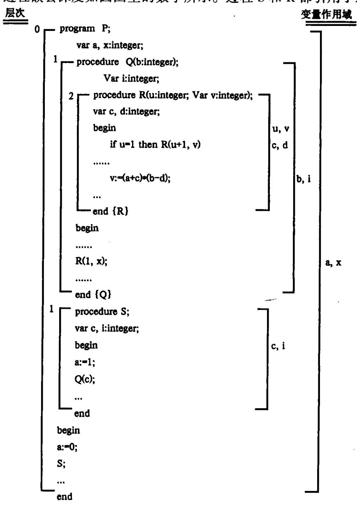

图 9.15 程序

{20}------------------------------------------------

明的变量 a;过程 Q 引用了最外层过程说明的变量 x;而 R 又引用了其直接外层说明的变量 b。

对于 Pascal 语言,在运行时过程中每个局部变量和形参在栈上的存储地址完全可用 9.4 节所述办法实现,但是由于允许过程嵌套,对非局部量的访问就比较复杂。

#### 9.5.1 非局部名字的访问的实现

由于过程定义是嵌套的,一个过程可以引用包围它的任一外层过程所定义的变量或数组,也就是说,运行时,一个过程Q可能引用它的任一外层过程P的最新活动记录中的某些数据(这些数据视为过程Q的非局部量)。为了在活动记录中查找非局部名字所对应的存储空间,过程Q运行时必须知道它的所有外层过程的最新活动记录的地址。由于允许递归性,过程的活动记录的位置(即使是相对位置)也往往是变迁的。因此,必须设法跟踪每个外层过程的最新活动记录的位置。跟踪的办法很多,本节讨论两种方法:一种是通过静态链;另一种是通过显示表(display)。

#### 一、静态链和活动记录

这种办法是引入一个称为静态链的指针,该指针为活动记录的一个域,指向直接外层的最新活动记录的地址。这就意味着在运行时栈上的数据区(活动记录)之间又拉出一条链,这个链称为静态链,静态链是从一个过程的当前活动记录指向其直接外层的最新活动记录。活动记录结构如图 9.16 所示。

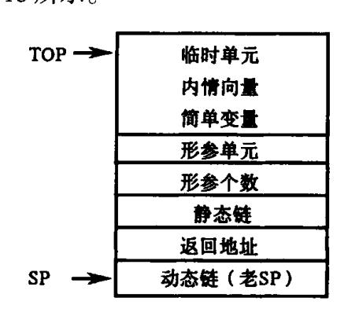

图 9.16 活动记录结构

由于程序中每个过程的静态结构(嵌套层次)是确定的。如嵌套深度为2的过程R引用了非局部量 a 和 b,其嵌套深度分别为0 和 1。从R的活动记录开始,分别沿着2-0=2和2-1=1个静态链进行查找,于是,可以找到包含这两个非局部量的活动记录。

图 9.15 程序运行时栈的变化过程如图 9.17 所示。

由分析可以看出,指针 SP 总是指向当前正在活动的过程的活动记录的基地址。动态链指向调用该过程前正在运行的过程的最新活动记录的基地址。因此,当过程调用结束退回时,利用动态链可以得到调用前的活动记录的基地址。从程序的静态结构看,P是 S和 Q的静态直接外层;Q是 R的直接外层。静态链是指向其静态直接外层的活动记录的基地址。

#### 二、嵌套层次显示表(display)和活动记录

为了提高访问非局部量的速度,还可以引用一个指针数组,称为嵌套层次显示表

{21}------------------------------------------------

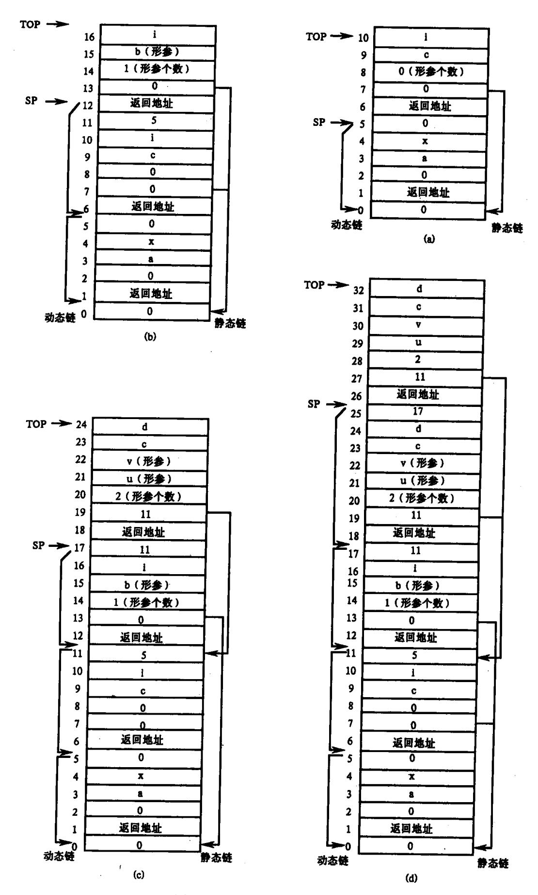

图 9.17 过程递归调用时活动记录的变化 (b)过程 S 中调用 Q 时;(a)过程 P 中调用 S 时;(c)过程 Q 中调用 R 时;(d)过程 R 中递归调用 R。

{22}------------------------------------------------

(display),即每进入一个过程后,在建立它的活动记录区的同时建立一张嵌套层次表 display。假定现进入的过程的层数为 i,则它的 display 表含有 i + 1 个单元。此表本身是一个小栈,自顶向下每个单元依次存放着现行层,直接外层,…,直至最外层(0 层,主程序层)等每一层过程的最新活动记录的基地址。例如,令过程 R 的外层为 Q,Q 的外层为 P,则过程 R 运行时 display 表的内容应为:

| 2 | R 的现行活动记录地址(SP 的现行值) |
|---|----------------------|
| 1 | Q的最新活动记录的地址          |
| 0 | P的活动记录的地址            |

由于过程的层数可以静态确定,因此每个过程的 display 表的体积在编译时即可知道。这样,由一个非局部量说明所在的静态层数和相对活动记录的相对地址,就可得到绝对地址:

### 绝对地址 = display[静态层数] + 相对地址

为了便于组织存区和处理手续,我们把 display 作为活动记录的一部分,置于形式单元的上端,活动记录结构如图 9.18 所示:

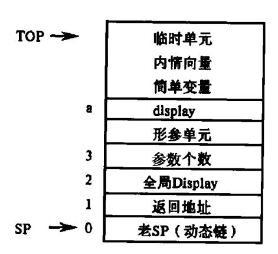

图 9.18 活动记录结构

由于每个过程的形式单元数目在编译时是知道的,因此, display 表的相对地址 d(H) 对于记录起点)在编译时也是完全确定的。假定在现行过程中引用了某一外层过程(令层数为 k)的变量 x,那么,可用以下两条变址指令获得 x 的值:

LD R1,(d+k)[SP]/\* 获得第 k 层过程的最新活动记录地址 \*/

LD R2, X[R1] /\* 把 X 的值传递给 R2 \*/

下面通过图 9.15 程序运行时栈的变化过程看可访问的 display 表内容(见图 9.19)。

由以上讨论我们知道,通过显示表 display 表访问非局部量要比沿着静态链访问非局部量的速度快,因为通过显示表的一个域,可以确定任意外层活动记录的指针,再沿着这个指针便可找到处于外层活动记录的非局部量。

现在我们要讨论,当过程  $P_1$  调用过程  $P_2$  而进人  $P_2$  后,  $P_2$  应如何建立起自己的 display 表? 为了建立自己的 display 表,  $P_2$  必须知道它的直接外层过程(记为  $P_0$ )的 display 表。这意味着,当  $P_1$  调用  $P_2$  时必须把  $P_0$  的 display 表地址作为连接数据之一传给  $P_2$ 。

如果  $P_2$  是一个真实的过程  $(P_2$  不是形式参数),那么, $P_0$  或者就是  $P_1$  自身或者既是  $P_1$ 

{23}------------------------------------------------

外层又是  $P_2$  的直接外层(见图 9.20(a)、(b)两种情形)。不论哪一种情形,只要在进入  $P_2$  后能够知道  $P_1$  的 display 表就能知道  $P_0$  的 display 表,从而可直接构造出  $P_2$  的 display 表。事实上,只须从  $P_1$  的 display 表中自底而上地取过  $P_2$  个单元( $P_2$  的层数)再添上进入  $P_2$  后新建立的 SP 值就构成了  $P_2$  的 display 表。也就是说,在这种情况下,我们只须把  $P_1$  的 display 表地址作为连接数据之一传送给  $P_2$  就能够建立  $P_2$  的 display 表。

如果  $P_2$  是形式参数,那么,调用  $P_2$  意味着调用  $P_2$  当前相应的实在过程,此时的  $P_0$  应是这个实在过程的直接外层过程。我们假定  $P_0$  的 display 地址可从形式单元  $P_2$  所指示的地方获得。

为了能在  $P_2$  中获得  $P_0$  的 display 地址,我们必须在  $P_1$  调用  $P_2$  时设法把  $P_1$  的 display 地址作为连接数据之一(称为"全局 display 地址")传送给  $P_2$ 。于是连接数据变为包含三项:

- 老 SP 值
- 返回地址
- 全局 display 地址

这样,整个活动记录的组织就如图 9.18 所示。

注意,0 层过程(主程序)的 display 只含一项,这一项就是主程序开始工作时所建立的第一个 SP 值。

在考虑上述非局部名访问的情况下,过程调用、过程进入和过程返回所应做的工作和9.4.2 所述的内容大体相同。只是现在要增加对有关 dispaly 的处理。

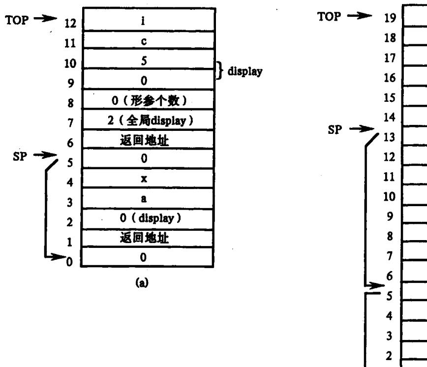

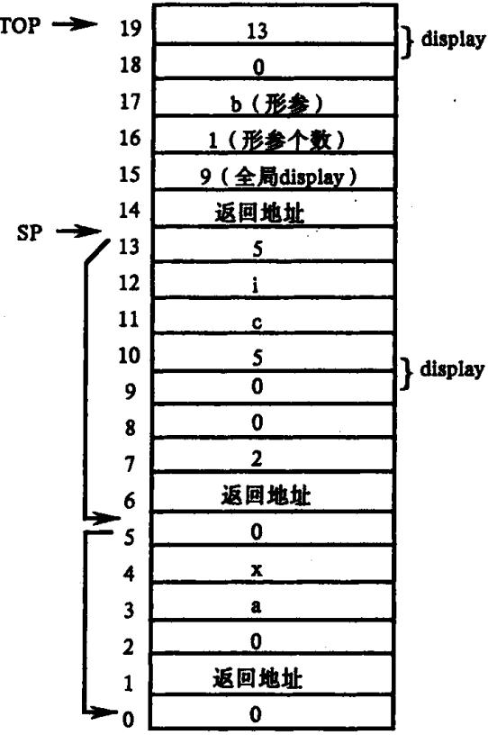

(b)

{24}------------------------------------------------

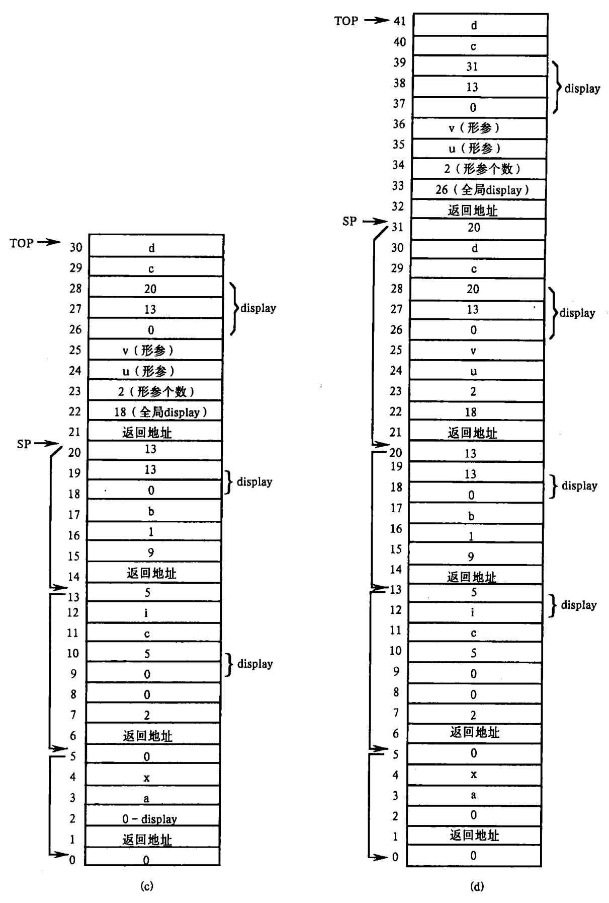

图 9.19 程序运行时可访问的 display 表内容 (a)过程 P 中调用 S 时;(b)过程 S 中调用 Q 时;(c)过程 Q 中调用 R 时;(d)过程 R 中递归调用 R。

{25}------------------------------------------------

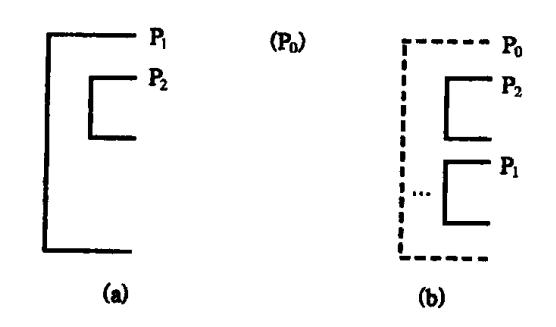

图 9.20 P<sub>1</sub> 调用 P<sub>2</sub> 的两种不同嵌套 (a)调用情形一; (b)调用情形二;

## 9.5.2 参数传递的实现

前面,我们把四元式 par T 统统解释成执行

(i+3)[TOP]:=Ti;或

(i+3)[TOP]: = addr(Ti)

这种说法被大大地简化了。如果实参是一个简单变量、数组元素或临时变量,则根据"传地址"或"传值"对 par T 给予上述解释是正确的。但是,若实参为数组、过程或标号,那么, par T 的作用统统是"传地址",并在传地址前需要做一些别的工作。下面,将就不同种别的 T 对 par T 的作用分别进行解释(用这种"解释"代替列出 par T 所对应的具体编码)。

#### par T,T 为数组

在这种情况下,根据不同语言的要求或传送数组 T 的首地址或传送它的内情向量地址。假定要求在运行时对形(式) - 实(在)数组的维数一致性和体积相容性进行动态检查,则应传送 T 的内情向量地址(这意味着所有数组的内情向量都必须保留到运行阶段); 否则,传送 T 的首地址就足够了。

#### par T,T 为过程

参数过程的处理是比较复杂的。假定过程 P 把过程 T 作为实在参数传给过程 Q,随后,Q 又通过引用相应的形式参数调用 T,那么,在进入 T 之后,为了建立 T 自己的 display, T 必须知道它直接外层的 display。我们可以断言,P 的 display 或者正好就是这个外层的 display,或者包含了这个外层 display。由于 T 的层数是知道的,所以,只要知道 P 的 display,T 就可以用它来建立自己的 display。也就是说,假定 T 的层数为 1,那么,T 的 display 乃是由 P 的 display 的前 1 个单元的内容和 SP 的现行值所组成。为了使得过程 T 工作时能知道过程 P 的 display,必须在 P 把 T 作为实参传送给 Q 的时候把 P 自身的 display 地址也传过去。因此,过程 P 中的 par T 的作用可刻画为建立如下所示的两个相继临时单元的值:

第一临时单元 B<sub>1</sub>:过程 T 的入口地址;

第二临时单元 B2:现行的 display 地址。

然后,把第一临时单元  $B_1$  的地址传送给 Q(执行(i+1)[TOP]:=addr(B1))。

假定过程 Q 现在执行到调用语句

call Z, m

其中,Z为形式参数,而形式单元 Z中已含有上述  $B_l$  的地址。那么, $B_l$  的内容将用来作为

{26}------------------------------------------------

转子指令的目的地址(即转进过程 T),  $B_2$  的内容将作为"全局 display 地址"(第三项连接数据)传送给 T。

#### par T,T 标号

假定过程 P 把标号 T 作为实在参数传送给过程 Q,随后 Q 又引用相应的形式参数把控制转移到标号 T 所指的地方。如果标号 T 是在过程  $P_0$  中定义的( $P_0$  或是 P 自身或是 P 的某一外层),那么,当 Q 要转向 T 时必须首先把  $P_0$  的活动记录变成现行活动记录。这就是说,对于 P 中的 par T,不仅要把标号 T 的地址传给 Q,而且应把  $P_0$  的活动记录的地址也传过去。因此,P 中的 par T 的功能可刻画为建立如下所示两个相继临时单元的值。

第一临时单元 B1:标号 T的地址;

第二临时单元 B<sub>2</sub>:P<sub>0</sub> 的活动记录地址。

然后把  $B_1$  的地址传送给  $Q_2$ 

假定过程 Q 在某时刻执行到语句

goto Z

Z 为形式参数,相应的形式单元中已含有上述  $B_1$  的地址,那么,在按  $B_1$  中的实在(参数) 标号地址实行转移之前,应逐级恢复 SP 和 TOP,直至 SP 指向  $P_0$  的活动记录。

我们如何知道那个定义标号 T 的过程  $P_0$  活动记录的地址呢?事实上,在符号表中,对于每个标号除了登记它的定义地址之外还登记了它所属的那个过程(即  $P_0$ )的层数 1。由于这一层如果不是 P 自身就必定是 P 的某一外层,因此,下面的指令将把  $P_0$  活动记录的地址存于  $P_0$  之中:

 $B_2$ : = (1 + d)[SP]

其中,d 为现行 display 的相对地址。

par T,T 为形式参数

在这种情况下,par T的作用是传递形式单元 T的内容(而不是传送 T的地址)。

# 9.6 堆式动态存储分配

如果一个程序语言允许用户自由地申请数据空间和退还数据空间,或者不仅有过程而且有进程(process)的程序结构,那么,由于空间的使用未必服从"先请后还,后请先还"的原则,因此,栈式的动态分配方案就不适用了。在这种情况下通常使用一种称之为堆式的动态存储分配方案。假定程序运行时有一个大的存储空间,每当需要时就从这片空间中借用一块,不用时再退还给它。由于借、还的时间先后不一,经一段运行时间之后,这个大空间就必定被分划成如图 9.21 所示的许多块块,有些有用,有些无用(空闲)。

Pascal 语言中,标准过程 new 能够动态建立一个新记录,它实际上是从未使用的自由 区(空闲空间)中找一个大小合适的存储空间并相应地置上指针。标准过程 dispose 是释放记录。new 与 dispose 不断改变着堆存储器的使用情况。

这种分配方式的存储管理技术甚为复杂,我们这里举出这种分配方法必须考虑的几个主要问题。

首先,当运行程序要求一块体积为 N 的空间时,我们应该分配哪一块给它呢?理论上说,应从比 N 稍大一点的一个空闲块中取出 N 个单元,以便使大的空闲块派更大的用

{27}------------------------------------------------

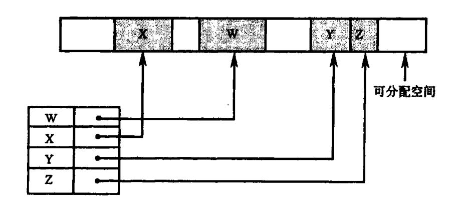

图 9.21 存储映像

场。但这种做法较麻烦。因此,常常仍采用"先碰上哪块比 N 大就从其中分出 N 个单元"的原则。但不论采用什么原则,整个大存区在一定时间之后必然会变成零碎不堪。总有一个时候会出现这样的情形:运行程序要求一块体积为 N 的空间,但发现没有比 N 大的空闲块了,然而所有空闲块的总和却要比 N 大得多! 出现这种情形时怎么办呢? 这是一个比前面的问题难得多的问题。解决办法似乎很简单,这就是,把所有空闲块连接在一起,形成一片可分配的连续空间。这里主要问题是,我们必须调整运行程序对各占用块的全部引用点。

还有,如果运行程序要求一块体积为 N 的空间,但所有空闲块的总和也不够 N,那又应怎么办呢?有的管理系统采用一种叫做废品回收的办法来对付这种局面。即寻找那些运行程序业已无用但尚未释放的占用块,或者那些运行程序目前很少使用的占用块,把这些占用块收回来,重新分配。但是,我们如何知道哪些块运行时在使用或者目前很少使用呢?即便知道了,一经收回后运行程序在某个时候又要用它时又应该怎么办呢?要使用废品回收技术,除了在语言上要有明确的具体限制外,还需要有特别的硬件措施,否则回收几乎不能实现。

#### 9.6.1 堆式动态存储分配的实现

#### 1. 定长块管理

堆式存储分配最简单的实现是按定长块进行。初始化时,将堆存储空间分成长度相等的若干块,每块中指定一个链域,按照邻块的顺序把所有块链成一个链表,用指针 avaiable 指向链表中的第一块。

分配时每次都分配指针 available 所指的块,然后 available 指向相邻的下一块,如图 9.22(a)所示。归还时,把所归还的块插入链表,如图 9.22(b)。考虑插入方便,可以把新归还的块插在 available 所指的结点之前,然后 available 指向新归还的结点。

编译程序管理定长块分配的过程不需要知道分配出去的存储块将存放何种类型的数据,用户程序可以根据需要使用整个存储块。

#### 2. 变长块管理

除了按定长进行分配与归还之外,还可以根据需要分配长度不同的存储块,可以随请求而变。按这种方法,初始化时堆存储空间是一个整块。按照用户的需要,分配时先是从一个整块里分割出满足需要的一小块。以后,归还时,如果新归还的块能和现有的空闲块

{28}------------------------------------------------

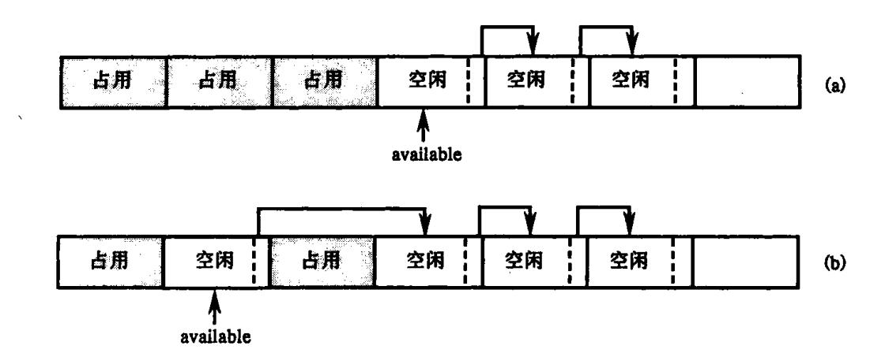

图 9.22 定长块管理

合并,则合并成一块;如果不能和任何空闲块合并,则可以把空闲块链成一个链表。再进行分配时,从空闲块链表中找出满足需要的一块,或者整块分配出去,或者从该块上分割一小块分配出去。若空闲块表中有若干个满足需要的空闲块时,该分配哪一块呢?通常有三种不同的分配策略:

- (1)首次满足法:只要在空闲块链表中找到满足需要的一块,就进行分配。如果该块很大,则按申请的大小进行分割,剩余的块仍留在空闲块链表中;如果该块不很大,比如说,比申请的块大不了几个字节,则整块分配出去,以免使空闲链表中留下许多无用的小碎块。
- (2)最优满足法:将空闲块链表中一个不小于申请块且最接近于申请块的空闲块分配给用户,则系统在分配前首先要对空闲块链表从头至尾扫描一遍,然后从中找出一块不小于申请块且最接近于申请块的空闲块分配。在用最优满足法进行分配时,为了避免每次分配都要扫描整个链表,通常将空闲块链表按空间的大小从小到大排序。这样,只要找到第一块大于申请块的空闲块即可进行分配。当然,在回收时亦需将释放的空闲块插入到链表的适当位置上去。
- (3)最差满足法:将空闲块表中不小于申请块且是最大的空闲的一部分分配给用户。此时的空闲块链表按空闲块的大小从大到小排序。这样每次分配无需查找,只需从链表中删除第一个结点,并将其中一部分分配给用户,而其它部分作为一个新的结点插入到空闲块表的适当位置上去。当然,在回收时亦需将释放的空闲块插入到链表的适当位置上去。

上述三种分配策略各有所长。一般来说,最优满足法适用于请求分配的内存大小范围较广的系统。因为按最优满足法分配时,总是找大小最接近于请求的空闲块,系统中可能产生一些存储量很小而无法利用的小片内存,同时也保留那些很大的内存块以备响应后面可能发生的内存量较大的请求。反之,由于最差满足法每次都是从内存最大的结点开始分配,从而使链表中的结点趋于均匀。因此,它适用于请求分配的内存大小范围较窄的系统;而首次满足法的分配是随机的,因此它介于两者之间,通常适用于系统事先不掌握运行期间可能出现的请求分配和释放的信息情况。从时间上来比较,首次满足法在分配时需查询空闲块链表,而回收时仅需插入到表头即可;最差满足法恰好相反,分配时无需查表,回收时则为将新的空闲块插入表中适当的位置,需先进行查找;最优满足法则不论分配与回收,均需查找链表,因此最费时间。

{29}------------------------------------------------

因此,不同的情况应采用不同的方法。通常在选择时需考虑下列因素:用户的要求;请求分配量的大小分布;分配和释放的频率以及效率对系统的重要性等等。

#### 9.6.2 隐式存储回收

隐式存储回收要求用户程序和支持运行的回收子程序并行工作,因为回收子程序需要知道分配给用户程序的存储块何时不再使用。为了实现并行工作,在存储块中要设置回收子程序访问的信息。存储块格式如下:

| 块长度    |   |
|--------|---|
| 访问计数   |   |
| 标 记    |   |
| 指 针    |   |
| 用户使用空间 | ] |

在程序运行过程中,可能出现用户程序对存储块的申请得不到满足,为使程序能运行下去,暂时挂起用户程序,系统进行存储回收,然后再使用户程序恢复运行。回收过程通常分为两个阶段。

- (1)第一个阶段为标记阶段,对已分配的块跟踪程序中各指针的访问路径。如果某个块被访问过,就给这个块加一个标记。
- (2)第二个阶段为回收阶段,所有未加标记的存储块回收到一起,并插入空闲块链表中,然后消除在存储块中所加的全部标记。

这种方法可以防止死块产生,因为如果某一块能通过某一访问路径访问,则该块就会加上标记,这样在回收阶段就不会被回收,而没有加标记的块都被回收到空闲块链表中。

上述回收存储块的技术还有一个缺点,就是它的开销随空闲块的减少而增加。为了解决这个问题,不要等到空闲块几乎耗尽时才调用回收程序,可以在空闲块降到某个值,比如总量的一半,这时当一个过程返回时就调用回收程序。

# 练 习

- 1. 有哪些存储分配策略? 并叙述何时用何种存储分配策略?
- \*2. 假定有如下一个 FORTRAN 程序段的说明句序列

SUBROUTINE EXAMPLE(X, Y)

INTEGER A, B(20), C(10, 15), D, E

COMPLEX F, G

COMMON / CBK/D, E, F

EQUIVALENCE (G, B(2)), (D, B(1))

请给出数据区 EXAMPLE 和 CBK 中各符号名的相对地址。

\*3. 出现在公用区中等价环元素的地址分配方法和非公用区中等价环元素的地址分配方法有什么不同?为什么?

{30}------------------------------------------------

```
4. 下面是一个 Pascal 程序
             program PP(input, output)
                VAR k; integer;
                FUNCTION F(n:integer): integer
                begin
                    if n < 0 then F = 1
                   else F: = n * F(n-1);
                end;
            begin
                K_{:} = F(10);
            end.
当第二次(递归地)进入 F后, DISPLAY 的内容是什么? 当时整个运行栈的内容是什么?
    5. 对如下的 Pascal 程序, 画出程序执行到(1)和(2)点时的运行栈。
            progarm Tr(input, output);
                VAR i: integer; d: integer;
                procedure A(k:real);
                   VAR p:char;
                   procedure B;
                        VAR c:char;
                        Begin
                             ...(1)...
                        end; \{B\}
                   procedure C;
                        VAR t:real;
                        Begin
                             ...(2)...
                        end; {C}
                   Begin
                        В;
                        C;
                         .....
                   end; \{A\}
                Begin | main |
                    A(d);
```

end.

{31}------------------------------------------------

6. 有如下示意的 Pascal 源程序

```
program main;
    VAR a, b, c:integer;
    procedure X(i, j:integer);
         VAR d, e:real;
         procedure Y:
                VAR, f, g: real;
               Begin
               ...
               End; Y
         procedure Z(k:integer);
               VAR h, I, j: real;
               Begin
               . . . . . .
               end; \{Z\}
        Begin
               . . . . . .
               10:Y:
               . . . . . .
               11:Z:
               . . . . . .
        end; \{X\}
   Begin
        X(a,b);
        . . . . . .
   end. {main}
```

并已知在运行时刻,以过程为单位对程序中的变量进行动态存储分配。当运行主程序而调用过程语句 X 时,试分别给出以下时刻的运行栈的内容和 Display 的内容。

- (1) 已开始而尚未执行完毕标号为 10 的语句;
- (2) 已开始而尚未执行完毕标号为 11 的语句。
- 7. 假定有一个语言,在每个过程内部既可以引用局部于该过程的变量,也可以引用 主程序中的全局量,但过程调用既不允许递归也不允许嵌套,这些限制导致了非常简单的 运行存储组织,为什么?
  - 8. 在采用显示释放存储空间时,为确定何时释放存储,需要如何管理?
  - 9. 对于下面的程序:

```
procedure P(X,Y,Z);
begin
Y:=Y+1;
```

{32}------------------------------------------------

```
Z: = Z + X;\nend P;
begin
A: = 2;
B: = 3;
P(A + B, A, A);
print A\nend
```

若参数传递的办法分别为(1)传名;(2)传地址;(3)得结果;(4)传值。试问,程序执行时所输出的 A 分别是什么?