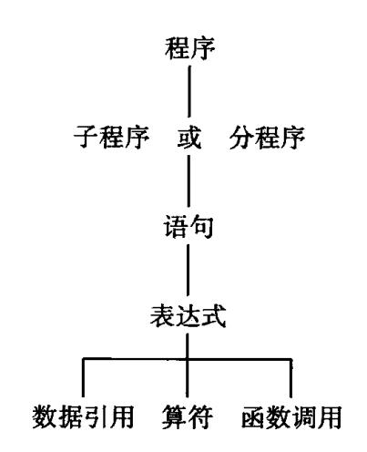
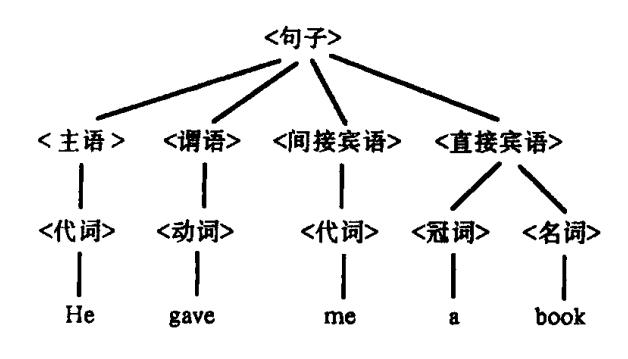
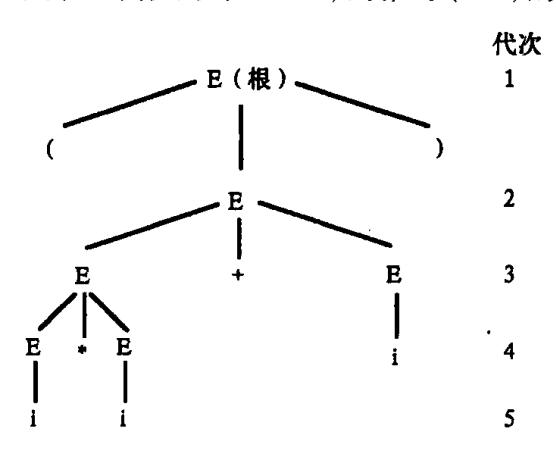
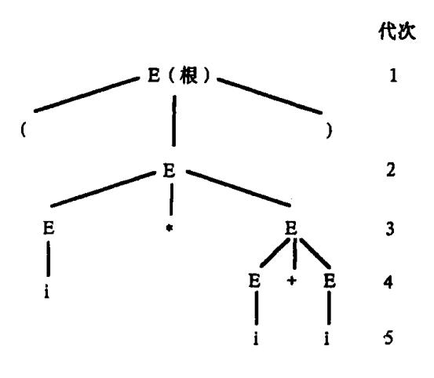
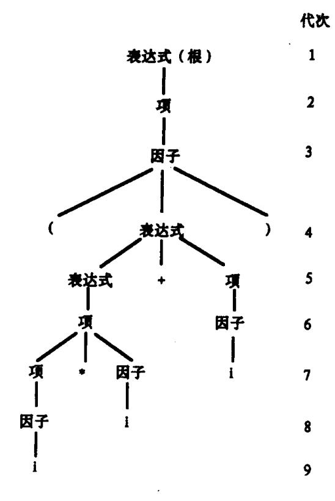

{0}------------------------------------------------

# 第二章 高级语言及其语法描述

本章概述高级程序语言的结构和主要的共同特征,并介绍程序语言的语法描述方法。 要学习和构造编译程序,理解和定义高级程序语言是必不可少的。

高级程序语言是用来描述算法和计算机实现这双重目的的。目前,世界上已有的高级语言至少上千种,在较大的范围内得到使用的语言也有几十种甚至上百种。从应用角度看,它们各有不同的侧重面。例如,FORTRAN 宜于数值计算,COBOL 宜于事务处理,PROLOG 适合于人工智能,Ada 适合于大型嵌入式实时处理,SNOBOL 则更利于符号处理。.从语言范型来分,高级程序语言可分为强制式语言、作用式语言、基于规则的语言和面向对象语言等。

## 2.1 程序语言的定义

任何语言实现的基础是语言定义。语言用户把语言定义理解为用户手册,例如语言初等成分的实际含义是什么?如何有意义地使用它们?怎样以有意义的方式组合它们?另一方面,编译程序研制者则对哪些构造允许出现更感兴趣。他们即使一时不能看出某种构造的实际应用,或者判断实现该结构会导致严重的困难,但仍必须严格根据语言的定义实现它。程序设计教科书中的语言描述侧重于语言成分的意义,它常常只讲到语言的一部分,因此,不能把这种描述作为构造编译程序的基础。

一个程序语言是一个记号系统。如同自然语言一样,程序语言主要由语法和语义两个方面定义。有时,语言定义也包含语用信息,语用主要是有关程序设计技术和语言成分的使用方法,它使语言的基本概念与语言的外界(如数学概念或计算机的对象和操作)联系起来。我们在这里重点讨论语法和语义。

#### 2.1.1 语法

任何语言程序都可看成是一定字符集(称为字母表)上的一字符串(有限序列)。但是,什么样的字符串才算是一个合式的程序呢? 所谓一个语言的语法是指这样的一组规则,用它可以形成和产生一个合式的程序。这些规则的一部分称为词法规则,另一部分称为语法规则(或产生规则)。

例如,字符串  $0.5 \times X1 + C$ ,通常被看成是常数 0.5、标识符 X1 和 C,以及算符 \* 和 + 所组成的一个表达式。其中常数'0.5',标识符'X1'和'C',算符' \* '和' + '称为语言的单词符号,而表达式' $0.5 \times X1 + C$ '称为语言的一个**语法范畴**,或**语法单位**。

语言的单词符号是由词法规则所确定的。词法规则规定了字母表中哪样的字符串是 一个单词符号。 

{1}------------------------------------------------

一个程序语言只使用一个有限字符集作为字母表。例如 Pascal 的字母表中含有 26 个英文字母  $A,B,C,\cdots,X,Y,Z;10$  个数字  $0,1,\cdots,9;$  以及 20 个其它字符:空白,+,-,\*,/,=,<,>,(,),[,], $\{,\},',\dots,\cdot,;,:,\uparrow$ 。

单词符号是语言中具有独立意义的最基本结构。例如,'0.5'是一个"实型常数", ':='在 Pascal 中是"赋值号"。

词法规则是指单词符号的形成规则。在现今多数程序语言中,单词符号一般包括:各类型的常数、标识符、基本字、算符和界符等。由于单词符号本身很简单,因此形成规则也不复杂。在第三章我们将看到,正规式和有限自动机理论是描述词法结构和进行词法分析的有效工具。

语言的语法规则规定了如何从单词符号形成更大的结构(即语法单位),换言之,语法规则是语法单位的形成规则。一般程序语言的语法单位有:表达式、语句、分程序、函数、过程和程序等等。

如何描述一个程序语言的语法规则呢?描述语法规则一般是很不容易的。但就现今的多数程序语言来说,上下文无关文法仍是一种可取的有效工具。在本书中,有限自动机和上下文无关文法是我们讨论词法分析和语法分析的主要理论基础。

语法单位比单词符号具有更丰富的意义。例如单词符号串'0.5+7.4\*14.2'代表一个算术式,具有通常的算术意义。如何定义各种语法单位的含义属于语言的语义问题。

语言的词法规则和语法规则定义了程序的形式结构,是判断输入字符串是否构成一个形式上正确(即合式)程序的依据。

一般而言,程序语言的词法、语法规则并不限定程序的书写格式。但是,某些程序语言要求程序的书写服从一定的格式,如 FORTRAN,所有语句都必须写在每行 80 列的一定位置上。这种要求增加了词法分析的复杂性。现在多数语言倾向于使用自由格式书写法,容许程序员随自己的意愿编排程序格式。这既便于阅读,又可以回避因书写格式不正确而造成的错误。

空白字符是另一个值得注意的问题。有些语言规定,空白字符除了在文字常数中的 出现之外,在别的任何地方的出现都是没有意义的。在这种情况下,空白字符可用于编排 程序格式,但增加了词法分析的麻烦。在某些语言中,空白字符用作间隔符。它们的出现 决定了单词符号的划分。

#### 2.1.2 语义

对于一个语言来说,不仅要给出它的词法、语法规则,而且要定义它的单词符号和语法单位的意义。这就是语义问题。离开语义,语言只不过是一堆符号的集合。在许多语言中有着形式上完全相同的语法单位,但含义却不尽相同。例如在 ALGOL 和 FORTRAN中,符号串

$$X + F(X) + Y$$

都代表一个"算术表达式",但含义有区别。ALGOL 规定按左结合的规则计算这个表达式的值,FORTRAN 容许使用交换律和结合律来计算其值;ALGOL 容许函数 F(X)的计值有副作用,但 FORTRAN 禁止对所在的表达式环境产生副作用。又例如,许多语言都具有如下形式的语句:

{2}------------------------------------------------

for  $i := E_1$  step  $E_2$  until  $E_3$  do S

但其含义各有不同。对于编译来说,只有了解程序的语义,我们才知道应把它翻译成什么样的目标指令代码。

所谓一个语言的语义是指这样的一组规则,使用它可以定义一个程序的意义。这些规则称为语义规则。阐明语义要比阐明语法难得多。现在还没有一种公认的形式系统,借助于它可以自动地构造出实用的编译程序。本书将介绍的是目前大多数编译程序普遍采用的一种方法,即基于属性文法的语法制导翻译方法,虽然这还不是一种形式系统,但它还是比较接近形式化的。

一个程序语言的基本功能是描述**数据**和对数据的**运算**。所谓一个**程序**,从本质上来说是描述一定数据的处理过程。在现今的程序语言中,一个程序大体上可视为下面所示的层次结构:



自上而下看上述层次结构:顶端是程序本身,它是一个完整的执行单位。一个程序通常是由若干个子程序或分程序组成的,它们常常含有自己的数据(局部名)。子程序或分程序是由语句组成的。而组成语句的成分则是各种类型的表达式。表达式是描述数据运算的基本结构,它通常含有数据引用、算符和函数调用。

自下而上看上述层次结构:我们希望通过对下层成分的理解来掌握上层成分,从而掌握整个程序。在下节中我们将综述程序语言各层次的结构和意义。

程序语言的每个组成成分都有(抽象的)逻辑和计算机实现两方面的意义。当从数学上考虑每个组成成分时,我们注重它的逻辑意义。当从计算机这个角度来看时,我们注重它在机内的表示和实现的可能性与效率。例如,一个表示实数的名字,从逻辑上说,可以看成是一个变量或一个可用于保存实数的场所;从计算机实现上说,可看成是一个或若干个相继的存储单元,这些单元的每位都有特殊的解释(如符号位、阶码和尾数),它们能表示一个一定大小和精度的数值。

## 2.2 高级语言的一般特性

本节将讨论高级程序设计语言最基本的、共有的技术特性。

{3}------------------------------------------------

#### 2.2.1 高级语言的分类

从不同的角度看,对高级程序设计语言有不同的分类方法。如果我们从语言范型分类,当今的大多数程序设计语言可划分为四类。

#### 一、强制式语言

强制式语言(Imperative Languge)也称过程式语言。其特点是命令驱动,面向语句。一个强制式语言程序由一系列的语句组成,每个语句的执行引起若干存储单元中的值的改变。这种语言的语法形式通常具有如下形式:

语句 1:

语句 2:

:

语句 n:

许多广为使用的语言,如 FORTRAN、C、Pascal, Ada 等等,属于这类语言。

#### 二、应用式语言

与强制式语言不同的是,应用式语言(Applicative Language)更注重程序所表示的功能,而不是一个语句接一个语句地执行。程序的开发过程是从前面已有的函数出发构造出更复杂的函数,对初始数据集进行操作直至最终的函数可以用于从初始数据计算出最终的结果。这种语言通常的语法形式是:

函数 n (…函数 2 (函数 1 (数据))…)

因此,这种语言也称函数式语言。LISP 和 ML 属于这种语言。

#### 三、基于规则的语言

基于规则的语言(Rule - based Language)程序的执行过程是:检查一定的条件,当它满足值,则执行适当的动作。最有代表性的基于规则语言是 Prolog,它也称逻辑程序设计语言,因为它的基本允许条件是谓词逻辑表达式。这类语言的语法形式通常为:

条件 1→动作 1

条件 2→动作 2

•

条件 n→动作 3

#### 四、面向对象语言

面向对象语言(Object - Oriented Language)如今已成为最流行、最重要的语言。它主要的特征是支持封装性、继承性和多态性等。把复杂的数据和用于这些数据的操作封装在一起,构成对象;对简单对象进行扩充、继承简单对象的特性,从而设计出复杂的对象。通过对象的构造可以使面向对象程序获得强制式语言的有效性,通过作用于规定数据的函数的构造可以获得应用式语言的灵活性和可靠性。

#### 2.2.2 程序结构

一个高级语言程序通常由若干子程序段(过程、函数等)构造,许多语言还引入了类、程序包等更高级的结构。下面我们从 FORTRAN、Pascal、Ada、Java 为例,说明程序结构。

{4}------------------------------------------------

#### -,FORTRAN

一个 FORTRAN 程序由一个主程序段和若干个(可以是0个)辅程序段组成。

```
PROGRAM MAIN
:
END
SUBROUTINE SUB1
:
END
:
SUBROUTINE SUBn
:
END
```

辅程序段可以是子程序、函数段或数据块。每个程序段由一系列说明句和执行句组成。各段可以独立编译,这对于模块设计甚为方便。

一个FORTRAN程序的各个程序段所定义(说明)的各种名字通常是彼此独立的。同一个标识符在不同的程序段中一般都是代表不同的名字,也就是说,代表不同的存储单元,各程序段对它们的引用或赋值是彼此无关的。但是,不同程序段里的同名公用块(Common Block)却代表同一个存储区域(称为公用区,Common Area)。因此,出现在COMMON语句中的名字所代表的单元在其它程序段中也可以引用(通过该段中定义在同一个COMMON块里的相应单元的名字)。所以说,公用区具有全局性。不出现在COMMON中的名字所代表的单元具有局部性。

## 二、Pascal

Pascal 是一个允许子程序嵌套定义的语言。一个 Pascal 程序可以看作是操作系统调用的一个子程序,而子程序中又可以定义别的子程序。

```
program main
:

procedure P1;
:

procedure P11;
:
begin
:\nend;
begin
:\nend;
procedure P2;
:
begin
```

{5}------------------------------------------------

```
end;
begin
:\nend.
```

Pascal 这种嵌套结构中允许同一标识符在不同的子程序中表示不同的名字。关于名字的作用域的规定是:

- (1) 一个在子程序 B1 中说明的名字 X 只在 B1 中有效(局部于 B1)。
- (2) 如果 B2 是 B1 的一个内层子程序且 B2 中对标识符 X 没有新的说明,则原来的名字 X 在 B2 中仍然有效。如果 B2 对 X 重新作了说明,那么,B2 中对 X 的任何引用都是指重新说明过的这个 X。

换言之,标识符 X 的任一出现(除出现在说明句的名表中外)都意味着引用某一说明句所说明的那个 X,此说明句同所出现的 X 共处在一个最小子程序中。这个原则称为"最近嵌套原则"。

#### 三、Ada

在 Ada 中引入了程序包(Package),它可以把数据和操作代码封装在一起,支持数据抽象。一个程序包分为两部分:

- (1) 可见的规范说明部分,它定义了程序包外面可以访问的对象。
- (2) 程序包体,它实际定义程序包的实现细节。

```
package STACKS is
  type ELEM is private;
  type STACK is limited private;
  procedure push (S: in out STACK; E: in ELEM);
  procedure pop (S: in out STACK; E: out ELEM);
end STACKS:
package body STACKS is
  procedure push(S: in out STACK; E: in ELEM);
  begin
  ……实现细节
  end push;
  procedure pop (S: in out STACK; E: out ELEM);
  begin
  ……实现细节
  end pop;
end STACKS;
```

在 Ada 程序包规范说明中,如果一个类型被定义为私有(Private)类型,则它既不允许用户在该程序包外访问此类型,又对用户隐蔽此类型数据结构的具体细节。如果一个类型被定义为受限私有(Limited Private)类型,则对该类型对象的操作仅限于相应程序包规

{6}------------------------------------------------

范说明部分说明的那些,连一般私有类型所允许的预定义赋值和测试相等的操作也不允许,以严格限制对该类型对象的访问。

#### 四、Java

Java 是一种面向对象的高级语言,它很重要的方面是类(Class)及继承(Inheritance)的概念,同时支持多态性(Polymorphism)和动态绑定(Dynamic binding)等特性。

```
class Car{
  int color_number;
  int door_number;
  int speed;
  i.
  push_break () {
    i.
  }
  Add_oil () {
    i.
  }
}
class Trash_Car extends Car {
  double amount;
  fill_trash () {
    i.
  }
}
```

一个类把有关数据及其操作(方法)封装在一起构成一个抽象数据类型。一个子类继承其父类的所有数据与方法,并且可以加入自己新的定义。

在 Java 中,变量和方法的定义之前可以加入 public、protected、private 等修饰字,以限制其它类的对象对于这些变量数据的存取以及类中方法的使用。如果一个类定义中的变量或方法前面加上 public,那么就表示只要其它类、对象等可以看到这个类的话,它们就可以存取这个变量的数据,或者使用这个方法;如果一个类的变量或方法前面加上 protected,那么只有这个类的子孙类可以直接存取这个变量数据或调用这个方法;如果在变量或方法前面加上 private,那么任何其它的类都不能直接引用这个数据,或调用这个方法。

## 2.2.3 数据类型与操作

对大多数程序设计语言而言,"数据"这个概念是最基本的。强制式程序设计语言使用一系列的语句修改存储在计算机存储器中的数据值。在这里,变量的概念可以认为是计算机存储地址的抽象。程序设计语言所提供的数据及其操作设施对语言的适用性有很大影响。一个数据类型通常包括以下三种要素:

(1) 用于区别这种类型的数据对象的属性;

{7}------------------------------------------------

- (2) 这种类型的数据对象可以具有的值;
- (3) 可以作用于这种类型的数据对象的操作。

## 一、初等数据类型

- 一个程序语言必须提供一定的初等类型数据成分,并定义对于这些数据成分的运算。 有些语言还提供了由初等数据构造复杂数据的手段。不同的语言含有不同的初等数据成分。常见的初等数据类型有:
- (1) **数值数据** 如整数、实数、复数以及这些类型的双长(或多倍长)精度数。对它们可施行算术运算(+,-,\*,/等)。
- (2) 逻辑数据 多数语言有逻辑型(布尔型)数据,有些甚至有位串型数据。对它们可施行逻辑运算(and, or, not 等)。
- (3) 字符数据 有些语言容许有字符型或字符串型的数据,这对于符号处理是必须的。
- (4) **指针类型** 指针是这样一种类型的数据,它们的值指向另一些数据。尽管语法上可能不尽相同,但一般的意义是,假定 P是一个指针, P: = addr(X)意味着 P 将指向 X,或者说, P 的值将是变量 X 的地址。有些语言中用 P  $\uparrow$  表示指针 P 的内容。在 P: = addr(X)的情况下,如令 P  $\uparrow$  := 0.3,则意味着 X 的值为 0.3。

程序语言所涉及的对象不外是数据、函数和过程等等。对于每个这种对象,程序员通常都用一个能反映它的本质的、有助于记忆的名字来表示和称呼它。例如,常常可以看到人们用 WEIGHT 来表示一个代表重量的实型数据,用 INNERPRODUCT 表示一个求内积的过程。在程序语言中各种名字都是用标识符表示的。所谓标识符系指由字母或数字组成的以字母为开头的一个字符串。

虽然名字和标识符在形式上往往难于区分,但这两个概念是有本质区别的。例如,对于'PI',我们有时说它是一个名字,有时又说它是一个标识符。标识符是一个没有意义的字符序列,但名字却有明确的意义和属性。作为标识符的 PI,无非是两个字母的并置,但作为名字的 PI,常常被用来代表圆周率。在高级语言中常用"局部名"、"全局名"之称,但少有"局部标识符"、"全局标识符"之分。

用计算机术语来说,每个名字可看成是代表一个抽象的存储单元,这个单元可含一位、一字节、一字或相继的许多个字。而这个单元的内容则认为是此名字(在某一时刻)的值。名字的值就是它所表示的一个具体对象。仅把名字看成代表一定的存储单元还是不够的,我们还必须同时指出它的属性。如果不指出名字的属性,它的值就无法理解。例如,设一个名字代表一个32位的存储单元,如果不指明属性,那么我们就不知道此单元的内容代表什么,不知道是代表一个整数、一个实数还是一个布尔值。名字的属性通常是由说明语句给出的。

有些名字似乎没有通常意义的值,例如过程名就是如此。但我们可以设想过程名具有某种代表输入-输出关系的"值"。

注意,在许多程序语言中,同一标识符在过程中的不同地点(如不同分程序)可用来代表不同的名字。在程序运行时,同一个名字在不同的时间也可能代表不同的存储单元(在递归的情形下)。反之,同一个存储单元也可能有好几个不同的名字(如 FORTRAN 中出现在 EQUIVALENCE 和 COMMON 语句里的名字)。

{8}------------------------------------------------

一个名字的属性包括**类型**和作用域。名字的类型决定了它能具有什么样的值,值在计算机内的表示方式,以及对它能施加什么运算。名字的作用域规定了它的值的存在范围。例如,一个 Pascal 名的作用域是那个包含此名的说明的过程,只有当这个过程运行时此名字才有对应的存储单元。

在多数的程序语言中,名字的性质是用说明句明确规定的。例如在 Pascal 中,说明句 X, Y: real;

规定了名字 X、Y 代表实型(简单)变量。即, X 和 Y 各对应有一个标准长度的存储单元, 其内容是浮点数,可对它们进行各种算术运算。

在某些语言中,名字的性质有时容许是隐约定的。例如在 FORTRAN 中,对未经说明句明显说明的名字,凡以 I,J,…,N 为首者均认为是代表整型的,否则为实型的。

某些语言既没有说明句也没有隐约定,如 APL 就是这样。在这种语言中,同一标识符在某一行中可能代表一个整型变量,而在另一行中则代表一个实型数组,因此,名字的性质只能在程序运行时"动态"地确定。也就是,"走到哪里,是什么,算什么"。

如果一个名字的性质是通过说明句或隐约定规则而定义的,则称这种性质是"静态"确定的。如果名字的性质只有在程序运行时才能知道,则称这种性质是"动态"确定的(我们以后常用"静态"和"动态"两词。凡编译时可以确定的东西称为"静态"的;凡必须推迟到程序运行时才能确定的东西称为"动态"的)。

对于具有静态性质的名字,编译时应对它们引用的合法性进行检查。例如,假定 I 是整型变量,X 是实型变量,混合加法运算 I + X 在 FORTRAN66 中是不允许的,而在 Pascal 中则是认可的,但必须预先产生把 I 转换成实型量的代码。

对于具有动态性质的名字,应在程序运行时收集和确定它们的性质,并进行必要的类型转换。名字的动态性质对于用户来说是方便的,但对计算机实现来说则其效率较低。

### 二、数据结构

许多程序语言提供了一种可从初级数据定义复杂(高级)数据的手段。下面我们将概述几种常见的定义方式。

## 1. 数组

从逻辑上说,一个数组是由同一类型数据所组成的某种 n 维矩形结构。沿着每一维的距离称为一个下标。每维的下标只能在该维的上、下限之内变动。数组的每个元素是矩形结构中的一个点,它的位置可通过给出每维的下标来确定。

数组的每个元素(也称下标变量)是由数组名连同各维的下标值命名的,如 A[i<sub>1</sub>, i<sub>2</sub>,…,i<sub>n</sub>]。根据数组的类型,每个数组元素在计算机中占有同样大小的存储空间。如果一个数组所需的存储空间大小在编译时就已知道,则称此数组是一个确定数组;否则,称为可变数组。

数组的存储表示有多种形式,最简单的一种是把整个数组按行(或按列)存放在一片连续存储区中。一般而言,假定对一个n维数组附上一个n位数码管显示器,每个管代表一个下标,每管显示的值在相应维的下限与上限之间变动。所谓按行存放意味着,当从数组的第一个元素开始扫描整个数组时,越是后面的下标(数码管)变化得越快。按列存放意味着越是前面的下标变化得越快。

有些程序语言,如 FORTRAN,要求以列为序存放数组;另一些,如 Pascal,通常以行为

{9}------------------------------------------------

序;还有一些则取决于编译程序设计者的意愿。

数组元素的地址计算和数组的存储方式密切相关。关于数组元素的地址计算公式, 数据结构教材中有详细的介绍。编译程序要做的工作就是实现地址计算公式,使数组元 素得到正确引用。

在编译过程中,当碰到数组说明时,必须把数组的有关信息记录在一个"内情向量"之中,以便以后计算数组元素的地址时引用这些信息。每个数组的内情向量必须包括:维数,各维的上、下限,首地址,以及数组(元素)的类型,等等。

对于确定数组来说,内情向量可登记在编译时的符号表中。对于可变数组,内情向量的一部(或全部)在编译时无法知道,只有在程序运行时才能计算出来。因此,编译程序必须为可变数组设置一定的空间,以便在运行时建立相应的内情向量。不论是对确定数组或可变数组,数组元素的地址计算公式都是一样的。

#### 2. 记录

从逻辑上说,记录结构是由已知类型的数据组合起来的一种结构。例如下面登记(姓名、年龄、婚否)的卡片就是一类简单的记录结构:

| NAME    | LI MING |  |
|---------|---------|--|
| AGE     | 25      |  |
| MARRIED | NO      |  |

每个这种记录结构含有三个分量:第一个分量 NAME 是一个字符串型的数据(或一个字符数组);第二个分量 AGE 是一个整型数据;第三个分量 MARRIED 是一个逻辑型数据。

一个记录结构通常含有若干个分量,每个分量称为记录的一个栏(或域 field)。每个分量都是一个确定类型的数据,不同分量的数据类型可以不同。

记录结构是许多程序语言中的一类重要的数据结构。不同语言定义记录结构的方式也有不同。例如,Pascal语言采用下面形式定义记录:

CARD: record

NAME: array [1..20] of char:

AGE: integer;

MARRIED: boolean

end;

这个说明句定义了一个记录 CARD。它是一个含有三个分量的记录结构: NAME,字符数组; AGE,整型量; MARRIED,布尔量。

当需要了解或更改某一卡片(如 CARD)的某一栏信息时,一般可采用如下的复合名进行访问: CARD. NAME, CARD. AGE 和 CARD. MARRIED。例如,可使用下面三个语句来填写卡片:

CARD. NAME: = 'LI MING':

CARD. AGE: = 25:

CARD. MARRIED: = false

记录结构最简单的存储表示方式是连续存放。以上述的 CARD 为例,假定:目标机器

{10}------------------------------------------------

按字节编址,每个字节存放一个字符;每个机器字包含四个字节,可存放一个整数,整数单元必须从字的边界开始(即地址码为 4 的倍数);每个布尔量用一字节表示。那么,每张卡片即 CARD 记录)需用 25B。由于整型量 AGE 必须从字的边界开始,因此,每张卡片最好用 28 个字节,也就是 7 个字; NAME 占 5 个字,AGE 占 1 个字,MARRIED 占 1 个字(浪费三个字节的零头)。这样一来 1000 张卡就需要 7000 个字。

记录结构的每个分量(域)所需占用的存储单元(字节)数称为该域的长度。当知道一个记录的地址后,通过每个域的长度就可算出各域的地址。因为我们容易推出每个域相对于记录结构起点的相对数 OFFSET:此域之前各域长度的总和。例如,就 CARD 而言, NAME、AGE 和 MARRIED 的相对数 OFFSET 分别为 0、20 和 24。于是,假定 CARD 的首地址为 a,那么,

CARD · NAME

的地址为 a

CARD · AGE

的地址为 a+20

CARD · MARRIED

的地址为 a+24

3. 字符串、表格、栈和队列

某些语言(如 SNOBOL)把字符串作为一种基本数据类型,串的长度也不加限制。这种数据类型对于符号处理、公式处理是完全必须的。

有些语言(如 LISP)特别适用于描述表格处理,因此表格就成为一种十分重要的数据类型。一个表格本质上是一组记录结构,它的每一栏可以是初等类型数据,也可以是一个指向别的记录结构的指示器。所谓线性表是指一组顺序化的记录结构。

有些语言提供了某种简易的手段,它使程序员可以方便地定义各式各样的栈和队列。 有些语言,如 Pascal 虽没有明显地提供栈型的数据结构,但栈却是它的程序数据空间的基本组织形式。

#### 三、抽象数据类型

为了增加程序的可读性和可理解性,提高可维护性,降低软件设计的复杂性,许多的程序设计语言提供了对抽象数据类型的支持。一个抽象数据类型包括:

- (1) 数据对象的一个集合;
- (2) 作用于这些数据对象的抽象运算的集合;
- (3) 这种类型对象的封装,即,除了使用类型中所定义的运算外,用户不能对这些对象进行操作。

在常用的程序设计语言中, Ada 语言通过程序包(Package)提供了数据封装的支持, Smalltalk、C++和 Java 语言则通过类(Class)对抽象数据类型提供支持。

#### 2.2.4 语句与控制结构

除了提供数据的表示、构造及运算设施外,程序设计语言应该有可执行的语句。控制结构定义了语句在其中的执行次序,语言所提供的控制结构的集合对可读和可维护的软件的编写有很大的影响。

#### 一、表达式

一个表达式是由运算量(亦称操作数,即数据引用或函数调用)和算符组成的。例如, 算术表达式 X + Y 是由二元(二目)算符'+'和运算量 X,Y(数值数据)组成的。X 和 Y 分

{11}------------------------------------------------

别称为算符+的左、右运算量(左、右操作数)。

在表达式中,一元算符通常写在它的运算量的前面,如 -X 和 $_7B$ ,这种形式称为前缀形;但有些也写在运算量后面,如  $P \land (P)$  为指示器),这种形式称为后缀形。在许多语言中,符号'-'既用来表示一元算符"负"(如 -X),又用来表示二元算符"减"(如 X-Y)。

在多数程序语言中,二元算符一般都写在两个运算量中间,如 X+Y,这种形式称为中级形式。但有的也采用后缀形式,即把算符写在运算量的后边,如把 X+Y 写成 XY+。理论上说还有一种前缀形式,即把算符写在前面,把运算量写在后面,如把 X+Y 写成 XY+Y 等成 XY+Y 。

对于多数程序语言来说,表达式的形成规则可概括为:

- (1) 变量(包括下标变量)、常数是表达式;
- (2) 若  $E_1$ 、 $E_2$  为表达式, $\theta$  是一个二元算符,则  $E_1\theta E_2$  是表达式(一般采用中缀形式);
- (3) 若 E 是表达式,θ 为一元算符,则 θE(或 Eθ)是表达式;
- (4) 若 E 是表达式,则(E)是表达式。

表达式中算符的运算顺序和结合性的约定大多和通常的数学习惯相一致。例如,对于算术表达式的计值过程一般都遵循:先乘除后加减,乘幂更优先。对于同级算符,优先的规则视具体情形而定,可采用先左后右(左结合)或先右后左(右结合)的运算顺序。例如

```
      X+Y*Z
      等于 X+(Y*Z)
      * 优先于 +

      X-Y-Z
      等于(X-Y)-Z
      同级优先左结合

      X-Y+Z
      等于(X-Y)+Z
      同级优先左结合

      X**Y**Z
      等于 X**(Y**Z)
      同级优先右结合
```

多数语言中,算术算符和逻辑算符的优先顺序一般规定如下(自高至低排列,同级算符列于同一行):

```
(**或↑)
乘幂
一元负
        (-)
乘、除
        (*,/,\div)
加、减
        (+, -)
        (<,=,>,<=,<>,>=)
        (¬, not 或·NOT·)
非
        ( / , & , and 或·AND·)
与
        ( ∨ , I , or 或·OR·)
或
隐含
        (⊃或 imp)
        ( ■, ~或 epui)
等值
```

FORTRAN 关于算符优先级的规定和上面所列的基本一致。事实上,不同的语言对算符优先级和结合性质的规定各有差异,有的甚至差异很大。例如,APL 规定所有算符都具有相同的优先级并一律服从右结合,于是,X-Y+Z 就意味着 X-(Y+Z)。ALGOL 对于同级优先的算符要求严格服从自左至右运算规则,即左结合。例如 X+Y+Z 必须处理成 (X+Y)+Z。FORTRAN 对于满足左、右结合的算符可任取一种结合。例如,A+B+C 可处理成 (A+B)+C,也可处理成 A+(B+C);对于满足交换律的算符,左、右运算量的计算

{12}------------------------------------------------

顺序也不加限制,例如 A \* B + C \* D 也可处理成 C \* D + B \* A。

算符的代数性质(交换律、结合律和分配律)常常可用来优化目标程序的质量。但必须注意两点:第一,代数性质能引用到什么程度视具体语言的不同而不同。例如,在 AL-GOL中,若把 A\*B+C\*D处理成 C\*D+B\*A,则至少是对 ALGOL不够忠实。第二,在数学上成立的代数性质在计算机上未必完全成立。交换律在计算机上一般是成立的,但结合律和分配律就未必成立(至少在结果的有效数位上常有差别)。例如,在计算机上,(A+B)+C=A+(B+C)并不普遍成立。因此,在某些语言(如 FORTRAN)中,为了保证运算结果的有效性,程序员应尽量用括号来组织表达式的计值顺序。

某些语言中容许对不同类型的数据进行运算,有些则禁止。例如,0.5+3是一个正确的 ALGOL 表达式,但在标准 FORTRAN(66)中是不能容忍的。如果容许对不同类型的数据进行运算,那就必须规定运算结果的性质,使得在编译时能够预先产生对运算量进行类型转换的目标代码。

## 二、语句

不同程序语言含有不同形式和功能的各种语句。从功能上说,语句大体可分执行性语句和说明性语句两大类。说明性语句旨在定义各种不同数据类型的变量或运算。执行性语句旨在描述程序的动作。执行语句又可分赋值句、控制句和输入/输出句。从形式上说,语句还可分为简单句、复合句和分程序等等。

## 1. 赋值句

不同语言的赋值句有不同的语法结构,但多数语言所定义的语义大体相同。我们考虑下面一个 ALGOL 赋值句

#### A := B

其中,A、B为变量名。我们知道,每个名字有两方面的特征:一方面它代表一定的存储单元,另一方面它又以该单元的内容作为值。赋值句 A:=B的意义是:"把 B的值送人 A 所代表的单元"。也就是说,在赋值句中,赋值号':='左、右两边的变量名扮演着两种不同的角色。对赋值号右边的 B 我们需要的是它的值;对左边的 A 我们需要的是它所代表的那个存储单元(的地址)。为了区分一个名字的这两种特征,我们把一个名字所代表的那个单元(地址)称为该名的左值;把一个名字的值称为该名的右值。直观上说,名字的左值指它所代表的存储单元的地址,右值指该单元的内容。

变量(包括下标变量)既持有左值又持有右值。常数和带有算符的表达式一般认为只持有右值。但对于指示器变量,如 P,它的右值 P ↑ 既持有左值又持有右值。出现在赋值号左边的表达式必须持有左值。出现在赋值号右边的表达式只需持有右值。对于在赋值号右边的表达式中出现的任何变量,我们要的是它的右值。但 BLISS 的情形甚为特别,在那里任何单独出现的名字均要其左值,欲使它代表右值,则需在名字之前加一圆点。因此,在 BLISS 中,A←B+4 和 A←・B+4 代表两个不同意义的赋值句。

#### 2. 控制语句

许多语言具有形式上很不相同的控制语句(控制程序的执行顺序),有的即使形式上相同,语义上也可能有很大差别。多数语言中所含的控制语句有:

#### 无条件转移语句

goto L

{13}------------------------------------------------

条件语句

if B then S

if B then  $S_1$  else  $S_2$ 

循环语句

while B do S

repeat S until B

for  $i := E_1$  step  $E_2$  until  $E_3$  do S

过程调用语句

call  $P(X_1, X_2, \dots, X_n)$ 

返回语句

return (E)

重要的是,必须了解这些语句在不同语言中的不同语义。

#### 3. 说明句

说明句旨在定义名字的性质。编译程序把这些性质登记在符号表中,并检查程序中名字的引用和说明是否相一致。许多说明句没有相应的目标代码。但有些说明句,如过程说明和可变数组说明则有相应的目标代码。

## 4. 简单句和复合句

简单句是指那些不包含其它语句成分的基本句,如赋值句、goto 句等等。

复合句则指那些句中有句的语句。例如,

 $IF(X \cdot EQ \cdot Y)GOTO$  15

是 FORTRAN 的一个复合句:而

if B then  $S_1$  else  $S_2$ ;

begin  $S_1$ ;  $S_2$ ; ...;  $S_n$  end

是 Pascal 中的复合句。

## 2.3 程序语言的语法描述

对于高级程序设计语言及其编译程序而言,语言的语法定义是非常重要的。本节介绍语法结构的形式描述问题。我们将重点讨论上下文无关文法、语法分析树,以及文法的二义性问题。最后还将对形式语言进行简单概述。

在引入文法定义之前,首先介绍几个概念。

设 $\Sigma$ 是一个有穷**字母表**,它的每个元素称为一个**符号**。 $\Sigma$ 上的一个**符号**串是指由 $\Sigma$ 中的符号所构成的一个有穷序列。不包含任何符号的序列称为空字,记为  $\varepsilon$ 。用 $\Sigma^*$ 表示  $\Sigma$ 上的所有符号串的全体,空字  $\varepsilon$  也包括在其中。例如,若 $\Sigma = \{a,b\}$ ,则 $\Sigma^* = \{\varepsilon,a,b\}$ ,  $\{aa,ab,ba,bb,aaa,\cdots\}$ 。 $\{aa,ab,ba,bb,aaa,\cdots\}$ 。 $\{aa,ab,ba,bb,aaa,\cdots\}$ 。 $\{aa,ab,ba,bb,aaa,\cdots\}$ 。 $\{aa,ab,ba,bb,aaa,\cdots\}$ 。 $\{aa,ab,ba,bb,aaa,\cdots\}$ 。 $\{aa,ab,ba,ba,bb,aaa,\cdots\}$ 。 $\{aa,bb,aaa,bb,aaa,\cdots\}$ 。 $\{aa,ab,ba,ba,bb,aaa,\cdots\}$ 。 $\{aa,ab,ba,ba,ba,ba,bb,aaa,\cdots\}$ 。 $\{aa,ab,ba,ba,ba,bb,aaa,\cdots\}$ 。 $\{aa,ab,ba,ba,ba,ba,ba,ba,ba,ba,ba,ba,ba,b$ 

 $\Sigma^*$  的子集 U 和 V 的(连接)积定义为

 $UV = \{\alpha\beta \mid \alpha \in U\&\beta \in V\}$ 

即集合 UV 中的符号串是由 U 和 V 的符号串连接而成的。注意,一般而言, UV  $\neq$  VU,但 (UV)W = U(VW)。V 自身的 n 次(连接)积记为

{14}------------------------------------------------

$$V^n = \underbrace{VV\cdots V}_n$$

规定  $V^0 = \{\varepsilon\}$ 。令

 $V^* = V^0 \bigcup V^1 \bigcup V^2 \bigcup V^3 \bigcup \cdots$ 

称  $V^*$  是 V 的闭包。记  $V^+ = VV^*$ , 称  $V^+$  是 V 的正则闭包。

闭包 V\*中的每个符号串都是由 V中的符号串经有限次连接而成的。

### 2.3.1 上下文无关文法

文法是描述语言的语法结构的形式规则(即语法规则)。这些规则必须是准确的,易于理解的,而且,应当有相当强的描述能力,足以描述各种不同的结构。由这种规则所形成的程序语言应有利于句子分析和翻译,而且,最好能通过这些规则自动产生有效的语法分析程序。

所谓上下文无关文法是这样一种文法,它所定义的语法范畴(或语法单位)是完全独立于这种范畴可能出现的环境的。例如,在程序语言中,当碰到一个算术表达式时,我们完全可以对它"就事论事"进行处理,而不必考虑它所处的上下文。但在自然语言中,一个句子,一个词乃至一个字,它们的语法性质和所处的上下文往往有密切的关系。因此,上下文无关文法当然不宜于描述任何自然语言,但对于现今的程序语言来说,上下文无关文法基本上是够用了。本节,我们将讨论什么是上下文无关文法和上下文无关语言。以后,凡"文法"一词若无特别说明,则均指上下文无关文法。

下面,我们从一个具体英文例句的分析出发,引进有关上下文无关文法的基本概念。比如,我们写了这样一个句子:

He gave me a book.

显然这是一个语法上正确的句子,因为它满足英语中的基本语法规则。如果我们用"→"表示"由…组成"或"定义为",那么,可以有下面语法规则:

- <句子>→<主语><谓语><间接宾语><直接宾语>
- <主语>→<代词>
- <谓语>→<动词>
- <间接宾语>→<代词>
- <直接宾语>→<冠词><名词>
- <代词 > → He
- <代词>→me
- <冠词>→a
- <动词>→gave
- <名词>→book

把 He gave me a book 与上述规则进行对照,看其中的语法范畴是否处于适当位置,我们得出结论:它是一个语法上正确的句子。说得更确切一点,有了这些规则后,我们就可以推导或产生出上述句子(从 < 句子 > 出发,反复把上述规则中"→"左边的成分替换成右边的成分):

{15}------------------------------------------------

<句子>⇒<主语><谓语><间接宾语><直接宾语>

- ⇒<代词><谓语><间接宾语><直接宾语>
- ⇒He < 谓语 > < 间接宾语 > < 直接宾语 >
- ⇒He <动词> <间接宾语> <直接宾语>
- ⇒He gave <间接宾语> <直接宾语>
- ⇒He gave <代词> <直接宾语>
- ⇒He gave me <直接宾语>
- ⇒He gave me <冠词 > <名词 >
- ⇒He gave me a <名词>
- ⇒He gave me a book

我们可以用一种图示化的方法来表示这种推导,如图 2.1,说明 He gave me a book 是一个语法正确的句子。这种图形表示称为语法分析树。



图 2.1 语法树

上述定义英文句子的规则可以说就是一个上下文无关文法。其中, He, me, book, gave, a等,称为终结符号; <句子>、<主语>、<谓语>、<动词>、<代词>等,称为非终结符号;这个文法最终是要定义 <句子>的语法结构,所以 <句子>在这里称为开始符号; <间接宾语>→<冠词> <名词>这种书写形式称为产生式。

归纳起来,一个上下文无关文法 G 包括四个组成部分:一组终结符号,一组非终结符号,一个开始符号,以及一组产生式。

所谓终结符号乃是组成语言的基本符号,在程序语言中就是以前屡次提到的单词符号,如基本字、标识符、常数、算符和界符等。从语法分析的角度来看,终结符号是一个语言的不可再分的基本符号。

非终结符号(也称语法变量)用来代表语法范畴。例如,"算术表达式"、"布尔表达式"、"赋值句"、"分程序"、"过程"等,它们都是现今程序语言常见的语法范畴。我们也可以说,一个非终结符代表一个一定的语法概念。因此,一个非终结符是一个类(或集合)记号,而不是一个个体记号。例如,"算术表达式"这个非终结符乃代表一定算术式组成的类。因而,也可以说,每个非终结符号表示一定符号串的集合(由终结符号和非终结符号组成的符号串)。

开始符号是一个特殊的非终结符号,它代表所定义的语言中我们最终感兴趣的语法范畴,这个语法范畴通常称为"句子"。但在程序语言中,我们最终感兴趣的是"程序"这个语法范畴,而其它的语法范畴都只不过是构造"程序"的一块块砖石。

{16}------------------------------------------------

产生式(也称产生规则或简称规则)是定义语法范畴的一种书写规则。一个产生式的 形式是

 $A \rightarrow \alpha$ 

其中,箭头(有时也用::=)左边的 A 是一个非终结符,称为产生式的**左部符号**;箭头右边的  $\alpha$  是由终结符号或/与非终结符号组成的一符号串,称为产生式的**右部**。我们有时也说,产生式 A→ $\alpha$  是关于 A 的一条产生规则。产生式是用来定义语法范畴的。例如,令 i 代表已定义的范畴"变量",那么,产生式

## 算术表达式→i

意味着把"算术表达式"这个范畴定义为"变量"。在有的书上,"→"也用"::="表示,这种表示方法也称巴科斯范式。

有时,只用一个产生式并不足以定义一个语法范畴,而需要用好几个产生式。特别是,需要含有递归的产生式。我们再看一个例子。假定要定义一类含 + 、\* 的算术表达式,这个定义可以这样给出:

"变量是一个算术表达式:

若  $E_1$  和  $E_2$  是算术表达式,则  $E_1$  +  $E_2$ 、 $E_1$  \*  $E_2$  和( $E_1$ )也是算术表达式。" 对于这个定义、若用产生式来描述、则可将它写成:

 $E \rightarrow i$   $E \rightarrow E + E$   $E \rightarrow E * E$   $E \rightarrow (E)$ 

其中,E代表"算术表达式";i代表"变量"。这四个产生式的全体才定义了上述的加、乘"算术表达式"这一概念。这四个产生式中的后三个都是递归的,也就是说,产生式左部的符号直接在右部出现,用递归方式定义语法范畴是一种非常重要的手段,对此应特别注意。递归性常常并不像上面例子所示的那样直接,后面,我们将会遇到间接递归的例子。

形式上说,一个上下文无关文法 G 是一个四元式  $(V_T, V_N, S, \mathcal{P})$ ,其中

 $V_T$  是一个非空有限集,它的每个元素称为终结符号;

 $V_N$  是一个非空有限集,它的每个元素称为非终结符号, $V_T \cap V_N = \phi$ ;

S是一个非终结符号, 称为开始符号:

𝒮是一个产生式集合(有限),每个产生式的形式是 P→α,其中, $P∈V_N$ ,α∈( $V_T$ U $V_N$ )\*。开始符号 S 至少必须在某个产生式的左部出现一次。

注意,为了书写方便,若干个左部相同的产生式,如

 $P \rightarrow \alpha_1$   $P \rightarrow \alpha_2$   $\vdots$   $P \rightarrow \alpha_n$ 

可合并为一个,缩写成

 $P \rightarrow \alpha_1 | \alpha_2 | \cdots | \alpha_n$ 

其中,每个  $\alpha_i$  有时也称为是 P 的一个**候选式**。

{17}------------------------------------------------

箭头'→'读为"定义为",直竖'।'读为"或",它们是元语言符号。

在后面的讨论中,根据不同情况,我们将用大写字母  $A \ B \ C \cdots$ 或汉语词组(如,算术表达式)代表非终结符号,特别是用小写字母  $a \ b \ c \cdots$ 代表终结符,用  $\alpha \ \beta \ \gamma$ 等代表由终结符和非终结符组成的符号串。为简便起见,当引用具体的文法例子时,仅列出产生式和指出开始符号。

例如,下面是一个上下文无关文法:

$$A \rightarrow + | *$$

其中,E、A 是非终结符,E 是开始符号,而 i、+ 和 \* 是终结符。

一个上下文无关文法如何定义一个语言呢? 其中心思想是,从文法的开始符号出发, 反复连续使用产生式,对非终结符施行替换和展开。例如,我们考虑下面的文法 G

$$E \rightarrow E + E \mid E * E \mid (E) \mid i$$
 (2.1)

其中,唯一的非终结符 E 可以看成是代表一类算术表达式。我们可以从 E 出发,进行一系列的推导,推出种种不同的算术表达式来。例如,根据规则

$$E \rightarrow (E)$$

我们可以说:从'E'可直接(一步地)推出'(E)'。与前面一样,我们用'⇒'表示"直接推出",这样,这句话就可表示为

$$E \Rightarrow (E)$$

若对'(E)'中的 E 使用规则 E→E + E,就有

$$(E) \Rightarrow (E + E)$$

即,从'(E)'可直接推出'(E+E)'。把上述这两步合并起来,就有

$$E \Rightarrow (E) \Rightarrow (E + E)$$

再对'(E+E)'中的 E 相继两次使用规则 E→i 之后,我们就有

$$E \Rightarrow (E) \Rightarrow (E + E) \Rightarrow (i + E) \Rightarrow (i + i)$$

我们称这样的一串替换序列是从 E 推出(i+i)的一个推导。这个推导提供了一个证明,证明(i+i)是文法(2.1)所定义的一个算术表达式。注意,推导每前进一步总是引用一条规则(产生式),而符号'⇒'指仅推导一步的意思。

严格地说,我们称 αAβ 直接推出 αγβ,即

$$\alpha A\beta \Rightarrow \alpha \gamma \beta$$

仅当  $A \rightarrow \gamma$  是一个产生式,且  $\alpha \ \beta \in (V_T \cup V_N)^*$ 。如果  $\alpha_1 \Rightarrow \alpha_2 \Rightarrow \cdots \Rightarrow \alpha_n$ ,则我们称这个序列 是从  $\alpha_1 \cong \alpha_n$  的一个**推导**。若存在一个从  $\alpha_1 \cong \alpha_n$  的推导,则称  $\alpha_1$  可推导出  $\alpha_n$ 。 我们用  $\alpha_1 \Rightarrow \alpha_n$  表示:从  $\alpha_1$  出发,经一步或若干步,可推导出  $\alpha_n$ 。而用  $\alpha_1 \Rightarrow \alpha_n$  表示:从  $\alpha_1$  出发,经  $\alpha_2 \Rightarrow \alpha_1 \Rightarrow \alpha_2 \Rightarrow \alpha_2 \Rightarrow \cdots \Rightarrow \alpha_n$ ,则我们称这个序列 是从  $\alpha_1 \cong \alpha_1 \Rightarrow \alpha_1 \Rightarrow \alpha_1 \Rightarrow \alpha_1 \Rightarrow \alpha_1 \Rightarrow \alpha_1 \Rightarrow \alpha_1 \Rightarrow \alpha_1 \Rightarrow \alpha_1 \Rightarrow \alpha_1 \Rightarrow \alpha_1 \Rightarrow \alpha_1 \Rightarrow \alpha_1 \Rightarrow \alpha_1 \Rightarrow \alpha_1 \Rightarrow \alpha_1 \Rightarrow \alpha_1 \Rightarrow \alpha_1 \Rightarrow \alpha_1 \Rightarrow \alpha_1 \Rightarrow \alpha_1 \Rightarrow \alpha_1 \Rightarrow \alpha_1 \Rightarrow \alpha_1 \Rightarrow \alpha_1 \Rightarrow \alpha_1 \Rightarrow \alpha_1 \Rightarrow \alpha_1 \Rightarrow \alpha_1 \Rightarrow \alpha_1 \Rightarrow \alpha_1 \Rightarrow \alpha_1 \Rightarrow \alpha_1 \Rightarrow \alpha_1 \Rightarrow \alpha_1 \Rightarrow \alpha_1 \Rightarrow \alpha_1 \Rightarrow \alpha_1 \Rightarrow \alpha_1 \Rightarrow \alpha_1 \Rightarrow \alpha_1 \Rightarrow \alpha_1 \Rightarrow \alpha_1 \Rightarrow \alpha_1 \Rightarrow \alpha_1 \Rightarrow \alpha_1 \Rightarrow \alpha_1 \Rightarrow \alpha_1 \Rightarrow \alpha_1 \Rightarrow \alpha_1 \Rightarrow \alpha_1 \Rightarrow \alpha_1 \Rightarrow \alpha_1 \Rightarrow \alpha_1 \Rightarrow \alpha_1 \Rightarrow \alpha_1 \Rightarrow \alpha_1 \Rightarrow \alpha_1 \Rightarrow \alpha_1 \Rightarrow \alpha_1 \Rightarrow \alpha_1 \Rightarrow \alpha_1 \Rightarrow \alpha_1 \Rightarrow \alpha_1 \Rightarrow \alpha_1 \Rightarrow \alpha_1 \Rightarrow \alpha_1 \Rightarrow \alpha_1 \Rightarrow \alpha_1 \Rightarrow \alpha_1 \Rightarrow \alpha_1 \Rightarrow \alpha_1 \Rightarrow \alpha_1 \Rightarrow \alpha_1 \Rightarrow \alpha_1 \Rightarrow \alpha_1 \Rightarrow \alpha_1 \Rightarrow \alpha_1 \Rightarrow \alpha_1 \Rightarrow \alpha_1 \Rightarrow \alpha_1 \Rightarrow \alpha_1 \Rightarrow \alpha_1 \Rightarrow \alpha_1 \Rightarrow \alpha_1 \Rightarrow \alpha_1 \Rightarrow \alpha_1 \Rightarrow \alpha_1 \Rightarrow \alpha_1 \Rightarrow \alpha_1 \Rightarrow \alpha_1 \Rightarrow \alpha_1 \Rightarrow \alpha_1 \Rightarrow \alpha_1 \Rightarrow \alpha_1 \Rightarrow \alpha_1 \Rightarrow \alpha_1 \Rightarrow \alpha_1 \Rightarrow \alpha_1 \Rightarrow \alpha_1 \Rightarrow \alpha_1 \Rightarrow \alpha_1 \Rightarrow \alpha_1 \Rightarrow \alpha_1 \Rightarrow \alpha_1 \Rightarrow \alpha_1 \Rightarrow \alpha_1 \Rightarrow \alpha_1 \Rightarrow \alpha_1 \Rightarrow \alpha_1 \Rightarrow \alpha_1 \Rightarrow \alpha_1 \Rightarrow \alpha_1 \Rightarrow \alpha_1 \Rightarrow \alpha_1 \Rightarrow \alpha_1 \Rightarrow \alpha_1 \Rightarrow \alpha_1 \Rightarrow \alpha_1 \Rightarrow \alpha_1 \Rightarrow \alpha_1 \Rightarrow \alpha_1 \Rightarrow \alpha_1 \Rightarrow \alpha_1 \Rightarrow \alpha_1 \Rightarrow \alpha_1 \Rightarrow \alpha_1 \Rightarrow \alpha_1 \Rightarrow \alpha_1 \Rightarrow \alpha_1 \Rightarrow \alpha_1 \Rightarrow \alpha_1 \Rightarrow \alpha_1 \Rightarrow \alpha_1 \Rightarrow \alpha_1 \Rightarrow \alpha_1 \Rightarrow \alpha_1 \Rightarrow \alpha_1 \Rightarrow \alpha_1 \Rightarrow \alpha_1 \Rightarrow \alpha_1 \Rightarrow \alpha_1 \Rightarrow \alpha_1 \Rightarrow \alpha_1 \Rightarrow \alpha_1 \Rightarrow \alpha_1 \Rightarrow \alpha_1 \Rightarrow \alpha_1 \Rightarrow \alpha_1 \Rightarrow \alpha_1 \Rightarrow \alpha_1 \Rightarrow \alpha_1 \Rightarrow \alpha_1 \Rightarrow \alpha_1 \Rightarrow \alpha_1 \Rightarrow \alpha_1 \Rightarrow \alpha_1 \Rightarrow \alpha_1 \Rightarrow \alpha_1 \Rightarrow \alpha_1 \Rightarrow \alpha_1 \Rightarrow \alpha_1 \Rightarrow \alpha_1 \Rightarrow \alpha_1 \Rightarrow \alpha_1 \Rightarrow \alpha_1 \Rightarrow \alpha_1 \Rightarrow \alpha_1 \Rightarrow \alpha_1 \Rightarrow \alpha_1 \Rightarrow \alpha_1 \Rightarrow \alpha_1 \Rightarrow \alpha_1 \Rightarrow \alpha_1 \Rightarrow \alpha_1 \Rightarrow \alpha_1 \Rightarrow \alpha_1 \Rightarrow \alpha_1 \Rightarrow \alpha_1 \Rightarrow \alpha_1 \Rightarrow \alpha_1 \Rightarrow \alpha_1 \Rightarrow \alpha_1 \Rightarrow \alpha_1 \Rightarrow \alpha_1 \Rightarrow \alpha_1 \Rightarrow \alpha_1 \Rightarrow \alpha_1 \Rightarrow \alpha_1 \Rightarrow \alpha_1 \Rightarrow \alpha_1 \Rightarrow \alpha_1 \Rightarrow \alpha_1 \Rightarrow \alpha_1 \Rightarrow \alpha_1 \Rightarrow \alpha_1 \Rightarrow \alpha_1 \Rightarrow \alpha_1 \Rightarrow \alpha_1 \Rightarrow \alpha_1 \Rightarrow \alpha_1 \Rightarrow \alpha_1 \Rightarrow \alpha_1 \Rightarrow \alpha_1 \Rightarrow \alpha_1 \Rightarrow \alpha_1 \Rightarrow \alpha_1 \Rightarrow \alpha_1 \Rightarrow \alpha_1 \Rightarrow \alpha_1 \Rightarrow \alpha_1 \Rightarrow \alpha_1 \Rightarrow \alpha_1 \Rightarrow \alpha_1 \Rightarrow \alpha_1 \Rightarrow \alpha_1 \Rightarrow \alpha_1 \Rightarrow \alpha_1 \Rightarrow \alpha_1 \Rightarrow \alpha_1 \Rightarrow \alpha_1 \Rightarrow \alpha_1 \Rightarrow \alpha_1 \Rightarrow \alpha_1 \Rightarrow \alpha_1 \Rightarrow \alpha_1 \Rightarrow \alpha_1 \Rightarrow \alpha_1 \Rightarrow \alpha_1 \Rightarrow \alpha_1 \Rightarrow \alpha_1 \Rightarrow \alpha_1 \Rightarrow \alpha_1 \Rightarrow \alpha_1 \Rightarrow \alpha_1 \Rightarrow \alpha_1 \Rightarrow \alpha_1 \Rightarrow \alpha_1 \Rightarrow \alpha_1 \Rightarrow \alpha_1 \Rightarrow \alpha_1 \Rightarrow \alpha_1 \Rightarrow \alpha_1 \Rightarrow \alpha_1 \Rightarrow \alpha_1 \Rightarrow \alpha_1 \Rightarrow \alpha_1 \Rightarrow \alpha_1 \Rightarrow \alpha_1 \Rightarrow \alpha_1 \Rightarrow \alpha_1 \Rightarrow \alpha_1 \Rightarrow \alpha_1 \Rightarrow \alpha_1 \Rightarrow \alpha_1 \Rightarrow \alpha_1 \Rightarrow \alpha_1 \Rightarrow \alpha_1 \Rightarrow \alpha_1 \Rightarrow \alpha_1 \Rightarrow \alpha_1 \Rightarrow \alpha_1 \Rightarrow \alpha_1 \Rightarrow \alpha_1 \Rightarrow \alpha_1 \Rightarrow \alpha_1 \Rightarrow \alpha_1 \Rightarrow \alpha_1 \Rightarrow \alpha_1 \Rightarrow \alpha_1 \Rightarrow \alpha_1 \Rightarrow \alpha_1 \Rightarrow \alpha_1 \Rightarrow \alpha_1 \Rightarrow \alpha_1 \Rightarrow \alpha_1 \Rightarrow \alpha_1 \Rightarrow \alpha_1 \Rightarrow \alpha_1 \Rightarrow \alpha_1 \Rightarrow \alpha_1 \Rightarrow \alpha_1 \Rightarrow \alpha_1 \Rightarrow \alpha_1 \Rightarrow \alpha_1 \Rightarrow \alpha_1 \Rightarrow \alpha_1 \Rightarrow \alpha_1 \Rightarrow \alpha_1 \Rightarrow \alpha_1 \Rightarrow \alpha_1 \Rightarrow \alpha_1 \Rightarrow \alpha_1 \Rightarrow \alpha_1 \Rightarrow \alpha_$ 

假定 G 是一个文法,S 是它的开始符号。如果  $S \xrightarrow{*} \alpha$ ,则称  $\alpha$  是一个**句型**。仅含终结符号的句型是一个**句子**。文法 G 所产生的句子的全体是一个**语言**,将它记为 L(G)。

$$L(G) = \{\alpha \mid S \stackrel{+}{\Longrightarrow} \alpha \& \alpha \in V_T^* \}$$

例如,终结符号串(i\*i+i)是文法(2.1)的一个句子。因为

{18}------------------------------------------------

$$E \Rightarrow (E) \Rightarrow (E + E)$$

$$\Rightarrow$$
(E \* E + E) $\Rightarrow$ (i \* E + E)

$$\Rightarrow (i * i + E) \Rightarrow (i * i + i) \tag{2.2}$$

是从开始符号 E 至(i\*i+i)的一个推导。而 E,(E),(E\*E+E),(E\*E+E),…,(i\*i+i)都是这个文法的句型。

下面,我们介绍几个简单的文法例子。

例 2.1 考虑一个文法 G<sub>1</sub>:

S→bA

A→aA | a

它定义了一个什么样的语言呢?

从开始符号 S 出发,我们可以推出如下句子:

S⇒bA⇒ba

S⇒bA⇒baA⇒baa

:

 $S \Rightarrow bA \Rightarrow baA \Rightarrow \cdots \Rightarrow ba \cdots a$ 

归纳得出从S出发可推导出所有以b开头后跟一个或任意多个a的字符串,所以:

$$L(G_1) = \{ba^n | n \ge 1\}$$

例 2.2 考虑文法 G:

 $S \rightarrow AB$ 

A→aA la

B→bB l b

我们可以分析得出:

$$L(G_2) = \{a^m b^n | m, n \ge 1\}$$

例 2.3 构造一个文法 G<sub>3</sub> 使

$$L(G_3) = \{a^nb^n \mid n \ge 1\}$$

 $G_3$  和  $G_2$  的区别在于,  $G_3$  的每个句子中 a 和 b 的个数必须相同。我们可以写出文法  $G_3$ :

注意,从一个句型到另一句型的推导过程往往不是唯一的。例如,就  $E + E \xrightarrow{i} i + i$  而言,下面两个推导都是正确的:

$$E + E \Rightarrow E + i \Rightarrow i + i \tag{2.3}$$

或

$$E + E \Rightarrow i + E \Rightarrow i + i \tag{2.4}$$

为了对句子的结构进行确定性的分析,我们往往只考虑最左推导或最右推导。所谓最左推导是指:任何一步  $\alpha \Rightarrow \beta$  都是对  $\alpha$  中的最左非终结符进行替换的。同样,可定义最右推导。例如,文法(2.2)与文法(2.4)都是最左推导,而文法(2.3)则是最右推导。

{19}------------------------------------------------

我们还可以给出句子(i\*i+i)的最右推导:

$$E \Rightarrow (E) \Rightarrow (E + E) \Rightarrow (E + i) \Rightarrow (E * E + i) \Rightarrow (E * i + i) \Rightarrow (i * i + i)$$

## 2.3.2 语法分析树与二义性

前面我们提到过可以用一张图表示一个句型的推导,这种表示称为**语法分析树**,或简称为**语法树**。语法树有助于理解一个句子语法结构的层次。语法树通常表示成一棵倒立的树,根在上,枝叶在下。

语法树的根结由开始符号所标记。随着推导的展开,当某个非终结符被它的某个候选式所替换时,这个非终结符的相应结就产生出下一代新结,候选式中自左至右的每个符号对应一个新结,并用这些符号标记其相应的新结。每个新结和其父结间都有一条连线。在一棵语法树生长过程中的任何时刻,所有那些没有后代的端末结自左至右排列起来就是一个句型。例如,对于文法(2.1),关于(i\*i+i)的推导(2.2)的语法树如图 2.2 所示。



图 2.2 语法树

这棵树的根结是第一代的 E, 它是开始符号。根结有三个儿子, 即第二代的'('、E 和')'。父子同名在语法树中是常见的事(反映递归性)。这三个兄弟的排次是, '('为老大, E 为老二, ')'为老三。老大和老三没有后代, 是个端末结。老二有三个儿子, 它们是第三代的 E, '+'和 E。第三代的老二'+'没有后代。但老大和老三都有后代。它们就是第四代的 E、\*、E 和 i。这里要注意的一点是, 语法树并没有反映出生养后代的先后。例如, 第三代的老大和老三都有儿子, 但它们谁先生儿子呢?不论是老大先生儿子还是老三先生儿子, 从图的最终表示来看并没有什么差别。甚至老三生儿子的时间可能在老大生了两个孙子(即第5代的 i、i)之后也无妨。

这就是说,一棵语法树表示了一个句型种种可能的(但未必是所有的)不同推导过程,包括最左(最右)推导。这样的一棵语法树是这些不同推导过程的共性抽象,是它们的代表。如果我们坚持使用最左(最右)推导,那么,一棵语法树就完全等价于一个最左(最右)推导,这种等价性包括树的步步成长和推导的步步展开之间的完全一致性。

但是,一个句型是否只对应唯一的一棵语法树呢?也就是,它是否只有唯一的一个最 左(最右)推导呢?不尽然。

例如,对于文法(2.1),关于(i\*i+i)就存在一个与(2.2)非常不同的推导:

$$E \Rightarrow (E) \Rightarrow (E * E) \Rightarrow (i * E) \Rightarrow (i * E + E)$$

{20}------------------------------------------------

$$\Rightarrow (i * i + E) \Rightarrow (i * i + i)$$
 (2.5)

这个推导所对应的语法树不再是图 2.2 而是图 2.3。



图 2.3 语法树

图 2.2 与图 2.3 的不同之处从第 2 代向第 3 代的过渡开始。对于前者,我们选用规则  $E \rightarrow E + E$ ,而对于后者则选用  $E \rightarrow E \times E$ 。这里不再是同代兄弟生儿子的先后次序不同,而是"生什么儿子"的不同。后面这种不同是本质上的差异。这意味着我们可以用两种完全不同的办法生成同一个句子。

如果一个文法存在某个句子对应两棵不同的语法树,则称这个文法是二义的。也就是说,若一个文法中存在某个句子,它有两个不同的最左(最右)推导,则这个文法是二义的。

例如,文法(2.1)就是一个二义文法。

注意,文法的二义性和语言的二义性是两个不同的概念。我们可能有两个不同的文法 G 和 G',其中一个是二义的而另一个是无二义的,但是却有 L(G) = L(G'),也就是说,这两个文法所产生的语言是相同的。对于一个程序语言来说,常常希望它的文法是无二义的。因为,我们希望对它的每个语句的分析是唯一的。但是,只要我们能够控制和驾驭文法的二义性,文法二义性的存在并不一定是一件坏事(见第五章)。

人们已经证明,二义性问题是不可判定的。即,不存在一个算法,它能在有限步骤内,确切地判定一个文法是否为二义的。我们所能做的事是为无二义性寻找一组充分条件(当然它们未必都是必要的)。例如,在文法(2.1)中,假若规定了运算符'+'与'\*'的优先顺序和结合规则,比方说,让'\*'的优先性高于'+',且它们都服从左结合,那么,就可以构造出一个无二义文法:

$$E \rightarrow T \mid E + T$$

$$T \rightarrow F \mid T * F$$

$$F \rightarrow (E) \mid i$$
(2.6)

如果把这个文法中的 E 看作"表达式",把 T 看作"项",把 F 看作"因子",并用这些汉字来代替它们时,那么,这个文法就等价于

表达式→项 | 表达式 + 项 项→因子 | 项 \* 因子 因子→(表达式) | i

{21}------------------------------------------------

(2.7)

在这个文法中,(i \* i + i)的最左推导是唯一的,即表达式 $\rightarrow$ 项 $\rightarrow$ 因子 $\rightarrow$ (表达式)

⇒(表达式+项)⇒(项+项)

⇒(项\*因子+项)

⇒(因子\*因子+项)

⇒(i\*因子+项)

⇒(i \* i + 项)

⇒(i \* i + 因子)

$$\Rightarrow (i * i + i)$$

这个推导所对应的语法树如图 2.4 所示。



图 2.4 (i\*i+i)的语法树

最后,作为描述程序语言的上下文无关文法,我们对它有几点小小的限制。 第一,文法中不含任何下面形式的产生式

$$P \rightarrow F$$

因为,这种产生式除了引起二义性外没有任何用处。

第二,每个非终结符 P 必须都有用处。这一方面意味着,必须存在含 P 的句型;也就是,从开始符号 S 出发,存在推导

$$S \stackrel{*}{\Rightarrow} \alpha P \beta$$

另一方面意味着,必须存在终结符串  $\gamma \in V_T^*$ ,使得  $P \xrightarrow{} \gamma$ ;也就是,对于 P 不存在永不终结的回路。

我们以后所讨论的文法均假定满足上述两条件。这种文法亦称化简了的文法。

{22}------------------------------------------------

### 2.3.3 形式语言鸟瞰

自从乔姆斯基(Chomsky)于 1956 年建立形式语言的描述以来,形式语言的理论发展得很快。这种理论对计算机科学有着深刻的影响,特别是对程序语言的设计、编译方法和计算复杂性等方面更有重大的作用。

乔姆斯基把文法分成四种类型,即 0 型、1 型、2 型和 3 型。0 型强于 1 型,1 型强于 2 型,2 型强于 3 型。这几类文法的差别在于对产生式施加不同的限制。

我们说  $G = (V_T, V_N, S, \mathcal{P})$ 是一个 0 型文法, 如果它的每个产生式

$$\alpha \rightarrow \beta$$

是这样的一种结构: $\alpha \in (V_N \cup V_T)^*$ 且至少含有一个非终结符,而  $\beta \in (V_N \cup V_T)^*$ 。

0型文法也称**短语文法**。一个非常重要的理论结果是,0型文法的能力相当于**图灵** (Turing)机。或者说,任何0型语言都是递归可枚举的;反之,递归可枚举集必定是一个0型语言。

如果对0型文法分别施加以下的第i条限制,则我们就得i型文法:

- (1) G 的任何产生式  $\alpha \rightarrow \beta$  均满足  $|\alpha| \leq |\beta|$  (其中  $|\alpha|$  和  $|\beta|$  分别为  $\alpha$  和  $\beta$  的长度);仅仅  $S \rightarrow \epsilon$  例外,但 S 不得出现在任何产生式的右部。
  - (2) G 的任何产生式为  $A \rightarrow \beta$ ,  $A \in V_N$ ,  $\beta \in (V_N \cup V_T)^*$ 。
  - (3) G 的任何产生式为  $A \rightarrow \alpha B$  或  $A \rightarrow \alpha$ , 其中  $\alpha \in V_T^*$ ,  $A \setminus B \in V_{N_0}$

1型文法也称**上下文有关文法**。这种文法意味着,对非终结符进行替换时务必考虑上下文,并且,一般不允许替换成空串 ε。例如,假若 αAβ→αγβ 是 1型文 G 的一个产生式, α 和 β 都不空,则非终结符 A 只有在 α 和 β 这样的一个上下文环境中才可以把它替换为 γ。

如果非终结符的替换可以不必考虑上下文,这就是2型文法。2型文法也称上下文 无关文法。

上述形式的 3 型文法也称**右线性文法**。3 型文法还有另一种形式,称**左线性文法**:一个文法 G 为左线性文法,如果 G 的任何产生式为  $A \rightarrow B\alpha$  或  $A \rightarrow \alpha$ ,其中  $\alpha \in V_T^*$ ,  $A \setminus B \in V_N$ 。由于 3 型文法等价于正规式(将在第三章介绍),所以也称**正规文法**。

正规文法的能力要比上下文无关文法弱得多。例如,任何正规文法都不能产生下面的语言:

$$L_2 = \left\{ a^n b^n \mid n \geqslant 1 \right\}$$

可是,这个语言可由下面的上下文无关文法所产生:

上下文无关文法对应非确定的下推自动机。这是形式语言中的一条重要定理。事实上,使用下推表(先进后出存区或栈)的有限自动机是分析上下文无关语言的基本手段。 · 当我们在后面研究语法分析时,对此便会有所了解。

上下文无关文法有足够的能力描述现今多数程序设计语言的语法结构。我们已经看到,用它可以描述算术表达式。下面是一个能够产生条件句的文法片断:

语句→if 条件 then 语句

lif 条件 then 语句 else 语句

{23}------------------------------------------------

|其它语句

这是一个二义文法。例如,下面的语句

if  $C_1$  then if  $C_2$  then  $S_1$  else  $S_2$ 

就对应有两棵不同的语法树。

在所有包含条件语句的程序语言中都倾向于规定: else 必须匹配最后那个未得到匹配的 then。按照这个要求,我们可以定义如下一个等价的无二义文法:

语句→匹配句 1非匹配句

匹配句→if 条件 then 匹配句 else 匹配句

|其它语句

非匹配句→if 条件 then 语句

lif 条件 then 匹配句 else 非匹配句

尽管上下文无关文法足以描述多数程序语言的语法,但其能力仍然是很有限的。例 如

$$L_{21} = \{a^n b^n c^i | i \ge 1, n \ge 1\}$$

是一个上下文无关语言,但却不存在由上下文无关文法能够产生的下面的语言:

$$L_1 = \{a^n b^n c^n \mid n \ge 1\}$$

然而,下面的上下文有关文法将产生这个语言。

又例如:

$$L_0 = \{ \alpha c \alpha \mid \alpha \in (a \mid b)^* \}$$

也不是一个上下文无关语言。事实上它也不是一个上下文有关语言。这个语言只有用 0型文法才能生成。

形式语言理论研究各类语言集的许多有趣的性质,这些性质和我们没有直接关系,此处不予赘述。

# 练 习

- 1. 写出下列程序设计语言所采用的输入字母表并进行比较:
- (1) Pascal (2) C (3) Ada (4) FORTRAN (5) Java
- 2. 关于变量、数组说明,练习1中所列的各种语言有何相同或不同之处?
- 3. 何谓"标识符",何谓"名字",两者的区别是什么?
- 4. 令 + 、\* 和 ↑ 代表加、乘和乘幂,按如下的非标准优先级和结合性质的约定,计算 1 + 1 \* 2 ↑ 2 \* 1 ↑ 2的值:
  - (1) 优先顺序(从高至低)为+,\*和↑,同级优先采用左结合。
  - (2) 优先顺序为 ↑, +, \*, 同级优先采用右结合。

{24}------------------------------------------------

- 5. 对你所熟悉的某种语言中的某种基本数据类型:
- (1) 描述这种类型数据对象可以包含的值;
- (2) 确定这种类型的值的存储表示:
- (3) 定义这种类型的常量的语法表示;
- (4) 确定对这种类型的数据对象可以进行哪些运算;
- (5) 对每一种运算,确定它的实现是通过软件仿真还是仅用一条简单的硬件指令?
- (6) 对这种类型的数据进行运算的合法性是静态确定还是必须动态确定?
- 6. 令文法 G<sub>6</sub> 为

N→D|ND D→0|1|2|3|4|5|6|7|8|9

- (1) G<sub>6</sub>的语言 L(G<sub>6</sub>)是什么?
- (2) 给出句子 0127、34 和 568 的最左推导和最右推导。
- 7. 写一个文法,使其语言是奇数集,且每个奇数不以0开头。
- 8. 令文法为

 $E \rightarrow T \mid E + T \mid E - T$   $T \rightarrow F \mid T * F \mid T / F$  $F \rightarrow (E) \mid i$ 

- (1) 给出 i+i\*i、i\* (i+i)的最左推导和最右推导;
- (2) 给出 i+i+i,i+i\*i和 i-i-i 的语法树。
- 9. 证明下面的文法是二义的:

S→iSeS|iS|i

10. 把下面文法改写为无二义的:

 $S \rightarrow SSI(S)I()$ 

11. 给出下面语言的相应文法

 $L_{1} = \{a^{n}b^{n}c^{i} \mid n \ge 1, i \ge 0\}$   $L_{2} = \{a^{i}b^{n}c^{n} \mid n \ge 1, i \ge 0\}$   $L_{3} = \{a^{n}b^{n}a^{m}b^{m} \mid n, m \ge 0\}$   $L_{4} = \{1^{n}0^{m}1^{m}0^{n} \mid n, m \ge 0\}$ 

- \* 12. 假定已知语言 $\{a^nb^nc^n|n\geq 1\}$ 不是上下文无关的,请证明上下文无关语言对于交和补这两个运算是不封闭的。(提示:利用练习 11 那两个语言集  $L_1$  和  $L_2$  作媒介)
  - \*13. 证明任何上下文无关语言都可由仅含下述三种形式的产生式的文法所产生:

A→BC

A→a

S→ε

其中,A、B、C、S为非终结符;S为开始符号。

\* 14. 证明:对任何上下文无关文法 G,存在一个正整数 p,使对任何  $\alpha \in L(G)$ ,若  $|\alpha| > p$ ,则  $\alpha$  可表示成 xuwvy,使得  $|uwv| \le p$ , |uv| > 0,且对任何  $i \ge 0$ ,  $xu^iwv^iy \in L(G)$ 。