{0}------------------------------------------------

# 第五章 语法分析——自下而上分析

本章介绍自下而上语法分析方法。所谓自下而上分析法就是从输入串开始,逐步进行"归约",直至归约到文法的开始符号;或者说,从语法树的末端开始,步步向上"归约",直到根结。

## 5.1 自下而上分析基本问题

我们首先讨论自下而上分析的一些基本思想和基本概念。

## 5.1.1 归约

我们所讨论的自下而上分析法是一种"移进 – 归约"法。这种方法的大意是,用一个寄存符号的先进后出栈,把输入符号一个一个地移进到栈里,当栈顶形成某个产生式的一个候选式时,即把栈顶的这一部分替换成(归约为)该产生式的左部符号。

首先考虑下面的例子:

假定文法G为

- (1) S→aAcBe
- (2) A→b
- (3) A→Ab

$$(4) B \rightarrow d \qquad (5.1)$$

我们希望把输入串 abbcde 归约到 S。假定使用下面的归约过程:首先把 a 进栈,然后把 b 进栈,因为 A→b 是一条规则,于是把栈顶的 b 归约成 A;再让第二个 b 进栈,这时栈的最顶端的两个符号 Ab,因 A→Ab 是一条规则,于是又把栈顶的 Ab 归约为 A。此时栈里只有两个符号 aA 了。之后再令 c 进栈,d 进栈,因 B→d 是一条规则,于是把栈顶的 d 归约为 B。最后让 e 进栈,此时,栈里的符号为 aAcBe。最后,用第一条规则将它归约为 S。整个"移进—归约"过程共 10 步,每一步符号栈的变化情形如图 5.1 所示。

在这个归约过程中我们先后在 3、5、8 和 10 这四步中用了(2)、(3)、(4)和(1)等四条规则。也就是,进行了四次归约。每实现一步归约都是把栈顶的一串符号用某个产生式的左部符号来代替。后面我们权且把栈顶上的这样一串符号称为"可归约串",乍看起来,似乎"移进—归约"很简单,其实不然。在上例的第 5 步中,如果不是用规则(3)而是用规则(2)把栈顶的 b 归约为 A,那么,最终就达不到归约到 S 的目的。因而,我们也就无从得知输入串 abbcde 是一个句子。为什么知道在第 5 步要用规则(3)实行归约呢?也就是说,为什么知道此时栈顶的 Ab 形成"可归约串",而 b 不是"可归约串"呢?这就需要精确定义"可归约串"这个直观概念。这是自下而上分析的关键问题。事实上,存在种种不同的方

{1}------------------------------------------------

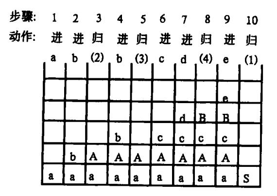

图 5.1 符号栈的变迁

法刻画"可归约串"。对这个概念的不同定义形成了不同的自下而上分析法。在算符优先分析中,我们用"最左素短语"来刻画"可归约串",在"规范归约"分析中,则用"句柄"来刻画"可归约串"。

语法分析过程可用一棵语法分析树表示出来。在自下而上分析过程中,每一步归约都可以画出一棵子树来,随着归约的完成,这些子树被连成一棵统一的语法分析树。例如,在上例的移进归约过程中,当第3步把栈顶的b归约为A时,我们得到如下的以A为根以b为端末的子树

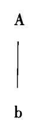

当第 5 步把栈顶的 Ab 归约为 A 时,我们把原有的子树 A 和端末 b 连在一起,形成了关于 A 的新子树

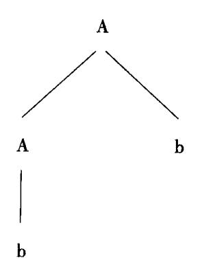

当第8步把栈顶的 d 归约为 B 时, 我们得到了关于 B 的子树

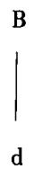

{2}------------------------------------------------

当第 10 步把栈顶的 aAcBe 归约为 S 时,我们端末 a、子树 A、端末 c、子树 B 和端末 e 自左至右连在一起,形成了关于 S 的子树

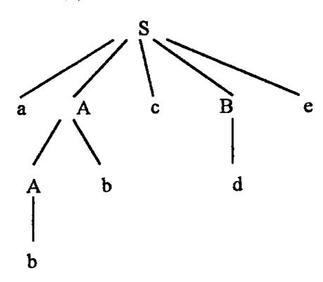

由于 S 是文法的开始符号,归约过程终止。因此,上面关于 S 的子树便是最终的语法分析 树。

自下而上分析的中心问题是,怎样判断栈顶的符号串的可归约性,以及如何归约。这是 5.2 节(算符优先分析)和 5.3 节(LR 分析法)将讨论的问题。各种不同的自下而上分析法的一个共同特点是,边输入单词符号(移进符号栈),边归约。也就是在从左到右移进输入串的过程中,一旦发现栈顶呈现可归约串就立即进行归约。这个过程对于编译实现来说是一个十分自然的过程。因为我们不能设想把整个源程序输入完之后,再对它进行归约。

## 5.1.2 规范归约简述

令 G 是一个文法, S 是文法的开始符号, 假定 also 是文法 G 的一个句型, 如果有

$$S \stackrel{*}{\Rightarrow} \alpha A \delta \perp A \stackrel{+}{\Rightarrow} \beta$$

则称 β 是句型 αβδ 相对于非终结符 A 的短语。特别是,如果有

$$A \rightarrow \beta$$

则称 β 是句型 αβδ 相对于规则  $A \rightarrow \beta$  的**直接短语**,一个句型的最左直接短语称为该句型的**句柄**。

作为"短语"的两个条件均是不可缺少的。仅仅有  $A \rightarrow \beta$ ,未必意味着  $\beta$  就是句型  $\alpha\beta\delta$  的一个短语。因为,还需有  $S \rightarrow \alpha A\delta$  这一条件。

## 例 5.1 考虑文法

$$E \rightarrow T \mid E + T$$

$$T \rightarrow F \mid T * F$$

$$F \rightarrow i \mid (E)$$
(5.2)

的一个句型  $i_1 * i_2 + i_3$ ,尽管有  $E \rightarrow i_2 + i_3$ ,但是  $i_2 + i_3$  并不是该句型的一个短语,因为不存在从 E(文法开始符)到  $i_1 * E$  的推导。但是, $i_1$ , $i_2$ , $i_3$ , $i_1 * i_2$  和  $i_1 * i_2 + i_3$  自身都是句型  $i_1 * i_2 + i_3$  的短语,而且  $i_1$ , $i_2$  和  $i_3$  均为直接短语,其中  $i_1$  是最左直接短语,即句柄。

例 5.2 文法(5.2)的另一句型 E+T\*F+i 的短语有 E+T\*F+i,E+T\*F,T\*F和 i。其中 T\*F和 i 为直接短语,T\*F为句柄。

{3}------------------------------------------------

我们可以用句柄来对句子进行归约。例如,对文法(5.1)的句子 abbcde,如果逐步寻找句柄,并用相应产生式的左部符号去替换,我们就得到如下归约过程(画底线的符号串为句型的句柄):

| <u>句型</u>       | <u>归约规则</u> |
|-----------------|-------------|
| a <u>b</u> bcde | (2) A→b     |
| a <u>Ab</u> cde | (3) A→Ab    |
| aAc <u>d</u> e  | (4) B→d     |
| <u>aAcBe</u>    | (1) S→aAcBe |
| S               |             |

显然,这个归约过程与 5.1.1 中所述的移进 – 归约过程相一致。因为两者都是先后使用 (2)、(3)、(4)和(1)这四条规则进行归约的。

稍为精确的一点说,假定  $\alpha$  是文法 G 的一个句子,我们称序列

$$\alpha_n, \alpha_{n-1}, \cdots, \alpha_0$$

是  $\vec{a}$  的一个规范归约,如果此序列满足:

- $(1)\alpha_n = \alpha$ ;
- (2)<sub> $\alpha_0$ </sub> 为文法的开始符,即  $\alpha_0 = S$ ;
- (3)对任何  $i, 0 < i \le n, \alpha_{i-1}$  是从  $\alpha_i$  经把句柄替换为相应产生式的左部符号而得到的。

容易看到,规范归约是关于  $\alpha$  的一个最右推导的逆过程。因此,规范归约也称**最左归约**。就上面的例子来说,四步归约先后使用了文法(5.1)的(2)、(3)、(4)和(1)四条产生式。若把产生式的使用顺序倒过来,即,先后次序为(1)、(4)、(3)和(2),那么,我们可得到最右推导

$$S \Rightarrow aAcBe \Rightarrow aAcde \Rightarrow aAbcde \Rightarrow abbcde$$

在形式语言中,最右推导常被称为规范推导。由规范推导所得的句型称为规范句型。如果文法 G 是无二义的,那么,规范推导(最右推导)的逆过程必是规范归约(最左归约)。

请注意句柄的"最左"特征,这一点对于移进 – 归约来说是重要的。因为,句柄的"最左"性和符号栈的栈顶两者是相关的。对于规范句型来说,句柄的后面不会出现非终结符号(即,句柄的后面只能出现终结符)。基于这一点,我们可用句柄来刻画移进 – 归约过程的"可归约串"。因此,规范归约的实质是,在移进过程中,当发现栈顶呈现句柄时就用相应产生式的左部符号进行替换。

为了加深对"句柄"和"归约"这些重要概念的理解,我们使用修剪语法树的办法来进一步阐明自下而上的分析过程。

一语法树的一棵子树,是由该树的某个结(作为子树的根)连同它的所有子孙(如果有的话)组成的。一棵子树的所有端末结自左至右排列起来形成一个相对子树根的短语。一个句型的句柄是这个句型的语法树最左那棵子树端末结的自左至右排列,这棵子树只有(而且必须有)父子两代,没有第三代。例如,句子 abbcde 的语法树为

{4}------------------------------------------------

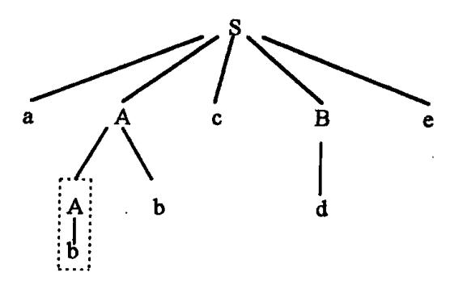

它最左边的两代子树是用虚线勾出的部分。这棵子树的端末结 b 就是句型 abbcde 的句柄。若把这棵子树的端末结都剪去(归约),就得到句型 aAbcde 的语法树

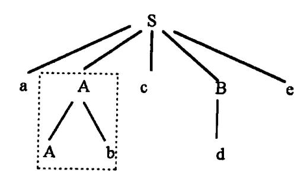

它的最左两代子树是虚线勾出的部分。这棵子树的端末结 A 与 b(连成 Ab)构成句型 aAbcde 句柄。若把这棵子树的端末结都剪去,就得到句型 aAcde 的语法树

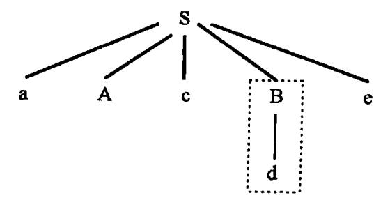

照此办理,当剪到只剩下根结时,就完成了整个归约过程。

至此,我们简单地讨论了"句柄"和"规范归约"这两个基本概念,但并没有解决规范归约的问题,因为我们没有给出寻找句柄的算法。事实上,规范归约的中心问题恰恰是:如何寻找或确定一个句型的句柄。给出了寻找句柄的不同算法就给出了不同的规范归约方法。我们将在5.3节进一步讨论这个问题。

# 5.1.3 符号栈的使用与语法树的表示

栈是语法分析的一种基本数据结构。在解释"移进 – 归约"的自下而上分析过程时我们就已经提到了符号栈(见图 5.1)。一个"移进 – 归约"分析器使用了这样的一个符号栈和一个输入缓冲区。今后我们将用一个不属于文法符号的特殊符号'#'作为栈底符,即在分析开始时预先把它推进栈;同时,也用这个符号作为输入串的"结束符",即无条件地将它置在输入串之后,以示输入串的结束。

为了便于把符号栈的内容与输入串的剩余长度作对照,我们最好把图 5.1 的结构左旋 90°。

分析开始时,栈和输入串的初始情形为

{5}------------------------------------------------

分析器的工作过程是:自左至右把输入串ω的符号——移进符号栈里,一旦发现栈顶形成一个可归约串时,就把这个串用相应的归约符号(在规范归约的情况下用相应产生规则的左部符号)代替。这种替换可能持续多次,直至栈顶不再呈现可归约串为止。然后,就继续移进符号,重复整个过程,直至最终形成如下格局:

此时,栈里只含 # 与最终归约符  $S(在规范归约的情形下 S 为文法开始符号),而输入串 <math>\omega$  全被吸收,仅剩下结束符。这种格局表示分析成功。如果达不到这种格局,意味着输入串  $\omega$ (源程序)含有语法错误。

例 5.3 对于文法(5.2),输入串 i1 \* i2 + i3 的分析(规范归约)步骤可表示如下:

| <u>步骤</u> | 符号栈                  | <u>输入串</u>                          | <u>动作</u> |
|-----------|----------------------|-------------------------------------|-----------|
| 0         | #                    | $i_1 * i_2 + i_3 #$                 | 预备        |
| 1         | # i <sub>1</sub>     | * i <sub>2</sub> + i <sub>3</sub> # | 进         |
| 2         | # F                  | * i <sub>2</sub> + i <sub>3</sub> # | 归,用 F→i   |
| 3         | # T                  | * $i_2 + i_3 \#$                    | 归,用 T→F   |
| 4         | # T *                | $i_2 + i_3 \#$                      | 进         |
| 5         | # T * i <sub>2</sub> | + i <sub>3</sub> #                  | 进         |
| 6         | # T * F              | + i <sub>3</sub> #                  | 归,用 F→i   |
| 7         | # T                  | + i <sub>3</sub> #                  | 归,用 T→T∗F |
| 8         | # E                  | + i <sub>3</sub> #                  | 归,用 E→T   |
| 9         | # E +                | i <sub>3</sub> #                    | 进         |
| 10        | # E + i <sub>3</sub> | #                                   | 进         |
| 11        | # E + F              | #                                   | 归,用 F→i   |
| 12        | # E + T              | #                                   | 归,用 T→F   |
| 13        | # E                  | #                                   | 归,用 E→E+T |
| 14        | # E                  | #                                   | 接受        |

这个归约是一个规范归约。最后栈里的符号串是 # E,符号 E 是文法的开始符,输入串已被全部吸收。因此,分析成功。

语法分析对符号栈的使用有四类操作:"移进"、"归约"、"接受"和"出错处理"。"移进"指把输入串的一个符号移进栈。"归约"指发现栈顶呈可归约串,并用适当的相应符号去替换这个串(这两个问题都还没有解决)。"接受"指宣布最终分析成功,这个操作可看作是"归约"的一种特殊形式。"出错处理"指发现栈顶的内容与输入串相悖,分析工作无法正常进行,此时需调用出错处理程序进行诊察和校正,并对栈顶的内容和输入符号进行调整。

对于"归约"而言请留心一个非常重要的事实,任何可归约串的出现必在栈顶,不会在栈的内部。对于规范归约而言,这个事实是明显的。由于规范归约是最右推导的逆过程,

{6}------------------------------------------------

因此这种归约具有"最左"性,故可归约串必在栈顶,而不会在栈的内部。正因如此,先进后出栈在归约分析中是一种非常有用的数据结构。

如果要实际表示一棵语法分析树的话,一般来说,使用穿线表是比较方便的。这只须对每个进栈符号配上一个指示器就可以了。

当要从输入串移进一个符号 a 入栈时,我们就开辟一项代表端末结 a 的数据结构,让这项数据结构的地址(指示器值)连同 a 本身一起进栈。端末结的数据结构应包括这样一些内容:①儿子个数:0;②关于 a 自身的信息(如单词内部值,现在暂且不管)。

当要把栈顶的 n 个符号,如  $X_1X_2\cdots X_n$  归约为 A 时,我们就开辟一项代表新结 A 的数据结构。这项数据结构应包含这样一些内容:①儿子个数:n;②指向儿结的 n 个指示器值;③关于 A 自身的其它信息(例如语义信息,我们现在暂且不管)。归约时,把这项数据结构的地址连同 A 本身一起进栈。

最终,当要执行"接受"操作时,我们将发现一棵用穿线表表示的语法树业已形成,代表根结的数据结构的地址和文法的开始符号(在规范归约情况下)一起留在栈中。

用这种方法表示语法树是最直截了当的。当然,也可以用别的或许是更加高效的表示方法。

# 5.2 算符优先分析

现在,我们来讨论一种简单直观、广为使用的自下而上分析法,叫做**算符优先**分析法。这种方法特别有利于表达式分析,宜于手工实现。算符优先分析过程是自下而上的归约过程,但这种归约未必是严格的最左归约。也就是说,算符优先分析法不是一种规范归约法。

所谓算符优先分析就是定义算符之间(确切地说,终结符之间)的某种优先关系,借助于这种优先关系寻找"可归约串"和进行归约。

我们用下面方法表示任何两个可能相继出现的终结符 a 和 b(它们之间可能插有一个非终结符)的优先关系。这种关系有三种:

a ≼ b a 的优先性低于 b a → b a 的优先性等于 b a ▶ b a 的优先性高于 b

注意,这三个关系不同于数学中的'<','='和'>'。例如,a  $\triangleleft$  b 并不一定意味着 b  $\triangleright$  a,a  $\rightleftharpoons$  b 也不一定意味着 b  $\rightleftharpoons$  a。

## 5.2.1 算符优先文法及优先表构造

下面我们将讨论算符优先文法,通过它可以自动产生终结符的优先关系表,并进行有效的算符优先分析。

一个文法,如果它的任一产生式的右部都不含两个相继(并列)的非终结符,即不含如下形式的产生式右部:

...OR...

则我们称该文法为算符文法。

{7}------------------------------------------------

在后面的定义中,a、b代表任意终结符;P、Q、R代表任意非终结符;'…'代表由终结符和非终结符组成的任意序列,包括空字。

假定 G 是一个不含  $\varepsilon$  - 产生式的算符文法。对于任何一对终结符  $a \times b$ ,我们说:

- (1) a → b 当且仅当文法 G 中含有形如 P→···ab···或 P→···aOb···的产生式;
- (2) a ∢ b 当且仅当 G 中含有形如 P→····aR···的产生式,而 R → b···或 R → Ob···;
- (3) a > b 当且仅当 G 中含有形如  $P \rightarrow \cdots Rb \cdots$  的产生式, 而  $R \stackrel{\rightarrow}{\rightarrow} \cdots a$  或  $R \stackrel{\rightarrow}{\rightarrow} \cdots aQ$ 。 如果一个算符文法 G 中的任何终结符对(a,b)至多只满足下述三关系之一:

$$a = b, a < b, a > b$$

## 则称 G 是一个算符优先文法。

例 5.4 考虑下面的文法 G:

(1)  $E \rightarrow E + T \mid T$ 

$$(2) T \rightarrow T * F \mid F$$
 (5.3)

- (3)  $F \rightarrow P \uparrow F \mid P$
- (4)  $P \rightarrow (E) | i$

根据第(4)条规则,我们有'('二')'。从规则  $E \rightarrow E + T$  和  $T \stackrel{\rightarrow}{\rightarrow} T * F$ ,我们有 +  $\checkmark$  \*;由(2)和(3)可得 \*  $\checkmark$  ↑。由(1) $E \rightarrow E + T$  和  $E \stackrel{\rightarrow}{\rightarrow} E + T$  可得 +  $\checkmark$  +。由(3) $F \rightarrow P$  ↑ F 可得 ↑  $\checkmark$  ↑。由(4) $P \rightarrow (E)$ 和

 $E \rightarrow E + T \rightarrow T + T \rightarrow T * F + T \rightarrow F * F + T \rightarrow P \uparrow F * F + T \rightarrow i \uparrow F * F + T$ 我们有( $\checkmark$  + 、( $\checkmark$  \* 、( $\checkmark$   $\uparrow$  和( $\checkmark$  i。总之,按定义,我们可得文法 G 终结符对的优先关系表,该表如表 5.1 所列。因为,对于 G 的任何终结对(a,b),至多只有一种关系成立。因此,G 是一个算符优先文法。

|          | + | * | <b>†</b>      | i | ( | )        | #        |
|----------|---|---|---------------|---|---|----------|----------|
| +        | > | ∢ | ∢ .           | ∢ | ∢ | >        | >        |
| *        | > | > | ∢             | ∢ | ∢ | >        | >        |
| <b>^</b> | > | > | ∢             | ∢ | ∢ | >        | >        |
| i        | > | > | . >           |   |   | >        | >        |
| (        | ∢ | ∢ | ∢             | ∢ | ∢ | <u>=</u> |          |
| )        | > | > | · <b>&gt;</b> |   |   | >        | >        |
| #        | ∢ | ∢ | ∢             | ∢ | ∢ |          | <u>-</u> |

表 5.1 优先表

在表 5.1 中, "#'是一个特殊符号,用作句子括号。为统一起见,把它也看成似乎是 文法的一个终结符。表中的空白格表示相应终结符偶没有优先关系。例如,文法 G 的任 一句型决不许含有…)(…或)i(…这样的情形。

现在来研究从算符优先文法 C 构造优先关系表的算法。

通过检查 G 的每个产生式的每个候选式,可找出所有满足 a = b 的终结符对。为了找出所有满足关系  $\triangleleft$  和  $\triangleright$  的终结符对,我们首先需要对 G 的每个非终结符 P 构造两个集合 FIRSTVT(P)和 LASTVT(P):

{8}------------------------------------------------

FIRSTVT(P) =  $\{a \mid P \stackrel{+}{\Rightarrow} a \cdots \not\equiv P \stackrel{+}{\Rightarrow} Q a \cdots, a \in V_T \not\equiv Q \in V_N\}$ 

LASTVT(P) =  $\{a \mid P \stackrel{+}{\Rightarrow} \cdots a \not \in P \stackrel{+}{\Rightarrow} \cdots aQ, a \in V_T \overrightarrow{m} Q \in V_N\}$ 

有了这两个集合之后,就可以通过检查每个产生式的候选式确定满足关系《和》的所有终结符对。例如,假定有个产生式的一个候选形为

...aP...

那么,对任何 b∈ FIRSTVT(P),我们有 a ∢ b。类似地,假定有个产生式的一个候选形为 ···Pb···

那么,对任何 a ∈ LASTVT(P), 我们有 a > b。

我们首先讨论构造集合 FIRSTVT(P)的算法。按其定义,我们可用下面两条规则来构造集合 FIRSTVT(P):

- (1) 若有产生式 P→a…或 P→Qa…,则 a∈FIRSTVT(P);
- (2) 若 a∈ FIRSTVT(Q),且有产生式 P→Q…,则 a∈ FIRSTVT(P)。

我们将建立一个布尔数组 F[P,a],使得 F[P,a]为真的条件是,当且仅当  $a \in FIRSTVT$  (P)。开始时,按上述的规则(1)对每个数组元素 F[P,a]赋初值。我们用一个栈 STACK,把所有初值为真的数组元素 F[P,a]的符号对(P,a)全都放在 STACK 之中。然后,对栈 STACK 施行如下运算。

如果栈 STACK 不空,就将顶项逐出,记此项为(Q,a)。对于每个形如

$$P \rightarrow Q \cdots$$

的产生式,若 F[P,a]为假,则变其值为真且将(P,a)推进 STACK 栈。

上述过程必须一直重复,直至栈 STACK 拆空为止。

如果把这个算法稍为形式化一点,我们可得如下所示的一个程序(包括一个过程和主程序)。

PROCEDURE INSERT(P,a);

IF NOT F[P,a] THEN

BEGIN F[P,a]:=TRUE;把(P,a)下推进 STACK 栈 END:

下面是主程序:

BEGIN

FOR 每个非终结符 P 和终结符 a DO F[P,a]:= FALSE;

FOR 每个形如 P→a…或 P→Qa…的产生式 DO

INSERT(P,a):

WHILE STACK 非空 DO

**BEGIN** 

把 STACK 的顶项,记为(Q,a),上托出去; FOR 每条形如 P→Q…的产生式 DO INSERT(P,a);

END OF WHILE:

**END** 

这个算法的工作结果得到一个二维数组 F,从它可得任何非终结符 P 的 FIRSTVT。

 $FIRSTVT(P) = \{a | F[P, a] = TRUE\}$ 

同理,可构造计算 LASTVT 的算法(留作练习)。

{9}------------------------------------------------

使用每个非终结符 P 的 FIRSTVT(P)和 LASTVT(P),我们就能够构造文法 G 的优先表。构造优先表的算法是:

FOR 每条产生式 P→X<sub>1</sub>X<sub>2</sub>···X<sub>n</sub> DO FOR i: = 1 TO n-1 DO BEGIN

IF X<sub>i</sub> 和 X<sub>i+1</sub>均为终结符 THEN 置 X<sub>i</sub> = X<sub>i+1</sub>
IF i≤n-2且 X<sub>i</sub> 和 X<sub>i+2</sub>都为终结符
但 X<sub>i+1</sub>为非终结符 THEN 置 X<sub>i</sub> = X<sub>i+2</sub>;
IF X<sub>i</sub> 为终结符而 X<sub>i+1</sub>为非终结符 THEN
FOR FIRSTVT(X<sub>i+1</sub>)中的每个 a DO
置 X<sub>i</sub> < a;

IF X<sub>i</sub> 为非终地符而 X<sub>i+1</sub>为终结符 THEN FOR LASTVT(X<sub>i</sub>)中的每个 a DO

置 a > X<sub>i+1</sub>

**END** 

至此,我们完成了从文法 G 自动构造优先表的算法。虽然,所给出的算法仍是原理性的,但足以作为实现的依据。

## 5.2.2 算符优先分析算法

下面讨论算符优先文法所产生的语言的分析算法。为了刻画什么是"可归约串",我们将定义算符优先文法的句型的"最左素短语"这个概念。

考察 5.1.2 节所述"短语"概念的含义。仅仅有  $A \rightarrow \beta$ ,不一定意味着  $\beta$  就是句型  $\alpha\beta$  的一个短语。因为,还需要  $S \rightarrow \alpha A\delta$  这一条件。例如,让我们考察文法(5.3)的一个句型 P\*P+i,尽管有  $E \rightarrow P+i$ ,但 P+i 并不是句型 P\*P+i 的一个短语,因为不存在从 E(文法开始符)到 P\*E 的推导。但是,P\*P\*i 和 P\*P+i 自身都是句型 P\*P+i 的短语。

所谓素短语是指这样的一个短语,它至少含有一个终结符,并且,除它自身之外不再含任何更小的素短语。所谓最左素短语是指处于句型最左边的那个素短语。如上例, P\*P和 i是句型 P\*P+i的素短语,而 P\*P是它的最左素短语。

现在考虑算符优先文法,我们把句型(括在两个#之间)的一般形式写成:

$$\# N_1 a_1 N_2 a_2 \cdots N_n a_n N_{n+1} \#$$
 (5.4)

其中,每个 a, 都是终结符, N, 是可有可无的非终结符。换言之, 句型中含有 n 个终结符, 任何两个终结符之间顶多只有一个非终结符。必须记住, 任何算符文法的句型都具有这种形式。我们可以证明如下定理(证明留给有兴趣的读者作练习)。

一个算符优先文法 G 的任何句型(5.4)的最左素短语是满足如下条件的最左子串  $N_{i}a_{i}\cdots N_{i}a_{i}N_{i+1}$ ,

$$a_{j-1} \lessdot a_j$$
 $a_j = a_{j+1}, \dots, a_{i-1} = a_i$ 
 $a_i \geqslant a_{i+1}$ 

根据这个定理,下面我们讨论算符优先分析算法。为了和定理的叙述相适应,我们现

{10}------------------------------------------------

在仅使用一个符号栈 S, 既用它寄存终结符, 也用它寄存非终结符。下面的分析算法是直接根据这个定理构造出来的, 其中 k 代表符号栈 S 的使用深度。

```
k := 1:
                   S[k] := ' # ';
2
      REPEAT
3
            把下一个输入符号读进 a 中;
4
            IF S[k] \in V_T THEN j:=k ELSE j:=k-1;
5
            WHILE S[j] > a DO
6
                  BEGIN
7
                  REPEAT
8
                        Q: = S[i];
9
                        IF S[i-1] \in V_T THEN j: = j-1 ELSE j: = j-2
10
                  UNTIL S[i] 		 O:
11
                  把 S[j+1]…S[k]归约为某个 N;
12
                  k:=j+1;
13
                  S[k] := N
                  END OF WHILE;
14
15
            IF S[i] \le a OR S[i] = a THEN
16
                  BEGIN k := k + 1; S[k] := a END
17
            ELSE ERROR /* 调用出错诊察程序 */
     UNTIL a = ' # '
18
```

在上述算法的工作过程中,若出现j减1后的值小于等于0时,则意味着输入串有错。在正确的情况下,算法工作完毕时,符号栈S应呈现:#N#。

注意,在上述算法的第 11 行中,我们并没有指出应把所找到的最左素短语归约到哪一个非终结符号'N'。N 是指那样一个产生式的左部符号,此产生式的右部和 S[j+1]…S [k]构成如下——对应关系:自左至右,终结符对终结符,非终结符对非终结符,而且对应的终结符相同。由于非终结符对归约没有影响,因此,非终结符根本可以不进符号栈 S。

不难看出,算符优先分析一般并不等价于规范归约。由于算符优先分析并未对文法非终结符定义优先关系,所以就无法发现由单个非终结符组成的"可归约串"。也就是说,在算符优先归约过程中,我们无法用那些右部仅含一个非终符的产生式(称为单非产生式,如 $P\rightarrow Q$ )进行归约。例如,对文法(5.3)的句子 i+i,按算符优先分析法,归约过程是:先把第一个 i 归为 P,然后把第二个 i 也归为 P,最后把 P+P 直接归为 E。在此过程中,单非产生式对归约没有发挥作用。换言之,若按上述的算法步骤一步一步地走,当把输入串的结束符 # 读进 a 之后,S 栈的内容是 # P+P,此时按第 11 步,应把 P+P 归约为 E。

显然,算符优先分析比规范归约要快得多,因为算符优先分析跳过了所有单非产生式 所对应的归约步骤。这既是算符优先分析的优点,同时也是它的缺点。因为,忽略非终结 符在归约过程中的作用,存在某种危险性,可能导致把本来不成句子的输入串误认为是句 子。但这种缺陷容易从技术上加以弥补。

算符优先分析法是一种广为应用、行之有效的方法。这种方法不仅可以方便地用于分析各类表达式,而且就连 ALGOL 60 这样复杂语言,只需对其语法稍加修改,也可以用此法进行语法分析。

{11}------------------------------------------------

## 5.2.3 优先函数

在实际实现算符优先分析算法时,一般不用表 5.1 这样的优先表,而是用两个优先函数 f 和 g。我们把每个终结符  $\theta$  与两个自然数  $f(\theta)$  和  $g(\theta)$  相对应,使得

函数 f 称为人栈优先函数,g 称为比较优先函数。使用优先函数有两方面的优点:便于作比较运算,并且节省存储空间,因为优先关系表占用的存储量比较大。其缺点是,原先不存在优先关系的两个终结符,由于与自然数相对应,变成可比较的了。因而,可能会掩盖输入串的某些错误。但是,我们可以通过检查栈顶符号  $\theta$  和输入符号 a 的具体内容来发现那些原先不可比较的情形。

关于表 5.1 的优先关系所对应的函数可定义为下表。

|   | + | * | <u>+</u> | ( | ) | i | # |
|---|---|---|----------|---|---|---|---|
| f | 2 | 4 | 5        | 0 | 6 | 6 | 0 |
| g | 1 | 3 | 6        | 7 | 0 | 7 | 0 |

下面介绍一种从优先关系表构造优先函数的办法。注意,对应一个优先关系表的优先函数 f 和 g 不是唯一的。只要存在一对,就存在无穷多对。也有许多优先关系表不存在对应的优先函数 f 和 g。

|   | a        | b        |
|---|----------|----------|
| a | <u> </u> | >        |
| b | <u> </u> | <u>-</u> |

如果我们假定存在f和g,那就应有

$$f(a) = g(a), f(a) > g(b)$$

$$f(b) = g(a), f(b) = g(b)$$

从而导致如下的矛盾:

$$f(a) > g(b) = f(b) = g(a) = f(a)$$

如果优先函数存在,那么,从优先表构造优先函数的一个简单方法是:

- (1) 对于每个终结符 a(包括 #)令其对应两个符号  $f_a$  和  $g_a$ ,画一张以所有符号  $f_a$  和  $g_a$  为结点的方向图,如果  $a \rightarrow b$ ,那么,就从  $f_a$  画一箭弧至  $g_b$ ;如果  $a \ll b$ ,就画一条从  $g_b$  到  $f_a$  的箭弧。
- (2) 对每个结点都赋予一个数,此数等于从该结点出发所能到达结点(包括出发结点自身在内)的个数。赋给  $f_a$  的数作为 f(a),赋给  $g_b$  的数作为 g(b)。
- (3) 检查所构造出来的函数 f 和 g,看它们同原来的关系表是否有矛盾。如果没有矛盾,则 f 和 g 就是所要的优先函数。如果有矛盾,那么,就不存在优先函数。

现在必须证明:若 a = b,则 f(a) = g(b);若 a b,则 f(a) < g(b);若 a b,则 f(a) >

{12}------------------------------------------------

g(b)。第一个关系可从函数的构造直接获得。因为,若 a = b,则既有从  $f_a$  到  $g_b$  的弧,又 有从  $g_b$  到  $f_a$  的弧。所以,  $f_a$  和  $g_b$  所能到达的结是全同的。至于 a > b 和 a < b 的情形,只须证明其一。如果 a > b,则有从  $f_a$  到  $g_b$  的弧。也就是,  $g_b$  能到达的任何结  $f_a$  也能到达。因此,  $f(a) \ge g(b)$ 。我们所需证明的是,在这种情况下, f(a) = g(b)不应成立。我们将指出,如果 f(a) = g(b),则根本不存在优先函数。假若 f(a) = g(b),那么必有如下的回路:

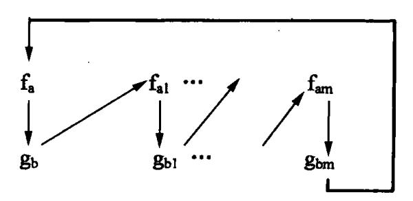

因此有

$$a > b$$
,  $a_1 < -b_1$ ,  $a_1 > -b_1$ ,  $a_m > -b_m$ ,  $a < -b_m$ 

因为对任何优先函数都必须满足(5.5) 所规定的条件,而上面的关系恰恰表明,对任何优先函数 f 和 g 来说,必定有

$$f(a) > g(b) \geqslant f(a_1) \geqslant g(b_1) \geqslant \cdots \geqslant f(a_m) \geqslant g(b_m) \geqslant f(a)$$

从而导致 f(a) > f(a),产生矛盾。因此,不存在优先函数 f 和 g。

例 5.5 表 5.1(去掉 i 和 # 两个符号)所对应的方向图如图 5.2 所示。从该图所得的函数 f 和 g 如下:

|   | + | * | <b>↑</b> | ( | ) |
|---|---|---|----------|---|---|
| f | 4 | 6 | 6        | 2 | 9 |
| g | 3 | 5 | 8        | 8 | 2 |

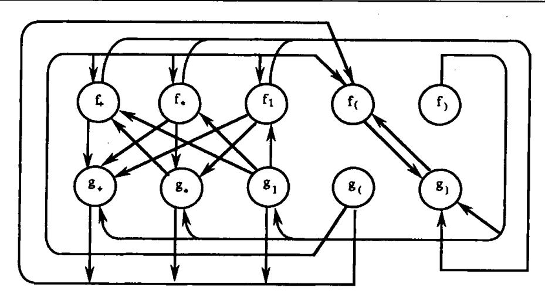

图 5.2 优先函数构造

{13}------------------------------------------------

如前述,使用优先函数有许多优点。因此,凡可能,应尽量使用优先函数。必须指出,对于一般的表达式文法而言,优先函数通常是存在的。

## 5.2.4 算符优先分析中的出错处理

使用算符优先分析法时,可在两种情况下,发现语法错误:

- (1) 若在栈顶终结符号与下一输入符号之间不存在任何优先关系;
- (2) 若找到某一"句柄"(此处"句柄"指素短语),但不存在任一产生式,其右部为此"句柄"。

针对上述情况,处理错误的子程序也可分成几类。首先,我们考虑处理类似第 2 种情况错误的子程序。当发现这种情况时,就应该打印错误信息。子程序要确定该"句柄"与哪个产生式的右部最相似。例如,假定从栈中确定的"句柄"是 abc,可是,没有一个产生式,其右部包含 a,b,c 在一起。此时,可考虑是否删除 a,b,c 中的一个。例如,假若有一产生式,其右部为 aAcB,则可给出错误信息:"非法 b";若另有一产生式,其右部为 abdc,则可给出错误信息:"缺少 d"。

注意,在使用算符优先分析法时,非终结符的处理是隐匿的,但是应该在栈中为这些非终结符留有相应的位置。因此,当我们论及"句柄"与某一产生式右部相匹配时,则意味着其相应的终结符是相同的,而非终结符所占位置也是相同的。即使如此,出现在栈中一定位置上的非终结符也不一定是一个正确的非终结符。然后,对一般的表达式使用算符优先处理,不会有很大的问题。

一般而言,当在栈中找到序列  $b_1b_2\cdots b_k$ ,其相邻符号间具有三关系,即  $b_1 = b_2 = \cdots$   $= b_k$  时,如果优先关系表告诉我们具有三关系的符号序列只有有限个,则可逐个对它们进行比较。对每一在栈中找到的归约序列  $b_1b_2\cdots b_k$ ,可确定一个最小距离合法产生式的右部 Y。符号序列  $b_1b_2\cdots b_k$  之所以能归约,必须存在某一符号 a(可能为 #),使得  $a < b_1$ ,我们称符号  $b_1$  为初始。同样,必须存在某一符号 a(可能为 #),使得  $a < b_1$ ,我们称符号 a0 为初始。同样,必须存在某一符号 a0 (可能为 #),使得 a1 大。我们称符号 a2 为有之。如果我们构造一有向图,其结点代表终结符。从结点 a2 至结点 a3 有一条边,当且仅当 a3 一。则所有可能满足 a4 一。为,可从有向图中易于确定,这个序列就是在图中由这些结点符号所形成的通路(也可能只有一个结点通路)。若在图中构成一环路,则意味着无穷多个序列可归约。

例如,考虑表 5.2 中的优先矩阵,其有向图如图 5.3 所示。

|   | + | * | ( | )        | i   | # |
|---|---|---|---|----------|-----|---|
| + | > | ∢ | 4 | >        | ∢   | > |
| * | > | > | ∢ | >        | ∢   | > |
| ( | ∢ | ∢ | ∢ | <b>=</b> | . ∢ |   |
| ) | > | > |   | >        |     | > |
| i | > | > |   | >        |     | > |
| # | ∢ |   | ∢ |          | ∢   |   |

表 5.2 优先关系表

{14}------------------------------------------------

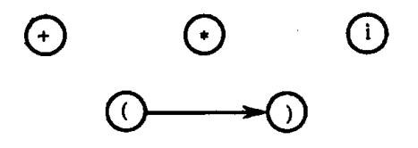

图 5.3 关于二的关系图

图中只有一条边,因为只有'('二')'。初始符号集为{+,\*,i,(},结尾符号集为{+,\*,i,)},且只有有限个通路,它们分别为:+,\*,i及(,)。每一通路对应某一产生式右部的那些终结符。因此,校正子程序只须检查介乎其间的非终结符记号。例如,可执行下述工作。

- (1)如+或\*被归约,则检查其两端是否出现非终结符。否则,打印错误信息:"缺表达式"。
- (2) 如 i 被归约,则检查其左端或右端是否有非终结符。如果有,则给出信息:"表达式间无运算符联结"。
- (3) 如()被归约,则检查是否在括号间有一非终结符。如果没有,则给出信息:"括号间无表达式"。

若有无穷多个符号序列可以归约,则可使用一个一般的子程序去处理,以确定哪一个产生式右部与该归约序列的距离满足一定的界限(例如限定为1或2)。若存在这样的产生式,则假定以这个产生式为依据,并给出比较具体的错误信息。否则,可给出类似"该语句有错"这样的一般信息。

现在,我们研究栈顶符号与输入符号之间不存在任何优先关系时的错误处理。例如,假定 a 和 b 是栈顶上的两个符号(b 在顶上),c 和 d 为输入符号串中前面两个符号,且 b 和 c 之间不存在任何关系。对此,我们可以采用一般的办法进行处理,即改变、插入或删除符号。如果采用改变或插入符号的办法,必须注意不要造成无穷的重复过程。譬如,不断地在输入端插入符号,但始终不能将栈内的符号序列归约或将符号移入栈顶。例如,若 a

- 例 5.6 表 5.3 所示的优先矩阵是在表 5.2 的空项内填上各种不同的处理错误子程序后的结果,每个处理错误子程序进行如下的工作:
  - e<sub>1</sub>: /\* 当表达式以左括号结尾时,调用此程序\*/ 将'('从栈顶移去; 给出错误信息:非法左括号。
  - ←2: /\* 当 i 或)后跟 i 或(时,调用此程序\*/ 在输入端插入'+';给出错误信息:缺少运算符。
  - ea: /\* 当表达式以右括号开始时,调用此程序\*/

{15}------------------------------------------------

从输入端删除')';

给出错误信息:非法右括号。

- e4: (1) 若栈顶有非终结符 E,则表达式分析完毕。
  - (2) 若为空,则在输入端插入 i;

给出错误信息:缺少表达式。

表 5.3 优先关系表(包括出错处理子程序)

|   | +   | *   | (                | )              | i              | #                |
|---|-----|-----|------------------|----------------|----------------|------------------|
| + | > 1 | ∢   | 4                | >              | ∢              | >                |
| * | >   | >   | ∢                | >              | ∢              | >                |
| ( | ∢ . | ∢   | ∢                | <u> </u>       | ∢              | $\mathbf{e_{i}}$ |
| ) | >   | >   | е <sub>2</sub> . | >              | $\mathbf{e}_2$ | >                |
| i | >   | >   | e <sub>2</sub>   | >              | $\mathbf{e}_2$ | >                |
| # | - 4 | - € | ∢                | e <sub>3</sub> | ∢              | $\mathbf{e_4}$   |

最后,我们举例说明前面介绍的这些子程序是如何去处理一串含有错误的符号串的。设表达式 D+E,由于错误输入成为 D+),经过词法分析后,将 i+)送至语法分析器。首先,将 i 移入栈内并进行归约(以 E 代表)。然后,将'+'移入栈内,此时有如下情况:

|   | 栈 |   | 输人符号串 |
|---|---|---|-------|
| # | E | + | )#    |

由于+ ▶ ),对'+'进行归约,错误诊察程序发现'+'的右端没有 E,故给出错误信息: "缺表达式"。但它仍进行归约,归约后的情况假设为

|   | 栈 | 输入符号串  |
|---|---|--------|
| # | E | <br>)# |

因 # 和')'之间没有任何优先关系,从表 5.3 可以看出,此时应调用  $e_3$ ,  $e_3$  将')'删除,并给出错误信息:"非法右括号"。最后进入状态:

|   | 栈 | 输人符号串 | 1 |
|---|---|-------|---|
| # | E | <br># |   |

# \*5.3 LR 分析法

本节介绍一个有效的自下而上分析技术,它可用于很大一类上下文无关文法的语法分析。这种技术被称做 LR 分析法,这里 L 表示从左到右扫描输入串,R 表示构造一个最右推导的逆过程。

一般地说,大多数用上下文无关文法描述的程序语言都可用 LR 分析器予以识别。

{16}------------------------------------------------

LR 分析法比算符优先分析法或其它的"移进 – 归约"技术更加广泛,而且识别效率并不比它们差。能用 LR 分析器分析的文法类,包含能用 LL(1)分析器分析的全部文法类,LR 分析法在自左至右扫描输入串时就能发现其中的任何错误,并能准确地指出出错地点。

这种分析法的一个主要缺点是,若用手工构造分析程序则工作量相当大。因此,必须求助于自动产生这种分析程序的产生器。现在人们已设计出了这样的专用工具,如YACC(我们将在5.4节中讨论),使用这种工具可以有效地产生语法分析程序。

下面,我将首先讨论 LR 分析器的工作过程。然后将讨论四种不同分析表的构造方法。第一种,也是最简单的一种,叫做 LR(0)表构造法。这种方法的局限性极大,但它是建立其它较一般的 LR 分析法的基础。第二种,叫做简单 LR(简称 SLR)表构造法。虽然,有一些文法构造不出 SLR 分析表,但是,这是一种比较容易实现又极有使用价值的方法。第三种,叫做规范 LR 表构造法,这种分析表能力最强,能够适用一大类文法,但实现代价过高,或者说,分析表的体积非常大。第四种,叫做向前 LR 表构造法(简称 LALR)。这种分析表的能力介于 SLR 和规范 LR 之间,稍加努力,就可以高效地实现。最后,我们将讨论如何使用二义文法简化语言描述和产生高效能的分析器。

#### 5.3.1 LR 分析器

规范归约(最左归约 - 最右推导的逆过程)的关键问题是寻找句柄。在一般的"移进 - 归约"过程中, 当一串貌似句柄的符号串呈现于栈顶时, 我们有什么方法可以确定它是 否为相对于某一产生式的句柄呢? LR 方法的基本思想是, 在规范归约过程中, 一方面记住已移进和归约出的整个符号串, 即记住"历史", 另一方面根据所用的产生式推测未来可能碰到的输入符号, 即对未来进行"展望"。当一串貌似句柄的符号串呈现于分析栈的顶端时, 我们希望能够根据所记载的"历史"和"展望"以及"现实"的输入符号等三方面的材料, 来确定栈顶的符号串是否构成相对某一产生式的句柄。

LR分析法的这种基本思想是很符合哲理的。因而可以想像,这种分析法也必定是非常通用的。正因如此,实现起来也就非常困难。作为归约过程的"历史"材料的积累虽不困难(实际上,这些材料都保存在分析栈中),但是,"展望"材料的汇集却是一件很不容易的事情。这种困难不是理论上的,而是实际实现上的。因为,根据历史推测未来,即使是推测未来的一个符号,也常常存在着非常多的不同可能性。因此,当把"历史"和"展望"材料综合在一起时,复杂性就大大增加。如果简化对"展望"资料的要求,我们就可能获得实际可行的分析算法。

后面所讨论的 LR 方法都是带有一定限制的。

一个 LR 分析器实质上是一个带先进后出存储器(栈)的确定有限状态自动机。我们将把"历史"和"展望"材料综合地抽象成某些"状态"。分析栈(先进后出存储器)用来存放状态。栈里的每个状态概括了从分析开始直到某一归约阶段的全部"历史"和"展望"资料。任何时候,栈顶的状态都代表了整个的历史和已推测出的展望。因此,在任何时候都可从栈顶状态得知你所想了解的一切,而绝对没有必要从底而上翻阅整个栈。LR 分析器的每一步工作都是由栈顶状态和现行输入符号所唯一决定的。为了有助于明确归约手续,我们把已归约出的文法符号串也同时放在栈里(显然它们是多余的,因为它们已被概括在"状态"里了)。于是,我们可以把栈的结构看成是:

{17}------------------------------------------------

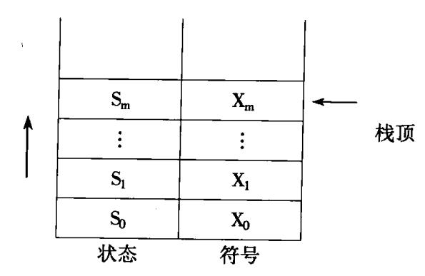

栈的每一项内容包括状态 s 和文法符号 X 两部分。 $(s_0, \#)$ 为分析开始前预先放到栈里的初始状态和句子括号。栈顶状态为  $s_m$ ,符号串  $X_1X_2\cdots X_m$  是至今已移进归约出的部分。

LR 分析器模型如图 5.4 所示。

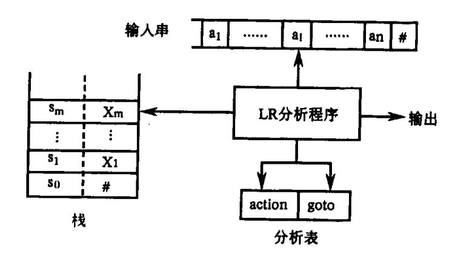

图 5.4 LR 分析器模型

LR 分析器的核心部分是一张**分析表**。这张分析表包括两部分,一是"动作"(ACTION)表,另一是"状态转换"(GOTO)表。它们都是二维数组。ACTION[s, a]规定了当状态 s 面临输入符号 a 时应采取什么动作。GOTO[s, X]规定了状态 s 面对文法符号 X(终结符或非终结符)时下一状态是什么。显然,GOTO[s, X]定义了一个以文法符号为字母表的DFA。

每一项 ACTION[s,a]所规定的动作不外是下述四种可能之一。

- (1) **移进** 把(s,a)的下一状态 s' = GOTO[s,a]和输入符号 a 推进栈,下一输入符号 变成现行输入符号。
- (2) **归约** 指用某一产生式  $A \rightarrow \beta$  进行归约。假若  $\beta$  的长度为 r, 归约的动作是 A, 去除栈顶的 r 个项, 使状态  $s_{m-r}$ 变成栈顶状态, 然后把( $s_{m-r}$ , A)的下一状态 s' = GOTO [ $s_{m-r}$ , A]和文法符号 A 推进栈。归约动作不改变现行输入符号。执行归约动作意味着  $\beta$  ( $z_{m-r+1}$ ···· $z_m$ )已呈现于栈顶而且是一个相对于  $z_m$  的句柄。
  - (3)接受 宣布分析成功,停止分析器的工作。
  - (4)报错 发现源程序含有错误,调用出错处理程序。

LR 分析器的总控程序本身的工作是非常简单的。它的任何一步只需按栈顶状态 s 和现行输入符号 a 执行 ACTION[s, a] 所规定的动作。不管什么分析表, 总控程序都是一样地工作。

一个 LR 分析器的工作过程可看成是栈里的状态序列、已归约串和输入串所构成的

{18}------------------------------------------------

三元式的变化过程。分析开始时的初始三元式为

$$(s_0, \#, a_1a_2\cdots a_n\#)$$

其中, $s_0$  为分析器的初态; # 为句子的左括号;  $a_1a_2$  ···  $a_n$  为输入串;其后的 # 为结束符(句子右括号)。分析过程每步的结果可表示为

$$(s_0s_1\cdots s_m, \#X_1X_2\cdots X_m, a_ia_{i+1}\cdots a_n\#)$$

分析器的下一步动作是由栈顶状态  $s_m$  和现行输入符号  $a_i$  所唯一决定的。即,执行 ACTION[ $s_m$ ,  $a_i$ ]所规定的动作。经执行每种可能的动作之后,三元式的变化情形是:

(1) 若  $ACTION[s_m, a_i]$  为移进,且  $s = GOTO[s_m, a_i]$ ,则三元式变成:

$$(s_0s_1\cdots s_m s, \# X_1X_2\cdots X_m a_i, a_{i+1}\cdots a_n \#)$$

(2) 若  $ACTION[s_m a_i] = \{A \rightarrow \beta\}$ ,则按产生式  $A \rightarrow \beta$  进行归约。此时三元式变为

$$(s_0s_1\cdots s_{m-r}s, \# X_1\cdots X_{m-r}A, a_ia_{i+1}\cdots a_n\#)$$

此处  $s = GOTO[s_{m-r}, A], r 为 \beta$  的长度,  $\beta = X_{m-r+1} \cdots X_{mo}$ 

- (3) 若 ACTION[s<sub>m</sub>, a<sub>i</sub>]为"接受",则三元式不再变化,变化过程终止,宣布分析成功。
- (4) 若 ACTION[s<sub>m</sub>, a<sub>i</sub>]为"报错",则三元式的变化过程终止,报告错误。
- 一个 LR 分析器的工作过程就是一步一步地变换三元式,直至执行"接受"或"报错" 为止。

例如,图 5.5 就是下述文法的一个 LR 分析表:

- (1)  $E \rightarrow E + T$
- (2)  $E \rightarrow T$
- (3)  $T \rightarrow T * F$
- (4)  $T \rightarrow F$
- $(5) F \rightarrow (E)$
- (6) F→i

| مقد خال |            | ACTION (动作) |    |    |     |     |   | GOTO (转换) |    |  |
|---------|------------|-------------|----|----|-----|-----|---|-----------|----|--|
| 状态      | ì          | +           | *  | (  | )   | #   | E | Т         | F  |  |
| 0       | s5         |             |    | s4 |     |     | 1 | 2         | 3  |  |
| 1       |            | <b>s</b> 6  |    |    |     | acc |   |           |    |  |
| 2       |            | r2          | s7 |    | r2  | r2  |   |           |    |  |
| 3       |            | r4          | r4 |    | г4  | r4  |   |           |    |  |
| 4       | <b>s</b> 5 |             |    | s4 |     |     | 8 | 2         | 3  |  |
| 5       |            | r6          | т6 |    | r6  | r6  |   |           |    |  |
| 6       | ·s5        |             |    | s4 |     |     |   | 9         | 3  |  |
| 7       | <b>s</b> 5 |             |    | s4 |     |     |   |           | 10 |  |
| 8       |            | s6          |    |    | s11 |     |   |           |    |  |
| 9       |            | r1          | s7 |    | rl  | rl  |   |           |    |  |
| 10      |            | r3          | r3 |    | г3  | г3  |   |           |    |  |
| 11      |            | r5          | r5 |    | r5  | r5  |   |           |    |  |

图 5.5 LR 分析表

图 5.5 中所引用记号的意义是:

{19}------------------------------------------------

- (1) sj 把下一状态 j 和现行输入符号 a 移进栈:
- (2) rj 按第 j 个产生式进行归约;
- (3) acc 接受;
- (4) 空白格 出错标志,报错

注意,若 a 为终结符,则 GOTO[s, a]的值已列在 ACTION[s, a]的 sj 之中(状态 j)。因此,GOTO 表仅对所有非终结符 A 列出 GOTO[s, A]的值。

例 5.7 利用图 5.5 分析表,假定输入串为 i\*i+i,LR 分析器的工作过程(即,三元式的变化过程)如下:

|      | <u> </u>      | <u>符</u> 号 | <u>输人串</u>  |
|------|---------------|------------|-------------|
| (1)  | 0             | #          | i * i + i # |
| (2)  | 05            | # i        | * i + i #   |
| (3)  | 03            | # F        | * i + i #   |
| (4)  | 02            | # T        | * i + i #   |
| (5)  | 027           | # T *      | i + i #     |
| (6)  | 0275          | # T * i    | + i #       |
| (7)  | 027 <u>10</u> | # T * F    | + i #       |
| (8)  | 02            | # T        | + i #       |
| (9)  | 01            | # E        | + i #       |
| (10) | 016           | # E +      | i #         |
| (11) | 0165          | # E + i    | #           |
| (12) | 0163          | # E + F    | #           |
| (13) | 0169          | # E + T    | #           |
| (14) | 01            | # E        | #           |
|      |               |            |             |

对于一个 LR 分析器来说, 栈顶状态提供了所需的一切"历史"和"展望"信息。请注意一个非常重要的事实: 如果仅由栈的内容和现实的输入符号就可以识别一个句柄, 那么, 就可以用一个有限自动机自底向上扫描栈的内容和检查现行输入符号来确定呈现于栈顶的句柄是什么(如果形成一个句柄时)。实际上, LR 分析器就是这样的一个有限自动机。只是, 因栈顶的状态已概括了整个栈的内容, 因此, 无需扫描整个栈。栈顶状态就好像已代替我们进行了这种扫描。

#### LR 文法

我们主要关心的问题是,如何从文法构造 LR 分析表。对于一个文法,如果能够构造一张分析表,使得它的每个人口均是唯一确定的,则我们将把这个文法称为 LR 文法。并非所有上下文无关文法都是 LR 文法。但对于多数程序语言来说,一般都可用 LR 文法描述。直观上说,对于一个 LR 文法,当分析器对输入串进行自左至右扫描时,一旦句柄呈现于栈顶,就能及时对它实行归约。

一个 LR 分析器有时需要"展望"和实际检查未来的 k 个输入符号才能决定应采取什么样的"移进 – 归约"决策。一般而言,一个文法,如果能用一个每步顶多向前检查 k 个输入符号的 LR 分析器进行分析,则这个文法就称为 LR(k)文法。但对多数的程序语言来

{20}------------------------------------------------

说,k=0或1就足够了。因此,我们只考虑k≤1的情形。

注意,LR 方法关于识别产生式右部的条件远不像预测法那样严峻。预测法要求每个非终结符的所有候选的首符均不同,预测分析程序认为,一旦看到首符之后就看准了该用哪一个产生式进行推导。但 LR 分析程序只有在看到整个右部所推导的东西之后才认为是看准了归约方向。因此,LR 方法比预测法应该更加一般化。

## 一些非 LR 结构

我们已经说过,存在不是 LR 的上下文无关文法。直观上说,对于一个文法,如果它的任何"移进 – 归约"分析器都存在如下的情形:尽管栈的内容和下一个输入符号都已了解,但无法确定是"移进"还是"归约",或者,无法从几种可能的归约中确定其一,那么,这个文法就是非 LR(1)的。

LR 文法肯定是无二义的。一个二义文法决不会是 LR 的。例如,假定有个文法其中含有产生式:

S→iCtS|iCtSeS

假定有一个自下而上分析器,它正处于如下情形:

栈 输入 ···iCtS e···#

我们无法肯定 iCtS 是否为一句柄,不论在它之下栈所含的内容是什么。此时有两种可能的选择。或者,应该把 iCtS 归约为 S;或者,把 e 移进,期待另一个 S。但我们不知道应该选择哪一个动作。因此,这个文法不是 LR(1)的。任何二义文法都不是 LR(k)的,不论 k 多大。

应当指出,LR分析技术可修改为适用于分析一定的二义文法。例如,上述影射 if\_then\_else 结构的文法也可用 LR 法进行分析。只是,当出现以上矛盾时,我们规定把 e 移进,而不是直接把 iCtS 归约为 S。这种变通办法是符合现实程序语言的要求的。

再看下面的例子。假定有一个词法分析器,它对任何标识符都送回单词符号 i(不论这个标识符作什么用)。如果我们的语言中过程调用和数组元素引用具有相同的语法结构,则在这种情况下,当以一个诸如 A(I,J)的结构时,我们不知道它是过程调用还是数组元素引用。但是,由于下标的翻译和实在参数的翻译是不一样的。因此,我们自然会用不同的规则产生实在参数表和下标表。于是,文法的有关部分可能采用如下的产生式:

- (1) 语句→i(参数表)
- (2) 语句→表达式:=表达式
- (3) 参数表→参数表,参数
- (4) 参数表→参数
- (5) 参数→i
- (6) 表达式→i(表达式表)
- (7) 表达式→i
- (8) 表达式表→表达式表,表达式
- (9) 表达式表→表达式
- 一个以 A(I,J)开始的语句,对于语法分析器来说,是一串如 i(i, i)的单词符号,在前三个符号移进栈之后,"移进 归约"分析器就面对如下的情形:

{21}------------------------------------------------

显然,此时栈顶上的 i 应被归约,但归约成什么呢?如果 A 是过程名,就应该用产生式(5) 归约。如果 A 是数组名,则应该用产生式(7)归约。但是栈里的内容并未告诉我们第一个 i 代表什么,要了解这一点只有查询符号表。

一种解决办法是,把产生式(1)中的 i 改为 proci,并且使用一个更机灵的词法分析器,当它识别一个代表过程名的标识符时它就能为我们送来 proci,这意味着让词法分析器代替我们查询符号表。假若采用这种解决办法,当处理 A(I,J)时,语法分析器或将碰到如下情形:

或碰到上面(5.6)那种情形。若面对(5.6)的情形,则应该用产生式(7)对栈顶 i 进行归约。若面对后面这种情况,就应该用产生式(5)进行归约。注意,这里的归约动作虽然是仅对栈顶符号 i 进行的,但自顶而下的第三个符号(即 i 或 proci)却决定了它的归约方向。这就是 LR 分析法之能力所在,它能根据栈的内容来指导现行分析。

## 5.3.2 LR(0)项目集族和 LR(0)分析表的构造

首先讨论一种只概括"历史"资料而不包含推测性"展望"材料的"状态"。我们希望仅由这种简单状态就能识别呈现在栈顶的某些句柄。下面讨论的 LR(0)项目集就是这样一种简单状态。

在讨论 LR 分析法时,需要定义一个重要概念,这就是文法的规范句型"活前缀"。

字的**前缀**是指该字的任意首部。例如,字 abc 的前缀有  $\varepsilon$ 、a、ab 或 abc。所谓**活前缀**是指规范句型的一个前缀,这种前缀不含句柄之后的任何符号。之所以称为活前缀,是因为在右边增添一些终结符号之后,就可以使它成为一个规范句型。在 LR 分析工作过程中的任何时候,栈里的文法符号(自栈底而上) $X_1X_2\cdots X_m$  应该构成活前缀,把输入串的剩余部分配上之后即应成为规范句型(如果整个输入串确实构成一个句子)。因此,只要输入串的已扫描部分保持可归约成一个活前缀,那就意味着所扫描过的部分没有错误。

对于一个文法 G,我们可以构造一个有限自动机,它能识别 G 的所有活前缀。在这个基础上,我们将讨论如何把这种自动机转变成 LR 分析表。

对于一个文法 G,我们首先要构造一个 NFA,它能识别 G 的所有活前缀。这个 NFA 的每个状态是下面定义的一个"项目"。文法 G 每一个产生式的右部添加一个圆点称为 G 的一个 LR(0)项目(简称项目)。例如,产生式  $A \rightarrow XYZ$  对应有四个项目:

 $A \rightarrow \cdot XYZ$   $A \rightarrow X \cdot YZ$   $A \rightarrow XY \cdot Z$   $A \rightarrow XYZ \cdot Z$ 

但是,产生式  $A \rightarrow \epsilon$  只对应一个项目  $A \rightarrow \cdot$  。在计算机中,每个项目可用一对整数表示,第一个整数代表产生式编号,第二个整数指出圆点的位置。

直观上说,一个项目指明了在分析过程的某时刻我们看到产生式多大一部分。例如,

{22}------------------------------------------------

上面四项的第一个项目意味着,我们希望能从后面输入串中看到可以从 XYZ 推出的符号串。第二个项目意味着,我们已经从输入串中看到能从 X 推出的符号串,我们希望能进一步看到可以从 YZ 推出的符号串。

## 例 5.8 文法

S'→E

E→aB|bB

 $A \rightarrow cA \mid d$ 

 $B \rightarrow cB \mid d$  (5.7)

这个文法的项目有:

1. S'→•E 2. S'→E⋅ 3. E→•aA 4. E→a•A 5. E→aA・ 6. A→·cA 7. A→c·A 8. A→cA· 9. A→·d 10. A→d· 11. E→•bB 12. E→b·B 13. E→bB• 14. B→•cB 15. B→c·B 16. B→cB· 17. B→•d 18. B→d•

我们可以使用这些项目状态构造一个 NFA,用来识别这个文法的所有活前缀。这个文法的开始符号 S'仅在第一个产生式的左部出现。使用这个事实,我们规定项目 1 为 NFA 的唯一初态。任何状态(项目)均认为是 NFA 的终态(活前缀识别态)。如果状态 i 和 j 出自同一产生式,而且状态 j 的圆点只落后于状态 i 的圆点一个位置,如状态 i 为

$$X \rightarrow X_1 \cdots X_{i-1} \cdot X_i \cdots X_n$$

#### . 而状态 j 为

$$X \rightarrow X_1 \cdots X_i \cdot X_{i+1} \cdots X_n$$

那么,就从状态 i 画一条标志为  $X_i$  的弧到状态 j。假若状态 i 的圆点之后的那个符号为非终结符,如 i 为  $X \rightarrow \alpha \cdot A\beta$ , A 为非终结符,那么,就从状态 i 画  $\epsilon$  弧到所有  $A \rightarrow \cdot \gamma$  状态(即,所有那些圆点出现在最左边的 A 的项目)。

按照这些规定,就可使用这 18 个状态,构造一个识别文法(5.7)活前缀的 NFA,如图 5.6 所示,图中画双圈者指句柄识别态(即,这个活前缀的后半截含有句柄)。

使用第二章所说的子集方法,我们能够把识别活前缀的 NFA 确定化,使之成为一个以项目集合为状态的 DFA,这个 DFA 就是建立 LR 分析算法的基础。图 5.7 是图 5.6 相应的 DFA。在这个 DFA 中,我们对状态进行了重新编号,并且把每个状态所含的项目都列在其中。

构成识别一个文法活前缀的 DFA 的项目集(状态)的全体称为这个文法的 LR(0)项目集规范族。这个规范族提供了建立一类 LR(0)和 SLR(简单 LR)分析器的基础。

为了便于叙述,我们用一些专门术语来称呼不同的项目。凡圆点在最右端的项目,如  $A \rightarrow \alpha \cdot$ ,称为一个"归约项目"。对文法的开始符号 S'的归约项目,如 S' $\rightarrow \alpha \cdot$ ,称为"接受"项目。显然,"接受"项目是一种特殊的归约项目。形如  $A \rightarrow \alpha \cdot \alpha \cdot \alpha$ 的项目,其中 a 为终结

{23}------------------------------------------------

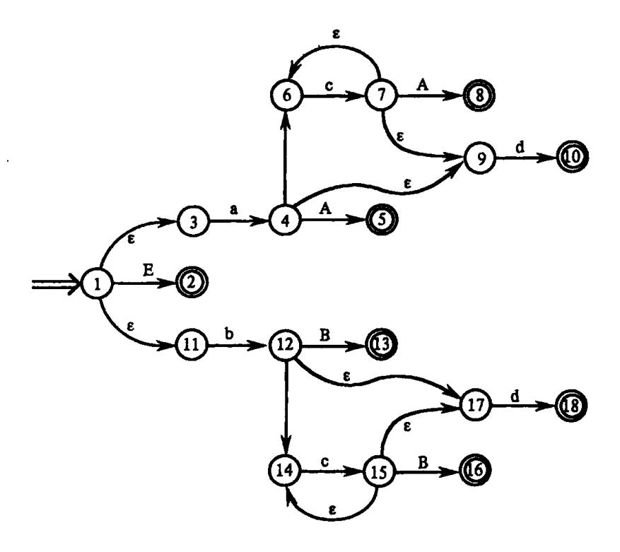

图 5.6 识别活前缀的 NFA

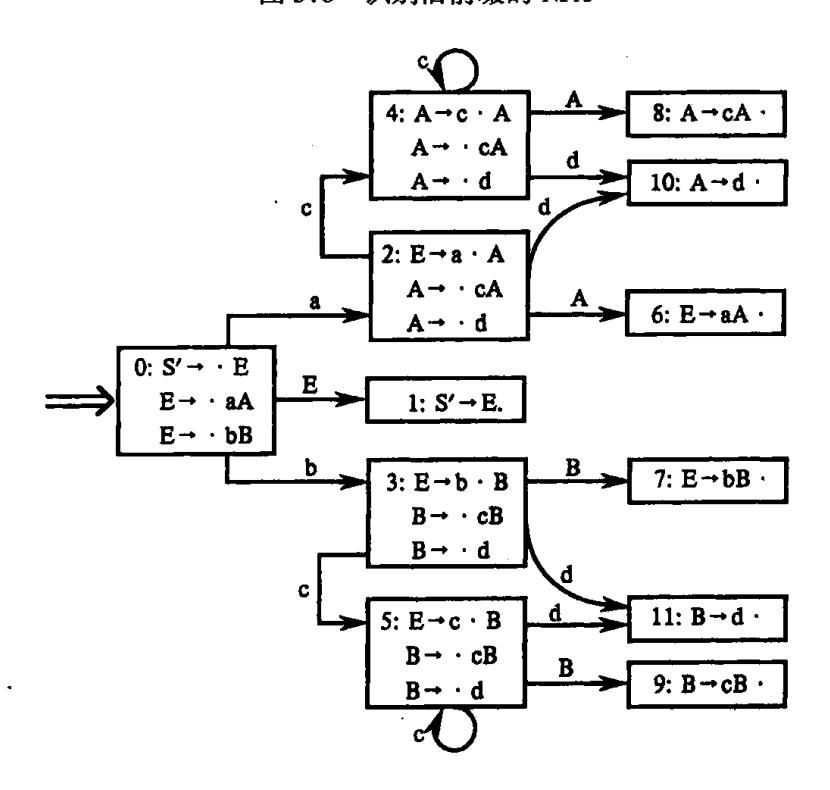

图 5.7 识别前缀的 DFA

符,称为"移进"项目。形如  $A \rightarrow \alpha \cdot B\beta$  的项目,其中 B 为非终结符,称为"待约"项目。例如图 5.7 状态  $6 \sim 11$  中所含的项目都是归约项目;状态 1 所含的项目为接受项目;其它状态均含移进和待约项目。

## LR(0)项目集规范族的构造

下面我们用第三章所引进的 ε - CLOSURE(闭包)的办法来构造一个文法 G 的 LR(0)

{24}------------------------------------------------

项目集规范族。

为了使"接受"状态易于识别,我们总把文法 G 进行拓广。假定文法 G 是一个以 S 为开始符号的文法,我们构造一个 G',它包含了整个 G,但它引进了一个不出现在 G 中的非终结符 S',并加进一个新产生式 S' $\rightarrow$ S,而这个 S'是 G'的开始符号。那么,我们称 G'是 G 的拓广文法。这样,便会有一个仅含项目 S' $\rightarrow$ S·的状态,这就是唯一的"接受"态。

假定 I 是文法 G'的任一项目集,定义和构造 I 的闭包 CLOSURE(I)的办法是:

- (1) I 的任何项目都属于 CLOSURE(I);
- (2) 若 A→α·Bβ 属于 CLOSURE(I),那么,对任何关于 B 的产生式 B→γ,项目 B→·γ 也属于 CLOSURE(I);
  - (3) 重复执行上述两步骤直至 CLOSURE(I)不再增大为止。
  - 例 5.9 对于文法(5.7),假若  $I = \{S' \rightarrow \cdot E\}$ ,那么,CLOSURE(I)所含的项目为:

 $S' \rightarrow \cdot E$ 

 $E \rightarrow aA$ 

E-**→** · bB

这就是图 5.7 状态 0 所代表的项目集。

在构造 CLOSURE(I)时,请注意一个重要的事实,那就是,对任何非终结符 B,若某个圆点在左边的项目 B $\rightarrow$ · $\gamma$ 进入到 CLOSURE(I),则 B 的所有其它圆点在左边的项目 B $\rightarrow$ · $\beta$  也将进入同一个 CLOSURE 集。因此,在某种情况下,并不需要真正列出 CLOSURE 集里的所有项目 B $\rightarrow$ · $\gamma$ ,而只须列出非终结符 B 就可以了。

函数 GO 是一个状态转换函数。GO(I,X)的第一个变元 I 是一个项目集,第二个变元 X 是一个文法符号。函数值 GO(I,X)定义为

GO(I,X) = CLOSURE(J)

其中

J={任何形如 A→αX·β的项目 | A→α·Xβ属于 I}。

直观上说,若 I 是对某个活前缀 γ 有效的项目集,那么,GO(I,X)便是对 γX 有效的项目集。

例如,令 I 是图 5.7 的项目集  $0:\{S'\rightarrow \cdot E, E\rightarrow \cdot aA, E\rightarrow \cdot bB\}$ ,那么,GO(I,a)就是该图中的项目集  $2:\{E\rightarrow a\cdot A, A\rightarrow \cdot cA, A\rightarrow \cdot d\}$ 。即,我们检查 I 中所有那些圆点之后紧跟着 a 的项目。0 中的第一项目  $S'\rightarrow \cdot E$  和第三项目  $E\rightarrow \cdot bB$  都不是这样的项目。第二项目  $E\rightarrow \cdot aA$  则是这样的项目。我们把这个项目的圆点向右移一位置,得到了项目  $E\rightarrow a\cdot A$ ,于是  $J=\{E\rightarrow a\cdot A\}$ 。然后再对这个 J 求其闭包 CLORURE(J)。

通过函数 CLOSURE 和 GO 很容易构造一个文法 G 的拓广文法 G'的 LR(0)项目集规范族。构造算法是:

PROCEDURE ITEMSETS(G');

**BEGIN** 

 $C: = \{CLOSURE(\{S' \rightarrow \cdot S\})\};$ 

REPEAT

FOR C 中的每个项目集 I 和 G'的每个符号 X DO IF GO(I,X)非空且不属于 C THEN 把 GO(I,X)放入 C 族中

UNTIL C 不再增大

{25}------------------------------------------------

**END** 

这个算法的工作结果 C 就是文法 G'的 LR(0)项目集规范族。

例如,文法(5.7)的 LR(0)项目集规范族就是如图 5.7 所示的 12 个集合。转换函数 GO 把这些集合联结成一张 DFA 转换图。

如果令集合 0 为 DFA 的初态,那么,图 5.7 的 DFA 就是恰好识别文法(5.7)的全部活前缀的有限自动机。

## 有效项目

我们希望从识别文法的活前缀的 DFA 建立 LR 分析器(带栈的确定有限状态自动机)。因此,需要研究这个 DFA 的每个项目集(状态)中的项目的不同作用。

我们说项目  $A \rightarrow \beta_1 \cdot \beta_2$  对活前缀  $\alpha\beta_1$  是**有效的**,其条件是存在规范推导  $S' \underset{R}{\overset{*}{\Rightarrow}} \alpha A \omega \underset{R}{\Rightarrow} \alpha \beta_1 \beta_2 \omega_0$ 。一般而言,同一项目可能对好几个活前缀都是有效的(当一个项目出现在好几个不同的集合中时便是这种情形)。若归约项目  $A \rightarrow \beta_1 \cdot$ 对活前缀  $\alpha\beta_1$  是有效的,则它告诉我们应把符号串  $\beta_1$  归约为 A,即把活前缀  $\alpha\beta_1$  变成  $\alpha A$ 。若移进项目  $A \rightarrow \beta_1 \cdot \beta_2$  对活前缀  $\alpha\beta_1$  是有效的,则它告诉我们,何柄尚未形成,因此,下一步动作应是移进。但是,可能存在这样的情形,对同一活前缀,存在若干项目对它都是有效的,而且告诉我们应做的事情各不相同,互相冲突。这种冲突通过向前多看几个输入符号,或许能够获得解决。我们在下一节将讨论这种情形,当然,对于非 LR 文法,这种冲突有些是绝对无法解决的,不论超前多看几个输入符号也无济于事。

对于每个活前级,我们可以构造它的有效项目集。实际上,一个活前级  $\gamma$  的有效项目集正是从上述的 DFA 的初态出发,经读出  $\gamma$  后而到达的那个项目集(状态)。换言之,在任何时候,分析栈中的活前级  $X_1X_2\cdots X_m$  的有效项目集正是栈顶状态  $S_m$  所代表的那个集合。这是 LR 分析理论的一条基本定理。实际上,栈顶的项目集(状态)体现了栈里的一切有用信息 – 历史。我们不打算对这个定理进行形式证明,而用例子来阐明这个结论。

考虑文法(5.6)及它的活前缀识别自动机,符号串 bc 是一个活前缀,这个 DFA(见图 5.7)在读出这个串后到达状态 5。状态 5 含有三个项目,它们是:

下面,我们要说明为什么这个项目集对 bc 是有效的。为了论证这一点,考虑下面三个规范推导:

- $(1) \quad S' \Rightarrow E$   $\Rightarrow bB$   $\Rightarrow bcB$   $(2) \quad S' \Rightarrow E$   $\Rightarrow bB$ 
  - ⇒bB ⇒bcB
  - ⇒bccB
- (3)  $S' \Rightarrow E$

{26}------------------------------------------------

 $\Rightarrow$ bB

 $\Rightarrow$ bcB

 $\Rightarrow$ bcd

第一个推导表明了 B→c•B 的有效性;第二个推导表明了 B→•cB 的有效性;第三个推导表明了 B→•d 的有效性。显然,对于活前缀 bc 不再存在别的有效项目了。

## LR(0)分析表的构造

假若一个文法 G 的拓广文法 G'的活前缀识别自动机中的每个状态(项目集)不存在下述情况:①既含移进项目又含归约项目;②或者含有多个归约项目,则称 G 是一个 LR (0)文法。换言之,LR(0)文法规范族的每个项目集不包含任何冲突项目。

对于 LR(0) 文法,我们可直接从它的项目集规范族 C 和活前缀识别自动机的状态转换函数 GO 构造出 LR 分析表。下面是构造 LR(0) 分析表的算法。

假定  $C = \{I_0, I_1, \dots, I_n\}$ 。前面,我们已习惯用数码表示状态,因此,令每个项目集  $I_k$  的下标 k 作为分析器的状态。特别是,令那个包含项目  $S' \rightarrow \cdot S$  的集合  $I_k$  的下标 k 为分析器的初态。分析表的 ACTION 子表和 GOTO 子表可按如下方法构造。

- (1) 若项目  $A \rightarrow \alpha \cdot a\beta$  属于  $I_k$  且  $GO(I_k, a) = I_j, a$  为终结符,则置 ACTION[k, a]为"把 (j,a)移进栈",简记为"s<sub>i</sub>"。
- (2) 若项目  $A \rightarrow \alpha \cdot$  属于  $I_k$ ,那么,对任何终结符 a(或结束符 # ),置 ACTION[k,a]为"用产生式  $A \rightarrow \alpha$  进行归约",简记为" $r_i$ "(假定产生式  $A \rightarrow \alpha$  是文法 G'的第 i个产生式)。
  - (3) 若项目 S'→S·属于 I, 则置 ACTION[k, #]为"接受", 简记为"acc"。
  - (4) 若 GO(I<sub>k</sub>,A) = I<sub>i</sub>,A 为非终结符,则置 GOTO[k,A] = j。
  - (5) 分析表中凡不能用规则 1 至 4 填入信息的空白格均置上"报错标志"。

由于假定 LR(0)文法规范族的每个项目集不含冲突项目,因此,按上法构造的分析表的每个人口都是唯一的(即,不含多重定义)。我们称如此构造的分析表是一张 LR(0)表(见表 5.4)。使用 LR(0)表的分析器叫做一个 LR(0)分析器。

| - <del></del> |    |    | ACTION     |            |     |          | COTO |   |
|---------------|----|----|------------|------------|-----|----------|------|---|
| <b>状态</b>     | a  | b  | c          | d          | #   | <b>E</b> | Α .  | В |
| 0             | s2 | s3 |            |            |     | 1        |      |   |
| 1             |    |    |            |            | acc | ·        |      |   |
| 2             |    |    | s4         | s10        |     |          | 6    |   |
| 3             |    |    | <b>s</b> 5 | s11        |     |          |      | 7 |
| 4             |    |    | s4         | s10        |     |          | 8    |   |
| 5             |    |    | s5         | sl1        |     |          |      | 9 |
| 6             | rl | r1 | r1         | r <b>l</b> | r1  |          |      |   |
| 7             | r2 | r2 | r2         | r2         | r2  |          |      |   |
| 8             | r3 | r3 | r3         | r3         | r3  |          |      |   |
| 9             | r5 | r5 | r5         | r5         | r5  |          | -    |   |
| 10            | r4 | r4 | r4         | r4         | r4  |          |      |   |
| 11            | r6 | т6 | r6         | т6         | r6  |          | _    |   |

表 5.4 LR(0)分析表

例 5.10 文法(5.7)就是一个 LR(0)文法。假定这个文法的各个产生式的编号为:

{27}------------------------------------------------

- (0) S'→E
- (1) E→aA
- (2) E→bB
- (3)  $A \rightarrow cA$
- (4) A→d
- (5)  $B \rightarrow cB$
- (6)  $B \rightarrow d$

那么,这个文法的 LR(0)分析表如表 5.4 所示。

## 5.3.3 SLR 分析表的构造

上面所说的 LR(0)文法是一类非常简单的文法。这种文法的活前缀识别自动机的每一个状态(项目集)都不含冲突性的项目。但是,即使是定义算术表达式这样的简单文法也不是 LR(0)的。因此,本节我们将要研究一种有点简单"展望"材料的 LR 分析法,即 SLR 法。

我们将看到,许多冲突性的动作都可能通过考察有关非终结符的 FOLLOW 集而获解决。例如,假定一个 LR(0)规范族中含有如下的一个项目集(状态)I:

$$I = \{X \rightarrow \alpha \cdot b\beta, A \rightarrow \alpha \cdot , B \rightarrow \alpha \cdot \}$$

其中,第一个项目是移进项目;第二、三项目是归约项目。这三个项目告诉我们应做的动作各不相同,互相冲突。第一个项目告诉我们应该把下一个输入符号 b(如果是 b)移进;第二个项目告诉我们应把栈顶的  $\alpha$ 归约为 A;第三个项目则说应把  $\alpha$ 归约为 B。解决冲突的一种简单办法是,分析所有含 A 或 B 的句型,考察句型中可能直接跟在 A 或 B 之后的终结符,也就是说,考察集合 FOLLOW(A) 和 FOLLOW(B)。如果这两个集合不相交,而且都不包含 b,那么,当状态 I 面临任何输入符号 a 时,我们就可以采取如下的"移进—归约"决策:

- (1) 若 a = b,则移进;
- (2) 若 a ∈ FOLLOW(A),则用产生式 A→α 进行归约;
- (3) 若 a ∈ FOLLOW(B),则用产生式 B→α 进行归约;
- (4) 此外,报错。
- 一般而言,假定 LR(0)规范族的一个项目集 I 中含有 m 个移进项目; $A_1 \rightarrow \alpha \cdot a_1 \beta_1$ , $A_2 \rightarrow \alpha \cdot a_2 \beta_2$ ,…, $A_m \rightarrow \alpha \cdot a_m \beta_m$ ;同时含有 n 个归约项目: $B_1 \rightarrow \alpha \cdot , B_2 \rightarrow \alpha \cdot , \dots , B_m \rightarrow \alpha \cdot ,$ 如果集合  $\{a_1, \dots, a_m\}$ ,FOLLOW( $B_1$ ),…,FOLLOW( $B_n$ ) 两两不相交(包括不得有两个 FOLLOW 集合有#),则隐含在 I 中的动作冲突可通过检查现行输入符号 a 属于上述 n + 1 个集合中的哪个集合而获得解决。这就是:
  - (1) 若 a 是某个 a;, i = 1,2,…, m,则移进;
  - (2) 若 a∈ FOLLOW(B<sub>i</sub>), i = 1,2,···,n,则用产生式 B<sub>i</sub>→α 进行归约;
  - (3) 此外,报错。

冲突性动作的这种解决办法叫做 SLR(1)解决办法。

{28}------------------------------------------------

(5.8)

例 5.11 考察下面的拓广文法:

(3) 
$$T \rightarrow T * F$$

(4) 
$$T \rightarrow F$$

$$(5) F \rightarrow (E)$$

这个文法的 LR(0)项目集规范族为:

$$I_{0}: \quad S' \rightarrow \cdot E$$

$$E \rightarrow \cdot E + T$$

$$E \rightarrow \cdot T$$

$$T \rightarrow \cdot T * F$$

$$T \rightarrow \cdot F$$

$$F \rightarrow \cdot (E)$$

$$F \rightarrow \cdot i$$

$$I_{1}: \quad S' \rightarrow E \cdot$$

$$E \rightarrow E \cdot + T$$

$$I_{2}: \quad E \rightarrow T \cdot$$

$$T \rightarrow T \cdot * F$$

$$I_{3}: \quad T \rightarrow F \cdot$$

$$I_{4}: \quad F \rightarrow \cdot (E)$$

$$E \rightarrow \cdot E + T$$

$$I_{10}: \quad T \rightarrow T * F \cdot$$

$$I_{10}: \quad T \rightarrow T * F \cdot$$

$$I_{11}: \quad F \rightarrow \cdot (E) \cdot$$

$$I_{12}: \quad F \rightarrow \cdot (E) \cdot$$

$$I_{13}: \quad T \rightarrow F \cdot$$

$$I_{14}: \quad F \rightarrow \cdot (E) \cdot$$

$$I_{15}: \quad T \rightarrow T * F \cdot$$

$$I_{16}: \quad T \rightarrow T * F \cdot$$

$$I_{17}: \quad T \rightarrow T * F \cdot$$

$$I_{18}: \quad T \rightarrow T * F \cdot$$

$$I_{19}: \quad T \rightarrow T * F \cdot$$

$$I_{19}: \quad T \rightarrow T * F \cdot$$

$$I_{19}: \quad T \rightarrow T * F \cdot$$

$$I_{19}: \quad T \rightarrow T * F \cdot$$

$$I_{19}: \quad T \rightarrow T * F \cdot$$

$$I_{19}: \quad T \rightarrow T * F \cdot$$

$$I_{19}: \quad T \rightarrow T * F \cdot$$

$$I_{19}: \quad T \rightarrow T * F \cdot$$

$$I_{19}: \quad T \rightarrow T * F \cdot$$

$$I_{19}: \quad T \rightarrow T * F \cdot$$

$$I_{19}: \quad T \rightarrow T * F \cdot$$

$$I_{19}: \quad T \rightarrow T * F \cdot$$

$$I_{19}: \quad T \rightarrow T * F \cdot$$

$$I_{19}: \quad T \rightarrow T * F \cdot$$

$$I_{19}: \quad T \rightarrow T * F \cdot$$

$$I_{19}: \quad T \rightarrow T * F \cdot$$

$$I_{19}: \quad T \rightarrow T * F \cdot$$

$$I_{19}: \quad T \rightarrow T * F \cdot$$

$$I_{19}: \quad T \rightarrow T * F \cdot$$

$$I_{19}: \quad T \rightarrow T * F \cdot$$

$$I_{19}: \quad T \rightarrow T * F \cdot$$

$$I_{19}: \quad T \rightarrow T * F \cdot$$

$$I_{19}: \quad T \rightarrow T * F \cdot$$

$$I_{19}: \quad T \rightarrow T * F \cdot$$

$$I_{19}: \quad T \rightarrow T * F \cdot$$

$$I_{19}: \quad T \rightarrow T * F \cdot$$

$$I_{19}: \quad T \rightarrow T * F \cdot$$

$$I_{19}: \quad T \rightarrow T * F \cdot$$

$$I_{19}: \quad T \rightarrow T * F \cdot$$

$$I_{19}: \quad T \rightarrow T * F \cdot$$

$$I_{19}: \quad T \rightarrow T * F \cdot$$

$$I_{19}: \quad T \rightarrow T * F \cdot$$

$$I_{19}: \quad T \rightarrow T * F \cdot$$

$$I_{19}: \quad T \rightarrow T * F \cdot$$

$$I_{19}: \quad T \rightarrow T * F \cdot$$

$$I_{19}: \quad T \rightarrow T * F \cdot$$

$$I_{19}: \quad T \rightarrow T * F \cdot$$

$$I_{19}: \quad T \rightarrow T * F \cdot$$

$$I_{19}: \quad T \rightarrow T * F \cdot$$

$$I_{19}: \quad T \rightarrow T * F \cdot$$

$$I_{19}: \quad T \rightarrow T * F \cdot$$

$$I_{19}: \quad T \rightarrow T * F \cdot$$

$$I_{19}: \quad T \rightarrow T * F \cdot$$

$$I_{19}: \quad T \rightarrow T * F \cdot$$

$$I_{19}: \quad T \rightarrow T * F \cdot$$

$$I_{19}: \quad T \rightarrow T * F \cdot$$

$$I_{19}: \quad T \rightarrow T * F \cdot$$

$$I_{19}: \quad T \rightarrow T * F \cdot$$

$$I_{19}: \quad T \rightarrow T * F \cdot$$

$$I_{19}: \quad T \rightarrow T * F \cdot$$

$$I_{19}: \quad T \rightarrow T * F \cdot$$

$$I_{19}: \quad T \rightarrow T * F \cdot$$

$$I_{19}: \quad T \rightarrow T * F \cdot$$

$$I_{19}: \quad T \rightarrow T * F \cdot$$

$$I_{19}: \quad T \rightarrow T * F \cdot$$

$$I_{19}: \quad T \rightarrow T * F \cdot$$

$$I_{19}: \quad T \rightarrow T * F \cdot$$

$$I_{19}: \quad T \rightarrow T * F \cdot$$

$$I_{19}: \quad T \rightarrow T * F \cdot$$

$$I_{19}: \quad T \rightarrow T * F \cdot$$

$$I_{19}: \quad T \rightarrow T * F \cdot$$

$$I_{19}: \quad T \rightarrow T * F \cdot$$

$$I_{19}: \quad T \rightarrow T * F \cdot$$

$$I_{19}: \quad T \rightarrow T * F \cdot$$

$$I_{19}: \quad T \rightarrow T * F \cdot$$

$$I_{19}: \quad T \rightarrow T * F \cdot$$

$$I_{19}: \quad T \rightarrow$$

关于这些项目集的转换函数 GO 表示成如图 5.8 所示的 DFA。这就是文法(5.8)的活前缀识别自动机。

注意,在这 12 个项目集中, $I_1$ 、 $I_2$  和  $I_3$  都含有"移进 – 归约"冲突。因为  $I_1$  中的  $S' \rightarrow E \cdot$  是"接受"项目,因此, $I_1$  中的冲突确切地说应是"移进 – 接受"冲突。不难看到,所有这些冲突都可以用 SLR(1)办法予以解决。例如,考虑  $I_2$ 

$$E \rightarrow T \cdot T \rightarrow T \cdot * F$$

由于  $FOLLOW(E) = \{\#, \}, + \}$ ,所以,当状态  $I_2$  面临输入符号为  $+ \$ 、)或 # 时,应使用产生式  $E \rightarrow T$  进行归约;当面临 \* 时,应实行移进;若面临其它符号则应报错。

对任给的一个文法 G, 我们可用如下的办法构造它的 SLR(1)分析表: 首先把 G 拓广

{29}------------------------------------------------

为 G',对 G'构造 LR(0)项目集规范族 C 和活前缀识别自动机的状态转换函数 GO。使用 C 和 GO,然后再按下面的算法构造 G'的 SLR 分析表。

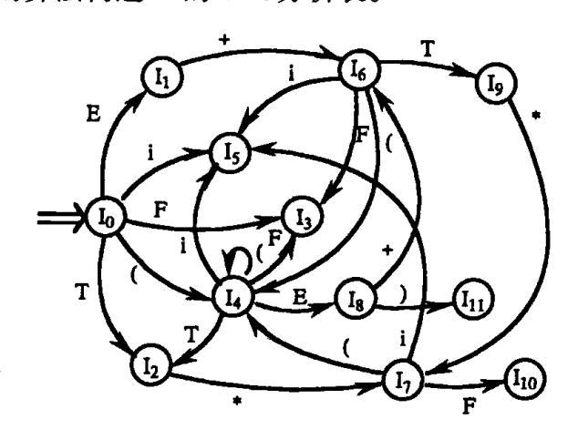

图 5.8 识别活前缀的自动机

假定  $C = \{I_0, I_1, \dots, I_n\}$ , 令每个项目集  $I_k$  的下标 k 为分析器的一个状态, 因此, G' 的 SLR 分析表含有状态  $0,1,\dots,n$ 。令那个含有项目  $S' \rightarrow \cdot S$  的  $I_k$  的下标为初态。函数 ACTION 和 GOTO 可按如下方法构造:

- (1) 若项目 A→· $\alpha$ a $\beta$ 属于  $I_k$ 且  $GO(I_k,a)=I_j,a$  为终结符,则置 ACTION[k,a]为"把状态 i 和符号 a 移进栈",简记为"si";
- (2) 若项目  $A \rightarrow \alpha$ ·属于  $I_k$ ,那么,对任何终结符  $a,a \in FOLLOW(A)$ ,置 ACTION[k,a]为 "用产生式  $A \rightarrow \alpha$  进行归约",简记为"rj";其中,假定  $A \rightarrow \alpha$  为文法 G'的第 j 个产生式;
  - (3) 若项目 S'→S·属于 I<sub>k</sub>,则置 ACTION[k, #]为"接受",简记为"acc";
  - (4) 若 GO(I<sub>k</sub>,A) = I<sub>i</sub>,A 为非终结符,则置 GOTO[k,A] = j;
  - (5) 分析表中凡不能用规则 1 至 4 填入信息的空白格均置上"出错标志"。

按上述算法构造的含有 ACTION 和 GOTO 两部分的分析表,如果每个人口不含多重定义,则称它为文法 G 的一张 SLR 表。具有 SLR 表的文法 G 称为一个 SLR(1)文法。数字 1 的意思是,在分析过程中顶多只要向前看一个符号。使用 SLR 表的分析器叫做一个 SLR 分析器。

若按上述算法构造的分析表存在多重定义的人口(即含有动作冲突),则说明文法 G不是 SLR(1)的。在这种情况下,不能用上述算法构造分析器。

例如,让我们构造文法(5.8)的 SLR 分析表。这个文法的规范族  $C = \{I_0, I_1, \cdots, I_{11}\}$ ,它的活前缀识别自动机见图 5.8。下面我们考虑项目集  $I_0$ :

$$S' \rightarrow \cdot E$$
  $T \rightarrow \cdot T * F$   
 $E \rightarrow \cdot E + T$   $T \rightarrow \cdot F$   
 $E \rightarrow \cdot T$   $F \rightarrow \cdot (E)$   
 $F \rightarrow \cdot I$ 

因项目  $F \rightarrow \cdot$  (E)属于  $I_0$ ,所以 ACTION[0,(] = s4;同理,项目  $F \rightarrow \cdot$  i 使 ACTION[0,i] = s5。 再考虑  $I_1$ :

$$S' \rightarrow E \cdot E \cdot + T$$

{30}------------------------------------------------

第一个项目产生 ACTION[1, #]="接受";第二个项目使 ACTION[1, +]=s6。 再考虑 l<sub>2</sub>:

$$E \rightarrow T$$

$$T \rightarrow T \cdot * F$$

因 FOLLOW(E) = { # , + , )},所以,第一个项目使得 ACTION[2, # ] = ACTION[2, + ] = ACTION[2,)] = "用 E→T 进行归约";第二个项目使 ACTION[2, \* ] = s7。

依此类推,我们可得文法(5.8)如图 5.5 所示的分析表。

每个 SLR(1) 文法都是无二义的,但也存在许多无二义文法不是 SLR(1)的。考虑如下文法:

- (1)  $S \rightarrow L = R$
- (2) S→R
- (3)  $L \rightarrow R$
- (4) L→i

这个文法的 LR(0)项目集规范族为:

$$I_{0} \colon S' \rightarrow \cdot S \qquad \qquad R \rightarrow \cdot L$$

$$S \rightarrow \cdot L = R \qquad \qquad L \rightarrow \cdot * R$$

$$S \rightarrow \cdot R \qquad \qquad L \rightarrow \cdot i$$

$$S \rightarrow \cdot * R \qquad \qquad I_{5} \colon \qquad L \rightarrow i \cdot$$

$$L \rightarrow \cdot i \qquad \qquad I_{6} \colon \qquad S \rightarrow L = \cdot R$$

$$R \rightarrow \cdot L \qquad \qquad R \rightarrow \cdot L$$

$$I_{1} \colon \qquad S' \rightarrow S \cdot \qquad \qquad L \rightarrow \cdot * R$$

$$I_{2} \colon \qquad S \rightarrow L \cdot = R \qquad \qquad L \rightarrow \cdot i$$

$$R \rightarrow L \cdot \qquad \qquad I_{7} \colon \qquad L \rightarrow * R \cdot$$

$$I_{3} \colon \qquad S \rightarrow R \cdot \qquad \qquad I_{8} \colon \qquad R \rightarrow L \cdot$$

$$I_{4} \colon \qquad L \rightarrow * \cdot R \qquad \qquad I_{9} \colon \qquad S \rightarrow L = R \cdot$$

识别这个文法活前级的 DFA 见图 5.9。

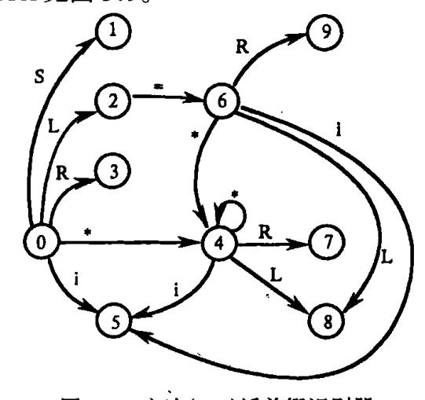

图 5.9 文法(5.9)活前缀识别器

{31}------------------------------------------------

考虑  $I_2$ ,第一个项目使 ACTION[2, = ]为 s6;第二个项目,由于 FOLLOW(R)含有 = (因有  $S \Rightarrow L = R \Rightarrow * R = R$ ),将使 ACTION[2, = ]为"用  $R \rightarrow L$  归约"。因此,状态 2 当面临输入符号 = 时,存在"移进 – 归约"冲突。

文法(5.9)是无二义的。产生这种冲突的原因在于,SLR 分析法未包含足够的"展望"信息,以便当状态 2 面临'='时能用展望信息来决定"移进"和"归约"的取舍。下面两节将讨论功能更强的 LR 分析表。应当记住,即使功能再强的 LR 分析表,仍然存在无二义文法不能消除其冲突的情况。但对现实的程序设计语言来说,我们可以回避使用这种文法。

## 5.3.4 规范 LR 分析表的构造

在 SLR 方法中,若项目集  $I_k$  含有  $A \rightarrow \alpha^{\bullet}$ ,那么,在状态 k 时,只要所面临的输入符号  $a \in FOLLOW(A)$ ,就确定采取"用  $A \rightarrow \alpha$  归约"的动作。但是,在某种情况下,当状态 k 呈现于栈顶时,栈里的符号串所构成的活前缀  $\beta \alpha$  未必允许把  $\alpha$  归约为 A,因为可能没有一个规范句型含有前缀  $\beta Aa$ 。因此,在这种情况下,用  $A \rightarrow \alpha$  进行归约未必有效。

例如,我们再次考虑文法(5.9)的项目集  $I_2$ ,当状态 2 呈现于栈顶且面临输入符号 = 时,由于这个文法不含以  $R = 为前缀的规范句型,因此不能用 <math>R \rightarrow L$  对栈顶的 L 进行归约。

可以设想让每个状态含有更多的"展望"信息,这些信息将有助于克服动作冲突和排除那种用  $A \rightarrow \alpha$  所进行的无效归约。我们可以设想,必要时,对状态进行分裂,使得 LR 分析器的每个状态能够确切地指出,当  $\alpha$  后跟哪些终结符时才容许把  $\alpha$  归约为 A。

我们需要重新定义项目,使得每个项目都附带有 k 个终结符。现在每个项目的一般形式是 $[A \rightharpoonup \alpha_k]$ ,此处, $A \rightharpoonup \alpha_1 \beta_2 \cdots \alpha_k$ , $a_1 a_2 \cdots a_k$ ],此处, $A \rightharpoonup \alpha_1 \beta_2 \cdots \alpha_k$ 称为它的向前**搜索符串**(或展望串)。向前搜索符串仅对归约项目 $[A \rightharpoonup \alpha_1 \alpha_2 \cdots \alpha_k]$ 有意义。对于任何移进或待约项目 $[A \rightharpoonup \alpha_1 \beta_2 \cdots \alpha_k]$ , $A \rightharpoonup \alpha_1 \beta_2 \cdots \beta_k$ , $A_1 a_2 \cdots a_k$ ], $A \rightharpoonup \alpha_1 \beta_2 \cdots \beta_k$ , $A_1 a_2 \cdots a_k$ ], $A \rightharpoonup \alpha_1 \beta_2 \cdots \beta_k$ , $A_1 a_2 \cdots A_k$ ], $A \rightharpoonup \alpha_1 \beta_2 \cdots \beta_k$ , $A_1 a_2 \cdots A_k$ ], $A \rightharpoonup \alpha_1 \beta_2 \cdots \beta_k$ , $A_1 a_2 \cdots A_k$ ], $A \rightharpoonup \alpha_1 \beta_2 \cdots \beta_k$ , $A \rightharpoonup \alpha_1 \beta_2 \cdots \beta_k$ , $A \rightharpoonup \alpha_1 \beta_2 \cdots \beta_k$ , $A \rightharpoonup \alpha_1 \beta_2 \cdots \beta_k$ , $A \rightharpoonup \alpha_1 \beta_2 \cdots \beta_k$ , $A \rightharpoonup \alpha_1 \beta_2 \cdots \beta_k$ , $A \rightharpoonup \alpha_1 \beta_2 \cdots \beta_k$ , $A \rightharpoonup \alpha_1 \beta_2 \cdots \alpha_k$ , $A \rightharpoonup \alpha_1 \beta_2 \cdots \alpha_k$ , $A \rightharpoonup \alpha_1 \beta_2 \cdots \alpha_k$ , $A \rightharpoonup \alpha_1 \beta_2 \cdots \alpha_k$ , $A \rightharpoonup \alpha_1 \beta_2 \cdots \alpha_k$ , $A \rightharpoonup \alpha_1 \beta_2 \cdots \alpha_k$ , $A \rightharpoonup \alpha_1 \beta_2 \cdots \alpha_k$ , $A \rightharpoonup \alpha_1 \beta_2 \cdots \alpha_k$ , $A \rightharpoonup \alpha_1 \beta_2 \cdots \alpha_k$ , $A \rightharpoonup \alpha_1 \beta_2 \cdots \alpha_k$ , $A \rightharpoonup \alpha_1 \beta_2 \cdots \alpha_k$ , $A \rightharpoonup \alpha_2 \cdots \alpha_k$ , $A \rightharpoonup \alpha_1 \beta_2 \cdots \alpha_k$ , $A \rightharpoonup \alpha_2 \cdots \alpha_k$ , $A \rightharpoonup \alpha_1 \beta_2 \cdots \alpha_k$ , $A \rightharpoonup \alpha_2 \cdots \alpha_k$ , $A \rightharpoonup \alpha_1 \beta_2 \cdots \alpha_k$ , $A \rightharpoonup \alpha_2 \cdots \alpha_k$ , $A \rightharpoonup \alpha_1 \beta_2 \cdots \alpha_k$ , $A \rightharpoonup \alpha_2 \cdots \alpha_k$ , $A \rightharpoonup \alpha_1 \beta_2 \cdots \alpha_k$ , $A \rightharpoonup \alpha_2 \cdots \alpha_k$ , $A \rightharpoonup \alpha_1 \beta_2 \cdots \alpha_k$ , $A \rightharpoonup \alpha_2 \cdots \alpha_k$ , $A \rightharpoonup \alpha_1 \beta_2 \cdots \alpha_k$ , $A \rightharpoonup \alpha_2 \cdots \alpha_k$ , $A \rightharpoonup \alpha_1 \beta_2 \cdots \alpha_k$ , $A \rightharpoonup \alpha_2 \cdots \alpha_k$ , $A \rightharpoonup \alpha_1 \beta_2 \cdots \alpha_k$ , $A \rightharpoonup \alpha_2 \cdots \alpha_k$ , $A \rightharpoonup \alpha_1 \beta_2 \cdots \alpha_k$ , $A \rightharpoonup \alpha_2 \cdots \alpha_k$ , $A \rightharpoonup \alpha_1 \beta_2 \cdots \alpha_k$ , $A \rightharpoonup \alpha_2 \cdots \alpha_k$ , $A \rightharpoonup \alpha_1 \beta_2 \cdots \alpha_k$ , $A \rightharpoonup \alpha_1 \beta_2 \cdots \alpha_k$ , $A \rightharpoonup \alpha_2 \cdots \alpha_k$ , $A \rightharpoonup \alpha_1 \beta_2 \cdots \alpha_k$ , $A \rightharpoonup \alpha_2 \cdots \alpha_k$ , $A \rightharpoonup \alpha_2 \cdots \alpha_k$ , $A \rightharpoonup \alpha_1 \beta_2 \cdots \alpha_k$ ,

形式上我们说一个 LR(1)项目 $[A \rightarrow \alpha \cdot \beta, a]$ 对于活前缀  $\gamma$  是**有效的**,如果存在规范推导

$$S \stackrel{*}{\underset{R}{\Rightarrow}} \delta A \omega \Longrightarrow \delta \alpha \beta \omega$$

其中,① $\gamma = \delta\alpha$ ;②a 是 ω 的第一个符号,或者 a 为 # 而 ω 为 ε<sub>ο</sub>

$$B \rightarrow aB \mid b$$
 (5.10)

它有一个规范推导  $S \underset{R}{\overset{*}{\Rightarrow}} aaaBab$   $\underset{R}{\Rightarrow} aaaBab$ ,我们看到,项目 $[B \rightarrow a \cdot B, a]$ 对于活前缀  $\gamma = aaa$  是有效的。按上面的定义,只须令  $\delta = aa \cdot A = B \cdot \omega = ab \cdot \alpha = a$  和  $\beta = B$  即可。

这个文法的另一个规范推导是  $S \underset{R}{\overset{*}{\Rightarrow}} BaB \underset{R}{\Rightarrow} BaaB$ 。我们看到项目[ $B \rightarrow a \cdot B$ , #]对于活前缀 Baa 是有效的。

构造有效的 LR(1)项目集族的办法本质上和构造 LR(0)项目集规范族的办法是一样

{32}------------------------------------------------

的。类似地,我们也需要两个函数 CLOSURE 和 GO。

假定 I 是一个项目集,它的闭包 CLOSURE(I)可按如下方式构造:

- (1) I 的任何项目都属于 CLOSURE(I);
- (2) 若项目[ $A \rightarrow \alpha \cdot B\beta$ , a]属于 CLOSURE(I),  $B \rightarrow \xi$  是一个产生式,那么,对于 FIRST (βa)中的每个终结符 b,如果[ $B \rightarrow \cdot \xi$ , b]原来不在 CLOSURE(I)中,则把它加进去;
  - (3) 重复执行步骤(2),直至 CLOSURE(I)不再增大为止。

因为,  $[A \rightarrow \alpha \cdot B\beta, a]$ 属于对活前缀  $\gamma = \delta \alpha$  有效的项目集意味着存在一个规范推导

$$S \stackrel{\star}{\underset{R}{\Longrightarrow}} \delta Aa\chi \underset{R}{\Longrightarrow} \delta \alpha B \beta a\chi$$

因此,若 βaχ 可推导出 bω,则对于每个形如 B→ξ 的产生式,我们有 S  $_R^*$  γBbω  $_R^*$  γEbω,也就是说,[B→·ξ, b]对 γ 也是有效的。注意,b 可能是从 β 推出的第一个符号,或者,若 β 推出 ε,则 b 就是 a,把这两种可能性结合在一起,我们说 b∈ FIRST(βa)。

令 I 是一个项目集, X 是一个文法符号, 函数 GO(I,X) 定义为 GO(I,X) = CLOSURE(J)

其中

 $J = \{ 任何形如[A→αX·β, a]$ 的项目  $I[A→α·Xβ, a] ∈ I \}$ 

关于文法 G'的 LR(1)项目集族 C 的构造算法是:

BEGIN

 $C: = \{CLOSURE(\{[S' \rightarrow \cdot S, \#]\})\};$ 

REPEAT

FOR C中的每个项目集 I 和 G'的每个符号 X DO IF GO(I,X)非空且不属于 C,THEN 把 GO(I,X)加入 C 中

**END** 

例 5.13 (5.10)的拓广文法

UNTIL C 不再增大

(0)S'→S

(2)B→aB

 $(1)S \rightarrow BB$ 

(3)B→b

的 LR(1)的项目集 C 和函数 GO 可表示成如图 5.10 的有限自动机。

图 5.10 中形如[ $A \rightarrow \alpha \cdot \beta$ , a/b]的项目表示[ $A \rightarrow \alpha \cdot \beta$ , a]和 [ $A \rightarrow \alpha \cdot \beta$ , b]两项目的缩写。

注意  $I_3$  与  $I_6$ 、 $I_4$  与  $I_7$ 、 $I_8$  与  $I_9$  除了向前搜索不同之外,它们的核心部分都是两两相同的。当我们为这个文法构造 LR(0)项目集族时,它们是合二为一的。只是,由于现在加上了搜索符被一分为二了。

现在来讨论从文法的 LR(1)项目集族 C 构造分析表的算法。

假定  $C = \{I_0, I_1, \dots, I_n\}$ , 令每个  $I_k$  的下标 k 为分析表的状态。令那个含有  $[S' \rightarrow \cdot S]$ , # ]的  $I_k$  的 k 为分析器的初态。动作 ACTION 和状态转换 GOTO 可构造如下:

- (1) 若项目 $[A \rightarrow \alpha \cdot a\beta, b]$ 属于  $I_k$ 且  $GO(I_k, a) = I_j, a$  为终结符,则置 ACTION[k, a]为 "把状态 i 和符号 a 移进栈",简记为"sj"。
- (2) 若项目 $[A\rightarrow\alpha\cdot,a]$ 属于  $I_k$ ,则置 ACTION[k,a]为"用产生式  $A\rightarrow\alpha$  归约",简记为"ri";其中假定  $A\rightarrow\alpha$  为文法 G'的第 j 个产生式。

{33}------------------------------------------------

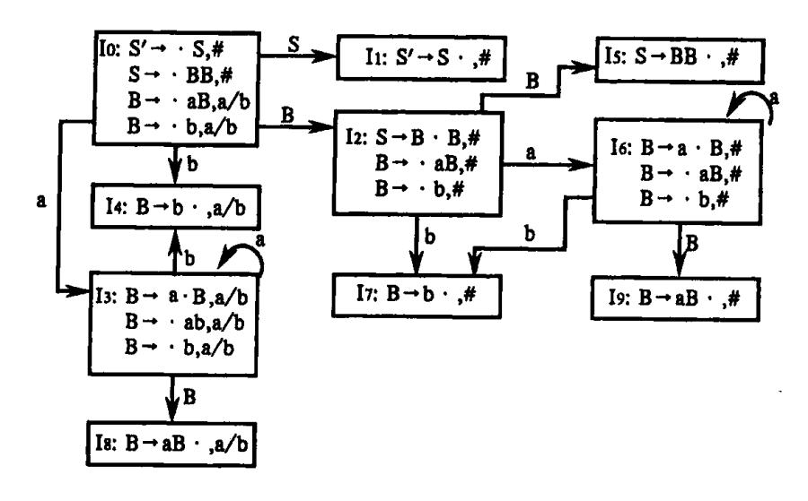

图 5.10 LR(1)项目集和 GO 函数

- (3) 若项目[S'→S·, #]属于 I<sub>k</sub>,则置 ACTION[k, #]为"接受",简记为"acc"。
- (4) 若  $GO(I_k, A) = I_i$ ,则置 GOTO[k, A] = j。
- (5) 分析表中凡不能用规则 1 至 4 填入信息的空白栏均填上"出错标志"。

按上述算法构造的分析表,若不存在多重定义的人口(即,动作冲突)的情形,则称它是文法 G 的一张规范的 LR(1)分析表。使用这种分析表的分析器叫做一个规范的 LR 分析器。具有规范的 LR(1)分析表的文法称为一个 LR(1)文法。

例如,文法(5.10)的规范的 LR(1)分析表如表 5.5 所示。

每个 SLR(1) 文法都是 LR(1) 文法。一个 SLR(1) 文法规范的 LR 分析器比其 SLR 分析器含有更多的状态。文法(5.10) 也是一个 SLR(1) 文法,它的 SLR 分析器只含七个状态,然而,它的规范 LR 分析器却含有 10 个状态。

| 7.3.3 %/ε Lit γ // / χ |    |            |      |   |   |  |  |  |
|------------------------|----|------------|------|---|---|--|--|--|
|                        |    | ACTION     | GOTO |   |   |  |  |  |
| 状 态<br>                | a  | b          | #    | s | В |  |  |  |
| 0                      | s3 | s <b>4</b> |      | 1 | 2 |  |  |  |
| 1                      |    |            | acc  |   |   |  |  |  |
| 2                      | s6 | s7         |      |   | 5 |  |  |  |
| 3                      | s3 | s4         |      |   | 8 |  |  |  |
| 4                      | r3 | r3         |      |   |   |  |  |  |
| 5                      |    |            | r1   |   |   |  |  |  |
| 6                      | s6 | s7         |      |   | 9 |  |  |  |
| 7                      |    |            | r3   |   |   |  |  |  |
| 8                      | r2 | r2         |      |   |   |  |  |  |
| 9                      |    |            | r2   |   |   |  |  |  |

表 5.5 规范 LR 分析表

{34}------------------------------------------------

## 5.3.5 LALR 分析表的构造

现在来讨论构造分析表的 LALR 方法。这本质上是一种折衷方法。LALR 分析表比规范 LR 分析表要小得多,能力也差一点,但它却能对付一些 SLR 所不能对付的情形。例如,文法(5.9)的情形。

对于同一个文法,LALR 分析表和 SLR 分析表永远具有相同数目的状态。对于 AL-GOL 一类语言来说,一般要用几百个状态,但若用规范 LR 分析表,同一类语言,却要用几千个状态。因此,用 SLR 或 LALR 要经济得多。

我们再次考虑文法(5.10),它们的 LR(1)项目集见图 5.10。注意,其中  $I_3$  与  $I_6$ 、 $I_4$  与  $I_7$ 、 $I_8$  与  $I_9$ ,除了搜索符不同之外是两两相同的。我们来看一看这些貌似相同的项目集的不同作用。例如,考虑  $I_4$  和  $I_7$ ,这两个集合分别仅含有  $[B \rightarrow b^{\bullet}, a/b]$  和  $[B \rightarrow b^{\bullet}, \#]$ 。注意,文法(5.10)所产生的语言是正规集  $a^*$  ba\* b。假定规范 LR 分析器所面临的输入串为 aa···abaa···b #,分析器把第一组 a 和第一个 b 移进栈后将进入状态 4。如果后续的输入符号为 a 或 b,则此时分析器将使用产生式  $B \rightarrow b$  把栈顶的 b 归约为 B。状态 4 的作用在于,若输入串的第一个 b 之后不是 a 或 b 而是 #,则它能及时指出发现了错误。当分析器 读进输入串的第二个 b 之后进入状态 7,当状态 7 看到句末符 # 时将用产生式  $B \rightarrow b$  归约 栈顶的 B。若状态 7 看不到 #,将立即报告错误。

现在我们把状态 4 和状态 7 合二为一,变成  $L_{47}$ ,它仅含有项目  $[B \rightarrow b^{\bullet}, a/b^{\mu}]$ 。把从  $L_{6}$ 、 $L_{5}$  和  $L_{6}$  导入到  $L_{4}$  或  $L_{7}$  的  $L_{7}$  的  $L_{47}$  。状态  $L_{47}$  的作用是,不论面临的输入符号为  $L_{47}$  。从或  $L_{47}$  ,都用  $L_{47}$  。注意,状态  $L_{47}$  无法及时发现输入串中所含的错误。所幸的是,在输入下一个符号之前错误仍将被查找出来。

现在,把上述思想进一步一般化。我们称两个 LR(1)项目集具有相同的心,如果除去搜索符之后,这两个集合是相同的。我们将试图把所有同心的 LR(1)项目集合并为一。我们还将看到一个心就是一个 LR(0)项目集。

由于 GO(I,X)的心仅仅依赖于 I 的心,因此,LR(1)项目集合并后的转换函数 GO 可通过 GO(I,X)自身的合并而得到。即,在合并项目集时用不着同时考虑修改转换函数的问题。动作 ACTION 应进行修改,使得能够反映各被合并的集合的既定动作。

假定有一个 LR(1)文法,即,它的 LR(1)项目集不存在动作冲突,如果我们把同心集合并为一,就可能导致存在冲突。但是这种冲突不会是"移进 – 归约"冲突。因为,如存在这种冲突,则意味着,面对当前的输入符号 a,有一个项目  $[A \rightarrow \alpha \cdot, a]$  要求采取归约动作,同时又有另一项目  $[B \rightarrow \beta \cdot a \gamma, b]$  要求把 a 移进。这两个项目既然同处在合并之后的一个集合中,则意味着,在合并前,必有某个 c 使得  $[A \rightarrow \alpha \cdot, a]$  和  $[B \rightarrow \beta \cdot a \gamma, b]$  同处于(合并前的)某一集合中。然而,这一点又意味着,原来的 LR(1)项目集就已存在着"移进 – 归约"冲突。故同假设不符。因此,同心集的合并不会产生新的"移进 – 归约"冲突。

但是,同心集的合并有可能产生新的"归约 - 归约"冲突。例如,考虑文法

- $(0) S' \rightarrow S$
- (1) S→aAd|bBd|aBe|bAe
- $(2) A \rightarrow c$
- $(3) B \rightarrow c$

{35}------------------------------------------------

这个文法只产生四个符号串:acd、bcd、ace 和 bce。如果我们构造这个文法的 LR(1)项目集族,那么,将发现不会存在冲突性动作。因而它是一个 LR(1)文法。在它的集族中,对活前缀 ac 有效的项目集为 $\{[A\rightarrow c\cdot,d],[B\rightarrow c\cdot,e]\}$ ,对 bc 有效的项目集为 $\{[A\rightarrow c\cdot,e],[B\rightarrow c\cdot,d]\}$ 。这两个集合都不含冲突,它们是同心的。一经合并就变成: $\{[A\rightarrow c\cdot,d/e],[B\rightarrow c\cdot,d/e]\}$ 。显然,这是一个含有"归约-归约"冲突的集合。因为,当面临 e 或 d 时,我们不知道该用  $A\rightarrow c$  还是用  $B\rightarrow c$  进行归约。

下面,我们将给出构造 LALR 分析表的第一个算法。基本思想是,首先构造 LR(1)项目集族,如果它不存在冲突,就把同心集合并在一起。若合并后的集族不存在归约 – 归约冲突,就按这个集族构造分析表。这个算法的主要步骤是:

- 1. 构造文法 G 的 LR(1)项目集族  $C = \{I_0, I_1, \dots, I_n\}$ 。
- 2. 把所有的同心集合并在一起,记  $C' = \{J_0, J_1, \dots, J_m\}$  为合并后的新族。那个含有项目 $[S' \rightarrow \cdot S, \#]$ 的  $J_k$  为分析表的初态。
  - 3. 从 C'构造 ACTION 表:
  - (1) 若 $[A \rightarrow \alpha \cdot a\beta, b] \in I_k$ 且 GO $(J_k, a) = J_i, a$  为终结符,则置 ACTION[k, a]为"sj"。
- (2) 若 $[A \rightarrow \alpha \cdot, a] \in J_k$ ,则置 ACTION[k, a]为"使用 A $\rightarrow \alpha$  归约",简记为"rj";其中假定 A $\rightarrow \alpha$  为文法 G'的第 i 个产生式。
  - (3) 若[S'→S·, #]∈J<sub>k</sub>,则置 ACTION[k, #]为"接受",简记为"acc"。
- 4. GOTO 表的构造:假定  $J_k$  是  $I_{i1}$ ,  $I_{i2}$ , …,  $I_{it}$ 合并后的新集。由于所有这些  $I_i$  同心,因此,  $GO(I_{i1}, X)$ ,  $GO(I_{i2}, X)$ , …,  $GO(I_{it}, X)$ 也具同心。记  $J_i$  为所有这些 GO 合并后的集。那么,就有  $GO(J_k, X) = J_i$ 。于是,若  $GO(J_k, A) = J_i$ ,则置 GOTO[k, A] = j。
  - 5. 分析表中凡不能用 3、4 填入信息的空白格均填上"出错标志"。

经上述步骤构造的分析表若不存在冲突,则称它为文法 G 的 LALR 分析表。存在这种分析表的文法称为一个 LALR(1)文法。

这个算法的思想虽然简单明确,但实现起来甚费时间和空间。

现在我们再来看一看文法(5.10)的 LR(1)集(见图 5.10)是如何合并的。首先把 3,6,4,7 和 8,9 分别合并成:

由合并后的集族所构成的 LALR 分析表如表 5.6 所列。现在我们来看看转换函数 GO 是如何计算的。例如,考虑  $GO(I_{36},B)$ 。在原来的 LR(1)项目集族中, $GO(I_{3},B)=I_{8}$ ,而  $I_{8}$  现在是  $I_{89}$ 的一部分,因此,置  $GO(I_{38},B)=I_{89}$ 。又例如, $GO(I_{2},a)$ ,它指出了在面对 a 执行了  $I_{2}$  所规定的移进动作之后的转移方向。这个  $GO(I_{2},a)$  出现在 ACTION 表中。原来的  $GO(I_{2},a)=I_{6}$ ,因  $I_{6}$  是  $I_{36}$ 的一部分,所以现在的  $GO(I_{2},a)=I_{36}$ 。因此,在分析表中,状态 2 面对 a 的人口填为"s36",这意味着,移进 a,再把状态 36 置于栈顶。

{36}------------------------------------------------

| 状 态   |     | ACTION |     |   | СОТО |  |  |
|-------|-----|--------|-----|---|------|--|--|
| W 165 | а   | ь      | #   | S | В    |  |  |
| 0     | s36 | s47    |     | 1 | 2    |  |  |
| 1     |     |        | acc |   |      |  |  |
| 2     | s36 | s47    |     |   | 5    |  |  |
| 36    | s36 | s47    |     |   | 89   |  |  |
| 47    | r3  | r3     | r3  |   |      |  |  |
| 5     |     |        | r1  |   |      |  |  |
| 89    | r2  | r2     | r2  |   |      |  |  |

表 5.6 LALR 分析表

当输入串为 a\* ba\* b 时,不论是表 5.5 的 LR 分析器还是表 5.6 的 LALR 分析器,都给出了同样的移进 – 归约序列。其差别只是状态名不同而已。对于正确的输入串,LR 和 LALR 分析器始终形影相随。

但是,当输入串有错误时,LALR 可能比 LR 多做些不必要的归约,但 LALR 决不会比 LR 移进更多的符号。即,就准确地指出输入串的出错位置这一点而言,LALR 和 LR 是等效的。例如,若输入串为 aab #,则表 5.5 的 LR 分析器把(此处我们把状态栈和符号栈的内容合写在一起)

推进栈后于状态 4 报告错误,因为在表 5.5 中,状态 4 面临 # 的动作为"出错标志"。然而,对于这同一个输入串,表 5.6 的 LALR 分析器将通过相应的动作,把

推进栈。但状态 47 面临 # 意味着"用 B→b 归约"。因此, LALR 分析器将把栈的内容改为

而状态 89 面临 # 的动作是"用 B→aB 归约",因而栈的内容变为

再经一次归约后,栈的内容变成

这个状态 2 在面临 # 时将给出错误报告。这说明 LALR 在 LR 已发现错误之后,还继续执行一些多余的归约,但决不会执行新的移进。

下面介绍 LALR 项目集构造的另一算法。

对任何文法 G,通过构造它的 LR(1)项目集,合并同心集,最后形成 LALR(1)项目集,这是一个简单明确的算法,但太费存储空间。因为,LR(1)项目集族比 LR(0)项目集族要大得多。我们希望用和构造 LR(0)集族相当的空间构造 LALR(1)集族。

请注意一个非常重要的事实,至今我们所讨论的各种项目集都是以一定项目为核的闭包。如果我们用核代替闭包,则不论哪一种项目集都将大大地缩小它所需要的存储空间。

任何项目集的核是由此集中所有那些圆点不在最左端的项目组成的。唯一例外的是,初态项目集的核含有(而且只含有)项目 $[S' \rightarrow \cdot S, \#]$ 。

{37}------------------------------------------------

我们必需表明仅仅使用核也能有效地(快速地)构造出分析表。首先,看一看如何从核构造 ACTION 表。令 I 是一个项目集,K 是它的核。我们知道,如果 ACTION[I, a]为"用 A→α归约"。那么,若  $\alpha \neq \epsilon$ ,则项目 A→α·必属于 I 的核。若  $\alpha = \epsilon$ ,意味着在 K 中必有某个项目[B→β·Cγ,b],其中 C  $\stackrel{*}{\nearrow}$  Aδ,且  $\alpha \in FIRST(\delta \gamma B)$ 。但是,对任何 C,满足 C  $\stackrel{*}{\nearrow}$  Aδ 的所有非终结符 A 是可以预先计算出来的。其次,如果 ACTION[I, a]为"移进"。则这意味着 K 中有某个项目[A→α·Bρ,b],其中 B  $\stackrel{*}{\nearrow}$  aω,且这个推导的最后一步不使用  $\epsilon$  — 产生式。但是对每个 B 满足 B  $\stackrel{*}{\rightarrow}$  aω 的所有终结符 a 也是可以预先计算出来的。

现在我们来看一看如何通过核构造 GOTO 表。假若 GO(I,X) = J,I 的核为 K,J 的核为 L。显然,若[A→ $\alpha$ ·X $\rho$ , a]  $\in$  K,则[A→ $\alpha$ X· $\rho$ , a]  $\in$  J。类似地,如果有某个[B→ $\beta$ ·C $\gamma$ , b]  $\in$  K 且 C  $\underset{R}{\overset{*}{\Rightarrow}}$  A $\delta$  和 a $\in$  FIRST( $\delta\gamma$ b),而 A→X $\rho$  是一个产生式,则[A→X· $\rho$ , a]  $\in$  L。

如果对每对非终结符 C 和 A 都预先计算出它们是否有关系  $C \underset{R}{\overset{*}{\Rightarrow}} A\delta($ 对一定的  $\delta)$ ,那么,从核构造分析表比从闭包构造分析表仅仅是效率上稍差一点而已。

现在我们着手为每个 LR(0)集核的每个项目都配上一个搜索符集,使得这个核成为一个 LALR(1)集的核。我们首先要研究搜索符是如何从一个集合 I 传播到另一个集合 CO(I,X)的。

假定 B→β·Cγ属于 LR(0)集 I 的核 K,C  $\stackrel{*}{\Rightarrow}$  Aδ(可能 C = A 而 δ = ε),而且 A→Xρ 是一个产生式,那么,显然,A→X·ρ属于 GO(I,X)的核。如果所考虑的项目集 I 是 LR(1)集而不是 LR(0)集。假定[B→β·Cγ, b]属于 LR(1)集 I 的核 K,那么,GO(I,X)核中[A→X·ρ, a]里的搜索符 a 是什么呢? 这个 a 的产生有两种可能的途径,其一,由 C  $\stackrel{*}{\Rightarrow}$  Aδ,若 a ∈ FIRST(δγ),则这个 a 和 b 不相干。在这种情况下,我们说 GO(I,X)核中的 A→X·ρ的搜索符 a 是自生的。其二,若 δγ  $\stackrel{*}{\Rightarrow}$  ε,则这个 a 就是 b。在这种情况下,我们说:I 的核 K 中的B→β·Cγ把它自己的搜索符 b 传播给 GO(I,X)核中的 A→X·ρ。我们有一个简单的算法,它将指出 I 的核 K 中的 LR(1)项目何时把自己的搜索符传播到 GO(I,X)。

假定 I 是一个 LR(0) 集,K 是它的核。 X 是一个文法符号。对于 GO(I,X) 核中的每个项目  $A \rightarrow \alpha X \cdot \rho$ ,我们要构造它自生的所有搜索符;同时指出,K 中有哪些项目将把它们自己的搜索符传播给 GO(I,X)。这个算法(其中 ④ 是一个假搜索符,它用来指示何时出现传播的情形)如下:

PROCEDURE SPONSOR(I,X); /\* I 是一个 LR(0)集,X 是一个文法符号。 实际上我们并不需要项目集 I 而只需要它的核 K\*/ FOR I 的核中的每个项目 B→γ·δ DO BEGIN

J: = CLOSURE( | [B→γ·δ, #] | );

/\* 采用对 LR(1)项目集的求闭包法 \*/

IF [A→α·Xρ, a]∈J但 a不等于 #

THEN GO(I,X)核中的 A→α·Xρ, a的搜索符 a是自生的;

IF [A→α·Xρ, #]∈J

{38}------------------------------------------------

THEN GO(I, X)核中的 A → $\alpha$ · X $\rho$  的搜索符 ④ 是从 K 中的 B→ $\gamma$ ·  $\delta$  传播过来的

**END** 

如何让所有 LR(0)(集)核的每个项目都具作为一个 LALR(1)项目所应具有的全部搜索符呢? 首先,我们知道,LR(0)初态集核的唯一项目  $S' \rightarrow \cdot S$  应具有搜索符 # 。用上述算法,我们可以为每个核的所有项目列出其全部自生搜索符。然后,让这些自生搜索符进行传播,直到不可能再传播为止。有好几种不同的处理传播的技术。在某种意义下,这些不同技术都采取某种方法跟踪"新"的搜索符,它们已到达某一项目集,但尚未向外传播。例如,可以用一个三元式栈来实现这种跟踪。这三个元是:①项目集 I;②I 的核中一个项目  $A \rightarrow \alpha \cdot \rho$ ;③ $A \rightarrow \alpha \cdot \rho$  在 I 中的一个搜索符 a,对于 a,不论什么 X,它尚未允许传播到任何 GO(I,X)。在下面的算法中将具体地运用这个思想。

对于任何一个含有产生式 S'→S 的拓广文法 G,可用下面的办法构造它的 LALR(1) 项目(核)族。

- 1. 构造 G 的所有 LR(0)集的核。
- 2. 使用算法 SPONSOR,对于每个 LR(0)集 I 的核 K 和每个文法符号 X,确定出 GO(I, X)核中每个项目所有自生的搜索符,并确定 GO(I,X)中哪些项目将接收到从 K 中传播过来的搜索符。
- 3. 传播每个核的自生搜索符,直到无法再传播为止。我们使用一个可容三元式  $(I,A\rightarrow\alpha\cdot\rho,a)$ 的栈 STACK,其中 I 是  $(H,A\rightarrow\alpha\cdot\rho,a)$ 的栈 STACK,其中 I 是  $(H,A\rightarrow\alpha\cdot\rho,a)$  是 I 核里的一个 项目; I 是一个终结符,使得 I I I I I I I I I I

下面的 LALR(1)项目集(核)的构造算法(简称"造核算法")将为每个 LR(0)集 I 的核中每个项目  $A \rightarrow \alpha \cdot \rho$  构造一个搜索符集,使得该项目配上这个搜索符集后便是那个以 I 为心的 LALR(1)项目集中的一个项目。

#### BEGIN

- (1) FOR 任何 I, A→α·ρ和 a DO ON[I, A→α·ρ, a]: = FALSE;
- (2) STACK: = 空;
- (3) INSERT( $I_0, S' \rightarrow \cdot S, \#$ );
- (4) FOR 每个 I, A→α·ρ 和 a, a 是 I 中的 A→α·ρ 的一个自生搜索符 DO
- (5) INSERT(I,  $A \rightarrow \alpha \cdot \rho, a$ );
- (6) WHILE STACK 非空 DO BEGIN
- (7) 移去 STACK 栈顶的(I, B→γ·δ, a);
- (8) FOR 每个文法符号 X DO
- FOR GO(I,X)中每个满足下述条件的 A→α·ρ:I 中的 B→γ·δ
   把自己的搜索符 a 传播给 GO(I,X)中的 A→α·ρ DO
   INSERT(GO(I,X)中的 A→α·ρ

END OF WHILE

{39}------------------------------------------------

END OF ALGORITHM

上述算法中所引用的过程 INSERT 为:

PROCEDURE INSERT(I,  $A \rightarrow \alpha \cdot \rho$ , a);

IF NOT ON[I,  $A \rightarrow \alpha \cdot \rho$ , a] THEN

**BEGIN** 

把三元式( $I, A \rightarrow \alpha \cdot \rho, a$ )推进 STACK; ON[ $I, A \rightarrow \alpha \cdot \rho, a$ ]: = TRUE; 把 a 加到 I 中的项目  $A \rightarrow \alpha \cdot \rho$  的搜索符集中

END OF INSERT

例 5.14 我们考虑文法(5.9)。该文法的 LR(0)集族见图 5.9。首先注意,仅有两个项目能够产生搜索符。一个是 S'→·S,它自然有搜索符 # 。造核算法的第(3)行把( $I_0$ ,S' →·S, #)推进 STACK。另一个是 S→·L = R,它是属于  $I_0$  的。如果我们按算法 SPONSOR 所做的那样重构  $I_0$  = CLOSURE( $\{[S' \rightarrow \cdot S, \#]\}$ ),那么将发现,' = '是非核项目 L→·\*R 和 L→·i 的一个自生搜索符。从而,' = '是  $I_4$  的核中 L→ \*·R 和  $I_5$  的核中 L→i·的一个自生搜索符。按造核算法的第(4)行我们将把( $I_4$ ,L→ \*·R,, =)和( $I_5$ ,L→i·, =)推进 STACK。

其次,这个  $I_5$  中的  $L \rightarrow i \cdot T$  会再传播搜索符到  $I_5$  中的任何其它项目。而且,由于它的圆点已在最右端,所以,也不能把它在  $I_5$  里的搜索符传播到其它状态的核项目。我们再考虑( $I_4$ , $L \rightarrow * \cdot R$ , =),查询由算法 SPONSOR 预先计算好的信息,或者如这个算法所做的那样,重新计算闭包,我们发现, $I_4$  中的  $L \rightarrow * \cdot R$  将把它的搜索符'='传播到  $I_5$  中的  $L \rightarrow * \cdot R$  将把它的搜索符'='传播到  $I_5$  中的  $L \rightarrow * \cdot R$  将把它的搜索符'='传播到  $I_5$  中的  $L \rightarrow * \cdot R$  来  $I_5$  中的  $I_5$  中的  $I_5$  是一个一个一个一个一个一个一个一个一个一个一个一个一个一个一个一个一个一个一个

$$(I_2,S \rightarrow L^{\bullet} = R, \#)$$

$$(I_3,S \rightarrow R^{\bullet}, \#)$$

$$(I_2,R \rightarrow L^{\bullet}, \#)$$

$$(I_4,L \rightarrow * \cdot R, \#)$$

$$(I_5,L \rightarrow i^{\bullet}, \#)$$

$$(I_1,S' \rightarrow S^{\bullet}, \#)$$

推进 STACK。这其中只有第一和第四两个项目将继续传播搜索符。第一个项目引起( $I_6$ ,  $S \rightarrow L = \cdot R$ , #)进栈,第四个项目要求

$$(I_9, S \rightarrow L = R^{\bullet}, \#)$$

$$(I_8, R \rightarrow L^{\bullet}, \#)$$

进栈。我们省去了把( $I_5$ , $L\rightarrow i^{\bullet}$ ,#)和( $I_4$ , $L\rightarrow *\cdot R$ ,#)进栈,因为它们已在栈中。( $I_5$ , $S\rightarrow L=R^{\bullet}$ ,#)和( $I_8$ , $R\rightarrow L^{\bullet}$ ,#)都不会再传播什么。栈中下一个能传播东西的是( $I_4$ , $L\rightarrow *\cdot R$ ,#),它将引起( $I_7$ , $L\rightarrow *R^{\bullet}$ ,#)进栈。最后这个三元式也不会再传播东西,至此栈空。

{40}------------------------------------------------

我们最终得到文法()的 LALR(1)集核为:

$$I_{0}: \quad S' \rightarrow \cdot S, \# \qquad \qquad I_{4}: \quad L \rightarrow * \cdot R, = / \#$$

$$I_{1}: \quad S' \rightarrow S \cdot , \# \qquad \qquad I_{5}: \quad L \rightarrow i \cdot , = / \#$$

$$I_{2}: \quad S \rightarrow L \cdot = R, \# \qquad \qquad I_{6}: \quad S \rightarrow L = \cdot R, \#$$

$$R \rightarrow L \cdot , \# \qquad \qquad I_{7}: \quad L \rightarrow * R \cdot , = / \#$$

$$I_{3}: \quad S \rightarrow R \cdot , \# \qquad \qquad I_{8}: \quad R \rightarrow L \cdot , = / \#$$

$$I_{9}: \quad S \rightarrow L = R \cdot , \#$$

注意,文法(5.9)虽然不是一个 SLR(1)文法,但却是一个 LALR(1)文法。

造核算法旨在提高执行速率;但占用的空间太多。假定项目集个数为 i(通常有数百个),每个核所含的项目平均为 k 个(估计两个左右),每个核项目平均含有 t 个搜索符(一般约 10 个),那么,数组 ON 和 STACK 的最大深度将分别达 i × k × t 个元素。尽管用位向量来表示搜索符集可以节省一点空间,但占用空间仍然很大。

节省空间的一个办法是用二元式 $(I,A\rightarrow\alpha\cdot\rho)$ 栈,并且不用数组 ON。麻烦的事情是,当把一个二元式 $(I,B\rightarrow\gamma\cdot\delta)$ 从 STACK 移开时(相当于上述造核算法的第(7)行),我们不知道原先是哪个搜索符 a 致使 $(I,B\rightarrow\gamma\cdot\delta)$ 进栈的。因此,只好让 I 中的  $B\rightarrow\gamma\cdot\delta$  将它现今所有的搜索符沿各个 X 传播到 GO(I,X)的核。若 a 被传播到某个 GO(I,X)的核项目  $A\rightarrow\alpha\cdot\rho$ ,且 a 原来不在  $A\rightarrow\alpha\cdot\rho$  的搜索符集中,则把 $(GO(I,X),A\rightarrow\alpha\cdot\rho)$ 推进栈。这样,同一个二元式可能在栈中出现多次。但是,二元式所相应的每个搜索至多只要求此二元式进栈一次。因此,一个二元式重复进栈的次数肯定少于该二元式所含的搜索符的个数。实际经验表明,在这种情况下,用队列代替要好一些。因为,对于队列而言,我们可以等待一个二元式在队中出现尽可能多的次数之后再来集中统一处理它们。事实上,这样修改后的算法并不比上述的造核算法慢。有些实际算法既不用栈也不用队列,而是依次创建每个项目集,并把其中的搜索符传播到所有GO,整个过程一直重复到不存在传播为止。

#### 5.3.6 二义文法的应用

任何二义文法决不是一个 LR 文法,因而也不是 SLR 或 LALR 文法。这是一条定理。但是,某些二义文法是非常有用的。例如,若用下面的文法来描述含有 + 、\* 的算术表达式:

$$E \rightarrow E + E \mid E * E \mid (E) \mid i$$
 (5.11)

那么,只要对算符+、\*赋予优先级和结合规则,这个文法是再简单不过了。这个文法与文法

$$E \rightarrow E + T \mid T$$

$$T \rightarrow T * F \mid F$$

$$F \rightarrow (E) \mid i \qquad (5.12)$$

相比,有两个明显的好处:首先,如需要改变算符的优先级或结合规则无需去改变文法 (5.11)自身;其次,文法(5.11)的分析表所包含的状态肯定比文法(5.12)所包含的状态要少得多。因为文法(5.12)中含有单非产生式(5.12)中含有单非产生式(5.12)中含有单非产生式(5.12)中含有单非产生式(5.12)中含有单非产生式(5.12)中含有单非产生式(5.12)中含有单非产生式(5.12)中含有单非产生式(5.12)中含有单非产生式(5.12)中含有单非产生式(5.12)中含有单非产生式(5.12)中含有单非产生式(5.12)中含有单非产生式(5.12)中含有单非产生式(5.12)中含有单非产生式(5.12)中含有单非产生式(5.12)中含有单非产生式(5.12)中含有单非产生式(5.12)中含有单非产生式(5.12)中含有单非产生式(5.12)中含有单非产生式(5.12)中含有单非产生式(5.12)中含有单非产生式(5.12)中含有单非产生式(5.12)中含有单非产生式(5.12)中含有单非产生式(5.12)中含有单非产生式(5.12)中含有单非产生式(5.12)中含有单非产生式(5.12)中含有单非产生式(5.12)中含有单非产生式(5.12)中含有单非产生式(5.12)中含有单非产生式(5.12)中含有单非产生式(5.12)中含有单非产生式(5.12)中含有单非产生式(5.12)中含有单非产生式(5.12)中含有单非产生式(5.12)中含有单非产生式(5.12)中含有单非产生式(5.12)中含有单非产生式(5.12)中含有单非产生式(5.12)中含有单非产生式(5.12)中含有单非产生式(5.12)中含有单于(5.12)中含有单于(5.12)中含有单于(5.12)中含有单于(5.12)中含有单于(5.12)中含有单于(5.12)中。

{41}------------------------------------------------

本节将讨论如何使用 LR 分析法的基本思想, 凭借一些其它条件, 来分析二义文法所定义的语言。我们以文法(5.11)为例进行讨论。

文法(5.11)的拓广文法 LR(0)项目集规范族如图 5.11 所示。在状态  $I_1$ ,存在"接受"和"移进"的冲突。这可用 SLR 的办法予以解决。因为,FOLLOW(E')仅含有 #,所以,当 面临 # 时,"接受"是唯一可行的动作。另一方面,只有在面临 + 和 \* 时,才要求执行"移进"。

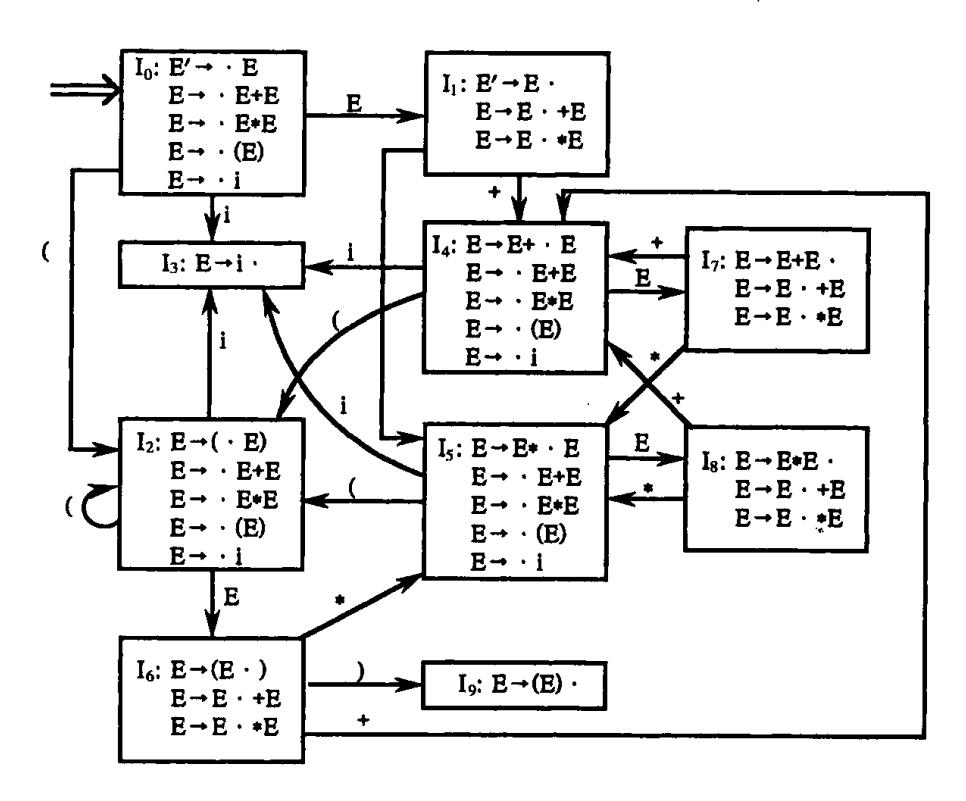

图 5.11 二义文法的 LR(0)项目集

但是,状态  $I_7$  在面临 + 或 \* 时所存在的归约(用  $E \rightarrow E + E$ )和移进冲突却不是用 SLR 法所能解决的。因为,不论 + 或 \* 都属于 FOLLOW(E)。状态  $I_8$  在面临 + 或 \* 时类似地也存在归约(用  $E \rightarrow E * E$ )和移进冲突。这些冲突只有借助其它条件才能得到解决。这个条件就是使用关于算符 + 和 \* 的优先级和结合规则的有关信息。

让我们考虑输入串 i+i\*i,在处理了 i+i之后,分析器进入到状态  $I_7$ ,这时分析栈的内容为 0E1+4E7,输入串的剩余部分为 \*i #。假定 \*的优先级高于 +,则就应该把 \*移进栈,准备先把 \*和它的左右操作数 i 归约成表达式 E。图 5.8 的 SLR 分析器就是这样行事的,算符优先分析器也是这样工作的。另一方面,若让 +的优先级高于 \*,则分析器就应先把 E+E 归约为 E。因此, +和 \*的相对优先关系为状态  $I_7$  和  $I_8$  解决移进 — 归约冲突提供了依据。

假定输入串为 i+i+i,在处理了 i+i之后分析器仍然到达  $I_7$ 。这时,栈的内容同样是 0E1+4E7,而输入串的剩余部分为 +i #。状态  $I_7$  面临 + 号同样存在移进 - 归约冲突。现在,算符 + 的结合律告诉我们应该如何来解决这一冲突。如果 + 服从左结合,那就应首先用  $E \rightarrow E + E$  实行归约。如果服从右结合,那就首先执行移进。通常的习惯是采用左结合规则。

{42}------------------------------------------------

总之,若令+服从左结合,则  $I_1$  面临输入符号+时应采用  $E \rightarrow E + E$  归约;若令 \* 优先于+,则  $I_2$  面临 \* 时应执行移进。同理,若令 \* 服从左结合, \* 优先于+,则状态  $I_3$  面临+或 \* 时应采用  $E \rightarrow E * E$  进行归约。

例 5.15 采用上述办法我们得到文法(5.11):

- (1)  $E \rightarrow E + E$
- $(3) \to (E)$
- (2)  $E \rightarrow E * E$
- (4) E→i

的 LR 分析表为如表 5.7 所示。

表 5.7 二义文法 LR 分析表

| 状态 |    | ACTION |    |    |    |     |   |  |
|----|----|--------|----|----|----|-----|---|--|
|    | i  | +      | *  | (  | )  | #   | В |  |
| 0  | s3 |        |    | s2 | -  |     | 1 |  |
| 1  |    | s4     | s5 |    |    | acc |   |  |
| 2  | s3 |        |    | s2 |    |     | 6 |  |
| 3  |    | r4     | r4 |    | r4 | r4  |   |  |
| 4  | s3 |        |    | s2 |    |     | 7 |  |
| 5  | s3 |        |    | s2 |    |     | 8 |  |
| 6  |    | s4     | s5 |    | s9 |     |   |  |
| 7  |    | rl     | s5 |    | r1 | rl  |   |  |
| 8  |    | r2     | r2 |    | r2 | r2  |   |  |
| 9  |    | r3     | r3 |    | r3 | r3  |   |  |

例 5.14 作为另一个例子我们考虑影射 if…else…二义结构的文法:

- (1) S→iSeS
- (2) S→iS

$$(3) S \rightarrow a \qquad (5.13)$$

它的 LR(0)项目集族如图 5.12 所示。

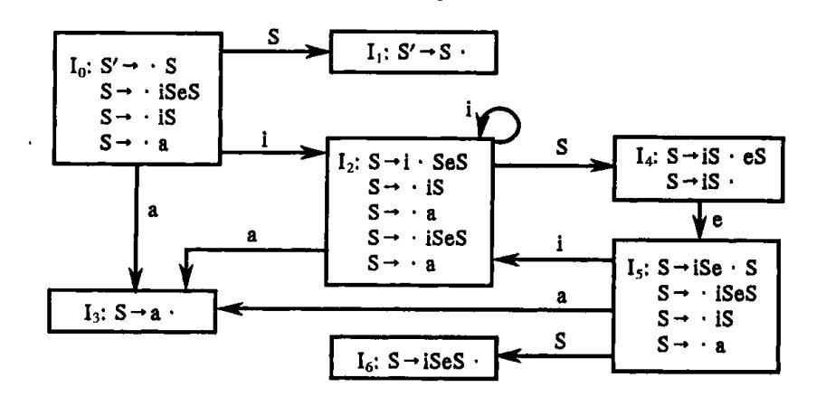

图 5.12 二义 if…then…else 文法的 LR(0)集

{43}------------------------------------------------

我们返回到 if…then…else 的术语。当 if C then S 呈现于栈顶并面临输入符号 else 时,我们应该执行移进还是执行归约呢?按照通常的习惯,是让 else 与最近的一个 then 相结合,因此,应该执行移进。用文法(5.13)的术语,现在所面临的 e 只是以(呈现于栈顶的符号串) iS 为首的候选的一部分。如果跟在 e 后面的符号不能归约出一个 S,那么,整个输入串就无法最终归约为 S。我们的结论是,状态 L, 存在的"移进—归约"冲突应采取移进 e 的办法来解决。在借助这个因素之后,我们就可以从图 5.12 的 LR(0)项目集构造出文法(5.13)的拓广文法的 LR 分析表(见表 5.8,注意 FOLLOW(S) =  $\{e, \#\}$ )。

| 状态    |    | ACTION |    |     |   |  |  |
|-------|----|--------|----|-----|---|--|--|
| - W % | i  | e      | a  | #   | s |  |  |
| 0     | s2 |        | s3 |     | 1 |  |  |
| 1     |    |        |    | acc |   |  |  |
| 2     | s2 |        | s3 |     | 4 |  |  |
| 3     |    | r3     |    | r3  |   |  |  |
| 4     |    | s5     |    | r2  |   |  |  |
| 5     | s2 |        | s3 |     | 6 |  |  |
| 6     |    | r1     |    | rl  |   |  |  |

表 5.8 二义 if…then…else 文法的 LR 分析表

例如,假定输入串为 iiaea,整个分析过程如下:

|      | 状态序列   | 已归约串    | <u>输入串</u> |
|------|--------|---------|------------|
| (1)  | 0      | #       | iiaea #    |
| (2)  | 02     | # i     | iaea #     |
| (3)  | 022    | # ii    | aea#       |
| (4)  | 0223   | # iia   | ea#        |
| (5)  | 0224   | # iiS   | ea#        |
| (6)  | 02245  | # iiSe  | a#         |
| (7)  | 022453 | # iiSea | #          |
| (8)  | 022456 | # iiSeS | #          |
| (9)  | 024    | # iS    | #          |
| (10) | 01     | # S     | #          |

注意,在第(5)行,状态  $I_4$  在面临符号 e 时选择了移进动作;而在第(9)行,状态  $I_4$  在面临 # 选择了用  $S \rightarrow iS$  进行归约的动作。

#### 5.3.7 LR 分析中的出错处理

在 LR 分析过程中, 当我们处在这样一种状态下, 即输入符号既不能移入栈顶, 栈内元素又不能归约时, 就意味着发现语法错误。发现错误后, 便进入相应的出错处理子程序。处理的方法分为两类: 第一类多半使用插入、删除或修改的办法。如在语句 a[1,2: =3.14; 中插入一个]。如果不可能使用这种办法,则采用第二类办法。第二类处理办法

{44}------------------------------------------------

包括在检查到某一不合适的短语时,它不能与任一非终结符可能推导出的符号串相匹配。如语句

## if x > k + 2 then go 10 else k is 2;

由于把保留字 goto 误写成 go,校正程序试图改成 goto,但后面还有错误(将':='误为'is'),故放弃将 go 换为 goto。校正子程序在此种情况下,将 go 1 跳过,作为非法语句看待。这种方法企图将含有语法错误的短语局部化。分析程序认定含有错误的符号串是由某一非终结符 A 所推导出的,此时该符号串的一部分已经处理,处理的结果反映在栈顶部一系列状态中,剩下的未处理符号仍在输入串中。分析程序跳过这些剩余符号,直至找到一个符号 a,它能合法地跟在 A 的后面。同时,要把栈顶的内容逐个移去,直至找到某一状态 s,该状态与 A 有一个对应的新状态 GOTO[s,A],并将该新状态下推人栈。这样,分析程序就认为它已找到 A 的某个匹配并已将它局部化,然后恢复正常的分析过程。

利用这种方法,可以以语句为单位进行处理,也可以把跳过的范围缩小。例如,若在'if'后面的表达式中遇到某一错误,分析程序可跳至下一个输入符号'then'而不是';'或'end'。

与算符优先分析方法比较,用 LR 分析方法时,设计特定的出错处理子程序比较容易,因为不会发生不正确的归约。在分析表的每一空项内,可以填入一个指示器,指向特定的出错处理子程序。第一类错误的处理一般采用插入、删除或修改的办法,但要注意,不能从栈内移去任何那种状态,它代表已成功地分析了的程序中的某一成分。

例如,表 5.9 是一张 LR 分析表,它能识别二义文法(5.11)所定义的语言。表中某些状态(如状态 8,9等)遇到某些输入符号就进行特定的某种归约(如状态 8 为 r2,状态 9 为 r3),这些状态遇到不合法的输入符号时,本应转向对应的出错处理子程序,而现在我们也把它们进行相同的归约,这样就缩减了分解表所占的空间。当然,如果有错,虽然先进行了某些归约,但在移入下一输入符号以前,错误终将被发现,只是发现的时间推迟了。

|   | ACTION |            |            |    |    |     |   |  |
|---|--------|------------|------------|----|----|-----|---|--|
| * | i      | +          | *          | (  | )  | #   | E |  |
| 0 | s3     | el         | el         | s2 | e2 | el  | 1 |  |
| 1 | е3     | s4         | s5         | е3 | e2 | acc |   |  |
| 2 | s3     | el         | e1         | s2 | e2 | e1  | 6 |  |
| 3 | r4     | <b>r4</b>  | r4         | r4 | r4 | r4  |   |  |
| 4 | s3     | el         | e1         | s2 | e2 | el  | 7 |  |
| 5 | s3     | el         | e1         | s2 | e2 | el  | 8 |  |
| 6 | е3     | s <b>4</b> | s5         | е3 | s9 | e4  |   |  |
| 7 | r1     | r1         | <b>s</b> 5 | r1 | r1 | rl  |   |  |
| 8 | r2     | r2         | r2         | r2 | r2 | r2  |   |  |
| 9 | r3     | r3         | r3         | r3 | r3 | r3  |   |  |

表 5.9 LR 分析表(包含出错处理子程序)

表 5.9 中各个错误诊察子程序的工作是:

el:/\* 处在状态 0,2,4,5 时,要求输入符号为一运算量的首符,如 i 或左括号。 当遇到'+'、'\*'或'#'等,调用此程序 \*/ 

{45}------------------------------------------------

将一假 i 置于栈内,上盖以状态 3; 给出错误信息:"缺少运算量"。

- e2:/\* 当处在状态 0,1,2,4,5 而遇到右括号时,调用此程序 \*/ 将下一输入符号(右括号)删除; 给出错误信息:"右括号不匹配"。
- e3:/\* 处在状态 1 或 6 时,要求输入符号为运算符,但当遇到 i 或左括号时,调用此程序 \*/ 将'+'纳入栈顶,上盖以状态 4; 给出错误信息:"缺少运算符"。
- e4:/\* 当处在状态 6 时,要求输入符号为运算符或右括号,但此时遇到 #,调用 此程序 \*/ 将')'纳入栈顶,上盖以状态 9; 给出错误信息:"缺少右括号"。

现在,我们假设输入符号串为 i+)。采用本方法进行处理,其过程如下:

|     | <u>状态</u> | 已归约串    | <u>输入串</u> | <u>附注</u>            |
|-----|-----------|---------|------------|----------------------|
| (1) | 0         | #       | i + ) #    |                      |
| (2) | 03        | # i     | +)#        |                      |
| (3) | 01        | # E     | + )#       |                      |
| (4) | 014       | # E +   | ) #        |                      |
| (5) | 014       | # E +   | #          | /* 右括号由 e2 子程序删除 */  |
| (6) | 0143      | # E + i | #          | /* el 子程序将 i 纳人栈内 */ |
| (7) | 0147      | # E + E | #          |                      |
| (8) | 01        | # E     | #          | /* 分析完毕 */           |
|     |           |         |            |                      |

前面讨论的只是很简单的情况。一个可投入实际运行的 LR 分析程序,需要考虑许多更为复杂的情形。例如,当处在某一状态下遇到各种不合法的符号时,错误诊察子程序需要向前查看几个符号,根据所查看的符号才能确定应采取哪一种处理办法。又如前已述及,分析表中有些状态在遇到不合法的输入符号时,不是立即转到错误诊察子程序,而是进行某些归约,这不仅推迟了发现错误的时间,而且往往会带来一些处理上的困难。试研究下面的一输入符号串:

$$a := b? c]:$$

这里以'?'表示在 b 与 c 之间有某个错误。如果分析程序遇到'a: = b'而不向前多看几个符号,则它就会把'a: = b'先归约成语句,而后我们就再没有机会通过简单地插入符号'['进行修补了。但是,即使采用向前查看的办法,查看的符号也不能太多,否则会使分析表变得过分庞大。应该找出一种切实可行的办法,使得在确定处理出错办法时能够参考一些语义信息,以便在向前查看几个符号时,可以避免作出有时从语法上看是正确的,然而却是无意义的校正这一情况。例如,语句

$$a[1,2;=3.14;$$

中,标识符'a'是一个数组标识符,这一语义信息将导致插入符号']'。

{46}------------------------------------------------

# 5.4 语法分析器的自动产生工具 YACC

本节我们介绍一个著名的编译程序自动产生工具 YACC(Yet Another Compiler - Compiler)。它是由 S.C. Johnson 等人在 AT&T 贝尔实验室研制开发的,早期作为 UNIX 操作系统中的一个实用程序。现在 YACC 得到广泛使用,借助于它已构造了许多编译程序。

从字面上理解,YACC 是一个编译程序的编译程序,但严格说它还不是一个编译程序自动产生器,因为它不能产生完整的编译程序。YACC 输入用户提供的语言的语法描述规格说明,基于 LALR 语法分析的原理,自动构造一个该语言的语法分析器(如图 5.13 所示),同时,它还能根据规格说明中给出的语义子程序建立规定的翻译。

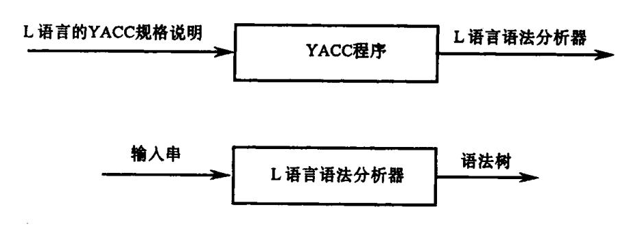

图 5.13 YACC 程序的作用

YACC 规格说明(或称 YACC 源程序)由**说明部分、翻译规则**和**辅助过程**三部分组成, 其形式如下:

说明部分

%%

翻译规则

%%

辅助过程

下面以构造台式计算器的翻译程序为例,介绍关于 YACC 的规格说明。该台式计算器读一个算术表达式进行求值,然后打印其结果。设算术表达式的文法如下:

$$E \rightarrow E + T \mid T$$

$$T \rightarrow T * F \mid F$$

$$F \rightarrow (E) \mid \text{digit}$$
(5.14)

其中, digit 表示 0···9 的数字。根据这一文法写出 YACC 的规格说明如下:

```
% {
# include < ctype.h >
% {
token DIGIT
% %
line : expr' \ n' | printf ("%d \ n", $1); {
;\nexpr : expr' + 'term | $$ = $1 + $3; }
```

{47}------------------------------------------------

```
term
                      term' * ' factor \{ \$ \$ = \$1 * \$3; \}
term
               1
                      factor
                      "(' expr ')'
factor
                                          \{ \$ \ \$ = \$2; \}
              Τ
                      DIGIT
% %
yylex () {
                int c:
                c = getchar();
                if (isdigit (c))
                        yylval = c - '0';
                        return DIGIT;
                        return c:
```

在 YACC 的规格说明里,说明部分包括可供选择的两部分。用%{和%}括起来的部分是 C 语言程序的正规说明,可以说明翻译规则和辅助过程里使用的变量和函数的类型。例中只有一个语句

# include < ctype.h >

它将导致 C 预处理器把包含 isdigit 函数说明的头文件 < ctype. h > 引入进来。语句

% token DIGIT

指出 DIGIT 是 token 类型的词汇,供后面两部分引用。

在第一个%%之后是翻译规则,每条规则由文法的产生式和相关的语义动作组成。 形如

左部→候选1 | 候选2 | ··· | 候选n |

的产生式,在 YACC 规格说明里写成

```
左部: 候选 1
```

在 YACC 产生式里,用单引号括起来的单个字符'c'看成是终结符号 c,没括起来并且 也没被说明成 token 类型的字母数字串看成是非终结符号。产生式的左部非终结符之后 是一个冒号,右部候选式之间可以用竖线分隔。在产生式的末尾,即其所有右部和语义动作之后,用分号表示结束。第一个产生式的左部非终结符看成是文法的开始符号。

YACC 的语义动作是 C 语言的语句序列。在语义动作里,符号\$\$表示和左部非终结符相关的属性值,\$1表示和产生式右部第一个文法符号(终结符或非终结符)相关的属性值,\$3表示和产生式右部第三个文法符号相关的属性值。由于语义动作都放在产生式

{48}------------------------------------------------

可选右部的末尾,所以,在归约时执行相关的语义动作。这样,可以在每个\$i的值都求出之后再求\$\$的值。在上述的规格说明里,产生式  $E \rightarrow E + T + T$  及相关的语义动作表示为

表示产生式右部非终结符 expr 的属性值加上非终结符 term 的属性值,结果作为左部非终结符 expr 的属性值,从而规定出按照这一产生式进行求值的语义动作。我们省略了第二个产生式候选求值的语义动作;本来这一行的末尾应该设置

$$\{\$\$ = \$1;\}$$

但考虑这样原封不动进行复制的语义动作没有意义,所以省略。在 YACC 源程序中,我们加入了一个新的开始产生式:

表示,关于台式计算器的输入是一个算术表达式,其后用一个换行符表示输入结束;与该产生式相关的语义动作

打印关于非终结符 expr 的属性值,即表达式的结果值。

第二个%%之后是辅助过程,它由一些 C 语言函数组成,其中必须包含名为 yylex 的词法分析器。其它例程,如 error 错误处理例程,可根据需要加入。每次调用函数 yylex ()时,得到一个单词符号,该单词符号包括两部分,一部分是单词种别。单词种别必须在YACC 源程序中第一部分说明;另一部分是单词自身值,通过 YACC 定义的全程变量 yylval 传递给语法分析器。

下面我们介绍 YACC 是如何处理二义文法的。

我们扩充关于台式计算器的规格说明,使之更具应用价值。第一,允许输入几个表达式,每个表达式占一行,并且允许出现空行;第二,表达式中可以出现数而不仅仅是单个数字,算术运算可以有+,-,\*,/。这样,表达式的文法可以写成下列形式:

 $E \rightarrow E + E \mid E - E \mid E \times E \quad \mid E / E \mid (E) \mid - E \mid number$ 

按这一文法写出的 YACC 规格说明如下:

```
# include < ctype.h >
# include < stdio.h >
# define YYSTYPE double /* double type for YACC stack */
% }
token NUMBER
% left ' + ' ' - '
% left ' * ' ' /'
% right UMINUS
% %
lines : lines expr ' \ n'
```

{49}------------------------------------------------

```
/* e */
expr
                    expr' + 'expr
                                                      \{\$\$ = \$1 + \$3:\}
             1
                    expr' - 'expr
                                                      \{\$\$ = \$1 - \$3;\}
                    expr' * ' expr
                                                      \$\$ = \$1 * \$3;
                    expr'/'expr
                                                     \{\$\$ = \$1/\$3;\}
                    '(' expr')'
                                                     \{\$\$ = \$2;\}
                    '- 'expr % prec UMINUS
                                                     \{\$\$ = -\$2;\}
                    NUMBER
% %
yylex ( ) {
       int c:
       while ((c = getchar()) = = ');
       if ((c = = '.') | | (isdigit (c))) |
               ungetc (c, stdin);
               scanf ("%1f", &yylval);
               return NUMBER:
       return c;
```

由于上述文法具有二义性,YACC 建立 LALR 分析表时将产生冲突的动作。在这种情况下,YACC 将报告所产生的冲突动作的个数。YACC 可以生成一个辅助文件,其中包含 LR 项目集的核心、冲突的动作和说明如何解决冲突的 LALR 分析表。

如果不另外指明,YACC将使用下列规则解决语法分析中的动作冲突:

- (1) 当产生"归约 归约"冲突时,按照规则说明中产生式的排列顺序,选择排在前边的产生式进行归约;
  - (2) 当产生"移进 归约"冲突时,选择执行移进动作。

因为上述省缺规则不是总能满足编译器设计者的要求,因此,YACC 提供了解决"移进-归约"冲突的机制。在说明部分,可以给终结符赋予优先级和结合性。在上述规格说明中

规定+和-具有相同的优先级和左结合性。类似地,用

```
% right UMINUS
```

表示 UMINUS(一元 - )具有右结合性。此外,用% nonarsoc 可以使二元运算不具有结合性。

单词符号的优先级由它们在同一说明部分中出现的次序决定,越在后,级别越高。因此,在上述规格说明中,UMINUS 比它之前的五个终结符的优先级都高。

由此可见,YACC 解决"移进 – 归约"冲突的办法是对有冲突的每个产生式以及每个终结符规定优先级和结合性。如果必须在待移的输入符号和待归约产生式  $A \rightarrow \alpha$  之间进行选择的话,则:

{50}------------------------------------------------

如果产生式的优先级比 a 高,或如果优先级相同且产生式的结合性为左结合,则YACC 选择归约;

否则,选择移进。

通常,产生式的优先级被当作与最右边的终结符相同。这在大多数情况下是明智的。 例如,给定产生式:

$$E \rightarrow E + E \mid E \times E$$

当面临的符号为+时,我们会用  $E \rightarrow E + E$  归约,因为产生式右边的+与面临的符号+具有相同的优先级,但具有左相合性。如果面临的符号为\*,我们会选择移进,因为面临的符号\*比产生式中+的优先级高。

在有的场合下,可以用标志%prec 指定其后的终结符的优先级,例如前述规格说明中产生式

后面的标志%prec UMINUS 使得该产生式中的一元 - 具有比其它操作符更高的优先级。

# 练 习

1. 令文法 G<sub>1</sub> 为:

$$E \rightarrow E + T \mid T$$
 $T \rightarrow T * F \mid F$ 
 $F \rightarrow (E) \mid i$ 

证明 E+T\*F是它的一个句型,指出这个句型的所有短语,直接短语和句柄。

2. 考虑下面的表格结构文法 G2:

$$S\rightarrow a | \wedge | (T)$$
  
 $T\rightarrow T, S | S$ 

- (1) 给出(a, (a, a))和(((a, a), ∧, (a)), a)的最左和最右推导。
- (2) 指出(((a, a), ^, (a)), a)的规范归约及每一步的句柄。根据这个规范归约,给出"移进 归约"的过程,并给出它的语法树自下而上的构造过程。
  - 3.(1) 计算练习 2 文法 G<sub>2</sub> 的 FIRSTVT 和 LASTVT。
    - (2) 计算 G<sub>2</sub> 的优先关系。G<sub>2</sub> 是一个算符优先文法吗?
    - (3) 计算 G 的优先函数。
    - (4) 给出输入串(a, (a, a))的算符优先分析过程。
- 4. 存在一种称为简单优先的自下而上分析法,这种分析法不会把错误句子当作为正确句子。一个文法 G,如果它不含  $\varepsilon$  产生式,也不含任何右部相同的不同产生式,并且它的任何符号对(X,Y)——X 和 Y 为终结符或非终结符——顶多存在下述三种关系  $\overline{-}$   $\zeta$   $\chi$   $\chi$   $\chi$   $\chi$   $\chi$   $\chi$   $\chi$   $\chi$   $\chi$   $\chi$ 
  - A. X = Y 当且仅当 G 中含有形如

B. X ∢ Y 当且仅当 G 中含有形如

P→····XQ····的产生式,其中 Q 为非终结符,而且 Q  $\stackrel{+}{\Rightarrow}$ Y···;

{51}------------------------------------------------

- C. X ➤ Y 当且仅当 Y 为文法 G 的终结符,且 G 含有形为 P→···QR···的产生式,使得 Q ⇒···X 而 Y ∈ FIRST(R)。例如,假定有规则 S→(T)和推导 T ⇒ S ⇒ a 则 S ➤ )和 a ➤ ) 成立。注意,上述 R 可能是终结符也可能是非终结符。
  - D. 对任何 X,若 S  $\xrightarrow{\cdot}$  X…,则 # < X;若 S  $\xrightarrow{\cdot}$  …X 则 X > #。按简单优先文法的定义,回答以下问题:
  - (1) 构造文法 G2 的简单优先分析表,辨明它是否为一个简单优先文法?
  - (2) 下面的文法产生和 L(G)相同的语言,

$$S\rightarrow a| \wedge |(R)$$
  
 $T\rightarrow S$ ,  $T|S$   
 $R\rightarrow T$ 

验证它的简单优先关系如下表所示:

|   | R        | s | Т        | а | ^ | , | ( | )        | # |
|---|----------|---|----------|---|---|---|---|----------|---|
| R |          |   |          |   |   |   |   | <u> </u> |   |
| s |          | • |          |   |   | 主 |   | >        |   |
| Т |          |   |          |   |   |   |   | >        | : |
| a |          |   |          |   |   | > |   | >        | > |
| ^ |          |   |          |   |   | > |   | >        | > |
| , |          | ∢ | <u> </u> | ∢ | ∢ |   | ∢ |          |   |
|   | <u> </u> | ∢ | •        | ∢ | ∢ |   | ∢ |          |   |
| ) |          |   |          | ∢ | ∢ | > |   | >        | > |
| # |          |   |          |   |   |   | ∢ |          |   |

- (3) 按上面的简单优先表构造优先函数。
- (4) 证明简单优先文法是无二义的。进一步说,简单优先文法的任何句型  $X_1X_2\cdots X_n$  的句柄是满足条件

 $X_{i-1} < X_i = X_{i+1} = \cdots = X_i > X_{i+1}$ 的最左子串  $X_i X_{i+1} \cdots X_i$ 。

- (5) 构造简单优先分析器。
- 5. 考虑文法

S-ASIb

A→SA | a

- (1) 列出这个文法的所有 LR(0)项目。
- (2) 构造这个文法的 LR(0)项目集规范族及识别活前缀的 DFA。
- (3) 这个文法是 SLR 的吗? 若是,构造出它的 SLR 分析表。
- (4) 这个文法是 LALR 或 LR(1)的吗?
- 6. 下面是一个描述  $\Sigma = \{a b\}$ 上的正规式的 LALR 文法(实际上也是 SLR 文法),只不过用'+'代替'+',用个代替  $\varepsilon$ (空字)。

 $E \rightarrow E + T \mid T$ 

{52}------------------------------------------------

 $T \rightarrow TF \mid F$ 

 $F \rightarrow F * |(E)|a|b| \land$ 

构造这个文法的 LALR 项目集和分析表。

7. 证明下面文法是 SLR(1)但不是 LR(0)的。

 $S \rightarrow A$ 

A→Ab|bBa

B→aAclalaAb

8. 证明下面的文法

S→AaAb|BbBa

**Α**→ε

Β->ε

是 LL(1)的但不是 SLR(1)的。

9. 证明下面文法:

S-Aa|bAc|Bc|bBa

A→d

是 LALR(1)但不是 SLR(1)的。

10. 如果我们用下面的二义文法产生正规式

$$E \rightarrow E + E \mid EE \mid E \times \mid (E) \mid a \mid b \mid \land$$

- (1) 给出解决二义性的 YACC 说明,按照这个说明能正确地分析正规式。
- (2) 按照(1)的说明所规定的解决二义性的准则,构造这个文法的 LALR 分析器。用这个分析器给出 a + ba \* 的分析过程,并以此论证这个分析器能够正确地分析正规式。
  - \*11. 考虑文法

$$E \rightarrow E + E \mid EE \mid E \times \mid (E) \mid a \mid b \mid \land \mid W$$
  
 $W \rightarrow aW \mid bW \mid \varepsilon$ 

- (1) 给出解决二义性的准则,这些准则将使得所有那些含相继两个(或两个以上)a 或相继两个(或两个以上)b 的字符串都分析为 W。
  - (2) 按照这些准则,构造这个文法的 LALR 分析器。