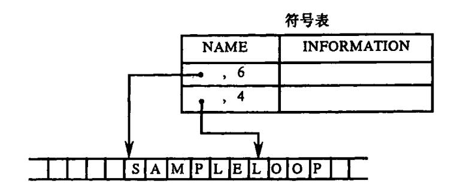
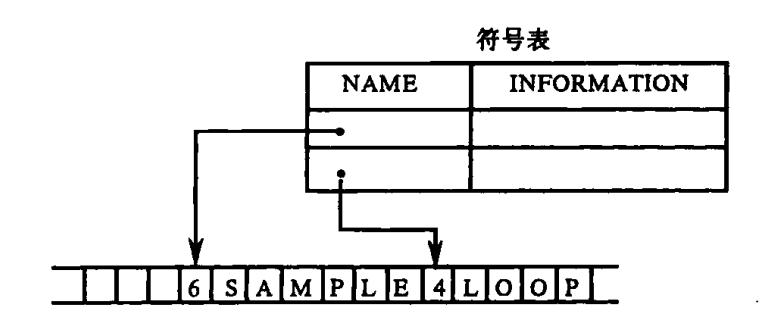
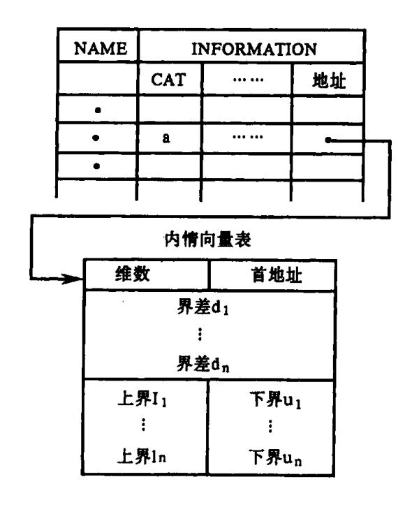
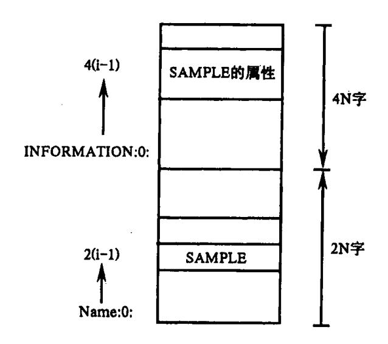
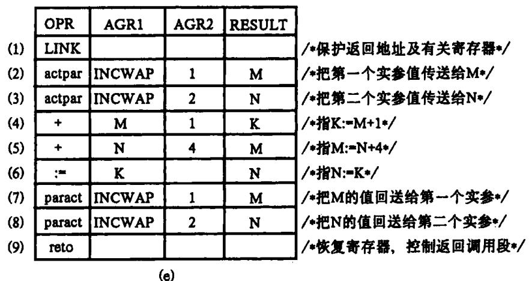
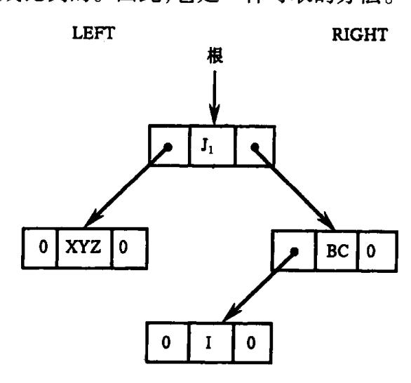
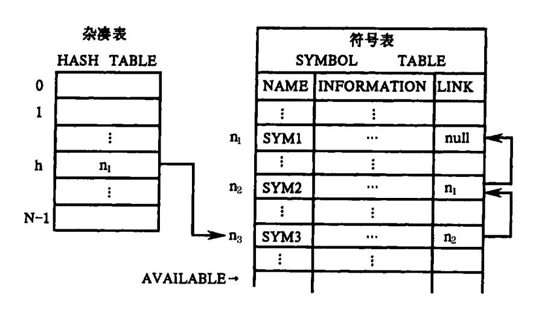
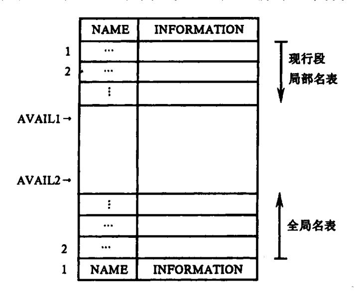
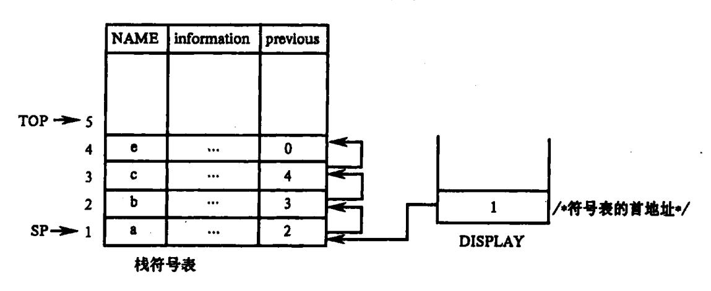
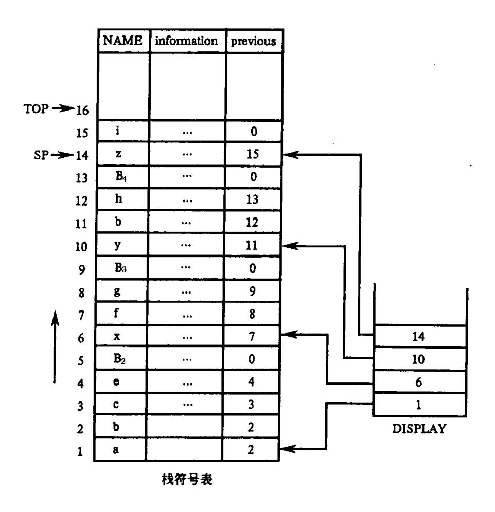

{0}------------------------------------------------

# 第八章 符号表

编译过程中编译程序需要不断汇集和反复查证出现在源程序中各种名字的属性和特 征等有关信息。这些信息通常记录在一张或几张符号表中。符号表的每一项包含两部 分:一部分是名字(标识符);另一部分是此名字的有关信息。每个名字的有关信息一般指 种属(如简单变量、数组、过程等)、类型(如整、实、布尔等)等等。这些信息将用于语义检 查、产生中间代码以及最终生成目标代码等不同阶段。

编译过程中,每当扫描器识别出一个名字后,编译程序就查阅符号表,看它是否在其 中。如果它是一个新名字就将它填进表里。它的有关信息将在词法分析和语法——语义 分析过程中陆续填入。

符号表中所登记的信息在编译的不同阶段都要用到。在语义分析中,符号表所登记 的内容将用于语义检查(如检查一个名字的使用和原先的说明是否一致)和产生中间代 码。在目标代码生成阶段,当对符号名进行地址分配时,符号表是地址分配的依据。对于 一个多遍扫描的编译程序,不同遍所用的符号表也往往各有不同。因为每遍所关心的信 息各有差异。

本章,我们将介绍符号表的一般组织和使用方法,然后介绍 FORTRAN 与 Pascal 的符 号表的结构和内容。

# 8.1 符号表的组织与作用

#### 8.1.1 符号表的作用

在编译的各个分析阶段,每当遇到一个名字都要查找符号表。如果发现一个新名字, 或者发现已有名字的新信息,则要修改符号表,填入新名字和新信息。因此,合理组织符 号表,使符号表本身占据的存储空间尽量减少,同时提高编译期间对符号表的访问效率, 显得特别重要。

概括地说,一张符号表的每一项(或称人口)包含两大栏(或称区段、字域),即名字栏 和信息栏。表格的形式如下所示:

> 名字栏(NAME) 信息栏(INFORMATION) 第1项(人口1) 第2项(入口2) 第 n 项(入口 n)

{1}------------------------------------------------

信息栏包含许多子栏和标志位,用来记录相应名字的种种不同属性,由于查填符号表一般是通过匹配名字来实现的,因此,名字栏也称主栏。主栏的内容称为关键字(key word)。

符号表中的每一项都是关于名字的说明。因为所保存的关于名字的信息取决于名字的用途,所以各表项的格式不一定统一。对每一表项可以用一个记录表示。为了使表中的每个记录格式统一,可以在记录中设置指针,把某些信息放在表的外边,用指针指向存放另外信息的空间。

在整个编译期间,对于符号表的操作大致可归纳为五类:

- 对给定名字,查询此名是否已在表中;
- 往表中填入一个新的名字;
- 对给定名字,访问它的某些信息:
- 对给定名字,往表中填写或更新它的某些信息:
- 删除一个或一组无用的项。

不同种类的表格所涉及的操作往往也是不同的。上述五个方面只是一些基本的共同操作。

### 8.1.2 符号表的组织方式

符号表最简单的组织方式是让各项各栏所占的存储单元的长度都是固定的。这种项栏长度固定的表格易于组织、填写和查找。对于这种表格,每一栏的内容可直接填写在有关的区段里。例如,有些语言规定标识符的长度不得超过8个字符,于是,我们就可以用两个机器字作为主栏(假定每个机器字可容纳四个字符),每个名字直接填写在主栏中。若标识符长度不到8个字符,则用空白符补足。这种直接填写式的表格形式如下所示:

NAME INFORMATION

SAMPLE ...

LOOP ...

符号表

但是,有许多语言对标识符的长度几乎不加限制,或者说,标识符的长度范围甚宽。比如说,最长可容许由 100 个字符组成的名字。在这种情况下,如果每项都用 25 个字作主栏,则势必会大量浪费存储空间。因此,最好用一个独立的字符串数组,把所有标识符都存放在其中。在符号表的主栏放一个指示器和一个整数,或在主栏仅放一个指示器,在标识符前放一个整数。指示器指出标识符在字符中数组中的位置;整数代表此标识符的长度。这样,符号表的结构就如图 8.1 所示。

这是一种用间接方式安排名字栏的办法。类似地,如果各种名字所需的信息(INFORMATION)空间长短不一,那么,我们可把一些共同属性直接登记在符号表的信息栏中,而把某些特殊属性登记在别的地方,并在信息栏中附设一指示器,指向存放特殊属性的地方。例如对于数组标识符,需要存储的信息有维数等等,如果将它们与其它名字全部

{2}------------------------------------------------





图 8.1 符号表的结构

集中在一张符号表中,处理起来很不方便。因此常常采用以下方式:即专门开辟一个信息表区,称为数组信息表(或内情向量表),将数组的有关信息全部存入此表中。在符号表的地址栏中存入符号表与内情向量表连接的人口地址(即指针)。如图 8.2 所示这样,当填写或查询数组有关信息时,通过符号表来访问此内情向量表。对于过程名字以及其它一些含信息较多的名字,都可类似地开辟专用信息表,存放那些不宜全部存放在符号表中的信息,而在符号表中保留与信息表相联系的地址信息。

- 一张可容纳 N 项的符号表在存储器中可用下述两种不同的方式之一表示(假定每项 需用 K 个字)。
  - (1)把每一项置于连续的 K 个存储单元中,从而给出一张 K \* N 个字的表。
- (2)把整个符号表分成 M 个子表,如  $T_1,T_2,\cdots,T_m$ ,每个子表含 N 项。假定子表  $T_i$  的每一项所需的字数为  $K_i$ ,那么, $K = K_1 + K_2 + \cdots + K_m$ 。对于任何  $i,T_1[i],T_2[i],\cdots,T_m[i]$ 的并置就构成符号表第 i 项的全部内容。

在编译程序的工作过程中,每一遍所用的符号表可能略有差别。一般说来,主栏和某些基本属性栏大多不会改变,但另外一些信息栏可能在不同阶段有不同的内容。为了合理使用存储空间(特别是重新利用那些已经过时的信息栏所占用的空间),最好采用上述第2种存储表示方式,以便靠后的子表在不同阶段可以重新安排。例如,把主栏和信息栏分成两个子表,令主栏占两个字,信息栏占四个字,那么,符号表的内存安排就如图 8.3 所示。

如果编译程序是用高级语言实现的话,则用记录数组或变体记录的数组实现符号表 是比较合适的。

值得指出的是,编译时,虽然原则上说,使用一张统一的符号表也就够了,但是,许多

{3}------------------------------------------------



图 8.2 通过符号表访问内情向量表



图 8.3 分两个子表的符号表安排

编译程序按名字的不同种属分别使用许多符号表,如常数表、变量名表、过程名表等等。这是因为,不同种属名字的相应信息往往不同,信息栏的长度也各有差异。因而,按不同种属建立不同的符号表在处理上常常是比较方便的。

例 8.1 作为一个例子,让我们来看一看 FORTRAN 编译程序常用的几种表格的结构。例如,对下面的程序段:

SUBROUTINE INCWAP(M,N)

10 K = M + 1

M = M + 4

N = K

**RETURN** 

{4}------------------------------------------------

#### **END**

经编译头三阶段后所产生的主要表格有:符号名表 SNT、常数表 CT、人口名表 ENT、标号表 LT 和四元式表 QT。如图 8.4 所示。注意:在四元式表中实际上不是直接写在操作数(或结果数)的名字,而是填上它们在有关表格中的人口位置(序号)。

符号名表SNT NAME **INFORMATION** M 哑元,整数,变量 (1) N 哑元,整数,变量 (2) K 整数,变量 (3) (a) 常数表CT 值 (VALUE) (1) (2) 4 (b) 人口名表ENT NAME INFORMATION (2) **INCWAP** 二目子程序,入口QT(1) /\*记录入口名INCWAP的人口地址\*/ (c) 标号表LT **INFORMATION** LABLE /+记录了标号10对应的四元式序列号+/ 10 OT(4) (1) (d)

## 四元式表QT



图 8.4 各种符号表

(a)符号名表;(b)常数表;(c)人口名表;(d)标号表;(e)四元式表。

{5}------------------------------------------------

# 8.2 整理与查找

编译开始时,符号表或者是空的,或者预先存放了一些保留字和标准函数名的有关项。在整个编译过程中,符号表的查填频率是非常高的。编译工作的相当一大部分时间是花费在查填符号表上。所以,研究表格结构和查填方法是一件非常重要的事情。下面,我们简单地介绍符号表的三种构造法和处理法,即线性查找、二叉树和杂凑技术。第一种办法最简单,但效率低。二叉树的查找效率高一些,然而实现上略困难一点。杂凑表的效率最高,可是实现上比较复杂而且要消耗一些额外的存储空间。

### 8.2.1 线性表

构造符号表最简单和最容易的办法是按关键字出现的顺序填写各个项。我们可以用一个一维数组或多个一维数组来存放名字及有关信息。当碰到一个新名时就按顺序将它填入表中,若需要了解一名字的有关信息,则就从第一项开始顺序查找。一张线性表的结构如图 8.6 所示。图中,指示器 AVAILABLE 总是指向空白区的首地址。

线性表中每一项的先后顺序是按先来者先填的原则安排的,编译程序不做任何整理次序的工作。如果是显式说明的程序设计语言,则根据各名字在说明部分出现的先后顺序填入表中(表尾);如果是隐式说明的程序设计语言,则根据各名字首次引用的先后顺序填入表中。当需要查找某个名字时,就从该表的第一项开始顺序查找,若一直查到AVAILABLE 还未找到这个名字,就说明该名字不在表中。

根据一般程序员的习惯,新定义的名字往往要立即使用。所以,按反序查找(从AVAILABLE 的前一项开始追溯到第一项)也许效率更高。当需要填进一个新说明的名字时,我们必须先对这个名字查找表格,如果它已在表中,就不重新填入(通常要报告重名错误)。如果它不在表中,就将它填进 AVAILABLE 所指的位置,然后累增 AVAILABLE 使它指向下一个空白项的单元地址。

|            | 线性符号表 |             |  |
|------------|-------|-------------|--|
| 项 数        | NAME  | INFORMATION |  |
| 1          | J1    |             |  |
| 2          | XYZ   |             |  |
| 3          | I     | • • •       |  |
| 4          | BC    |             |  |
| AVAILABLE→ |       |             |  |

图 8.5 线性表

对于一张含 n 项的线性表来说,欲从中查找一项,平均来说需要做 n/2 次的比较。显然使用这种方法效率很低。但由于线性表的结构简单而且节省存储空间,所以许多编译程序仍采用线性表。

如果需要,可设法提高线性表的查找效率。办法之一是,给每项附设一个指示器,这些指示器把所有的项按"最新最近"访问原则连接成一条链,使得在任何时候,这条链的第

{6}------------------------------------------------

一个元素所指的项是那个最新最近被查询过的项,第二个元素所指的项是那个次新次近被查询过的项,如此等等。每次查表时都按这条链所指的顺序,一旦查到之后就即时改造这条链,使得链头指向刚才查到的那个项。每当填入新项时,总让链头指向这个最新项。含有这种链条的线性表叫做**自适应线性表**。

### 8.2.2 对折查找与二叉树

为了提高查表的速度,可以在造表的同时把表格中的项按名字的"大小"顺序整理排列。所谓名字的"大小"通常是指名字的内码二进值。例如,规定值小者在前,值大者在后。图 8.5 如果按有序方式组织它们,则构成如图 8.6 所示的表。

|            | 线性付号表 |             |  |  |
|------------|-------|-------------|--|--|
| 项 数        | NAME  | INFORMATION |  |  |
| 1          | ВС    |             |  |  |
| 2          | I     |             |  |  |
| 3          | J1    |             |  |  |
| 4          | XYZ   |             |  |  |
| AVAILABLE→ |       |             |  |  |

图 8.6 线性表

对于这种经顺序化整理了的表格的查找可用**对折法**。假定表中已含有 n 项,要查找 某项 SYM 时:

- 首先把 SYM 和中项(即第 n/2 + 1 项)作比较,若相等,则宣布查到。
- •若 SYM 小于中项,则继续在 1~| n/2 |的各项中去查找。
- 若 SYM 大于中项,则就到| n/2 | + 2~n 的各项中去查找。

这样一来,经一次比较就甩掉 n/2 项。当继续在 1~ [n/2](或[n/2]~n)的范围中查找时,我们同样采取首先同新中项作比较的办法。如果还查找不到,再把查找范围折半。显然,使用这种查找法每查找一项最多只须作 1+ log2N 次比较(因此这种查找法也叫对数查找法)。

这种办法虽好,但对一遍扫描的编译程序来说,没有太大的用处。因为,符号表是边填边引用的,这意味着每填进一个新项都得做顺序化的整理工作,而这同样是极费时间的。

- 一种变通办法是把符号表组织成一棵二叉树。也就是说,我们令每项是一个结点,每个结点附设两个指示器栏,一栏为 LEFT(左枝),另一栏为 RICHT(右枝)。每个结点的主栏内码值被看成是代表该结点的值。对于这种二叉树,我们有一个要求,那就是,任何结点 p 右枝的所有结点值均应小于结点 p 的值,而左枝的任何结点值均应大于结点 p 的值。
- 二叉树的形成过程是:令第一个碰到的名字作为"根"结点,它的左、右指示器均置为 null。当要加入新结点时,首先把它和根结点的值作比较,小者放在右枝上,大者放在左枝上。如果根结点的左(右)枝已成子树,则让新结点和子树的根再作比较。重复上述步骤,

{7}------------------------------------------------

直至把新结点插入使它成为二叉树的一个端末结点(叶)为止。图 8.5 的线性表用二叉树表示如图 8.7 所示。

二叉树的查找效率比对折查找效率显然要低一点,而且由于附设了左、右指示器,存储空间也得多耗费一些。但它所需的顺序化时间显然要少得多,而且每查找一项所需的比较次数仍是和 log<sub>2</sub>N 成比例的。因此,它是一种可取的办法。



图 8.7 线性表的二叉树表示

### 8.2.3 杂凑技术

对于表格处理来说,根本问题在于如何保证查表与填表两方面的工作都能高效地进行。对于线性表来说,填表快,查表慢。而对于对折法而言,则填表慢,查表快。杂凑法是一种争取查表、填表两方面都能高速进行的统一技术。这种办法是:假定有一个足够大的区域,这个区域以填写一张含 N 项的符号表。我们希望构造一个地址函数 H,对任何名字 SYM,H(SYM)取值于 0 至 N - 1 之间。这就是说,不论对 SYM 查表或填表,我们都希望能从 H(SYM) 获得它在表中的位置。例如,我们用无符号整数作为项名,令 N = 17,把 H(SYM)定义为 SYM/N 的余数。那么,名字'09'将被置于表中的第 9 项,'34'将被置于表中的第 0 项,'171'将被置于表中的第 1 项,如此等等。

对于地址函数 H 有两点要求:第一,函数的计算要简单、高效;第二,函数值能比较均匀地分布在  $0 \le N-1$  之间。例如,若取 N 为质数,把 H(SYM)定义为 SYM/N 的余数就是一个相当理想的函数。

构造函数 H 的办法很多,通常是将符号名的编码杂凑成 0 至 N - 1 间的某一个值。 因此,地址函数 H 也常常称为杂凑函数。由于用户使用标识符是随机的,而且标识符的 个数也是无限的(虽然在一个源程序中所有标识符的全体是有限的),因此,企图构造—— 对应的函数当然是徒劳的。在这种情况下,除了希望函数值的分布比较均匀之外,我们还 应设法解决"地址冲突"的问题。

以 N = 17, H(SYM)为 SYM/N 的余数为例,由于 H('05') = H('22') = 5,若表格的第 5 项已为'05'所占,那么,后来的'22'应放在哪里呢?

杂凑技术常常使用一张杂凑(链)表通过间接方式查填符号表。时时把所有相同杂凑

{8}------------------------------------------------

值的符号名连成一串,便于线性查找。杂凑表是一个可容 N 个指示器值的一维数组,它的每个元素的初值全为 null。符号表除了通常包含的栏外还增设一链接栏,它把所有持相同杂凑值的符号名连接成一条链。例如,假定 H(SYM1) = H(SYM2) = H(SYM3) = h,那么,这三个项在表中出现的情形如图 8.8 所示。



图 8.8 杂凑技术示意

填入一个新的 SYM 过程是:

- 首先计算出 H(SYM)的值(在 0 与 N-1 之间)h,置 P: = HASHTABLE[h](若未曾有 杂凑值为 h 的项名填入过,则 p=null);
- 然后置 HASHTABLE[h]: = AVAILABLE, 再把新名 SYM 及其链接指示器 LINK 的值 p 填进 AVAILABLE 所指的符号表位置,并累增 AVAILABLE 的值使它指向下一个空 项的位置。

使用这种办法的查表过程是,首先计算出 H(SYM) = h,然后就指示器 HASHTABLE [h]所指的项链逐一按序查找(线性查找)。

# 8.3 名字的作用范围

在许多程序语言中,名字往往有一个确定的作用范围。例如在 FORTRAN 中,变量、数组和语句函数的名字的作用范围是它们所处的程序段(主程序段、子程序段或函数段),而外部名、公用区名和过程名的作用范围则是整个程序。对于过程嵌套结构型的程序设计语言,每层过程中说明的名字只局限于该过程,离开了所在过程就无意义了。因此,名字的作用范围是和它所处的那个过程(它在这个过程中被说明了的)相联系的。这意味着,在一个程序里,同一个标识符在不同的地方可能被说明为标识不同的对象,也就是说,同一个标识符,具有不同的性质,要求分配不同的存储空间。于是便产生了这样的问题,如何组织符号表,使得同一个标识符在不同的作用域中能得到正确的引用,而不会产生混乱?这就是作用域分析要解决的问题。

通常实现最近嵌套作用域规则的办法是,对每个过程指定一个唯一的编号,即过程的顺序号,以便跟踪过程里的局部名字。为了对每个过程进行编号,可以按照识别过程开头和结尾的语义规则,用语法制导翻译的方法实现。一个过程的编号(层次)作为本过程中

{9}------------------------------------------------

说明的全部局部量的组成部分,即编号被看成是名字的一个组成部分。于是,在符号表中表示局部名字用一个二元组: <名字,过程编号 >。这种办法意味着我们把整个符号表按不同的过程逻辑地划分为相应的不同段落。在查找每个名字时,先查对过程编号,确定所属的表区段落,然后,再从此段落中查对标识符。也就是说,对一个名字查找符号表是:只有当表项中的名字其字符逐个匹配,并且该记录相关的编号和当前所处理的过程的编号匹配时,才能确定查找成功。

下面我们将分别以 FORTRAN 和 Pascal 的符号表的组织为例,说明两种不同的结构语言的名字作用域分析。

### 8.3.1 FORTRAN 的符号表组织

一个 FORTRAN 程序中由一个主程序段和若干过程段(子程序段或函数段)组成的。变量、数组和语句函数名的作用范围就是它们所处的那个程序段(它们在这个程序段被说明了的)。对于一个一遍扫描的编译程序,我们可以逐段产生其目标代码。于是,当一程序段处理完后,它的所有的局部名均无须继续保存在符号表中,需要继续留在符号表中的只是全局名,如外部过程名或公用区名。

在这种情形下,我们可以把现行段的局部名登记在表格区的一端,而把所有的全局名登记在表区的另一端,如图 8.9 所示。局部名表区域是一个可重复使用的区域。当一个程序段处理完之后,新的程序段又可在同一位置上建立新的局部名表。



图 8.9 FORTRAN 对开式符号表结构

每当编译程序碰到一个新名时就按其语义将它登记在符号表的某一端中。在填入新名时要注意的是:当 AVAIL1 和 AVAIL2 两指示器碰头时(值相等),编译程序就应报告表区已填满并禁止继续填进新项。当现行段处理完后,AVAIL1 重置,指向局部名区的第一项。

对于一个优化的多"遍"扫描的 FORTRAN 编译程序而言,在处理完一个程序段之后 应把它的局部名表保存在外存中(以便后续"遍"处理这段时使用)。这样,局部名区就可 为处理下一程序段时使用。请注意:在这种情况下,必须用一个一维数组记录各段局部名

{10}------------------------------------------------

表的开始位置(程序段的编号)。

对于 FORTRAN 编译程序, 若仅仅从查填符号表这一点而言,本质上完全无须给每个程序段一个编号。因为,查表时我们总是对着全局名区或现行局部名区来查的。由于程序段没有嵌套性,故没有必要把程序段的编号作为名字的一部分。虽然以后我们仍将给每个程序段(乃至每个公用区)一个编号,但主要是为了进行地址分配而引进的。

### 8.3.2 Pascal 的符号表组织

过程结构是 Pascal 最突出的一个特点。在一个过程(或函数)里说明了的名字被认为是局部于这个过程(或函数)的。按照最近嵌套作用域原则,一个名字的作用域是那个包含了这个名字的说明的最小过程(或函数)。 当我们碰到一个标识符 SYM 时,必须弄清哪一个过程是包含 SYM 的说明的最小过程。这就是说,当一个过程结束后,在它里面说明过的任何名字都"死了",或者说,不能再引用它(同一个标识符在新的地方可用来标识别的对象,但同那个结束了的过程毫无关系)。

Pascal 过程的结构是嵌套的,内层过程可以引用外层过程中说明过的名字。因此,在编译这种语言期间,每当进入一层过程时,要为在这层过程中新说明的标识符建立一张子符号表(在符号表内),而在退出此层过程时,则要删除(释放)相应的子符号表,使现行符号表与进入此过程之前的内容保持一致。由于过程是按层次嵌套的,如果多层嵌套(如 n 层),那么这些子符号表也是多层嵌套,并按序生成(即先产生子符号表 1,最后产生子符号表 n)。当第 n 层过程需要查找某一名字时,则先从子符号表 n 开始查找,如果未查到,再依次查子符号表 n-1, n-2, …, 1; 如果在某层符号表 1 中首先出现该名字,这便是所要查找的结果。由此可见,采取这种办法,不同层次的同名标识符不会导致混乱。

针对嵌套结构型程序设计语言(Pascal)的特点,可采用如下办法:

- 将其符号表设计为栈符号表,当新的名字出现总是从栈顶填入。查找操作从符号表的栈顶往底部查(保证先查最近出现的名字)。因为程序是分层的,并且一个过程结束时将释放相应的子符号表,因此查找范围与线性表比相对要小一些。
- •引入一个显示(DISPLAY)层次关系表,称为过程的嵌套层次表。其作用是为了描述过程的嵌套层次,指出当前正在活动着的各嵌套的过程(或函数)相应的子符号表在栈符号表中的起始位置(相对地址)。DISPLAY 表也是一个栈,栈顶指针为 level。当进入一个新过程时,level增加 1;每当退出一个过程时,level减 1。DISPLAY(level)总是指向当前正在处理的最内层的过程的子符号表在栈符号表中的起始位置。
- 在符号表的信息栏中引入一个指针域(previous),用以链接它在同一过程内的前一域名字在表中的下标(相对位置)。每一层的最后一个域名字,其 previous 之值为 0。这样,每当需要查找一个新名字时,就能通过 DISPLAY 找出当前正在处理的最内层的过程及所有外层的子符号表在栈符号表中的位置。然后,通过 previous 可以找到同一过程内的所有被说明的名字。

以下结合一个具体的 Pascal 源程序(图 8.10)看看在编译其间,它的栈符号表的变化情况。

{11}------------------------------------------------

```
program B<sub>1</sub> (input, output);
    const a=10;
     var b, c : interger:
          e : real:
     procedure B2 (x : real);
          var f, g : real;
          procedure B3 (y: real);
              const b=5;
               var h : boolean;
               procedure B<sub>4</sub>(z : interger);
                   var i : char;
                    begin
                   if e<0 then B_3(f);
                   end; {B<sub>4</sub>}
              begin
              ...; B<sub>4</sub> (a); ...;
              end \{B_3\};
         begin
         ...; B<sub>3</sub> (c); ...;
         end \{B_2\};
    begin
    ...; B<sub>2</sub> (e); ...;
    end {main}
```

图 8.10 源程序



图 8.11 栈符号表

编译程序对此源程序进行编译,当编译主程序 B1(0 层)中的常量和变量说明时,栈符号表的形式如图 8.11 所示。其中 TOP 指向栈顶第一个可用单元。SP 总是指向最新子符号表首地址。

继续进行编译, 当编译到 B4 过程说明之前, 栈符号表如图 8.12 所示。这时, DISPLAY 的栈顶值 14, 它表示过程 B3 的局部量在栈符号表中的首地址; 次栈顶 6表示过程 B2 的

{12}------------------------------------------------

NAME information previous TOP → 14 13 0 12 h ••• 13 h 11 ... 12  $P \longrightarrow 10$ у 11 •••  $\mathbf{B}_{3}$ 9 ••• n 8 9 f ••• 7 6 X ••• 7 5  $\mathbf{B}_2$ 0 4 e 4 3 C ... 3 10 2 2 ••• 6 1 1

局部量在栈符号表中的首地址。TOP总是指向栈的第一个可用单元。

图 8.12 栈符号表

DISPLAY

再继续往下扫描,直至编译到 B4 过程体之前时,栈符号表如图 8.13 所示。

栈符号表

在编译 B4 过程体时,每引用一次标识符,便需查找栈符号表,首先,由 DISPLAY 栈顶得到子符号表的首地址 15,通过 previous 链查找。

- 如果查找到了,便可取得该名字的有关属性。
- 如果未查到,则需要继续在它的外层中查找。

例如, B4 过程体中出现的标识符 e 在 14~15 单元中是查不到说明的,这时由 DIS-PLAY 次栈顶值 10,可在 10~13 号单元中查找(直接外层 B3)。若仍然未查找到,则继续在外层查找,一直查到最外层,即主程序 B1(0层)中才找到 e 的说明,这时可以从中取得 e 的一些有关属性。如果引用的某个名字一直查不到它的说明或某些属性不符,则说明语义不正确,处理程序将向用户报告出错信息。

当退出 B4 过程后,栈符号表又如图 8.12 所示。即从图 8.13 中释放了栈符号表内关于 B4 过程的子符号表。这时 TOP 值为 14,同时 10 成为 DISPLAY 的当前栈顶值。这意味着从栈符号表中释放了关于 B4 的子符号表。

进入 B3 过程体后,每引用一个名字,根据 DISPLAY 栈顶值 10,首先在 10~13 单元范围内查找,例如 B3 过程体内的过程语句 B4(a),其中标识符 B4 可以在 10~13 范围内查到其说明,标识符 a 却要在最外层才能找到。退出 B3 过程时,TOP 值成为 10,同时使 DISPLAY 的当前栈顶值为 6。很显然,对于主程序中出现的名字,只能在图 8.11 的栈符号表中查找它的说明。如果在源程序中还有与过程 B3 并列的其它过程,那么还可以在该符号表基础上,为这个并列过程的局部量建立子符号表。

{13}------------------------------------------------



图 8.13 栈符号表

应该指出,除了一般的栈符号表外,还可用栈实现树结构和杂凑结构的符号表。

# 8.4 符号表的内容

符号表的信息栏中登记了每个名字的有关性质,如类型(整、实或布尔等)、种属(简单变量、数组、过程等)、大小(长度,即所需的存储单元字数)以及相对数(指分配给该名字的存储单元的相对地址)。不同的程序语言对于名字性质的定义各有不同。现今多数程序语言中的名字或者是用说明语句规定其性质,或者采用某种隐含约定(如 FORTRAN 中凡以字符 I,J,…,N 开头的标识符代表整型变量名)。有些程序语言,如 APL,没有说明语句也没有隐含约定,因此,符号表的性质须到目标程序运行时才能确定下来。但编译时登记在符号表中的各名字的性质只能来自说明语句(包括隐含约定和标号定义)或其它引用情形。

对于变量名、数组名和过程名而言,它们的信息栏中一般要求有下列信息:

变量 类型(整、实、双实、布尔、字符、复、标号或指针等):

种属(简单变量、数组或记录结构等);

长度(所需的存储单元数):

相对数(存储单元相对地址);

若为数组,则记录其内情向量;

{14}------------------------------------------------

若为记录结构、则把它与其分量按某种形式联系起来:

形式参数标志:

若在 COMMON 或 EQUIVALENCE 语句中(FORTRAN 语言),把它和有关名字连接在一起;它的说明是否已处理过(即标志位"定义否");

是否对这个变量进行过赋值(包括出现在输入名表中)的标志位。

过程 是否为程序的外部过程?

若为函数,类型是什么?

其说明是否处理过?

是否递归?

形式参数是些什么?为了与实在参数进行比较,必须把它们的种属、类型信息同过程名联系在一起。

例 8.2 作为一个例子,我们考虑 151 – FORTRAN 编译程序所用的符号表内容。这是一个三遍扫描的编译程序。第一遍使用了五张表格: SD、LD、PD、CD 和 COMLIST。其中,SD 表用来登记一程序段内的变量、数组、内部函数和程序段自身的名字,每一个程序段有一个相应的 SD 表。LD 表用来登记一程序的每个标号名,每个程序段有一个相应的 LD 表。PD、CD 和 COMLIST 均为全局性名表,分别用来记录整个程序的外部过程名、常数和公用块名。下面介绍 SD 表的内容。

SD 表

|      | ATTRIBUTE |     |     | ADDRESS |      |
|------|-----------|-----|-----|---------|------|
| NAME | CAT       | DIM | TYP | DA      | ADDR |
|      |           |     |     | •       |      |

### 其中

NAME 占 6 个字节,记录变量、数组或过程的名字:

CAT 占 3 位,记录名字的种属:

- 0 未定
- 1 数组
- 2 变量
- 3 语句函数
- 4 内部函数(标准)
- 5 外部函数(标准或非标准)
- 6 子程序
- 7 外过程(出现在 EXTERNAL 语中)
- DIM 占 4 位,记录数组的维数或过程的哑元个数
- TYP 占 8 位,记录名字的和其它信息;
  - 0 未定
  - 1 整型
  - 2 实型
  - 3 双精度实型

{15}------------------------------------------------

- 4 逻辑型
- 5 复型
- 9
- 10 隐实
- 16 公用元标志
- 32
- DA 占 8 位,数据区编号:

ADDR 占3字节,记录相对地址。

注意,在分配地址以前,DA 栏和 ADDR 栏用于别的目的。如对于数组来说可用于登记内情向量所在的地址。

一个名字的有关信息常常是分好几次填入信息栏中的。例如在 FORTRAN 中,说明句:

REAL ITEM
DIMENSION ITEM(100)
COMMON ITEM
EQUIVALENCE(ITEM(1), X)

将把 ITEM 的信息分四次填进信息栏中。有些名字是先引用后定义(说明)的。例如,标号或过程名就常常是这种情形。这种名字在每次被引用时都应把它所期望的性质填在信息栏中,检查各次引用的相容性,以及等待相应的定义(说明)到达时核对引用和定义的一致性。

对于那些只使用单一符号表的简单语言,对符号表填入新项的工作可由词法分析程序来完成。也就是,当扫描器碰到一个标识符时就对它查填符号表,然后回送它在符号表中的位置作为单词值。但在某些语言中,甚至在同一过程段里允许用同一标识符标识各种不同对象。例如,XYZ可能既是一个实变量名又是一个标号名,或者又是某个结构型数据的一个分量名。在这种情况下,使用单一符号表或由词法分析程序负责查填符号表都是非常不方便的。因此,采用多种符号表并让语法——语义分析程序负责查填工作是比较妥当的。对于词法分析程序来说,只要求它凡碰到标识符就直接送出此标识符自身即可。

符号表中信息栏的具体组织和安排取决于所翻译的具体语言与目标机器(的字长和指令系统)。

# 练 习

- 1. 什么是符号表? 符号表有哪些重要作用?
- 2. 符号表的表项常包括哪些部分? 各描述什么?
- 3. 符号有的组织方式有哪些? 它的组织取决于哪些因素?
- 4. 给出自适应线性表的查、填算法(注意修改自适应链)。
- 5. 设计一个算法,它将按字典顺序输出二叉树上各结点的名字。
- 6. 假定我们有一张 10 个单元的杂凑(链)表和一个足够大的存区用于登记符号名和

{16}------------------------------------------------

连接指示器。此处用自然数作"名字",杂凑函数定义为 H(i) = i(mod 10)。当最初的 10 个素数 2,3,5,…,29 进入符号表后,请给出杂凑链表和符号表的内容。当更多的素数进入符号表后,你能期望它们随机均匀地分布在十个子表中吗? 为什么?

7. 设有如下示意性的 Pascal 源程序:

```
PROGRAM P(input, output);
              norw = 13;
     const
              1, k: integer;
     var
              word: ARRAY[1..norw] of char;
    procedure
                 getsym;
              i, j:integer;
    var
                           getch(word: real);
              procedure
                   begin
                   end; getch
    begin
         i: = 1; k: = i + j;
    end; {getsym}
    procedure
                 block(lev, lx:integer);
         var
                dx, txo: integer;
                      enter(k:real);
         procedure
                 begin
                 end; enter
                      stat(fs:integer);
         procedure
                  i, cxl:integer;
            procedure
                         ex(fs:integer);
                       addop: real;
                              tem(fs:integer);
                 procedure
                          i:integer;
                    var
                      begin
                           i := cxl;
                      end; term
                    begin
                    end; ex
```

{17}------------------------------------------------

begin
...\nend; {stat}
begin
...\nend; {block}
begin{main}
...\nend{p}

当编译程序扫描上述源程序时,生成栈式符号表,试就此符号表回答以下问题:

- (1) 画出扫描到 getsym 过程体之前的栈符号表,并要求指明 DISPLAY 和 TOP 值。
- (2) 编译 getsym 的过程体而需要查找栈符号表时,试以该过程体中出现的变量 i、j 和 k 为例说明其查找范围的控制步骤。
  - (3) 画出"扫描到 term 过程体之前"的栈符号表。
- (4) 编译 term 的过程体时,试以该过程体中的变量 i 和 cxl 为例说明其查找范围的控制步骤。
  - (5) 画出"扫描完 stat 过程说明"设计的栈符号表。