{0}------------------------------------------------

# 第六章 属性文法和语法制导翻译

从本章开始,我们介绍有关语义分析及翻译的问题。虽然**形式语义学**(如**指称语义学、公理语义学、操作语义学**等)的研究已取得了许多重大的进展,但目前在实际应用中比较流行的语义描述和语义处理的方法主要还是属性文法和语法制导翻译方法。

本章中,我们将首先介绍属性文法的基本概念,然后介绍基于属性文法的处理方法, 讨论如何在自上而下分析和自下而上分析中实现属性的计算。下一章,我将介绍利用属 性文法和语法制导翻译法描述语义分析及中间代码产生的具体问题。

# 6.1 属性文法

属性文法(也称属性翻译文法)是 Knuth 在 1968 年首先提出的。它是在上下文无关文法的基础上,为每个文法符号(终结符或非终结符)配备若干相关的"值"(称为属性)。这些属性代表与文法符号相关信息,例如它的类型、值、代码序列、符号表内容等等。属性与变量一样,可以进行计算和传递。属性加工的过程即是语义处理的过程。对于文法的每个产生式都配备了一组属性的计算规则,称为语义规则。

属性通常分为两类:综合属性和继承属性。简单地说,综合属性用于"自下而上"传递信息,而继承属性用于"自上而下"传递信息。

在一个属性文法中,对应于每个产生式  $A \rightarrow \alpha$  都有一套与之相关联的语义规则,每条规则的形式为

$$\mathbf{b} \colon = \mathbf{f}(\mathbf{c}_1, \mathbf{c}_2, \cdots, \mathbf{c}_k)$$

这里,f是一个函数,而且或者

- (1)  $b \neq A$  的一个综合属性并且  $c_1, c_2, \dots, c_k$  是产生式右边文法符号的属性;或者
- (2) b 是产生式右边某个文法符号的一个继承属性并且  $c_1, c_2, \dots, c_k$ 是 A 或产生式右边任何文法符号的属性。

在两种情况下,我们都说属性 b 依赖于属性 c1,c2,…,c1。

要特别强调的是:

- (1) 终结符只有综合属性,它们由词法分析器提供;
- (2) 非终结符既可有综合属性也可有继承属性,文法开始符号的所有继承属性作为属性计算前的初始值。
- 一般说来,对出现在产生式右边的继承属性和出现在产生式左边的综合属性都必须 提供一个计算规则。属性计算规则中只能使用相应产生式中的文法符号的属性,这有助 于在产生式范围内"封装"属性的依赖性。然而,出现在产生式左边的继承属性和出现在 产生式右边的综合属性不由所给的产生式的属性计算规则进行计算,它们由其它产生式

{1}------------------------------------------------

的属性规则计算或者由属性计算器的参数提供。

语义规则所描述的工作可以包括属性计算、静态语义检查、符号表操作、代码生成等等。语义规则可能产生副作用(如产生代码),也可能不是变元的严格函数(如某个规则给出可用的下一个数据单元的地址)。这样的语义规则通常写成过程调用或过程段。

例如,考虑非终结符 A, B 和 C, 其中, A 有一个继承属性 a 和一个综合属性 b, B 有综合属性 c, C 有继承属性 d。产生式  $A \rightarrow BC$  可能有规则

$$C.d: = B.c + 1$$
  
 $A.b: = A.a + B.c$ 

而属性 A.a 和 B.c 在其它地方计算。

作为一个更直观的例子,考虑表 6.1 所示的一个属性文法,它用作台式计算器程序。对每个非终结符 E、T 及 F 都有一个综合属性——称为 val 的整数值。在每个产生式对应的语义规则中,产生式左边的非终结符的属性值 val 是从右边的非终结符的属性值 val 计算出来的。

符号 digit 有一个综合属性 lexval,它的值由词法分析器提供。与产生式  $L\rightarrow En$  对应的语义规则仅仅是打印由 E 产生的算术表达式的值的一个过程,我们可以认为这条规则定义了 L 的一个虚属性。

| 产生式                     | 语 义 规 则                       |  |
|-------------------------|-------------------------------|--|
| L→En                    | print(E.val)                  |  |
| $E \rightarrow E_1 + T$ | $E. val := E_1. val + T. val$ |  |
| E→T                     | E. val: = T. val              |  |
| $T \rightarrow T_1 * F$ | $T. val := T_1. val * F. val$ |  |
| T→F                     | T. val: = F. val              |  |
| $F \rightarrow (E)$     | F.val: = E.val                |  |
| F→digit                 | F. val: = digit.lexval        |  |

表 6.1 一个简单台式计算器的属性文法

为了区分一个产生式中同一非终结符多次出现,我们对某些非终结符加了下标,以便消除对这些非终结符的属性值引用的二义性。

### 综合属性

综合属性在实际中被广泛应用。在语法树中,一个结点的综合属性的值由其子结点的属性值确定。因此,通常使用自底向上的方法在每一个结点处使用语义规则计算综合属性的值。仅仅使用综合属性的属性文法称 S-属性文法。在 6.3 节中我们将详细介绍如何修改 LR 分析器以实现基于 LR 文法的 S-属性文法。下面我们给出一个简单例子说明综合属性的使用和计算过程。

例 6.1 表 6.1 定义的属性文法说明了一个台式计算器,该计算器读入一个可含数字、括号和 +、\*运算符的算术表达式,并打印表达式的值,每个输入行以 n 作为结束。例如,假设表达式为 3\*5+4,后跟一个换行符 n。则程序打印数值 19。图 6.1 给出了输入串 3\*5+4n 的带注释的语法树。在语法树的根打印结果,其值为根的第一个子结点 E. val 的值。

{2}------------------------------------------------

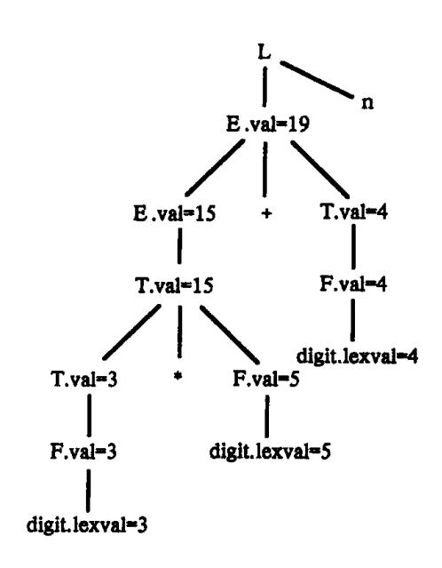

图 6.1 3 \* 5 + 4n 的带注释的语法树

为了说明属性值是如何计算出来的,首先考虑最底最左边的内部结点,它对应于产生式  $F \rightarrow digit$ ,相应的语义规则为 F. val: = digit.lexval,由于这个结点的子结点 digit 的属性 digit.lexval 的值为 3,所以决定了结点 F 的属性 F. val 的值也为 3。同样,在 F. 结点的父结点处,属性 T. val 的值也算得为 3。

我们再考虑关于产生式  $T \rightarrow T_1 * F$  的结点。这个结点的属性 T.val 的值由下面的语义规则确定:

当我们在这个结点应用语义规则时,从左子结点得到  $T_1$ . val 的值为 3,从右子结点得到 F. val值为 5,因此,在这个结点中算得 T. val 的值为 15……

最后,包含开始符号 L 的产生式 L→En 对应的语义规则打印出通过 E 得到的表达式的值。

# 继承属性

在语法树中,一个结点的继承属性由此结点的父结点和/或兄弟结点的某些属性确定。用继承属性来表示程序设计语言结构中的上下文依赖关系很方便。例如,我们可以利用一个继承属性来跟踪一个标识符,看它是出现在赋值号的左边还是右边,以确定是需要这个标识符的地址还是值。尽管我们有可能仅用综合属性来改写一个属性文法,但是使用带有继承属性的属性文法有时更为自然。

在下面的例子中,继承属性在说明中为各种标识符提供类型信息。

例 6.2 在表 6.2 中给出的属性文法中,由非终结符 D 所产生的说明含关键字 int 和 real,后跟一个标识符表。非终结符 T 有一个综合属性 type,它的值由说明中的关键字确定。与产生式 D→TL 相应的语义规则 L. in: = T. type 把说明中的类型赋值给继承属性 L. in。然后,利用语义规则把继承属性 L. in 沿着语法树往下传。与 L 的产生式相应的语义规则调用过程 addtype 把每个标识符的类型填入符号表的相应项中(符号表入口由属性 entry 指明)。

{3}------------------------------------------------

| 产生式      | 语 义 规 则                 |  |
|----------|-------------------------|--|
| D→TL     | L.in := T.type          |  |
| T→int    | T.type : = integer      |  |
| T→real   | T.type:= real           |  |
| L→I₄, id | $L_1$ . in $:=L$ . in   |  |
| ·        | addtype(id.entry, L.in) |  |
| L→id     | addtype(id.entry, L.in) |  |

表 6.2 带继承属性 L. in 的属性文法

图 6.2 给出了句子 real  $id_1$ ,  $id_2$ ,  $id_3$  的带注释的语法树。在三个 L 结点中 L. in 的值分别给出了标识符  $id_1$ 、 $id_2$ 、 $id_3$  的类型。为了确定这三个属性值,先求出根的左子结点的属性值 T. type, 然后每项向下计算根的右子树的三个 L 结点的属性值 L. in。在每个 L 结点还要调用过程 addtype,往符号表中插入信息,说明本结点的右子结点上的标识符类型为 real。

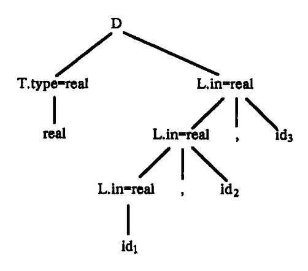

图 6.2 在每个 L 结点都带有继承属性的语法树

# 6.2 基于属性文法的处理方法

从概念上讲,基于属性文法的处理过程通常是这样的:对单词符号串进行语法分析,构造语法分析树,然后根据需要遍历语法树并在语法树的各结点处按语义规则进行计算(如图 6.3 所示)。

#### 输入串 ── 语法树 ── 依赖图 ── 语义规则计算次序

#### 图 6.3 语法制导翻译概观

这种由源程序的语法结构所驱动的处理办法就是**语法制导翻译法**。语义规则的计算可能产生代码、在符号表中存放信息、给出错误信息或执行任何其它动作。对输入符号串的翻译也就是根据语义规则进行计算的结果。

然而,一个具体的实现并不一定非要按图 6.3 的轮廓不可。在某些情况下可用一遍 扫描实现属性文法的语义规则计算。也就是说在语法分析的同时完成语义规则的计算、 

{4}------------------------------------------------

无须明显地构造语法树或构造属性之间的依赖图。因为单遍实现对于编译效率非常重要,所以这一章的许多部分都是讨论这些特殊情况。有一个重要的子类称为"L-属性文法",对于该类属性文法,不用显式构造语法树就可以实现翻译。

## 6.2.1 依赖图

如果在一棵语法树中一个结点的属性 b 依赖于属性 c,那么这个结点处计算 b 的语义规则必须在确定 c 的语义规则之后使用。在一棵语法树中的结点的继承属性和综合属性之间的相互依赖关系可以由称作**依赖图**的一个有向图来描述。

在为一棵语法树构造依赖图以前,我们为每一个包含过程调用的语义规则引入一个虚综合属性 b,这样把每一个语义规则都写成

$$b: = f(c_1, c_2, \dots, c_k)$$

的形式。依赖图中为每一个属性设置一个结点,如果属性 b 依赖于属性 c,则从属性 c 的结点有一条有向边连到属性 b 的结点。更详细地说,对于给定的一棵语法分析树,依赖图是按下面步骤构造出来的:

for 语法树中每一结点 n do

for 结点 n 的文法符号的每一个属性 a do 为 a 在依赖图中建立一个结点;

for 语法树中每一个结点 n do

for 结点 n 所用产生式对应的每一个语义规则

 $b_1 = f(c_1, c_2, \dots, c_k) do$ 

for i := 1 to k do

从 c; 结点到 b 结点构造一条有向边;

例如,假设

$$A.a: = f(X.x,Y.y)$$

是对应于产生式  $A \rightarrow XY$  的一个语义规则,这条语义规则确定了依赖于属性 X.x 和 Y.y 的综合属性 A.a.如果在语法树中应用这个产生式,那么在依赖图中会有三个结点 A.a.0、X.x1、X.x2、由于 X.x3、由于 X.x4、所以有一条有向边从 X.x4、连到 X.x4、由于 X.x5 依赖于 X.x9、所以还有一条有向边从 X.x5 在 X.x9 在 X.x9。由于 X.x9。由于 X.x9。由于 X.x9。由于 X.x9。由于 X.x9。由于 X.x9。由于 X.x9。由于 X.x9。由于 X.x9。由于 X.x9。由于 X.x9。由于 X.x9。由于 X.x9。由于 X.x9。由于 X.x9。由于 X.x9。由于 X.x9。由于 X.x9。由于 X.x9。由于 X.x9。由于 X.x9。由于 X.x9。

如果与产生式 A→XY 对应的语义规则还有

$$X.i := g(A.a, Y.y)$$

那么,图中还应有两条有向边,一条从 A.a 连到 X.i,另一条从 Y.y 连到 X.i,因为 X.i 依赖于 A.a 和 Y.y。

例 6.3 当下面的产生式应用于语法树中时,我们就像图 6.4 所示的那样把有向边加入到依赖图中。

产生式 语义规则 
$$E \rightarrow E_1 + E_2$$
  $E. val: = E_1. val + E_2. val$ 

依赖图中用·来标志的三个结点分别代表语法树中相应结点的综合属性  $E.val, E_l.val$  和  $E_2.val$ 。从  $E_1.val$  到 E.val 的有向边表明 E.val 依赖于  $E_1.val$ ,同样,从  $E_2.val$  到 E.val 的有向边表示 E.val 也依赖于  $E_2.val$ 。图 6.4 中的虚线表示的是语法树,它不是依赖图中

{5}------------------------------------------------

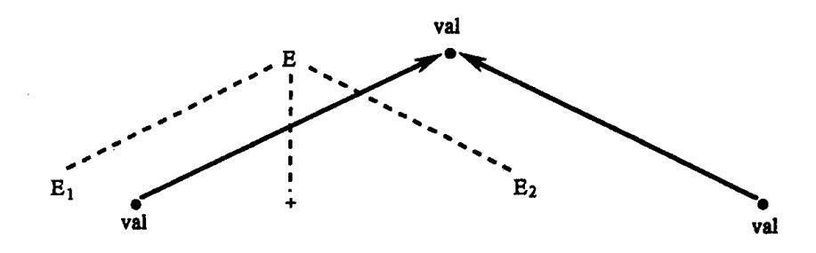

图 6.4 E. val 是从 E1. val 和 E2. val 综合得出

的一部分。

例 6.4 图 6.5 表示的是图 6.2 的依赖图。依赖图中的结点由数字来标识,这些数字将在下面用到。从代表 T. type 的结点 4 有一条有向边连到代表 L. in 的结点 5 ,因为根据产生式  $D \rightarrow TL$  的语义规则 L. in: = T. type,可知 L. in 依赖于 T. type。根据  $L \rightarrow L_1$  ,id 的语义规则可知,有两条向下的有向边分别进入结点 7 和 9。每一个与 L 产生式有关的语义规则 addtype(id. entry, L. in)都产生一个虚属性,结点 6 、8 和 10 都是为这些虚属性构造的。

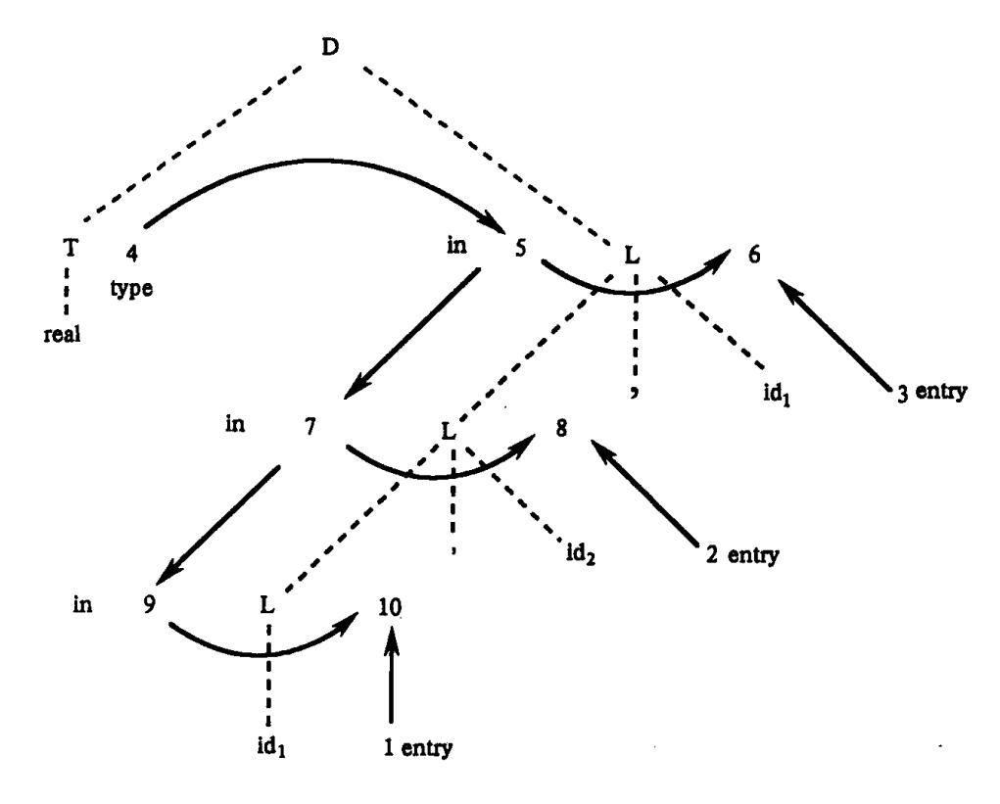

图 6.5 图 6.2 中语法分析树的依赖图

很显然,一条求值规则只有在其各变元值均已求得的情况下才可以使用。但有时候可能会出现一个属性对另一个属性的循环依赖关系。例如,p、 $c_1$ 、 $c_2$  都是属性,若有如下求值规则 p: =  $f_1(c_1)$ 、 $c_1$ : =  $f_2(c_2)$ 、 $c_2$ : =  $f_3(p)$ 时,就无法对 p 求值。如果一属性文法不存在属性之间的循环依赖关系,那么称该文法为**良定义的**。为了设计编译程序,我们只处理良定义的属性文法。

### 下面讨论**属性的计算次序**。

一个有向非循环图的拓扑序是图中结点的任何顺序 m<sub>1</sub>, m<sub>2</sub>, ···, m<sub>k</sub>, 使得边必须是从

{6}------------------------------------------------

序列中前面的结点指向后面的结点。也就是说,如果  $m_i \rightarrow m_j$  是  $m_i$  到  $m_j$  的一条边,那么在序列中  $m_i$  必须出现在  $m_i$  之前。

一个依赖图的任何拓扑排序都给出一个语法树中结点的语义规则计算的有效顺序。这就是说,在拓扑排序中,在一个结点上,语义规则  $b_1 = f(c_1, c_2, \cdots, c_k)$ 中的属性  $c_1, c_2, \cdots, c_k$  在计算 b 以前都是可用的。

属性文法说明的翻译是很精确的。基础文法用于建立输入符号串的语法分析树。依赖图如上面讨论的那样建立。从依赖图的拓扑排序中,我们可以得到计算语义规则的顺序。用这个顺序来计算语义规则就得到输入符号串的翻译。

例 6.5 在图 6.5 的依赖图中,每一条边都是从序号较低的结点指向序号较高的结点。因此,依赖图的一个拓扑排序可以从低序号到高序号顺序写出。从这个拓扑排序中我们可以得到下列程序,用 an 来代表依赖图中与序号 n 的结点有关的属性:

```
a<sub>4</sub>: = real
a<sub>5</sub>: = a<sub>4</sub>
addtype (id<sub>3</sub>.entry, a<sub>5</sub>);
a<sub>7</sub>: = a<sub>5</sub>;
addtype (id<sub>2</sub>.entry, a<sub>7</sub>)
a<sub>9</sub>: = a<sub>7</sub>
addtype (id<sub>1</sub>.entry, a<sub>9</sub>)
```

这些语法规则的计算将把 real 类型填入到每个标识符对应的符号表项中。

### 6.2.2 树遍历的属性计算方法

现在我们来考虑如何通过树遍历的方法计算属性的值。通过树遍历计算属性值的方法有多种。这些方法都假设语法树已经建立起了,并且树中已带有开始符号的继承属性和终结符的综合属性。然后以某种次序遍历语法树,直至计算出所有属性。最常用的遍历方法是深度优先,从左到右的遍历方法。如果需要的话,可使用多次遍历(或称遍)。

下面算法可对任何无循环的属性文法进行计算。

```
While 还有未被计算的属性 do
    VisitNode(S)
```

计算 N 的所有能够计算的综合属性

{7}------------------------------------------------

只要文法的属性是非循环定义的,则每一次扫描至少有一个属性值被计算出来。如果语法树有 n 个结点(因此最多有 O(n) 个属性),最坏的情况整个遍历需  $O(n^2)$ 时间。

例 6.6 考虑表 6.3 所给的属性的文法 G。其中,S 有继承属性 a,综合属性 b; X 有继承属性 c、综合属性 d; Y 有继承属性 e、综合属性 f; Z 有继承属性 h、综合属性 g。

| 表 | 6.3 | 语义规则 | 砂中な | 盲较复 | 杂的 | 依赖关系 |
|---|-----|------|-----|-----|----|------|
|---|-----|------|-----|-----|----|------|

| 产生式   | 语义规则           |
|-------|----------------|
| S→XYZ | Z.h := S.a     |
|       | X.c:= Z.g      |
|       | S.b := X.d - 2 |
|       | Y.e:= S.b      |
| X→x   | X.d: = 2 * X.c |
| Y→y   | Y.f := Y.e * 3 |
| Z→z   | Z.g := Z.h + 1 |

假设 S.a 的初始值为 0,则输入串 xyz 的语法树如图 6.6(a)所示。

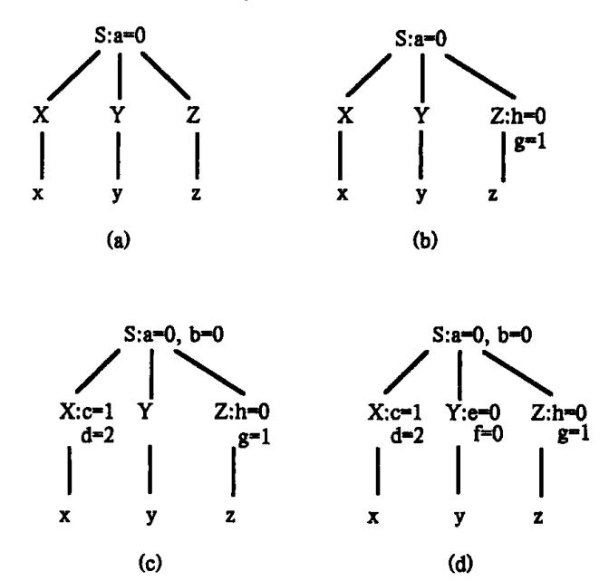

图 6.6 对文法 G 的属性计算步骤

(a)初始状态;(b)对 VisitNode(S)的第一次调用后;(c)对 VisitNode(S)第二次调用后;(d)最终状态。

## 第一次遍历的执行过程如下:

VisitNode (S)

X.c 不能计算

VisitNode (X)

X.d 不能计算

Y.e 不能计算

VisitNode (Y)

Y.f 不能计算

{8}------------------------------------------------

Z.h = 0

VisitNode (Z)

Z.g:=1

S.b 不能计算

第一遍以后,树的状态如图 6.6(b)所示。第二次调用 VisitNode (S)导致对 X.c.X.d和 S.b 的依次计算,树的状态如图 6.6(c)所示。最后第三遍扫描算出 Y 的两个属性,树的最终状态如图 6.6(d)所示。

### 6.2.3 一遍扫描的处理方法

与树遍历的属性计算方法不同,一遍扫描的处理方法是在语法分析的同时计算属性值,而不是语法分析构造语法树之后进行属性的计算,而且无需构造实际的语法树(如果有必须,当然也可以实际构造)。采用这种处理方法,当一个属性值不再用于计算其它属性值时,编译程序就不必再保留这个属性值。当然,如果需要,也可以把这些语义值存到文件中。

因为一遍扫描的处理方法与语法分析器的相互作用,它与下面两个因素密切相关:

- (1) 所采用的语法分析方法;
- (2) 属性的计算次序。

后面几节中,我们将会看到,L-属性文法可用于一遍扫描的自上而下分析,而 S-属性文法适合于一遍扫描的自下而上分析。

如果按这种一遍扫描的编译程序模型来理解语法制导翻译方法的话,所谓语法制导翻译法,直观上说就是为文法中每个产生式配上一组语义规则,并且在语法分析的同时执行这些语义规则。在自上而下语法分析中,若一个产生式匹配输入串成功,或者,在自下而上分析中,当一个产生式被用于进行归约时,此产生式相应的语义规则就被计算,完成有关的语义分析和代码产生的工作。可见,在这种情况下,语法分析工作和语义规则的计算是穿插进行的。

#### 6.2.4 抽象语法树

从前面的讨论我们知道,通过语法分析可以很容易构造出语法分析树,然后对语法树进行遍历完成属性的计算。因此,语法树可以作为一种合适的中间语言形式。在语法树中去掉那些对翻译不必要的信息,从而获得更有效的源程序中间表示。这种经变换后的语法树称之为抽象语法树(Abstract Syntax Tree)。

如产生式 S→if B then S<sub>l</sub> else S<sub>2</sub> 在抽象语法树中表示为

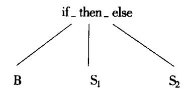

在抽象语法树中,操作符和关键字都不作为叶结点出现,而是把它们作为内部结点,即这些叶结点的父结点。例如,下面是表达式3\*5+4的抽象语法树:

{9}------------------------------------------------

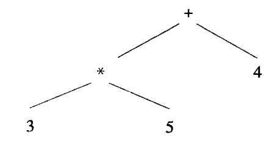

语法制导翻译既可以基于语法分析树,也可以基于抽象语法树进行。两种情况所采用的基本方法是一样的。像在语法分析树一样,在抽象语法树的每个结点上都可带上一定的属性。

下面讨论如何建立表达式的抽象语法树。

建立表达式的抽象语法树与把表达式翻译成后缀形式类似。我们通过为每一个运算分量或运算符号都建立一个结点来为子表达式建立子树。运算符号结点的各子结点分别是表示该运算符号的各个运算分量的子表达式组成的子树的根。

抽象语法树中的每一个结点可以由包含几个域的记录来实现的。在一个运算符号对应的结点中,一个域标识运算符号,其它域包含指向运算分量的结点的指针。运算符号通常叫作这个结点的标号。当我们进行翻译时,抽象语法树中的结点可能会用附加的域来存放结点的属性值(或指向属性值的指针)。在这一节中,我们用下面的一些函数来建立表示带有二目算符的表达式的抽象语法树中的结点。每一个函数都返回一个指向新建立结点的指针。

- (1) mknode (op, left, right) 建立一个运算符号结点,标号是 op,两个域 left 和 right 分别指向左子树和右子树。
- (2) mkleaf (id, entry) 建立一个标识符结点,标号为 id,一个域 eutry 指向标识符在符号表中的人口。
  - (3) mkleaf (num, ral) 建立一个数结点,标号为 num,一个域 ral 用于存放数的值。
- 例 6.7 下面一系列函数调用建立了表达式 a-4+c 的抽象语法树(见图 6.7)。在这个序列中, $p_1$ , $p_2$ ,…, $p_5$  是指向结点的指针,entrya 和 entryc 分别是指向符号表中的标识符 a 和 c 的指针。
  - (1)  $p_1$ : = mkleaf (id, entrya);
  - (2)  $p_2$ : = mkleaf (num, 4);
  - (3)  $p_3$ : = mknode ('-',  $p_1$ ,  $p_2$ );
  - (4)  $p_4$ : = mkleaf (id, entryc);
  - (5)  $p_5$ : = mknode ('+',  $p_3$ ,  $p_4$ );

这棵抽象语法树是自底向上构造起来的。函数调用 mkleaf(id, entrya)和 mkleaf(num,4)建立了叶结点 a 和 4,指向这两个结点的指针分别用  $p_1$  和  $p_2$  存放。函数调用  $mknode('-',p_1,p_2)$ 建立内部结点,它以叶结点 a 和 4 为子结点。再经过两步,p5 成为指向根结点的左指针。

下面考虑建立抽象语法树的语义规则。

表 6.4 是一个为包含运算符号 + 和 – 的表达式建立抽象语法树的 S – 属性文法。它利用文法的基本产生式来安排函数 mknode 和 mkleaf 的调用以建立语法树。E 和 T 的综合属性 nptr 是函数调用返回的指针。

{10}------------------------------------------------

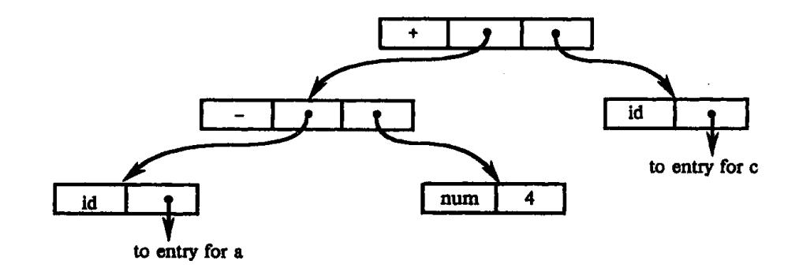

图 6.7 a-4+c 的抽象语法树

表 6.4 为表达式建立抽象语法树的属性文法

| 产生式                     | 语 义 规 则                                                 |
|-------------------------|---------------------------------------------------------|
| E→E <sub>1</sub> + T    | E. nptr := mknode( '+', E <sub>1</sub> . nptr, T. nptr) |
| $E \rightarrow E_1 - T$ | E. nptr : = mknode( '-', $E_1$ . nptr, $T$ . nptr)      |
| <u>E</u> →T             | E. nptr: = T. nptr                                      |
| T→(E)                   | E.nptr := T.nptr                                        |
| T→id                    | T.nptr := mkleaf(id, id.entry)                          |
| T→num                   | T.nptr := mkleaf(num, num.val)                          |

例 6.8 一个带注释的语法分析树如图 6.8 所示,它用来描绘表达式 a-4+c 的抽象语法树的构造。语法分析树是用虚线表示的。语法分析树之中的 E 和 T 标识的结点用综合属性 nptr 来保存指向抽象语法树中非终结符号代表的表达式结点的指针。

与产生式 T→id 和 T→num 相对应的语义规则决定了属性 T. nptr 分别表示指向一个

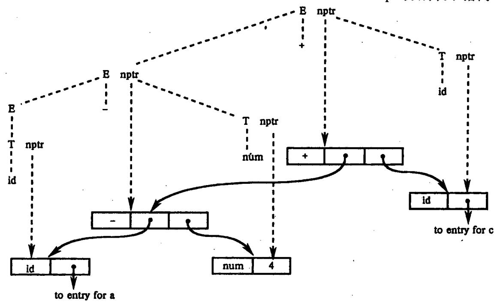

图 6.8 a-4+c的抽象语法树的构造

{11}------------------------------------------------

标识符和一个数的新的叶结点的指针。属性 id. entry 和 num. val 是词法值,我们假设这些值是由词法分析器提供的。

在图 6.8 中,当一个表达式 E 是一个单个项时,相应于使用产生式 E T ,属性 E . nptr 得到 T . nptr 的值。当与产生式 E E E I I I I I I I I I I

为了解释图 6.8,我们应注意,图中下面的由记录组成的树是构成输出的一个"真正的"抽象语法树,而上面的虚线是一个语法分析树,它只是象征性地存在。在后面,我们将讨论一个 S-属性文法是怎样使用自底向上分析器的栈跟踪属性值的方法来简单地实现的。实际上,在这样的实现过程中,建立结点的函数调用顺序与在例 6.7 中顺序相同。

# 6.3 S-属性文法的自下而上计算

既然我们已经知道了如何用属性文法来说明翻译,现在我们就来研究怎样实现这种翻译器。通过前面的介绍,我们可以知道一个一般的属性文法的翻译器可能是很难建立的,然而有一大类属性文法的翻译器是很容易建立的。这一节我们考虑这样的一类属性文法:S-属性文法,它只含有综合属性。下面几节将介绍带有继承属性的属性文法的实现。

综合属性可以在分析输入符号串的同时由自下而上的分析器来计算。分析器可以保存与栈中文法符号有关的综合属性值,每当进行归约时,新的属性值就由栈中正在归约的产生式右边符号的属性值来计算。这一节我们将介绍怎样扩充分析器中的栈来存放这些综合属性值。在 6.5 节中我们将看到这种实现对于某些继承属性的计算也适用。

S-属性文法的翻译器通常可借助于 LR 分析器实现。在 S-属性文法的基础上, LR 分析器可以改造为一个翻译器, 在对输入串进行语法分析的同时对属性进行计算。

下面我们讨论分析栈中的综合属性。

在自底向上的分析方法中,我们使用一个栈来存放已经分析过的子树的信息。现在我们可以在分析栈中使用一个附加的域来存放综合属性值。图 6.9 表示的是一个带有一个属性值空间的分析栈的例子。我们假设图中的栈是由一对数组 state 和 val 来实现的。每一个 state 元素都是一个指向 LR(1)分析表的指针(或索引)。(注意,文法符号隐含在 state 中而不需存储在栈中)。然而,如果像第五章中那样把文法符号放入栈中时,那么当第 i 个 state 对应的符号为 A 时,val[i]中就存放语法树中与结点 A 对应的属性值。

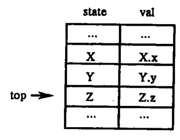

图 6.9 带有综合属性域的分析栈

{12}------------------------------------------------

设当前的栈顶由指针 top 指示。我们假设综合属性是刚好在每次归约前计算的。假设语义规则 A.a: = f(X.x,Y.y,Z.z)是对应于产生式  $A \rightarrow XYZ$  的。在把 XYZ 归约成 A 以前,属性 Z.z 的值放在 val[top]中,Y.y 的值放在 val[top-1]中,X.x 的值放在 val[top-2]中。如果一个符号没有综合属性,那么数组 val 中相应的元素就不定义。归约以后,top 值减 Z.A 的状态存放在 state[top]中(也就是 X 的位置),综合属性 A.a 的值存放在 val[top]中。

例 6.9 我们再考虑一下表 6.5 中台式计算器的属性文法。在自底向上分析输入符号串 3 \* 5 + 4n 时,图 6.1 中带注释的语法树的综合属性可以由 LR 分析器计算出来。像前面一样,我们假设属性 digit. lexval 的值是由词法分析器产生的,它代表一个数字的数值。当分析器把一个 digit 移入栈的时候,输入的数字应放在 state[top]中,它的属性值放在 val[top]中。

| 产生式                     | 代 码 段                                |
|-------------------------|--------------------------------------|
| L→En                    | print(val[top])                      |
| - E-→E <sub>1</sub> + T | val[ntop] := val[top-2] + val[top]   |
| E→T                     |                                      |
| $T \rightarrow T_1 * F$ | val[ntop] := val[top - 2] * val[top] |
| T→F                     |                                      |
| F→(E)                   | val[ntop] : = val[top - 1]           |
| F→digit                 |                                      |

表 6.5 用 LR 分析器实现台式计算器

我们可以用第五章中的技术来为上述文法构造 LR 分析器。为了计算属性值,我们可以修改分析程序,使其在作相应的归约以前执行表 6.5 所示的代码段。注意,我们可以把属性计算与归约联系起来,因为每一次归约决定着所用的产生式。代码段是将表 6.5 中的语义规则通过用 val 数组中的一个位置来代替规则中的每一个属性而得到的。

代码段中并没有说明如何控制变量 top 和 ntop。当右边带有 r 个符号的产生式被归约时,在执行相应的代码段之前,应将 top - r + 1 的值赋给新的栈顶 ntop,在每一个代码段被执行之后,ntop 的值赋给 top。

表 6.6 表示的是分析器在输入 3\*5+4n 上的移动序列。在每一次移动后,给出了分析栈中 state 和 val 域的内容。我们仍用相应的文法符号来代替 state 中的状态,而且给出实际的输入数字而不是符号 digit。

| 输入         | state | val | 用到的产生式  |
|------------|-------|-----|---------|
| 3 * 5 + 4n |       | _   |         |
| * 5 + 4n   | 3     | 3   |         |
| * 5 + 4n   | F     | 3   | F→digit |
| * 5 + 4n   | Т     | 3   | T→F     |
| 5 + 4n     | T *   | 3 – |         |

表 6.6 翻译输入 3 \* 5 + 4n 所做的移动

{13}------------------------------------------------

| 输入   | state | val ,  | 用到的产生式  |
|------|-------|--------|---------|
| + 4n | T * 5 | 3 – 5  |         |
| + 4n | T * F | 3 – 5  | F→digit |
| + 4n | Т     | 15     | T→T * F |
| + 4n | E     | 15     | E→T     |
| 4n   | E+    | 15 –   |         |
| n    | E + 4 | 15 – 4 |         |
| n    | E+F   | 15 – 4 | F→digit |
| n    | E+T   | 15 – 4 | T→F     |
| n    | E     | 19     | E→E+T   |
|      | En    | 19 –   |         |
|      | L     | 19     | L→En    |

我们讨论一下在遇到符号 3 时的移动序列。第一步,分析器把符号 digit(它的属性值为 3)的相应状态移入栈中(状态由 3 代表,并且值 3 存放在 val 域中)。第二步,分析器通过产生式 F→digit 进行归约,并执行语义规则 F. val: = digit. lexval。第三步,分析器通过 T→F 进行归约,没有代码段与这个产生式相对应,所以 val 数组没有改变。注意,每次归约后,val 栈顶存放的是归约所用产生式的左边符号的属性值。

在上面描述的实现中,代码段刚好在归约以前执行。归约提供了一个"挂钩",使得代码段中的动作能够与之相联。也就是说,我们可以允许用户把一个语义动作与一个产生式联系起来,这个动作是当利用该产生式进行归约时要被执行的。在下一节中,我们将看到,翻译模式提供了一种描述与分析器相互穿插的动作的方法。在 6.5 节中,我们将看到有很大一类属性文法可以在自底向上的分析过程中实现。

# 6.4 L-属性文法和自顶向下翻译

在 6.2 节中我们知道,可以通过深度优先的方法对语法树进行遍历,从而计算属性文法的所有属性值。在本节中我们讨论一类属性文法,叫做 L - 属性文法,这类属性文法允许我们通过一次遍历就计算出所有属性值。诸如 LL(1)这种自上而下分析方法的分析过程,从概念上说可以看成是深度优先建立语法树的过程,因此,我们可以在自上而下语法分析的同时实现 L 属性文法的计算。

- 一个属性文法称为 L **属性文法**,如果对于每个产生式  $A \rightarrow X_1 X_2 \cdots X_n$ ,其每个语义规则中的每个属性或者是综合属性,或者是  $X_j (1 \le j \le n)$ 的一个继承属性且这个继承属性仅依赖于:
  - (1) 产生式  $X_i$  的左边符号  $X_1, X_2, \dots, X_{i-1}$ 的属性;
  - (2) A 的继承属性。

{14}------------------------------------------------

由上述定义可见,S-属性文法一定是 L-属性文法,因为(1)、(2)限制只用于继承属性。

6.1 节中曾介绍过的例 6.1 和例 6.2 是 L – 属性文法。但表 6.7 所定义的属性文法不是 L – 属性文法,因为文法符号 Q 的继承属性 Q. i 依赖于它右边的文法符号的属性 R. s。

| 产生式  | 语 义 规 则                           |
|------|-----------------------------------|
| A→LM | L.i := l(A.i)                     |
|      | $\mathbf{M.i} := \mathbf{m(1.s)}$ |
| A→QR | R.i := r(A.i)                     |
|      | Q.i := q(R.s)                     |
|      | A.s := f(Q.s)                     |

表 6.7 非 L-属性文法例子

### 6.4.1 翻译模式

属性文法可以看作是关于语言翻译的高级规范说明,其中隐去实现细节,使用户从明确说明翻译顺序的工作中解脱出来。下面我们讨论一种适合语法制导翻译的另一种描述形式,称为翻译模式(Translation schemes)。翻译模式给出了使用语义规则进行计算的次序,这样就可把某些实现细节表示出来。在翻译模式中,和文法符号相关的属性和语义规则(这里我们也称语义动作),用花括号{{}} 括起来,插入到产生式右部的合适位置上。这样翻译模式给出了使用语义规则进行计算的顺序。

下面是一个简单的翻译模式例子,它把带加号和减号的中缀表达式翻译成相应的后缀表达式。

E→TR

 $R \rightarrow addop T \{ print(addop.lexeme) \} R_1 | \epsilon$ 

 $T \rightarrow \text{num} \{ \text{print}(\text{num.val}) \}$ 

图 6.10 表示的是关于输入串 9-5+2 的语法树,每个语义动作都作为相应产生式左

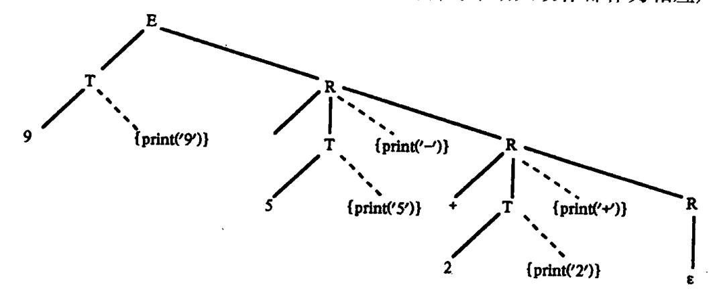

图 6.10 9-5+2 的说明动作的语法分析树

{15}------------------------------------------------

部符号的结点的儿子。这样,把语义动作看作是终结符号,表示在什么时候应该执行哪些动作。为了便于说明,图中用实际的数字和加法运算符代替了单词 num 和 addop。当按深度优先次序执行图 6.10 中的动作后,打印输出 95 – 2 + 。

设计翻译模式时,我们必须注意某些限制以保证当某个动作引用一个属性时它必须 是有定义的。L-属性文法本身就能确保每个动作不会引用尚未计算出来的属性。

当只需要综合属性时,情况最为简单。在这种情况下,我们可以这样来建立翻译模式:为每一个语义规则建立一个包含赋值的动作,并把这个动作放在相应的产生式右边的末尾。例如,假设有下面的产生式和语义规则:

我们建立产生式和语义动作:

$$T \rightarrow T_1 \times F$$
  $\{T. val := T_1. val \times F. val\}$ 

如果既有综合属性又有继承属性,在建立翻译模式时就必须特别小心。

- (1) 产生式右边的符号的继承属性必须在这个符号以前的动作中计算出来。
- (2) 一个动作不能引用这个动作右边的符号的综合属性。
- (3)产生式左边非终结符的综合属性只有在它所引用的所有属性都计算出来以后才能计算。计算这种属性的动作通常可放在产生式右端的末尾。

后面我们将看到满足这三个条件的翻译模式是如何在一般的自上而下和自下而上分 析器中实现的。

下面的翻译模式不满足上述三个条件中的第一个条件:

$$S \rightarrow A_1 A_2$$
 {A<sub>1</sub> · in: = 1; A<sub>2</sub> · in: = 2}  
 $A \rightarrow a$  {print(A. in)}

我们可以看出,按深度优先遍历输入串 aa 的语法树,当要打印第二个产生式里继承属性 A. in 时的值时,该属性还没有定义。也就是说,从 S 开始按深度优先遍历  $A_1$  和  $A_2$  子树之前,  $A_1$ . in 和  $A_2$ . in 还未赋值。如果计算  $A_1$ . in 和  $A_2$ . in 的值的动作分别被嵌入在产生式  $S \rightarrow A_2 A_2$  的右部  $A_1$  和  $A_2$  之前而不是后面,那么 A. in 在每次执行 Print(A. in)时已有定义。

通常,给定一个 L-属性文法,可以建立一个满足上述三个条件的翻译模式。下面例子说明这种建立方法。它基于数学格式语言 EQN。给定输入

EQN 把 E,1 和.val 分别按不同的大小放在相关的位置上,如图 6.11 所示。

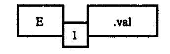

图 6.11 盒子的语法制导安放

例 6.10 按照 EQN 语言的功能,表 6.8 列出了识别输入并进行格式安放的 L – 属性文法。文法中,非终结符 B(表示盒子)代表一个公式,产生式 B $\rightarrow$ BB 代表两个盒子并置, B $\rightarrow$ B<sub>1</sub> sub B<sub>2</sub> 代表 B<sub>3</sub> 的大小比 B<sub>1</sub> 的小,并且放在下角标的位置。

{16}------------------------------------------------

| 产生式                                  | 语 义 规 则                              |  |
|--------------------------------------|--------------------------------------|--|
| S→B                                  | B.ps : = 10                          |  |
|                                      | S.ht := B.ht                         |  |
| $B \rightarrow B_1 B_2$              | $B_1 \cdot ps := B \cdot ps$         |  |
|                                      | $B_2 \cdot ps := B \cdot ps$         |  |
|                                      | $B.ht := max(B_1.ht, B_2.ht)$        |  |
| $B \rightarrow B_1 \text{ sub } B_2$ | $B_1 \cdot ps := B \cdot ps$         |  |
|                                      | $B_2 \cdot ps := shrink(B \cdot ps)$ |  |
|                                      | $B.ht := disp(B_1.ht, B_2.ht)$       |  |
| B→text                               | $B.ht := text.h \times B.ps$         |  |

表 6.8 盒子大小和高度的属性文法

继承属性 ps 将影响公式的高度。产生式 B→text 对应的语义规则使得 text 的标准高度乘以 ps 得到 text 的实际高度。关于 text 的属性 h 通过查表获得,由单词 text 所表示的字符给出。当应用产生式 B→ $B_1B_2$  时, $B_1$  和  $B_2$  通过复写规则继承 ps 的值。综合属性 B. ht代表 B 的高度,它取  $B_1$ . ht 和  $B_2$ . ht 的最大值。

当使用产生式  $B \rightarrow B_1$  sub  $B_2$  时,函数 shrink 使  $B_2$ .ps 减少 30%。函数 disp 把盒子  $B_2$  向下放置,并计算 B 的高度。在这里,产生实际排字命令的规则没有给出来。

文法中,唯一的继承属性是非终结符 B 的 ps 属性,每条定义 ps 属性的语义规则只依赖于产生式左边非终结符的继承属性。因此它是一个 L - 属性文法。

对于表 6.8 给出的 L - 属性文法,我们可以建立相应的翻译模式,如图 6.12 所示。它满足上述的三个条件。为了可读,产生式中每个文法符号都写在单独一行上,相应的动作写在右边。如

$$S \rightarrow \{B. ps: = 10\}$$
 B  $\{S. ht: = B. ht\}$ 

写成

$$S \rightarrow \{B.ps: = 10\}$$

$$B \quad \{S.ht: = B.ht\}$$

值得注意的是,翻译模式中置继承属性  $B_1$ . ps 和  $B_2$ . ps 值的动作正好出现在产生式右部中  $B_1$  和  $B_2$  的前面。

S 
$$\Rightarrow$$
 {B. ps: = 10}  
B {S. ht: = B. ht}  
B  $\Rightarrow$  {B<sub>1</sub> . ps: = B. ps}  
B<sub>1</sub> {B<sub>2</sub> . ps: = B. ps}  
B<sub>2</sub> {B. ht: = max(B<sub>1</sub> . ht, B<sub>2</sub> . ht)}  
B  $\Rightarrow$  {B<sub>1</sub> . ps: = B. ps}  
B<sub>1</sub>  
sub {B<sub>2</sub> . ps: = shrink(B. ps)}  
B<sub>2</sub> {B. ht: = disp(B<sub>1</sub> . ht, B<sub>2</sub> . ht)}  
B  $\Rightarrow$  text{B. ht: = text. h × B. ps}

图 6.12 从表 6.8 构造出的翻译模式

{17}------------------------------------------------

# 6.4.2 自顶向下翻译

下面,我们讨论 L-属性文法在自顶向下分析中的实现。为了便于说明动作的顺序和属性计算的顺序,我们用翻译模式进行描述。

在第四章我们知道,为了构造不带回溯的自顶向下语法分析,必须消除文法中的左递归。现在我们把前面讨论过的消除左递归的算法加以扩充,当消除一个翻译模式的基本文法的左递归时同时考虑属性。这种方法适合带综合属性的翻译模式。这样,许多属性文法可以使用自顶向下分析来实现。下面举一个例子。

由于大多数算术运算符号都是左递归的,因此,我们很自然地用左递归文法来产生算术表达式。关于算术表达式的左递归文法相应的翻译模式形式如图 6.13 所示。

```
E \rightarrow E_1 + T \quad \{E. val := E1. val + T. val\}
E \rightarrow E_1 - T \quad \{E. val := E_1. val - T. val\}
E \rightarrow T \quad \{E. val := T. val\}
T \rightarrow (E) \quad \{T. val := E. val\}
T \rightarrow num \quad \{T. val := num. val\}
```

图 6.13 带左递归的文法的翻译模式

对图 6.13 消除左递归,构造新的翻译模式如图 6.14 所示。新的翻译模式产生的表达式 9-5+2 的带注释的语法树如图 6.15 所示。图中箭头指明了对表达式计算的顺序。

```
E \rightarrow T \quad \{R.i: = T.val\}
R \quad \{E.val: = R.s\}
R \rightarrow +
T \quad \{R_1.i: = R.i + T.val\}
R_1 \quad \{R.s: = R_1.s\}
R \rightarrow -
T \quad \{R_1.i: = R.i - T.val\}
R_1 \quad \{R.s: = R_1.s\}
R \rightarrow \varepsilon \quad \{R.s: = R.i\}
T \rightarrow (
E
) \{T.val: = E.val\}
T \rightarrow num \quad \{T.val: = num.val\}
```

图 6.14 消除左递归后的翻译模式

在图 6.14 中的翻译模式中,每个数都是由 T 产生的,并且 T. val 的值就是由属性 num. val 给出的数的词法值。子表达式 9-5 中的数字 9 是由最左边的 T 生成的,但是减号和 5 是由根的右子结点 R 生成的。继承属性 R.i 从 T. val 得到值 9。计算 9-5 并把结果 4 传递到中间的 R 结点,这是通过产生式中嵌入的下面动作实现:

$$\{R_1.i:=R.i-T.val\}$$

{18}------------------------------------------------

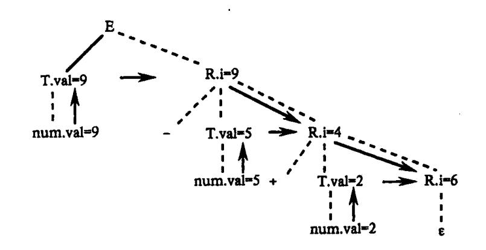

图 6.15 计算表达式 9-5+2

类似的动作把 2 加到 9 – 5 的值上,在最下面的 R 结点处产生结果 R.i = 6。这个结果将成为根结点处 E.val 的值; R 的综合属性 s 在图 6.15 中没有表示出来,它用来向上复制这一结果一直到树根。

对于自顶向下分析,我们假设动作是在处于相同位置上的符号被展开(匹配成功)时执行的。例如,图 6.14 中的第二个产生式中,第一个动作(对  $R_1$ .i 赋值)是在 T 被完全展开成终结符号后执行的,第二个动作是在  $R_1$  被完全展开成终结符号后执行的。正如前面我们所讨论的,一个符号的继承属性必须由出现在这个符号之前的动作来计算,产生式左边非终结符的综合属性必须在它的所依赖的所有属性都计算出来以后才能计算。

下面我们把转换左递归翻译模式的方法推广到一般,以便进行自顶向下分析。 假设我们有下面的翻译模式:

$$A \rightarrow A_1 Y \quad \{A.a: = g(A_1.a, Y.y)\}$$

$$A \rightarrow X \quad \{A.a: = f(X.x)\}$$
(6.1)

它的每个文法符号都有一个综合属性,用小写字母表示,g和f是任意函数。

利用第四章消除左递归的算法,可将其转换成下面的文法:

$$A \rightarrow XR$$
 $R \rightarrow YR \mid \varepsilon$  (6.2)

再考虑语义动作,翻译模式变为

$$A \rightarrow X \quad \{R.i: = f(X.x)\}$$

$$R \quad \{A.a: = R.s\}$$

$$R \rightarrow Y \quad \{R_1.i: = g(R.i, Y.y)\}$$

$$R_1 \quad \{R.s: = R_1.s\}$$

$$R \rightarrow \varepsilon \quad \{R.s: = R.i\}$$
(6.3)

经过转换的翻译模式与图 6.14 中一样使用 R 的继承属性 i 和综合属性 s。为了说明为什么翻译模式(6.1)和翻译模式(6.3)的结果是一样的,我们考虑图中两棵带注释的语法树。图 6.16(a)中 A.a 的值是根据翻译模式(6.1)自下而上计算的。图 6.16(b)中包含了根据翻译模式(6.3)自上而下计算 R.i。最下面的 R.i 的值不变地传递到上面作为 R.s 的值,并作为根结点 A 的 A.a 值。R.s 在图 6.16(b)中没有表示出来。

例 6.11 如果把构造抽象语法树的属性文法定义(见表 6.4)转化成翻译模式,那么 关于 E 的产生式和语义动作就变为:

{19}------------------------------------------------

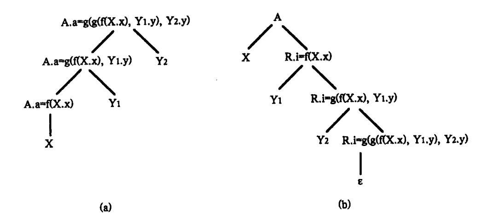

图 6.16 计算属性值的两种方法 (a)自下而上计算属性值;(b)自上而下计算属性值。

```
E \rightarrow E_1 + T {E.nptr: = mknode('+', E<sub>1</sub>.nptr, T.nptr)}

E \rightarrow E_1 - T {E.nptr: = mknode('-', E<sub>1</sub>.nptr, T.nptr)}

E \rightarrow T {E.nptr: = T.nptr}
```

当从翻译模式中消除左递归时,非终结符号 E 对应于翻译模式(6.1)中的 A,前面两个产生式中的 + T 和 – T 对应为 Y;第三个产生式中的 T 对应于 X。翻译模式如图 6.17 所示。有关 T 的产生式和语义动作与表 6.4 中原有定义相似。

```
{R.i: = T.nptr}
 E \rightarrow T
     R
               \{E. nptr: = R.s\}
 R→+
               {R_1.i: = mknode('+', R.i, T.nptr)}
       T
               {\mathbf R.s:=\mathbf R_1.s}
       R_1
 R→ -
               {R_1.i: = mknode('-',R.i,T.nptr)}
               {R.s: = R_1.s}
       R_1
                     {R.s: = R.i}
 R→ε
 T→(
         \mathbf{E}
               \{T. nptr: = E. nptr\}
 T→id
                     T. nptr: = mkleaf(id, id. entry)
                     T. nptr: = mkleaf(num, num. val)
T→num
```

图 6.17 构造抽象语法树的翻译模式

图 6.18 表示了怎样用图 6.17 中的动作构造 a – 4 + c 的语法树。代表文法符号的结点的右边是综合属性,左边是继承属性。像例 6.8 中一样,抽象语法树中的叶结点由产生式 T→id 和 T→num 对应的语义动作建立。最左边的 T 结点的属性 T.nptr 指向叶结点 a。指向结点 a 的指针位于产生式 E→TR 中右边的 R 的属性 R.i 得到。

当产生式 R→ - TR1 在根的右子结点处应用时, R.i 指向结点 a, 且 T. nptr 指向结点

{20}------------------------------------------------

4。对于减号和这些指针应用 mknode 来构造与 a-4 相应的结点。

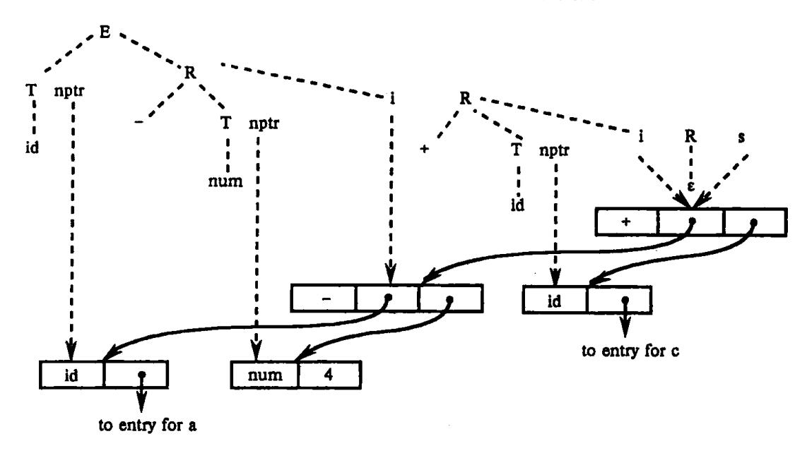

图 6.18 使用继承属性构造语法树

最后,当应用产生式  $R \rightarrow \epsilon$  时, R. i 向上指向整个语法树的根结点。或说,整个语法树通过代表 R 的结点的 s 属性返回(图 6.18 中没有表示出来),直到 R. s 的值成为 E. notr 的值。

### 6.4.3 递归下降翻译器的设计

在第四章中,我们讨论了自顶向下的递归下降语法分析法,本节我们介绍如何在递归下降分析中实现翻译模式,构造**递归下降翻译器**。

对给定的适合于自顶向下翻译的翻译模式,下面给出设计递归下降翻译器的方法。

- 1. 对每个非终结符 A 构造一个函数过程,对 A 的每个继承属性设置一个形式参数,函数的返回值为 A 的综合属性(作为记录,或指向记录的一个指针,记录中有若干域,每个属性对应一个域)。为了简单,我们假设每个非终结符只有一个综合属性。A 对应的函数过程中,为出现在 A 的产生式中的每一个文法符号的每一个属性都设置一个局部变量。
  - 2. 非终结符 A 对应的函数过程中,根据当前的输入符号决定使用哪个产生式候选。
- 3. 每个产生式对应的程序代码中,按照从左到右的次序,对于单词符号(终结符)、非终结符和语义动作分别作以下工作。
- (1) 对于带有综合属性 x 的终结符 X,把 x 的值存入为 X.x 设置的变量中。然后产生一个匹配 X 的调用,并继续读入一个输入符号。
- (2) 对于每个非终结符 B,产生一个右边带有函数调用的赋值语句  $c = B(b_1, b_2, \cdots, b_k)$ ,其中, $b_1$ , $b_2$ , $\cdots$ , $b_k$ 是为 B 的继承属性设置的变量,c是为 B 的综合属性设置的变量。
- (3) 对于语义动作,把动作的代码抄进分析器中,用代表属性的变量来代替对属性的每一次引用。
- 例 6.12 图 6.17 中的文法是 LL(1)的,因此适合于自顶向下分析。根据文法非终结符的属性,得到关于非终结符 E、R、T的函数及其参数的类型,具体如下:

function E:  $\uparrow$  AST – node;

{21}------------------------------------------------

function  $R(in: \uparrow AST - node): \uparrow AST - node;$ function  $T: \uparrow AST - node;$ 

因为E和T没有继承属性,所以没有参数。

我们把图 6.17 中的两个 R 产生式结合起来使翻译程序更小,新的产生式中用 oddop 代表 + 和 - 。

```
\begin{array}{ll} R \longrightarrow oddop \\ & T & \{R_1.i:=mknode(addop.lexme, R.i,T.nptr)\} \\ & R_1 & \{R.s:=R_1.s\} \\ & R \longrightarrow \varepsilon & \{R.s:=R.i\} \end{array}
```

关于产生式 R 的代码以图 6.19 的分析过程为基础。如果输入符号为 addop,则使用产生式 R→addop T R,通过 advance 读入 addop 之后的下一输入符号,然后再调用 T 和 R 的函数。否则,按产生式 R→ $\epsilon$ ,该过程什么也不做。

```
procedare R;
begin
\nif sym = addop then begin

advance; T; R
\nend
\nelse begin / * do nothing * /
\nend
\nend;
```

图 6.19 产生式 R→addop TR/e 的分析过程

在图6.19的基础上构造对应R的函数过程,如图6.20所示。函数中包含计算属性

```
function R (in: \( \Lambda \) AST - node; \( \Lambda \) AST - node;
     var nptr, i1, s1, s: ↑ AST - node;
       addoplexeme: char;
   begin
        if sym = addop then begin
            /*产生式 R→addop TR */
            addoplexeme: = lexval;
            advance;
            nptr: = T;
            il: = mknode (addoplexeme, in, nptr);
            s1:=R(i1)
            s:=s1
       end
       else s:=in;
       return s
end;
```

图 6.20 递归下降构造抽象语法树

{22}------------------------------------------------

的代码。把单词符号 addop 的词法值 lexval 存入 addoplexeme 中; 匹配 addop; 调用函数 T, 把结果存入 nptr 中,变量  $i_1$  对应于翻译模式中的继承属性  $R_1$ . $i_1$  对应于综合属性  $R_1$ . $i_2$  。 返回语句在控制离开函数以前返回 s 的值。类似地,我们可构造出 E 和 T 的函数。

# 6.5 自下而上计算继承属性

这一节中,我们讨论在自下而上的分析过程中实现 L-属性文法的方法。这种方法可以实现任何基于 LL(1)文法的 L-属性文法,它还可以实现许多(不是所有)基于 LR(1) 文法的 L-属性文法。这种方法是 6.3 节中介绍的自下而上翻译技术的一般化。

# 6.5.1 从翻译模式中去掉嵌入在产生式中间的动作

在 6.3 节中的自下而上的翻译方法中,要求把所有的语义动作都放在产生式的末尾, 而在 6.4 节中的递归下降翻译方法中,我们需要在产生式右部的不同地方嵌入语义动作。 下面我们介绍一种转换方法,它可以使所有嵌入的动作都出现在产生式的末尾,这样就可 以自下而上处理继承属性。

转换方法是,在基础文法中加入新的产生式,这种产生式的形式为  $M \rightarrow \varepsilon$ ,其中 M 为新引入的一个标记非终结符。我们把嵌入在产生式中的每个语义动作用不同的标记非终结符 M 代替,并把这个动作放在产生式  $M \rightarrow \varepsilon$  的末尾。例如,下面翻译模式

使用标记非终结符号 M 和 N 转换为

两个翻译模式中的文法接受相同的语言。通过画出带有表示动作的附加结点的分析树,我们可以看到动作的执行程序也是一样的。在经过转换的翻译模式中,动作都在产生式右端的末尾,因此,可以在自下而上分析过程中产生式右部被归约时执行相应的动作。

### 6.5.2 分析栈中的继承属性

自下而上分析器对产生式  $A \rightarrow XY$  的右部是通过把 X 和 Y 从分析栈中移出并用 A 代替它们。假设 X 有一个综合属性 X.s,按照 6.3 节所介绍的方法我们把它与 X 一起放在分析栈中。

由于 X.s 的值在 Y 以下的子树中的任何归约之前已经放在栈中,这个值可以被 Y 继承。也就是说,如果继承属性 Y.i 是由复写规则 Y.i: = X.s 定义的,则可以在需要 Y.i 值的地方使用 X.s 的值。我们将会看到,在自下而上分析中计算属性值时复写规则起非常重要的作用。下面例子说明复写规则的使用。

{23}------------------------------------------------

# 假设某翻译模式为:

$$\begin{array}{cccc} D \!\!\!\!\!\!\!\!\!\!\!\!\!\!\!\!\!\!\!\!\!\!\!\!\!\!\!\!\!\!\!\!$$

按照这个翻译模式,标识符的类型可以通过继承属性的复写规则来传递。例如,对于输入串

int p, q, r 其属性的传递方向如图 6.21 所示。

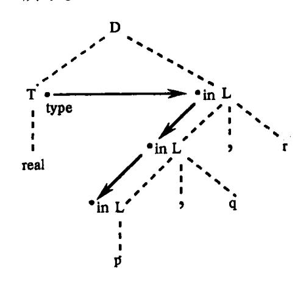

图 6.21 在每个 L结点 L.in = T.type

我们看看使用 L 产生式时怎样得到属性 T. type 的值。如果我们忽略翻译模式中的语义动作,对上述输入串进行语法分析的过程如表 6.9 所示。为了清楚,我们用文法符号表示栈中该文法符号所对应的状态,用实际的标识符表示 id。

| 输 人 串                            | 状 态   | 所用产生式           |
|----------------------------------|-------|-----------------|
| int p,q,r                        | -     |                 |
| p,q,r                            | int   |                 |
| p,q,r                            | Т     | T→int           |
| ,q,r                             | TP    |                 |
| ,q,r                             | TL    | L→id            |
| $\mathbf{q}_{\bullet}\mathbf{r}$ | TL,   |                 |
| ,r                               | TL,q  |                 |
| ,r                               | TL    | L→L, id         |
| r                                | TL,   |                 |
|                                  | TL, r |                 |
|                                  | TL    | L →L, id        |
|                                  | D     | L →L,id<br>D→TL |

表 6.9 int, p, q, r 的分析过程

{24}------------------------------------------------

从表 6.9 可以看出, 当 L 的右部被归约时, T 恰好在这个右部的下面。

与 6.3 节一样,我们假设分析栈是由一对数组 state 和 val 来实现的。如果 state [i]代表符号 X,则 val [i]存放 X 的综合属性 X.s。在表 6.9 中给出了 state 数组的内容。由于在表 6.9 中,每次 L 的右部被归约时,T 恰好在这个右部的下面,因此这时可以方便地访问到 T. type 的值。

由于 T. type 在栈中相对于栈顶的位置是已知的,我们可以翻译模式中语义动作的实现如表 6.10 所示。

| 产生式     | 代 码 段                           |  |
|---------|---------------------------------|--|
| D→TL;   |                                 |  |
| T→int   | val[ntop]: = integer            |  |
| T→real  | • val[ntop]: = real             |  |
| L→L, id | addtype(val[top], val[top - 3]) |  |
| L→id    | addtype(val[top],val[top-1])    |  |

表 6.10 语义动作的实现

表 6.10 中, top 和 ntop 分别代表归约前和归约后的栈顶入口。由复写规则 L. in: = T. type,我们知道在需要 L. in 处引用 T. type。在应用产生式 L→id 进行归约时, id. entry 在 val 栈顶而 T. type 正好在它们的下面。因此, addtype (val[top], val[top – 1]与 addtype (id. entry, T. type)相等。同样,由于产生式 L→L, id 右部有三个符号,当进行归约时, T. type 的位置在 val[top – 3]处。注意包含 L. in 的其它动作都是复写规则,它们根本不需要执行。

### 6.5.3 模拟继承属性的计算

从上节得知,只有根据文法预知属性值在栈中的存放位置时,才能有效地在分析栈中 处理属性值。但情况并非总是如此。

我们考虑下面翻译模式:

产生式 语义规则 S→aAC C.i: = A.s C→c C.s: = g(C.i)

属性 C.i 通过复写规则继承综合属性 A.s 的值。注意在栈中 A 和 C 之间可能有 B 也可能 没有 B,当通过  $C \rightarrow c$  进行归约时,C.i 的值可能在 val[top-1] 处也可能在 val[top-2] 处,但我们不能确定究竟在哪个位置。为了解决这个问题,我们在上述翻译模式中的第二个产生式右部的 C 的前面插入一个新的标记非终结符 M。修改后的翻译模式如下:

产生式 语义规则
S→aAC

如果我们按照产生式 S→bABMC 进行分析,那么 C.i 可通过 M.i 和 M.s 间接地继承 A.s 的值。当应用产生式 M→ $\epsilon$  时,复写规则 M.s: = M.i 使得值 M.s = M.i = A.s 正好出

{25}------------------------------------------------

现在分析栈中 C 的子树所占用的那部分栈的前面。于是,当应用 C→c 时,C.i 的值可以在 val[top – 1]处找到,而与是用修改以后的翻译模式中第一个产生式还是第二个产生式无关。图 6.22 给出了修改产生式前后把属性值传递到 C.i 的依赖关系图。

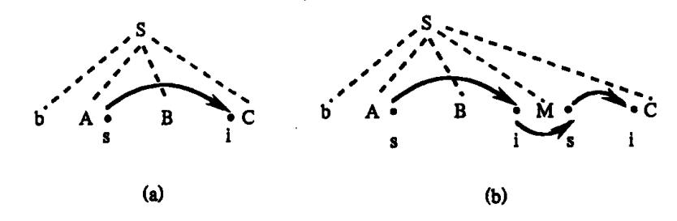

图 6.22 通过标记 M 传递属性值 (a)修改前;(b)修改后。

标记非终结符也可用于模拟不是复写规则的语义规则。例如,考虑

产生式 语义规则S→aAC C.i: = f(A.s)

这里决定 C.i 的规则不是复写规则,因此 C.i 的值尚未在栈 val 中。但问题仍可通过使用标记非终结符来解决。

标记非终结符 N 通过复写规则继承 A.s 的值。它的综合属性值 N.s 由 f(N.i)给出;然后 C.i 使用一个复写规则继承这个属性值。当我们对 N→ $\epsilon$  进行归约时,我们在 A.s 处得到 N.i 的值,即在 val[top – 1]处得到 N.i 的值。当我们使用产生式 S→ $\epsilon$  ANC 进行归约时,C.i 的值仍然从 val[top – 1]处得到,因为这个值就是 N.s 的值。实际上,这时我们不需要 C.i; 只有在把终结符串归约为 C 时才需要用到它,那时,它的值已和 N 一起安全地存放在栈中。

例 6.13 在 6.4 节中, 我们曾经给出了对数学格式语 EQN 进行翻译的属性文法(见表 6.8)。现在我们引入三个标记非终结符 L、M 和 N(如表 6.11 所示), 使得当 B 的子树被归约时,继承属性 B.ps 的值在分析栈中的位置是可知的。

使用 L 做初始化工作。表 6.11 中 S 的产生式为 S→LB,因此,当 B 下面的子树被归约时,L 保留在栈中。继承属性 B.ps = L.s 的值 10 通过与产生式 L→ $\epsilon$  对应的规则 L.s = 10 进入栈中。

 $B \rightarrow B_1 M B_2$  中的标记非终结符 M 的作用与图 6.22 中 M 的作用一样,它确保值 B.ps 在栈中的位置正好在  $B_2$  的下面。在产生式  $B \rightarrow B_1$  sub N  $B_2$  中,标记非终结符 N 的用法和式(6.4)中的 N 用法一样。N 通过复写规则 N.i: = B.ps 继承的属性值,是  $B_2$ .ps 要依赖的,并且通过规则 N.s: = shrink(N.i)综合出了 N.s 的值,也就给出了  $B_2$ .ps = N.s 的值。在归约为 B 时,B.ps 的值在栈中的位置总是在产生式右部的下面。

实现表 6.11 属性文法定义的代码段在表 6.12 中给出。

表 6.12 中的所有继承属性都由复写规则赋值,所以属性文法的实现是通过跟踪它们在 val栈中的位置获得属性值的。和前面一样, top和ntop分别给出了归约前和归约后的

{26}------------------------------------------------

| 产生式                                   | 语义规则                           |
|---------------------------------------|--------------------------------|
| S→LB                                  | B. ps: = L. s                  |
|                                       | S. ht: = B. ht                 |
| I, <del>→</del> ε                     | L.ps: = 10                     |
| $B \rightarrow B_1 M B_2$             | $B_1 \cdot ps := B \cdot ps$   |
|                                       | M.i := B.ps                    |
|                                       | $B_2.ps:=M.s$                  |
|                                       | $B.ht: = \max(B_1.ht, B_2.ht)$ |
| B→B <sub>1</sub> sub N B <sub>2</sub> | $B_1 \cdot ps := B \cdot ps$   |
|                                       | N.i: = $B.ps$                  |
|                                       | $B_2.ps:=N.s$                  |
|                                       | $B.ht: = disp(B_1.ht, B_2.ht)$ |
| B→text                                | $B.ht: = text.h \times B_1.ps$ |
| M→ε                                   | M.s: = M.i                     |
| N→ε                                   | N.s: = shrink(N.i)             |

表 6.11 所有继承属性都由复写规则赋值

表 6.12 表 6.11 中属性文法定义的实现

| 产生式                                   | 代 码 段                                      |
|---------------------------------------|--------------------------------------------|
| S→LB                                  | val [ntop]: = val[top]                     |
| L→ε                                   | val [ntop]: = 10                           |
| $B \rightarrow B_1 M B_2$             | val [ntop]: = Max(val [top-2], val [top])  |
| B→B <sub>1</sub> sub N B <sub>2</sub> | val [ntop]: = disp(val [top-2], val [top]) |
| B→text                                | val [ntop]: = val [top] × val [top - 1]    |
| M→ε                                   | val [ntop]: = val [top - 1]                |
| N→e                                   | val [ntop]: = shrink(val [top - 2])        |

### 栈顶的下标。

按照前面例子的做法,在必要的时候引进标记非终结符,可以实现在 LR 分析过程中

下面,我们给出一种带继承属性的自下而上的分析和翻译方法。对于一个基础文法 是 LL(1)文法的 L - 属性文法定义,通过下面方法可以得到一个计算分析栈中所有属性值 的分析程序。

为了简单起见,我们假设每一个非终结符 A 都有一个继承属性 A.i,每个文法符号 X 都有一个综合属性 X.s。如果 X 是一个终结符号,那么它的综合属性就是通过词法分析器返回的词法值,这个值将放在 val 栈中的适应位置。

对于每个产生式  $A \rightarrow X_1 X_2 \cdots X_n$ , 引入 n 个新的标记非终结符  $M_1, \cdots, M_n$ , 用产生式  $A \rightarrow$ 

{27}------------------------------------------------

 $M_1X_1\cdots M_nX_n$  代替上面的产生式。综合属性  $X_j$ .s 将放在分析栈中与  $X_j$  相应的数组 val 的表项中。如果有继承属性  $X_j$ .i,把它也放在数组 val 中,但放在与  $M_j$  相应的项中。一个重要事实是,当我们进行分析时,如果继承属性 A.i 存在的话,它将在数组 val 中紧挨  $M_1$  位置下面的位置中存放。假设开始符号没有继承属性,那么在开始符号为 A 时,不会有什么问题。但即使有这样的继承属性,我们也可以把它放在栈底的下面。注意,继承属性与标记非终结符  $M_j$  相联系,属性  $X_j$ .i 总是在  $M_j$  处计算,而且发生在我们开始做归约到  $X_j$ 的动作以前。上述事实,我们按自下而上分析的归约步数进行归纳,加以说明。

为了说明属性可以在自下而上分析中按预期的那样计算出来,考虑两种情况。首先,如果我们归约到某标记非终结符  $M_j$ ,这时,我们知道这个标记非终结符属于哪个产生式  $A \toldsymbol{\toldsymbol{\toldsymbol{\toldsymbol{\toldsymbol{\toldsymbol{\toldsymbol{\toldsymbol{\toldsymbol{\toldsymbol{\toldsymbol{\toldsymbol{\toldsymbol{\toldsymbol{\toldsymbol{\toldsymbol{\toldsymbol{\toldsymbol{\toldsymbol{\toldsymbol{\toldsymbol{\toldsymbol{\toldsymbol{\toldsymbol{\toldsymbol{\toldsymbol{\toldsymbol{\toldsymbol{\toldsymbol{\toldsymbol{\toldsymbol{\toldsymbol{\toldsymbol{\toldsymbol{\toldsymbol{\toldsymbol{\toldsymbol{\toldsymbol{\toldsymbol{\toldsymbol{\toldsymbol{\toldsymbol{\toldsymbol{\toldsymbol{\toldsymbol{\toldsymbol{\toldsymbol{\toldsymbol{\toldsymbol{\toldsymbol{\toldsymbol{\toldsymbol{\toldsymbol{\toldsymbol{\toldsymbol{\toldsymbol{\toldsymbol{\toldsymbol{\toldsymbol{\toldsymbol{\toldsymbol{\toldsymbol{\toldsymbol{\toldsymbol{\toldsymbol{\toldsymbol{\toldsymbol{\toldsymbol{\toldsymbol{\toldsymbol{\toldsymbol{\toldsymbol{\toldsymbol{\toldsymbol{\toldsymbol{\toldsymbol{\toldsymbol{\toldsymbol{\toldsymbol{\toldsymbol{\toldsymbol{\toldsymbol{\toldsymbol{\toldsymbol{\toldsymbol{\toldsymbol{\toldsymbol{\toldsymbol{\toldsymbol{\toldsymbol{\toldsymbol{\toldsymbol{\toldsymbol{\toldsymbol{\toldsymbol{\toldsymbol{\toldsymbol{\toldsymbol{\toldsymbol{\toldsymbol{\toldsymbol{\toldsymbol{\toldsymbol{\toldsymbol{\toldsymbol{\toldsymbol{\toldsymbol{\toldsymbol{\toldsymbol{\toldsymbol{\toldsymbol{\toldsymbol{\toldsymbol{\toldsymbol{\toldsymbol{\toldsymbol{\toldsymbol{\toldsymbol{\toldsymbol{\toldsymbol{\toldsymbol{\toldsymbol{\toldsymbol{\toldsymbol{\toldsymbol{\toldsymbol{\toldsymbol{\toldsymbol{\toldsymbol{\toldsymbol{\toldsymbol{\toldsymbol{\toldsymbol{\toldsymbol{\toldsymbol{\toldsymbol{\toldsymbol{\toldsymbol{\toldsymbol{\toldsymbol{\toldsymbol{\toldsymbol{\toldsymbol{\toldsymbol{\toldsymbol{\toldsymbol{\toldsymbol{\toldsymbol{\toldsymbol{\toldsymbol{\toldsymbol{\toldsymbol{\toldsymbol{\toldsymbol{\toldsymbol{\toldsymbol{\toldsymbol{\toldsymbol{\toldsymbol{\toldsymbol{\toldsymbol{\toldsymbol{\toldsymbol{\toldsymbol{\toldsymbol{\toldsymbol{\toldsymbol{\toldsymbol{\toldsymbol{\toldsymbol{\toldsymbol{\toldsymbol{\toldsymbol{\toldsymbol{\toldsymbol{\toldsymbol{\toldsymbol{\toldsymbol{\to$ 

由于标记非终结符可能引起分析冲突,进行下面的简化是有益的。

- (1) 如果  $X_j$  没有继承属性,则无需使用标记符  $M_j$ 。当然,如果  $M_j$  被省略,栈中属性的位置会引起变化,但是这种变化可以通过对分析器稍加修改而适应。
- (2) 如果  $X_1$ .i 存在,但是由复写规则  $X_1$ .i: = A.i 计算,则可省略  $M_1$ 。因为我们知道 A.i 已经存放在栈中预定的位置,紧挨  $X_1$  下面,因此这个值也可以作为  $X_1$ .i 使用。

### 6.5.4 用综合属性代替继承属性

有时,改变基础文法可能避免继承属性。例如,一个 Pascal 的说明由一标识符序列后跟类型组成,如,m,n:integer。这样的说明的文法可由下面形式的产生式构成

D→L:T

T→integer | char

L→L, id|id

因为标识符由 L产生而类型不在 L的子树中,我们不能仅仅使用综合属性就把类型与标识符联系起来。事实上,如果非终结符 L从第一个产生式中它的右边 T 中继承了类型,则我们得到的属性文法就不是 L - 属性的,因此,基于这个属性文法的翻译工作不能在语法分析的同时进行。

一个解决的方法是重新构造文法,使类型作为标识符表的最后一个元素:

D→id L

 $L \rightarrow$ , id L1: T

T→integer | char

这样,类型可以通过综合属性 L. type 进行传递,当通过 L产生每个标识符时,它的类

{28}------------------------------------------------

型就可以填入到符号表中。

# 练 习

- 1. 按照表 6.1 所示的属性文法,构造表达式(4\*7+1)\*2的附注语法树。
- 2. 对表达式((a) + (b)):
- (1) 按照表 6.4 所示的属性文法构造该表达式的抽象语法树;
- (2) 按照图 6.17 所示的翻译模式,构造该表达式的抽象语法树。
- 3. 设+运算具有左结合性,试画出下列表达式的 DAG 图:

$$a + a + (a + a + a + a(a + a + a + a))$$

- \*4. 设 + 、-、\*、/运算都具有左结合性,试设计一个属性文法,删除算术表达式中冗余的括弧。例如,若已知表达式为((a\*(b+c))\*(d))应改写成 a\*(b+c)\*d。
- 5. 下列文法对整型常数和实型常数施用加法运算符+生成表达式;当两个整型数相加时,结果仍为整型数,否则,结果为实型数:

$$E \rightarrow E + T \mid T$$

T→num.num | num

- (1) 试给出确定每个子表达式结果类型的属性文法:
- (2) 扩充(1)的属性文法,使之把表达式翻译成后缀形式,同时也能确定结果的类型。 应该注意使用一元运算符 inttoreal 把整型数转换成实型数,以便使后缀形如加法运算符的 两个操作数具有相同的类型。
- 6. 扩充表 6.8 属性文法,除跟踪方块的高度之外,还要跟踪方块的宽度。假定终结符号 text 具有综合属性 w,给出字形的常规宽度。
  - 7. 下列文法由开始符号 S 产生一个二进制数, 令综合属性 val 给出该数的值:

$$S \rightarrow L . L | L$$

L→LB | B

$$B\rightarrow 0|1$$

试设计求 S. val 的属性文法,其中,已知 B 的综合属性 c,给出由 B 产生的二进位的结果值。例如,输入 101.101 时,S. val = 5.625,其中第一个二进位的值是 4,最后一个二进位的值是 0.125。

- 8. 分别修改习题 5 之(1)、(2)得到的属性文法,消除其中的左递归。
- 9. 由下列文法

$$E \rightarrow E := E \mid E + E \mid (E) \mid id$$

产生的表达式,其语义如 C 语言,包含赋值运算。就是说,b: = c 是一个表达式,把 c 的值赋给 b;该表达式的右值为 c 的右值。进而,a: = (b: = c)先把 c 的值赋给 b,然后再赋给 a。

- (1) 试建立一个属性文法,用非终结符 E 的继承属性 side 表示由 E 生成的表达式出现在赋值运算的左边还是右边,检查表达式的左部是一个左值。
  - (2) 扩充(1)中的属性文法,产生某种形式的中间代码。

{29}------------------------------------------------

- 10. 试设计一个翻译模式,检查同一个标识符在标识符表中是否重复出现。
- 11. 设下列文法生成变量的类型说明:

L→id L

 $L \rightarrow$ , id L|: T

T→integer | real

- (1) 构造一个翻译模式,把每个标识符的类型存入符号表;参考例 6.2。
- (2)由(1)得到的翻译模式,构造一个预测翻译器。
- 12. 下面文法是表 6.8 中基本文法相应的无二义文法。其中括号

 $S \rightarrow L$ 

L→LB|B

B→B sub F|F

 $F \rightarrow \{L\} | \text{text}$ 

- (1) 按照上述文法修改表 6.8;
- (2) 把(1)的属性文法转换为翻译模式。
- 13. 设有 L-属性定义,其嵌入文法或者是 LL(1)文法,或者是可以消除二义性而能构造预测分析器的文法。试说明可以把继承属性和综合属性保存在由预测分析表驱动的自顶向下分析器的分析栈中。