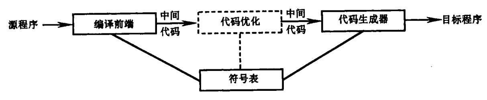
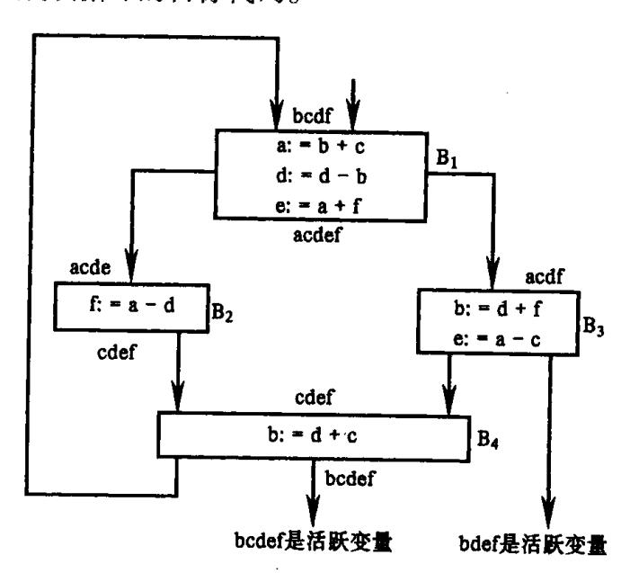
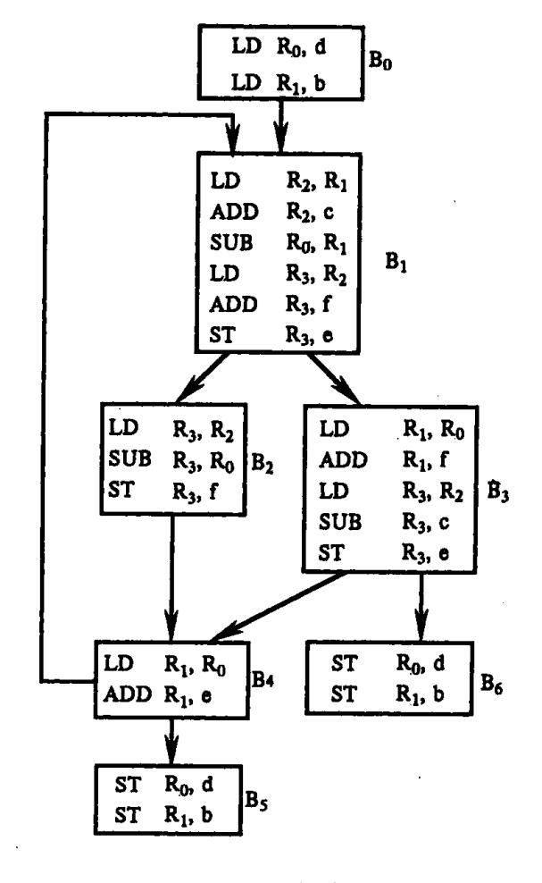
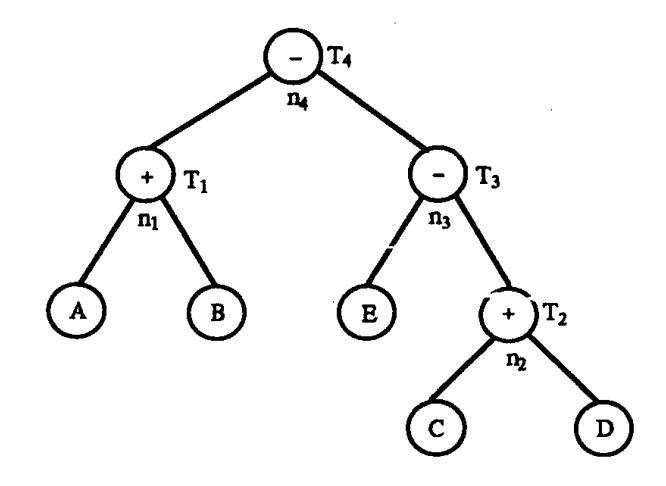
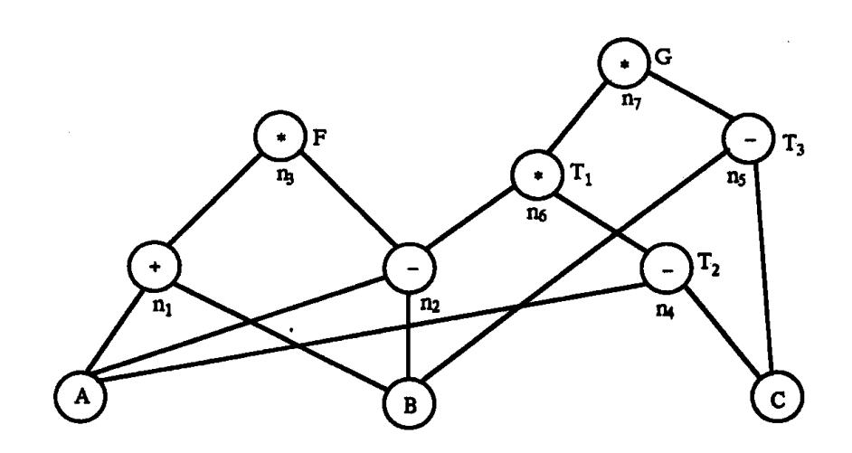

{0}------------------------------------------------

# 第十一章 目标代码生成

编译模型的最后一个阶段是代码生成。它以源程序的中间代码作为输入,并产生等价的目标程序作为输出,如图 11.1 所示。

图 11.1 代码生成器的位置

代码生成器的输入包括中间代码和符号表中的信息。

代码生成是把语义分析后或优化后的中间代码变换成目标代码。目标代码—般有以 下三种形式。

- (1)能够立即执行的机器语言代码,所有地址均已定位(代真)。
- (2)待装配的机器语言模块。当需要执行时,由连接装入程序把它们和某些运行程序 连接起来,转换成能执行的机器语言代码。
  - (3)汇编语言代码,尚需经过汇编程序汇编,转换成可执行的机器语言代码。

代码生成要着重考虑两个问题:一是如何使生成的目标代码较短;另一是如何充分利用计算机的寄存器,减少目标代码中访问存储单元的次数。这两个问题都直接影响目标代码的执行速度。

# 11.1 基本问题

代码生成器的设计细节要依赖于目标语言和操作系统。诸如内存管理、寄存器分配等方面是所有代码生成器要考虑的问题。这一节,我们讨论设计代码生成器时的一般问题。

### • 代码生成器的输入

代码生成器的输入包括源程序的中间表示以及符号表中的信息。正如我们在第七章 所述,我们可选择不同的中间语言,包括:线性表示法如后缀式、三地址表示法如四元式、 抽象机表示法如栈式机器代码、图表示法如语法树等。尽管本章用三地址代码表述,但其 中许多技术也可用于其它中间表示。

我们假定代码生成前源程序已被扫描、分析和翻译成某种合理的中间表示。我们已知符号表中的表项是当分析一个过程中的说明语句时建立的,而说明语句中的类型决定了被说明的名字的域宽,即存储单元个数。根据符号表中的信息,可以确定名字在所属过

{1}------------------------------------------------

程的数据区域中的相对地址。因此,代码生成器可以利用符号表中的信息来决定在中间代码中的名字所指示的数据对象的运行时地址,它是可再定位的或绝对的地址。

同样我们假定已经作过必要的类型检查,所以在必要的地方已经加入了类型转换操作,并且已检测出一些明显的语义错误。这样代码生成阶段就可以假设它的输入是没有错误的。在某些编译器中,这类语义检查与代码生成一起进行。

#### • 目标程序

代码生成器的输出为目标程序。这种输出通常有若干种形式:绝对机器代码、可再定位机器语言、汇编语言等。本章,我们采用汇编代码作为目标语言。

以绝对机器代码为输出,所有地址均已定位,这种目标代码的优点是可立即执行。

以可再定位机器语言作为输出,允许子程序单独编译。一组可重定位的目标模块可以连接在一起,并在执行中装入。尽管连接与装入要付出一定的代价,但是这种目标代码很灵活,可以分别编译各个子程序。如果目标机器无法自动处理重定位,编译器必须为连接与装入提供显式的重定位信息。

从某种程度上说,以汇编语言程序作为输出使代码生成阶段变得容易。我们可以生成符号指令并使用汇编器的宏工具来辅助生成代码。我们要重复强调的是,只要地址可由偏移值及符号表中的其它信息来计算,代码生成器便可以产生名字的再定位或绝对的地址。

#### • 指令选择

指令集的一致性和完全性是重要因素。如果目标机器不能支持指令集的所有类型,那么每一种例外都需要特别的处理。指令速度和机器用语也是重要因素。如果我们不考虑目标程序的效率,那么指令选择可以直接做。对每种类型的中间代码,我们可以勾划出代码的框架。例如,对中间代码 x: = y + z,其中 x,y,z 均为静态分配的变量,可以翻译成下述代码序列:

生成的代码的质量取决于它的速度和大小。一个有着丰富的目标指令集的机器可以为一个给定的操作提供几种实现方法。由于不同的实现之间所需的代码不同,有些中间代码可能会生成正确的但却不一定是高效的目标代码。例如,如果目标机器有"加1"指令(INC),那么代码 a: = a + 1 用 INC a 实现是最有效的,而不是用以下的指令序列实现:

LD 
$$R_0$$
, a ADD  $R_0$ , #1 ST  $R_0$ , a

### • 寄存器分配

由于指令对寄存器的操作常常要比对存储单元的操作快且指令短,因此,如何充分利用计算机的寄存器,对于生成好的代码是非常重要的。寄存器的使用可以分成两个子问题:

- (1)在寄存器分配期间,为程序的某一点选择驻留在寄存器中的一组变量;
- (2)在随后的寄存器指派阶段,挑出变量将要驻留的具体寄存器。

{2}------------------------------------------------

选择最优的寄存器指派方案是困难的。从数学上讲,这是 NP 完全问题。当考虑到目标机器的硬件和(或)操作系统可能要求寄存器的使用遵守一些约定时,这个问题将更加复杂。

某些机器要求对某些运算对象和结果使用寄存器对(偶序数和下一个奇序数的寄存器)。例如,在 IBM 系统 370 机器上,整数乘和整数除要使用寄存器时,乘法指令的形式是:

$$M \times y$$

其中,x是被乘数,是偶/奇寄存器对的偶寄存器,被乘数的值从该对的奇寄存器中取;乘数 y 是单个寄存器,积占据整个偶/奇寄存器对。

除法指令的形式是:

这里,64 位的被除数占据一个偶/奇寄存器对,它的偶寄存器是 x,y 代表除数,除过以后,偶寄存器保存余数,奇寄存器保存商。

例如,考虑图 11.2 的两个三地址代码序列,它们仅有的区别是第二个语句的算符不同,其最短代码序列在图 11.3 中给出。

|    |     | t:=a+b      | t:=a+b    | ı           |
|----|-----|-------------|-----------|-------------|
|    |     | t:=t*c      | t:=t+c    |             |
|    |     | t := t/d    | t := t/d  |             |
|    |     | (a)         | (b)       |             |
|    |     | 图 11.2      | 两个三地址代码序列 |             |
| L  |     | $R_1$ , a   | L         | $R_0$ , a   |
| A  | •   | $R_i$ , b   | Α         | $R_0$ , b   |
| M  |     | $R_0$ , $c$ | , A       | $R_0$ , $c$ |
| D  |     | $R_0$ , $d$ | SRDA      | $R_0, 32$   |
| ST |     | $R_1$ , t   | D         | $R_0$ , d   |
|    |     |             | ST        | $R_1$ , t   |
|    | ( ; | a)          |           | (b)         |

图 11.3 最优的机器代码序列

图 11.3 中,  $R_i$  代表寄存器 i; SRDA  $R_0$ , 32 把除数  $R_0$  移入  $R_1$ , 并清  $R_0$ , 使得所有位都等于它的符号位; L, ST 和 A 分别代表装入、存储和加。值得注意的是, 装入 a 的寄存器的最佳选择依赖于 t 以后还有什么用。有关寄存器的分配策略我们后面讨论。

### • 计算顺序选择

计算完成的顺序会影响目标代码的有效性。我们会看到,有些计算顺序要求存放中的中间结果的寄存器数量少。从而提高目标代码的效率。

毫无疑问,对一个代码生成器最重要的评价标准是它能产生正确的代码。在重视正确性的前提下,使设计的代码生成器能够易于实现、测试及维护,这也是重要的设计目标。

### 11.2 目标机器模型

要设计一个好的代码生成器,必须预先熟悉目标机器和它的指令系统。在本章,我们

{3}------------------------------------------------

将采用一个模型机作为目标机器,它可看作是一些小型机的代表。但本章所述的代码生成技术也可应用于许多其它类型的机器上。

假设目标计算机具有多个通用寄存器,它们既可作为累加器,也可作为变址器。这台机器含有以下四种类型的指令形式:

| 类 型   | 指令形式                                 | 意义(设 op 是二目运算符)                                     |
|-------|--------------------------------------|-----------------------------------------------------|
| 直接地址型 | op R i , M                | $(R_i) \text{ op } (M) \Rightarrow R_i$             |
| 寄存器型  | op R i , R j   | $(R_i) \text{ op } (R_j) \Longrightarrow R_i$       |
| 变址型   | op $R_i$ , $c(R_j)$                  | $(R_i) \text{ op } ((R_i) + c) \Longrightarrow R_i$ |
| 间接型   | op R i , * M              | $(R_i) \text{ op } ((M)) \Longrightarrow R_i$       |
|       | op R i , * R j | $(R_i) op ((R_j)) \Rightarrow R_i$                  |
| ,     | op $R_i$ , * $c(R_j)$                | $(R_i)$ op $(((R_j) + c)) \Rightarrow Ri$           |

如果 op 是一目运行符,则"op Ri, M"的意义为:op(M)⇒ Ri,其余类型可类推。 以上指令中的运算符(操作码)op 包括一般计算机上常见的一些运算符,如 ADD (加)、SUB(减)、MUL(乘)、DIV(除)等等。我们将某些指令的意义说明如下:

| 指令                    | 意义                                                   | 指令    | 意义                  |
|-----------------------|------------------------------------------------------|-------|---------------------|
| LD R i , B | 把 B 单元的内容取到寄存器 R,即(B)⇒ R i 。              | J < X | 如 CT = 0 转 X 单元     |
| ST R i , B | 把寄存器 R i 的内容存到 B 单元,即(R i )⇒B。 | J≼X   | 如 CT=0或 CT=1 转 X 单元 |
| J X                   | 无条件转向 X 单元。                                          | J = X | 如 CT = 1 转 X 单元     |
| CMP A, B              | 把 A 单元和 B 单元的值进行比较,并根据比较情况_                          | J≠X   | 如 CT≠1 转 X 单元       |
|                       | 把机器内部特征寄存器 CT 置成相应状态。CT 占两                           | J > X | 如 CT = 2 转 X 单元     |
|                       | 个二进位。根据 A < B 分别置 CT 为 0 或 1 或 2                     | J≽X   | 如 CT=2或 CT=1 转 X 单元 |

当用一个存储单元 M 或一个寄存器 R 作为源和目的时,它们代表自身。例如,指令 ST  $R_0$ , M

将寄存器 Ro 的内容存入存储单元 M 中。

从寄存器 R 的值偏移 c 可写作 c(R)。这样,指令

ST  $R_0,4(R_1)$ 

就将  $R_0$  中的值存入 $(4+(R_1))$ 所指单元中。

表中的两种间接方式用前缀 \* 表示。于是,指令

LD  $R_0$ , \* 4( $R_1$ )

将 $(4+(R_1))$ 之值所指的单元的内容装入到  $R_0$  中。 指令

LD  $R_0$ , #1

是将常数1装入寄存器 Ro中。

# 11.3 一个简单的代码生成器

这一节要介绍一个简单的代码生成器。它依次把每条中间代码变换成目标代码,并

{4}------------------------------------------------

且在一个基本块范围内考虑如何充分利用寄存器的问题。也即,一方面在基本块中,当生成计算某变量值的目标代码时,尽可能地让该变量的值保留在寄存器中(即不编出把该变量的值存到主存单元的指令),直到该寄存器必须用来存放别的变量值或者已到达基本块出口为止;另一方面,后续的目标代码尽可能地引用变量在寄存器中的值,而不访问主存。

在详细介绍这个算法之前,我们先来看一个例子。假设有一个高级语言的语句 为

$$A:=(B+C)*D+E$$

把它翻译为中间代码为 G:

$$T_1 := B + C$$
 $T_2 := T_1 * D$ 
 $A := T_2 + E$ 

如果不考虑代码的效率的话,我们可以简单地把每条中间代码映射成若干条目标指令,如把

| 10              |                                         |          |        |
|-----------------|-----------------------------------------|----------|--------|
|                 | $\mathbf{x} := \mathbf{y} + \mathbf{z}$ | 映射       | 为      |
| LD R,           | y A                                     | DD R, z  | ST R,x |
| 这样,上述中间代码序列 G 就 | 可以翻译为                                   |          |        |
| (1)LD           | ]                                       | R,B      |        |
| (2)AD           | D j                                     | R,C      |        |
| (3)ST           | 1                                       | $R,T_1$  |        |
| (4)LD           | l                                       | $R,T_1$  |        |
| (5) <b>M</b> U  | L I                                     | R,D      |        |
| (6)ST           | I                                       | $R,T_2$  |        |
| (7)LD           | I                                       | $R, T_2$ |        |
| (8)ADI          | D I                                     | R,E      |        |

(9)ST

虽然从正确性看,上述翻译没有问题,但它却是很冗余的。显然,上述指令序列中,第 (4) 和第(7)条指令是多余的;而且由于  $T_1$ , $T_2$  是生成中间代码时引入的临时变量,出了所在的基本块将不会被引用,所以第(3),(6)条指令也可以省掉。因此,如果考虑了效率和充分利用寄存器的问题之后,代码生成器就可以生成如下代码:

R,A

| (1)LD  | R,B |
|--------|-----|
| (2)ADD | R,C |
| (3)MUL | R,D |
| (4)ADD | R,E |
| (5)ST  | R.A |

为了能够这样做,代码生成器必须了解一些信息:在产生  $T_2$ := $T_1*D$  对应的目标代码时,为了省去指令 LD R,  $T_1$ ,就必须知道  $T_1$  的当前值已在寄存器 R 中;为了省去 ST R,  $T_1$  就必须知道出了基本块之后  $T_1$  不会再被引用。下面我们引入待用信息、寄存器描述数组和变量地址描述数组用以记录代码生成时所需收集的信息。

{5}------------------------------------------------

### 11.3.1 待用信息

为了把基本块内还要被引用的变量值尽可能保存在寄存器中,同时把基本块内不再被引用的变量所占用的寄存器及早释放,每当翻译一条中间代码 A:=B op C 时,我们需要知道,A,B,C 是否还会在基本块内被引用以及用于哪些中间代码中。为此,我们需收集待用信息。如果在一个基本块中,中间代码 i 对 A 定值,中间代码 j 要引用 A 值,而从 i 到 j 之间没有 A 的其它定值,那么,我们称 j 引用了中间代码 i 中所计算的 A 的值。这里,我们只在基本块内考虑待用信息,一个变量在基本块的后继中是否被引用,可从活跃变量信息得知。

为了取得每个变量在基本块内的**待用信息**,可从基本块的出口由后向前扫描,对每个变量建立相应的待用信息链和活跃变量信息链。如果我们没有进行过数据流分析并且临时变量不可以跨基本块引用,则把基本块中所有临时变量均看为基本块出口之后的非活跃变量,而把所有非临时变量均看为基本块出口之后的活跃变量。如果某些临时变量可跨基本块引用,那么,也把它们看为基本块出口之后的活跃变量。

下面介绍计算变量待用信息的算法。假设变量的符号表登记项中含有记录待用信息 和活跃信息的栏(区段),算法的步骤如下。

- (1)开始时,把基本块中各变量的符号表登记项中的待用信息栏填为"非待用",并根据该变量在基本块出口之后是不是活跃的,把其中的活跃信息栏填为"活跃"或"非活跃"。
- (2)从基本块出口到基本块人口由后向前依次处理各个中间代码。对每一中间代码 i; A: = B op C, 依次执行下述步骤:
  - ①把符号表中变量 A 的待用信息和活跃信息附加到中间代码 i 上;
  - ②把符号表中 A 的待用信息和活跃信息分别置为"非待用"和"非活跃";
  - ③把符号表中变量 B 和 C 的待用信息和活跃信息附加到中间代码 i 上;
  - ④把符号表中 B 和 C 的待用信息均置为 i,活跃信息均置为"活跃"。

注意,以上次序不可颠倒,因为 B 和 C 也可能是 A。按以上算法,如果一个变量在基本块中被引用,则各个引用所在的位置,将由该变量在符号表中的待用信息以及附加在各个中间代码 i 上的待用信息,从前到后依次指示出来。另外,由于过程调用可能带来副作用,我们假定每一过程调用是一基本块的人口。

如果中间代码形式为  $A:=op\ B$  或 A:=B,以上执行步骤完全相同,只是其中不涉及  $C_o$ 

例 11.1 考察基本块

T: = A - B U: = A - C V: = T + U W: = V + U

设 W 是基本块出口的活跃变量,我们根据上述算法计算出有关变量的待用信息。符号表中有关待用及活跃信息如表 11.1 所示,附加在中间代码上的待用及活跃信息如表 11.2 所示。在表 11.1 和表 11.2 中用符号对(×,×)表示变量的待用信息和活跃信息,其中 i表示待用信息(即下一个引用点),y表示活跃, / 表示非待用或非活跃;在符号表中,

{6}------------------------------------------------

(x,x)→(x,x)表示在算法执行过程中后面的符号对将替代前面的符号对。

| 变量名 | 待用信息及活跃信息                                                                             |   |
|-----|---------------------------------------------------------------------------------------|---|
| Т   | $(\wedge, \wedge) \rightarrow (3, Y) \rightarrow (\wedge, \wedge)$                    |   |
| A   | $(\wedge, \wedge) \rightarrow (2, Y) \rightarrow (1, Y)$                              |   |
| В   | $(\wedge, \wedge) \rightarrow (1, Y)$                                                 |   |
| С   | $(\wedge, \wedge) \rightarrow (2, Y)$                                                 |   |
| U   | $(\wedge, \wedge) \rightarrow (4, Y) \rightarrow (3, Y) \rightarrow (\wedge, \wedge)$ | ļ |
| v   | $(\wedge, \wedge) \rightarrow (4, Y) \rightarrow (\wedge, \wedge)$                    |   |
| w   | $(\land, \lor) \rightarrow (\land, \land)$                                            |   |

表 11.1 符号表中的待用及活跃信息

表 11.2 附加在中间代码上的待用及活跃信息

| 序号 | 中间代码                |        | 左操作数                 | 右操作数      |
|----|---------------------|--------|----------------------|-----------|
| 1  | T: = A - B          | (3, Y) | (2,Y)                | ( / , / ) |
| 2  | U: = A - C          | (3,Y)  | ( \ , \ )            | ( / , / ) |
| 3  | V = T + U           | (4,Y)  | $(\Lambda, \Lambda)$ | (4,Y)     |
| 4  | $W_{:} = V + U_{-}$ | ( / Y) | $(\wedge, \wedge)$   | <u> </u>  |

### 11.3.2 寄存器描述和地址描述

为了在代码生成中进行寄存器分配,我们需要随时掌握各寄存器的情况:它是空闲着,还是已分配给某个变量,或者已分配给某几个变量(若程序中含有复写,就会出现最后一种情况,下面将会提到)。为此,在代码生成过程中,我们建立一个编译用的**寄存器描述数组** RVALUE,它动态地记录着各寄存器的上述信息。

此外,在代码生成过程中,每当编出的指令要涉及到引用某变量的值时,如果该变量的现行值已在某寄存器中,我们自然希望直接引用寄存器中的值而不引用该变量在主存单元中的值(如果现行值也同时存放在该变量的主存单元中)。为此,在代码生成过程中,我们还要建立一个**变量地址描述数组** AVALUE,它动态地记录着各变量现行值的存放位置:是在某寄存器中,还是在某主存单元中,或者既在某寄存器中也在某主存单元中。

### 11.3.3 代码生成算法

现在我们介绍一个基本块的代码生成算法。为简单起见,假设基本块中每个中间代码形为 A: = B op C。如果基本块中含有其它形式的中间代码,也不难仿照下述算法写出对应的算法。基本块的代码生成算法如下。

对每个中间代码 i: A: = B op C, 依次执行下述步骤。

- (1)以中间代码 i:A:=B op C 为参数,调用函数过程 GETREG(i:A:=B op C)。当从 GETREG 返回时,我们得到一个寄存器 R,它将用作存放 A 现行值的寄存器。
- (2)利用地址描述数组 AVALUE[B]和 AVALUE[C],确定出变量 B 和 C 现行值的存放位置 B'和 C'。如果其现行值在寄存器中,则把寄存器取作 B'和 C'。
  - (3)如果  $B' \neq R$ ,则生成目标代码:

LD R, B'

op R,C'

{7}------------------------------------------------

否则生成目标代码 op R,C';如果 B'或 C'为 R,则删除 AVALUE[B]或 AVALUE[C]中的 R。

- (4)令 AVALUE[A] =  $\{R\}$ ,并令 RVALUE[R] =  $\{A\}$ ,以表示变量 A 的现行值只在 R 中 并且 R 中的值只代表 A 的现行值。
- (5)如果 B 和 C 的现行值在基本块中不再被引用,它们也不是基本块出口之后的活跃变量(由该中间代码 i 上的附加信息知道),并且其现行值在某寄存器  $R_k$  中,则删除 RVALUE[ $R_k$ ]中的 B 或 C 以及 AVALUE[B]中的  $R_k$ ,使该寄存器不再为 B 或 C 所占用。

GETREG 是一个函数过程, GETREG(i: A: = B op C)给出一个用来存放 A 的当前值的 寄存器 R,其中要用到中间代码 i 上的待用信息, GETREG 的算法如下。

- (1)如果 B 的现行值在某寄存器  $R_i$  中, $RVALUE[R_i]$  只包含 B,此外,或者 B 与 A 是同一标识符,或者 B 的现行值在执行中间代码  $A_i = B$  op C 之后不会再引用(此时,该中间代码 i 的附加信息中,B 的待用信息和活跃信息分别为"非待用"和"非活跃"),则选取  $R_i$  为所需的寄存器  $R_i$  并转 4。
  - (2)如果有尚未分配的寄存器,则从中选取一个 R; 为所需的寄存器 R,并转 4。
- (3)从已分配的寄存器中选取一个  $R_i$  为所需的寄存器  $R_o$  最好使  $R_i$  满足以下条件: 占用  $R_i$  的变量的值,也同时存放在该变量的主存单元中,或者在基本块中要在最远的将来才会引用到或不会引用到(关于这一点可从有关中间代码 i 上的待用信息得知)。

对 RVALUE[ $R_i$ ]中每一变量 M,如果 M 不是 A,或者如果 M 是 A 又是 C,但不是 B 并且 B 也不在 RVALUE[ $R_i$ ]中,则

- (1) 如果 AVALUE[M]不包含 M,则生成目标代码 ST Ri, M;
- (2) 如果 M 是 B,或者 M 是 C 但同时 B 也在 RVALUE[Ri]中,则令 AVALUE[M] = {M, R},否则令 AVALUE[M] = {M};
  - (3) 删除 RVALUE[R;]中的 M;
  - (4) 给出 R,返回。

例 11.2 对例 11.1,假设只有  $R_0$  和  $R_1$  是可用寄存器,用上述算法生成的目标代码和相应的 RVALUE 和 AVALUE 如表 11.3 所列。

| 中间代码                                    | 目标代码                                            | RVALUE                                     | AVALUE                                   |
|-----------------------------------------|-------------------------------------------------|--------------------------------------------|------------------------------------------|
| T: = A – B                              | LD R 0 , A SUB R 0 , B | R 0 含有 T                        | T在Ro中                                    |
| U: = A – C                              | LD R 1 , A SUB R 1 , C | R 0 含有 T R 1 含有 U | T在 R₀中 U在 R₁中                         |
| V: = T + U                              | ADD R 0 , R 1             | R 0 含有 V R 1 含有 U | V在R 0 中 U在R 1 中 |
| $\mathbf{W} := \mathbf{V} + \mathbf{U}$ | ADD R 0 , R 1             | R 0 含有W                         | W在R 0 中                       |

表 11.3 目标代码

对其它形式的中间代码,也可仿照以上算法生成其目标代码。我们把各中间代码对应的目标代码列于表 11.4。这里特别要指出的是,对形如 A:=B 的复写,如果 B 的现行值在某寄存器  $R_i$  中,那么,这时无须生成目标代码,只须在  $RVALUE[R_i]$ 中增加一个  $R_i$  同时分配给  $R_i$  和  $R_i$  和  $R_i$  和  $R_i$  和  $R_i$  和  $R_i$  和  $R_i$  和  $R_i$  和  $R_i$  和  $R_i$  和  $R_i$  和  $R_i$  和  $R_i$  和  $R_i$  和  $R_i$  和  $R_i$  和  $R_i$  和  $R_i$  和  $R_i$  和  $R_i$  和  $R_i$  和  $R_i$  和  $R_i$  和  $R_i$  和  $R_i$  和  $R_i$  和  $R_i$  和  $R_i$  和  $R_i$  和  $R_i$  和  $R_i$  和  $R_i$  和  $R_i$  和  $R_i$  和  $R_i$  和  $R_i$  和  $R_i$  和  $R_i$  和  $R_i$  和  $R_i$  和  $R_i$  和  $R_i$  和  $R_i$  和  $R_i$  和  $R_i$  和  $R_i$  和  $R_i$  和  $R_i$  和  $R_i$  和  $R_i$  和  $R_i$  和  $R_i$  和  $R_i$  和  $R_i$  和  $R_i$  和  $R_i$  和  $R_i$  和  $R_i$  和  $R_i$  和  $R_i$  和  $R_i$  和  $R_i$  和  $R_i$  和  $R_i$  和  $R_i$  和  $R_i$  和  $R_i$  和  $R_i$  和  $R_i$  和  $R_i$  和  $R_i$  和  $R_i$  和  $R_i$  和  $R_i$  和  $R_i$  和  $R_i$  和  $R_i$  和  $R_i$  和  $R_i$  和  $R_i$  和  $R_i$  和  $R_i$  和  $R_i$  和  $R_i$  和  $R_i$  和  $R_i$  和  $R_i$  和  $R_i$  和  $R_i$  和  $R_i$  和  $R_i$  和  $R_i$  和  $R_i$  和  $R_i$  和  $R_i$  和  $R_i$  和  $R_i$  和  $R_i$  和  $R_i$  和  $R_i$  和  $R_i$  和  $R_i$  和  $R_i$  和  $R_i$  和  $R_i$  和  $R_i$  和  $R_i$  和  $R_i$  和  $R_i$  和  $R_i$  和  $R_i$  和  $R_i$  和  $R_i$  和  $R_i$  和  $R_i$  和  $R_i$  和  $R_i$  和  $R_i$  和  $R_i$  和  $R_i$  和  $R_i$  和  $R_i$  和  $R_i$  和  $R_i$  和  $R_i$  和  $R_i$  和  $R_i$  和  $R_i$  和  $R_i$  和  $R_i$  和  $R_i$  和  $R_i$  和  $R_i$  和  $R_i$  和  $R_i$  和  $R_i$  和  $R_i$  和  $R_i$  和  $R_i$  和  $R_i$  和  $R_i$  和  $R_i$  和  $R_i$  和  $R_i$  和  $R_i$  和  $R_i$  和  $R_i$  和  $R_i$  和  $R_i$  和  $R_i$  和  $R_i$  和  $R_i$  和  $R_i$  和  $R_i$  和  $R_i$  和  $R_i$  和  $R_i$  和  $R_i$  和  $R_i$  和  $R_i$  和  $R_i$  和  $R_i$  和  $R_i$  和  $R_i$  和  $R_i$  和  $R_i$  和  $R_i$  和  $R_i$  和  $R_i$  和  $R_i$  和  $R_i$  和  $R_i$  和  $R_i$  和  $R_i$  和  $R_i$  和  $R_i$  和  $R_i$  和  $R_i$  和  $R_i$  和  $R_i$  和  $R_i$  和  $R_i$  和  $R_i$  和  $R_i$  和  $R_i$  和  $R_i$  和  $R_i$  和  $R_i$  和  $R_i$  和  $R_i$  和  $R_i$  和  $R_i$  和  $R_i$  和  $R_i$  和  $R_i$  和  $R_i$  和  $R_i$  和  $R_i$  和  $R_i$  和  $R_i$  和  $R_i$  和  $R_i$  和  $R_i$  和  $R_i$  和  $R_i$  和  $R_i$  和  $R_i$  和  $R_i$  和  $R_i$  和  $R_i$  和  $R_i$  和  $R_i$  和  $R_i$  和  $R_i$  和  $R_i$  和  $R_i$  和  $R_i$  和  $R_i$  和  $R_i$  和  $R_i$  和  $R_i$  和  $R_i$  和  $R_i$  和  $R_i$  和  $R_i$  和  $R_i$  和  $R_i$  和  $R_i$  和  $R_i$  和  $R_i$  和  $R_i$  和  $R_i$  和  $R_i$  和  $R_i$  和  $R_i$  和  $R_i$  和  $R_i$ 

{8}------------------------------------------------

| 序号 | 中间代码                   | 目标代码                                                                                     | 备注                                                                                                                                                                                               |
|----|------------------------|------------------------------------------------------------------------------------------|--------------------------------------------------------------------------------------------------------------------------------------------------------------------------------------------------|
| 1  | A: = B op C            | LD R i , B op R i , C                                              | (1)其中 R i 是新分配给 A 的寄存器 (2)如果 B 和/或 C 的现行值在寄存器中,则目标中 B 和/或 C 用寄存器表示。但如果 C 的现行值在 R i 中,而 B 的现行 值不在 R i 中,则 C 要用其主存单元表示 (3)如果 B 的现行值也在 R 中,则不生成第一条目标代码 |
| 2  | A: = op 1 B | LD R i , B op1 R i , R i                                | (1)同1中备注(1) (2)同1中备注(3) (3)opt 指一目运算符                                                                                                                                                      |
| 3  | A: = B                 | LD R i , B                                                                    | (1)同 1 中备注(1) (2)如果 B 的现行值在某寄存器 R i 中,则如前所述,不生成 目标代码                                                                                                                            |
| 4  | A: = B[I]              | LD R j , I LD R i , B(R j )                          | (1)同 1 中备注(1) (2)如果 I 的现行值在某寄存器 R j 中,则第一条目标可省 去,否则 R i 是分配给 I 的寄存器                                                                                                  |
| 5  | A[I]: = B              | LD R i , B LD R j , I ST R i , A(R j ) | (1)同 1 中备注(3) (2)同 4 中备注(2)                                                                                                                                                                   |
| 6  | goto X                 | J X'                                                                                     | (1)X'是标号为 X 的中间代码的目标代码的首地址                                                                                                                                                                       |
| 7  | if A rop B goto X      | LD R i , A CMP R i , B J rop X'                                    | (1)X'的意义同 6 中备注(1) (2)若 A 的现行值在寄存器 R i 中,则第一条目标代码可省 去 (3)如果 B 的现行值在某寄存器 R k 中,则目标代码中的 B 就是 R k (4)rop 指 < 、 ≤ 、 = 、 ≠ 、 > 或 ≥                    |
| 8  | A: = P↑                | LD R i , *P                                                                   | (1)同1中备注(1)                                                                                                                                                                                      |
| 9  | <b>P</b> ↑: = A        | LD R i , A ST R i , * P                                         | (1)同 1 中备注(1) (2)如果 A 的现行值原来在某寄存器 R i 中,则不生成第一 条目标代码                                                                                                                            |

表 11.4 各中间代码对应的目标代码

一旦处理完基本块中所有中间代码,对现行值只在某寄存器中的每个变量,如果它在基本块出口之后是活跃的,则我们要用 ST 指令把它在寄存器中的值存放到它的主存单元中。为进行这一工作,我们利用寄存器描述数组 RVALUE 来决定其中哪些变量的现行值 在寄存器中,再利用地址描述数组 AVALUE 来决定其中哪些变量的现行值尚不在其主存单元中,最后利用活跃变量信息来决定其中哪些变量是活跃的。对上例来说,从 RVALUE 得知 U 和 W 的值都不在主存单元中,又由活跃变量信息得知,其中 W 在基本块出口之后是活跃变量,所以在前例生成的目标代码后面还要生成一条目标代码:ST R0, W。

### 11.4 寄存器分配

为了生成更有效的目标代码,需要考虑的一个问题就是如何更有效地利用寄存器。前节代码生成算法每生成一条目标代码时,如果其运算对象的值在寄存器中,那么,我们

{9}------------------------------------------------

总是把该寄存器作为操作数地址,使得生成的目标代码执行速度较快。为此,我们还尽可能把各变量的现行值保存在寄存器中,把基本块不再引用的变量所占用的寄存器及早释放出来。这一节,进一步考虑如何有效地使用寄存器。我们将把考虑的范围从基本块扩大到循环,这是因为循环是程序中执行次数最多的部分,内循环更是如此。同时,我们不是把寄存器平均分配给各个变量使用,而是从可用的寄存器中分出几个,固定分配给几个变量单独使用。按照什么标准来分配呢?我们将以各变量在循环内需要访问主存单元的次数为标准。为此,引入一个术语:指令的执行代价,并规定,每条指令的执行代价 = 每条指令访问主存单元次数 + 1。

例如:

| op | R i ,   | $R_i$            | 执行代价为1 |
|----|--------------------|------------------|--------|
| op | $R_i$ ,            | M                | 执行代价为2 |
| op | $R_{\mathrm{i}}$ , | * R i | 执行代价为2 |
| op | R i ,   | * <b>M</b>       | 执行代价为3 |

于是,我们就可对循环中每个变量计算一下,如果在循环中把某寄存器固定分配给该变量使用,执行代价能节省多少。根据计算的结果,把可用的几个寄存器,固定分配给节省执行代价最多的那几个变量使用,从而使这几个寄存器充分发挥提高运算速度的作用。下面,我们就介绍计算各变量节省执行代价的方法。

假定在循环中某寄存器固定分配给某变量使用,那么,对循环中每个基本块,相对于原简单代码生成算法的目标代码,所节省的执行代价可用下述方法来计算。

- (1)在原代码生成算法中,仅当变量在基本块中被定值时,其值才存放在寄存器中。 现在把寄存器固定分配给某变量使用,因此,当该变量在基本块中被定值前,每引用它一次,就可少访问一次主存,执行代价就节省(1)。
- (2)在原代码生成算法中,如果某变量在基本块中被定值且在基本块出口之后是活跃的,那么,出基本块时要把它在寄存器中的值存放到主存单元中。现在把寄存器固定分配给某变量使用,因此,出基本块时,就无须把它的值存放到其主存单元中,执行代价就节省(2)。

也即,对循环 L 中某变量 M,如果分配一个寄存器给它专用,那么,每执行循环一次,执行代价的节省数可用公式(11.1)计算。

$$\sum_{B \in L} [USE(M,B) + 2 * LIVE(M,B)]$$
 (11.1)

其中:

USE(M,B) = 基本块 B 中对 M 定值前引用 M 的次数

LIVE(M,B) =  $\begin{cases} 1 & \text{如果 M 在基本块 B 中被定值并且在 B 的出口之后是活跃的} \\ 0 & \text{其它情况} \end{cases}$ 

注意,公式(11.1)是近似式,我们忽略了以下两个因素。

(1)如果 M 在循环人口之前是活跃的,并且在循环中给 M 固定分配一个寄存器,那么,在循环人口时,我们要先把它的值从主存单元取到寄存器,其执行代价为 2。另外,假设 B 是循环出口基本块,C 是 B 在循环外的后继基本块。如果在 C 的人口之前,M 是活跃变量,那么,在循环出口时,我们需要把 M 的当前值从寄存器中存放到它的主存单元中,

{10}------------------------------------------------

其执行代价又是 2。由于这两处的执行代价,在整个循环中只要计算一次,这与公式 (11.1)每循环一次,就要计算一次相比,它可以忽略不计。

(2)由于每循环一次,各个基本块不一定都会执行到,而且每一次循环,执行到的基本块还可能不相同。在公式(11.1)的计算中,把上述因素也忽略了,而是看做每循环一次,各个基本块都要执行一次。

例 11.3 图 11.4 代表某程序的最内层循环,其中无条件转移和条件转移指令均改用箭头来表示。各基本块人口之前和出口之后的活跃变量已列在图中。假定  $R_0$ ,  $R_1$  和  $R_2$  三个寄存器在该循环中将固定分配给某三个变量使用。现在,我们利用公式(11.1)来确定这三个变量,并生成该循环的目标代码。

图 11.4 循环程序段

首先对变量 a 计算式(11.1)的值:

因为  $B_1$  中引用 a 前已对 a 定值,  $B_2$  和  $B_3$  中只引用一次, 且在引用前未对 a 再定值,  $B_4$  中没有引用 a, 所以

$$USE(a, B_1) = 0$$
  
 $USE(a, B_2) = USE(a, B_3) = 1$   
 $USE(a, B_4) = 0$ 

又因 a 在  $B_1$  中被定值且 a 在  $B_1$  出口之后是活跃的, a 在  $B_2$ ,  $B_3$  或  $B_4$  出口之后不是活跃的, 故

LIVE
$$(a, B_1) = 1$$
  
LIVE $(a, B_2) = LIVE(a, B_2) = LIVE(a, B_4) = 0$ 

所以 $\Sigma[USE(a,B)+2*LIVE(a,B)]=1+1+2*1=4$ 。同样,可对 b,c,d,e,f 计算出式 (11.1)的值,它们分别为 6,3,6,4,4。按照各个变量执行代价节省的大小,我们把寄存器  $R_0$  分配给 d, $R_1$  分配给 b;a,e,f 的执行代价节省数相等,可把第三个寄存器分配给其中任 意一个。假设把  $R_2$  分配给 a。三个寄存器分配固定以后,它们在循环中只能分别存放变量 d,b,a 的值。其余变量要用寄存器时,要从余下的寄存器中选取。

{11}------------------------------------------------

分配好寄存器以后,就生成目标代码。算法和前述简单代码生成器相类似。其区别如下。

- (1)循环中的目标代码,凡涉及到已固定分配到寄存器的变量,就用分配给它的寄存器来表示,例如上述的 d,b,a 就用  $R_0$ , $R_1$ , $R_2$  表示。但是在生成 A:= B op C 的目标代码时,如果 A 和 C 是同一标识符,但 A 和 B 不是同一标识符,且寄存器 R 固定分配给 A,但 B 的现行值不在 B 中,那么,当 B AVALUE B Op B 的目标代码,在生成 B Op B 的目标代码,在生成 B Op B 的目标代码,在生成 B Op B 的目标代码,在生成 B Op B 的目标代码,应认为 B 的现行值在主存中。
- (2) 如果其中某变量在循环人口之前是活跃的,例如 d 和 b,那么,在循环人口之前,要生成把它们的值分别取到相应寄存器中的目标代码,如图 11.5 中 B0 所示。
- (3)如果其中某变量在循环出口之后是活跃的,例如 d 和 b,那么,在循环出口的后面,要分别生成目标代码,把它们在寄存器中的值存放到主存单元中,如图 11.5 中  $B_5$  和  $B_6$  所示。
- (4)在循环中每个基本块的出口,对未固定分配到寄存器的变量,仍按以前的算法生成目标代码,把它们在寄存器中的值存放到主存单元中。但对已固定分配到寄存器的变量,就无须生成这样的目标代码,这些已反映在图 11.5 的 B1, B2 和 B4 中。

按上述原则,对图 11.4 的中间代码生成的目标代码如图 11.5 所示。

图 11.5 目标代码

{12}------------------------------------------------

也可改变一下上述原则。对已固定分配到寄存器的变量,如果它在循环中某基本块出口之后已不是活跃的,则把固定分配给它的寄存器,暂时作为一般寄存器使用,例如图 11.4 中 B2 和 B3 中的 a。那么,B3 生成的目标代码将是:

$$\begin{array}{ccc} SUB & R_2, & R_0 \\ ST & R_2, & f \end{array}$$

B3 生成的目标代码将是:

$$\begin{array}{cccc} LD & R_1\,, & R_0\\ ADD & R_1\,, & f\\ SUB & R_2\,, & c\\ ST & R_2\,, & e \end{array}$$

也即,已把分配给 a 的寄存器  $R_2$  作为一般寄存器用,从而可省去把  $R_2$  中的值取到  $R_3$  中的目标代码。

对外循环,也可按照式(11.1)计算出的执行代价节省数来分配寄存器。设  $L_1$  是包含内循环 L 的外循环,我们可对  $L_1$  — L 中的各变量,计算式(11.1)的值。显然,在 L 中已固定分配到寄存器的变量,在  $L_1$  — L 中就不一定分配到,在  $L_1$  — L 中已固定分配到寄存器的变量,在 L 中也不一定分配到。所以要注意的是,如果变量 A 在  $L_1$  — L 中已固定分配到寄存器,但它在 L 中没有分配到寄存器,那么,在 L 人口之前必须生成目标代码,把 A 在寄存器中的值存放到其主存单元中,并在 L 出口之后进入  $L_1$  — L 之前,必须生成目标代码,把 L 在主存单元中的值取到固定分配给 L 的寄存器中。

### 11.5 DAG 的目标代码

为了生成更有效的目标代码,要考虑的另一个问题是,对基本块中中间代码序列,我们应按怎样的次序来生成其目标代码呢?先看下面的例子。

例 11.4 考察下面基本块的中间代码序列 G

$$T_1 := A + B$$
 $T_2 := C + D$ 
 $T_3 := E - T_2$ 
 $T_4 := T_1 - T_3$ 

其 DAG 如图 11.6 所示(图中 DAG 表示方法与第十章略有不同。这里,结点标记写在结点 圆圈中,叶结点未编号,内部结点的编号写在各结点下面。为简单起见,以下均用此表示法)。

我们可以利用图 11.6 的 DAG,把 G 改写成中间代码序列 G':

$$T_2$$
: = C + D  
 $T_3$ : = E -  $T_2$   
 $T_1$ : = A + B  
 $T_4$ : =  $T_1$  -  $T_3$ 

显然 G'与 G 是等价的。

{13}------------------------------------------------

图 11.6 DAG

设  $R_0$  和  $R_1$  是两个可使用的寄存器。 $T_4$  是基本块出口之后的活跃变量。应用 11.3 节中叙述过的简单代码生成算法,G 生成的目标代码如图 11.7 所示,G'生成的目标代码如图 11.8 所示。

| LD  | $R_0$ ,            | A                | LD  | $R_0$ ,            | C                         |
|-----|--------------------|------------------|-----|--------------------|---------------------------|
| ADD | $R_0$ ,            | В                | ADD | $R_0$ ,            | D                         |
| LD  | $R_{l}$ ,          | C                | LD  | $\mathbf{R_{l}}$ , | E                         |
| ADD | $R_{i}$ ,          | D                | SUB | $R_1$ ,            | $R_0$                     |
| ST  | $R_0$ ,            | $T_1$            | LD  | $R_0$ ,            | A                         |
| LD  | $R_0$ ,            | $\mathbf{E}$     | ADD | $R_0$ ,            | В                         |
| SUB | $R_0$ ,            | $\mathbf{R_{i}}$ | SUB | $R_0$ ,            | $\mathbf{R}_{\mathbf{t}}$ |
| LD  | $R_1$ ,            | $\mathbf{T}_1$   | ST  | $R_0$ ,            | $T_4$                     |
| SUB | $\mathbf{R_{i}}$ , | $R_0$            |     |                    |                           |
| 'ST | $R_1$ ,            | $T_4$            |     |                    |                           |

图 11.7 G目标代码

图 11.8 G'目标代码

图 11.8 的目标代码比图 11.7 的目标代码短,因为图 11.8 省去两条存取指令:

$$ST R_0, T_1$$
 $LD R_1, T_1$ 

从该例我们看到,生成中间代码序列目标代码的次序,将直接影响到目标代码的质量。

为什么重新排序后的中间代码序列 G'生成的目标代码优于原中间代码序列 G 生成的目标代码呢? 这是因为在 G'中, $T_4$  是紧接在其左运算对象之后计算的。这样,就可及时利用  $T_1$  在寄存器中的值来计算  $T_4$  的值,避免了算好  $T_1$  以后,先要把它的值存放到主存单元中,等到计算  $T_4$  时,再把它的值由主存单元取到寄存器中。而中间代码序列 G 生成的目标代码正好存在着上述缺点,所以多了两条存  $T_1$  和取  $T_1$  的指令。

### 一般情况下,当我们计算

$$X:=A*B-C*D$$

的右部表达式时,有两种计算次序:一种是从左往右算;另一种是从右往左算。从右往左算,就使得每一被计算的量,总是紧接在其左运算对象之后计算,从而使得目标代码较优。中间代码序列 G 对应于赋值句

{14}------------------------------------------------

$$T_4$$
: = A + B - (E - (C + D))

实际上,中间代码序列 G 对应于上述赋值句的右部表达式从左向右计算的结果。而中间代码序列 G'对应于上述赋值句右部表达式从右向左计算的结果。

现在,我们来说明如何利用基本块的 DAG,按照上述思想,给基本块中的中间代码序列重新排序,以便生成较优的目标代码。下面就是给 DAG 中的结点重新排序的算法。

设 DAG 有 N 个内部结点,T 是一个线性表,它共有 N 个登记项,算法的步骤如下。

(1) 置初值:

FOR k: = 1 TO N DO T[k]: = null; i: = N;

- (2) WHILE 存在未列入 T 的内部结点 DO BEGIN
- (3) 选取一个未列人 T但其全部父结(即前驱)均已列人 T或者没有父结的内部结点 n;
- (4) T[i]:=n; i:=i-1; /\* 把n列入T中\*/
- (5) WHILE n的最左子结 m不为叶结且其全部父结均已列入 T中 DO BEGIN
- (6) T[i]:=m; i:=i-1;
- (7) n := m END

END:

(8) 最后 T[1], T[2],…,T[N]即为所求的结点顺序。

按上述算法给出的结点次序,可把 DAG 重新表示为一个等价的中间代码序列。根据新序列中的中间代码次序,我们就可以生成较优的目标代码。这种方法尤适用于单累加器计算机。

注意,在以上算法中,未给叶结点排序,这是因为:

- (1)不需要生成计算叶结点值的中间代码,如果计算内部结点值时要引用叶结点的值,则直接引用它的标记;
- (2)如果叶结点上附有其它标识符,这时需要生成用叶结点的标记对该标识符的赋值指令,但生成这类赋值指令的次序可以是任意的。
- 例 11.5 对图 11.6 的 DAG,容易看出,应用上述算法,得到各内部结点的次序为  $n_2$ ,  $n_3$ ,  $n_1$ ,  $n_4$ 。按这一结点次序排列的图 11.6 的 DAG 中间代码序列就是前述中间代码序列 G'。

例 11.6 考察下面中间代码序列 G:

$$T_1 := A + B$$
 $T_2 := A - B$ 
 $F := T_1 * T_2$ 
 $T_1 := A - B$ 
 $T_2 := A - C$ 

{15}------------------------------------------------

$$T_3 := B - C$$
 $T_1 := T_1 * T_2$ 
 $G := T_1 * T_3$ 

其对应的 DAG 如图 11.9 所示。

图 11.9 DAG

图 11.9 的 DAG 含有 7 个内部结点,我们应用前述算法把它们排序,主要步骤如下。

第 1 步置初值: i = 7; T 的所有元素全为 null。内结  $n_3$  和  $n_7$  均满足第 3 步的要求,假定选取 T[7]为  $n_3$ 。结点  $n_3$  的最左子结(内结) $n_1$  满足第 5 步的要求,因此,按第 6 步,T[6]  $= n_1$ 。但  $n_1$  的最左子结 A 为叶结,不满足第 5 步的要求。现在只有  $n_7$  满足第 3 步的要求,于是  $T[5] = n_7$ 。结点  $n_7$  的最左子结  $n_6$  满足第 5 步的条件,因此, $T[4] = n_6$ 。结点  $n_6$  的最左子结  $n_2$  同样满足第 5 步的要求,因此, $T[3] = n_2$ 。目前,满足第 3 步要求的结点尚有  $n_4$  和  $n_5$ ,假定选取  $T[2] = n_4$ 。当最后把  $n_5$  列入 T[1]后,算法工作结束。至此,我们所求出的图 11.9 的内结点顺序为

 $n_5$ ,  $n_4$ ,  $n_2$ ,  $n_6$ ,  $n_7$ ,  $n_1$ ,  $n_3$ 

按上述结点次序可把图 11.9 的 DAG 重新表示为中间代码序列 G1':

$$T_3 := B - C$$
 $T_2 := A - C$ 
 $S_1 := A - B$ 
 $T_1 := S_1 * T_2$ 
 $G := T_1 * T_3$ 
 $S_2 := A + B$ 
 $F := S_2 * S_1$ 

如果应用前述简单代码生成算法,分别生成中间代码序列  $G_1$  和  $G_1$ '的目标代码,将会进一步看到  $G_1$ '的目标代码优于  $G_1$  的目标代码,这里从略。

# 11.6 窥孔优化

用类似于前面所介绍的简单代码产生器依次地把一条条中间代码翻译为目标代码

{16}------------------------------------------------

时,可能会使目标代码中包含冗余的指令或者出现不太优的结构。在目标代码这一级上,我们可以借助于一种简单但有效的技术改进代码质量,它就是窥孔优化(peephole optimization)。窥孔优化方法是通过考察一小段目标指令(称为窥孔)并把这些指令替换为更短和更快的一段指令,从而提高目标代码的质量。

这里,窥孔是目标程序中的一个可移动的小窗口。窥孔中的代码不一定是相邻的,尽量有的实现有这样的要求。窥孔优化的一个特点是,优化后所产生的结果可能会给后面的优化提供进一步的机会。为了得到最大的优化效果,有时需对目标代码进行若干遍的处理。下面介绍几种典型的窥孔优化技术。

### • 冗余存取

如果有下面指令:

(1)ST  $R_0$ , A (2)LD  $R_0$ , A

则我们可删除指令(2)。因为指令(1)的执行能够保证 A 的值在  $R_0$  中。注意,如果 (2)带有标号,我们就不能保证指令(2)一定是紧接着(1)执行,这时不能删除(2)。如果 (1)和(2)在同一个基本块,这种变换一定是安全的。

还要说明一下的是,如果我们采用的是 11.3 节中的代码生成算法,则上述指令序列不会出现。

### • 不可达代码

另一种窥孔优化是删除不可达代码。在无条件转跳指令之后的无标号指令应该删除。这种操作可以重复,删除一序列指令。

例如,出于调试目的,在一个大程序里可能会插入一些调试语句,这些调试语句只有在调试"开关"打开时(即 debug 为 1 时)才执行。用 C 语言写的源代码如下:

# define debug 0
...\nif (debug) {
打印调试信息

翻译为中间代码可能是

if debug = 1 goto L1
goto L2
L1: 打印输出调试信息
L2…

经过初步优化,可能把它转换为

if debug≠1 goto L2 打印调试信息 L2:

现在,既然在程序开始时已把 debug 置为 0。因此 debug $\neq 1$  相当于  $0 \neq 1$ ,它的值恒为真。因此,上述程序段相当于

goto L2

{17}------------------------------------------------

打印调试信息

L2:

显然打印调试信息的指令序列是不可达的,应该在这时把它删除。

### • 控制流优化

按照第七章介绍的中间代码生成算法,可能会产生连续跳转的情况。这种不必要的连续跳转可以在窥孔优化时删除。例如:

goto L1

...

L1: goto L2

可以转换为

goto L2

•••

L1: goto L2

现在,如果没有别的语句跳到  $L_1$ ,则如果  $L_1$ : goto  $L_2$  是紧跟在一个无条件语句之后,就可以把它删除。

类似地,代码

if a < b goto L1

• • •

 $L_1$ : goto  $L_2$ 

可以替换为

if a < b goto L2

•••

L1: goto L2

还有一种情况,如果只有一条指令跳向  $L_1$ ,而且  $L_1$  是紧跟在一条无条件指令的后面,则代码序列

goto L1

•••

 $L_1$ : if a < b goto  $L_2$ 

L3:

可以替换为

if a < b goto L2

goto L3

•••

L3:

显然替换后的指令条数与原来一样,但后一种情况有时可跳过无条件转换,而在前一种情况无条件转换总是要执行。

### • 强度削弱

有的指令可以用花费时间更短的指令代替。如假设 shiftleft 为左移操作指令,则

{18}------------------------------------------------

MUL R, #2 可替换为 shiftleft R, #1 MUL R, #4 可替换为 shiftleft R, #2

### • 删除无用操作

有的操作的执行不会改变数据的结果,这种操作可看成无用操作,可以删除。如

ADD R, #0 MUL R, #1

都是无用操作,可以把它们删除。

还有其它一些窥孔优化技术,我们不一一介绍。

## 练 习

1. 对以下中间代码序列 G:

$$T_1 := B - C$$
 $T_2 := A * T_1$ 
 $T_3 := D + 1$ 
 $T_4 := E - F$ 
 $T_5 := T_3 * T_4$ 
 $W := T_2/T_5$ 

假设可用寄存器为  $R_0$  和  $R_1$ ,W 是基本块出口的活跃变量,用简单代码生成算法生成其目标代码,同时列出代码生成过程中的寄存器描述和地址描述。

2. 对以下中间代码序列:

$$T_1 := A + B$$
 $T_2 := T_1 - C$ 
 $T_3 := T_2 * T_3$ 
 $T_4 := T_1 + T_3$ 
 $T_5 := T_3 - E$ 
 $F := T_4 * T_5$ 

- (1) 应用 DAG 结点排序算法重新排序:
- (2) 假设可用寄存器为  $R_0$ , F 是基本块出口处的活跃变量, 应用简单代码生成算法分别生成排序前后的中间代码序列的目标代码, 并比较其优劣。
  - 3. 假设  $R_0$ ,  $R_1$  和  $R_2$  为可用寄存器,试对以下各表达式分别生成其最优目标代码。
  - (1) A + (B + (C \* (D + E/F + G) \* H)) + (I \* J);
  - (2)  $(A * (B C)) * (D * (E * F)) + ((G + (H * I)) + (J * (K + L)))_{o}$
- 4. 假设基本块中中间代码序列已表示成 DAG,试给出应用 DAG 计算各中间代码待用信息的算法。
- 5. 对图 11.4 的循环,如果把可用寄存器  $R_0$ ,  $R_1$  和  $R_2$  分别分配给变量 a, b 和 c 使用,试应用简单代码生成算法,生成各基本块的目标代码,并按照执行代价比较以上生成目标代码和图 11.5 的目标代码的优劣。

{19}------------------------------------------------

6. 有时,一个寄存器的值被存到存储单元中,然后这个值又立即被取到一个寄存器中:

ST  $R_1, L$  LD  $R_2, L$ 

这里  $R_1$  和  $R_2$  不一定是同一寄存器。请考虑通过窥孔优化,对这一对指令进行优化。

7. 窥孔优化通常使用模式变量描述,用一条规则表示一类优化。如

MUL %R, #2  $\Rightarrow$  ADD %R, %R

表示任何寄存器乘以 2 都可用寄存器自身的加法代替(这里,%R 匹配任意寄存器)。请考虑如何在窥孔优化器中实现这种模式匹配。