{0}------------------------------------------------

# 第十二章 并行编译基础

并行计算机是近 20 年来发展迅速的一类计算机。这类计算机由于在体系结构的各个层次上采用了并行结构,如流水线、向量操作、多处理机等,从而获得了极高峰值速度。目前最快的并行计算机的峰值速度已达到万亿次每秒以上。然而,用户在这类计算机上能获得的实际运行速度在相当程度上还取决于并行程序设计和并行编译技术的水平。因此,并行编译系统已成为了现代高性能计算机系统中一个重要的部分。

并行程序设计主要有两种途径,即使用并行程序设计语言编写并行程序,或将串行程序并行化。因此,并行编译系统就是能够处理并行程序设计语言,能够实现串行程序并行化,具有并行优化能力的编译系统。一个实际的并行编译系统的功能与它所支持的体系结构和并行程序设计模式有关。例如,有针对向量机的向量语言处理、串行程序向量化,针对并行多处理机的并行语言处理、串行程序并行化,还有针对流水线、超长指令字、指令延迟槽等硬件结构的指令调度优化,针对分布存储器多处理机的通信优化等。也把上述工作统称为针对并行体系结构的程序优化。

并行编译技术中两个最重要的内容便是串行程序的向量化和并行化。这一方面是因为用并行程序设计语言进行并行程序设计要求程序员对复杂的并行结构有相当的了解,而这对程序员是一个负担;另一方面是因为人们习惯于串行思维且已经积累了大量有价值的串行程序。向量化是将串行程序中的可向量化部分改写成用向量运算表示的等价程序,其编译技术已趋成熟。并行化是将串行程序中的可并行化部分改写成在多处理机上并行执行的等价程序。由于涉及到数据的私有化、分布和通信,以及并行任务划分等诸多问题,因此并行化技术是难度很大且仍在研究之中的技术。向量化和并行化这两种编译技术有很大的共同之处,其一是它们的优化对象相同,二者均把源程序中的循环作为优化的对象;其二是它们所依赖的基础技术相同,二者均把数据依赖关系分析技术作为优化的依据。

本章介绍并行编译技术的基础知识,主要是依赖关系分析的基础理论以及向量化、并行化的基础知识。12.1 节简单介绍现代高性能计算机的体系结构和并行编译系统的结构,以作为后续各节的基础。12.2 节介绍若干预备概念。12.3 节介绍数据依赖关系的若干形式定义。12.4、12.5 节讲述数据依赖关系分析技术。12.6 节讲述如何根据依赖关系判别可向量化循环与可并行化循环。这几节是各种并行优化的理论基础,也是本章学习的重点。在12.7 节,我们讲述循环并行化或向量化常用的几种典型循环变换技术。

# 12.1 并行计算机及其编译系统

现代高性能计算机为了克服大规模集成电路和计算机系统制造工艺水平的限制,满足用户不断增强的计算需求,自然地趋于采用并行体系结构来提供高速运算能力。并行

{1}------------------------------------------------

体系结构大致可分为向量计算机、共享存储器多处理机以及分布存储器大规模并行计算机三类。如同汇编程序员必须熟悉机器指令集一样,并行编译程序研制者也必须对并行体系结构有所了解。作为本章后续各节的基础,本节简要介绍这三类并行体系结构,以及相应的并行编译系统需要解决的主要问题。

### 12.1.1 向量计算机

向量是由类型相同的标量数据项组成的集合。向量计算机是具有向量处理能力的计算机,它是在标量处理机的基础上增加了向量处理部分而构成的。向量处理部分通常含有若干向量寄存器、若干向量流水功能部件,以及一个控制向量操作长度的寄存器。向量操作可以是算术或逻辑运算、存储器读写等。与标量操作只对一个或一对操作数进行处理不同,向量操作同时对向量的所有元素进行处理。每次向量操作涉及的元素个数由向量长度寄存器控制。通常最大向量长度为 64 或 128,当实际向量长度大于系统允许的一次向量操作的最大长度时,可以分段进行处理。有代表性的向量计算机有美国的 CRAY - 1, Convex - 1, 我国的银河 - I 巨型机等。

图 12.1 是二个向量作乘法运算的示意图。这个向量乘法操作是由单条机器指令完成的。图中向量乘法运算部件是流水部件,向量寄存器 Vj 和 Vk 中对应的操作数成对连续地送至乘法运算部件。除第一对操作数需要 n 拍(n 为乘法操作流水线站数)才能得到结果外,其余后续元素均以每拍一个结果的速度送入 Vi 寄存器。

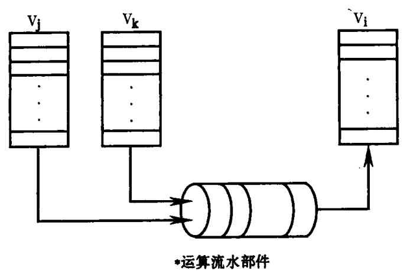

图 12.1 向量乘法指令执行示意图

在程序中向量通常是用数组来表示的。若 A,B,C 分别是由 n 个元素组成的一维数组,则下面的 FORTRAN 90 赋值语句均表示 A 与 B 的对应元素相乘,结果送给 C:

$$C = A * B$$

或者

$$C(1:N) = A(1:N) * B(1:N)$$

它们等价于循环:

do 
$$I = 1$$
,  $N$   
 $C(I) = A(I) * B(I)$   
\nenddo

对于这个例子,若 N = 1024,硬件向量长度最大为 128,则编译将此运算按 128 个元素

{2}------------------------------------------------

一组组织成向量运算循环,迭代 8 次完成全部运算,而标量循环需迭代 1024 次。因为每次循环迭代都要计算地址和迭代次数等,所以迭代次数越多开销就越大。由此看出,向量处理不仅由于充分利用流水线而获得了运算速度的提高,而且还减少了组织循环的开销,因此它比标量处理更高效。

并行编译针对向量计算机的一个重要功能是串行程序向量化。显然,程序中的向量成分越多,向量机的运行效率就越高。向量化自动地寻找源程序中可以向量化的循环,必要时对循环作适当的改写或变换,以利于向量化。

· 我们在 12.6 节中讨论串行程序的向量化,关于程序向量化的例子可参见该节例 12.17、例 12.18。

## 12.1.2 共享存储器多处理机

共享存储器多处理机是由多个处理机和一个共享存储器,以及专门的同步通信部件构成的计算机系统,其结构如 12.2 所示。

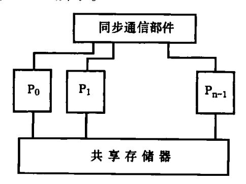

图 12.2 共享存储器多处理机结构图

其中, $P_0$ , $P_1$ ,…, $P_{n-1}$ 为同构的处理机,这些处理机可以是标量处理机,也可以是向量处理机,每个处理机可以执行相同或不同的指令流。处理机的个数一般为 2~64 个。这些处理机共享一个中央存储器,多个处理机可以同时访问存储器中的数据。但一个处理机能访问哪些数据,一个数据应先由哪个处理机访问才能保证程序的正确性是要由程序员来控制的,硬件无法控制。同步通信部件提供处理机间同步通信的硬件支持,例如共享信号灯用于实现基本的同步原语,共享寄存器则用于实现快速的处理机间通信。

共享存储器多处理机在更大的范围内提供了并行处理的能力。向量机只能并行处理向量操作,而多处理机可以并行执行多个循环迭代、语句块、子程序段。当多处理机系统的每个处理机都是向量处理机时,还可以实现高层的并行处理和低层的向量处理。例如对于例 1 的循环,在 8 个向量多处理机系统上执行时,每个向量处理机只需执行向量运算循环的一个迭代,完成 128 个元素的向量操作,从而使得执行时间只有单个向量处理机的 1/8。

共享存储多处理机上程序通常采用的是多指令流、多数据流(即 MIMD)并行方式。程序显式并行性的表达典型的有多任务和 FORTRAN 90 数组运算。多任务通常分为子程序一级的宏任务和循环一级的微任务。

共享主存多处理机的并行编译系统有许多专门的工作要做,这些工作包括下列内容。

{3}------------------------------------------------

### • 串行程序并行化

它识别串行程序中可以并行执行的部分,并将它们表示成可并行执行的多个任务。通常并行化的对象是循环,它将可并行执行的循环改写成并行语法形式或者在其前面插入并行化编译指导命令。针对共享存储器多处理机的自动并行化研究已取得了较大的进展,有代表性的如 Kuck & Associates 公司的 KAP, CRAY 公司的 Autotasking 等自动并行化软件。

```
例如,考虑如下串行程序:
       SUBROUTINE JAC(N,M,DX,DY,ALPHA,OMEGA,U,F,TOL,MAXIT,UN)
       INTEGER N, M
       DOUBLE DX, DY, ALPHA, OMEGA, MAXIT, TOL
       DOUBLE U(N,M), F(N,M), UN(N,M)
       DOUBLE ERROR, RESID, AX, AY, B,
       AX = 1.0/(DX * DX)
       AY = 1.0/(DY * DY)
       B = -2.0/(DX * DX) - 2.0/(DY * DY) - ALPHA
       ERROR = 10.0 * TOL
      DOJ = 1, M
          DO I = 1.N
              U(I,J) = U(I-1,J+1) * ALPHA
          ENDDO
       ENDDO
       DO J = 2, M-1
          DOI = 2, N-1
              RESID = (AX * (U(I-1,J) + U(I+1,J))
      &
                    + AY * (U(I,J-1) + U(I,J+1))
      &
                    + B * U(I,J) - F(I,J)/B
              UN(I,J) = U(I,J) - OMEGA * RESID
              ERROR = ERROR + RESID * RESID
          END DO
       ENDDO
       ERROR = SORT(ERROR)/DBLE(N * M)
       PRINT * , 'RESIDUAL
                          ', ERROR
       RETURN
       END
这个串行程序经自动并行化软件的编译后,将变成如下程序:
      SUBROUTINE JAC (N, M, DX, DY, ALPHA, OMEGA, U, F, TOL, MAXIT, UN)
      INTEGER N, M
      DOUBLE DX, DY, ALPHA, OMEGA, MAXIT, TOL
      DOUBLE U(N,M), F(N,M), UN(N,M)
```

{4}------------------------------------------------

DOUBLE ERROR, RESID, AX, AY, B,

```
AX = 1.0/(DX * DX)
      AY = 1.0/(DY * DY)
      B = -2.0/(DX * DX) - 2.0/(DY * DY) - ALPHA
      ERROR = 10.0 * TOL
      DO J = 1, M
         DO I = 1.N
             U(I,J) = U(I-1,J+1) * ALPHA
         ENDDO
      ENDDO
                                                   ! 并行化软件插入的指导命令,
! $OMP PARALLELDO SCHEDULE(STATIC)
! $OMP&SHARED(OMEGA, ERROR, N, M, AX, AY, B, UN, U, F) ! 标识下循环为并行循环
! $OMP&PRIVATE(I, J, RESID)
! $OMP&REDUCTION(+:ERROR)
       DO J = 2, M - 1
          DOI = 2, N-1
             RESID = (AX * (U(I-1,J) + U(I+1,J))
                    + AY * (U(I,J-1) + U(I,J+1))
       &
                    + B * U(I,J) - F(I,J)/B
       &
             UN(I,J) = U(I,J) - OMEGA * RESID
             ERROR = ERROR + RESID * RESID
          END DO
       ENDDO
! $OMP END PARALLELDO
       ERROR = SQRT(ERROR)/DBLE(N * M)
       PRINT * , 'RESIDUAL
                             ', ERROR
       RETURN
       END
```

其中,第一个循环不可以并行化,第二个循环可以并行化,该循环由以'! \$OMP'打头的编译指导命令所标识。其中,从句 SHARED 指明在每个并行任务之间共享的数据,从句 PRIVATE 指明各个任务私有的数据,从句 REDUCTION 指明循环归约变量以及归约运算符。

## • 编译并行语法成分

将用并行语言或并行编译指导命令表示的并行程序转换成可由多个处理机并行执行的目标程序。并行程序的执行包括任务调度、处理机分配和任务同步等方面。并行机系统中通常由并行库提供完成这些工作的子程序,编译要做的工作是在程序中的适当位置插入对这些库子程序的调用,以实现并行语法或并行编译指导命令所要求的并行控制,同时,恰当地进行存储分配,使各种数据私有化或全局化。

例如,对于前面这个含并行指导命令的程序代码,在共享存储多处理机上,其编译程

{5}------------------------------------------------

```
序通常将它转换成如下含并行库调用的等价并行程序:
     SUBROUTINE JAC (N, M, DX, DY, ALPHA, OMEGA, U, F, TOL, MAXIT, UN)
     INTEGER N, M
     DOUBLE DX, DY, ALPHA, OMEGA, MAXIT, TOL
     DOUBLE U(N,M), F(N,M), UN(N,M)
     DOUBLE ERROR, RESID, AX, AY, B,
     AX = 1.0/(DX * DX)
     AY = 1.0/(DY * DY)
     B = -2.0/(DX * DX) - 2.0/(DY * DY) - ALPHA
     ERROR = 10.0 * TOL
     DO J=1, M
       DO I = 1, N
           U(I,J) = U(I-1,J+1) * ALPHA
       ENDDO
    ENDDO
    CALL PARALLEL $LIB(SUB_DO)
                                            ! 启动所有任务并行执行子程序 SUB_DO
    ERROR = SQRT(ERROR)/DBLE(N * M)
    PRINT *, 'RESIDUAL', ERROR
    RETURN
    CONTAINS
                                            ! PARALLELDO/ END PARALLELDO 之间
    SUBROUTINE SUB_DO
                                            ! 的代码被改写为子程序
      INTEGER I, J, MYDOLO, MYDOHI, MYDOINC
                                            ! 任务私有变量均在子程序内说明
      DOUBLE RESID
      DOUBLE LC_ERROR
      LC_ERROR = 0
      CALL STATIC_SETDO $LIB(2, M-1,1)
                                            ! 每个任务按 STATIC 划分设置循环控制值
      DO WHILE(STATIC_MORE $LIB(MYDOLO,
               MYDOHI, MYDOINC))
                                            ! 各自取自己的迭代区间
         DO J = MYDOLO, MYDOHI, MYDOINC
           DOI = 2, N-1
             RESID = (AX * (U(I-1,J) + U(I+1,J))
&
                     + AY * (U(I,J-1) + U(I,J+1))
&
                     + B * U(I,J) - F(I,J)/B
               UN(I,J) = U(I,J) - OMEGA * RESID
               LC_ERROR = LC_ERROR + RESID * RESID
           ENDDO
        ENDDO
     ENDDO
     CALL LOCK $LIB()
```

{6}------------------------------------------------

 $ERROR = ERROR + LC_ERROR$ 

! 归约私有 LC\_ ERROR 至共享 ERROR

CALL UNLOCK \$LIB()

END SUBROUTINE SUB\_DO

END SUBROUTINE JAC

这里, PARALLEL \$ LIB, STATIC\_SETDO \$ LIB, STATIC\_MORE \$ LIB, LOCK \$ LIB, UNLOCK \$ LIB 等都是并行库函数,这些函数完成程序的底层并行控制,它们通常也是并行编译系统的一个部分。

# 12.1.3 分布存储器大规模并行计算机

这类计算机是由成百、上千乃至上万个结点构成的并行机,每个结点有自己的处理机和存储器,结点之间以互联网络相连,其体系结构示意图如图 12.3 所示。

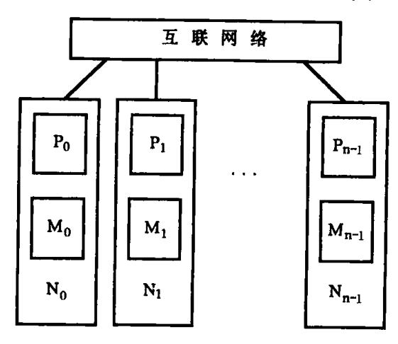

图 12.3 分布存储器大规模并行计算机结构示意图

其中, $P_0$ , $P_1$ ,…, $P_{n-1}$ 为处理机,通常是微处理器; $M_0$ , $M_1$ ,…, $M_{n-1}$ 是局部存储器。每一对  $P_i$  和  $M_i$  构成一个结点  $N_i$ 。这类计算机的特点是存储访问时间不一致,即处理机对远程存储器的访问时间比对本地存储器的访问时间要长得多。早期的分布存储器大规模并行机的所有局部存储器均是私有的,即只能由本机访问。处理机之间的通信,也即处理机对远程存储器的访问要通过软件的消息传递库实现。后来研制成了分布共享存储器大规模并行机,由硬件支持处理机对远程存储器的访问,这样,在一定程度上缩短了远程访问的时间,但与本地访问相比还是比较长。

分布存储器大规模并行机得以发展的原因一方面是,它的结点机由微处理器构成,相对向量机而言要廉价得多;另一方面是硬件不存在共享存储器的瓶颈问题,因而可以将成千上万个结点连接在一起,从而获得极高的峰值运算速度。

数据并行程序设计语言是分布存储器大规模并行机上主要的并行程序设计语言,它主要扩充了数据分布和并行任务的描述能力。这类语言最具代表性的是高性能 FORTRAN HPF,其它的还有各计算机公司为其大规模并行机配置的语言,如 CM FORTRAN、C\*, CRAY MPP FORTRAN等等。数据并行语言使用户能用较简单和直观的方法来编写并行程序,而不必拘泥于并行库子程序的调用规则细节。

目前大规模并行机上的并行编译系统主要是针对数据并行语言的,它需要完成以下

{7}------------------------------------------------

几种处理。

### • 数据分布

数据分布的目的是提高数据的局部性和并行性,减少通信开销,从而提高程序的执行速度。并行编译根据程序中的数据分布描述将数据按用户指定的方式或编译内定的方式分配到各个结点的存储器上。由于已分布的数据与相关的计算并不总能保持在一个结点上,即一些计算所需的数据可能存放在其它结点的存储器中,因此必要时编译程序还要根据运算的分布情况对已分布的数据进行再分布,以减少通信。

### • 任务划分

任务划分是指如何在多个处理机上分配并行任务,使得程序可以高效地并行执行。针对分布存储器大规模并行机的任务划分的原则是尽可能使计算与参与计算的数据均属于同一处理机。数据并行语言一般提供了循环一级的并行描述,并行编译的任务划分就是要确定并行循环的迭代如何分配到多个处理机上去执行。通常采用的划分原则是拥有.者计算原则,即数据在哪个处理机上,计算就分配到哪个处理机上去执行 循环中的并行计算一般都与分布数组有关,因此迭代分布与数据分布对准即可。但 个循环体中可能有多个语句,一个语句又可能涉及多个数组引用,因此在实现上又有两种方法,一种是按左部量划分,即按每个语句组织并行循环,按语句左部数组的数据分布来进行循环分布。另一种是按程序员在并行循环指导命令中指明的对准数组的数据分布来进行循环分布,此时若循环体中有多个语句也统一组织并行循环。

### • 同步与通信

并行编译对同步与通信的处理主要包括确定同步与通信点并插入相应的并行库子程序调用,以及同步通信优化。数据并行语言中的同步既可显式地描述,也可隐式的存在,如隐含在并行循环前后。对于通信的描述,则由于语言支持全局名字空间的特点,一般都是隐式的,即无论是本地还是远程数据访问,都是用变量引用来表示的。在不支持分布共享存储器的大规模并行机上,通信(即远程数据访问)是通过消息传递库子程序支持的。在支持分布共享存储器的大规模并行机上,通信有硬件与操作系统的支持,编译的工作是给出数据访问的结点号和结点存储器内的偏移。通信优化的方法之一是通信消除,即通过把多个单独的消息合并成一个大消息一次传递,从而减少消息传递次数;或者通过数据局部化或再分布等方法来消除必要的通信。另一种方法是通信隐藏,即通过消息预取、消息流水等让通信与计算重叠,从而隐藏通信开销。

### 12.1.4 并行编译系统的结构

从功能上看,并行编译系统通常包括程序分析、程序优化和并行代码生成三个部分,如图 12.4 所示。

#### • 程序分析

所有的编译优化实际上都是程序的等价变换,而程序等价变换的前提是程序中固有的数据依赖关系不变。因此,程序分析是各种并行优化的基础。它包括数据依赖关系分析、控制依赖关系分析以及数据流分析。对于不同的并行体系结构,程序中所开发的并行粒度亦有所不同,因此程序分析的级别也不一样。例如,对于超标量机而言,通常仅需做一般的数据流分析。而对于提供指令级并行的超长指令字机器、向量机或并行机而言,还

{8}------------------------------------------------

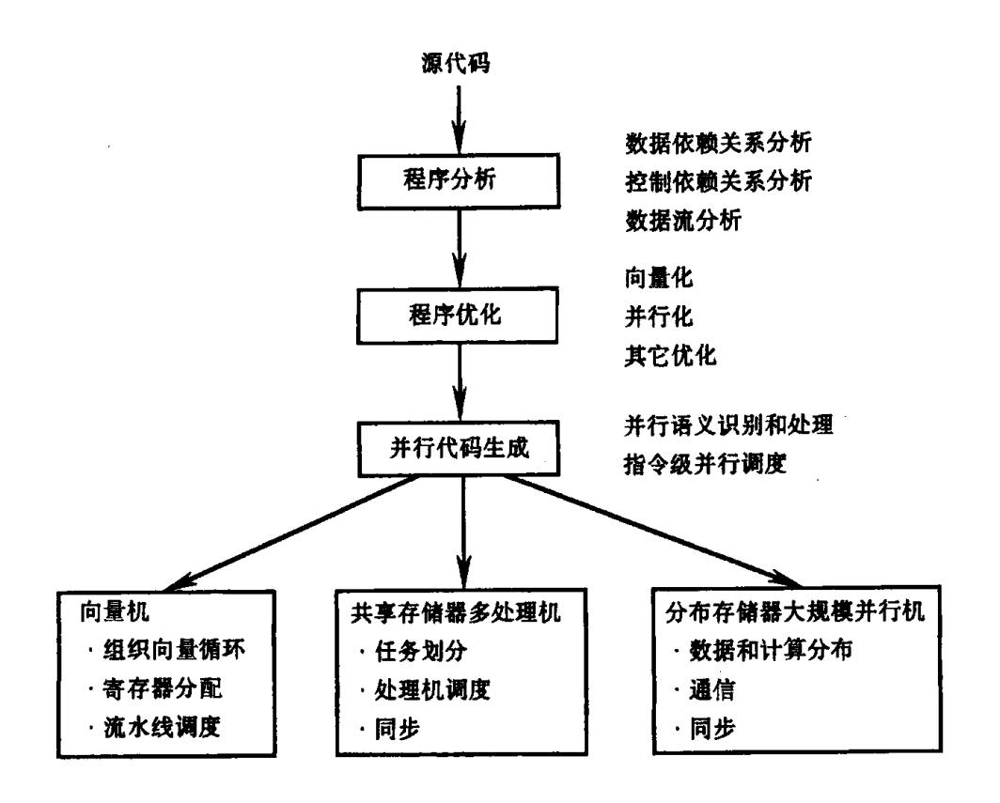

图 12.4 并行编译器的主要组成部分示意图

需要做数据依赖关系分析和控制依赖关系分析。并且分析的范围也随并行粒度的变化而变化。例如,小粒度并行往往是循环级并行,因而分析的对象一般是循环。而大粒度的并行是子程序级并行,所以还要分析子程序之间的关系。

#### • 程序优化

这里说的优化是指以尽可能利用并行硬件能力为目的的各种程序转换。程序优化就是要缩短程序的执行时间,这包括减少指令长度和存储访问次数,开发程序的并行性。优化技术包括利用向量流水线的向量化、利用多处理机结构的并行化、针对分布存储器结构的数据分布、计算分布、数据局部化和通信优化等,以及其它与机器相关的优化,如用于减少流水部件或存储器访问延迟的指令调度、针对超长指令字结构的指令并行归并等。在实际的并行编译系统中,这些优化并不是如图中所示那样集中为一遍,而是分散于不同层次上的多遍处理之中。通常向量化、并行化为单独的一遍,且多为源程序到源程序的转换。其它的优化则可能发生在中间代码生成阶段,也可能发生在代码生成阶段。

#### • 并行代码生成

这里所指的并行代码生成是指一种表示形式至另一种表示形式的转换。这种表示形式可以是源程序形式,也可以是中间代码形式。并行代码生成既包括源程序中的并行语法、语义的分析处理,也包括与体系结构相关的目标代码生成。对于不同的并行语言和不同的计算机结构,并行代码生成所做的工作也有所不同。对于向量处理机,它包括向量运算语句的处理,即将向量语句组织成向量循环。对于共享存储器多处理机,它包括并行循环的迭代划分,以及处理机调度与同少库子程序调用的插入。对于分布存储器大规模并行机,则还包括数据与计算的分布、分布数组的地址计算、通信所需的消息传递库子程序调用的插入等。

{9}------------------------------------------------

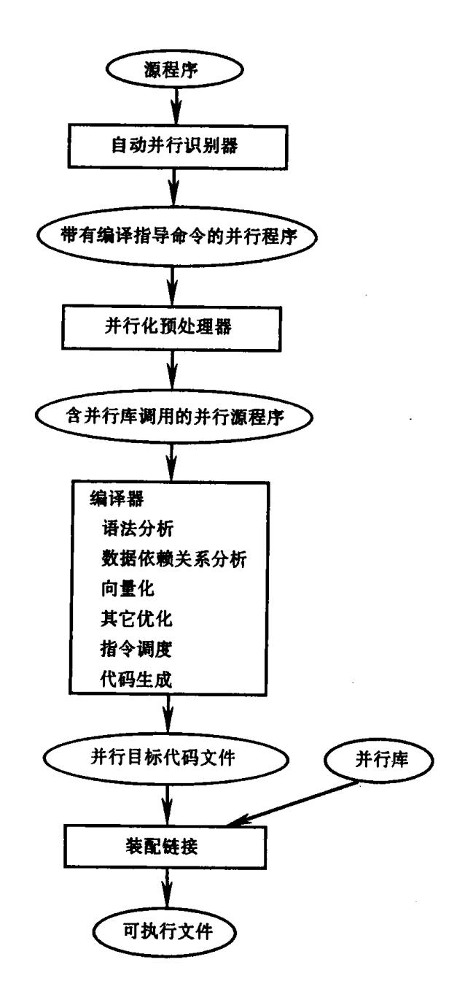

图 12.5 银河 - Ⅱ 并行编译器结构图

在实际的并行计算机系统中,并行编译系统往往是由若干部分组成的。图 12.5 给出的是银河 – II 共享存储器多处理机上并行编译系统的结构,它由自动并行识别器、并行化预处理器、编译器和并行库四个独立部分组成。

其中,自动并行识别器读入串行源程序,对其进行依赖关系分析,区分出私有与共享数据,识别出并行循环,完成有关的并行优化,并加上适当的并行编译指导命令,其输出是带有并行指导命令的并行源程序。并行化预处理器专门处理并行指导命令,它对并行循环进行任务划分,改写成含并行库子程序调用的并行源程序。编译器读入含并行库子程序调用的并行源程序,对其进行依赖关系分析以完成向量化,并同串行编译器一样,完成程序的语法、语义分析、生成中间代码,进行代码优化,包括流水线指令调度优化,最后生成并行目标代码。并行目标代码最终与并行库一起链接而成为一个可并行执行的文件。

本节,我们简要地介绍了并行计算机的几种典型结构,以及对于每一种结构,并行编

{10}------------------------------------------------

译系统所面临的工作。从中我们看出,计算机提供的并行性越高,体系结构越复杂,编译面临的任务就越多,越困难。这种困难性主要在于针对并行体系结构的向量化、并行化和各种优化中的许多问题都是 NP - 完全的问题。本章侧重于介绍并行编译的基础知识,为读者进一步研究并行编译技术打下基础。

# 12.2 基本概念

### 12.2.1 向量与向量的次序

考虑笛卡儿乘积  $\mathbf{Z}^m$ ,其中  $\mathbf{Z}$ 是所有整数组成的集合。称  $\mathbf{Z}^m$  的元素  $\mathbf{i}=(i_1,i_2,\cdots,i_m)$  是大小为  $\mathbf{m}$  的整向量或  $\mathbf{Z}^m$  的向量。任何大小的零向量 $(0,0,\cdots,0)$ 均记为 0。非零向量  $\mathbf{i}=(i_1,i_2,\cdots,i_m)$ 的前导元素是它的第一个非零元素。如果前导元素为  $i_1(1\leq i\leq m)$ ,称整数 1 为向量  $\mathbf{i}$  的层次,记为  $\mathbf{i}$  lev( $\mathbf{i}$ )。  $\mathbf{Z}^m$  的零向量的层次定义为  $\mathbf{m}+1$ 。若向量  $\mathbf{i}$  的前导元素为正,则称向量  $\mathbf{i}$  为正向量;反之,若前导元素为负,则称为负向量。零向量和正向量统称为非负向量。例如,向量(0,-5,0),(-1,20),(0,0,7)的前导元素分别为 -5,-1,7;其层次分别为 2,1,3;前二个向量为负向量,后一个向量是正向量。

对于整数 i,定义 i 的符号函数 sig(i)如下:

$$sig(i) = \begin{cases} 1 & i > 0 \\ 0 & i = 0 \\ -1 & i < 0 \end{cases}$$

则向量 $\mathbf{i} = (i_1, i_2, \dots, i_m)$ 的符号  $\mathbf{sig}(\mathbf{i})$ 是由它的元素的符号组成的向量,即

$$\mathbf{sig}(\mathbf{i}) = (\operatorname{sig}(\mathbf{i}_1), \operatorname{sig}(\mathbf{i}_2), \dots, \operatorname{sig}(\mathbf{i}_m))_{\circ}$$

例如,对于向量  $\mathbf{i} = (-3,8,0), \mathbf{sig}(\mathbf{i}) = (-1,1,0)$ 。

若向量 i 的每个元素都是 1,0 或 -1,则称它为**方向向量**。显然,对任意向量 i, sig(i) 是一个方向向量。一个给定的方向向量也是无限多个不同向量的符号。

我们用下述几种元素记号来表示具有某种共同属性的方向向量集合。

\*: 表示值为1,0或-1

±: 表示值为1或-1

0+: 表示值为0或1

0-: 表示值为0或-1

其中,较常使用的记号是'\*'。例如,(0,1,\*)代表  $\mathbb{Z}^3$  中所有层次为 2 的正方向向量集合: $\{(0,1,1),(0,1,0),(0,1,-1)\}$ ,称这些向量是形式为(0,1,\*)的向量。

一个给定的方向向量可以有许多种不同形式。例如,(0,1,-1)可以表示成 $(0,\pm,\pm)$ 或 $(0-,*,\pm)$ 。而方向向量(-1,0,0),(-1,0,-1),(-1,1,0),(-1,1,-1)均可表示成(-1,0+,0-)形式。

 $Z^m$  的向量之间存在着字典序。设  $\mathbf{i} = (i_1, i_2, \cdots, i_m)$  ,  $\mathbf{j} = (j_1, j_2, \cdots, j_m)$  , 向量  $\mathbf{i} < \mathbf{j}$  当且 仅当存在着整数  $l(1 \leq l \leq m)$  , 使得

$$i_1 = j_1, i_2 = j_2, \dots, i_{l-1} = j_{l-1} \coprod i_l < j_l$$

换言之,即 i < j 当且仅当 j - i 的方向向量是形式为 $(0,0,\cdots,0,1,*,*,\cdots,*)$ 且层次为 l 的正向量。

{11}------------------------------------------------

我们用记号  $i \leq j$  表示 i < j 或者 i = j。

例 12.1

$$(2,15,9) < (3,-2,7)$$
  
 $(2,15,9) < (2,16,-5)$   
 $(2,15,9) < (2,15,12)$ 

这里 < , 的下标 l 指明是在哪个层次导致 < 关系成立。

例 12.2 考虑如下循环

do 
$$I1 = 0,100$$
  
do  $I_2 = 0,200$   
S:  $X(I_1,I_2) = Y(I_1,I_2+1) + Z(I_1+1,I_2)$   
enddo  
enddo

令  $S(i_1,i_2)$ 和  $S(j_1,j_2)$ 分别表示当循环控制变量  $I_1,I_2$  取值分别为  $i_1,i_2$  和  $j_1,j_2$  时语句 S 的二个实例,则实例  $S(i_1,i_2)$ 先于实例  $S(j_1,j_2)$ 而执行的充分必要条件是下述二个条件 之一成立:

- $(1)i_1 < j_1$ ,也即 $(i_1, i_2) < (j_1, j_2)$ ;或者
- $(2)i_1 = j_1 且 i_2 < j_2$ ,也即 $(i_1, i_2) < 2(j_1, j_2)$ 。

利用向量之间的次序定义,可以将上二个条件归纳为  $S(i_1,i_2)$ 先于  $S(j_1,j_2)$ 而执行的充分必要条件是 $(i_1,i_2)$ < $(j_1,j_2)$ 。

#### 12.2.2 循环模型与索引空间

在本章的后续部分,当说到循环嵌套 L 时,均指如下形式的 FORTRAN 循环模型:

$$\begin{array}{lll} L_1: & & do \ I_1 \ = p_1\,, q_1 \\ L_2: & & do \ I_2 = p_2\,, q_2 \\ \vdots & & \vdots \\ L_m: & & do \ I_m = p_m\,, q_m \\ & & H(\,I_1\,, I_2\,, \cdots\,, I_m\,) \\ & & enddo \\ & \vdots \\ & enddo \end{array}$$

其中, $I_r$ 称为索引变量; $p_r$ , $q_r$ 分别称为循环初值和循环终值( $1 \le r \le m$ ), $p_1$ , $q_1$  为常数, $p_r$ , $q_r$ ( $1 \le r \le m$ )是  $I_1$ , $I_2$ ,…, $I_{r-1}$ 的整值函数; $H(I_1,I_2,…,I_m)$ 是由赋值语句组成的集合。

这是一个由 m 层循环组成的循环嵌套,各层循环之间不含其它语句。我们称这种循环模型为理想循环,记为  $\mathbf{L} = (L_1, L_2, \cdots, L_m)$ ,或简写为  $\mathbf{L}$  或 $(L_1, L_2, \cdots, L_m)$ 。当 m 取值为 1,2 或 3 时,它们分别对应于一层、二层或三层循环。

记  $\mathbf{I} = (\mathbf{I}_1, \mathbf{I}_2, \dots, \mathbf{I}_m)$ , 称之为循环嵌套  $\mathbf{L}$  的索引向量。 $\mathbf{I}$  的值称为**索引值**或**索引点**,即大小为  $\mathbf{m}$  的整向量( $\mathbf{i}_1, \mathbf{i}_2, \dots, \mathbf{i}_m$ )。其中

$$p_1 \leqslant i_1 \leqslant q_1$$

{12}------------------------------------------------

$$\begin{aligned} p_{2}(i_{1}) \leqslant i_{2} \leqslant q_{2}(i_{1}) \\ \vdots \\ p_{m}(i_{1}, i_{2}, \cdots, i_{m-1}) \leqslant i_{m} \leqslant q_{m}(i_{1}, i_{2}, \cdots, i_{m-1}) \end{aligned}$$

L的**索引空间**由所有索引点组成,它是  $\mathbb{Z}^m$  的子空间。若循环的初值与终值均与  $I_1$ ,  $I_2$ ,  $\cdots$ ,  $I_m$  无关且对每个 r,  $p_r \leq q_r$ , 则索引点的个数是  $\prod_{r=1}^m (q_r - p_r + 1)$ 。

L的循环体是  $H(I_1,I_2,\cdots,I_m)$ 或 H(I)。给定一个索引值  $\mathbf{i}=(i_1,i_2,\cdots,i_m)$ ,便确定了 H 的一个实例  $H(\mathbf{i})=H(i_1,i_2,\cdots,i_m)$ ,称之为 L 的一个**迭代**。由 FORTRAN 循环的定义,此循环嵌套的迭代是按索引值的字典序顺序执行的,即迭代  $H(\mathbf{i})$ 先于迭代  $H(\mathbf{j})$ 而执行当且仅当  $\mathbf{i}<\mathbf{j}$ 。

H 中的一个特定的赋值语句用 S, S(I)或 S( $I_1$ ,  $I_2$ , …,  $I_m$ )表示。S(I)对索引值 i = (i<sub>1</sub>, i<sub>2</sub>, …, i<sub>m</sub>)的实例表示为 S(i)或 S(i<sub>1</sub>, i<sub>2</sub>, …, i<sub>m</sub>)。

对于循环嵌套 L,给定一个索引点  $I = (i_1, i_2, \cdots, i_m)$ ,相应地有一个**迭代点 I**' =  $(i_1', i_2', \cdots, i_m')$ ,索引点与迭代点之间有如下关系:

$$i_r = p_r + i_r'$$
  $(1 \le r \le m)$ 

- **L** 的**迭代空间**由所有迭代点组成,它也是 **Z**<sup>m</sup> 的子空间。当  $p_r = 0(1 \le r \le m)$ 时,索引空间与迭代空间是同一个空间。注意,通常情况下,索引空间与迭代空间是有区别的,其区别在于:
- 1. 迭代空间中迭代变量 I'总是从原点开始的,而索引空间中的索引变量 I 则不一定这样;
- 2. 迭代空间中迭代变量 I'总是连续递增的,即每一维均是以  $0,1,2,\cdots$ 的顺序取值; 而索引空间则往往根据循环增量  $\theta$  的符号和大小作正向或反向跨步,当  $|\theta| > 1$  时,跨步则不为 1。

为了简化问题并且又不失一般性,我们的这个循环模型取  $\theta = 1$  作为各层的循环增量。事实上,对于如下形式的一般循环:

L: do 
$$I = p,q,\theta$$
  
H(I)

enddo

其中,p,q,θ是任意整型量,可以转变成等价的规范循环:

L': do I' = 
$$O, q', 1$$
  
 $H(p + I'\theta)$   
\nenddo

其中,q'=  $\lfloor (q-p)/\theta \rfloor$  且  $I=p+I'\theta$ 。

称这种转换为循环规范化。

例 12.3 考虑如下循环嵌套 L:

$$\begin{array}{ccc} L_1: & \text{do } I_1 = 5\,,17 \\ \\ L_2: & \text{do } I_2 = 3\,,I_1 + 1 \\ \\ & \text{H}(\,I_1\,,I_2\,) \\ \\ & \text{Enddo} \end{array}$$

{13}------------------------------------------------

enddo

外层循环  $L_i$  有(17 – 5 + 1),即 13 个索引值:5,6,…,17。对  $L_i$  的一个给定值  $i_l$ ,内层循环  $L_2$  有( $i_l$  + 1 – 3 + 1)或( $i_l$  – 1)个索引值:3,4,…, $i_l$  + 1。这个二层循环的索引空间如图 12.6 所示,它有  $\sum\limits_{i_l=5}^{17} (i_l$  – 1),即 130 个索引点。

给定一个索引点  $\mathbf{i} = (i_1, i_2)$ ,便确定了此循环的一个迭代  $\mathbf{H}(i_1, i_2)$ 。例如,对索引点  $\mathbf{i} = (8,7)$ ,有迭代  $\mathbf{H}(8,7)$ 。该循环的各迭通过按字典序取相应索引值而执行。假设

$$S(I_1,I_2)$$
:  $A(I_1,I_2) = A(I_1,I_2) + C(I_1,I_2) * A(I_1,I_2) + 1$ 

是 H 中的一个赋值语句,则 I = (8,7)时,语句  $S(I_1,I_2)$ 的实例为 S(8,7)。

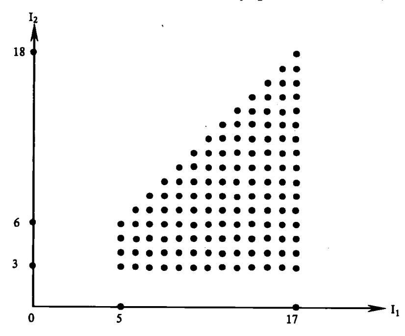

图 12.6 例 12.3 的索引空间图

#### 12.2.3 输入与输出集合

为了简洁起见,我们用字母  $S,T,U,V,\cdots$ 表示程序中的语句并仅涉及赋值语句。赋值语句的一般形式为

$$S: x = E$$

其中,x 是一个变量,它既可以是简单变量,也可以是数组元素引用;E 是一个表达式。对于这样一个语句 S,它的输出变量是 x,输入变量是出现在 E 中的任何变量。一般地,输出变量代表着对存储器的写操作,输入变量代表着对存储器的读操作。

由语句 S 的所有输出变量组成的集合称为 S 的**输出变量集合**,记为 OUT(S);由语句 S 的所有输入变量组成的集合称为 S 的**输入变量集合**,记为 IN(S)。

例12.4 下述赋值语句

S: X = A + B

T: C = A \* 3

U: A = A + C

的 IN 和 OUT 集合分别为

{14}------------------------------------------------

语句S的IN和OUT集合为

$$IN(S) = \{A(2), A(3), A(4), \dots, A(11), B\}$$
  
 $OUT(S) = \{X(1), X(2), X(3), \dots, X(10)\}$ 

在实际程序中,循环的边界往往不一定是常数且由于 if 条件分枝等原因,编译程序往往只能近似地测出 IN 和 OUT 集合。

例 12.6

$$\begin{array}{ll} I_1: & \text{do } I_1 = 1\,,10 \\ \\ I_2: & \text{do } I_2 = 3\,,I_1 + 1 \\ \\ S(I_1\,,I_2): & X(I_1\,,I_2) = X(I_1\,,I_2) * Y(I_1\,,I_2) \\ \\ & \text{enddo} \end{array}$$

enddo

语句S的IN和OUT集合为

IN(S) = 
$$\{ X(I_1, I_2), Y(I_1, I_2) : 1 \le I_1 \le 10, 3 \le I_2 \le I_1 + 1 \}$$
  
OUT(S) =  $\{ X(I_1, I_2) : 1 \le I_1 \le 10, 3 \le I_2 \le I_1 + 1 \}$ 

为了得到 S 的某个特定实例的输入变量和输出变量,可用对应的索引值替换( $I_1$ , $I_2$ )。例如,实例 S(8,7)对应于  $I_1$  = 8,  $I_2$  = 7。于是,有

$$IN(S(8,7)) = \{ X(8,7), Y(15) \}$$
  
 $OUT(S(8,7)) = \{ X(8,7) \}$ 

### 12.2.4 语句的执行顺序

若在程序中语句 S 词法上先于语句 T,则记为 S < T。S  $\leq$  T 表示 S 要么词法上先于 T, 要么 S 与 T 为同一条语句。

我们用  $\theta$  表示语句之间的执行顺序。SØT 表示语句 S 先于语句 T 而执行,S(i) $\theta$ T(j)表示循环体中 S 的实例 S(i)先于 T 的实例 T(j)而执行。

对二个顺序执行的赋值语句 S 和 T,若它们不包含在循环中,则显然有 S 先于 T 而执行当且仅当 S < T。对于循环嵌套 L 的循环体 H,在它的迭代 H(i)执行期间,H 中的每个语句均按词法顺序执行,因此,若迭代 H(i)先于迭代 H(j)而执行,则 H(i)中的每一个语句实例均先于 H(j)中的每个语句实例而执行。这一事实可表示为下面的引理。

引理 12.1 设 S 和 T 是循环嵌套 L 的循环体内的二条语句。在 L 的执行中,S 的实例 S(i) 先于 T 的实例 T(j) 而执行当且仅当下列条件之一成立:

- (1) i < j;或者
- (2)  $i = j 且 S < T_o$

{15}------------------------------------------------

这个引理的直观叙述是:S(i)先于 T(j)而执行,要么由 i 确定的迭代先于 j 确定的迭代,这时 S 和 T 的词法顺序可以是任意顺序;要么当 i 和 j 确定的迭代相同时,S 在词法上先于 T。

## 例 12.7 考虑循环:

$$\begin{array}{lll} L_1: & \text{do } I_1=1\,,10 \\ L_2: & \text{do } I_2=2\,,20 \\ & S: & A(I_1\,,I_2)\,=\,B(I_1\,,I_2-1)+C(I_1\,,I_2) \\ & T: & B(I_1\,,I_2)\,=\,A(I_1\,,I_2)+B(I_1\,,I_2) \\ & \text{enddo} \end{array}$$

S和T有下述执行顺序关系:

$$S(1,1) \theta T(1,1)$$
  
 $T(2,3) \theta S(3,1)$ 

事实上,只要当  $i_1 < j_1$ ,或者当  $i_1 = j_1$  但  $i_2 < j_2$  时,就有

enddo

$$S(i_1,i_2) \theta T(j_1,j_2)$$

同样,只要当  $j_1 < i_1$  或者  $j_1 = i_1$  但  $j_2 < i_2$  时,就有

$$T(j_1, j_2) \theta S(i_1, i_2),$$

其中  $1 \leq i_1, i_2 \leq 10, 2 \leq j_1, j_2 \leq 20$ 。

具备了以上基本概念后,我们就可以方便地研究数据依赖关系了。

# 12.3 依赖关系

一个计算机程序就像一段交响曲,就像一段正在编织的织锦,其中某些事情必须发生在另一些事情之前,某些事情必须与其它事情协调发生。对于计算机程序,当事件或动作 A 必须先于事件 B 而发生时,称 B 依赖于 A。我们称这种关系为**依赖关系**。有时候依赖关系是由于读/写或计算/使用同一数据而引起的,称这种关系为**数据依赖关系**。例如,在下面的代码中,B 的值数据依赖于 A 的值,这是因为只能在 A 的值计算完成后才能计算 B 的值。

$$A = X + Y + \cos(Z)$$
$$B = A * C$$

有时候,依赖关系是由于程序流程而引起的,如一个分枝是否执行或是否跳出循环等,称这种情形为控制依赖关系。例如,在下面的代码中,位于 if 块中的赋值语句可能会执行,也可能不会执行,这取决于'I.EQ.O'的测试结果。换言之,即 A 的值依赖于围绕它的代码的控制流。

IF (I.EQ.O)THEN
$$A = B * C$$
ENDIF

控制依赖关系往往导致语句的执行顺序需要到程序运行中才能确定,又因为影响向量化、并行化的主要是数据依赖关系,我们这里只关心数据依赖关系,不准备讨论控制依

{16}------------------------------------------------

赖关系。以后凡说到依赖关系均指数据依赖关系。

### 12.3.1 依赖关系定义

数据依赖关系可以从许多不同的角度来定义。我们首先利用输入和输出变量集合给 出语句间依赖关系的一般定义,然后针对循环定义语句间的依赖关系。

### 数据依赖关系定义 1

已知语句 S 和 T,若存在着变量 x 使之满足下述条件之一,则称语句 T 依赖于语句 S, 记为 S&T;否则,语句 S 与 T 之间不存在依赖关系。

- (1)若同时有  $x \in OUT(S)$ ,  $x \in IN(T)$ , 且 T 使用由 S 计算出的 x 之值,则称 T 流依赖于 S,记为 SofT。
- (2)若同时有  $x \in IN(S)$ ,  $x \in OUT(T)$ ,但 S 使用 x 的值先于 T 对 x 的定值,则称 T **反依** 赖于 S,记为 S8 T。
- (3)若同时有  $x \in OUT(S)$ ,  $x \in OUT(T)$ , 且 S 对 x 的定值先于 T 对 x 的定值,则称 T 输 出依赖于S,记为SoT。

# 例 12.7 考虑下述语句:

S: 
$$A = B + D$$
  
T:  $C = A * 3$   
U:  $A = A + C$   
V:  $E = A/2$ 

它们之间有如下数据依赖关系:

S:

do I = 1,100

 $S\delta^fT$ S∂<sup>f</sup>U S&U  $T\delta^{f}U$ TδaU UδfV

例 12.8

其中,

S: 
$$A(I) = B(I+2) + 1$$
  
T:  $B(I) = A(I-1) - 1$   
\nenddo  
OUT(S) =  $\{A(1), A(2), A(3), \dots, A(100)\}$   
IN(S) =  $\{B(3), B(4), B(5), \dots, B(103)\}$ 

OUT(T) = { B(1), B(2), B(3), ..., B(100) }  

$$IN(T) = { A(0), A(1), A(2), ..., A(99) }$$

对于 I 在{1,2,…,100}中的每个值 i,语句 S 和 T 都有一个实例,分别表示为 S(i)和 T(i)。部分地展开这个循环将有助于我们确切地观察数组 A 和 B 的不同元素是如何被这 些实例引用的。

S(1): 
$$A(1) = B(3) + 1$$
  
T(1):  $B(1) = A(0) - 1$   
S(2):  $A(2) = B(4) + 1$   
T(2):  $B(2) = A(1) - 1$   
S(3):  $A(3) = B(5) + 1$   
T(3):  $B(3) = A(2) - 1$ 

{17}------------------------------------------------

S(4): A(4) = B(6) + 1T(4): B(4) = A(3) - 1  $\vdots$   $\vdots$ S(100): A(100) = B(102) + 1T(100): B(100) = A(99) - 1

从中看出  $A(1) \in OUT(S)$ ,  $A(1) \in IN(T)$ , 且 S 在 I = 1 时定值 A(1), T 在 I = 2 时引用 A(1), 即语句 S 先定义 A(1), 语句 T 后使用 A(1)。由依赖关系定义,我们得出 T 流依赖于 S,即 S $\delta$ <sup>f</sup>T。

另外,语句 S 在 I = 1 时使用的 B(3)之值是在循环之前定义的,而不是语句 T 在 I = 3 时计算出的值。换言之,即语句 S 的实例 S(1)应当在语句 T 的实例 T(3)改变 P(3)之前使用 P(3)的值。类似地,实例 P(3)也应当在实例 P(4)改变 P(4)之前使用 P(4)的值,等等。由此得出,语句 T 反依赖于语句 S,即 P(4)000000000000000000000000000000000000

依赖关系定义 1 给出的是一般定义。对于顺序执行的语句来说,利用此定义我们可以较直观地观察出所存在的依赖关系,但对处在循环内的语句来说,它没有与循环迭代相联,而实际上循环内语句之间的依赖关系正如例 12.8 所示那样,往往与迭代有关,因此,它对于描述循环内的语句依赖关系不太方便。下面,我们针对循环的情况给出依赖关系定义的另一种形式。

#### 数据依赖关系定义 2

设语句 S 和 T 是循环嵌套 L 中的二个语句。语句 T 依赖于语句 S,记为 S $\delta$ T,如果存在 S 的一个实例 S(i),T 的一个实例 T(j),以及 S 的一个变量 u,T 的一个变量 v,使得

- (1)u和 v至少有一个是它所在语句的输出变量;
- (2)u 在实例 S(i)中和 v 在实例 T(j)中都表示同一个存储单元 M;
- (3)在 L 的顺序执行中, S(i) 先于 T(j) 被执行;
- (4)在 L 的顺序执行中,从 S(i)结束执行到 T(j)开始执行期间,没有其它对 M 的写操作。

如果变量 u,v 和实例 S(i),T(j)满足这四个条件,则称变量对 u,v 引起 T 依赖于 S,称实例 T(j)依赖于实例 S(i)。由 u,v 引起的依赖关系是:

流依赖,如果 u∈OUT(S),v∈IN(T);

反依赖,如果 u∈IN(S),v∈OUT(T);

输出依赖,如果 u∈OUT(S),v∈OUT(T)。

在此定义中,语句 S 和 T 不必是不同的,但条件 3 要求实例 S(i) 和 T(j) 是不同的。T 对 S 的依赖关系是所有满足上述条件的偶对(S(i),T(j)) 组成的集合,即  $\delta = \delta^f \cup \delta^e \cup \delta^e \cup \delta^e \cup \delta^e \cup \delta^e \cup \delta^e \cup \delta^e \cup \delta^e \cup \delta^e \cup \delta^e \cup \delta^e \cup \delta^e \cup \delta^e \cup \delta^e \cup \delta^e \cup \delta^e \cup \delta^e \cup \delta^e \cup \delta^e \cup \delta^e \cup \delta^e \cup \delta^e \cup \delta^e \cup \delta^e \cup \delta^e \cup \delta^e \cup \delta^e \cup \delta^e \cup \delta^e \cup \delta^e \cup \delta^e \cup \delta^e \cup \delta^e \cup \delta^e \cup \delta^e \cup \delta^e \cup \delta^e \cup \delta^e \cup \delta^e \cup \delta^e \cup \delta^e \cup \delta^e \cup \delta^e \cup \delta^e \cup \delta^e \cup \delta^e \cup \delta^e \cup \delta^e \cup \delta^e \cup \delta^e \cup \delta^e \cup \delta^e \cup \delta^e \cup \delta^e \cup \delta^e \cup \delta^e \cup \delta^e \cup \delta^e \cup \delta^e \cup \delta^e \cup \delta^e \cup \delta^e \cup \delta^e \cup \delta^e \cup \delta^e \cup \delta^e \cup \delta^e \cup \delta^e \cup \delta^e \cup \delta^e \cup \delta^e \cup \delta^e \cup \delta^e \cup \delta^e \cup \delta^e \cup \delta^e \cup \delta^e \cup \delta^e \cup \delta^e \cup \delta^e \cup \delta^e \cup \delta^e \cup \delta^e \cup \delta^e \cup \delta^e \cup \delta^e \cup \delta^e \cup \delta^e \cup \delta^e \cup \delta^e \cup \delta^e \cup \delta^e \cup \delta^e \cup \delta^e \cup \delta^e \cup \delta^e \cup \delta^e \cup \delta^e \cup \delta^e \cup \delta^e \cup \delta^e \cup \delta^e \cup \delta^e \cup \delta^e \cup \delta^e \cup \delta^e \cup \delta^e \cup \delta^e \cup \delta^e \cup \delta^e \cup \delta^e \cup \delta^e \cup \delta^e \cup \delta^e \cup \delta^e \cup \delta^e \cup \delta^e \cup \delta^e \cup \delta^e \cup \delta^e \cup \delta^e \cup \delta^e \cup \delta^e \cup \delta^e \cup \delta^e \cup \delta^e \cup \delta^e \cup \delta^e \cup \delta^e \cup \delta^e \cup \delta^e \cup \delta^e \cup \delta^e \cup \delta^e \cup \delta^e \cup \delta^e \cup \delta^e \cup \delta^e \cup \delta^e \cup \delta^e \cup \delta^e \cup \delta^e \cup \delta^e \cup \delta^e \cup \delta^e \cup \delta^e \cup \delta^e \cup \delta^e \cup \delta^e \cup \delta^e \cup \delta^e \cup \delta^e \cup \delta^e \cup \delta^e \cup \delta^e \cup \delta^e \cup \delta^e \cup \delta^e \cup \delta^e \cup \delta^e \cup \delta^e \cup \delta^e \cup \delta^e \cup \delta^e \cup \delta^e \cup \delta^e \cup \delta^e \cup \delta^e \cup \delta^e \cup \delta^e \cup \delta^e \cup \delta^e \cup \delta^e \cup \delta^e \cup \delta^e \cup \delta^e \cup \delta^e \cup \delta^e \cup \delta^e \cup \delta^e \cup \delta^e \cup \delta^e \cup \delta^e \cup \delta^e \cup \delta^e \cup \delta^e \cup \delta^e \cup \delta^e \cup \delta^e \cup \delta^e \cup \delta^e \cup \delta^e \cup \delta^e \cup \delta^e \cup \delta^e \cup \delta^e \cup \delta^e \cup \delta^e \cup \delta^e \cup \delta^e \cup \delta^e \cup \delta^e \cup \delta^e \cup \delta^e \cup \delta^e \cup \delta^e \cup \delta^e \cup \delta^e \cup \delta^e \cup \delta^e \cup \delta^e \cup \delta^e \cup \delta^e \cup \delta^e \cup \delta^e \cup \delta^e \cup \delta^e \cup \delta^e \cup \delta^e \cup \delta^e \cup \delta^e \cup \delta^e \cup \delta^e \cup \delta^e \cup \delta^e \cup \delta^e \cup \delta^e \cup \delta^e \cup \delta^e \cup \delta^e \cup \delta^e \cup \delta^e \cup \delta^e \cup \delta^e \cup \delta^e \cup \delta^e \cup \delta^e \cup \delta^e \cup \delta^e \cup \delta^e \cup \delta^e \cup \delta^e \cup \delta^e \cup \delta^e \cup \delta^e \cup \delta^e \cup \delta^e \cup \delta^e \cup \delta^e \cup \delta^e \cup \delta^e \cup \delta^e \cup \delta^e \cup \delta^e \cup \delta^e \cup \delta^e \cup \delta^e \cup \delta^e \cup \delta^e \cup \delta^e \cup \delta^e \cup \delta^e \cup \delta^e \cup \delta^e \cup \delta^e \cup \delta^e \cup \delta^e \cup \delta^e \cup \delta^e \cup \delta^e \cup \delta^e \cup \delta^e \cup \delta^e \cup \delta^e \cup \delta^e \cup \delta^e \cup \delta^e \cup \delta^e \cup \delta^e \cup \delta^e \cup \delta^e \cup \delta^e \cup \delta^e \cup \delta^e \cup \delta^e \cup \delta^e \cup \delta^e \cup \delta^e \cup \delta^e \cup \delta^e \cup \delta^e \cup \delta^e \cup \delta^e \cup \delta^e \cup \delta^e \cup \delta^e \cup \delta^e \cup \delta^e \cup \delta^e \cup \delta^e \cup \delta^e \cup \delta^e \cup \delta^e \cup \delta^e \cup \delta^e \cup \delta^e \cup \delta^e \cup \delta^e \cup \delta^e \cup \delta^e \cup \delta^e \cup \delta^e \cup \delta^e \cup \delta^e \cup \delta^e \cup \delta^e \cup \delta^e \cup \delta^e \cup \delta^e \cup \delta^e \cup \delta^e \cup \delta^e \cup \delta^$ 

#### 12.3.2 语句依赖图

一给定程序的**语句依赖关系图**是关系  $\delta$  的有向图。图中每个结点表示一个语句,结点 S 和 T 有一条弧当且仅当  $S\delta T$ 。用弧表示流依赖,用带短线的弧表示反依赖,用带小圈的弧表示输出依赖。

依赖关系  $\delta$  的传递闭包,记为 $\overline{\delta}$ ,是**间接依赖关系**。因此,若在语句依赖图上存在着一条从  $S \cong T$  的路径,则语句 T 间接依赖于语句 S,记为  $S \overline{\delta} T$ 。换言之, $S \overline{\delta} T$ ,若存在着一非

{18}------------------------------------------------

空语句顺列, $S_1$ , $S_2$ ,…, $S_N$ ,使得

$$S = S_1, S_1 \delta S_2, \dots, S_{N-1} \delta S_N, S_N = T$$

例 12.9 考虑单层循环

L: do I = 4,200

S: A(I) = B(I) + C(I)

T: B(I+2) = A(I-1) + A(I-3) + C(I-1)

U: A(I+1) = B(2I+3) + 1 enddo

L的 197 个迭代按索引值 4,5,…,200 依次执行。数组元素的下标都比较简单,我们可以通过考察前若干个迭代而看出其中的依赖关系。L的前四个迭代,对应于索引值 4,5,6,7,展开如下:

S(4): A(4) = B(4) + C(4)

T(4): B(6) = A(3) + A(1) + C(3)

$$U(4)$$
:  $A(5) = B(11) + 1$ 

S(5): A(5) = B(5) + C(5)

T(5): B(7) = A(4) + A(2) + C(4)

U(5): A(6) = B(13) + 1

S(6): A(6) = B(6) + C(6)

T(6): B(8) = A(5) + A(3) + C(5)

U(6): A(7) = B(15) + 1

S(7): A(7) = B(7) + C(7)

T(7): B(9) = A(6) + A(4) + C(6)

U(7): A(8) = B(17) + 1

其中,S 的输出变量 A(I)在实例 S(4)中与 T 的输入变量 A(I-1)在实例 T(5)中均引用 A(4),且 S(4)先于 T(5)被执行。因此,我们有语句 T 流依赖于语句 S。由这二个变量引起的 T T S 的流依赖关系是集合:

 $\{(S(4),T(5)),(S(5),T(6)),(S(6),T(7)),\cdots,(S(199),T(200))\}.$ 

即集合:

 $\{(S(i),T(j)): i=j-1,5 \le j \le 200\}.$ 

另外,S 中的输出变量 A(I)和 T 中的输入变量 A(I-3)也引起 T 流依赖于 S。由它们引起的流依赖关系集合是:

 $\{(S(4),T(7)),(S(5),T(8)),(S(6),T(9)),\cdots,(S(197),T(200))\}.$ 

即集合:

 $\{(S(i),T(j)): i=j-3,7 \le j \le 200\}.$ 

上述二个集合的并给出了T对S的所有流依赖关系。

{19}------------------------------------------------

语句 S 也流依赖于语句 T,它是由 T 的输出变量 B(I+2)和 S 的输入变量 B(I)引起的,这个依赖关系集合为:

 $\{(T(4),S(6)),(T(5),S(7)),(T(6),S(8)),\cdots,(T(198),S(200))\}.$ 

语句 S 输出依赖于语句 U。S 对 U 的输出依赖集合是:

 $\{(U(4),S(5)),(U(5),S(6)),(U(6),S(7)),\cdots,(U(199),S(200))\}.$ 

语句 T 反依赖于语句 U,T 对 U 的反依赖集合是:

 $\{(U(4),T(9)),(U(5),T(11)),(U(6),T(13)),\cdots,(U(99),T(199))\}.$ 

注意,尽管语句 U 中含对数组元素 A(I+1)的定值,语句 T 中含对数组元素 A(I-1), A(I-3)的引用,但语句 T 不会流依赖于语句 U。因为每当有实例 U(i)和 T(j),使得 U(i) 先于 T(j)被执行且它们均引用相同的存储位置时,另还有 S 的一个实例写同一存储位置。例如,U(4)和 T(6)引用由 A(5)表示的存储位置,但 S(5)写此位置,而在程序的执行中,S(5)的执行在 U(4)和 T(6)之间。

循环 L 的语句依赖图如 12.7 所示。

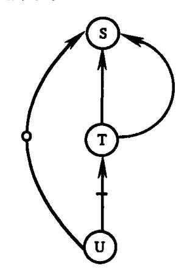

图 12.7 例 12.9 的语句依赖图

### 12.3.3 依赖距离、依赖方向与依赖层次

设语句 S 和 T 是循环嵌套 L 中的语句。如果语句 T 依赖于语句 S,则存在着实例S(i)  $\delta$ T(j)。令 d = j - i, $\sigma$  = sig(d), l = lev(d), m d 是这个依赖关系的**依赖距离向量**, $\sigma$  是**依赖方向向量**, l 是**依赖层次**。也称语句 T 在第 l 层上以距离向量 d、方向向量  $\sigma$  依赖于语句 S。设方向向量  $\sigma$  = ( $\sigma$ <sub>1</sub>, $\sigma$ <sub>2</sub>,..., $\sigma$ <sub>m</sub>),距离向量 d = (d<sub>1</sub>,d<sub>2</sub>,...,d<sub>m</sub>)。式子 T $\delta$ ( $\sigma$ <sub>1</sub>, $\sigma$ <sub>2</sub>,..., $\sigma$ <sub>m</sub>)S 表示语句 T 以方向向量  $\sigma$  依赖于 S,式子 T $\delta$ (d<sub>1</sub>,d<sub>2</sub>,...,d<sub>m</sub>)S 表示语句 T 以距离向量 d 依赖于 S。

因为  $i \le j$ (引理 12.1),因此依赖关系的距离向量和方向向量总是非负向量,而层次 l则可能有 m+1 种取值:1,2,…,m+1,其中 l=m+1 的取值对应于零方向向量(0,…,0)。 如果 T 在第 l 层上依赖于 S,  $1 \le l \le m$ ,则称 T M S 的依赖是循环 M ,携带的依赖关系,有时也称为是跨迭代的依赖关系;若 M M M M M M M M M M

依赖层次指明了依赖关系是由哪一层循环引起的。距离向量指明了对同一个存储位置的二个访问之间相隔的循环迭代数。方向向量指明了相依赖的二个迭代在每一维上的依赖方向。每维的方向向量是各自独立的。

{20}------------------------------------------------

利用循环的迭代空间图,我们可以更形象地理解依赖距离与依赖方向的概念。

前面介绍循环模型时,我们介绍了循环嵌套 L 的迭代空间。这个迭代空间是由离散的迭代点组成的,其中每个迭代点确定一个迭代 H(i),每个迭代点对应地有一个索引点,并且当  $p_r = 0$  ( $1 \le r \le m$ )时,其迭代空间就是索引空间。

设在循环嵌套 L 中,语句 T 依赖于语句 S。令 S(i)和 T(j)是满足依赖关系定义 2 中。条件的实例偶对,即 S(i) $\delta$ T(j)。因为 S(i)先于 T(j)被执行,因而有 i $\leq$ j(引理 12.1)。若 i <j,则称迭代 H(j)依赖于迭代 H(i),记为 H(i) $\delta$ H(j)。由迭代之间的依赖关系构成的图称为**迭代依赖图**。

对循环嵌套 L 中有关系 S&T 的语句 S 和 T,若 H(i) &H(j) 成立,则可以从迭代点 i 至迭代点 j 画一箭头。

例 12.10

do 
$$I = 0.5$$
  
do  $J = 0.4$   
S:  $A(I+1,J+1) = A(I,J) + B(I,J)$   
\nenddo  
\nenddo

关系 SofS 成立。该依赖关系集合为

 $\{(S(i_1,i_2),S(j_1,j_2)): j_1 = i_1 + 1, j_2 = i_2 + 1, 0 \le i_1 \le 4, 0 \le i_2 \le 3\}$ 

这个依赖关系集合中的任意一对 S(i), T(j), 均有常数距离向量(1,1), 和常数方向向量(1,1)。

我们可以画出如图 12.8 含箭头的迭代空间图,亦即迭代依赖图。

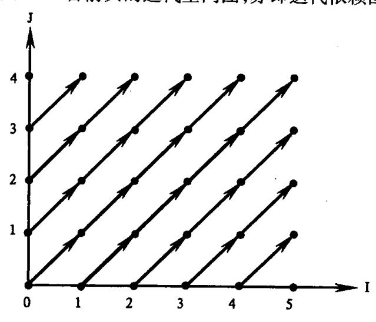

图 12.8 例 12.10 的迭代依赖图

图中所有箭头都是向前的且相依赖的二个点在 I 方向和 J 方向均相隔距离为 1,即对应于 I 维,是从 i 至 i+1,对应于 J 维,是从 j 至 j+1。

一般地,对于依赖方向向量,分量  $i_r = 1$  表示在第 r 层上的依赖是**向前跨迭代的**,例如,从迭代 i 至 i+1;分量  $i_r = -1$  表示在第 r 层上的依赖是**向后跨迭代的**,例如,从迭代 i 至 i-1。对于循环嵌套 L 而言,向后的方向只能当其外层的依赖方向是向前的时才可能

{21}------------------------------------------------

出现,这是因为方向向量总是非负向量。

例 12.11

do 
$$I = 0,5$$
  
do  $J = 0,4$   
S:  $A(I-1,J+2) = A(I,J) + B(I,J)$   
\nenddo  
\nenddo

这个例子仅左端的下标与前例不同,但这一变化改变了语句 S 的依赖方向与依赖类型。展开前三个迭代如下:

$$S(0,0)$$
:  $A(-1,2) = A(0,0) + B(0,0)$   
 $S(0,1)$ :  $A(-1,3) = A(0,1) + B(0,1)$   
 $S(0,2)$ :  $A(-1,4) = A(0,2) + B(0,2)$   
 $\vdots$   
 $S(1,0)$ :  $A(0,2) = A(1,0) + B(1,0)$   
 $S(1,1)$ :  $A(0,3) = A(1,1) + B(1,1)$   
 $S(1,2)$ :  $A(0,4) = A(1,2) + B(1,2)$   
 $\vdots$   
 $S(2,0)$ :  $A(1,2) = A(2,0) + B(2,0)$   
 $S(2,1)$ :  $A(1,3) = A(2,1) + B(2,1)$   
 $S(2,2)$ :  $A(1,4) = A(2,2) + B(2,2)$   
 $S(2,3)$   
 $\vdots$ 

我们可以看出有 S8\*S。实际上该依赖关系集合为

$$\{(S(i_1,i_2),S(j_1,j_2):\ i_1=j_1-1,i_2=j_2+2,\quad 1\leqslant j_1\leqslant 5,0\leqslant j_2\leqslant 2\}$$

它有常数依赖距离向量 d=(1,-2),常数依赖方向向量  $\sigma=(1,-1)$ 和依赖层次 l=1。对应的迭代依赖图如图 12.9 所示。

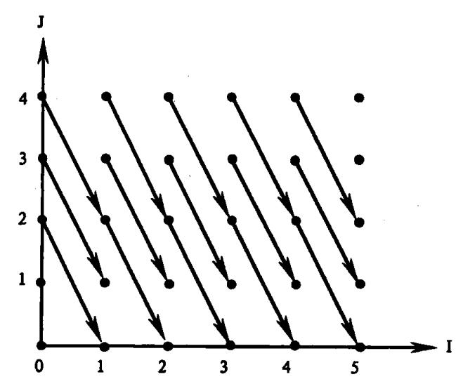

图 12.9 例 12.11 的迭代依赖图

{22}------------------------------------------------

从图中看出,相依赖的二个迭代点在 I 方向为向前方向,相隔距离为向前一个迭代; 在 J 方向为向后方向,相隔距离为往后二个迭代。

已知一个距离向量,我们可以算出相应的方向向量,而已知一个方向向量,我们可以 计算出相应的层次。然而,对于一个给定的层次,可能存在着许多方向向量,而对于一个 给定的方向向量,则可能存在许多距离向量。在不少情形中,由于某些不确定因素,我们 不能算出精确的距离向量,但是,根据索引变量的取值范围,我们仍可以确定出方向向量。

例 12.12 考虑一层循环

L: do 
$$I = 1,100$$
  
S:  $A(2 * I) = B(I) + 2$   
T:  $C(I) = A(I) + D(I)$   
enddo

展开此循环的前几个迭代如下:

S(1): 
$$A(2) = B(1) + 2$$
  
T(1):  $C(1) = A(1) + D(1)$   
S(2):  $A(4) = B(2) + 2$   
T(2):  $C(2) = A(2) + D(2)$   
S(3):  $A(6) = B(3) + 2$   
T(3):  $C(3) = A(3) + D(3)$   
S(4):  $A(8) = B(4) + 2$   
T(4):  $C(4) = A(4) + D(4)$   
:

比较 S 的变量 A(2\*I)和 T 的变量 A(I),结论是它们导致 T 流依赖于 S。依赖集合为  $\{(S(i),T(j)): j=2i,1 \le i \le 50\}$ 

对于此集合中的任意一对(S(i),T(j)),因为 i < j,所以,方向向量是(1),而距离向量 j - i = (2i - i) = (i)。因此,这个流依赖关系具有常数方向向量(1)和一个范围为  $1 \sim 50$  的可变距离向量。

#### 例 12.13 考虑二层循环

$$\begin{array}{lll} L_1: & \text{do } I_1=0,4 \\ \\ L_2: & \text{do } I_2=0,4 \\ \\ S: & A(I_1+1,I_2)=B(I_1,I_2)+C(I_1,I_2) \\ \\ T: & B(I_1,I_2+1)=A(I_1,I_2+1)+1 \\ \\ U: & D(I_1,I_2)=B(I_1,I_2+1)-2 \\ \\ & \text{enddo} \end{array}$$

循环( $L_1,L_2$ )的索引空间如图 12.10 所示。当执行这段程序时,按字典序处理这 25 个索引点,即从左至右逐列处理,每列则从下至上地处理。

下面是按执行顺序展示的(L,L)的前若干迭代:

$$S(0,0)$$
:  $A(1,0) = B(0,0) + C(0,0)$   
 $T(0,0)$ :  $B(0,1) = A(0,1) + 1$ 

{23}------------------------------------------------

$$U(0,0): D(0,0) = B(0,1) - 2$$

$$S(0,1): A(1,1) = B(0,1) + C(0,1)$$

$$T(0,1): B(0,2) = A(0,2) + 1$$

$$U(0,1): D(0,1) = B(0,2) - 2$$

$$S(0,2): A(1,2) = B(0,2) + C(0,2)$$

$$T(0,2): B(0,3) = A(0,3) + 1$$

$$U(0,2): D(0,2) = B(0,3) - 2$$

$$\vdots$$

$$S(1,0): A(2,0) = B(1,0) + C(1,0)$$

$$T(1,0): B(1,1) = A(1,1) + 1$$

$$U(1,0): D(1,0) = B(1,1) - 2$$

$$S(1,1): A(2,1) = B(1,1) + C(1,1)$$

$$T(1,1): B(1,2) = A(1,2) + 1$$

$$U(1,1): D(1,1) = B(1,2) - 2$$

$$S(1,2): A(2,2) = B(1,2) + C(1,2)$$

$$T(1,2): B(1,3) = A(1,3) + 1$$

$$U(1,2): D(1,2) = B(1,3) - 2$$

语句 T 流依赖于语句 S, 其依赖集合为

$$\{(S(i_1,i_2),T(j_1,j_2)): j_1=i_1+1,j_2=i_2-1,0 \le i_1 \le 3,1 \le i_2 \le 4\}$$

它有一个距离向量(1,-1),一个方向向量(1,-1)以及一个层次 1。因此,这个依赖关系 是由循环  $L_1$  携带的依赖关系。

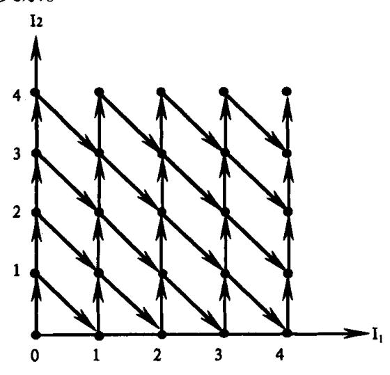

图 12.10 例 12.13 的迭代依赖图

语句 S 流依赖于语句 T,其依赖集合为

{24}------------------------------------------------

 $\{(T(i_1,i_2),S(j_1,j_2)): j_1 = i_1, j_2 = i_2 + 1, 0 \le i_1 \le 4, 0 \le i_2 \le 3\}$ 

它有一个距离向量(0,1),一个方向向量(0,1)以及一个层次 2。这个依赖关系因而是由循环 L<sub>2</sub> 携带的依赖关系。

语句 U 流依赖于语句 T, 其依赖集合为

 $\{(T(i_1,i_2),U(j_1,j_2)): j_1 = i_1, j_2 = i_2, 0 \le i_1 \le 4, 0 \le i_2 \le 4\}$ 

它有一个距离向量(0,0),一个方向向量(0,0)以及一个层次 3。这个依赖关系因而是与循环无关的依赖关系。

图 12.11(a)是循环 $(L_1,L_2)$ 的语句依赖图。它包含了上述三种类型的依赖关系。图 12.11(b)是  $I_1$  取某个固定值时, $I_2$  的实例的语句依赖图。此图中去掉了循环  $I_1$  携带的依赖关系对应的弧。

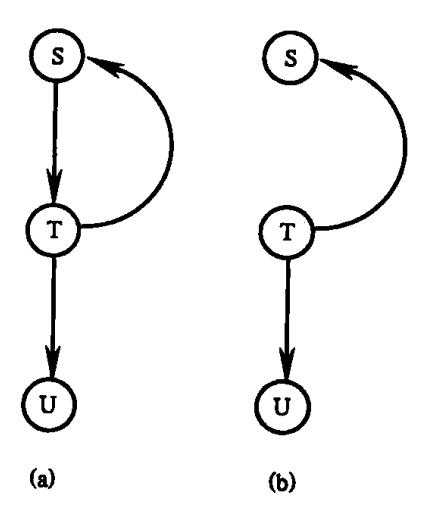

图 12.11 例 12.13 的语句依赖图 (a)levels≥1;(b)levels≥2。

令  $H(i_1,i_2)$ 表示 $(L_1,L_2)$ 的循环体。迭代  $H(j_1,j_2)$ 依赖于迭代  $H(j_1,j_2)$ 当且仅当 $(j_1,j_2)$  =  $(i_1+1,i_2-1)$ 或者 $(j_1,j_2)$  =  $(i_1,i_2+1)$ (因为二个迭代必须是不同的,因此在第 3 层上的依赖不包含在此), $(L_1,L_2)$ 的迭代依赖图如图 12.10 所示。

从图中我们可以看出,迭代 H(3,1)间接地依赖于迭代 H(0,0),但却不间接依赖于 H(1,4)。

# 12.4 依赖关系问题

在上一节,我们介绍了依赖关系的基本概念,本节,我们考虑由一对变量引起的语句之间依赖关系的数学问题。

为了获得循环嵌套 L 的完整依赖信息,需要找出程序中每一对变量所引起的依赖关系。由于标量可以视作是数组元素的蜕化情形且不同数组的元素决不会引用相同的存储单元(两个等价的数组认为是相同的数组),因此,基本的依赖关系问题是判断 L 中二个下标含索引变量的同名数组元素在给定条件下是否表示同一个存储单元。在实际程序中,绝大多数数组元素中的下标均是循环索引变量的线性表达式,因此,本节我们主要考虑线性下标数组元素导致的依赖关系问题。

{25}------------------------------------------------

考虑 u 和 v 均为给定数组 X 的元素情形,假定 X 为 n 维数组。设 u  $\equiv$  X( $f_1(I)$ , $f_2(I)$ ,  $\cdots$ , $f_n(I)$ ), v  $\equiv$  X( $g_1(I)$ , $g_2(I)$ , $\cdots$ , $g_n(I)$ ),其中 f 和 g 是循环索引变量  $I = (I_1,I_2,\cdots,I_m)$ 的 线性整值函数。设 u 是 S 的输出变量, v 是 T 的输入变量。于是,当 S < T 时,我们可以将循环嵌套 L 部分地明确写出,如下所示:

$$\begin{array}{llllllllllllllllllllllllllllllllllll$$

为了叙述简洁起见,我们有以下约定。

- (1)以后凡提到'T不依赖于 S'均意指'S 的变量 u 和 T 的变量 v 不导致 T 依赖于 S'。
- (2)在讨论中将忽略依赖类型(流依赖、反依赖、输出依赖)。依赖类型视变量 u, v 的性质(输入或输出变量)而定。
- (3)当测试依赖关系时,我们将忽略上节定义2中给出的最后一个条件,即"从S(i)结束执行到T(j)开始执行时,没有其它对M的写操作"。这样有可能标识了一个实际为间接依赖的依赖关系,例如例12.9的情形。但这对程序重构不会产生影响,编译程序进行优化时关心的主要是依赖关系图中是否存在从S到T的一条路径。忽略这一条件后,定义2中的条件1和2将判定语句S和T之间是否有依赖关系,条件3将确定是T对S的依赖还是反之或二者同时存在的依赖关系。

现在回到一般情形。设 S 和 T 是循环嵌套 L 中的任意二个语句, 定理 12.1 给出了 u 和 v 导致 S 与 T 之间的依赖关系的必要条件。

定理 12.1 考虑循环嵌套 L 中的任意二个语句 S 和 T。设  $u = X(f_1(I), f_2(I), \cdots, f_n(I))$ 是 S 的一个变量, $v = X(g_1(I), g_2(I), \cdots, g_n(I))$ 是 T 的一个变量,u 和 v 至少有一个是其所在语句的输出变量。其中 X 是 n 维数组, $f_k(I)$  和  $g_k(I)$  ( $1 \le k \le n$ )均是索引变量  $I = (I_1, I_2, \cdots, I_m)$ 的线性整值函数。如果这二个变量导致 S 与 T 之间的依赖关系,则方程组(12.1)

$$\begin{cases}
f_1(\mathbf{I}) - g_1(\mathbf{J}) = 0 \\
f_2(\mathbf{I}) - g_2(\mathbf{J}) = 0 \\
\vdots \\
f_n(\mathbf{I}) - g_n(\mathbf{J}) = 0
\end{cases} (12.1)$$

有满足下述约束条件的整数解(**i**,**j**), 其中 **i** = ( $i_1, i_2, \dots, i_m$ ), **j** = ( $j_1, j_2, \dots, j_m$ )

{26}------------------------------------------------

$$p_r \le i_r \le q_r, \ p_r \le i_r \le q_r \qquad (0 \le r \le m)$$
 (12.2)

并且,这个解满足下述特定情形下的附加条件:

- (a)若S<T且SoT,则i≤j;
- (b)若 S=T且 S\S,则 i<j;
- (c)若 S < T 且 TôS,则 i > j。

证明:假设问题中的变量确实导致 S 与 T 之间的依赖关系,则存在着 S 的一个实例 S (i)和 T 的一个实例 T(j),使得要么 T(j)依赖于 S(i),要么 S(i)依赖于 T(j)。在二种情况下,存在着一个存储单元 M 同时被 S(i)和 T(j)引用且此单元是由 S(i)中 X(f(i),f(f(i),f(f(i),f(f(i),f(f(f(f(f)),f(f(f(f(f)),f(f(f(f)),f(f(f(f)) 所表示,也由 f(f(f(f(f(f)) 所表示。这隐含着必定有

$$f_k(\mathbf{i}) = g_k(\mathbf{j}) \qquad (1 \le k \le n)$$

因为  $i_r,j_r$  都是循环索引变量  $I_r$  的值,因此它们必然满足  $I_r$  的限制。这里, $1 \le r \le n$ 。 附加条件(a),(b),(c)来自于依赖关系定义部分关于语句实例顺序的假设。若 T 依赖于 S,则循环在顺序执行中,实例 S(i)必须先于实例 T(j)被执行。在此情况下,若 S < T,我们必定有  $I \le J$ ;但若 S = T,则必定有严格的不等式 I < J(因为实例 S(i)不能依赖于自身)。若 S 依赖于 T,则实例 S(i)后于实例 T(j)被执行。在这种情况下,若 S < T,我们必定有 I > I。证毕。

方程组(12.1)称为**依赖方程**,它由 n 个 2m 元方程构成,这 2m 个变量是 i 的 m 个元素和 j 的 m 个元素。这种方程组是自变量取整数的多项式方程组,也称为丢番图方程。(diophantine equations, 见参考文献 47)。

不等式方程组(12.2)称为方程(12.1)的依赖约束。

定理 12.1 有二个推论:

推论 1 若语句 T 以方向向量  $\sigma = (\sigma_1, \sigma_2, \dots, \sigma_m)$ 依赖于语句 S,则方程组(12.1)有满足依赖约束式(12.2)和如下附加条件

$$sig(j_r - i_r) = \sigma_r \quad (1 \le r \le m)$$

的整数解(i,j),其中  $i = (i_1,i_2,\cdots,i_m), j = (j_1,j_2,\cdots,j_m)_o$ 

推论 2 如果语句 T 在第 1 层上依赖于语句 S,则方程组(12.1)有满足条件式(12.2)和如下条件

$$i_1 = j_1, i_2 = j_2, \dots, i_{l-1} = j_{l-1}, i_l \le j_l - 1$$

的整数解(i,j),其中 $i = (i_1,i_2,\cdots,i_m), j = (j_1,j_2,\cdots,j_m)_o$ 

推论 2 是推论 1 的直接推论,因为在 l 层的依赖等价于具有形式为 $(0,\dots,0,1,*,\dots,*)$ (含 l – 1 个打头零)的方向向量的依赖。

根据推论 2, 当 S < T 时, 可能的依赖层次是 1, 2,  $\cdots$ , m + 1, 而其它情形下则是 1, 2,  $\cdots$ , m。

注意,定理 12.1 的证明中并没有考虑最后一个依赖条件,即排除实例 S(i)结束执行至 T(j)开始执行之间对存储单元 M 的其它写操作,因此不能期望有它的严格的逆命题。假设方程组(12.1)有一个解(i,j)满足方程组(12.2),这告诉我们存在着 S 的实例 S(i)和 T 的实例 T(j),二者均访问某存储单元 M。i 和 j 的次序关系给出了这二个实例的执行顺序。但是,我们并不知道在这二个实例之间是否还存在其它对 M 的写操作。不过,尽管这样,我们可以推断 S 与 T 之间存在着间接依赖关系。

{27}------------------------------------------------

下面的定理 12.2 便是定理 12.1 的一个弱逆命题,我们省略其证明。

定理 12.2 假设方程组(12.1)有整数解(i,j)满足条件(12.2),那么

- (a)若 i < j,则 S oT;
- (b)若 i>j,则 TδS:
- (c)若  $i = j \perp S < T, M S \delta T$ 。

定理 12.1 和定理 12.2 是依赖关系分析的基础定理。当检查由一对程序变量引起的二个语句之间的依赖关系时,我们总是忽略其它的变量和语句,因此,今后当仅知道 T间接地依赖于 S时,我们仍说"T 依赖于 S"。由这二个定理,我们可以将循环 L 中关于 S 的变量 u 和 T 的变量 v 的依赖问题归结为寻找依赖方程(12.1)的所有满足约束式(12.2)的整数解( $\mathbf{i}$ , $\mathbf{j}$ ),然后根据  $\mathbf{i}$ < $\mathbf{j}$ , $\mathbf{i}$ > $\mathbf{j}$ 或  $\mathbf{i}$ = $\mathbf{j}$ 划分解的集合为三个子集。

例 12.14 考虑如下程序段:

L: do 
$$I = 1,50$$
  
 $\vdots$   
S:  $X(2I) = \cdots$   
 $\vdots$   
T:  $\cdots = \cdots X(3I+1)\cdots$   
 $\vdots$   
\nenddo

这里有 
$$p=1, q=50, f(i)=2i, g(j)=3i+1$$
。因为  $f(i)-g(j)=2i-3j-1$ 

依赖方程(12.1)变为

$$2i - 3j = 1$$
 (12.3)

依赖约束式(12.2)变为

$$1 \le i \le 50$$
,  $1 \le i \le 50$ 

于是,依赖问题变为寻找方程(12.3)的整数解(i,j),使得 i 和 j 为不大于 50 的正整数。显然(2,1)是方程(12.3)的一个解,另外还有许多解。不过,所有这些解都必定满足 i > j。因此,由定理 12.2,我们可以推断  $T \delta S$  成立而  $S \delta T$  不成立。 $T \delta S$  是否成立则取决于循环中未明确写出的部分。

# 12.5 依赖关系测试

- 一般地,依赖问题的测试由若干基本步骤组成,算法 12.1 概括性地描述了这些步骤。 算法 12.1 已知依赖问题的线性方程组和线性不等式方程组(系数均为有理数),此 算法判定特定的依赖关系是否存在,并在存在的情况下找出有关的依赖信息。
  - (1)判定依赖方程组(12.1)是否有一整数解;
  - (2)若无解,终止算法:依赖关系不成立:
  - (3)否则,求出方程组的含未定整参数的通解:
  - (4)将通解代人不等式组(12.2)得到一新的含未定整参变量的不等式集合;
  - (5)判定这个新的不等式方程组是否有整数解:

{28}------------------------------------------------

- (6)如果没有解,则终止算法;这个依赖关系不存在;
- (7)否则,依赖关系存在,解出此新不等式组的所有整数解并计算与此依赖有关的信息。

算法 12.1 是依赖关系的精确测试方法,它涉及到解线性丢番图方程组和线性不等式方程组。线性丢番图方程组可在多项式时间内求解,利用 GCD 测试法和系数消去法,我们知道如何测试这种方程组是否有解并且在有解时知道如何求出通解。算法 12.1 困难的地方在于第(5)步。判定线性不等式方程组是否有整数解的问题是 NP 完全问题 [Schr87]。虽然可以用整数规划方法求不等式组的整数解 [Schr87],但是,对每一种依赖问题都用整数规划方法显然行不通。这是因为,通常整数规划方法十分费时间且编译在处理一个典型的程序时往往需要解决大量的依赖问题,从而需要多次使用整数规划方法。不过,在实际程序中,存在着大量依赖关系问题,在由算法 12.1 步骤(4)获得的新不等式组中,未知参变量可归结为如下简单情形:

- a. 新不等式组无参变量;
- b. 它只有一个参变量:
- c. 它可以分解为若干个子不等式组,每组不等式只有一个参变量。

在这几种情形下,我们能容易地判别具体的依赖关系是否存在,并且,在有依赖关系时计算出依赖信息。

当依赖问题超出了简单情形时,如多重循环中的多维数组情形,我们往往使用近似算法来判定依赖问题。近似测试法通常检查方程组(12.1)是否有整数解,然后测试它满足约束条件的解存在的某些必要条件。当判断出这些必要条件不满足时便可肯定不存在依赖关系,否则便假定存在依赖关系。显然,近似方法只是一种安全测试方法,它能保证不漏检依赖关系,但却可能将非依赖关系也包含进来,并且,在有依赖关系时,它不能精确给出依赖关系集合。

在实际的并行编译中处理依赖问题主要使用的是近似方法,但由于近似方法涉及了较多的数学知识且详细介绍需要较多的篇幅,我们这里只介绍简单情形的精确测试。其它情形的测试可参阅参考文献[13,11]。

我们首先考虑一层循环中一维数组元素的情形。在具体给出测试算法之前,为了完整起见,我们先不加证明地给出一个算法和二个定理。关于它们的证明可参阅参考文献 [15,16,13]。

算法 12.2 (扩展欧几里德算法)已知二个整数 a 和 b,这个算法寻找  $g = \gcd(a,b)$ 和 二个整数  $x_0, y_0$ ,使得  $ax_0 - by_0 = g$ 。算法使用六个辅助变量: $u, v, h, q, \alpha, \beta$ 。

$$(u,v) \leftarrow (1,0)$$
  
 $(g,h) \leftarrow (|a|,|b|)$   
dowhile  $h > 0$   
 $q \leftarrow \lfloor g/h \rfloor$   
 $(\alpha,\beta) \leftarrow (u-qv,g-qh)$   
 $(u,v) \leftarrow (v,\alpha)$   
 $(g,h) \leftarrow (h,\beta)$   
\nenddo

{29}------------------------------------------------

$$x_0 \leftarrow sig(a) \cdot u$$
  
if  $b = 0$  then  $y_0 \leftarrow 0$   
else  $y_0 \leftarrow (ax_0 - g)/b$ 

定理 12.3 设 a,b,c 表示整数且 a 和 b 不同时为零,令 g = gcd(a,b)。线性丢番图方程

$$ax - by = c (12.4)$$

有解当且仅当 g 除尽 c。当有解时,通解为

$$(x,y) = (cx_0/g + bt/g, cy_0/g + at/g)$$

其中,t 是任意整数参变量; $(x_0,y_0)$ 是使得  $g = ax_0 - by_0$  成立的一对整数。

现在我们回到如下形式的规范一层循环:

L: 
$$do I = 0, q$$

$$H(I)$$
\nenddo

注意,任何非规范循环都可以化成这种形式。考虑 H(I)中语句 S 的变量  $X(aI+a_0)$ 和语句 T 的变量  $X(bI+b_0)$ 导致的依赖问题,其中  $a,a_0,b,b_0$  均是整常数。因为

$$f(I) = aI + a_0, g(I) = bI + b_0$$

于是,依赖方程(12.1)变为

$$ai - bi = b_0 - a_0$$
 (12.5)

依赖约束为

$$0 \le i \le q \\
0 \le j \le q$$
(12.6)

定理 12.4 给出了语句 S 与 T 之间存在依赖关系的必要条件。

定理 12.4 (gcd 测试)如果在循环 L 中语句 S 的变量  $X(aI + a_0)$  和语句 T 的变量  $X(bI + b_0)$  导致语句 S 和 T 之间的依赖关系,则整数  $(b_0 - a_0)$  是整数 gcd(a,b) 的整倍数。

现在,我们可以具体描述一层规范循环中一维数组依赖问题的精确测试算法了。这个算法的基本思想是:首先检查依赖方程(12.5)是否有整数解。如果没有,则不存在依赖关系;否则,找出所有整数解集合并将它们分成三个子集,使得其中的一个子集由 i < j 的 所有解(i,j)组成,另一个子集由 i > j 的所有解(i,j)组成,第三个子集则由所有形如(i,i) 的解组成。

为了检查方程(12.5)是否有解,算法中分二步应用 gcd 测试。第一步先测试( $b_0 - a_0$ )是否为 gcd(a,b)的整倍数,如果是,则找出方程(12.5)的所有解。gcd 测试的第二个步骤与计算解集合一起按  $a=b=0, a=b\neq 0$  和  $a\neq b$  三种情形分别进行。对于前面二种情形,求 gcd=(a,b)是简单的且当解存在时,解方程(12.5)也很容易。仅当  $a\neq b$  的情形才需要使用求 gcd(a,b)的欧几里德算法和定理 12.3。

算法 12.3 设语句 S 和 T 是一层规范循环 L 中的二个语句且有  $S \le T$ 。设  $X(aI + a_0)$  是 S 的变量,  $X(bI + b_0)$ 是 T 的变量, 其中 X 是一维数组,  $a, a_0, b, b_0, q$  均是整常数。本算法

- 判定这二个变量是否导致 T 依赖于 S 或 S 依赖于 T:
- 找出使得 i < j 且 T 的实例 T(j)依赖于 S 的实例 S(i)的所有索引值偶对(i,j)集合  $\Psi_1$ ;

{30}------------------------------------------------

- 找出使得 i < i 且实例 S(i)依赖于实例 T(j)的所有索引值偶对(i,j)集合  $\Psi_{-1}$ ;
- 在 S < T 的情况下,找出实例 T(i)依赖于实例 S(i)的所有索引值偶对(i,j)集合  $\Psi_0$ ;
- 对每一种循环携带的依赖关系求出其依赖距离。
- 1. 置 c ← b<sub>0</sub> a<sub>0</sub> 「依赖方程(12.5)变为 ai - bi = c]
- 2. 初始  $\Psi_1, \Psi_{-1}, \Psi_0$  为空集合。
- 3. 根据系数 a,b 的情况选择适当的分支:

case(a = b = 0):

goto 4

case( $a = b \neq 0$ ):

goto 5

case( $a \neq b$ ):

goto 7

4.[因为 a = b = 0,依赖方程蜕变为 0 = c,因此方程有解当且仅当 c = 0]

若 c≠0,终止算法;语句 S 和 T 之间不存在依赖关系,否则置

 $\Psi_1 \leftarrow \{(i,j): 0 \leq i < j \leq q\}$ 

 $\Psi_{-1} \leftarrow \{(i,j): 0 \leq j < i \leq q\}$ 

 $\Psi_0 \leftarrow \{(i,j): 0 \leq i \leq q\}$ 

因为  $q \ge 0$ ,故集合  $\Psi_0$  总是非空。因此,若 S < T,则 T 依赖于 S(循环无关的依赖)。

若 q>0,则集合  $\Psi_1$  和  $\Psi_{-1}$ 均非空。在此情况下,T 依赖于 S 且 S 也依赖于 T。对这二种依赖,其依赖距离都是 1。

终止算法。

5. [a = b≠0,依赖方程为 a(i - j) = c]

若 C mod a≠0,则 S 和 T 之间不存在依赖关系;终止算法。否则,置  $c_1$ ←c/a

6. [依赖方程现在是  $i-j=c_1$ 。它的整数解是 $(i,j)=(t+c_1,t)$ ,其中 t 是任意整参变量。依赖约束式(12.6)变为

$$0 \leqslant t + c_1 \leqslant q$$

$$0 \leqslant t \leqslant q$$

这二个不等式当且仅当 q≥ |c1|才不矛盾。]

若  $q < |c_1|$ ,终止算法;语句 S 和 T 之间无依赖关系。否则,根据  $c_1$  的符号选择适当的分支:

 $Case(c_1 < 0)$ : 置

$$\Psi_1 \leftarrow \{(t+c_1,t): |c_1| \leq t \leq q\}$$

T依赖于S且具有唯一依赖距离 | c<sub>1</sub> |。

 $Case(c_1 > 0)$ :置

$$\Psi_{-1}$$
  $\leftarrow$   $\{(t+c_1,t): 0 \leq t \leq q-c_1\}$  S 依赖于 T 且有唯一依赖距离  $c_1$ 。

 $Case(c_1 = 0)$ : 置

$$\Psi_0 \leftarrow \{(t,t) \colon 0 \leqslant t \leqslant q\}$$

若S<T,则T依赖于S。

终止算法。

7.[a≠b]

{31}------------------------------------------------

由算法 12.1,找出 a 和 b 的最大公约数 g 和二个整数  $i_0$ ,  $j_0$ , 使得  $ai_0$  –  $bj_0$  = g。若 c mod  $g \neq 0$ ,则语句 S 和 T 之间不存在依赖关系,终止算法。

8. [现在,g 整除 c]

置
$$(a_1,b_1,c_1)$$
  $\leftarrow$   $(a/g,b/g,c/g)$ 

9.[方程 ai - bi = c 的通解为

$$i = c_1 i_0 + b_1 t j = c_1 j_0 + a_1 t$$
(12.7)

其中,t是任意整参变量,因为它必须满足约束式(12.6),于是有不等式

$$0 \leqslant c_1 i_0 + b_1 t \leqslant q$$

$$0 \leqslant c_1 i_0 + a_1 t \leqslant q$$

成立。我们下面求 t 的上下界 τ<sub>1</sub> 和 τ<sub>2</sub>。]

根据 b<sub>1</sub> 的符号选择适当的分支:

case  $(b_1 = 0)$ :若  $0 \le c_1 i_0 \le q$  不成立,则在语句 S 和 T 之间不存在依赖关系;终止算法。否则,置  $\tau_1 \longleftarrow -\infty$ ,  $\tau_2 \longleftarrow \infty$ 。

$$case(b_1>0):置$$

$$\tau_1 \leftarrow \lceil -c_1 i_0/b_1 \rceil, \tau_2 \leftarrow \lfloor (q - c_1 i_0)/b_1 \rfloor_{\circ}$$

 $case(b_1 < 0)$ :置

$$\tau_1 \leftarrow \lceil (q - c_1 i_0)/b_1 \rceil, \tau_2 \leftarrow \lfloor -c_1 i_0/b_1 \rfloor_{\circ}$$

根据 a<sub>1</sub> 的符号选择适当的分支:

case  $(a_1 = 0)$ :若  $0 \le c_1 j_0 \le q$  不成立,则语句 S 和 T 之间不存在依赖关系,终止算法。

 $case(a_1 > 0)$ :置

$$\tau_1 \leftarrow \max(\tau_1, \lceil -c_1 j_0/a_1 \rceil), \tau_2 \leftarrow \min(\tau_2, \lfloor (q-c_1 j_0)/a_1 \rfloor)_{\circ}$$

 $case(a_1 < 0)$ :置

$$\tau_1 \leftarrow \max(\tau_1, \lceil (q - c_1 j_0)/a_1 \rceil), \tau_2 \leftarrow \min(\tau_2, \lfloor -c_1 j_0/a_1 \rfloor)_{\circ}$$

若τ<sub>1</sub> > τ<sub>2</sub>,则语句 S 和 T 之间不存在依赖关系;终止算法。

10.[求集合 46. 由式(12.7),得

$$j - i = (a_1 - b_1)t - c_1(i_0 - j_0)$$
 (12.8)

因为  $a \neq b$ ,我们有  $a_l \neq b_l$ 。令  $\xi$  表示 i = j 时的 t 值。若  $\xi$  是  $\tau_l$  和  $\tau_2$  之间的整数,则它 是  $\psi_0$  的一个元素(唯一一个元素)。]

置

$$\xi \leftarrow c_1(i_0 - j_0)/(a_1 - b_1)_{\circ}$$

若ξ是一个整数使得τ1≤ξ≤τ2,则置集合

$$\psi_0 \leftarrow \{(c_1i_0 + b_1\xi, c_1j_0 + a_1\xi)\}_{\circ}$$

11. [求集合  $ψ_1$  和  $ψ_{-1}$ 。由式(12.8)给出的(j-i)之差,要么对所有的 t<ξ 为正数,而对所有的 t>ξ 为负数;要么对所有的 t<ξ 为负数,而对所有的 t>ξ 为正数。我们计算交集[ $τ_1$ ,  $τ_2$ ]∩ (-∞,ξ) 和[ $τ_1$ , $τ_2$ ]∩ (ξ,∞)。]

置

{32}------------------------------------------------

$$\tau_{3} \leftarrow \lceil \xi - 1 \rceil$$

$$\tau_{4} \leftarrow \lfloor \xi + 1 \rfloor$$

$$\tau_{5} \leftarrow \min(\tau_{2}, \tau_{3})$$

$$\tau_{6} \leftarrow \max(\tau_{1}, \tau_{4})$$

根据(a<sub>1</sub> - b<sub>1</sub>)的符号选择适当的分支:

$$case (a_{1} > b_{1}): 如果 \tau_{6} \leqslant \tau_{2}, 则置$$
 
$$\psi_{1} \longleftarrow \{(c_{1}i_{0} + b_{1}t, c_{1}j_{0} + a_{1}t): \tau_{6} \leqslant t \leqslant \tau_{2}\},$$
 
$$如果 \tau_{1} \leqslant \tau_{5}, 则置$$
 
$$\psi_{-1} \longleftarrow \{(c_{1}i_{0} + b_{1}t, c_{1}j_{0} + a_{1}t): \tau_{1} \leqslant t \leqslant \tau_{5}\},$$
 
$$case(a_{1} < b_{1}): 如果 \tau_{1} \leqslant \tau_{5}, 则置$$
 
$$\psi_{1} \longleftarrow \{(c_{1}i_{0} + b_{1}t, c_{1}j_{0} + a_{1}t): \tau_{1} \leqslant t \leqslant \tau_{5}\},$$

12. 如果  $\psi_l = 0$ ,则不存在 T 对 S 的循环携带的依赖关系。否则,存在这种依赖关系,且若  $\psi_l$  具有形式

$$\psi_1 = \{(c_1i_0 + b_1t, c_1j_0 + a_1t) : \alpha \leq t \leq \beta\}_{\circ}$$

则相应的依赖距离集合是

$$\{(a_1 - b_1)t + c_1(j_0 - i_0): \alpha \leq t \leq \beta\}$$

如果  $\psi_{-1}$  = 0,则不存在 S 对 T 的循环携带的依赖关系。否则,存在这种依赖关系,并且若  $\psi_{-1}$ 具有形式

$$\psi_{-1} = \{(c_1i_0 + b_1t, c_1j_0 + a_1t) : \alpha \leq t \leq \beta\}_{\circ}$$

则对应的依赖距离集合是

$$\{(b_1 - a_1)t + c_1(i_0 - j_0): \alpha \leq t \leq \beta\}$$

若 S < T 且  $\psi_0 \neq 0$ ,则存在着 T 对 S 的循环无关依赖关系。否则,不存在这种依赖关系。

13. 终止算法。

从上面的算法,我们可以归纳出集合  $\phi_1,\phi_{-1},\phi_0$  分别代表下列三种依赖关系:

- (1)T对S的循环携带依赖关系:
- (2)S对T的循环携带依赖关系;
- (3)T对S的循环无关依赖关系(仅当S<T)。

我们不会有 S 对 T 的循环无关依赖关系,因为 S≤T。

例 12.15 测试如下循环中语句 S 和 T 的依赖关系:

L: do 
$$I = 10,200,5$$
  
S:  $X(7I+2) = \cdots$   
T:  $\cdots = \cdots X(3I+17)\cdots$   
enddo

我们首先用 12.3 节的公式  $I = I'\theta + p$  将此循环规范化:

L': 
$$do I' = 0.38$$

{33}------------------------------------------------

S: 
$$X(35I' + 72) = \cdots$$
  
T:  $\cdots = \cdots X(15I' + 47) \cdots$   
enddo

应用算法 12.3 解此问题的步骤为

算法的输入是:

$$a = 35$$
,  $a_0 = 72$ ,  $b = 15$ ,  $b_0 = 47$ ,  $q = 38$ .

- 1.  $c \leftarrow b_0 a_0 = -25$
- 2.  $\psi_1 \leftarrow 0, \psi_{-1} \leftarrow 0, \psi_0 \leftarrow 0$
- 3. 因为 a≠b, goto 步骤 7。
- 7. [由算法 12.1,求出 gcd(35,15)和二个整数 i₀,j₀,使得 35i₀ 15j₀ = gcd(35,15)。] g←5

 $(i_0, j_0) \leftarrow (1, 2)$ 

因为 c mod g = 0,继续。

- 8.  $(a_1,b_1,c_1) \leftarrow (a/g,b/g,c/g) = (7,3,-5)$
- 9. 根据 b<sub>1</sub> 的符号选择 case(b<sub>1</sub> > 0)。

$$\tau_1 \leftarrow \lceil -c_1 i_0 / b_1 \rceil = 2$$

$$\tau_2 \leftarrow \lfloor (q - c_1 i_0) / b_1 \rfloor = 14$$

根据  $a_1$  的符号选择 case(al > 0)。

$$\tau_1 \leftarrow \max(\tau_1, \lceil -c_1 j_0/a_1 \rceil) = 2$$

$$\tau_2 \leftarrow \min(\tau_2, \lfloor (q - c_1 j_0)/a_1 \rfloor) = 6$$

因为 τι≤τι,继续。

因为 τ6≤τ2,置

10. ξ←c<sub>1</sub>(i<sub>0</sub> - j<sub>0</sub>)/(a<sub>1</sub> - b<sub>1</sub>) = 5/4。 [因为ξ既不是整数,也不处在 τ<sub>1</sub> 和 τ<sub>2</sub> 之间,集合 ψ<sub>1</sub> 为空。]

$$\psi_1 \leftarrow \{(-5+3t, -10+7t): 2 \le t \le 6\}$$

12. 因为  $\psi_1 \neq 0$ ,故存在语句 T 对 S 的循环携带依赖关系。 对应的距离集合是 $\{4t-5: 2 \leq t \leq 6\}$ 。

因为集合  $\psi_{-1}$ 和  $\psi_0$  均为空,故不存在 S 对 T 的循环携带依赖关系,也不存在 S 与 T 之间的循环无关依赖关系。

我们得到循环 L中导致 T 依赖于 S 的索引值偶对集合

$$\psi_1 = \{(1,4), (4,11), (7,18), (10,25), (13,32)\}$$

通过应用关系式  $I = I'\theta + p$  可得到循环 L 对应的索引值偶对集合:

$$\{(15,30),(30,65),(45,100),(60,135),(75,170)\}$$

{34}------------------------------------------------

因此,得出 T(30)依赖于 S(15),T(65)依赖于 S(30),等等。一共有五个这样的实例偶对。依赖距离集合是 $\{3,7,11,15,19\}$ (注意,依赖距离是根据迭代点算出的)。

例 12.16 判定如下二层循环中所示变量引起的依赖问题。

$$\begin{array}{llllllllllllllllllllllllllllllllllll$$

enddo

这个问题产生的依赖方程是

$$3i_1 - 2j_1 = 1 (12.9)$$

$$3i_2 - j_2 = 2 \tag{12.10}$$

依赖约束是

$$\begin{array}{l}
0 \le i_1 \le 100 \\
0 \le j_1 \le 100
\end{array} (12.11)$$

$$\begin{cases}
0 \leq i_2 \leq 50 \\
0 \leq j_2 \leq 50
\end{cases}$$
(12.12)

我们注意到 I<sub>2</sub> 的范围与 I<sub>4</sub> 无关,二个数组元素的每一维下标表达式都只含一个索引变量并且对应下标具有相同的索引变量。因此,这种特殊的二层循环问题可以划分成二个不相交的单层循环问题:一个具有依赖方程(12.9)和依赖约束式(12.11),另一个具有依赖方程(12.10)和依赖约束式(12.12)。这便是我们前面谈到的简单情形 C。我们可用算法 12.3 解出各个子问题,然后汇合结果得到整个问题的解。我们不再机械地逐步写出执行算法 12.3 的各个步骤而只给出主要求解步骤。

由算法 12.2 和定理 12.1,得出

$$i_1 = 1 + 2t_1 j_1 = 1 + 3t_1$$
(12.13)

其中, $t_1$  是参变量。用式(12.13)替换式(12.11)中的  $i_1$  和  $j_1$ ,得到不等式

$$0 \le 1 + 2t_1 \le 100$$
  
 $0 \le 1 + 3t_1 \le 100$ 

化简后,得

$$-1/2 \le t_1 \le 99/2$$
  
 $-1/3 \le t_1 \le 33$ 

因为 t, 是整数, 它同时满足这二个不等式当且仅当

$$0 \leqslant t_1 \leqslant 33 \tag{12.14}$$

由算法 12.1 和定理 12.1 解方程(12.10),得

$$i_2 = t_2 
j_2 = -2 + 3t_2$$
(12.15)

{35}------------------------------------------------

其中, t2 是参变量, 用式(12.15) 替换式(12.12) 中的 i2, j2, 得到不等式

 $0 \leqslant t_2 \leqslant 50$ 

 $0 \le -2 + 3t_2 \le 50$ 

化简后得

 $0 \leqslant t_2 \leqslant 50$  $2/3 \leqslant t_2 \leqslant 52/3$ 

因为 t2 是一个整数,它同时满足这二个不等式当且仅当

 $1 \leqslant t_2 \leqslant 17 \tag{12.16}$ 

如果我们取  $i_1$  的满足式(12.14)的任意整数值和  $i_2$  的满足式(12.16)的任意整数值,则分别由式(12.13)和式(12.15)计算出的  $i_1$ ,  $j_1$ ,  $i_2$ ,  $j_2$  对应的整数值将满足方程(12.9), (12.10)和约束式(12.11),式(12.12)。于是,存在着满足依赖方程和依赖约束的整数解,因此语句 S 和 T 之间存在着依赖关系。

我们可以通过指定一个特定方向向量限定要测试的依赖关系,并且仍然将此依赖问题视为分开的情形对待。假设我们想知道 T 是否以方向向量(1,1)依赖于 S,则需要寻找方程(12.9),(12.10)的解 $(i_1,j_1,i_2,j_2)$ 使之满足约束式(12.11),式(12.12)和条件  $i_1 < j_1,i_2 < j_2$ 。由式(12.13), $i_1 < j_1$  成立当且仅当  $t_1 > 0$ 。于是式(12.14)给出的  $t_1$  的取值范围收缩为  $1 \le t_1 \le 33$ 。类似地,由式(12.15), $i_2 < j_2$  成立当且仅当  $t_2 > 1$ 。由式(12.16)给出的  $t_2$  的取值范围收缩为  $2 \le t_2 \le 17$ 。因为  $t_1$  和  $t_2$  在附加条件下的取值范围非空,因此,语句 T 确实以方向向量(1,1)依赖于语句 S。这意味着依赖层次为 1。

使得  $T(j_1,j_2)$ 依赖于  $S(i_1,i_2)$ 且  $i_1 < j_1, i_2 < j_2$  的实例偶对 $(S(i_1,i_2),T(j_1,j_2))$ 组成的集合由式(12.13)和式(12.15)给出,其中  $1 \le t_1 \le 33$  和  $2 \le t_2 \le 17$ 。对应的依赖距离集合为

$$\{(t_1, 2t_2 - 2): 1 \le t_1 \le 33, 2 \le t_2 \le 17\}$$

下面,假设我们想求语句 S 是否以方向向量(1,-1)依赖于语句 T。于是附加条件分别为  $j_1 < i_1$  和  $j_2 > i_2$ 。由式(12.13), $j_1 < i_1$  成立当且仅当  $t_1 < 0$ 。但是,如式(12.14)所示, $t_1$  不能取负值。因此,尽管方程(12.10)有满足式(12.12)和  $j_2 > i_2$  的解(12.10),为程(12.9),(12.10)却不存在同时满足约束式(12.11),(12.12)和附加条件的解。因此,S 不以方向向量(1,-1)依赖于 T。

# 12.6 循环的向量化与并行化

向量化是转换标量循环操作至等价的向量指令的过程,并行化则转换串行代码至可在多个处理机上并行执行的形式。这二者的目的都是为了充分利用体系结构提供的向量指令或多处理机,以达到程序并行执行的目的。本节,我们给出可向量化循环、可并行化循环的定义并利用依赖关系分析来判别什么是可向量化循环以及什么是可并行化循环。

#### 可向量化循环

我们用 FORTRAN 90 中的数组语句表示向量运算。设 A,B,C 为同形数组(即对应维数,维长相同的数组),则语句  $A=B\theta C$  的向量执行是:先取出数组 B 和 C 的所有元素同时作  $\theta$  运算,然后再将结果送数组 A。我们称将仅含赋值语句的循环 L 转换为等价的数组

{36}------------------------------------------------

赋值语句的变换称为循环向量化。

由于向量执行的顺序是"先同时取所有操作数,后同时赋值"且一次完成一条数组语句的所有运算,因此,对于单层循环 L,如果循环中仅含赋值语句且每个语句都可以在其后的语句开始执行之前执行完对应循环区间的每个实例并且结果与串行执行时相同,则称这个循环是**可向量化循环**。

例 12.17 下面的循环是可向量化循环:

do I = 1, N  
S: 
$$A(I) = D(I) * E$$
  
T:  $C(I) = A(I) + B(I)$ 

此循环的串行执行顺序以及向量执行顺序如下所示:

A(1) = D(1) \* E

### 串行执行

S(1):

$$T(1)$$
:  $C(1) = A(1) + B(1)$   
 $S(2)$ :  $A(2) = D(2) * E$   
 $T(2)$ :  $C(2) = A(2) + B(2)$   
 $\vdots$   $\vdots$   
 $S(N)$ :  $A(N) = D(N) * E$   
 $T(N)$ :  $C(N) = A(N) + B(N)$   
向量执行  
 $S(1)$ :  $A(1) = D(1) * E$   
 $S(2)$ :  $A(2) = D(2) * E$   
 $\vdots$   $\vdots$   $\vdots$   $S(N)$ :  $A(N) = D(N) * E$   
 $T(1)$ :  $C(1) = A(1) + B(1)$   
 $T(2)$ :  $C(2) = A(2) + B(2)$   
 $\vdots$   $\vdots$   $\vdots$   $\vdots$   $\vdots$   $\vdots$   $\vdots$   $\vdots$   $\vdots$   $\vdots$ 

显然,这二个执行序列产生相同的结果。

但是,如下循环是不可向量化循环,尽管它只含一个语句。

do I = 1, N  
S: 
$$A(I) = A(I-1) + 1$$
  
enddo

这个循环串行执行时,每一个实例 S(i)均用上一个实例 S(i-1)新定值的数组元素 A(i-1)来定义 A(i)。循环的结果是对每一个元素 A(i),有 A(i) = A(0) +  $i(1 \le i \le N)$ 。 若将此循环改为向量语句 A(1:N) = A(0:N-1) + 1,则执行结果是用元素 A(i-1)的老值来更新 A(i),即对于每一个元素 A(i),有 A(i) = A(i-1) +  $1(0 \le i \le N)$ 。显然,这二个执行结果是不相同的。

例 12.18 我们再考虑二层循环的例子。

{37}------------------------------------------------

$$\begin{array}{lll} L_1: & & \text{do } I=1,M \\ \\ L_2: & & \text{do } J=1,M \\ \\ S: & & B(I,J)=A(I,J-1) \\ \\ T: & & A(I,J)=B(I,J)*C(I,J) \\ \\ & & \text{enddo} \\ \\ & & \text{enddo} \end{array}$$

一般地,向量化总是针对内层循环作改写。在这个二层循环中,类似于前一个例子的原因,我们不能将内层循环向量化。但是,如果交换  $L_1$  和  $L_2$  的顺序,则这个循环可以变换成如下的等价循环:

$$\begin{array}{lll} L_2\colon & & \text{do } J=1\,, M \\ \\ L_1\colon & & \text{do } I=1\,, N \\ \\ S\colon & & B(I\,,J)=A(I\,,J-1)+1 \\ \\ T\colon & & A(I\,,J)=B(I\,,J)*C(I\,,J) \\ \\ & & \text{enddo} \\ \\ & & \text{enddo} \end{array}$$

我们在 12.7 节将验证,这种变换是合法的。经变换后,内层循环是可向量化循环,它的执行结果与下面向量化后的循环执行结果相同。

do 
$$J = 1, M$$
  
S:  $B(1:N,J) = A(1:N,J-1) + 1$   
T:  $A(1:N,J) = B(1:N,J) * C(1:N,J)$ 

为了保证循环向量化的正确性,我们用数据依赖关系分析理论给出可向量化循环的如下充分必要条件。

定理 12.5 对于循环嵌套  $\mathbf{L} = (L_1, L_2, \dots, L_m)$ ,最内层循环  $L_m$  可向量化当且仅当满足条件:对循环体中的任意二个语句 S 和 T,当 S < T 时,不存在方向向量为  $\sigma = (0, \dots, 0, 1)$ 的 S 对 T 的依赖关系(即 T $\delta$ S);当 S = T 时,不存在方向向量  $\sigma = (0, \dots, 0, 1)$ 的 S 对 T 的 流依赖关系(即 T $\delta$ S)。

证明:我们首先证明必要条件。假设当 S < T 时存在  $\sigma = (0, \cdots, 0, 1)$  的 S 对 T 的依赖 关系  $T \otimes S$ ,则由依赖关系与方向向量的定义,存在着实例  $S(\mathbf{i})$  和  $T(\mathbf{j})$  且  $\mathbf{j} <_m \mathbf{i}$ 。因而在第 m 层上,实例  $T(\mathbf{j})$  必须先于  $S(\mathbf{i})$  而执行,故不可以向量化。假设当 S = T 时存在以同样方向向量的 S 对 S 的流依赖关系  $S \otimes^r T$ ,则意味着在第 m 层上存在实例  $S(\mathbf{i})$  和  $S(\mathbf{j})$  且  $\mathbf{j} <_m \mathbf{i}$  使得  $S(\mathbf{j})$  先对某个变量定值而  $S(\mathbf{i})$  后使用同一变量,因而也不能向量化。

现在证明充分条件。设当 S < T 时不存在  $\sigma$  =  $(0, \cdots, 0, 1)$ 的 S 对 T 的依赖关系 T  $\delta$ S, 我们要证明的是其它形式方向向量的依赖关系不影响向量化。对于所有 S  $\delta$ T 的依赖关系,因依赖顺序与语句顺序一致,故均不影响向量化。对于其它依赖关系 T  $\delta$ S, 只有二类可能的方向向量,一类为(\*, …, \*, 0),另一类为(\*, …, \*, ±)。前一类方向向量的依赖关系是与循环  $L_m$  无关的依赖关系,它不妨碍  $L_m$  的向量化。对后一类方向向量,因为方向向量总是非负的且它不是 $(0, \cdots, 0, 1)$ 形式,因此一定存在前导元素  $\sigma_1 > 0$  且  $1 \le 1 < m$ ,

{38}------------------------------------------------

即 T8S 是在第 1 层的依赖关系。由于向量化仅针对循环 L<sub>m</sub>,外层的 L<sub>l</sub> 仍保持串行执行,因此不会破坏 L<sub>l</sub> 层的这个依赖关系,故 L<sub>m</sub> 可以向量化。

定理 12.5 也可以用语句依赖图直观地表示为:若循环嵌套  $L = (L_1, L_2, \cdots, L_m)$ 的语句依赖图中不存在 m 层上的反向依赖关系(即与语句词法顺序相反的依赖关系),则第 m 层循环可以向量化。

do 
$$I = 2, N - 1$$
  
do  $J = 2, N - 1$   
S:  $A(I,J) = B(I-1,J) + C$   
T:  $B(I,J) = A(I,J+1)/2$   
\nenddo  
\nenddo

不仅存在依赖关系  $T\delta_{(1,0)}^I$ S,而且还存在  $T\delta_{(0,1)}^I$ S,因此 J 循环不能向量化。此循环的依赖图如图 12.12 所示,图中含有层次为 2 的 T 至 S 的反依赖关系。

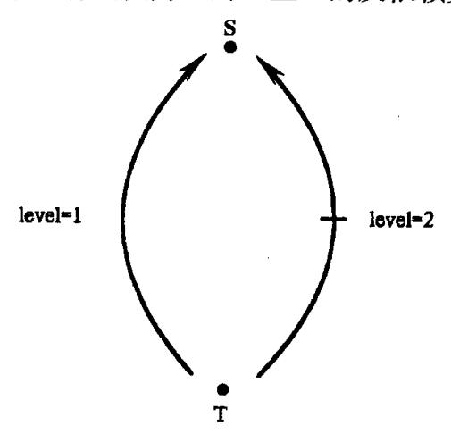

图 12.12 例 12.19 的语句依赖图

循环

do 
$$I = 1, N$$
  
do  $J = 1, N$   
S:  $D(I, J) = A(I, J) + 1$   
T:  $A(I + 1, J + 1) = T * B(I, J)$   
enddo  
enddo

显然存在依赖关系 Tô(1,1)S,但其方向向量不是(0,1),因此 J循环可以向量化。

#### 可并行化循环

我们用 doall 语句表示并行执行的循环。例如

doall 
$$I = 1$$
,  $N$   

$$A(I) = A(I-1) + A(I+1)$$
\nenddo

{39}------------------------------------------------

的执行意味着此循环的每一个迭代均可以无需同步地由不同处理机以任意顺序执行。由于不同处理机的执行速度可能不一样,因此,这个循环的执行结果是不确定的。例如,执行 I=4 迭代的处理机将读取 A(3)和 A(5);所读出的 A(3)和 A(5)可能是迭代 I=3 和 I=5 还未完成以前的值,也可能是这二个迭代已完成之后的值。因此,doall 语句与 do 语句不同,其语义不要求迭代间的执行顺序。我们这里称将 do 循环转换为 doall 循环的变换为循环并行化。

如果一个循环的各个迭代可按任何次序执行而结果与串行执行相同,则称这个循环 是**可并行化循环**。

下面的循环是可并行化循环

do 
$$I = 1, N$$
  
  $A(I) = A(I) + B(I)$ 

enddo

因为无论以怎样的顺序执行循环的各个迭代,总有 A(1) = A(1) + B(1), A(2) = A(2) + B(2), …

而循环

do 
$$I=1$$
 ,  $N$  do  $J=1$  ,  $M$  
$$X(I,J)=X(I,J-1)+X(I,J+1)$$
 enddo enddo

的内层由于存在循环 J 携带的依赖关系而不能按任意顺序执行,因此不能并行化。但外层循环是可并行化循环,因为它不存在循环 I 携带的依赖关系,我们可以按任意顺序执行 I 循环。对 I 循环并行化的结果为

$$\begin{aligned} & \text{doall } I=1\,,N\,,\\ & \text{do } J=1\,,M\\ & & X(I,J)=X(I,J-1)+X(I,J+1)\\ & \text{enddo} \\ & \text{enddoall} \end{aligned}$$

它的执行是:外层循环分布到各个处理机去执行,每个处理机执行若干个迭代。而内层循环则在每个处理机内串行执行。

定理 12.6 循环嵌套  $L=(L_1,L_2,\cdots,L_m)$ 中的第 l 层循环  $L_1$  是可并行化的当且仅当在 L 中不存在层次为 l 的依赖关系,即不存在方向向量为 $(0,\cdots,0,1,*,\cdots,*)$ (含 l-1 个打头零)的依赖关系。

证明:必要条件是显然的,我们只证明充分条件。显然,在单层循环情况下,如果无循环携带的依赖关系则可以按任意顺序执行。我们这里要证明的是,在多层情况下,如果不存在为 $(0,\cdots,0,1,*,\cdots,*)$ (含1-1个打头零)的方向向量,即第1层无循环携带的依赖关系,则  $L_i$  的并行执行不会破坏 L 中其它层循环的依赖关系。假设第  $L_i$  层存在依赖关系,其中  $1 \le r \le m$  且  $r \ne l$ ,则存在迭代  $H(i)\delta H(j)$ 且 i < r j。由于  $L_i$  层存在依赖关系,此层在变换后的循环 L'中仍保持为 do 循环,因此在 L'中仍有 i < r j,即 H(i)将在 H(j)之前被

{40}------------------------------------------------

执行,亦即第1层的依赖关系维持不变。

例 12.20

$$\begin{array}{cccccccccccccccccccccccccccccccccccc$$

此循环有 S&T,其唯一的距离向量为(1,2);另还有 T&S,其唯一的距离向量为(2,1)。二者的方向向量均为(1,1)。这表明在第一层循环有依赖关系,即循环  $L_1$  而非  $L_2$  携带的依赖关系。因此, $L_1$  不能改写成 doall 循环,但  $L_2$  可改成 doall 循环:

$$\begin{array}{ll} L_1\colon & \text{do } I_1=0\,,4 \\ \\ L_2\colon & \text{doall } I_2=0\,,4 \\ \\ & X(\,I_1+1\,,I_2+2)=Y(\,I_1\,,I_2\,)+1 \\ & Y(\,I_1+2\,,I_2+1)=X(\,I_1\,,I_2\,)+1 \\ \\ & \text{enddoall} \\ & \text{enddo} \end{array}$$

# 12.7 循环变换技术

前一节介绍了什么是可向量化循环和什么是可并行化循环,我们看到的可向量化循环和可并行化循环的例子都是比较简单和理想的情形。然而,在实际程序中,循环一般比较复杂,其中往往含有若干影响向量化或并行化的依赖关系,也往往还含有影响性能的其它因素,如并行循环的粒度较小或可向量化循环的长度太小等等。为了尽可能地挖掘出程序中的并行性,编译程序需要对循环施加一些等价变换以消除某些依赖关系使之满足并行所需条件,或增加循环的并行粒度,最大限度地利用并行机体系结构的特点。

本节中我们研究的对象仍然是 12.2 节给出的理想循环嵌套模型  $\mathbf{L} = (\mathbf{L_1}, \mathbf{L_2}, \cdots, \mathbf{L_m})$ 。  $\mathbf{L}$  的**循环变换**是一种改变语句实例的执行顺序但不改变语句实例集合的技术。对  $\mathbf{L}$  施加循环变换后得到的循环称为**变换循环**。变换循环  $\mathbf{L}'$ 等价于  $\mathbf{L}$ ,如果对任意二个语句实例  $\mathbf{S}(\mathbf{i})$ 和  $\mathbf{T}(\mathbf{j})$ ,只要在  $\mathbf{L}$ 中  $\mathbf{T}(\mathbf{j})$ 依赖于  $\mathbf{S}(\mathbf{i})$ ,则在  $\mathbf{L}'$ 中一定有  $\mathbf{T}(\mathbf{j})$ 的执行后于  $\mathbf{S}(\mathbf{i})$ 。如果对  $\mathbf{L}$  施加一种循环变换后,变换循环  $\mathbf{L}'$ 等价于  $\mathbf{L}$ ,则称此循环变换是合法的。

在代码优化一章我们已经学过的消除归纳变量,循环展开、循环合并等都属于循环变换。本节我们将通过例子非形式化地介绍若干种用于程序并行化的循环变换技术,目的是给出几种主要变换并说明如何用依赖关系分析来实现这些变换。

## 循环分布(loop distribution)

循环分布是一种语句级的变换,它将一个循环分解为多个循环,每个循环都有与原循环相同的迭代空间,但只包含原循环的语句子集。循环分布通常用于:

• 分解出可向量化或可并行化的循环;

{41}------------------------------------------------

- 分解原循环为较小循环从而改善指令 cache 和 TCB 的局部性;
- 创建紧嵌套循环;
- 分解原循环为若干较少变量引用的循环以增加寄存器的重复使用,减少寄存器不 够而导致的数据移动。

循环分布变换以循环 L 的语句依赖图为依据,它将语句依赖图按强连通子图进行分解,然后按凝聚图(其结点为强连通子图)确定的偏序关系来执行分解后的各个子循环。下面我们来看二个循环分布的例子。

例 12.21 考虑循环

L: do 
$$I = 4,100$$
  
 $S_1$ :  $A(I) = B(I-2) + 1$   
 $S_2$ :  $C(I) = B(I-1) + F(I)$   
 $S_3$ :  $B(I) = A(I-1) + 2$   
 $S_4$ :  $D(I) = D(I+1) + B(I-1)$ 

enddo

L的语句集合有如下依赖关系

 $S_1\delta^f S_3$ ,  $S_3\delta^f S_1$ ,  $S_3\delta^f S_2$ ,  $S_3\delta^f S_4$ ,  $S_4\delta^a S_4$ 

L的语句依赖图 G如图 12.13(a)所示,图 12.13(b)是 G的凝聚图。

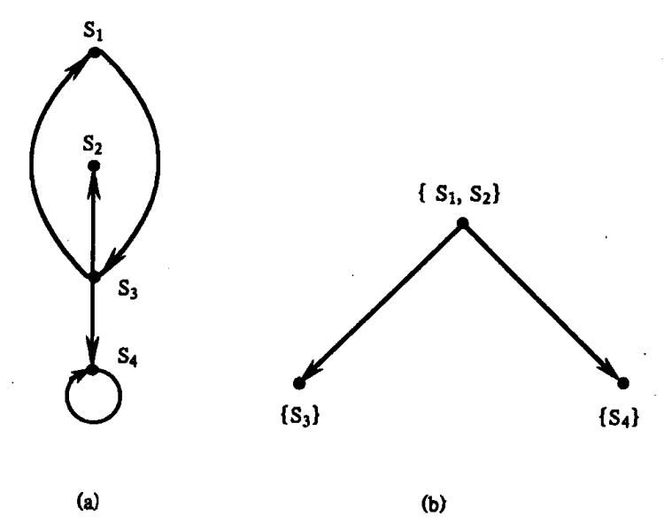

图 12.13 L的语句依赖图 (a)G;(b)G。

对 G 的每个强连通成员,我们通过删除 L 中不属于此强连通图的语句而形成一个循环。于是,与 $\{S_1,S_3\}$ , $\{S_2\}$ 和 $\{S_4\}$ 对应的循环为

$$L_1: \qquad \text{do } I=4\,,100$$
 
$$S_1: \qquad A(I)=B(I-2)+1$$
 
$$S_3: \qquad B(I)=A(I-1)+2$$
 enddo

{42}------------------------------------------------

$$L_2: \qquad \text{do } I = 4,100$$
 
$$S_2: \qquad C(I) = B(I-1) + F(I)$$
 enddo 
$$L_3: \qquad \text{do } I = 4,100$$
 
$$S_4: \qquad D(I) = D(I+1) + B(I-1)$$
 enddo

作用于 L 的循环分布改变语句实例的执行顺序为由如下规则定义的顺序:

- (1)首先执行循环 L;
- (2)当 L<sub>1</sub>执行完后,开始同时执行 L<sub>2</sub>和 L<sub>3</sub>。

显然,只要在 L 中有  $S_b(j)$ 依赖于  $S_a(i)$ ,则在变换后的程序中就有  $S_b(j)$ 后于  $S_a(i)$ 而执行( $1 \le a \le 4, 1 \le b \le 4$ ),因为:

- (1)S<sub>1</sub>和 S<sub>2</sub>的实例的相对执行顺序与在 L 中相同;
- (2)S, 的每个实例均在S, 的实例之后执行;
- (3)S<sub>4</sub> 的每个实例均在S<sub>5</sub> 的实例之后执行;且
- (4)S<sub>4</sub> 的实例的相对执行顺序与在 L 中相同。

因此,这一变换是合法的。

观察循环 L 的依赖图我们看出它既不是可向量化循环,也不是可并行化循环。然而,将它分解成三个循环后, $L_2$  可并行化, $L_3$  可向量化。除了同时执行  $L_2$  和  $L_3$  外,我们还可以按下面二种顺序来执行这三个循环: $L_1$ , $L_2$ , $L_3$  或者  $L_1$ , $L_3$ , $L_2$ 。

例 12.22 考虑二层循环:

$$\begin{array}{lll} L_1: & & \text{do } I_1=0\,,4 \\ \\ L_2: & & \text{do } I_2=0\,,4 \\ \\ S: & & A(\,I_1+1\,,I_2\,)=B(\,I_1\,,I_2\,)+C(\,I_1\,,I_2\,) \\ \\ T: & & B(\,I_1\,,I_2+1\,)=A(\,I_1\,,I_2+1\,)+1 \\ \\ U: & & D(\,I_1\,,I_2\,)=B(\,I_1\,,I_2+1\,)-2 \\ \\ & & \text{enddo} \end{array}$$

我们在例 12.13 中已分析过它的依赖关系,它的语句依赖图如图 12.14(a)所示。图 12.14(a)有二个强连通部分 $\{S,T\}$ 和 $\{U\}$ ,且第一部分先于第二部分。与 $\{S,T\}$ 和 $\{U\}$ 对应的子循环分别为

$$\begin{array}{cccccccccccccccccccccccccccccccccccc$$

{43}------------------------------------------------

和

 $L_{21}$ : do  $I_1 = 0,4$ 

 $L_{22}$ : do  $I_2 = 0.4$ 

U:  $D(I_1, I_2) = B(I_1, I_2 + 1) - 2$ 

end do

enddo

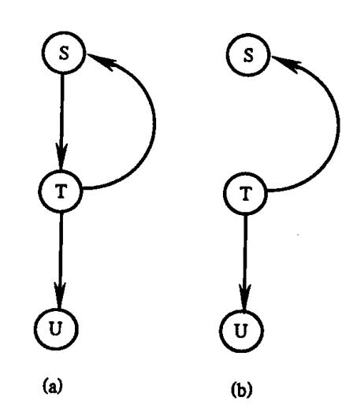

图 12.14 依赖图 (a)level≥1;(b)level≥2。

循环分布将首先执行( $L_{11}$ , $L_{12}$ ),然后再执行( $L_{21}$ , $L_{22}$ )。注意,( $L_{21}$ , $L_{22}$ )的每一个循环都可以改变成 doall 循环,因为二个层次上都没有依赖关系。

图 12.14(b)显示的是固定  $I_1$  时循环  $I_2$  的实例依赖图。施加循环分布于  $I_{12}$ ,将产生下面二个循环:

$$\begin{array}{ccc} L_{121}\colon & & \text{do } I_2=0\,,4 \\ & & T\colon & B(I_1\,,I_2+1)=A(I_1\,,I_2+1)+1 \\ & & \text{enddo} \\ \\ L_{122}\colon & & \text{do } I_2=0\,,4 \\ & S\colon & A(I_1+1\,,I_2)=B(I_1\,,I_2)+C(I_1\,,I_2) \\ & & \text{enddo} \end{array}$$

我们得到二个循环  $L_{121}$ 和  $L_{122}$ 且  $L_{122}$ 必须后于  $L_{121}$ 。这二个循环都可以变为 doall 循环。因此, $(L_{11},L_{12})$ 等价于程序:

$$\begin{array}{ll} \text{do I}_1 = 0,4 \\ & \text{doall } I_2 = 0,4 \\ \text{T:} & B(I_1,I_2+1) = A(I_1,I_2+1)+1 \\ & \text{enddoall} \\ & \text{doall } I_2 = 0,4 \\ \text{S:} & A(I_1+1,I_2) = B(I_1,I_2) + C(I_1,I_2) \\ & \text{enddoall} \\ & \text{enddo} \end{array}$$

{44}------------------------------------------------

原嵌套循环(L1,L2)等价于程序:

$$\begin{array}{c} \text{do I}_{1}=0,4\\ \text{doall } I_{2}=0,4\\ \text{T:} \qquad \qquad B(I_{1},I_{2}+1)=A(I_{1},I_{2}+1)+1\\ \text{enddoall}\\ \text{doall } I_{2}=0,4\\ \text{S:} \qquad \qquad A(I_{1}+1,I_{2})=B(I_{1},I_{2})+C(I_{1},I_{2})\\ \text{enddoall}\\ \text{enddo}\\ \text{doall } I_{1}=0,4\\ \text{doall } I_{2}=0,4\\ \text{U:} \qquad \qquad D(I_{1},I_{2})=B(I_{1},I_{2}+1)-2\\ \text{enddoall}\\ \text{enddoall}\\ \text{enddoall} \end{array}$$

利用循环分布,我们将原看似不可以并行化的循环( $L_1,L_2$ )分解成了多个可并行化的循环。实际上,我们在进行循环分布时对循环  $L_{12}$ 隐含地还进行了后面将介绍的语句重排变换,即改变了语句 S 和 T 的词法顺序。

现在,我们给出作用于循环嵌套的循环分布变换方法。设  $G = (V, \delta)$ 表示 L 的语句依赖图,  $\widetilde{G} = (C, \leq)$ 为 G 的无环路凝聚图, C 为 G 的强连通成员集合,  $\leq$  为 G 的强连通成员集合之间的偏序关系。按最高非链依层次将这些成员划分成集合  $S_1, S_2, \cdots, S_n$  (其中 n 为  $\widetilde{G}$ 的最长路径中的结点数), 使得:

- (1)如果 i < j,则  $S_i$  中的成员无前驱在  $S_j$  中;
- (2)对于  $1 < i \le n, S_i$  中的每一个成员至少有一个直接前驱在  $S_{i-1}$ 中。

对 G 的每一个强连通成员 C,定义一个循环嵌套,此循环嵌套通过删除不属于 C 的语句而获得。施加于 L 的循环分布变换是合法的,如果变换循环按如下规则定义的顺序执行:

- (1)同时执行  $S_1$  中的所有成员对应的循环嵌套;
- (2)对  $1 < i \le n$ ,只要在  $S_{i-1}$ 中的 C 的所有直接前驱对应的循环嵌套已经完成,便开始执行  $S_i$  中成员 C 的循环嵌套。

例 12.23 假设一循环嵌套 L 有如图 12.15 所示的语句依赖图。

图G的强连通成员为

$$C_1 = \{v_1\}, C_2 = \{v_2\}, C_3 = \{v_3, v_6, v_8\}, C_4 = \{v_4\},$$
  
 $C_5 = \{v_5\}, C_6 = \{v_7\}, C_7 = \{v_9\}_{\circ}$ 

G 的凝聚图 G如图 12.16 所示。

~ G满足前面条件 1,2 的最高非链结点集合划分为

$$S_1 = \{C_1, C_2, C_7\}$$
  
 $S_2 = \{C_3, C_4\}$ 

{45}------------------------------------------------

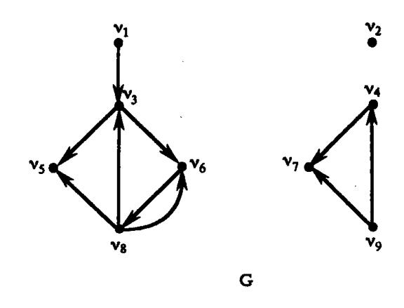

图 12.15 例 12.23 的语句依赖图

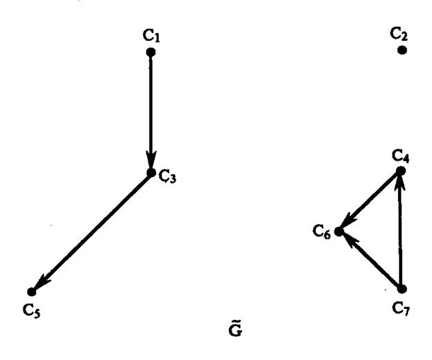

图 12.16 图 12.15 的凝聚图

 $S_3 = \{C_5, C_6\}$ 

于是,循环嵌套 L 可分布成 7 个循环,这 7 个循环分别由强连通成员  $C_1$ ,  $C_2$ , …,  $C_7$  各自在 L 中去掉不属于自己的语句而构成。由循环分布方法的规定,这 7 个循环应按如下顺序执行。

- 1. 首先同时执行  $S_1$  中的所有成员对应的循环,即  $C_1$ ,  $C_2$ ,  $C_7$  对应的循环。我们可以按任何次序执行这三个循环。
- 2. 只要  $C_1$  完成,就可以开始执行  $C_3$ ;只要  $C_7$  完成,就可以开始执行  $C_4$ 。若先执行完  $S_1$  中的所有成员对应的循环,再开始执行  $S_2$  中各成员的循环,则  $S_2$  中的成员可按任意顺序执行。
  - 3. 只要  $C_3$  完成,就可以开始执行  $C_5$ 。只要  $C_4$  完成,就可以开始执行  $C_6$ 。

# 语句重排(statement reordering)

语句重排也是基于语句依赖图所作的一种程序变换。它改变循环中语句的词法顺序但不改变语句的依赖关系。语句重排常用于循环向量化。当循环 L 的语句依赖图不含环路时,可以用语句重排变换来将与语句执行顺序相反的依赖关系(也称为向上的依赖关系)改为与语句执行顺序一致的依赖关系(也称为向下的依赖关系),从而使循环可向量化。

{46}------------------------------------------------

例 12.24

L: do 
$$I = 2, N$$
  
 $S_1$ :  $A(I) = B(I) + C(I+1)$   
 $S_2$ :  $D(I) = A(I+1) + 1$   
 $S_3$ :  $C(I) = D(I)$   
\nenddo

循环 L 含依赖关系 S<sub>2</sub>8<sup>2</sup>S<sub>1</sub>, S<sub>1</sub>8<sup>2</sup>S<sub>3</sub>, S<sub>2</sub>8<sup>2</sup>S<sub>3</sub>。它的语句依赖图如图 12.17(a)所示。

图中有从  $S_2$  至  $S_1$  的向上依赖关系妨碍向量化。当对 L 按  $S_2$ ,  $S_1$ ,  $S_3$  的语序作语句重排后,依赖图变为图 12.17(b)。于是,变换循环为

L': do 
$$I = 2, N$$
  
 $S_1$ :  $D(I) = A(I+1) + 1$   
 $S_2$ :  $A(I) = B(I) + C(I+1)$   
 $S_3$ :  $C(I) = D(I)$   
\nenddo

它可向量化,向量化的结果如下:

$$S_2$$
:  $D(2;N) = A(3;N+1) + 1$   
 $S_1$ :  $A(2;N) = B(2;N) + C(3;N+1)$   
 $S_3$ :  $C(2;N) = D(2;N)$ 

显然,L'也可以通过循环分布而改写成三个 doall 循环。

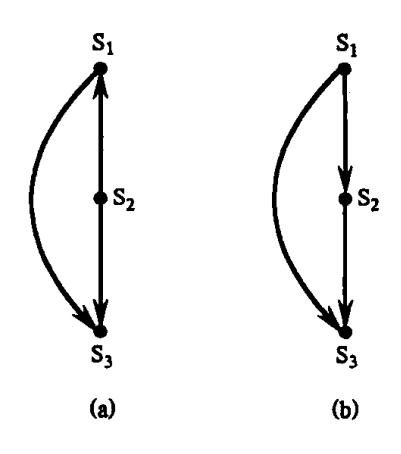

图 12.17 例 12.24 的语句依赖图 (a)初始的语句依赖图;(b)语句重排后的语句依赖图。

## 循环置换(Loop Permutations)

循环置换是改变循环嵌套 L 中的循环位置的一种变换,它属于迭代级的变换。最常见的循环交换是循环置换的一种特例。

循环置换是最具效率的一种程序变换技术,它可以在许多方面改善代码的性能,主要的有:

- 置换外层无依赖的循环与内层有依赖的循环,使得内层可向量化;
- 置换无依赖的循环至外层使整个循环嵌套并行执行,从而增加每次迭代的并行粒度和减少障碍同步的次数;

{47}------------------------------------------------

• 在有多层可向量化循环的情形下,置换范围较大的循环至外层,以增加向量的长度。

我们来看一个循环置换的简单例子。

例 12.25 考虑如下二层循环:

do 
$$I_1 = 2, N$$
  
do  $I_2 = 2, N$   
S: 
$$A(I_1, I_2) = (A(I_1 - 1, I_2) + A(I_1 + 1, I_2))/2$$
\nenddo

enddo

语句 S 以方向向量(1,0)流依赖于自身,也以方向向量(1,0)反依赖于自身。由于第一层存在依赖关系,因此第一层循环不能并行化。但第二层循环不存在依赖关系,它可以并行化。但是,由于它处在内层,并行化后的粒度仅仅为一条语句。如果可以变换二层循环的位置,使之变为如下的并行循环:

$$\begin{array}{c} \mbox{doall} \ I_2=2\,, N \\ \mbox{do} \ I_1=2\,, N \\ \mbox{S:} \qquad \qquad A(\,I_1\,,I_2\,)=A(\,I_1-1\,,I_2\,)+A(\,I_1+1\,,I_2\,)\,)/2 \\ \mbox{enddo} \\ \mbox{enddoall} \end{array}$$

则此并行循环的并行粒度将扩大为一个循环。显然,这样的并行循环效率将更高。

我们在前一节例 12.18 中还看到了一个利用循环交换使外层循环交换至内层而向量化的例子。在这二个例子中,我们都没有对循环交换的合法性作出保证。实际上,在给定一种循环置换时,首先必须解决的问题是"这种变换是合法的吗"。为了给出循环置换合法性的充分必要条件,我们用置换矩阵形式化地定义循环置换。

置换矩阵是通过置换一单位矩阵的行(或列)而得到的矩阵。精确地说,置换矩阵是一个方阵,其中:

- (1)每一个元素不是0就是1;
- (2)每一行有且仅有一个元素为1;
- (3)每一列有且仅有一个元素为1。

设 P 表示任意 m×m 的置换矩阵。对  $1 \le i \le m$ ,令  $\pi(i)$ 表示在第 i 列中为 1 的元素所在的行号,则函数  $\pi:i \to \pi(i)$ 是集合 $\{1,2,\cdots,m\}$ 的一个置换,它完全确定了矩阵 P。

P的一种紧凑表示是:

$$P = \begin{bmatrix} 1, 2, \cdots, m \\ \pi(1), \pi(2), \cdots, \pi(m) \end{bmatrix}$$

因为 P 的第一行总是与列的位置 1-1 对应,故也常将 P 写成更简洁的形式,如  $P=[\pi(1),\pi(2),\cdots,\pi(m)]$ 。

当 P 作用于一个 m 个成员的向量 x 时,它置换 x 的元素,使得 xP 的第 i 个元素是 x 的第  $\pi$ (i)个元素。例如,如果置换矩阵

$$P = \begin{bmatrix} 3 & 1 & 2 \end{bmatrix} \equiv \begin{bmatrix} 1 & 2 & 3 \\ 3 & 1 & 2 \end{bmatrix} \equiv \begin{bmatrix} 0 & 1 & 0 \\ 0 & 0 & 1 \\ 1 & 0 & 0 \end{bmatrix}$$

{48}------------------------------------------------

则

$$(x_1, x_2, x_3)P = (x_3, x_1, x_2)$$
  
 $(x_3, x_2, x_1)P = (x_1, x_3, x_2)$   
 $(6,23,12)P = (12,6,23)$ 

对于循环嵌套  $L=(L_1,L_2,\cdots,L_m)$ ,我们有迭代 H(i)先于迭代 H(j)而执行当且仅当 i < j。取任意  $m \times m$  的置换矩阵 P,令  $L_p$  表示由 L 的迭代所组成的程序,但这些迭代已改变了原来在 L 中的执行顺序;在  $L_p$  中,迭代 H(i)先于迭代 H(j)而执行当且仅当  $i_p < j_p$ 。程序  $L_p$  称为由 P 所定义的变换程序, $L \rightarrow L_p$  的变换称为由 P 所定义的 L 的循环置换。在循环置换中,索引变量仍保持它们的名字不变,改变了的仅仅是它们的顺序。同时各个循环也仍保持它与标号之间的对应性,但要记住,循环置换有可能改变循环的初值与终值。若  $P=[\pi(1),\pi(2),\cdots,\pi(m)]$ ,则变换  $L \rightarrow L_p$  可以写为

$$(L_1,L_2,\cdots,L_m) {\longrightarrow} (L_{\pi(1)},L_{\pi(2)},\cdots,L_{\pi(m)})$$

定理 12.7 设 P 是  $m \times m$  的置换矩阵。由 P 所定义的 m 层循环嵌套 L 的置换是合法的当且仅当对于 L 的每一个方向向量  $\sigma$ ,均有  $\sigma$ P > 0 成立。

我们这里略去了其证明,详细证明请参见参考文献[11]。

利用定理 12.7,我们可以验证例 12.17 和例 12.24 的循环交换均是合法的。对于例 12.17 的循环,它的方向向量  $\sigma=(0,1)$ ,置换矩阵  $P=\begin{bmatrix}1&2\\2&1\end{bmatrix}=\begin{pmatrix}0&1\\1&0\end{pmatrix}$ ,  $\sigma P=(0,-1)$   $\begin{pmatrix}0&1\\1&0\end{pmatrix}=(1,-0)$ 。它满足条件  $\sigma P>0$ 。因此,该循环交换是合法的,同样可证明例 12.24 的循环交换也是合法的。

例 12.26 考虑如下 p<sub>i</sub>, q<sub>i</sub> 为常数(1≤i≤3)的循环嵌套

do 
$$I_1 = p_1$$
,  $q_1$  do  $I_2 = p_2$ ,  $q_2$  do  $I_3 = p_3$ ,  $q_3$  
$$X(I_1, I_2, I_3) = X(I_1 - 3, I_2 - 4, I_3 + 2) + 1$$
 enddo enddo

enddo

此循环有一个方向向量  $\sigma = (1,1,-1)$ 。假设我们想要用置换矩阵

$$P = \begin{bmatrix} 1 & 2 & 3 \\ 3 & 2 & 1 \end{bmatrix} = \begin{pmatrix} 0 & 0 & 1 \\ 0 & 1 & 0 \\ 1 & 0 & 0 \end{pmatrix}$$

变换此循环,则变换循环为如下形式:

do 
$$I_3$$
 =  $p_3$ ,  $q_3$  do  $I_2$  =  $p_2$ ,  $q_2$  do  $I_1$  =  $p_1$ ,  $q_1$  
$$X(I_1,I_2,I_3) = X(I_1-3,I_2-4,I_3+2)+1$$
 enddo

{49}------------------------------------------------

enddo

enddo

这个变换循环不等价于原循环,因为  $\sigma P = (-1,1,1) < 0$ 。因此这一循环置换是非法的。另一方面,我们若改变循环置换为如下情形:

do 
$$I_2 = p_2$$
,  $q_2$  do  $I_3 = p_3$ ,  $q_3$  do  $I_1 = p_1$ ,  $q_1$  
$$X(I_1, I_2, I_3) = X(I_1 - 3, I_2 - 4, I_3 + 2) + 1)$$
 enddo enddo

enddo

则此变换循环等价于原循环,因为此时

$$P = \begin{bmatrix} 1 & 2 & 3 \\ 3 & 2 & 1 \end{bmatrix} = \begin{bmatrix} 0 & 0 & 1 \\ 1 & 0 & 0 \\ 0 & 1 & 0 \end{bmatrix}, \sigma P = (1, -1, 1)$$

它不妨碍置换矩阵 P 所定义的循环置换。

对于大于零的方向向量  $\sigma$  和置换矩阵 P,如果  $\sigma P < 0$ ,则称  $\sigma$  妨碍由置换矩阵 P 所定义的循环置换。为了保证一个循环置换是合法的,我们必须找出所有妨碍循环置换的方向向量。当已知循环 L 中的所有方向向量时,我们可以用一方向矩阵  $\Delta$  来表示它们。通过简单地计算乘积  $\Delta P$ ,便可找出所有妨碍循环置换的方向向量。

例 12.27 设一循环嵌套  $L = (L_1, L_2, L_3, L_4)$  具有如下方向向量(0,1,1,-1), (0,0,0,1), (1,0,-1,0)。可以将它们表示成方向矩阵

$$\Delta = \begin{pmatrix} 0 & 1 & 1 & -1 \\ 0 & 0 & 0 & 1 \\ 1 & 0 & -1 & 0 \end{pmatrix}$$

置换 $(L_1, L_2, L_3, L_4) \rightarrow (L_1, L_4, L_3, L_2)$ 交换循环  $L_2$  和  $L_4$ 。这种置换是非法的,因为它改变了方向向量(0,1,1,-1)为负向量(0,-1,1,1)。

置换 $(L_1, L_2, L_3, L_4) \rightarrow (L_1, L_3, L_4, L_2)$ 将循环  $L_2$  移至最内层。这一置换是合法的,它改变方向矩阵  $\Delta$  为

$$\begin{pmatrix} 0 & 1 & -1 & 1 \\ 0 & 0 & 1 & 0 \\ 1 & -1 & 0 & 0 \end{pmatrix}$$

这是变换循环的方向矩阵。在变换循环中的依赖级别为 1,2,3,但在原循环中的依赖级别是 1,2,4。

在前面的讨论中,我们均忽略了循环的边界问题。一般地,对于矩形边界的循环(即循环初值、终值均为常数),循环置换不改变各循环原有的边界,如例 12.25 以及其前的例子。当循环边界非矩形时,循环置换则可能改变循环的初值和终值。由于篇幅所限,我们这里不展开讨论此问题,而只给出一个例子以提请读者注意。

例 12.28 考虑二层循环:

{50}------------------------------------------------

$$\begin{array}{lll} L_{l}: & & \text{do } I_{l}=10 \text{ ,} 50 \\ \\ L_{2}: & & \text{do } I_{2}=10 \text{ ,} I_{l} \\ \\ & & & \text{H}(I_{l} \text{ ,} I_{2}) \\ \\ & & \text{enddo} \end{array}$$

它的索引空间如图 12.18 所示。在循环交换后,得到一个索引向量为( $I_2$ , $I_1$ )的双层循环。我们现在需要用二个新的不等式集合来描述图 12.18 中的三角形区域:在第一个集合中, $I_2$  应当以常数为初值和终值;在第二个集合中, $I_1$  应当以  $I_2$  的函数作为初值。从图 12.18 看出, $I_2$  的变化范围是从 10 至 50,而对于给定的  $I_2$  值,有  $I_2 \leq I_1 \leq 50$ 。因此,循环交换将给定循环转变成了如下形式的二层循环:

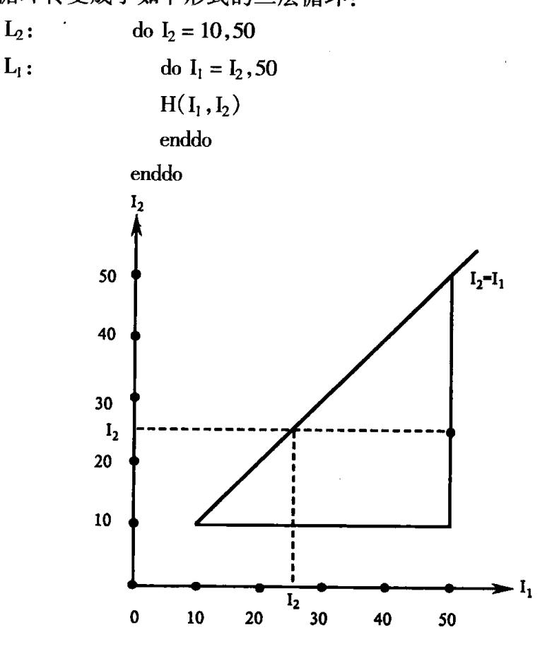

图 12.18 例 12.28 (L<sub>1</sub>,L<sub>2</sub>)的索引空间

## 循环逆转(Loop reversal)

循环逆转颠倒一个循环中迭代执行的顺序,是一种改变循环迭代方向的变换。由于 迭代方向的逆转,它也使得在变换循环中的方向向量发生了逆转。因此,循环逆转常同循 环交换一起使用。此外,单从一般优化的意义上来看,循环逆转还可减少循环开销,因为 它使索引变量递减至零,这使得在某些机器上可只用一条判零转移指令来结束循环,从而 消除了多余的比较与测试指令。

对于循环嵌套  $\mathbf{L}=(L_1,L_2,\cdots,L_m)$ ,如果其中  $L_r(1\leq r\leq m)$ 被逆转,则对于  $\mathbf{L}$  中的每一个方向向量  $\sigma=(\sigma_1,\cdots,\sigma_r,\cdots,\sigma_m)$ ,在变换循环  $\mathbf{L}$ '中的相应方向向量将变为  $\sigma'=(\sigma_1,\cdots,\sigma_r,\cdots,\sigma_m)$ 。如果  $\mathbf{L}$ '中的每个方向向量  $\sigma$ '均是正向量,则  $\mathbf{L}$ '等价于  $\mathbf{L}$ ,我们称此循环逆转

{51}------------------------------------------------

是合法的。

例如,如果一个循环嵌套只有方向向量(0,1)和(1,-1),则此循环的内层循环可以逆转,因为变换循环中相应的方向向量仍然为正向量。下面的例子说明了如何用循环逆转使得循环交换合法化。

例 12.29

do 
$$I = 1,100$$
  
do  $J = 1,5$   
 $A(I,J) = A(I-1,J+1) + 1$   
enddo

这个循环仅有方向向量(1,-1),其内层循环可以并行化,但不幸的是,它只有五个迭代,并行化的效果不会好。而外层循环含有跨迭代的依赖关系导致不能并行化,循环交换也不能进行,这时我们可先将内层循环逆转,得到如下循环:

do 
$$I = 1,100$$
  
do  $J = 5,1,-1$   
 $A(I,J) = A(I-1,J+1) + 1$   
enddo

循环逆转后,其方向向量变为(1,1),循环交换可行了。循环交换后得到如下循环:

do 
$$J = 1,5$$
  
do  $I = 1,100$   
 $A(I,J) = A(I-1,J+1) + 1$   
enddo

这时,内层循环可以并行化了。由于有100个迭代并行执行,效率将会提高。

### **圈收缩**(Cycle Shrinking)

当循环中存在妨碍并行化的依赖关系时,如果其依赖距离大于1,则编译程序仍然可以在某种程度上挖掘出其中的并行性。较典型的方法是圈收缩变换。圈收缩是将一个串行循环分成二个紧嵌套循环,其中外层循环串行执行,内层循环则并行执行[Poly 87]。圈收缩主要用于开发小粒度并行性。

例 12.30

do I = 0, N  
S: 
$$A(I + K) = B(I)$$
  
T:  $B(I + K) = A(I) + C(I)$   
enddo

其中, K是正常数。在这个循环中, A(I+K)先在迭代 i 时被语句 S 定值, 后在迭代 i + K 时被语句 T 所引用, 因而存在依赖关系 Sð T。类似地, B(I)和 B(I+K)也导致依赖关系 Tð S。这二个依赖关系的距离向量均为 K。图 12.19(a)是语句依赖图。此图中含有一个环路, 因而此循环既不能向量化, 也不能并行化。图 12.19(b)是当 K=4 时的前 8 个迭

{52}------------------------------------------------

代依赖图。从中可以看出,迭代1~4之间无依赖关系,因此,只要保证前 K 个迭代全部执行完后,再开始执行后 K 个迭代,则此循环的迭代可以按 K 个迭代一组一组地串行执行。而在每一组内的 K 个迭代则并行执行。于是圈收缩改写上循环为如下形式的并行循环:

do 
$$TI = 0$$
,  $N$ ,  $K$ 
doall  $I = TI$ ,  $TI + K - 1$ 
S:
$$A(I + K) = B(I)$$
T:
$$B(I + K) = A(I) + C(I)$$
\nenddoall

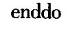

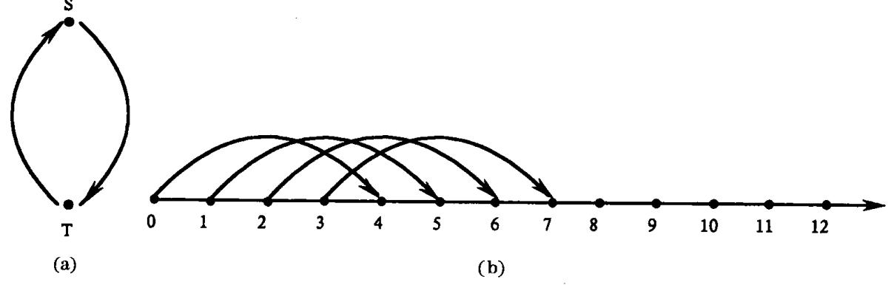

图 12.19 依赖图 (a)语句依赖图;(b)当 K=4 时的前 8 个迭代依赖图。

其结果是使循环并行效率提高K倍。

在实际程序中,K一般比较小,最常见的是2或3。因而这种变换技术通常局限于指令级并行优化。

# 练 习

- 1. 证明对于  $Z^m$  中给定的二个方向向量 i 和 j,下面的关系式中只能有一个成立: i = j;或者对于某个 l,i < lj;或者对于某个 k,j < ki。
  - 2. 对于给定的向量 i 和 j,关系式 i < l j 可以对多个 l 值成立吗? 为什么?
  - 3. 画出如下二层循环的索引空间图。

$$\begin{array}{cccccccccccccccccccccccccccccccccccc$$

enddo

其中, (1) 
$$p_1 = 12$$
,  $q_1 = 31$ ,  $p_2 = -4$ ,  $q_2 = 14$   
(2)  $p_1 = 0$ ,  $q_1 = 20$ ,  $p_2 = I_1 + 1$ ,  $q_2 = I_1 + 16$   
(3)  $p_1 = 0$ ,  $q_1 = 10$ ,  $p_2 = 0$ ,  $q_2 = min(5, I_1)$ 

{53}------------------------------------------------

对于每一种情形,计算索引点个数并描述语句实例的执行顺序。

- 4. 填空:
- (1) T N N N N N N N N N N
- (2) T  $\eta$   $\eta$   $\eta$  的依赖关系是由循环  $\eta$   $\eta$   $\eta$   $\eta$   $\eta$   $\eta$   $\eta$   $\eta$   $\eta$   $\eta$
- (3) T对 S的依赖关系是循环无关的,当且仅当距离(方向)向量满足条件\_\_\_\_\_
  - 5."迭代依赖图总是无环路的"。这种说法对吗?
- 6. 对于下面所给的每一个单层循环,找出由所有可能的变量对而引起的依赖关系, 指明其依赖类型并求出依赖距离,画出语句依赖图。

$$do I = 0,100$$

$$H(I)$$

enddo

其中,H(I)是如下语句序列:

(1) 
$$A(I+1) = A(I) + 1$$
  
 $A(I) = A(I) + 2$ 

(2) 
$$A(I) = B(I+2) + B(I) + B(I-1) + B(I-3)$$
  
 $B(I) = A(I-1) - 1$ 

(3) 
$$B(I) = A(I) + 3$$
  
 $A(I-1) = C(2I+5) - 1$   
 $A(I) = 2$ 

(4) 
$$A(2I) = B(I) + 1$$
  
 $A(I) = C(I) + 2$ 

(5) 
$$A(I) = A(I) + B(I+2)$$
  
 $A(I-1) = A(I-1) + B(I+1)$ 

(6) 
$$A(I) = C(I) + 1$$
  
 $B(I) = A(I-1) + A(2I-5)$ 

7. 对下面给出的每一个双层循环,找出由所有可能的变量对而引起的依赖关系,指明其依赖类型,求出其依赖距离向量、方向向量和层次。画出语句依赖图和迭代依赖图。

do 
$$I_1 = 3,100$$
  
do  $I_2 = 4,70$   
 $H(I_1,I_2)$   
enddo

enddo

其中,循环体 H 由如下语句组成:

(1) 
$$A(I_1, I_2) = A(I_1 - 2, I_2 + 1) + 1$$

(2) 
$$A(I_1-2,I_2+1) = A(I_1,I_2) + 1$$

(3) 
$$A(I_1, I_2) = A(I_1, I_2 + 6) + A(I_1 - 4, I_2)$$

{54}------------------------------------------------

- (4)  $A(I_1,I_2) = A(I_2,I_1) + 1$
- (5)  $A(I_1, I_2) = A(2I_1 + 1, I_2 + 3) + 1$
- (6)  $A(3I_1, I_2) = A(I_1, 2I_2) + 3$
- (7)  $A(I_1, I_2) = C(I_1, I_2) 1$  $A(I_1 - 2, I_2 + 1) = B(I_1, I_2) + 1$
- (8)  $A(I_1 + 2, I_2) = B(2I_1, I_2) 3$  $B(2I_1, I_2 - 1) = A(I_1, I_2 + 2) + 12$
- (9)  $A(I_1, I_2) = B(I_1 + 4, I_2 2) + B(I_1 + 2, I_2 3) + B(I_1, I_2 + 3)$  $B(I_1, I_2) = C(I_1, I_2) + 12$
- 8. 当循环 L 的初值、终值、增量取如下值时,求出其索引空间和迭代空间。
  - (1)  $p = 0, q = 9, \theta = 1$
  - (2)  $p = 17, q = 39, \theta = 5$
  - (3)  $p = -15, q = 20, \theta = 2$
  - (4)  $p = 10, q = -13, \theta = -3$
- 9. 求例 12.14 中所给循环当循环控制语句改变如下时的依赖方程和依赖约束。

L: do 
$$I = 1,100,2$$

L: do 
$$I = 1, 100, -2$$

在每一种情形下,判断是 T间接依赖于 S还是 S间接依赖于 T或二者同时存在。

- 10. 应用算法 12.2,求 g = gcd(10,14)和二个整数  $x_0,y_0$ ,使得  $10x_0 14y_0 = g$ ,列出各个求解步骤。应用定理 12.3 和  $x_0,y_0$ 之值,求出方程 10x 14y = 6 的通解。
  - 11. 应用算法12. 3 计算下述循环中语句 S 和 T 的依赖关系。

(1) L: do I = 3,100,1  
S: 
$$X(9I + 22) = \cdots$$
  
T:  $\cdots = \cdots X(6I - 17) \cdots$   
enddo

(2) L: do I = 0,100,2S:  $X(3I) = \cdots$ T:  $\cdots = \cdots X(36)\cdots$ 

enddo

(3) L: do I = 100, -10, -3S:  $X(4I + 16) = \cdots$ T:  $\cdots = \cdots X(4I - 4) \cdots$ \nenddo

(4) L: do I = 100, -10, -2S:  $X(4I + 16) = \cdots$ T:  $\cdots = \cdots X(4I - 4) \cdots$ 

enddo

(5) L: do I = 0, 100, 1S:  $X(2I, 2I + 1) = \cdots$ 

{55}------------------------------------------------

T: 
$$\cdots = \cdots X(3I+1,3I+2)\cdots$$

12. 在下面的程序中,测试语句 S 与 T 之间的各种依赖关系,求出所有的距离向量、方向向量和依赖层次。

$$\begin{array}{llllllllllllllllllllllllllllllllllll$$

enddo

13. 应用算法12.3 计算下述二层循环的依赖问题。

$$\begin{array}{cccc} & do \ I_1=1\,,1000 \\ & do \ I_2=0\,,200 \\ S\colon & u=\cdots \\ T\colon & \cdots = \cdots v\cdots \\ & enddo \\ & enddo \end{array}$$

其中

(1) 
$$u = X(I_1 + 1, 2I_2 + 2), v = X(2I_1 + 3, 2I_2 + 8)$$

(2) 
$$u = X(2I_1 + 1, 2I_2 + 2), v = X(4I_1 + 4, 2I_2 + 8)$$

(3) 
$$u = X(3I_2, 2I_1), v = X(4I_2 + 1, 6I_1 + 2)$$

14. 解释下述循环(1)~(3)为什么不等价于双层循环:

$$\begin{array}{ccc} L_1: & & \text{do } I_1=5\,,100 \\ \\ L_2: & & \text{do } I_2=3\,,100 \\ \\ & & & A(I_1\,,I_2)=A(I_1-1\,,I_2+1) \\ \\ & & \text{enddo} \\ \\ & & \text{enddo} \end{array}$$

(1) do  $I_2 = 3,100$ do  $I_1 = 5,100$  $A(I_1,I_2) = A(I_1-1,I_2+1)$ enddo

enddo

(2) do 
$$I_1 = 5,100$$
  
doall  $I_2 = 3,100$   
$$A(I_1,I_2) = A(I_1-1,I_2+1)$$
enddoall

{56}------------------------------------------------

enddo

enddoall

(3) doall 
$$I_1 = 5,100$$
  
do  $I_2 = 3,100$   
 $A(I_1,I_2) = A(I_1-1,I_2+1)$   
enddo

15. 对下述循环施加循环分布变换,指出变换循环中哪个是可并行化循环(doall 循环)。

$$\begin{array}{cccccccccccccccccccccccccccccccccccc$$

16. 对于例 12.26 的矩形边界循环,用下面的语句替换其循环体。求它的所有合法循环置换。

$$X(I_1, I_2, I_3) = X(I_1 - 3, I_2 + 1, I_3 - 2) + X(I_1, I_2 - 1, I_3 + 3)$$

{57}------------------------------------------------

### 参考又献

- 1 Alfred V A, Ravi S, Ullman J D. Compilers; Principles, Techniques, and Tools, Addison Wesley Publishing Company, 1986
- 2 陈火旺,钱家骅,孙永强.程序设计语言编译原理.北京:国防工业出版社,1984
- 3 Charles N F, Richard J L, Jr., Crafting A Compiler. The Benjamin/Cumusings Publishing Company, 1988
- 4 Karen A L. Fundamentals of Compilers An Introduction to Computer Language Translation. CRC Press, 1992
- 5 Karen A L. Design of Compilers Techniques of Programming Language Traslation. CRC Press, 1992
- 6 Terrence W P, Marvin V Z. Programming Languages: Design and Implementation. Prentice Hall, 1996
- 7 Des W. High level Languages and Their Compilers. Addison Wesley Publishing Company, 1989
- 8 Allen I H. Compiler Design in C. International Editions. Prentice Hall, 1990
- John R A, Ken K. Automatic Loop Interchanges. In: Proceedings of the SIGPLAN'84 Symposium on Compiler Construction. Montreal, Canada, June 17 ~ 22, 1984. Available as SIGPLAN Notices 1984, (19), 233 ~ 246
- John R A, Ken K. Automatic Translation of FORTRAN Programs to Vector Form. In: ACM Transactions on Programming Languages and Systems. 9(1987), 491 ~ 542
- 11 Utpal B. Loop Transformations for Restructuring Compilers: The Foundations. Norwell, Massachusetts: Kluwer Academic Publishers, 1993
- 12 Utpal B. Loop Transformations for Restructuring Compilers; Loop Parallelization. Norwell, Massachusetts; Kluwer Academic Publishers, 1994
- 13 Utpal B. Dependence Analysis. Norwell, Massachusetts: Kluwer Academic Publishers, 1994
- 14 Kai H. Advanced Computer Architecture: Parallelism, Scalability, Programmability, McGraw Hill, 1993
- 15 Donald E K. The Art of Computer Programming, Volume 1/Fundamental Algorithms. 2nd ed. Massachusetts: Addison Wesley Publishing Company, 1973
- 16 Donald E K. The Art of Computer Programming, Volume 2/Seminumberical Algorithms. 2nd ed. Massachusetts: Addison Wesley Publishing Company, 1981
- 17 Constantine E.P. Compiler Optimizations for Enhancing Parallelism and Their Impact on Architecture Design, In: IEEE Transactions on Computers, C = 37, no. 8, 1988, 991 ~ 1004
- 18 Alexandar S. Theory of Linear and Integer Programming, New York: John Wiley&Sons, 1987
- Michael W. The Definition of Dependence Distance. In: ACM Transactions on Programming Languages and Systems. 1994 (16), 1114 ~ 1116
- 20 陈意云:编译原理和技术,合肥:中国科学技术大学出版社,1997
- 21 高伸仪,金茂忠.编译原理及编译程序构造.北京;北京航空航天大学出版社,1990
- 22 姜文清.编译技术原理.北京:国防工业出版社,1994
- 23 杜淑敏,王永宁.编译程序设计原理.北京:北京大学出版社,1990
- 24 迟忠先.编译方法,北京:科学出版社,1992
- 25 邱玉圃,刘椿年,刘建丽.编译程序构造.北京:科学出版社,1991
- 27 赵雄芳,白克明,易忠兴,张克强.编译原理例解析疑.长沙:湖南科技出版社,1986
- 28 郭浩志 .PASCAL语言结构程序设计 . 长沙:国防科技大学出版社,1988
- 29 郭浩志.程序设计语言概论.长沙:国防科技大学出版社,1989
- 30 何炎祥、编译程序构造、武汉:武汉大学出版社,1988
- 31 Aho AV, Ullman J D. Principles of Compiler Design. Addison Wesley Publishing Company, 1977
- 32 Gries D E. Compiler Construction for Digital Computers, John Wiley&Sons, 1971
- 33 王兵山,吴兵.形式语言.长沙: 国防科技大学出版社, 1988
- 34 易文韬,陈颖平.Java 手册.北京:科学出版社,1997

{58}------------------------------------------------

- 35 Kleens S C. Representation of Events in Nerve Nets, Automata Studies, Princeton; Princeton University Press, 1956
- 36 Huffman D A. The Synthesis of Sequential Switching Machines. Franklin J. Inst., 1954
- 37 Moore E. F. Gedanken Experiments on Sequential Machines, Automata Studies, Princeton; Princeton University Press, 1956
- 38 Minsky M. Computation: Finite and Infinite Machines. Prentice Hall, 1967
- 39 霍普克罗夫特, 厄尔曼. 形式语言及其与自动机的关系. 北京: 科学出版社, 1979
- 40 Salomaa A. Formal Languages, Academic Press, 1975
- 41 Johnson W L. Automatic Generation of Efficient Lexical Analyzers Using Finite Techniques. In: Communications of ACM. 11:12, 1968
- 42 Lesk M. E. LEX A Lexical Analyzer Generator, CSTR 39, Bell Lab., 1975
- 43 Arthur B P. Compiler Design and Constuction. Van Nostrand Reihold Company, 1980
- 44 齐治昌, 谭庆平, 宁洪、软件工程、北京; 高等教育出版社, 1997
- 45 董士海,计算机软件工程环境和软件工具,北京;科学出版社,1990
- 46 郭浩志主编, 计算机软件实践教程——系统软件部分, 西安; 西安电子科技大学出版社, 1994
- 47 Mordell L J. Diophantine Equations. New York; Academic Press, 1969