{0}------------------------------------------------

# 第十章 优 化

本章讨论如何对程序进行各种等价变换,使得从变换后的程序出发,能生成更有效的目标代码,我们通常称这种变换为优化。优化可在编译的各个阶段进行,但最主要的一类优化是在目标代码生成以前,对语法分析后的中间代码进行的。这类优化不依赖于具体的计算机。另一类重要的优化是在生成目标代码时进行的,它在很大程序上依赖于具体的计算机。本章讨论前一类优化。后类优化因为要依赖于具体的计算机。我们将在第十一章讨论这方面的一些问题。

有很多技术和手段可以用于中间代码这一级上的优化。总体上讲在一个编译程序中优化器的地位和结构如图 10.1 所示。

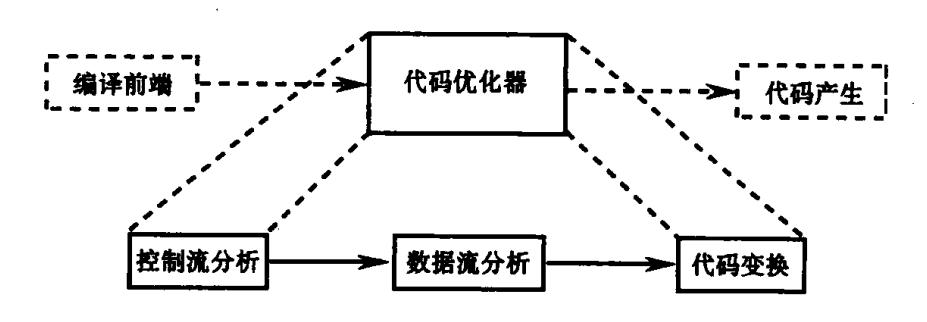

图 10.1 代码优化器的地位和结构

有的优化工作比较容易实现,如基本块内的局部优化。在一个程序运行时,相当多一部分时间往往会花在循环上,因此,基于循环的优化是非常重要的。有的优化技术的实现涉及到对整个程序的控制流和数据流分析,其实现代价是比较高的。本章 10.1 节中将对优化进行一个概述;10.2 节重点介绍基于基本块的局部优化;10.3 节和 10.4 节分别介绍有关循环优化和数据流分析的一些问题。

### 10.1 概 述

优化的目的是为了产生更高效的代码。由优化编译程序提供的对代码的各种变换必 须遵循一定的原则。

- (1)等价原则。经过优化后不应改变程序运行的结果。
- (2)有效原则。使优化后所产生的目标代码运行时间较短,占用的存储空间较小。
- (3)合算原则。应尽可能以较低的代价取得较好的优化效果。

为了获得更优化的程序,可以从各个环节着手。首先,在源代码这一级,程序员可以通过选择适当的算法和安排适当的实现语句来提高程序的效率。例如,进行排序时,采用"快速排序"比采用"插入排序"就要快得多。其次,在设计语义动作时,我们不仅可以考虑

{1}------------------------------------------------

产生更加高效的中间代码,而且还可以为后面的优化阶段做一些可能的预备工作。例如,可以在循环语句的头和尾对应的中间代码"打上标记",这样可以有助于后面的控制流和数据流分析;代码的分叉处和交汇处也可以打上标记,以便于识别程序流图中的直接前驱和直接后继。对编译产生的中间代码,我们安排专门的优化阶段,进行各种等价变换,以改进代码的效率。在目标代码这一级上,我们应该考虑如何有效地利用寄存器,如何选择指令,以及进行窥孔优化等等。

下面我们着重讨论中间代码这一级上的优化。我们先通过一个例子,介绍代码优化通常采用的基本方法。这个例子是一个用 C 语言写的快速排序子程序:

```
void quicksort (m, n);
int m, n;
        int i, j;
        int v, x;
        if (n < = m) return:
        /* fragment begins here */
        i = m - 1; j = n; v = a [n];
        while (1)
             do i = i + 1;
                               while (a[i] < v);
             do j = j - 1;
                                while (a[j] > v);
             if (i > = j) break;
             x = a[i]; a[i] = a[j]; a[j] = x;
        x = a[i]; a[i] = a[n]; a[n] = x;
        /* fragment ends here */
        quicksort (m, j); quicksort (i+1, n);
```

利用第七章介绍的方法,可以产生这个程序的中间代码。图 10.2 给出了程序中两个注解 ( /\* fragment begins here \*/和/\* fragment ends here \*/)之间的语句对应的中间代码。其中, $T_1$ , $T_2$ ,…, $T_{15}$ 为临时变量; $B_1$ , $B_2$ ,…, $B_6$  为基本块,有关基本块的概念在下节介绍。下面以图 10.2 为例概述常用的优化技术。

### • 删除公共子表示式

如果一个表达式 E 在前面已计算过,并且在这之后 E 中变量的值没有改变,则称 E 为公共子表达式。对于公共子表达式,我们可以避免对它的重复计算,称为删除公共子表达式(有时称删除多余运算)。例如,在图 10.2 的  $B_5$  中分别把公共子表达式 4\*i 和 4\*j 的值赋给  $T_7$  和  $T_{10}$ 。这种重复计算可以消除,把  $B_5$  变换为如下代码段:

```
B_5:

T_6: = 4 * i

x: = a [T_6]
```

{2}------------------------------------------------

 $T_7$ : =  $T_6$   $T_8$ : = 4 \* j  $T_9$ : = a [ $T_8$ ] a [ $T_7$ ] =  $T_9$   $T_{10}$ : =  $T_8$ a [ $T_{10}$ ] = x goto  $B_2$ 

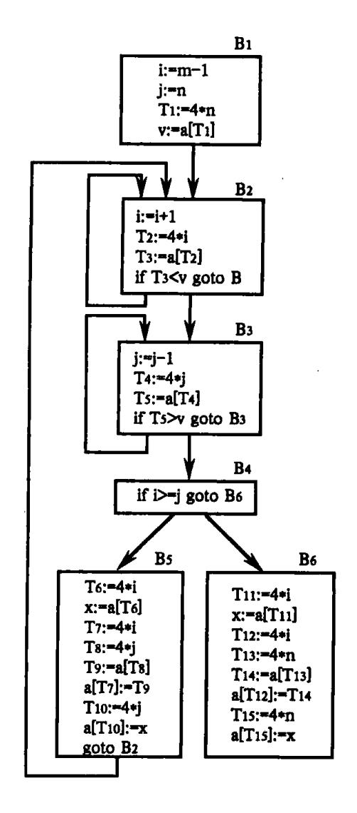

图 10.2 中间代码程序段

按上面方法对  $B_5$  删除公共子表达式后,仍要计算 4\*i 和 4\*j。我们还可以在更大范围来考虑删除公共子表达式的问题。利用  $B_3$  中的赋值  $T_4:=4*j$  可以把  $B_5$  中的代码:

$$T_8 = 4 * j$$
 替换为  $T_8 := T_4$ 

同样,利用  $B_2$  中的赋值  $T_2$ : = 4 \* i 可以把  $B_5$  中的代码:

$$T_6 = 4 * i$$
 替换为  $T_6 := T_2$ 

对于 B<sub>6</sub> 也可以作同样的考虑。删除公共子表达式后的情况如图 10.3 所示。

{3}------------------------------------------------

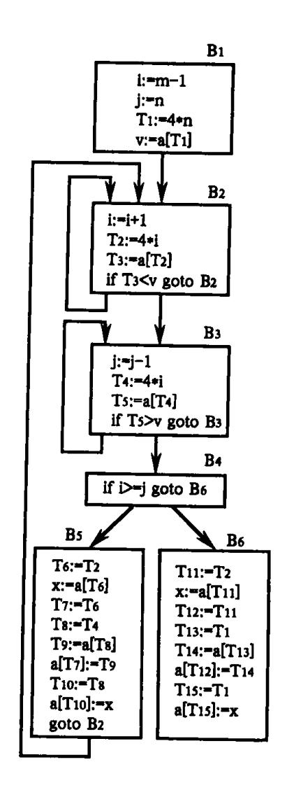

图 10.3 删除公共子表达式后

### • 复写传播

图 10.3 中的  $B_5$  还可以进一步改进。 $T_6:=T_2$  把  $T_2$  赋给  $T_6,x:=a$  [ $T_6$ ]中引用了  $T_6$  的值,而这中间没有改变  $T_6$  的值。因此,可以把 x:=a [ $T_6$ ]变换为 x:=a [ $T_2$ ]。这种变换称为复写传播。用这样的复写传播方法,可把  $B_5$  变为

$$T_6: = T_2$$
 $x: = a[T_2]$ 
 $T_7: = T_2$ 
 $T_8: = T_4$ 
 $T_9: = a[T_4]$ 
 $a[T_2]: = T_9$ 
 $T_{10}: = T_4$ 
 $a[T_4]: = x$ 
goto  $B_2$ 

进一步考察,由于在  $B_2$  中计算了  $T_3$ : = a[ $T_2$ ],因此在  $B_5$  中可以删除公共子表达式,把

{4}------------------------------------------------

$$x_1 = a[T_2]$$
 替换为  $x_2 = T_3$ 

讲而,通过复写传播把 B<sub>5</sub> 中

$$a[T_4]:=x$$
 替换为  $a[T_4]:=T_3$ 

同样,B5中

$$T_9: = a [T_4];$$
  $a [T_2] = T_9$ 

可以替换为

$$T_9:=T_5;$$
  $a[T_2]:=T_5$ 

这样 B, 就变为

$$T_6 := T_2$$

$$x := T_3$$

$$T_7 := T_2$$

$$T_8$$
: =  $T_4$ 

$$T_9$$
: =  $T_5$ 

$$a[T_2] := T_5$$

$$T_{10} := T_4$$

$$a[T_4] := T_3$$

goto B<sub>2</sub>

复写传播的目的是使对某些变量的赋值变为无用。

### • 删除无用代码

对于进行了复写传播的  $B_5$  中的变量 x 及临时变量  $T_6$ ,  $T_7$ ,  $T_8$ ,  $T_9$ ,  $T_{10}$ , 由于这些变量的值在整个程序中不再被使用,因此,这些变量的赋值对程序运算结果没有任何作用。我们可以删除对这些变量赋值的代码。我们称之为删除无用赋值或删除无用代码。删除无用赋值后,  $B_5$  变为

$$a[T_2]:=T_5$$

$$a \left[ T_4 \right] := T_3$$

goto B<sub>2</sub>

对 B<sub>6</sub> 进行相同的优化处理,可把 B<sub>6</sub> 变为

$$a[T_2] := v$$

$$\mathbf{a}[T_1] := T_3$$

复写传播和删除无用赋值后,如图 10.4 所示。

下面几种优化涉及循环。

#### • 代码外提

对于循环中的有些代码,如果它产生的结果在循环中是不变的,就可以把它提到循环外来,以避免每循环一次都要对这条代码进行运算。例如,对下面 while 语句:

while 
$$(i < = limit - 2) \cdots$$

如果在循环中的 limit 的值是不变的,就可把它变换为

$$t:= limit - 2;$$

while 
$$(i < = t) \cdots$$

{5}------------------------------------------------

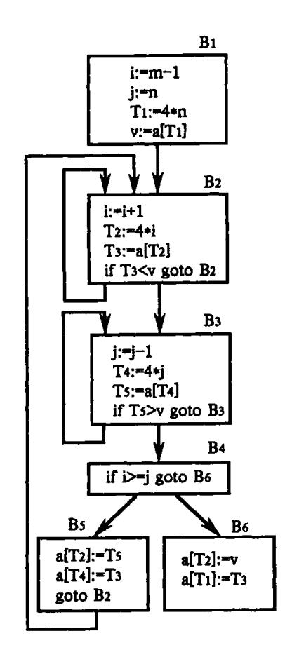

图 10.4 复写传播和删除无用赋值后

**这种变换称为代码外提。** 

#### • 强度削弱

考虑图 10.4 的内循环  $B_3$ 。每循环一次,j 的值减  $1;T_4$  的值始终与 j 保持着  $T_4 = 4*j$  的线性关系。每循环一次, $T_4$  的值减少 4。因此,我们可以把循环中计算  $T_4$  的值的乘法运算,变换为在循环前面进行一次循环乘法运算,而在循环进行减法运算。如图 10.5 所示(在图 10.5 中我们省略了  $B_2$ ,  $B_5$ ,  $B_6$  的内容)。因为加减法运算一般要比乘除法快,所以称这种变换为强度削弱。

同样,对图 10.4 的  $B_2$  中的  $T_2$ : = 4 \* i 可以进行强度削弱。

### • 删除归纳变量

由图 10.4 我们看到了,在  $B_2$  中每循环一次,i 增加 1, $T_2$  的值与 i 保持着  $T_2$  = 4 \* i 的 线性关系;而在  $B_3$  中每循环一次 j 减少 1, $T_4$  与 j 保持着  $T_4$  = 4 \* j 的线性关系。这种变量 我们称之为归纳变量。对  $T_2$ : = 4 \* i 和  $T_4$ : = 4 \* j 进行强度削弱后,i 和 j 除了在条件判断 if i > = j goto  $B_6$  之外,其它地方不再被引用。因此,我们可以把条件判断变换为 if  $T_2$  > =  $T_4$  goto  $B_6$ 。

通过上面各种优化后,图 10.2 最后变换为图 10.6。通过图 10.2 和图 10.6 比较,我们发现优化的效果是明显的。 $B_2$  和  $B_3$  中的代码从 4 条减为 3 条,而一条从乘法变为加法。 $B_5$  从 9 条变为 3 条, $B_6$  从  $B_5$  条变为  $B_6$  从  $B_6$  条变为  $B_6$  条变为  $B_6$  条变为  $B_6$  条变为  $B_6$  条变为  $B_6$  。虽然  $B_6$  的代码从 A 条变为 A 条变为 A 条变为 A 条变为 A 条变为 A 条变为 A 条变为 A 条变为 A 条变为 A 条变为 A 条变为 A 条变为 A 条变为 A 条变为 A 条变为 A 条变为 A 条变为 A 条变为 A 条变为 A 条变为 A 条变为 A 条变为 A 条变为 A 条变为 A 条变为 A 条变为 A 条变为 A 条变为 A 条变为 A 条变为 A 条变为 A 条变为 A 条变为 A 条变为 A 条变为 A 条变为 A 条变为 A 条变为 A 条变为 A 条变为 A 条变为 A 条变为 A 条变为 A 条变为 A 条变为 A 条变为 A 条变为 A 条变为 A 条变为 A 条变为 A 条变为 A 条变为 A 条变为 A 条变为 A 条变为 A 条变为 A 条变为 A 条变为 A 条变为 A 条变为 A 条变为 A 条变为 A 条变为 A 条变为 A 条变为 A 条变为 A 条变为 A 条变为 A 条变为 A 条变为 A 条变为 A 条变为 A 条变为 A 条变为 A 条变为 A 条变为 A 条变为 A 条变为 A 条变为 A 条变为 A 条变为 A 条变为 A 条变为 A 条变为 A 条变为 A 条变为 A 条变为 A 条变为 A 条 A 条变为 A 条 A 条 A 条 A 条 A 条 A 条 A 条 A A A A A A A A A A

{6}------------------------------------------------

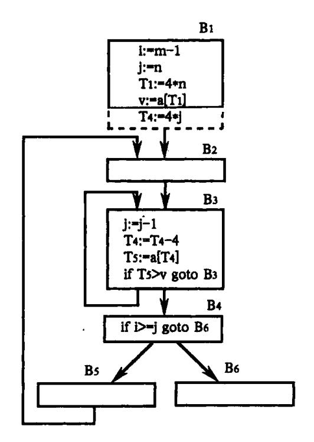

图 10.5 对 B<sub>3</sub> 中的 4\*j 进行强度削弱

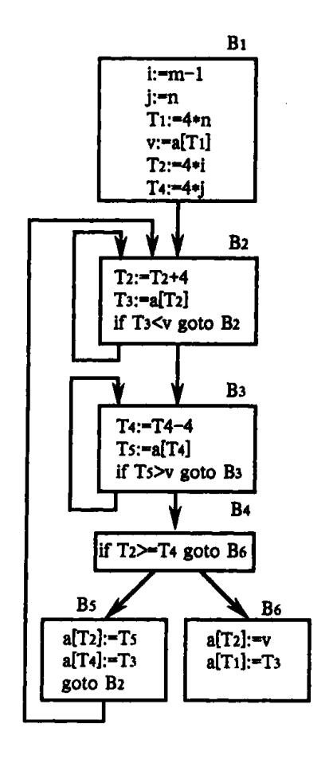

图 10.6 删除归纳变量后的结果

{7}------------------------------------------------

### 10.2 局部优化

本节,我们以程序的基本块为范围来讨论局部优化。

### 10.2.1 基本块及流图

所谓**基本块**,是指程序中一顺序执行的语句序列,其中只有一个人口和一个出口,人口就是其中的第一个语句,出口就是其中的最后一个语句。对一个基本块来说,执行时只能从其人口进入,从其出口退出。例如下面的三地址语句序列就形成了一个基本块:

$$T_1 := a * a$$
 $T_2 := a * b$ 
 $T_3 := 2 * T_2$ 
 $T_4 := T_1 + T_2$ 
 $T_5 := b * b$ 
 $T_6 := T_4 + T_5$ 

如果一条三地址语句为 x: = y + z,则称对 x 定值并引用 y 和 z。在一个基本块中的一个名字,所谓在程序中的某个给定点是**活跃的**,是指如果在程序中(包括在本基本块或在其它基本块中)它的值在该点以后被引用。

对一个给定的程序,我们可以把它划分为一系列的基本块。在各个基本块范围内,分别进行优化。局限于基本块范围内的优化称为**基本块内的优化**,或称为**局部优化。**在介绍基本块内的优化之前,我们先给出划分四元式程序为基本块的算法。

- 1. 求出四元式程序中各个基本块的人口语句,它们是:
- (1)程序的第一个语句;或者
- (2) 能由条件转移语句或无条件转移语句转移到的语句:或者
- (3) 紧跟在条件转移语句后面的语句。
- 2. 对以上求出的每一人口语句,构造其所属的基本块。它是由该人口语句到另一人口语句(不包括该人口语句),或到一转移语句(包括该转移语句),或到一停语句(包括该停语句)之间的语句序列组成的。
- 3. 凡未被纳入某一基本块中的语句,都是程序中控制流程无法到达的语句,从而也是不会被执行到的语句,我们可把它们从程序中删除。

例 10.1 考察图 10.7 中的三地址代码程序。

- (1) read X
- (2) read Y
- (3)  $R_1 = X \mod Y$
- (4) if R = 0 goto (8)
- $(5) X_{:} = Y$
- (6)  $Y_1 = R$
- (7) goto (3)
- (8) write Y
- (9) halt

图 10.7 求最大公因子程序

{8}------------------------------------------------

应用以上算法:由规则 1(1),(1)是人口语句;由规则 1(2),(3)和(8)分别是一人口语句;由规则 1(3),(5)是一人口语句。然后应用规则 2 求出各基本块,它们分别是(1)(2),(3)(4),(5)(6)(7)以及(8)(9)。

在一个基本块内,可以进行上一节提到的删除公共子表达式和删除无用赋值这两种优化。还可以实现下面几种变换。

1. 合并已知量。假设在一个基本块内有下面两个语句:

$$T_1 := 2$$

•••

$$T_2 : = 4 * T_1$$

如果对  $T_1$  赋值后,没有改变过,则  $T_2$ :=4\* $T_1$  中的两个运算对象都是编译时的已知量。可以在编译时计算出它的值,而不必等到程序运行时再计算。也即,可把  $T_2$ :=4\* $T_1$ 变换为  $T_2$ :=8,我们称这种变换为合并已知量。

2. 临时变量改名。假定在一个基本块里有语句:

$$T: = b + c$$

其中,T是一个临时变量名。如果把这个语句改成:

$$S:=b+c$$

其中,S是一个新的临时变量名,并且把本基本块中出现的所有 T 都改成 S,则不改变基本块的值。事实上,总可以把一个基本块变换成等价的另一个基本块,使其中定义临时变量的语句改成定义新的临时变量。

3. 交换语句的位置。假定在一个基本块里有下列两个相邻的语句:

$$T_1 := b + c$$

$$T_2 : = x + y$$

如果 x,y 均不为  $T_1,b,c$  均不为  $T_2,则交换这两个语句的位置不影响基本块的值。有时通过交换语句的次序,可产生出更高效的代码。$ 

4. 代数变换。就是说,对基本块中求值的表达式,用代数上等价的形式替换,以期使复杂运算变成简单运算。例如,语句

$$x:=x+0$$

或

$$x := x * 1$$

执行的运算没有意义,都不改变 x 的值,所以,可以从基本块里删除。又如,语句

$$x := y * * 2$$

中的乘方运算,通常需要调用一个函数来实现。可以用代数上等价的形式,用简单的运算

$$x := y * y$$

替换。

通过构造一个有向图,称之为流图,我们可以将控制流的信息增加到基本块的集合上来表示一个程序。每个流图以基本块为结点。如果一个结点的基本块的人口语句是程序的第一条语句,则称此结点为首结点。如果在某个执行顺序中,基本块  $B_2$  紧接在基本块  $B_1$  之后执行,则从  $B_1$  到  $B_2$  有一条有向边。即,如果

(1)有一个条件或无条件转移语句从  $B_1$  的最后一条语句转移到  $B_2$  的第一条语句;或

{9}------------------------------------------------

者

(2)在程序的序列中,  $B_2$  紧接在  $B_1$  的后面, 并且  $B_1$  的最后一条语句不是一个无条件 转移语句。我们就说  $B_1$  是  $B_2$  的前驱,  $B_3$  是  $B_1$  的后继。

例 10.2 对例 10.1 中的程序的各基本块构成的流图如图 10.8 所示。

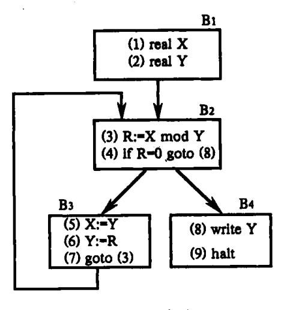

图 10.8 程序流图

### 10.2.2 基本块的 DAG 表示及其应用

- 一个基本块的 DAG 是一种其结点带有下述标记或附加信息的 DAG。
- 1. 图的叶结点(没有后继的结点)以一标识符(变量名)或常数作为标记,表示该结点 代表该变量或常数的值。如果叶结点用来代表某变量 A 的地址,则用 addr(A)作为该结 点的标记。通常把叶结点上作为标记的标识符加上下标 0,以表示它是该变量的初值。
- 2. 图的内部结点(有后继的结点)以一运算符作为标记,表示该结点代表应用该运算符对其后继结点所代表的值进行运算的结果。
- 3. 图中各个结点上可能附加一个或多个标识符,表示这些变量具有该结点所代表的值。

### 例 10.3 对下面基本块:

- (1)  $T_1 := 4 * i$
- (2)  $T_2 := a [T_1]$
- (3)  $T_3 := 4 * i$
- -(4)  $T_4:=b[T_3]$ 
  - (5)  $T_5 := T_2 * T_4$
  - (6)  $T_6$ : = prod +  $T_5$
  - (7)  $prod := T_6$
  - (8)  $T_7 := i + 1$
  - (9)  $i := T_7$
  - (10) if i < 20 goto (1)

对应的 DAG 如图 10.9 所示。

关于 DAG 的意义等后面我们给出了构造算法之后再来讨论。我们可以看到, DAG 的

{10}------------------------------------------------

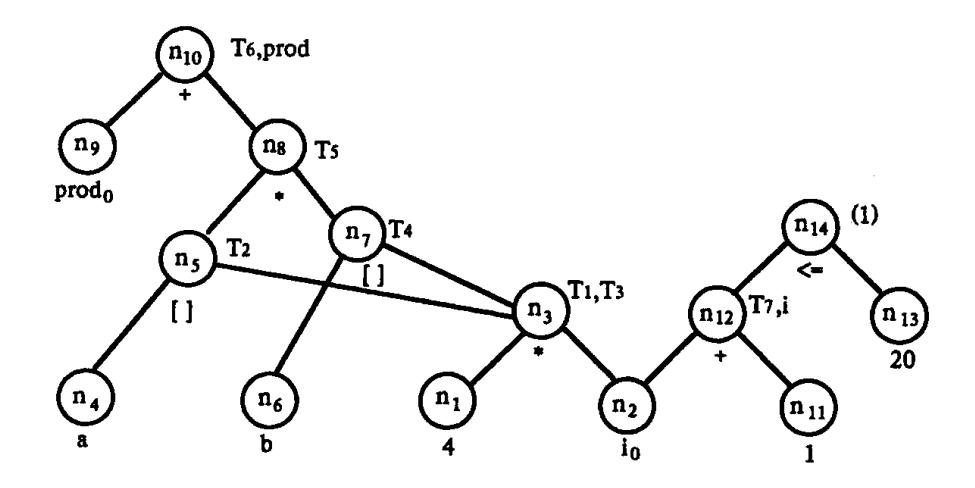

图 10.9 一个基本块的 DAG

每个结点代表一个由若干叶结点构成的计算公式。例如,T<sub>4</sub> 标记的结点代表公式 b [4\*i]

即从地址 b 偏移 4 \* i 个字节后对应的机器字中的值,这个值将作为 T<sub>4</sub> 的值。

下面介绍构造基本块的 DAG 的算法。假设 DAG 各结点信息将用某种适当的数据结构来存放(例如链表)。并设有一个标识符(包括常数)与结点的对应表。NODE(A)是描述这种对应关系的一个函数,它的值或者是一个结点的编号 n,或者无定义。前一情况代表 DAG 中存在一个结点 n,A 是其上的标记或附加标识符。我们还假定要考虑的中间代码包括如下三种型式:

- (0) A := B
- (1)  $A_1 = op B$
- (2)  $A_1 = B \text{ op } C$  或  $A_2 = B[C]$

下面是仅含(0),(1),(2)型中间代码的基本块的 DAG 构造算法。

开始,DAG 为空。

对基本块中每一条中间代码式,依次执行以下步骤。

1. 如果 NODE(B)无定义,则构造一标记为 B 的叶结点并定义 NODE(B)为这个结点。如果当前代码是 0 型,则记 NODE(B)的值为 n,转 4。

如果当前代码是1型,则转2(1)。

如果当前代码是 2 型,则:(i)如果 NODE(C)无定义,则构造一标记为 C 的叶结点并定义 NODE(C)为这个结点,(ii)转 2(2)。

- 2.(1)如果 NODE(B)是标记为常数的叶结点,则转 2(3),否则转 3(1)。
- (2)如果 NODE(B)和 NODE(C)都是标记为常数的叶结点,则转 2(4),否则转 3(2)。
- (3)执行 op B(即合并已知量),令得到的新常数为 p。如果 NODE(B)是处理当前代码时新构造出来的结点,则删除它。如果 NODE(p)无定义,则构造一用 p 做标记的叶结点 n。置 NODE(p) = n,转 4。
- (4)执行 B op C(即合并已知量),令得到的新常数为 p。如果 NODE(B)或 NODE(C)是处理当前代码时新构造出来的结点,则删除它。如果 NODE(p)无定义,则构造一用 p 做标记的叶结点 n。置 NODE(p) = n,转 4。
  - 3.(1)检查 DAG 中是否已有一结点,其唯一后继为 NODE(B)且标记为 op(即找公共子

{11}------------------------------------------------

表达式)。如果没有,则构造该结点 n,否则就把已有的结点作为它的结点并设该结点为 n。转 4。

- (2)检查 DAG 中是否已有一结点,其左后继为 NODE(B),右后继为 NODE(C),且标为 op( 即找公共子表达式)。如果没有,则构造该结点 n,否则就把已有的结点作为它的结点并设该结点为 n。转 4。
- 4. 如果 NODE(A)无定义,则把 A 附加在结点 n 上并令 NODE(A) = n;否则先把 A 从 NODE(A)结点上的附加标识符集中删除(注意,如果 NODE(A)是叶结点,则其标记 A 不删除),把 A 附加到新结点 n 上并令 NODE(A) = n。转处理下一条代码。

例 10.4 试构造以下基本块 G 的 DAG

- (1)  $T_0$ : = 3.14
- (2)  $T_1 := 2 * T_0$
- (3)  $T_2$ : = R + r
- (4)  $A_1 = T_1 * T_2$
- (5)  $B_{:} = A$
- (6)  $T_3 := 2 * T_0$
- (7)  $T_4 : = R + r$
- (8)  $T_5 := T_3 * T_4$
- (9)  $T_6 := R r$
- (10) B:  $= T_5 * T_6$

处理每一条代码后构造出的 DAG 如图 10.10 中各子图所示,其步骤从略。子图(a), (b),(c),…,(j)分别对应于代码(1),(2),(3),…,(10)。

根据 DAG 构造算法和上述例子,我们看到:

- (1)对任何一个代码,如果其中参与运算的对象都是编译时的已知量,那么,算法的步骤(2)并不生成计算该结点值的内部结点,而是执行该运算,用计算出的常数生成一个叶结点。所以步骤(2)的作用是实现合并已知量。
- (2)如果某变量被赋值后,在它被引用前又重新赋值,那么,算法的步骤(4)已把该变量从具有前一个值的结点上删除,也即算法的步骤(4)具有删除前述第二种情况无用赋值的作用。
- (3)算法的步骤3的作用是检查公共子表达式,对具有公共子表达式的所有代码,它只产生一个计算该表达式值的内部结点,而把那些被赋值的变量标识符附加到该结点上。

因此,我们可利用这样的 DAG,重新生成原基本块的一个优化的中间代码序列。为此,如果 DAG 某内部结点上附有多个标识符,由于计算该结点值的表达式是一个公共子表达式,当我们把该结点重新写成中间代码时,就可删除多余运算。例如,图 9.10(j)结点  $n_5$  附有  $T_2$  和  $T_4$  两个标识符,当我们把结点  $n_5$  重新写成中间代码时,就不是生成  $T_2$ :=R+r和  $T_4$ :=R+r,而是生成  $T_2$ :=R+r和  $T_4$ := $T_2$ 0.这样,就删除了多余的 R+r运算。

如果根据上述方式把图 10.10(j)的 DAG,按原来构造其结点的顺序,重新写成中间代码,则我们得到以下中间代码序列 G'。

- (1)  $T_0$ : = 3.14
- (2)  $T_1$ : = 6.28

{12}------------------------------------------------

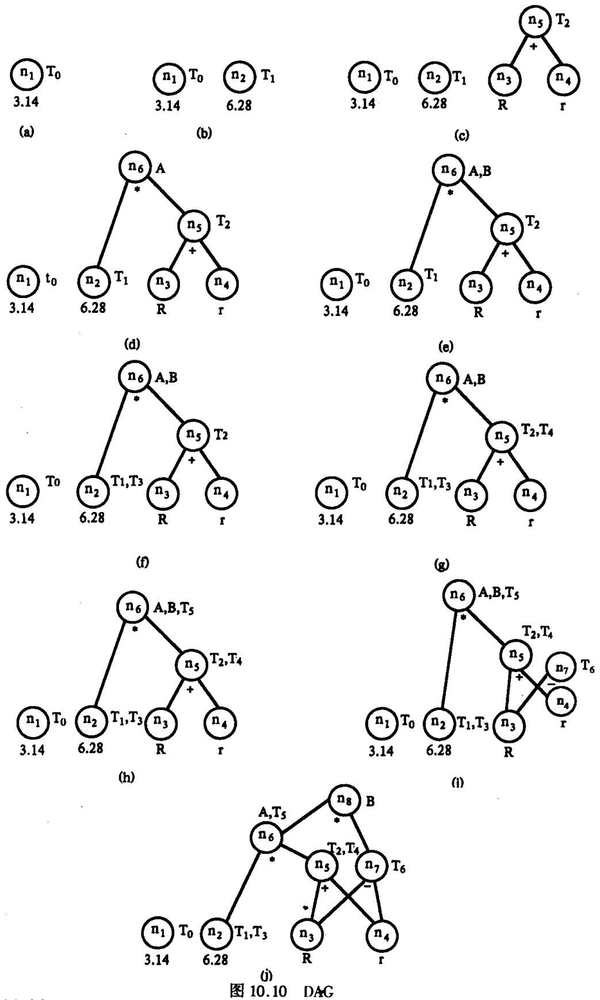

3.14 6.28 K I
(i)
图 10.10 DAG
(a)对应于 T<sub>0</sub>:=3.14的 DAG;(b)对应于 T<sub>1</sub>:=2\*T<sub>0</sub>的 DAG;(c)对应于 T<sub>2</sub>:=R+r的 DAG;
(d)对应于 A:=T<sub>1</sub>\*T<sub>2</sub>的 DAG;(e)对应于 B:=A 的 DAG;(f)对应于 T<sub>3</sub>:=2\*T<sub>0</sub>的 DAG;
(g)对应于 T<sub>4</sub>:=R+r的 DAG;(h)对应于 T<sub>5</sub>:=T<sub>3</sub>\*T<sub>4</sub>的 DAG;(i)对应于 T<sub>6</sub>:=R-r的 DAG;
(j)对应于 B:=T<sub>5</sub>\*T<sub>6</sub>的 DAG。

{13}------------------------------------------------

- (3)  $T_3$ : = 6.28
- (4)  $T_2 := R + r$
- (5)  $T_4$ : =  $T_2$
- (6) A: =  $6.28 \times T_2$
- (7)  $T_5 := A$
- (8)  $T_6 := R r$
- (9)  $B_1 = A * T_6$

把 G'和原基本块 G 相比,我们看到:

- (1)G中中间代码(2)和(6)都是已知量和已知量的运算,G'已合并。
- (2)G中中间代码(5)是一种无用赋值,G'已把它删除。
- (3)G 中中间代码(3)和(7)的 R+r 是公共子表达式,G' 只对它们计算一次,删除了多余的 R+r 运算。

所以 G'是对 G 实现上述三种优化的结果。

除了可应用 DAG 进行上述的优化外,我们还可从基本块的 DAG 中得到一些其它的优化信息,这些信息是:

- (1)在基本块外被定值并在基本块内被引用的所有标识符,就是作为叶子结点上标记的那些标识符;
- (2)在基本块内被定值且该值能在基本块后面被引用的所有标识符,就是 DAG 各结点上的那些附加标识符。

利用上述这些信息,我们还可进一步删除中间代码序列中其它情况的无用赋值。但这时必须涉及到有关变量在基本块后面被引用的情况(见数据流分析)。例如,如果 DAG 中某结点上附加的标识符,在该基本块后面不会被引用,那么,就不生成对该标识符赋值的中间代码。又如,如果某结点上不附有任何标识符或者其上附加的标识符在基本块后面不会被引用,而且它也没有前驱结点,这就意味着基本块内和基本块后面都不会引用该结点的值,那么,就不生成计算该结点值的代码。不仅如此,如果有两条相邻的代码 A:=C op D 和 B:=A,其中第一条代码计算出来的 A 值,只在第二条代码中被引用,则把相应结点重写成中间代码时,原来的两条代码将变换成 B:=C op D。

我们现在假设例 10.4 中  $T_0$ ,  $T_1$ ,  $T_2$ ,  $T_3$ ,  $T_4$ ,  $T_5$  和  $T_6$  在基本块后面都不会被引用,于是图 10.10(j)中 DAG 就可重写为如下代码序列:

- (1)  $S_1 := R + r$
- (2) A: =  $6.28 \times S_1$
- (3)  $S_2 := R r$
- (4)  $B_1 = A * S_2$

其中,没有生成对  $T_0$ ,  $T_1$ ,  $T_2$ ,  $T_3$ ,  $T_4$ ,  $T_5$  和  $T_6$  赋值的代码;  $S_1$  和  $S_2$  是用来存放中间结果值的临时变量。

以上把 DAG 重写成中间代码时,是按照原来构造 DAG 结点的顺序(即 n<sub>5</sub>, n<sub>6</sub>, n<sub>7</sub>, n<sub>8</sub>) 依次进行。实际上,我们还可采用其它顺序,只要其中任一内部结点在其后继结点之后被重写并且转移语句(如果有的话)仍然是基本块的最后一个语句即可。这里值得指出的是,我们可按照 n<sub>7</sub>, n<sub>5</sub>, n<sub>6</sub> 和 n<sub>8</sub> 的顺序把 DAG 重写为如下代码序列:

{14}------------------------------------------------

- (1)  $S_1 := R r$
- (2)  $S_2 := R + r$
- (3) A: =  $6.28 \times S_2$
- (4) B: =  $A * S_1$

在第十一章介绍代码生成时,将会看到,按照后一顺序重写出的中间代码序列,它所生成的目标代码要比前者好。那里,我们还要介绍如何重排 DAG 的结点顺序,使得根据它重写出中间代码序列,能生成更有效的目标代码。

下面我们对 DAG 构造算法作进一步讨论。

当基本块中出现有数组元素引用、指针和过程调用时,情况就较为复杂。例如,考虑如下的基本块 G:

如果我们运用构造 DAG 算法来构造上述基本块的 DAG,那么 a[i]将成为一个公用子表达式。而当从 DAG 重写基本块时得"优化"后的基本块 G':

然而,在 i=j 并且  $y\neq a[i]$ 时,这两个基本块所计算出来的 z 值是不相同的。问题的原因是当我们对一个数组元素赋值时,我们可能改变表达式 a[i] 的右值,即使 a 和 i 都没有改变。因此,当我们对数组 a 的一个元素赋值时,我们"注销"所有标记为[i]、左边的变元是 a 加上或减去一个常数(也可能是 0)的结点。即,我们认为对这样的结点再添加附加标识符是非法的,从而取消了它作为公共子表达式的资格。这要求我们对每一个结点设一个标志位来标记是否已被注销。另外,对每个基本块中引用的数组 a,我们可以保存一个结点表,这些结点是当前未被注销但若有对 a 的一个元素的赋值则必须被注销的结点。

对指针赋值\*p:=w,其中p是一个指针,会产生同样的问题。如果我们不知道p可能指向哪一个变量,那么,就要认为它可能改变基本块中任一变量的值。当构造这种赋值句的结点时,要把DAG各结点上所有标识符(包括作为叶结点上标记的标识符)都予以注销。把DAG中所有结点上的标识符都注销,也同时意味着DAG中所有结点也都被注销。

在一个基本块中的一个过程调用将注销所有的结点,因为对被调用过程的情况缺乏了解,我们必须假定任何变量都可能因产生副作用而发生变化。

与上述讨论有关的另一个问题是,当把上述 DAG 重写成中间代码时,如果我们不是按照原来构造 DAG 结点的顺序把各结点重写为代码,那就必须注意,DAG 中某些结点必须遵守一定顺序。例如,在上述基本块 G 中,z: = a [i]必须跟在 a[j]: = y之后,而 a[j]: = y必须跟在 x: = a[i]之后。下面,我们根据以上讨论的各种情况的本来意义,把重写中间代码时 DAG 中结点间必须遵守的顺序归纳如下。

- (1)对数组 a 任何元素的引用或赋值,都必须跟在原来位于其前面的(如果有的话,下同)对数组 a 任何元素的赋值之后。
  - (2)对数组 a 任何元素的赋值,都必须跟在原来位于其前面的对数组 a 任何元素的引

{15}------------------------------------------------

用之后。

- (3)对任何标识符的引用或赋值,都必须跟在原来位于其前面的任何过程调用或通过指针的间接赋值之后。
- (4)任何过程调用或通过指针的间接赋值,都必须跟在原来位于其前面的任何标识符的引用或赋值之后。

总之,当对基本块重写时,任何数组 a 的引用不可以互相调换次序,并且任何语句不得跨越一个过程调用语句或通过指针的间接赋值。

### 10.3 循环优化

本节我们将讨论**循环优化**。什么叫循环呢?粗略地说,**循环**就是程序中那些可能反复执行的代码序列。因为循环中代码可能要反复执行,所以,进行代码优化时应着重考虑循环的代码优化,这对提高目标代码的效率将起更大的作用。为了进行循环优化,首先,要确定程序流图中,哪些基本块构造一个循环。按照结构程序设计思想,程序员在编程时应使用高级语言所提供的结构性的循环语句来编写循环。而由高级语言的循环语句(如 Pascal 语言中的 for 语句、while 语句、repeat 语句,FORTRAN 语言中的 do 语句等)形成的循环,是不难找出的。例如在图 10.2 中  $B_2$  和  $B_3$  分别构成一个循环, $\{B_2,B_3,B_4,B_5\}$ 构成一个更大范围的循环。

对循环中的代码,可以实行代码外提、强度削弱和删除归纳变量等优化。

### 10.3.1 代码外提

循环中的代码,要随着循环反复地执行,但其中某些运算的结果往往是不变的。例如,假设循环中有形如 A:=B op C 的代码,如果 B 和 C 是常数,或者到达它们的 B 和 C 的定值点都在循环外,那么,不管循环进行多少次,每次计算出来的 B op C 的值将始终是不变的。对于这种不变运算 B op C,我们可以把它外提到循环外。这样,程序的运行结果仍保持不变,但程序的运行速度却提高了。我们称这种优化为代码外提。

上面我们提到了"到达一定值"概念。所谓变量 A 在某点 d 的定值到达另一点 u(或称变量 A 的定值点 d 到达另一点 u),是指流图中从 d 有一通路到达 u 且该通路上没有 A 的其它定值。

实行代码外提时,我们在循环人口结点前面建立一个新结点(基本块),称为循环的**前置结点**。循环前置结点以循环人口结点为其唯一后继,原来流图中从循环外引到循环入口结点的有向边,改成引到循环前置结点,如下图所示:

因为我们考虑的循环结构,其入口结点是唯一的,所以,前置结点也是唯一的。循环中外提的代码将统统外提到前置结点中。

例 10.5 对下面一段 Pascal 源程序:

for I: = 1 to 10 do  

$$A[I,2 * J] := A[I,2 * J] + 1$$

产生中间代码如图 10.11 所示。

考察图 10.11 中(3)和(7),由于循环中没有 J 的定值点,所以其中 J 的所有引用的定

{16}------------------------------------------------

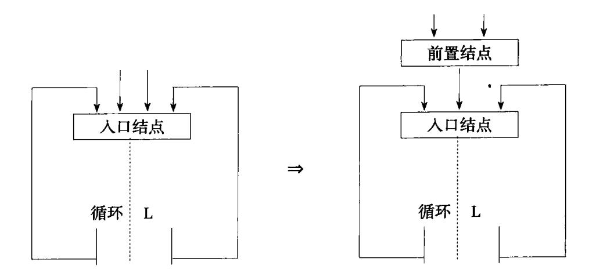

值点都在循环外,从而(3)和(7)都是循环不变运算。另外(6)和(10)也是循环不变运算,这是因为分配给数组 A 的首地址 addr(A)并不随循环的执行而改变。于是(3),(7),(6),(10)均可外提到循环的前置结点中,如图 10.12 所示。其中  $B_2$ '就是新建立的循环前置结点。

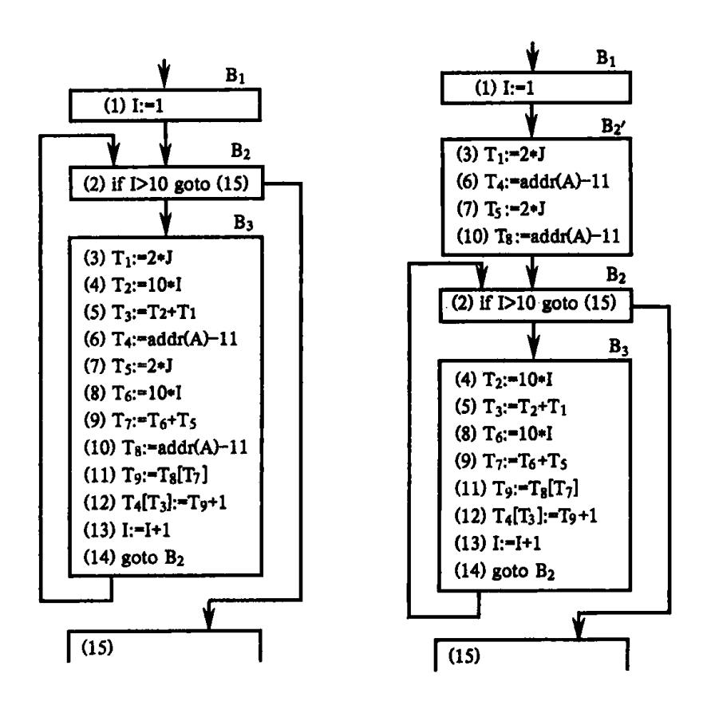

图 10.11 程序流图

图 10.12 代码外提

是否在任何情况下,都可把循环不变运算外提呢?考察以下各例。 例 10.6 考察图 10.13 的流图。

容易看出, {B<sub>2</sub>, B<sub>3</sub>, B<sub>4</sub>} 是循环, B<sub>2</sub> 是循环人口结点, B<sub>4</sub> 是其出口结点。所谓出口结点, 是指循环中具有这样性质的结点:从该结点有一有向边引到循环外的某结点。

 $B_3$  中  $I_{:=2}$  是循环不变运算。试问:能否把  $I_{:=2}$  外提到循环的前置结点中呢?我们看到,如果把  $I_{:=2}$  外提到循环前置结点  $B_2$ '中,如图 10.14 所示。那么,执行到  $B_5$  时,

{17}------------------------------------------------

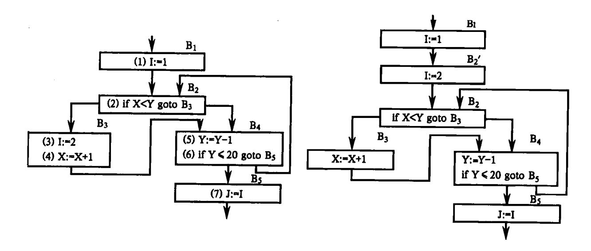

图 10.13 程序流图

图 10.14 程序流图

I 的值总是 2,从而 J 的值也是 2。注意,  $B_3$  并不是出口结点  $B_4$  的必经结点。如果 X=30 和 Y=25,按图 10.13 的流图,  $B_3$  是不会被执行的。于是,当执行到  $B_5$  时, I 的值应是 1,从而 J 的值也是 1 而不是 2。所以,图 10.14 改变了原来程序的运行结果,这当然是不符合优化要求的。问题出在什么地方呢?就在于  $B_3$  不是循环出口结点  $B_4$  的必经结点。从该例我们看到,当把一不变运算外提到循环前置结点时,要求该不变运算所在的结点是循环所有出口结点的必经结点。另外,我们还注意到,如果循环中 I 的所有引用点只是  $B_3$  中 I 的定值点所能到达的,I 在循环中不再有其它定值点,并且出循环后不会再引用该 I 的值(即在循环外的循环后继结点人口,I 不是活跃的),那么,即使  $B_3$  不是  $B_4$  的必经结点,还是可以把  $E_5$  1: $E_5$  2 外提到  $E_5$  2 中,因为这并不会改变原来程序的运行结果。上面我们提到活跃变量,所谓某变量  $E_5$  在程序中某点  $E_5$  是活跃变量(或称  $E_5$  在在程序中某点  $E_5$  是活跃变量在某点是否是活跃变量。

例 10.7 假设图 10.13 中的 B<sub>2</sub> 改为

I:=3

if X < Y goto B<sub>3</sub>

试考虑 B2 中不变运算 I:=3 的外提问题。

现在 I: =3 所在的结点  $B_2$  是循环出口结点的必经结点。但因为循环中除  $B_2$  外, $B_3$  也对 I 定值,如果把  $B_2$  中 I: =3 外提到循环的前置结点中,那么,若程序的执行流程 是  $B_2 \rightarrow B_3 \rightarrow B_4 \rightarrow B_2 \rightarrow B_4 \rightarrow B_5$ ,则到达  $B_5$  时 I 的值是 2,从而 J 的值也是 2;但如果不把  $B_2$  中的 I: =3 外提,则经以上执行流程到达  $B_5$  时 I 的值是 3,从而 J 的值也是 3,而不是 2。

从该例我们看到,当把循环中不变运算 A:=B op C 外提时,要求循环中其它地方不再有 A 的定值点。

例 10.8 考察图 10.15 的流图。

现在,不变运算 I: =2 所属的结点 B<sub>4</sub> 本身就是出口结点,而且此循环只有一个出口

{18}------------------------------------------------

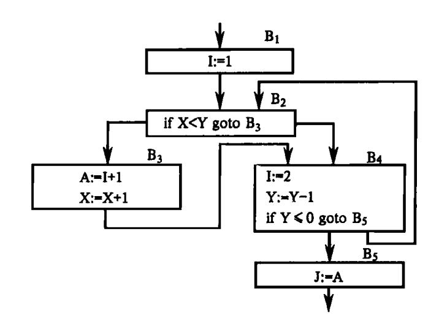

图 10.15 程序流图

结点。同时循环中除  $B_4$  外,其它地方没有 I 的定值点,所以,它符合前面两个例子所提的条件。试问:能否把  $B_4$  中 I: = 2 外提呢? 我们注意到,循环中  $B_3$  的 I 的引用点,不仅  $B_4$  中 I 的定值能到达,而且  $B_1$  中 I 的定值也能到达。现考虑进入循环前 X = 0 和 Y = 2 的情况,循环的执行流程是  $B_2B_3B_4B_2B_4B_5$ ,当到达  $B_5$  时,A 的值为 2,从而 J 的值也为 2。但如果把  $B_4$  中 I: = 2 外提,则到达  $B_5$  时,A 的值为 3,从而 J 的值也为 3。

这里我们看到,当把循环不变运算  $A_{:} = B$  op C 外提时,要求循环中 A 的所有引用点都是而且仅仅是这个定值所能到达的。

根据以上讨论,我们下面介绍查找循环不变运算和代码外提的算法,假定已进行了有 关数据流分析。

以下是查找循环L的不变运算的算法。

- (1)依次查看 L 中各基本块的每个代码,如果它的每个运算对象或为常数,或者定值 点在 L 外(根据数据流分析可知),则将此代码标记为"不变运算"。
  - (2) 重复第(3) 步直至没有新的代码被标记为"不变运算"为止。
- (3)依次查看尚未被标记为"不变运算"的代码,如果它的每个运算对象或为常数,或 定值点在 L 之外,或只有一个到达一定值点且该点上的代码已标记为"不变运算",则把被 查看的代码标记为"不变运算"。
  - 以下是代码外提算法。
  - (1)求出循环 L 的所有不变运算。
- (2)对步骤 1 所求得的每一不变运算 s:A:=B op C 或 A:=B,检查它是否满足以下条件①或②:
  - ①(i)s 所在的结点是 L 的所有出口结点的必经结点;
    - (ii)A在L中其它地方未再定值;
    - (iii)L中所有 A 的引用点只有 s 中 A 的定值才能到达。
- ②A 在离开 L 后不再是活跃的,并且条件①的(ii)和(iii)成立。所谓 A 在离开 L 后不再是活跃的是指,A 在 L 的任何出口结点的后继结点(当然是指那些不属于 L 的后继)的人口处不是活跃的。

{19}------------------------------------------------

(3)按步骤(1)所找出的不变运算的顺序,依次把符合(2)的条件①或②的不变运算 s 外提到 L 的前置结点中。但是,如果 s 的运算对象(B 或 C)是在 L 中定值的,那么,只有当 这些定值代码都已外提到前置结点中时,才可能把 s 也外提到前置结点中。

注意:如果把满足条件(2)②的不变运算 A: = B op C 外提到前置结点中,那么,执行 完循环后得到的 A 值,可能与不进行外提的情形所得 A 值不同。但是,因为离开循环后不会引用该 A 值,所以不影响程序运行结果。

### 10.3.2 强度削弱

我们要介绍的第二种循环优化称为**强度削弱**。强度削弱是指把程序中执行时间较长 的运算替换为执行时间较短的运算。例如把循环中的乘法运算用递归加法运算来替换。

例 10.9 考察图 10.12 的流图,其中 $\{B_2,B_3\}$ 是循环, $B_2$ 是循环的人口结点。我们注意到,(13)中的 I是一个递归赋值的变量,每循环一次,其值增加一个常量 1。另外,(4)和(8)计算  $T_2$  和  $T_6$  的值时,都要引用 I 的值,并且  $T_2$  和  $T_6$  都是 I 的线性函数;每循环一次, I 增加一个常量 1, $T_2$  和  $T_6$  分别增加一个常量 10。因此,如果把(4)和(8)外提到循环前置结点  $B_2$ '中,那么,只要在 I:=I+1 的后面,给  $T_2$  和  $T_6$  分别增加一个常量  $T_6$  10,如图 10.16 所示,程序的运行结果仍保持不变。

经过上述变换,循环中原来的乘法运算(4)和(8),已被替换为在循环前置结点中进行一次乘法运算(即计算初值)和循环中递归赋值的加法运算(4')和(8')。不仅加法运算一般比乘法快,而且这种在循环前计算初值再在循环末尾加上常数增量的运算,可利用变址器提高运算速度,从而使运算的强度得到削弱。所以,我们称这种变换为强度削弱。

强度削弱不仅可对乘法运算实行,对加法运算也可实行。例如,在图 10.16 中,我们由 (4')和(8')看到, $T_2$  和  $T_6$  也都是递归赋值的变量,每循环一次,它们分别增加一个常量 10。另外,(5)中计算  $T_3$  的值时要引用  $T_2$  的值,它的另一运算对象是循环不变量  $T_1$ ,所以,每循环一次, $T_3$  的值增量与  $T_2$  同,即常数 10。又(9)中计算  $T_7$  值的增量与  $T_6$  同,即常数 10。因此,我们又可对  $T_3$  和  $T_7$  进行强度削弱,即把(5)和(9)分别外提到前置结点  $B_2$ '中,同时在(8')后面分别给  $T_3$  和  $T_7$  增加一个常量 10。进行以上强度削弱后的结果如图 10.17 所示。

从前例,我们看到:

- (1)如果循环中有 I 的递归赋值 I: = I ± C(C 为循环不变量),并且循环中 T 的赋值运算可化归为 T: = K \* I ±  $C_1$ (K 和  $C_1$  为循环不变量),那么,T 的赋值运算可以进行强度削弱。
- (2)进行强度削弱后,循环中可能出现一些新的无用赋值,例如图 10.17 中的(4')和(8')。因为循环中现在不再引用  $T_2$  和  $T_6$ ,如果它们在循环出口之后不是活跃变量,那么,(4')和(8')还可从循环中删除。这里的  $T_2$  和  $T_6$  是临时变量,它们一般不会是循环出口之后的活跃变量。
- (3)循环中下标变量的地址计算是很费时间的,这里介绍的方法对削弱下标变量地址 计算的强度是非常有效的。前面的例子中,数组是二维的,如果我们考察一个三维或更高 维数组的下标变量地址计算,将会进一步看到强度削弱的作用。对下标变量地址计算来 说,强度削弱实际就是实现下标变量地址的递归计算。

{20}------------------------------------------------

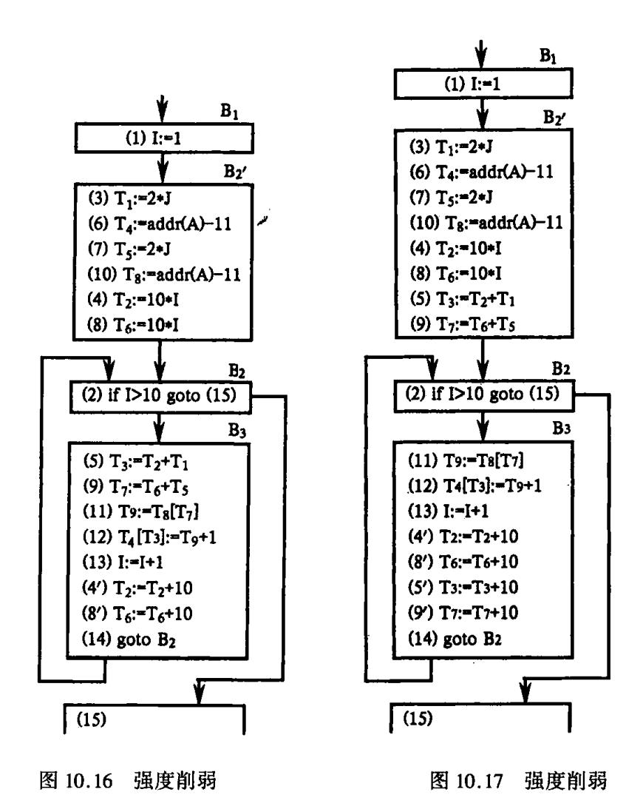

### 10.3.3 删除归纳变量

我们要介绍的第三种循环优化是**删除归纳变量**。先介绍基本归纳变量和归纳变量的 定义。

如果循环中对变量 I 只有唯一的形如 I: = I  $\pm$  C 的赋值,且其中 C 为循环不变量,则称 I 为循环中的基本归纳变量。

如果 I 是循环中一基本归纳变量, J 在循环中的定值总是可化归为 I 的同一线性函数, 也即  $J = C_1 * I \pm C_2$ , 其中  $C_1$  和  $C_2$  都是循环不变量, 则称 J 是**归纳变量**, 并称它与 I 同族。一个基本归纳变量也是一归纳变量。

例 10.10 考察图 10.12 的流图,显然 I 是循环 $\{B_2, B_3\}$  中的基本归纳变量,  $T_2$  和  $T_6$  是循环中与 I 同族的归纳变量。

另外,因  $T_3$  唯一地在(5)中被定值,由(5)和(4)容易看出, $T_3$  与基本归纳变量 I 的值在循环中始终保持着以下线性关系: $T_3$ :=  $10 * I + T_1$ ,其中  $T_1$  是循环不变量,所以  $T_3$  是循环中与 I 同族的归纳变量。

又  $T_7$  唯一地在(9)中被定值,由(9)和(8)容易看出, $T_7$  与基本归纳变量 I 的值在循环中始终保持着以下线性关系: $T_7$ : =  $10 \times I + T_5$ ,其中  $T_5$  是循环不变量,所以  $T_7$  也是循环中与 I 同族的归纳变量。

{21}------------------------------------------------

一个基本归纳变量除用于其自身的递归定值外,往往只在循环中用来计算其它归纳变量以及用来控制循环的进行。例如,图 10.12 的流图,经过强度削弱后,变成图 10.17。图 10.17中的 I,除在(13)用于其自身的递归定值外,只是唯一地在(2)中用来控制循环的进行。这时,我们可用与 I 同族的某一归纳变量来替换循环控制条件中的 I。例如, $T_3$ (还有  $T_2$  和  $T_7$ )是与 I 同族的归纳变量并且  $T_3$  与 I 的值在循环中始终保持以下线性关系:  $T_3$ : =  $10 * I + T_1$ ,所以 I > 10 和  $T_3 > 100 + T$  等价。于是我们可用  $T_3 > 100 + T_1$  来替换 I > 10,即把(2)变换为

(21) R: = 
$$100 + T_1$$
  
(22) if  $T_3 > R$  goto (15)

其中,R 是新引入的临时变量。进行上述变换之后,我们就可把(13)从流图中删除,这正是我们进行上述变换的目的。这种优化称为删除归纳变量,或称变换循环控制条件。从图 10.17 删除基本归纳变量后的结果如图 10.18 所示。其中假定  $T_2$  和  $T_6$  在循环出口之后不是活跃的,因而同时删去了无用赋值(4')和(8')。注意,如果我们选取  $T_2$ (或  $T_6$ )来替换  $I_1$ ,那么,(4')(或(8'))就不能删除了。

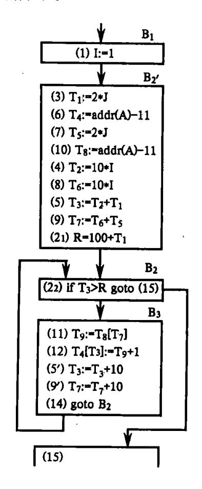

图 10.18 强度削弱与删除归纳变量

删除归纳变量是在强度削弱以后进行的。下面,我们统一给出强度削弱和删除归纳变量的算法框架,其步骤如下。

- (1)利用循环不变运算信息,找出循环中所有基本归纳变量。
- (2)找出所有其它归纳变量 A,并找出 A 与已知基本归纳变量 X 的同族线性函数关系

{22}------------------------------------------------

 $F_A(X)_{\circ}$ 

- (3)对 2 中找出的每一归纳变量 A,进行强度削弱。
- (4)删除对归纳变量的无用赋值。
- (5)删除基本归纳变量。如果基本归纳变量 B 在循环出口之后不是活跃的,并且在循环中,除在其自身的递归赋值中被引用外,只在形如

if B rop Y goto L

中被引用,则可选取一与 B 同族的归纳变量 M 来替换 B 进行条件控制。最后删除循环中对 B 的递归赋值的代码。

## \*10.4 数据流分析

涉及多个基本块范围的优化通常依赖于对程序的可能执行路径的分析。分析数据的值在基本块之间是如何被修改的,这种工作就是**全局数据流分析**。通常一个程序中基本块的确切的执行次序是不可能提前知道的。因此,我们执行数据流分析时假定流图中所有路径都是有可能执行的。基于这种分析的优化对于程序无论执行哪条路径都是有效的。

### 10.4.1 任意路径数据流分析

我们首先通过解决一个相当简单的问题,即活跃变量的识别问题,来引入数据流分析。前面我们曾经说过,所谓活跃变量就是它的当前值还将被引用(在赋予一个新值之前)。在全局范围来分析的话,一个变量是活跃的,如果存在一条路径使得该变量被重新定值之前它的当前值还要被引用。

通过全局活跃变量分析,我们能识别出其当前值不再活跃(即,它的值已经死了)的那些变量。死变量的值在基本块的出口处不需要保存。

令 B 为一个基本块,定义 LiveIn(B)为在基本块 B 入口处为活跃的变量的集合。同样,定义 LiveOut(B)为基本块 B 的出口处的活跃变量的集合。LiveIn 和 LiveOut 并不是相互独立的,令 S(B)为流图中基本块 B 的后继的集合,则有

$$LiveOut(B) = \bigcup LiveIn(i)$$
$$i \in S(B)$$

也就是说,一个变量在基本块的出口处是活跃的仅当它在本基本块的某个后继的人口处为活跃的。如果基本块没有后继,则其 LiveOut 为空。

令 LiveUse(B)为 B 中被定值之前要引用的变量的集合。LiveUse(B)是一个集合常量,这个集合由基本块 B 中的语句唯一确定。容易看出,如果 v∈ LiveUse(B),则 v∈ LiveIn(B);即 LinveIn(B) ⊃ LiveUse(B)。

令 Def(B)为在 B 中定值的变量集合。Def(B)也是一个集合常量,它由 B 中的语句确定。Def 可由构造基本块 B 时计算出来。如果一个变量在基本块 B 的出口处为活跃的且  $v \notin Def(B)$ ,则它在 B 的人口处也是活跃的,即:

 $LiveIn(B) \supseteq LiveOut(B) - Def(B)_{\circ}$ 

通过分析我们可以得知一个变量在基本块入口处为活跃的,则一定有:或者它在基本

{23}------------------------------------------------

块的 LiveUse 集中,或者它在基本块的出口处为活跃的且在基本块中没有重新定值。因此,有下面等式:

为了使以上分析更直观,我们考虑下面例子。

相应的流图见图 10.19。

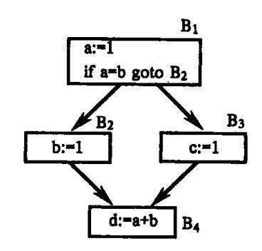

图 10.19 用于活跃变量分析的流图

从每个基本块,我们首先可以提取 Def 和 LiveUse 集合:

| 基本块            | Def | LiveUse |
|----------------|-----|---------|
| B <sub>1</sub> | {a} | {b}     |
| B <sub>2</sub> | {b} | Ø       |
| B <sub>3</sub> | (c) | Ø       |
| B <sub>4</sub> | {d} | {a,b}   |

从最后一个基本块开始由后往前计算,可以得到一定的解。事实上,我们的分析是从变量的引用点回到它们的定值点,因此,活跃变量的检测有时称为向后流(backward - flow)问题。我们还将看到,解决有些别的数据流问题时,信息流的方向与控制流是一致的,称之为向前流(forward - flow)问题。

因为 
$$B_4$$
 无后继,我们得到 LiveOut( $B_4$ ) =  $\emptyset$ ,因此:

$$LiveIn(B_4) = LiveUse(B_4) = \{a,b\}$$
 现在

LiveOut(
$$B_2$$
) = LiveIn( $B_4$ ) = {a,b}  
LiveOut( $B_3$ ) = LiveIn( $B_4$ ) = {a,b}

在 B<sub>2</sub> 或 B<sub>3</sub> 中没有变量引用,所以有:

{24}------------------------------------------------

LiveIn(B<sub>2</sub>) = LiveOut(B<sub>2</sub>) - Def(B<sub>2</sub>) = {a,b} - {b} = {a}  
LiveIn(B<sub>3</sub>) = LiveOut(B<sub>3</sub>) - Def(B<sub>3</sub>) = {a,b} - {c} = {a,b}  
LiveOut(B<sub>1</sub>) = LiveIn(B<sub>2</sub>) 
$$\bigcup$$
 LiveIn(B<sub>3</sub>) = {a}  $\bigcup$  {a,b} = {a,b}

### 最后

LiveIn( $B_1$ ) = LiveUse( $B_1$ )  $\cup$  (LiveOut( $B_1$ ) - Def( $B_1$ )) =  $\{b\}$   $\cup$  ( $\{a,b\}$  -  $\{a\}$ ) =  $\{b\}$  对以上分析进行归纳,有:

| 基本块            | LiveIn       | LiveOut |
|----------------|--------------|---------|
| $B_1$          | { <b>b</b> } | {a,b}   |
| B <sub>2</sub> | {a           | {a,b}   |
| B <sub>3</sub> | {a,b}        | {a,b}   |
| B <sub>4</sub> | {a,b}        | Ø       |

这个例子解释了活跃变量分析的另一种用法。如果一个变量在程序起始基本块的入口处是活跃的,则变量可能在定值之前被引用,这种定值之前被引用是错误的。在本例中,LiveIn( $B_1$ ) =  $\{b\}$ , b 在定值之前被引用。

如果我们规定流图只有一个唯一的开始结点(无前驱),并且有一个或多个结束结点(无后继),则数据流方程是可解的。思想是,从基本块所产生的值(例子中的 LiveUse 集合)开始,然后这些值向前驱传播,除掉基本块内死了的值(例子中的 Def 集合),一直迭代下去直到求出所有集合。

数据流问题的解不一定唯一。考察图 10.20 的流图,其中有一个简单的循环。在这个流图中,没有对任何变量定值, a 在  $B_4$  中被引用。应用向后流方法传播可以得到一个最明显的解,即四个基本块的 LiveIn 集合均为 $\{a\}$ 。但是,不太合理的解也是可能的。例如,下面解是有效的(从满足数据流方程这个意义上看):

| 基本块            | LiveIn | LiveOut |
|----------------|--------|---------|
| B <sub>1</sub> | {a,b}  | {a,b}   |
| B <sub>2</sub> | {a,b}  | {a,b}   |
| B <sub>3</sub> | {a,b}  | {a,b}   |
| B <sub>4</sub> | {a}    | Ø       |

这个解中令人注意的是,b 没有在任何基本块中被引用! 问题所在是基本块 B<sub>2</sub> 和 B<sub>2</sub> 互为 祖先;而且,因为 b 从未定值(所有 Def 集为空),一旦 b 被包括在 LiveIn 集合中,它就永远 消除不了。

我们对数据流方程可以按两种观点看。第一种观点,即所谓悲观的观点,如果我们在 所有的后继结点中没有看到明显的定值,就认为这些变量是活跃的。第二种观点,即按乐 观的观点,只有当我们看见一个变量在某个后继基本块中被引用了才认为这个变量是活 跃的。

乐观的观点是"最小的"有效解,它具有最小可能的 LiveIn 和 LiveOut 集选择。可以证明,最小解总是存在的。就优化目的而言,最小的活跃变量解是有好处的,因为活跃变量

{25}------------------------------------------------

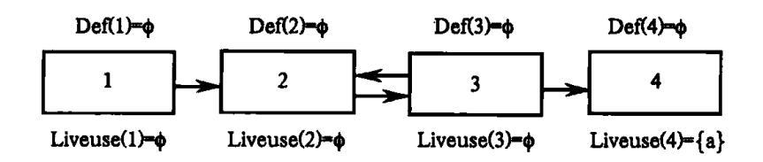

图 10.20 简单循环的流图

的值要保存而死变量的值可以忽略。换一句话说,只有当一个变量被实际发现在某个后继的基本块中被引用了,这个变量才能考虑是活跃的。

我们可以把检测可能没被初始化的变量的问题表示为一种向前数据流问题。向前数据流问题以与程序执行时控制流的相同方向跟踪信息流。

我们认为没被初始化的变量可能包含非法值。有些编译器,如 PL/C,把所有变量初始化为一个特别的值,而且在这个变量被引用之前要对它进行测试。通常的 Pascal 或 Ada 编译器对于限制变量或访问变量在引用之前要检查它们的合法性。

通过分析,我们确定在一个基本块的人口或出口处可能没被初始化的那些变量。没被初始化的变量在它们被引用之前测试。不在非初始化集中的变量一定具有合法的值,因此不需要在引用之前被检查。令 UninitIn(B)为在基本块 B 的人口处可能未被初始化的变量集。同时,令 UninitOut(B)为在基本块 B 的出口处可能未被初始化的变量集。一个变量在基本块的人口处未被初始化,如果它在 P(B)中的某基本块的出口处是未被初始化的,这里 P(B)代表流图中 B 的直接前驱的集合。即:

$$UninitIn(B) = \bigcup UninitOut(i)$$
$$i \in P(B)$$

如果一个基本块没有前驱,则它的 UninitIn 集合包含所有变量。令 Init(B)为在 B 的 出口处已知被初始化了的变量的集合。这个集合包括已知被赋为有效值的变量以及被引用之前被测试的变量。在后一种情况,一个非法值将会引起错误,而且,如果控制到了基本块的出口,则变量的值一定是已经有效了。从 Init(B)的定义,我们可以得出结论:

$$UninitOut(B) \supset UninitIn(B) - Init(B)$$

令 Uninit(B)为在 B 中变为没被初始化并且在基本块 B 中没有被重新赋值或测试的变量的集合。一个变量可能在下列情况变为未初始化的:被赋予一个非法值(如,null);一个操作的副作用(如,释放堆中的一个对象);或者刚刚建立的一个变量(例如在一个分程序中说明了局部变量)。容易看出,UninitOut(B)  $\supset$  Uninit(B)

UninitOut(B)由 UninitIn(B)加上变为未初始化的变量,减去已知要被初始化的变量而得到:

$$UninitOut(B) = Uninit(B) \cup (UninitIn(B) - Init(B))$$

因为 UninitOut 是由 UninitIn 计算而来的,所以这是一个向前流问题,信息流与控制流方向相同。与前面一样,解不是唯一的,因此,我们采用保守的方法并且假定在第一个基本块的人口处所有变量都是未初始化的。这一点保证了如果一个变量不是在到达基本块的所有路径中已知被初始化则就认为这变量是未初始化的。

### 10.4.2 全路径数据流分析

刚才讨论的数据流假定这么一个性质,即某条路径为真。因此,如果存在某条路径上

{26}------------------------------------------------

被引用这个变量就认为是活跃的;如果存在任何一条路径上没有适当地被初始化(或测试)则就认为这个变量是未被初始化的。这种数据流问题被称为任意路径问题。任意路径问题的解不能保证所需的性质一定会满足,仅仅是可能满足。

数据流问题也可以用**全路径**(all - path)形式来解决,使所需的性质在所有可能的路径都满足。对于全路径问题的解,所需的性质可以保证总是满足。

全路径问题的一个很好的例子是确定表达式的**可用性**(availability),这也是一个向前数据流问题。称这个表达式为**可用的**(available),如果它已经被计算且重新计算是多余的。可用性信息对实现全局公共子表达式优化是非常重要的。

我们先讨论如何确定基本块内对表达式的计算在基本块出口处是否可用的。我们定义表达式计算的相关变量集,把它与临时变量 T 联系起来,记这个集合为 RelVar(T)。计算 RelVar(T)的算法如图 10.21 所示。

Procedure ComputeRelvar(T)

/\* 计算相应于临时变量 T 的表达式的相关变量 \*/

begin

 $RelVar(T) := \{T\};$ 

While 存在临时变量 T'∈ RelVar(T) do

把 RelVar(T)中的 T'替换为用于计算 T'的变量和临时变量

end:

### 图 10.21 计算相关变量的程序

ComputeRelVar 递归地把临时变量替换为用于计算这个临时变量的变量和临时变量, 直到只剩下变量。

定义 AvailOut(B)为基本块 B的出口处可用的临时变量集合。定义 AvailIn(B)为 B的人口处的可用的临时变量集合。因为这是一个向前流问题,所以 AvailIn(B)依赖于 B的前驱结点的 AvailOut 值。现在我们要求临时变量必须在所有路径上预先计算,因此有:

AvailIn(B) = 
$$\bigcap$$
 AvailOut(i)  
i  $\in$  P(B)

我们自然假定在第一个基本块的人口处无可用的表达式。在下面两种情况表达式可 能在基本块出口处变为可用的。

- (1)它在基本块内计算并且最后一次计算后没有被杀死(注:一个表达式的值被杀死了是指,如果重新计算这个表达式的值将产生不同的结果)。这一点通过考察相关变量来确定。令 Computed(B)为在基本块 B 中被计算且没有被杀死的表达式的集合。
- (2)表达式在基本块出口处是可用的并且没有在基本块内被杀死。也就是说与表达式相关的变量没有在基本块内被赋值。令 Killed(B)为 B 中由于对相关变量赋值而被杀死的表达式集合。定义基本块出口处的可用性的方程为

$$AvailOut(B) = Computed(B) \cup (AvailIn(B) - Killed(B))$$

全路径的向后数据流问题也存在。例如确定非常忙表达式。如果在表达式被杀死之前的所有路径上都要引用这个表达式的值,则称该表达式为非常忙的。非常忙表达式为 寄存器分配的主要候选,因为我们知道它的值必须要引用。非常忙信息也可以用于指导代码外提。在一个循环中,如果循环不变运算是非常忙的,则把它提到循环之外是非常有

{27}------------------------------------------------

益的。

令 VeryBusyOut(B)为在基本块 B 的出口处非常忙的表达式集合并令 VeryBusyIn(B)为在 B 的人口处非常忙的表达式集合。则:

$$VeryBusyOut(B) = \bigcap VeryBusyIn (i)$$
$$i \in S(B)$$

我们假定在最后一个基本块的出口处没有非常忙表达式。

令 Used(B)为基本块 B 中被杀死之前引用的表达式集合,并令 Kill(B)为 B 中被引用之前杀死了的表达式集合。则有:

$$VeryBusyIn(B) = Used(B) \bigcup (VeryBusyOut(B) - Killed(B))$$

### 10.4.3 数据流问题的分类

从前面的讨论我们可知,数据流问题的分类是非常清楚的。对每个基本块有一个 In 集合和一个 Out 集合。对于向前流问题,Out 集合由基本块内的 In 集合计算出来,而 In 集合由基本块之间的 Out 集合计算出来。同样,对于向后流问题,In 集合由同一基本块的 Out 集合计算,而 Out 集合由基本块之间的 In 集合计算。

在同一基本块中, In 和 Out 集合的关系形如方程

$$In(B) = Used(B) \cup (Out(B) - Killed(B))$$

或

$$Out(B) = Used(B) \cup (In(B) - Killed(B))$$

取决于是向后流问题还是向前流问题。

在任何路径问题中,要计算前驱(或后继)值的并集;在全路径问题中,要计算前驱(或后继)值的交集。

最后,作为一个边界条件,向前流问题中的起始基本块的 In 和向后流问题中最后一个基本块的 Out 集合必须指明。通常,这些边界条件集或者为空,或者包含所有可能的值,因问题而定。

归纳起来,一般的形式可用表 10.1 解释。表中 Gen(B)表示 B中"生成"的集合。

|      | 向 前 流                                                                            | 向 后 流                                                                            |  |
|------|----------------------------------------------------------------------------------|----------------------------------------------------------------------------------|--|
| 任意路径 | $Out(B) = Gen(B) \cup (In(B) - Killed(B))$ $In(B) = \bigcup Out(i)$ $i \in P(B)$ | $In(B) = Gen(B) \cup (Out(B) - Killed(B))$ $Out(B) = \bigcup In(i)$ $i \in S(B)$ |  |
| 全路径  | $Out(B) = Gen(B) \cup (In(B) - Killed(B))$ $In(B) = \bigcap Out(i)$ $i \in P(B)$ | $In(B) = Gen(B) \cup (Out(B) - Killed(B))$ $Out(B) = \bigcap In(i)$ $i \in S(B)$ |  |

表 10.1 在数据流分析中使用的方程

### 10.4.4 其它主要的数据流问题

我们简单讨论一下其它数据流问题。任意路径的向前流分析可以用于计算"到达定值"集合。一个定值是基本块中对变量的任何赋值。一个变量 v 的定值到达 v 的某个引用点,如果存在一条从 v 的这个定值到引用点的路径并且中间没有对 v 重新定值。直观

{28}------------------------------------------------

地看,如果一个变量 v 的定值到达一个引用点,那么,这个定值就建立起了我们要引用的值。

作为一个标准的数据流问题,我们必须明确表达 In,Out,Gen 和 Kill 集合的含义。In 和 Out 集代表到达基本块的开头和结尾的定值集。这些集合包含变量定值的中间代码的地址。第一个基本块的 In 集合为空。基本块的 Gen 集合中包含出现在这个基本块中并到达基本块尾的定值。通常,如果在基本块中出现了同一变量的多次定值,则只有最后一定值到达基本块的尾。

对于在基本块内定值的每个变量 v, Kill 集合包含除了出现在 Gen 集中的那个定值点以外的其它所有 v 的定值点。Kill 集合"擦掉了"被基本块内局部定值取代了的那些定值。

像 Pascal 和 Ada 这样的语言,由于过程调用和别名的作用,确定到达定值是复杂的。特别地,如果我们调用一个子程序,或者给一个别名对象(数组或堆对象)赋值,一个变量可以被定值,也可能没被定值。我们称这种定值为二义的,因为不清楚定值是否会实际发生。在基本块中对变量的显式定值称为无二义的。基本块中的二义定值包含在 Gen 集中,但它们不会杀掉其它定值,因此对 Kill 集没有影响。事实上,它们可能增加新的定值,但不会像无二义定值一样清除定值。

到达定值有时用一种称为 **Ud** - **链**(使用 - 定值链)的数据结构来表示。一个 **Ud** - 链 是与一个变量的引用相联系的到达定值集。这种信息在优化之前收集,用于优化和代码产生阶段。

与 Ud - 链关联的是 **Du** - 链(定值 - 使用链)。一个 Du - 链是与一个变量的一次定值相关的变量引用的集合,即 Ud - 链允许我们找到可能引用基本块中某个点上对变量赋的值的所有中间代码。

Du - 链通过任意路径的向后流分析计算,与计算活跃变量类似。在这里,In 和 Out 集 表示可能引用变量的当前值的那些中间代码。最后一个基本块的 Out 集为空。Gen(B)是 在基本块 B 中变量被定值之前引用了变量的中间代码的集合。Kill(B)为引用了在基本 块 B 中定值的变量的中间代码的集合。

数据流分析可以用于确定复写传播。有时可以通过用 b 代替对 a 的引用从而消除形如 a: = b 的复写语句。如果 a: = b 是可以到达 a 的引用的唯一定值(可由 Ud - 链确定),并且如果这个复写语句之后没有对 b 的赋值,则对 a 的引用可用对 b 的引用代替。后一个条件通过全路径的向前流分析检查。令 In(B)为我们已知被执行且对其左右两边的变量没有重新赋值的复写语句的集合。In(B)中的复写语句为复写传播的候选者。Out(B)可以类似定义。第一个基本块的 In 集合为空。

Gen(B)为基本块 B 中的复写语句的集合,并且后面没有对这些复写语句的左右两边的变量重新赋值。Kill(B)为基本块 B 外的复写语句的集合,在 B 中对这些复写语句的左边或右边的变量重新赋了值。

例 10.12 考察 a:=d; if a=b then b:=1 

{29}------------------------------------------------

else c: = 1;a: = a + b;

a: = d 到达比较式 a = b 和加法 a + b。因为在这两个引用之前没有对 a 和 d 重新赋值,因此,可以实行复写传播。进一步,检查 a: = d 的 Du -链,我们发现 a 只用于两个地方,这两个地方都将用 d 代替。这样,使对 a 的赋值没有必要,所以我们可以得到:

if d = b then
b: = 1\nelse c: = 1;
a: = d + b;

### 10.4.5 利用数据流信息进行全局优化

在本节中,我们简单讨论如何把数据流分析收集到的信息实际用于各种全局优化。 我们只讨论其中的一部分优化,因为所有可能的优化非常多。

表 10.2 列出了我们讨论过的各种数据流分析,根据流向、路径形式和初始化条件分类。向前流问题的初始化条件定义了第一个基本块的 In 集合;向后流问题的初始化条件定义了最后一个基本块的 Out 集合。通常,集合的初始化值为空集(②)或全集(包含所有可能的值)。

| 路径   | 向 前 流            |        | 向 后 流  |     |
|------|------------------|--------|--------|-----|
|      | 问题               | 初始值    | 问题     | 初始值 |
| 任意路径 | 到达定值<br>(Ud – 链) | Ø      | 活跃变量   | Ø   |
|      | 未初始化变量           | 所有变量   | DU – 链 | Ø   |
| 全路径  | 有效表达式<br>复写传播    | Ø<br>Ø | 非常忙表达式 | Ø . |

表 10.2 全局优化和相应的数据流分析

利用这些信息,可以实现每一种数据流分析。现在的问题是什么时候进行这些分析 以及如何使用收集到的数据。下面我们来讨论这些问题。

### 非常忙表达式

前面说过,非常忙的循环不变运算是代码外提的极好候选。非常忙表达式信息还可以用来进行代码提升。

我们来重新描述一下非常忙表达式概念:如果从程序中某点 p 开始的任何一条通路上,在对 b 或 c 定值之前,都要计算表达式 b op c,那么,我们称表达式在点 p 非常忙。

例 10.13 考察图 10.22。其中从点 p 开始的任一通路,都要计算表达式 b op c,如果再没从 p 到  $d_1$  以及从 p 到  $d_2$  的所有通路上都没有对 b 和 c 重新定值,那么,b op c 在点 p 非常忙。

如果 b op c 在点 p 非常忙,我们就可以把 b op c 的计算提升到点 p 来进行。为此,在 点 p 设置一条代码 t: = b op c,然后把 d<sub>1</sub> 和 d<sub>2</sub> 中 b op c 的计算变换为引用 t。如图 10.23 所示。这种变换称为代码提升。这里应该特别注意的是,上述变换并不都能保证变换后的程序与变换前的程序等价。例如,考察图 10.24,b op c 在点 p 也是非常忙,但其中 d<sub>3</sub> 对

{30}------------------------------------------------

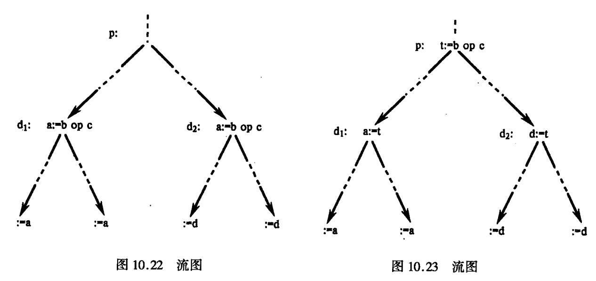

b 的定值可以不经过 p 到达  $d_2$ 。如果我们仍然进行上述变换,如图 10.25 所示,那么,除非到达  $d_2$  的其它 b 的定值都使得 b 取值为 1,否则,变换后的图 10.25 的程序就与图 10.23 的程序不等价。所以,在进行上述变换时,必须检查等价性(或称安全性)。为此,对被变换的每一  $d_2$  = b op c,除了 b op c 在点 p 非常忙的条件外,还要求任何能到达 d 的 b 和 c 的定值,必须首先经过 p。

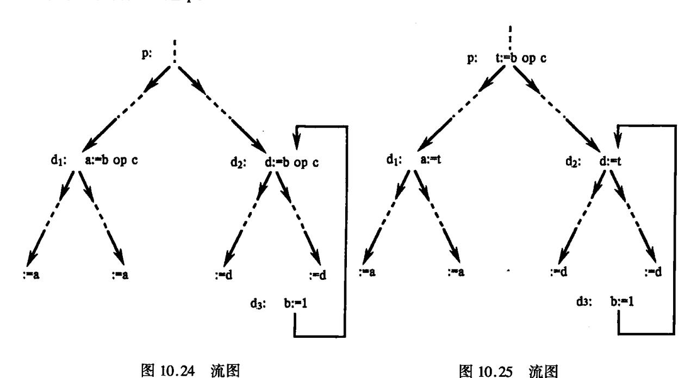

上述变换后会给程序带来什么改进呢?显然,从图 10.23 来看,程序并未得到任何改进。实际上,进行上述变换的目的,在于通过它进一步进行复写传播并把传播后的复写删除。例如,考察图 10.23。如果能对 d<sub>1</sub> 和 d<sub>2</sub> 进行复写传播并把 d<sub>1</sub> 和 d<sub>2</sub> 删除,如图 10.26 所示,那么,虽然程序的运行时间没有什么节省也没有什么增加,但是,原来两条分别位于 d<sub>1</sub> 和 d<sub>2</sub> 的代码,现在已变换成一条位于点 p 的代码。这样,就节省了程序的存储空间。所以,仅当我们能够进一步达到这一目的时,才需要进行上述变换,否则就没有必要进行上述变换。

{31}------------------------------------------------

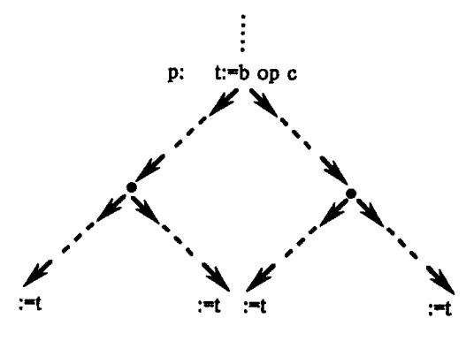

图 10.26 流图

### 删除全局公共子表达式

在10.2 节中我们讨论了删除局部公共子表达式的问题。我们看到如果表达式 E 在基本块 B 中多次计算,则冗余计算可以识别并删除。当仅仅进行局部优化时,基本块内对每个表达式的第一次计算总不会冗余。然而,当进行全局公共子表达式优化时,如果表达式的值在前驱基本块中计算过了,那么基本块内表达式的第一次计算也会变为冗余。图 10.27 给出的算法 RemoveGlobalCSEs 可以识别和消除基本块中冗余的第一次表达式计算。我们假设其它冗余表达式计算已由局部优化删除。识别出来的每个全局公共子表达式有一个临时变量,它拥有的值是跨基本块的。

procedure RemoveGloblCSEs

/\* 找基本块中冗余的第一次表达式计算并删除它 \*/

begin

计算全局公共子表达式集合 GlobalCSE(即在一个以上基本块中 计算的表达式集合);

for GlobalCSE 集中的每个表达式 E do

begin

对 E 进行可用表达式数据流分析:

给 E 分配一个临时单元,记为 t(E)

end;

for 每个基本块 B do

for GlobalCSE 中的每个表达式 E do

if E 在 B 中计算且 E 在 B 的入口处为可用的

then 删除 B 中 E 的第一次计算并把它替换为引用 t(E)

end;

图 10.27 删除全局公共子表达式算法

### 活跃变量分析

活跃变量的值必须在基本块的出口处保存起来,而死变量的值则不必保存。类似地,如果执行了删除全局公共子表达式,则需要在基本块之间保存公共子表达式的值。特别是,如果拥有公共子表达式值的单元被看作变量,则这个单元是活跃的时必须保存它的值。

图 10.28 给出了一个算法 RemoveDeadStores,它定位对死变量赋值的指令并删除之。

{32}------------------------------------------------

procedure RemoveDeadStores;

/\* 找出不必要的对死变量及全局公共子表达式的赋值并删除它们 \*/

begin

for 每个基本块 B do

for 每个代表变量或全局公共子表达式的单元 v do

begin

if B中对 v 的赋值是在所有对 v 的引用之后 then 对 v 进行活跃变量分析;

if 出了 B 之后 v 不再活跃 then 从 B 中删除对 v 的这个赋值

end

end:

图 10.28 删除对死变量的赋值

### 未初始化变量分析

在诊断编译程序中,识别潜在的未初始化变量是非常重要的。一旦识别出一个未初始化变量将发出警告并进行运行时的检查以检测可能产生的对未初始化变量的非法引用。

图 10.29 中的算法 FindUninitializedVars 找出对未初始化变量的可能使用并且或者发出编译警告,或者产生运行时检测非法引用未初始化变量的代码。

procedure FindUninitializedVars;

/\* 找对未初始化变量的可能引用 \*/

begin

进行未初始化变量数据流分析;

for 每个基本块 B do

for B中变量 v 的每次使用 do

if(这是 B中 v 的第一次引用且在 B的人口处 v 是未初始化的) or(v 的最后

一次引用后使 v 变为未初始化的)then

发出一个 v 可能未被初始化的警告 或产生代码以检测 v 是否适当初始化

end;

图 10.29 找未初始化变量的可能引用

#### 常量传播和复写传播

通常,编译程序知道在程序中给定的点上某个变量具有一个特殊值。我们可以把这个变量当作"命名常量",并用这个值代替它。这种优化称为常量传播。在没有命名常量的语言(如 Fortran)中,这种优化特别有用。即使在包含命名常量的语言中,常量传播有时也能改进代码质量。如

a: = 100

b := b + a

...

{33}------------------------------------------------

可以优化为

a: = 100 ... b: = b + 100

在10.1节中曾介绍过复写传播。可以认为常量传播是复写传播的特例。

图 10.30 给出了一个算法 Propagate, 它识别可以进行的常量或复写传播情况。如果可能,应该简化表达式,以便带来新的优化机会。

procedure Propagate: /\* 传播常量或变量赋值并简化结果表达式 \*/ begin 进行到达定值数据流分析: 进行 Ud - 链数据流分析; 进行复写传播数据流分析: 标记程序中所有变量引用: for 变量 v 的每个被标记的引用 do begin 去掉 v 的这个引用标记; if 到达 v 的这个引用的唯一定值为 v: = c,这里 c 为常量 then begin 用 c 代替 v 的这个引用并尽量简化表达式: if 这个替换和简化建立了一个常量赋值 x: = k then begin 用 x:=k 代替原来的赋值; 标记这个赋值可以到达的 x 的所有引用 end; 从 v: = c 的 Du - 链中去掉对 v 的这个引用 else if 复写传播分析表明到达 v 的这个引用的唯一定值为 v:=x, 这里 x 为一个变量 then begin 用 x 代替 v 的这个引用; 从 v: = x 的 Du - 链中去掉 v 的这个引用 end: end: for 变量 v 的每个定值 do if 这个定值的所有引用都因常量或复写传播而消除 then 从程序中删除这个定值; for 每个变量 do

end:

图 10.30 常量传播和复写传播算法

if 这个变量的所有引用已被消除 then

把这个变量从程序中删除:

{34}------------------------------------------------

## 练 习

1. 试把以下程序划分为基本块并作出其程序流图。

read C

A: = 0

B:=1

 $L_1:A:=A+B$ 

if  $B \ge C$  goto  $L_2$ 

 $B_{:} = B + 1$ 

goto L<sub>1</sub>

L<sub>2</sub>:write A

halt

2. 试把以下程序划分为基本块并作出其程序流图。

read A, B

F:=1

C:=A\*A

D := B \* B

if C < D goto  $L_1$ 

 $\mathbf{E} := \mathbf{A} * \mathbf{A}$ 

F:=F+1

 $E_{:} = E + F$ 

write E

halt

 $L_1:E:=B*B$ 

 $\mathbf{F:} = \mathbf{F} + \mathbf{2}$ 

E:=E+F

write E

if E > 100 goto  $L_2$ 

halt

 $L_2:F:=F-1$ 

goto L<sub>1</sub>

3. 试对以下基本块 B<sub>1</sub> 和 B<sub>2</sub>:

 $B_1: A_2 = B * C$ 

 $B_2: B: = 3$ 

D: = B/C

D:=A+C

E: = A + DF: = 2 \* E

E: = A \* CG: = B \* F

G: = B \* C

H: = A + C

{35}------------------------------------------------

$$H: = G * G$$

分别应用 DAG 对它们进行优化,并就以下两种情况分别写出优化后的四元式序列:

- (1)假设只有 G,L,M 在基本块后面还要被引用;
- (2)假设只有 L 在基本块后面还要被引用。
- 4. 对以下四元式程序,对其中循环进行循环优化。

I: 
$$= 1$$

read J, K

$$L:A:=K*I$$

$$B:=J*I$$

$$C: = A * B$$

write C

$$I_{:} = I + 1$$

halt

5. 以下程序是某程序的最内循环,试对它进行循环优化。

$$A := 0$$

$$I_{:} = 1$$

$$L_1:B:=J+1$$

$$C: = B + I$$

$$A := C + A$$

if 
$$I = 100$$
 goto  $L_2$ 

$$I: = I + 1$$

goto L<sub>1</sub>

 $L_2$ :

6. 试写出以下程序段

for 
$$i := 1$$
 to  $M$  do  
for  $j := 1$  to  $N$  do  
 $A[i,j] := B[i,j]$ 

的四元式中间代码,然后求出其中的循环,并进行循环优化。

7. 下面是应用筛法求 2 到 N 之间素数个数的程序:

begin

for 
$$i := 2$$
 to N do

{36}------------------------------------------------

```
begin
for j: = 2 * i to N by i do
A[j] := false \quad /*j 可被 i 除尽 * /\nend;
COUNT := 0;
for i: = 2 to N do
    if A[i] then COUNT := COUNT + 1;
print COUNT
```

end

- (1) 试写出其四元式中间代码,假设对数组 A 用静态分配分配存储单元;
- (2) 作出流图并求其中的循环;
- (3) 进行代码外提;
- (4) 进行强度削弱和删除归纳变量。