{0}------------------------------------------------

# 第四章 语法分析——自上而下分析

在第三章,用正规式描述了单词符号的结构,并研究了如何用有限自动机构造词法分析器的问题。由于正规式与正规文法是等价的,它们的描述能力有限,而高级语言的语法结构适合用上下文无关文法描述,因此,我们将上下文无关文法用作语法分析的基础。本章和下一章,我们将介绍编译程序构造中的一些典型的语法分析方法。

## 4.1 语法分析器的功能

语法分析是编译过程的核心部分。它的任务是在词法分析识别出单词符号串的基础上,分析并判定程序的语法结构是否符合语法规则。语法分析器在编译程序中的地位如图 4.1 所示。

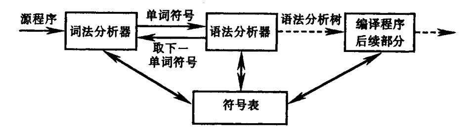

图 4.1 语法分析器在编译程序中的地位

我们知道,语言的语法结构是用上下文无关文法描述的。因此,语法分析器的工作本质上就是按文法的产生式,识别输入符号串是否为一个句子。这里所说的输入串是指由单词符号(文法的终结符)组成的有限序列。对一个文法,当给你一串(终结)符号时,怎样知道它是不是该文法的一个句子("程序")呢?这就要判断,看是否能从文法的开始符号出发推导出这个输入串。或者,从概念上讲,就是要建立一棵与输入串相匹配的语法分析树。

按照语法分析树的建立方法,我们可以粗略地把语法分析办法分成两类,一类是自上 · 而下分析法,另一类是自下而上分析法。本章主要介绍自上而下分析法,下一章我们将介绍自下而上分析法。

## 4.2 自上而下分析面临的问题

现在来讨论自上而下的语法分析方法。顾名思义,自上而下就是从文法的开始符号出发,向下推导,推出句子。我们首先将简单地介绍自上而下分析的一般方法。这种方法是带"回溯"的。下一节,将着重讨论一种广为使用的不带回溯的递归子程序(递归下降)

{1}------------------------------------------------

分析方法。

自上而下分析的主旨是,对任何输入串,试图用一切可能的办法,从文法开始符号(根结)出发,自上而下地为输入串建立一棵语法树。或者说,为输入串寻找一个最左推导。这种分析过程本质上是一种试探过程,是反复使用不同产生式谋求匹配输入串的过程。我们用一个简单例子来说明这种过程。

#### 例 4.1 假定有文法

(1) 
$$S \rightarrow xAy$$
  
(2)  $A \rightarrow x + |x|$  (4.1)

以及输入串 x\*y(记为 α)。为了自上而下构造 α 的语法树,我们首先按文法的开始符号产生根结 S,并让指示器 IP 指向输入串的第一个符号 x。然后,用 S 的规则(此处关于 S 的规则仅有一条)把这棵树发展为

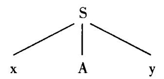

我们希望用 S 的子结从左至右匹配整个输入串  $\alpha$ 。首先,此树的最左子结是以终结符 x 为标志的子结,它和输入串的第一个符号相匹配。于是,我们应把 IP 调整为指向下一输入符号 \* ,并让第二个子结 A 去进行匹配。非终结符 A 有两个候选,我们试着用它的第一个候选去匹配输入串,于是把语法树发展为

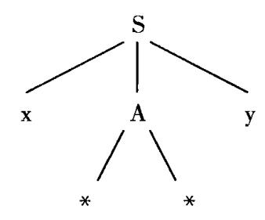

子树 A 的最左子结和 IP 所指的符号 \* 相符,然后我们再把 IP 调为指向下一符号并让 A 的第二个子结进入工作。但 A 的第二子结 \* 和 IP 当前所指的符号 y 不一致。因此,A 告失败。这意味着 A 的第一个候选此刻不适用于构造 α 的语法树。这时应该回头(回溯),看 A 是否还有别的候选。

为了这种回溯,我们一方面应把 A 的第一个候选所发展的子树注销掉,另一方面应把 IP 恢复为进入 A 时的原值,也就是让它重新指向第二个输入符号\*。现在我们试探 A 的第二个候选,即考虑如下的语法树:

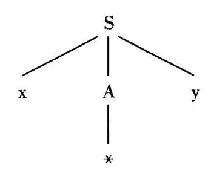

{2}------------------------------------------------

由于子树 A 只有一个子结\*而且它和 IP 所指的符号相一致,于是, A 完成了匹配任务。在 A 获得匹配后,指示器 IP 应指向下一个未被触及符号 y。

在 S 的第二子结 A 完成匹配后,接着就轮到第三个子结 y 进行工作。由于这个子结 和最后一个输入符号相符,于是,我们完成了为  $\alpha$  构造语法树的任务,证明了  $\alpha$  是一个句子。

实现这种自上而下的带回溯试探法的一个简单途径是让每个非终结符对应一个递归子程序。每个这种子程序可作为一个布尔过程。一旦发现它的某个候选与输入串相匹配,就用这个候选去扩展语法树,并返回"真"值;否则,保持原来的语法树和 IP 值不变,并返回"假"值。

上述这种自上而下分析法存在许多困难和缺点。

首先,是文法的左递归性问题。一个文法是含有**左递归**的,如果存在非终结符 P

$$P \stackrel{+}{\Rightarrow} P\alpha$$

含有左递归的文法将使上述的自上而下的分析过程陷入无限循环。即,当试图用 P 去匹配输入串时,我们会发现,在没有识别任何输入符号的情况下,又得重新要求 P 去进行新的匹配。因此,使用自上而下分析法必须消除文法的左递归性。

其次,由于回溯,就碰到一大堆麻烦事情。如果我们走了一大段错路,最后必须回头,那么,就应把已经做的一大堆语义工作(指中间代码产生工作和各种表格的簿记工作)推倒重来。这些事情既麻烦又费时间,所以,最好应设法消除回溯。

第三,在上述的自上而下分析过程中,当一个非终结符用某一候选匹配成功时,这种成功可能仅是暂时的。例如,就文法(4.1)而言,考虑输入串 x \* \* y。若对 A 首先使用第二个候选式,A 将成功地把它的唯一子结 \* 匹配于输入串的第二个符号。但 S 的第三个子结 y 与第三个输入符号 \* 不匹配。因而,导致了无法识别输入串 x \* \* y 是一个句子的事实。然而,若 A 首先使用它的第一个候选 \* \* ,则整个输入串即可获得成功分析。这意味着,A 首先使用第二个候选所得的成功匹配是虚假的。由于这种虚假现象,我们需要更复杂的回溯技术。一般说,要消除虚假匹配是很困难的。但若从最长的候选开始匹配,虚假匹配的现象就会减少一些。

第四,当最终报告分析不成功时,我们难于知道输入串中出错的确切位置。

最后,由于带回溯的自上而下分析实际上采用了一种穷尽一切可能的试探法,因此,效率很低,代价极高。严重的低效使得这种分析法只有理论意义,而在实践上价值不大。

后面,我们将集中讨论不带回溯的自上而下分析法。

## 4.3 LL(1)分析法

我们前面已经说过,自上而下分析方法不允许文法含有任何左递归。为构造不带回溯的自上而下分析算法,首先要消除文法的左递归性,并找出克服回溯的充分必要条件。本节,我们将讨论消除左递归和克服回溯的方法。在后两节,将分别研究递归子程序分析算法及其变种一预测分析法。

{3}------------------------------------------------

#### 4.3.1 左递归的消除

直接消除见诸于产生式中的左递归是比较容易的。假定关于非终结符P的规则为

$$P \rightarrow P\alpha \mid \beta$$

其中,β不以 P开头。那么,我们可以把 P的规则改写为如下的非直接左递归形式:

这种形式和原来的形式是等价的,也就是说,从 P 推出的符号串是相同的。

例 4.2 文法

$$E \rightarrow E + T \mid T$$
 $T \rightarrow T * F \mid F$ 
 $F \rightarrow (E) \mid i$ 

经消去直接左递归后变成: E→TE′

$$E' \rightarrow + TE' \mid \varepsilon$$

$$T \rightarrow FT'$$

$$T' \rightarrow * FT' \mid \varepsilon$$

$$F \rightarrow (E) \mid i$$

$$(4.2)$$

一般而言,假定 P关于的全部产生式是

$$P \!\!\!\!\!\!\!\!\!\!\!\!\!\!\!\!\!\!\!\!\!\!\!\!\!\!\!\!\!\!\!\!\!\!\!\!$$

其中,每个  $\alpha$  都不等于  $\epsilon$ ,而每个  $\beta$  都不以 P 开头,那么,消除 P 的直接左递归性就是把这些规则改写成:

$$P \rightarrow \beta_1 P' | \beta_2 P' | \cdots | \beta_n P'$$

$$P' \rightarrow \alpha_1 P' | \alpha_2 P' | \cdots | \alpha_m P' | \varepsilon$$

使用这个办法,我们容易把见诸于表面上的所有直接左递归都消除掉,也就是说,把直接左递归都改成直接右递归。但这并不意味着已经消除整个文法的左递归性。例如文法

$$S \rightarrow Qc \mid c$$
 $Q \rightarrow Rb \mid b$ 
 $R \rightarrow Sa \mid a$  (4.3)

虽不具有直接左递归,但S、Q、R都是左递归的,例如有

如何消除一个文法的一切左递归呢?虽然困难不少,但仍有可能。如果一个文法不

{4}------------------------------------------------

含回路(形如  $P \to P$  的推导),也不含以  $\varepsilon$  为右部的产生式,那么,执行下述算法将保证消除左递归(但改写后的文法可能含有以  $\varepsilon$  为右部的产生式)。

消除左递归算法:

- (1) 把文法 G 的所有非终结符按任一种顺序排列成  $P_1, P_2, \dots, P_n$ ;按此顺序执行;
- (2) FOR i := 1 TO n DO

**BEGIN** 

FOR j := 1 TO i-1 DO

把形如 P;→P;γ 的规则改写成

 $P_i \rightarrow \delta_i \gamma | \delta_i \gamma | \cdots | \delta_i \gamma$ 。其中  $P_i \rightarrow \delta_i | \delta_i | \cdots | \delta_i$  是关于  $P_i$  的所有规则;

消除关于 P. 规则的直接左递归性

**END** 

(3) 化简由(2)所得的文法。即去除那些从开始符号出发永远无法到达的非终结符的产生规则。

例 4.3 考虑文法(4.3),令它的非终结符的排序为  $R \setminus Q \setminus S$ 。对于 R,不存在直接左递归。把 R 代入到 Q 的有关候选后,我们把 Q 的规则变为

Q→Sablablb

现在的 Q 同样不含直接左递归,把它代入到 S 的有关候选后,S 变成

S-Sabelabelbele

经消除了S的直接左递归后,我们得到了整个文法为

S→abcS′ | bcS′ | cS′

S'→abcS' |ε

O→Sab|ab|b

R→Sala

显然,其中关于 Q 和 R 的规则已是多余的。经化简后所得的文法是:

$$S \rightarrow abcS' \mid bcS' \mid cS'$$

$$S' \rightarrow abcS' \mid \varepsilon$$
 (4.4)

注意,由于对非终结符排序的不同,最后所得的文法在形式上可能不一样。但不难证明,它们都是等价的。例如,若对文法(4.3)的非终结符排序选为 S、Q、R,那么,最后所得的无左递归文法是:

S→Qc|c

Q→Rb1b

$$R \rightarrow bcaR' | caR' | a R'$$
 (4.5)

R'→bca R' |ε

文法(4.4)和文法(4.5)的等价性是显然的。

{5}------------------------------------------------

#### 4.3.2 消除回溯、提左因子

欲构造行之有效的自上而下分析器,必须消除回溯。为了消除回溯就必须保证:对文法的任何非终结符,当要它去匹配输入申时,能够根据它所面临的输入符号准确地指派它的一个候选去执行任务,并且此候选的工作结果应是确信无疑的。也就是说,若此候选获得成功匹配,那么,这种匹配决不会是虚假的;若此候选无法完成匹配任务,则任何其它候选也肯定无法完成。换句话说,假定现在轮到非终结符 A 去执行匹配(或称识别)任务,A 共有 n 个候选  $\alpha_1,\alpha_2,\cdots,\alpha_n$ ,即  $A \rightarrow \alpha_1 \mid \alpha_2 \mid \cdots \mid \alpha_n$ 。 A 所面临的第一个输入符号为 a,如果 A 能够根据不同的输入符号指派相应的候选  $\alpha_i$  作为全权代表去执行任务,那就肯定无需回溯了。在这里 A 已不再是让某个候选去试探性地执行任务,而是根据所面临的输入符号 a 准确地指派唯一的一个候选。其次,被指派候选的工作成败完全代表了 A。

我们来看一看,在不得回溯的前提下,对文法有什么要求。前面已经说过,欲实行自上而下分析,文法不得含有左递归。令 G 是一个不含左递归的文法,对 G 的所有非终结符的每个候选  $\alpha$  定义它的终结首符集  $FIRST(\alpha)$ 为

$$FIRST(\alpha) = \{a \mid \alpha \stackrel{*}{\Rightarrow} a \cdots, a \in V_T\}$$

特别是,若  $\alpha \stackrel{*}{\Rightarrow} \epsilon$ ,则规定  $\epsilon \in FIRST(\alpha)$ 。换句话说, $FIRST(\alpha)$ 是  $\alpha$  的所有可能推导的开头终结符或可能的  $\epsilon$ 。如果非终结符 A 的所有候选首符集两两不相交,即 A 的任何两个不同候选  $\alpha_i$  和  $\alpha_i$ 

$$\mathrm{FIRST}(\alpha_{\mathrm{i}}) \cap \mathrm{FIRST}(\alpha_{\mathrm{j}}) = \emptyset$$

那么,当要求 A 匹配输入串时, A 就能根据它所面临的第一个输入符号 a, 准确地指派某一个候选前去执行任务。这个候选就是那个终结首符集含 a 的 α。

应该指出,许多文法都存在那样的非终结符,它的所有候选的终结首符集并非两两不相交的。例如,通常关于条件句的产生式

语句→if 条件 then 语句 else 语句

lif 条件 then 语句

就是这样一种情形。

如何把一个文法改造成任何非终结符的所有候选首符集两两不相交呢? 其办法是, **提取公共左因子**。例如,假定关于 A 的规则是

 $A \rightarrow \delta \beta_1 | \delta \beta_2 | \cdots | \delta \beta_n | \gamma_1 | \gamma_2 | \cdots \gamma_m$  (其中,每个  $\gamma$  不以 δ 开头)

那么,可以把这些规则改写成

$$A \rightarrow \delta A' | \gamma_1 | \gamma_2 | \cdots | \gamma_m$$
$$A' \rightarrow \beta_1 | \beta_2 | \cdots | \beta_n$$

经过反复提取左因子,就能够把每个非终结符(包括新引进者)的所有候选首符集变成为两两不相交。我们为此付出的代价是,大量引进新的非终结符和  $\varepsilon$  – 产生式。

### 4.3.3 LL(1)分析条件

当一个文法不含左递归,并且满足每个非终结的所有候选首符集两两不相交的条件,

{6}------------------------------------------------

是不是就一定能进行有效的自上而下分析了呢? 如果空字  $\varepsilon$  属于某个非终结符的候选首符集,那么,问题就比较复杂。

例 4.4 考虑文法(4.2),对输入串 i+i进行自上而下分析。首先,从开始符号 E 出发匹配输入串,面临的第一个输入符号为 i,由于 E 只有一个候选 TE',且 i 属于 FIRST (TE'),所以使用 E→TE'进行推导。

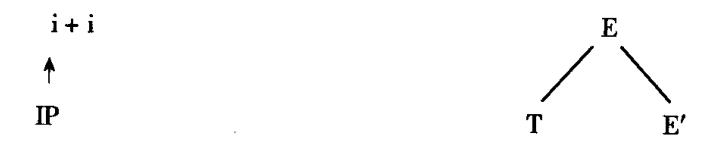

接下来,要从T出发匹配一部分输入串,面临的输入符号还是i,由于i∈FIRST(FT'),所以用 T→FT'进行推导。

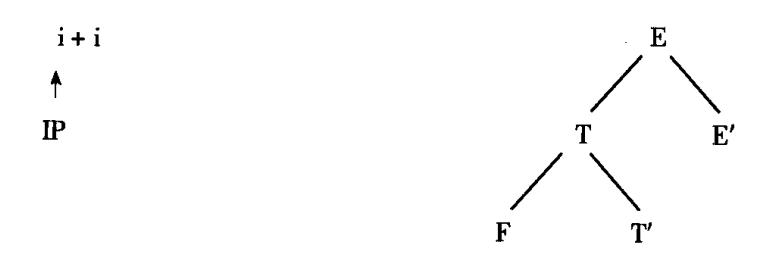

再接下来,要从F出发进行匹配,面临输入符号i,由于 $i \in FIRST(i)$ ,所以用 $F \rightarrow i$ 进行推导,使输入串的第一个i得到匹配。

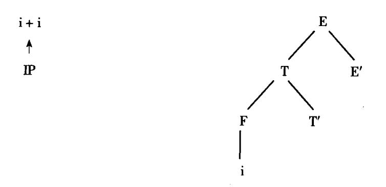

现在,要从 T'出发进行匹配,面临的输入符号为 + 。由于 + 不属于 T'的任一候选式的首符集,但有  $T' \rightarrow \epsilon$ ,所以我们不妨让 T'自动得到匹配(即 T'匹配于空字  $\epsilon$ ,注意这种情况下,输入符号并不读进)。

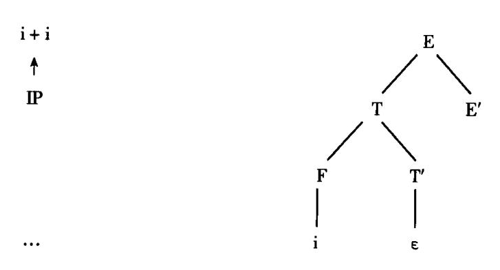

最后,我们可得到与 i+i 相匹配的语法分析树:

{7}------------------------------------------------

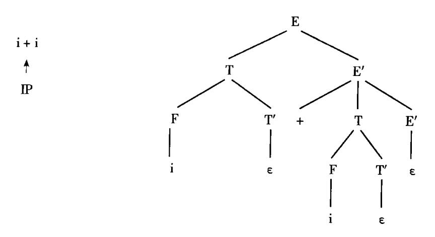

这是不是意味着,当非终结符 A 面临输入符号 a,且 a 不属于 A 的任意候选首符集但 A 的某个候选首符集包含  $\varepsilon$  时,就一定可以使 A 自动匹配?如果我们仔细来考虑一下的话,就不难发现,只有当 a 是允许在文法的某个句型中跟在 A 后面的终结符时,才可能允许 A 自动匹配,否则,a 在这里的出现就是一种语法错误。

假定 S 是文法 G 的开始符号,对于 G 的任何非终结符 A,我们定义

$$FOLLOW(A) = \{a \mid S \stackrel{*}{\Rightarrow} \cdots Aa \cdots, a \in V_T\}$$

特别是,若  $S \stackrel{*}{\Rightarrow} \cdots A$ ,则规定 #  $\in$  FOLLOW(A)。换句话说, FOLLOW(A)是所有句型中出现 在紧接 A 之后的终结符或' #'。

因此,当非终结符 A 面临输入符号 a,且 a 不属于 A 的任意候选首符集但 A 的某个候选首符集包含  $\varepsilon$  时,只有当 a  $\in$  FOLLOW(A),才可能允许 A 自动匹配。

通过上面一系列讨论,我们可以找出满足构造不带回溯的自上而下分析的文法条件。

- (1) 文法不含左递归。
- (2) 对于文法中每一个非终结符 A 的各个产生式的候选首符集两两不相交。即,若  $A \rightarrow \alpha_1 \mid \alpha_2 \mid \cdots \mid \alpha_n$

则 
$$FIRST(\alpha_i) \cap FIRST(\alpha_i) = \emptyset$$
  $(i \neq i)$ 

(3) 对文法中的每个非终结符 A,若它存在某个候选首符集包含  $\epsilon$ ,则

$$FIRST(A) \cap FOLLOW(A) = \phi$$

如果一个文法 G 满足以上条件,则称该文法 G 为 LL(1) 文法。

这里,LL(1)中的第一个 L 表示从左到右扫描输入串,第二个 L 表示最左推导,1 表示分析时每一步只需向前查看一个符号。

对于一个 LL(1)文法,可以对其输入串进行有效的无回溯的自上而下分析。假设要用非终结符 A 进行匹配,面临的输入符号为 a, A 的所有产生式为

$$A \rightarrow \alpha_1 | \alpha_2 | \cdots | \alpha_n$$

- (1) 若  $a \in FIRST(\alpha_i)$ ,则指派  $\alpha_i$  去执行匹配任务。
- (2) 若 a 不属于任何一个候选首符集,则:
- ① 若ε属于某个 FIRST(α<sub>i</sub>)且 a ∈ FOLLOW(A),则让 A 与ε自动匹配;
- ② 否则,a的出现是一种语法错误。

根据 LL(1) 文法的条件,每一步这样的工作都是确信无疑的。

{8}------------------------------------------------

### 4.4 递归下降分析程序构造

当一个文法满足 LL(1)条件时,我们就可以为它构造一个不带回溯的自上而下分析程序,这个分析程序是由一组递归过程组成的,每个过程对应文法的一个非终结符。这样的一个分析程序称为**递归下降分析器**。如果用某种高级语言写出所有递归过程,那就可以用这个语言的编译系统来产生整个的分析程序。例如,考虑文法(4.2),它的每个非终结符所对应的递归过程列于图 4.2。其中,ADVANCE 是指把输入串指示器 IP 调至指向下一个输入符号;SYM 是指 IP 当前所指的那个输入符号;ERROR 为出错诊察处理程序。

对于图 4.2 的递归子程序,我们假定在开始工作前,输入串指示器 IP 指向第一个输入符号。当每个子程序工作完毕之后,IP 总是指向下一个未处理的符号。请注意递归子程序 E',我们知道,关于 E'的规则是

$$E' \rightarrow + TE' \mid \epsilon$$

即 E'只有两个候选。第一个候选的开头终结符为 + ,第二个候选为  $\varepsilon$ 。这就是说,当 E'面临输入符号 + 时就令第一个候选进入工作,当面临任何其它输入符号时,E'就自动认为获得了匹配(这时,更精确的做法是判断该输入符号是否属于 FOLLOW(E'))。递归过程 E'就是根据这一原则设计的。同理,关于 T'的过程也是如此。

```
PROCEDURE E:
                                 PROCEDURE T:
        BEGIN
                                 BEGIN
           T: E'
                                    F;T'
        END;
                                 END
        PROCEDURE E';
                                 PROCEDURE T';
        IF SYM = ' + ' THEN
                                 IF SYM = ' * ' THEN
        BEGIN
                                 BEGIN
            ADVANCE;
                                     ADVANCE;
                                     F;T'
            T;E'
                                 END:
        END
PROCEDURE F:
       IF SYM = 'i' THEN ADVANCE
        ELSE
                IF SYM = '(' THEN
                  BEGIN
                      ADVANCE;
                      IF SYM = ')' THEN ADVANCE
                      ELSE ERROR
                 END
                ELSE ERROR:
```

图 4.2 递归子程序

{9}------------------------------------------------

在前面的上下文无关文法产生式(或称巴科斯范式)中我们只用到了两个元符号"→"和"I"。下面我们扩充几个元语言符号。

- (1) 用花括号 α 表示闭包运算 α\*。
- (2) 用 $\{\alpha\}_n^0$  表示  $\alpha$  可任意重复 0 次至 n 次, $\{\alpha\}_0^0 = \alpha^0 = \varepsilon$ 。
- (3) 用方括号[ $\alpha$ ]表示  $\{\alpha\}_{i=1}^{0}$ ,即表示  $\alpha$  的出现可有可无(等价于  $\alpha$   $\mid \epsilon$  )。

## 引人上述元符号的文法亦称扩充的巴科斯范式。

例如,通常的"实数"可定义为

decimal > [sign]integer. {digit} [exponent]\nexponent > E[sign]integer\ninteger > digit {digit}
sign > + | -

用这种定义系统来描述语法的好处是,直观易懂,便于表示左递归消去和因子提取。对于构造自上而下分析器来说,采用这种定义系统描述文法显然是非常可取的。

### 例 4.5 文法

 $E \rightarrow T \mid E + T$   $T \rightarrow F \mid T * F$  $F \rightarrow i \mid (E)$ 

可表示成

$$E \rightarrow T\{ + T\}$$

$$F \rightarrow F\{ * F\}$$

$$F \rightarrow i \mid (E)$$
(4.6)

我们也可以用语法图来表示语言的文法,它显得更直观更形象。如文法(4.6)可等价 地用图 4.3 所示的语法图表示。

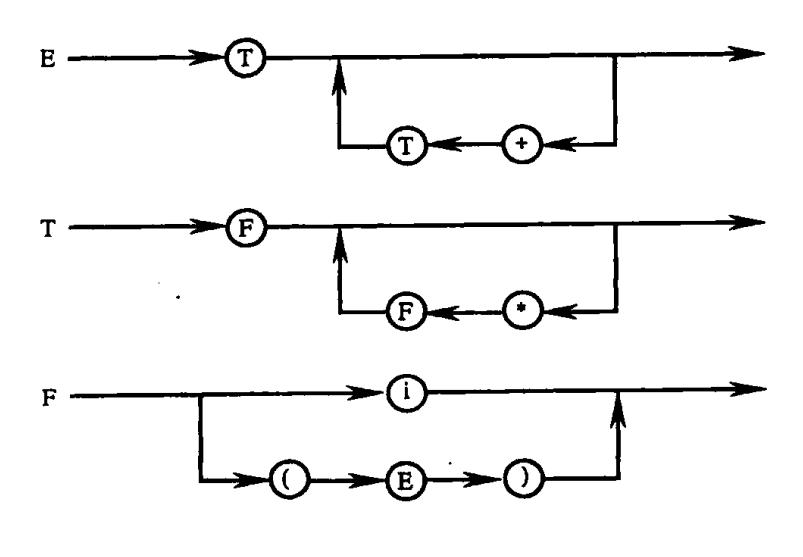

图 4.3 语法图

从文法(4.6)或图 4.3 出发,可构造一组代替图 4.2 的递归下降分析程序: PROCEDURE E;

{10}------------------------------------------------

**BEGIN** 

T;

WHILE SYM = " + " DO

BEGIN ADVANCE; T END

END:

PROCEDURE T:

BEGIN

F;

WHILE SYM = "\*" DO

BEGIN ADVANCE; F END

END;

PROCEDURE F:

同前,见图 4.2。

## 4.5 预测分析程序

用高级语言的递归过程描述递归下降分析器只有当具有实现这种过程的编译系统时才有实际意义。实现 LL(1)分析的另一种有效方法是使用一张分析表和一个栈进行联合控制。我们现在要介绍的预测分析程序就是属于这种类型的 LL(1)分析器。

### 4.5.1 预测分析程序工作过程

预测分析表是一个 M[A,a]形式的矩阵。其中,A 为非终结符,a 是终结符或'#'(注意,'#'不是文法的终结符,我们总把它当成输入串的结束符。虽然它不是文法的一部分,但假定它的存在将有助于简化分析算法的描述)。矩阵元素 M[A,a]中存放着一条关于 A 的产生式,指出当 A 面临输入符号 a 时所应采用的候选。M[A,a]中也可能存放一个"出错标志",指出 A 根本不该面临输入符号 a。例如,关于文法(4.2)的分析表见表 4.1,其中,空白格均指"出错标志"。

|    | i     | +             | *         | (     | )             | #    |
|----|-------|---------------|-----------|-------|---------------|------|
| E  | E→TE′ |               |           | E→TE′ |               |      |
| Ε' |       | E'→ + TE'     |           |       | <u>E</u> ′→ε  | E′→ε |
| T  | T→FT′ |               |           | T→FT′ |               |      |
| T' |       | T′ <b>→</b> ε | T'→ * FT' |       | T′ <b>→</b> ε | T′→ε |
| F  | F→i   |               |           | F→(E) |               |      |

表 4.1 文法(4.2)的 LL(1)分析表

栈 STACK 用于存放文法符号。分析开始时,栈底先放一个'#',然后,放进文法开始符号。同时,假定输入串之后也总有一个'#',标志输入串结束。

预测分析程序的总控程序在任何时候都是按 STACK 栈顶符号 X 和当前的输入符号 a

{11}------------------------------------------------

行事的,如图 4.4 所示。对于任何(X,a),总控程序每次都执行下述三种可能的动作之

- (1) 若 X = a = ' #',则宣布分析成功,停止分析过程。
- (2) 若 X = a ≠ ' # ',则把 X 从 STACK 栈顶逐出,让 a 指向下一个输入符号。
- (3) 若 X 是一个非终结符,则查看分析表 M。若 M[A,a] 中存放着关于 X 的一个产生式,那么,首先把 X 逐出 STACK 栈顶,然后,把产生式的右部符号串按反序一一推进 STACK 栈(若右部符号为  $\varepsilon$ ,则意味不推什么东西进栈)。在把产生式的右部符号推进栈 的同时应做这个产生式相应的语义动作(目前暂且不管)。若 M[A,a] 中存放着"出错标志",则调用出错诊察程序 ERROR。

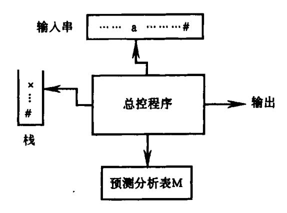

图 4.4 预测分析器模型

预测分析程序的总控程序略微形式一点的描述是: BEGIN

首先把'#'然后把文法开始符号推进 STACK 栈;

把第一个输入符号读进 a:

FLAG: = TRUE;

WHILE FLAG DO

**BEGIN** 

把 STACK 栈顶符号上托出去并放在 X 中;

IF  $X \in V_T$  THEN

IF X = a THEN 把下一输入符号读进 a ELSE ERROR

ELSE IF X = ' # ' THEN

IF X = a THEN FLAG: = FALSE ELSE ERROR

ELSE IF  $M[A,a] = \{X \rightarrow X_1 X_2 \cdots X_k\}$  THEN

把  $X_k, X_{k-1}, \dots, X_1$  ——推进 STACK 栈 /\* 若  $X_1X_2 \dots X_k = \varepsilon$ , 不推什么进栈 \*/

ELSE ERROR

END OF WHILE;

STOP /\* 分析成功,过程完毕 \*/

**END** 

{12}------------------------------------------------

| 例 4.6 | 对于文法     | E(4.2),输入串为 i <sub>1</sub> * | i <sub>2</sub> + i <sub>3</sub> ,利用分析表进行 | 预测分析的步骤为: |
|-------|----------|------------------------------|------------------------------------------|-----------|
| 北西    | <b>₹</b> | 44 日 松                       | 44 1 4-                                  |           |

| 步骤  ● | 符号栈       | <u>输入串</u>                          | 所用产生式                  |
|-------|-----------|-------------------------------------|------------------------|
| 0     | # E       | $i_1 * i_2 + i_3 #$                 |                        |
| 1     | # E'T     | $i_1 * i_2 + i_3 #$                 | E→TE′                  |
| 2     | # E'T'F   | $i_1 * i_2 + i_3 #$                 | T→FT′                  |
| 3     | # E'T'i   | $i_1 * i_2 + i_3 #$                 | F→i                    |
| 4     | # E'T'    | * i <sub>2</sub> + i <sub>3</sub> # |                        |
| 5     | # E'T'F * | * i <sub>2</sub> + i <sub>3</sub> # | T'→ * FT'              |
| 6     | # E'T'F   | i <sub>2</sub> + i <sub>3</sub> #   |                        |
| 7     | # E'T'i   | i <sub>2</sub> + i <sub>3</sub> #   | F→i                    |
| 8     | # E'T'    | + i <sub>3</sub> #                  |                        |
| 9     | # E′      | + i <sub>3</sub> #                  | T′→ε                   |
| 10    | # E'T+    | + i <sub>3</sub> #                  | $E' \rightarrow + TE'$ |
| 11    | # E'T     | i <sub>3</sub> #                    |                        |
| 12    | # E'T'F   | i <sub>3</sub> #                    | T→FT′                  |
| 13    | # E'T'i   | i <sub>3</sub> #                    | F→i                    |
| 14    | # E'T'    | #                                   |                        |
| 15    | # E′      | #                                   | T' <b>→</b> ε          |
| 16    | #         | #                                   | Ε′→ε                   |

#### 4.5.2 预测分析表的构造

下面,我们介绍对于任给的文法 G,如何构造它的预测分析表 M[A,a]。为了构造预测分析表 M,我们需要先构造与文法 G 有关的集合 FIRST 和 FOLLOW。

首先,我们来讨论如何对每一个文法符号  $X \in V_T \cup V_N$  构造 FIRST(X)。其办法是,连续使用下面的规则,直至每个集合 FIRST 不再增大为止。

- (1) 若 $X \in V_T$ ,则 $FIRST(X) = \{X\}$ 。
- (2) 若 X ∈ V<sub>N</sub>,且有产生式 X→a···,则把 a 加入到 FIRST(X)中;若 X→ε 也是一条产生式,则把 ε 也加到 FIRST(X)中。
- (3) 若  $X \rightarrow Y \cdots$  是一个产生式且  $Y \in V_N$ ,则把 FIRST(Y) 中的所有非  $\varepsilon$  元素都加到 FIRST(X)中;若  $X \rightarrow Y_1 Y_2 \cdots Y_k$  是一个产生式, $Y_1, \cdots, Y_{i-1}$  都是非终结符,而且,对于任何 j,  $1 \le j \le i-1$ , $FIRST(Y_j)$  都含有  $\varepsilon$  (即  $Y_1 \cdots Y_{i-1} \stackrel{*}{\Rightarrow} \varepsilon$ ),则把  $FIRST(Y_i)$  中的所有非  $\varepsilon$  元素都加到 FIRST(X)中;特别是,若所有的  $FIRST(Y_j)$  均含有  $\varepsilon$  , $j = 1, 2, \cdots$  ,k ,则把  $\varepsilon$  加到 FIRST(X)中。

{13}------------------------------------------------

现在,我们能够对文法 G 的任何符号串  $\alpha = X_1 X_2 \cdots X_n$  构造集合 FIRST( $\alpha$ )。首先,置 FIRST( $\alpha$ ) = FIRST( $X_1$ ) \  $\{\epsilon\}$ ;若对任何  $1 \le j \le i-1$ ,  $\epsilon \in FIRST(X_j)$ ,则把 FIRST( $X_i$ ) \  $\{\epsilon\}$ 加至 FIRST( $\alpha$ )中;特别是,若所有的 FIRST( $X_j$ )均含有  $\epsilon$ ,  $1 \le j \le n$ ,则把  $\epsilon$  也加至 FIRST( $\alpha$ )中。显然,若  $\alpha = \epsilon$ 则 FIRST( $\alpha$ ) =  $\{\epsilon\}$ 。

对于文法 G 的每个非终结符 A 构造 FOLLOW(A)的办法是,连续使用下面的规则,直至每个 FOLLOW 不再增大为止。

- (1) 对于文法的开始符号 S,置#于 FOLLOW(S)中;
- (2) 若 A→αBβ 是一个产生式,则把 FIRST(β) \ {ε}加至 FOLLOW(B)中;
- (3) 若 A→αB 是一个产生式,或 A→αBβ 是一个产生式而 β→ε(即 ε $\in$  FIRST(β)),则把 FOLLOW(A)加至 FOLLOW(B)中。

例 4.7 对于文法(4.2),我们可构造出每个非终结符的 FIRST 和 FOLLOW 集合:

```
FIRST(E) = \{(,i)\} \qquad FOLLOW(E) = \{), \# \}
FIRST(E') = \{+, \epsilon\} \qquad FOLLOW(E') = \{\}, \# \}
FIRST(T) = \{(,i)\} \qquad FOLLOW(T) = \{+,), \# \}
FIRST(T') = \{+, \epsilon\} \qquad FOLLOW(T') = \{+,), \# \}
FIRST(F) = \{(,i)\} \qquad FOLLOW(F) = \{+,+,\}, \# \}
```

在对文法 G 的每个非终结符 A 及其任意候选  $\alpha$  都构造出 FIRST( $\alpha$ )和 FOLLOW(A)之后,我们现在可以用它们来构造 G 的分析表 M[A,a]。构造分析表算法的思想背景是很简单的。例如,假定 A→ $\alpha$  是一个产生式,a  $\in$  FIRST( $\alpha$ )。那么,当 A 呈现于 STACK 栈之顶且 a 是当前的输入符号时, $\alpha$  应被当作是 A 唯一合适的全权代表。因此,M[A,a]中应放进产生式 A→ $\alpha$ 。当  $\alpha$  =  $\epsilon$  或  $\alpha$   $\Rightarrow$   $\epsilon$  时,如果当前面临的输入符号 a(可能是终结符或'#')属于 FOLLOW(A),那么,A→ $\alpha$  就认为已自动得到匹配,因而,应把 A→ $\alpha$  放在 M[A,a]中。根据这个思想背景,构造分析表 M 的算法是:

- (1) 对文法 G 的每个产生式 A→α 执行第 2 步和第 3 步;
- (2) 对每个终结符 a∈ FIRST(α),把 A→α 加至 M[A,a]中;
- (3) 若 ε∈ FIRST(α),则对任何 b∈ FOLLOW(A)把 A→α 加至 M[A,b]中;
- (4) 把所有无定义的 M[A,a]标上"出错标志"。

例 4.8 把上述算法应用于文法(4.2)就可得到表 4.1 所示的分析表。因为,FIRST (TE') = FIRST(T) =  $\{i, (\}, \text{因此,产生式 E} \to \text{TE'} \text{保证了 M}[E,i] \text{和 M}[E,(] 中持有 E \to \text{TE'} \text{。} 产生式 E' \to + \text{TE'} \text{保证了 M}[E', +] 中持有 E' \to + \text{TE'} \text{。由于 FOLLOW}(E') = <math>\{\}, \#\}, \text{因此,产生式 E'} \to \text{c} \text{ 保证了 M}[E',)]$ 和[E', #]中持有  $E' \to \text{c}$ 。

上述算法可应用于任何文法 G 以构造它的分析表 M。但对于某些文法,有些 M[A,a]可能持有若干个产生式,或者说有些 M[A,a]可能是多重定义的。如果 G 是左递归或二义的,那么,M 至少含有一个多重定义入口。因此,消除左递归和提取左因子将有助于获得无多重定义的分析表 M。

可以证明,一个文法 G 的预测分析表 M 不含多重定义人口,当且仅当该文法为 LL(1) 的。

{14}------------------------------------------------

## 4.6 LL(1)分析中的错误处理

我们以预测分析为例。在预测分析过程中,出现了下列两种情况,则说明遇到了语法错误。

- (1) 栈顶的终结符与当前的输入符号不匹配。
- (2) 非终结符 A 处于栈顶,面临的输入符号为 a,但分析表 M 中的 M[A,a]为空。

发现错误后,要尽快地从错误中恢复过来,使分析能继续进行下去。基本的做法就是 跳过输入串中的一些符号直至遇到"同步符号"为止。这种做法的效果有赖于同步符号集 的选择。我们可以从以下几个方面考虑同步符号集的选择。

- (1) 把 FOLLOW(A)中的所有符号放入非终结符 A 的同步符号集。如果我们跳读一些输入符号直到出现 FOLLOW(A)中的符号,把 A 从栈中弹出,这样就可能使分析继续下去。
- (2)对于非终结符 A 来说,只用 FOLLOW(A)作为它的同步符号集是不够的。例如,如果分号作为语句的结束符(C 语言中就是这样的),那么作为语句开头的关键字就可能不在产生表达式的非终结符的 FOLLOW 集中。这样,在一个赋值语句后少一个分号就可能导致作为下一语句开头的关键字被跳过。
- (3) 如果把 FIRST(A)中的符号加入非终结符 A 的同步符号集,那么,当 FIRST(A)中的一个符号在输入中出现时,可以根据 A 恢复语法分析。
- (4) 如果一个非终结符产生空串,那么,推导 ε 的产生式可以作为缺省的情况,这样做可以推迟某些错误检查,但不能导致放弃一个错误。这种方法减少在错误恢复期间必须考虑的非终结符数。
- (5) 如果不能匹配栈顶的终结符号,一种简单的想法是弹出栈顶的这个终结符号,并 发出一条信息,说明已经插入这个终结符,继续进行语法分析。结果,这种方法使一个单 词符号的同步符号集包含所有其它单词符号。

例如,对表 4.1 所示的 LL(1)分析表加入同步符号后,见表 4.2,其中的"synch"表示由相应非终结符的后继符号集得到的同步符号。

|    | i     | +         | *         | (     | )     | #             |
|----|-------|-----------|-----------|-------|-------|---------------|
| E  | E→TE′ |           |           | E→TE′ | synch | synch         |
| Ε' |       | E'→ + TE' |           |       | E′→e  | E' <b>→</b> € |
| Т  | T→FT′ | synch     |           | T→FT′ | synch | synch         |
| T' |       | T'→ε      | T'→ * FT' |       | T'→ε  | T′ <b>→</b> ε |
| F  | F→i   | synch     | synch     | F→(E) | synch | synch         |

表 4.2 加入同步符号的 LL(1)分析表

分析时,若发现 M[A,a]为空,则跳过输入符号 a;若该项为"同步",则弹出栈顶的非终结符;若栈顶的终结符号不匹配输入符号,则弹出栈顶的终结符。

{15}------------------------------------------------

例 4.9 表 4.3 是带有错误恢复的语法分析过程, 所分析的输入串为)i\*+i。

发现语法错误时,除了使语法分析继续下去之外,还要形成诊断信息,向程序员报告。 把关于错误处理的操作放在一个过程 ERROR 里,在分析表的相应空白项填入调用 ER-ROR 的人口,以便出错时调用。

以上介绍的出错处理思想不仅适合预测分析方法,而且也适合递归下降分析法。

分析栈 输入串 附注 # E )i \* + i #错,跳过) # E i\* + i#  $i \in FIRST(E)$ # E'T # E'T'F i\* + i## E'T'i # E'T' \* + i# # E'T'F \* # E'T'F + i# 错,M[F, +] = synch # E'T' + i# F已弹出栈 # E' + i# # E'T+ + i# # E'T i# # E'T'F i# # E'T'i i # # E'T' # E

表 4.3 对)id\*+i的语法分析与错误处理

## 练 习

1. 考虑下面文法 G<sub>1</sub>:

$$S \rightarrow a \mid \land \mid (T)$$
  
 $T \rightarrow T, S \mid S$ 

- (1) 消去 G<sub>1</sub> 的左递归。然后,对每个非终结符,写出不带回溯的递归子程序。
- (2) 经改写后的文法是否是 LL(1)的? 给出它的预测分析表。
- 2. 对下面的文法 G:

 $E' \rightarrow + E \mid \varepsilon$ 

 $T \rightarrow FT'$ 

T'→T|ε

F-→PF'

{16}------------------------------------------------

 $F' \rightarrow * F' \mid \varepsilon$  $P \rightarrow (E) \mid a \mid b \mid \wedge$ 

- (1) 计算这个文法的每个非终结符的 FIRST 和 FOLLOW。
- (2) 证明这个文法是 LL(1)的。
- (3) 构造它的预测分析表。
- (4) 构造它的递归下降分析程序。
- 3. 下面文法中,哪些是 LL(1)的,说明理由。
- (1)  $S \rightarrow Abc$

A→a|ε

B→b|ε

(2) S→Ab

A→a|B|ε

B→b∣ε

(3) S→ABBA

A→a|ε

B→b∣ε

(4)  $S \rightarrow aSe \mid B$ 

B→bBe | C

C→cCeld

4. 对下面文法:

Expr - Expr

Expr→(Expr) | Var ExprTail

ExprTail→ - Expr | €

Var→id VarTail

VarTail→(Expr)|€

- (1) 构造 LL(1)分析表。
- (2) 给出对句子 id - id((id))的分析过程。
- 5. 把下面文法改写为 LL(1)的:

Declist→Declist; Decl Decl

Decl→IdList: Type

IdList→Idlist, id | id

Type ScalarType I array (ScalarTypeList) of Type

ScalarType→id | Bound . . Bound

Bound-Sign IntLiteral|id

Sign  $\rightarrow + | - | \epsilon$ 

ScalarTypeList->ScalarTypeList, ScalarType | ScalarType