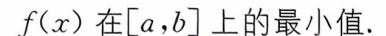
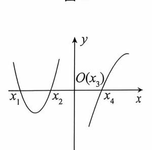
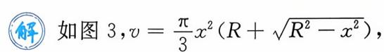
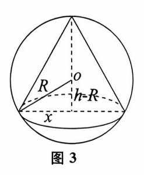
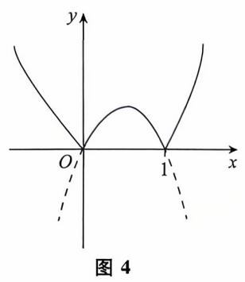

{0}------------------------------------------------

# 第三章 微分中值定理及导数应用

| 考试内容                                  | 考试要求                                     |           |        |
|---------------------------------------|------------------------------------------|-----------|--------|
|                                       | 数一                                       | 数二        | 数三     |
| 罗尔(Rolle) 定理、拉格朗日(Lagrange) 中值定理      | 理解并                                      | 理解并       | 理解并    |
| 泰勒(Taylor) 定理                         | 会用                                       | 会用        | 会用     |
| 柯西(Cauchy) 中值定理                       | 了解并会用                                    | 了解并 会用 | 了解并 会用 |
| 函数图形的拐点                               | 会求                                       | 会求        | 会求     |
| 用导数判断函数图形的凹凸性                         | 会用                                       | 会用        | 会用     |
| 用导数判断函数的单调性和求函数极值的方法函数的最大值和最小值的求法及其应用 | 掌握                                       | 掌握        | 掌握     |
| 函数的极值概念                               | 理解                                       | 理解        | 理解     |
| 洛必达法则求未定式极限的方法                        | 掌握                                       | 掌握        | 掌握     |
| 曲率、曲率圆和曲率半径的概念                        | 了解                                       | 了解        | /      |
| 曲率和曲率半径                               | 会计算                                      | 会计算       | /      |
| 函数图形的水平、铅直和斜渐近线                       | 会求                                       | 会求        | 会求     |
| 导数的经济意义(含边际与弹性的概念)                    | S. S. S. S. S. S. S. S. S. S. S. S. S. S | /         | 了解     |
| 函数的图形                                 | 会描绘                                      | 会描绘       | 会描绘    |

# \*考试内容概要 \*\*。

# 一、微分中值定理

定理 ( 贵马引理) 设函数 f(x) 在点  $x_0$  处可导,如果函数 f(x) 在点  $x_0$  处取得极值,

{1}------------------------------------------------

那么  $f'(x_0) = 0$ .

定理(罗尔定理) 如果 f(x) 满足以下条件:

- (1) 在闭区间[a,b]上连续,
- (2) 在开区间(a,b) 内可导,
- (3) f(a) = f(b),

则在(a,b) 内至少存在一点  $\xi$ ,使得  $f'(\xi) = 0$ .

定理(拉格朗日中值定理) 如果 f(x) 满足以下条件:

- (1) 在闭区间[a,b]上连续,
- (2) 在开区间(a,b) 内可导,

则在(a,b) 内至少存在一点  $\xi$ ,使得

$$f(b) - f(a) = f'(\xi)(b-a).$$

推论 如果在(a,b) 内恒有 f'(x) = 0,则在(a,b) 内 f(x) 为常数.

定理 (柯西中值定理) 如果 f(x), F(x) 满足以下条件:

- (1) 在闭区间[a,b]上连续,
- (2) 在开区间(a,b) 内可导,目 F'(x) 在(a,b) 内每一点处均不为零,

则在(a,b) 内至少存在一点  $\xi$ ,使得

$$\frac{f(b) - f(a)}{F(b) - F(a)} = \frac{f'(\xi)}{F'(\xi)}.$$

#### 定理 (皮亚诺型余项泰勒公式)

如果 f(x) 在点  $x_0$  有直至 n 阶的导数,则有

$$f(x) = f(x_0) + f'(x_0)(x - x_0) + \frac{1}{2!}f''(x_0)(x - x_0)^2 + \dots + \frac{1}{n!}f^{(n)}(x_0)(x - x_0)^n + o[(x - x_0)^n],$$

常称  $R_n(x) = o[(x-x_0)^n]$  为皮亚诺型余项. 若  $x_0 = 0$ ,则得麦克劳林公式:

$$f(x) = f(0) + f'(0)x + \frac{1}{2!}f''(0)x^2 + \dots + \frac{1}{n!}f^{(n)}(0)x^n + o(x^n).$$

定理 (拉格朗日型余项泰勒公式)

设函数 f(x) 在含有  $x_0$  的开区间(a,b) 内有直到 n+1 阶的导数,则当  $x \in (a,b)$  时有

$$f(x) = f(x_0) + f'(x_0)(x - x_0) + \frac{1}{2!}f''(x_0)(x - x_0)^2 + \dots + \frac{1}{n!}f^{(n)}(x_0)(x - x_0)^n + R_n(x),$$

其中  $R_n(x) = \frac{f^{(n+1)}(\xi)}{(n+1)!} (x-x_0)^{n+1}$ ,这里  $\xi$  介于  $x_0$  与 x 之间,称为**拉格朗日型余项**.

几个常用的泰勒公式(拉格朗日型余项).

$$(1)e^{x} = 1 + x + \frac{x^{2}}{2!} + \dots + \frac{x^{n}}{n!} + \frac{e^{\theta x}}{(n+1)!}x^{n+1}.$$

$$(2)\sin x = x - \frac{x^3}{3!} + \dots + (-1)^{n-1} \frac{x^{2n-1}}{(2n-1)!} + (-1)^n \frac{\cos (\theta x)}{(2n+1)!} x^{2n+1}.$$

$$(3)\cos x = 1 - \frac{x^2}{2!} + \dots + (-1)^n \frac{x^{2n}}{(2n)!} + (-1)^{n+1} \frac{\cos (\theta x)}{(2n+2)!} x^{2n+2}.$$

$$(4)\ln(1+x) = x - \frac{x^2}{2} + \dots + (-1)^{n-1} \frac{x^n}{n} + (-1)^n \frac{x^{n+1}}{(n+1)(1+\theta x)^{n+1}}.$$

{2}------------------------------------------------

(5) 
$$(1+x)^{\alpha} = 1 + \alpha x + \frac{\alpha(\alpha-1)}{2!} x^{2} + \dots + \frac{\alpha(\alpha-1)\cdots(\alpha-n+1)}{n!} x^{n} + \frac{\alpha(\alpha-1)\cdots(\alpha-n+1)(\alpha-n)}{(n+1)!} (1+\theta x)^{\alpha-n-1} x^{n+1}.$$

(以上 $\theta$ 满足 $\theta \in (0,1)$ )

## 二、导数应用

### 1. 函数的单调性

定理 设 f(x) 在 [a,b] 上连续, 在 (a,b) 内可导.

- (1) 若在(a,b) 内 f'(x) > 0,则 f(x) 在[a,b] 上单调递增.
- (2) 若在(a,b) 内 f'(x) < 0,则 f(x) 在[a,b] 上单调递减.

#### 2. 函数的极值

定义 设 y = f(x) 在点  $x_0$  的某邻域内有定义. 如果对于该邻域内任何 x, 恒有  $f(x) \le f(x_0)$  或  $(f(x) \ge f(x_0))$ ,则称  $x_0$  为 f(x) 的一个极大值点(或极小值点),称  $f(x_0)$  为 f(x) 的极大值(或极小值). 极大(小) 值统称为极值; 极大(小) 值点统称为极值点. 导数为零的点称为函数的驻点.

定理(极值的必要条件) 设 y = f(x) 在点  $x_0$  处可导,如果  $x_0$  为 f(x) 的极值点,则  $f'(x_0) = 0$ .

定理(极值的第一充分条件) 设y = f(x) 在点 $x_0$  的某去心邻域内可导,且 $f'(x_0) = 0$ (或f(x) 在 $x_0$  处连续).

- (1) 若  $x < x_0$  时, f'(x) > 0,  $x > x_0$  时, f'(x) < 0,则  $x_0$  为 f(x) 的极大值点.
- (2) 若  $x < x_0$  时, f'(x) < 0,  $x > x_0$  时, f'(x) > 0,则  $x_0$  为 f(x) 的极小值点.
- (3) 若 f'(x) 在  $x_0$  的两侧同号,则  $x_0$  不为 f(x) 的极值点.

定理(极值的第二充分条件) 设 y = f(x) 在点  $x_0$  处二阶可导,且  $f'(x_0) = 0$ .

- (1) 若  $f''(x_0) < 0$ ,则  $x_0$  为 f(x) 的极大值点.
- (2) 若  $f''(x_0) > 0$ ,则  $x_0$  为 f(x) 的极小值点.
- (3) 若  $f''(x_0) = 0$ ,则此方法不能判定  $x_0$  是否为极值点.

## 3. 函数的最太值与最小值

定义 设函数 y = f(x) 在闭区间[a,b]上有定义, $x_0 \in [a,b]$ . 若对于任意  $x \in [a,b]$ , 恒有  $f(x) \leq f(x_0)$ (或  $f(x) \geq f(x_0)$ ),则称  $f(x_0)$  为函数 f(x) 在闭区间[a,b]上的最大值(或最小值),称  $x_0$  为 f(x) 在[a,b]上的最大值点(或最小值点).

函数的最值主要有以下两种问题:

(1) 求连续函数 f(x) 在闭区间[a,b] 上的最大最小值.

第一步:求出 f(x) 在开区间(a,b) 内的驻点和不可导的点  $x_1, x_2, \dots, x_n$ .

第二步:求出 f(x) 在点  $x_1, x_2, \dots, x_n$  和区间端点 a, b 处的函数值

$$f(x_1), f(x_2), \dots, f(x_n), f(a), f(b).$$

第三步:比较以上各点函数值,其中最大的即为 f(x) 在[a,b] 上的最大值,最小的即为

{3}------------------------------------------------

島政学 基础篇

【注】 当连续函数 f(x) 在[a,b] 内仅有唯一极值点,若在该点 f(x) 取极大值(或极小值),则它也是 f(x) 在[a,b] 上的最大值(或最小值).

(2) 求最大最小值的应用题.

这种问题首先建立目标函数并确定其定义域,然后按照上面的三个步骤求其最大值(或最小值).

#### 4. 曲线的凹凸性

定义 设函数 f(x) 在区间 I 上连续,如果对 I 上任意两点  $x_1,x_2$  恒有

$$f\left(\frac{x_1+x_2}{2}\right) < \frac{f(x_1)+f(x_2)}{2},$$

则称 f(x) 在 I 上的图形是凹的;如果恒有

$$f\left(\frac{x_1+x_2}{2}\right) > \frac{f(x_1)+f(x_2)}{2},$$

则称 f(x) 在 I 上的图形是凸的.

定理 设函数 y = f(x) 在[a,b]上连续,在(a,b) 内二阶可导,那么

- (1) 若在(a,b) 内有 f''(x) > 0,则 f(x) 在[a,b] 上的图形是凹的.
- (2) 若在(a,b) 内有 f''(x) < 0,则 f(x) 在[a,b] 上的图形是凸的.

定义(拐点) 连续曲线弧上的凹与凸的分界点称为曲线弧的拐点.

定理(拐点的必要条件) 设 y = f(x) 在点  $x_0$  处二阶可导,且点 $(x_0, f(x_0))$  为曲线 y = f(x) 的拐点,则  $f''(x_0) = 0$ .

定理(拐点的第一充分条件) 设 y = f(x) 在点  $x_0$  的某去心邻域内二阶可导,且  $f''(x_0)$  = 0(或 f(x) 在  $x_0$  处连续).

- (1) 若 f''(x) 在  $x_0$  的左、右两侧异号,则点 $(x_0)$ , $f(x_0)$  为曲线 y = f(x) 的拐点.
- (2) 若 f''(x) 在  $x_0$  的左、右两侧同号,则点 $(x_0, f(x_0))$  不为曲线 y = f(x) 的拐点.

定理(拐点的第二充分条件) 设 y = f(x) 在点  $x_0$  处三阶可导,且  $f''(x_0) = 0$ .

- (1) 若  $f'''(x_0) \neq 0$ ,则点 $(x_0, f(x_0))$  为曲线 y = f(x) 的拐点.
- (2) 若  $f'''(x_0) = 0$ ,则此方法不能判定 $(x_0, f(x_0))$  是否为曲线 y = f(x) 的拐点.

# 5. 曲线的渐近线

定义 若点 M 沿曲线 y = f(x) 无限远离原点时,它与某条定直线 L 之间的距离将趋近于零,则称直线 L 为曲线 y = f(x) 的一条**渐近线**. 若直线 L 与 x 轴平行,则称 L 为曲线 y = f(x) 的**水平渐近线**;若直线 L 与 x 轴垂直,则称 L 为曲线 y = f(x) 的**铅直渐近线**;若直线 L 既不平行于 x 轴,也不垂直于 x 轴,则称直线 L 为曲线 y = f(x) 的**斜渐近线**.

#### (1) 水平渐近线。

若  $\lim_{x\to\infty} f(x) = A$  (或  $\lim_{x\to-\infty} f(x) = A$  ,或  $\lim_{x\to+\infty} f(x) = A$  ),那么 y = A 是曲线 y = f(x) 的水平渐近线.

#### (2) 铅直渐近线。

若  $\lim_{x \to x_0} f(x) = \infty$  (或  $\lim_{x \to x_0^-} f(x) = \infty$ ,或  $\lim_{x \to x_0^+} f(x) = \infty$ ),那么  $x = x_0$  是曲线 y = f(x) 的

{4}------------------------------------------------

微分中值定理及导数应用 🖓

铅直渐近线.

(3) 斜渐近线.

若  $\lim_{x \to \infty} \frac{f(x)}{x} = a$  且  $\lim_{x \to \infty} (f(x) - ax) = b($ 或  $x \to -\infty$ ,或  $x \to +\infty$ ),那么 y = ax + b 是 曲线 y = f(x) 的斜渐近线.

6. 函数的作图

利用函数的单调性、极值、曲线的凹凸性、拐点及渐近线可以作出函数曲线.

7. 曲线的弧微分与曲率(数学三不要求)

定义 设 y = f(x) 在(a,b) 内有连续导数,则有弧微分

$$\mathrm{d}s = \sqrt{1 + y'^2} \, \mathrm{d}x.$$

定义 设 y = f(x) 有二阶导数,则有曲率

$$K = \frac{|y''|}{(1 + y'^2)^{3/2}},$$

称  $\rho = \frac{1}{K}$  为**曲率半径**.

定义 若曲线 y=f(x) 在点 M(x,y) 处的曲率为  $K(K\neq 0)$ . 在点 M 处曲线的法线上,在曲线凹的一侧取一点 D,使  $|DM|=\frac{1}{K}=\rho$ ,以 D 为圆心, $\rho$  为半径的圆称为曲线在点 M 处的曲率圆,圆心 D 称为曲线在点 M 处的曲率中心.

- 8. 导数在经济学中的应用(仅数学三基本)
- (1) 经济学中常见的函数。
- ① 需求函数.  $x = \varphi(p)$ ;其中 x 为某产品的需求量,p 为价格.

需求函数的反函数  $p = \varphi^{-1}(x)$  称为**价格函数**.

- ② 供给函数.  $x = \phi(p)$ ;其中 x 为某产品的供给量,p 为价格.
- ③ **成本函数**. 成本 C = C(x) 是生产产品的总投入,它由固定成本  $C_1$  (常量) 和可变成本  $C_2(x)$  两部分组成,其中 x 表示产量,即

$$C = C(x) = C_1 + C_2(x),$$

称 $\frac{C}{x}$ 为平均成本,记为 $\overline{C}$ 或AC,

$$AC = \overline{C} = \frac{C}{x} = \frac{C_1}{x} + \frac{C_2(x)}{x}.$$

④ **收益**(入) 函数. 收益 R = R(x) 是产品售出后所得的收入,是销售量 x 与销售单价 p 之积,即收益函数为

$$R = R(x) = px$$
.

⑤ **利润函数**. 利润L = L(x) 是收益扣除成本后的余额,由总收益减去总成本组成,即利润函数为

$$L = L(x) = R(x) - C(x)$$
 (x 是销售量).

{5}------------------------------------------------

- (2) 边际函数与边际分析.
- ① 边际函数的有关概念. 设 y = f(x) 可导,则在经济学中称 f'(x) 为边际函数, $f'(x_0)$  称为 f(x) 在  $x = x_0$  处的边际值.
  - ② 经济学中常用的边际分析.

边际成本. 设成本函数为 C=C(q)(q 是产量),则边际成本函数 MC 为 MC=C'(q); 边际收益. 设收益函数为 R=R(q)(q 是产量),则边际收益函数 MR 为 MR=R'(q); 边际利润. 设利润函数为 L=L(q)(q 是销售量),则边际利润函数 ML 为 ML=L'(q).

- (3) 弹性函数与弹性分析.
- ① **弹性函数的有关概念.** 设 y = f(x) 可导,则称 $\frac{\Delta y/y}{\Delta x/x}$ 为函数 f(x) 当 x 从x 变到 $x + \Delta x$  时的相对弹性,称

$$\eta = \lim_{\Delta x \to 0} \frac{\Delta y / y}{\Delta x / x} = f'(x) \frac{x}{y} = \frac{f'(x)}{f(x)} x$$

为函数 f(x) 的弹性函数,记为 $\frac{Ey}{Ex}$ ,即

$$\eta = \frac{Ey}{Ex} = f'(x) \frac{x}{f(x)}.$$

它在经济学上解释为函数 f(x) 在 x 处的相对变化率.

② 经济学中常用的弹性分析,

需求的价格弹性. 设需求函数  $Q = \varphi(p)(p)$  为价格),则需求对价格的弹性为

$$\eta_d = \frac{p}{\varphi(p)} \varphi'(p).$$

由于  $\varphi(p)$  是单调减少函数,故  $\varphi'(p) < 0$ ,从而  $\eta_a < 0$ .

经济学中的解释为:当价格为p时,若提价(或降价)1%,则需求量将减少(或增加) $|\eta_a|\%$ .需要注意的是,很多试题中规定需求对价格的弹性 $\eta_a>0$ ,此时应该有公式

$$\eta_d = -\frac{p}{\varphi(p)}\varphi'(p).$$

供给的价格弹性. 设供给函数  $Q = \psi(p)(p)$  为价格),则供给对价格的弹性为

$$\eta_s = \frac{p}{\psi(p)} \psi'(p).$$

由于供给函数  $\phi(p)$  单调增加,故  $\phi'(p) > 0$ ,从而  $\eta_s > 0$ .

经济学中的解释为:当价格为p时,若提价(或降价)1%,则供给量将增加(或减少) $\eta$ ,%.

【例 1】 (2014) 设某商品的需求函数为 Q = 40 - 2p(p) 为商品的价格),则该商品的边际收益为\_\_\_\_\_.

(解) 由题设知收益函数为

$$R=pQ=\frac{40-Q}{2}\cdot Q,$$

则边际收益为

$$\frac{\mathrm{d}R}{\mathrm{d}Q} = 20 - Q.$$

{6}------------------------------------------------

【注】 一种典型的错误答案是 40-4p. 边际收益是"当商品的需求量在 Q 的基础上再增加一件所获得的收益",所以边际收益为 $\frac{dR}{dQ}$ . 部分考生错误地将 $\frac{dR}{dp}$  当作边际收益.

【例 2】 (2017) 设生产某产品的平均成本 $\overline{C}(Q) = 1 + e^{-Q}$ ,其中产量为Q,则边际成本为

$$C(Q) = \overline{C}(Q)Q = Q(1 + e^{-Q}),$$

边际成本为

$$\frac{\mathrm{d}C}{\mathrm{d}Q} = (1 + \mathrm{e}^{-\mathrm{Q}}) - Q\mathrm{e}^{-\mathrm{Q}} = 1 + (1 - Q)\mathrm{e}^{-\mathrm{Q}}.$$

【例 3】 (2009) 设某产品的需求函数为 Q = Q(p),其对价格 p 的弹性  $\epsilon_p = 0.2$ ,则当需求量为 10000 件时,价格增加 1 元会使产品收益增加 元.

解 由题设知

$$-\frac{p}{Q}\frac{\mathrm{d}Q}{\mathrm{d}p}=\varepsilon_p=0.2,$$

收益函数

$$R=Qp$$
,

收益的微分为

$$dR = pdQ + Qdp = Q\left(1 + \frac{p}{Q}\frac{dQ}{dp}\right)dp = Q(1 - \epsilon_p)dp.$$

当 Q = 10000, dp = 1 时,产品的收益增加

$$dR = 10000 \times (1 - 0.2) \times 1 = 8000(\vec{\pi}).$$

【注】 一种典型的错误是认为 $\frac{p}{Q} \frac{dQ}{dp} = 0.2$ ,导致得出错误的结果 12000.

【例 4】 (2010) 设某商品的收益函数为 R(p),收益弹性为  $1+p^3$ ,其中 p 为价格,且 R(1)=1,则 R(p)= .

由题意知
$$\frac{p}{R} \cdot \frac{dR}{dp} = 1 + p^3$$
,即 $\frac{dR}{R} = \left(\frac{1}{p} + p^2\right) dp$ ,两边同时积分,得 
$$\ln R = \ln p + \frac{1}{3} p^3 + C.$$

从而有  $R(p) = pe^{\frac{1}{3}p^3+C}$ ,将 R(1) = 1 代入上式解得  $C = -\frac{1}{3}$ ,故  $R(p) = pe^{\frac{1}{3}(p^3-1)}$ .

{7}------------------------------------------------

# 常考题型与典型例题 :。

#### 常考願型

- 1. 求函数的极值和最值及确定曲线的凹向和拐点
- 2. 求渐近线
- 3. 方程的根
- 4. 不等式的证明
- 5. 中值定理证明题

# 一、求函数的极值和最值及确定曲线的凹向和拐点

【例 5】  $(2003, 数 - \ )$  设函数 f(x) 在 $(-\infty, +\infty)$  内连续,其导函数的图形如图 1 所示,则 f(x) 有

- (A) 一个极小值点和两个极大值点.
- (B) 两个极小值点和一个极大值点.
- (C) 两个极小值点和两个极大值点.
- (D) 三个极小值点和一个极大值点.
- 解 如图 2 所示,依次标记 x 轴上的交点  $x_1, x_2, x_3(O), x_4$ .

在  $x_1$  与  $x_3$  点两侧的导函数图像由正变负,为极大值点. 在  $x_2$  与  $x_4$  点两侧的导函数图像由负变正,为极小值点.选(C).

图 2

【例 6】 (1990,数一) 已知 f(x) 在 x = 0 的某个邻域内连续,且

$$f(0) = 0$$
,  $\lim_{x \to 0} \frac{f(x)}{1 - \cos x} = 2$ , 则在点  $x = 0$  处  $f(x)$ 

(A) 不可导.

(B) 可导,且  $f'(0) \neq 0$ .

(C)取得极大值.

(D) 取得极小值.

# **解**【方法 1】 直接法

由  $\lim_{x\to 0} \frac{f(x)}{1-\cos x} = 2 > 0$  及极限的保号性知在 x=0 的某去心邻域内

$$\frac{f(x)}{1-\cos x} > 0.$$

又  $1 - \cos x > 0$ ,则 f(x) > 0 = f(0),由极值定义知 f(x) 在 x = 0 处取极小值,则应选(D).

#### 【方法 2】 排除法

由于
$$\lim_{x\to 0} \frac{f(x)}{1-\cos x} = \lim_{x\to 0} \frac{f(x)}{\frac{1}{2}x^2} = 2$$
,则取  $f(x) = x^2$  显然满足题设条件.

但  $f(x) = x^2$  在 x = 0 处可导,且 f'(0) = 0,取极小值,则排除选项(A)(B)(C).

{8}------------------------------------------------

微分中值定理及导数应用。

故应选(D),

【例 7】 (2021,数一,数二,数三) 函数 
$$f(x) = \begin{cases} \frac{e^x - 1}{x}, & x \neq 0, \\ 1, & x = 0 \end{cases}$$

(A) 连续且取极大值.

(B) 连续目取极小值.

(C) 可导用导数为 0.

(D) 可导且导数不为 0.

【方法 1】 直接法 
$$\lim_{x\to 0} \frac{f(x) - f(0)}{x} = \lim_{x\to 0} \frac{\frac{e^x - 1}{x} - 1}{x} = \lim_{x\to 0} \frac{e^x - 1 - x}{x^2}$$
$$= \lim_{x\to 0} \frac{e^x - 1}{2x} = \frac{1}{2}.$$

则  $f'(0) = \frac{1}{2}$ ,故应选(D).

【方法 2】 直接法 欢迎学有余力的同学深入思考

# 【方法 3】 排除法 欢迎学有余力的同学深入思考

【例8】 在半径为R的球中内接一直圆锥,试求圆锥的最大体积.

此形式的目标函数求导较为复杂.

考虑较为简单的目标函数,

$$v = \frac{\pi}{3}h[R^2 - (h - R)^2] = \frac{\pi}{3}h^2(2R - h) = \frac{\pi}{3}(2Rh^2 - h^3),$$

对 h 求导得,  $\frac{\mathrm{d}v}{\mathrm{d}h} = \frac{\pi}{3}(4Rh - 3h^2) \stackrel{\diamondsuit}{=\!=\!=} 0$ ,

由题意得  $h = \frac{4}{3}R$ ,

代人目标函数得  $v = \frac{32}{81}\pi R^3$ .

{9}------------------------------------------------

【例 9】 (2018,数二、三)曲线  $y = x^2 + 2 \ln x$  在其拐点处的切线方程是\_\_\_\_\_\_

$$y' = 2x + \frac{2}{x}, y'' = 2 - \frac{2}{x^2}, \Leftrightarrow y'' = 0$$

$$x = 1, x = -1($$
\$\frac{1}{2}\$).

拐点为(1,1). 又 f'(1) = 2 + 2 = 4,则拐点处的切线方程是为

$$y-1 = 4(x-1)$$
,

即 y = 4x - 3.

基础篇

【例 10】 (2004,数二、三)设 f(x) = |x(1-x)|,则

- (A)x = 0 是 f(x) 的极值点,但(0,0) 不是曲线 y = f(x) 的拐点.
- (B)x = 0 不是 f(x) 的极值点,但(0,0) 是曲线 y = f(x) 的拐点.
- (C)x = 0 是 f(x) 的极值点,且(0,0) 是曲线 y = f(x) 的拐点.
- (D)x = 0 不是 f(x) 的极值点, (0,0) 也不是曲线 y = f(x) 的拐点.
- 【方法 1】 在 x=0 的邻域( $|x|<\delta$ ) 内

$$f(x) = \begin{cases} -x(1-x), & x < 0, \\ x(1-x), & x \ge 0. \end{cases}$$
$$f'(x) = \begin{cases} -1 + 2x, & x < 0, \\ 1 - 2x, & x > 0. \end{cases}$$

由于 f(x) 在 x = 0 处连续, f'(x) 在 x = 0 的某邻域内由负变正,则 f(x) 在 x = 0 处取极小值.

$$f''(x) = \begin{cases} 2, & x < 0, \\ -2, & x > 0. \end{cases}$$

由于 f''(x) 在 x = 0 的两侧变号,(0,0) 是曲线 y = f(x) 的拐点.

【方法 2】 如图 4,先画曲线 y = x(1-x)(开口朝下抛物线),再画 f(x) = |x(1-x)|(把曲线 y = x(1-x) 在 x 轴下方的图形对称地翻上去),由图可知,x = 0 是 f(x) 的极值点,且(0,0) 是曲线 y = f(x) 的拐点.

#### 二、求渐近线

【例 11】(2014,数一、二)下列曲线中有渐近线的是

(A) 
$$y = x + \sin x$$
.

(B) 
$$y = x^2 + \sin x$$
.

$$(C)y = x + \sin\frac{1}{x}.$$

(D) 
$$y = x^2 + \sin \frac{1}{x}$$
.

由渐近线定义可知,若

$$f(x) = ax + b + \alpha(x)$$

其中 $\lim_{x\to\infty} \alpha(x) = 0$ ,则直线 y = ax + b 为曲线 y = f(x) 的斜渐近线. 由此可知,曲线

$$y = x + \sin\frac{1}{x}$$

{10}------------------------------------------------

有斜渐近线 y = x,因为这里  $\limsup_{x \to \infty} \frac{1}{x} = 0$ ,故应选(C).

【例 12】 (2007, 数一、二) 曲线 
$$y = \frac{1}{x} + \ln(1 + e^x)$$
 渐近线的条数为

(A)0.

(D)3

由于
$$\lim_{x\to 0} y = \lim_{x\to 0} \left[\frac{1}{x} + \ln(1+e^x)\right] = \infty$$
,则  $x=0$  为曲线的铅直渐近线;

由于 $\lim_{x\to -\infty} y = \lim_{x\to -\infty} \left[ \frac{1}{x} + \ln(1+e^x) \right] = 0 \left( \lim_{x\to +\infty} y = +\infty \right)$ ,则y = 0为曲线的水平渐近线;

由于 $-\infty$ —侧已有水平渐近线,则斜渐近线只可能出现在 $+\infty$ —侧,又

$$a = \lim_{x \to +\infty} \frac{y}{x} = \lim_{x \to +\infty} \left[ \frac{1}{x^2} + \frac{\ln(1 + e^x)}{x} \right] = \lim_{x \to +\infty} \frac{1}{x^2} + \lim_{x \to +\infty} \frac{e^x}{1 + e^x} = 1,$$

$$b = \lim_{x \to +\infty} (y - ax) = \lim_{x \to +\infty} \left[ \frac{1}{x} + \ln(1 + e^x) - x \right]$$

$$= \lim_{x \to +\infty} \left[ \frac{1}{x} + \ln(1 + e^x) - \ln e^x \right]$$

$$= \lim_{x \to +\infty} \left[ \frac{1}{x} + \ln(1 + e^x) \right] = 0,$$

则曲线有斜渐近线 y = x,故该曲线有三条渐近线,应选(D).

【例 13】 (2017,数二) 曲线  $y = x(1 + \arcsin \frac{2}{x})$ 的斜渐近线方程为\_\_\_\_\_.

由于
$$\lim_{x\to\infty} \frac{y}{x} = \lim_{x\to\infty} \left(1 + \arcsin\frac{2}{x}\right) = 1 = a$$
,

$$\lim_{x \to \infty} (y - ax) = \lim_{x \to \infty} x \arcsin \frac{2}{x} = \lim_{x \to \infty} x \cdot \frac{2}{x} = 2 = b,$$

则斜渐近线为 y = x + 2.

# 三、方程的根

方程根的问题主要是以下两个问题.

## 1. 存在性

方法 1:零点定理;方法 2:罗尔定理.

#### 2. 根的个数

方法:单调性.

【例 14】 (1992, 数五) 求证:方程  $x+p+q\cos x=0$  恰有一个实根,其中 p,q 为常数, 且0 < q < 1.

$$\lim_{x \to -\infty} f(x) = -\infty, \lim_{x \to +\infty} f(x) = +\infty,$$

{11}------------------------------------------------

则必存在 a < 0, b > 0,使

又 f(x) 在区间[a,b] 上连续,由连续函数零点定理知,f(x) 在(a,b) 上至少有一个零点,即方程  $x+p+q\cos x=0$  在(a,b) 内至少有一实根.又

$$f'(x) = 1 - q\sin x > 0,$$

则 f(x) 在 $(-\infty, +\infty)$  上最多有一个零点,即方程

$$x + p + q\cos x = 0$$

 $在(-\infty, +\infty)$  上恰有一个实根. 原题得证.

【例 15】 设  $a_1 + a_2 + \dots + a_n = 0$ ,求证:方程  $na_n x^{n-1} + (n-1)a_{n-1} x^{n-2} + \dots + 2a_2 x + a_1 = 0$  在(0,1) 内至少有一个实根.

$$f(0) = 0, f(1) = a_n + a_{n-1} + \dots + a_1 = 0,$$

故由罗尔定理得  $\exists \xi \in (0,1)$ ,使  $f'(\xi) = 0$ ,即

$$na_n\xi^{n-1} + (n-1)a_{n-1}\xi^{n-2} + \dots + 2a_2\xi + a_1 = 0, \xi \in (0,1),$$

故方程  $na_nx^{n-1} + (n-1)a_{n-1}x^{n-2} + \cdots + 2a_2x + a_1 = 0$  在(0,1) 内至少有一个实根.

【例 16】 (2021,数二,数三) 设函数  $f(x) = ax - b \ln x (a > 0)$  有两个零点,则 $\frac{b}{a}$  的取值范围是

(A)(e, 
$$+\infty$$
). (B)(0,e). (C) $\left(0, \frac{1}{e}\right)$ . (D) $\left(\frac{1}{e}, +\infty\right)$ .

(新)【方法 1】  $f(x) = ax - b \ln x (a > 0)$  有两个零点等价于方程  $ax - b \ln x = 0$  有两

个实根,显然  $b \neq 0$ ,即等价于方程 $\frac{a}{b} = \frac{\ln x}{x}$ 有两个实根,令  $\varphi(x) = \frac{\ln x}{x}$ ,则

$$\varphi'(x) = \frac{1 - \ln x}{x^2}.$$

当 0 < x < e 时, $\varphi'(x) > 0$ , $\varphi(x)$  单调递增, $\lim_{x \to 0^+} \varphi(x) = -\infty$ , $\varphi(e) = \frac{1}{e}$ .

当x > e 时, $\varphi'(x) < 0$ , $\varphi(x)$  单调递减,  $\lim_{x \to \infty} \varphi(x) = 0$ .

由此可知,方程 $\frac{a}{b} = \frac{\ln x}{x}$ 有两个实根当且仅当 $0 < \frac{a}{b} < \frac{1}{e}$ ,即 $e < \frac{b}{a} < +\infty$ ,故选(A).

【方法 2】 欢迎学有余力的同学深入思考

{12}------------------------------------------------

#### 四、不等式的证明

函数不等式常用有以下3种方法:

- (1) 单调性.
- (2) 拉格朗日中值定理.
- (3) 最大最小值.

【例 17】 证明: $\frac{x}{1+x} < \ln(1+x) < x \quad (x > 0)$ .

(正) 【方法 1】 为了证明  $\ln(1+x) < x(x>0)$ ,令  $f(x) = x - \ln(1+x)(x \ge 0)$ ,则

$$f'(x) = 1 - \frac{1}{1+x} > 0(x > 0),$$

则 f(x) 在区间 $[0,+\infty)$  上单调递增.

又 f(0) = 0,则当 x > 0 时, f(x) > 0,故不等式 $\ln(1+x) < x(x > 0)$  得证.

为了证明 $\frac{x}{1+x} < \ln(1+x)(x>0)$ ,令 $g(x) = (1+x)\ln(1+x) - x(x \ge 0)$ ,则

$$g'(x) = \ln(1+x) + \frac{1+x}{1+x} - 1 = \ln(1+x) > 0(x > 0),$$

则 g(x) 在区间 $[0,+\infty)$  上单调递增.

又 g(0) = 0,则当 x > 0 时,g(x) > 0,故不等式 $\frac{x}{1+x} < \ln(1+x)(x > 0)$  得证.

【方法 2】 由拉格朗日中值定理可知

$$\begin{split} \ln(1+x) &= \ln(1+x) - \ln 1 \\ &= \frac{(1+x)-1}{\xi} = \frac{x}{\xi} (1 < \xi < 1+x) \,, \end{split}$$

则 $\frac{x}{1+x} < \frac{x}{\xi} < x$ ,即 $\frac{x}{1+x} < \ln(1+x) < x$ .

【例 18】 (1991,数三) 利用导数证明: 当 x > 1 时,  $\frac{\ln(1+x)}{\ln x} > \frac{x}{1+x}$ .

(I) 当 x > 1 时,  $\ln x$ ,  $\ln(1+x)$ , x, 1+x 均大于零. 将不等式改写为

$$(1+x)\ln(1+x) > x\ln x,$$

令  $f(x) = x \ln x$ ,则只需证 f(x) 单调递增即可.

 $f'(x) = \ln x + 1 > 0$ ,故 f(x) 单调递增,则 f(1+x) > f(x),

故当 x > 1 时  $\frac{\ln(1+x)}{\ln x} > \frac{x}{1+x}$ .

【例 19】 (2012,数一、二、三)证明: $x \ln \frac{1+x}{1-x} + \cos x \ge 1 + \frac{x^2}{2} (-1 < x < 1)$ .

(i) 令  $f(x) = x \ln \frac{1+x}{1-x} + \cos x - \frac{x^2}{2} - 1(-1 < x < 1)$ ,显然 f(x) 是偶函数,所以只

要证  $f(x) \ge 0(0 \le x < 1)$ .

$$f'(x) = \ln \frac{1+x}{1-x} + \frac{2x}{1-x^2} - \sin x - x$$

{13}------------------------------------------------

微分中值定理及导数应用 ヤ] |-

【例 20】 (2020, 数二) 设函数 f(x) 在区间[-2,2]上可导,且 f'(x) > f(x) > 0,则

(A) 
$$\frac{f(-2)}{f(-1)} > 1$$
.

(B) 
$$\frac{f(0)}{f(-1)} > e$$
.

(C) 
$$\frac{f(1)}{f(-1)} < e^2$$
.

(D) 
$$\frac{f(2)}{f(-1)} < e^3$$
.

(新) 【方法 1】 直接法 由 f'(x) > f(x) > 0 可知, f'(x) - f(x) > 0.

 $\Rightarrow F(x) = e^{-x} f(x), \text{ if } F'(x) = e^{-x} [f'(x) - f(x)] > 0,$ 

F(x) 在区间[-2,2] 上单调递增且 F(x) > 0.

则 $\frac{F(0)}{F(-1)} > 1$ ,即 $\frac{f(0)}{ef(-1)} > 1$ ,则有 $\frac{f(0)}{f(-1)} > e$ ,故选(B).

【方法 2】 排除法 取  $f(x) = e^{2x}$ ,则排除(A)(C)(D),故选(B).

### 五、中值定理证明题

【例 21】 设 f(x) 在区间 [a,b] 上连续,在(a,b) 上二阶可导,且 f(a) = f(b) = f(c) (a < c < b),证明存在  $\xi \in (a,b)$ ,使  $f''(\xi) = 0$ .

面 由题设条件及罗尔定理知,存在  $\xi_1$  ∈ (a,c), $\xi_2$  ∈ (c,b),使

$$f'(\xi_1) = 0, f'(\xi_2) = 0.$$

在区间 $[\xi_1,\xi_2]$ 上对 f'(x) 用罗尔定理得,存在  $\xi \in (\xi_1,\xi_2)$ ,使

$$f''(\xi) = 0.$$

原题得证.

【例 22】 (1990,数一、二) 设不恒为常数的函数 f(x) 在闭区间[a,b] 上连续,在开区间 (a,b) 内可导,且 f(a) = f(b),证明在(a,b) 内至少存在一点  $\varepsilon$ ,使得  $f'(\varepsilon) > 0$ .

**証** 由 f(a) = f(b),知  $\exists c \in (a,b)$ ,使得 f'(c) = 0.

而 f(x) 不恒为常数,故 f'(x) 不恒等于 0.

假设  $f'(x) \leq 0, x \in [a,b]$ ,则显然 f(x) 在[a,b]上单调递减,同 f(a) = f(b) 矛盾. 故在[a,b]内至少存在一点  $\mathcal{E}$ ,使  $f'(\mathcal{E}) > 0$ .

【例 23】 设 f(x) 在[a,b] 上二阶可导,f(a) = f(b) = 0,且存在  $c \in (a,b)$  使 f(c) < 0. 试证:  $\exists \xi, \eta \in (a,b)$ ,使得  $f'(\xi) < 0$ , $f''(\eta) > 0$ .

$$\exists \xi \in (a,c), \\ \\ \\ \\ \\ \\ \\ \\ \\ \\ \\ \\ \\ \\ \\ \\ \\ \\ \\$$

$$\exists \, \xi_1 \in (c,b),$$
使 $\frac{f(b)-f(c)}{b-c}=f'(\xi_1)>0,$ 

$$\exists \eta \in (\xi, \xi_1), \notin \frac{f'(\xi_1) - f'(\xi)}{\xi_1 - \xi} = f''(\eta) > 0,$$

故  $\exists \xi, \eta \in (a,b)$ ,使得  $f'(\xi) < 0, f''(\eta) > 0$ .

{14}------------------------------------------------

【例 24】 (2013,数三)设函数 f(x) 在[0,+ $\infty$ )上可导,且 f(0)=0,  $\lim_{x\to +\infty} f(x)=2$ . 证明:

- (1) 存在 a > 0, 使得 f(a) = 1.
- (2) 对(1) 中的 a,存在  $\xi \in (0,a)$ ,使得  $f'(\xi) = \frac{1}{a}$ .

$$f(A) > 1$$
.

由题设可知 f(x) 在[0,A]上连续,又

$$0 = f(0) < 1 < f(A)$$
.

由连续函数介值定理知,存在  $a \in (0,A)$ ,使 f(a) = 1.

(2)  $\frac{1}{a} = \frac{f(a) - f(0)}{a - 0}$ ,由拉格朗日中值定理知,存在  $\xi \in (0,a)$ ,使

$$\frac{f(a) - f(0)}{a - 0} = f'(\xi),$$

 $\mathbb{P} f'(\xi) = \frac{1}{a}.$ 

或者,要证  $f'(\xi) = \frac{1}{a}$ ,只要证  $f'(\xi) - \frac{1}{a} = 0$ ,因此,令  $F(x) = f(x) - \frac{x}{a}$ ,则 F(0) = f(0) = 0, F(a) = f(a) - 1 = 0,

即 F(x) 在区间[0,a]上满足罗尔定理条件,则存在  $\xi \in (0,a)$ ,使

$$F'(\xi)=0,$$

即  $f'(\xi) - \frac{1}{a} = 0$ .

原题得证.

同学需要练习去试试严选题吧!还不够,再试试下面的作业题.

# 本章作业超链接

数学一 39 40 41 216 217 219 222 223 224 225

数学二 62 63 64 66 291 292 294 298 300 303

数学三 46 47 48 50 158 221 222 223 225 230 234 360