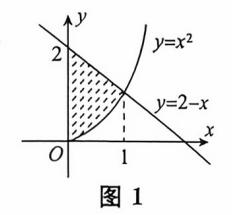
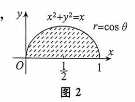
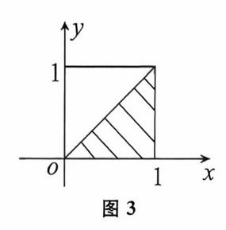
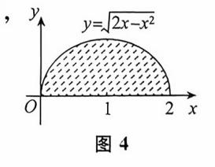
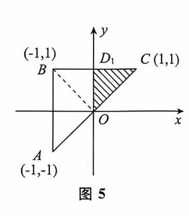
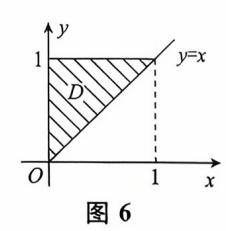
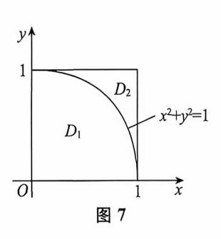

{0}------------------------------------------------

# 第九章 二重积分

| 考试内容                | 考试要求 |    |        |
|---------------------|------|----|--------|
|                     | 数一   | 数二 | 数三     |
| 二重积分的概念             | 理解   | 理解 | 理解     |
| 二重积分的中值定理           | 了解   | 了解 | 了解     |
| 二重积分的计算方法(直角坐标、极坐标) | 掌握   | 掌握 | 掌握     |
| 无界区域上较简单的反常二重积分     | /    | /  | 了解并会计算 |

# 考试内容概要

### 一、二重积分的概念及性质

# 1. 二重积分的概念

定义 设函数 z = f(x,y) 在有界闭区域 D 上有定义,将区域 D 任意分成 n 个小闭区域  $\Delta \sigma_1, \Delta \sigma_2, \cdots, \Delta \sigma_n$ ,

其中  $\Delta \sigma_i$  表示第 i 个小区域,也表示它的面积.在每个  $\Delta \sigma_i$  上任取一点( $\xi_i$ , $\eta_i$ ),作乘积  $f(\xi_i$ , $\eta_i$ ) $\Delta \sigma_i$ ,并求和  $\sum_{i=1}^n f(\xi_i,\eta_i)\Delta \sigma_i$ .记  $\lambda$  为 n 个小区域  $\Delta \sigma_1$ , $\Delta \sigma_2$ ,..., $\Delta \sigma_n$  中的最大直径,如果  $\lim_{\lambda \to 0} \sum_{i=1}^n f(\xi_i,\eta_i)\Delta \sigma_i$  存在,则称此极限值为函数 f(x,y) 在区域 D 上的二重积分,记为

$$\iint_{\mathbb{R}} f(x,y) d\sigma = \lim_{\lambda \to 0} \sum_{i=1}^{n} f(\xi_{i}, \eta_{i}) \Delta \sigma_{i}.$$

**几何意义** 二重积分  $\int_D f(x,y) d\sigma$  是一个数. 当  $f(x,y) \ge 0$  时,其值等于以区域 D 为底,以曲面 z = f(x,y) 为曲顶的曲顶柱体的体积;当  $f(x,y) \le 0$  时,二重积分的值为负值,其绝对值等于上述曲顶柱体的体积.

## 2. 二重积分的性质

性质1(不等式性质).

(1) 若在  $D \perp f(x,y) \leq g(x,y)$ ,则

{1}------------------------------------------------

$$\iint_{D} f(x,y) d\sigma \leqslant \iint_{D} g(x,y) d\sigma.$$

(2) 若在  $D \perp m \leq f(x,y) \leq M$ ,则

$$m\sigma \leqslant \iint f(x,y) d\sigma \leqslant M\sigma$$
,其中  $\sigma$  为区域  $D$  的面积.

(3) 
$$\left| \iint_{D} f(x, y) d\sigma \right| \leqslant \iint_{D} |f(x, y)| d\sigma.$$

#### 性质 2(中值定理).

设函数 f(x,y) 在闭区域 D上连续, $\sigma$ 为区域 D的面积,则在 D上至少存在一点( $\xi$ , $\eta$ ),使得

$$\iint_{\Omega} f(x,y) d\sigma = f(\xi,\eta) \cdot \sigma.$$

二、二重积分的计算

### 1. 利用直角坐标计算

(1) 先 y 后 x. 积分区域 D 可以用  $a \leqslant x \leqslant b, \varphi_1(x) \leqslant y \leqslant \varphi_2(x)$  表示,

$$\iint_{\Omega} f(x,y) d\sigma = \int_{a}^{b} dx \int_{\varphi_{1}(x)}^{\varphi_{2}(x)} f(x,y) dy.$$

(2) 先 x 后 y. 积分区域 D 可以用  $c \leq y \leq d$ ,  $\varphi_1(y) \leq x \leq \varphi_2(y)$  表示,

$$\iint_{\Sigma} f(x,y) d\sigma = \int_{c}^{d} dy \int_{\varphi_{1}(y)}^{\varphi_{2}(y)} f(x,y) dx.$$

# 2. 利用极坐标计算

先 r 后  $\theta$ . 积分区域 D 可以用  $\alpha \leq \theta \leq \beta$ ,  $\varphi_1(\theta) \leq r \leq \varphi_2(\theta)$  表示,

$$\iint_{\mathcal{D}} f(x,y) d\sigma = \int_{a}^{\beta} d\theta \int_{\varphi_{1}(\theta)}^{\varphi_{2}(\theta)} f(r\cos\theta, r\sin\theta) r dr.$$

#### 【注】 适合用极坐标计算的二重积分的特征:

- (1) 适合用极坐标计算的被积函数. 例如  $f(\sqrt{x^2+y^2}), f(\frac{y}{x}), f(\frac{x}{y})$ .
- (2) 适合用极坐标的积分域. 例如

$$x^2 + y^2 \leqslant R^2$$
;  $r^2 \leqslant x^2 + y^2 \leqslant R^2$ ;  $x^2 + y^2 \leqslant 2ax$ ;  $x^2 + y^2 \leqslant 2by$ .

# 3. 利用函数的奇偶性计算

(1) 若积分域 D 关于 y 轴对称, f(x,y) 关于 x 有奇偶性,则:

$$\iint_{D} f(x,y) d\sigma = \begin{cases} 2 \iint_{x \ge 0} f(x,y) d\sigma, & f(x,y) \not \in T x \text{ 为偶函数,} \\ 0, & f(x,y) \not \in T x \text{ 为奇函数.} \end{cases}$$

(2) 若积分域 D 关于x 轴对称, f(x,y) 关于y 有奇偶性,则

{2}------------------------------------------------

$$\iint_{D} f(x,y) d\sigma = \begin{cases} 2 \iint_{D_{y \ge 0}} f(x,y) d\sigma, & f(x,y) 美于 y 为偶函数, \\ 0, & f(x,y) 美于 y 为奇函数. \end{cases}$$

## 4. 利用变量的轮换对称性计算

如果积分域 D 具有轮换对称性,也就是关于直线 y = x 对称,即 D 的表达式中将 x 换作 y,y 换作 x,表达式不变,则

$$\iint_{D} f(x,y) d\sigma = \iint_{D} f(y,x) d\sigma.$$

# 常考题型与典型例题

### 常考题型

- 1. 累次积分交换次序或计算
- 2. 二重积分计算

一、累次积分交换次序或计算

【例 1】 交换累次积分  $\int_0^1 \mathrm{d}x \int_{x^2}^{2-x} f(x,y) \,\mathrm{d}y$  的次序.

首先画域,y 应介于 $y=x^2$  与 y=2-x 之间,x 介于 0 与 1 之间,如图 1 ,则

原式 = 
$$\int_0^1 dy \int_0^{\sqrt{y}} f(x,y) dx + \int_1^2 dy \int_0^{2-y} f(x,y) dx$$
.

【例 2】 (2009,数二)设函数 f(x,y) 连续,则  $\int_{1}^{2} dx \int_{x}^{2} f(x,y) dy + \int_{1}^{2} dy \int_{y}^{4-y} f(x,y) dx =$ 

(A) 
$$\int_{1}^{2} dx \int_{1}^{4-x} f(x,y) dy.$$

(B) 
$$\int_{1}^{2} dx \int_{x}^{4-x} f(x, y) dy$$
.

(C) 
$$\int_{1}^{2} dy \int_{1}^{4-y} f(x,y) dx$$
.

(D) 
$$\int_{1}^{2} dy \int_{y}^{2} f(x, y) dx.$$

 $\iint_{1}^{2} dx \int_{x}^{2} f(x,y) dy + \int_{1}^{2} dy \int_{y}^{4-y} f(x,y) dx$  的积分区域为两部分

 $D_{1} = \{(x,y) \mid 1 \leqslant x \leqslant 2, x \leqslant y \leqslant 2\}, D_{2} = \{(x,y) \mid 1 \leqslant y \leqslant 2, y \leqslant x \leqslant 4 - y\},$ 将其写成一块 $D = \{(x,y) \mid 1 \leqslant y \leqslant 2, 1 \leqslant x \leqslant 4 - y\},$ 故二重积分可以表示为 $\int_{1}^{2} dy \int_{1}^{4-y} f(x,y) dx$ . 答案应选(C).

{3}------------------------------------------------

【例 3】 (1996,数三) 累次积分 
$$\int_0^{\frac{\pi}{2}} d\theta \int_0^{\cos\theta} f(r\cos\theta, r\sin\theta) r dr$$
 可以写成

(A) 
$$\int_{0}^{1} dy \int_{0}^{\sqrt{y-y^{2}}} f(x,y) dx$$
.

(B) 
$$\int_{0}^{1} dy \int_{0}^{\sqrt{1-y^{2}}} f(x,y) dx$$
.

(C) 
$$\int_0^1 dx \int_0^1 f(x,y) dy.$$

(D) 
$$\int_0^1 \mathrm{d}x \int_0^{\sqrt{x-x^2}} f(x,y) \, \mathrm{d}y.$$

首先画域,r应介于r=0与 $r=\cos\theta$ (即  $x^2+y^2=x$ )之间,y  $x^2+y^2=x$   $r=\cos\theta$  $\theta$ 应介于 0 与 $\frac{\pi}{2}$  之间,如图 2.则

原式 = 
$$\int_0^1 \mathrm{d}x \int_0^{\sqrt{x-x^2}} f(x,y) \, \mathrm{d}y.$$

故应选(D).

【例 4】 (2017,数二) 积分
$$\int_0^1 dy \int_y^1 \frac{\tan x}{x} dx =$$
\_\_\_\_\_.

(解) 积分区域如图 3,交换积分次序

$$\int_{0}^{1} dy \int_{y}^{1} \frac{\tan x}{x} dx = \int_{0}^{1} dx \int_{0}^{x} \frac{\tan x}{x} dy = \int_{0}^{1} \tan x dx$$
$$= -\ln(\cos x) \Big|_{0}^{1} = -\ln(\cos 1).$$

【例 5】 积分
$$\int_0^2 dx \int_0^{\sqrt{2x-x^2}} \sqrt{x^2+y^2} dy =$$
\_\_\_\_\_\_.

够 该累次积分在直角坐标下都不易计算,因此在极坐标下计算, 其积分域如图 4.则

原式=
$$\int_0^{\frac{\pi}{2}} d\theta \int_0^{2\cos\theta} r^2 dr$$
$$=\frac{8}{3} \int_0^{\frac{\pi}{2}} \cos^3\theta d\theta$$
$$=\frac{8}{3} \cdot \frac{2}{3} = \frac{16}{9}.$$

二、二重积分计算

【例 6】 (2008,数三)设 
$$D = \{(x,y) | x^2 + y^2 \leq 1\},$$
则 $\int_D (x^2 - y) dx dy = _____.$ 

y 关于 y 为奇函数,积分域关于 x 轴上下对称,则 $\iint y dx dy = 0$ .

原式=
$$\iint_D x^2 dx dy = \frac{1}{2} \iint_D (x^2 + y^2) dx dy$$

(变量轮换对称性)

{4}------------------------------------------------

$$= \frac{1}{2} \int_{0}^{2\pi} d\theta \int_{0}^{1} r^{3} dr = \frac{1}{2} \cdot 2\pi \cdot \frac{1}{4} = \frac{\pi}{4}.$$

【例 7】 (1991, & - & -) 设  $D \in xOy$  平面上以(1,1), (-1,1) 和(-1,-1) 为顶点的三角形区域, $D_1$  是 D 在第一象限的部分,则 $\iint (xy + \cos x \sin y) dx dy$  等于

$$(A)2\iint_{\mathbb{R}}\cos x\sin y\mathrm{d}x\mathrm{d}y.$$

(B) 
$$2\iint_{\mathbb{R}} xy \, \mathrm{d}x \, \mathrm{d}y$$
.

$$(C)4\iint_{D_1} (xy + \cos x \sin y) dxdy.$$

# 解 积分区域如图 5,将积分区域分为两个部分

$$\iint_{D} xy \, dx dy = \iint_{\triangle ABO} xy \, dx dy + \iint_{\triangle OBC} xy \, dx dy = 0 + 0 = 0,$$

$$\iint_{D} \cos x \sin y \, dx dy = \iint_{\triangle ABO} \cos x \sin y \, dx dy + \iint_{\triangle OBC} \cos x \sin y \, dx dy$$

$$= 0 + 2 \iint_{D_{1}} \cos x \sin y \, dx dy$$

$$= 2 \iint_{D_{1}} \cos x \sin y \, dx dy.$$

故应选(A).

本题主要考查二重积分的对称性.

【例 8】 (2006,数三) 计算二重积分  $\int_D \sqrt{y^2-xy} \, \mathrm{d}x \, \mathrm{d}y$ ,其中 D 是由直线 y=x,y=1,x=0 所围成的平面区域.

解 积分区域如图 6,

原式= 
$$\int_0^1 dy \int_0^y \sqrt{y^2 - xy} dx = -\int_0^1 \frac{2}{3} \sqrt{y} (y - x)^{\frac{3}{2}} \Big|_0^y dy$$
  
=  $\frac{2}{3} \int_0^1 y^2 dy = \frac{2}{9}$ .

【例 9】 (2017,数二) 已知平面域  $D = \{(x,y) \mid x^2 + y^2 \leqslant 2y\}$ ,计算二重积分  $I = \iint\limits_{\Sigma} (x+1)^2 \, \mathrm{d}x \, \mathrm{d}y.$ 

$$I = \iint_{\Omega} (x^2 + 2x + 1) \, \mathrm{d}x \, \mathrm{d}y.$$

由于 D 关于 y 轴对称,且函数 2x 是 x 的奇函数,所以  $\iint_D 2x dx dy = 0$ .

{5}------------------------------------------------

$$I = \iint_{D} (x^{2} + 1) dxdy = 2 \int_{0}^{\frac{\pi}{2}} d\theta \int_{0}^{2\sin\theta} r^{3} \cos^{2}\theta dr + \pi$$

$$= 8 \int_{0}^{\frac{\pi}{2}} \sin^{4}\theta \cos^{2}\theta d\theta + \pi = 8 \int_{0}^{\frac{\pi}{2}} \sin^{4}\theta (1 - \sin^{2}\theta) d\theta + \pi$$

$$= 8 \left( \frac{3}{4} \cdot \frac{1}{2} \cdot \frac{\pi}{2} - \frac{5}{6} \cdot \frac{3}{4} \cdot \frac{1}{2} \cdot \frac{\pi}{2} \right) + \pi$$

$$= \frac{5}{4}\pi.$$

【例 10】 (2005, 数二、三) 计算二重积分 
$$\int_{D} |x^2 + y^2 - 1| d\sigma$$
, 其中 
$$D = \{(x,y) \mid 0 \le x \le 1, 0 \le y \le 1\}.$$

M 如图 7 所示,将 D 分成  $D_1$  与  $D_2$  两部分.

$$\iint_{D} |x^{2} + y^{2} - 1| d\sigma$$

$$= \iint_{D_{1}} (1 - x^{2} - y^{2}) d\sigma + \iint_{D_{2}} (x^{2} + y^{2} - 1) d\sigma$$

$$= \iint_{D_{1}} (1 - x^{2} - y^{2}) d\sigma + \left[ \iint_{D} (x^{2} + y^{2} - 1) d\sigma - \iint_{D_{1}} (x^{2} + y^{2} - 1) d\sigma \right]$$

$$= 2 \iint_{D_{1}} (1 - x^{2} - y^{2}) d\sigma + \iint_{D} (x^{2} + y^{2} - 1) d\sigma$$

由于

$$\begin{split} &\iint\limits_{D_1} (1-x^2-y^2) \,\mathrm{d}\sigma = \int_0^{\frac{\pi}{2}} \mathrm{d}\theta \int_0^1 (1-r^2) r \mathrm{d}r = \frac{\pi}{8}\,, \\ &\iint\limits_{D} (x^2+y^2-1) \,\mathrm{d}\sigma = \int_0^1 \mathrm{d}x \int_0^1 (x^2+y^2-1) \,\mathrm{d}y = \int_0^1 \Big(x^2-\frac{2}{3}\Big) \mathrm{d}x = -\frac{1}{3}\,, \\ &\boxplus \coprod \iint\limits_{D} \mid x^2+y^2-1 \mid \mathrm{d}\sigma = \frac{\pi}{4}-\frac{1}{3}\,. \end{split}$$

【例 11】 (2014, 数二、三) 设平面域  $D = \{(x,y) | 1 \le x^2 + y^2 \le 4, x \ge 0, y \ge 0\}$ , 计算  $\iint \frac{x \sin(\pi \sqrt{x^2 + y^2})}{x + y} dx dy.$ 

係 【方法 1】 由于积分域 D 关于直线 y = x 对称,则

$$\iint_{D} \frac{x \sin(\pi \sqrt{x^{2} + y^{2}})}{x + y} dxdy = \iint_{D} \frac{y \sin(\pi \sqrt{x^{2} + y^{2}})}{x + y} dxdy$$

$$= \frac{1}{2} \left[ \iint_{D} \frac{x \sin(\pi \sqrt{x^{2} + y^{2}})}{x + y} dxdy + \iint_{D} \frac{y \sin(\pi \sqrt{x^{2} + y^{2}})}{x + y} dxdy \right]$$

$$= \frac{1}{2} \iint_{D} \sin(\pi \sqrt{x^{2} + y^{2}}) dxdy$$

{6}------------------------------------------------

$$= \frac{1}{2} \int_0^{\frac{\pi}{2}} d\theta \int_1^2 \sin(\pi r) r dr$$
$$= -\frac{1}{4} \int_1^2 r d\cos(\pi r) = -\frac{3}{4}.$$

【方法 2】 
$$\iint_{D} \frac{x \sin(\pi \sqrt{x^{2} + y^{2}})}{x + y} dx dy = \int_{0}^{\frac{\pi}{2}} \frac{\cos \theta}{\cos \theta + \sin \theta} d\theta \cdot \int_{1}^{2} r \sin(\pi r) dr.$$

由于

$$\int_{0}^{\frac{\pi}{2}} \frac{\cos \theta}{\cos \theta + \sin \theta} d\theta = \int_{0}^{\frac{\pi}{2}} \frac{\sin \theta}{\cos \theta + \sin \theta} d\theta = \frac{1}{2} \int_{0}^{\frac{\pi}{2}} \frac{\cos \theta + \sin \theta}{\cos \theta + \sin \theta} d\theta = \frac{\pi}{4},$$

$$\int_{1}^{2} r \sin(\pi r) dr = \frac{1}{\pi} (-r \cos \pi r + \frac{1}{\pi} \sin \pi r) \Big|_{1}^{2} = -\frac{3}{\pi},$$

故 
$$\iint_{D} \frac{x \sin(\pi \sqrt{x^2 + y^2})}{x + y} dx dy = -\frac{3}{4}.$$

【例 12】 (2013,数二、三)设 $D_k$ 是圆域 $D = \{(x,y) | x^2 + y^2 \leq 1\}$ 在第 k 象限的部分,

记 
$$I_k = \iint_{D_k} (y-x) dx dy (k=1,2,3,4)$$
,则

(A) 
$$I_1 > 0$$
.

(B) 
$$I_2 > 0$$
.

(C) 
$$I_3 > 0$$
.

(D) 
$$I_4 > 0$$
.

利用二重积分的不等式性质. 显然,在  $D_2$  上  $y-x \geqslant 0$ ,且 y-x 不恒等于零,则

$$I_2 = \iint\limits_{\Omega} (y - x) \, \mathrm{d}x \, \mathrm{d}y > 0$$

故诜(B).

同学需要练习去试试严选题吧!

还不够,再试试下面的作业题,

# 本章作业超链接 🔊 《基础过关660题》优选 -\_\_\_\_

数学一 104 107 113 116 119 300 302 304 308 314

数学二 189 192 198 200 206 440 442 449 453 459

No.

数学三 122 125 131 134 137 319 321 323 327 333