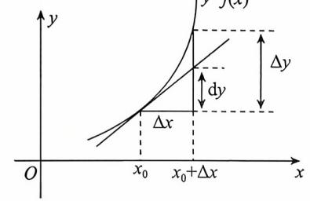
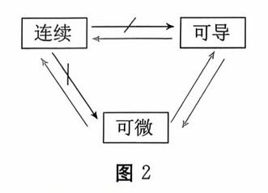
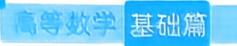

{0}------------------------------------------------

# 第二章 导数与微分

| 考试内容                                                    | 考试要求 |    |    |
|---------------------------------------------------------|------|----|----|
|                                                         | 数一   | 数二 | 数三 |
| 导数的概念及其可导性与连续性之间的关系                                     | 理解   | 理解 | 理解 |
| 基本初等函数的导数公式 导数和微分的四则运算法则复合函数的求导法则                       | 掌握   | 掌握 | 掌握 |
| 高阶导数的概念 一阶微分形式的不变性                                      | 了解   | 了解 | 了解 |
| 分段函数的导数 反函数与隐函数的导数 函数的微分 简单函数的高阶导数 平面曲线的切线方程与法线方程 | 会求   | 会求 | 会求 |
| 微分的概念、导数与微分之间的关系导数的几何意义                                 | 理解   | 理解 | 理解 |
| 导数的物理意义                                                 | 了解   | 了解 | /  |
| 由参数方程所确定的函数的导数                                          | 会求   | 会求 | /  |

## 考试内容概要

#### 一、导数与微分的概念

### 1. 导数的概念

定义(

$$\lim_{\Delta x \to 0} \frac{\Delta y}{\Delta x} = \lim_{\Delta x \to 0} \frac{f(x_0 + \Delta x) - f(x_0)}{\Delta x}$$

存在,则称 f(x) **在点**  $x_0$  **处可导**,并称此极限值为 f(x) **在点**  $x_0$  **处的导数**,记为  $f'(x_0)$ ,或  $y' \mid_{x=x_0}$ ,或  $\frac{\mathrm{d}y}{\mathrm{d}x} \mid_{x=x_0}$  . 如果上述极限不存在,则称 f(x) **在点**  $x_0$  **处不可导**.

{1}------------------------------------------------

【注】 常用的导数定义的等价形式有:

$$f'(x_0) = \lim_{x \to x_0} \frac{f(x) - f(x_0)}{x - x_0}, f'(x_0) = \lim_{h \to 0} \frac{f(x_0 + h) - f(x_0)}{h}.$$

定义(左导数) 设函数 y = f(x) 在点  $x_0$  及其某个左邻域内有定义,若左极限

$$\lim_{\Delta x \to 0^{-}} \frac{\Delta y}{\Delta x} = \lim_{\Delta x \to 0^{-}} \frac{f(x_0 + \Delta x) - f(x_0)}{\Delta x} = \lim_{x \to x_0^{-}} \frac{f(x) - f(x_0)}{x - x_0}$$

存在时,则称该极限值为 f(x) 在点  $x_0$  处的**左导数**,记为  $f'_{-}(x_0)$ .

定义(右导数) 设函数 y = f(x) 在点  $x_0$  及其某个右邻域内有定义,若右极限

$$\lim_{\Delta x \to 0^{+}} \frac{\Delta y}{\Delta x} = \lim_{\Delta x \to 0^{+}} \frac{f(x_0 + \Delta x) - f(x_0)}{\Delta x} = \lim_{x \to x_0^{+}} \frac{f(x) - f(x_0)}{x - x_0}$$

存在时,则称该极限值为 f(x) 在点  $x_0$  处的**右导数**,记为  $f'_+(x_0)$ .

定理 函数 f(x) 在点  $x_0$  处可导的充分必要条件是它在该点处左导数与右导数都存在且相等.

定义(**区间上可导及导函数**) 如果 y = f(x) 在开区间(a,b) 内每一点都可导,则称 f(x) **在区间**(a,b) **内可导**. 此时对于(a,b) 内的每一点 x,都对应一个导数值 f'(x),常称 f'(x) 为 f(x) 在(a,b) 内的**导函数**,简称为**导数**. 若 f(x) 在区间(a,b) 内可导,且  $f'_+(a)$  和  $f'_-(b)$  都存在,则称 f(x) **在区间**[a,b] **上可导**.

【例 1】 (1994,数三) 设 
$$f(x) = \begin{cases} \frac{2}{3}x^3, & x \leq 1, \\ y = 1, & \text{otherwise} \end{cases}$$
 则  $f(x)$  在  $x = 1$  处的

(A) 左、右导数都存在.

- (B) 左导数存在但右导数不存在.
- (C) 左导数不存在但右导数存在.
- (D) 左、右导数都不存在.

(方法 1) 
$$f'_{-}(1) = \lim_{x \to 1^{-}} \frac{\frac{2}{3}x^{3} - \frac{2}{3}}{x - 1} = \frac{2}{3} \lim_{x \to 1^{-}} \frac{(x - 1)(x^{2} + x + 1)}{x - 1} = 2,$$

$$f'_{+}(1) = \lim_{x \to 1^{+}} \frac{x^{2} - \frac{2}{3}}{x - 1} = \infty,$$

则左导数存在但右导数不存在,故应选(B).

【方法 2】 
$$f'_{-}(1) = \left(\frac{2}{3}x^3\right)'\Big|_{x=1} = 2x^2\Big|_{x=1} = 2,$$

$$\lim_{x \to 1^+} f(x) = \lim_{x \to 1^+} x^2 = 1,$$

$$f(1) = \frac{2}{3}, \lim_{x \to 1^+} f(x) \neq f(1),$$

即 f(x) 在 x = 1 处非右连续,则右导数不存在,故应选(B).

【注】 一种经典错误是:  $f'_{+}(1) = (x^2)'|_{x=1} = 2x|_{x=1} = 2$ . 错误的原因是  $f(1) \neq x^2|_{x=1}$ .

{2}------------------------------------------------

【例 2】 (1990,数四、五) 设函数 f(x) 对任意 x 均满足等式 f(1+x) = af(x),且有 f'(0) = b,其中 a,b 为非零常数,则

- (A) f(x) 在 x = 1 处不可导.
- (B) f(x) 在 x = 1 处可导,且 f'(1) = a.
- (C) f(x) 在 x = 1 处可导,且 f'(1) = b.
- (D) f(x) 在 x = 1 处可导,且 f'(1) = ab.
- (解)【方法1】 由导数定义知

$$f'(1) = \lim_{\Delta x \to 0} \frac{f(1 + \Delta x) - f(1)}{\Delta x}$$

$$= \lim_{\Delta x \to 0} \frac{af(\Delta x) - af(0)}{\Delta x}$$

$$= a \lim_{\Delta x \to 0} \frac{f(\Delta x) - f(0)}{\Delta x}$$

$$= af'(0) = ab,$$

故应选(D).

【方法2】 由导数定义知

$$f'(1) = \lim_{x \to 1} \frac{f(x) - f(1)}{x - 1}$$

$$= \lim_{x \to 1} \frac{f[1 + (x - 1)] - f(1)}{x - 1}$$

$$= \lim_{x \to 1} \frac{af(x - 1) - af(0)}{x - 1}$$

$$= a \lim_{x \to 1} \frac{f(x - 1) - f(0)}{x - 1}$$

$$= af'(0) = ab.$$

【方法3】 欢迎学有余力的同学深入思考

【方法 4】 欢迎学有余力的同学深入思考

{3}------------------------------------------------

#### 2. 微分的概念

定义(**微分**) 设函数 y = f(x) 在点  $x_0$  的某一邻域内有定义,如果函数的增量  $\Delta y = f(x_0 + \Delta x) - f(x_0)$  可以表示为

$$\Delta y = A \Delta x + o(\Delta x), (\Delta x \rightarrow 0),$$

其中 A 为不依赖于  $\Delta x$  的常数,则称函数 f(x) **在点**  $x_0$  **处可微**,称  $A\Delta x$  为函数 f(x) 在点  $x_0$  处相应于自变量增量  $\Delta x$  的微分,记为  $\mathrm{d} y = A\Delta x$ .

定理 函数 y = f(x) 在点  $x_0$  处可微的充分必要条件是 f(x) 在点  $x_0$  处可导,且有  $dy = f'(x_0)\Delta x = f'(x_0)dx$ 

在点 x 处,常记 dy = f'(x) dx.

【例 3】 (1988, 数一、二、三) 若函数 y = f(x) 有  $f'(x_0) = \frac{1}{2}$ ,则当  $\Delta x \to 0$  时,该函数 在 $x = x_0$ 处的微分 dy 是

- (A)与  $\Delta x$  等价的无穷小.
- (B) 与  $\Delta x$  同阶的无穷小.
- (C) 比  $\Delta x$  低阶的无穷小.
- (D) 比  $\Delta x$  高阶的无穷小.

$$\frac{\mathrm{d}y}{\Delta x} = \frac{\frac{1}{2}\Delta x}{\Delta x} = \frac{1}{2} \neq 0$$
,故选(B).

#### 3. 导数与微分的几何意义

(1) 导数的几何意义.

导数  $f'(x_0)$  在几何上表示曲线 y = f(x) 在点 $(x_0, f(x_0))$  处切线的斜率.

如果函数 f(x) 在点  $x_0$  处可导,则曲线 y=f(x) 在点 $(x_0,f(x_0))$  处必有切线,其切线方程为

$$y - f(x_0) = f'(x_0)(x - x_0).$$

如果  $f'(x_0) \neq 0$ ,则此曲线 y = f(x) 在点 $(x_0, f(x_0))$  处的法线方程为

$$y - f(x_0) = -\frac{1}{f'(x_0)}(x - x_0).$$

如果  $f'(x_0) = 0$ ,则曲线 y = f(x) 在点 $(x_0, f(x_0))$  处的切线方程为  $y = f(x_0)$ ,即曲线 在点 $(x_0, f(x_0))$  处有水平切线.

【注】 若函数 f(x) 在  $x = x_0$  处可导,则曲线 y = f(x) 在点 $(x_0, f(x_0))$  处有切线,反之则不然. 例如曲线  $y = x^{\frac{1}{3}}$  在点(0,0) 处有切线 x = 0(y 轴),但函数  $f(x) = x^{\frac{1}{3}}$  在 x = 0 处不可导 $(f'(0) = \infty)$ .

(2) 微分的几何意义.

如图 1,微分  $\mathrm{d}y=f'(x_0)\mathrm{d}x$  在几何上表示曲线 y=f(x) 的切线上的增量.

 $\Delta y = f(x_0 + \Delta x) - f(x_0)$  在几何上表示曲线 y = f(x) 上 一 的增量.  $\Delta y \approx \mathrm{d}y$ .

图 1

{4}------------------------------------------------

【例 4】 (2004,数一) 曲线  $y = \ln x$  上与直线 x + y = 1 垂直的切线方程为\_\_\_\_\_

直线 x+y=1 的斜率为 -1,曲线  $y=\ln x$  在点 $(x,\ln x)$  处切线斜率为

$$k_{tot} = (\ln x)' = \frac{1}{x}.$$

由题设知

$$\frac{1}{x}=1$$
,

则 x = 1,在该点处切线方程为

$$y - \ln 1 = 1 \cdot (x - 1),$$

即 y = x - 1.

#### 4. 连续、可导、可微之间的关系

- 【例 5】 对以上连续、可导、可微之间关系图(图 2)中,可推得的关系给出证明,不可推得的关系举出反例.
  - (i) 我们先证明可导与可微等价. 若函数 f(x) 在  $x_0$  处可导,则由导数的定义可知

$$\lim_{\Delta x \to 0} \frac{\Delta y}{\Delta x} = \lim_{\Delta x \to 0} \frac{f(x_0 + \Delta x) - f(x_0)}{\Delta x} = f'(x_0),$$

则由极限与无穷小的关系可知

$$\frac{\Delta y}{\Delta x} = \frac{f(x_0 + \Delta x) - f(x_0)}{\Delta x} = f'(x_0) + \alpha,$$

其中 $\lim_{\Delta x \to 0} \alpha = 0$ ,由此可知

$$\Delta y = f(x_0 + \Delta x) - f(x_0) = f'(x_0) \Delta x + \alpha \Delta x$$
  
=  $A \Delta x + o(\Delta x)$ ,

其中  $A = f'(x_0)$ ,由微分定义可知函数 f(x) 在  $x_0$  处可微.

若函数 f(x) 在  $x_0$  处可微,则由微分的定义可知

$$\Delta y = f(x_0 + \Delta x) - f(x_0) = A\Delta x + o(\Delta x),$$

上式两端同除  $\Delta x$ ,然后令  $\Delta x \rightarrow 0$  得

$$\lim_{\Delta x \to 0} \frac{\Delta y}{\Delta x} = \lim_{\Delta x \to 0} \frac{f(x_0 + \Delta x) - f(x_0)}{\Delta x} = A,$$

则由导数定义可知函数 f(x) 在  $x_0$  处可导,且  $f'(x_0) = A$ .

关于可导和可微都能推得连续的证明留给读者.

{5}------------------------------------------------

连续不能推得可导,也不能推得可微,其经典的反例是 f(x) = |x|.即 f(x) = |x|在 x = 0 处连续,但在 x = 0 处既不可导也不可微.具体证明留给读者.

【注】 函数 
$$f(x) = |x|, g(x) = \sqrt[3]{x}, h(x) = \begin{cases} x\sin\frac{1}{x}, & x \neq 0, \\ 0, & x = 0 \end{cases}$$
 是 3 个在  $x = 0$  处连

续,但在x=0处既不可导也不可微的经典反例.具体证明留给读者.

【例 6】 (2020,数一)设函数 f(x) 在(-1,1)上有定义,且 $\lim_{x\to 0} f(x) = 0$ ,则

(A) 
$$\lim_{x \to 0} \frac{f(x)}{\sqrt{|x|}} = 0$$
 时,  $f(x)$  在  $x = 0$  处可导.

(B) 当
$$\lim_{x\to 0} \frac{f(x)}{x^2} = 0$$
 时,  $f(x)$  在  $x = 0$  处可导.

(C) 当 
$$f(x)$$
 在  $x = 0$  处可导时, $\lim_{x \to 0} \frac{f(x)}{\sqrt{|x|}} = 0$ .

(D) 当 
$$f(x)$$
 在  $x = 0$  处可导时,  $\lim_{x \to 0} \frac{f(x)}{x^2} = 0$ .

## (解)【方法1】 直接法

由 f(x) 在 x = 0 处可导知, f(x) 在该点连续,则

$$\lim_{x \to 0} f(x) = f(0) = 0, \lim_{x \to 0} \frac{f(x)}{x} = f'(0),$$

则
$$\lim_{x\to 0} \frac{f(x)}{\sqrt{|x|}} = \lim_{x\to 0} \frac{f(x)}{x} \cdot \lim_{x\to 0} \frac{x}{\sqrt{|x|}} = f'(0) \cdot 0 = 0.$$
故应选(C).

#### 【方法 2】 排除法

令 
$$f(x) = \begin{cases} x^3, & x \neq 0, \\ 1, & x = 0. \end{cases}$$
 显然有 $\lim_{x \to 0} f(x) = 0,$  
$$\lim_{x \to 0} \frac{f(x)}{\sqrt{|x|}} = \lim_{x \to 0} \frac{x^3}{\sqrt{|x|}} = 0,$$
 
$$\lim_{x \to 0} \frac{f(x)}{x^2} = \lim_{x \to 0} \frac{x^3}{x^2} = 0,$$

但 f(x) 在 x=0 处不可导,因为 f(x) 在 x=0 处不连续,则排除选项(A)(B).

若令 
$$f(x) = x$$
,显然有 $\lim_{x \to 0} f(x) = 0$ ,且  $f(x)$  在  $x = 0$  处可导,但

$$\lim_{x \to 0} \frac{f(x)}{r^2} = \lim_{x \to 0} \frac{x}{r^2} = \infty \neq 0,$$

则排除(D)选项,故应选(C).

#### 二、导数公式及求导法则

#### 1. 基本初等函数的导数公式

$$(1)(C)' = 0. (2)(x^{\alpha})' = \alpha x^{\alpha-1}.$$

{6}------------------------------------------------

$$(3)(a^x)' = a^x \ln a.$$

$$(5)(\log_a x)' = \frac{1}{x \ln a}.$$

$$(7)(\sin x)' = \cos x.$$

$$(9)(\tan x)' = \sec^2 x$$
.

$$(11)(\sec x)' = \sec x \tan x.$$

(13) 
$$(\arcsin x)' = \frac{1}{\sqrt{1-x^2}}$$
.

(15)(arctan 
$$x$$
)' =  $\frac{1}{1+x^2}$ .

$$(4)(e^x)'=e^x.$$

(6) 
$$(\ln |x|)' = \frac{1}{x}$$
.

$$(8)(\cos x)' = -\sin x$$
.

$$(10)(\cot x)' = -\csc^2 x.$$

$$(12)(\csc x)' = -\csc x \cot x.$$

$$(14)(\arccos x)' = -\frac{1}{\sqrt{1-x^2}}.$$

(16) 
$$(\operatorname{arccot} x)' = -\frac{1}{1+x^2}$$
.

### 2. 求导法则

(1) 有理运算法则.

设 u = u(x), v = v(x) 在 x 处可导,则

$$(u \pm v)' = u' \pm v'.$$

$$(uv)' = u'v + uv'.$$

$$\left(\frac{u}{v}\right)' = \frac{u'v - uv'}{v^2} \quad (v \neq 0).$$

(2) 复合函数求导法.

设  $u = \varphi(x)$  在 x 处可导,y = f(u) 在对应点处可导,则复合函数  $y = f[\varphi(x)]$  在 x 处可导,且  $\frac{\mathrm{d}y}{\mathrm{d}x} = \frac{\mathrm{d}y}{\mathrm{d}u} \cdot \frac{\mathrm{d}u}{\mathrm{d}x} = f'(u)\varphi'(x)$ .

【例 7】 (1995,数二)设  $y = \cos(x^2) \sin^2 \frac{1}{x}$ ,则 y' =\_\_\_\_\_.

$$y' = \left[\cos(x^2)\right]' \cdot \sin^2\frac{1}{x} + \cos(x^2) \cdot \left(\sin^2\frac{1}{x}\right)'$$
$$= -2x\sin(x^2) \cdot \sin^2\frac{1}{x} - \frac{1}{x^2}\sin\frac{2}{x} \cdot \cos(x^2).$$

用到三角函数公式  $\sin \frac{2}{x} = 2\sin \frac{1}{x}\cos \frac{1}{x}$  化简.

【例 8】 设函数 f(x) 可导,试证:

- (1) 若 f(x) 是奇函数,则 f'(x) 是偶函数.
- (2) 若 f(x) 是偶函数,则 f'(x) 是奇函数.
- (3) 若 f(x) 是周期函数,则 f'(x) 也是周期函数.
- (1) 由于 f(x) 是奇函数,则

$$f(-x) = -f(x)$$
.

由于 f(x) 可导,上式两端对 x 求导得

$$f'(-x) \cdot (-1) = -f'(x),$$

{7}------------------------------------------------

即 f'(-x) = f'(x),故 f'(x) 为偶函数.

同理可证(2)和(3).

【注】 本题所证结论以后做题可直接用.

【例 9】 (2022,数三) 已知函数  $f(x) = e^{\sin x} + e^{-\sin x}$ ,则  $f'''(2\pi) =$ .

可以直接计算三阶导数,比较复杂,容易出错.利用函数的奇偶性、周期性,

$$f(-x) = e^{-\sin x} + e^{\sin x} = f(x),$$

f(x) 为偶函数,故 f'(x) 为奇函数,f''(x) 为偶函数,f'''(x) 为奇函数.

$$f(x+2\pi) = e^{\sin(x+2\pi)} + e^{-\sin(x+2\pi)} = e^{\sin x} + e^{-\sin x} = f(x),$$

f(x) 是以  $2\pi$  为周期的周期函数.

从而 f'(x), f''(x), f'''(x) 均以  $2\pi$  为周期的周期函数,

所以  $f'''(0) = 0 = f'''(2\pi)$ .

#### (3) 隐函数求导法。

设 y = y(x) 是由方程 F(x,y) = 0 所确定的可导函数,为求得 y',可在方程 F(x,y) = 0 两边对 x 求导,可得到一个含有 y' 的方程,从中解出 y' 即可.

【注】 y' 也可由多元函数微分法中的隐函数求导公式 $\frac{\mathrm{d}y}{\mathrm{d}x} = -\frac{F_x'}{F_x'}$ 得到.

【例 10】 (1993,数三) 函数 y = y(x) 由方程  $\sin(x^2 + y^2) + e^x - xy^2 = 0$  所确定,则  $\frac{\mathrm{d}y}{\mathrm{d}x} =$ \_\_\_\_\_.

 $\mathfrak{A}$  方程两边同时对x求导,

$$\cos(x^{2} + y^{2})(2x + 2yy') + e^{x} - y^{2} - 2xyy' = 0,$$

$$\frac{dy}{dx} = y' = \frac{y^{2} - e^{x} - 2x\cos(x^{2} + y^{2})}{2y\cos(x^{2} + y^{2}) - 2xy}.$$

#### (4) 反函数的导数.

若 y = f(x) 在某区间内单调可导,且  $f'(x) \neq 0$ ,则其反函数  $x = \varphi(y)$  在对应区间内也可导,且

$$\varphi'(y) = \frac{1}{f'(x)}, \quad \exists \frac{\mathrm{d}x}{\mathrm{d}y} = \frac{1}{\frac{\mathrm{d}y}{\mathrm{d}x}}.$$

【例 11】 证明(
$$\arcsin x$$
)' =  $\frac{1}{\sqrt{1-x^2}}$ .

 $y = \arcsin x, x = \sin y,$ 

$$y'_x = (\arcsin x)'_x = \frac{1}{x'_y} = \frac{1}{\cos y} = \frac{1}{\sqrt{1 - \sin^2 y}} = \frac{1}{\sqrt{1 - x^2}}.$$

{8}------------------------------------------------

#### (5) 参数方程求导法.(数学三不要求)

设 y = y(x) 是由参数方程  $\begin{cases} x = \varphi(t), \\ y = \psi(t) \end{cases}$  ( $\alpha < t < \beta$ ) 确定的函数,则

① 若  $\varphi(t)$  和  $\psi(t)$  都可导,且  $\varphi'(t) \neq 0$ ,则

$$\frac{\mathrm{d}y}{\mathrm{d}x} = \frac{\phi'(t)}{\varphi'(t)}.$$

② 若  $\varphi(t)$  和  $\psi(t)$  二阶可导,且  $\varphi'(t) \neq 0$ ,则

$$\frac{\mathrm{d}^2 y}{\mathrm{d} x^2} = \frac{\mathrm{d}}{\mathrm{d} t} \left( \frac{\psi'(t)}{\varphi'(t)} \right) \cdot \frac{1}{\varphi'(t)} = \frac{\psi''(t) \varphi'(t) - \varphi''(t) \psi'(t)}{\varphi'^3(t)}.$$

【例 12】 (2020,数一)设 
$$\begin{cases} x = \sqrt{t^2 + 1}, \\ y = \ln(t + \sqrt{t^2 + 1}), \end{cases} \text{则} \frac{d^2 y}{dx^2} \bigg|_{t=1} = \underline{\qquad}.$$

(方法 1) 
$$\frac{\mathrm{d}y}{\mathrm{d}x} = \frac{y_t'}{x_t'} = \frac{\frac{1}{\sqrt{t^2 + 1}}}{\frac{2t}{2\sqrt{t^2 + 1}}} = \frac{1}{t},$$

$$\left. \frac{\mathrm{d}y}{\mathrm{d}x} \right|_{t=1} = 1.$$

$$\frac{\mathrm{d}^2 y}{\mathrm{d}x^2} = \frac{\mathrm{d}}{\mathrm{d}t} \left(\frac{1}{t}\right) \cdot \frac{\mathrm{d}t}{\mathrm{d}x} = \left(-\frac{1}{t^2}\right) \frac{1}{\frac{\mathrm{d}x}{\mathrm{d}t}} = \left(-\frac{1}{t^2}\right) \frac{1}{\frac{2t}{2\sqrt{t^2+1}}},$$

$$\frac{\mathrm{d}^2 y}{\mathrm{d}x^2}\bigg|_{t=1} = -\sqrt{2}.$$

【方法 2】 欢迎学有余力的同学深入思考

#### (6) 对数求导法.

如果 y = y(x) 的表达式由多个因式的乘除、方幂构成,或是幂指函数的形式,则可先将函数取对数,然后两边对 x 求导.

【例 13】 (2005,数二) 设  $y = (1 + \sin x)^x$ ,则 $dy|_{x=\pi} =$ \_\_\_\_\_.

$$\frac{y'}{y} = \ln(1 + \sin x) + \frac{x \cos x}{1 + \sin x},$$

$$y' = (1 + \sin x)^{x} \cdot \left[ \ln(1 + \sin x) + \frac{x \cos x}{1 + \sin x} \right],$$

故  $\mathrm{d}y \mid_{x=\pi} = y' \mid_{x=\pi} \cdot \mathrm{d}x = -\pi \mathrm{d}x.$ 

{9}------------------------------------------------

或

$$y = (1 + \sin x)^{x} = e^{x\ln(1+\sin x)},$$

$$y' = e^{x\ln(1+\sin x)} [x\ln(1+\sin x)]'$$

$$= e^{x\ln(1+\sin x)} [\ln(1+\sin x) + x \cdot \frac{\cos x}{1+\sin x}],$$

 $dy \mid_{x=\pi} = y' \mid_{x=\pi} \cdot dx = -\pi dx.$ 

[例 14] 设 
$$y = \sqrt{\frac{(x-1)(x-2)}{(x-3)(x-4)}},$$
 求  $y'$ .

$$\ln y = \frac{1}{2} \left[ \ln |x-1| + \ln |x-2| - \ln |x-3| - \ln |x-4| \right],$$

$$\frac{y'}{y} = \frac{1}{2} \left( \frac{1}{x-1} + \frac{1}{x-2} - \frac{1}{x-3} - \frac{1}{x-4} \right),$$

$$y' = \frac{1}{2} \sqrt{\frac{(x-1)(x-2)}{(x-3)(x-4)}} \left( \frac{1}{x-1} + \frac{1}{x-2} - \frac{1}{x-3} - \frac{1}{x-4} \right).$$

#### 三、高阶导数

#### 1. 高阶导数的概念

定义(高阶导数) 如果 y' = f'(x) 作为 x 的函数在点 x 可导,则称 y' 的导数为 y = f(x) 的二阶导数,记为 y'',或 f''(x),或  $\frac{\mathrm{d}^2 y}{\mathrm{d} x^2}$ .

一般地,函数 y = f(x) 的 n 阶导数为  $y^{(n)} = [f^{(n-1)}(x)]'$ ,也可记为  $f^{(n)}(x)$  或  $\frac{\mathrm{d}^n y}{\mathrm{d} x^n}$ . 即 n 阶导数就是 n-1 阶导函数的导数,

$$f^{(n)}(x_0) = \lim_{\Delta x \to 0} \frac{f^{(n-1)}(x_0 + \Delta x) - f^{(n-1)}(x_0)}{\Delta x}$$
$$= \lim_{x \to x_0} \frac{f^{(n-1)}(x) - f^{(n-1)}(x_0)}{x - x_0}.$$

【注】 如果函数 f(x) 在点 x 处 n 阶可导,则在点 x 的某邻域内 f(x) 必定具有一切低于 n 阶的导数.

## 2. 常用的商阶导数公式

$$(1) (\sin x)^{(n)} = \sin\left(x + n \cdot \frac{\pi}{2}\right).$$

$$(2) (\cos x)^{(n)} = \cos\left(x + n \cdot \frac{\pi}{2}\right).$$

(3) 
$$(u \pm v)^{(n)} = u^{(n)} \pm v^{(n)}$$
.

$$(4) (uv)^{(n)} = \sum_{k=0}^{n} C_{n}^{k} u^{(k)} v^{(n-k)}.$$

{10}------------------------------------------------

【例 15】 设  $y = \sin 3x$ , 求  $y^{(n)}$ .

$$\frac{dy}{dx} = \frac{dy}{du} \cdot \frac{du}{dx} = \frac{dy}{du} \cdot 3,$$

$$\frac{d^2y}{dx^2} = \frac{d^2y}{du^2} \cdot \frac{du}{dx} \cdot 3 = \frac{d^2y}{du^2} \cdot 3^2$$

$$= \sin\left(u + 2 \cdot \frac{\pi}{2}\right) \cdot 3^2$$

$$= 3^2 \sin\left(3x + 2 \cdot \frac{\pi}{2}\right),$$

由归纳法可知

$$y^{(n)} = 3^n \sin\left(3x + n \cdot \frac{\pi}{2}\right).$$

【例 16】 设  $y = x^2 \cos x$ ,求  $y^{(n)}$ .

$$(uv)^{(n)} = \sum_{k=0}^{n} C_n^k u^{(k)} v^{(n-k)},$$

$$y^{(n)} = x^2 \cos\left(x + \frac{n\pi}{2}\right) + 2nx \cos\left(x + \frac{n-1}{2}\pi\right) + n(n-1)\cos\left(x + \frac{(n-2)\pi}{2}\right).$$

【注】 x² 求二阶导是常数,再求导就等于零.

## 常考题型与典型例题

### 常考题型

- 1. 导数定义
- 2. 复合函数、隐函数、参数方程求导(数学三不要求)
- 3. 高阶导数
- 4. 导数应用

#### 一、导数定义

【例 17】 (1994, 数三) 已知 
$$f'(x_0) = -1$$
, 则  $\lim_{x \to 0} \frac{x}{f(x_0 - 2x) - f(x_0 - x)} = \underline{\hspace{1cm}}$ .

(科) 【方法 1】 由 
$$f'(x_0) = -1$$
 知

$$\lim_{x \to 0} \frac{f(x_0 - 2x) - f(x_0 - x)}{x} = -2 \lim_{x \to 0} \frac{f(x_0 - 2x) - f(x_0)}{-2x} + \lim_{x \to 0} \frac{f(x_0 - x) - f(x_0)}{-x}$$

$$= -2f'(x_0) + f'(x_0)$$

$$= -f'(x_0) = 1,$$

$$\iiint_{x\to 0} \frac{x}{f(x_0-2x)-f(x_0-x)} = 1.$$

{11}------------------------------------------------

【方法 2】 令 f(x) = -x,显然有  $f'(x_0) = -1$ ,则

$$\lim_{x \to 0} \frac{x}{f(x_0 - 2x) - f(x_0 - x)} = \lim_{x \to 0} \frac{x}{-(x_0 - 2x) + (x_0 - x)} = \lim_{x \to 0} \frac{x}{x} = 1.$$

【例 18】 (2011, 数二、三)设函数 f(x) 在 x = 0 处可导,且 f(0) = 0,则 $\lim_{x \to 0} \frac{x^2 f(x) - 2f(x^3)}{x^3} = 0$ 

$$(A) - 2f'(0)$$
.  $(B) - f'(0)$ .  $(C) f'(0)$ .

(B) 
$$-f'(0)$$
.

【方法 1】 直接法 由题设知  $f'(0) = \lim_{x \to 0} \frac{f(x)}{x}$ ,则

$$\lim_{x \to 0} \frac{x^2 f(x) - 2f(x^3)}{x^3} = \lim_{x \to 0} \frac{f(x)}{x} - 2 \lim_{x \to 0} \frac{f(x^3)}{x^3}$$
$$= f'(0) - 2f'(0) = -f'(0).$$

故应选(B).

【方法 2】 排除法

令 f(x) = x,显然 f(0) = 0, f'(0) = 1,此时

$$\lim_{x \to 0} \frac{x^2 f(x) - 2f(x^3)}{x^3} = \lim_{x \to 0} \frac{x^3 - 2x^3}{x^3} = -1.$$

由此可知,选项(A)(C)(D)都不正确,故选(B).

【例 19】 (2013,数一)设函数 y = f(x) 由方程  $y - x = e^{x(1-y)}$  确定,则 $\lim_{n \to \infty} \left[ f\left(\frac{1}{n}\right) - 1 \right] =$ 

) 由  $y-x = e^{x(1-y)}$  知, x = 0 时, y = 1.

$$y'-1 = e^{x(1-y)}[(1-y)-xy'],$$

则 y'(0) = 1,

$$\lim_{n\to\infty} \left[ f\left(\frac{1}{n}\right) - 1 \right] = \lim_{n\to\infty} \frac{f\left(\frac{1}{n}\right) - f(0)}{\frac{1}{n}} = f'(0) = y'(0) = 1.$$

【例 20】 (2018, 数一、二、三) 下列函数中, 在x = 0 处不可导的是

$$(A) f(x) = |x| \sin |x|.$$

$$(B) f(x) = |x| \sin \sqrt{|x|}.$$

$$(C) f(x) = \cos |x|.$$

(D) 
$$f(x) = \cos \sqrt{|x|}$$
.

(解)【方法1】 直接法

若  $f(x) = \cos \sqrt{|x|}$ ,则由导数定义知

$$f'(0) = \lim_{x \to 0} \frac{\cos \sqrt{|x|} - 1}{x} = \lim_{x \to 0} \frac{-\frac{1}{2} (\sqrt{|x|})^2}{x} = \lim_{x \to 0} \frac{-\frac{1}{2} |x|}{x},$$

该极限不存在,则  $f(x) = \cos \sqrt{|x|}$  在 x = 0 处不可导,故应选(D).

{12}------------------------------------------------

#### 【方法 2】 排除法

若  $f(x) = |x| \sin |x|$ ,则由导数定义得

$$f'(0) = \lim_{x \to 0} \frac{f(x) - f(0)}{x} = \lim_{x \to 0} \frac{|x| \sin |x|}{x}.$$

当  $x \to 0$  时,  $\sin |x|$  为无穷小,  $\frac{|x|}{x}$  有界,则 $\lim_{x\to 0} \frac{|x|\sin |x|}{x} = 0$ ,即 f'(0) = 0,故排除(A). 同理排除(B).

若  $f(x) = \cos |x|$ ,由于  $\cos |x| = \cos x$ ,则 f'(0) 存在,从而排除(C).故应选(D).

【例 21】 (1989,数三)设 f(x) 在 x=a 的某个邻域内有定义,则 f(x) 在 x=a 处可导的一个充分条件是

(A) 
$$\lim_{h \to +\infty} h \left[ f\left(a + \frac{1}{h}\right) - f(a) \right]$$
存在.

(B) 
$$\lim_{h\to 0} \frac{f(a+2h) - f(a+h)}{h}$$
 存在.

(C) 
$$\lim_{h\to 0} \frac{f(a+h)-f(a-h)}{2h}$$
 存在.

(D) 
$$\lim_{h\to 0} \frac{f(a) - f(a-h)}{h}$$
 存在.

解 对于选项(A),

$$\lim_{h\to +\infty} h \left[ f\left(a + \frac{1}{h}\right) - f(a) \right] \not = \text{At} \Rightarrow \lim_{h\to +\infty} \frac{f\left(a + \frac{1}{h}\right) - f(a)}{\frac{1}{h}}, h \to +\infty, \frac{1}{h} \to 0^+,$$

只能得证右导数存在.

对于选项(B),

$$\lim_{h \to 0} \frac{f(a+2h) - f(a+h)}{h} = 2 \lim_{h \to 0} \frac{f(a+2h) - f(a)}{2h} - \lim_{h \to 0} \frac{f(a+h) - f(a)}{h},$$

并不能保证两个极限单独存在.

对于选项(C),

$$\lim_{h \to 0} \frac{f(a+h) - f(a-h)}{2h} = \frac{1}{2} \lim_{h \to 0} \left[ \frac{f(a+h) - f(a)}{h} - \frac{f(a-h) - f(a)}{h} \right],$$

并不能保证两个极限单独存在.

对于选项(D),  $\lim_{h\to 0} \frac{f(a)-f(a-h)}{h}$  存在是 f(x) 在 x=a 处可导的一个充分条件. 故应选(D).

二、复合函数、隐函数、参数方程求导(數學三不要求)

【例 22】 (1993,数三) 设  $y = \sin[f(x^2)]$ ,其中 f 具有二阶导数,求 $\frac{d^2 y}{dx^2}$ .

$$\frac{\mathrm{d}y}{\mathrm{d}x} = \cos[f(x^2)]f'(x^2) \cdot 2x,$$

{13}------------------------------------------------

$$\frac{\mathrm{d}^2 y}{\mathrm{d}x^2} = 2f'(x^2)\cos[f(x^2)] + 4x^2 \left\{ f''(x^2)\cos[f(x^2)] - [f'(x^2)]^2\sin[f(x^2)] \right\}.$$

【例 23】 (2022,数二) 已知函数 y = y(x) 由方程  $x^2 + xy + y^3 = 3$  确定,则 y''(1)

将 x = 1 代入得

$$1 + y(1) + y^{3}(1) = 3,$$
  
$$y^{3}(1) + y(1) = 2, y(1) = 1.$$

方程两端求导

$$2x + y + xy' + 3y^2y' = 0.$$

将 x = 1, y(1) = 1,代人①式

$$2+1+y'(1)+3y'(1)=0,y'(1)=-\frac{3}{4}.$$

方程① 两端求导

$$2 + y' + y' + xy'' + 6y(y')^{2} + 3y^{2} \cdot y'' = 0.$$

将  $x = 1, y(1) = 1, y'(1) = -\frac{3}{4}$  代人②式

$$2 - \frac{3}{4} - \frac{3}{4} + y''(1) + 6 \times \left( -\frac{3}{4} \right)^2 + 3 \cdot y''(1) = 0.$$
$$y''(1) = -\frac{31}{32}.$$

【例 24】 (数学三不要求)(2021,数一、二)设函数 y = y(x) 由参数方程

$$\begin{cases} x = 2e^{t} + t + 1, \\ y = 4(t - 1)e^{t} + t^{2} \end{cases}$$

确定,则 $\frac{\mathrm{d}^2 y}{\mathrm{d}x^2}\Big|_{t=0} = \underline{\qquad}$ .

$$\frac{\mathrm{d}y}{\mathrm{d}x} = \frac{4\mathrm{e}^{t} + 4(t-1)\mathrm{e}^{t} + 2t}{2\mathrm{e}^{t} + 1} = \frac{4t\mathrm{e}^{t} + 2t}{2\mathrm{e}^{t} + 1} = 2t,$$

$$\frac{\mathrm{d}^2 y}{\mathrm{d}x^2}\Big|_{t=0} = \frac{\frac{\mathrm{d}}{\mathrm{d}t} \left(\frac{\mathrm{d}y}{\mathrm{d}x}\right)}{\frac{\mathrm{d}x}{\mathrm{d}t}}\Bigg|_{t=0} = \frac{2}{2\mathrm{e}^t + 1}\Big|_{t=0} = \frac{2}{3}.$$

三、高阶导数

【例 25】 (2007,数二、三)设函数  $y = \frac{1}{2x+3}$ ,则  $y^{(n)}(0) = ____.$ 

(解)【方法1】 归纳法

{14}------------------------------------------------

$$y = \frac{1}{2x+3} = (2x+3)^{-1},$$
  

$$y' = (-1)(2x+3)^{-2} \cdot 2,$$
  

$$y'' = (-1)(-2)(2x+3)^{-3} \cdot 2^{2},$$

由此归纳得

$$y^{(n)} = (-1)(-2)\cdots(-n)(2x+3)^{-(n+1)} \cdot 2^n$$

$$= (-1)^n n! 2^n (2x+3)^{-(n+1)},$$

$$y^{(n)}(0) = \frac{(-1)^n 2^n n!}{3^{n+1}}.$$

#### 【方法 2】 泰勒公式

$$\frac{1}{1+x} = 1 - x + x^2 + \dots + (-1)^n x^n + o(x^n),$$

$$y = \frac{1}{2x+3} = \frac{1}{3} \frac{1}{1+\frac{2}{3}x}$$

$$= \frac{1}{3} \left[ 1 - \frac{2}{3}x + \dots + (-1)^n \left( \frac{2}{3}x \right)^n \right] + o(x^n)$$

$$= \frac{1}{3} - \frac{2}{3^2}x + \dots + \frac{(-1)^n 2^n}{3^{n+1}}x^n + o(x^n),$$

$$\operatorname{III}\frac{y^{(n)}(0)}{n!} = \frac{(-1)^n 2^n}{3^{n+1}}, y^{(n)}(0) = \frac{(-1)^n 2^n n!}{3^{n+1}}.$$

【例 26】 (2015,数二) 函数  $f(x) = x^2 2^x$  在 x = 0 处的 n 阶导数  $f^{(n)}(0) = _____.$ 

## (解)【方法1】 公式法

$$(uv)^{(n)} = \sum_{k=0}^{n} C_n^k u^{(k)} v^{(n-k)},$$
又  $u(0) = 0, u'(0) = 0, u''(0) = 2, u'''(0) = 0,$  可得  $f^{(n)}(0) = C_n^2 u''(0) v^{(n-2)}(0).$ 

$$v = 2^x, v' = 2^x \ln 2, v'' = 2^x (\ln 2)^2,$$

$$v^{(n-2)} = 2^x (\ln 2)^{n-2},$$

$$v^{(n-2)}(0) = (\ln 2)^{n-2}.$$

$$f^{(n)}(0) = \frac{n(n-1)}{2!} \cdot 2 \cdot (\ln 2)^{n-2}$$

$$= n(n-1)(\ln 2)^{n-2}.$$

#### 【方法 2】 泰勒公式

$$e^{x} = 1 + x + \frac{x^{2}}{2!} + \dots + \frac{x^{n}}{n!} + o(x^{n}).$$

$$f(x) = x^{2} 2^{x} = x^{2} e^{x \ln 2}$$

$$= x^{2} \left[ 1 + x \ln 2 + \frac{(\ln 2)^{2}}{2!} x^{2} + \dots + \frac{(\ln 2)^{n}}{n!} x^{n} + o(x^{n}) \right]$$

{15}------------------------------------------------

$$= x^{2} + x^{3} \ln 2 + \frac{(\ln 2)^{2}}{2!} x^{4} + \dots + \frac{(\ln 2)^{n}}{n!} x^{n+2} + o(x^{n+2}),$$

$$\iiint \frac{f^{(n)}(0)}{n!} = \frac{(\ln 2)^{n-2}}{(n-2)!}, f^{(n)}(0) = \frac{n! (\ln 2)^{n-2}}{(n-2)!} = n(n-1) (\ln 2)^{n-2}.$$

#### 四、导数应用

#### 1. 导数的几何意义

【例 27】 (2011,数三) 曲线  $\tan\left(x+y+\frac{\pi}{4}\right)=e^y$  在点(0,0) 处的切线方程为\_\_\_\_\_.

新 方程 
$$\tan\left(x+y+\frac{\pi}{4}\right)=e^y$$
 两端对  $x$  求导得

$$\sec^2\left(x+y+\frac{\pi}{4}\right)(1+y') = e^y y'.$$

将 x = 0, y = 0 代入上式得 y' = -2,故所求切线方程为 y = -2x.

【例 28】 (数学三不要求)(2013,数二)曲线  $\begin{cases} x = \arctan t, \\ y = \ln \sqrt{1+t^2} \end{cases}$ 

方程为\_\_\_\_\_.

$$\frac{dy}{dx}\Big|_{t=1} = \frac{\frac{t}{1+t^2}}{\frac{1}{1+t^2}}\Big|_{t=1} = 1,$$

而 t=1 时, $x=\frac{\pi}{4}$ , $y=\ln\sqrt{2}=\frac{1}{2}\ln 2$ ,则 t=1 处的法线方程为

$$y - \frac{1}{2} \ln 2 = -\left(x - \frac{\pi}{4}\right)$$

 $\mathbb{P} x + y = \frac{\pi}{4} + \frac{1}{2} \ln 2.$ 

【例 29】 (1997, 数 - 1) 对数螺线  $r = e^{\theta}$  在点 $(r, \theta) = \left(e^{\frac{\pi}{2}}, \frac{\pi}{2}\right)$ 处的切线的直角坐标方程为\_\_\_\_\_\_.

 $x = r\cos\theta = e^{\theta}\cos\theta, y = r\sin\theta = e^{\theta}\sin\theta,$ 则对应直角坐标点为 $(0, e^{\frac{\pi}{2}}),$ 

$$k_{\text{tJJ}} = y_x' \Big|_{\theta = \frac{\pi}{2}} = \frac{\mathrm{e}^{\theta} \sin \theta + \mathrm{e}^{\theta} \cos \theta}{\mathrm{e}^{\theta} \cos \theta - \mathrm{e}^{\theta} \sin \theta} \Big|_{\theta = \frac{\pi}{2}} = -1, y - \mathrm{e}^{\frac{\pi}{2}} = (-1)(x - 0),$$

故直角坐标方程为  $x + y = e^{\frac{\pi}{2}}$ .

{16}------------------------------------------------

## 2. 相关变化率(数三不要求)

【例 30】 (2016, 数二) 已知动点 P 在曲线  $y = x^3$  上运动, 记坐标原点与点 P 间的距离 为 l. 若点 P 的横坐标对时间的变化率为常数  $v_0$ ,则当点 P 运动到点(1,1) 时,l 对时间的变化

₩ 由题设知

$$l=\sqrt{x^2+x^6},$$

则  $l^2 = x^2 + x^6$ .

上式两端对 t 求导得

$$2l\,\frac{\mathrm{d}l}{\mathrm{d}t} = (2x + 6x^5)\,\frac{\mathrm{d}x}{\mathrm{d}t}.$$

$$\frac{\mathrm{d}l}{\mathrm{d}t} = \frac{8}{2\sqrt{2}}v_0 = 2\sqrt{2}v_0.$$

同学需要练习去试试严选题吧! 还不够,再试试下面的作业题.

## 本章作业超链接 📝 《基础过关660题》 优选 ----

数学一 21 22 23 25 27 29 191 193 195 198 211 213

34 36 40 42 46 48 254 256 258 263 数学二

27