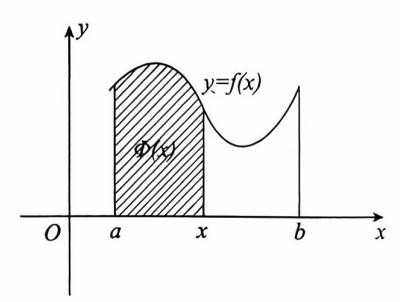
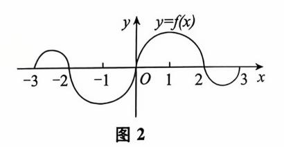
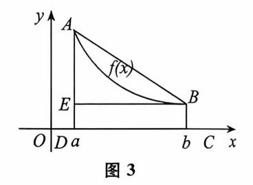
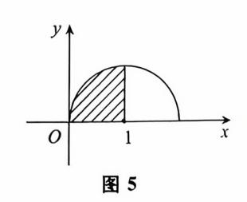

{0}------------------------------------------------

# 第五章 定积分与反常积分

| 考试内容                        | 考试要求 |     |    |
|-----------------------------|------|-----|----|
|                             | 数一   | 数二  | 数三 |
| 定积分的概念                      | 理解   | 4理解 | 了解 |
| 定积分的性质及定积分中值定理              | 掌握   | 掌握  | 了解 |
| 积分上限函数                      | 理解   | 理解  | 理解 |
| 牛顿 — 莱布尼茨公式 定积分的换元积分法和分部积分法 | 掌握   | 掌握人 | 掌握 |
| 积分上限函数的导数                   | 会求   | 会求  | 会求 |
| 反常积分的概念 ( )                 | 理解   | 理解  | 理解 |
| 反常积分收敛的比较判别法                | 了解   | 了解  | 了解 |

## 第一节 定积分

# 考试内容概要。

### 一、定积分的概念

### 1. 定积分的定义

定义 设函数 f(x) 在区间[a,b] 上有定义且有界.

- (1) **分割.** 在[a,b] 中任意插入 n-1 个分点  $a=x_0 < x_1 < x_2 < \cdots < x_{n-1} < x_n = b$ , 将区间[a,b] 分成 n 个小区间[ $x_{i-1}$ , $x_i$ ], $i=1,2,\cdots,n$ ,记  $\Delta x_i=x_i-x_{i-1}$  表示第 i 个小区间的长度.
  - (2) **求和.** 在[ $x_{i-1}, x_i$ ] 上任取一点  $\xi_i$ ,作和式  $\sum_{i=1}^n f(\xi_i) \Delta x_i$ ,记  $\lambda = \max(\Delta x_1, \Delta x_2, \dots, \Delta x_n)$ .

{1}------------------------------------------------

(3) **取极限**. 若极限 $\lim_{\lambda \to 0} \sum_{i=1}^{n} f(\xi_{i}) \Delta x_{i}$  存在,且此极限值既不依赖于区间[a,b] 的分法,也不依赖于点 $\xi_{i}$  的取法,则称f(x) 在区间[a,b]上**可积**,并称此极限为f(x) 在区间[a,b]上的**定积分**,记为 $\int_{a}^{b} f(x) dx$ ,即

$$\int_a^b f(x) dx = \lim_{\lambda \to 0} \sum_{i=1}^n f(\xi_i) \Delta x_i.$$

【注】 (1) 定积分表示一个数值,仅与积分区间[a,b] 和被积函数 f(x) 有关,与积分变量 x 无关,因此有

$$\int_{a}^{b} f(x) dx = \int_{a}^{b} f(t) dt.$$

(2) 若积分 $\int_a^b f(x) dx$  存在,则 $\int_a^b f(x) dx = \lim_{\lambda \to 0} \sum_{i=1}^n f(\xi_i) \Delta x_i$ ,且极限 $\lim_{\lambda \to 0} \sum_{i=1}^n f(\xi_i) \Delta x_i$  与 $\xi_i$  的取法和区间[a,b] 的分法无关.

因此,如果积分 $\int_0^1 f(x) dx$  存在,就可将[0,1] 区间 n 等分,此时  $\Delta x_i = \frac{1}{n}$ ,取  $\xi_i = \frac{i}{n}$ ,由 定积分的定义得

$$\int_0^1 f(x) dx = \lim_{\lambda \to 0} \sum_{i=1}^n f(\xi_i) \Delta x_i = \lim_{n \to \infty} \frac{1}{n} \sum_{i=1}^n f\left(\frac{i}{n}\right).$$

上式在用定积分定义求极限时是一种常见形式。

2. 定积分存在的充分条件

定理 若 f(x) 在[a,b] 上连续,则 $\int_a^b f(x) dx$  必定存在.

定理 若 f(x) 在[a,b] 上有界,且只有有限个间断点,则 $\int_a^b f(x) dx$  必定存在.

定理 若 f(x) 在[a,b] 上只有有限个第一类间断点,则 $\int_a^b f(x) dx$  必定存在.

- 3. 定积分的几何意义
- (1) 设 $\int_a^b f(x) dx$  存在,若在[a,b] 上  $f(x) \ge 0$ ,则 $\int_a^b f(x) dx$  的值等于以曲线 y = f(x), x = a, x = b 及 x 轴所围成的曲边梯形的面积.
- (2) 若在[a,b]上  $f(x) \leq 0$ ,则 $\int_a^b f(x) dx$  的值等于以曲线 y = f(x),x = a,x = b 及 x 轴所围成的曲边梯形面积的负值.
- (3) 若在[a,b]上 f(x) 的值有正也有负,则 $\int_a^b f(x) dx$  的值等于x 轴上方的面积减去x 轴下方的面积所得之差.

{2}------------------------------------------------

### 二、定积分的性质

## 1. 不等式性质

- (1) 若在区间[a,b] 上  $f(x) \leq g(x)$ , 则 $\int_a^b f(x) dx \leq \int_a^b g(x) dx$ .
- (2) 若 M 及 m 分别是 f(x) 在 [a,b] 上的最大值和最小值,则

$$m(b-a) \leqslant \int_a^b f(x) dx \leqslant M(b-a).$$

$$(3) \left| \int_a^b f(x) \, \mathrm{d}x \right| \leqslant \int_a^b |f(x)| \, \mathrm{d}x.$$

### 2. 中值定理

(1) 积分中值定理.

若 f(x) 在 [a,b] 上连续,则

$$\int_{a}^{b} f(x) dx = f(\xi) (b - a) (a < \xi < b).$$

常称 $\frac{1}{b-a}\int_a^b f(x) dx$  为函数 y = f(x) 在区间[a,b]上的**平均值**.

(2) 广义积分中值定理.

若 f(x),g(x) 在[a,b] 上连续,g(x) 不变号,则

$$\int_{a}^{b} f(x)g(x) dx = f(\xi) \int_{a}^{b} g(x) dx (a \leqslant \xi \leqslant b).$$

三、积分上限函数

变上限的积分 $\int_{a}^{x} f(t) dt$  是其上限 x 的函数,常称之为**积分上限函数**.

定理 如果 f(x) 在区间[a,b] 上连续,则  $\Phi(x) = \int_a^x f(t) dt$  在[a,b] 上可导,且 $\frac{d\Phi(x)}{dx} = f(x)$ (图 1).

由原函数的概念可知,如果 f(x) 在区间[a,b] 上连续,则  $\Phi(x) = \int_a^x f(t) dt$  为 f(x) 在区间[a,b] 上的一个原函数. 由此可知,连续函数必有原函数.

图 1

【注】 如果 f(x) 为[a,b]上的连续函数, $\varphi_1(x)$ , $\varphi_2(x)$ 为可导函数,则

$$\left(\int_{\varphi_1(x)}^{\varphi_2(x)} f(t) \, \mathrm{d}t\right)' = f[\varphi_2(x)] \cdot \varphi_2'(x) - f[\varphi_1(x)] \cdot \varphi_1'(x).$$

变上限积分 $\int_{a}^{x} f(t) dt$  表示一个函数,因此,我们经常会遇到与函数相关的问题:求极限,判定连续性,求导数,求微分,判定单调性,判定曲线的凹凸性等.

{3}------------------------------------------------

定理 设函数 f(x) 在[-l,l] 上连续,则

如果 f(x) 为奇函数,那么  $\int_{0}^{x} f(t) dt$  必为偶函数.

如果 f(x) 为偶函数,那么 $\int_{0}^{x} f(t) dt$  必为奇函数.

【例】 (2024,数一) 已知函数 
$$f(x) = \int_0^x e^{\cos t} dt, g(x) = \int_0^{\sin x} e^{t^2} dt,$$
则

- (A) f(x) 是奇函数,g(x) 是偶函数.
- (B) f(x) 是偶函数,g(x) 是奇函数.
- (C) f(x) 与 g(x) 均为奇函数.
- (D) f(x) 与 g(x) 均为偶函数
- 由于  $e^{\cos t}$  是偶函数,则  $f(x) = \int_0^x e^{\cos t} dt$  是奇函数;由于  $e^{t^2}$  是偶函数,则  $h(x) = \int_0^x e^{t^2} dt$  是奇函数, $g(x) = h(\sin x)$ ,则 g(x) 是奇函数,故选(C).

定积分的计算主要有以下五种方法:

### 1. 牛顿 - 莱布尼茨公式

设 f(x) 在区间[a,b] 上连续,F(x) 为 f(x) 在[a,b] 上的一个原函数,则有

$$\int_a^b f(x) dx = F(x) \Big|_a^b = F(b) - F(a).$$

### 2. 换无积分法

设 f(x) 在区间 I 上连续,函数  $x = \varphi(t)$  满足以下条件:

- $(1)\varphi(\alpha) = a, \varphi(\beta) = b.$
- $(2)\varphi(t)$  在 $[\alpha,\beta]$ (或 $[\beta,\alpha]$ ) 上有连续导数,且  $R_{\alpha}\subseteq I$ ,则

$$\int_{a}^{b} f(x) dx = \int_{a}^{\beta} f[\varphi(t)] \varphi'(t) dt.$$

3. 分部积分法

$$\int_a^b u \, \mathrm{d}v = uv \Big|_a^b - \int_a^b v \, \mathrm{d}u.$$

### 4. 利用奇偶性和周期性

(1) 设 f(x) 为[-a,a]上的连续函数(a>0),则

$$\int_{-a}^{a} f(x) dx = \begin{cases} 0, & f(x) 为奇函数时, \\ 2 \int_{0}^{a} f(x) dx, & f(x) 为偶函数时. \end{cases}$$

{4}------------------------------------------------

(2) 设 f(x) 是以 T 为周期的连续函数,则对任给数 a,总有

$$\int_a^{a+T} f(x) dx = \int_0^T f(x) dx.$$

5. 利用已有公式

$$(1)\int_0^{\frac{\pi}{2}}\sin^nx\,\mathrm{d}x = \int_0^{\frac{\pi}{2}}\cos^nx\,\mathrm{d}x = \begin{cases} \frac{n-1}{n}\cdot\frac{n-3}{n-2}\cdot\dots\cdot\frac{1}{2}\cdot\frac{\pi}{2}, & n$$
 为正偶数,
$$\frac{n-1}{n}\cdot\frac{n-3}{n-2}\cdot\dots\cdot\frac{2}{3}, & n$$
 为大于 1 的奇数.

- $(2) \int_0^{\pi} x f(\sin x) dx = \frac{\pi}{2} \int_0^{\pi} f(\sin x) dx \quad (其中 f(x) 连续).$
- 常考题型与典型例题 :。

### 常考願型

- 1. 定积分的概念、性质及几何意义
- 2. 定积分的计算
- 3. 变上限积分

一、定积分的概念、性质及几何意义

$$\lim_{n\to\infty} \left( \frac{1}{n^2+1^2} + \frac{2}{n^2+2^2} + \dots + \frac{n}{n^2+n^2} \right) = \underline{\hspace{1cm}}.$$

原式 = 
$$\lim_{n \to \infty} \frac{1}{n} \left[ \frac{\frac{1}{n}}{1 + \left(\frac{1}{n}\right)^2} + \frac{\frac{2}{n}}{1 + \left(\frac{2}{n}\right)^2} + \dots + \frac{\frac{n}{n}}{1 + \left(\frac{n}{n}\right)^2} \right]$$
 (提可爱因子 $\frac{1}{n}$ )
$$= \int_0^1 \frac{x}{1 + x^2} dx$$

$$= \frac{1}{2} \ln(1 + x^2) \Big|_0^1 = \frac{1}{2} \ln 2.$$

【例 2】 (2012,数二) 
$$\lim_{n\to\infty} n\left(\frac{1}{1+n^2} + \frac{1}{2^2+n^2} + \dots + \frac{1}{n^2+n^2}\right) = \underline{\hspace{1cm}}$$

原式= 
$$\lim_{n\to\infty} \frac{n}{n^2} \left[ \frac{1}{1+\left(\frac{1}{n}\right)^2} + \frac{1}{1+\left(\frac{2}{n}\right)^2} + \dots + \frac{1}{1+\left(\frac{n}{n}\right)^2} \right]$$

$$= \int_0^1 \frac{1}{1+x^2} dx$$

$$= \arctan x \Big|_0^1$$

{5}------------------------------------------------

$$=\frac{\pi}{4}$$
.

【例 3】 
$$(2016, 数二、三) \lim_{n\to\infty} \frac{1}{n^2} \left( \sin \frac{1}{n} + 2\sin \frac{2}{n} + \dots + n\sin \frac{n}{n} \right) = \underline{\qquad}$$

原式 = 
$$\lim_{n \to \infty} \frac{1}{n} \left( \frac{1}{n} \sin \frac{1}{n} + \frac{2}{n} \sin \frac{2}{n} + \dots + \frac{n}{n} \sin \frac{n}{n} \right)$$
  
=  $\int_0^1 x \sin x dx = -\int_0^1 x d(\cos x)$   
=  $-x \cos x \Big|_0^1 + \int_0^1 \cos x dx$   
=  $-\cos 1 + \sin x \Big|_0^1$   
=  $\sin 1 - \cos 1$ .

【例 4】 (2017,数一、二、三) 
$$\lim_{n\to\infty} \sum_{k=1}^{n} \frac{k}{n^2} \ln\left(1+\frac{k}{n}\right) = \underline{\qquad}$$

原式 = 
$$\lim_{n \to \infty} \frac{1}{n} \sum_{k=1}^{n} \frac{k}{n} \ln\left(1 + \frac{k}{n}\right)$$
  
=  $\int_{0}^{1} x \ln(1+x) dx$   
=  $\frac{1}{2} \int_{0}^{1} \ln(1+x) dx^{2}$   
=  $\frac{1}{2} x^{2} \ln(1+x) \Big|_{0}^{1} - \frac{1}{2} \int_{0}^{1} \frac{x^{2}}{1+x} dx$   
=  $\frac{1}{4}$ .

【例 5】  $(2007, \& - \ = )$  如图 2,连续函数 y = f(x) 在区间[-3, -2],[2,3] 上的图形分别是直径为 1 的上、下半圆周,在区间[-2,0],[0,2] 的图形分别是直径为 2 的下、上半圆周. 设  $F(x) = \int_{-x}^{x} f(t) dt$ ,则下列结论正确的是

(A)
$$F(3) = -\frac{3}{4}F(-2)$$
.

(B)
$$F(3) = \frac{5}{4}F(2)$$
.

(C)
$$F(-3) = \frac{3}{4}F(2)$$
.

(D)
$$F(-3) = -\frac{5}{4}F(-2)$$
.

(方法 1) 
$$F(2) = \int_0^2 f(t) dt = \frac{\pi}{2}$$
,

$$F(3) = \int_0^3 f(t) dt = \int_0^2 f(t) dt + \int_2^3 f(t) dt = \frac{\pi}{2} - \frac{\pi}{8} = \frac{3}{8}\pi,$$

$$F(-2) = \int_0^{-2} f(t) dt = -\int_{-2}^0 f(t) dt = -\left(-\frac{\pi}{2}\right) = \frac{\pi}{2},$$

{6}------------------------------------------------

$$F(-3) = \int_0^{-3} f(t) dt = -\int_{-3}^0 f(t) dt = -\left(\frac{\pi}{8} - \frac{\pi}{2}\right) = \frac{3}{8}\pi,$$

则  $F(-3) = \frac{3}{4}F(2)$ .

故应选(C).

【方法 2】 由定积分的几何意义知 F(2) > F(3) > 0.

又由 f(x) 的图形可知, f(x) 为奇函数,则  $F(x) = \int_0^x f(t) dt$  为偶函数,故

$$F(-3) = F(3) > 0, F(-2) = F(2) > 0,$$

故选(C).

【例 6】 (1997,数一、二)设在区间[a,b] 上 f(x) > 0, f'(x) < 0, f''(x) > 0. 令  $S_1 = \int_{a}^{b} f(x) dx$ ,  $S_2 = f(b)(b-a)$ ,  $S_3 = \frac{1}{2} [f(a) + f(b)](b-a)$ ,则

$$(A)S_1 < S_2 < S_3$$
.

(B) 
$$S_2 < S_1 < S_3$$
.

(C) 
$$S_3 < S_1 < S_2$$
.

(D) 
$$S_2 < S_3 < S_1$$
.

爾) 由 f(x) > 0, f'(x) < 0, f''(x) > 0 可画出 f(x) 图形如图 3.

由函数的几何意义可知,

- $S_1$  为曲边梯形 ABCD 的面积.
- $S_2$  为矩形 EBCD 的面积.
- $S_3$  为梯形 ABCD 的面积.
- 故, $S_2 < S_1 < S_3$ ,选(B).

【例7】 (2011,数一、二、三)设  $I=\int_0^{\frac{\pi}{4}}\ln\sin x\mathrm{d}x$ , $J=\int_0^{\frac{\pi}{4}}\ln\cot x\mathrm{d}x$ , $K=\int_0^{\frac{\pi}{4}}\ln\cos x\mathrm{d}x$ ,则 I,J,K 的大小关系为

$$(A)I < J < K.$$

(B) 
$$I < K < J$$
.

$$(C)J < I < K$$
.

(D)
$$K < J < I$$
.

$$\sin x < \cos x < \frac{\cos x}{\sin x} = \cot x.$$

又  $\ln x$  在(0, + $\infty$ ) 上单调递增,则

 $\ln \sin x < \ln \cos x < \ln \cot x$ .

故 I < K < J. 选(B).

【例 8】 (2017,数二) 设二阶可导函数 f(x) 满足 f(1)=f(-1)=1,f(0)=-1,且 f''(x)>0,则

$$(A) \int_{-1}^{1} f(x) dx > 0.$$

$$(B) \int_{-1}^{1} f(x) \, \mathrm{d}x < 0.$$

{7}------------------------------------------------

(C) 
$$\int_{-1}^{0} f(x) dx > \int_{0}^{1} f(x) dx$$
.

(D) 
$$\int_{-1}^{0} f(x) dx < \int_{0}^{1} f(x) dx$$
.

### (解)【方法1】 几何法

由题设知曲线 y = f(x) 过点 A(-1,1), B(0,-1) 和 C(1,1)且是凹的(如图 4 所示),连续 AB 和 BC,得两条线段  $\overline{AB}$  和  $\overline{BC}$ ,设这 两条线段对应的函数为 y = g(x),由于 y = f(x) 在[-1,1] 是凹 的,则

$$A(-1,1)$$

$$y = g(x)$$

$$O$$

$$1$$

$$x$$

$$y = f(x)$$

$$B(0,-1)$$

$$f(x) \leqslant g(x), x \in [-1,1],$$

则 
$$\int_{-1}^{1} f(x) dx < \int_{-1}^{1} g(x) dx$$
.  $(f(x) 与 g(x) 只有在三点的函数值相等)$ 

由定积分几何意义知
$$\int_{-1}^{0} g(x) dx = 0$$
,  $\int_{0}^{1} g(x) dx = 0$ ,

则 
$$\int_{-1}^{1} g(x) dx = 0$$
,故应选(B).

### 【方法 2】 具体函数排除法

若取  $f(x) = 2x^2 - 1$ ,显然符合题设条件,由于 f(x) 是偶函数,则 $\int_{-1}^{0} f(x) dx = \int_{-1}^{1} f(x) dx$ , 则(C)(D)都不正确,又

$$\int_{-1}^{1} (2x^2 - 1) \, \mathrm{d}x = 2 \int_{0}^{1} (2x^2 - 1) \, \mathrm{d}x = 2 \left( \frac{2}{3} x^3 \, \bigg|_{0}^{1} - 1 \right) = -\frac{2}{3} < 0,$$

则(A)不正确,故应选(B).

- 【例 9】 (1991,数一、二)设函数 f(x) 在[0,1]上连续,(0,1) 内可导,且 3  $\int_{2}^{1} f(x) dx =$ f(0),证明在(0,1) 内存在一点 c,使 f'(c) = 0.
  - (i) 由积分中值定理知,存在 $\xi \in \left(\frac{2}{3},1\right)$ ,使得

$$\int_{\frac{2}{3}}^{1} f(x) dx = f(\xi) \left( 1 - \frac{2}{3} \right) = \frac{1}{3} f(\xi),$$

$$3 \int_{\frac{2}{3}}^{1} f(x) dx = f(\xi) = f(0).$$

由罗尔定理知,存在  $c \in (0,\xi)$ ,使 f'(c) = 0.

二、定积分的计算

【例 10】 (2001,数二) 
$$\int_{-\frac{\pi}{2}}^{\frac{\pi}{2}} (x^3 + \sin^2 x) \cos^2 x dx =$$
\_\_\_\_\_.

原式 = 
$$2\int_0^{\frac{\pi}{2}} \sin^2 x \cos^2 x dx$$
  
=  $2 \cdot \int_0^{\frac{\pi}{2}} (\sin^2 x - \sin^4 x) dx$   
=  $2\left(\frac{1}{2} \cdot \frac{\pi}{2} - \frac{3}{4} \cdot \frac{1}{2} \cdot \frac{\pi}{2}\right)$ 

{8}------------------------------------------------

$$=\frac{\pi}{8}$$

【例 11】 (2017,数三) 
$$\int_{-\pi}^{\pi} (\sin^3 x + \sqrt{\pi^2 - x^2}) dx =$$
\_\_\_\_\_.

原式=
$$2\int_0^{\pi} \sqrt{\pi^2 - x^2} dx = 2 \cdot \frac{\pi \cdot \pi^2}{4}$$
 (几何意义)
$$= \frac{\pi^3}{2}.$$

【注】 由几何意义可知当 a > 0 时,

$$(1) \int_0^a \sqrt{a^2 - x^2} \, \mathrm{d}x = \frac{\pi a^2}{4},$$

$$(2) \int_{0}^{a} \sqrt{2ax - x^{2}} dx = \frac{\pi a^{2}}{4},$$

$$(3) \int_0^{2a} \sqrt{2ax - x^2} \, \mathrm{d}x = \frac{\pi a^2}{2}.$$

【例 12】 (2000,数一) 
$$\int_0^1 \sqrt{2x-x^2} dx =$$
\_\_\_\_\_\_.

『方法 1』 原式= 
$$\int_0^1 \sqrt{1 - (x-1)^2} dx$$

$$\frac{x-1 = \sin t}{\int_{-\frac{\pi}{2}}^0 \cos^2 t dt}$$

$$= \int_0^{\frac{\pi}{2}} \cos^2 t dt$$

$$= \frac{1}{2} \cdot \frac{\pi}{2} = \frac{\pi}{4}.$$

【方法 2】 
$$y = \sqrt{2x - x^2} \Rightarrow x^2 + y^2 = 2x(y \ge 0)$$
,由几何意义,即原式为图 5 阴影面积(单位圆的 $\frac{1}{4}$ ).

故原式 =  $\frac{\pi}{4}$ .

【例 13】 
$$\int_0^{\pi} x \sin^2 x dx = \underline{\qquad}.$$

$$\int_0^{\pi} x \sin^2 x dx = \frac{\pi}{2} \int_0^{\pi} \sin^2 x dx$$

$$= \frac{\pi}{2} \cdot 2 \int_0^{\frac{\pi}{2}} \sin^2 x dx$$

$$= \pi \cdot \frac{1}{2} \cdot \frac{\pi}{2}$$

$$= \frac{\pi^2}{4}.$$

$$\left(\int_{0}^{\pi} x f(\sin x) dx = \frac{\pi}{2} \int_{0}^{\pi} f(\sin x) dx\right)$$
(\text{\text{\$\sigma}\$} \text{\$\pi\$ the sin } x) \dx

{9}------------------------------------------------

【例 14】 (2005,数二) 计算
$$\int_0^1 \frac{x dx}{(2-x^2)\sqrt{1-x^2}}$$
.

原式 = 
$$\int_0^{\frac{\pi}{2}} \frac{\sin t \cos t}{(2 - \sin^2 t) \cos t} dt = \int_0^{\frac{\pi}{2}} \frac{\sin t}{2 - \sin^2 t} dt$$

$$= \int_0^{\frac{\pi}{2}} \frac{-\cos t}{1 + \cos^2 t} = -\arctan(\cos t) \Big|_0^{\frac{\pi}{2}} = \frac{\pi}{4}.$$

【例 15】 (2010,数一) 
$$\int_{0}^{\pi^{2}} \sqrt{x} \cos \sqrt{x} dx =$$
\_\_\_\_\_.

原式 = 
$$2\int_0^\pi t^2 \cos t dt = 2\int_0^\pi t^2 d(\sin t)$$
  
=  $2t^2 \sin t \Big|_0^\pi - 4\int_0^\pi t \sin t dt$   
=  $-4\int_0^\pi t \sin t dt = (-4) \cdot \frac{\pi}{2} \int_0^\pi \sin t dt$   
=  $(-4) \cdot \frac{\pi}{2} \cdot 2 = -4\pi$ .

【例 16】 计算 $\int_0^1 x \arcsin x dx$ .

(方法 1) 原式 = 
$$\frac{1}{2} \int_0^1 \arcsin x dx^2$$
  
=  $\frac{1}{2} x^2 \arcsin x \Big|_0^1 - \frac{1}{2} \int_0^1 \frac{x^2}{\sqrt{1 - x^2}} dx$   
=  $\frac{\pi}{4} - \frac{1}{2} \int_0^1 \frac{(x^2 - 1) + 1}{\sqrt{1 - x^2}} dx$   
=  $\frac{\pi}{4} - \frac{1}{2} \left( -\int_0^1 \sqrt{1 - x^2} dx + \arcsin x \Big|_0^1 \right)$   
=  $\frac{\pi}{4} - \frac{1}{2} \left( -\frac{\pi}{4} + \frac{\pi}{2} \right) = \frac{\pi}{8}$ .

【方法 2】

原式 = 
$$\int_0^{\frac{\pi}{2}} t \sin t d\sin t = \frac{1}{2} \int_0^{\frac{\pi}{2}} t d\sin^2 t$$
  
=  $\frac{1}{2} \left( t \sin^2 t \Big|_0^{\frac{\pi}{2}} - \int_0^{\frac{\pi}{2}} \sin^2 t dt \right)$   
=  $\frac{1}{2} \left( \frac{\pi}{2} - \frac{1}{2} \cdot \frac{\pi}{2} \right) = \frac{\pi}{8}$ .

{10}------------------------------------------------

【例 17】 (1995, 数三) 设  $f(x) = \int_0^x \frac{\sin t}{\pi - t} dt$ , 计算  $\int_0^{\pi} f(x) dx$ .

「方法 1】 原式 = 
$$xf(x)\Big|_0^\pi - \int_0^\pi xf'(x) dx$$
  

$$= \pi \int_0^\pi \frac{\sin t}{\pi - t} dt - \int_0^\pi \frac{x \sin x}{\pi - x} dx$$

$$= \pi \int_0^\pi \frac{\sin x}{\pi - x} dx - \int_0^\pi \frac{x \sin x}{\pi - x} dx$$

$$= \int_0^\pi \frac{(\pi - x) \sin x}{\pi - x} dx = \int_0^\pi \sin x dx = 2.$$

【方法 2】 
$$\int_0^{\pi} f(x) dx = \int_0^{\pi} f(x) d(x - \pi)$$
$$= (x - \pi) f(x) \Big|_0^{\pi} - \int_0^{\pi} (x - \pi) f'(x) dx$$
$$= -\int_0^{\pi} \frac{(x - \pi) \sin x}{\pi - x} dx = \int_0^{\pi} \sin x dx = 2.$$

三、变上限积分

【例 18】 设 f(x) 连续,试求下列函数的导数.

$$(1)\int_{e^x}^{x^2} f(t) dt.$$

$$(2) \int_0^x (x-t) f(t) dt.$$

$$(3) \int_{0}^{x} \cos((x-t)^2) dt.$$

$$(4) \int_1^2 f(x+t) \, \mathrm{d}t.$$

(1) 
$$\left[ \int_{e^x}^{x^2} f(t) dt \right]' = f(x^2) \cdot 2x - f(e^x) e^x$$
.

$$(2) \int_{0}^{x} (x-t) f(t) dt = x \int_{0}^{x} f(t) dt - \int_{0}^{x} t f(t) dt, 故$$

$$\left[ \int_{0}^{x} (x-t) f(t) dt \right]' = \int_{0}^{x} f(t) dt + x f(x) - x f(x) = \int_{0}^{x} f(t) dt.$$

(3) 令 
$$x-t=u$$
,则 $\int_0^x \cos(x-t)^2 dt = \int_0^x \cos u^2 du$ ,故

$$\left[\int_0^x \cos(x-t)^2 dt\right]' = \cos x^2.$$

$$(4) \int_{1}^{2} f(x+t) dt = \frac{x+t=u}{\int_{x+1}^{x+2}} \int_{x+1}^{x+2} f(u) du, 故$$

$$\left[ \int_{1}^{2} f(x+t) dt \right]' = f(x+2) - f(x+1).$$

【例 19】 (2015,数二、三) 设函数 f(x) 连续, $\varphi(x) = \int_0^{x^2} x f(t) dt$ . 若  $\varphi(1) = 1$ ,  $\varphi'(1) = 5$ ,则 f(1) =\_\_\_\_\_\_.

$$\varphi(1) = \int_0^1 f(t) \, \mathrm{d}t = 1.$$

{11}------------------------------------------------

$$\varphi(x) = x \int_0^{x^2} f(t) dt.$$

$$\varphi'(x) = \int_0^{x^2} f(t) dt + x f(x^2) \cdot 2x.$$

$$\varphi'(1) = \int_0^1 f(t) dt + 2f(1) = 5,$$

故: $1 + 2f(1) = 5 \Rightarrow f(1) = 2$ .

【例 20】 (1998, 数一) 设 f(x) 连续,则 $\frac{d}{dx}\int_{0}^{x}tf(x^{2}-t^{2})dt=$ 

$$(A)xf(x^2).$$

(B) 
$$-xf(x^2)$$
.

$$(C)2xf(x^2)$$
.

(D) 
$$-2xf(x^2)$$
.

(解)【方法 1】

 $\Rightarrow x^2 - t^2 = u, -2t dt = du,$ 

$$\int_{0}^{x} t f(x^{2} - t^{2}) dt = \frac{1}{2} \int_{0}^{x^{2}} f(u) du,$$

$$\frac{d}{dx} \int_{0}^{x} t f(x^{2} - t^{2}) dt = \frac{1}{2} \frac{d}{dx} \left( \int_{0}^{x^{2}} f(u) du \right) = x f(x^{2}),$$

故应选(A).

【方法 2】 排除法

令  $f(x) \equiv 1$ ,显然 f(x) 满足题设条件,此时

$$\frac{\mathrm{d}}{\mathrm{d}x} \left( \int_0^x t f(x^2 - t^2) \, \mathrm{d}t \right) = \frac{\mathrm{d}}{\mathrm{d}x} \left( \int_0^x t \, \mathrm{d}t \right) = x$$

将  $f(x) \equiv 1$  代入四个选项中可知,排除(B)(C)(D). 故应选(A).

【例 21】 (1993, 数三) 已知  $f(x) = \begin{cases} x^2, & 0 \le x < 1, \\ 1, & 1 \le x \le 2, \end{cases}$  设  $F(x) = \int_1^x f(t) dt (0 \le x \le 1)$ 

2),则 F(x) 为

(A) 
$$\begin{cases} \frac{1}{3}x^3, & 0 \leqslant x < 1, \\ x, & 1 \leqslant x \leqslant 2. \end{cases}$$

(B) 
$$\begin{cases} \frac{1}{3}x^3 - \frac{1}{3}, & 0 \leq x < 1, \\ x, & 1 \leq x \leq 2. \end{cases}$$

(C) 
$$\begin{cases} \frac{1}{3}x^3, & 0 \leqslant x < 1, \\ x - 1, & 1 \le x \le 2 \end{cases}$$

(C) 
$$\begin{cases} \frac{1}{3}x^3, & 0 \le x < 1, \\ x - 1, & 1 \le x \le 2. \end{cases}$$
 (D) 
$$\begin{cases} \frac{1}{3}x^3 - \frac{1}{3}, & 0 \le x < 1, \\ x - 1, & 1 \le x \le 2. \end{cases}$$

(方法 1) 
$$F(x) = \begin{cases} \int_{1}^{x} t^{2} dt, & 0 \leq x < 1 \\ \int_{1}^{x} 1 dt, & 1 \leq x \leq 2 \end{cases} = \begin{cases} \frac{1}{3}x^{3} - \frac{1}{3}, & 0 \leq x < 1, \\ x - 1, & 1 \leq x \leq 2. \end{cases}$$

故选(D).

【方法 2】  $F'(x) \equiv f(x)$ ,又 f(x) 在 x = 1 处连续,故 F(x) 在 x = 1 可导, 故 F(x) 在 x=1 处一定连续.

{12}------------------------------------------------

故选(D).

【例 22】 (1988, 数二) 设  $x \ge -1$ , 求  $\int_{-1}^{x} (1-|t|) dt$ .

$$\int_{-1}^{x} (1-|t|) dt = \begin{cases}
\int_{-1}^{x} (1+t) dt, & -1 \leq x < 0 \\
\int_{-1}^{0} (1+t) dt + \int_{0}^{x} (1-t) dt, & x \geqslant 0
\end{cases}$$

$$= \begin{cases}
\frac{1}{2} (1+x)^{2}, & -1 \leq x \leq 0, \\
1 - \frac{1}{2} (1-x)^{2}, & x > 0.
\end{cases}$$

【例 23】 (2013,数二) 设函数 
$$f(x) = \begin{cases} \sin x, & 0 \leq x < \pi, \\ 2, & \pi \leq x \leq 2\pi, \end{cases}$$
  $F(x) = \int_0^x f(t) dt,$ 则

 $(A)x = \pi$  是函数 F(x) 的跳跃间断点.  $(B)x = \pi$  是函数 F(x) 的可去间断点.

(C)F(x) 在  $x = \pi$  处连续但不可导.

(D)F(x) 在  $x=\pi$  处可导.

$$F(x) = \int_0^x f(t) dt = \begin{cases} \int_0^x \sin t dt, & 0 \leq x < \pi \\ \int_0^{\pi} \sin t dt + \int_{\pi}^x 2 dt, & \pi \leq x \leq 2\pi \end{cases}$$
$$= \begin{cases} 1 - \cos x, & 0 \leq x < \pi, \\ 2 + 2(x - \pi), & \pi \leq x \leq 2\pi. \end{cases}$$

显然,F(x) 在  $x = \pi$  处连续,又

$$F'_{-}(\pi) = (1 - \cos x)' \Big|_{x=\pi} = \sin x \Big|_{x=\pi} = 0,$$
  
 $F'_{+}(\pi) = [2 + 2(x - \pi)]' \Big|_{x=\pi} = 2,$ 

则 F(x) 在  $x = \pi$  处不可导,故应选(C).

【例 24】 (1998,数二) 确定常数 
$$a,b,c$$
 的值,使 $\lim_{x\to 0} \frac{ax - \sin x}{\int_{b}^{x} \frac{\ln(1+t^{3})}{t} dt} = c$  ( $c \neq 0$ ).

的题设知 
$$\int_{b}^{0} \frac{\ln(1+t^{3})}{t} dt = 0 \Rightarrow b = 0.$$

$$(\frac{\ln(1+t^{3})}{t} > 0)$$
原式 
$$= \lim_{x \to 0} \frac{ax - \sin x}{\int_{0}^{x} \frac{\ln(1+t^{3})}{t} dt} = \lim_{x \to 0} \frac{a - \cos x}{\frac{\ln(1+x^{3})}{x}}$$

$$= \lim_{x \to 0} \frac{a - \cos x}{x^{2}}$$

$$= \lim_{x \to 0} \frac{1 - \cos x}{x^{2}} = \frac{1}{2} = c.$$
(a = 1)

{13}------------------------------------------------

故:
$$a = 1, b = 0, c = \frac{1}{2}$$
.

【例 25】 (2017,数二、三) 求极限 
$$\lim_{x\to 0^+} \frac{\int_0^x \sqrt{x-t} e^t dt}{\sqrt{x^3}}$$
.

『方法 1』 令 
$$x-t=u$$
,  $\int_0^x \sqrt{x-t}e^t dt = \int_0^x \sqrt{u}e^{x-u} du$ ,

原式= 
$$\lim_{x \to 0^+} \frac{\int_0^x \sqrt{u} e^{x-u} du}{\sqrt{x^3}} = \lim_{x \to 0^+} \frac{e^x \int_0^x \sqrt{u} e^{-u} du}{\sqrt{x^3}} = \lim_{x \to 0^+} \frac{\int_0^x \sqrt{u} e^{-u} du}{\sqrt{x^3}}$$

$$= \lim_{x \to 0^+} \frac{\sqrt{x} e^{-x}}{\frac{3}{2} \sqrt{x}} = \frac{2}{3}.$$

【方法 2】 原式 = 
$$\lim_{x \to 0^+} \frac{e^{\xi} \int_0^x \sqrt{x - t} dt}{\sqrt{x^3}}$$
  $(0 \leqslant \xi \leqslant x)$  
$$= \lim_{x \to 0^+} \frac{\int_0^x \sqrt{x - t} dt}{\sqrt{x^3}} = \lim_{x \to 0^+} \frac{-\frac{2}{3}(x - t)^{\frac{3}{2}} \Big|_0^x}{\sqrt{x^3}}$$
 
$$= \lim_{x \to 0^+} \frac{\frac{2}{3}x^{\frac{3}{2}}}{\sqrt{x^3}} = \frac{2}{3}.$$

【例 26】 (2020, 数-, 数二) 当  $x \to 0^+$  时,下列无穷小量中最高阶的是

$$(A)\int_0^x (e^{t^2}-1) dt.$$

(B) 
$$\int_{0}^{x} \ln(1+\sqrt{t^3}) dt.$$

(C) 
$$\int_{0}^{\sin x} \sin t^2 dt.$$

$$(D) \int_0^{1-\cos x} \sqrt{\sin^3 t} dt.$$

解【方法1】 由于

$$\lim_{x\to 0^+} \frac{\int_0^x (e^{t^2}-1) dt}{x^3} = \lim_{x\to 0^+} \frac{e^{x^2}-1}{3x^2} = \frac{1}{3},$$

则当  $x \to 0^+$  时,  $\int_0^x (e^{t^2} - 1) dt$  是 x 的三阶无穷小.

$$\lim_{x\to 0^+} \frac{\int_0^x \ln(1+\sqrt{t^3}) \, \mathrm{d}t}{\sqrt{x^5}} = \lim_{x\to 0^+} \frac{\ln(1+\sqrt{x^3})}{\frac{5}{2} \sqrt{x^3}} = \frac{2}{5},$$

则当  $x \to 0^+$  时, $\int_0^x \ln(1+\sqrt{t^3}) dt$  是 x 的  $\frac{5}{2}$  阶无穷小.

$$\lim_{x \to 0^+} \frac{\int_0^{\sin x} \sin t^2 dt}{x^3} = \lim_{x \to 0^+} \frac{\sin(\sin^2 x) \cos x}{3x^2} = \frac{1}{3},$$

{14}------------------------------------------------

则当  $x \to 0^+$  时,  $\int_0^{\sin x} \sin t^2 dt \, dt \, dt \, dt \, dt \, dt$  的三阶无穷小.

$$\lim_{x \to 0^{+}} \frac{\int_{0}^{1-\cos x} \sqrt{\sin^{3} t} dt}{x^{5}} = \lim_{x \to 0^{+}} \frac{\sqrt{\sin^{3} (1-\cos x)} \cdot \sin x}{5x^{4}}$$
$$= \lim_{x \to 0^{+}} \frac{(1-\cos x)^{\frac{3}{2}} \cdot x}{5x^{4}} = \frac{\sqrt{2}}{20},$$

则当  $x \to 0^+$  时,  $\int_0^{1-\cos x} \sqrt{\sin^3 t} dt$  是 x 的五阶无穷小.

综上可知,正确选项为(D).

【方法 2】 欢迎学有余力的同学深入思考

### 【方法 3】 欢迎学有余力的同学深入思考

【例 27】 (2010,数三) 设可导函数 y = y(x) 由方程  $\int_0^{x+y} e^{-t^2} dt = \int_0^x x \sin t^2 dt$  确定,则  $\frac{dy}{dx}\Big|_{x=0} =$ ② 令 x = 0,  $\int_0^y e^{-t^2} dt = 0$ ,则 y = 0,故当 x = 0 时,y = 0.  $\int_0^{x+y} e^{-t^2} dt = x \int_0^x \sin t^2 dt$  两端对 x 求导  $e^{-(x+y)^2} (1+y') = \int_0^x \sin t^2 dt + x \sin x^2,$ 令 x = 0, y = 0,代人上式,1 + y'(0) = 0,故 y'(0) = -1.

## 第二节 反常积分

# 考试内容概要 ::。

### 一、无穷区间上的反常积分

定义 (1) 设 f(x) 为[a, + $\infty$ ) 上的连续函数,如果极限  $\lim_{t\to +\infty} \int_a^t f(x) dx$  存在,则称此极

{15}------------------------------------------------

限为函数 f(x) 在**无穷区间**[a,  $+\infty$ ) 上的反常积分,记作  $\int_{a}^{+\infty} f(x) dx$ ,即

$$\int_{a}^{+\infty} f(x) dx = \lim_{t \to +\infty} \int_{a}^{t} f(x) dx,$$

这时也称反常积分 $\int_{a}^{+\infty} f(x) dx$  收敛. 如果上述极限不存在,则称反常积分 $\int_{a}^{+\infty} f(x) dx$  发散.

(2) 设 f(x) 为( $-\infty$ ,b] 上的连续函数,则可类似的定义函数 f(x) 在**无穷区间**( $-\infty$ ,b] 上的反常积分

$$\int_{-\infty}^{b} f(x) dx = \lim_{t \to -\infty} \int_{t}^{b} f(x) dx.$$

(3) 设 f(x) 为 $(-\infty, +\infty)$  上的连续函数,如果反常积分

$$\int_{-\infty}^{0} f(x) dx \, \pi \int_{0}^{+\infty} f(x) dx$$

都收敛,则称反常积分  $\int_{-\infty}^{+\infty} f(x) dx$  收敛,且

$$\int_{-\infty}^{+\infty} f(x) dx = \int_{-\infty}^{0} f(x) dx + \int_{0}^{+\infty} f(x) dx.$$

如果 $\int_{-\infty}^{0} f(x) dx$ 与 $\int_{0}^{+\infty} f(x) dx$ 至少有一个发散,则称 $\int_{-\infty}^{+\infty} f(x) dx$  **发散**.

定理1 (比较判别法)

设 f(x),g(x) 在 $[a,+\infty)$  上连续,且  $0 \le f(x) \le g(x)$ ,则

(1) 当 
$$\int_{a}^{+\infty} g(x) dx$$
 收敛时,  $\int_{a}^{+\infty} f(x) dx$  收敛.

(2) 当 
$$\int_{a}^{+\infty} f(x) dx$$
 发散时,  $\int_{a}^{+\infty} g(x) dx$  发散.

定理2 (比较判别法的极限形式)

设 f(x),g(x) 在 $[a,+\infty)$  上非负连续,且 $\lim_{x\to+\infty}\frac{f(x)}{g(x)}=\lambda$ (有限或无穷),则

(1) 当 
$$\lambda \neq 0$$
 时, $\int_{a}^{+\infty} f(x) dx$  与 $\int_{a}^{+\infty} g(x) dx$  同敛散.

(2) 当 
$$\lambda = 0$$
 时,若 $\int_{a}^{+\infty} g(x) dx$  收敛,则 $\int_{a}^{+\infty} f(x) dx$  也收敛.

(3) 当 
$$\lambda = +\infty$$
 时,若 $\int_{a}^{+\infty} g(x) dx$  发散,则 $\int_{a}^{+\infty} f(x) dx$  也发散.

常用结论: 
$$\int_{a}^{+\infty} \frac{1}{x^{p}} dx \begin{cases} p > 1, & \text{收敛,} \\ p \leq 1, & \text{发散,} \end{cases} (a > 0).$$

【例1】 判别下列反常积分的敛散性.

$$(1) \int_{1}^{+\infty} \frac{\sqrt{x}}{1+x^{2}} dx, \qquad (2) \int_{1}^{+\infty} \frac{x}{1+x^{2}} dx.$$

**《** 【方法 1】 (1) 由于
$$\frac{\sqrt{x}}{1+x^2}$$
  $<\frac{\sqrt{x}}{x^2} = \frac{1}{x^{\frac{3}{2}}}$ ,而 $\int_1^{+\infty} \frac{\mathrm{d}x}{x^{\frac{3}{2}}}$  收敛,则 $\int_1^{+\infty} \frac{\sqrt{x}}{1+x^2} \mathrm{d}x$  收敛.

(2) 由于

{16}------------------------------------------------

$$\frac{x}{1+x^2} \geqslant \frac{x}{x^2+x^2} = \frac{x}{2x^2} = \frac{1}{2x},$$

而 $\int_{1}^{+\infty} \frac{\mathrm{d}x}{2x}$  发散,则 $\int_{1}^{+\infty} \frac{x}{1+x^2} \mathrm{d}x$  发散.

也可用定义判定敛散性,由于

$$\int_{1}^{+\infty} \frac{x}{1+x^2} dx = \frac{1}{2} \ln(1+x^2) \Big|_{1}^{+\infty} = +\infty,$$

则 $\int_{1}^{+\infty} \frac{x}{1+x^2} \mathrm{d}x$  发散.

【方法 2】 (1) 由于

$$\lim_{x \to +\infty} \frac{\frac{\sqrt{x}}{1+x^2}}{\frac{1}{x^{\frac{3}{2}}}} = \lim_{x \to +\infty} \frac{x^2}{1+x^2} = 1 \neq 0,$$

而 $\int_{1}^{+\infty} \frac{\mathrm{d}x}{x^{\frac{3}{2}}}$  收敛,则 $\int_{1}^{+\infty} \frac{\sqrt{x}}{1+x^2} \mathrm{d}x$  收敛.

(2) 由于
$$\lim_{x \to +\infty} \frac{\frac{x}{1+x^2}}{\frac{1}{x}} = \lim_{x \to +\infty} \frac{x^2}{1+x^2} = 1$$
, $\prod_{1}^{+\infty} \frac{dx}{x}$  发散, $\iint_{1}^{+\infty} \frac{x}{1+x^2} dx$  发散.

二、无界函数的反常积分

如果函数 f(x) 在点 a 的任一邻域内都无界,那么点 a 称为函数 f(x) 的瑕点(也称为无界点). 无界函数的反常积分也称为**瑕积分**.

定义 (1) 设函数 f(x) 在(a,b] 上连续,点 a 为函数 f(x) 的瑕点.如果极限

$$\lim_{t \to a^+} \int_t^b f(x) \, \mathrm{d}x$$

存在,则称此极限为函数 f(x) 在**区间**[a,b] 上的反常积分,记作  $\int_a^b f(x) dx$ ,即

$$\int_a^b f(x) dx = \lim_{t \to a^+} \int_t^b f(x) dx,$$

这时也称反常积分 $\int_a^b f(x) dx$  收敛. 如果上述极限不存在,则称反常积分 $\int_a^b f(x) dx$  发散.

(2) 设函数 f(x) 在[a,b) 上连续,点 b 为函数 f(x) 的瑕点.则可类似的定义函数 f(x) 在区间[a,b] 上的反常积分

$$\int_a^b f(x) dx = \lim_{t \to b^-} \int_a^t f(x) dx.$$

(3) 设函数 f(x) 在[a,b] 上除点 c(a < c < b) 外连续,点 c 为函数 f(x) 的瑕点. 如果反常积分

$$\int_{a}^{c} f(x) dx \, \pi \int_{a}^{b} f(x) dx$$

都收敛,则称反常积分  $\int_{a}^{b} f(x) dx$  收敛,且

{17}------------------------------------------------

$$\int_a^b f(x) dx = \int_a^c f(x) dx + \int_c^b f(x) dx.$$

如果 $\int_a^c f(x) dx$ 与 $\int_b^b f(x) dx$ 至少有一个发散,则称 $\int_a^b f(x) dx$  **发散**.

定理1 (比较判别法)

设 f(x),g(x) 在(a,b]上连续,且  $0 \le f(x) \le g(x)$ ,x = a 为 f(x) 和 g(x) 的瑕点,则

- (1) 当  $\int_a^b g(x) dx$  收敛时,  $\int_a^b f(x) dx$  收敛.
- (2) 当  $\int_a^b f(x) dx$  发散时,  $\int_a^b g(x) dx$  发散.

定理2 (比较判别法的极限形式)

设 f(x),g(x) 在(a,b]上非负连续,且 $\lim_{x\to a^+} \frac{f(x)}{g(x)} = \lambda$ (有限或无穷),则

- (1) 当  $\lambda \neq 0$  时, $\int_a^b f(x) dx$  与 $\int_a^b g(x) dx$  同敛散.
- (2) 当  $\lambda = 0$  时,若 $\int_a^b g(x) dx$  收敛,则 $\int_a^b f(x) dx$  也收敛.
- (3) 当  $\lambda = +\infty$  时,若 $\int_a^b g(x) dx$  发散,则 $\int_a^b f(x) dx$  也发散.

常用结论: 
$$\int_{a}^{b} \frac{1}{(x-a)^{p}} dx \begin{cases} p < 1, & \text{收敛,} \\ p \geqslant 1, & \text{发散.} \end{cases}$$
$$\int_{a}^{b} \frac{1}{(b-x)^{p}} dx \begin{cases} p < 1, & \text{收敛,} \\ p \geqslant 1, & \text{发散.} \end{cases}$$

【例 2】 判定反常积分  $\int_0^1 \frac{\mathrm{d}x}{\sqrt{x-x^2}}$  的敛散性.

(新)该反常积分的被积函数有两个无界点,x=0和 x=1,

$$\int_0^1 \frac{\mathrm{d}x}{\sqrt{x-x^2}} = \int_0^{\frac{1}{2}} \frac{\mathrm{d}x}{\sqrt{x-x^2}} + \int_{\frac{1}{2}}^1 \frac{\mathrm{d}x}{\sqrt{x-x^2}}.$$

由于 
$$\lim_{x\to 0^+} \frac{\frac{1}{\sqrt{x-x^2}}}{\frac{1}{x^{\frac{1}{2}}}} = \lim_{x\to 0^+} \frac{1}{\sqrt{1-x}} = 1$$
,而  $\int_0^{\frac{1}{2}} \frac{1}{x^{\frac{1}{2}}} dx$  收敛,则  $\int_0^{\frac{1}{2}} \frac{dx}{\sqrt{x-x^2}}$  收敛.

又 
$$\lim_{x \to 1^{-}} \frac{\frac{1}{\sqrt{x-x^2}}}{\frac{1}{(1-x)^{\frac{1}{2}}}} = \lim_{x \to 1^{-}} \frac{1}{\sqrt{x}} = 1$$
,而  $\int_{\frac{1}{2}}^{1} \frac{1}{(1-x)^{\frac{1}{2}}} dx$  收敛,则  $\int_{\frac{1}{2}}^{1} \frac{dx}{\sqrt{x-x^2}}$  收敛.

故
$$\int_0^1 \frac{\mathrm{d}x}{\sqrt{x-x^2}}$$
收敛.

{18}------------------------------------------------

# 常考题型与典型例题\_\_\_\_。

### 常考题型

- 1. 反常积分的敛散性
- 2. 反常积分的计算

### 一、反常积分的敛散性

反常积分敛散性判定常用的有以下三种方法:

(1) 定义.(2) p 积分.(3) 比较法及其极限形式.

【例3】(2015,数二)下列反常积分中收敛的是

(A) 
$$\int_{2}^{+\infty} \frac{1}{\sqrt{x}} dx.$$

(B) 
$$\int_{2}^{+\infty} \frac{\ln x}{x} dx.$$

(C) 
$$\int_{2}^{+\infty} \frac{1}{x \ln x} dx.$$

(D) 
$$\int_{2}^{+\infty} \frac{x}{e^{x}} dx$$
.

$$\int_{2}^{+\infty} \frac{x}{e^{x}} dx = \int_{2}^{+\infty} x e^{-x} dx = -\int_{2}^{+\infty} x de^{-x} dx$$
$$= -x e^{-x} \Big|_{2}^{+\infty} + \int_{2}^{+\infty} e^{-x} dx$$
$$= 2e^{-2} - e^{-x} \Big|_{2}^{+\infty} = 3e^{-2}.$$

则该反常积分收敛,故选(D).

【例 4】 (2013, 数二) 设函数

$$f(x) = \begin{cases} \frac{1}{(x-1)^{a-1}}, & 1 < x < e, \\ \frac{1}{x \ln^{a+1} x}, & x \geqslant e. \end{cases}$$

若反常积分 $\int_{1}^{+\infty} f(x) dx$  收敛,则

$$(A)_{\alpha} < -2$$
.

$$(B)_{\alpha} > 2$$
.

(C) 
$$-2 < \alpha < 0$$
.

(D) 
$$0 < \alpha < 2$$

$$\int_{1}^{+\infty} f(x) \, \mathrm{d}x = \int_{1}^{e} \frac{\mathrm{d}x}{(x-1)^{a-1}} + \int_{e}^{+\infty} \frac{\mathrm{d}x}{x \ln^{a+1} x}$$

 $\int_{1}^{+\infty} f(x) \, \mathrm{d}x \, \psi$ 敛等价于  $\int_{1}^{\epsilon} \frac{\mathrm{d}x}{(x-1)^{a-1}} \, \mathrm{i}\int_{\epsilon}^{+\infty} \frac{\mathrm{d}x}{x \ln^{a+1}x} \, \mathrm{都}\psi$ 敛,而

$$\int_{1}^{e} \frac{1}{(x-1)^{\alpha-1}} \mathrm{d}x$$

当且仅当 $\alpha-1$ <1,即 $\alpha$ <2时收敛.

{19}------------------------------------------------

$$\int_{c}^{+\infty} \frac{\mathrm{d}x}{x \ln^{a+1} x} = \frac{\ln x = u}{1} \int_{1}^{+\infty} \frac{\mathrm{d}u}{u^{a+1}},$$

而 $\int_{1}^{+\infty} \frac{\mathrm{d}u}{u^{\alpha+1}}$  当且仅当  $\alpha+1>1$ ,即  $\alpha>0$  时收敛.

故若 $\int_{1}^{+\infty} f(x) dx$  收敛,则  $0 < \alpha < 2$ ,故应选(D).

【例 5】 (2016,数二) 反常积分  $\int_{-\infty}^{0} \frac{1}{x^2} e^{\frac{1}{x}} dx$ ,  $\int_{0}^{+\infty} \frac{1}{x^2} e^{\frac{1}{x}} dx$  的敛散性为

(A) 收敛,收敛.

(B) 收敛,发散.

(C)发散,收敛.

(D) 发散,发散.

$$\int_{-\infty}^{0} \frac{1}{x^{2}} e^{\frac{1}{x}} dx = -\int_{-\infty}^{0} e^{\frac{1}{x}} d\frac{1}{x} = -e^{\frac{1}{x}} \Big|_{-\infty}^{0} = 1, 收敛.$$

$$\int_{0}^{+\infty} \frac{1}{x^{2}} e^{\frac{1}{x}} dx = -e^{\frac{1}{x}} \Big|_{0}^{+\infty} = +\infty,$$

故应选(B).

【例 6】 (2016,数一) 反常积分 
$$\int_{0}^{+\infty} \frac{1}{x^{a} (1+x)^{b}} dx$$
 收敛,则

(A)a < 1, b > 1.

(B) a > 1, b > 1.

(C)a < 1, a + b > 1.

(D) a > 1, a + b > 1

$$\int_{0}^{+\infty} \frac{1}{x^{a} (1+x)^{b}} dx = \int_{0}^{1} \frac{dx}{x^{a} (1+x)^{b}} + \int_{1}^{+\infty} \frac{dx}{x^{a} (1+x)^{b}},$$

$$\lim_{x \to 0^{+}} \frac{\frac{1}{x^{a} (1+x)^{b}}}{\frac{1}{x^{a} (1+x)^{b}}} = 1,$$

则当 a < 1 时, $\int_0^1 \frac{\mathrm{d}x}{x^a(1+x)^b}$  收敛;

$$\lim_{x \to +\infty} \frac{\frac{1}{x^a (1+x)^b}}{\frac{1}{x^{a+b}}} = \lim_{x \to +\infty} \frac{1}{\left(1+\frac{1}{x}\right)^b} = 1,$$

则当 a+b>1 时, $\int_{1}^{+\infty} \frac{\mathrm{d}x}{x^a(1+x)^b}$  收敛.

故当 a < 1, a+b > 1 时, $\int_0^{+\infty} \frac{\mathrm{d}x}{x^a (1+x)^b}$  收敛.

故应选(C).

二、反常积分的计算

反常积分的计算常用的有以下三种方法:

(1) 定义.(2) 换元法.(3) 分部积分法.

{20}------------------------------------------------

【例 7】 (2000,数二) 
$$\int_{2}^{+\infty} \frac{\mathrm{d}x}{(x+7)\sqrt{x-2}} =$$
\_\_\_\_\_\_.

《新》 【方法 1】 令  $\sqrt{x-2} = t$ ,则 dx = 2tdt,

原式 = 
$$\int_0^{+\infty} \frac{2t dt}{t(9+t^2)} = \frac{2}{3} \arctan \frac{t}{3} \Big|_0^{+\infty} = \frac{\pi}{3}$$
.

【方法 2】 原式 = 
$$\int_{2}^{+\infty} \frac{2d\sqrt{x-2}}{9+(\sqrt{x-2})^2} = \frac{2}{3} \arctan \frac{\sqrt{x-2}}{3} \Big|_{2}^{+\infty} = \frac{\pi}{3}$$
.

【例 8】 (2000,数四) 计算  $I = \int_{1}^{+\infty} \frac{\mathrm{d}x}{\mathrm{e}^{x} + \mathrm{e}^{2-x}}$ .

$$\int_{1}^{+\infty} \frac{\mathrm{d}x}{\mathrm{e}^{x} + \mathrm{e}^{2-x}} = \int_{1}^{+\infty} \frac{\mathrm{e}^{x} \, \mathrm{d}x}{\mathrm{e}^{2x} + \mathrm{e}^{2}} = \int_{1}^{+\infty} \frac{\mathrm{d}\mathrm{e}^{x}}{\mathrm{e}^{2} + (\mathrm{e}^{x})^{2}}$$

$$= \frac{1}{\mathrm{e}} \arctan \frac{\mathrm{e}^{x}}{\mathrm{e}} \Big|_{1}^{+\infty} = \frac{1}{\mathrm{e}} \left( \frac{\pi}{2} - \frac{\pi}{4} \right)$$

$$= \frac{\pi}{4\mathrm{e}}.$$

【例 9】 (2013,数一、三) 
$$\int_{1}^{+\infty} \frac{\ln x}{(1+x)^{2}} dx =$$
\_\_\_\_\_.

$$\int_{1}^{+\infty} \frac{\ln x}{(1+x)^{2}} dx = -\int_{1}^{+\infty} \ln x d\left(\frac{1}{1+x}\right)$$

$$= -\frac{\ln x}{1+x} \Big|_{1}^{+\infty} + \int_{1}^{+\infty} \frac{dx}{x(1+x)}$$

$$= \ln \frac{x}{1+x} \Big|_{1}^{+\infty} = -\ln \frac{1}{2} = \ln 2.$$

同学需要练习去试试严选题吧!

还不够,再试试下面的作业题.

## 本章作业超链接 《基础过关660题》优选 -\_\_\_

$$242 \quad 244 \quad 247 \quad 248 \quad 258 \quad 261 \quad 267 \quad 270$$

