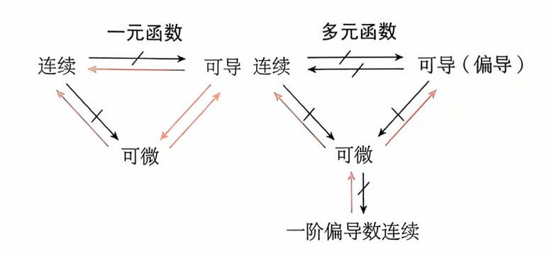

{0}------------------------------------------------

# 第八章 多元函数微分学

| 考试内容                   | 考试要求    |    |    |
|------------------------|---------|----|----|
|                        | 数一      | 数二 | 数三 |
| 多元函数的概念 二元函数的几何意义      |         |    |    |
| 多元函数偏导数和全微分的概念         | 理解      | 了解 | 了解 |
| 多元函数极值和条件极值的概念         |         |    |    |
| 二元函数的极限与连续的概念          | 了解      | 了解 | 了解 |
| 二元函数极值存在的充分条件          |         |    |    |
| 多元函数极值存在的必要条件          | 掌握      | 掌握 | 掌握 |
| 多元复合函数一阶、二阶偏导数 全微分     |         |    |    |
| 多元隐函数的偏导数 二元函数的极值 简单多元 | 今秋00    | 会求 | 会求 |
| 函数的最大值和最小值 简单的应用问题     |         |    |    |
| 拉格朗日乘数法求条件极值           | 会用      | 会用 | 会用 |
| 有界闭区域上二元连续函数的性质        | 了解      | 了解 | 了解 |
| 有界闭区域上连续函数的性质          | 了解      | /  | /  |
| 全微分存在的必要条件和充分条件        | 了解      | /  | /  |
| 全微分形式的不变性              | 1 1 1 1 |    | /  |
| 隐函数存在定理                | 了解      | 了解 | 了解 |
| 二元函数的二阶泰勒公式            | 了解      | /  | /  |

### 第一节 多元函数的基本概念

## \*考试内容概要 \*\*。

### 一、多元函数的极限

定义 设 D 是平面上的一个点集,若对每个点  $P(x,y) \in D$ ,变量 z 按照某一对应法则 f 有一个确定的值与之对应,则称 z 为 x , y 的二元函数,记为

{1}------------------------------------------------

其中点集 D 称为该函数的**定义域**,x,y 称为**自变量**,z 称为**因变量**. 函数值 f(x,y) 的全体所构成的集合称为函数 f 的**值域**,记为 f(D).

通常情况下,二元函数 z = f(x,y) 在几何上表示一张空间曲面.

定义 设函数 f(x,y) 在区域 D上有定义,点  $P_o(x_o,y_o) \in D$ 或为 D 的边界点,如果  $\forall \epsilon$ 

$$> 0$$
,存在  $\delta > 0$ ,当  $P(x,y) \in D$ ,且  $0 < \sqrt{(x-x_0)^2 + (y-y_0)^2} < \delta$  时,都有

$$|f(x,y)-A|<\varepsilon$$

成立,则称常数 A 为函数 f(x,y) **当** $(x,y) \rightarrow (x_0,y_0)$  **时的极限**,记为

$$\lim_{(x,y)\to(x_0,y_0)} f(x,y) = A \ \ \text{\odelta}_{\substack{x\to x_0\\ y\to y_0}} f(x,y) = A \ \ \text{\odelta}_{\substack{P\to P_0\\ y\to y_0}} f(P) = A.$$

- 【注】 (1) 这里的极限是要求点(x,y) 在 D 内以任意方式趋近于点 $(x_0,y_0)$  时,函数 f(x,y) 都趋近于同一确定的常数 A,否则该极限就不存在.
  - (2) 一元函数极限中的下述性质对多元函数仍成立.
  - ① 局部有界性. ② 保号性. ③ 有理运算. ④ 极限与无穷小的关系. ⑤ 夹逼性.

【例 1】 求极限
$$\lim_{\substack{y\to 0\\y\to 0}} \frac{xy^2}{x^2+y^2}$$
.

$$f(x) \to 0 \Leftrightarrow |f(x)| \to 0, 0 \leqslant \left|\frac{xy^2}{x^2 + y^2}\right| \leqslant |x|,$$
由夹逼定理得 $\lim_{\stackrel{x \to 0}{y \to 0}} \frac{xy^2}{x^2 + y^2} = 0.$ 

【例 2】 证明极限
$$\lim_{\substack{x\to 0\\y\to 0\\y\to 0}}\frac{xy}{x^2+y^2}$$
不存在.

$$\lim_{\substack{y=kx\\x\to 0}} \frac{kx^2}{x^2 + k^2 x^2} = \frac{k}{1+k^2}, \text{ § $k$ $\mathbb{R}$ $\mathbb{R}$ $\mathbb{R}$ $\mathbb{R}$ $\mathbb{R}$ $\mathbb{R}$ $\mathbb{R}$ $\mathbb{R}$ $\mathbb{R}$ $\mathbb{R}$ $\mathbb{R}$ $\mathbb{R}$ $\mathbb{R}$ $\mathbb{R}$ $\mathbb{R}$ $\mathbb{R}$ $\mathbb{R}$ $\mathbb{R}$ $\mathbb{R}$ $\mathbb{R}$ $\mathbb{R}$ $\mathbb{R}$ $\mathbb{R}$ $\mathbb{R}$ $\mathbb{R}$ $\mathbb{R}$ $\mathbb{R}$ $\mathbb{R}$ $\mathbb{R}$ $\mathbb{R}$ $\mathbb{R}$ $\mathbb{R}$ $\mathbb{R}$ $\mathbb{R}$ $\mathbb{R}$ $\mathbb{R}$ $\mathbb{R}$ $\mathbb{R}$ $\mathbb{R}$ $\mathbb{R}$ $\mathbb{R}$ $\mathbb{R}$ $\mathbb{R}$ $\mathbb{R}$ $\mathbb{R}$ $\mathbb{R}$ $\mathbb{R}$ $\mathbb{R}$ $\mathbb{R}$ $\mathbb{R}$ $\mathbb{R}$ $\mathbb{R}$ $\mathbb{R}$ $\mathbb{R}$ $\mathbb{R}$ $\mathbb{R}$ $\mathbb{R}$ $\mathbb{R}$ $\mathbb{R}$ $\mathbb{R}$ $\mathbb{R}$ $\mathbb{R}$ $\mathbb{R}$ $\mathbb{R}$ $\mathbb{R}$ $\mathbb{R}$ $\mathbb{R}$ $\mathbb{R}$ $\mathbb{R}$ $\mathbb{R}$ $\mathbb{R}$ $\mathbb{R}$ $\mathbb{R}$ $\mathbb{R}$ $\mathbb{R}$ $\mathbb{R}$ $\mathbb{R}$ $\mathbb{R}$ $\mathbb{R}$ $\mathbb{R}$ $\mathbb{R}$ $\mathbb{R}$ $\mathbb{R}$ $\mathbb{R}$ $\mathbb{R}$ $\mathbb{R}$ $\mathbb{R}$ $\mathbb{R}$ $\mathbb{R}$ $\mathbb{R}$ $\mathbb{R}$ $\mathbb{R}$ $\mathbb{R}$ $\mathbb{R}$ $\mathbb{R}$ $\mathbb{R}$ $\mathbb{R}$ $\mathbb{R}$ $\mathbb{R}$ $\mathbb{R}$ $\mathbb{R}$ $\mathbb{R}$ $\mathbb{R}$ $\mathbb{R}$ $\mathbb{R}$ $\mathbb{R}$ $\mathbb{R}$ $\mathbb{R}$ $\mathbb{R}$ $\mathbb{R}$ $\mathbb{R}$ $\mathbb{R}$ $\mathbb{R}$ $\mathbb{R}$ $\mathbb{R}$ $\mathbb{R}$ $\mathbb{R}$ $\mathbb{R}$ $\mathbb{R}$ $\mathbb{R}$ $\mathbb{R}$ $\mathbb{R}$ $\mathbb{R}$ $\mathbb{R}$ $\mathbb{R}$ $\mathbb{R}$ $\mathbb{R}$ $\mathbb{R}$ $\mathbb{R}$ $\mathbb{R}$ $\mathbb{R}$ $\mathbb{R}$ $\mathbb{R}$ $\mathbb{R}$ $\mathbb{R}$ $\mathbb{R}$ $\mathbb{R}$ $\mathbb{R}$ $\mathbb{R}$ $\mathbb{R}$ $\mathbb{R}$ $\mathbb{R}$ $\mathbb{R}$ $\mathbb{R}$ $\mathbb{R}$ $\mathbb{R}$ $\mathbb{R}$ $\mathbb{R}$ $\mathbb{R}$ $\mathbb{R}$ $\mathbb{R}$ $\mathbb{R}$ $\mathbb{R}$ $\mathbb{R}$ $\mathbb{R}$ $\mathbb{R}$ $\mathbb{R}$ $\mathbb{R}$ $\mathbb{R}$ $\mathbb{R}$ $\mathbb{R}$ $\mathbb{R}$ $\mathbb{R}$ $\mathbb{R}$ $\mathbb{R}$ $\mathbb{R}$ $\mathbb{R}$ $\mathbb{R}$ $\mathbb{R}$ $\mathbb{R}$ $\mathbb{R}$ $\mathbb{R}$ $\mathbb{R}$ $\mathbb{R}$ $\mathbb{R}$ $\mathbb{R}$ $\mathbb{R}$ $\mathbb{R}$ $\mathbb{R}$ $\mathbb{R}$ $\mathbb{R}$ $\mathbb{R}$ $\mathbb{R}$ $\mathbb{R}$ $\mathbb{R}$ $\mathbb{R}$ $\mathbb{R}$ $\mathbb{R}$ $\mathbb{R}$ $\mathbb{R}$ $\mathbb{R}$ $\mathbb{R}$ $\mathbb{R}$ $\mathbb{R}$ $\mathbb{R}$ $\mathbb{R}$ $\mathbb{R}$ $\mathbb{R}$ $\mathbb{R}$ $\mathbb{R}$ $\mathbb{R}$ $\mathbb{R}$ $\mathbb{R}$ $\mathbb{R}$ $\mathbb{R}$ $\mathbb{R}$ $\mathbb{R}$ $\mathbb{R}$ $\mathbb{R}$ $\mathbb{R}$ $\mathbb{R}$ $\mathbb{R}$ $\mathbb{R}$ $\mathbb{R}$ $\mathbb{R}$ $\mathbb{R}$ $\mathbb{R}$ $\mathbb{R}$ $\mathbb{R}$ $\mathbb{R}$ $\mathbb{R}$ $\mathbb{R}$ $\mathbb{R}$ $\mathbb{R}$ $\mathbb{R}$ $\mathbb{R}$ $\mathbb{R}$ $\mathbb{R}$ $\mathbb{R}$ $\mathbb{R}$ $\mathbb{R}$ $\mathbb{R}$ $\mathbb{R}$ $\mathbb{R}$ $\mathbb{R}$ $\mathbb{R}$ $\mathbb{R}$ $\mathbb{R}$ $\mathbb{R}$ $\mathbb{R}$ $\mathbb{R}$ $\mathbb{R}$ $\mathbb{R}$ $\mathbb{R}$ $\mathbb{R}$ $\mathbb{R}$ $\mathbb{R}$ $\mathbb{R}$ $\mathbb{R}$ $\mathbb{R}$ $\mathbb{R}$ $\mathbb{R}$ $\mathbb{R}$ $\mathbb{R}$ $\mathbb{R}$ $\mathbb{R}$ $\mathbb{R}$ $\mathbb{R}$ $\mathbb{R}$ $\mathbb{R}$ $\mathbb{R}$ $\mathbb{R}$ $\mathbb{R}$ $\mathbb{R}$ $\mathbb{R}$ $\mathbb{R}$ $\mathbb{R}$ $\mathbb{R}$ $\mathbb{R}$ $\mathbb{R}$ $\mathbb{R}$ $\mathbb{R}$ $\mathbb{R}$ $\mathbb{R}$ $\mathbb{R}$ $\mathbb{R}$ $\mathbb{R}$ $\mathbb{R}$ $\mathbb{R}$ $\mathbb{R}$ $\mathbb{R}$ $\mathbb{R}$ $\mathbb{R}$$$

【注】 证明重极限不存在的常用方法: 沿两种不同路径极限不同(通常可取过点( $x_0$ ,  $y_0$ )的直线).

#### 二、多元函数的连续性

### 1. 连续的概念

定义 设函数 f(x,y) 在区域 D 上有定义,点  $P_0(x_0,y_0) \in D$ ,如果

$$\lim_{(x,y)\to(x_0,y_0)} f(x,y) = f(x_0,y_0)$$

成立,则称函数 f(x,y) **在点**  $P_0(x_0,y_0)$  **连续**;如果 f(x,y) 在区域 D 上的每个点(x,y) 处都 连续,则称函数 f(x,y) 在区域 D 上连续.

### 2. 连续函数的性质

性质 1 多元连续函数的和、差、积、商(分母不为零)仍为连续函数.

{2}------------------------------------------------

多元连续函数的复合函数也是连续函数.

多元初等函数在其定义区域内连续. 性质 3

#### 性质 4(最大值定理)

有界闭区域 D 上的连续函数在区域 D 上必能取得最大值与最小值.

### 性质 5(介值定理)

有界闭区域 D 上的连续函数在区域 D 上必能取得介于最大值与最小值之间的任何值.

### 三、偏导数

### 1. 偏导数的定义

 $z \neq z = f(x,y)$  在点  $P_0(x_0,y_0)$  的某一邻域内有定义,如果

$$\lim_{\Delta x \to 0} \frac{f(x_0 + \Delta x, y_0) - f(x_0, y_0)}{\Delta x}$$

存在,则称这个极限值为函数 z = f(x,y) 在点  $P_0(x_0,y_0)$  处对 x 的偏导数,记为

$$\frac{\partial z}{\partial x}\Big|_{x=x_0\atop y=y_0} \quad \vec{\boxtimes} \quad \frac{\partial f}{\partial x}\Big|_{x=x_0\atop y=y_0} \quad \vec{\boxtimes} \; z_x'(x_0,y_0) \quad \vec{\boxtimes} \; f_x'(x_0,y_0).$$

类似地,如果

$$\lim_{\Delta y \to 0} \frac{f(x_0, y_0 + \Delta y) - f(x_0, y_0)}{\Delta y}$$

存在,则称这个极限值为函数 z = f(x,y) 在点  $P_0(x_0,y_0)$  处对 y 的偏导数,记为

$$\frac{\partial z}{\partial y}\Big|_{\substack{x=x_0\\y=y_0}}$$

由以上定义不难看出偏导数本质上就是一元函数的导数,其中  $f'_{x}(x_0,y_0)$  就是一 元函数  $f(x,y_0)$  在  $x=x_0$  处的导数,  $f'_y(x_0,y_0)$  就是一元函数  $f(x_0,y)$  在  $y=y_0$  处的导数.

【例 3】 (2023,数三) 已知函数  $f(x,y) = \ln(y + |x\sin y|)$ ,则

(A) 
$$\frac{\partial f}{\partial x}\Big|_{(0,1)}$$
 不存在,  $\frac{\partial f}{\partial y}\Big|_{(0,1)}$  存在. (B)  $\frac{\partial f}{\partial x}\Big|_{(0,1)}$  存在,  $\frac{\partial f}{\partial y}\Big|_{(0,1)}$  不存在.

(B) 
$$\frac{\partial f}{\partial x}\Big|_{(0,1)}$$
 存在, $\frac{\partial f}{\partial y}\Big|_{(0,1)}$  不存在

(C) 
$$\frac{\partial f}{\partial x}\Big|_{(0,1)}$$
,  $\frac{\partial f}{\partial y}\Big|_{(0,1)}$  均存在.

(D) 
$$\frac{\partial f}{\partial x}\Big|_{(0,1)}$$
 ,  $\frac{\partial f}{\partial y}\Big|_{(0,1)}$  均不存在.

$$f(x,y) = \ln(y + |x\sin y|),$$

$$\lim_{x \to 0} \frac{f(x,1) - f(0,1)}{x} = \lim_{x \to 0} \frac{\ln(1 + |x\sin 1|)}{x} = \lim_{x \to 0} \frac{|x\sin 1|}{x},$$

此极限不存在,所以 $\frac{\partial f}{\partial x}\Big|_{(0,1)}$  不存在.

$$\lim_{y\to 0} \frac{f(0,1+y)-f(0,1)}{y} = \lim_{y\to 0} \frac{\ln(1+y)}{y} = 1,$$

所以 $\frac{\partial f}{\partial y}\Big|_{(0,1)}$ 存在且 $\frac{\partial f}{\partial y}\Big|_{(0,1)} = 1$ . 选(A).

{3}------------------------------------------------

类似地,可以定义三元函数乃至n元函数的偏导数.

### 2. 二元函数偏导数的几何意义

设  $M(x_0, y_0, f(x_0, y_0))$  为曲面 z = f(x, y) 上的一点. 过点 M 作平面  $y = y_0$  与曲面 z = f(x, y) 相交,其交线为平面  $y = y_0$  上的曲线  $z = f(x, y_0)$ ,即  $\begin{cases} z = f(x, y_0), \\ y = y_0, \end{cases}$  则  $f_x'(x_0, y_0)$  表示上述交线在点 M 处的切线对 x 轴的斜率. 同样,过点 M 作平面  $x = x_0$  与曲面 z = f(x, y) 相交,其交线为平面  $x = x_0$  上的曲线  $z = f(x_0, y)$ ,则  $f_y'(x_0, y_0)$  表示上述交线在点 M 处的切线对 y 轴的斜率.

### 3. 高阶偏导数

定义 如果 z = f(x,y) 在区域 D 内的偏导函数  $\frac{\partial z}{\partial x}$ ,  $\frac{\partial z}{\partial y}$  仍然存在偏导数,则称之为函数 f(x,y) 的二阶偏导数,常记为

$$\frac{\partial}{\partial x} \left( \frac{\partial z}{\partial x} \right) = \frac{\partial^2 z}{\partial x^2} \stackrel{?}{\not{=}} f''_{xx}, \quad \frac{\partial}{\partial y} \left( \frac{\partial z}{\partial x} \right) = \frac{\partial^2 z}{\partial x \partial y} \stackrel{?}{\not{=}} f''_{xy},$$
$$\frac{\partial}{\partial x} \left( \frac{\partial z}{\partial y} \right) = \frac{\partial^2 z}{\partial y \partial x} \stackrel{?}{\not{=}} f''_{yx}, \quad \frac{\partial}{\partial y} \left( \frac{\partial z}{\partial y} \right) = \frac{\partial^2 z}{\partial y^2} \stackrel{?}{\not{=}} f''_{yy},$$

常称 $\frac{\partial^2 z}{\partial x \partial y}$ , $\frac{\partial^2 z}{\partial y \partial x}$ 为混合偏导数.

**定理** 如果函数 z = f(x,y) 的两个二阶混合偏导数  $\frac{\partial^2 z}{\partial x \partial y}$  及  $\frac{\partial^2 z}{\partial y \partial x}$  在区域 D 内连续,则在该区域内这两个混合偏导数必定相等.

对于二元以上的函数,也可以类似地定义二阶或更高阶偏导数,且二阶与高阶混合偏导数连续时,混合偏导数的值与求导次序无关.

### 四、全微分

定义(全徽分) 如果函数 z = f(x,y) 在点 $(x_0,y_0)$ 处的全增量  $\Delta z = f(x_0 + \Delta x, y_0 + \Delta y) - f(x_0,y_0)$ 

可表示为

$$\Delta z = A \Delta x + B \Delta y + o(\rho),$$

其中A,B与 $\Delta x$ , $\Delta y$ 无关, $\rho = \sqrt{(\Delta x)^2 + (\Delta y)^2}$ ,则称函数z = f(x,y) 在点 $(x_0,y_0)$ 处可微,而称 $A\Delta x + B\Delta y$ 为函数z = f(x,y) 在点 $(x_0,y_0)$ 处的**全微分**,记为

$$dz = A\Delta x + B\Delta y$$
.

如果 f(x,y) 在区域 D 内的每一点(x,y) 都可微分,则称 f(x,y) 在 D 内可微分.

**定理(全微分存在的必要条件)** 如果函数 z = f(x,y) 在点(x,y) 处可微,则该函数 在点(x,y) 处的偏导数 $\frac{\partial z}{\partial x}, \frac{\partial z}{\partial y}$  必定存在,且

{4}------------------------------------------------

$$dz = \frac{\partial z}{\partial x} dx + \frac{\partial z}{\partial y} dy.$$

用定义判定 f(x,y) 在点 $(x_0,y_0)$  处的可微性分以下两步:

(1)  $f'_{x}(x_{0}, y_{0})$  与  $f'_{y}(x_{0}, y_{0})$  是否都存在?

(2) 
$$\lim_{\substack{\Delta x \to 0 \\ \Delta y \to 0}} \frac{\left[ f(x_0 + \Delta x, y_0 + \Delta y) - f(x_0, y_0) \right] - \left[ f'_x(x_0, y_0) \Delta x + f'_y(x_0, y_0) \Delta y \right]}{\sqrt{(\Delta x)^2 + (\Delta y)^2}}$$

是否为零?

定理(全微分存在的充分条件) 如果z = f(x,y)的偏导数 $\frac{\partial z}{\partial x}, \frac{\partial z}{\partial y}$ 在点 $(x_0,y_0)$ 处连续,则函数z = f(x,y)在点 $(x_0,y_0)$ 处可微.

#### 连续、可偏导及可微之间的关系

### 常考题型与典型例题 📸

### 常考题型

多元函数连续、偏导数、全微分的概念及其之间的关系

【例 4】 (1997,数一) 二元函数 
$$f(x,y) = \begin{cases} \frac{xy}{x^2 + y^2}, & (x,y) \neq (0,0), \\ 0, & (x,y) = (0,0) \end{cases}$$
 在点(0,0) 处

(A) 连续、偏导数存在.

(B) 连续、偏导数不存在.

- (C) 不连续、偏导数存在.
- (D) 不连续、偏导数不存在.

$$\lim_{\substack{x \to 0 \ x \to 0}} \frac{xy}{x^2 + y^2}$$
 极限不存在,故  $f(x,y)$  在点(0,0) 处不连续.

$$f'_{x}(0,0) = \lim_{\Delta x \to 0} \frac{f(0 + \Delta x, 0) - f(0,0)}{\Delta x} = \lim_{\Delta x \to 0} \frac{0 - 0}{\Delta x} = 0,$$

由对称性可得  $f'_{y}(0,0) = 0$ ,故应选(C).

{5}------------------------------------------------

【例 5】 (1994,数一、二) 二元函数 f(x,y) 在点 $(x_0,y_0)$  处两个偏导数  $f'_x(x_0,y_0), f'_y(x_0,y_0)$ 存在,是 f(x,y) 在该点连续的

- (A) 充分而非必要条件.
- (B) 必要而非充分条件.

(C) 充分必要条件.

(D) 既非充分又非必要条件.

解》由连续、可偏导及可微之间的关系图可知,应选(D).

【例 6】 (2012, 数三) 设连续函数 z = f(x,y) 满足  $\lim_{\substack{x \to 0 \\ y \to 1}} \frac{f(x,y) - 2x + y - 2}{\sqrt{x^2 + (y - 1)^2}} = 0$ ,则

 $dz|_{(0,1)} =$ 

自 計 
$$\frac{f(x,y) - 2x + y - 2}{\sqrt{x^2 + (y - 1)^2}} = 0$$
 得, $f(0,1) = 1$ ,且 
$$\lim_{\substack{x \to 0 \\ y \to 1}} \frac{\left[f(x,y) - f(0,1)\right] - \left[2x - (y - 1)\right]}{\sqrt{x^2 + (y - 1)^2}} = 0$$
,
$$\Delta z = f(x,y) - f(0,1) = 2x - (y - 1) + o(\rho)$$
,

则  $dz|_{(0,1)} = 2dx - dy$ .

即

#### 证明以下几个经典的反例,

 $(1) f(x,y) = |x| + |y| \pm (0,0)$  点连续,但偏导数不存在(也不可微).

(2) 
$$f(x,y) = \begin{cases} \frac{xy}{x^2 + y^2}, & (x,y) \neq (0,0), \\ 0, & (x,y) = (0,0) \end{cases}$$
 在(0,0) 点偏导数存在,但不连续.

(3) 
$$f(x,y) = \begin{cases} \frac{xy}{\sqrt{x^2 + y^2}}, & (x,y) \neq (0,0), \\ 0, & (x,y) = (0,0) \end{cases}$$
  $(x,y) = (0,0)$ 

$$(3) f(x,y) = \begin{cases} \frac{xy}{\sqrt{x^2 + y^2}}, & (x,y) \neq (0,0), \\ 0, & (x,y) = (0,0) \end{cases}$$

$$(4) f(x,y) = \begin{cases} (x^2 + y^2)\sin\frac{1}{x^2 + y^2}, & (x,y) \neq (0,0), \\ 0, & (x,y) = (0,0) \end{cases}$$

$$(4) f(x,y) = \begin{cases} (x^2 + y^2)\sin\frac{1}{x^2 + y^2}, & (x,y) \neq (0,0), \\ 0, & (x,y) = (0,0) \end{cases}$$

$$(1) \Rightarrow \Xi$$

(1) 由于

$$\lim_{\substack{x \to 0 \\ y \to 0}} f(x, y) = \lim_{\substack{x \to 0 \\ y \to 0}} (|x| + |y|) = 0 = f(0, 0),$$

故 f(x,y) 在(0,0) 点连续.

又 f(x,0) = |x| 在 x = 0 处不可导,则  $f'_{x}(0,0)$  不存在,由对称性知  $f'_{x}(0,0)$  也不存 在,故 f(x,y) = |x| + |y| 在(0,0) 点连续,但偏导数不存在,因此也不可微.

(2) 由于

$$f'_{x}(0,0) = \lim_{\Delta x \to 0} \frac{f(\Delta x,0) - f(0,0)}{\Delta x}$$
$$= \lim_{\Delta x \to 0} \frac{0 - 0}{\Delta x} = 0.$$

{6}------------------------------------------------

由对称性知  $f'_{x}(0,0) = 0$ ,则 f(x,y) 在(0,0) 点偏导数存在,又

$$\lim_{\substack{y=kx\\ x\to 0}} f(x,y) = \lim_{x\to 0} \frac{kx^2}{x^2 + k^2 x^2} = \frac{k}{1+k^2},$$

则极限 $\lim_{x\to 0} f(x,y)$  不存在,从而 f(x,y) 在(0,0) 点不连续.

(3) 由于

$$f'_{x}(0,0) = \lim_{\Delta x \to 0} \frac{f(\Delta x,0) - f(0,0)}{\Delta x}$$
$$= \lim_{\Delta x \to 0} \frac{0 - 0}{\Delta x} = 0.$$

同理  $f'_{y}(0,0) = 0$ ,则 f(x,y) 在(0,0) 点偏导数存在,但

$$\lim_{\Delta x \to 0 \atop \Delta y \to 0} \frac{\left[ f(\Delta x, \Delta y) - f(0,0) \right] - \left[ f_x'(0,0) \Delta x + f_y'(0,0) \Delta y \right]}{\rho} = \lim_{\Delta x \to 0 \atop \Delta y \to 0} \frac{\Delta x \Delta y}{(\Delta x)^2 + (\Delta y)^2}.$$

由(2) 可知该极限不存在,则 f(x,y) 在(0,0) 点不可微,

(4) 由于

$$f'_{x}(0,0) = \lim_{\Delta x \to 0} \frac{f(\Delta x,0) - f(0,0)}{\Delta x}$$
$$= \lim_{\Delta x \to 0} \frac{(\Delta x)^{2} \sin \frac{1}{(\Delta x)^{2}} - 0}{\Delta x}$$
$$= \lim_{\Delta x \to 0} \Delta x \sin \frac{1}{(\Delta x)^{2}} = 0.$$

同理  $f'_{\nu}(0,0) = 0.$  又

$$\lim_{\stackrel{\Delta x \to 0}{\Delta y \to 0}} \frac{\left[ f(\Delta x, \Delta y) - f(0, 0) \right] - \left[ f'_x(0, 0) \Delta x + f'_y(0, 0) \Delta y \right]}{\rho}$$

$$= \lim_{\stackrel{\Delta x \to 0}{\Delta y \to 0}} \frac{\left[ (\Delta x)^2 + (\Delta y)^2 \right] \sin \frac{1}{(\Delta x)^2 + (\Delta y)^2}}{\sqrt{(\Delta x)^2 + (\Delta y)^2}}$$

$$= \lim_{\stackrel{\Delta x \to 0}{\Delta y \to 0}} \sqrt{(\Delta x)^2 + (\Delta y)^2} \sin \frac{1}{(\Delta x)^2 + (\Delta y)^2} = 0,$$

则 f(x,y) 在(0,0) 点可微. 又当(x,y)  $\neq$  (0,0) 时

$$f'_{x}(x,y) = 2x\sin\frac{1}{x^{2} + y^{2}} - \frac{2x}{x^{2} + y^{2}}\cos\frac{1}{x^{2} + y^{2}}.$$

由于 $\lim_{\substack{x\to 0\\y\to 0}} 2x\sin\frac{1}{x^2+y^2} = 0$ ,而 $\lim_{\substack{y=0\\x\to 0}} \frac{2x}{x^2+y^2}\cos\frac{1}{x^2+y^2} = \lim_{x\to 0} \frac{2}{x}\cos\frac{1}{x^2}$ 不存在,

则  $\lim_{x\to 0} \frac{2x}{x^2+y^2} \cos \frac{1}{x^2+y^2}$  不存在,从而有  $\lim_{x\to 0} f'_x(x,y)$  不存在,则  $f'_x(x,y)$  在 (0,0) 点不连续,即偏导数不连续.

{7}------------------------------------------------

【例8】 (2017,数二)设f(x,y)具有一阶偏导数,且对任意的(x,y)都有 $\frac{\partial f(x,y)}{\partial x} > 0$ ,

$$\frac{\partial f(x,y)}{\partial y}$$
 < 0,则

(B) 
$$f(0,0) < f(1,1)$$
.

(D) 
$$f(0,1) < f(1,0)$$
.

### (解)【方法1】 直接法

由于 
$$f(1,0) - f(0,1) = [f(1,0) - f(0,0)] - [f(0,1) - f(0,0)]$$
  
=  $f'_{x}(\xi,0) - f'_{y}(0,\eta)(0 < \xi < 1,0 < \eta < 1)$ .

由
$$\frac{\partial f(x,y)}{\partial x} > 0$$
知, $f'_x(\xi,0) > 0$ ,由 $\frac{\partial f(x,y)}{\partial y} < 0$ 知  $f'_y(0,\eta) < 0$ ,则

$$f'_{x}(\xi,0) - f'_{y}(0,\eta) > 0,$$

即 f(1,0) - f(0,1) > 0,故 f(1,0) > f(0,1). 选(D).

### 【方法 2】 排除法

令 
$$f(x,y) = x - y$$
,则 $\frac{\partial f(x,y)}{\partial x} = 1 > 0$ , $\frac{\partial f(x,y)}{\partial y} = -1 < 0$ 符合题设条件,而 $f(0,0) = 0$ , $f(1,1) = 0$ , $f(0,1) = -1$ , $f(1,0) = 1$ ,

则排除(A)(B)(C),故应选(D).

### 第二节 多元函数的微分法

## \*考试内容概要 \*\*。

### 一、复合函数微分法

**定理** 设函数 u = u(x,y), v = v(x,y) 在点(x,y) 处有对 x 及对 y 的偏导数,函数 z = f(u,v) 在对应点(u,v) 处有连续偏导数,则复合函数 z = f[u(x,y),v(x,y)] 在点(x,y) 处的两个偏导数存在,且有

$$\frac{\partial z}{\partial x} = \frac{\partial z}{\partial u} \frac{\partial u}{\partial x} + \frac{\partial z}{\partial v} \frac{\partial v}{\partial x}, \quad \frac{\partial z}{\partial y} = \frac{\partial z}{\partial u} \frac{\partial u}{\partial y} + \frac{\partial z}{\partial v} \frac{\partial v}{\partial y}.$$

全微分形式的不变性(仅数学-要求) 设函数 z = f(u,v), u = u(x,y) 及 v = v(x,y) 都有连续的一阶偏导数,则复合函数z = f[u(x,y),v(x,y)] 的全微分

$$dz = \frac{\partial z}{\partial x} dx + \frac{\partial z}{\partial y} dy = \frac{\partial z}{\partial u} du + \frac{\partial z}{\partial v} dv,$$

即:不论把函数z看做自变量x,y的函数,还是看作中间变量u,v的函数,函数z的全微分形式都是一样的.

{8}------------------------------------------------

### 二、隐函数微分法

(1) 由方程 F(x,y) = 0 确定的隐函数 y = y(x).

若函数 F(x,y) 在点  $P(x_0,y_0)$  的某一邻域内有连续偏导数,且  $F(x_0,y_0)=0$ ,  $F'_y(x_0,y_0)\neq0$ ,则方程 F(x,y)=0 在点 $(x_0,y_0)$  的某邻域可唯一确定一个有连续导数的函数 y=y(x),并有

$$y' = -\frac{F_x'}{F_y'}.$$

(2) 由方程 F(x,y,z) = 0 确定的隐函数 z = z(x,y).

若函数 F(x,y,z) 在点  $P(x_0,y_0,z_0)$  的某一邻域内有连续偏导数,且  $F(x_0,y_0,z_0)=0$ ,  $F'_z(x_0,y_0,z_0)\neq 0$ ,则方程 F(x,y,z)=0 在点 $(x_0,y_0,z_0)$  的某邻域可唯一确定一个有连续偏导数的函数 z=z(x,y),并有

$$\frac{\partial z}{\partial x} = -\frac{F'_x}{F'_z}, \quad \frac{\partial z}{\partial y} = -\frac{F'_y}{F'_z}.$$

(3) 由方程组  $\begin{cases} F_1(x,y,u,v) = 0, \\ F_2(x,y,u,v) = 0 \end{cases}$  确定的隐函数  $u = u(x,y), v = v(x,y)^{(Q数 = - yz)}.$ 

欲求 $\frac{\partial u}{\partial x}$ , $\frac{\partial u}{\partial y}$ , $\frac{\partial v}{\partial x}$ ,可以将每个方程分别对 x 求偏导数,得出以 $\frac{\partial u}{\partial x}$ , $\frac{\partial v}{\partial x}$  为变量的方程组,可解得 $\frac{\partial u}{\partial x}$ , $\frac{\partial v}{\partial x}$ . 同样,可以将每个方程分别对 y 求偏导数,得出以 $\frac{\partial u}{\partial y}$ , $\frac{\partial v}{\partial y}$ 为变量的方程组,可解得 $\frac{\partial u}{\partial y}$ , $\frac{\partial v}{\partial y}$ .

常考题型与典型例题 💝 。

#### 常考颗型

复合函数及隐函数的偏导数和全微分的计算

### 一、复合函数偏导数与全微分

【例 1】 (2011,数一) 设函数 
$$F(x,y) = \int_0^{xy} \frac{\sin t}{1+t^2} dt$$
,则 $\frac{\partial^2 F}{\partial x^2}\Big|_{x=0} = \underline{\qquad}$ .

【方法 1】 
$$\frac{\partial F}{\partial x} = \frac{y\sin xy}{1+x^2y^2} ,$$
 
$$\frac{\partial^2 F}{\partial x^2} = \frac{y^2\cos xy(1+x^2y^2) - 2xy^3\sin xy}{(1+x^2y^2)^2} ,$$

故
$$\frac{\partial^2 F}{\partial x^2}\Big|_{x=0\atop y=2}=4.$$

{9}------------------------------------------------

【例 2】 (2011,数三)设函数  $z = \left(1 + \frac{x}{y}\right)^{\frac{z}{y}}, \text{则} dz|_{(1,1)} = \underline{\hspace{1cm}}.$ 

曲  $z = e^{\frac{x}{y}\ln(1+\frac{x}{y})}$ ,可得

$$\begin{split} \frac{\partial z}{\partial x} &= \mathrm{e}^{\frac{x}{y}\ln\left(1+\frac{x}{y}\right)} \left[\frac{1}{y}\ln\left(1+\frac{x}{y}\right) + \frac{x}{y^2} \frac{1}{1+\frac{x}{y}}\right] = \left(1+\frac{x}{y}\right)^{\frac{x}{y}} \left[\frac{1}{y}\ln\left(1+\frac{x}{y}\right) + \frac{x}{y} \frac{1}{x+y}\right], \\ \frac{\partial z}{\partial y} &= \mathrm{e}^{\frac{x}{y}\ln\left(1+\frac{x}{y}\right)} \left[-\frac{x}{y^2}\ln\left(1+\frac{x}{y}\right) - \frac{x}{y} \frac{1}{1+\frac{x}{y}} \frac{x}{y^2}\right] = -\left(1+\frac{x}{y}\right)^{\frac{x}{y}} \frac{x}{y^2} \left[\ln\left(1+\frac{x}{y}\right) + \frac{x}{x+y}\right]. \end{split}$$

$$\int \mathbb{M} \mathcal{M} dz \bigg|_{(1,1)} &= \frac{\partial z}{\partial x} \bigg|_{(1,1)} dx + \frac{\partial z}{\partial y} \bigg|_{(1,1)} dy \\ &= (2\ln 2 + 1) dx + (-2\ln 2 - 1) dy \end{split}$$

【例 3】 (2007,数一)设 f(u,v) 为二元可微函数, $z = f(x^y, y^x), 则 <math>\frac{\partial z}{\partial x} =$ \_\_\_\_\_\_.

 $= (1 + 2 \ln 2) (dx - dy).$ 

利用复合函数的求导公式,可直接得出

$$\frac{\partial z}{\partial x} = yx^{y-1}f_1' + y^x \ln yf_2'.$$

【例 4】 (2024, 数一) 设函数 f(u,v) 具有二阶连续偏导数,且  $df\Big|_{(1,1)} = 3du + 4dv$ ,令  $y = f(\cos x, 1+x^2), \iiint \frac{d^2 y}{dx^2} \Big|_{x=0} = \underline{\qquad}.$ 

歯 df = 3du + 4dv 可知  $f'_{u}(1,1) = 3, f'_{v}(1,1) = 4.$ 

又  $y = f(\cos x, 1 + x^2)$ ,则

 $\frac{\mathrm{d}y}{\mathrm{d}x} = f'_{u}(u,v)(-\sin x) + f'_{v}(u,v) \cdot 2x,$ 

 $\frac{\mathrm{d}^2 y}{\mathrm{d}x^2} = \left\lceil \frac{\mathrm{d}}{\mathrm{d}x} f'_u(u, v) \right\rceil (-\sin x) - f'_u(u, v) \cos x + \left\lceil \frac{\mathrm{d}}{\mathrm{d}x} f'_v(u, v) \right\rceil \cdot 2x + f'_v(u, v) \cdot 2,$ 

 $\frac{d^2 y}{dx^2}\Big|_{x=0} = -f'_{u}(1,1)\cos 0 + f'_{v}(1,1) \cdot 2 = 5.$ 

{10}------------------------------------------------

【例 5】 (2019, 数三) 设函数 f(u,v) 具有二阶连续偏导数,函数 g(x,y) = xy - f(x + y, x - y), 求 $\frac{\partial^2 g}{\partial x^2} + \frac{\partial^2 g}{\partial x \partial y} + \frac{\partial^2 g}{\partial y^2}$ .

$$\begin{split} & \frac{\partial g}{\partial x} = y - (f_1' + f_2') = y - f_1' - f_2', \\ & \frac{\partial^2 g}{\partial x^2} = - (f_{11}'' + f_{12}'') - (f_{21}'' + f_{22}'') = - (f_{11}'' + 2f_{12}'' + f_{22}''), \\ & \frac{\partial^2 g}{\partial x \partial y} = 1 - (f_{11}'' - f_{12}'') - (f_{21}'' - f_{22}'') = 1 - f_{11}'' + f_{22}'', \\ & \frac{\partial g}{\partial y} = x - (f_1' - f_2') = x - f_1' + f_2', \\ & \frac{\partial^2 g}{\partial y^2} = - (f_{11}'' - f_{12}'') + (f_{21}'' - f_{22}'') = - f_{11}'' + 2f_{12}'' - f_{22}'', \\ & \boxed{\mathbb{M}} \frac{\partial^2 g}{\partial x^2} + \frac{\partial^2 g}{\partial x \partial y} + \frac{\partial^2 g}{\partial y^2} = 1 - 3f_{11}'' - f_{22}''. \end{split}$$

【例 6】 (2009, 数二)设z = f(x+y,x-y,xy),其中 f 具有二阶连续偏导数,求 dz 与  $\frac{\partial^2 z}{\partial x \partial y}$ .

由于
$$\frac{\partial z}{\partial x} = f'_1 + f'_2 + yf'_3$$
,  $\frac{\partial z}{\partial y} = f'_1 - f'_2 + xf'_3$ , 所以
$$dz = \frac{\partial z}{\partial x}dx + \frac{\partial z}{\partial y}dy = (f'_1 + f'_2 + yf'_3)dx + (f'_1 - f'_2 + xf'_3)dy,$$

$$\frac{\partial^2 z}{\partial x \partial y} = f''_{11} - f''_{12} + xf''_{13} + f''_{21} - f''_{22} + xf''_{23} + f'_3 + y(f''_{31} - f''_{32} + xf''_{33})$$

$$= f''_{11} + (x + y)f''_{13} - f''_{22} + (x - y)f''_{23} + xyf''_{33} + f'_3.$$

【例 7】 (2011,数一、二) 设函数 z = f(xy,yg(x)),其中函数 f 具有二阶连续偏导数,函数 g(x) 可导且在 x = 1 处取得极值 g(1) = 1. 求 $\frac{\partial^2 z}{\partial x \partial y}\Big|_{x=1}$ .

「方法 1」 由 
$$z = f(xy, yg(x))$$
 知

$$\frac{\partial z}{\partial x} = yf_1' + yg'(x)f_2'.$$

上式两端对 γ 求偏导得

$$\frac{\partial^2 z}{\partial x \partial y} = f_1' + y [x f_{11}'' + g(x) f_{12}''] + g'(x) f_2' + y g'(x) [x f_{21}'' + g(x) f_{22}''].$$
由题意  $g(1) = 1, g'(1) = 0$ ,在上式中令  $x = 1, y = 1$  得
$$\frac{\partial^2 z}{\partial x \partial y} \Big|_{x=1 \atop x=1} = f_1'(1,1) + f_{11}''(1,1) + f_{12}''(1,1).$$

【方法 2】 由 z = f(xy, yg(x)) 知

{11}------------------------------------------------

$$\frac{\partial z}{\partial x} = yf_1' + yg'(x)f_2'.$$

由题意得 g(1) = 1, g'(1) = 0,在上式中令 x = 1 得  $z'_x(1,y) = yf'_1(y,y)$ .

上式两端对ッ求导得

$$z''_{xy}(1,y) = f'_1(y,y) + y[f''_{11}(y,y) + f''_{12}(y,y)].$$

令 y=1 得

$$\frac{\partial^2 z}{\partial x \partial y}\Big|_{x=1\atop y=1} = f_1'(1,1) + f_{11}''(1,1) + f_{12}''(1,1).$$

【例 8】 (2014, &delta - &delta - &delta) 设函数 f(u) 具有二阶连续导数, $z = f(e^z \cos y)$  满足

$$\frac{\partial^2 z}{\partial x^2} + \frac{\partial^2 z}{\partial y^2} = (4z + e^x \cos y)e^{2x}.$$

若 f(0) = 0, f'(0) = 0,求 f(u) 的表达式.

令 
$$e^x \cos y = u$$
,则  $\frac{\partial z}{\partial x} = f'(u)e^x \cos y$ , $\frac{\partial z}{\partial y} = -f'(u)e^x \sin y$ . 
$$\frac{\partial^2 z}{\partial x^2} = f''(u)e^{2x}\cos^2 y + f'(u)e^x \cos y$$
,
$$\frac{\partial^2 z}{\partial y^2} = f''(u)e^{2x}\sin^2 y - f'(u)e^x \cos y$$
.

将以上两个式子代人 $\frac{\partial^2 z}{\partial x^2} + \frac{\partial^2 z}{\partial y^2} = (4z + e^x \cos y)e^{2z}$  得

$$f''(u) = 4f(u) + u,$$

即 f''(u) - 4f(u) = u. 此方程对应的齐次方程的特征方程为  $r^2 - 4 = 0$ ,特征根为  $r = \pm 2$ , 齐次方程的通解为

$$f(u) = C_1 e^{2u} + C_2 e^{-2u}$$
.

设非齐次方程的特解为  $f^* = au + b$ ,代人非齐次方程得  $a = -\frac{1}{4}$ ,b = 0. 则原方程的通

解为  $f(u) = C_1 e^{2u} + C_2 e^{-2u} - \frac{1}{4}u$ .

由 
$$f(0) = 0$$
,  $f'(0) = 0$  得  $C_1 = \frac{1}{16}$ ,  $C_2 = -\frac{1}{16}$ , 则
$$f(u) = \frac{1}{16} (e^{2u} - e^{-2u} - 4u).$$

二、隐函数偏导数与全微分

【例 9】 (2015,数二、三) 若函数 z=z(x,y) 由方程  $\mathrm{e}^{z+2y+3z}+xyz=1$  确定,则  $\mathrm{d}z\big|_{(0,0)}=$ 

{12}------------------------------------------------

方程  $e^{x+2y+3z} + xyz = 1$  两端微分得

$$e^{x+2y+3z}(dx+2dy+3dz)+yzdx+xzdy+xydz=0.$$

将 x = 0, y = 0, z = 0 代入上式得

$$\mathrm{d}x + 2\mathrm{d}y + 3\mathrm{d}z = 0,$$

则 $dz|_{(0,0)} = -\frac{1}{3}(dx + 2dy).$ 

【方法 2】 将 x = 0, y = 0 代入  $e^{x+2y+3z} + xyz = 1$  中得  $e^{3z} = 1$ ,则 z = 0.

$$dz|_{(0,0)} = z'_x(0,0)dx + z'_y(0,0)dy.$$

在  $e^{x+2y+3z} + xyz = 1$  中令 y = 0 得,  $e^{x+3z} = 1$ , 两边对 x 求导得

$$e^{x+3z}(1+3z'_x)=0$$
,

$$z'_x(0,0) = -\frac{1}{3}.$$

在  $e^{x+2y+3z} + xyz = 1$  中令 x = 0 得,  $e^{2y+3z} = 1$ , 两边对 y 求导得

$$e^{2y+3z}(2+3z'_y)=0$$
,

$$z'_{y}(0,0) = -\frac{2}{3}.$$

则 $dz|_{(0,0)} = -\frac{1}{3}(dx + 2dy).$ 

【例 10】 (2024,数三) 设函数 z = z(x,y) 由方程  $z + e^x - y \ln(1 + z^2) = 0$  确定,求  $\left( \frac{\partial^2 z}{\partial x^2} + \frac{\partial^2 z}{\partial y^2} \right) \Big|_{(0,0)}.$ 

解 由  $z + e^x - y \ln(1 + z^2) = 0$  可知 z(0,0) = -1,且

$$\frac{\partial z}{\partial x} + e^x - \frac{2yz}{1+z^2} \frac{\partial z}{\partial x} = 0, \frac{\partial z}{\partial x} \Big|_{(0,0)} = -1.$$

等式 $\frac{\partial z}{\partial x} + e^x - \frac{2yz}{1+z^2} \frac{\partial z}{\partial x} = 0$ 中令 y = 0 得

$$\frac{\partial z}{\partial x} + e^x = 0,$$

上式两端对 x 求导得 $\frac{\partial^2 z}{\partial x^2} + e^x = 0$ ,  $\frac{\partial^2 z}{\partial x^2}\Big|_{(0,0)} = -1$ .

等式  $z + e^z - y \ln(1 + z^2) = 0$  两端对 y 求偏导得

$$\frac{\partial z}{\partial y} - \ln(1+z^2) - \frac{2yz}{1+z^2} \frac{\partial z}{\partial y} = 0, \frac{\partial z}{\partial y} \Big|_{(0,0)} = \ln 2.$$

$$\frac{\partial^2 z}{\partial y^2} - \frac{2z}{1+z^2} \frac{\partial z}{\partial y} - \frac{2z}{1+z^2} \frac{\partial z}{\partial y} - y \frac{\partial}{\partial y} \left( \frac{2z}{1+z^2} \frac{\partial z}{\partial y} \right) = 0,$$

由此可得  $\frac{\partial^2 z}{\partial y^2}\Big|_{(0,0)} = -2\ln 2$ .

故
$$\left(\frac{\partial^2 z}{\partial x^2} + \frac{\partial^2 z}{\partial y^2}\right)\Big|_{(0,0)} = -1 - 2\ln 2.$$

{13}------------------------------------------------

多元函数微分学

【例 11】  $(2010, 数 - \zeta)$  设函数 z = z(x, y) 由方程  $F\left(\frac{y}{x}, \frac{z}{x}\right) = 0$  确定,其中 F 为可 微函数,且  $F_2' \neq 0$ ,则  $x \frac{\partial z}{\partial x} + y \frac{\partial z}{\partial y} =$ 

$$(A)x.$$
  $(B)z.$ 

$$(C) - x. (D) - z.$$

$$\frac{\partial z}{\partial x} = -\frac{-\frac{y}{x^2}F_1' - \frac{z}{x^2}F_2'}{\frac{1}{x}F_2'}, \frac{\partial z}{\partial y} = -\frac{\frac{1}{x}F_1'}{\frac{1}{x}F_2'},$$

$$x\frac{\partial z}{\partial x} + y\frac{\partial z}{\partial y} = -\frac{-\frac{y}{x}F_1' - \frac{z}{x}F_2'}{\frac{1}{x}F_2'} - \frac{\frac{y}{x}F_1'}{\frac{1}{x}F_2'} = z.$$

故应选(B).

【例 12】 (2001,数三)设 u = f(x,y,z) 有连续的一阶偏导数,又函数 y = y(x) 及 z = z(x) 分别由下列两式确定:

$$e^{xy} - xy = 2 \notin e^x = \int_0^{x-z} \frac{\sin t}{t} dt.$$

求 $\frac{\mathrm{d}u}{\mathrm{d}x}$ .

【方法 1】 
$$\frac{\mathrm{d}u}{\mathrm{d}x} = \frac{\partial f}{\partial x} + \frac{\partial f}{\partial y} \frac{\mathrm{d}y}{\mathrm{d}x} + \frac{\partial f}{\partial z} \frac{\mathrm{d}z}{\mathrm{d}x}.$$
 ①

由  $e^{xy} - xy = 2$  两边对 x 求导,得

$$e^{xy}\left(y+x\frac{dy}{dx}\right)-\left(y+x\frac{dy}{dx}\right)=0$$

即 $\frac{\mathrm{d}y}{\mathrm{d}x} = -\frac{y}{x}$ .

又由  $e^x = \int_0^{x-z} \frac{\sin t}{t} dt$  两边对 x 求导,得  $e^x = \frac{\sin(x-z)}{x-z} \cdot \left(1 - \frac{dz}{dx}\right)$ ,即

$$\frac{\mathrm{d}z}{\mathrm{d}x} = 1 - \frac{\mathrm{e}^x(x-z)}{\sin(x-z)}.$$

将其代人①式,得

$$\frac{\mathrm{d}u}{\mathrm{d}x} = \frac{\partial f}{\partial x} - \frac{y}{x} \frac{\partial f}{\partial y} + \left[1 - \frac{\mathrm{e}^x (x - z)}{\sin(x - z)}\right] \frac{\partial f}{\partial z}.$$
【方法 2】
$$\mathrm{d}u = \frac{\partial f}{\partial x} \mathrm{d}x + \frac{\partial f}{\partial y} \mathrm{d}y + \frac{\partial f}{\partial z} \mathrm{d}z.$$
②

等式  $e^{xy} - xy = 2$  两端微分得

$$e^{xy}(ydx + xdy) - (ydx + xdy) = 0,$$

$$dy = -\frac{y}{x}dx.$$

{14}------------------------------------------------

等式  $e^x = \int_0^{x-z} \frac{\sin t}{t} dt$  两端微分得  $e^x dx = \frac{\sin(x-z)}{x-z} (dx - dz)$ ,即

$$dz = \left[1 - \frac{e^{x}(x-z)}{\sin(x-z)}\right] dx.$$

将其代人②式,得

$$du = \left\{ \frac{\partial f}{\partial x} - \frac{y}{x} \frac{\partial f}{\partial y} + \left[ 1 - \frac{e^{x} (x - z)}{\sin(x - z)} \right] \frac{\partial f}{\partial z} \right\} dx,$$

$$\frac{du}{dx} = \frac{\partial f}{\partial x} - \frac{y}{x} \frac{\partial f}{\partial y} + \left[ 1 - \frac{e^{x} (x - z)}{\sin(x - z)} \right] \frac{\partial f}{\partial z}.$$

【例 13】 (2008, 数三) 设 z = z(x,y) 是由方程  $x^2 + y^2 - z = \varphi(x + y + z)$  所确定的函数,其中  $\varphi$  具有二阶导数,且  $\varphi' \neq -1$ .

(1) 求 dz.

(2) 
$$\[ \exists u(x,y) = \frac{1}{x-y} \left( \frac{\partial z}{\partial x} - \frac{\partial z}{\partial y} \right), \] \[ \] \[ \frac{\partial u}{\partial x}. \]$$

(1) 【方法 1】 设  $F(x,y,z) = x^2 + y^2 - z - \varphi(x+y+z)$ ,则

$$F_{x}' = 2x - \varphi', F_{y}' = 2y - \varphi', F_{z}' = -1 - \varphi'.$$

由公式 $\frac{\partial z}{\partial x} = -\frac{F_x'}{F_z'}, \frac{\partial z}{\partial y} = -\frac{F_y'}{F_z'},$ 得

$$\frac{\partial z}{\partial x} = \frac{2x - \varphi'}{1 + \varphi'}, \frac{\partial z}{\partial y} = \frac{2y - \varphi'}{1 + \varphi'}.$$

所以

$$dz = \frac{\partial z}{\partial x}dx + \frac{\partial z}{\partial y}dy = \frac{(2x - \varphi')dx + (2y - \varphi')dy}{1 + \varphi'}.$$

【方法 2】 对等式  $x^2 + y^2 - z = \varphi(x + y + z)$  两端求微分,得

$$2xdx + 2ydy - dz = \varphi' \cdot (dx + dy + dz),$$

解出 dz,得

$$dz = \frac{2x - \varphi'}{1 + \varphi'} dx + \frac{2y - \varphi'}{1 + \varphi'} dy.$$

(2) 由(1) 知,
$$u(x,y) = \frac{2}{1+\varphi'}$$
,所以

$$\frac{\partial u}{\partial x} = \frac{-2}{(1+\varphi')^2} \left(1 + \frac{\partial z}{\partial x}\right) \varphi'' = -\frac{2(2x+1)\varphi''}{(1+\varphi')^3}.$$

{15}------------------------------------------------

### 第三节 多元函数的极值与最值

### 考试内容概要。

### --、无约束极值

定义 设函数 z = f(x,y) 在点  $P_0(x_0,y_0)$  的某邻域内有定义,若对该邻域内任意的点 P(x,y) 均有

$$f(x,y) \leq f(x_0,y_0) (\text{ if } f(x,y) \geq f(x_0,y_0)),$$

则称 $(x_0,y_0)$ 为 f(x,y) 的极大值点(或极小值点);称  $f(x_0,y_0)$ 为 f(x,y) 的极大值(或极小值). 极大值点和极小值点统称为**极值点**,极大值和极小值统称为**极值**.

定理(极值的必要条件) 设z = f(x,y) 在点 $(x_0,y_0)$  存在偏导数,且 $(x_0,y_0)$  为 f(x,y) 的极值点,则

$$f'_{x}(x_{0},y_{0})=0, f'_{y}(x_{0},y_{0})=0.$$

定理(极值的充分条件) 设 z = f(x,y) 在点( $x_0, y_0$ ) 的某邻域内有二阶连续偏导数,又  $f'_x(x_0, y_0) = 0$ ,  $f'_y(x_0, y_0) = 0$ . 记

$$A = f''_{xx}(x_0, y_0), \quad B = f''_{xy}(x_0, y_0), \quad C = f''_{yy}(x_0, y_0),$$

则有下述结论:

- (1) 若  $AC B^2 > 0$ ,则 $(x_0, y_0)$  为 f(x, y) 的极值点.
- ①A < 0,则( $x_0, y_0$ ) 为 f(x, y) 的极大值点.
- ②A > 0,则( $x_0, y_0$ )为 f(x, y)的极小值点.
- (2) 若  $AC B^2 < 0$ ,则( $x_0, y_0$ ) 不为 f(x, y) 的极值点.
- (3) 若  $AC B^2 = 0$ ,则( $x_0$ , $y_0$ ) 可能为 f(x,y) 的极值点,也可能不为 f(x,y) 的极值点(此时,一般用定义判定).

求具有二阶连续偏导数的二元函数 z = f(x,y) 极值的一般步骤为:

- (1) 求出 f(x,y) 的驻点  $P_1, \dots, P_k$ .
- (2) 利用极值的充分条件判定驻点  $P_i$  是否为极值点.

【注】 (1) 二元函数 z = f(x,y) 在偏导数不存在的点也可能取到极值(如  $f(x,y) = \sqrt{x^2 + y^2}$ ),而这种点是否取得极值一般用极值定义判定.

(2) 二元函数 z = f(x,y) 可能取得极值的点就两种,驻点和偏导数不存在的点.

{16}------------------------------------------------

### 二、条件极值及拉格朗日乘数法

求 z = f(x,y) 在条件  $\varphi(x,y) = 0$  下的条件极值的一般方法为

- (1) 构造拉格朗日函数  $F(x,y,\lambda) = f(x,y) + \lambda \varphi(x,y)$ .
- (2) 将  $F(x,y,\lambda)$  分别对  $x,y,\lambda$  求偏导数,构造方程组

$$\begin{cases} f'_x(x,y) + \lambda \varphi'_x(x,y) = 0, \\ f'_y(x,y) + \lambda \varphi'_y(x,y) = 0, \\ \varphi(x,y) = 0. \end{cases}$$

解出 x,y 及  $\lambda$ ,则其中(x,y) 就是函数 f(x,y) 在条件  $\varphi(x,y)=0$  下的可能极值点.

以上方法可推广到对于n元函数在m个约束条件下的极值问题,如求u = f(x,y,z)在条件 $\varphi(x,y,z) = 0, \psi(x,y,z) = 0$ 下的极值,可构造拉格朗日函数

$$F(x,y,z,\lambda,\mu) = f(x,y,z) + \lambda \varphi(x,y,z) + \mu \psi(x,y,z).$$

对 F 的 x, y, z,  $\lambda$ ,  $\mu$  分别求偏导数, 并构造方程组

$$\begin{cases} f'_{x}(x,y,z) + \lambda \varphi'_{x}(x,y,z) + \mu \psi'_{x}(x,y,z) = 0, \\ f'_{y}(x,y,z) + \lambda \varphi'_{y}(x,y,z) + \mu \psi'_{y}(x,y,z) = 0, \\ f'_{z}(x,y,z) + \lambda \varphi'_{z}(x,y,z) + \mu \psi'_{z}(x,y,z) = 0, \\ \varphi(x,y,z) = 0, \\ \psi(x,y,z) = 0. \end{cases}$$

解出  $x,y,z,\lambda$  及  $\mu$ ,则其中(x,y,z) 就是可能的极值点.

对于实际问题,如果驻点唯一,且由实际意义知问题存在最大(小)值,则该驻点即为最大(小)值点.如果存在多个驻点,且由实际意义知道问题既存在最大值也存在最小值,只需比较各驻点处的函数值,最大的则为最大值,最小的则为最小值.

### 三、最大最小值

#### 最大最小值常见有两种问题:

(1) 求连续函数 f(x,y) 在有界闭域 D 上的最大最小值.

常用如下方法,即三部曲:

- ① 求 f(x,y) 在 D 内部可能的极值点.
- ② 求 f(x,y) 在 D 的边界上的最大最小值.
- ③ 比较.
- (2) 应用题.

首先将要求最大或最小的变量用一个多元函数表示出来,即建立目标函数z = f(x,y),然后按照(1)的三部曲求解.

{17}------------------------------------------------

### 常考题型与典型例题 ....

#### 常考题型

- 1. 求极值(无条件)
- 2. 求最大最小值

### 一、求极值

【例 1】 (2003, 数三) 设可微函数 f(x,y) 在点 $(x_0,y_0)$  取得极小值,则下列结论正确的是

- (A)  $f(x_0, y)$  在  $y = y_0$  处的导数等于零.
- (B)  $f(x_0, y)$  在  $y = y_0$  处的导数大于零.
- (C)  $f(x_0, y)$  在  $y = y_0$  处的导数小于零.
- (D)  $f(x_0, y)$  在  $y = y_0$  处的导数不存在.
- 画可微函数 f(x,y) 在点 $(x_0,y_0)$  取得极小值可得  $f'_y(x_0,y_0)=0$ . 答案应选(A).

【例 2】 (2009,数二)设函数 z = f(x,y) 的全微分为 dz = xdx + ydy,则点(0,0)

- (A) 不是 f(x,y) 的连续点.
- (B) 不是 f(x,y) 的极值点.
- (C) 是 f(x,y) 的极大值点.
- (D) 是 f(x,y) 的极小值点.
- ぼ 【方法 1】 因 dz = xdx + ydy,可得 $\frac{\partial z}{\partial x} = x$ , $\frac{\partial z}{\partial y} = y$ ,所以

$$A = \frac{\partial^2 z}{\partial x^2} = 1, B = \frac{\partial^2 z}{\partial x \partial y} = \frac{\partial^2 z}{\partial y \partial x} = 0, C = \frac{\partial^2 z}{\partial y^2} = 1,$$

又在(0,0) 处, $\frac{\partial z}{\partial x} = 0$ , $\frac{\partial z}{\partial y} = 0$ , $AC - B^2 = 1 > 0$ ,A > 0,故(0,0) 为函数 z = f(x,y) 的一个极小值点. 答案应选(D).

【方法 2】 因为 $\frac{\partial z}{\partial x} = x$ ,  $\frac{\partial z}{\partial y} = y$ , 则可得  $f(x,y) = \frac{x^2}{2} + \frac{y^2}{2} + C$ , 其中 C 为任意常数. 显然可知(0,0) 是 f(x,y) 的极小值点.

【方法 3】 取  $f(x,y) = \frac{x^2}{2} + \frac{y^2}{2}$ ,显然满足条件,可知(A)(B)(C) 均不满足.

【例 3】 (2017,数三) 二元函数 z = xy(3-x-y) 的极值点是

- (A)(0,0).
- (B)(0.3)
- (C)(3,0).
- (D)(1,1).

曲  $\begin{cases} z'_x = y(3-2x-y) = 0, \\ z'_y = x(3-2y-x) = 0 \end{cases}$  得驻点(0,0),(0,3),(3,0),(1,1).

$$A = z''_{xx} = -2y$$
,  $C = z''_{yy} = -2x$ ,  $B = z''_{xy} = 3 - 2x - 2y$ .

在(0,0)点, $AC-B^2=-9<0$ ,无极值,

在(0,3) 点, $AC - B^2 = -9 < 0$ ,无极值,

{18}------------------------------------------------

在(3,0) 点, $AC - B^2 = -9 < 0$ ,无极值, 在(1,1) 点, $AC - B^2 = 3 > 0$ ,有极值. 故应选(D).

【例 4】 (2009,数一、三) 求二元函数  $f(x,y) = x^2(2+y^2) + y \ln y$  的极值.

$$f'_x(x,y) = 2x(2+y^2), f'_y(x,y) = 2x^2y + \ln y + 1.$$

令 
$$\begin{cases} f'_x(x,y) = 0, \\ f'_y(x,y) = 0 \end{cases}$$
 解得唯一驻点  $\left(0, \frac{1}{e}\right)$ . 由于 
$$A = f''_x\left(0, \frac{1}{e}\right) = 2(2+y^2) \Big|_{\left(0, \frac{1}{e}\right)} = 2\left(2+\frac{1}{e^2}\right),$$
 
$$B = f''_{xy}\left(0, \frac{1}{e}\right) = 4xy \Big|_{\left(0, \frac{1}{e}\right)} = 0,$$
 
$$C = f''_{yy}\left(0, \frac{1}{e}\right) = \left(2x^2 + \frac{1}{y}\right) \Big|_{\left(0, \frac{1}{e}\right)} = e,$$

所以  $AC - B^2 = 2e\left(2 + \frac{1}{e^2}\right) > 0$ ,且 A > 0. 从而  $f\left(0, \frac{1}{e}\right)$ 是 f(x, y) 的极小值,极小值为  $f\left(0, \frac{1}{e}\right) = -\frac{1}{e}$ .

### 二、求最值

【例 5】 (2008, 数二) 求函数  $u = x^2 + y^2 + z^2$  在约束条件  $z = x^2 + y^2$  和 x + y + z = 4 下的最大值和最小值.

(解) 作拉格朗日函数

今

$$F(x,y,z,\lambda,\mu) = x^{2} + y^{2} + z^{2} + \lambda(x^{2} + y^{2} - z) + \mu(x + y + z - 4).$$

$$\begin{cases}
F'_{x} = 2x + 2\lambda x + \mu = 0, \\
F'_{y} = 2y + 2\lambda y + \mu = 0, \\
F'_{z} = 2z - \lambda + \mu = 0, \\
F'_{\lambda} = x^{2} + y^{2} - z = 0, \\
F'_{\mu} = x + y + z - 4 = 0,
\end{cases}$$

解方程组,得 $(x_1,y_1,z_1)$  = (1,1,2), $(x_2,y_2,z_2)$  = (-2,-2,8). 故所求的最大值为 72,最小值为 6.

【例 6】 (2005, 数二) 已知函数 z = f(x,y) 的全微分 dz = 2xdx - 2ydy, 并且 f(1,1) = 2. 求 f(x,y) 在椭圆域  $D = \left\{ (x,y) \mid x^2 + \frac{y^2}{4} \leqslant 1 \right\}$ 上的最大值和最小值.

解】 【方法 1】 由 
$$dz = 2xdx - 2ydy$$
 可知

$$z = f(x,y) = x^2 - y^2 + C.$$

再由 f(1,1) = 2,得 C = 2,故

$$z = f(x, y) = x^2 - y^2 + 2$$
.

{19}------------------------------------------------

令
$$\frac{\partial f}{\partial x} = 2x = 0, \frac{\partial f}{\partial y} = -2y = 0,$$
解得驻点(0,0).

在椭圆 
$$x^2 + \frac{y^2}{4} = 1$$
 上,  $z = x^2 - (4 - 4x^2) + 2$ , 即

$$z = 5x^2 - 2(-1 \leqslant x \leqslant 1),$$

其最大值为 $z|_{x=\pm 1}=3$ ,最小值为 $z|_{x=0}=-2$ . 再与 f(0,0)=2 比较,可知 f(x,y) 在椭圆域 D上的最大值为 3,最小值为 -2.

同方法 1,得驻点(0,0). 用拉格朗日乘数法求此函数在椭圆  $x^2 + \frac{y^2}{4} = 1$  上的 【方法 2】 极值.

设 
$$L = x^2 - y^2 + 2 + \lambda \left( x^2 + \frac{y^2}{4} - 1 \right)$$
, 令
$$\begin{cases} L'_x = 2x + 2\lambda x = 0, \\ L'_y = -2y + \frac{\lambda}{2}y = 0, \\ L'_\lambda = x^2 + \frac{y^2}{4} - 1 = 0, \end{cases}$$

解得 4 个可能的极值点(0,2),(0,-2),(1,0) 和(-1,0).

又 f(0,2) = -2, f(0,-2) = -2, f(1,0) = 3, f(-1,0) = 3, 再与 f(0,0) = 2 比较, 得 f(x,y) 在 D 上的最大值为 3,最小值为 -2.

【方法3】 同方法1,得驻点(0,0).

椭圆  $x^2 + \frac{y^2}{4} = 1$  的参数方程为  $x = \cos t$ ,  $y = 2\sin t$ .

$$z = x^2 - y^2 + 2 = \cos^2 t - 4\sin^2 t + 2 = 3 - 5\sin^2 t.$$

故  $f_{max} = 3$ ,  $f_{min} = -2$ .

同学需要练习去试试严选题吧!

还不够,再试试下面的作业题.

### 本章作业超链接

数学一 94 97 98 100 101 103 280 283 285 288 289 294

数学二 164 169 173 174 185 188

404 407 409 412 413 434

数学三 111 115 116 118 119 121

> 296 300 303 306 307 312

