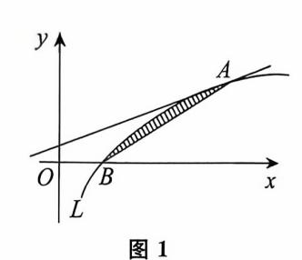
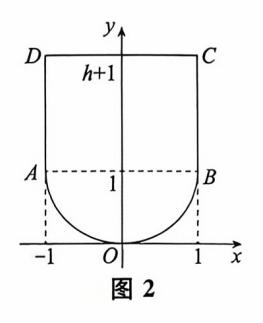
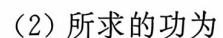

{0}------------------------------------------------

# 第六章 定积分的应用

| 考试内容                                                              | 考试要求 |     |     |
|-------------------------------------------------------------------|------|-----|-----|
|                                                                   | 数一   | 数二  | 数三  |
| 利用定积分计算平面图形的面积、旋转体的体积和函数的平均值                                      | 会计算  | 会计算 | 会计算 |
| 用定积分表达和计算一些几何量与物理量(平面曲线的弧长、旋转体的侧面积、平行截面面积为已知的立体体积、功、引力、压力、质心、形心等) | 沙掌握  | 掌握  | /   |
| 利用定积分求解简单的经济应用问题                                                  |      | /   | 会解  |

# 考试内容概要 。。

用定积分可表示一些几何量与物理量(平面图形的面积、平面曲线的弧长、旋转体的体积及侧面积、平行截面面积为已知的立体体积、变力做功、压力和函数平均值等),定积分的这些应用有个共同思想,即建立"微元",然后对微元积分就能得到所求量.

#### 一、几何应用

#### 1. 平面图形的面积

(1) 若平面域 D 由曲线 y = f(x),  $y = g(x)(f(x) \geqslant g(x))$ , x = a, x = b(a < b) 所围成,则平面域 D 的面积为

$$S = \int_a^b [f(x) - g(x)] dx.$$

(2) 若平面域 D 由曲线  $r=r(\theta)$  ,  $\theta=\alpha$  ,  $\theta=\beta$  ( $\alpha<\beta$ ) 所围成,则其面积为

$$S = \frac{1}{2} \int_{\alpha}^{\beta} r^2(\theta) d\theta.$$

## 2. 旋转体体积

若区域 D 由曲线  $y = f(x)(f(x) \ge 0)$  和直线  $x = a, x = b(0 \le a < b)$  及 x 轴所围成,则

{1}------------------------------------------------

(1) 区域 D 绕 x 轴旋转一周所得到的旋转体体积为

$$V_x = \pi \int_a^b f^2(x) \, \mathrm{d}x.$$

(2) 区域 D 绕 y 轴旋转一周所得到的旋转体体积为

$$V_{y} = 2\pi \int_{a}^{b} x f(x) dx.$$

### 3. 曲线弧长(数学三不平水)

 $(1)C: y = y(x), a \leq x \leq b.$ 

$$s = \int_a^b \sqrt{1 + y'^2} \, \mathrm{d}x.$$

(2)C:
$$\begin{cases} x = x(t), \\ y = y(t), \end{cases} \quad \alpha \leqslant t \leqslant \beta.$$

$$s = \int_{a}^{\beta} \sqrt{x'^2 + y'^2} \, \mathrm{d}t.$$

 $(3)C_{:}r = r(\theta), \alpha \leqslant \theta \leqslant \beta.$ 

$$s = \int_{\alpha}^{\beta} \sqrt{r^2 + r'^2} \, \mathrm{d}\theta.$$

## 4. 旋转体侧面积(数学三不要求)

曲线  $y = f(x)(f(x) \ge 0)$  和直线  $x = a, x = b(0 \le a < b)$  及 x 轴所围成区域绕 x 轴旋转所得旋转体的侧面积为

$$S = 2\pi \int_{a}^{b} f(x) \sqrt{1 + f'^{2}(x)} dx.$$

二、物理应用 (数学三不要求)

1. 压力.

- 2. 变力做功.
- 3. 引力.
- 4. 质心

这里压力、变力做功、和引力问题没有一般公式可用,解决这些问题的一般方法为微元法.可归纳为以下3部曲.

(1) 确定所求量的变化区间[a,b].

设所求量 U 非均匀分布在区间[a,b] 上,且对区间具有可加性.

(2) 求微元 dU.

求出所求量 U 在区间[x,x+dx]上的近似值,即微元

$$dU = f(x) dx$$
.

(3) 微元积分.

$$U = \int_{a}^{b} f(x) \, \mathrm{d}x.$$

质心问题有一般公式,我们在下面例题中给出.

{2}------------------------------------------------

# 常考题型与典型例题 ::。

#### 常考题型

- 1. 几何应用
- 2. 物理应用

#### 一、几何应用

【例 1】 (2014,数三)设 D 是由曲线 xy+1=0 与直线 y+x=0 及 y=2 围成的有界 区域,则 D 的面积为 .

解 所求面积为

$$S = \iint_{D} 1 \, d\sigma = \int_{1}^{2} dy \int_{-y}^{-\frac{1}{y}} dx$$

$$= \int_{1}^{2} \left( y - \frac{1}{y} \right) dy = \left( \frac{1}{2} y^{2} - \ln y \right) \Big|_{1}^{2}$$

$$= 2 - \ln 2 - \frac{1}{2} = \frac{3}{2} - \ln 2.$$

【例 2】 (2013,数二) 设封闭曲线 L 的极坐标方程为  $r=\cos 3\theta \left(-\frac{\pi}{6} \leqslant \theta \leqslant \frac{\pi}{6}\right)$ ,则 L 所围平面图形的面积是

(方法 1) 
$$S = \frac{1}{2} \int_{-\frac{\pi}{6}}^{\frac{\pi}{6}} \cos^2 3\theta d\theta = \int_{0}^{\frac{\pi}{6}} \cos^2 3\theta d\theta$$
  

$$= \frac{1}{2} \int_{0}^{\frac{\pi}{6}} (1 + \cos 6\theta) d\theta$$

$$= \frac{1}{2} (\theta + \frac{1}{6} \sin 6\theta) \Big|_{0}^{\frac{\pi}{6}} = \frac{\pi}{12}.$$
(方法 2)  $S = \frac{1}{2} \int_{-\frac{\pi}{6}}^{\frac{\pi}{6}} \cos^2 3\theta d\theta = \int_{0}^{\frac{\pi}{6}} \cos^2 3\theta d\theta = \frac{3\theta = t}{3} \int_{0}^{\frac{\pi}{2}} \cos^2 t dt$ 

$$= \frac{1}{3} \cdot \frac{1}{2} \cdot \frac{\pi}{2} = \frac{\pi}{12}.$$

【例 3】 (2015, 数二、三) 设 A>0,D 是由曲线段  $y=A\sin x\left(0 \leqslant x \leqslant \frac{\pi}{2}\right)$  及直线 y=0, $x=\frac{\pi}{2}$  所围成的平面区域, $V_1$ , $V_2$  分别表示 D 绕 x 轴与 y 轴旋转所成旋转体的体积. 若  $V_1=V_2$ ,求 A 的值.

$$V_1 = \pi \int_0^{\frac{\pi}{2}} A^2 \sin^2 x dx = \pi A^2 \cdot \frac{1}{2} \cdot \frac{\pi}{2} = \frac{\pi^2 A^2}{4}.$$

{3}------------------------------------------------

$$V_{2} = 2\pi \int_{0}^{\frac{\pi}{2}} x \cdot A \sin x dx = -2\pi A \int_{0}^{\frac{\pi}{2}} x d\cos x$$
$$= -2\pi A \left( x \cos x \Big|_{0}^{\frac{\pi}{2}} - \int_{0}^{\frac{\pi}{2}} \cos x dx \right)$$
$$= -2\pi A (0-1) = 2\pi A.$$

又  $V_1 = V_2$ ,则

$$\frac{\pi^2 A^2}{4} = 2\pi A,$$

解得  $A = \frac{8}{\pi}$ .

【例 4】 (2012, & L) 过点(0,1) 作曲线  $L: y = \ln x$  的切线, 切点为 A, 又 L 与 x 轴交于 B 点, 区域 D 由 L 与直线 AB 围成. 求区域 D 的面积及 D 绕 x 轴旋转一周所得旋转体的体积.

承 求切线有如下两个方法:

【方法 1】 设切点 A 的坐标为 $(x_0, y_0)$ ,则切线方程为

$$y - y_0 = \frac{1}{x_0} (x - x_0),$$

将点(0,1)代人,得  $x_0 = e^2, y_0 = 2$ .

【方法 2】 设过点(0,1)的切线方程为 y-1 = kx,

其与  $y = \ln x$  相切,则满足  $\ln x - 1 = kx$ ,  $k = \frac{1}{x}$ ,

解得 
$$x = e^2$$
,  $y = 2$ ,  $(e^2, 2)$  为切点,从而  $k = \frac{1}{e^2}$ .

所以切线方程为  $y = \frac{x}{e^2} + 1$ .

所求面积为

$$S = \int_{1}^{e^{2}} \ln x dx - \frac{1}{2} (e^{2} - 1) \cdot 2$$

$$= x \ln x \Big|_{1}^{e^{2}} - \int_{1}^{e^{2}} dx - e^{2} + 1$$

$$= 2e^{2} - e^{2} + 1 - e^{2} + 1$$

$$= 2.$$

所求体积为

$$V = \pi \int_{1}^{e^{2}} \ln^{2} x dx - \frac{\pi}{3} \cdot 4 \cdot (e^{2} - 1)$$

$$= \pi (x \ln^{2} x - 2x \ln x + 2x) \Big|_{1}^{e^{2}} - \frac{4\pi}{3} (e^{2} - 1)$$

$$= \frac{2\pi}{3} (e^{2} - 1).$$

(这题好多同学出错是因为审题不仔细, 草图画错.)

{4}------------------------------------------------

【例 5】 (数学三不要求)(2011,数一、二) 曲线 
$$y = \int_0^x \tan t dt \left(0 \leqslant x \leqslant \frac{\pi}{4}\right)$$
的弧长  $s =$ 

的 由 ds = 
$$\sqrt{1 + y'^2}$$
 dx =  $\sqrt{1 + \tan^2 x}$  dx = sec xdx  $(0 \le x \le \frac{\pi}{4})$ ,所以
$$s = \int_0^{\frac{\pi}{4}} \sec x dx = \ln|\sec x + \tan x|\Big|_0^{\frac{\pi}{4}} = \ln(1 + \sqrt{2}).$$

### 二、物理应用(数学三不要求)

【例 6】(2002, 数二)某闸门的形状与大小如图 2 所示,其中 y 轴为对称轴,闸门的上部为矩形 ABCD,其中 DC=2 米,下部由二次 抛物线与线段 AB 所围成,当水面与闸门的上端相平时,欲使闸门矩形部分承受的水压力与闸门下部承受的水压力之比为 5:4,闸门矩形部分的高 h 应为多少米?

如图 2 建立坐标系,则抛物线的方程为  $y = x^2$ .

闸门矩形部分承受的水压力

$$\begin{split} P_1 &= 2 \int_1^{h+1} \rho g (h+1-y) \, \mathrm{d}y = 2 \rho g \left[ (h+1) y - \frac{y^2}{2} \right] \Big|_1^{h+1} \\ &= \rho g h^2 \,, \end{split}$$

其中 $\rho$ 为水的密度,g为重力加速度.

闸门下部承受的水压力

$$P_{2} = 2 \int_{0}^{1} \rho g (h + 1 - y) \sqrt{y} dy$$

$$= 2 \rho g \left[ \frac{2}{3} (h + 1) y^{\frac{3}{2}} - \frac{2}{5} y^{\frac{5}{2}} \right]_{0}^{1}$$

$$= 4 \rho g \left( \frac{1}{3} h + \frac{2}{15} \right).$$

由题意知 $\frac{P_1}{P_2} = \frac{5}{4}$ ,即

$$\frac{h^2}{4\left(\frac{1}{3}h + \frac{2}{15}\right)} = \frac{5}{4},$$

解之得 h = 2,  $h = -\frac{1}{3}$  (舍去), 故 h = 2, 即闸门矩形部分的高应为 2 米.

【例 7】 (2011, & -) 一容器的内侧是由图 3 中曲线绕 y 轴旋转一周而成的曲面,该曲线由  $x^2 + y^2 = 2y \left(y \geqslant \frac{1}{2}\right)$ 与  $x^2 + y^2 = 1 \left(y \leqslant \frac{1}{2}\right)$ 连接而成.

- (1) 求容器的容积.
- (2) 若将容器内盛满的水从容器顶部全部抽出,至少需要做多少功?

{5}------------------------------------------------

(长度单位: $\mathbb{X}$ ,重力加速度为g 米 /秒2,水的密度为 $10^3$  千克 / $\mathbb{X}$ 3)

(1)由对称性,所求的容积为

$$V = 2\pi \int_{-1}^{\frac{1}{2}} x^2 \, \mathrm{d}y = 2\pi \int_{-1}^{\frac{1}{2}} (1 - y^2) \, \mathrm{d}y = \frac{9\pi}{4},$$

即该容器的容积为 $\frac{9\pi}{4}$ m3.

$$\begin{split} W &= 10^{3} \int_{-1}^{\frac{1}{2}} \pi (1 - y^{2}) (2 - y) g dy + 10^{3} \int_{\frac{1}{2}}^{2} \pi (2y - y^{2}) (2 - y) g dy \\ &= 10^{3} \pi g \left[ \int_{-1}^{\frac{1}{2}} (2 - y - 2y^{2} + y^{3}) dy + \int_{\frac{1}{2}}^{2} (4y - 4y^{2} + y^{3}) dy \right] \\ &= \frac{27 \times 10^{3}}{8} \pi g, \end{split}$$

即所求的功为 $\frac{27 \times 10^3}{9} \pi g(J)$ .

$$(A)\int_0^l \frac{G}{x^2+1} dx.$$

(B) 
$$\int_0^l \frac{Gx}{(x^2+1)^{\frac{3}{2}}} dx$$
.

图 3

(C) 
$$\int_0^l \frac{G}{(x^2+1)^{\frac{3}{2}}} dx$$
.

(D) 
$$\int_0^l \frac{G(x+1)}{(x^2+1)^{\frac{3}{2}}} dx$$
.

$$| F(x) | = \frac{G}{x^2 + 1}.$$

该力在 x 轴方向的分力为

$$| \mathbf{F}_{x}(x) | = \frac{G}{x^{2}+1} \cdot \frac{x}{\sqrt{x^{2}+1}} = \frac{Gx}{(x^{2}+1)^{\frac{3}{2}}},$$

则当点 P 移动到点(l,0) 时,克服质点 Q 的引力所做的功为

$$W = \int_0^l \frac{Gx}{(x^2 + 1)^{\frac{3}{2}}} dx.$$

故应选(B).

【例 9】 一根长为 1 的细棒位于 x 轴的区间[0,1]上,若其线密度  $\rho = -x^2 + 2x + 1$ ,则 该细棒的质心坐标  $\bar{x} =$ \_\_\_\_\_.

$$\bar{x} = \frac{\int_0^1 x \rho(x) \, \mathrm{d}x}{\int_0^1 \rho(x) \, \mathrm{d}x} = \frac{\int_0^1 x (-x^2 + 2x + 1) \, \mathrm{d}x}{\int_0^1 (-x^2 + 2x + 1) \, \mathrm{d}x} = \frac{\frac{11}{12}}{\frac{5}{3}} = \frac{11}{20}.$$

{6}------------------------------------------------

同学需要练习去试试严选题吧!还不够,再试试下面的作业题.

# 本章作业超链接 🧳 《基础过关66D题》 优选 -\_\_\_\_\_

数学一 75 76 79 80 260 263 264

**数学二** 128 133 134 139 367 369 372 378 379

数学三 91 93 94 95 273 274 275

