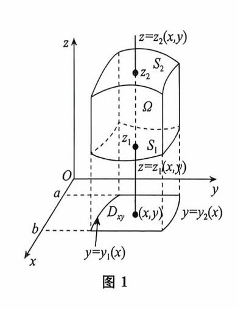
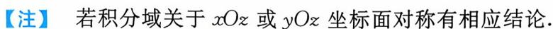
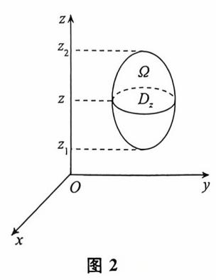
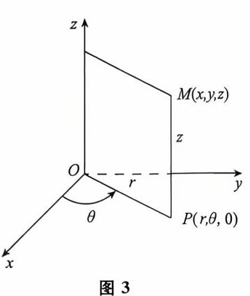
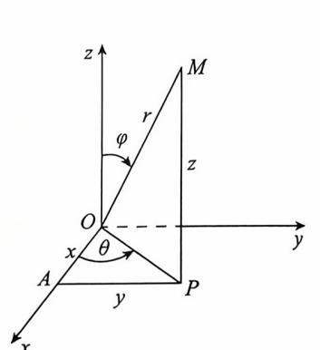
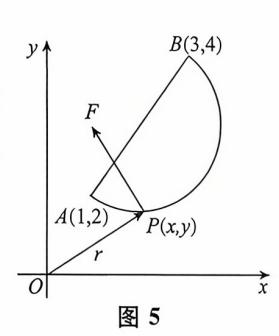

{0}------------------------------------------------

# 第十二章 多元积分学及其应用(仅数学-要求)

| 考试内容                                                                                                                                   | 考试要求 |
|----------------------------------------------------------------------------------------------------------------------------------------|------|
| タ m( ) コー                                                                                                                              | 数一   |
| 三重积分的概念 两类曲线积分的概念                                                                                                                      | 理解   |
| 重积分的性质 两类曲线积分的性质及两类曲线积分的关系 两类曲面积分的概念、性质及两类曲面积分的关系 散度与旋度的概念                                                                             | 了解   |
| 计算两类曲线积分的方法 格林公式 平面曲线积分与路径无关的条件 计算两类曲面积分的方法 用高斯公式计算曲面积分的方法                                                                       | 掌握   |
| 三重积分(直角坐标、柱面坐标、球面坐标) 二元函数全微分的原函数 用斯托克斯公式计算曲线积分 方向导数、梯度、散度与旋度 用重积分、曲线积分及曲面积分求一些几何量与物理量(平面图形的面积、体积、曲面面积、弧长、质量、质心、形心、转动惯量、引力、功及流量等) | 会计算  |

## 第一节 三重积分

## \*考试内容概要 \*\*。

#### 三重积分

### 1. 定义

$$\iint_{\Omega} f(x,y,x) dv = \lim_{d \to 0} \sum_{k=1}^{n} f(\xi_{k}, \eta_{k}, \zeta_{k}) \Delta v_{k}.$$

#### 2. 性质

与二重积分类似.

#### 3. 计算

- (1) 直角坐标.
- ① 先一后二(先单后重).

{1}------------------------------------------------

多元积分学及其应用。

设平行于z轴且穿过闭区域 $\Omega$ 内部的直线与 $\Omega$ 的边界曲面S最多两个交点.  $\Omega$ 在xOy面上的投影域为 $D_{xy}$ (如图 1),则

$$\iiint_{\Omega} f(x,y,z) dv = \iint_{D_{xy}} dx dy \int_{z_1(x,y)}^{z_2(x,y)} f(x,y,z) dz.$$

② 先二后一(先重后单).

设空间区域  $\Omega = \{(x,y,z) \mid (x,y) \in D_z, z_1 \leq z \leq z_2\}$ ,其中  $D_z$  是垂直于z 轴的平面截闭区域 $\Omega$  所得的平面闭区域(如图 2),则

$$\iiint_{\Omega} f(x,y,z) dv = \int_{z_1}^{z_2} dz \iint_{D_z} f(x,y,z) dx dy.$$

#### (2) 柱坐标.

柱坐标与直角坐标的关系为

$$\begin{cases} x = r\cos\theta, & 0 \leqslant r < +\infty, \\ y = r\sin\theta, & 0 \leqslant \theta \leqslant 2\pi, \\ z = z, & -\infty < z < +\infty. \end{cases}$$

体积微元  $dv = r dr d\theta dz$  (如图 3).

$$\iint_{\Omega} f(x,y,z) dv = \iint_{\Omega} f(r\cos\theta, r\sin\theta, z) r dr d\theta dz.$$

#### (3) 球坐标.

球坐标与直角坐标的关系为

$$\begin{cases} x = r\sin \varphi \cos \theta, & 0 \leqslant r < +\infty, \\ y = r\sin \varphi \sin \theta, & 0 \leqslant \varphi \leqslant \pi, \\ z = r\cos \varphi, & 0 \leqslant \theta \leqslant 2\pi. \end{cases}$$

体积微元  $dv = r^2 \sin \varphi dr d\varphi d\theta$  (如图 4).

$$\iint_{\Omega} f(x,y,z) dv = \iint_{\Omega} f(r\sin \varphi \cos \theta, r\sin \varphi \sin \theta, r\cos \varphi) r^{2} \sin \varphi dr d\varphi d\theta.$$

#### (4) 利用奇偶性.

若积分域  $\Omega$  关于 xOy 坐标面对称,f(x,y,z) 关于 z 有奇偶性,则

$$\iint_{\Omega} f(x,y,z) dv = \begin{cases}
2 \iint_{z \ge 0} f(x,y,z) dv, & f(x,y,z) \notin \mathbb{T} z \text{ 是偶函数,} \\
0, & f(x,y,z) \notin \mathbb{T} z \text{ 是奇函数.}
\end{cases}$$

(5) 利用变量的轮换对称性.(具体应用参见例题)

图 4

{2}------------------------------------------------

# 多元积分学及其应用 №

## 常考题型与典型例题 💸 。

#### 常考题型

#### 三重积分计算

【例 1】 (1988) 设有空间区域  $\Omega_1: x^2 + y^2 + z^2 \le R^2, z \ge 0$  及  $\Omega_2: x^2 + y^2 + z^2 \le R^2, z \ge 0$  及  $\Omega_2: x^2 + y^2 + z^2 \le R^2$  ,  $z \ge 0, y \ge 0, z \ge 0$  ,则

$$(A) \iiint_{\Omega_1} x dv = 4 \iiint_{\Omega_2} x dv.$$

$$(B) \iiint_{a_{1}} y dv = 4 \iiint_{a_{2}} y dv.$$

(C) 
$$\iint_{\Omega_1} z dv = 4 \iint_{\Omega_2} z dv.$$

(D) 
$$\iint_{a_1} xyz \, \mathrm{d}v = 4 \iint_{a_2} xyz \, \mathrm{d}v.$$

 $Ω_1$  关于 yOz 面前后对称,关于 xOz 面左右对称.

对于(A) 
$$\iint\limits_{\Omega_1} x dv = 0, \iint\limits_{\Omega_2} x dv > 0, 故(A) 错.$$

对于(B) 
$$\iint_{\Omega_1} y dv = 0, \iint_{\Omega_2} y dv > 0, 故(B) 错.$$

对于(C) 
$$\iiint_{\Omega} z dv = 4 \iiint_{\Omega} z dv$$
,(C)为正确选项.

对于(D) 
$$\iint\limits_{\Omega_1} xyz \, \mathrm{d}v = 0, \iint\limits_{\Omega_2} xyz \, \mathrm{d}v > 0, 故(D) 错. 选(C).$$

【例 2】 (2009) 设 
$$\Omega = \{(x,y,z) \mid x^2 + y^2 + z^2 \leq 1\}, 则$$

(新)【方法1】 先二后一.

$$\begin{split} \iint_{\Omega} z^{2} \, \mathrm{d}x \, \mathrm{d}y \, \mathrm{d}z &= \int_{-1}^{1} \, \mathrm{d}z \iint_{D_{z}} z^{2} \, \mathrm{d}x \, \mathrm{d}y & (D_{z} = \{(x,y) \mid x^{2} + y^{2} \leqslant 1 - z^{2}\}) \\ &= \int_{-1}^{1} \, \mathrm{d}z \int_{0}^{2\pi} \, \mathrm{d}\theta \int_{0}^{\sqrt{1 - z^{2}}} z^{2} \cdot r \, \mathrm{d}r \\ &= 2\pi \cdot \int_{-1}^{1} z^{2} \cdot \frac{1}{2} (1 - z^{2}) \, \mathrm{d}z \\ &= \frac{4}{15}\pi. \end{split}$$

【方法 2】 轮换对称性 + 球坐标.

$$\iiint_{\Omega} z^{2} dx dy dz = \frac{1}{3} \iiint_{\Omega} (x^{2} + y^{2} + z^{2}) dx dy dz$$

{3}------------------------------------------------

$$= \frac{1}{3} \int_0^{2\pi} d\theta \int_0^{\pi} d\varphi \int_0^1 r^2 \cdot r^2 \sin \varphi dr$$

$$= \frac{2\pi}{3} \int_0^{\pi} \sin \varphi d\varphi \int_0^1 r^4 dr$$

$$= \frac{2\pi}{3} \times 2 \times \frac{1}{5} = \frac{4}{15}\pi.$$

【例 3】 (2015) 设  $\Omega$  是由平面 x + y + z = 1 与三个坐标平面围成的空间区域,则

(新)【方法1】 由变量的对称性知

$$\iint_{\Omega} x \, \mathrm{d}x \, \mathrm{d}y \, \mathrm{d}z = \iint_{\Omega} z \, \mathrm{d}x \, \mathrm{d}y \, \mathrm{d}z, \\
\iint_{\Omega} (x + 2y + 3z) \, \mathrm{d}x \, \mathrm{d}y \, \mathrm{d}z = 6 \iint_{\Omega} z \, \mathrm{d}x \, \mathrm{d}y \, \mathrm{d}z \\
= 6 \int_{0}^{1} \mathrm{d}x \int_{0}^{1-x} \mathrm{d}y \int_{0}^{1-x-y} z \, \mathrm{d}z \\
= 3 \int_{0}^{1} \mathrm{d}x \int_{0}^{1-x} (1 - x - y)^{2} \, \mathrm{d}y \\
= \int_{0}^{1} (1 - x)^{3} \, \mathrm{d}x = \frac{1}{4}.$$

【方法 2】 由变量的对称性知

$$\iint_{\Omega} (x+2y+3z) \, \mathrm{d}x \, \mathrm{d}y \, \mathrm{d}z = 6 \iint_{\Omega} z \, \mathrm{d}x \, \mathrm{d}y \, \mathrm{d}z = 6 \int_{0}^{1} \mathrm{d}z \iint_{D_{z}} z \, \mathrm{d}x \, \mathrm{d}y$$

$$= 6 \int_{0}^{1} z \cdot \frac{1}{2} (1-z)^{2} \, \mathrm{d}z = \frac{1}{4}.$$

【例 4】(1989)计算三重积分  $\iint_\Omega (x+z) dv$ ,其中  $\Omega$  是由曲面  $z=\sqrt{x^2+y^2}$  与  $z=\sqrt{1-x^2-y^2}$  所围成的区域.

【方法 1】 由  $\Omega$  关于 yOz 坐标面对称,x 是 x 的奇函数,则  $\iint_{\Omega} x \, dv = 0$ .

利用球面坐标计算

$$\iiint_{\Omega} z \, \mathrm{d}v = \int_{0}^{2\pi} \mathrm{d}\theta \int_{0}^{\frac{\pi}{4}} \mathrm{d}\varphi \int_{0}^{1} r \cos \varphi \cdot r^{2} \sin \varphi \mathrm{d}r = 2\pi \cdot \frac{1}{2} \sin^{2}\varphi \Big|_{0}^{\frac{\pi}{4}} \cdot \frac{1}{4} = \frac{\pi}{8},$$

所以
$$\iiint_{\Omega} (x+z) dv = \frac{\pi}{8}.$$

【方法 2】 
$$\iint_{\Omega} x \, \mathrm{d}v = 0,$$

{4}------------------------------------------------

$$\begin{split} \iint_{\Omega} z \, \mathrm{d}v &= \iint_{x^2 + y^2 \leqslant \frac{1}{2}} \mathrm{d}x \, \mathrm{d}y \int_{\sqrt{x^2 + y^2}}^{\sqrt{1 - x^2 - y^2}} z \, \mathrm{d}z \\ &= \frac{1}{2} \iint_{x^2 + y^2 \leqslant \frac{1}{2}} \left[ (1 - x^2 - y^2) - (x^2 + y^2) \right] \mathrm{d}x \, \mathrm{d}y \\ &= \frac{\pi}{4} - \iint_{x^2 + y^2 \leqslant \frac{1}{2}} (x^2 + y^2) \, \mathrm{d}x \, \mathrm{d}y \\ &= \frac{\pi}{4} - \int_{0}^{2\pi} \mathrm{d}\theta \int_{0}^{\frac{1}{2}} r^3 \, \mathrm{d}r = \frac{\pi}{4} - \frac{\pi}{8} = \frac{\pi}{8}. \end{split}$$

【方法 3】  $\iint_{\mathbb{R}} x \, \mathrm{d}v = 0,$ 

$$\iint_{\Omega} z \, dv = \int_{0}^{\frac{1}{\sqrt{2}}} dz \iint_{x^{2}+y^{2} \leqslant z^{2}} z \, dx \, dy + \int_{\frac{1}{\sqrt{2}}}^{1} dz \iint_{x^{2}+y^{2} \leqslant 1-z^{2}} z \, dx \, dy$$

$$= \pi \int_{0}^{\frac{1}{\sqrt{2}}} z^{3} \, dz + \pi \int_{\frac{1}{\sqrt{2}}}^{1} z (1-z^{2}) \, dz$$

$$= \frac{\pi}{16} + \frac{\pi}{16} = \frac{\pi}{8}.$$

【方法 4】

$$\iiint_{\Omega} z \, \mathrm{d}v = \int_{0}^{2\pi} \mathrm{d}\theta \int_{0}^{\frac{1}{\sqrt{2}}} \mathrm{d}r \int_{r}^{\sqrt{1-r^2}} z r \, \mathrm{d}z = \pi \int_{0}^{\frac{1}{\sqrt{2}}} r (1-2r^2) \, \mathrm{d}r$$

$$= \frac{\pi}{8}.$$

## 第二节 曲线积分

## 考试内容概要 。。

#### 一 对弧长的曲线积分(第一类曲线积分)

1. 定义

$$\int_{L} f(x,y) ds = \lim_{\lambda \to 0} \sum_{i=1}^{n} f(\xi_{i}, \eta_{i}) \Delta s_{i}.$$

2. 性质

$$\int_{L(AB)} \widehat{f}(x,y) ds = \int_{L(BA)} \widehat{f}(x,y) ds \quad (与积分路径的方向无关).$$

{5}------------------------------------------------

#### 3. 计算方法(平面)

(1) 直接法.

① 若 
$$L$$
: 
$$\begin{cases} x = x(t), \\ y = y(t), \end{cases} \alpha \leqslant t \leqslant \beta, \mathbb{N}$$
$$\int_{L} f(x, y) ds = \int_{a}^{\beta} f[x(t), y(t)] \sqrt{x'^{2}(t) + y'^{2}(t)} dt.$$

② 若  $L: y = y(x), a \leq x \leq b,$ 则

$$\int_{\mathcal{L}} f(x,y) \, \mathrm{d}s = \int_{a}^{b} f[x,y(x)] \sqrt{1 + y'^{2}(x)} \, \mathrm{d}x.$$

③ 若  $L:r = r(\theta), \alpha \leq \theta \leq \beta$ ,则

$$\int_{L} f(x,y) ds = \int_{0}^{\beta} f(r\cos\theta, r\sin\theta) \sqrt{r^{2} + r'^{2}} d\theta.$$

- (2) 利用奇偶性.
- ① 若积分曲线 L 关于 y 轴对称,则

$$\int_{L} f(x,y) ds = \begin{cases} 2 \int_{L_{x \ge 0}} f(x,y) ds, & \text{当 } f(x,y) \text{ 关于 } x \text{ 为偶函数,} \\ 0, & \text{当 } f(x,y) \text{ 关于 } x \text{ 为奇函数.} \end{cases}$$

② 若积分曲线 L 关于x 轴对称,则

$$\int_{L} f(x,y) ds = \begin{cases} 2 \int_{L_{y \geqslant 0}} f(x,y) ds, & \text{当 } f(x,y) \text{ 关于 } y \text{ 为偶函数,} \\ 0, & \text{当 } f(x,y) \text{ 关于 } y \text{ 为奇函数.} \end{cases}$$

(3) 利用对称性.

若积分曲线关于直线 y = x 对称,则 $\int_{L} f(x,y) ds = \int_{L} f(y,x) ds$ .

特别的
$$\int_{L} f(x) ds = \int_{L} f(y) ds$$
.

对空间曲线积分  $\int_L f(x,y,z) ds$ ,通常化为定积分计算,即若曲线 L 的方程为 : x = x(t), y = y(t),z = z(t) ( $\alpha \le t \le \beta$ ),则

$$\int_{L} f(x,y,z) ds = \int_{a}^{\beta} f[x(t),y(t),z(t)] \sqrt{x'^{2}(t) + y'^{2}(t) + z'^{2}(t)} dt.$$

二、对坐标的曲线积分(第二类曲线积分)

1. 定义

$$\int_{L} P(x,y) dx + Q(x,y) dy = \lim_{\lambda \to 0} \sum_{i=1}^{n} \left[ P(\xi_{i}, \eta_{i}) \Delta x_{i} + Q(\xi_{i}, \eta_{i}) \Delta y_{i} \right].$$

{6}------------------------------------------------

#### 2. 性质

$$\int_{L(AB)} P dx + Q dy = -\int_{L(BA)} P dx + Q dy \quad (与积分路径的方向有关).$$

#### 3. 计算方法(平面)

#### (1) 直接法.

设有光滑曲线 $L:\begin{cases} x=x(t),\\ y=y(t), \end{cases}$ ,其起点和终点分别对应参数 $t=\alpha$ 和 $t=\beta, P(x, t)$ 

y),Q(x,y)在L上连续,则

$$\int_{L} P dx + Q dy = \int_{a}^{\beta} \left\{ P \left[ x(t), y(t) \right] x'(t) + Q \left[ x(t), y(t) \right] y'(t) \right\} dt.$$

#### (2) 格林公式。

设闭区域D由分段光滑的曲线L围成,函数P(x,y),Q(x,y)在D上具有一阶连续偏导数,则有

$$\oint_{L} P \, \mathrm{d}x + Q \, \mathrm{d}y = \iint_{D} \left( \frac{\partial Q}{\partial x} - \frac{\partial P}{\partial y} \right) \, \mathrm{d}\sigma,$$

其中 L 为 D 取正向的边界曲线.

- (3)补线用格林公式(利用曲线积分与路径无关).
- ① 曲线积分与路径无关的判定.

定理 设函数 P(x,y),Q(x,y) 在单连通域 D 上有一阶连续偏导数,则以下四条等价:

- (A) 曲线积分  $\int_{A}^{A} P dx + Q dy$  与路径无关.
- (B)  $\oint_L P \, dx + Q \, dy = 0$ ,其中  $L \to D$  中任一分段光滑闭曲线.

(C) 
$$\frac{\partial P}{\partial y} = \frac{\partial Q}{\partial x}, \forall (x,y) \in D.$$

- (D) P(x, y) dx + Q(x, y) dy = dF(x, y).
- ② 计算.
- (A) 改换路径计算.

一般是沿平行于坐标轴的直线段积分.

$$\int_{(x_1,y_1)}^{(x_2,y_2)} P dx + Q dy = \int_{x_1}^{x_2} P(x,y_1) dx + \int_{y_1}^{y_2} Q(x_2,y) dy,$$

或

$$\int_{(x_1,y_1)}^{(x_2,y_2)} P dx + Q dy = \int_{y_1}^{y_2} Q(x_1,y) dy + \int_{x_1}^{x_2} P(x,y_2) dx,$$

(B) 利用原函数计算.

设 
$$Pdx + Qdy = dF(x,y)$$
,即  $F(x,y)$ 为  $Pdx + Qdy$ 的原函数,则 
$$\int_{(x_1,y_1)}^{(x_2,y_2)} Pdx + Qdy = F(x_2,y_2) - F(x_1,y_1).$$

{7}------------------------------------------------

求原函数方法:偏积分、凑微分.

#### 4. 两类曲线积分的联系

$$\oint_{L} P \, \mathrm{d}x + Q \, \mathrm{d}y = \oint_{L} (P \cos \alpha + Q \cos \beta) \, \mathrm{d}s.$$

#### 5. 计算方法(空间)

#### (1) 直接法.

设分段光滑的曲线 L 由参数方程 x=x(t) , y=y(t) , z=z(t) ,  $t\in [\alpha,\beta]$  给出,其起点和终点分别对应参数  $t=\alpha$  和  $t=\beta$  , P , Q , R 在 L 上连续,则

$$\int_{L} P(x,y,z) dx + Q(x,y,z) dy + R(x,y,z) dz$$

$$= \int_{a}^{\beta} \{ P[x(t),y(t),z(t)]x'(t) + Q[x(t),y(t),z(t)]y'(t) + R[x(t),y(t),z(t)]z'(t) \} dt.$$

#### (2) 斯托克斯公式.

设L为空间分段光滑的有向闭曲线, $\Sigma$ 是以L为边界的分片光滑曲面,L的方向与 $\Sigma$ 的法方向符合右手法则,函数P,Q,R在 $\Sigma$ 上具有一阶连续偏导数,则有

$$\oint_{L} P(x,y,z) dx + Q(x,y,z) dy + R(x,y,z) dz$$

$$= \iint_{\Sigma} \begin{vmatrix} \cos \alpha & \cos \beta & \cos \gamma \\ \frac{\partial}{\partial x} & \frac{\partial}{\partial y} & \frac{\partial}{\partial z} \\ P & Q & R \end{vmatrix} dS = \iint_{\Sigma} \begin{vmatrix} dy dz & dz dx & dx dy \\ \frac{\partial}{\partial x} & \frac{\partial}{\partial y} & \frac{\partial}{\partial z} \\ P & Q & R \end{vmatrix}$$

$$= \iint_{\Sigma} \left( \frac{\partial R}{\partial y} - \frac{\partial Q}{\partial z} \right) dy dz + \left( \frac{\partial P}{\partial z} - \frac{\partial R}{\partial x} \right) dz dx + \left( \frac{\partial Q}{\partial x} - \frac{\partial P}{\partial y} \right) dx dy.$$

## 常考题型与典型例题\_\_\_。

#### 常考题型

曲线积分计算

#### 一、第一类曲线积分的计算

【例 1】 (1989) 设平面曲线 L 为下半圆  $y = -\sqrt{1-x^2}$ ,则曲线积分

$$\int_{L} (x^{2} + y^{2}) ds = \underline{\qquad}.$$

$$\int_{L} x ds = \underline{\qquad}.$$

$$\int_{L} y ds = \underline{\qquad}.$$

{8}------------------------------------------------

$$\int_{L} x \, ds = \int_{\pi}^{2\pi} \cos t \, \sqrt{(-\sin t)^{2} + (\cos t)^{2}} \, dt = \int_{\pi}^{2\pi} \cos t \, dt = 0.$$

$$\int_{L} y \, ds = \int_{\pi}^{2\pi} \sin t \, \sqrt{(-\sin t)^{2} + (\cos t)^{2}} \, dt = \int_{\pi}^{2\pi} \sin t \, dt = -2.$$

【例 2】 (1998) 设 L 为椭圆 $\frac{x^2}{4} + \frac{y^2}{3} = 1$ , 其周长记为 a, 则 $\oint_L (2xy + 3x^2 + 4y^2) ds$ 

斷 由奇偶性知  $\oint_L 2xy \, ds = 0$ ,故

原式=
$$\oint_L (3x^2 + 4y^2) ds = 12 \oint_L \left(\frac{x^2}{4} + \frac{y^2}{3}\right) ds$$
  
=  $12 \oint_L 1 ds = 12a$ .

【例 3】 (2009) 已知曲线  $L: y = x^2 (0 \leqslant x \leqslant \sqrt{2}),$ 则 $\int_L x \, ds =$ \_\_\_\_\_.

$$\iint_{L} x \, ds = \int_{0}^{\sqrt{2}} x \, \sqrt{1 + (2x)^{2}} \, dx = \int_{0}^{\sqrt{2}} x \, \sqrt{1 + 4x^{2}} \, dx$$

$$= \frac{1}{8} \int_{0}^{\sqrt{2}} \sqrt{1 + 4x^{2}} \, d(1 + 4x^{2}) = \frac{1}{12} (1 + 4x^{2})^{\frac{3}{2}} \Big|_{0}^{\sqrt{2}}$$

$$= \frac{13}{6}.$$

### 二、第二类曲线积分的计算

【例 4】 (2004) 设 L 为正向圆周  $x^2+y^2=2$  在第一象限中的部分,则曲线积分  $\int_L x \, \mathrm{d}y - 2y \, \mathrm{d}x$  的值为 \_\_\_\_\_\_.

(新) 【方法 1】

原式= 
$$\int_0^{\frac{\pi}{2}} [(\sqrt{2}\cos t)^2 + 2(\sqrt{2}\sin t)^2] dt = \int_0^{\frac{\pi}{2}} (2\cos^2 t + 4\sin^2 t) dt$$
  
=  $6 \int_0^{\frac{\pi}{2}} \sin^2 t dt = 6 \times \frac{1}{2} \times \frac{\pi}{2} = \frac{3}{2}\pi$ .

【方法 2】 补线用格林公式.

补上线段  $L_1:(0,0) \to (\sqrt{2},0)$ ,  $L_2:(0,\sqrt{2}) \to (0,0)$ . 设  $D=\{(x,y)\mid x\geqslant 0,y\geqslant 0, x^2+y^2\leqslant 2\}$ ,则有

$$\int_{L} x \, dy - 2y dx = \oint_{L+L_1+L_2} x \, dy - 2y dx - \int_{L_1} x \, dy - 2y dx - \int_{L_2} x \, dy - 2y dx$$

{9}------------------------------------------------

$$= \iint_{D} 3 dx dy - \int_{0}^{\sqrt{2}} 0 dx - \int_{\sqrt{2}}^{0} 0 dy$$
$$= 3S_{D} = 3 \times \frac{2\pi}{4} = \frac{3}{2}\pi.$$

【例 5】 (2010) 已知曲线 L 的方程为 y=1-|x| ( $x\in[-1,1]$ ),起点是(-1,0),终点为(1,0),则曲线积分  $\int_L xy \, \mathrm{d}x + x^2 \, \mathrm{d}y =$  \_\_\_\_\_.

【方法 1】 
$$L = L_1 + L_2$$
,其中  $L_1: y = 1 + x(x: -1 \to 0)$ ,  $L_2: y = 1 - x(x: 0 \to 1)$ .
$$\int_{L_1} xy \, dx + x^2 \, dy = \int_{-1}^{0} \left[ x(1+x) + x^2 \right] dx = \int_{-1}^{0} (2x^2 + x) \, dx = \frac{1}{6},$$

$$\int_{L_2} xy \, dx + x^2 \, dy = \int_{0}^{1} \left[ x(1-x) - x^2 \right] dx = \int_{0}^{1} (x - 2x^2) \, dx = -\frac{1}{6},$$

故 $\int_{I} xy \, \mathrm{d}x + x^2 \, \mathrm{d}y = 0.$ 

【方法 2】 补线用格林公式, 欢迎学有余力的同学深入思考

【例 6】 (1999) 求  $I = \int_{L} [e^{x} \sin y - b(x+y)] dx + (e^{x} \cos y - ax) dy$ ,其中 a,b 为正的常数,L 为从点 A(2a,0) 沿曲线  $y = \sqrt{2ax - x^{2}}$  到点 O(0,0) 的弧.

(解) 添加从点 O(0,0) 沿 y=0 到点 A(2a,0) 的有向直线段  $L_1$ ,

$$I = \int_{L \cup L_1} \left[ e^x \sin y - b(x+y) \right] dx + \left( e^x \cos y - ax \right) dy - \int_{L_1} \left[ e^x \sin y - b(x+y) \right] dx + \left( e^x \cos y - ax \right) dy.$$

由格林公式可知,前一积分

$$I_1 = \iint_D (b-a) d\sigma = \frac{\pi}{2} a^2 (b-a)$$
,其中  $D$  为  $L \cup L_1$  所围成的半圆域.

直接计算后一积分可得

$$I_2 = \int_0^{2a} (-bx) dx = -2a^2b.$$

从而 
$$I = I_1 - I_2 = \frac{\pi}{2}a^2(b-a) + 2a^2b = (\frac{\pi}{2} + 2)a^2b - \frac{\pi}{2}a^3$$
.

{10}------------------------------------------------

【例 7】 (2008) 计算曲线积分  $\int_{L} \sin 2x dx + 2(x^2 - 1)y dy$ ,其中 L 是曲线  $y = \sin x$  上 从点(0,0) 到点( $\pi$ ,0) 的一段.

新【方法1】 直接法.

$$\int_{L} \sin 2x dx + 2(x^{2} - 1)y dy = \int_{0}^{\pi} [\sin 2x + 2(x^{2} - 1)\sin x \cdot \cos x] dx$$

$$= \int_{0}^{\pi} x^{2} d(\sin^{2}x) = x^{2} \sin^{2}x \Big|_{0}^{\pi} - 2 \int_{0}^{\pi} x \sin^{2}x dx$$

$$= (-2) \frac{\pi}{2} \int_{0}^{\pi} \sin^{2}x dx = -2\pi \int_{0}^{\frac{\pi}{2}} \sin^{2}x dx$$

$$= (-2\pi) \frac{1}{2} \cdot \frac{\pi}{2} = -\frac{\pi^{2}}{2}.$$

【方法 2】 补线用格林公式,欢迎学有余力的同学深入思考

【例 8】 (2014,数一)设 L 是柱面  $x^2 + y^2 = 1$  与平面 y + z = 0 的交线,从 z 轴正向往 z 轴负向看去为逆时针方向,则曲线积分 $\oint_{\mathbb{C}} z \, \mathrm{d} x + y \, \mathrm{d} z = \underline{\hspace{1cm}}$ .

(新) 【方法 1】 柱面  $x^2 + y^2 = 1$  与平面 y + z = 0 的交线的参数方程为

$$\begin{cases} x = \cos t, \\ y = \sin t, & (0 \le t \le 2\pi) \\ z = -\sin t, \end{cases}$$

则

$$\oint_{L} z \, dx + y dz = \int_{0}^{2\pi} (\sin^{2} t - \sin t \cos t) \, dt$$

$$= 4 \int_{0}^{\frac{\pi}{2}} \sin^{2} t \, dt = 4 \cdot \frac{1}{2} \cdot \frac{\pi}{2} = \pi.$$

【方法 2】 由斯托克斯公式得

$$\oint_{L} z \, dx + y dz = \iint_{\Sigma} (1 - 0) \, dy dz + (1 - 0) \, dz dx + (0 - 0) \, dx dy,$$

其中 $\Sigma$ 为平面y+z=0包含在柱面 $x^2+y^2=1$ 之内部分的上侧,

$$\oint_{L} z \, dx + y dz = \iint_{\Sigma} dy dz + dz dx = \iint_{\Sigma} dz dx$$

$$= \iint_{D_{xx}} dz dx = \pi \, (\sharp + D_{xx} = \{(x,z) \, | \, x^{2} + z^{2} \leqslant 1\}).$$

{11}------------------------------------------------

多元积分学及其应用 🔄 /

【方法3】 将空间线积分化为平面线积分用格林公式.

由 
$$y+z=0$$
 得  $z=-y$ ,代入积分  $\int_L z dx + y dz$  得

$$\oint_L z \, \mathrm{d}x + y \, \mathrm{d}z = \oint_C (-y \, \mathrm{d}x - y \, \mathrm{d}y)$$
 (其中  $C$  为单位圆  $x^2 + y^2 = 1$  沿逆时针方向) 
$$= \iint\limits_{x^2 + y^2 \leqslant 1} \mathrm{d}x \, \mathrm{d}y = \pi.$$
 (格林公式)

### 第三节 曲面积分

## \*考试内容概要 \*\*。

#### 一、对面积的曲面积分(第一类曲面积分)

1. 定义

$$\iint_{\Sigma} f(x,y,z) dS = \lim_{\lambda \to 0} \sum_{i=1}^{n} f(\xi_i, \eta_i, \zeta_i) \Delta S_i.$$

2. 性质

$$\iint_{\Sigma} f(x,y,z) \, \mathrm{d}S = \iint_{-\Sigma} f(x,y,z) \, \mathrm{d}S$$
(与积分曲面的方向无关).

- 3. 计算
- (1) 直接法.

设曲面  $\Sigma: z = z(x,y), (x,y) \in D_{xy}$ ,

$$\iint_{\Sigma} f(x,y,z) dS = \iint_{D_{xy}} f[x,y,z(x,y)] \sqrt{1 + (z'_x)^2 + (z'_y)^2} dxdy.$$

若曲面由方程 x = x(y,z) 或 y = y(z,x) 给出,也可类似地把对面积的面积分化为相应的二重积分.

(2) 利用奇偶性.

若曲面  $\Sigma$  关于 xOy 面对称,则

$$\iint_{\Sigma} f(x,y,z) dS = \begin{cases} 2 \iint_{\Sigma_{z>0}} f(x,y,z) dS, & \text{当 } f(x,y,z) \text{ 关于 } z \text{ 为偶函数,} \\ 0, & \text{当 } f(x,y,z) \text{ 关于 } z \text{ 为奇函数.} \end{cases}$$

{12}------------------------------------------------

多元积分学及其应用 🕆

若曲面  $\Sigma$  关于 yOz 面或 zOx 面对称,也有类似的结论.

(3) 利用对称性.(具体应用参见例题)

#### 二、对坐标的曲面积分(第二类曲面积分)

#### 1. 定义

$$\begin{split} I &= \iint_{\Sigma} P(x,y,z) \, \mathrm{d}y \mathrm{d}z + Q(x,y,z) \, \mathrm{d}z \mathrm{d}x + R(x,y,z) \, \mathrm{d}x \mathrm{d}y, \\ &\iint_{\Sigma} P(x,y,z) \, \mathrm{d}y \mathrm{d}z = \lim_{\lambda \to 0} \sum_{i=1}^{n} P(\xi_{i},\eta_{i},\zeta_{i}) \, \left(\Delta S_{i}\right)_{yz}, \\ &\iint_{\Sigma} Q(x,y,z) \, \mathrm{d}z \mathrm{d}x = \lim_{\lambda \to 0} \sum_{i=1}^{n} Q(\xi_{i},\eta_{i},\zeta_{i}) \, \left(\Delta S_{i}\right)_{zx}, \\ &\iint_{\Sigma} R(x,y,z) \, \mathrm{d}x \mathrm{d}y = \lim_{\lambda \to 0} \sum_{i=1}^{n} R(\xi_{i},\eta_{i},\zeta_{i}) \, \left(\Delta S_{i}\right)_{xy}. \end{split}$$

#### 2. 性质

$$\iint_{\Sigma} P \, \mathrm{d}y \, \mathrm{d}z + Q \, \mathrm{d}z \, \mathrm{d}x + R \, \mathrm{d}x \, \mathrm{d}y = -\iint_{\Sigma^{-}} P \, \mathrm{d}y \, \mathrm{d}z + Q \, \mathrm{d}z \, \mathrm{d}x + R \, \mathrm{d}x \, \mathrm{d}y$$
(与积分曲面的方向有关).

#### 3. 计算

#### (1) 直接法.

设有向曲面  $\Sigma_{:z} = z(x,y), (x,y) \in D_{xy},$ 则

$$\iint_{\Sigma} R(x,y,z) dxdy = \pm \iint_{D_{x}} R[x,y,z(x,y)] dxdy.$$

若有向曲面 $\Sigma$ 的法线向量与z轴正向夹角为锐角,即曲面的上侧,则上式取正号,否则取负号。

设有向曲面  $\Sigma: x = x(y,z), (y,z) \in D_x$ ,则

$$\iint_{\Sigma} P(x,y,z) \, dydz = \pm \iint_{D_{--}} P[x(y,z),y,z] \, dydz.$$

若有向曲面 $\Sigma$ 的法线向量与x轴正向夹角为锐角,即曲面的前侧,则上式取正号,否则取负号.

设有向曲面  $\Sigma: y = y(z,x), (z,x) \in D_{zz}, 则$ 

$$\iint_{\Sigma} Q(x,y,z) dzdx = \pm \iint_{D_{-}} Q[x,y(z,x),z] dzdx.$$

若有向曲面 $\Sigma$ 的法线向量与y轴正向夹角为锐角,即曲面的右侧,则上式取正号,否则取负号.

{13}------------------------------------------------

#### (2) 高斯公式.

设空间闭区域  $\Omega$  由分片光滑闭曲面  $\Sigma$  所围成,函数 P(x,y,z), Q(x,y,z), R(x,y,z) 在  $\Omega$  上具有一阶连续偏导数,则有

$$\bigoplus_{\Sigma_{y_1}} P dy dz + Q dz dx + R dx dy = \iint_{\Omega} \left( \frac{\partial P}{\partial x} + \frac{\partial Q}{\partial y} + \frac{\partial R}{\partial z} \right) dv.$$

(3) 补面用高斯公式.(具体应用参见例题)

## 4. 两类面积分的联系

$$\iint_{\Sigma} (P\cos \alpha + Q\cos \beta + R\cos \gamma) dS = \iint_{\Sigma} (Pdydz + Qdzdx + Rdxdy).$$

## 常考题型与典型例题\_\_\_\_\_\_。

#### 常考题型

曲面积分计算

#### 一、第一类曲面积分的计算

【例 1】 (2000) 设  $S: x^2 + y^2 + z^2 = a^2 (z \ge 0), S_1$  为 S 在第一卦限中的部分,则有

$$(A) \iint_{S} x \, dS = 4 \iint_{S} x \, dS.$$

$$(B) \iint_{S} y \, dS = 4 \iint_{S_{s}} x \, dS.$$

$$(C) \iint_{S} z \, dS = 4 \iint_{S_{1}} x \, dS.$$

$$(D) \iint_{S} xyz \, dS = 4 \iint_{S} xyz \, dS.$$

对于(A), 
$$\iint_S x dS = 0$$
,  $\iint_S x dS > 0$ , 故(A) 错.

对于(B), 
$$\iint_S y dS = 0$$
,  $\iint_S x dS > 0$ , 故(B) 错.

对于(C), 
$$\iint_S z dS = 4\iint_{S_1} z dS = 4\iint_{S_1} x dS$$
, 正确.

对于(D), 
$$\iint_S xyz dS = 0$$
,  $\iint_{S_1} xyz dS > 0$ , 故(D) 错. 选(C).

【例 2】 (2012) 设 
$$\Sigma = \{(x,y,z) \mid x+y+z=1, x \ge 0, y \ge 0, z \ge 0\},$$
则 $\iint_{\Sigma} y^2 dS$ 

$$\iint_{\Sigma} y^{2} dS = \sqrt{3} \iint_{D} y^{2} dx dy = \sqrt{3} \int_{0}^{1} dy \int_{0}^{1-y} y^{2} dx = \frac{\sqrt{3}}{12}.$$

{14}------------------------------------------------

【例 3】 (1995) 计算曲面积分  $\iint_{\Sigma} dS$ ,其中  $\Sigma$  为锥面  $z = \sqrt{x^2 + y^2}$  在柱体  $x^2 + y^2 \leqslant 2x$  内的部分.

 $\Sigma$  在 xOy 平面上的投影区域  $D: x^2 + y^2 \leq 2x$ .

$$dS = \sqrt{1 + z_x'^2 + z_y'^2} d\sigma = \sqrt{2} d\sigma,$$
于是
$$\iint_{\Sigma} z dS = \iint_{D} \sqrt{x^2 + y^2} \cdot \sqrt{2} d\sigma = \sqrt{2} \int_{-\frac{\pi}{2}}^{\frac{\pi}{2}} d\theta \int_{0}^{2\cos\theta} r^2 dr$$

$$= \frac{16\sqrt{2}}{3} \int_{0}^{\frac{\pi}{2}} \cos^3\theta d\theta = \frac{32}{9}\sqrt{2}.$$

二、第二类曲面积分的计算

【例 4】(1988)设  $\Sigma$  为曲面  $x^2+y^2+z^2=1$  的外侧,计算曲面积分

$$I = \iint_{\Sigma} x^3 \, \mathrm{d}y \, \mathrm{d}z + y^3 \, \mathrm{d}z \, \mathrm{d}x + z^3 \, \mathrm{d}x \, \mathrm{d}y.$$

自高斯公式,并利用球面坐标计算三重积分,得

$$I = 3 \iint_{\Omega} (x^2 + y^2 + z^2) dv$$
 (Ω 是由  $\Sigma$  所围成的区域)
$$= 3 \int_{0}^{2\pi} d\theta \int_{0}^{\pi} \sin \varphi d\varphi \int_{0}^{1} r^2 \cdot r^2 dr = \frac{12}{5}\pi.$$

【例 5】 (2005) 设 $\Omega$  是由锥面 $z = \sqrt{x^2 + y^2}$  与半球面 $z = \sqrt{R^2 - x^2 - y^2}$  围成的空间 区域, $\Sigma$  是 $\Omega$  的整个边界的外侧,则 $\oint_{\Sigma} x \, \mathrm{d}y \, \mathrm{d}z + y \, \mathrm{d}z \, \mathrm{d}x + z \, \mathrm{d}x \, \mathrm{d}y =$ \_\_\_\_\_\_.

$$\iint_{\Sigma} x \, \mathrm{d}y \, \mathrm{d}z + y \, \mathrm{d}z \, \mathrm{d}x + z \, \mathrm{d}x \, \mathrm{d}y = \iint_{\Omega} 3 \, \mathrm{d}x \, \mathrm{d}y \, \mathrm{d}z = 3 \int_{0}^{R} r^{2} \, \mathrm{d}r \int_{0}^{\frac{\pi}{4}} \sin \varphi \, \mathrm{d}\varphi \int_{0}^{2\pi} \mathrm{d}\theta$$
$$= 2\pi \left(1 - \frac{\sqrt{2}}{2}\right) R^{3} = (2 - \sqrt{2}) \pi R^{3}.$$

【例 6】 (2008) 设曲面  $\Sigma$  是  $z = \sqrt{4-x^2-y^2}$  的上侧,则  $\int_{\Sigma} xy \, dy \, dz + x \, dz \, dx + x^2 \, dx \, dy =$ 

设  $\Sigma_1$  是曲面 z=0 ( $x^2+y^2\leqslant 4$ ) 取下侧,由  $\Sigma$  与  $\Sigma_1$  所围的立体(上半球体)为  $\Omega$ ,则由高斯公式可知

$$\iint\limits_{\Sigma} = \iint\limits_{\Sigma + \Sigma_1} - \iint\limits_{\Sigma_1} = \iiint\limits_{\Omega} y \, \mathrm{d}x \, \mathrm{d}y \, \mathrm{d}z - \iint\limits_{\Sigma_1}.$$

由对称性知 $\iiint_{\Omega} y \, dx \, dy \, dz = 0$ ,故

{15}------------------------------------------------

$$\iint_{\Sigma} = -\iint_{\Sigma_{1}} = \iint_{x^{2}+y^{2} \leq 4} x^{2} dx dy = \frac{1}{2} \iint_{x^{2}+y^{2} \leq 4} (x^{2} + y^{2}) dx dy = 4\pi.$$

【例 7】 (2014) 设  $\Sigma$  是曲面  $z=x^2+y^2$  ( $z\leqslant 1$ ) 的上侧,计算曲面积分  $I=\int\limits_{x}^{\infty}(x-1)^3\,\mathrm{d}y\mathrm{d}z+(y-1)^3\,\mathrm{d}z\mathrm{d}x+(z-1)\mathrm{d}x\mathrm{d}y.$ 

 $(\mathbf{K})$  设 S 为平面 z=1 包含在曲面  $z=x^2+y^2$  之内部分的下侧,则

$$\begin{split} I &= \iint\limits_{\Sigma + S} (x-1)^3 \, \mathrm{d}y \mathrm{d}z + (y-1)^3 \, \mathrm{d}z \mathrm{d}x + (z-1) \, \mathrm{d}x \mathrm{d}y - \\ &\iint\limits_{S} (x-1)^3 \, \mathrm{d}y \mathrm{d}z + (y-1)^3 \, \mathrm{d}z \mathrm{d}x + (z-1) \, \mathrm{d}x \mathrm{d}y \\ &= - \iint\limits_{\Omega} \left[ 3 \, (x-1)^2 + 3 \, (y-1)^2 + 1 \right] \mathrm{d}v - 0 \qquad (\Omega \, \, \!\!\! \! \! \! \! \! \! \! \! \! \! \! \! \! \! \!$$

注意到  $\Omega$  关于 yOz 面和 zOx 面都对称,则

$$\iint_{\Omega} x \, dv = \iint_{\Omega} y \, dv = 0.$$

$$\iint_{\Omega} (3x^2 + 3y^2 + 7) \, dv = \int_{0}^{2\pi} d\theta \int_{0}^{1} dr \int_{r^2}^{1} (3r^2 + 7) r dz$$

$$= 2\pi \int_{0}^{1} r (3r^2 + 7) (1 - r^2) \, dr$$

$$= 4\pi,$$
(柱坐标)

故  $I = -4\pi$ .

## 第四节 多元积分应用

## 考试内容概要:。

#### 多元积分应用一览表

| 所求量  | 平面板                                  | 空间体                                     | 曲线                          | 曲面         |
|------|--------------------------------------|-----------------------------------------|-----------------------------|------------|
| 几何度量 | 面积 $S = \iint_{\mathcal{D}} d\sigma$ | 体积 $V=\iint\limits_{\Omega}\mathrm{d}v$ | 弧长 $L = \int_C \mathrm{d}s$ | 面积 S = ∬dS |

{16}------------------------------------------------

| 质 量  | $m = \iint_{D} \rho(x, y)  \mathrm{d}\sigma$                                         | $m = \iint_{\Omega} \rho(x, y, z)  \mathrm{d}v$                                    | $m = \int_{\mathcal{C}} \rho(x, y, z)  \mathrm{d}s$                              | $m = \iint_{\Sigma} \rho(x, y, z)  \mathrm{d}S$                                            |
|------|--------------------------------------------------------------------------------------|------------------------------------------------------------------------------------|----------------------------------------------------------------------------------|--------------------------------------------------------------------------------------------|
| 质 心  | $\overline{x} = \frac{\iint_{D} x \rho(x, y) d\sigma}{\iint_{D} \rho(x, y) d\sigma}$ | $\overline{x} = \frac{\iint_{a} x \rho(x, y, z)  dv}{\iint_{a} \rho(x, y, z)  dv}$ | $\overline{x} = \frac{\int_{C} x \rho(x, y, z)  ds}{\int_{C} \rho(x, y, z)  ds}$ | $\overline{x} = \frac{\iint_{\Sigma} x \rho(x, y, z) dS}{\iint_{\Sigma} \rho(x, y, z) dS}$ |
| 转动惯量 | $I_x = \iint_D y^2 \rho(x, y)  \mathrm{d}\sigma$                                     | $I_x = \iint_a (y^2 + z^2)$ . $\rho(x, y, z) dv$                                   | $I_{x} = \int_{C} (y^{2} + z^{2}) \cdot \rho(x, y, z) ds$                        | $I_{x} = \iint_{\Sigma} (y^{2} + z^{2}) \cdot \rho(x, y, z) dS$                            |

#### 1. 变力做功

力 
$$F = Pi + Qj + Rk$$
,
 $W = \int_{AB} P dx + Q dy + R dz$ .

#### 2. 通量

向量场:
$$U(x,y,z) = Pi + Qj + Rk$$
.  
通量: $\Phi = \iint_{\Sigma} P \, dy dz + Q dz dx + R dx dy$ .

## 常考题型与典型例题 :。

#### 常考题型

形心和变力做功的计算

【例 1】 (2010) 设  $\Omega = \{(x,y,z) \mid x^2 + y^2 \leqslant z \leqslant 1\}$ ,则  $\Omega$  的形心的竖坐标  $\overline{z} = \underline{\hspace{1cm}}$ 

$$\overline{z} = \frac{\iint_{\Omega} z \, dv}{\iint_{\Omega} dv}, \overline{m};$$

$$\iiint_{\Omega} dv = \int_{0}^{1} \left( \iint_{x^{2} + y^{2} \leqslant z} dx dy \right) dz = \int_{0}^{1} \pi z dz = \frac{\pi}{2},$$

$$\iiint_{\Omega} z \, dv = \int_{0}^{1} \left( \iint_{x^{2} + y^{2} \leqslant z} dx dy \right) z \, dz = \int_{0}^{1} \pi z^{2} \, dz = \frac{\pi}{3},$$

$$\dot{\nabla} \overline{z} = \frac{2}{3}.$$

{17}------------------------------------------------

【例 2】 (2000) 设有一半径为 R 的球体,P。是此球的表面上的一个定点,球体上任一点的密度与该点到 P。距离的平方成正比(比例常数 k > 0),求球体的重心位置.

设所考虑的球体为 $\Omega$ 、球心为O,以定点P。为原点,射线P。O为正z 轴建立直角坐标系,则球面的方程为

$$x^2 + y^2 + z^2 = 2Rz.$$

设 $\Omega$ 的重心位置为(x,y,z),由对称性,得

$$\overline{x} = 0, \overline{y} = 0, \overline{z} = \frac{\iint_{\Omega} kz(x^2 + y^2 + z^2) dv}{\iint_{\Omega} k(x^2 + y^2 + z^2) dv}.$$

$$\iint_{\Omega} (x^2 + y^2 + z^2) dv = 4 \int_{0}^{\frac{\pi}{2}} d\theta \int_{0}^{\frac{\pi}{2}} d\varphi \int_{0}^{2R\cos\varphi} r^4 \sin\varphi dr = \frac{32}{15}\pi R^5,$$

$$\iint_{\Omega} z(x^2 + y^2 + z^2) dv = 4 \int_{0}^{\frac{\pi}{2}} d\theta \int_{0}^{\frac{\pi}{2}} d\varphi \int_{0}^{2R\cos\varphi} r^5 \sin\varphi \cos\varphi dr$$

$$= \frac{64}{3}\pi R^6 \int_{0}^{\frac{\pi}{2}} \cos^7\varphi \sin\varphi d\varphi = \frac{8}{3}\pi R^6,$$

故 $\overline{z} = \frac{5}{4}R$ . 因此,球体  $\Omega$  的重心位置为 $\left(0,0,\frac{5}{4}R\right)$ .

【例 3】 (1990) 质点 P 沿着以 AB 为直径的半圆周,从点 A(1,2) y 运动到点 B(3,4) 的过程中受到变力 F 作用(图 5),F 的大小等于点 P 与原点 O 之间的距离,其方向垂直于直线段 OP,且与 y 轴正向的夹角小于 $\frac{\pi}{2}$ . 求变力 F 对质点 P 所做的功.

[F]【方法 1】 按题意,变力 F = -yi + xj. 变力 F 所做的功

$$W = \int_{\widehat{AB}} (-y) \, \mathrm{d}x + x \, \mathrm{d}y.$$

圆弧AB 的参数方程是

$$\begin{cases} x = 2 + \sqrt{2}\cos\theta, \\ y = 3 + \sqrt{2}\sin\theta, \end{cases} - \frac{3}{4}\pi \leqslant \theta \leqslant \frac{\pi}{4},$$

$$W = \int_{\widehat{AB}} (-y) dx + x dy$$

$$= \int_{-\frac{3}{4}\pi}^{\frac{\pi}{4}} \left[ \sqrt{2} (3 + \sqrt{2}\sin\theta) \sin\theta + \sqrt{2} (2 + \sqrt{2}\cos\theta) \cos\theta \right] d\theta$$

$$= 2(\pi - 1).$$

【方法 2】 按题意,变力 F = -yi + xj. 变力 F 所做的功

{18}------------------------------------------------

$$W = \int_{\widehat{AB}} (-y) dx + x dy$$

$$= \oint_{\widehat{AB} + \overline{BA}} (-y) dx + x dy - \int_{\overline{BA}} (-y) dx + x dy$$

$$= \iint_{D} 2 dx dy - \int_{3}^{1} -(1+x) dx + x dx$$

$$= 2\pi - 2.$$

## 第五节 场论初步

## 考试内容概要 💸

#### 1. 方向导数

定义

$$\frac{\partial f}{\partial l}\Big|_{(x_0,y_0)} = \lim_{t \to 0^+} \frac{f(x_0 + t\cos\alpha, y_0 + t\cos\beta) - f(x_0,y_0)}{t},$$

其中  $e_l = (\cos \alpha, \cos \beta)$ .

定理 若函数 f(x,y) 在点  $P_0(x_0,y_0)$  处可微,则函数在该点沿任一方向 l 的方向导数都存在,且有

$$\frac{\partial f}{\partial l}\Big|_{(x_0,y_0)} = f'_x(x_0,y_0)\cos\alpha + f'_y(x_0,y_0)\cos\beta.$$

#### 2. 梯度

定义 设 f(x,y) 在点  $P_0(x_0,y_0)$  处具有一阶连续偏导数,

$$\operatorname{grad} f(x_0, y_0) = f'_x(x_0, y_0)i + f'_y(x_0, y_0)j.$$

【注】 梯度  $\operatorname{grad} f(x_0, y_0)$  是一个向量,它的方向是函数在这点方向导数最大的方向,它的模等于方向导数的最大值.

#### 3. 散度

设有向量场  $A(x,y,z)=\{P,Q,R\}$ ,其中 P,Q,R 均具有一阶连续偏导数,则  $\operatorname{div} A=\frac{\partial P}{\partial x}+\frac{\partial Q}{\partial y}+\frac{\partial R}{\partial z}.$ 

### 4. 旋度

设有向量场 $A(x,y,z) = \{P,Q,R\},$ 其中P,Q,R均具有一阶连续偏导数,则

{19}------------------------------------------------

$$\mathbf{rot} \ \mathbf{A} = \begin{vmatrix} \mathbf{i} & \mathbf{j} & \mathbf{k} \\ \frac{\partial}{\partial x} & \frac{\partial}{\partial y} & \frac{\partial}{\partial z} \\ P & Q & R \end{vmatrix}.$$

## 常考题型与典型例题 :。。

#### 常考题型

方向导数、梯度、散度、旋度的计算

【例 1】 (1996) 函数  $u = \ln(x + \sqrt{y^2 + z^2})$  在点 A(1,0,1) 处沿 A 指向 B(3,-2,2) 方向的方向导数为 .

**龢** 由于 
$$u(x,0,1) = \ln(x+1)$$
,则

$$\frac{\partial u}{\partial x}\Big|_{(1,0,1)} = \frac{1}{x+1}\Big|_{x=1} = \frac{1}{2}.$$

由于  $u(1,y,1) = \ln(1+\sqrt{y^2+1})$  为 y 的偶函数,则其导函数为奇函数,因此

$$\frac{\partial u}{\partial y}\Big|_{(1,0,1)} = 0.$$

由于  $u(1,0,z) = \ln(1+z)$ ,则

$$\frac{\partial u}{\partial z}\Big|_{(1,0,1)} = \frac{1}{1+z}\Big|_{z=1} = \frac{1}{2},$$

$$\overrightarrow{AB} = \{2, -2, 1\},$$

其方向余弦为

$$\cos \alpha = \frac{2}{3}, \cos \beta = -\frac{2}{3}, \cos \gamma = \frac{1}{3}.$$

则所求方向导数为

$$\frac{1}{2} \times \frac{2}{3} + 0 \times \left(-\frac{2}{3}\right) + \frac{1}{2} \times \frac{1}{3} = \frac{1}{2}.$$

【例 2】 在椭球面  $2x^2 + 2y^2 + z^2 = 1$  上求一点,使函数  $u = x^2 + y^2 + z^2$  在该点沿 l = (1, -1, 0) 方向的方向导数最大.

(4) 
$$l = (1, -1, 0)$$
 的方向余弦为  $\cos \alpha = \frac{1}{\sqrt{2}}, \cos \beta = \frac{-1}{\sqrt{2}}, \cos \gamma = 0$ ,函数  $u = x^2 + 1$ 

 $y^2 + z^2$  在椭球面上点(x,y,z) 处沿 l 方向的方向导数为

$$\frac{\partial u}{\partial l} = 2x \cdot \frac{1}{\sqrt{2}} + 2y \left(\frac{-1}{\sqrt{2}}\right) = \sqrt{2}(x-y).$$

{20}------------------------------------------------

$$\diamondsuit F(x,y,z,\lambda) = x - y + \lambda (2x^2 + 2y^2 + z^2 - 1),$$
 
$$\begin{cases} F'_x = 1 + 4\lambda x = 0, \\ F'_y = -1 + 4\lambda y = 0, \\ F'_z = 2\lambda z = 0, \\ F'_\lambda = 2x^2 + 2y^2 + z^2 - 1 = 0. \end{cases}$$

由上式解得可能的极值点 $\left(\frac{1}{2}, -\frac{1}{2}, 0\right)$ 和 $\left(-\frac{1}{2}, \frac{1}{2}, 0\right)$ ,

$$\frac{\partial u}{\partial l}\Big|_{\left(\frac{1}{2},-\frac{1}{2},0\right)} = \sqrt{2},$$

$$\frac{\partial u}{\partial l}\Big|_{\left(-\frac{1}{2},\frac{1}{2},0\right)} = -\sqrt{2},$$

则所求点为 $\left(\frac{1}{2},-\frac{1}{2},0\right)$ .

【例 3】 
$$(2012)$$
grad $\left(xy + \frac{z}{y}\right)\Big|_{(2,1,1)} = \underline{\qquad}$ .

係 根据梯度定义  $\operatorname{grad} f(x,y,z) = \left(\frac{\partial f}{\partial x}, \frac{\partial f}{\partial y}, \frac{\partial f}{\partial z}\right)$ ,于是

$$\operatorname{grad}\left(xy+\frac{z}{y}\right)\Big|_{(2,1,1)}=\left(y,x-\frac{z}{y^2},\frac{1}{y}\right)\Big|_{(2,1,1)}=(1,1,1).$$

故应填(1,1,1) 或 i+j+k.

【例 4】 (1989) 向量场  $u(x,y,z) = xy^2i + ye^zj + x\ln(1+z^2)k$  在点 P(1,1,0) 处的散度 div u =\_\_\_\_\_.

向量场 u(x,y,z) 分别对 x,y,z 求偏导得  $y^2,e^z,\frac{2xz}{1+z^2}$ .

将 P(1,1,0) 代人得 div u = 1+1+0=2.

【例 5】 (2018) 设 F(x,y,z) = xyi - yzj + zxk,则 rot F(1,1,0) =\_\_\_\_\_\_.

rot 
$$F(1,1,0) = \begin{vmatrix} \mathbf{i} & \mathbf{j} & \mathbf{k} \\ \frac{\partial}{\partial x} & \frac{\partial}{\partial y} & \frac{\partial}{\partial z} \\ xy & -yz & zx \end{vmatrix} \Big|_{(1,1,0)}$$

$$= \left[ (0+y)\mathbf{i} - (z-0)\mathbf{j} + (0-x)\mathbf{k} \right] \Big|_{(1,1,0)}$$

$$= \mathbf{i} - \mathbf{k}.$$

{21}------------------------------------------------

同学需要练习去试试严选题吧!

还不够,再试试下面的作业题.

## 本章作业超链接 📝 《基础过关660题》 优选

数学一 141 142 143 146 154 155 345 347

348 349 352 357

#### 亲爱的同学:

翻到这一页, 恭喜你顺利完成了对这 本书的学习。你的坚持和努力令人敬佩, 相信这些付出终将带来丰硕的成果。

考研是一段艰辛但充实的旅程,希望 你继续保持信心和毅力。

祝愿你在考研中取得优异成绩,实现 心中的梦想,成功上岸,加油!