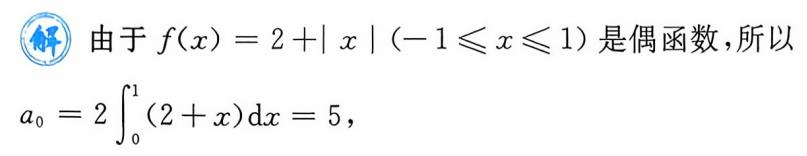

{0}------------------------------------------------

# 第十章 无穷级数(仅数学一、三要求)

| 考试内容                                                                                             | 考试要求 |    |
|--------------------------------------------------------------------------------------------------|------|----|
|                                                                                                  | 数一   | 数三 |
| 常数项级数收敛、发散以及收敛级数的和的概念 级数的基本性质及收敛的必要条件                                                         | 理解   | 理解 |
| 交错级数的莱布尼茨判别法                                                                                     | 掌握   | 掌握 |
| 几何级数、p 级数的收敛与发散的条件 正项级数收敛性的比较判别法、比值判别法、根值判别法                                                  | 掌握   | 掌握 |
| 任意项级数绝对收敛与条件收敛的概念 绝对收敛与收敛的关系 幂级数在其收敛区间内的基本性质(和函数的连续性、逐项求导和逐项积分)                            | 了解   | 了解 |
| 幂级数的收敛半径、收敛区间及收敛域的求法                                                                             | 掌握   | 掌握 |
| 函数项级数的收敛域及和函数的概念                                                                                 | 00万解 | /  |
| 幂级数收敛半径的概念                                                                                       | 理解   | 理解 |
| 一些幂级数在收敛区间内的和函数,并会由此求出 某些数项级数的和                                                               | 会求   | 会求 |
| $e^x$ , $\sin x$ , $\cos x$ , $\ln(1+x)$ 及 $(1+x)^a$ 的麦克劳林 (Maclaurin) 展开式, 会用它们将一些简单函数间接 展开为幂级数 | 掌握   | 掌握 |
| 傅里叶级数的概念和狄利克雷收敛定理                                                                                | 了解   | /  |
| 将定义在[-l,l]上的函数展开为傅里叶级数 将定义在[0,l]上的函数展开为正弦级数与余弦级数 写出傅里叶级数的和函数的表达式                           |      |    |
| 积分判别法                                                                                            | 会用   | 会用 |

{1}------------------------------------------------

## 第一节 常数项级数

## 考试内容概要。

#### 一、级数的概念与性质

#### 1. 级数的概念

设 $(u_n)$ 是一数列,则表达式

$$\sum_{n=1}^{\infty} u_n = u_1 + u_2 + \cdots + u_n + \cdots$$

称为**无穷级数**,简称**级数**.  $S_n = \sum_{i=1}^n u_i$  称为级数的**部分和**. 若部分和数列 $\{S_n\}$  有极限 S,即 $\lim_{n \to \infty} S_n = \sum_{i=1}^n u_i$  称为级数的**部分和**. 若部分和数列 $\{S_n\}$  有极限 S,即 $\lim_{n \to \infty} S_n = \sum_{i=1}^n u_i$  称为级数的**部分和**. 若部分和数列 $\{S_n\}$  有极限 S,即 $\lim_{n \to \infty} S_n = \sum_{i=1}^n u_i$  称为级数的**部分和**. 若部分和数列 $\{S_n\}$  有极限 S ,即 $\lim_{n \to \infty} S_n = \sum_{i=1}^n u_i$  称为级数的**部分和**. 若部分和数列 $\{S_n\}$  有极限 S ,即 $\lim_{n \to \infty} S_n = \sum_{i=1}^n u_i$  称为级数的**部分和**. 若部分和数列 $\{S_n\}$  有极限 S ,即 $\lim_{n \to \infty} S_n = \sum_{i=1}^n u_i$  称为级数的**部分和**. 若部分和数列 $\{S_n\}$  有极限 S ,即 $\lim_{n \to \infty} S_n = \sum_{i=1}^n u_i$  称为级数的**部分和**. 若部分和数列 $\{S_n\}$  有极限 S ,即 $\lim_{n \to \infty} S_n = \sum_{i=1}^n u_i$  称为级数的**部分和**. 若部分和数列 $\{S_n\}$  有极限 S ,即 $\lim_{n \to \infty} S_n = \sum_{i=1}^n u_i$  称为级数的**部分和**. 若部分和数列 $\{S_n\}$  有极限 S ,即 $\lim_{n \to \infty} S_n = \sum_{i=1}^n u_i$  的,

S,则称级数  $\sum_{n=1}^{\infty} u_n$  **收敛**,并称这个极限值 S 为级数  $\sum_{n=1}^{\infty} u_n$  的和,记为  $\sum_{n=1}^{\infty} u_n = S$ . 如果极限  $\lim_{n\to\infty} S_n$  不存在,则称级数  $\sum_{n=1}^{\infty} u_n$  发散.

【例1】 判定下列级数的敛散性.

$$(1)\sum_{n=1}^{\infty}\ln\left(1+\frac{1}{n}\right).$$

$$(2)\sum_{n=0}^{\infty}aq^{n}(a\neq0).$$

(1) 
$$S_n = \ln\left(1 + \frac{1}{1}\right) + \ln\left(1 + \frac{1}{2}\right) + \dots + \ln\left(1 + \frac{1}{n}\right)$$
  
=  $\ln 2 + \ln\frac{3}{2} + \dots + \ln\frac{n+1}{n} = \ln\left(2 \cdot \frac{3}{2} \cdot \dots \cdot \frac{n+1}{n}\right) = \ln(n+1).$ 

由于 $\lim_{n\to\infty} S_n = \lim_{n\to\infty} \ln(n+1) = \infty$ ,则级数 $\sum_{n=1}^{\infty} \ln\left(1+\frac{1}{n}\right)$ 发散.

$$(2)S_{n} = a + aq + aq^{2} + \dots + aq^{n-1} = \begin{cases} \frac{a(1 - q^{n})}{1 - q}, & q \neq 1, \\ na, & q = 1. \end{cases}$$

当|q|<1时, $\lim_{n\to\infty}S_n=\frac{a}{1-q}$ ,原级数收敛.

当|q|>1时, $\lim_{n\to\infty}S_n=\infty$ ,原级数发散.

当 q=1 时,  $\lim_{n\to\infty}S_n=\lim_{n\to\infty}na=\infty$ , 原级数发散.

当 
$$q = -1$$
 时, $S_n = a - a + a - \dots + (-1)^{n-1} a = \begin{cases} a, & n \text{ 为奇数,} \\ 0, & n \text{ 为偶数,} \end{cases}$  不存在,原级数发散.

综上所述,原级数  $\sum_{n=0}^{\infty} aq^n (a \neq 0)$  在 |q| < 1 时收敛,在  $|q| \geqslant 1$  时发散.

{2}------------------------------------------------

### 2. 级数的性质

- (1) 若级数  $\sum_{n=1}^{\infty} u_n$  收敛于 S,则级数  $\sum_{n=1}^{\infty} ku_n$  也收敛,且其和为 kS.
- (2) 若  $\sum_{n=1}^{\infty} u_n$  和  $\sum_{n=1}^{\infty} v_n$  分别收敛于  $S \setminus T$ ,则  $\sum_{n=1}^{\infty} (u_n \pm v_n)$  收敛于  $S \pm T$ .
- 【注】 ① 若  $\sum_{n=1}^{\infty} u_n$  收敛,  $\sum_{n=1}^{\infty} v_n$  发散,则  $\sum_{n=1}^{\infty} (u_n \pm v_n)$  必发散.

② 若 
$$\sum_{n=1}^{\infty} u_n$$
 和  $\sum_{n=1}^{\infty} v_n$  都发散,则  $\sum_{n=1}^{\infty} (u_n \pm v_n)$  敛散性不定.

- (3) 在级数中去掉、加上或改变有限项,不会改变级数的敛散性.
- 【注】 一个级数的敛散性与其前有限项无关.
- (4) 收敛级数加括号仍收敛且和不变.
- 【注】 ① 若级数加括号以后收敛,原级数不一定收敛.
  - ② 若级数加括号以后发散,则原级数一定发散.
- (5)(级数收敛的必要条件)若级数 $\sum_{n=1}^{\infty} u_n$  收敛,则 $\lim_{n\to\infty} u_n = 0$ .
- 【注】 ① 若  $\lim_{n\to\infty}u_n=0$ ,则级数  $\sum_{n=1}^{\infty}u_n$  不一定收敛.

② 若 
$$\lim_{n\to\infty} u_n \neq 0$$
,则级数  $\sum_{n=1}^{\infty} u_n$  一定发散.

二、级数的审敛准则

$$1.$$
 正项级数  $(\sum_{n=1}^{\infty}u_n,u_n\geqslant 0)$ 

基本定理:  $\sum_{n=1}^{\infty} u_n$  收敛  $\Leftrightarrow \{S_n\}$  上有界.

(1) 比较判别法. 设  $0 \leq u_n \leq v_n$ ,则

$$\sum_{n=1}^{\infty} v_n$$

$$\sum_{n=1}^{\infty} u_n \ \sharp \ \ \ \ \ \Rightarrow \sum_{n=1}^{\infty} v_n \ \ \ \ \ \ \ \ \ \ \ \ \ \ \ \ \ \ \$$

- (2) 比较法极限形式. 设 $\lim_{n\to\infty}\frac{u_n}{v_n}=l(0\leqslant l\leqslant +\infty)$ ,
- ① 若  $0 < l < +\infty$ , 则  $\sum_{n=1}^{\infty} u_n$  与  $\sum_{n=1}^{\infty} v_n$  同敛散.
- ② 若 l = 0,则  $\sum_{n=1}^{\infty} v_n$  收敛  $\Rightarrow \sum_{n=1}^{\infty} u_n$  收敛, $\sum_{n=1}^{\infty} u_n$  发散  $\Rightarrow \sum_{n=1}^{\infty} v_n$  发散.
- ③ 若  $l = +\infty$ ,则  $\sum_{n=1}^{\infty} v_n$  发散  $\Rightarrow \sum_{n=1}^{\infty} u_n$  发散,  $\sum_{n=1}^{\infty} u_n$  收敛  $\Rightarrow \sum_{n=1}^{\infty} v_n$  收敛.

{3}------------------------------------------------

【注】 使用比较法和比较法的极限形式时,需要适当地选择一个已知其敛散性的级数作为比较的基准,最常用的是 p 级数和等比级数.

$$\sum_{n=1}^{\infty} \frac{1}{n^p}$$
 当  $p > 1$  时收敛, 当  $p \leqslant 1$  时发散.

 $\sum_{n=0}^{\infty} aq^n$ ,其中 a 和 q 为正数 当 q < 1 时收敛,当  $q \ge 1$  时发散.

- (3) **比值法**. 若 $\lim_{n\to\infty} \frac{u_{n+1}}{u_n} = \rho$ ,则 $\sum_{n=1}^{\infty} u_n \begin{cases}$ 收敛, $\rho < 1$ ,发散, $\rho > 1$ ,不一定, $\rho = 1$ .
- (4) 根值法. 若 $\lim_{n\to\infty} \sqrt[n]{u_n} = \rho$ ,则 $\sum_{n=1}^{\infty} u_n \begin{cases}$ 收敛, $\rho < 1$ ,发散, $\rho > 1$ ,不一定, $\rho = 1$ .
- (5) **积分判别法**. 设 f(x) 是[1, +  $\infty$ ) 上单调递减、非负的连续函数,且  $a_n = f(n)$ ,则  $\sum_{n=1}^{\infty} a_n = \int_{1}^{+\infty} f(x) dx$  同敛散.
  - 【例 2】 证明级数  $\sum_{n=1}^{\infty} \frac{1}{n^p}$  当 p > 1 时收敛, 当  $p \leqslant 1$  时发散.
  - 当 p > 0 时,  $f(x) = \frac{1}{x^p}$  在 $[1, +\infty)$  上单调递减、非负且连续.

$$\frac{1}{n^p}=f(n)\,,$$

则级数  $\sum_{n=1}^{\infty} \frac{1}{n^p}$  与积分  $\int_{1}^{+\infty} \frac{\mathrm{d}x}{x^p}$  同敛散,而积分  $\int_{1}^{+\infty} \frac{1}{x^p} \mathrm{d}x$  当 p > 1 时收敛,当  $p \leqslant 1$  时发散,则

级数  $\sum_{n=1}^{\infty} \frac{1}{n^p}$  当 p > 1 时收敛,当 0 时发散.

又,当 $p \leq 0$ 时,

$$a_n=\frac{1}{n^p} > 0,$$

级数  $\sum_{n=1}^{\infty} \frac{1}{n^{\rho}}$  也发散,原题得证.

【例 3】 判定级数  $\sum_{n=2}^{\infty} \frac{1}{n \ln n}$  的敛散性.

由于  $f(x) = \frac{1}{x \ln x}$  是 $[2, +\infty)$  上单调递减、非负的连续函数,且

$$\frac{1}{n \ln n} = f(n),$$

则级数  $\sum_{n=2}^{\infty} \frac{1}{n \ln n}$  与积分  $\int_{2}^{+\infty} \frac{dx}{x \ln x}$  同敛散. 又

{4}------------------------------------------------

$$\int_{2}^{+\infty} \frac{\mathrm{d}x}{x \ln x} = \int_{2}^{+\infty} \frac{\mathrm{d}\ln x}{\ln x} = \ln(\ln x) \Big|_{2}^{+\infty} = +\infty,$$

则该积分发散,由积分判别法知原级数发散.

2. 交错级数(
$$\sum_{n=1}^{\infty} (-1)^{n-1} u_n, u_n > 0$$
)

莱布尼茨准则:  $\Xi(1)\{u_n\}$ 单调递减,(2)  $\lim_{n\to\infty}u_n=0$ ,则  $\sum_{n=1}^{\infty}(-1)^{n-1}u_n$  收敛.

【注】  $\{u_n\}$ 单调递减、 $\lim_{n\to\infty}u_n=0$ 是级数  $\sum_{n=1}^{\infty}(-1)^{n-1}u_n$  收敛的充分条件,但非必要条件.

例如,交错级数  $\sum_{n=1}^{\infty} \frac{(-1)^{n-1}}{2^{n+(-1)^n}}$  收敛,但  $u_n = \frac{1}{2^{n+(-1)^n}}$  并不单调递减.

3. 任意项级数
$$(\sum_{n=1}^{\infty} u_n, u_n$$
 为任意实数)

- (1) 绝对收敛与条件收敛的概念
- ① 若级数  $\sum_{n=1}^{\infty} |u_n|$  收敛,则  $\sum_{n=1}^{\infty} u_n$  必收敛,此时称级数  $\sum_{n=1}^{\infty} u_n$  绝对收敛.
- ② 若级数  $\sum_{n=1}^{\infty} u_n$  收敛,但  $\sum_{n=1}^{\infty} |u_n|$  发散,此时称级数  $\sum_{n=1}^{\infty} u_n$  条件收敛.
- (2) 绝对收敛和条件收敛的基本结论。
- ① 绝对收敛的级数一定收敛,即 $\sum_{n=1}^{\infty} | u_n |$  收敛  $\Rightarrow \sum_{n=1}^{\infty} u_n$  收敛.
- ②条件收敛的级数的所有正项(或负项)构成的级数一定发散。

即: 
$$\sum_{n=1}^{\infty} u_n$$
 条件收敛  $\Rightarrow \sum_{n=1}^{\infty} \frac{u_n + |u_n|}{2}$  和  $\sum_{n=1}^{\infty} \frac{u_n - |u_n|}{2}$  发散.

# 常考题型与典型例题 💸 🕏

## 常考题型

常数项级数的敛散性判定

## 【例 4】(2015,数三)下列级数中发散的是

$$(A) \sum_{n=1}^{\infty} \frac{n}{3^n}.$$

(B) 
$$\sum_{n=1}^{\infty} \frac{1}{\sqrt{n}} \ln\left(1 + \frac{1}{n}\right).$$

(C) 
$$\sum_{n=2}^{\infty} \frac{(-1)^n + 1}{\ln n}$$
.

(D) 
$$\sum_{n=1}^{\infty} \frac{n!}{n^n}.$$

(新)【方法1】 直接法

{5}------------------------------------------------

$$\sum_{n=2}^{\infty} \frac{(-1)^n + 1}{\ln n} = \sum_{n=2}^{\infty} \frac{(-1)^n}{\ln n} + \sum_{n=2}^{\infty} \frac{1}{\ln n}$$

由于  $u_n = \frac{1}{\ln n}$  单调递减且趋于 0,由莱布尼茨准则知级数  $\sum_{n=2}^{\infty} \frac{(-1)^n}{\ln n}$  收敛.又

$$\frac{1}{\ln n} > \frac{1}{n},$$

而级数  $\sum_{n=1}^{\infty} \frac{1}{n}$  发散,由正项级数比较判别法知  $\sum_{n=2}^{\infty} \frac{1}{\ln n}$  发散,则原级数发散.选(C).

#### 【方法 2】 排除法

由于 $\lim_{n\to\infty} \sqrt[n]{\frac{n}{3^n}} = \lim_{n\to\infty} \frac{\sqrt[n]{n}}{3} = \frac{1}{3} < 1$ ,由根值法知级数 $\sum_{n=1}^{\infty} \frac{n}{3^n}$ 收敛.

由于  $\ln\left(1+\frac{1}{n}\right)\sim\frac{1}{n}$ ,则级数  $\sum_{n=1}^{\infty}\frac{1}{\sqrt{n}}\ln\left(1+\frac{1}{n}\right)$ 与级数  $\sum_{n=1}^{\infty}\frac{1}{\sqrt{n}}\cdot\frac{1}{n}=\sum_{n=1}^{\infty}\frac{1}{n^{\frac{3}{2}}}$  同敛散. 而

 $\sum_{n=1}^{\infty} \frac{1}{n^{\frac{3}{2}}} 收敛,则级数 \sum_{n=1}^{\infty} \frac{1}{\sqrt{n}} ln \left(1 + \frac{1}{n}\right) 收敛.$ 

$$\diamondsuit a_n = \frac{n!}{n^n},$$
由于

$$\lim_{n \to \infty} \frac{a_{n+1}}{a_n} = \lim_{n \to \infty} \frac{(n+1)!}{(n+1)^{n+1}} \cdot \frac{n^n}{n!} = \lim_{n \to \infty} \frac{n^n}{(n+1)^n}$$

$$= \lim_{n \to \infty} \frac{1}{\left(1 + \frac{1}{n}\right)^n} = \frac{1}{e} < 1,$$

由比值判别法知级数  $\sum_{n=1}^{\infty} \frac{n!}{n^n}$  收敛,故应选(C).

【例 5】 (2013, 数三) 设  $\{a_n\}$ 为正项数列,下列选项正确的是

(A) 若 
$$a_n > a_{n+1}$$
,则  $\sum_{n=1}^{\infty} (-1)^{n-1} a_n$  收敛.

(B) 若
$$\sum_{n=1}^{\infty} (-1)^{n-1} a_n$$
 收敛,则  $a_n > a_{n+1}$ .

(C) 若 
$$\sum_{n=1}^{\infty} a_n$$
 收敛,则存在常数  $p > 1$ ,使 $\lim_{n \to \infty} n^p a_n$  存在.

(D) 若存在常数 
$$p > 1$$
,使 $\lim_{n \to \infty} n^p a_n$  存在,则  $\sum_{n=1}^{\infty} a_n$  收敛.

本题考查抽象级数敛散性的判定,包括 p 级数、交错级数的收敛性以及正项级数的 判敛法. 一种方法是直接找出正确答案,另一种方法是利用举反例排除错误的答案.

由于极限 $\lim_{n\to\infty} n^p a_n = \lim_{n\to\infty} \frac{a_n}{\frac{1}{n^p}}$ 存在,而级数 $\sum_{n=1}^{\infty} \frac{1}{n^p} (p>1)$ 收敛,利用正项级数比较判别法

的极限形式,级数  $\sum_{n=1}^{\infty} a_n$  收敛. 应选(D).

{6}------------------------------------------------

也可举反例如下:取  $a_n = \frac{n+1}{n}$ ,排除(A);

取 
$$a_n = \frac{3+2(-1)^n}{n^2}$$
,  $\sum_{n=1}^{\infty} (-1)^{n-1} a_n$  收敛,但  $a_1 = 1 < a_2 = \frac{5}{4}$ ,排除(B);

取 
$$a_n = \frac{1}{n \ln^2 n}$$
,  $\sum_{n=1}^{\infty} a_n$  收敛,但对任意  $p > 1$ ,  $\lim_{n \to \infty} n^p a_n = \lim_{n \to \infty} \frac{n^{p-1}}{\ln^2 n}$ , 考虑

$$\lim_{x \to +\infty} \frac{x^{p-1}}{\ln^2 x} = \lim_{x \to +\infty} \frac{(p-1)x^{p-1}}{2\ln x} = \lim_{x \to +\infty} \frac{(p-1)^2 x^{p-2}}{2 \cdot \frac{1}{x}} = \lim_{x \to +\infty} \frac{(p-1)^2 x^{p-1}}{2} = \infty$$

因而 $\lim_{n \to \infty} n^n a_n$  不存在,排除(C).

## 【例 6】 (2009,数一)设有两个数列 $\{a_n\}$ , $\{b_n\}$ ,若 $\lim a_n = 0$ ,则

(A) 当 
$$\sum_{n=1}^{\infty} b_n$$
 收敛时,  $\sum_{n=1}^{\infty} a_n b_n$  收敛.

(A) 当 
$$\sum_{n=1}^{\infty} b_n$$
 收敛时,  $\sum_{n=1}^{\infty} a_n b_n$  收敛. (B) 当  $\sum_{n=1}^{\infty} b_n$  发散时,  $\sum_{n=1}^{\infty} a_n b_n$  发散.

(C) 当 
$$\sum_{n=1}^{\infty} |b_n|$$
 收敛时, $\sum_{n=1}^{\infty} a_n^2 b_n^2$  收敛.

(C) 当
$$\sum_{n=1}^{\infty} |b_n|$$
收敛时, $\sum_{n=1}^{\infty} a_n^2 b_n^2$ 收敛. (D) 当 $\sum_{n=1}^{\infty} |b_n|$ 发散时, $\sum_{n=1}^{\infty} a_n^2 b_n^2$ 发散.

#### 解【方法1】 直接法

由于 $\lim a_n = 0$ ,故存在M,使得对一切的n有

$$\mid a_n \mid \leq M$$

又 
$$\sum_{n=1}^{\infty} |b_n|$$
 收敛,则 $\lim_{n\to\infty} |b_n| = 0$ ,从而当  $n$  充分大时,  $|b_n| < 1$ ,从而有  $b_n^2 \leq |b_n|$ .

由此可知

$$a_n^2 b_n^2 \leqslant M^2 \mid b_n \mid$$
.

由  $\sum_{n=1}^{\infty} |b_n|$  收敛知  $\sum_{n=1}^{\infty} a_n^2 b_n^2$  收敛,故应选(C).

#### 【方法 2】 排除法

除(A).

令 
$$a_n = \frac{1}{n}, b_n = \frac{1}{n},$$
显然有 $\lim_{n \to \infty} a_n = 0, \sum_{n=1}^{\infty} b_n$  发散, $\sum_{n=1}^{\infty} |b_n|$  也发散,但
$$\sum_{n=1}^{\infty} a_n b_n = \sum_{n=1}^{\infty} \frac{1}{n^2}, \sum_{n=1}^{\infty} a_n^2 b_n^2 = \sum_{n=1}^{\infty} \frac{1}{n^4},$$

都收敛,排除(B)(D),故应选(C).

#### 【例 7】 (2011, 数三) 设 $\{u_n\}$ 是数列,则下列命题正确的是

(A) 若 
$$\sum_{n=1}^{\infty} u_n$$
 收敛,则  $\sum_{n=1}^{\infty} (u_{2n-1} + u_{2n})$  收敛.

{7}------------------------------------------------

- (B) 若  $\sum_{n=1}^{\infty} (u_{2n-1} + u_{2n})$  收敛,则  $\sum_{n=1}^{\infty} u_n$  收敛.
- (C) 若 $\sum_{n=1}^{\infty} u_n$  收敛,则 $\sum_{n=1}^{\infty} (u_{2n-1} u_{2n})$  收敛.
- (D) 若 $\sum_{n=1}^{\infty} (u_{2n-1} u_{2n})$  收敛,则 $\sum_{n=1}^{\infty} u_n$  收敛.
- 著  $\sum_{n=1}^{\infty} u_n$  收敛,则该级数加括号后得到的级数仍收敛,因此应选(A).

## 第二节 幂级数

# 考试内容概要 。

一、幂级数的收敛半径、收敛区间及收敛域

定义 形如

$$\sum_{n=0}^{\infty} a_n x^n = a_0 + a_1 x + a_2 x^2 + \dots + a_n x^n + \dots$$

或者

$$\sum_{n=0}^{\infty} a_n (x-x_0)^n = a_0 + a_1 (x-x_0) + \dots + a_n (x-x_0)^n + \dots$$

的函数项级数称为幂级数.

定理(阿贝尔定理)

- (1) 若  $\sum_{n=0}^{\infty} a_n x^n$  在  $x = x_0 (x_0 \neq 0)$  处收敛,则当 | x | < |  $x_0$  | 时,  $\sum_{n=0}^{\infty} a_n x^n$  绝对收敛.
- (2) 若  $\sum_{n=0}^{\infty} a_n x^n$  在  $x = x_0$  处发散,则当 | x | > |  $x_0$  | 时,  $\sum_{n=0}^{\infty} a_n x^n$  发散.

定理 幂级数  $\sum_{n=0}^{\infty} a_n x^n$  的收敛性有且仅有以下 3 种可能:

- (1) 对任何  $x \in (-\infty, +\infty)$  都收敛.
- (2) 仅在 x = 0 处收敛.
- (3) 存在一个正数 R,当 |x| < R 时绝对收敛,当 |x| > R 时发散.

定义 上述定理中的正数 R 称为幂级数  $\sum_{n=0}^{\infty} a_n x^n$  的**收敛半径.** 开区间(-R,R) 称为它的**收敛区间.** 若再考察  $x=\pm R$  时  $\sum_{n=0}^{\infty} a_n x^n$  的收敛性,可得出该级数收敛点的全体,称之为**收敛域**.

【注】 若幂级数  $\sum_{n=0}^{\infty} a_n x^n$  在点  $x = x_0$  处条件收敛,则点  $x_0$  必为该幂级数收敛区间(-R, R) 的一个端点.

{8}------------------------------------------------

定理 如果
$$\lim_{n\to\infty} \left| \frac{a_{n+1}}{a_n} \right| = \rho$$
,则  $R = \frac{1}{\rho}$ .

定理 如果
$$\lim_{n\to\infty} \sqrt[n]{|a_n|} = \rho$$
,则  $R = \frac{1}{\rho}$ .

\_、幂级数的性质

## 1. 有理运算性质

设幂级数  $\sum_{n=0}^{\infty} a_n x^n$  的收敛半径为  $R_1$ , $\sum_{n=0}^{\infty} b_n x^n$  的收敛半径为  $R_2$   $(R_1 \neq R_2)$ ,令  $R = \min\{R_1, R_2\}$ ,则有

(1) 加法. 
$$\sum_{n=0}^{\infty} a_n x^n + \sum_{n=0}^{\infty} b_n x^n = \sum_{n=0}^{\infty} (a_n + b_n) x^n, \quad x \in (-R,R).$$

(2) 减法. 
$$\sum_{n=0}^{\infty} a_n x^n - \sum_{n=0}^{\infty} b_n x^n = \sum_{n=0}^{\infty} (a_n - b_n) x^n$$
,  $x \in (-R, R)$ .

(3) 乘法. 
$$(\sum_{n=0}^{\infty} a_n x^n) \cdot (\sum_{n=0}^{\infty} b_n x^n)$$
  
=  $a_0 b_0 + (a_0 b_1 + a_1 b_0) x + (a_0 b_2 + a_1 b_1 + a_2 b_0) x^2 + \dots + (a_0 b_n + a_1 b_{n-1} + \dots + a_n b_0) x^n + \dots, x \in (-R, R).$ 

(4) 除法. 
$$\frac{\sum\limits_{n=0}^{\infty}a_{n}x^{n}}{\sum\limits_{n=0}^{\infty}b_{n}x^{n}}=\sum\limits_{n=0}^{\infty}c_{n}x^{n}, \quad x\in(-R,R),$$

其中系数 
$$c_n(n=0,1,2\cdots)$$
 由 $(\sum_{n=0}^{\infty}b_nx^n)$  ·  $(\sum_{n=0}^{\infty}c_nx^n)=\sum_{n=0}^{\infty}a_nx^n$  所确定,且  $b_0\neq 0$ .

#### 2. 分析性质

设幂级数  $\sum_{n=0}^{\infty} a_n x^n$  的收敛半径为 R,和函数为 S(x),则

- (1) 连续性. S(x) 在收敛域上连续.
- (2) 可导性. S(x) 在收敛区间(-R,R) 内可导,且可逐项求导,即

$$S'(x) = \left(\sum_{n=0}^{\infty} a_n x^n\right)' = \sum_{n=0}^{\infty} (a_n x^n)' = \sum_{n=1}^{\infty} n a_n x^{n-1}, \mid x \mid < R.$$

求导后的幂级数与原幂级数有相同的收敛半径.

(3) 可积性. S(x) 在收敛域上可积,且可逐项积分,即

$$\int_{0}^{x} S(t) dt = \int_{0}^{x} \sum_{n=0}^{\infty} a_{n} t^{n} dt = \sum_{n=0}^{\infty} \int_{0}^{x} a_{n} t^{n} dt = \sum_{n=0}^{\infty} \frac{1}{n+1} a_{n} x^{n+1}.$$

积分后的幂级数与原幂级数有相同的收敛半径.

{9}------------------------------------------------

#### 三、函数的幂级数展开

定义 设函数 f(x) 在区间 $(x_0 - R, x_0 + R)$  上有定义,若

$$f(x) = \sum_{n=0}^{\infty} a_n (x - x_0)^n$$

对任意的  $x \in (x_0 - R, x_0 + R)$  都成立,则称函数 f(x) 在区间 $(x_0 - R, x_0 + R)$  上能展开为  $x - x_0$  的幂级数.

由幂级数的性质可知,如果函数 f(x) 在区间 $(x_0 - R, x_0 + R)$  上能展开为  $x - x_0$  的幂级数,那么 f(x) 在区间 $(x_0 - R, x_0 + R)$  上任意阶可导.

定理 如果函数 f(x) 在区间 $(x_0 - R, x_0 + R)$  上能展开为  $x - x_0$  的幂级数

$$f(x) = \sum_{n=0}^{\infty} a_n (x - x_0)^n,$$

那么 f(x) 在区间 $(x_0 - R, x_0 + R)$  上任意阶可导,且其展开式是唯一的,

$$a_n = \frac{f^{(n)}(x_0)}{n!}(n = 0, 1, 2, \cdots).$$

定义 若函数 f(x) 在  $x = x_0$  处任意阶可导,则称幂级数

$$\sum_{n=0}^{\infty} \frac{f^{(n)}(x_0)}{n!} (x - x_0)^n$$

为 f(x) 在  $x = x_0$  处的**泰勒级数** 

特别地, $x_0 = 0$  处的泰勒级数  $\sum_{n=0}^{\infty} \frac{f^{(n)}(0)}{n!} x^n$  称为函数 f(x) 的**麦克劳林级数**.

定理 设 f(x) 在  $x = x_0$  的某邻域内任意阶可导,则 f(x) 在该邻域内能展开为泰勒级数  $\Leftrightarrow \lim_{n \to \infty} R_n(x) = 0$ ,其中  $R_n(x) = \frac{f^{(n+1)}(\xi)}{(n+1)!} (x - x_0)^{n+1}$  为 f(x) 在  $x_0$  处的泰勒公式

$$f(x) = \sum_{k=0}^{n} \frac{f^{(k)}(x_0)}{k!} (x - x_0)^k + R_n(x)$$

中的余项.

几个常用的展开式:

(1) 
$$\frac{1}{1-x} = 1 + x + x^2 + \dots + x^n + \dots = \sum_{n=0}^{\infty} x^n$$
  $(-1 < x < 1).$ 

(2) 
$$\frac{1}{1+x} = 1 - x + x^2 - \dots + (-1)^n x^n + \dots = \sum_{n=0}^{\infty} (-1)^n x^n$$
  $(-1 < x < 1).$ 

$$(3)e^{x} = 1 + x + \frac{x^{2}}{2!} + \dots + \frac{x^{n}}{n!} + \dots = \sum_{n=0}^{\infty} \frac{x^{n}}{n!} \qquad (-\infty < x < +\infty).$$

$$(4)\sin x = x - \frac{x^3}{3!} + \dots + \frac{(-1)^n x^{2n+1}}{(2n+1)!} + \dots = \sum_{n=0}^{\infty} \frac{(-1)^n x^{2n+1}}{(2n+1)!} \quad (-\infty < x < +\infty).$$

$$(5)\cos x = 1 - \frac{x^2}{2!} + \dots + \frac{(-1)^n x^{2n}}{(2n)!} + \dots = \sum_{n=0}^{\infty} \frac{(-1)^n x^{2n}}{(2n)!} \qquad (-\infty < x < +\infty).$$

$$(6)\ln(1+x) = x - \frac{x^2}{2} + \dots + \frac{(-1)^{n-1}x^n}{n} + \dots = \sum_{n=1}^{\infty} \frac{(-1)^{n-1}x^n}{n} \qquad (-1 < x \le 1).$$

{10}------------------------------------------------

$$(7) (1+x)^{\alpha} = 1 + \alpha x + \frac{\alpha(\alpha-1)}{2!} x^{2} + \dots + \frac{\alpha(\alpha-1)\cdots(\alpha-n+1)}{n!} x^{n} + \dots$$

$$= \sum_{n=0}^{\infty} \frac{\alpha(\alpha-1)\cdots(\alpha-n+1)}{n!} x^{n}$$

 $(-1 < x < 1, 区间端点展开式是否成立由 \alpha 的值确立).$ 

#### 函数展开为幂级数的两种方法:

(1) 直接展开法.直接展开法分以下两步进行:

第一步 求出 f(x) 在  $x_0$  处的各阶导数  $f^{(n)}(x_0)$ ,并写出 f(x) 在  $x = x_0$  处的泰勒级数

$$f(x) \sim \sum_{n=0}^{\infty} \frac{f^{(n)}(x_0)}{n!} (x - x_0)^n.$$

第二步 考查
$$\lim_{n\to\infty} R_n(x) = \lim_{n\to\infty} \frac{f^{(n+1)}(\xi)}{(n+1)!} (x-x_0)^{n+1} = 0$$
是否成立.

- (2)间接展开法.根据函数展开为幂级数的唯一性,从某些已知函数的展开式出发,利用幂级数的性质(四则运算、逐项求导、逐项积分)及变量代换等方法,求得所给函数的展开式.
- 【注】 直接展开法分两步,但这两步都比较困难,主要用于推导一些基本展开式(如  $e^x$ ,  $\sin x$ );有了基本展开式后,主要用间接展开法求解.

## • 常考题型与典型例题

#### 常考题型

- 1. 求收敛半径、收敛区间及收敛域
- 2. 将函数展开为幂级数
- 3. 求幂级数(或数项级数)的和

一、求收敛半径、收敛区间及收敛域

【例 1】 (2009, 数三) 幂级数 
$$\sum_{n=1}^{\infty} \frac{e^n - (-1)^n}{n^2} x^n$$
 的收敛半径为\_\_\_\_\_\_.

(方法 1) 
$$\lim_{n \to \infty} \left| \frac{a_{n+1}}{a_n} \right| = \lim_{n \to \infty} \frac{\frac{e^{n+1} - (-1)^{n+1}}{(n+1)^2}}{\frac{e^n - (-1)^n}{n^2}}$$

$$= \lim_{n \to \infty} \frac{\frac{e^{n+1} - (-1)^{n+1}}{e^n - (-1)^n} \cdot \frac{n^2}{(n+1)^2}}{\frac{e^n - (-1)^n}{1 - \left(\frac{-1}{e}\right)^n}} = e,$$

则 
$$R=\frac{1}{e}$$
.

{11}------------------------------------------------

【方法 2】 
$$\lim_{n \to \infty} \sqrt[n]{|a_n|} = \lim_{n \to \infty} \frac{\sqrt[n]{e^n - (-1)^n}}{\sqrt[n]{n^2}}$$
$$= \lim_{n \to \infty} \frac{e^{\sqrt{1 - \left(\frac{-1}{e}\right)^n}}}{(\sqrt[n]{n})^2}$$
$$= e,$$

则  $R = \frac{1}{e}$ .

【例 2】 (1995,数一) 幂级数  $\sum_{n=1}^{\infty} \frac{n}{2^n + (-3)^n} x^{2n-1}$  的收敛半径  $R = \underline{\qquad}$ .

$$\lim_{n \to \infty} \sqrt[n]{|a_n|} = \lim_{n \to \infty} \frac{\sqrt[n]{n}}{\sqrt[n]{|2^n + (-3)^n|}} = \lim_{n \to \infty} \frac{\sqrt[n]{n}}{3\sqrt[n]{\left(-\frac{2}{3}\right)^n + 1}} = \frac{1}{3},$$

对于缺项级数 |  $x^2$  | < 3, | x |  $< \sqrt{3}$ .

故  $R = \sqrt{3}$ .

【例 3】 (2000, 数-) 求幂级数  $\sum_{n=1}^{\infty} \frac{1}{3^n + (-2)^n} \frac{x^n}{n}$  的收敛区间,并讨论该区间端点处的收敛性.

解 因为

$$\lim_{n\to\infty} \frac{[3^n + (-2)^n]n}{[3^{n+1} + (-2)^{n+1}](n+1)} = \lim_{n\to\infty} \frac{\left[1 + \left(-\frac{2}{3}\right)^n\right]n}{3\left[1 + \left(-\frac{2}{3}\right)^{n+1}\right](n+1)} = \frac{1}{3},$$

或  $\lim_{n\to\infty} \sqrt{|a_n|} = \lim_{n\to\infty} \frac{1}{\sqrt[n]{3^n + (-2)^n} \sqrt[n]{n}} = \frac{1}{3} \lim_{n\to\infty} \frac{1}{\sqrt[n]{1 + (-\frac{2}{3})^n}} = \frac{1}{3},$ 

所以收敛半径为3,收敛区间为(-3,3)。

当 x = 3 时,因为 $\frac{3^n}{3^n + (-2)^n} \cdot \frac{1}{n} > \frac{1}{2n}$ ,且 $\sum_{n=1}^{\infty} \frac{1}{n}$ 发散,所以原级数在点x = 3处发散.

当 
$$x = -3$$
 时,由于 $\frac{(-3)^n}{3^n + (-2)^n} \cdot \frac{1}{n} = (-1)^n \frac{1}{n} - \frac{2^n}{3^n + (-2)^n} \cdot \frac{1}{n}$ ,且 $\sum_{n=1}^{\infty} (-1)^n \cdot \frac{1}{n}$ 与

 $\sum_{n=1}^{\infty} \frac{2^n}{3^n + (-2)^n} \cdot \frac{1}{n}$  都收敛,所以原级数在点 x = -3 处收敛.

【例 4】 (2008, & -) 已知幂级数  $\sum_{n=0}^{\infty} a_n (x+2)^n$  在 x=0 处收敛,在 x=-4 处发散,则幂级数  $\sum_{n=0}^{\infty} a_n (x-3)^n$  的收敛域为\_\_\_\_\_\_.

{12}------------------------------------------------

无穷级数小

由题设知,当|x+2|<|0+2|=2,即-4<x<0时,幂级数收敛;当|x+2|>|-4+2|=2,即x<|-4或x>0时,幂级数发散.可见幂级数的收敛半径为 2.

于是幂级数  $\sum_{n=0}^{\infty} a_n(x-3)$ " 当 |x-3| < 2,即 1 < x < 5 时收敛,故  $\sum_{n=0}^{\infty} a_n(x-3)$ " 的收敛 区间为(1,5).

另外,幂级数  $\sum_{n=0}^{\infty} a_n (x+2)^n$  在 x=0 处收敛,相当于幂级数  $\sum_{n=0}^{\infty} a_n (x-3)^n$  在 x=5 处收敛,故所求收敛域为(1,5].

【例 5】 (2015, 数一) 若级数  $\sum_{n=1}^{\infty} a_n$  条件收敛,则  $x=\sqrt{3}$  与 x=3 依次为幂级数  $\sum_{n=1}^{\infty} na_n (x-1)^n$  的

(A) 收敛点,收敛点.

(B) 收敛点,发散点.

(C)发散点,收敛点.

- (D)发散点,发散点.
- 自级数  $\sum_{n=1}^{\infty} a_n$  条件收敛可知幂级数  $\sum_{n=1}^{\infty} a_n (x-1)^n$  在x=2 处条件收敛,则 x=2 为幂级数  $\sum_{n=1}^{\infty} a_n (x-1)^n$  的收敛区间的端点,则其收敛半径为 1. 由幂级数的性质可知幂级数  $\sum_{n=1}^{\infty} na_n (x-1)^n$  的收敛半径也为 1.

由于 $|\sqrt{3}-1|$ <1,|3-1|>1,则  $x=\sqrt{3}$  为收敛点,x=3 为发散点,故应选(B).

二、将函数展开为幂级数

【例 6】 (2006,数一) 将函数  $f(x) = \frac{x}{2+x-x^2}$  展开成 x 的幂级数.

因为
$$\frac{x}{2+x-x^2} = \frac{x}{3} \left( \frac{1}{1+x} + \frac{1}{2-x} \right)$$
,且
$$\frac{1}{1+x} = \sum_{n=0}^{\infty} (-1)^n x^n, |x| < 1,$$

$$\frac{1}{2-x} = \frac{1}{2} \frac{1}{1-\frac{x}{2}} = \sum_{n=0}^{\infty} \frac{x^n}{2^{n+1}}, |x| < 2,$$

所以 $\frac{x}{2+x-x^2} = \frac{x}{3} \left( \frac{1}{1+x} + \frac{1}{2-x} \right) = \frac{1}{3} \sum_{n=0}^{\infty} \left[ (-1)^n + \frac{1}{2^{n+1}} \right] x^{n+1}, \mid x \mid < 1.$ 

【例7】 (2007, 数三) 将函数  $f(x) = \frac{1}{x^2 - 3x - 4}$  展开成 x - 1 的幂级数,并指出其收敛区间.

因为
$$\frac{1}{x^2-3x-4}=\frac{1}{5}\left(\frac{1}{x-4}-\frac{1}{x+1}\right)$$
,

{13}------------------------------------------------

$$\begin{split} \frac{1}{x-4} &= \frac{1}{(x-1)-3} = -\frac{1}{3} \frac{1}{1-\frac{x-1}{3}} = -\frac{1}{3} \sum_{n=0}^{\infty} \left(\frac{x-1}{3}\right)^n, x \in (-2,4)\,, \\ \frac{1}{x+1} &= \frac{1}{(x-1)+2} = \frac{1}{2} \frac{1}{1+\frac{x-1}{2}} = \frac{1}{2} \sum_{n=0}^{\infty} \left(-\frac{x-1}{2}\right)^n, x \in (-1,3)\,, \\ \text{FIU} \frac{1}{x^2-3x-4} &= -\frac{1}{5} \sum_{n=0}^{\infty} \left[\frac{1}{3^{n+1}} + \frac{(-1)^n}{2^{n+1}}\right] (x-1)^n, x \in (-1,3)\,. \end{split}$$

【例 8】 将函数  $f(x) = \ln(x^2 + x)$  在 x = 1 处展开为幂级数.

$$f(x) = \ln x(x+1) = \ln x + \ln(x+1) = \ln[1 + (x-1)] + \ln[2 + (x-1)]$$

$$= \ln[1 + (x-1)] + \ln 2 + \ln(1 + \frac{x-1}{2}),$$

又  $\ln(1+x) = \sum_{n=1}^{\infty} \frac{(-1)^{n-1} x^n}{n}$ ,则题中 |x-1| < 1, $\left| \frac{x-1}{2} \right| < 1$ ,两区间取交集得 |x-1| < 1,故原式  $= \ln 2 + \sum_{n=1}^{\infty} \frac{(-1)^{n-1}}{n} \left( 1 + \frac{1}{2^n} \right) (x-1)^n$ , $0 < x \le 2$ .

【例 9】 将函数  $f(x) = \sin x$  在  $x = \frac{\pi}{4}$  处展开为幂级数.

$$f(x) = \sin\left[\frac{\pi}{4} + \left(x - \frac{\pi}{4}\right)\right] = \frac{\sqrt{2}}{2} \left[\sin\left(x - \frac{\pi}{4}\right) + \cos\left(x - \frac{\pi}{4}\right)\right]$$

$$= \frac{\sqrt{2}}{2} \left[\sum_{n=0}^{\infty} \frac{(-1)^n \left(x - \frac{\pi}{4}\right)^{2n+1}}{(2n+1)!} + \sum_{n=0}^{\infty} \frac{(-1)^n \left(x - \frac{\pi}{4}\right)^{2n}}{(2n)!}\right], x \in (-\infty, +\infty).$$

【例 10】 将函数  $f(x) = \arctan x^2$  展开成 x 的幂级数.

$$f(x) = \int_0^x f'(t) dt + f(0) = \int_0^x \frac{2t}{1+t^4} dt + f(0) = \int_0^x 2t \left(\sum_{n=0}^\infty (-1)^n t^{4n}\right) dt + f(0)$$

$$= 2 \sum_{n=0}^\infty (-1)^n \int_0^x t^{4n+1} dt + f(0)$$

$$= 2 \sum_{n=0}^\infty \frac{(-1)^n}{4n+2} x^{4n+2} + f(0)$$

$$= 2 \sum_{n=0}^\infty \frac{(-1)^n}{4n+2} x^{4n+2}, |x| \le 1.$$

三、级数求和

【例 11】 求幂级数  $\sum_{n=1}^{\infty} nx^n$  的收敛域及和函数.

 $\lim_{n\to\infty} \frac{n}{n+1} = 1$ ,收敛半径 R = 1,收敛域为(-1,1).

{14}------------------------------------------------

$$\sum_{n=1}^{\infty} nx^{n} = x \left( \sum_{n=1}^{\infty} nx^{n-1} \right) = x \left( \sum_{n=1}^{\infty} x^{n} \right)' = x \left( x \sum_{n=0}^{\infty} x^{n} \right)' = x \left( \frac{x}{1-x} \right)' = \frac{x}{(1-x)^{2}}.$$

【例 12】 (2017, 数 一) 幂级数  $\sum_{n=1}^{\infty} (-1)^{n-1} nx^{n-1}$  在区间(-1,1) 内的和函数 S(x)

$$S(x) = \sum_{n=1}^{\infty} (-1)^{n-1} n x^{n-1} = \left[ \sum_{n=1}^{\infty} (-1)^{n-1} x^n \right]' = \left( \frac{x}{1+x} \right)' = \frac{1}{(1+x)^2}.$$

【例 13】 (2014,数三) 求幂级数  $\sum_{n=0}^{\infty} (n+1)(n+3)x^n$  的收敛域及和函数.

$$\lim_{n\to\infty} \left| \frac{a_{n+1}}{a_n} \right| = 1, R = 1,$$
当  $x = \pm 1$  时原级数显然发散,则其收敛域为 $(-1,1)$ .

$$\sum_{n=0}^{\infty} (n+1)(n+3)x^{n} = \sum_{n=0}^{\infty} (n+2)(n+1)x^{n} + \sum_{n=0}^{\infty} (n+1)x^{n}$$

$$= \left(\sum_{n=0}^{\infty} x^{n+2}\right)'' + \left(\sum_{n=0}^{\infty} x^{n+1}\right)' = \left(\frac{x^{2}}{1-x}\right)'' + \left(\frac{x}{1-x}\right)'$$

$$= \left(-(x+1) + \frac{1}{1-x}\right)'' + \left(-1 + \frac{1}{1-x}\right)'$$

$$= \frac{3-x}{(1-x)^{3}}, x \in (-1,1).$$

【例 14】 求幂级数  $\sum_{n=1}^{\infty} \frac{x^n}{n(n+1)}$  的收敛域及和函数.

候 
$$\lim_{n\to\infty} \frac{n(n+1)}{(n+1)(n+2)} = 1, x = \pm 1$$
 时收敛,故收敛域为[-1,1].

$$\sum_{n=1}^{\infty} \frac{x^n}{n(n+1)} = \sum_{n=1}^{\infty} \frac{(n+1)-n}{n(n+1)} x^n = \sum_{n=1}^{\infty} \frac{x^n}{n} - \sum_{n=1}^{\infty} \frac{x^n}{n+1}$$

$$= -\ln(1-x) - \frac{1}{x} \sum_{n=1}^{\infty} \frac{x^{n+1}}{n+1}$$

$$= -\ln(1-x) - \frac{1}{x} [-\ln(1-x) - x], (x \neq 0),$$

当 x = 0 时,显然有 S(0) = 0;

当 
$$x = 1$$
 时, $S(1) = \sum_{n=1}^{\infty} \frac{1}{n(n+1)} = \sum_{n=1}^{\infty} \left(\frac{1}{n} - \frac{1}{n+1}\right)$ ,

前 
$$n$$
 项和  $S_n(1) = 1 - \frac{1}{2} + \frac{1}{2} - \frac{1}{3} + \dots + \frac{1}{n} - \frac{1}{n+1} = 1 - \frac{1}{n+1}$ ,

于是 
$$S(1) = \lim_{n \to \infty} S_n(1) = \lim_{n \to \infty} \left(1 - \frac{1}{n+1}\right) = 1$$
,

故可得 
$$S(x) = \begin{cases} 1 + \left(\frac{1}{x} - 1\right) \ln(1 - x), & -1 \leqslant x < 1, 且 x \neq 0, \\ 0, & x = 0, \\ 1, & x = 1. \end{cases}$$

{15}------------------------------------------------

【注】 常用结论: 
$$\sum_{n=1}^{\infty} \frac{x^n}{n} = -\ln(1-x), (-1 \le x < 1).$$

【例 15】 (2010,数一) 求幂级数  $\sum_{n=1}^{\infty} \frac{(-1)^{n-1}}{2n-1} x^{2n}$  的收敛域及和函数.

歯 于 
$$\lim_{n\to\infty} \left| \frac{a_{n+1}}{a_n} \right| = \lim_{n\to\infty} \frac{2n-1}{2n+1} = 1$$
,因此幂级数的收敛半径  $R=1$ .

当 $x=\pm 1$ 时,原级数为  $\sum_{n=1}^{\infty} \frac{(-1)^{n-1}}{2n-1}$ ,由莱布尼茨判别法知此级数收敛,因此幂级数的收敛域为[-1,1].

设 
$$S(x) = \sum_{n=1}^{\infty} \frac{(-1)^{n-1}}{2n-1} x^{2n-1} (-1 \leqslant x \leqslant 1)$$
,则 
$$S'(x) = \sum_{n=1}^{\infty} (-1)^{n-1} x^{2n-2} = \frac{1}{1+x^2}.$$
 又  $S(0) = 0$ ,故  $S(x) = \int_0^x \frac{1}{1+t^2} dt = \arctan x$ ,于是 
$$\sum_{n=1}^{\infty} \frac{(-1)^{n-1}}{2n-1} x^{2n} = x S(x) = x \arctan x, x \in [-1,1].$$

## 第三节 傅里叶级数(仅数学一要求)

## \*考试内容概要 \*\*。

#### 一、傅里叶系数与傅里叶级数

设函数 f(x) 是周期为  $2\pi$  的周期函数,且在 $[-\pi,\pi]$  上可积,则称

$$a_n = \frac{1}{\pi} \int_{-\pi}^{\pi} f(x) \cos nx \, dx, n = 0, 1, 2, \cdots,$$

$$b_n = \frac{1}{\pi} \int_{-\pi}^{\pi} f(x) \sin nx \, dx, n = 1, 2, \cdots$$

为 f(x) 的傅里叶系数,称级数

$$\frac{a_0}{2} + \sum_{n=1}^{\infty} (a_n \cos nx + b_n \sin nx)$$

为 f(x) 以  $2\pi$  为周期的傅里叶级数. 记作

$$f(x) \sim \frac{a_0}{2} + \sum_{n=1}^{\infty} (a_n \cos nx + b_n \sin nx).$$

#### 二、收敛定理(狄利克雷)

设 f(x) 在 $[-\pi,\pi]$  上连续或只有有限个第一类间断点,且最多只有有限个极值点,则 f(x) 的傅里叶级数在 $[-\pi,\pi]$  上处处收敛,且收敛于

{16}------------------------------------------------

$$(1)S(x) = f(x),$$

当x为f(x)的连续点.

$$(2)S(x) = \frac{f(x^{-}) + f(x^{+})}{2},$$

当x为f(x)的间断点.

$$(3)S(x) = \frac{f((-\pi)^+) + f(\pi^-)}{2}, \qquad \qquad \pm x = \pm \pi.$$

#### =、周期为2π的函数的展开

## 1. [-π,π]上展开

$$a_n = \frac{1}{\pi} \int_{-\pi}^{\pi} f(x) \cos nx \, dx, \quad n = 0, 1, 2, \cdots,$$

$$b_n = \frac{1}{\pi} \int_{-\pi}^{\pi} f(x) \sin nx \, dx, \quad n = 1, 2, \cdots.$$

## $2. [-\pi,\pi]$ 上奇偶函数的展开

(1) f(x) 为奇函数.

$$a_n = 0, \quad n = 0, 1, 2, \cdots,$$
  
 $b_n = \frac{2}{\pi} \int_0^{\pi} f(x) \sin nx \, dx, \quad n = 1, 2, \cdots.$ 

(2) f(x) 为偶函数.

$$a_n = \frac{2}{\pi} \int_0^{\pi} f(x) \cos nx \, dx, \quad n = 0, 1, 2, \dots,$$
  
 $b_n = 0, \quad n = 1, 2, \dots.$ 

## 3. 在[0,π]上展为正弦或展为余弦级数

(1) 展为正弦级数.

$$a_n = 0, \quad n = 0, 1, 2, \cdots,$$

$$b_n = \frac{2}{\pi} \int_0^{\pi} f(x) \sin nx \, dx, \quad n = 1, 2, \cdots.$$

(2) 展为余弦级数.

$$a_n = \frac{2}{\pi} \int_0^{\pi} f(x) \cos nx \, dx, \quad n = 0, 1, 2, \dots,$$
  
 $b_n = 0, \quad n = 1, 2, \dots.$ 

#### 四、周期为21的函数的展开

## 1. [-1,1]上展开

$$a_n = \frac{1}{l} \int_{-l}^{l} f(x) \cos \frac{n\pi x}{l} dx, \quad n = 0, 1, 2, \cdots,$$

$$b_n = \frac{1}{l} \int_{-l}^{l} f(x) \sin \frac{n\pi x}{l} dx, \quad n = 1, 2, \cdots.$$

{17}------------------------------------------------

## 2. [一1,1]上奇偶函数的展开

(1) f(x) 为奇函数.

$$a_n = 0, \quad n = 0, 1, 2, \dots,$$

$$b_n = \frac{2}{l} \int_0^l f(x) \sin \frac{n\pi x}{l} dx, \quad n = 1, 2, \dots.$$

(2) f(x) 为偶函数.

$$a_n = \frac{2}{l} \int_0^l f(x) \cos \frac{n\pi x}{l} dx, \quad n = 0, 1, 2, \dots,$$
  
$$b_n = 0, \quad n = 1, 2, \dots.$$

- 3. 在[0,1] 上展为正弦或展为余弦级数
- (1) 展为正弦级数.

$$a_n = 0$$
,  $n = 0, 1, 2, \cdots$ ,  
 $b_n = \frac{2}{l} \int_0^l f(x) \sin \frac{n\pi x}{l} dx$ ,  $n = 1, 2, \cdots$ .

(2) 展为余弦级数.

$$a_n = \frac{2}{l} \int_0^l f(x) \cos \frac{n\pi x}{l} dx, \quad n = 0, 1, 2, \dots,$$
  
$$b_n = 0, \quad n = 1, 2, \dots.$$

# 常考题型与典型例题 :。。

#### 常考题型

- 1. 狄利克雷收敛定理
- 2. 将函数展开为傅里叶级数

#### 一、狄利克雷收敛定理

【例 1】 (1988,数一)设 f(x) 是周期为 2 的周期函数,它在区间(-1,1] 上的定义为

$$f(x) = \begin{cases} 2, & -1 < x \le 0, \\ x^3, & 0 < x \le 1, \end{cases}$$

则 f(x) 的傅里叶级数在 x = 1 处收敛于\_\_\_\_\_.

$$\lim_{x \to -1^+} f(x) = 2, \lim_{x \to 1^-} f(x) = 1, 故 f(x) 的傅里叶级数在 x = 1 处收敛于 \frac{2+1}{2} = \frac{3}{2}.$$

【例 2】 (1989,数一) 设函数  $f(x) = x^2, 0 \le x < 1,$ 而

$$S(x) = \sum_{n=1}^{\infty} b_n \sin n\pi x, -\infty < x < +\infty,$$

其中  $b_n = 2 \int_0^1 f(x) \sin n\pi x dx, n = 1, 2, 3, \dots,$ 则  $S\left(-\frac{1}{2}\right)$ 等于

{18}------------------------------------------------

$$(A) - \frac{1}{2}$$
.

(B) 
$$-\frac{1}{4}$$
.

(C) 
$$\frac{1}{4}$$
.

(D) 
$$\frac{1}{2}$$
.

曲题意知, 本题是将 f(x) 作奇延拓展开的, 故  $S\left(-\frac{1}{2}\right) = -S\left(\frac{1}{2}\right)$ ,  $S\left(\frac{1}{2}\right) = \left(\frac{1}{2}\right)^2$ , 故  $S\left(-\frac{1}{2}\right) = -\frac{1}{4}$ . 故选(B).

【例 3】 (2023, & -) 设 f(x) 是周期为 2 的周期函数,且  $f(x) = 1 - x, x \in [0,1]$ ,其可展开为  $f(x) = \frac{a_0}{2} + \sum_{n=1}^{\infty} a_n \cos n\pi x$ ,则  $\sum_{n=1}^{\infty} a_{2n} = \underline{\phantom{a_0}}$ .

f(x) 【方法 1】 由题设知,本题是将 f(x) 作偶延拓展开的,由狄利克雷收敛定理知

$$1-x = \frac{a_0}{2} + \sum_{n=1}^{\infty} a_n \cos n\pi x, x \in [0,1].$$

上式中分别令 x = 0, x = 1 得

$$1 = \frac{a_0}{2} + \sum_{n=1}^{\infty} a_n,$$

$$0 = \frac{a_0}{2} + \sum_{n=1}^{\infty} (-1)^n a_n,$$

以上两式相加得  $1 = a_0 + 2\sum_{n=1}^{\infty} a_{2n}$ . 又  $a_0 = 2\int_0^1 (1-x) dx = 1$ ,则  $\sum_{n=1}^{\infty} a_{2n} = 0$ .

【方法 2】 欢迎学有余力的同学深入思考

## 二、将函数展开为傅里叶级数

【例 4】 (1993,数一) 设函数  $f(x) = \pi x + x^2 (-\pi < x < \pi)$  的傅里叶级数展开式为  $\frac{a_0}{2} + \sum_{n=1}^{\infty} (a_n \cos nx + b_n \sin nx),$ 

则其中系数  $b_3$  的值为\_\_\_\_\_.

$$b_3 = \frac{1}{\pi} \int_{-\pi}^{\pi} (\pi x + x^2) \sin 3x dx = \frac{2}{\pi} \int_{0}^{\pi} \pi x \sin 3x dx = \frac{2}{3} \pi.$$

【例 5】 (1991,数一) 将函数 f(x)=2+|x| ( $-1\leqslant x\leqslant 1$ ) 展开成以 2 为周期的傅里叶级数,并由此求级数  $\sum_{r=1}^{\infty}\frac{1}{n^2}$  的和.

{19}------------------------------------------------

$$a_n = 2 \int_0^1 (2+x) \cos n\pi x dx = 2 \int_0^1 x \cos n\pi x dx = \frac{2(\cos n\pi - 1)}{n^2 \pi^2}, n = 1, 2, \dots,$$
 $b_n = 0, n = 1, 2, \dots.$ 

因所给函数在区间[-1,1]上满足收敛定理的条件,故

$$2 + |x| = \frac{5}{2} + \sum_{n=1}^{\infty} \frac{2(\cos n\pi - 1)}{n^2 \pi^2} \cos n\pi x = \frac{5}{2} - \frac{4}{\pi^2} \sum_{n=0}^{\infty} \frac{\cos(2n+1)\pi x}{(2n+1)^2}.$$

$$\stackrel{\text{def}}{=} x = 0 \text{ iff } , 2 = \frac{5}{2} - \frac{4}{\pi^2} \sum_{n=0}^{\infty} \frac{1}{(2n+1)^2}, \text{ iff } \sum_{n=0}^{\infty} \frac{1}{(2n+1)^2} = \frac{\pi^2}{8}.$$

$$\stackrel{\text{def}}{=} \sum_{n=1}^{\infty} \frac{1}{n^2} = \sum_{n=0}^{\infty} \frac{1}{(2n+1)^2} + \sum_{n=1}^{\infty} \frac{1}{(2n)^2} = \sum_{n=0}^{\infty} \frac{1}{(2n+1)^2} + \frac{1}{4} \sum_{n=1}^{\infty} \frac{1}{n^2}$$

$$\stackrel{\text{def}}{=} \sum_{n=1}^{\infty} \frac{1}{n^2} = \frac{4}{3} \sum_{n=0}^{\infty} \frac{1}{(2n+1)^2} = \frac{\pi^2}{6}.$$

【例 6】 (1995,数一) 将  $f(x) = x - 1(0 \le x \le 2)$  展开成周期为 4 的余弦级数.

$$a_0 = \frac{2}{2} \int_0^2 (x-1) \, \mathrm{d}x = 0,$$

$$a_n = \frac{2}{2} \int_0^2 (x-1) \cos \frac{n\pi x}{2} \, \mathrm{d}x = \frac{2}{n\pi} \int_0^2 (x-1) \, \mathrm{d}\sin \frac{n\pi x}{2}$$

$$= -\frac{2}{n\pi} \int_0^2 \sin \frac{n\pi x}{2} \, \mathrm{d}x = \frac{4}{n^2 \pi^2} \left[ (-1)^n - 1 \right]$$

$$= \begin{cases} 0, & n = 2k, \\ -\frac{8}{(2k-1)^2 \pi^2}, & n = 2k-1, \end{cases} (k = 1, 2, \cdots).$$

$$f(x) = -\frac{8}{\pi^2} \sum_{n=1}^{\infty} \frac{1}{(2n-1)^2} \cos \frac{(2n-1)\pi x}{2}, x \in [0, 2].$$

同学需要练习去试试严选题吧!

还不够,再试试下面的作业题.

## 本章作业超链接 🧳 《基础过关660题》 优选 -----

数学一 121 122 124 130 131 134 316 321 325 332 339

数学三 142 143 145 151 152 336 341 350 353 357

